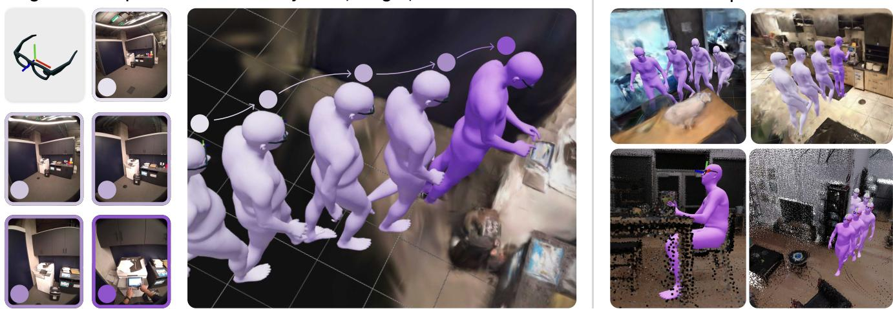
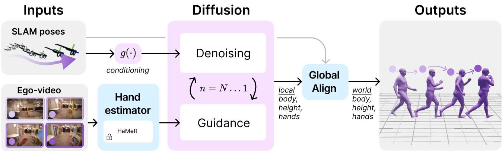
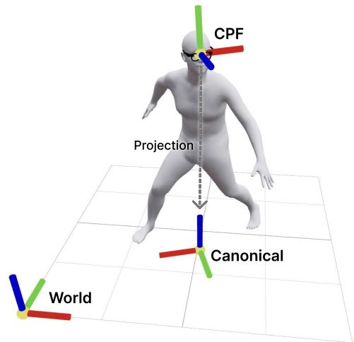
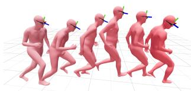
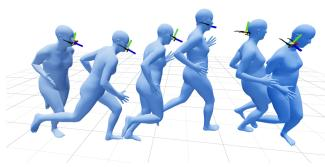
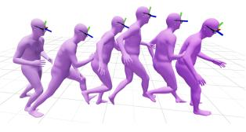
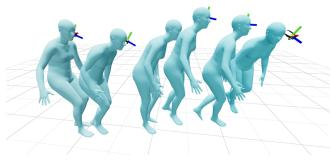
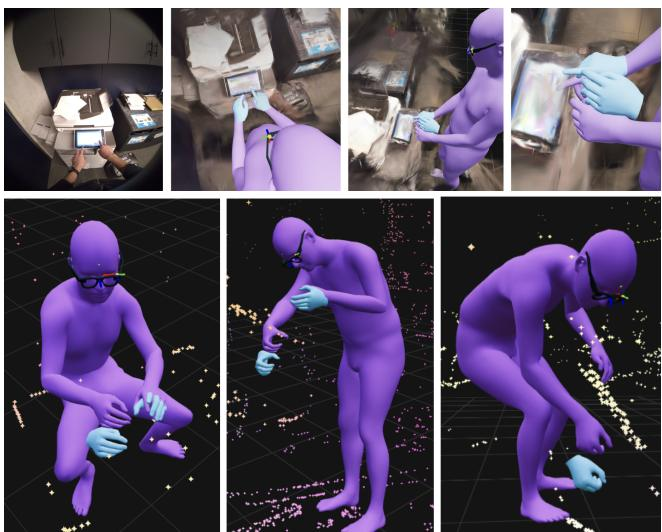

# Estimating Body and Hand Motion in an Ego-sensed World

Brent Yi1 Vickie Ye1 Maya Zheng1 Yunqi Li2 Lea Muller ¨ 1 Georgios Pavlakos3 Yi Ma1 Jitendra Malik1 Angjoo Kanazawa1

1UC Berkeley 2ShanghaiTech 3UT Austin

  
Example Results  
Figure 1. EgoAllo. We present a system that estimates human body pose, height, and hand parameters from egocentric SLAM poses and images. Outputs capture the wearer’s actions in the allocentric reference frame of the scene, which we visualize here with 3D reconstructions.

## Abstract

We present EgoAllo, a systemfor human motion estimation from a head-mounted device. Using only egocentric SLAM poses and images, EgoAllo guides sampling from a conditional diffusion model to estimate 3D body pose, height, and hand parameters that capture a device wearer’s actions in the allocentric coordinate frame of the scene. To achieve this, our key insight is in representation: we propose spatial and temporal invariance criteria for improving model performance, from which we derive a head motion conditioning parameterization that improves estimation by up to 18%. We also show how the bodies estimated by our system can improve hand estimation: the resulting kinematic and temporal constraints can reduce world-frame errors in single-frame estimates by 40%.

## 1. Introduction

Head-mounted devices are becoming increasingly mainstream. In addition to offering new challenges for 3D scene understanding [18, 57, 68, 111], egocentric sensors from these devices are unique in that their outputs are coupled to a human wearer’s motion in the world. Using these sensors to understand the wearer in addition to the scene around them is essential for applications in augmented reality, robotics, and assistive technologies.

We therefore introduce EgoAllo, a system that uses egocentric inputs to estimate the wearer and their motion in the world, or allocentric, coordinate frame. We take as input sensed metric SLAM head poses and egocentric video from devices like Project Aria [61]. We then output estimates of human body pose, height, and hand motion parameters.

This is a difficult task: while body parts like hands occasionally appear in egocentric frames, most body parameters are never directly observed. Estimated body pose, body height, and hand parameters must be consistent with both the sensed egomotion and visual observations. This setting differs from most prior works in egocentric human motion estimation [7, 48], which focus on body pose and do not address the challenges of height and hand motion.

Our proposed system uses a head pose-conditioned diffusion model as a motion prior, as well as a Levenberg-Marquardt guidance optimizer for sampling hand-body sequence that align with image observations. Our results are enabled by a key insight: that the representation used for head pose conditioning is critical for accurate full-body motion estimation. We study choices for this representation by (1) identifying desirable spatial and temporal invariance properties that are not fulfilled by existing systems and (2) using these properties to derive improved parameterizations for our motion prior.

We systematically evaluate our system on four datasets. For body estimation, we find that improving the conditioning parameterization leads to an accuracy improvement between 4.9% and 17.9%. Furthermore, we observe that the resulting system can improve hand estimation, reducing world-frame errors by over 40% compared to single-frame estimates. Code, model, and more results can be found on our project webpage.

## 2. Related Work

3D human recovery from external visual inputs. A large body of work has addressed estimating the parameters of human body models like SCAPE [2] or SMPL and its variants [52, 63, 79] from third-person visual inputs, where human subjects are observed from the view of outside cameras. The majority of these works focus on extracting 3D representations from single images, for example by lifting 2D keypoint observations to 3D [58], via end-to-end regression [20, 31, 33, 40, 60, 62, 77], via optimization [19, 44, 63], or by exploiting synergies between regression and optimization [42]. When multiple frames are available in the form of a video, temporal context and tracking can also be incorporated [16, 34, 39, 64, 65, 71, 108]. The inputs (images) and outputs (human meshes) of many of these systems are similar to the egocentric setting addressed by EgoAllo, but egocentric devices present unique challenges because the body being estimated is typically behind the outwards-facing cameras used as input.

Priors for human motion. The primary challenge of egosensed human motion estimation is limited observability; a prior is required to resolve ambiguities. For human motion, these priors are typically framed as unconditional distributions over plausible human motion. Distributions can be represented either by modeling the physical constraints of our world [6, 50, 67, 73] or by learning generative models of human motion directly from data. For learning unconditional priors, classical data-driven approaches include fitting mixtures-of-Gaussians to 3D keypoint trajectories [25], while modern approaches include training variational autoencoders [38, 75] to model either autoregressive transitions [15, 51, 74] or full spatiotemporal sequences [22]. After training, these priors can be applied to estimation problems in iterative optimization frameworks [41, 74, 102]. EgoAllo is built on the same intuition as these methods, but follows previous work in ego-sensed motion estimation and uses a task-specific conditional prior.

Denoising diffusion for human motion. The core of EgoAllo is a denoising diffusion model [23, 69, 84] from which we can sample 3D human body motion. While diffusion models are primarily known for their success in text-conditioned image generation [78, 80], they have also enabled advances in human motion synthesis conditioned on modalities like text [35, 36, 112], music [1, 93], poses [35, 48], and object geometry [43, 47, 49]. EgoAllo adopts a similar conditional diffusion approach, while specifically studying the design of conditioning parameters used for ego-sensed human motion estimation. The iterative nature of denoising diffusion also enables guidance [11, 13, 30, 35, 87, 114], where denoising steps are steered to satisfy a desired objective. We use guidance to incorporate observations like visual hand pose observations during test-time.

Human motion from egocentric observations. EgoAllo builds on intuition from several prior works in egocentric sensing for human motion estimation. Many rely on fisheye cameras that place the wearer’s body into the field of view [27, 76, 91, 91, 92, 95, 96, 98]. Other approaches rely on body-mounted cameras [83], simulation-based physica plausibility [54, 106, 107], body- and hand-mounted inertial sensors [37, 46, 104, 105], handheld controllers [7, 28, 29], and interaction cues from other humans [59]. Concurrent works have also used the Nymeria [55] dataset for egocentric motion with language description outputs [24], as well for online settings with scene geometry and CLIP [70] feature inputs [21]. Most relevantly, EgoEgo [48] demonstrates how human body poses can be estimated offline without body observability assumptions. The authors accomplish this by carefully integrating several components: a monocular SLAM system [89], a pose-conditioned gravity vector regression network, an optical flow feature-conditioned head orientation and scale regression network, and a head pose-conditioned body diffusion model. EgoAllo differs in both inputs—we study conditioning parameters computed from the metric SLAM poses provided by devices like Project Aria [85]—and outputs—we consider body height variation and hand poses.

Conditioning for ego-sensed poses. Prior works vary in how head pose information is parameterized and used as neural network input. AvatarPoser [28] and BoDiffusion [7] parameterize head pose as four components: world-frame orientation, orientation deltas, world-frame position, and world-frame position deltas. These works focus on settings with VR controller input, and parameterize controller pose inputs the same way. EgoEgo [48]’s diffusion model uses only absolute head positions and orientations, but similar to HuMoR [74], in implementation defines a per-sequence canonical coordinate frame to ensure that all input trajectories passed to the model are aligned with the same initial xy position and forward direction. In our work, we refer to this as sequence canonicalization. Finally, EgoPoser [29] proposes a similar scheme that aligns initial positions for both head pose and controller pose inputs. We propose an alternative to these parameterizations that is motivated by the robustness and generalization benefits of invariance, as observed in prior work for designing both representations [10, 53, 81, 97, 103, 110, 115] and neural network architectures [8, 9, 12, 14, 32, 45, 90, 100, 101, 109]. Specifically, we introduce in Section 3.1.2 a parameterization that is invariant to both spatial and temporal shifts.

  
Figure 2. Overview of components in EgoAllo. We restrict the diffusion model to local body parameters (Section 3.1.1). An invariant parameterization g(·) (Section 3.1.2) of SLAM poses is used to condition a diffusion model. These can be placed into the global coordinate frame via global alignment (Section 3.2.1) to input poses. When available, egocentric video is used for hand detection via HaMeR [66], which can be incorporated into samples via guidance (Section 3.2.2).

## 3. Method

We study the problem of using sensors from an egocentric device to estimate the actions of the wearer in an allocentric coordinate frame. We assume a flat floor and two inputs: poses from the device’s SLAM system and egocentric video.

Our system uses head pose information to condition a diffusion-based prior over body pose and height, and incorporates visual hand observations during sampling. This allows it to benefit from both 3D human motion capture datasets [56], which are used for the motion prior, and from large-scale image datasets [66], which are used for hand estimates.

## 3.1. Ego-conditioned motion diffusion

Notation: we use $\mathbf { T } _ { \mathrm { A , B } } { = } ( \mathbf { R } _ { \mathrm { A , B } } { , } \mathbf { p } _ { \mathrm { A , B } } )$ to denote an SE(3) transform to frame A from frame B, composed of rotation $( \mathbf { R } _ { \mathbf { A } , \mathbf { B } } )$ and position $( \mathbf { p } _ { \mathbf { A } , \mathbf { B } } )$ terms. Temporal steps t are superscripted and diffusion noise steps n are subscripted. $\vec { x } _ { 0 } ^ { t }$ thus refers to the t-th timestep of a clean $( n { = } 0 )$ human motion sequence.

Given an observation window of $T$ timesteps, EgoAllo’s motion prior is a diffusion model that aims to capture the distribution of human motions $\vec { x } _ { 0 } = \{ \vec { x } _ { 0 } ^ { 1 } , . . . , \vec { x } _ { 0 } ^ { T } \}$ conditioned on head pose encodings $\vec { c } = \{ \vec { c } ^ { 1 } , . . . , \vec { c } ^ { T } \}$ . For each timestep t, we represent human motion in the form of SMPL-H [52, 79] model parameters $\{ \mathbf { T } _ { \mathrm { w o r l d , r o o t } } ^ { t } , \ \Theta ^ { t } , \ \beta \}$ : root transforms $\mathbf { T } _ { \mathrm { w o r l d , r o o t } } ^ { t } \in \mathrm { S E } ( 3 )$ , where the person’s root frame is located at their pelvis, local joint rotation matrices $\Theta ^ { t } \in \mathbb { R } ^ { 5 1 \times 3 \times 3 }$ , and time-invariant shape $\beta \in \mathbb { R } ^ { 1 6 }$

Dependencies between local joint rotations, body size variation, and global motion make this learning task a challenging one. Our key insight is that this difficulty can be reduced by designing parameterizations with desirable invariance properties. Spatial and temporal invariances allow the model to focus on the essential structure of motion, without being affected by irrelevant shifts in position or time.

## 3.1.1. Diffusion output representation

As output, we sample body and hand joint rotations, body shapes, and binary contact predictions $\vec { x } _ { 0 } ^ { t } = \{ \Theta ^ { t } , \beta ^ { t } , \psi _ { j = 1 \ldots 2 1 } ^ { t } \}$ where body shape $\beta ^ { t }$ is supervised to be equal for all timesteps and $\psi _ { j } ^ { t }$ is a per-joint contact indicator. Notably, these parameters are all local—we discuss how outputs can be placed into the allocentric coordinate frame in Section 3.2.1.

We choose this output set for three main reasons. (1) Body shape encodes the wearer’s height, which is critical for grounding in the metric-scale geometry of the scene. This is rarely considered by prior work: with the exception of [29], existing methods [7, 28, 48] otherwise produce outputs using a fixed “mean” human shape. (2) Contact predictions enable losses for common problems like foot skating, which are discussed in Section 3.2.2. (3) Finally, local bodies are invariant to the global coordinate frame. As we discuss next, the conditioning parameterization for the model can therefore also be invariant to arbitrary transformations along the floor plane.

## 3.1.2. Invariant conditioning

The goal of our conditioning representation is to map raw SLAM poses (head motion) to a parameterization that is amenable to learning for the diffusion model.

Raw inputs. To capture the head motion at each time step, we assume as input poses of a central pupil frame (CPF), which the SLAM systems of devices like Project Aria can provide with millimeter-level accuracy [85]. For time 1...T, we reparameterize these poses for conditioning using a function $g \colon$

$$
\mathbf { T } _ { \mathrm { w o r l d , c p f } } ^ { t } = ( \mathbf { R } _ { \mathrm { w o r l d , c p f } } ^ { t } , \mathbf { p } _ { \mathrm { w o r l d , c p f } } ^ { t } ) \in \mathrm { S E } ( 3 ) ,\tag{1}
$$

$$
\{ \vec { c } ^ { 1 } , . . . , \vec { c } ^ { T } \} { = } g ( \{ \mathbf { T } _ { \mathrm { w o r l d , c p f } } ^ { 1 } , . . . , \mathbf { T } _ { \mathrm { w o r l d , c p f } } ^ { T } \} ) .\tag{2}
$$

The CPF frame differs from prior works that condition on a coordinate frame attached to the SMPL human model’s “head joint” [7, 28, 29, 48]. The offset between this head joint and the device pose depends on the head shape captured by $\beta ^ { t }$ , and is thus difficult to precompute in our setting.

To encode absolute height, we assume that the world frame’s +z-axis faces upwards, and that the ground is located at $z = 0$ . Ground parameters are directly available in the training data [56]; at test time, we can also extract these parameters from sparse SLAM points via RANSAC (Appendix A.3.5).

Invariance goals. As discussed in Section 2, prior work varies in how the function $g$ is implemented. To understand how choices impact learning, we propose two invariance properties for head motion representations. Each reduces representational redundancy, which eases the learning problem. We provide more detailed explanations and visualizations of these properties in Appendix A.1.

Invariance 1 (Spatial) Global transformations along the floor plane should not affect a person’s local motion. Given $\mathbf { T } _ { x y } ~ \in ~ S E ( 3 )$ restricted to the XY plane, g should fulfill $\begin{array} { r } { g ( \{ \mathbf { T } _ { \boldsymbol { x } \boldsymbol { y } } \mathbf { T } _ { w o r l d , c p f } ^ { t } \} _ { t } ) = g ( \{ \mathbf { T } _ { w o r l d , c p f } ^ { t } \} _ { t } ) \forall \mathbf { T } _ { \boldsymbol { x } \boldsymbol { y } } . } \end{array}$

Invariance 2 (Temporal) Ifthe same human motion occurs at differentpoints in time, the extracted head motion representation should remain consistent. This can be expressed as temporal shift equivariance. Let $\vec { c } ^ { t }$ be as defined in Equation 2. For any shift δ such that $\{ \vec { c } _ { s h i f t } ^ { 1 } , \ldots , \vec { c } _ { s h i f t } ^ { T } \} \breve { = } g ( \{ \mathbf { T } _ { w o r l d , c p f } ^ { 1 + \delta } , \ldots , \mathbf { T } _ { w o r l d , c p f } ^ { T + \delta } \} )$ g should satisfy $\vec { c } _ { s h i f t } ^ { t } = \vec { c } ^ { t + \delta }$ for overlapping timesteps.

No parameterization used by existing work satisifies both of these properties. The sequence canonicalization approach of EgoEgo [48] achieves spatial invariance (Invariance 1), but inserts a sequence-wide dependency on the first timestep of each window that results in a violation of Invariance 2. The absolute poses and pose deltas used by [7, 28] satisfy Invariance 2, but not Invariance 1. Finally, the relative positions considered by [29] are neither spatially nor temporally invariant.

Invariant conditioning. We propose a formulation for g that achieves both invariance properties by locally canonicalizing head motion with respect to the floor at each timestep. We build on the relative motion of the CPF frame at each time $t ,$ which respects both Invariance 1 and 2:

$$
\begin{array} { r } { \Delta \mathbf { T } _ { \mathrm { c p f } } ^ { t - 1 , t } { = } ( \mathbf { T } _ { \mathrm { w o r l d , c p f } } ^ { t - 1 } ) ^ { - 1 } \mathbf { T } _ { \mathrm { w o r l d , c p f } } ^ { t } . } \end{array}\tag{3}
$$

Importantly, the translation component of this transformation is in the local frame. This is distinct from world-frame position deltas [7, 28, 29], which still violate Invariance 1.

  
Figure 3. Locally canonicalized coordinate frames. We compute our invariant conditioning parameterization (Equation 4) using transformations computed from three coordinate frames. Following [85], the CPF has the z-axis forward. Following HuMoR [74], the world and canonical z-axes point up. Canonical frames are computed by projecting the CPF frame origin to the ground plane, then aligning the canonical y-axis to the CPF forward direction. The axes are color-coded as x (red), y (green), and z (blue).

Relative transforms alone do not encode information relative to the scene or floor: full trajectories can even be flipped upside down without impacting $\Delta \mathbf { T } _ { \mathrm { c p f } } ^ { t - 1 , t }$ . We therefore propose to ground relative motion to the floor plane with a transformation between the CPF frame and a per-timestep canonical frame, which is computed by projecting the CPF frame to the floor. This encodes head height and orientation. Our full representation then becomes:

$$
\begin{array} { r l } & { \vec { c } ^ { t } = \underbrace { \left\{ \Delta \mathbf { T } _ { \mathrm { c p f } } ^ { t - 1 , t } , \quad \left( \mathbf { T } _ { \mathrm { w o r l d , c a n o n i c a l } } ^ { t } \right) ^ { - 1 } \mathbf { T } _ { \mathrm { w o r l d , c p f } } ^ { t } \right\} } _ { \mathrm { I n v a r i a n t i m p l e m e n t a t i o n ~ o f ~ } g ( \cdot ) } . } \end{array}\tag{4}
$$

We visualize an example of a canonical frame in Figure 3 and our full representation in Appendix A.1. Canonical frames are positioned by projecting the CPF origin to the floor plane; given standard bases $\mathbf { e } _ { \{ x , y , z \} }$ , we compute:

$$
\mathbf { p } _ { \mathrm { w o r l d , c a n o n i c a l } } ^ { t } { = } \left[ \mathbf { e } _ { x } \quad \mathbf { e } _ { y } \quad \vec { 0 } \right] ^ { \top } \mathbf { p } _ { \mathrm { w o r l d , c p f } } ^ { t } .\tag{5}
$$

For orientation, we align the canonical frame’s local z-axis parallel to the world z-axis and its local y-axis toward the “forward” direction $\vec { v } ^ { t }$ of the CPF frame. With $ { \mathbf { R } } _ { z } ( \cdot ) : \mathbb { R } \to \mathrm { S O ( 3 ) }$ constructing a z-axis rotation and $\mathbf { e } _ { \{ x , y , z \} }$ again as standard bases, we compute this as:

$$
\vec { v } ^ { t } { = } \mathbf { R } _ { \mathrm { w o r l d , c p f } } ^ { t } \mathbf { e } _ { z } ,\tag{6}
$$

$$
\mathbf R _ { \mathrm { w o r l d , c a n o n i c a l } } ^ { t } = \mathbf R _ { z } \left( - \mathrm { a r c t a n 2 } \left( \mathbf e _ { x } ^ { \top } \vec { v } ^ { \ t } , \mathbf e _ { y } ^ { \top } \vec { v } ^ { \ t } \right) \right) .\tag{7}
$$

This canonical frame definition is an important departure from prior work. While EgoEgo [48] and HuMoR [74] use similar canonical frames, they only compute one per sequence. Instead, we compute Equations 5 and 7 at every timestep. This enables floor plane grounding without sacrificing Invariance 2.

Connection to prior work. EgoAllo’s invariant conditioning shares similarities with the spatial and temporal normalization proposed by EgoPoser [29]. (1) EgoPoser’s temporal normalization subtracts positions by the first timestep’s position. This is a position-only version EgoEgo [48]’s sequence canonicalization. It does not consider rotation, and therefore only partially fulfills Invariance 1. Like EgoEgo, it also does not fulfill Invariance 2. In Appendix A.2.3, we observe that this approach only has a small impact when adapted to EgoAllo’s problem setting. (2) EgoPoser’s spatial normalization subtracts the head’s XY position from the hand pose inputs. EgoAllo does not use hand pose as network input, so this is not applicable in our setting.

## 3.2. Estimation via sampling

We use our local body representation and invariant conditioning strategies to train a motion prior in the form of a denoising diffusion model [23]. Given diffusion step $n = N \ldots 1$ , we follow [72] and approximate the denoising process as:

$$
p _ { \theta } ( \vec { x } _ { n - 1 } | \vec { x } _ { n } , \vec { c } ) { = } \mathcal { N } ( \mu _ { \theta } ( \vec { x } _ { n } , n , \vec { c } ) , \sigma _ { n } ^ { 2 } \mathbf { I } ) ,\tag{8}
$$

where a transformer [94] $\mu _ { \theta }$ is trained to predict the posterior mean from noised sample ${ \vec { x } } _ { n }$ and conditioning ⃗c. With noise-dependent weight term $w _ { n } ,$ , the loss can be written as:

$$
\operatorname* { m i n } _ { \theta } \ \mathbb { E } _ { \vec { x } _ { 0 } } \mathbb { E } _ { n \sim \mathcal { U } } \big [ w _ { n } \big \| \mu _ { \theta } ( \vec { x } _ { n } , n , \vec { c } ) - \vec { x } _ { 0 } \big \| ^ { 2 } \big ] .\tag{9}
$$

After training, we estimate human motions by following DDIM [86] for sampling. The final EgoAllo sampling procedure includes several additional components: a global alignment phase, guidance losses for physical constraints and visual hand observations, and a path fusion [3] approach for longer sequence lengths. We describe these below.

## 3.2.1. Global alignment

To place sampled bodies into the allocentric coordinate system, we compute the absolute pose of the SMPL-H root as:

$$
\begin{array} { r } { \mathbf { T } _ { \mathrm { w o r l d , r o o t } } ^ { t } \mathrm { = } \mathbf { T } _ { \mathrm { w o r l d , c p f } } ^ { t } \mathbf { T } _ { \mathrm { c p f , r o o t } } ^ { ( \Theta ^ { t } , \beta ^ { t } ) } , } \end{array}\tag{10}
$$

where $\mathbf { T } _ { \mathrm { c p f , r o o t } } ^ { ( \Theta ^ { t } , \beta ^ { t } ) }$ computes the transform between the root of the human and their CPF frame for a given set of local pose and shape parameters. Similar processes are applied in [7, 28, 29]. In contrast to directly outputting absolute body transformations from the diffusion model [48], this guarantees exact alignment between estimates and input SLAM sequences.

## 3.2.2. Guidance losses

Our diffusion model learns a distribution of human motion conditioned on the central pupil frame motion. At test time, we incorporate constraints from physical priors and visual hand observations via guidance [11, 30, 114]. Similar to [35, 47], we accomplish this by applying costs to the joint rotations $\Theta = \{ \Theta ^ { 1 } , \bar { \ldots } , \Theta ^ { T } \}$ predicted by $\mu _ { \boldsymbol { \theta } } ( \vec { x } _ { n } , n , \vec { c } )$ . We treat the body shape $\beta ^ { t }$ and contacts $\boldsymbol { \psi } _ { j = 1 \dots 2 1 } ^ { t }$ as fixed and optimize over body and finger pose to minimize hand observation, skating, and prior costs with a Levenberg-Marquardt optimizer:

$$
\mathcal { E } _ { \mathrm { g u i d a n c e } } ^ { ( \Theta ) } { = } \mathcal { E } _ { \mathrm { h a n d s } } ^ { ( \Theta ) } { + } \mathcal { E } _ { \mathrm { s k a t e } } ^ { ( \Theta ) } { + } \mathcal { E } _ { \mathrm { p r i o r } } ^ { ( \Theta ) } .\tag{11}
$$

We begin by running HaMeR on the egocentric image corresponding to each timestep t. When detected, this produces 3D hand estimates in the form of MANO [79] joint parameters and camera-centric 3D hand keypoints $\hat { \mathbf { p } } _ { \mathrm { c a m e r a , j } } ^ { t }$ for hand joint set $j \in \mathcal H$ . Optionally, wrist and palm poses can also be estimated using Project Aria’s Machine Perception Services [85]. With each subcripted λ indicating a scalar weighting term, we have:

$$
\begin{array} { r } { \mathcal { E } _ { \mathrm { h a n d s } } ^ { ( \Theta ) } = \lambda _ { \mathrm { h a n d s 3 D } } \mathcal { E } _ { \mathrm { h a n d s 3 D } } ^ { ( \Theta ) } + \lambda _ { \mathrm { r e p r o j } } \mathcal { E } _ { \mathrm { r e p r o j } } ^ { ( \Theta ) } . } \end{array}\tag{12}
$$

The 3D objective $\mathcal { E } _ { \mathrm { h a n d s 3 D } } ^ { ( \Theta ) }$ minimizes the distance between the detected hand parameters and the corresponding SMPL-H hand parameters, in terms of wrist pose and local joint rotations. With $\Pi _ { K }$ as projection with camera intrinsics $K , \mathbf { p } _ { w o r l d , j } ^ { ( \Theta ^ { t } ) } \in \mathbb { R } ^ { 3 }$ as the world position for joint j at time t, and Tcamera,cpf from the device calibration, the reprojection cost is:

$$
\mathcal { E } _ { \mathrm { r e p r o j } } ^ { ( \Theta ) } { = } \sum _ { t , j \in \mathcal { H } } ^ { } | | \Pi _ { K } ( \mathbf { p } _ { \mathrm { c a m e r a } , j } ^ { ( \Theta ^ { t } ) } ) { - } \Pi _ { K } ( \hat { \mathbf { p } } _ { \mathrm { c a m e r a } , j } ^ { t } ) | | _ { 2 } ^ { 2 } ,\tag{13}
$$

$$
\mathbf { p } _ { \mathrm { c a m e r a } , j } ^ { ( \Theta ^ { t } ) } { = } \mathbf { T } _ { \mathrm { c a m e r a , c p f } } \big ( \mathbf { T } _ { \mathrm { w o r l d , c p f } } ^ { t } \big ) ^ { - 1 } \mathbf { p } _ { \mathrm { w o r l d } , j } ^ { ( \Theta ^ { t } ) } .\tag{14}
$$

To reduce foot skating, we use contact predictions to apply a skating cost [74, 102] for each time t and joint j:

$$
\mathcal { E } _ { \mathrm { s k a t e } } ^ { ( \Theta ) } = \sum _ { t , j } \lambda _ { \mathrm { s k a t e } } | | \frac { 1 } { 2 } ( \psi _ { j } ^ { t } + \psi _ { j } ^ { t - 1 } ) ( \mathbf { p } _ { w o r l d , j } ^ { t } - \mathbf { p } _ { w o r l d , j } ^ { t - 1 } ) | | _ { 2 } ^ { 2 } .\tag{15}
$$

Finally, we minimize a prior cost $\mathcal { E } _ { \mathrm { p r i o r } } ^ { ( \Theta ) }$ . This cost penalizes deviations between joint rotations $\Theta ^ { t }$ and rotations $\hat { \Theta } ^ { t }$ from the denoiser $\mu _ { \theta } ( \vec { x } _ { n } , n , \vec { c } )$ , while also encouraging smoothness. We detail the full list of terms used for this in Appendix A.3.4.

## 3.2.3. Sequence length extrapolation

For longer sequences at test time, we draw on existing methods in compositional generation for both image [3, 113] and human motion [4, 82] diffusion models. We train our motion prior using subsequences of up to length 128; when input observations exceed this length at test time, we split into windows with a 32-timestep overlap between neighbors. We then run our model $\mu _ { \boldsymbol { \theta } } ( \vec { x } _ { n } , \vec { c } , n )$ on windows in parallel. Diffusion paths for overlapping regions are fused following MultiDiffusion [3] after each denoising step.

## 4. Experiments

We conduct a series of experiments to evaluate EgoAllo’s conditioning parameterization, body estimation accuracy, and hand estimation performance.

<table><tr><td>Conditioning</td><td>Seqlen</td><td colspan="3">Invariance 1 / 2</td><td colspan="2">MPJPE↓ % Diff</td><td>PA-MPJPE↓</td><td>% Diff</td><td>GND↑</td></tr><tr><td>EgoAllo (Eq.4)</td><td>32</td><td></td><td></td><td></td><td> $1 2 9 . 8 { \pm } 1 . 1 $ </td><td></td><td> $1 0 9 . 8 { \pm } 1 . 1 $ </td><td></td><td> $0 . 9 8 { \scriptstyle \pm 0 . 0 0 }$ </td></tr><tr><td>Absolute+Local Relative</td><td>32</td><td>P</td><td></td><td></td><td> $1 3 3 . 0 { \pm } 1 . 1$ </td><td>2.4%</td><td> $1 1 3 . 6 { \pm } 1 . 2$ </td><td>3.4%</td><td> $0 . 9 5 { \scriptstyle \pm 0 . 0 0 }$ </td></tr><tr><td>Absolute+Global Deltas [7,28]</td><td>32</td><td>x</td><td></td><td></td><td> $1 3 6 . 2 { \pm } 1 . 1 $ </td><td>4.9%</td><td> $1 1 8 . 3 { \pm } 1 . 2 $ </td><td>7.7%</td><td> $0 . 9 3 { \scriptstyle \pm 0 . 0 1 }$ </td></tr><tr><td>Sequence Canonicalization [48]</td><td>32</td><td></td><td></td><td>X</td><td> $1 5 3 . 1 { \pm } 1 . 5 $ </td><td>17.9%</td><td> $1 2 8 . 7 \pm 1 . 5$ </td><td>17.1%</td><td> $0 . 7 6 { \scriptstyle \pm 0 . 0 1 }$ </td></tr><tr><td>Absolute</td><td>32</td><td>X</td><td></td><td></td><td> $1 5 9 . 9 2 \substack { 1 . 2 }$ </td><td>23.2%</td><td> $1 4 1 . 0 { \pm } 1 . 3 $ </td><td>28.4%</td><td> $0 . 8 9 { \scriptstyle \pm 0 . 0 1 }$ </td></tr><tr><td>EgoAllo (Eq.4)</td><td>128</td><td></td><td></td><td></td><td> $1 1 9 . 7 { \pm } 1 . 3 $ </td><td></td><td> $1 0 1 . 1 { \pm } 1 . 3 $ </td><td></td><td>1.00±0.00</td></tr><tr><td>Absolute+Local Relative</td><td>128</td><td>P</td><td></td><td></td><td> $1 2 4 . 5 { \pm } 1 . 3 $ </td><td>4.0%</td><td> $1 0 4 . 9 { \pm } 1 . 4 $ </td><td>3.8%</td><td>1.00±0.00</td></tr><tr><td>Absolute+Global Deltas [7,28]</td><td>128</td><td>X</td><td></td><td></td><td> $1 2 7 . 4 { \pm } 1 . 3 $ </td><td>6.4%</td><td> $1 0 9 . 8 { \pm } 1 . 4 $ </td><td>8.6%</td><td>0.99±0.00</td></tr><tr><td>Sequence Canonicalization [48]</td><td>128</td><td></td><td></td><td>X</td><td> $1 3 4 . 0 { \pm } 1 . 8 $ </td><td>11.9%</td><td> $1 1 2 . 1 { \pm } 1 . 6 $ </td><td>10.9%</td><td> $0 . 8 8 { \scriptstyle \pm 0 . 0 2 }$ </td></tr><tr><td>Absolute</td><td>128</td><td>x</td><td></td><td></td><td> $1 4 8 . 3 { \pm } 1 . 5$ </td><td>23.9%</td><td> $1 3 1 . 2 { \pm } 1 . 6 $ </td><td>29.8%</td><td> $0 . 9 6 { \scriptstyle \pm 0 . 0 1 }$ </td></tr></table>

Table 1. Motion prior conditioning comparison. We train and evaluate otherwise identical models using four conditioning parameterizations on AMASS [56] test set sequences, using sequences of length 32 and 128. Parameterizations vary in their spatial (1) and temporal (2) invariance properties, which we loosely classify as following completely $( \pmb { \nu } )$ , partially ( P ), or not at all ( ✗ ). The conditioning parameterization used by EgoAllo reduces errors by almost 18% compared to the sequence canonicalization approach used by the most relevant related work [48].

Training. To train EgoAllo models used in our experiments, we need sequences containing human body and hand pose parameters, body shapes, and device SLAM poses $\mathrm { \bf T } _ { \mathrm { w o r l d , c p f } } ^ { t } .$ Similar to prior work [7, 28, 48], we train EgoAllo using AMASS [56] with synthesized device poses. We annotate train split sequences by anchoring a central pupil frame between vertices corresponding to the left and right pupils in the blend skinned mesh, and at train time sample sequences between length 32 and 128.

Evaluation. We evaluate with four datasets. We use AMASS [56], RICH [26], and Aria Digital Twins (ADT) [61] for body estimation evaluation, and EgoExo4D [17] for hand estimation evaluation. AMASS and RICH do not include egocentric data; we annotate these with synthetic device poses using the same procedure we use for training. ADT and EgoExo4D both include egocentric images and SLAM poses captured using Project Aria glasses [85], which we use directly.

Metrics. To quantify performance, we report four metrics: (1) MPJPE is a world-frame mean per-joint position error (millimeters). (2) PA-MPJPE is the Procrustes-aligned mean per-joint position error in millimeters, where joint positions are aligned on a per-timestep basis before error are computed. (3) GND is a grounding metric, designed in response to a phenomena where ego-sensed humans “float” above the ground. Given a human body trajectory, this metric contains a simple binary indicator of whether the feet of the human ever touch the ground plane. (4) $\mathbf { T } _ { \mathrm { h e a d } }$ is the average SMPL head joint position error in millimeters.

## 4.1. Body estimation

In our first set of experiments, we evaluate body estimation from only device SLAM poses, without considering images or hands. This setting allows us to isolate the advantages of our body motion prior, while directly comparing against methods that do not consider hands.

## 4.1.1. Invariant conditioning evaluation

We begin by evaluating the importance of the spatial and temporal invariance criteria discussed in Section 3.1.2. We do this by comparing five implementations of the conditioning g: (1) EgoAllo is the final invariant representation that we propose in Equation 4. (2) Absolute+Local Relative appends absolute poses with the relative pose deltas written in Equation 3. (3) Absolute+Global Deltas appends absolute poses with relative orientation and the world-frame position deltas used by [7, 28]. (4) Sequence Canonicalization uses the alignment approach implemented by [48], which violates temporal invariance. (5) Absolute naively conditions on absolute poses, which violate spatial invariance.

We train conditional diffusion models with otherwise identical architecture using each parameterization, and then evaluate on the AMASS [56] test set. Metrics and percent differences compared to EgoAllo are reported in Table 1.

Overall, we find that the choice of conditioning parameterization makes a dramatic impact on estimation accuracy. We observe accuracy improve consistently as invariance properties are incorporated into the representation. Compared to EgoAllo, Absolute conditioning increases MPJPE by over 23% for both shorter (length 32) and longer (length 128) sequences. Compared to EgoAllo, SeqCanonical conditioning increases MPJPE by nearly 18% for length 32 sequences and 12% for length 128 sequences.

## 4.1.2. Comparisons against baselines

To further study EgoAllo’s body estimation quality, we compare against three baselines. (1) NoShape. First, NoShape refers to a variation of EgoAllo that turns off shape estimation, and thus cannot estimate the wearer’s height. (2) EgoEgo. We also compare against the human motion diffusion model from EgoEgo [48]. This is similar to EgoAllo, but considers only the SMPL “mean” body shape and uses sequence canonicalized coordinates for conditioning and as model output. (3) VAE+Opt.

(a) Ground-truth
<table><tr><td colspan="6">AMASS [56]</td></tr><tr><td>Method</td><td>Seq</td><td>MPJPE↓</td><td>PA-MPJPE↓</td><td>GND↑</td><td>Thead ↓</td></tr><tr><td>EgoAllo</td><td>32</td><td>129.8±1.1</td><td>109.8±1.1</td><td>0.98±0.00</td><td>6.4±0.1</td></tr><tr><td>NoShape</td><td>32</td><td>138.1±1.1</td><td>118.8±1.1</td><td>0.94±0.01</td><td>44.7±0.4</td></tr><tr><td>EgoEgo</td><td>32</td><td>184.0±1.5</td><td>158.6±1.6</td><td>0.81±0.01</td><td>45.2±1.0</td></tr><tr><td>VAE+Opt</td><td>32</td><td>199.5±1.3</td><td>191.4±1.4</td><td>0.49±0.01</td><td>78.0±1.5</td></tr><tr><td>EgoAllo</td><td>128</td><td>119.7±1.3</td><td>101.1±1.3</td><td>1.0±0.00</td><td>6.2±0.1</td></tr><tr><td>NoShape</td><td>128</td><td>128.1±1.3</td><td>110.3±1.4</td><td>0.98±0.01</td><td>44.6±0.7</td></tr><tr><td>EgoEgo</td><td>128</td><td>167.4±2.1</td><td>145.8±2.0</td><td>0.92±0.01</td><td>54.9±1.9</td></tr><tr><td>VAE+Opt</td><td>128</td><td>205.3±2.6</td><td>192.3±2.8</td><td>0.75±0.02</td><td>67.8±3.1</td></tr><tr><td colspan="6">RICH [26]</td></tr><tr><td>Method</td><td>Seq</td><td>MPJPE↓</td><td>PA-MPJPE↓</td><td>GND↑</td><td> $\mathbf { T } _ { \mathrm { h e a d } } \downarrow$ </td></tr><tr><td>EgoAllo</td><td>32</td><td>193.7±3.4</td><td>174.8±3.6</td><td>0.95±0.01</td><td>8.8±0.2</td></tr><tr><td>NoShape</td><td>32</td><td>200.9±3.3</td><td>183.3±3.6</td><td>0.73±0.02</td><td>44.9±0.9</td></tr><tr><td>EgoEgo</td><td>32</td><td>215.4±3.9</td><td>192.9±4.0</td><td>0.73±0.02</td><td>56.2±2.9</td></tr><tr><td>VAE+Opt</td><td>32</td><td>352.0±6.7</td><td>354.8±6.5</td><td> $0 . 5 9 2 0 . 0 2$ </td><td> $3 1 9 . 3 { \pm } 1 1 . 6 $ </td></tr><tr><td>EgoAllo</td><td>128</td><td> $1 7 6 . 2 { \pm } 5 . 6 $ </td><td>160.1±5.9</td><td> $0 . 9 6 { \scriptstyle \pm 0 . 0 2 }$ </td><td>8.9±0.3</td></tr><tr><td>NoShape</td><td>128</td><td>185.7±5.5</td><td>169.9±5.8</td><td> $0 . 8 2 { \scriptstyle \pm 0 . 0 3 }$ </td><td>45.8±1.6</td></tr><tr><td>EgoEgo</td><td>128</td><td>207.8±6.9</td><td>187.8±6.8</td><td> $0 . 8 8 { \scriptstyle \pm 0 . 0 3 }$ </td><td> $6 6 . 5 { \scriptstyle \pm 5 . 4 }$ </td></tr><tr><td>VAE+Opt</td><td>128</td><td> $3 1 9 . 8 { \pm } 1 0 . 1$ </td><td> $3 2 3 . 8 { \pm } 1 0 . 5 $ </td><td> $0 . 7 5 { \scriptstyle \pm 0 . 0 4 }$ </td><td>274.4±17.6</td></tr><tr><td colspan="6">Aria Digital Twins [61]</td></tr><tr><td>Method</td><td>Seq</td><td>MPJPE↓</td><td>PA-MPJPE↓</td><td>GND↑</td><td> $\mathbf { T } _ { \mathrm { h e a d } } \downarrow$ </td></tr><tr><td>EgoAllo</td><td>32</td><td> $1 7 3 . 5 { \pm } 1 . 1$ </td><td> $1 4 6 . 1 \pm 1 . 1$ </td><td> $0 . 8 8 { \scriptstyle \pm 0 . 0 1 }$  </td><td></td></tr><tr><td>NoShape</td><td>32</td><td>178.5±1.1</td><td>153.0±1.1</td><td> $0 . 8 9 { \scriptstyle \pm 0 . 0 1 }$ </td><td></td></tr><tr><td>EgoEgo</td><td>32</td><td>212.5±1.4</td><td>181.3±1.6</td><td>0.64±0.01</td><td></td></tr><tr><td>VAE+Opt</td><td>32</td><td> $2 8 4 . 9 { \pm } 1 . 6 $ </td><td>283.9±1.9</td><td>0.63±0.01</td><td></td></tr><tr><td>EgoAllo</td><td>128</td><td>155.1±1.6</td><td>129.3±1.6</td><td>0.94±0.01</td><td>-</td></tr><tr><td>NoShape</td><td>128</td><td>163.7±1.6</td><td>140.0±1.6</td><td>0.96±0.01</td><td></td></tr><tr><td>EgoEgo</td><td>128</td><td>182.6±2.3</td><td>153.9±2.6</td><td>0.73±0.02</td><td>1</td></tr><tr><td>VAE+Opt</td><td>128</td><td> $2 9 0 . 8 \pm 3 . 8$ </td><td> $2 8 2 . 5 { \pm } 4 . 4$ </td><td> $0 . 7 { \pm } 0 . 0 2$ </td><td></td></tr></table>

Table 2. Body estimation performance, compared against a baseline without shape prediction, EgoEgo [48], and VAE+Opt [74, 102]. We exclude the $\mathbf { T } _ { \mathrm { h e a d } }$ metric for ADT because the Biomech57 head joints used by ADT are not directly comparable to the SMPL-H head joints used by our model.

Finally, we compare against an approach based on the SLAHMR [102] framework for human motion estimation from exocentric video. A key advantage of SLAHMR is that it uses an unconditional motion prior [74] in an optimization framework. It can therefore be adapted to new settings without re-training—we keep the same body pose and shape variables as the original pipeline, but replace the exocentric keypoint [71] cost with an egocentric CPF pose alignment cost.

Due to differences in problem formulation, many existing methods for egocentric human motion estimation are difficult to directly compare. This is particularly true when they have different inputs, such as fisheye cameras [91, 95, 96], wristmounted sensors [46], or handheld controller poses [7, 28, 29]. Additionally, prior works like EgoEgo [48] do not incorporate vision inputs for hand estimation. For fairness, we restrict all methods in this section to only CPF or head pose as input.

EgoAllo improves body motion estimates. We report metrics in Table 2 and visualize example outputs in Figure 4. We find that EgoAllo enables significant estimation improvements across all datasets, including accuracy improvements of 20∼30% over EgoEgo for both shorter and longer evaluation sequences. We found shape estimation critical for producing metric-scale, grounded estimates of human body motion, with the head aligned to input SLAM poses and the feet planted on the observed ground plane. This is evident in qualitative results, improved grounding metrics, and in the 6∼7% MPJPE gap between EgoAllo and the NoShape ablation.

(b) EgoAllo  
(c) EgoEgo [48]  
  
(d) VAE+Opt  
Figure 4. Egocentric human motion estimation for a running sequence. We show the ground-truth, an output from EgoAllo, and outputs from two baselines. The glasses CAD model is placed at the conditioning transformation Tworld,cpf.

VAE optimization converges poorly. Optimization-based estimation approaches have been effective for settings with keypoint costs [74, 102], but we found convergence difficult in our less constrained setting. In Table 2, we observe poor generalization: VAE+Opt performs competitively on the AMASS test set, but performance deteriorates dramatically when evaluating on RICH or ADT. VAE+Opt outputs in Figure 4 also look overly smoothed, without the same expressiveness as the conditional predictions of EgoAllo or EgoEgo [48]. This highlights the advantage of using a conditional diffusion model problem for this estimation problem.

Shape estimation evaluation. To better understand the shape estimation characteristics of EgoAllo, we compare against against the “mean” shape used by EgoEgo and the NoShape ablation. On the AMASS test set, we find: EgoAllo slightly improves overall shape (19mm→18mm mean vertex-to-vertex error) and produces much better height (52mm→32mm mean height error), but is not able to generalize in terms of body weight (5kg → 8kg mean weight error). The body shape is inferred from the wearer’s head pose, which intuitively provides strong height constraints but is less correlated with weight. Accurate height is key for proper scene placement, as reflected by both the MPJPE and GND metrics.

## 4.2. Hand estimation

To evaluate hands estimated by EgoAllo, we run HaMeR on the segment of the EgoExo4D [17] validation set that is labeled with 3D hand pose keypoints. We quantitatively compare four hand estimation methods in Table 3. In (1) HaMeR [66], we use HaMeR out-of-the-box on undistorted egocentric RGB images. We do not assume bounding boxes as input; instead, we follow the HaMeR demo code and compute crops using ViTPose [99]. (2) EgoAllo-NoReproj uses all loss terms except for the reprojection loss (Equation 14). Hand guidance is done directly using the 3D wrist poses predicted by HaMeR. (3) EgoAllo-Mono is the same as EgoAllo-NoReproj, but guides hands using the reprojection loss. This accounts for the scale ambiguities that are inherent to the single-frame HaMeR estimates. Finally, we show an extension of our method. (4) EgoAllo-Wrist3D extends EgoAllo-Mono with 3D wrist pose losses from Project Aria’s Machine Perception Services [85]—unlike HaMeR, which assumes monocular input, this is a separate sensing setup that also leverages a pair of SLAM cameras that are unique to Project Aria. For fairness across settings, we compute metrics only on timesteps where HaMeR estimates are available.

Results are provided in Table 3. While HaMeR’s local poses (PA-MPJPE) are slightly better, EgoAllo’s hand-body estimation significantly improves how well hands are estimated in the world coordinate system. Compared to HaMeR, EgoAllo-Mono drops MPJPE from 237.90mm → 131.45mm. Reprojection-based guidance is important: despite using the same inputs, EgoAllo-NoReproj outputs are worse than EgoAllo-Mono in both MPJPE and PA-MPJPE. Finally, incorporating more accurate wrist pose estimates from the extra cameras on Project Aria drops errors 131.45mm→60.08mm. This highlights both room for improvement for EgoAllo and how EgoAllo’s guidance-based formulation makes it easy to extend when more sensors are available.

Qualitatively, we observed that high hand estimation errors in naive monocular estimation with HaMeR are explained by a combination of detection failures and monocular ambiguities. Even when detections succeed, the scale and distance of monocular HaMeR estimates are often incorrect or flicker in between frames. EgoAllo improves on this by applying kinematic constraints and a diffusion-based prior for plausible body motion—we provide examples of HaMeR estimates rendered jointly with EgoAllo outputs in Figure 5.

## 5. Dicussion

Limitations and future work. While the core contributions of EgoAllo are general, the current implementation of our system has a few limitations that we hope to explore in future work. First, diffusion model guidance is a test-time optimization process that depends on hyperparameters and incurs a runtime cost. In the future, it may be possible to bootstrap using outputs from our model to train a feedforward model that avoids this step. Success for hand guidance also still depends on reasonable monocular hand estimates. Errors like left/right flipping or spurious detections can therefore cause estimation failure. Finally, we assume flat floors. This is in part because our training data [56] includes floor planes but no detailed scene geometry. As a result, our method will fail in settings like hills or staircases. In the future, we hope to extend our insights to data with more detailed scene information, which concurrent work has highlighted the usefulness of in informing human body estimation [21].

  
Figure 5. Body estimation improves hand estimation. We show raw outputs from HaMeR [66] in blue and hand-body estimations from EgoAllo in purple. Top: improved scene interaction during touchscreen operation with EgoAllo-Mono. We know a priori that the fingers are contacting the screen in this sequence. Bottom: qualitative examples from EgoExo [17] evaluation, showing the differences between monocular hands and EgoAllo-Wrist3D estimates.

<table><tr><td rowspan=1 colspan=3>Method              MPJPE↓  PA-MPJPE↓</td></tr><tr><td rowspan=1 colspan=1>HaMeR</td><td rowspan=1 colspan=1>237.90±1.89</td><td rowspan=1 colspan=1>13.04±1.89</td></tr><tr><td rowspan=2 colspan=1>EgoAllo-NoReprojEgoAllo-Mono</td><td rowspan=1 colspan=1>143.20±0.42</td><td rowspan=1 colspan=1>14.75±0.42</td></tr><tr><td rowspan=1 colspan=1>131.45±0.39</td><td rowspan=1 colspan=1>14.71±0.39</td></tr><tr><td rowspan=1 colspan=1>EgoAllo-Wrist3D</td><td rowspan=1 colspan=1>60.08±0.26</td><td rowspan=1 colspan=1>14.38±0.26</td></tr></table>

Table 3. Hand estimation errors in millimeters. EgoAllo’s hand-body estimation can constrain and resolve ambiguities in noisy outputs from HaMeR, which we observe can reduce MPJPE for hands by over 40%. EgoAllo-Wrist3D incorporates 3D wrist poses provided from the grayscales cameras on Project Aria.

Conclusion. We presented EgoAllo, a system for estimating human motion using a head-mounted device. EgoAllo jointly estimates human body pose, height, and hand parameters from only egocentric SLAM poses and images. Results highlight the importance of spatial and temporal invariance in conditioning for this problem, while demonstrating how estimated bodies can be used to improve hand estimation.

Acknowledgments. This project was funded in part by NSF:CNS-2235013 and IARPA DOI/IBC No. 140D0423C0035. JM was supported by ONR MURI N00014-21-1-2801. YM acknowledges support from the joint Simons Foundation-NSF DMS grant #2031899, the ONR grant N00014-22-1-2102, the NSF grant #2402951, and partial support from TBSI, InnoHK, and the University of Hong Kong. BY is supported by the National Science Foundation Graduate Research Fellowship Program under Grant DGE 2146752. The authors would also like to thank Hongsuk Choi, Michael Taylor, Tyler Bonnen, Songwei Ge, Chung Min Kim, and Justin Kerr for insightful technical discussion and suggestions, as well as Jiaman Li for helpful answers to questions about EgoEgo.

## References

[1] Simon Alexanderson, Rajmund Nagy, Jonas Beskow, and Gustav Eje Henter. Listen, denoise, action! audio-driven motion synthesis with diffusion models. ACM Transactions on Graphics (TOG), 42(4):1–20, 2023. 2

[2] Dragomir Anguelov, Praveen Srinivasan, Daphne Koller, Sebastian Thrun, Jim Rodgers, and James Davis. Scape: shape completion and animation of people. In ACM SIGGRAPH 2005 Papers, pages 408–416. ACM New York, NY, USA, 2005. 2

[3] Omer Bar-Tal, Lior Yariv, Yaron Lipman, and Tali Dekel. Multidiffusion: Fusing diffusion paths for controlled image generation. arXiv preprint arXiv:2302.08113, 2023. 5, 1

[4] German Barquero, Sergio Escalera, and Cristina Palmero. Seamless human motion composition with blended positional encodings. In Proceedings of the IEEE/CVF Conference on Computer Vision and Pattern Recognition, pages 457–469, 2024. 5

[5] James Bradbury, Roy Frostig, Peter Hawkins, Matthew James Johnson, Chris Leary, Dougal Maclaurin, George Necula, Adam Paszke, Jake VanderPlas, Skye Wanderman-Milne, and Qiao Zhang. JAX: composable transformations of Python+NumPy programs, 2018. 3

[6] Marcus A Brubaker, David J Fleet, and Aaron Hertzmann. Physics-based person tracking using the anthropomorphic walker. International journal of computer vision, 87(1-2): 140–155, 2010. 2

[7] Angela Castillo, Maria Escobar, Guillaume Jeanneret, Albert Pumarola, Pablo Arbelaez, Ali Thabet, and Artsiom Sanakoyeu.´ Bodiffusion: Diffusing sparse observations for full-body human motion synthesis. In Proceedings of the IEEE/CVF International Conference on Computer Vision, pages 4221–4231, 2023. 1, 2, 3, 4, 5, 6, 7

[8] R Qi Charles, Hao Su, Mo Kaichun, and Leonidas J Guibas. Pointnet: Deep learning on point sets for 3d classification and segmentation. In 2017 IEEE conference on computer vision and pattern recognition (CVPR), pages 77–85. IEEE, 2017. 3

[9] Haiwei Chen, Shichen Liu, Weikai Chen, Hao Li, and Randall Hill. Equivariant point network for 3d point cloud analysis. In Proceedings ofthe IEEE/CVF conference on computer vision andpattern recognition, pages 14514–14523, 2021. 3

[10] Ting Chen, Simon Kornblith, Mohammad Norouzi, and Geoffrey Hinton. A simple framework for contrastive learning

of visual representations. In International conference on machine learning, pages 1597–1607. PMLR, 2020. 3

[11] Hai Ci, Mingdong Wu, Wentao Zhu, Xiaoxuan Ma, Hao Dong, Fangwei Zhong, and Yizhou Wang. Gfpose: Learning 3d human pose prior with gradient fields. In Proceedings of the IEEE/CVF conference on computer vision and pattern recognition, pages 4800–4810, 2023. 2, 5

[12] Taco Cohen and Max Welling. Group equivariant convolutional networks. In International conference on machine learning, pages 2990–2999. PMLR, 2016. 3

[13] Prafulla Dhariwal and Alexander Nichol. Diffusion models beat gans on image synthesis. Advances in neural information processing systems, 34:8780–8794, 2021. 2

[14] Haiwen Feng, Peter Kulits, Shichen Liu, Michael J Black, and Victoria Fernandez Abrevaya. Generalizing neural human fitting to unseen poses with articulated se (3) equivariance. In Proceedings of the IEEE/CVF International Conference on Computer Vision, pages 7977–7988, 2023. 3

[15] Saeed Ghorbani, Calden Wloka, Ali Etemad, Marcus A Brubaker, and Nikolaus F Troje. Probabilistic character motion synthesis using a hierarchical deep latent variable model. In Computer Graphics Forum, pages 225–239. Wiley Online Library, 2020. 2

[16] Shubham Goel, Georgios Pavlakos, Jathushan Rajasegaran, Angjoo Kanazawa\*, and Jitendra Malik\*. Humans in 4D: Reconstructing and tracking humans with transformers. In Int. Conf. Comput. Vis., 2023. 2

[17] Kristen Grauman, Andrew Westbury, Lorenzo Torresani, Kris Kitani, Jitendra Malik, Triantafyllos Afouras, Kumar Ashutosh, Vijay Baiyya, Siddhant Bansal, Bikram Boote, et al. Ego-exo4d: Understanding skilled human activity from first-and third-person perspectives. arXiv preprint arXiv:2311.18259, 2023. 6, 8, 3

[18] Qiao Gu, Zhaoyang Lv, Duncan Frost, Simon Green, Julian Straub, and Chris Sweeney. Egolifter: Open-world 3d segmentation for egocentric perception. arXiv preprint arXiv:2403.18118, 2024. 1

[19] Peng Guan, Alexander Weiss, Alexandru O Balan, and Michael J Black. Estimating human shape and pose from a single image. In Int. Conf. Comput. Vis., pages 1381–1388. IEEE, 2009. 2

[20] Riza Alp Guler and Iasonas Kokkinos. Holopose: Holistic 3d human reconstruction in-the-wild. In IEEE Conf. Comput. Vis. Pattern Recog., pages 10884–10894, 2019. 2

[21] Vladimir Guzov, Yifeng Jiang, Fangzhou Hong, Gerard Pons-Moll, Richard Newcombe, C Karen Liu, Yuting Ye, and Lingni Ma. Hmd2: Environment-aware motion generation from single egocentric head-mounted device. arXiv preprint arXiv:2409.13426, 2024. 2, 8, 1

[22] Chengan He, Jun Saito, James Zachary, Holly Rushmeier, and Yi Zhou. Nemf: Neural motion fields for kinematic animation. In NeurIPS, 2022. 2

[23] Jonathan Ho, Ajay Jain, and Pieter Abbeel. Denoising diffusion probabilistic models. Advances in neural information processing systems, 33:6840–6851, 2020. 2, 5

[24] Fangzhou Hong, Vladimir Guzov, Hyo Jin Kim, Yuting Ye, Richard Newcombe, Ziwei Liu, and Lingni Ma. Egolm: Multi-modal language model of egocentric motions. arXiv preprint arXiv:2409.18127, 2024. 2

[25] Nicholas Howe, Michael Leventon, and William Freeman. Bayesian reconstruction of 3d human motion from singlecamera video. Advances in neural information processing systems, 12, 1999. 2

[26] Chun-Hao P. Huang, Hongwei Yi, Markus Hoschle, Matvey¨ Safroshkin, Tsvetelina Alexiadis, Senya Polikovsky, Daniel Scharstein, and Michael J. Black. Capturing and inferring dense full-body human-scene contact. In IEEE Conf. Comput. Vis. Pattern Recog., pages 13274–13285, 2022. 6, 7, 3

[27] Hao Jiang and Vamsi Krishna Ithapu. Egocentric pose estimation from human vision span. In 2021 IEEE/CVF International Conference on Computer Vision (ICCV), pages 10986–10994. IEEE, 2021. 2

[28] Jiaxi Jiang, Paul Streli, Huajian Qiu, Andreas Fender, Larissa Laich, Patrick Snape, and Christian Holz. Avatarposer: Articulated full-body pose tracking from sparse motion sensing. In European conference on computer vision, pages 443–460. Springer, 2022. 2, 3, 4, 5, 6, 7

[29] Jiaxi Jiang, Paul Streli, Manuel Meier, Andreas Fender, and Christian Holz. Egoposer: Robust real-time ego-body pose estimation in large scenes. arXiv preprint arXiv:2308.06493, 2023. 2, 3, 4, 5, 7, 1

[30] Zhongyu Jiang, Zhuoran Zhou, Lei Li, Wenhao Chai, Cheng-Yen Yang, and Jenq-Neng Hwang. Back to optimization: Diffusion-based zero-shot 3d human pose estimation. In Proceedings of the IEEE/CVF Winter Conference on Applications of Computer Vision, pages 6142–6152, 2024. 2, 5

[31] Hanbyul Joo, Natalia Neverova, and Andrea Vedaldi. Exemplar fine-tuning for 3d human model fitting towards in-the-wild 3d human pose estimation. In 2021 International Conference on 3D Vision (3DV), pages 42–52. IEEE, 2021. 2

[32] Angjoo Kanazawa, Abhishek Sharma, and David Jacobs. Locally scale-invariant convolutional neural networks. arXiv preprint arXiv:1412.5104, 2014. 3

[33] Angjoo Kanazawa, Michael J Black, David W Jacobs, and Jitendra Malik. End-to-end recovery of human shape and pose. In IEEE Conf. Comput. Vis. Pattern Recog., pages 7122–7131, 2018. 2

[34] Angjoo Kanazawa, Jason Y Zhang, Panna Felsen, and Jitendra Malik. Learning 3d human dynamics from video. In IEEE Conf. Comput. Vis. Pattern Recog., pages 5614–5623, 2019. 2

[35] Korrawe Karunratanakul, Konpat Preechakul, Supasorn Suwajanakorn, and Siyu Tang. Guided motion diffusion for controllable human motion synthesis. In Proceedings of the IEEE/CVF International Conference on Computer Vision, pages 2151–2162, 2023. 2, 5

[36] Jihoon Kim, Jiseob Kim, and Sungjoon Choi. Flame: Free-form language-based motion synthesis & editing. In Proceedings of the AAAI Conference on Artificial Intelligence, pages 8255–8263, 2023. 2

[37] Meejin Kim and Sukwon Lee. Fusion poser: 3d human pose estimation using sparse imus and head trackers in real time. Sensors, 22(13):4846, 2022. 2

[38] Diederik P Kingma and Max Welling. Auto-encoding variational bayes. arXiv preprint arXiv:1312.6114, 2013. 2

[39] Muhammed Kocabas, Nikos Athanasiou, and Michael J Black. Vibe: Video inference for human body pose and shape

estimation. In IEEE Conf. Comput. Vis. Pattern Recog., pages 5253–5263, 2020. 2

[40] Muhammed Kocabas, Chun-Hao P Huang, Otmar Hilliges, and Michael J Black. Pare: Part attention regressor for 3d human body estimation. In Proceedings ofthe IEEE/CVF International Conference on Computer Vision, pages 11127–11137, 2021. 2

[41] Muhammed Kocabas, Ye Yuan, Pavlo Molchanov, Yunrong Guo, Michael J. Black, Otmar Hilliges, Jan Kautz, and Umar Iqbal. Pace: Human and motion estimation from in-the-wild videos. In 3DV, 2024. 2

[42] Nikos Kolotouros, Georgios Pavlakos, Michael J Black, and Kostas Daniilidis. Learning to reconstruct 3d human pose and shape via model-fitting in the loop. In Int. Conf. Comput. Vis., pages 2252–2261, 2019. 2

[43] Nilesh Kulkarni, Davis Rempe, Kyle Genova, Abhijit Kundu, Justin Johnson, David Fouhey, and Leonidas Guibas. Nifty: Neural object interaction fields for guided human motion synthesis. arXiv preprint arXiv:2307.07511, 2023. 2

[44] Christoph Lassner, Javier Romero, Martin Kiefel, Federica Bogo, Michael J Black, and Peter V Gehler. Unite the people: Closing the loop between 3d and 2d human representations. In IEEE Conf. Comput. Vis. Pattern Recog., pages 6050–6059, 2017. 2

[45] Yann LeCun, Yoshua Bengio, et al. Convolutional networks for images, speech, and time series. The handbook of brain theory and neural networks, 3361(10):1995, 1995. 3

[46] Jiye Lee and Hanbyul Joo. Mocap everyone everywhere: Lightweight motion capture with smartwatches and a headmounted camera. arXiv preprint arXiv:2401.00847, 2024. 2, 7

[47] Jiaman Li, Alexander Clegg, Roozbeh Mottaghi, Jiajun Wu, Xavier Puig, and C Karen Liu. Controllable human-object interaction synthesis. arXiv preprint arXiv:2312.03913, 2023. 2, 5

[48] Jiaman Li, Karen Liu, and Jiajun Wu. Ego-body pose estimation via ego-head pose estimation. In IEEE Conf. Comput. Vis. Pattern Recog., pages 17142–17151, 2023. 1, 2, 3, 4, 5, 6, 7

[49] Jiaman Li, Jiajun Wu, and C Karen Liu. Object motion guided human motion synthesis. ACM Transactions on Graphics (TOG), 42(6):1–11, 2023. 2

[50] Zongmian Li, Jiri Sedlar, Justin Carpentier, Ivan Laptev, Nicolas Mansard, and Josef Sivic. Estimating 3d motion and forces of person-object interactions from monocular video. In Proceedings of the IEEE/CVF Conference on Computer Vision and Pattern Recognition, pages 8640–8649, 2019. 2

[51] Hung Yu Ling, Fabio Zinno, George Cheng, and Michiel Van De Panne. Character controllers using motion vaes. ACM Transactions on Graphics (TOG), 39(4):40–1, 2020. 2

[52] Matthew Loper, Naureen Mahmood, Javier Romero, Gerard Pons-Moll, and Michael J Black. Smpl: A skinned multi-person linear model. In Seminal Graphics Papers: Pushing the Boundaries, Volume 2, pages 851–866, 2023. 2, 3

[53] David G Lowe. Distinctive image features from scale-invariant keypoints. International journal of computer vision, 60:91–110, 2004. 3

[54] Zhengyi Luo, Ryo Hachiuma, Ye Yuan, and Kris Kitani. Dynamics-regulated kinematic policy for egocentric pose estimation. Advances in Neural Information Processing Systems, 34:25019–25032, 2021. 2

[55] Lingni Ma, Yuting Ye, Fangzhou Hong, Vladimir Guzov, Yifeng Jiang, Rowan Postyeni, Luis Pesqueira, Alexander Gamino, Vijay Baiyya, Hyo Jin Kim, et al. Nymeria: A massive collection of multimodal egocentric daily motion in the wild. arXiv preprint arXiv:2406.09905, 2024. 2

[56] Naureen Mahmood, Nima Ghorbani, Nikolaus F Troje, Gerard Pons-Moll, and Michael J Black. Amass: Archive of motion capture as surface shapes. In IEEE Conf. Comput. Vis. Pattern Recog., pages 5442–5451, 2019. 3, 4, 6, 7, 8

[57] Jinjie Mai, Abdullah Hamdi, Silvio Giancola, Chen Zhao, and Bernard Ghanem. Egoloc: Revisiting 3d object localization from egocentric videos with visual queries. In Proceedings of the IEEE/CVF International Conference on Computer Vision, pages 45–57, 2023. 1

[58] Julieta Martinez, Rayat Hossain, Javier Romero, and James J Little. A simple yet effective baseline for 3d human pose estimation. In Int. Conf. Comput. Vis., pages 2640–2649, 2017. 2

[59] Evonne Ng, Donglai Xiang, Hanbyul Joo, and Kristen Grauman. You2me: Inferring body pose in egocentric video via first and second person interactions. In Proceedings of the IEEE/CVF Conference on Computer Vision and Pattern Recognition, pages 9890–9900, 2020. 2

[60] Mohamed Omran, Christoph Lassner, Gerard Pons-Moll, Peter Gehler, and Bernt Schiele. Neural body fitting: Unifying deep learning and model based human pose and shape estimation. In 2018 international conference on 3D vision (3DV), pages 484–494. IEEE, 2018. 2

[61] Xiaqing Pan, Nicholas Charron, Yongqian Yang, Scott Peters, Thomas Whelan, Chen Kong, Omkar Parkhi, Richard Newcombe, and Yuheng Carl Ren. Aria digital twin: A new benchmark dataset for egocentric 3d machine perception. In Proceedings of the IEEE/CVF International Conference on Computer Vision, pages 20133–20143, 2023. 1, 6, 7, 3

[62] Georgios Pavlakos, Luyang Zhu, Xiaowei Zhou, and Kostas Daniilidis. Learning to estimate 3d human pose and shape from a single color image. In IEEE Conf. Comput. Vis. Pattern Recog., pages 459–468, 2018. 2

[63] Georgios Pavlakos, Vasileios Choutas, Nima Ghorbani, Timo Bolkart, Ahmed A. A. Osman, Dimitrios Tzionas, and Michael J. Black. Expressive body capture: 3D hands, face, and body from a single image. In IEEE Conf. Comput. Vis. Pattern Recog., pages 10975–10985, 2019. 2

[64] Georgios Pavlakos, Jitendra Malik, and Angjoo Kanazawa. Human mesh recovery from multiple shots. In IEEE Conf. Comput. Vis. Pattern Recog., pages 1485–1495, 2022. 2

[65] Georgios Pavlakos, Ethan Weber, Matthew Tancik, and Angjoo Kanazawa. The one where they reconstructed 3d humans and environments in tv shows. In Eur. Conf. Comput. Vis., pages 732–749. Springer, 2022. 2

[66] Georgios Pavlakos, Dandan Shan, Ilija Radosavovic, Angjoo Kanazawa, David Fouhey, and Jitendra Malik. Reconstructing hands in 3D with transformers. In arxiv, 2023. 3, 8

[67] Xue Bin Peng, Angjoo Kanazawa, Jitendra Malik, Pieter Abbeel, and Sergey Levine. Sfv: Reinforcement learning of physical skills from videos. ACM Transactions On Graphics (TOG), 37(6):1–14, 2018. 2

[68] Chiara Plizzari, Shubham Goel, Toby Perrett, Jacob Chalk, Angjoo Kanazawa, and Dima Damen. Spatial cognition from

egocentric video: Out of sight, not out of mind. arXiv preprint arXiv:2404.05072, 2024. 1

[69] Ryan Po, Wang Yifan, Vladislav Golyanik, Kfir Aberman, Jonathan T Barron, Amit H Bermano, Eric Ryan Chan, Tali Dekel, Aleksander Holynski, Angjoo Kanazawa, et al. State of the art on diffusion models for visual computing. arXiv preprint arXiv:2310.07204, 2023. 2

[70] Alec Radford, Jong Wook Kim, Chris Hallacy, Aditya Ramesh, Gabriel Goh, Sandhini Agarwal, Girish Sastry, Amanda Askell, Pamela Mishkin, Jack Clark, et al. Learning transferable visual models from natural language supervision. In International conference on machine learning, pages 8748–8763. PMLR, 2021. 2

[71] Jathushan Rajasegaran, Georgios Pavlakos, Angjoo Kanazawa, and Jitendra Malik. Tracking people by predicting 3d appearance, location and pose. In IEEE Conf. Comput. Vis. Pattern Recog., pages 2740–2749, 2022. 2, 7

[72] Aditya Ramesh, Prafulla Dhariwal, Alex Nichol, Casey Chu, and Mark Chen. Hierarchical text-conditional image generation with clip latents, 2022. 5

[73] Davis Rempe, Leonidas J Guibas, Aaron Hertzmann, Bryan Russell, Ruben Villegas, and Jimei Yang. Contact and human dynamics from monocular video. In Computer Vision–ECCV 2020: 16th European Conference, Glasgow, UK, August 23–28, 2020, Proceedings, Part V 16, pages 71–87. Springer, 2020. 2

[74] Davis Rempe, Tolga Birdal, Aaron Hertzmann, Jimei Yang, Srinath Sridhar, and Leonidas J Guibas. Humor: 3d human motion model for robust pose estimation. In Proceedings ofthe IEEE/CVF international conference on computer vision, pages 11488–11499, 2021. 2, 4, 5, 7, 1

[75] Danilo Jimenez Rezende, Shakir Mohamed, and Daan Wierstra. Stochastic backpropagation and approximate inference in deep generative models. In International conference on machine learning, pages 1278–1286. PMLR, 2014. 2

[76] Helge Rhodin, Christian Richardt, Dan Casas, Eldar Insafutdinov, Mohammad Shafiei, Hans-Peter Seidel, Bernt Schiele, and Christian Theobalt. Egocap: egocentric marker-less motion capture with two fisheye cameras. ACM Transactions on Graphics (TOG), 35(6):1–11, 2016. 2

[77] Gregory Rogez, Philippe Weinzaepfel, and Cordelia Schmid. Lcr-net: Localization-classification-regression for human pose. In IEEE Conf. Comput. Vis. Pattern Recog., pages 3433–3441, 2017. 2

[78] Robin Rombach, Andreas Blattmann, Dominik Lorenz, Patrick Esser, and Bjorn Ommer. High-resolution image synthesis¨ with latent diffusion models. In Proceedings ofthe IEEE/CVF conference on computer vision and pattern recognition, pages 10684–10695, 2022. 2

[79] Javier Romero, Dimitrios Tzionas, and Michael J Black. Embodied hands: Modeling and capturing hands and bodies together. arXiv preprint arXiv:2201.02610, 2022. 2, 3, 5

[80] Chitwan Saharia, William Chan, Saurabh Saxena, Lala Li, Jay Whang, Emily L Denton, Kamyar Ghasemipour, Raphael Gontijo Lopes, Burcu Karagol Ayan, Tim Salimans, et al. Photorealistic text-to-image diffusion models with deep language understanding. Advances in Neural Information Processing Systems, 35:36479–36494, 2022. 2

[81] Silvio Savarese and Li Fei-Fei. 3d generic object categorization, localization and pose estimation. In 2007 IEEE 11th international conference on computer vision, pages 1–8. IEEE, 2007. 3

[82] Yonatan Shafir, Guy Tevet, Roy Kapon, and Amit H Bermano. Human motion diffusion as a generative prior. arXiv preprint arXiv:2303.01418, 2023. 5

[83] Takaaki Shiratori, Hyun Soo Park, Leonid Sigal, Yaser Sheikh, and Jessica K Hodgins. Motion capture from body-mounted cameras. In ACM SIGGRAPH 2011 papers, pages 1–10. ACM New York, NY, USA, 2011. 2

[84] Jascha Sohl-Dickstein, Eric Weiss, Niru Maheswaranathan, and Surya Ganguli. Deep unsupervised learning using nonequilibrium thermodynamics. In International conference on machine learning, pages 2256–2265. PMLR, 2015. 2

[85] Kiran Somasundaram, Jing Dong, Huixuan Tang, Julian Straub, Mingfei Yan, Michael Goesele, Jakob Julian Engel, Renzo De Nardi, and Richard Newcombe. Project aria: A new tool for egocentric multi-modal ai research. arXiv preprint arXiv:2308.13561, 2023. 2, 3, 4, 5, 6, 8

[86] Jiaming Song, Chenlin Meng, and Stefano Ermon. Denoising diffusion implicit models. arXiv preprint arXiv:2010.02502, 2020. 5, 3

[87] Yang Song, Jascha Sohl-Dickstein, Diederik P Kingma, Abhishek Kumar, Stefano Ermon, and Ben Poole. Score-based generative modeling through stochastic differential equations. arXiv preprint arXiv:2011.13456, 2020. 2

[88] Jianlin Su, Murtadha Ahmed, Yu Lu, Shengfeng Pan, Wen Bo, and Yunfeng Liu. Roformer: Enhanced transformer with rotary position embedding. Neurocomputing, 568:127063, 2024. 2

[89] Zachary Teed and Jia Deng. Droid-slam: Deep visual slam for monocular, stereo, and rgb-d cameras. Advances in neural information processing systems, 34:16558–16569, 2021. 2

[90] Nathaniel Thomas, Tess Smidt, Steven Kearnes, Lusann Yang, Li Li, Kai Kohlhoff, and Patrick Riley. Tensor field networks: Rotation-and translation-equivariant neural networks for 3d point clouds. arXiv preprint arXiv:1802.08219, 2018. 3

[91] Denis Tome, Patrick Peluse, Lourdes Agapito, and Hernan Badino. xr-egopose: Egocentric 3d human pose from an hmd camera. In Proceedings of the IEEE/CVF International Conference on Computer Vision, pages 7728–7738, 2019. 2, 7

[92] Denis Tome, Thiemo Alldieck, Patrick Peluse, Gerard Pons-Moll, Lourdes Agapito, Hernan Badino, and Fernando De la Torre. Selfpose: 3d egocentric pose estimation from a headset mounted camera. IEEE Transactions on Pattern Analysis and Machine Intelligence, 2020. 2

[93] Jonathan Tseng, Rodrigo Castellon, and Karen Liu. Edge: Editable dance generation from music. In Proceedings of the IEEE/CVF Conference on Computer Vision and Pattern Recognition, pages 448–458, 2023. 2

[94] Ashish Vaswani, Noam Shazeer, Niki Parmar, Jakob Uszkoreit, Llion Jones, Aidan N Gomez, Łukasz Kaiser, and Illia Polosukhin. Attention is all you need. Advances in neural information processing systems, 30, 2017. 5, 2

[95] Jian Wang, Lingjie Liu, Weipeng Xu, Kripasindhu Sarkar, and Christian Theobalt. Estimating egocentric 3d human pose in global space. In Proceedings of the IEEE/CVF International Conference on Computer Vision, pages 11500–11509, 2021. 2, 7

[96] Jian Wang, Zhe Cao, Diogo Luvizon, Lingjie Liu, Kripasindhu Sarkar, Danhang Tang, Thabo Beeler, and Christian Theobalt. Egocentric whole-body motion capture with fisheyevit and diffusion-based motion refinement. In Proceedings of the IEEE/CVF Conference on Computer Vision and Pattern Recognition, pages 777–787, 2024. 2, 7

[97] Laurenz Wiskott and Terrence J Sejnowski. Slow feature analysis: Unsupervised learning of invariances. Neural computation, 14(4):715–770, 2002. 3

[98] Weipeng Xu, Avishek Chatterjee, Michael Zollhoefer, Helge Rhodin, Pascal Fua, Hans-Peter Seidel, and Christian Theobalt. Mo 2 cap 2: Real-time mobile 3d motion capture with a capmounted fisheye camera. IEEE transactions on visualization and computer graphics, 25(5):2093–2101, 2019. 2

[99] Yufei Xu, Jing Zhang, Qiming Zhang, and Dacheng Tao. Vitpose+: Vision transformer foundation model for generic body pose estimation. arXiv preprint arXiv:2212.04246, 2022. 8

[100] Jingyun Yang, Congyue Deng, Jimmy Wu, Rika Antonova, Leonidas Guibas, and Jeannette Bohg. Equivact: Sim(3)- equivariant visuomotor policies beyond rigid object manipulation, 2023. 3

[101] Jingyun Yang, Zi-ang Cao, Congyue Deng, Rika Antonova, Shuran Song, and Jeannette Bohg. Equibot: Sim (3)-equivariant diffusion policy for generalizable and data efficient learning. arXiv preprint arXiv:2407.01479, 2024. 3

[102] Vickie Ye, Georgios Pavlakos, Jitendra Malik, and Angjoo Kanazawa. Decoupling human and camera motion from videos in the wild. In IEEE Conf. Comput. Vis. Pattern Recog., pages 21222–21232, 2023. 2, 5, 7

[103] Brent Yi, Weijia Zeng, Sam Buchanan, and Yi Ma. Canonical factors for hybrid neural fields. In Proceedings of the IEEE/CVF International Conference on Computer Vision, pages 3414–3426, 2023. 3

[104] Xinyu Yi, Yuxiao Zhou, and Feng Xu. Transpose: Real-time 3d human translation and pose estimation with six inertial sensors. ACM Transactions on Graphics (TOG), 40(4):1–13, 2021. 2

[105] Xinyu Yi, Yuxiao Zhou, Marc Habermann, Vladislav Golyanik, Shaohua Pan, Christian Theobalt, and Feng Xu. Egolocate: Real-time motion capture, localization, and mapping with sparse body-mounted sensors. arXiv preprint arXiv:2305.01599, 2023. 2

[106] Ye Yuan and Kris Kitani. 3d ego-pose estimation via imitation learning. In Proceedings of the European Conference on Computer Vision (ECCV), pages 735–750, 2018. 2

[107] Ye Yuan and Kris Kitani. Ego-pose estimation and forecasting as real-time pd control. In Proceedings of the IEEE/CVF International Conference on Computer Vision, pages 10082–10092, 2019. 2

[108] Ye Yuan, Umar Iqbal, Pavlo Molchanov, Kris Kitani, and Jan Kautz. Glamr: Global occlusion-aware human mesh recovery with dynamic cameras. In IEEE Conf. Comput. Vis. Pattern Recog., 2022. 2

[109] Manzil Zaheer, Satwik Kottur, Siamak Ravanbakhsh, Barnabas Poczos, Russ R Salakhutdinov, and Alexander J Smola. Deep sets. Advances in neural information processing systems, 30, 2017. 3

[110] Fangneng Zhan, Lingjie Liu, Adam Kortylewski, and Christian Theobalt. General neural gauge fields. arXiv preprint arXiv:2305.03462, 2023. 3

[111] Daiwei Zhang, Gengyan Li, Jiajie Li, Mickael Bressieux, Otmar¨ Hilliges, Marc Pollefeys, Luc Van Gool, and Xi Wang. Egogaussian: Dynamic scene understanding from egocentric video with 3d gaussian splatting. arXivpreprint arXiv:2406.19811, 2024. 1

[112] Mingyuan Zhang, Zhongang Cai, Liang Pan, Fangzhou Hong, Xinying Guo, Lei Yang, and Ziwei Liu. Motiondiffuse: Text-driven human motion generation with diffusion model. arXiv preprint arXiv:2208.15001, 2022. 2

[113] Qinsheng Zhang, Jiaming Song, Xun Huang, Yongxin Chen, and Ming-Yu Liu. Diffcollage: Parallel generation of large content with diffusion models. In 2023 IEEE/CVF Conference on Computer Vision and Pattern Recognition (CVPR), pages 10188–10198. IEEE, 2023. 5

[114] Siwei Zhang, Qianli Ma, Yan Zhang, Sadegh Aliakbarian, Darren Cosker, and Siyu Tang. Probabilistic human mesh recovery in 3d scenes from egocentric views. In Proceedings of the IEEE/CVF International Conference on Computer Vision, pages 7989–8000, 2023. 2, 5

[115] Zhengdong Zhang, Arvind Ganesh, Xiao Liang, and Yi Ma. Tilt: Transform invariant low-rank textures. International journal ofcomputer vision, 99:1–24, 2012. 3