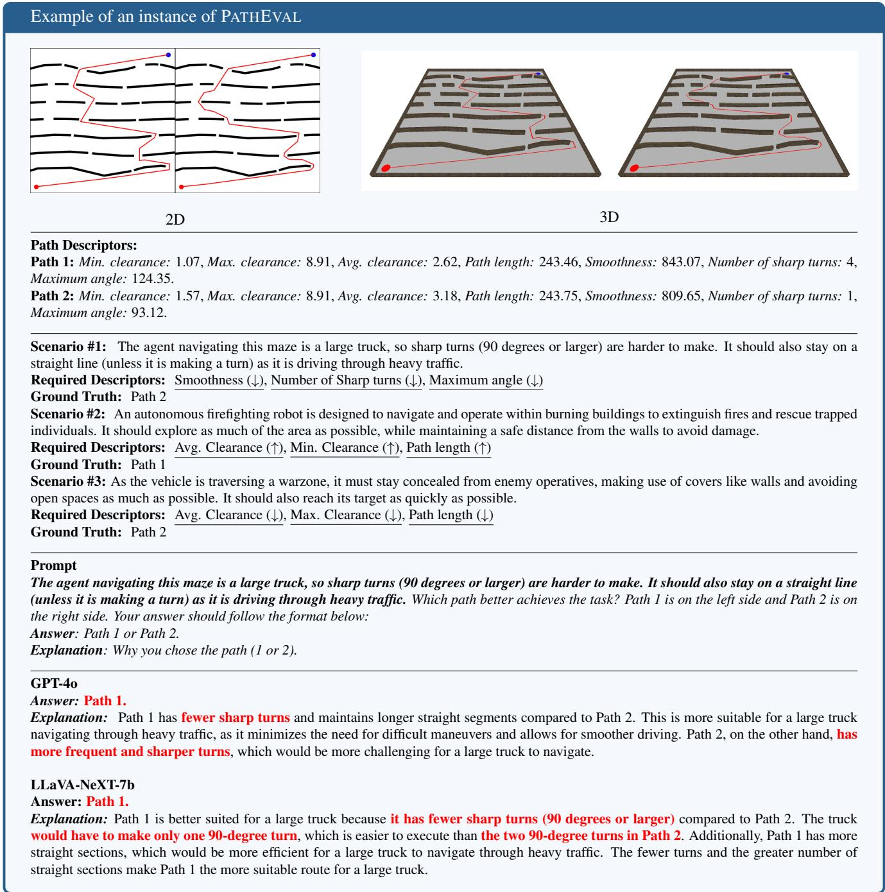
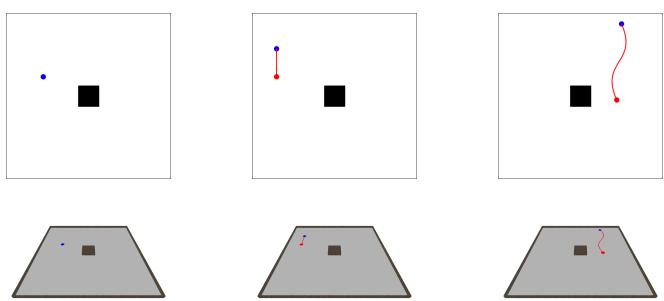
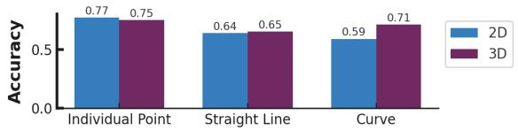

# Evaluating Vision-Language Models as Evaluators in Path Planning

Mohamed Aghzal1, Xiang Yue2, Erion Plaku3\*, Ziyu Yao1

1George Mason University, 2Carnegie Mellon University, 3National Science Foundation

maghzal, ziyuyao @gmu.edu, xyue2@andrew.cmu.edu, eplaku@nsf.gov

## Abstract

Despite their promise to perform complex reasoning, large language models (LLMs) have been shown to have limited effectiveness in end-to-end planning. This has inspired an intriguing question: if these models cannot plan well, can they still contribute to the planning framework as a helpful plan evaluator? In this work, we generalize this question to consider LLMs augmented with visual understanding, i.e., Vision-Language Models (VLMs). We introduce PATHEVAL, a novel benchmark evaluating VLMs as plan evaluators in complex path-planning scenarios. Succeeding in the benchmark requires a VLM to be able to abstract traits of optimal paths from the scenario description, demonstrate precise low-level perception on each path, and integrate this information to decide the better path. Our analysis of state-of-the-art VLMs reveals that these models face significant challenges on the benchmark. We observe that the VLMs can precisely abstract given scenarios to identify the desired traits and exhibit mixed performance in integrating the provided information. Yet, their vision component presents a critical bottleneck, with models struggling to perceive low-level details about a path. Our experimental results show that this issue cannot be trivially addressed via end-to-end fine-tuning; rather, task-specific discriminative adaptation ofthese vision encoders is needed for these VLMs to become effective path evaluators.12

## 1. Introduction

The impressive capabilities of Large Language Models (LLMs) [6, 8, 71] and Vision-Language Models (VLMs) [82] have led to an increasing interest in applying them to automated motion planning and navigation tasks [50, 51]. However, the inherent limitations of these models in longhorizon planning have rendered them ineffective as endto-end motion planners [2, 3, 11, 75]. This has made researchers wonder: if these models cannot be good motion planners themselves, can they still support a motion planning framework? Intuitively, using these models still holds the promise of significantly enhancing the motion planning framework, as they have learned extensive factual and commonsense knowledge that could benefit planning during their pre-training. As a result, there has been an emerging paradigm exploring how these models can be leveraged in combination with traditional methods [27].

One particularly interesting approach within this line of work involves using these models as plan evaluators. Motivated by the intuition that “evaluation is easier than generation” [31], several efforts have explored leveraging these models as “critics” to assess the quality of generated plans [5, 21, 73, 83]. However, most of these efforts have focused on scenarios that require only limited, high-level visual perception, without necessitating fine-grained or precise perceptual abilities. On the other hand, while there have been prior works similarly investigating VLMs’ low-level perception [26, 64], studies specifically about the use of these models in planning remain limited. Tasks such as motion planning often require fine-grained visual understanding in highly specific contexts, while also drawing on broad commonsense knowledge acquired during pre-training. Hence, there is a pressing need to investigate the potential of VLMs to understand both low-level visual details and leverage these visual signals for high-level reasoning.

In this work, we explore whether we can utilize VLMs as evaluators in highly intricate continuous path planning problems. We introduce PATHEVAL (Figure 1), a controllable benchmark designed around path planning in complex environments under diverse commonsense decision-making scenarios (e.g., A firefighting robot has to cover as much of the area as possible to extinguish fires and scout for survivors, thus needs to prioritize paths with more coverage and higher clearance). Traditionally, encoding constraints in a planning algorithm requires significant human effort in hand-crafting scenario-specific criteria for path evaluation, such that the constraints can be injected into the planner during the search process [36, 52, 54]. However, this not only is a tedious and costly process but also cannot scale up to handle the countless intricate scenarios in meeting reallife planning needs. An effective VLM as a “reward model”

  
Figure 1. Example of PATHEVAL. The benchmark consists of 14,550 instances of path pairs rendered in both 2D and 3D and mapped to 15 decision-making scenarios. Success on this task is tied to three distinct levels: 1) Attribute abstraction: recognizing what aspects make a path ideal, 2) Low-level perception: extracting the required attributes for each path from the images, and 2) Information integration: synthesizing the collected information to make a decision. We test a set of VLMs on the task and find that they struggle particularly with low-level perception. Incorrect answers by different models are shown (explanations indicating misperception are highlighted).

relieving humans from customizing evaluation criteria for specific scenarios could enable scalable, general-purpose planners that can adapt to diverse commonsense scenarios described in natural language.

In PATHEVAL, a VLM is tasked with comparing two paths within a given decision-making context and selecting the one that better satisfies the constraints outlined by the scenario. Success on this task requires effective performance across three distinct levels: 1) attribute abstraction: recognizing the attributes that define a favorable path in a particular decision-making context; 2) low-level perception: demonstrating precise low-level perception to determine which path performs better based on the given criteria; and 3) information integration: integrating and synthesizing the perceived information to produce an answer.

Using this benchmark, we analyze the performance of 9 state-of-the-art (SOTA) VLMs, including both the closedsource GPT-4o and GPT-4o-mini [47] and 7 different opensource VLMs of different sizes (i.e., LLaVA-NeXT 7b and 13b [39], Qwen2-VL-7b [69], LLaVA-OneVision-7b [32], LLaMA-3.2-11b [17], and Intern-VL2 8b and 40b [12]). We find that these models struggle with the path evaluation task (e.g., Qwen2-VL-7b achieving only 50.2% accuracy). However, when providing these VLMs with verbalized path specifications, their performance significantly improves (e.g., 74.2% accuracy for Qwen2-VL-7b), which reveals a potential vision bottleneck of these VLMs. Our further analysis confirms these models’ weakness in low-level perception, especially when they are tasked to perceive the clearance of a path with respect to surrounding obstacles, and this weakness could be more prominent when the environment and the path representation become more complex. We discover the source of this weakness from the vision encoders used by these VLMs, yet simply fine-tuning the VLMs end-to-end with the vision encoders does not address the issue. Rather, our experiments suggest performing taskspecific discriminative adaptation of these vision encoders.

## 2. Related Work

## 2.1. Vision-Language Models

The outstanding success of decoder-only LLMs [6, 48, 65] has driven the development of Vision-Language Models (VLMs), which extend LLMs with a vision component in an attempt to generalize their performance into a multi-modal setting [12, 17, 32, 37, 38, 62, 69]. VLMs are designed for tasks that require unifying visual and linguistic representations (e.g. visual question answering [4]). Typically, this is achieved by connecting a vision encoder to a language decoder and projecting the representations into a shared space, allowing visual elements and linguistic components to be linked in a semantically meaningful manner. One of the earliest successful models at achieving this was the CLIP encoder [55], which was trained using contrastive learning to learn representations that map images and their corresponding textual descriptions. Several varieties of CLIP have then been introduced [25, 56, 76, 80]. These models, while showing tremendous promises have shown several limitations when it comes to visual tasks [57]; as such several works [64, 72] have sought ways to improve such representations by combining them with vision foundation models such as DINO [8, 49]. In this work, we contribute to the research of VLMs with a new benchmark, namely PATHEVAL, focusing on evaluating VLMs as evaluators for path planning. This benchmark tests VLMs seamlessly on their commonsense understanding (i.e., being able to abstract critical concepts expressed in the described planning scenarios), low-level perception (i.e., precisely perceiving details about paths in complex environments), and the ability to reason about the collected textual and visual information for decision-making.

## 2.2. Automated Planning with VLMs

Vision-language planning promises more flexible planning frameworks and enhanced human-AI interaction. Therefore, designing systems that can effectively understand natural language instruction and leverage perceptual inputs to conduct planning tasks has been a topic of interest in recent years [20, 61, 70]. The rise of VLMs has led many to investigate the use of these models as vision-language planning agents [15, 16, 50, 51]. However, existing literature highlights the limitations of LLMs in spatial reasoning [2, 26, 74] as well as long-horizon planning [3, 67, 68]. This pushed researchers to explore alternative ways to incorporate VLMs and LLMs into planning frameworks more reliably [27, 58]. One potential direction is their use as plan evaluators, either through the generation of reward functions [23, 33, 73], or by using them directly as off-the-shelf critics [5, 21, 83]. The success of such frameworks assumes perfect perception and that the models can accurately perceive visual information and reason about it in order to produce an answer; nevertheless, it has been shown that the representations used by these models fail in highly intricate visual settings [64]. Several works have explored the use of VLMs as well as LLMs for path and motion planning [2, 3, 7, 9, 11, 14, 44, 75], however, to the knowledge of the authors there is no work that explores the use of VLMs as path critics in this context. Accordingly, we aim to evaluate the ability of VLMs to serve as evaluators in cases requiring navigation in complex environments while adhering to decision-making constraints specified in natural language.

## 2.3. Vision-Language Model Benchmarks

The introduction of multimodal models has prompted the development of several benchmarks that are capable of assessing the performance of these models on visual reasoning tasks such as visual question-answering datasets [4, 18, 19, 24, 42, 43, 84]. However, the rise of foundation models has produced the need for a more holistic evaluation of the perceptual and reasoning capabilities of large

VLMs, leading to benchmarks such as MM-Vet [77], MM-Bench [40] , MMMU [45, 78, 79, 81] and OmniBench [35]. Several benchmarks have also specifically been designed to assess the perception capabilities of these models and explore the limitations associated with visual hallucinations and optical illusions [10, 22, 34, 60, 64]. Our proposed benchmark provides a flexible yet challenging framework for interleavedly assessing the low-level perception and reasoning capabilities of VLMs.

## 3. The PATHEVAL Benchmark

Motivated by the need to evaluate VLMs as path evaluators in real-world planning scenarios, we introduce PATHE-VAL, a controllable and extensible benchmark focused on path planning [28–30, 41] in complex environments under a diverse set of decision-making constraints. We list the decision-making scenarios as well as the descriptors they attempt to optimize in Appendix A. In total, PATHEVAL includes 14,550 tasks over more than 1,150 distinct environments and 15 distinct scenarios. Below, we introduce a formal description of the task and the dataset construction.

## 3.1. Task Formulation

Given two paths, $P _ { 1 }$ and $P _ { 2 } ,$ and a scenario S, the objective is to determine which path better satisfies the scenario’s optimization criteria. Each scenario S is a high-level description that aims to optimize over a set of path descriptors (or metrics) $\mathcal { M } = \{ m _ { 1 } , m _ { 2 } , \dots , m _ { k } \}$ , where each descriptor $m _ { j } : P $ R evaluates a specific property of a path (e.g., length, smoothness, or proximity to obstacles). A VLM is presented with two images presenting $P _ { 1 }$ and $P _ { 2 }$ in the same environment, respectively. The model must then decide which path better satisfies the scenario’s criteria. To explore the sensitivity of VLMs to the way how a path is presented, PATHEVAL includes both the 2D and 3D images of the path illustration. The model is also prompted to generate an explanation to justify its choice.

## 3.2. Environment and Path Generation

Environment Generation: An environment, as shown in Figure 1, is defined by a set of walls $\begin{array} { r l } { \mathcal { O } } & { { } = } \end{array}$ $\{ O _ { 1 } , O _ { 2 } , . . . , O _ { n } \}$ , where each wall $O _ { i }$ represents an obstacle in the 2D space. Each wall is a closed geometric shape described by its vertices, and the set forms the obstacles that the path must avoid. In this work, we leverage the environments of Plaku et. al. [53], which consists of four types of obstacle arrangements: (1) rings, where the environments are structured as mazes with circular walls, (2) waves, which consist of wavy horizontal obstacles, (3) mazes, which consist of both vertical and horizontal walls forming a complex maze structure, as well as (4) random, which consist of randomly placed obstacles.

Path Synthesis via the Randomly-exploring Rapid Tree (RRT) algorithm: To generate path candidates in PATHEVAL, we leverage the RRT path planning algorithm [30]. Starting from the initial location in the environment, the algorithm works by building a tree which expands itself by randomly selecting the next location in the environment while avoiding obstacles, until it reaches the goal. In this work, we use the Open Motion Planning Library (OMPL) [59] and implement the RRT-Connect algorithm [29]. We note that while we use RRT in the current benchmark, our codebase is adaptable and can incorporate most path-planning algorithms provided by OMPL. We encourage future research building on our benchmark to experiment with other algorithms as well.

## 3.3. Path Descriptors

We collect the following descriptors for each of a generated path: Minimum Clearance measures the smallest distance between any point on the path and the nearest obstacle; Maximum Clearance measures the largest distance between any point on the path and the nearest obstacle; Average Clearance computes the average distance between all points on the path and the nearest obstacle; Path Length is calculated by summing up the Euclidean distances between consecutive points on the path; Smoothness is defined as the sum of the angles between consecutive segments of the path, measuring how smoothly the path changes direction; Number of Sharp Turns counts the number of turns in the path where the angle between consecutive segments exceeds 90 degrees; and Maximum Angle denotes the largest angle between any two consecutive segments of the path. The three Clearance metrics and Path Length share the same measuring unit, i.e., one grid size; Smoothness and Maximum Angle are measured by degree; and the Number of Sharp Turns is an integer count. We include the formula of each descriptor in Appendix B.

## 3.4. Natural Language Descriptions of Scenarios

To create a sufficiently challenging path-planning evaluation benchmark, we design a total of 15 decision-making scenarios that aim to optimize different combinations of the path descriptors. For instance, Scenario #2 (as shown in Figure 1) requires searching through an area affected with fire in search for survivors, and the agent thus must cover as much ground as possible. In contrast, Scenario #3 indicates that the path is to be executed within a warzone; as a result, the vehicle has to remain hidden and take the shortest route. As such, given the same set of paths, the one minimizing the path length is favored by Scenario #3 while Scenario #2 needs to maximize this value. A complete summary of the 15 scenarios, along with the descriptors each scenario aims to optimize, is presented in Tables 6-7 in Appendix A.

## 3.5. Task Pairs Selection

For each environment we synthesized, we ran the RRT planner 30 times to generate different paths. Upon eliminating paths that did not reach the goal, we selected path pairs that exhibited the greatest dissimilarity in terms of path descrip tors. Specifically, we first represented each path using a (7- dimension) vector of its path descriptor values. Given that each path descriptor ranged in a dramatically different scale, we normalized the vector by performing the min-max scaling, i.e., scaling each value x in the vector to $\begin{array} { r } { x ^ { \prime } = \frac { x - x _ { \mathrm { m i n } } } { x _ { \mathrm { m a x } } - x _ { \mathrm { m i n } } } . } \end{array}$ where x represents each value in the vector, and $x _ { \mathrm { m i n } }$ and $x _ { \mathrm { m a x } }$ are the minimum and maximum values of each descriptor across paths sampled from the same environment, respectively. We then measured the distance between two paths by calculating the Euclidean distance between their normalized path descriptor vectors, and selected 5 path pairs with the largest distances. Each path is included in only one pair to avoid redundancy. We repeated the same selection procedure for a total of 1,150 environments.

Upon performing this generation, we matched each pair with all fifteen scenarios; however, we only kept pairs where there was a significant difference in at least one of the descriptors required for the particular scenario. In other words, we ensure that the absolute difference is greater than a predefined threshold (0.8 for clearance descriptors, 50 for path length, 90 for smoothness, 1 for the number of sharp turns, and 30 for maximum angle) for at least one of the required descriptors. This makes it more likely that the difference is more noticeable to the naked eye, and thus the paths can be compared by visual inspection.

We constructed our final evaluation benchmark by randomly selecting 70 task pairs from each scenario, resulting in 1,050 pairs in total. The remaining task pairs (a total of 13,500) are used as the training set to facilitate the finetuning experiments in Section 5.

## 4. Can SOTA VLMs Evaluate Planned Paths?

In order for VLMs to perform successfully in our benchmark, they need to perform successfully at three different levels, i.e, recognizing the critical descriptors required by each scenario (Attribute Abstraction), exhibiting sharp low-level perception to precisely assess each path’s properties (Low-level Perception), and integrating the prior information to make a rational decision on the better path (Information Integration). Among them, the first two levels reflect parallel properties that serve as a foundation for the third level. In this section, we evaluated a set of 9 VLMs on PATHEVAL in a zero-shot manner and analyzed their capabilities at these three levels. These VLMs include (1) two closed-source VLMs, i.e., GPT-4o and GPT-4o-mini [47], and (2) seven open-source VLMs with various sizes, including LLaVA-NeXT-7b and LLaVA-NeXT-13b [38, 39],

LLaVA-OneVision-7b [32], Qwen2-VL-7b [69], LLaMA-3.2-11b [17], and Intern-VL2-8b and Intern-VL2-40b [12]. We include all prompt scripts used in this Section in Appendix C.1.

## 4.1. Overview of VLMs on PATHEVAL

The performance of the 9 VLMs on PATHEVAL is showcased in Table 1. We notice that all of the models, except GPT-4o, fail to perform significantly better than a simple random baseline, indicating significant limitations. For GPT-4o, we also notice a 4% higher accuracy on 2D images compared to prompting with 3D inputs. This observation indicates that the model is prone to visual illusions introduced by the 3D images, when it has to rely on solely the image for decision-making (although we observe an opposite effect of 2D vs. 3D when verbalized descriptor values are provided). In the remaining section, we will further break down these models’ capabilities to gain a deeper understanding of their failure on this task.

Providing verbalized path information yields better task accuracy, implying reasonable VLM performance in attribute abstraction. In Table 1, we further show the performance of each model when we explicitly list the value for each descriptor as part of the language prompt (i.e., “PATHEVAL w Desc.”). We notice a 11.1%-27.1% improvement across most models, indicating that when given lowlevel details, the models can better filter out the information and make better comparisons. This points out that the bottleneck for these VLMs’s better performance lies in their inability to accurately perceive low-level information about the paths (we discuss this in more detail in Section 4.2), whereas these models generally have a reasonable capability in abstracting the critical attributes for decision making in various scenarios. In Appendix D.1, we include an experiment where we explicitly query each VLM to identify the critical path metrics for each scenario; the result corroborates our hypothesis. In particular, we find that for most models, the success rate for identifying a required descriptor is over 92%. Finally, a surprising observation happens to LLaVa-NeXT-7b. We notice that this model suffers particularly severely from hallucination; even when the textual descriptor values are provided and when the model can correctly identify critical path metrics based on our analysis in Appendix D.1, it fails to pick the better paths. We show an example of its explanation when textual descriptors are provided in Figure 5 of Appendix E.

VLMs exhibit mixed performance in integrating visual and textual path information. We take a further look into the model performance when both the image and the textual descriptor values are provided, and contrast it with their performance when only the textual path descriptions are provided (i.e., “Desc Only”). Interestingly, we observe mixed information integration performance from these models. For GPT-4o, Qwen2-VL-7b, LLaVA-OneVision-7b, LLaMa-3.2-11b, and LLaVa-NeXT-13b, their performance based on only descriptor values has no obvious difference to their best performance when (2D or 3D) images are also provided. This observation implies that these models do not benefit from the additional image information when the textual path descriptions are provided. Instead, sometimes the images (e.g., 2D images for GPT-4o and 3D images for LLaVa-NeXT-13b) may confuse their understanding of the textual descriptors, resulting in a worse accuracy compared to Desc Only. For GPT-4o-mini, Intern-VL2-8b, and Intern-VL2-40b, however, providing both the visual and textual path information offers 4%-7% performance gain over Desc Only, indicating better information integration from these VLMs.

<table><tr><td rowspan="2">Model</td><td colspan="2">2D</td><td colspan="2">3D</td><td rowspan="2">Desc Only</td></tr><tr><td>PATHEVAL</td><td>PATHEVAL w Desc.</td><td>PATHEVAL</td><td>PATHEVAL w Desc.</td></tr><tr><td>GPT-4o-mini GPT-40</td><td>0.520</td><td>0.750</td><td>0.508</td><td>0.745</td><td>0.680</td></tr><tr><td></td><td>0.665</td><td>0.860</td><td>0.624</td><td>0.895</td><td>0.894</td></tr><tr><td>LLaVa-NeXT-7b</td><td>0.501</td><td>0.524</td><td>0.499</td><td>0.517</td><td>0.514</td></tr><tr><td>Qwen2-VL-7b</td><td>0.502</td><td>0.731</td><td>0.511</td><td>0.742</td><td>0.737</td></tr><tr><td>LLaVA-OneVision-7b</td><td>0.505</td><td>0.718</td><td>0.509</td><td>0.739</td><td>0.721</td></tr><tr><td>Intern-VL2-8b</td><td>0.489</td><td>0.654</td><td>0.505</td><td>0.691</td><td>0.648</td></tr><tr><td>LLaMa-3.2-11b</td><td>0.480</td><td>0.695</td><td>0.460</td><td>0.680</td><td>0.686</td></tr><tr><td>LLaVa-NeXT-13b</td><td>0.509</td><td>0.620</td><td>0.494</td><td>0.601</td><td>0.630</td></tr><tr><td>Intern-VL2-40b</td><td>0.506</td><td>0.688</td><td>0.496</td><td>0.717</td><td>0.679</td></tr><tr><td>Random Baseline</td><td>0.500</td><td>0.500</td><td>0.500</td><td>0.500</td><td>0.500</td></tr></table>

Table 1. Accuracy of VLMs on PATHEVAL based on 2D and 3D environment images. To investigate the potential vision bottleneck of VLMs, we additionally present each model’s accuracy when explicit descriptor values are provided in the language prompts (“PATHEVAL w Desc.”). The last column (“Desc Only”) shows the model performance when only the textual descriptor values are provided.

In Appendix D.2, we present a breakdown of GPT-4o’s performance by scenarios. We show that performance varies greatly from one scenario to the other. Interestingly, we observe that GPT-4o may overuse their commonsense knowledge. For instance, in the case of Scenario #2 shown in Figure 1, where the agent is required to maximize the path length for better coverage, GPT-4o still favors the shorter path. This scenario represents a counterfactual situation as models are often trained or instructed to seek the shortest paths. Evaluating VLMs in such counterfactual scenarios allows us to effectively probe their task understanding and reasoning, which we consider to be an important direction for future research.

The reasoning of VLMs can be unreliable. Limited by the vision bottleneck, we noticed these VLMs fabricating seemingly plausible explanations to justify their path evaluation, despite the fact that they could not actually perceive the necessary path details to perform the task. This fabrication echos findings from other recent work, where LLMs were shown to produce reasoning traces that do not accurately reflect the process of how the models reach an answer [1, 66]. To gain further insights, we performed an analysis comparing model performance on PATHEVAL with cases that consist of: 1) flipping the order of paths in the pair, and 2) assigning random IDs to the paths (e.g. instead of referring to them as “Path 1” and “Path 2”, we use a random sequence such as “Path Xu2q” and “Path fP48”). The results presented in Table 2 showcase that VLMs demonstrate bias for a particular label, when they actually do not have the capability to resolve the task. For example, when no matter the default or the flipping labels are used, LLaVA-NeXT-7b consistently selects Path 1 98% of the time and fabricates incorrect observations of the two paths in its explanations (Figure 1) to support this choice. As we discussed earlier, LLaVA-NeXT-7b is particularly prone to hallucination in explanations, leading to its random-guess performance with or without textual descriptors. Introducing random IDs as path names mitigates this bias for LLaVa-NeXT-7b (although the model still obtains a close-to-random accuracy on PATHEVAL) but does not seem to help other models dramatically.

<table><tr><td>Model</td><td>Default</td><td>Flipped</td><td>Random IDs</td></tr><tr><td>GPT-4o-mini</td><td>34/1016</td><td>22/1026</td><td>94/956</td></tr><tr><td>GPT-40</td><td>278/772</td><td>258/792</td><td>291/759</td></tr><tr><td>LLaVa-NeXT-7b</td><td>1028/22</td><td>1041/9</td><td>580/470</td></tr><tr><td>Qwen2-VL-7b</td><td>21/1029</td><td>130/920</td><td>127/923</td></tr><tr><td>LLaVA-OneVision-7b</td><td>438/612</td><td>440/610</td><td>262/788</td></tr><tr><td>Intern-VL2-8b</td><td>433/610</td><td>430/620</td><td>418/632</td></tr><tr><td>LLaMA-3.2-11b*</td><td>601/251</td><td>620/264</td><td>731/319</td></tr><tr><td>LLaVa-NeXT-13b</td><td>795/255</td><td>939/111</td><td>305/745</td></tr><tr><td>Intern-VL2-40b</td><td>394/656</td><td>410/639</td><td>510/540</td></tr><tr><td>Ground truth labels</td><td></td><td>530/520</td><td></td></tr></table>

Table 2. Performance on the 2D case (#of times first path is chosen / #of times second path is chosen) when we flip the path order or replace their default names with random IDs. \*There are several cases where LLaMA-3.2-11b does not follow the required format and/or does not give an answer, we omit those cases from this table.

<table><tr><td>Descriptor</td><td>Test Set</td><td>€1</td><td>€2</td><td>€3</td></tr><tr><td>Min. Clearance</td><td>0.46/0.46</td><td>0.50/0.46</td><td>0.74/0.70</td><td>0.86/0.74</td></tr><tr><td>Max. Clearance</td><td>0.44/0.46</td><td>0.41/0.49</td><td>0.46/0.55</td><td>0.50/0.60</td></tr><tr><td>Avg. Clearance</td><td>0.53/0.55</td><td>0.50/0.52</td><td>0.70/0.57</td><td>0.73/0.60</td></tr><tr><td>Path Length</td><td>0.58/0.70</td><td>0.86/0.91</td><td>0.92/0.86</td><td>0.94/0.94</td></tr><tr><td>Smoothness</td><td>0.74/0.72</td><td>0.86/0.82</td><td>0.90/0.90</td><td>0.90/0.89</td></tr><tr><td># of Sharp Turns</td><td>0.76/0.73</td><td>0.80/0.84</td><td>0.77/0.70</td><td>0.60/0.55</td></tr><tr><td>Max. Angle</td><td>0.71/0.70</td><td>0.82/0.84</td><td>0.86/0.88</td><td>0.94/0.96</td></tr></table>

Table 3. GPT-4o’s fine-grained perception accuracy (2D/3D) on the test set of PATHEVAL and three additionally synthesized datasets with increasing metric differences.

## 4.2. What Can Vision-Language Models See?

The previous subsection clearly highlights the vision component as the bottleneck for path evaluation on PATHEVAL. In this subsection, we conduct an analysis of the visual perception capabilities of VLMs. We focus our analysis on GPT-4o since it is the only model that performs substantially better than the random baseline in the case where no descriptors are required.

GPT-4o can perceive paths that are significantly different. In order to get a better understanding of the model’s perception capability, we break down its performance in terms of perception by individual metric. Specifically, we prompt GPT-4o to select which path in the pair provides a lower value on each individual metric and report its accuracy. We perform this analysis on both the task pairs in the test set of PATHEVAL and an additionally synthesized dataset consisting of task pairs with three levels (denoted as ω1, ω2, and ω3) of increasing differences in their descriptor values. We describe the data generation process for this dataset in more detail in Appendix C.2.

The results for both experiments are shown in Table 3. Upon evaluating the performance on the test set of PATHE-VAL by individual metrics, we notice that GPT-4o particularly struggles with Clearance metrics. These metrics typically require a lower level of perception and is naturally more challenging to discriminate than other metrics. On the other hand, Smoothness, Number of Sharpest Turns, and Max Angle appear to be easier for the model to capture. We also note that GPT-4o perceives the path length much more easily in a 3D environment presentation. Furthermore, GPT-4o’s performance increases as we increase the descriptor difference between paths. This, however, is not the case for the Number of Sharp Turns. We conjecture that when we increase the number of sharp turns, we also enforce the challenge of “counting” the number of satisfying turns, which VLMs have been shown with limitations [46].

Does segment complexity affect performance? We look into whether the complexity of the path segment is the key reason for GPT-4o’s limited perception of clearance. To this end, we test GPT-4o on segments of varying complexity (i.e., points, straight lines, and curves), in a simplified

(a) Point  
(b) Straight line  
(c) Curve  
  
(d) GPT-4o performance on the distance to obstacle under different segment complexities.

Figure 2. Example segment complexity test cases in simplified environments and performance across the various settings.

environment with only one rectangular obstacle at the center (Figure 2), and evaluate its accuracy in identifying segments that are closer to the obstacle. For individual points, the clearance is defined by the perpendicular distance from the point to the obstacle; for straight lines and curves, we consider a path closer if one of its endpoints is closer to the obstacle. For each segment type, we synthesize 100 pairs by first randomly generating 200 segments and then pairing each with the segment with the greatest distance difference from the obstacle relative to it (i.e., maximizing the absolute difference between the distances of the two segments from the obstacle). This increases the likelihood that the distance is significant enough to be perceivable. The average difference in the clearances of the pairs of segments are 14.76, 14.42, and 14.28 for points, lines, and curves respectively.

The results in Figure 2d show that GPT-4o can perform better in very easy scenarios; however, it struggles more as the segment complexity increases. For instance, the model was able to identify the closer points in 77% of the cases; however, when considering straight and curved lines, its performance drops to 64% and 59%, respectively. A surprising observation is that, in the case of curved lines, GPT-4o’s performance is dramatically better in 3D images. As shown in Appendix C.2, the average Clearance difference of path pairs in PATHEVAL is merely 0.12 – 1.31. As the paths in PATHEVAL are much more complicated than the curves in this experiment, it is expected that GPT-4o exhibits difficulty in judging paths’ clearances. The complexity of the environments (compared to a single square obstacle) could add challenges.

## 5. Fine-tuning a Path Evaluator

One intuitive question is whether simply fine-tuning the VLMs can relieve their vision bottleneck. To answer this question, we experiment with LLaVA-NeXT-7b and finetune it on the training set (13,500 pairs) of PATHEVAL. We focus on the 2D case for the set of experiments described in this section. We consider three separate settings for training: (1) training with only images as input, (2) training with images and textual descriptor values as input, and (3) the same setting as (1) with using random IDs as target labels. Details in experimental setup are included in Appendix C.3.

<table><tr><td rowspan="2">Model</td><td colspan="2">Frozen</td><td colspan="2">Fine-tuned</td></tr><tr><td>Accuracy</td><td>Avg. Cosine Similarity</td><td>Accuracy</td><td>Avg. Cosine Similarity</td></tr><tr><td>clip-vit-base-patch32</td><td>0.510</td><td>0.914</td><td>0.783</td><td>0.514</td></tr><tr><td>clip-vit-large-patch14-336</td><td>0.498</td><td>0.907</td><td>0.749</td><td>0.548</td></tr><tr><td>OpenCLIP-vit-B-32</td><td>0.540</td><td>0.883</td><td>0.743</td><td>0.475</td></tr><tr><td>siglip-base-patch16-224</td><td>0.529</td><td>0.895</td><td>0.731</td><td>0.612</td></tr><tr><td>dino-vit-16</td><td>0.495</td><td>0.911</td><td>0.763</td><td>0.754</td></tr><tr><td>dino-v2-base</td><td>0.510</td><td>0.761</td><td>0.721</td><td>0.681</td></tr></table>

Table 4. Probing accuracy and average cosine similarity between distinct path images (2D) when the vision encoder is frozen or fine-tuned.
<table><tr><td>Setting</td><td>Frozen</td><td>Tunable</td></tr><tr><td>Image Only</td><td>0.52</td><td>0.51</td></tr><tr><td>Image w Descriptors</td><td>0.96</td><td></td></tr><tr><td>Image Only (Random IDs)</td><td>0.48</td><td>0.52</td></tr></table>

Table 5. Fine-tuned LLaVA-NeXT-7b performance (2D) when we keep the vision encoder frozen or tunable.

## 5.1. Overall Performance

Fine-tuning does not help with vision-language mapping. Table 5 shows that the model fails to learn meaningful patterns in the data, even after training 50 epochs. However, when the textual descriptors are provided as input, the model can easily learn the function achieving 96% accuracy (a 45% improvement from the zero-shot setting). This shows that the model is unable to extract the same descriptor values from the image input. Unfreezing the encoder for fine-tuning also does not provide any significant improvement. We include a further discussion in Appendix D.3. The results point to a limitation in the vision model’s ability to encode the images, which we will investigate next.

## 5.2. Understanding the Visual Representations

In order to further understand the limitations of the vision component, we conduct an analysis to better understand how well different vision encoder models can differentiate between different paths in the dataset. To this end, we first apply a linear probe to see how easily distinguishable different images are. Specifically, given a pair of images, we first use the vision encoder to extract high-dimensional feature representations for both images. These features are then concatenated and passed through a simple binary classification layer (i.e., the probe). The probe is trained to predict a label of 1 if the images are the same and 0 otherwise. We experiment with various SOTA vision encoders, namely CLIP [55] base and large varieties, LAION-OpenCLIP [25, 56], SigLip [80], DINO [8], and DINO-v2 [49] and analyze how well their learned representations capture visual similarities and differences. We use a set of 1,000 randomly sampled path pairs with a balanced label distribution to train the probe, and look at whether the model can learn to distinguish between these paths. We also perform an experiment where we fine-tune the vision encoder along with the probe. In this setting, our goal is to gauge if carefully fine-tuning a vision encoder can potentially improve the model’s performance in low-level perception. Finally, in both settings, we present the average cosine similarity between distinct paths.

Vision encoders cannot distinguish between paths. From Table 4, it can be seen that vision encoder models are unable to provide representations that are significantly different for the probe to tell if they are the same. This is further supported by the high values for the average cosine similarity across all models.

Fine-tuning the encoders on a discrimination task can help disentangle the visual representations. By unfreezing the encoder weights and training them to identify whether two paths are identical, we enhance their adaptability to the task. The results in Table 4 demonstrate that this approach effectively disentangles the learned representations, resulting in significantly improved performance and increased separability, as evidenced by the notably lower cosine similarity between non-identical paths. The results thus imply the need for carefully fine-tuning task-specific vision encoders for path evaluation on PATHEVAL.

## 6. Conclusion

This work explored the use of VLMs as evaluators in pathplanning scenarios. We evaluated a number of VLMs on our proposed benchmark, PATHEVAL, and found that these models struggle with low-level perception. Specifically, we find that visual encoders used by SOTA models are unable to discern the differences between different paths in intricate scenarios. We hope that PATHEVAL will inspire researchers to further explore ways to improve the visual capabilities of VLMs and contribute to finding better ways to incorporate foundation models for developing more flexible, robust, and scalable planning paradigms.

## Acknowledgments

This project was supported by resources provided by the Office of Research Computing at George Mason University (URL: https://orc.gmu.edu) and funded in part by grants from the National Science Foundation (Award Number 2018631).

## References

[1] Chirag Agarwal, Sree Harsha Tanneru, and Himabindu Lakkaraju. Faithfulness vs. Plausibility: On the (Un)Reliability of Explanations from Large Language Models, 2024. 6

[2] Mohamed Aghzal, Erion Plaku, and Ziyu Yao. Can Large Language Models be Good Path Planners? A Benchmark and Investigation on Spatial-temporal Reasoning. In ICLR 2024 Workshop on Large Language Model (LLM) Agents, 2024. 1, 3

[3] Mohamed Aghzal, Erion Plaku, and Ziyu Yao. Look Further Ahead: Testing the Limits of GPT-4 in Path Planning. IEEE CASE, 2024. 1, 3

[4] Stanislaw Antol, Aishwarya Agrawal, Jiasen Lu, Margaret Mitchell, Dhruv Batra, C. Lawrence Zitnick, and Devi Parikh. VQA: Visual Question Answering. In International Conference on Computer Vision (ICCV), 2015. 3

[5] Kate Baumli, Satinder Baveja, Feryal Behbahani, Harris Chan, Gheorghe Comanici, Sebastian Flennerhag, Maxime Gazeau, Kristian Holsheimer, Dan Horgan, Michael Laskin, Clare Lyle, Hussain Masoom, Kay McKinney, Volodymyr Mnih, Alexander Neitz, Dmitry Nikulin, Fabio Pardo, Jack Parker-Holder, John Quan, Tim Rocktaschel, Himanshu¨ Sahni, Tom Schaul, Yannick Schroecker, Stephen Spencer, Richie Steigerwald, Luyu Wang, and Lei Zhang. Vision-Language Models as a Source of Rewards, 2024. 1, 3

[6] Tom B. Brown, Benjamin Mann, Nick Ryder, Melanie Subbiah, Jared Kaplan, Prafulla Dhariwal, Arvind Neelakantan, Pranav Shyam, Girish Sastry, Amanda Askell, Sandhini Agarwal, Ariel Herbert-Voss, Gretchen Krueger, Tom Henighan, Rewon Child, Aditya Ramesh, Daniel M. Ziegler, Jeffrey Wu, Clemens Winter, Christopher Hesse, Mark Chen, Eric Sigler, Mateusz Litwin, Scott Gray, Benjamin Chess, Jack Clark, Christopher Berner, Sam McCandlish, Alec Radford, Ilya Sutskever, and Dario Amodei. Language models are few-shot learners, 2020. 1, 3

[7] Xu Cao, Tong Zhou, Yunsheng Ma, Wenqian Ye, Can Cui, Kun Tang, Zhipeng Cao, Kaizhao Liang, Ziran Wang, James M. Rehg, and Chao Zheng. MAPLM: A Real-World Large-Scale Vision-Language Benchmark for Map and Traffic Scene Understanding. In Proceedings of the IEEE/CVF Conference on Computer Vision and Pattern Recognition (CVPR), pages 21819–21830, 2024. 3

[8] Mathilde Caron, Hugo Touvron, Ishan Misra, Herve J´ egou,´ Julien Mairal, Piotr Bojanowski, and Armand Joulin. Emerging properties in self-supervised vision transformers. In Proceedings of the International Conference on Computer Vision (ICCV), 2021. 1, 3, 8

[9] Jiaqi Chen, Bingqian Lin, Ran Xu, Zhenhua Chai, Xiaodan Liang, and Kwan-Yee Wong. MapGPT: Mapguided prompting with adaptive path planning for visionand-language navigation. In Proceedings of the 62nd An nual Meeting of the Association for Computational Linguistics (Volume 1: Long Papers), pages 9796–9810, Bangkok, Thailand, 2024. Association for Computational Linguistics. 3

[10] Xuweiyi Chen, Ziqiao Ma, Xuejun Zhang, Sihan Xu, Shengyi Qian, Jianing Yang, David Fouhey, and Joyce Chai. Multi-object hallucination in vision language models. In The Thirty-eighth Annual Conference on Neural Information Processing Systems, 2024. 4

[11] Yongchao Chen, Jacob Arkin, Charles Dawson, Yang Zhang, Nicholas Roy, and Chuchu Fan. Autotamp: Autoregressive task and motion planning with llms as translators and checkers. In 2024 IEEE International Conference on Robotics and Automation (ICRA), pages 6695–6702, 2024. 1, 3

[12] Zhe Chen, Jiannan Wu, Wenhai Wang, Weijie Su, Guo Chen, Sen Xing, Muyan Zhong, Qinglong Zhang, Xizhou Zhu, Lewei Lu, Bin Li, Ping Luo, Tong Lu, Yu Qiao, and Jifeng Dai. InternVL: Scaling up Vision Foundation Models and Aligning for Generic Visual-Linguistic Tasks. arXiv preprint arXiv:2312.14238, 2023. 3, 5

[13] Wei-Lin Chiang, Zhuohan Li, Zi Lin, Ying Sheng, Zhang hao Wu, Hao Zhang, Lianmin Zheng, Siyuan Zhuang, Yonghao Zhuang, Joseph E. Gonzalez, Ion Stoica, and Eric P. Xing. Vicuna: An open-source chatbot impressing gpt-4 with 90%\* chatgpt quality, 2023. 4

[14] Yan Ding, Xiaohan Zhang, Chris Paxton, and Shiqi Zhang. Task and motion planning with large language models for object rearrangement. In 2023 IEEE/RSJ International Conference on Intelligent Robots and Systems (IROS), pages 2086– 2092. IEEE, 2023. 3

[15] Danny Driess, Fei Xia, Mehdi S. M. Sajjadi, Corey Lynch, Aakanksha Chowdhery, Brian Ichter, Ayzaan Wahid, Jonathan Tompson, Quan Vuong, Tianhe Yu, Wenlong Huang, Yevgen Chebotar, Pierre Sermanet, Daniel Duck worth, Sergey Levine, Vincent Vanhoucke, Karol Hausman, Marc Toussaint, Klaus Greff, Andy Zeng, Igor Mordatch, and Pete Florence. Palm-e: an embodied multimodal lan guage model. In Proceedings ofthe 40th International Con ference on Machine Learning. JMLR.org, 2023. 3

[16] Yilun Du, Sherry Yang, Pete Florence, Fei Xia, Ayzaan Wahid, brian ichter, Pierre Sermanet, Tianhe Yu, Pieter Abbeel, Joshua B. Tenenbaum, Leslie Pack Kaelbling, Andy Zeng, and Jonathan Tompson. Video language planning. In The Twelfth International Conference on Learning Representations, 2024. 3

[17] Abhimanyu Dubey et. al. The Llama 3 Herd of Models, 2024. 3, 5

[18] Difei Gao, Ruiping Wang, Shiguang Shan, and Xilin Chen. Cric: A vqa dataset for compositional reasoning on vision and commonsense. IEEE Transactions on Pattern Analysis and Machine Intelligence, 45(5):5561–5578, 2022. 3

[19] Yash Goyal, Tejas Khot, Douglas Summers-Stay, Dhruv Batra, and Devi Parikh. Making the v in vqa matter: Elevating

the role of image understanding in visual question answering. In Proceedings of the IEEE Conference on Computer Vision and Pattern Recognition (CVPR), 2017. 3

[20] Jing Gu, Eliana Stefani, Qi Wu, Jesse Thomason, and Xin Wang. Vision-and-language navigation: A survey of tasks, methods, and future directions. In Proceedings of the 60th Annual Meeting of the Association for Computational Linguistics (Volume 1: Long Papers). Association for Computational Linguistics, 2022. 3

[21] Lin Guan, Yifan Zhou, Denis Liu, Yantian Zha, Heni Ben Amor, and Subbarao Kambhampati. Task success is not enough: Investigating the use of video-language models as behavior critics for catching undesirable agent behaviors. In First Conference on Language Modeling, 2024. 1, 3

[22] Tianrui Guan, Fuxiao Liu, Xiyang Wu, Ruiqi Xian, Zongxia Li, Xiaoyu Liu, Xijun Wang, Lichang Chen, Furong Huang, Yaser Yacoob, Dinesh Manocha, and Tianyi Zhou. Hallusionbench: An advanced diagnostic suite for entangled language hallucination & visual illusion in large visionlanguage models, 2023. 4

[23] Xu Han, Qiannan Yang, Xianda Chen, Xiaowen Chu, and Meixin Zhu. Generating and evolving reward functions for highway driving with large language models, 2024. 3

[24] Drew A. Hudson and Christopher D. Manning. GQA: A New Dataset for Real-World Visual Reasoning and Compositional Question Answering. In Proceedings of the IEEE/CVF Conference on Computer Vision and Pattern Recognition (CVPR), 2019. 3

[25] Gabriel Ilharco, Mitchell Wortsman, Ross Wightman, Cade Gordon, Nicholas Carlini, Rohan Taori, Achal Dave, Vaishaal Shankar, Hongseok Namkoong, John Miller, Hannaneh Hajishirzi, Ali Farhadi, and Ludwig Schmidt. Openclip, 2021. If you use this software, please cite it as below. 3, 8

[26] Amita Kamath, Jack Hessel, and Kai-Wei Chang. What’s ”up” with vision-language models? Investigating their struggle with spatial reasoning. In The 2023 Conference on Empirical Methods in Natural Language Processing, 2023. 1, 3

[27] Subbarao Kambhampati, Karthik Valmeekam, Lin Guan, Mudit Verma, Kaya Stechly, Siddhant Bhambri, Lucas Paul Saldyt, and Anil B Murthy. Position: LLMs Can’t Plan, But Can Help Planning in LLM-Modulo Frameworks. In Fortyfirst International Conference on Machine Learning, 2024. 1, 3

[28] L.E. Kavraki, P. Svestka, J.-C. Latombe, and M.H. Overmars. Probabilistic roadmaps for path planning in highdimensional configuration spaces. IEEE Transactions on Robotics and Automation, 12(4):566–580, 1996. 4

[29] J.J. Kuffner and S.M. LaValle. RRT-connect: An efficient approach to single-query path planning. In Proceedings 2000 ICRA. Millennium Conference. IEEE International Conference on Robotics and Automation. Symposia Proceedings (Cat. No.00CH37065), pages 995–1001 vol.2, 2000. 4

[30] Steven M. LaValle. Rapidly-exploring random trees : a new tool for path planning. The annual research report, 1998. 4

[31] Jan Leike. Why i’m optimistic about our alignment approach: Evaluation is easier than generation.

https://aligned.substack.com/i/88447351/ evaluation - is - easier - than - generation, 2022. Accessed: 2024-11. 1

[32] Bo Li, Yuanhan Zhang, Dong Guo, Renrui Zhang, Feng Li, Hao Zhang, Kaichen Zhang, Yanwei Li, Ziwei Liu, and Chunyuan Li. LLaVA-OneVision: Easy Visual Task Trans fer. arXiv preprint arXiv:2408.03326, 2024. 3, 5

[33] Hao Li, Xue Yang, Zhaokai Wang, Xizhou Zhu, Jie Zhou, Yu Qiao, Xiaogang Wang, Hongsheng Li, Lewei Lu, and Jifeng Dai. Auto mc-reward: Automated dense reward design with large language models for minecraft. In IEEE/CVF Conference on Computer Vision and Pattern Recognition, 2024. 3

[34] Yifan Li, Yifan Du, Kun Zhou, Jinpeng Wang, Wayne Xin Zhao, and Ji-Rong Wen. Evaluating object hallucination in large vision-language models. In The 2023 Conference on Empirical Methods in Natural Language Processing, 2023. 4

[35] Yizhi Li, Ge Zhang, Yinghao Ma, Ruibin Yuan, Kang Zhu, Hangyu Guo, Yiming Liang, Jiaheng Liu, Zekun Wang, Jian Yang, Siwei Wu, Xingwei Qu, Jinjie Shi, Xinyue Zhang, Zhenzhu Yang, Xiangzhou Wang, Zhaoxiang Zhang, Zachary Liu, Emmanouil Benetos, Wenhao Huang, and Chenghua Lin. OmniBench: Towards The Future of Universal Omni-Language Models, 2024. 4

[36] Hui Sheng Lim, Shuangshuang Fan, Christopher K.H. Chin, Shuhong Chai, Neil Bose, and Eonjoo Kim. Constrained path planning of autonomous underwater vehicle using selectively-hybridized particle swarm optimization algorithms. IFAC-PapersOnLine, 52(21):315–322, 2019. 12th IFAC Conference on Control Applications in Marine Systems, Robotics, and Vehicles CAMS 2019. 2

[37] Haotian Liu, Chunyuan Li, Qingyang Wu, and Yong Jae Lee. Visual instruction tuning. In Advances in Neural Information Processing Systems, pages 34892–34916. Curran Associates, Inc., 2023. 3

[38] Haotian Liu, Chunyuan Li, Yuheng Li, and Yong Jae Lee. Improved Baselines with Visual Instruction Tuning, 2024. 3, 5

[39] Haotian Liu, Chunyuan Li, Yuheng Li, Bo Li, Yuanhan Zhang, Sheng Shen, and Yong Jae Lee. LLaVA-NeXT: Im proved reasoning, OCR, and world knowledge, 2024. 3, 5

[40] Yuan Liu, Haodong Duan, Yuanhan Zhang, Bo Li, Songyang Zhang, Wangbo Zhao, Yike Yuan, Jiaqi Wang, Conghui He, Ziwei Liu, Kai Chen, and Dahua Lin. Mmbench: Is your multi-modal model an all-around player? In Computer Vision – ECCV 2024, pages 216–233, Cham, 2025. Springer Nature Switzerland. 4

[41] Tomas Lozano-P´ erez and Michael A. Wesley. An algorithm´ for planning collision-free paths among polyhedral obstacles. Communications of the ACM, 22(10):560–570, 1979. 4

[42] Pan Lu, Hritik Bansal, Tony Xia, Jiacheng Liu, Chunyuan Li, Hannaneh Hajishirzi, Hao Cheng, Kai-Wei Chang, Michel Galley, and Jianfeng Gao. Mathvista: Evaluating mathe matical reasoning of foundation models in visual contexts. In The Twelfth International Conference on Learning Representations, 2024. 3

[43] Kenneth Marino, Mohammad Rastegari, Ali Farhadi, and Roozbeh Mottaghi. Ok-vqa: A visual question answering benchmark requiring external knowledge. In Proceedings of the IEEE/CVF Conference on Computer Vision and Pattern Recognition (CVPR), 2019. 3

[44] Silin Meng, Yiwei Wang, Cheng-Fu Yang, Nanyun Peng, and Kai-Wei Chang. LLM-a\*: Large language model enhanced incremental heuristic search on path planning. In Findings of the Association for Computational Linguistics: EMNLP 2024, pages 1087–1102, Miami, Florida, USA, 2024. Association for Computational Linguistics. 3

[45] Shota Onohara, Atsuyuki Miyai, Yuki Imajuku, Kazuki Egashira, Jeonghun Baek, Xiang Yue, Graham Neubig, and Kiyoharu Aizawa. Jmmmu: A japanese massive multidiscipline multimodal understanding benchmark for cultureaware evaluation, 2024. 4

[46] OpenAI. GPT-4V(ision) System Card. 2023. 7

[47] OpenAI. GPT-4o System Card, 2024. 3, 5

[48] OpenAI. GPT-4 Technical Report, 2024. 3

[49] Maxime Oquab, Timothee Darcet, Theo Moutakanni, Huy V.´ Vo, Marc Szafraniec, Vasil Khalidov, Pierre Fernandez, Daniel Haziza, Francisco Massa, Alaaeldin El-Nouby, Russell Howes, Po-Yao Huang, Hu Xu, Vasu Sharma, Shang-Wen Li, Wojciech Galuba, Mike Rabbat, Mido Assran, Nicolas Ballas, Gabriel Synnaeve, Ishan Misra, Herve Jegou, Julien Mairal, Patrick Labatut, Armand Joulin, and Piotr Bojanowski. Dinov2: Learning robust visual features without supervision, 2023. 3, 8

[50] Bowen Pan, Rameswar Panda, SouYoung Jin, Rogerio Feris, Aude Oliva, Phillip Isola, and Yoon Kim. LangNav: Language as a perceptual representation for navigation. In Findings of the Association for Computational Linguistics: NAACL 2024, pages 950–974, Mexico City, Mexico, 2024. Association for Computational Linguistics. 1, 3

[51] Chenbin Pan, Burhaneddin Yaman, Tommaso Nesti, Abhirup Mallik, Alessandro G Allievi, Senem Velipasalar, and Liu Ren. VLP: Vision Language Planning for Autonomous Driving . In 2024 IEEE/CVF Conference on Computer Vision and Pattern Recognition (CVPR), pages 14760–14769, Los Alamitos, CA, USA, 2024. IEEE Computer Society. 1, 3

[52] Clment Petres, Yan Pailhas, Pedro Patron, Yvan Petillot, Jonathan Evans, and David Lane. Path planning for autonomous underwater vehicles. IEEE Transactions on Robotics, 23(2):331–341, 2007. 2

[53] Evis Plaku, Erion Plaku, and Patricio Simari. Clearancedriven motion planning for mobile robots with differential constraints. Robotica, 36(7):971–993, 2018. 4

[54] Patrick A. Plonski, Pratap Tokekar, and Volkan Isler. Energy-Efficient Path Planning for Solar-Powered Mobile Robots, pages 717–731. Springer International Publishing, Heidelberg, 2013. 2

[55] Alec Radford, Jong Wook Kim, Chris Hallacy, Aditya Ramesh, Gabriel Goh, Sandhini Agarwal, Girish Sastry, Amanda Askell, Pam Mishkin, Jack Clark, Gretchen Krueger, and Ilya Sutskever. Learning transferable visual models from natural language supervision. Proceedings of

the 38th International Conference on Machine Learning, 2021. 3, 8

[56] Christoph Schuhmann, Romain Beaumont, Richard Vencu, Cade W Gordon, Ross Wightman, Mehdi Cherti, Theo Coombes, Aarush Katta, Clayton Mullis, Mitchell Wortsman, Patrick Schramowski, Srivatsa R Kundurthy, Katherine Crowson, Ludwig Schmidt, Robert Kaczmarczyk, and Jenia Jitsev. LAION-5b: An open large-scale dataset for train ing next generation image-text models. In Thirty-sixth Conference on Neural Information Processing Systems Datasets and Benchmarks Track, 2022. 3, 8

[57] Jie-Jing Shao, Jiang-Xin Shi, Xiao-Wen Yang, Lan-Zhe Guo, and Yu-Feng Li. Investigating the Limitation of CLIP Mod els: The Worst-Performing Categories, 2023. 3

[58] Tom Silver, Soham Dan, Kavitha Srinivas, Joshua B. Tenenbaum, Leslie Pack Kaelbling, and Michael Katz. Generalized planning in pddl domains with pretrained large language models, 2023. 3

[59] Ioan A. Sucan, Mark Moll, and Lydia E. Kavraki. The Open Motion Planning Library. IEEE Robotics & Automa tion Magazine, 19(4):72–82, 2012. 4

[60] Yinan Sun, Zicheng Zhang, Haoning Wu, Xiaohong Liu, Weisi Lin, Guangtao Zhai, and Xiongkuo Min. Explore the hallucination on low-level perception for mllms, 2024. 4

[61] Hao Tan, Licheng Yu, and Mohit Bansal. Learning to navigate unseen environments: Back translation with environmental dropout. In Proceedings of the 2019 Conference of the North American Chapter ofthe Associationfor Computa tional Linguistics: Human Language Technologies, Volume 1 (Long and Short Papers), pages 2610–2621, Minneapolis, Minnesota, 2019. Association for Computational Linguistics. 3

[62] Gemini Team. Gemini: A family of highly capable multi modal models, 2024. 3

[63] Shengbang Tong, Erik Jones, and Jacob Steinhardt. Massproducing failures of multimodal systems with language models. In Proceedings of the 37th International Conference on Neural Information Processing Systems, Red Hook, NY, USA, 2024. Curran Associates Inc. 4

[64] Shengbang Tong, Zhuang Liu, Yuexiang Zhai, Yi Ma, Yann LeCun, and Saining Xie. Eyes Wide Shut? Exploring the Visual Shortcomings of Multimodal LLMs, 2024. 1, 3, 4

[65] Hugo Touvron, Louis Martin, Kevin Stone, Peter Albert, Amjad Almahairi, Yasmine Babaei, Nikolay Bashlykov, Soumya Batra, Prajjwal Bhargava, Shruti Bhosale, Dan Bikel, Lukas Blecher, Cristian Canton Ferrer, Moya Chen, Guillem Cucurull, David Esiobu, Jude Fernandes, Jeremy Fu, Wenyin Fu, Brian Fuller, Cynthia Gao, Vedanuj Goswami, Naman Goyal, Anthony Hartshorn, Saghar Hosseini, Rui Hou, Hakan Inan, Marcin Kardas, Vik tor Kerkez, Madian Khabsa, Isabel Kloumann, Artem Korenev, Punit Singh Koura, Marie-Anne Lachaux, Thibaut Lavril, Jenya Lee, Diana Liskovich, Yinghai Lu, Yuning Mao, Xavier Martinet, Todor Mihaylov, Pushkar Mishra, Igor Molybog, Yixin Nie, Andrew Poulton, Jeremy Reizen stein, Rashi Rungta, Kalyan Saladi, Alan Schelten, Ruan Silva, Eric Michael Smith, Ranjan Subramanian, Xiaoqing Ellen Tan, Binh Tang, Ross Taylor, Adina Williams,

Jian Xiang Kuan, Puxin Xu, Zheng Yan, Iliyan Zarov, Yuchen Zhang, Angela Fan, Melanie Kambadur, Sharan Narang, Aurelien Rodriguez, Robert Stojnic, Sergey Edunov, and Thomas Scialom. Llama 2: Open foundation and finetuned chat models, 2023. 3

[66] Miles Turpin, Julian Michael, Ethan Perez, and Samuel R. Bowman. Language models don’t always say what they think: unfaithful explanations in chain-of-thought prompting. In Proceedings of the 37th International Conference on Neural Information Processing Systems, Red Hook, NY, USA, 2024. Curran Associates Inc. 6

[67] Karthik Valmeekam, Alberto Olmo, Sarath Sreedharan, and Subbarao Kambhampati. Large Language Models Still Can’t Plan (A Benchmark for LLMs on Planning and Reasoning about Change). In NeurIPS 2022 Foundation Modelsfor Decision Making Workshop, 2022. 3

[68] Karthik Valmeekam, Kaya Stechly, and Subbarao Kambhampati. LLMs Still Can’t Plan; Can LRMs? A Preliminary Evaluation of OpenAI’s o1 on PlanBench, 2024. 3

[69] Peng Wang, Shuai Bai, Sinan Tan, Shijie Wang, Zhihao Fan, Jinze Bai, Keqin Chen, Xuejing Liu, Jialin Wang, Wenbin Ge, Yang Fan, Kai Dang, Mengfei Du, Xuancheng Ren, Rui Men, Dayiheng Liu, Chang Zhou, Jingren Zhou, and Junyang Lin. Qwen2-VL: Enhancing Vision-Language Model’s Perception of the World at Any Resolution. arXiv preprint arXiv:2409.12191, 2024. 3, 5

[70] Xin Wang, Qiuyuan Huang, Asli Celikyilmaz, Jianfeng Gao, Dinghan Shen, Yuan-Fang Wang, William Yang Wang, and Lei Zhang. Reinforced cross-modal matching and selfsupervised imitation learning for vision-language navigation. In 2019 IEEE/CVF Conference on Computer Vision and Pattern Recognition (CVPR), pages 6622–6631, 2019. 3

[71] Jason Wei, Xuezhi Wang, Dale Schuurmans, Maarten Bosma, brian ichter, Fei Xia, Ed H. Chi, Quoc V Le, and Denny Zhou. Chain of Thought Prompting Elicits Reasoning in Large Language Models. In Advances in Neural Information Processing Systems, 2022. 1

[72] Monika Wysoczanska, Oriane Sim ´ eoni, Micha ´ el Ramamon- ¨ jisoa, Andrei Bursuc, Tomasz Trzcinski, and Patrick P´ erez.´ Clip-dinoiser: Teaching clip a few dino tricks for openvocabulary semantic segmentation. ECCV, 2024. 3

[73] Tianbao Xie, Siheng Zhao, Chen Henry Wu, Yitao Liu, Qian Luo, Victor Zhong, Yanchao Yang, and Tao Yu. Text2Reward: Reward Shaping with Language Models for Reinforcement Learning. In The Twelfth International Conference on Learning Representations, 2024. 1, 3

[74] Yutaro Yamada, Yihan Bao, Andrew Kyle Lampinen, Jungo Kasai, and Ilker Yildirim. Evaluating spatial understanding of large language models. Transactions on Machine Learning Research, 2024. 3

[75] Zhutian Yang, Caelan Garrett, Dieter Fox, Tomas Lozano-´ Perez, and Leslie Pack Kaelbling. Guiding long-horizon task´ and motion planning with vision language models, 2024. 1, 3

[76] Jiahui Yu, Zirui Wang, Vijay Vasudevan, Legg Yeung, Mojtaba Seyedhosseini, and Yonghui Wu. Coca: Contrastive captioners are image-text foundation models. Transactions on Machine Learning Research, 2022. 3

[77] Weihao Yu, Zhengyuan Yang, Linjie Li, Jianfeng Wang, Kevin Lin, Zicheng Liu, Xinchao Wang, and Lijuan Wang. Mm-vet: Evaluating large multimodal models for integrated capabilities. In International conference on machine learn ing. PMLR, 2024. 4

[78] Xiang Yue, Yuansheng Ni, Kai Zhang, Tianyu Zheng, Ruoqi Liu, Ge Zhang, Samuel Stevens, Dongfu Jiang, Weiming Ren, Yuxuan Sun, Cong Wei, Botao Yu, Ruibin Yuan, Ren liang Sun, Ming Yin, Boyuan Zheng, Zhenzhu Yang, Yibo Liu, Wenhao Huang, Huan Sun, Yu Su, and Wenhu Chen. MMMU: A Massive Multi-discipline Multimodal Understanding and Reasoning Benchmark for Expert AGI. In Pro ceedings of CVPR, 2024. 4

[79] Xiang Yue, Tianyu Zheng, Yuansheng Ni, Yubo Wang, Kai Zhang, Shengbang Tong, Yuxuan Sun, Botao Yu, Ge Zhang, Huan Sun, Yu Su, Wenhu Chen, and Graham Neubig. MMMU-Pro: A More Robust Multi-discipline Multimodal Understanding Benchmark. arXiv preprint arXiv:2409.02813, 2024. 4

[80] Xiaohua Zhai, Basil Mustafa, Alexander Kolesnikov, and Lucas Beyer. Sigmoid loss for language image pre-training. In Proceedings of the IEEE/CVF International Conference on Computer Vision, pages 11975–11986, 2023. 3, 8

[81] Ge Zhang, Xinrun Du, Bei Chen, Yiming Liang, Tongxu Luo, Tianyu Zheng, Kang Zhu, Yuyang Cheng, Chunpu Xu, Shuyue Guo, Haoran Zhang, Xingwei Qu, Junjie Wang, Ruibin Yuan, Yizhi Li, Zekun Wang, Yudong Liu, Yu-Hsuan Tsai, Fengji Zhang, Chenghua Lin, Wenhao Huang, and Jie Fu. CMMMU: A Chinese Massive Multi-discipline Multimodal Understanding Benchmark, 2024. 4

[82] Zhuosheng Zhang, Aston Zhang, Mu Li, Hai Zhao, George Karypis, and Alex Smola. Multimodal chain-of-thought reasoning in language models, 2024. 1

[83] Victor Zhong, Dipendra Misra, Xingdi Yuan, and Marc-Alexandre Cotˆ e. Policy Improvement using Language Feed-´ back Models, 2024. 1, 3

[84] Yuke Zhu, Oliver Groth, Michael Bernstein, and Li Fei-Fei. Visual7W: Grounded Question Answering in Images. In IEEE Conference on Computer Vision and Pattern Recognition, 2016. 3