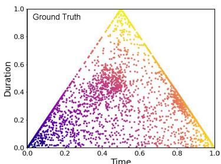
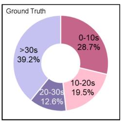
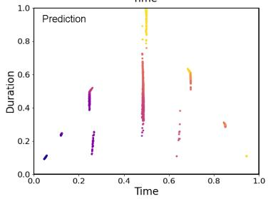
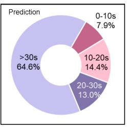
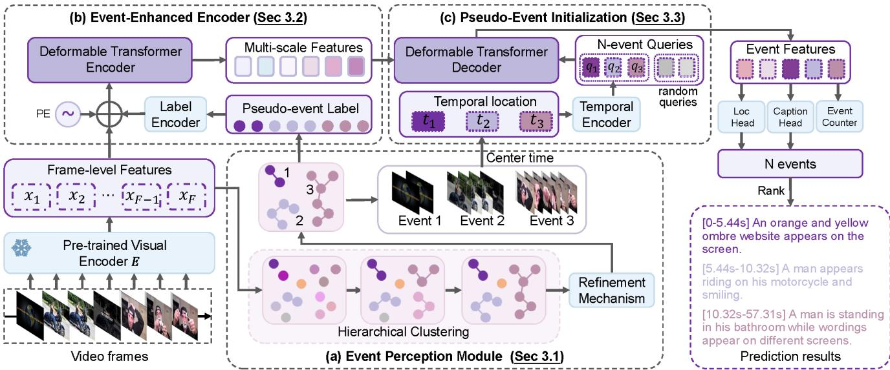
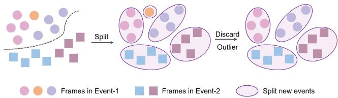
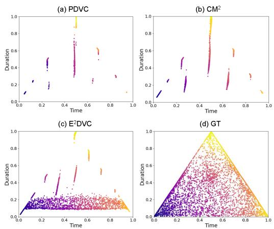
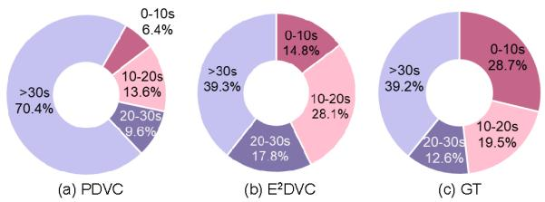
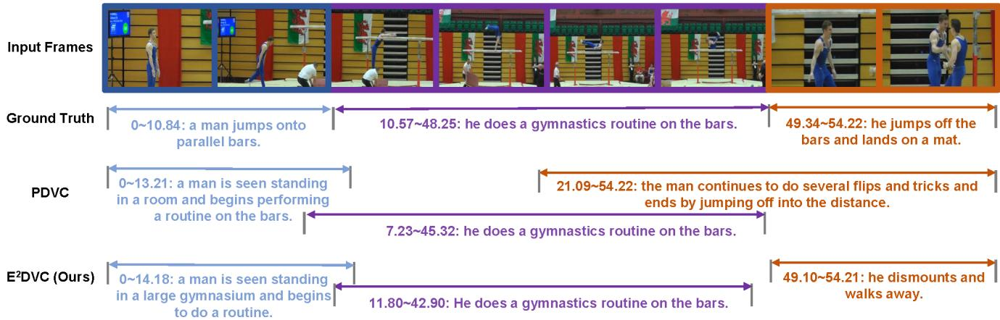

# Event-Equalized Dense Video Captioning

Kangyi Wu\* Pengna Li\* Jingwen Fu Yizhe Li Yang Wu Yuhan Liu Jinjun Wang Sanping Zhou†

National Key Laboratory of Human-Machine Hybrid Augmented Intelligence, National Engineering Research Center for Visual Information and Applications, Institute of Artificial Intelligence and Robotics, Xi’an Jiaotong University

{wukangyi747600, sauerfisch, fu1371252069, lyz0515, wuyang\_cc, liuyuhan200095}@stu.xjtu.edu.cn jinjun@mail.xjtu.edu.cn spzhou@xjtu.edu.cn

## Abstract

Dense video captioning aims to localize and caption all events in arbitrary untrimmed videos. Although previous methods have achieved appealing results, they stillface the issue of temporal bias, i.e, models tend to focus more on events with certain temporal characteristics. Specifically, 1) the temporal distribution ofevents in training datasets is uneven. Models trained on these datasets will pay less attention to out-of-distribution events. 2) long-duration events have more frame features than short ones and will attract more attention. To address this, we argue that events, with varying temporal characteristics, should be treated equally when it comes to dense video captioning. Intuitively, different events tend to have distinct visual differences due to varied camera views, backgrounds, or subjects. Inspired by that, we intend to utilize visual features to have an approximate perception ofpossible events and pay equal attention to them. In this paper, we introduce a simple but effective framework, called Event-Equalized Dense Video Captioning (E2DVC) to overcome the temporal bias and treat all possible events equally. Experimental results on ActivityNet Captions and YouCook2 dataset validate the effectiveness of the proposed methods and show State-of-the-art (SOTA) performance on dense video captioning.

## 1. Introduction

In recent years, an increasing number of works have begun to focus on video understanding[21, 22, 28, 38, 44, 50, 57] where video captioning is a challenging branch. Conventional video captioning [5, 12, 33, 34, 42] aims to generate a natural sentence to describe the main event of a short video clip. However, they face considerable challenges when applied to realistic videos which are usually long, untrimmed, and contain a variety of events. To address the challenge, dense video captioning (DVC) [19] is proposed to automatically localize and caption all events in an untrimmed video.

  
(a) Data Event Distribution

  
(b) Event Duration Ratio  
Figure 1. Temporal distribution of ground truth and predicted events on ActivityNet Captions training set. The prediction is from PDVC [48]. (a) The distribution of all events in time dimensions. Horizontal and vertical axes represent the normalized center time position and duration respectively. It’s obvious that events are distributed unevenly in these two temporal dimensions. (b) The proportion of the number of events in different duration intervals. It’s clear that the predicted short-duration events are much fewer than the ground truth.

Existing DVC methods [6, 17, 18, 30, 60] follow a common pipeline to first extract image features from downsampled video frames with pre-trained image encoder [15, 35, 39, 46] and then delicately design a framework to exploit event representations from them. Although state-ofthe-art (SOTA) performance has been achieved, existing methods still face the issue of temporal bias, which means that models will pay more attention to events with certain temporal characteristics while overlooking some other ones. The temporal bias can be divided into two categories based on its causes: 1) Data distribution bias. As shown in Figure 1(a), the predicted events are scattered in the time axes. Events are completely ignored or mis-localized for most timestamps. This is because the models tend to learn from the dataset which part of the video to focus on and the ground truth events are unevenly distributed in this dimension. 2) Event duration bias. This bias results from the duration variation between events. Since short-duration events have fewer frames, their features are easy to be overwhelmed by others. Figure 1(b) shows the proportion of events in different duration intervals. It’s obvious that the predicted short-duration events are much fewer than the ground truth. This means that most short-duration events are totally ignored or localized with large deviations.

To address the issues above, we argue that every event, regardless of its temporal characteristics, should share equal importance when it comes to dense video captioning. To achieve this goal, we need to reduce the influence of temporal information and ensure that attention is evenly distributed across all events. However, the challenge lies in how to perceive possible events in a video without relying on temporal information. Intuitively, different events have large visual differences considering their varied camera views, backgrounds, or subjects [19]. Inspired by this, we intend to utilize the differences in pure visual features to gain an initial perception of segments where events may exist. Equal Attention will be allocated to all these segments.

In this paper, we propose a novel Event-Equalized Dense Video Captioning framework (E2DVC) to overcome the temporal bias and treat each potential event equally. First, a non-trainable Event Perception module (EPM) is devised to utilize agglomerative hierarchical clustering algorithm [7] on visual features to generate video frame clusters. These clusters are segments with potential events. A refinement mechanism is designed to split frames that are discontinuous in time and discard isolated frames. These refined clusters are regarded as pseudo-events. Since the clustering process is non-trainable, the result will not be affected by the uneven data distribution. Additionally, since agglomerative hierarchical clustering is a non-uniform method, frames from short-duration events can also be equally clustered into the same category as the long ones.

With the pseudo-events, equal attention is required among them. To achieve this, a Pseudo-event Initialization module (PEI) is introduced. Concretely, we calculate the temporal locations of these pseudo-events (center timestamps) and use a temporal encoder to encode them as pseudo-event queries. These queries serve as the initial guess of the event’s locations to help the model allocate its attention. A novel Event-Enhanced Encoder (EEE) is also proposed to explore frame-frame and frame-event relationships during the encoding process.

Our E2DVC can determine and localize events with higher precision which further improves the dense video captioning performance. The main contributions of our work can be summarized as:

• We identify the issue of temporal bias and propose an Event-Equalized Dense Video Captioning framework to treat all events equally.

• We propose a non-trainable Event Perception module, a Pseudo-Event Initialization module, and an Event-Enhanced Encoder to ensure all events are noticed. Our components could perceive the input video with pure visual features and allocate equal attention to events with large temporal variations.

• Comprehensive experiments have been conducted on the ActivityNet Captions [19] and the YouCook2 [58] datasets to verify the effectiveness of our model in the dense video captioning task.

## 2. Related Works

Dense Video Captioning. Dense video captioning consists of two subtasks: event localization [9, 11, 25, 26] and event captioning [24, 31, 42]. Based on different pipelines, the methods can be divided into two categories: two-stage methods and end-to-end methods. For two-stage methods, they solve dense video captioning by a “localize-thendescribe" scheme. These methods first predict a set of event proposals with corresponding time boundaries and then generate a detailed sentence description for each proposal by further extracting semantic knowledge and visual context. Krishna et al. [19] propose the first two-stage dense video captioning model. Wang et al. [43] and Yang et al. [54] focus on mining useful contextual information to improve DVC performance. Iashin et al. [15, 16] construct architectures to utilize any number of modalities for event description. However, these methods lack inter-task interactions and heavily rely on hand-crafted components.

To address the limitations above, recent methods follow the end-to-end pipeline [3, 6, 18, 23, 30, 36, 53, 60]. Li et al. [23] propose a joint and global optimization of detection and captioning. Islam et al. [17] and Deng et al. [6] solve DVC in hierarchical ways where the former follows a bottom-up structure while the latter proposes a top-down framework. Mun et al. [30] and Zhou et al. [60] leverage visual and linguistic context from prior events for coherent storytelling while the latter proposes an additional memory module and streaming decoding algorithm to support streaming video input. Kim et al. [18] utilize external memory to incorporate prior video-to-text knowledge to generate natural descriptions. Yang et al. [53] reformulate sentence boundaries of transcribed speech as pseudo-events to achieve large-scale video data and propose a multi-modal pertaining model trained on this dataset. However, it remains a significant challenge to detect all events and localize them with high precision in a video. We propose a simple yet effective approach to enable the model to treat all events equally thus improving the DVC performance.

  
Figure 2. The overview of our E2DVC. Our model follows an encoder-decoder structure. Given an input video, a pre-trained visual encoder is adopted to extract frame-level features. (a) Event Perception Module (EPM). Based on visual features similarity, these frames are clustered to multiple uneven segments and a refinement mechanism is utilized to discard outliers. The remaining segments are assigned with pseudo-events. (b) Event-Enhanced Encoder (EEE). By incorporate the pseudo-event labels with visual frame features, it could enhance the encoder’s ability to explore frame-event and event-event relationships, preventing short-duration events from being overwhelmed. (c) Pseudo-Event Initialization module (PEI). Given the pseudo events, we calculate and encode their temporal locations and use the embedding to initialize the queries, helping the model allocate its attention equally among them. Finally, we obtain the predictions of the event-number, time localization and event captions through heads.

Query Formulation in Transformers. Since Detection Transformer (DETR)[2] has achieved promising performance in object detection without the need for any handcrafted components, many researchers have studied and further modified the model. Among these, research on decoder query formulation has received significant attention. Conditional DETR [29] learns a conditional spatial query by encoding the reference points as the query position embedding to help focus on distinct regions. Anchor DETR [49] and DAB-DETR [27] utilize anchor boxes to initialize queries to improve interpretability and force each query to only pay attention to a specific region in the object detection task. DN-DETR [20] additionally adds ground-truth bounding boxes with noises into decoder queries to reduce bipartite graph matching difficulty and achieve faster convergence. Group DETR [4] utilizes multiple groups of queries to conduct one-to-many assignments in order to speed up training and improve performance. Decoupled DETR [55] discovers that using shared queries for classification and localization will lead to suboptimal results. Instead, they introduce a taskaware query generation module to decouple these two tasks. DualDETR [62] presents a joint query initialization strategy to align queries from the instance level and boundary level to obtain better performance in the Temporal Action Detection task. In this paper, we introduce the query formulation strategies into the Dense Video Captioning task. Our E2DVC employs a novel Pseudo-Event Initialization module to initialize the decoder queries with pseudo-events to ensure that every possible events are treated equally.

## 3. Method

Our goal is to treat each event equally and localize and caption all events without omission. To realize this, we introduce an Event Perception module (Section 3.1) with a delicately devised refinement mechanism to perceive the input video with only visual features available and select those segments where events may exist. Furthermore, A novel Event-Enhanced Encoder (Section 3.2) is also introduced to incorporate the pseudo-event labels into the self-attention framework in order to explore frame-frame and frame-event relationships . Meanwhile, we design an Pseudo Event Initialization module (Section 3.3) to ensure that the model pays equal attention to those pseudo-event locations. The overall framework of E2DVC is illustrated in Figure 2, which follows a standard parallel encoder-decoder structure with subtask heads. The objective is to generate N pairs of events and captions $\{ ( t _ { s } ^ { n } , t _ { e } ^ { n } , C a p ^ { n } ) \} _ { n = 1 } ^ { N } .$ , where N denotes the number of events detected in the video. $t _ { s } ^ { n }$ and $t _ { e } ^ { n }$ denote the start and end timestamps of the n-th event. $C a p ^ { n }$ denotes the corresponding caption. The details of task heads and training loss will be introduced in Section 3.4 and 3.5.

  
Figure 3. Illustration of the refinement mechanism. Different shapes denote different events. In the same events, frames with different color are temporal consistent. Our refinement mechanism could split the temporal inconsistent events into multiple new consistent events and discard the extremely short events which is short than the defined temporal event threshold.

## 3.1. Event Perception Module

To perceive the whole video with only visual features and pick out those pseudo-events, we devise an event perception module with agglomerative hierarchical clustering. The input video is first sampled in a certain ratio to obtain the image frames $V ~ { \bar { = } } ~ \{ v _ { i } \} _ { i = 1 } ^ { F }$ where $F$ denotes the number of frames. Then, a pre-trained image encoder E [15, 35, 39, 46] is utilized to extract visual features $X = \{ x _ { i } \} _ { i = 1 } ^ { F }$ from each video frame. Based on the visual feature similarities, we perform a hierarchical clustering algorithm to obtain pseudo-events.

In this paper, we choose the Agglomerative clustering algorithm because it doesn’t assume any particular cluster shape and sizes. It could progressively merge the individual frames to generate uneven clusters with different sizes and assign them with pseudo-event labels. Specifically, each visual feature $x _ { i }$ is initially considered an individual cluster with one element. We calculate the pairwise distance matrix among all the clusters. The two clusters that are the most close in feature space are combined into a bigger cluster. Then we recalculate the distance matrix. This procedure is iterated until the final number of clusters is equal to $N _ { c }$ which is a hyper-parameter which is set to control the granularity of the clustering process. Finally, we obtain a number of clusters C which can be formulated as

$$
\mathbb { C } = \{ \mathbb { C } _ { i } \} _ { i = 1 } ^ { N _ { c } } = \{ \{ x _ { i } ^ { j } \} _ { j = 1 } ^ { N _ { c } ^ { i } } \} _ { i = 1 } ^ { N _ { c } } ,\tag{1}
$$

in which $\mathbb { C } _ { i }$ denotes the i-th cluster and $N _ { c } ^ { i }$ denotes the number of this cluster.

Additionally, since the timestamps of the frame features are not considered during the clustering process, some clustered frames are temporally inconsistent with others in the same cluster. Considering that frames belonging to the same event should be temporally consistent, as illustrated in Figure 3, we utilize a refinement mechanism to split the temporally discontinuous events into multiple new consistent events based on the timestamps of the video frames. Moreover, since an event typically occupies a certain duration, we devise a temporal event threshold τ. If the durations of the events are shorter than $\tau ,$ these events would be considered outliers and discarded. The remains are regarded as final pseudo-events. Our framework will pay special attention to these pseudo-event locations with improved localization and captioning performance.

## 3.2. Event-Enhanced Encoder

After obtaining the pseudo events, we directly assign the video frames with their pseudo labels. In this section, we introduce how to incorporate the assigned labels with visual features into transformer encoder to get better representations. We hope that in the process of encoding frame features, the focus should not only be on the frame-frame relationships but also on the frame-event one. In this way, frame features from short-duration events will not be overwhelmed during the self-attention process.

To realize this, we devise an Event-Enhanced Encoder (EEE) to add pseudo-event labels to the frame feature encoding process. Specifically, for each video frame $v _ { i } .$ , we have its pseudo-event label $l _ { i }$ . The pseudo-event label $l _ { i }$ is transformed into a label embedding $l e _ { i }$ with a label encoder, which consists of a learnable dictionary and a multilayer perceptron. During the encoding process, we concatenate the frame-level features $X = \{ x _ { i } \} _ { i = 1 } ^ { F }$ with their corresponding label embedding and positional embedding (PE). They are fed into the deformable transformer encoder and a multi-scale convolution layers to extract multi-scale features with frame-frame and frame-event relationships.

## 3.3. Pseudo-Event Initialization

Given the pseudo-events from Event Perception module, we want the model to pay equal attention to their temporal locations. Previously, the decoder aimed to query the eventlevel features from all frame features directly with $N _ { q }$ randomly initialized and learnable event queries. In this way, each event query is associated with multiple random temporal locations and learns which part to focus on from the uneven training dataset, leading to those events with out-ofdistribution temporal characteristics easy to be overlooked.

To address this issue, we devise a novel Pseudo-Event Initialization (PEI) module to initialize those event queries with pseudo-events. Specifically, given a pseudo-event $E _ { i } = \stackrel { \textstyle - } { \{ x _ { i , j } \} } _ { j = 1 } ^ { N _ { i } }$ in which $L _ { i }$ is the number of frames for $N _ { i }$ , we calculate its center temporal location $t _ { i }$ (reference points) with:

$$
t _ { i } = ( t _ { i , 1 } + t _ { i , L _ { i } } ) / 2 ,\tag{2}
$$

in which $t _ { i , j }$ is the timestamp for frame feature $x _ { i , j }$ . In this way, for each pseudo-event $E _ { i }$ , we have its reference points $t _ { i }$ . We calculate the inverse sigmoid $( I n v _ { S i g } )$ of $t _ { i }$ and use temporal encoder $f _ { t }$ [40] to get the temporal embedding. Instead of randomly initializing the event queries, we initialize them with the positional embeddings of all pseudoevents. The process can be formulated as:

$$
q _ { i } = f _ { t } ( I n v _ { S i g } ( t _ { i } ) ) ,\tag{3}
$$

in which $q _ { i }$ is the i-th event query. What’s more, considering that the pseudo-events may not cover all possible events in the ground truth, we also concatenate $N _ { r }$ randomly initialized queries with these pseudo-event queries together. In this way, the event queries explicitly prioritize the locations of these pseudo-events. This significantly enhances the performance of event localization and further improves the event captioning performance as well.

## 3.4. Task Heads

Our work follows an encoder-decoder framework with a parallel decoding structure [18, 48, 52]. Given the event features, three parallel prediction heads are utilized to do dense video captioning.

Localization Head. The localization head is responsible for box prediction and binary classification for each event query $q _ { i }$ . It outputs a set of tuples $\{ t _ { s } ^ { i } , t _ { e } ^ { i } , c ^ { i } \} _ { i = 1 } ^ { N _ { q } }$ , where $t _ { s } ^ { i }$ and $t _ { e } ^ { i }$ denote the start and end timestamps and $c ^ { i }$ represents the localization confidence.

Captioning Head. We utilize LSTM [14] as the backbone of our captioning head. At each timestamp $t ,$ we feed context features $z _ { i , t } .$ , event query features $q _ { i }$ and previous words $\{ w _ { i , j } \} _ { j = 1 } ^ { t - 1 }$ into the LSTM model to get the current word $w _ { i , t }$ . As the sentence is generated, the captioning head produces the complete sentence $S _ { i } = w _ { i , 1 } , . . . , w _ { l , T }$ , where $T$ denotes the length of the sentence.

Event Counter. It aims to detect the number of events in the given video. It first compresses the most salient information of event queries $Q$ to a global feature vector with a max-pooling layer and predicts a fixed-size vector $f _ { c o u n t }$ with an FC layer with softmax activation. In $f _ { c o u n t } .$ , each value refers to the possibility of a specific number. During the inference stage, the event number $N _ { e v e n t }$ is obtained by $N _ { e v e n t } = a r g m a x ( f _ { c o u n t } )$ . The final outputs are obtained by selecting $N _ { e v e n t }$ events with the highest confidence score c which is calculated by:

$$
c _ { i } = c _ { i } ^ { l o c } + \frac { \mu } { M _ { i } ^ { \gamma } } \sum _ { t = 1 } ^ { M _ { i } } l o g ( c _ { i , t } ^ { c a p } ) ,\tag{4}
$$

in which $M _ { i }$ is the number of words for the i-th event caption. $C _ { i } ^ { l o c }$ is the localization confidence for the i-th event. $c _ { i , t } ^ { c a p }$ is the confidence score for the t-th word for the i-th event. $\mu$ and γ are two hyper-parameters to control the influence of the captioning confidence.

## 3.5. Loss Function

Suppose $N _ { q }$ events are predicted with their localizations and captions, Hungarian algorithm [2] is utilized to find the best bipartite matching results between the predicted events and the ground truth, during which the generalized IOU [37] between the predicted temporal segments and grund-truth segments is calculated as $L _ { g i o u }$ and the focal loss between the predicted classification score and the ground-truth label is calculated as $L _ { c l s }$ . The matched event pairs are selected to calculate the set prediction loss, which is the weighted sum of gIOU loss, classification loss, countering loss, and caption loss. The loss function is formulated as:

$$
L = \alpha _ { g i o u } L _ { g i o u } + \alpha _ { c l s } L _ { c l s } + \alpha _ { e c } L _ { e c } + \alpha _ { c a p } L _ { c a p } ,\tag{5}
$$

in which $L _ { c a p }$ is the cross-entropy loss between the predicted word probability and the ground truth normalized by the caption length M. $L _ { e c }$ is the cross-entropy loss between the predicted count distribution and the ground truth. More details can be found in Supplementary.

## 4. Experiments

## 4.1. Experimental Setup

Datasets. We evaluate our method on the two commonly used dense video captioning benchmark datasets: ActivityNet Captions [19] and YouCook2 [58]. ActivityNet Captions includes over 20000 long videos covering a wide range of human daily activities and actions. Each video spans about 120s and is annotated with 3.7 temporally localized sentences on average. YouCook2 consists of 2000 long untrimmed videos from 89 cooking recipes. Generally, each video lasts approximately 320s and has 7.7 annotated segments with the corresponding sentences. For both datasets, we adhere to the standard split for training, validation, and testing. It’s worth noting that we only use those videos that are still online on YouTube, leading to roughly 7% less videos compared to the original datasets.

Implementation Details. For both datasets, we sample video frames at a rate of 1 FPS (one frame per second) and subsample or pad the sequence of frames to reach a total of F frames, where F is set to 100 for ActivityNet Captions and 200 for YouCook2. We use CLIP ViT-L/14 [8, 35] to extract clip visual features for video frames [18]. To further investigate the generalization ability of our model to different frame-level features, we also evaluate our model based on C3D [39] features provided by PDVC [48] and TSN [46] features provided by [59]. We utilize a twolayer deformable transformer that incorporates multi-scale deformable attention across four levels. We adopt the Agglomerative Hierarchical cluster algorithm for generating pseudo events. For ActivityNet Captions, we set the number of event queries to 10, while for YouCook2, we set it to 100. For the event counter, we select a maximum count of 10 for the ActivityNet Captions dataset and 20 for the YouCook2 dataset. We set $N _ { c }$ to 5 and τ to 4. Other model hyperparameters follow the recipe of PDVC [48].

Table 1. Comparison with the state-of-the-art methods for dense video captioning in ActivityNet Captions. B4/M/C is short for BLEU4/METEOR/CIDEr. \* indicates the results of our implementation using the official code. The best performance results are highlighted for each feature type. We also present results from those pretrained models.
<table><tr><td>Method</td><td>Features</td><td>Pretrain</td><td>B4↑ M↑</td><td>C↑</td><td>SODA_c↑</td></tr><tr><td>UEDVC [56]</td><td>C3D</td><td>√</td><td>1 =</td><td>=</td><td>5.50</td></tr><tr><td>Vid2Seq [53]</td><td>CLIP</td><td>√</td><td>8.50 =</td><td>30.10</td><td>5.80</td></tr><tr><td>OmniVID [45]</td><td>1</td><td>√</td><td>1.73 7.54</td><td>26.00</td><td>5.60</td></tr><tr><td>ECHR [47]</td><td>C3D</td><td>x</td><td>1.82 7.20</td><td>14.7</td><td>3.20</td></tr><tr><td>E2ESG [61]</td><td>C3D</td><td>x</td><td>3.50 1</td><td>25.00</td><td>1</td></tr><tr><td>PDVC [48]</td><td>C3D</td><td>x</td><td>1.65 7.50</td><td>25.87</td><td>5.26</td></tr><tr><td>E2DVC</td><td>C3D</td><td>x</td><td>1.79 7.54</td><td>26.83</td><td>5.32</td></tr><tr><td>MT [59]</td><td>TSN</td><td>x</td><td>0.30 3.20</td><td>14.70</td><td>1</td></tr><tr><td>PDVC [48]</td><td>TSN</td><td>x</td><td>1.78 7.96</td><td>28.96</td><td>5.44</td></tr><tr><td>E2DVC</td><td>TSN</td><td>x</td><td>2.03 8.02</td><td>29.91</td><td>5.77</td></tr><tr><td>CM2 [18]</td><td>CLIP</td><td>x</td><td>2.38 8.55</td><td>33.01</td><td>6.18</td></tr><tr><td>PDVC* [48]</td><td>CLIP</td><td></td><td>2.21 8.06</td><td>29.97</td><td>5.92</td></tr><tr><td>E2DVC</td><td>CLIP</td><td>x x</td><td>2.43 8.57</td><td>33.63</td><td>6.13</td></tr></table>

Table 2. Comparison with the state-of-the-art methods for dense video captioning on Youcook2. Since C3D features for YouCook2 are not publicly available, we fail to provide the results.
<table><tr><td>Method</td><td>Features</td><td>Pretrain</td><td>B4↑ M↑</td><td>C↑</td><td>SODA_c↑</td></tr><tr><td>Vid2Seq [53]</td><td>CLIP</td><td>√</td><td>9.30 -</td><td>47.10</td><td>7.90</td></tr><tr><td>MT [59]</td><td>TSN</td><td>x</td><td>1.15 5.00</td><td>9.30</td><td>1</td></tr><tr><td>PDVC [48]</td><td>TSN</td><td>x</td><td>0.80</td><td>4.75 22.71</td><td>4.42</td></tr><tr><td>E2DVC</td><td>TSN</td><td>x</td><td>1.05</td><td>4.76 23.15</td><td>4.31</td></tr><tr><td>CM² [18]</td><td>CLIP</td><td>x</td><td>1.63</td><td>6.08 31.66</td><td>5.34</td></tr><tr><td>PDVC*[48]</td><td>CLIP</td><td>x</td><td>1.40</td><td>5.56 29.69</td><td>4.92</td></tr><tr><td>E²DVC</td><td>CLIP</td><td>x</td><td>1.68</td><td>6.11 34.26</td><td>5.39</td></tr></table>

Evaluation Metrics. We evaluate our model in two aspects: 1) To assess dense captioning performance, we adopt the official evaluation tool from ActivityNet Challenge [13], which use the metrics BLEU4 [32], METEOR [1], and CIDEr [41] to compute the average precision of matched pairs between generated captions and the ground truth. These scores are averaged over IOU at {0.3, 0.5, 0.7, 0.9}. BLEU4 focuses on n-gram precision, METEOR incorporates semantic matching, and CIDEr emphasizes consensus among multiple references. Moreover, we employed SODA\_c [10] for measuring the storytelling quality of generated captions. 2) For evaluating localization performance, we reported the average precision, average recall, and their harmonic mean, F1 score across IOU thresholds of {0.3, 0.5, 0.7, 0.9}.

Table 3. Comparison to state-of-the-art methods for event Localization. We report the results on ActivityNet Captions and Youcook2 datasets. PT denotes Pretrain. Pre./Rec. is short for Precision/Recall.
<table><tr><td rowspan=1 colspan=1>Method</td><td rowspan=1 colspan=1>Features PT</td><td rowspan=1 colspan=2>ActivityNetPre.↑ Rec.↑ F1↑</td><td rowspan=1 colspan=1>YouCook2Pre.↑ Rec.↑ 1F1↑</td></tr><tr><td rowspan=1 colspan=1>Vid2Seq [53]</td><td rowspan=1 colspan=1>CLIP V</td><td rowspan=1 colspan=2>53.9052.7053.29</td><td rowspan=1 colspan=1>27.8027.9027.84</td></tr><tr><td rowspan=1 colspan=1>E2ESG [61]</td><td rowspan=1 colspan=1>C3D  x</td><td rowspan=1 colspan=2>1            一</td><td rowspan=4 colspan=1>20.60 20.70 20.6533.3824.7628.4332.3722.8926.81</td></tr><tr><td rowspan=1 colspan=1>MFT [51]</td><td rowspan=1 colspan=1>TSN  x</td><td rowspan=3 colspan=2>51.41 24.31 33.0156.81 53.71 55.2156.3853.2754.78</td></tr><tr><td rowspan=1 colspan=1>CM2 [18]</td><td rowspan=1 colspan=1>CLIP  x</td><td rowspan=1 colspan=1>56.81 53.71</td></tr><tr><td rowspan=1 colspan=1>PDVC* [48]</td><td rowspan=1 colspan=1>CLIP  x</td></tr><tr><td rowspan=1 colspan=1>E2DVC</td><td rowspan=1 colspan=1>C3D  x</td><td rowspan=2 colspan=2>57.7154.7056.1757.77 55.14 56.42</td><td rowspan=3 colspan=1>1      1     134.13 25.01 28.8734.7524.3628.64</td></tr><tr><td rowspan=1 colspan=1>E2DVC</td><td rowspan=1 colspan=1>TSN  x</td></tr><tr><td rowspan=1 colspan=1>E2DVC</td><td rowspan=1 colspan=1>CLIP  x</td><td rowspan=1 colspan=2>57.7054.67 56.14</td></tr></table>

## 4.2. Comparison with State-of-the-art Methods

Dense Video Captioning Performance. In Table 1 and Table 2, we compare our E2DVC to the state-of-the-art methods for the task of dense video captioning on the ActivityNet Captions and YouCook2 datasets. Compared to baseline PDVC [48], our method achieves substantial gains for three different types of characteristics. From Table 1, our method achieves the best scores over BLEU4, METEOR, CIDEr even compared to the pretrained methods that use extra videos for pretraining. For Table 2, Vid2Seq [53] performs better on YouCook2 dataset than our method. This is because the YouCook2 dataset has fewer videos for training but a more diverse range of action types and semantic descriptions. Vid2seq uses an extra 1 million videos for pretraining, thus having a great advantage over our method. We achieve the best scores among all non-pretrained methods. This validates that by treating each event equally, our method will not overlook those out-of-distribution events and caption them with improved quality.

Event Localization Performance. In Table 3, we compare our method with the state-of-the-art methods for the event localization task. For the ActivityNet Captions dataset, our method obtains the highest scores on the Precision, Recall, and F1 metrics among all. On the YouCook2 dataset, we achieve the highest performance over Precision and F1 scores even compared with the pretaining method. This is because our initialized queries will focus on each temporal location with high event possibilities. In this way, few events will be overlooked. Also, our event-enhanced encoder has the pseudo-event labels as an additional input. This will help the transformer encoder to perceive the visual differences between video frames, thus preventing shortduration videos from being overwhelmed and helping the model obtain more accurate boundaries.

Table 4. Ablation on the designed components. We report the results on YouCook2. PEI denotes the Pesudo-Event initialization module. EEE denotes the Event-Enhanced encoder module. Without PEI, the queries will be randomly initialized and are updated during the training process. Without EEE, we directly fuse visual features and positional embedding for each video frame together.
<table><tr><td>PEI</td><td>EEE</td><td>BLEU4↑</td><td>METEOR↑</td><td>CIDEr↑</td><td>SODA_c↑</td><td>F1↑</td></tr><tr><td>x</td><td>x</td><td>1.40</td><td>5.56</td><td>29.69</td><td>4.92</td><td>26.81</td></tr><tr><td>x</td><td>√</td><td>1.49</td><td>5.75</td><td>31.15</td><td>5.13</td><td>28.04</td></tr><tr><td>√</td><td>x</td><td>1.56</td><td>5.88</td><td>30.92</td><td>5.27</td><td>28.13</td></tr><tr><td>√</td><td>√</td><td>1.68</td><td>6.11</td><td>34.26</td><td>5.39</td><td>28.64</td></tr></table>

Table 5. Ablation on varying number of clusters. We report the results on the Youcook2 dataset. The best and second performance results are highlighted.
<table><tr><td> $N _ { c }$ </td><td>BLEU4↑</td><td>METEOR↑</td><td>CIDEr↑</td><td>SODA_c↑</td><td>F1↑</td></tr><tr><td>0</td><td>1.40</td><td>5.56</td><td>29.69</td><td>4.92</td><td>26.81</td></tr><tr><td>1</td><td>1.45</td><td>5.74</td><td>31.45</td><td>5.15</td><td>26.72</td></tr><tr><td>2</td><td>1.43</td><td>5.92</td><td>31.32</td><td>5.14</td><td>27.66</td></tr><tr><td>3</td><td>1.57</td><td>5.95</td><td>32.57</td><td>5.27</td><td>27.27</td></tr><tr><td>4</td><td>1.51</td><td>5.78</td><td>30.89</td><td>5.04</td><td>27.71</td></tr><tr><td>5</td><td>1.68</td><td>6.11</td><td>34.26</td><td>5.39</td><td>28.64</td></tr><tr><td>6</td><td>1.57</td><td>5.90</td><td>33.27</td><td>5.26</td><td>28.11</td></tr><tr><td>7</td><td>1.29</td><td>5.78</td><td>30.10</td><td>5.16</td><td>28.02</td></tr></table>

Table 6. Ablation on varying temporal event threshold τ .
<table><tr><td>T</td><td>BLEU4↑</td><td>METEOR↑</td><td>CIDEr↑</td><td> $\mathrm { S O D A } \_ c \uparrow$ </td><td>F1↑</td></tr><tr><td>0</td><td>1.32</td><td>5.56</td><td>29.59</td><td>5.00</td><td>27.21</td></tr><tr><td>1</td><td>1.35</td><td>5.57</td><td>31.69</td><td>5.17</td><td>27.51</td></tr><tr><td>2</td><td>1.42</td><td>5.68</td><td>30.25</td><td>5.08</td><td>27.70</td></tr><tr><td>3</td><td>1.59</td><td>5.79</td><td>31.76</td><td>5.12</td><td>27.48</td></tr><tr><td>4</td><td>1.68</td><td>6.11</td><td>34.26</td><td>5.39</td><td>28.64</td></tr><tr><td>5</td><td>1.57</td><td>5.89</td><td>31.50</td><td>5.22</td><td>28.41</td></tr><tr><td>6</td><td>1.51</td><td>5.85</td><td>29.51</td><td>5.18</td><td>28.62</td></tr><tr><td>7</td><td>1.46</td><td>5.83</td><td>31.13</td><td>5.24</td><td>28.24</td></tr></table>

## 4.3. Ablation Studies

Analysis of Different Components in $\mathbf { E } ^ { 2 } \mathbf { D } \mathbf { V } \mathbf { C } .$ As illustrated in Table 4, we present an ablation study to explore the effectiveness of the Pseudo-Event Initialization module (PEI) and the Event-Enhanced Encoder (EEE). PEI initializes decoder queries with pseudo-event locations to ensure equal attention to all potential events, while EEE prevents those short-duration events from being overwhelmed during encoding. The results show that PEI significantly improves both dense video captioning and event localization performance, enabling more precise event detection and better captions by focusing queries on specific pseudoevent locations. Although the improvement from EEE is smaller, it still outperforms the baseline by enhancing eventlevel knowledge extraction. Combining PEI and EEE yields the best performance, which demonstrates the effectiveness of our proposed components.

  
Figure 4. The distribution of the predicted and ground-truth events on ActivityNet Captions. Horizontal and vertical axes represent the normalized center time position and duration respectively. We compare our methods with PDVC [48] and $\mathrm { C M } ^ { 2 }$ [18].

  
Figure 5. Different events duration proportion in ActivityNet Captions. Compared with PDVC, our method E2DVC could identify more short events and the distribution is more close to GT.

Parameter Analysis on the Number of Clusters $N _ { c }$ . We try different numbers of clusters $N _ { c }$ on the YouCook2 dataset. Table 5 shows the performance. The first row is the result from the baseline. When the cluster number is set to 1, all video frames are clustered together as a single pseudoevent, where the model only adds one additional query to focus on the middle of the video. In this case, the performance shows a slight improvement compared to the baseline. As the cluster number increases, video frames will be distinguished more finely based on visual differences. The best performance appears when $N _ { c }$ is set to 5. When $N _ { c }$ equals to the number of video frames, each frame will be allocated a single query to focus on. The model’s attention will be distracted and the real events may be overlooked.

Parameter Analysis on the Event Threshold τ . The parameter decides the lower-bound of pseudo-events duration. In the Table 6, we presents the results by changing the event threshold τ in the YouCook2 dataset. When τ is set too small, the performance drops significantly. It’s because even isolated frames are treated as pseudo-events and are allocated certain decoder queries to focus on, which distracts the attention of the model. The best performance appears when τ is set to 4. As τ increases, the overall performance decreases. However, the performance of event localization remains at a high level. This is because long-duration events account for the majority and discarding some short-duration events will not hurt performance on long-duration ones.

  
Figure 6. Example visualizations of dense event captioning prediction on ActivityNet Captions. The color of the image border represents the category of the pseudo-event. From top to down, we show the results from the ground truth, the baseline (PDVC) and our method.

## 4.4. Qualitative Results

Visualization of Event Temporal Distribution. Figure 4 shows the generated event temporal distribution from PDVC [48], CM2 [18] and our method E2DVC. As can be seen from the figure, our method generates more shortduration events compared with the other two. The distribution predicted by our methods is more similar to the ground truth. We noticed that for long-duration events, we still cannot generate the precise duration. This is because the model is trained by captioning loss and localization loss together. For long-duration events, due to the large number of frames, some localization deviations have little effect on the final captioning performance. Even in some cases, predicting a shorter duration can help in describing the event more delicately, while predicting a longer duration allows for a more comprehensive caption of the event. Therefore, in order to achieve better captioning performance, some localization accuracy may be sacrificed.

Visualization of Events Duration Statistics. In Figure 5, we present the event duration statistics in the ActivityNet Captions dataset. Our proposed E2DVC outperforms the baseline PDVC by identifying a greater number of shortduration events. Besides, its event duration distribution is closer to the ground truth. This indicates that E2DVC is more effective at capturing events of varying lengths, particularly short-duration ones. By better aligning with the GT distribution, E2DVC demonstrates improved event localization performance, highlighting its ability to handle a wider range of event durations, leading to more accurate and comprehensive video captioning.

Visualization of Predicted Example. Figure 6 visualizes an example of dense video captioning predictions of PDVC and our method. Compared with PDVC, our method can localize short-duration events more accurately. This also helps improve the video captioning performance. The reason is that since short-duration events have fewer frames, they are more sensitive to localization deviations. If too many irrelevant frames are localized in the same short events, the description will become inaccurate.

## 5. Conclusion

In conclusion, we propose the Event-Equalized Dense Video Captioning framework to address temporal bias and treat all events equally in video captioning. By leveraging a non-trainable Event Perception module with agglomerative hierarchical clustering, we identify pseudo-events and ensure temporal continuity through a refinement mechanism. The Event-Prior Initialization and Event-Prior Encoder modules allocate equal attention to all events, enhancing the model’s precision, particularly for short-duration events. Experimental results on ActivityNet Captions and YouCook2 datasets validate the effectiveness of our approach, showing improved dense video captioning performance. E2DVC offers a robust solution for handling diverse event durations and temporal distributions, making it a promising advancement in dense video captioning.

## 6. Acknowledgement.

This work was supported in part by the National Natural Science Foundation of China under Grants 62088102, U24A20325 and 12326608, and Key Research and Development Plan of Shaanxi Province under Grant 2024PT-ZCK-80.

## References

[1] Satanjeev Banerjee and Alon Lavie. Meteor: An automatic metric for mt evaluation with improved correlation with human judgments. In Proceedings of the acl workshop on intrinsic and extrinsic evaluation measuresfor machine translation and/or summarization, pages 65–72, 2005. 6

[2] Nicolas Carion, Francisco Massa, Gabriel Synnaeve, Nicolas Usunier, Alexander Kirillov, and Sergey Zagoruyko. End-toend object detection with transformers. In European conference on computer vision, pages 213–229. Springer, 2020. 3, 5

[3] Aman Chadha, Gurneet Arora, and Navpreet Kaloty. iperceive: Applying common-sense reasoning to multi-modal dense video captioning and video question answering. arXiv preprint arXiv:2011.07735, 2020. 2

[4] Qiang Chen, Xiaokang Chen, Jian Wang, Shan Zhang, Kun Yao, Haocheng Feng, Junyu Han, Errui Ding, Gang Zeng, and Jingdong Wang. Group detr: Fast detr training with group-wise one-to-many assignment. In Proceedings of the IEEE/CVF International Conference on Computer Vision, pages 6633–6642, 2023. 3

[5] Shizhe Chen, Jia Chen, Qin Jin, and Alexander Hauptmann. Video captioning with guidance of multimodal latent topics. In Proceedings ofthe 25th ACM international conference on Multimedia, pages 1838–1846, 2017. 1

[6] Chaorui Deng, Shizhe Chen, Da Chen, Yuan He, and Qi Wu. Sketch, ground, and refine: Top-down dense video captioning. In Proceedings of the IEEE/CVF Conference on Computer Vision and Pattern Recognition, pages 234–243, 2021. 1, 2

[7] Chris Ding and Xiaofeng He. Cluster merging and splitting in hierarchical clustering algorithms. In 2002 IEEE International Conference on Data Mining, 2002. Proceedings., pages 139–146. IEEE, 2002. 2

[8] Alexey Dosovitskiy. An image is worth 16x16 words: Transformers for image recognition at scale. arXiv preprint arXiv:2010.11929, 2020. 5

[9] Victor Escorcia, Fabian Caba Heilbron, Juan Carlos Niebles, and Bernard Ghanem. Daps: Deep action proposals for action understanding. In Computer Vision–ECCV 2016: 14th European Conference, Amsterdam, The Netherlands, October 11-14, 2016, Proceedings, Part III 14, pages 768–784. Springer, 2016. 2

[10] Soichiro Fujita, Tsutomu Hirao, Hidetaka Kamigaito, Manabu Okumura, and Masaaki Nagata. Soda: Story oriented dense video captioning evaluation framework. In Computer Vision–ECCV 2020: 16th European Conference, Glasgow, UK, August 23–28, 2020, Proceedings, Part VI 16, pages 517–531. Springer, 2020. 6

[11] Jiyang Gao, Kan Chen, and Ram Nevatia. Ctap: Comple mentary temporal action proposal generation. In Proceedings ofthe European conference on computer vision (ECCV), pages 68–83, 2018. 2

[12] Lianli Gao, Zhao Guo, Hanwang Zhang, Xing Xu, and Heng Tao Shen. Video captioning with attention-based lstm and semantic consistency. IEEE Transactions on Multimedia, 19(9):2045–2055, 2017. 1

[13] Bernard Ghanem, Juan Carlos Niebles, Cees Snoek, Fabian Caba Heilbron, Humam Alwassel, Victor Escorcia, Ranjay Krishna, Shyamal Buch, and Cuong Duc Dao. The activitynet large-scale activity recognition challenge 2018 summary. arXiv preprint arXiv:1808.03766, 2018. 6

[14] S Hochreiter. Long short-term memory. Neural Computation MIT-Press, 1997. 5

[15] Vladimir Iashin and Esa Rahtu. A better use of audio-visual cues: Dense video captioning with bi-modal transformer. arXiv preprint arXiv:2005.08271, 2020. 1, 2, 4

[16] Vladimir Iashin and Esa Rahtu. Multi-modal dense video captioning. In Proceedings of the IEEE/CVF conference on computer vision and pattern recognition workshops, pages 958–959, 2020. 2

[17] Md Mohaiminul Islam, Ngan Ho, Xitong Yang, Tushar Nagarajan, Lorenzo Torresani, and Gedas Bertasius. Video recap: Recursive captioning of hour-long videos. In Proceedings of the IEEE/CVF Conference on Computer Vision and Pattern Recognition (CVPR), pages 18198–18208, 2024. 1, 2

[18] Minkuk Kim, Hyeon Bae Kim, Jinyoung Moon, Jinwoo Choi, and Seong Tae Kim. Do you remember? dense video captioning with cross-modal memory retrieval. In Proceedings of the IEEE/CVF Conference on Computer Vision and Pattern Recognition, pages 13894–13904, 2024. 1, 2, 5, 6, 7, 8

[19] Ranjay Krishna, Kenji Hata, Frederic Ren, Li Fei-Fei, and Juan Carlos Niebles. Dense-captioning events in videos. In Proceedings of the IEEE International Conference on Com puter Vision (ICCV), 2017. 1, 2, 5

[20] Feng Li, Hao Zhang, Shilong Liu, Jian Guo, Lionel M Ni, and Lei Zhang. Dn-detr: Accelerate detr training by introducing query denoising. In Proceedings of the IEEE/CVF conference on computer vision and pattern recognition, pages 13619–13627, 2022. 3

[21] Kunchang Li, Yali Wang, Yinan He, Yizhuo Li, Yi Wang, Yi Liu, Zun Wang, Jilan Xu, Guo Chen, Ping Luo, et al. Mvbench: A comprehensive multi-modal video understanding benchmark. In Proceedings ofthe IEEE/CVF Conference on Computer Vision and Pattern Recognition, pages 22195– 22206, 2024. 1

[22] Kunchang Li, Xinhao Li, Yi Wang, Yinan He, Yali Wang, Limin Wang, and Yu Qiao. Videomamba: State space model for efficient video understanding. In European Conference on Computer Vision, pages 237–255. Springer, 2025. 1

[23] Yehao Li, Ting Yao, Yingwei Pan, Hongyang Chao, and Tao Mei. Jointly localizing and describing events for dense video captioning. In Proceedings ofthe IEEE conference on computer vision and pattern recognition, pages 7492–7500, 2018. 2

[24] Kevin Lin, Linjie Li, Chung-Ching Lin, Faisal Ahmed, Zhe Gan, Zicheng Liu, Yumao Lu, and Lijuan Wang. Swinbert: End-to-end transformers with sparse attention for video captioning. In Proceedings of the IEEE/CVF Conference on Computer Vision and Pattern Recognition (CVPR), pages 17949–17958, 2022. 2

[25] Tianwei Lin, Xu Zhao, Haisheng Su, Chongjing Wang, and Ming Yang. Bsn: Boundary sensitive network for temporal action proposal generation. In Proceedings of the European conference on computer vision (ECCV), pages 3–19, 2018. 2

[26] Tianwei Lin, Xiao Liu, Xin Li, Errui Ding, and Shilei Wen. Bmn: Boundary-matching network for temporal action proposal generation. In Proceedings of the IEEE/CVF international conference on computer vision, pages 3889–3898, 2019. 2

[27] Shilong Liu, Feng Li, Hao Zhang, Xiao Yang, Xianbiao Qi, Hang Su, Jun Zhu, and Lei Zhang. Dab-detr: Dynamic anchor boxes are better queries for detr. arXiv preprint arXiv:2201.12329, 2022. 3

[28] Karttikeya Mangalam, Raiymbek Akshulakov, and Jitendra Malik. Egoschema: A diagnostic benchmark for very longform video language understanding. Advances in Neural Information Processing Systems, 36:46212–46244, 2023. 1

[29] Depu Meng, Xiaokang Chen, Zejia Fan, Gang Zeng, Houqiang Li, Yuhui Yuan, Lei Sun, and Jingdong Wang. Conditional detr for fast training convergence. In Proceedings of the IEEE/CVF international conference on computer vision, pages 3651–3660, 2021. 3

[30] Jonghwan Mun, Linjie Yang, Zhou Ren, Ning Xu, and Bohyung Han. Streamlined dense video captioning. In Proceedings of the IEEE/CVF conference on computer vision and pattern recognition, pages 6588–6597, 2019. 1, 2

[31] Yingwei Pan, Ting Yao, Houqiang Li, and Tao Mei. Video captioning with transferred semantic attributes. In Proceedings of the IEEE conference on computer vision and pattern recognition, pages 6504–6512, 2017. 2

[32] K Papinesi. Bleu: A method for automatic evaluation of machine translation. In Proc. 40th Actual Meeting of the Association for Computational Linguistics (ACL), 2002, pages 311–318, 2002. 6

[33] Wenjie Pei, Jiyuan Zhang, Xiangrong Wang, Lei Ke, Xiaoyong Shen, and Yu-Wing Tai. Memory-attended recurrent network for video captioning. In Proceedings of the IEEE/CVF conference on computer vision and pattern recognition, pages 8347–8356, 2019. 1

[34] Mengshi Qi, Yunhong Wang, Annan Li, and Jiebo Luo. Sports video captioning via attentive motion representation and group relationship modeling. IEEE Transactions on Circuits and Systems for Video Technology, 30(8):2617–2633, 2019. 1

[35] Alec Radford, Jong Wook Kim, Chris Hallacy, Aditya Ramesh, Gabriel Goh, Sandhini Agarwal, Girish Sastry, Amanda Askell, Pamela Mishkin, Jack Clark, et al. Learning transferable visual models from natural language supervision. In International conference on machine learning, pages 8748–8763. PMLR, 2021. 1, 4, 5

[36] Tanzila Rahman, Bicheng Xu, and Leonid Sigal. Watch, listen and tell: Multi-modal weakly supervised dense event

captioning. In Proceedings of the IEEE/CVF international conference on computer vision, pages 8908–8917, 2019. 2

[37] Hamid Rezatofighi, Nathan Tsoi, JunYoung Gwak, Amir Sadeghian, Ian Reid, and Silvio Savarese. Generalized intersection over union: A metric and a loss for bounding box regression. In Proceedings ofthe IEEE/CVF conference on computer vision and pattern recognition, pages 658–666, 2019. 5

[38] Enxin Song, Wenhao Chai, Guanhong Wang, Yucheng Zhang, Haoyang Zhou, Feiyang Wu, Haozhe Chi, Xun Guo, Tian Ye, Yanting Zhang, et al. Moviechat: From dense token to sparse memory for long video understanding. In Proceedings of the IEEE/CVF Conference on Computer Vision and Pattern Recognition, pages 18221–18232, 2024. 1

[39] Du Tran, Lubomir Bourdev, Rob Fergus, Lorenzo Torresani, and Manohar Paluri. Learning spatiotemporal features with 3d convolutional networks. In Proceedings of the IEEE international conference on computer vision, pages 4489–4497, 2015. 1, 4, 5

[40] A Vaswani. Attention is all you need. Advances in Neural Information Processing Systems, 2017. 5

[41] Ramakrishna Vedantam, C Lawrence Zitnick, and Devi Parikh. Cider: Consensus-based image description evaluation. In Proceedings of the IEEE conference on computer vision and pattern recognition, pages 4566–4575, 2015. 6

[42] Bairui Wang, Lin Ma, Wei Zhang, and Wei Liu. Reconstruction network for video captioning. In Proceedings of the IEEE conference on computer vision and pattern recognition, pages 7622–7631, 2018. 1, 2

[43] Jingwen Wang, Wenhao Jiang, Lin Ma, Wei Liu, and Yong Xu. Bidirectional attentive fusion with context gating for dense video captioning. In Proceedings of the IEEE conference on computer vision and pattern recognition, pages 7190–7198, 2018. 2

[44] Jue Wang, Wentao Zhu, Pichao Wang, Xiang Yu, Linda Liu, Mohamed Omar, and Raffay Hamid. Selective structured state-spaces for long-form video understanding. In Proceedings of the IEEE/CVF Conference on Computer Vision and Pattern Recognition, pages 6387–6397, 2023. 1

[45] Junke Wang, Dongdong Chen, Chong Luo, Bo He, Lu Yuan, Zuxuan Wu, and Yu-Gang Jiang. Omnivid: A generative framework for universal video understanding. In Proceedings of the IEEE/CVF Conference on Computer Vision and Pattern Recognition, pages 18209–18220, 2024. 6

[46] Limin Wang, Yuanjun Xiong, Zhe Wang, Yu Qiao, Dahua Lin, Xiaoou Tang, and Luc Van Gool. Temporal segment networks for action recognition in videos. IEEE transactions on pattern analysis and machine intelligence, 41(11):2740– 2755, 2018. 1, 4, 5

[47] Teng Wang, Huicheng Zheng, Mingjing Yu, Qian Tian, and Haifeng Hu. Event-centric hierarchical representation for dense video captioning. IEEE Transactions on Circuits and Systemsfor Video Technology, 31(5):1890–1900, 2020. 6

[48] Teng Wang, Ruimao Zhang, Zhichao Lu, Feng Zheng, Ran Cheng, and Ping Luo. End-to-end dense video captioning with parallel decoding. In Proceedings of the IEEE/CVF international conference on computer vision, pages 6847– 6857, 2021. 1, 5, 6, 7, 8

[49] Yingming Wang, Xiangyu Zhang, Tong Yang, and Jian Sun. Anchor detr: Query design for transformer-based object detection. arXiv preprint arXiv:2109.07107, 3(6), 2021. 3

[50] Yi Wang, Yinan He, Yizhuo Li, Kunchang Li, Jiashuo Yu, Xin Ma, Xinhao Li, Guo Chen, Xinyuan Chen, Yaohui Wang, et al. Internvid: A large-scale video-text dataset for multimodal understanding and generation. arXiv preprint arXiv:2307.06942, 2023. 1

[51] Yilei Xiong, Bo Dai, and Dahua Lin. Move forward and tell: A progressive generator of video descriptions. In Proceedings of the European Conference on Computer Vision (ECCV), pages 468–483, 2018. 6

[52] Yifang Xu, Yunzhuo Sun, Benxiang Zhai, Youyao Jia, and Sidan Du. Mh-detr: Video moment and highlight detection with cross-modal transformer. In 2024 International Joint Conference on Neural Networks (IJCNN), pages 1–8. IEEE, 2024. 5

[53] Antoine Yang, Arsha Nagrani, Paul Hongsuck Seo, Antoine Miech, Jordi Pont-Tuset, Ivan Laptev, Josef Sivic, and Cordelia Schmid. Vid2seq: Large-scale pretraining of a visual language model for dense video captioning. In Proceedings of the IEEE/CVF Conference on Computer Vision and Pattern Recognition, pages 10714–10726, 2023. 2, 3, 6

[54] Dali Yang and Chun Yuan. Hierarchical context encoding for events captioning in videos. In 2018 25th IEEE International Conference on Image Processing (ICIP), pages 1288–1292. IEEE, 2018. 2

[55] Manyuan Zhang, Guanglu Song, Yu Liu, and Hongsheng Li. Decoupled detr: Spatially disentangling localization and classification for improved end-to-end object detection. In Proceedings of the IEEE/CVF International Conference on Computer Vision, pages 6601–6610, 2023. 3

[56] Qi Zhang, Yuqing Song, and Qin Jin. Unifying event detection and captioning as sequence generation via pre-training. In European Conference on Computer Vision, pages 363– 379. Springer, 2022. 6

[57] Honglu Zhou, Roberto Martín-Martín, Mubbasir Kapadia, Silvio Savarese, and Juan Carlos Niebles. Procedure-aware pretraining for instructional video understanding. In Proceedings of the IEEE/CVF Conference on Computer Vision and Pattern Recognition, pages 10727–10738, 2023. 1

[58] Luowei Zhou, Chenliang Xu, and Jason Corso. Towards automatic learning of procedures from web instructional videos. In Proceedings ofthe AAAI Conference on Artificial Intelligence, 2018. 2, 5

[59] Luowei Zhou, Yingbo Zhou, Jason J Corso, Richard Socher, and Caiming Xiong. End-to-end dense video captioning with masked transformer. In Proceedings ofthe IEEE conference on computer vision and pattern recognition, pages 8739– 8748, 2018. 5, 6

[60] Xingyi Zhou, Anurag Arnab, Shyamal Buch, Shen Yan, Austin Myers, Xuehan Xiong, Arsha Nagrani, and Cordelia Schmid. Streaming dense video captioning. In Proceedings of the IEEE/CVF Conference on Computer Vision and Pattern Recognition, pages 18243–18252, 2024. 1, 2

[61] Wanrong Zhu, Bo Pang, Ashish V Thapliyal, William Yang Wang, and Radu Soricut. End-to-end dense video captioning

as sequence generation. arXiv preprint arXiv:2204.08121, 2022. 6

[62] Yuhan Zhu, Guozhen Zhang, Jing Tan, Gangshan Wu, and Limin Wang. Dual detrs for multi-label temporal action detection. In Proceedings of the IEEE/CVF Conference on Computer Vision and Pattern Recognition, pages 18559– 18569, 2024. 3