# FATE: Full-head Gaussian Avatar with Textural Editing from Monocular Video

Jiawei Zhang1 Zijian Wu1 Zhiyang Liang1 Yicheng Gong1 Dongfang Hu2 Yao Yao1 Xun Cao1 Hao Zhu1,B 1Nanjing University 2OPPO

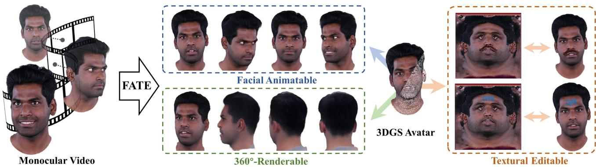  
Figure 1. From a monocular portrait video input, we propose FATE to reconstruct an animatable 3D head avatar, which enables Gaussian texture editing and allows for 360 full-head synthesis.

## Abstract

Reconstructing high-fidelity, animatable 3D head avatars from effortlessly captured monocular videos is a pivotal yet formidable challenge. Although significant progress has been made in rendering performance and manipulation capabilities, notable challenges remain, including incomplete reconstruction and inefficient Gaussian representation. To address these challenges, we introduce FATE — a novel method for reconstructing an editable full-head avatar from a single monocular video. FATE integrates a sampling-based densification strategy to ensure optimal positional distribution of points, improving rendering efficiency. A neural baking technique is introduced to convert discrete Gaussian representations into continuous attribute maps, facilitating intuitive appearance editing. Furthermore, we propose a universal completion framework to recover non-frontal appearance, culminating in a 360◦- renderable 3D head avatar. FATE outperforms previous approaches in both qualitative and quantitative evaluations, achieving state-of-the-art performance. To the best of our knowledge, FATE is the first animatable and 360 full-head monocular reconstruction method for a 3D head avatar. Project page and code are available at this link.

## 1. Introduction

Reconstructing photo-realistic and animatable 3D head avatars is a consistent objective in computer vision, given its extensive applications in film production, AR/VR, metaverse, and computer games. To produce high-fidelity head avatars with precision, classic solutions commonly rely on light field acquisition systems [15, 25, 59] alongside the design of an artist team. These approaches require huge costs and unvoidable manual design, which can hardly be applied to consumer-level scenarios. In recent years, significant research efforts have been devoted to a more practical approach: reconstructing 3D head avatars from an easily captured monocular video.

Early research on the monocular reconstruction of 3D head avatars converges to a widely adopted framework. Firstly, parametric head estimation algorithms [14, 18, 71] are leveraged to estimate a head’s pose and rough shape for each frame. Subsequently, multiple video frames are harnessed to refine the head’s appearance across various poses and expressions, culminating in an expressiondrivable 3D head avatar. The advent of the 3D Gaussian Splatting (3DGS) [30] model, renowned for its rendering efficiency and ease of manipulation, has been widely adopted as the preferred head representation in recent methods [40, 43, 45, 54, 57]. Despite significant performance advancements, monocular 3D head avatar reconstruction still confronts several unresolved challenges.

The first issue is incompleteness in head modeling. Previous approaches predominantly focus on modeling the frontal human face and fail to recover the rear head. This limitation is rooted in the reliance on parametric face estimation methods. Specifically, due to the lack of facial features, both landmark-based and landmark-free parametric head estimation methods fail for the rear head. Thus, video frames of the rear head can not be used in the following optimization process. Practically, most portrait videos focus on informative frontal imagery, with the less informative rear views being scarcely captured. Recovering 360-◦ full 3D head from frontal videos remains an unsolved challenge.

The second issue pertains to the inefficiency and discreteness of the 3DGS representations. We observed that the densification mechanism inherent to the original 3DGS model is ill-suited for monocular reconstruction tasks, as it produces a plethora of redundant attributed points in the training stage. These redundant points compromise rendering quality and increase model complexity. Moreover, due to the discrete nature of the 3D Gaussian representation, the 3DGS-represented head can not be directly edited in the UV texture space, just like polygon mesh models. Previous editable methods [3, 23, 46] rely on extensive optimization with pre-trained diffusion models [61, 62], such as Instruct-Pix2Pix [5], which is both time-consuming and uncontrollable. Although some prior methods [1, 33, 45, 54, 63] also structure Gaussian points into the UV space, our experiments reveal that their reconstructed textures are discontinuous in the UV domain.

To solve these challenges, we introduce FATE, a novel method to reconstruct an editable and full-head avatar from a monocular video. To tackle the problem of model inefficiency, we propose a sampling-based densification approach that achieves a more optimal position distribution than previous methods. Furthermore, we devise a novel technique for parameterizing trained Gaussian points in UV space into multiple attribute maps, thereby enabling the editing of Gaussians with the same ease as mesh textures. To resolve the challenge of reconstructing a fully 360◦ renderable head, we develop a universal completion framework that extracts appearance-customized priors from Sphere-Head [34], a pre-trained generative model. This framework is not only compatible with our FATE method, but can also be seamlessly integrated into other head reconstruction methods [13, 40, 45, 54]. The FATE model outperforms state-of-the-art methods in qualitative and quantitative evaluations. To the best of our knowledge, FATE is the first animatable and 360◦ full-head monocular reconstruction method for a 3D head avatar.

Our contributions can be summarized as:

• We propose a monocular video reconstruction method incorporating sampling-based densification. Comprehensive experiments demonstrate that our method attains state-of-the-art qualitative and quantitative results.

• Neural baking is introduced to transform discrete Gaussian representations onto continuous attribute maps in the UV space. This enables appearance editing with the same ease and efficacy as mesh textures.

• We propose the first and universal completion framework that improves the reconstruction of non-frontal viewpoints by acquiring priors from a pre-trained generative model, leading to a fully 360◦-renderable 3D head avatar from a monocular video.

## 2. Related Work

## 2.1. Monocular Head Avatar Reconstruction

Recovering a 3D head avatar from a monocular video is a very ill-posed problem, considering unconstrained head pose and deformation. To regularize the problem, most approaches resort to 3D Morphable Models (3DMM) [4, 8, 26, 36, 66] as geometric knowledge, by which expression and pose parameters for each video frame are estimated using either a learning-based decoder [14, 16, 18] or an optimization-based face tracker [71]. These coefficients serve as conditions or driving signals to facilitate head reconstruction.

The emergence of NeRF has sparked a growing interest in the implicit modeling of head avatars through ray-casting techniques. By conditioning on expression and pose, several works [19, 50, 64, 70? ? ] learn a deformation field for animatable 3D head avatar. NerFACE [19] utilizes FLAME coefficients as a condition and feeds them into MLP to synthesize dynamic avatars. IMavatar [64] proposes to learn head avatars with implicit geometry and texture model, providing novel analytical gradient formulation that enables end-to-end training from videos. BakedAvatar [17] utilizes deformable multi-layer meshes in head avatar reconstruction to improve rendering. Though significantly enhanced in rendering quality, the NeRF-based method requires pixelby-pixel ray casting and queries from a multilayer perceptron (MLP), considerably limiting its training and inference efficiency. Latter works [21, 22, 47, 56, 70] have employed voxel hashing [38] or tensor decomposition [12] to accelerate this process, achieving varying degrees of success.

Recently, 3D Gaussian Splatting (3DGS) has garnered significant attention. 3DGS represents scenes using numerous anisotropic Gaussian splats, each characterized by geometry and appearance attributes. This explicit modeling method is fast and highly controllable, leading to multiple real-time and high-fidelity avatar reconstruction methods. One track is to use high-cost multi-view datasets and involves complex designs to achieve ultra-rendering quality.

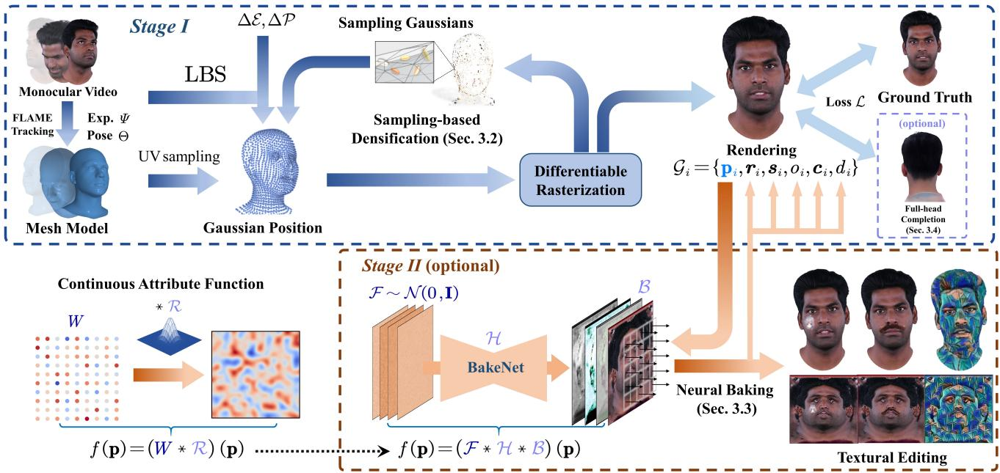  
Figure 2. Pipeline. In Stage I, we perform sampling-based densification in Sec. 3.2 in the UV space and train a Gaussian head avata using the preprocessed monocular video dataset. The obtained head avatar can optionally use full-head completion in Sec 3.4 to recover non-frontal regions. In Stage II, given the learned head avatar, we construct a continuous function f(p) in the UV space using U-Net H and bilinear kernel B, baking the Gaussian attributes into several maps as described in Sec 3.3.

RGCA [43] uses a conditional variational autoencoder to learn Gaussian attributes and radiance transfer. Gaussian Head Avatar [57] first obtains SDF-based geometry from multi-view videos and then achieves high-resolution rendering under deformed MLPs and a super-resolution network. GaussianAvatars [40] applies a binding mechanism to attach Gaussians to the mesh faces.

As for monocular video, FlashAvatar [54] obtains a high-fidelity head avatar by uniform UV sampling. PSAvatar [63] spreads dense Gaussian points on and off the mesh to facilitate detailed capture. SplattingAvatar [45] makes Gaussians walk along triangles to enhance the representation. GaussianBlendshapes [37] proposes to build Gaussian attribute basis referring to blendshapes. Mono-GaussianAvatar [13] leverages MLPs to predict Gaussian attributes and designs a scale and sampling scheduler to enable progressive training. While these methods have achieved commendable rendering results using 3DGS, they still need to be improved because of the inherent inefficiency and discreteness of the 3DGS representations. Furthermore, these approaches exclusively focus on modeling the frontal head, neglecting the rear and side view.

## 2.2. 3D-aware Generative Face Model

Another avenue of research shifts the focus away from training person-specific avatars, instead emphasizing training a general facial prior with large-scale image datasets. Some of these studies [6, 7, 9, 27, 32, 49, 52, 58, 68] aim to construct a conditional model, utilizing expensive dense multiview cameras or multi-view data obtained through light field capture to create rich conditions (e.g., identity, expression, direction). NeRSemble [32] constructs a multi-view radiance field to represent the human head, while AVA [9] develops a Gaussian variational autoencoder. MoFaNeRF [67] further introduces a refined GAN to enhance performance. Other work [2, 10, 11, 44, 48] trains 3D-aware GAN from large-scale 2D image datasets (e.g., FFHQ [28]). EG3D [11] introduces a novel triplane representation to render high-fidelity 3D heads with multi-view consistency, but only the front of the head. Next3D [48] introduces FLAME coefficients as conditions on top of EG3D but still does not reveal a full-head avatar. PanoHead [2] solves the problem by disambiguating the triplane and designing a complex pose estimation pipeline. SphereHead [34] introduces a triplane representation in spherical coordinates and incorporates additional side and rear view data to enhance performance.

## 3. Method

The entire pipeline is shown in Fig. 2, we first introduce the overall monocular reconstruction methods in Sec. 3.1, then explain the sampling-based densification in Sec. 3.2. The neural baking, an optional module supporting texturebased editing, will be explained in Sec. 3.3, and the universal completion framework to synthesize a 360◦-renderable head will be detailed in Sec. 3.4.

## 3.1. Monocular Reconstruction

Following 3D Gaussian Splating [30], our 3D head avatar is represented by N unordered Gaussians $\mathcal { G } _ { i }$ , each of which possesses its own attributes:

$$
\mathcal { G } _ { i } = \left\{ \mathbf { p } _ { i } , \boldsymbol { r } _ { i } , \boldsymbol { s } _ { i } , o _ { i } , c _ { i } , d _ { i } \right\} ,\tag{1}
$$

where $\mathbf { p } _ { i }$ is the Gaussian position in UV space, $\mathbf { \nabla } _ { \mathbf { r } _ { i } }$ and $\mathbf { \boldsymbol { s } } _ { i }$ is rotation vector and scaling vector to construct the covariance matrix, $o _ { i }$ and $c _ { i }$ represent opacity and color respectively, and $d _ { i }$ is the offset along the mesh normal. $\mathbf { \nabla } _ { \mathbf { r } _ { i } }$ and $\mathbf { \boldsymbol { s } } _ { i }$ represent local rotation and scaling. Given the rotation R and scale factor k of mesh face, the global rotation $ { \boldsymbol { r } } _ { i } ^ { \prime }$ and $\mathbf { \boldsymbol { s } } _ { i } ^ { \prime }$ are expressed as:

$$
\begin{array} { r } { { \boldsymbol { r } } _ { i } ^ { \prime } = R { \boldsymbol { r } } _ { i } , } \end{array}\tag{2}
$$

$$
\begin{array} { r } { s _ { i } ^ { \prime } = k s _ { i } . } \end{array}\tag{3}
$$

We sample uniformly in UV space to obtain $\mathbf { p } ,$ where each valid sample provides a set of barycentric coordinates $\{ \pmb { w } _ { 0 } , \pmb { w } _ { 1 } , \pmb { w } _ { 2 } \}$ and a face index $f .$ By the predefined UV mapping $\mathcal { M } ( \cdot )$ , p can be transformed into the 3D world coordinate. The offset d is introduced along the normal direction $\mathbf { n } _ { f }$ . The Gaussian position can be formulated as:

$$
\pmb { \mu } = \mathcal { M } \left( \mathbf { p } \right) + d \cdot \mathbf { n } _ { f } .\tag{4}
$$

With such a formulation, the Gaussian position can move with the template mesh under various expressions and poses. Considering that the template mesh still differs significantly from the geometry in monocular video, we follow prior works [53, 63] to introduce personalized expression and pose blendshapes to model geometric gap:

$$
\begin{array} { r } { \mathbf { T } = \mathrm { L B S } \left( B _ { P } \left( \Theta ; \mathcal { P } + \Delta \mathcal { P } \right) + B _ { E } \left( \varPsi ; \mathcal { E } + \Delta \mathcal { E } \right) \right) , } \end{array}\tag{5}
$$

where T is the mesh with pose Θ and expression Ψ, $\Delta \mathcal { E }$ and $\Delta \mathcal { P }$ are learnable blendshapes introduced, LBS(·) denote the linear blendshape skinning function, as defined in [36]. We observed that directly optimizing blendshapes leads to unstable and noisy mesh. Therefore, we introduce regularization terms on the mesh (See in Sec: 3.5).

## 3.2. Sampling-based Densification

In the vanilla 3DGS, densification is performed by introducing position gradients $\left\| { \frac { \partial { \mathcal { L } } } { \partial \mu } } \right\|$ as an effective performance metric. By setting a threshold $\tau _ { \mathrm { p o s } } ,$ Gaussians with gradients exceeding this threshold are cloned and splited [30]. This threshold-based densification has two main limitations. Firstly, in UV space, Gaussian is defined by its face index and barycentric coordinates, restricting its mobility compared to that in view space. Secondly, threshold-based densification makes it challenging to control the Gaussian number, resulting in excessive Gaussian usage. It is worth noting that the predominance of frontal camera views in most monocular videos exacerbates this issue. As shown in Fig.3 (b), we observed that a substantial number of Gaussians (e.g., cheek, forehead) appear to require frequent but unreasonable splits and clones, leading to redundancy in Gaussian numbers and imprecision in volumetric representation. We believe this issue is unavoidable because it stems from the inherent ambiguity of monocular head pose estimation.

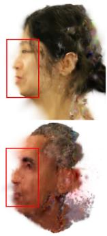  
(a)

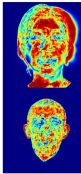

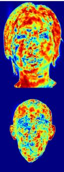  
(b)  
Figure 3. 3DGS in Monocular Video. (a) In monocular reconstruction, since the sides of the head avatar are rarely supervised, Gaussians tend to grow towards the direction of the rendering camera. (b) This potentially results in position gradient visualizations during training, showing that most of the facial region displays distributions exceeding the threshold $\tau _ { \mathrm { p o s } }$

To solve this problem, we propose sampling-based densification. We retain $\left\| { \frac { \partial { \mathcal { L } } } { \partial \mu } } \right\|$ as the performance metric. Instead of selecting a threshold $\tau _ { \mathrm { p o s } }$ , we treat each Gaussian primitive $\mathcal { G } _ { i }$ as proposal for their binding face $f _ { i }$ and use $\left\| { \frac { \partial { \mathcal { L } } } { \partial \mu } } \right\|$ as an importance metric I for multinomial sampling, with the probability that k-th Gaussian is selected as:

$$
p _ { k } = \frac { \mathcal { T } _ { k } } { \sum _ { i = 0 } ^ { N - 1 } \mathcal { T } _ { i } } ,\tag{6}
$$

where N is the total number of Gaussian primitives. When the k-th Gaussian is selected, we can query the face index $f _ { i }$ of the k-th Gaussian. A set of barycentric coordinates in triangle $f _ { i }$ is initialized as follows:

$$
{ \pmb w } _ { j } = \frac { \hat { \pmb w } _ { j } } { \sum _ { m = 0 } ^ { 2 } \hat { \pmb w } _ { m } } , \quad j = 0 , 1 , 2 ,\tag{7}
$$

$$
{ \hat { \pmb w } } _ { 0 } , { \hat { \pmb w } } _ { 1 } , { \hat { \pmb w } } _ { 2 } \sim { \mathcal U } \left( 0 , 1 \right) .\tag{8}
$$

In this way, a new Gaussian position is obtained. By letting the new Gaussian inherit the sampled splat’s attributes, we achieve densification via a sampling approach. In the training phase, the densification is performed at regular intervals to sample a fixed number of Gaussians. Afterward, some unsuitable Gaussians will be pruned in the subsequent training iterations based on opacity conditions. This prevents an explosion in the number of points while also allowing the distribution of Gaussians to update gradually in a controlled manner.

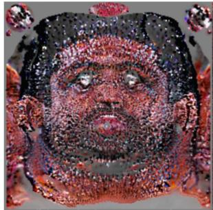  
(a)

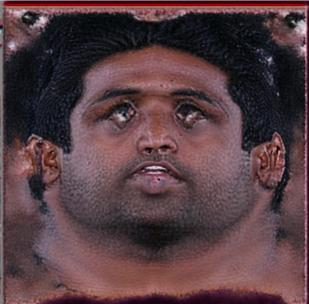  
(b)  
Figure 4. Texture Map Visualization. (a) Directly optimizing texture maps often results in significantly low quality, with visible holes and artifacts. (b) In contrast, our neural baking method produces a much smoother and more plausible texture map.

## 3.3. Neural Baking for Texture Editing

After learning an animatable Gaussian avatar with samplebased densification and optional full-head completion, we further propose the neural baking to edit the discrete 3D Gaussian avatar explicitly (Stage II in Fig. 2). Neural baking is defined as a process of transforming a discrete and unordered Gaussian attribute map into a continuous and editable one. The specific implementation is achieved by introducing BakeNet for a two-stage training.

The raw learned Gaussian model is a discrete representation that is highly convenient for rendering, but the discrete and unordered point set is complicated to edit. Since we have parameterized the Gaussians into 2D UV space, an intuitive idea is to construct a reconstruction kernel $\mathcal { R } ( \cdot )$ that samples a continuous and smooth function $f ( \cdot )$ from the discrete Gaussian attributes w:

$$
f \left( \mathbf { p } \right) = \left( w * \mathcal { R } \right) \left( \mathbf { p } \right)\tag{9}
$$

$$
= \sum _ { k } w _ { k } \mathcal { R } _ { k } \left( \mathbf { p } - \mathbf { p } _ { k } \right)\tag{10}
$$

where p is the UV coordinate. Directly constructing $\mathcal { R } ( \cdot )$ is both manual and complex, as the properties and ranges of interpolation functions may vary across different Gaussian attributes. Considering that $\mathcal { R } ( \cdot )$ only requires to satisfy $l o -$ cal support, we can select the bilinear interpolation operator $B ( \cdot )$ as the kernel and then focus on refining $w _ { k }$ to ensure smoothness in $f ( \cdot )$ . Thus, our objective becomes finding a suitable proxy $\phi _ { k }$ for Gaussian attributes $w _ { k }$

A straightforward solution to this objective is to approximate $\phi _ { k }$ with $w _ { k }$ by optimizing randomly initialized feature maps $\mathcal { F }$ and applying $B ( \cdot )$ over UV coordinates. However, experiments show that the result texture maps are discontinuous and messy, as shown in Fig. 4 (a). We observed that such an issue doesn’t exist in several generative Gaussian head models [33, 35, 68, 69], of which the Gaussian attribute maps are continuous. We consider this phenomenon attributable to the inherent regularization properties of the convolutional operations incorporated into the generative model. On further analysis, we argue that the inductive biases of the CNN contribute to local smoothness and translation invariance, serving as a pre-filter $\mathcal { H } ( \cdot )$ . Hence, $f \left( \mathbf { p } \right)$ can finally be formalized as:

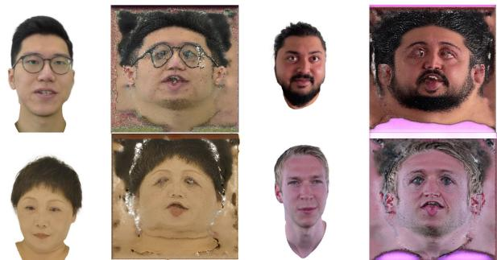  
Figure 5. Baked Results Visualization. We visualize the color texture map produced by neural baking on different subjects.

$$
f \left( \mathbf { p } \right) = \left( \mathcal { F } * \mathcal { H } * B \right) \left( \mathbf { p } \right) ,\tag{11}
$$

where the low-pass $\mathcal { H } ( \cdot )$ and $B ( \cdot )$ ensure the continuity of $f \left( \mathbf { p } \right)$ . Under the guidance of this idea, BakeNet is introduced as the pre-filter $\mathcal { H } ( \cdot )$ , which takes multi-channel noise maps sampled from Gaussian distribution $\mathcal { F }$ as input to regularize the attribute map in a post-training stage. U-Net [42] is selected as the backbone of the BakeNet.

The parameters of the BakeNet are updated by the gradients computed by the loss defined in Sec. 3.5. We sample attributes from the U-Net output to replace the pointwise Gaussian attributes, inheriting the trained $\Delta \mathcal { E } , \Delta \mathcal { P }$ and sampled UV coordinates. After neural baking, the rendering quality may experience degradation. The BakeNet will not be involved in model inference but only help regularize the attribute maps in the stage II training. Experiments demonstrate that this two-stage learning strategy leads to higher rendering performance and faster convergence speed than direct end-to-end training with BakeNet. We also study to improve the rendering quality of the baked results and further discuss the trade-off between rendering quality and texture quality. Due to space constraints, these are placed in the supplementary reporting material.

## 3.4. Full-Head Completion

Previous monocular head reconstruction algorithms have typically neglected hair modeling for two primary reasons. Firstly, the rear region of the head is commonly featureless hair, where pose tracking and 3DMM regression always fail. Secondly, most portrait videos focus on the frontal face, with no specific capture of the rear head. For these reasons, an intuitive solution is to leverage pretrained full-head generative models [2, 34] to synthesize rear head frames.

However, generating images to reconstruct the rear head appearance is nontrivial. Existing full-head generative models set up a canonical model space with simplified orthogonal projection, which differs from monocular video-based reconstruction. Therefore, establishing model space transformation and enhancing the quality of rear head generation become the most critical issues. To solve these issues, we design a universal completion framework by extracting priors from SphereHead [34] for completing the rear head of the learned animatable head avatar. The proposed completion framework consists of three steps: coordinate alignment, image quality alignment, inversion and finetuning.

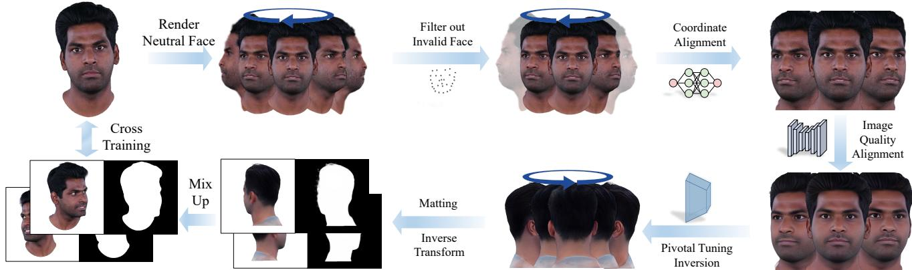  
Figure 6. Completion Framework. A universal framework is proposed to complete the side and rear appearance under monocular settings.

Coordinate alignment. First, we set up a horizontal circle of camera orbit to render around the head avatar with neutral expression and pose. Choosing neutral expression and pose is because SphereHead excels at representing static faces, and neutral status simplifies subsequent alignment and inverse transformations. Then, a face detector [31] is used to assess landmark confidence in all rendered views and filter out the side-view images with low confidence scores. We employ TDDFA [24] to obtain facial keypoints $\mathbf { Q } = [ \mathbf { q } _ { 1 } , . . . , \mathbf { q } _ { 6 8 } ] \in \mathbb { R } ^ { 2 \times 6 8 }$ . Q is used to construct an affine transformation matrix A for image cropping and aligning.

Image quality alignment. Directly using the rendered aligned images for Pivotal Tuning Inversion (PTI) [41] often produces blurry results. We consider the reason to be the domain gap between the image quality of the input video and the high-quality dataset used to train Sphere-Head. Therefore, we utilize a face restoration model, GFP-GAN [51], to align the image quality of the input video and SphereHead. As GFPGAN is trained on a data source similar to the SphereHead dataset, it can inject image qualitylevel details into the input video frames, helping fit the distribution of SphereHead training set. As our primary goal is to leverage the priors from SphereHead regarding side and rear views, some identity changes caused by GFPGAN in the frontal view are acceptable.

Inversion and finetuning. We extend PTI to multiple images, using valid multi-view faces filtered by the aforementioned facial landmark detector for supervision. For a detailed formulation of the optimization process, please refer to the supplementary materials. After obtaining the inverted orbited images, we utilize the estimated facial landmarks Q to calculate an affine transformation matrix $\boldsymbol { A } ^ { - 1 }$ using the least squares optimization. $\boldsymbol { A } ^ { - 1 }$ is applied to transform all synthesized images. Then, MODNet [29] is used to extract facial masks of the synthesized images. We cross-train from these pseudo-images and ground truth to avoid degradation of the frontal view.

## 3.5. Training Objective

The optimization goal is to minimize the loss between the rendered output and the ground truth, subject to certain regularization constraints. The first term is the image loss:

$$
{ \mathcal { L } } _ { \mathrm { i m a g e } } = { \mathcal { L } } _ { \mathrm { L 1 } } + \lambda _ { 1 } { \mathcal { L } } _ { \mathrm { v g g } } .\tag{12}
$$

To avoid Gaussians becoming over-skinny, we introduce the regularization term following PhysGaussian [55]:

$$
\mathcal { L } _ { \mathrm { s c a l e } } = \frac { 1 } { N } \sum _ { i = 0 } ^ { N - 1 } \operatorname* { m a x } \bigg ( \frac { \operatorname* { m a x } \left( \pmb { s } _ { i } \right) } { \operatorname* { m i n } \left( \pmb { s } _ { i } \right) } - r , 0 \bigg ) ,\tag{13}
$$

where N is the total number of splats, and r is a hyperparameter. This loss ensures that the ratio of major axis length to minor axis length stays below r. Moreover, we employ additional regularization terms specific to the mesh to constrain its geometry:

$$
\mathcal { L } _ { \mathrm { m e s h } } = \lambda _ { 2 } \mathcal { L } _ { \mathrm { l a p } } + \lambda _ { 3 } \mathcal { L } _ { \mathrm { f l a m e } } ,\tag{14}
$$

where $\mathcal { L } _ { \mathrm { l a p } }$ is the laplacian smoothing term, ${ \mathcal { L } } _ { \mathrm { { f l a m e } } }$ is L2 distance between current vertices and original vertices in given pose and expression.

The overall loss function is defined as:

$$
\begin{array} { r } { \mathcal { L } = \mathcal { L } _ { \mathrm { L 1 } } + \lambda _ { 1 } \mathcal { L } _ { \mathrm { v g g } } + \lambda _ { 2 } \mathcal { L } _ { \mathrm { l a p } } + \lambda _ { 3 } \mathcal { L } _ { \mathrm { f l a m e } } + \lambda _ { 4 } \mathcal { L } _ { \mathrm { s c a l e } } , } \end{array}\tag{15}
$$

where $\lambda _ { 1 } , \lambda _ { 2 } , \lambda _ { 3 } , \lambda _ { 4 }$ are set to 0.1, 100, 100, 0.1.

## 4. Experiments

We conduct extensive experiments across various datasets. A total of 20 subjects from different datasets are collected -

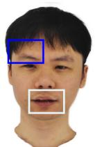

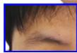

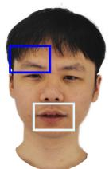

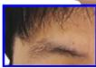

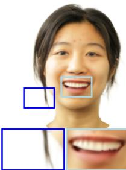  
FlashAvatar

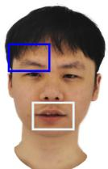

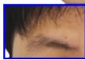

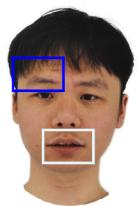

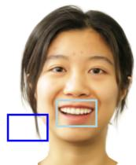

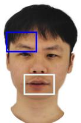  
MonoGaussian Avatar

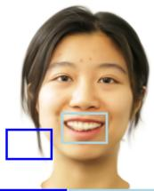  
GaussianAvatars

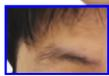

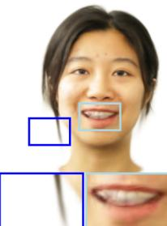  
SplattingAvatar

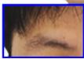

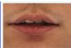

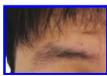

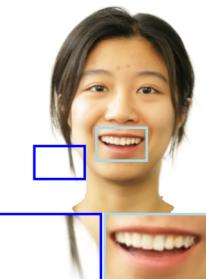  
Ours

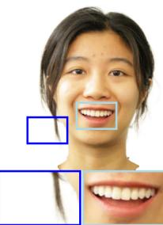  
Ground Truth

Figure 7. Monocular Reconstruction Results. Our method is more effective at capturing fine structure and high-frequency details (e.g loose strands of hair, lip creases, and stubble in the facial area.). More reconstructed subjects are shown in supplementary materials.

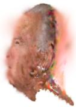

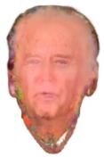

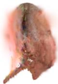

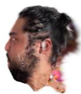

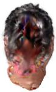

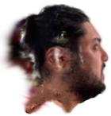

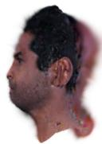

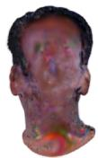

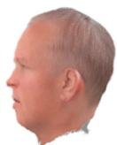

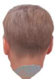

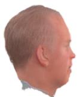

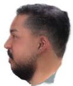

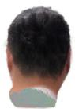

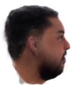

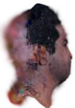

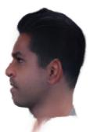

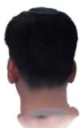

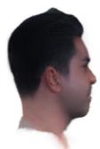

Figure 8. Full-head Completion Results. The first row shows the side and back views rendered in our method without completion, and the second row shows the result after completion.

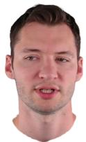

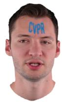

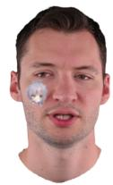

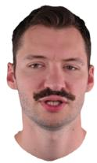

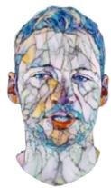

  
Original

  
Add CVPR'logo

  
Add an anime sticker

  
Add mustache

  
Mosaic style

  
Wave style

  
Starry night style

  
Texture swapping

Figure 9. Texture Editing Results. We show the effects of simply and effectively editing the baked texture map.

Table 1. Comparison of quantitative results with state-of-the-art methods. blue and lightblue indicate the 1st and 2nd best.

<table><tr><td rowspan="2">Datasets</td><td colspan="3">Overall</td><td colspan="3">INSTA Dataset</td><td colspan="3">PointAvatar Dataset</td><td colspan="3">NerFace Dataset</td><td colspan="3">Ours Dataset</td></tr><tr><td>PSNR↑</td><td>SSIM↑</td><td>LPIPS↓</td><td>PSNR↑</td><td>SSIM↑</td><td>LPIPS↓</td><td>PSNR↑</td><td>SSIM↑</td><td>LPIPS↓</td><td>PSNR↑</td><td>SSIM↑</td><td>LPIPS↓</td><td>PSNR↑</td><td>SSIM↑</td><td>LPIPS↓</td></tr><tr><td>FA [54] (CVPR’24)</td><td>27.41</td><td>0.9322</td><td>0.0603</td><td>27.28</td><td>0.9346</td><td>0.0578</td><td>26.45</td><td>0.9103</td><td>0.0890</td><td>31.38</td><td>0.9641</td><td>0.0304</td><td>25.48</td><td>0.9188</td><td>0.0679</td></tr><tr><td>SA [45] (CVPR’24)</td><td>26.34</td><td>0.9249</td><td>0.1135</td><td>26.63</td><td>0.9304</td><td>0.1119</td><td>24.76</td><td>0.8907</td><td>0.1501</td><td>29.34</td><td>0.9480</td><td>0.0712</td><td>24.55</td><td>0.9196</td><td>0.1218</td></tr><tr><td>MGA [13] (SIGGRAPH&#x27;24)</td><td>28.07</td><td>0.9405</td><td>0.0787</td><td>27.40</td><td>0.9373</td><td>0.0887</td><td>28.16</td><td>0.9360</td><td>0.0977</td><td>33.78</td><td>0.9765</td><td>0.0315</td><td>25.43</td><td>0.9210</td><td>0.0749</td></tr><tr><td>GA [40] (CVPR&#x27;24)</td><td>26.20</td><td>0.9343</td><td>0.0804</td><td>26.66</td><td>0.9396</td><td>0.0777</td><td>24.51</td><td>0.9078</td><td>0.1257</td><td>29.06</td><td>0.9559</td><td>0.0509</td><td>24.18</td><td>0.9251</td><td>0.0755</td></tr><tr><td>Ours</td><td>28.37</td><td>0.9439</td><td>0.0586</td><td>27.52</td><td>0.9416</td><td>0.0603</td><td>28.74</td><td>0.9333</td><td>0.0719</td><td>33.70</td><td>0.9736</td><td>0.0257</td><td>26.25</td><td>0.9358</td><td>0.0691</td></tr><tr><td>Ours (baked)</td><td>28.23</td><td>0.9415</td><td>0.0676</td><td>27.80</td><td>0.9419</td><td>0.0639</td><td>27.45</td><td>0.9239</td><td>0.0954</td><td>32.59</td><td>0.9665</td><td>0.0373</td><td>26.13</td><td>0.9326</td><td>0.0823</td></tr></table>

Table 2. Comparison of the number of Gaussians
<table><tr><td>Data</td><td>INSTA</td><td>IMAvatar</td><td>NerFace</td><td>EmoTalk3D</td></tr><tr><td>FA</td><td></td><td>16k</td><td></td><td></td></tr><tr><td>SA MGA</td><td>558k±188k</td><td></td><td>617k±274k 497k±142k 100k</td><td>489k±171k</td></tr><tr><td>GA</td><td>72k±33k</td><td>38k±14k</td><td>31k±7k</td><td>55k±12k</td></tr><tr><td>Ours</td><td>49k±6k</td><td></td><td></td><td></td></tr><tr><td></td><td></td><td>38k±6k</td><td>42k±0.5k</td><td>58k±2k</td></tr></table>

Table 3. Ablation Study in yufeng case.
<table><tr><td></td><td>PSNR↑</td><td>SSIM↑</td><td>LPIPS↓</td></tr><tr><td>Ours</td><td>29.36</td><td>0.9239</td><td>0.0694</td></tr><tr><td>w/o densify</td><td>29.13</td><td>0.9217</td><td>0.0740</td></tr><tr><td>w/o ∆ε and ∆P</td><td>24.78</td><td>0.8820</td><td>0.1112</td></tr><tr><td>Two-stage baking</td><td>27.78</td><td>0.9104</td><td>0.0979</td></tr><tr><td>One-stage baking</td><td>27.42</td><td>0.9085</td><td>0.1088</td></tr><tr><td>Decode only</td><td>25.56</td><td>0.8878</td><td>0.1506</td></tr></table>

10 subjects from INSTA [70], preprocessed by the MICA tracker [71]; 3 subjects from PointAvatar [65]; 3 subjects from NerFace [20] processed using a DECA-based pipeline [64]; and 4 subjects in Emotalk3D [26], also preprocessed via the DECA. Four state-of-the-art GS-based reconstruction methods are compared, including GaussianAvatars (GA) [40], FlashAvatar (FA) [54], MonoGaussianAvatar (MGA) [13] and SplattingAvatar (SA) [45].

## 4.1. Implementation Details

We uniformly sample 65k Gaussians in the UV space. Given the consistent lighting condition in monocular video, we use zero-degree SH to represent color. We increase 1k Gaussians every 3k iterations. All experiments are conducted on a single A6000 GPU. Please refer to the supplementary materials for further details.

## 4.2. Monocular Results

Average PSNR, SSIM, and LPIPS [60] are reported in Tab. 1. Our method achieves balance among these metrics, delivering the best overall performance. As shown in Fig. 7, our method more effectively captures the highfrequency details of avatars while avoiding the needle-like artifacts often observed in 3DGS. Tab. 2 presents the number of Gaussians each method utilizes. Our method employs a rather small number of Gaussian primitives, and the variance of the Gaussian number is more stable in different datasets. This demonstrates the effectiveness of samplingbased densification. For more results on computational efficiency, please refer to the appendix.

## 4.3. Neural Baking Results

We visualize color texture maps of several head avatars generated through neural baking in Fig. 5. The resulting texture maps exhibit smooth and continuous qualities, with neural baking interpolating reasonable details in regions not visible in the monocular video. Such quality texture maps enable straightforward editing. In Fig. 9, we demonstrate various editing operations. Unlike previous approaches, our method allows precise control without cumbersome optimization.

## 4.4. Full-Head Completion Results

We show the rendered results of monocular reconstructed head avatars from our method after passing through the completion framework in Fig. 8. The significant improvement in the side and rear views demonstrates the effectiveness of the completion framework. This pipeline can be naturally extended to other methods, and we present the completed results 4 baselines in the supplementary materials.

## 4.5. Ablation Study

Ablation study are conducted on several designs in monocular reconstruction and neural baking. Quantitative results can be found in Tab. 3, more results in the appendix.

(i) w/o densify When sampling-based densification is disabled, the LPIPS is considerably degraded. This suggests that the initialized uniform distribution is suboptimal.

(ii) w/o ∆E and ∆P We set learnable blendshapes as fixed zero vectors. Without making FLAME learnable, degraded results are produced based on the coarse template.

(iii) One-stage baking v.s. two-stage baking. One-stage baking is to train the BakeNet together with the Gaussians in a single stage. We have discovered that it notably affects training efficiency and results in inferior rendering quality.

(iv) Decode only We only use the decoder of BakeNet for neural baking. The degradation indicates the effectiveness of the BakeNet for encoding high-frequency input.

## 5. Conclusion

We propose a novel monocular video reconstruction method with sampling-based densification and neural baking for efficient appearance editing in the UV space. And a universal completion framework improves non-frontal view reconstruction, enabling 360◦-renderable 3D head avatars.

Limitations remain. Our method assumes consistent and uniform lighting, reducing robustness in real-world scenarios. The completion framework depends on the pre-trained model’s dataset, limiting its ability to capture complex, personalized head shapes and potentially causing identity change. Fixed-size texture maps from neural baking may also fail in some cases, which could be mitigated by baking with a Mip-Map mechanism. Future work could explore integrating full-body priors, such as SMPL-X [39], to enhance immersive applications.

## Acknowledgements

This study was funded by NKRDC 2022YFF0902200 and NSFC 62472213. Jiawei Zhang would like to thank Prof. Zhixi Feng for his support in the early stages of this study.

## References

[1] Rameen Abdal, Wang Yifan, Zifan Shi, Yinghao Xu, Ryan Po, Zhengfei Kuang, Qifeng Chen, Dit-Yan Yeung, and Gordon Wetzstein. Gaussian shell maps for efficient 3d human generation. In Proceedings of the IEEE/CVF Conference on Computer Vision and Pattern Recognition (CVPR), pages 9441–9451, 2024. 2

[2] Sizhe An, Hongyi Xu, Yichun Shi, Guoxian Song, Umit Y. Ogras, and Linjie Luo. Panohead: Geometry-aware 3d fullhead synthesis in 360deg. In CVPR, pages 20950–20959, 2023. 3, 5

[3] Chong Bao, Yinda Zhang, Yuan Li, Xiyu Zhang, Bangbang Yang, Hujun Bao, Marc Pollefeys, Guofeng Zhang, and Zhaopeng Cui. Geneavatar: Generic expression-aware volumetric head avatar editing from a single image. In CVPR, 2024. 2

[4] Volker Blanz and Thomas Vetter. A morphable model for the synthesis of 3d faces. In Proceedings of the 26th Annual Conference on Computer Graphics and Interactive Techniques, page 187–194, USA, 1999. ACM Press/Addison-Wesley Publishing Co. 2

[5] Tim Brooks, Aleksander Holynski, and Alexei A. Efros. Instructpix2pix: Learning to follow image editing instructions. In CVPR, 2023. 2

[6] Marcel C. Buehler, Abhimitra Meka, Gengyan Li, Thabo Beeler, and Otmar Hilliges. Varitex: Variational neural face textures. In CVPR, 2021. 3

[7] Marcel C Buhler, Kripasindhu Sarkar, Tanmay Shah,¨ Gengyan Li, Daoye Wang, Leonhard Helminger, Sergio Orts-Escolano, Dmitry Lagun, Otmar Hilliges, Thabo Beeler, et al. Preface: A data-driven volumetric prior for few-shot ultra high-resolution face synthesis. In ICCV, pages 3402–3413, 2023. 3

[8] Chen Cao, Yanlin Weng, Shun Zhou, Yiying Tong, and Kun Zhou. Facewarehouse: A 3d facial expression database for visual computing. IEEE TVCG, 20(3):413–425, 2014. 2

[9] Chen Cao, Tomas Simon, Jin Kyu Kim, Gabe Schwartz, Michael Zollhoefer, Shun-Suke Saito, Stephen Lombardi, Shih-En Wei, Danielle Belko, Shoou-I Yu, Yaser Sheikh, and Jason Saragih. Authentic volumetric avatars from a phone scan. ACM TOG, 41(4), 2022. 3

[10] Eric Chan, Marco Monteiro, Petr Kellnhofer, Jiajun Wu, and Gordon Wetzstein. pi-gan: Periodic implicit generative adversarial networks for 3d-aware image synthesis. In CVPR, 2021. 3

[11] Eric R. Chan, Connor Z. Lin, Matthew A. Chan, Koki Nagano, Boxiao Pan, Shalini De Mello, Orazio Gallo, Leonidas Guibas, Jonathan Tremblay, Sameh Khamis, Tero Karras, and Gordon Wetzstein. Efficient geometry-aware 3D generative adversarial networks. In CVPR, 2022. 3

[12] Anpei Chen, Zexiang Xu, Andreas Geiger, Jingyi Yu, and Hao Su. Tensorf: Tensorial radiance fields. In ECCV, 2022. 2

[13] Yufan Chen, Lizhen Wang, Qijing Li, Hongjiang Xiao, Shengping Zhang, Hongxun Yao, and Yebin Liu. Monogaussianavatar: Monocular gaussian point-based head avatar. In ACM SIGGRAPH 2024 Conference Papers, 2024. 2, 3, 7, 8

[14] Radek Danecek, Michael J. Black, and Timo Bolkart. EMOCA: Emotion driven monocular face capture and ani mation. In CVPR, pages 20311–20322, 2022. 1, 2

[15] Paul Debevec. The light stages and their applications to pho toreal digital actors. ACM TOG, 2(4):1–6, 2012. 1

[16] Yu Deng, Jiaolong Yang, Sicheng Xu, Dong Chen, Yunde Jia, and Xin Tong. Accurate 3d face reconstruction with weakly-supervised learning: From single image to image set. In CVPRW, 2019. 2

[17] Hao-Bin Duan, Miao Wang, Jin-Chuan Shi, Xu-Chuan Chen, and Yan-Pei Cao. Bakedavatar: Baking neural fields for real time head avatar synthesis. ACM TOG, 42(6), 2023. 2

[18] Yao Feng, Haiwen Feng, Michael J. Black, and Timo Bolkart. Learning an animatable detailed 3D face model from in-the-wild images. ACM TOG, 40(8), 2021. 1, 2

[19] Guy Gafni, Justus Thies, Michael Zollhofer, and Matthias¨ Nießner. Dynamic neural radiance fields for monocular 4d facial avatar reconstruction. In CVPR, pages 8649–8658, 2021. 2

[20] Guy Gafni, Justus Thies, Michael Zollhofer, and Matthias¨ Nießner. Dynamic neural radiance fields for monocular 4d facial avatar reconstruction. In CVPR, pages 8645–8654, 2021. 8

[21] Xuan Gao, Chenglai Zhong, Jun Xiang, Yang Hong, Yudong Guo, and Juyong Zhang. Reconstructing personalized semantic facial nerf models from monocular video. ACM TOG, 41(6), 2022. 2

[22] Xiangjun Gao, Xiaoyu Li, Yiyu Zhuang, Qi Zhang, Wenbo Hu, Chaopeng Zhang, Yao Yao, Ying Shan, and Long Quan. Mani-gs: Gaussian splatting manipulation with triangular mesh. arXiv preprint arXiv:2405.17811, 2024. 2

[23] Xuan Gao, Haiyao Xiao, Chenglai Zhong, Shimin Hu, Yudong Guo, and Juyong Zhang. Portrait video editing em powered by multimodal generative priors. In ACM SIG-GRAPH Asia, 2024. 2

[24] Jianzhu Guo, Xiangyu Zhu, Yang Yang, Fan Yang, Zhen Lei, and Stan Z Li. Towards fast, accurate and stable 3d dense face alignment. In ECCV, 2020. 6

[25] Kaiwen Guo, Peter Lincoln, Philip Davidson, Jay Busch, Xueming Yu, Matt Whalen, Geoff Harvey, Sergio Orts-Escolano, Rohit Pandey, Jason Dourgarian, et al. The relightables: Volumetric performance capture of humans with realistic relighting. ACM TOG, 38(6):1–19, 2019. 1

[26] Qianyun He, Xinya Ji, Yicheng Gong, Yuanxun Lu, Zhengyu Diao, Linjia Huang, Yao Yao, Siyu Zhu, Zhan Ma, Songchen Xu, Xiaofei Wu, Zixiao Zhang, Xun Cao, and Hao Zhu. Emotalk3d: High-fidelity free-view synthesis of emotional 3d talking head. In ECCV, 2024. 2, 8

[27] Yang Hong, Bo Peng, Haiyao Xiao, Ligang Liu, and Juyong Zhang. Headnerf: A real-time nerf-based parametric head model. In CVPR, 2022. 3

[28] Tero Karras, Samuli Laine, and Timo Aila. A style-based generator architecture for generative adversarial networks. In CVPR, 2019. 3

[29] Zhanghan Ke, Jiayu Sun, Kaican Li, Qiong Yan, and Ryn son W.H. Lau. Modnet: Real-time trimap-free portrait mat ting via objective decomposition. In AAAI, 2022. 6

[30] Bernhard Kerbl, Georgios Kopanas, Thomas Leimkuhler,¨ and George Drettakis. 3d gaussian splatting for real-time radiance field rendering. ACM TOG, 42(4), 2023. 1, 4

[31] Davis E. King. Dlib - a toolkit for machine learning and computer vision, 2009. 6

[32] Tobias Kirschstein, Shenhan Qian, Simon Giebenhain, Tim Walter, and Matthias Nießner. Nersemble: Multi-view radiance field reconstruction of human heads. ACM TOG, 42(4), 2023. 3

[33] Tobias Kirschstein, Simon Giebenhain, Jiapeng Tang, Markos Georgopoulos, and Matthias Nießner. Gghead: Fast and generalizable 3d gaussian heads. ACM SIGGRAPHAsia, 2024. 2, 5

[34] Heyuan Li, Ce Chen, Tianhao Shi, Yuda Qiu, Sizhe An, Guanying Chen, and Xiaoguang Han. Spherehead: Stable 3d full-head synthesis with spherical tri-plane representation, 2024. 2, 3, 5, 6

[35] Junxuan Li, Chen Cao, Gabriel Schwartz, Rawal Khirodkar, Christian Richardt, Tomas Simon, Yaser Sheikh, and Shunsuke Saito. Uravatar: Universal relightable gaussian codec avatars. In ACM SIGGRAPH Asia, 2024. 5

[36] Tianye Li, Timo Bolkart, Michael. J. Black, Hao Li, and Javier Romero. Learning a model of facial shape and expression from 4D scans. ACM TOG, 36(6):194:1–194:17, 2017. 2, 4

[37] Shengjie Ma, Yanlin Weng, Tianjia Shao, and Kun Zhou. 3d gaussian blendshapes for head avatar animation. In ACM SIGGRAPH 2024 Conference Papers, 2024. 3

[38] Thomas Muller, Alex Evans, Christoph Schied, and Alexan-¨ der Keller. Instant neural graphics primitives with a multiresolution hash encoding. ACM TOG, 41(4):102:1–102:15, 2022. 2

[39] Georgios Pavlakos, Vasileios Choutas, Nima Ghorbani, Timo Bolkart, Ahmed A. A. Osman, Dimitrios Tzionas, and Michael J. Black. Expressive body capture: 3D hands, face, and body from a single image. In CVPR, pages 10975– 10985, 2019. 8

[40] Shenhan Qian, Tobias Kirschstein, Liam Schoneveld, Davide Davoli, Simon Giebenhain, and Matthias Nießner. Gaussianavatars: Photorealistic head avatars with rigged 3d gaussians. CVPR, 2024. 2, 3, 7, 8

[41] Daniel Roich, Ron Mokady, Amit H Bermano, and Daniel Cohen-Or. Pivotal tuning for latent-based editing of real images. ACM TOG, 2021. 6

[42] Olaf Ronneberger, Philipp Fischer, and Thomas Brox. Unet: Convolutional networks for biomedical image segmentation. In Medical Image Computing and Computer-Assisted Intervention – MICCAI 2015, pages 234–241, Cham, 2015. Springer International Publishing. 5

[43] Shunsuke Saito, Gabriel Schwartz, Tomas Simon, Junxuan Li, and Giljoo Nam. Relightable gaussian codec avatars. In CVPR, 2024. 2, 3

[44] Katja Schwarz, Yiyi Liao, Michael Niemeyer, and Andreas Geiger. Graf: Generative radiance fields for 3d-aware image synthesis. In NeurIPS, 2020. 3

[45] Zhijing Shao, Zhaolong Wang, Zhuang Li, Duotun Wang, Xiangru Lin, Yu Zhang, Mingming Fan, and Zeyu Wang.

SplattingAvatar: Realistic Real-Time Human Avatars with Mesh-Embedded Gaussian Splatting. In CVPR, 2024. 2, 3, 7, 8

[46] Luchuan Song, Lele Chen, Celong Liu, Pinxin Liu, and Chenliang Xu. Texttoon: Real-time text toonify head avatar from single video. In ACM SIGGRAPH Asia, 2024. 2

[47] Luchuan Song, Pinxin Liu, Lele Chen, Guojun Yin, and Chenliang Xu. Tri2-plane: Volumetric avatar reconstruction with feature pyramid. ECCV, 2024. 2

[48] Jingxiang Sun, Xuan Wang, Lizhen Wang, Xiaoyu Li, Yong Zhang, Hongwen Zhang, and Yebin Liu. Next3d: Generative neural texture rasterization for 3d-aware head avatars. In CVPR, 2023. 3

[49] Daoye Wang, Prashanth Chandran, Gaspard Zoss, Derek Bradley, and Paulo Gotardo. Morf: Morphable radiance fields for multiview neural head modeling. In ACM SIG GRAPH 2022 Conference Proceedings, New York, NY, USA, 2022. Association for Computing Machinery. 3

[50] Jia Wang, Xinfeng Zhang, Gai Zhang, Jun Zhu, Lv Tang, and Li Zhang. Uar-nvc: A unified autoregressive framework for memory-efficient neural video compression, 2025. 2

[51] Xintao Wang, Yu Li, Honglun Zhang, and Ying Shan. To wards real-world blind face restoration with generative facial prior. In CVPR, 2021. 6

[52] Menghua Wu, Hao Zhu, Linjia Huang, Yiyu Zhuang, Yuanxun Lu, and Xun Cao. High-fidelity 3d face gener ation from natural language descriptions. In Proceedings of IEEE/CVF Conference on Computer Vision and Pattern Recognition (CVPR), 2023. 3

[53] Tianhao Wu, Jing Yang, Zhilin Guo, Jingyi Wan, Fangcheng Zhong, and Cengiz Oztireli. Gaussian head & shoulders: High fidelity neural upper body avatars with anchor gaussian guided texture warping, 2024. 4

[54] Jun Xiang, Xuan Gao, Yudong Guo, and Juyong Zhang. Flashavatar: High-fidelity head avatar with efficient gaussian embedding. In CVPR, 2024. 2, 3, 7, 8

[55] Tianyi Xie, Zeshun Zong, Yuxing Qiu, Xuan Li, Yutao Feng, Yin Yang, and Chenfanfu Jiang. Physgaussian: Physicsintegrated 3d gaussians for generative dynamics. arXiv preprint arXiv:2311.12198, 2023. 6

[56] Yuelang Xu, Lizhen Wang, Xiaochen Zhao, Hongwen Zhang, and Yebin Liu. Avatarmav: Fast 3d head avatar reconstruction using motion-aware neural voxels. In ACM SIGGRAPH 2023 Conference Proceedings, 2023. 2

[57] Yuelang Xu, Benwang Chen, Zhe Li, Hongwen Zhang, Lizhen Wang, Zerong Zheng, and Yebin Liu. Gaussian head avatar: Ultra high-fidelity head avatar via dynamic gaussians. In CVPR, 2024. 2, 3

[58] Yichao Yan, Zanwei Zhou, Zi Wang, Jingnan Gao, and Xiaokang Yang. Dialoguenerf: towards realistic avatar face-to face conversation video generation. Visual Intelligence, 2(1): 24, 2024. 3

[59] Haotian Yang, Mingwu Zheng, Wanquan Feng, Haibin Huang, Yu-Kun Lai, Pengfei Wan, Zhongyuan Wang, and Chongyang Ma. Towards practical capture of high-fidelity relightable avatars. In ACM SIGGRAPH Asia, pages 1–11, 2023. 1

[60] Richard Zhang, Phillip Isola, Alexei A. Efros, Eli Shechtman, and Oliver Wang. The unreasonable effectiveness of deep features as a perceptual metric. In CVPR, 2018. 8

[61] Xinchen Zhang, Ling Yang, Yaqi Cai, Zhaochen Yu, Kaini Wang, Jiake Xie, Ye Tian, Minkai Xu, Yong Tang, Yujiu Yang, and Bin Cui. Realcompo: Balancing realism and compositionality improves text-to-image diffusion models. arXiv preprint arXiv:2402.12908, 2024. 2

[62] Xinchen Zhang, Ling Yang, Guohao Li, Yaqi Cai, Jiake Xie, Yong Tang, Yujiu Yang, Mengdi Wang, and Bin Cui. Itercomp: Iterative composition-aware feedback learning from model gallery for text-to-image generation. arXiv preprint arXiv:2410.07171, 2024. 2

[63] Zhongyuan Zhao, Zhenyu Bao, Qing Li, Guoping Qiu, and Kanglin Liu. Psavatar: A point-based shape model for realtime head avatar animation with 3d gaussian splatting, 2024. 2, 3, 4

[64] Yufeng Zheng, Victoria Fernandez Abrevaya, Marcel C.´ Buhler, Xu Chen, Michael J. Black, and Otmar Hilliges. I ¨ M Avatar: Implicit morphable head avatars from videos. In CVPR, 2022. 2, 8

[65] Yufeng Zheng, Wang Yifan, Gordon Wetzstein, Michael J. Black, and Otmar Hilliges. Pointavatar: Deformable pointbased head avatars from videos. In CVPR, 2023. 8

[66] Hao Zhu, Haotian Yang, Longwei Guo, Yidi Zhang, Yanru Wang, Mingkai Huang, Menghua Wu, Qiu Shen, Ruigang Yang, and Xun Cao. Facescape: 3d facial dataset and benchmark for single-view 3d face reconstruction. IEEE TPAMI, 2023. 2

[67] Yiyu Zhuang, Hao Zhu, Xusen Sun, and Xun Cao. Mofanerf: Morphable facial neural radiance field. In ECCV, 2022. 3

[68] Yiyu Zhuang, Yuxiao He, Jiawei Zhang, Yanwen Wang, Jiahe Zhu, Yao Yao, Siyu Zhu, Xun Cao, and Hao Zhu. Towards native generative model for 3d head avatar, 2024. 3, 5

[69] Yiyu Zhuang, Jiaxi Lv, Hao Wen, Qing Shuai, Ailing Zeng, Hao Zhu, Shifeng Chen, Yujiu Yang, Xun Cao, and Wei Liu. Idol: Instant photorealistic 3d human creation from a single image. arXiv preprint arXiv:2412.14963, 2024. 5

[70] Wojciech Zielonka, Timo Bolkart, and Justus Thies. Instant volumetric head avatars. CVPR, pages 4574–4584, 2022. 2, 8

[71] Wojciech Zielonka, Timo Bolkart, and Justus Thies. Towards metrical reconstruction of human faces. In ECCV, 2022. 1, 2, 8