# Feat2GS: Probing Visual Foundation Models with Gaussian Splatting

Yue Chen1,2 Xingyu Chen1,2 Anpei Chen2,3 Gerard Pons-Moll3,4 Yuliang Xiu2,5

1Zhejiang University 2Westlake University 3University of Tubingen, T ¨ ubingen AI Center ¨ 4Max Planck Institute for Informatics, Saarland Informatics Campus 5Max Planck Institute for Intelligent Systems

fanegg.github.io/Feat2GS

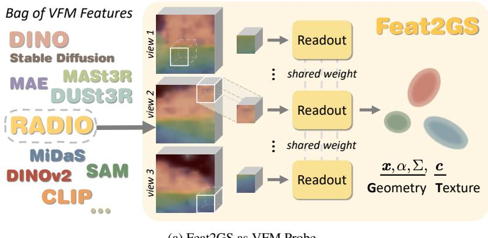

GeometryGeometry eometry  
TexturTextureTexture  
NVNVSNVS  
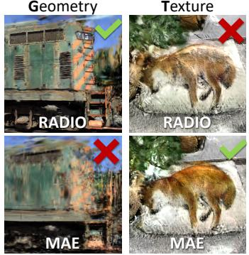  
(b) Extensive Analysis of VFM  
Figure 1. We present Feat2GS, a unified framework to probe “texture and geometry awareness” of visual foundation models (VFMs). Novel-view synthesis (NVS) serves as an effective proxy for 3D evaluation. (a) Casually captured photos are input into VFMs to extract features and into a stereo reconstructor to obtain relative poses. Pixel-wise features are transformed into 3D Gaussians (3DGS) using a lightweight readout layer trained with photometric loss. (b) 3DGS parameters, grouped into Geometry and Texture, enable separate analysis of geometry/texture awareness in VFMs, evaluated by the NVS quality on diverse, unposed open-world images. (c) Our baseline derived from extensive empirical analysis, achieves superior performance for NVS by simply concatenating features from diverse VFMs.

## Abstract

Given that visualfoundation models (VFMs) are trained on extensive datasets but often limited to 2D images, a natural question arises: how well do they understand the 3D world? With the differences in architecture and training protocols (i.e., objectives, proxy tasks), a unifiedframework tofairly and comprehensively probe their 3D awareness is urgently needed. Existing works on 3D probing suggest single-view 2.5D estimation (e.g., depth and normal) or two-view sparse 2D correspondence (e.g., matching and tracking). Unfortunately, these tasks ignore texture awareness, and require 3D data as ground-truth, which limits the scale and diversity of their evaluation set. To address these issues, we introduce Feat2GS, which readout 3D Gaussians attributesfrom VFM features extractedfrom unposed images. This allows us to probe 3D awarenessfor geometry and texture via novel view synthesis, without requiring 3D data. Additionally, the disentanglement of 3DGS parameters – geometry (x, α, Σ) and texture (c) – enables separate analysis oftexture and geome-

try awareness. Under Feat2GS, we conduct extensive experiments to probe the 3D awareness of several VFMs, and investigate the ingredients that lead to a 3D aware VFM. Building on thesefindings, we develop several variants that achieve state-of-the-art across diverse datasets. This makes Feat2GS usefulfor probing VFMs, and as a simple-yet-effective baseline for novel-view synthesis. Code and data will be made available at fanegg.github.io/Feat2GS.

## 1. Introduction

Visual foundation models (VFMs) [6] have emerged as the basis for various 2D reasoning tasks [45, 70] and as a critical component for 3D fine-tuning [3, 10, 13, 35, 40, 71, 95, 107, 113]. Their strong few-shot or zero-shot generalization ability stems mainly from the expressive features [9, 73, 76]. But what is the key for the 3D expressiveness? Does 3D awareness have to comefrom 3D data? Some VFMs, such as DINOv2 and MAE, are trained using only

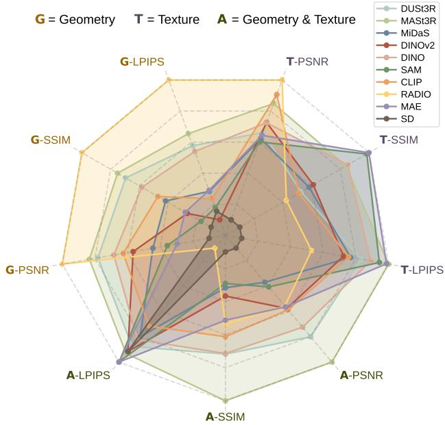  
Figure 2. Texture+Geometry probing of mainstream VFMs. Normalized average metrics for novel view synthesis (NVS) across six datasets are plotted on axes, with higher values away from the center indicating better performance. Try the interactive visualization demo on fanegg.github.io/Feat2GS.

2D images. How important is the training approach? VFMs differ in many aspects, such as learning strategies (e.g., selfsupervised [9, 34], supervised learning [45, 50, 95]), and proxy tasks (e.g., depthmap regression [95], cross-view completion [98], generation [76]). These differences make fair and comprehensive benchmarking difficult.

To answer these questions, recent works [22, 75] evaluate the geometry awareness of VFMs using two proxy tasks: 1) 2.5D depth/normal/token estimation from a single image [22, 75], and 2) 2D matching/tracking between two views [2, 22]. Though it does analyze the 3D awareness of current VFMs, it does not probe the texture awareness and multiview dense consistency of VFM features, which are critical for 3D-related tasks, such as reconstruction and generation.

For “texture awareness”, texture-invariant training improves geometry estimation but can harm texture preservation (see RADIO in Fig. 2). However, recovering original textures from VFM features is key for training on largescale 2D data with photometric loss [24, 35, 82, 106] and texture synthesis [21]. “Multi-view dense probing”, like novel view synthesis (NVS) [8, 83], allows every input pixel to contribute to the evaluation, rather than just sparse matching points. Unlike 2D sparse matching, NVS only requires images, eliminating the need for costly labeling of visual correspondences. With the numerous public multiview datasets [4, 47, 53, 61, 112] available, covering diverse scenes and viewpoints, a new 3D probing approach using these datasets to evaluate texture and geometry awareness in dense mode could be invaluable.

<table><tr><td>Feat2GS</td><td>-Geometry -Texture</td><td></td><td>-All</td><td>InstantSplat [23]</td></tr><tr><td>Feature-Readout</td><td> $\overline { { { \bf x } , { \boldsymbol { \alpha } } , \Sigma } }$ </td><td>C</td><td>x, c, α, Σ</td><td>一</td></tr><tr><td>Free-Optimize</td><td>C</td><td> $x , \alpha , \Sigma$ </td><td></td><td> ${ \pmb x } , { \pmb c } , { \pmb \alpha } , { \pmb \Sigma }$ </td></tr></table>

Table 1. GTA probing schemes. Unlike InstantSplat, Feat2GS uses shallow readout layer to parse VFM features into 3DGS. GTA modes include: Geometry– VFM features to Gaussian geometric parameters (i.e., positions x, opacity α, covariance Σ), Texture– VFM features to Gaussian textural parameters, i.e., SH coefficients c, and All– all parameters are regressed from features.

Thus, we introduce Feat2GS, short for Feature2Gaussian, which evaluates both texture and geometry awareness of VFMs, in the NVS task, using only 2D multi-view data. As shown in Fig. 1, during training, Feat2GS extracts image features from the input views using pre-trained VFMs. A shallow MLP readout layer then regresses the parameters of 3D Gaussians [41] from these features. Multi-view photometric loss minimizes the visual difference between renderings and inputs. During testing, visual similarity metrics (i.e., PSNR, SSIM, LPIPS) are measured for unseen views, across diverse datasets, with Tab. 4 demonstrating that these 2D metrics align well with 3D metrics. To handle sparse and uncalibrated casual images, we initialize camera parameters using DUSt3R [95] and refine them with photometric loss.

The parameters of 3DGS, grouped into geometry (x, α, Σ) and texture (c), enable separate analysis of VFM’s texture and geometry awareness. Each group could switch between the “Feature-Readout” and “Free-Optimize” modes to use VFM features as input or free-optimized. This leads to three probing schemes (short as GTA), as shown in Tab. 1.

In summary, our key contributions are as follows: 1) Feat2GS as VFM probe. Feat2GS offers a unified framework (Fig. 1) to probe the 3D awareness (texture and geometry) of pre-trained VFMs, without using 3D labels. 2) Extensive analysis of VFM. We evaluate a wide range of mainstream VFMs (Fig. 2) across diverse multi-view datasets (Tab. 5), spanning from simple scenes to causal captures. These experiments reveal common drawbacks of VFMs and shed light on how to improve them (Sec. 4.3). 3) Strong baseline for NVS. Motivated by these findings, we design three variants of Feat2GS that outperform the current SOTA InstantSplat [23] in all metrics (Tab. 6).

## 2. Related Work

Measuring 3D Awareness of VFMs. There is no doubt that, visual foundation models [6], short as VFMs, have significantly advanced various 3D vision tasks, such as geometric cue estimation [3, 28, 36, 40, 43, 71, 107], 6D pose estimation [66], visual tracking [89], and spatial reasoning [13, 25], etc. However, behind these advances and everyday SOTA records, are these VFMs truly 3D-aware, even when trained without any 3D data? If so, to what extent? And what enables such awareness? There is a line of works that try to answer these questions through multi-view object consistency [7], spatial visual question answering [27, 122], visual perspective taking [54] and robot learning [57, 79, 119]. Although in the same spirit of 3D probing, these existing works mainly focus on coarse-grained semantic reasoning, such as determining “which marker is closer” instead of fine-grained, or even pixel-wise spatial reasoning, like depth estimation. Regarding the fine-grained 3D probes, they either use 2.5D proxy tasks, such as geometric cues estimation $( i . e . ,$ , depth, normal) [22] and view token estimation [75], or use twoview sparse point matching [22] and tracking [2] to assess the 3D awareness of VFMs. The main constraint of these fine-grained 3D probes is their reliance on labeled 3D data, which significantly limits fair and comprehensive evaluation on large-scale visual data. Feat2GS addresses this by first regressing 3DGS from VFM features and then benchmarking 3D awareness via novel view synthesis. This comes with two advantages: ALL raw pixels can contribute to the final evaluation, and ANY multi-view captures can be leveraged. Feat2GS enables “dense” and “diverse” 3D probing.

NVS from Casual Images. Novel view synthesis has made significant progress in recent years [11, 41, 62, 63, 86]. When it comes to sparse and causal captures, which is a quite challenging scenerio, various regularizers [64, 103] or visual priors, such as depth [20, 120], pre-trained visual features [37, 102], diffusion priors [97, 99] and feed-forward modeling [10, 12, 17, 35, 39, 55, 77, 90, 111, 121], have been introduced. However, these methods assume known camera poses from Structure-from-Motion [78], which are not available for sparse captures with minimal overlap. Although some works attemp to optimize camera poses alongside NVS optimization [96], using techniques like coarse-tofine encoding [52], local-to-global registration [16], geometric constrains [38], adversarial objectives [59], dense correspondence [87], and external priors [5, 29, 60], they can only handle dense-view or video-like sequences — not sparseview images. Groundbreaking methods like DUSt3R [95], MASt3R [50], and subsequent works [92, 115] address these limitations by training models on large-scale datasets. They approach the pairwise reconstruction problem as a regression of point maps, easing the strict constraints of traditional projective camera models. This enables “Unconstrained Stereo 3D Reconstruction” of arbitrary image collections, without needing prior information about camera calibration or viewpoint poses. The predicted pointmap can directly initialize 3DGS [41], which can then be regressed in a twoview feedforward [24, 82, 106] or optimized with multi-view photometric losses [23]. InstantSplat [23] closely mirrors our target of optimizing 3DGS from sparse captures using DUSt3R estimated cameras. What sets our Feat2GS apart is that we readout 3DGS using visual features, instead of optimizing it in free form, see Tab. 1. This can be done with a shallow readout MLP, helping to prevent overfitting.

## 3. Method

## 3.1. Feat2GS

We illustrate our pipeline in Fig. 1. After extracting frozen feature maps from various visual foundation models (VFMs), we take the following steps to ensure fair probing: unifying the feature channel dimensions using Principal Component Analysis (PCA) [33], standardizing the spatial dimensions via bilinear upsampling, and maintaining a consistent network architecture for different VFM features. Specifically, Feat2GS takes the compact features $\mathbf { f } _ { i }$ of each pixel $i \in \{ 1 , 2 , \ldots , n \}$ as input and output per-pixel Gaussian primitive via a readout layer gΘ:

$$
G _ { i } = g _ { \Theta } ( \mathbf { f } _ { i } )\tag{1}
$$

where each Gaussian $G _ { i }$ is parameterized by: position $\textbf { \em x } \in \ \mathbb { R } ^ { 3 }$ , opacity $\alpha \in \mathbb { R }$ , covariance matrix $\Sigma \in \mathbb { R } ^ { 3 \times 3 }$ and three order of spherical harmonic (SH) coefficients $\big \{ \pmb { c } _ { i } \in \mathbb { R } ^ { 4 8 } | i = 1 , 2 , . . . , n \big \}$

To ensure the readout layer acts purely as an information conduit rather than a memory storage, we minimize its parameters that forcing the 3D Gaussians are decoded from the features. Specifically, the readout layer is constructed using a 2-layer MLP with 256 units per-layer and ReLU activation instead alternatives like dense prediction transformer [22]. With ReLU activation, it forms the minimal setup for nonlinear mapping. Then we splat 3D Gaussians onto images via differentiable rasterization. Note that, to enable our method to evaluate casually captured, sparse, and uncalibrated images, we use an unconstrained stereo reconstructor [50, 92, 115], DUSt3R [95] in our experiments, to initialize camera poses T, which are then jointly updated with the readout layer $g _ { \Theta } ^ { ( m o d e ) }$ or freely-optimized Gaussian parameters $O ^ { ( m o d e ) }$ in a specific mode, using a simple photometric loss between renderings $\mathcal { R } _ { v } ( \cdot )$ and images $\{ \mathcal { T } _ { v } \} _ { v = 1 } ^ { N } ;$

$$
\Theta ^ { * } , O ^ { * } , T ^ { * } = \underset { \Theta , O , T } { \arg \operatorname* { m i n } } \sum _ { v \in N } \| \mathcal { R } _ { v } ( g _ { \Theta } ( \mathbf { f } ) , O , T ) - \mathcal { Z } _ { v } \|\tag{2}
$$

To decouple the geometry and texture awareness, we propose three probing modes: Geometry reads out geometric parameters from the 2D image features, and freely optimizes textural parameters $\mathbf { { c } } _ { i } \mathbf { { ) } }$

$$
\{ \pmb { x } _ { i } , \alpha _ { i } , \Sigma _ { i } \} = g _ { \Theta } ^ { ( G ) } ( \mathbf { f } _ { i } ) , \{ \pmb { c } _ { i } \} = O ^ { ( G ) }\tag{3}
$$

Texture reads out textural parameters, and directly optimizes geometric parameters $\{ x _ { i } , \alpha _ { i } , \Sigma _ { i } \}$ :

$$
\{ \pmb { c } _ { i } \} = g _ { \Theta } ^ { ( T ) } ( \mathbf { f } _ { i } ) , \{ \pmb { x } _ { i } , \alpha _ { i } , \Sigma _ { i } \} = O ^ { ( T ) }\tag{4}
$$

All reads out all Gaussian parameters:

$$
\{ \pmb { x } _ { i } , \alpha _ { i } , \Sigma _ { i } , \pmb { c } _ { i } \} = g _ { \Theta } ^ { ( A ) } ( \mathbf { f } _ { i } ) , \{ \} = \pmb { O } ^ { ( A ) }\tag{5}
$$

<table><tr><td>VFM</td><td>Arch.</td><td>Channel</td><td>Supervision</td><td>Dataset</td></tr><tr><td>DUSt3R [95]</td><td>ViT-L/16</td><td>1024</td><td>Point Regression</td><td>3D DUSt3R-Mix</td></tr><tr><td>MASt3R [50]</td><td>ViT-L/16</td><td>1024</td><td>Point Regression</td><td>3D MASt3R-Mix</td></tr><tr><td>MiDaS [71]</td><td>ViT-L/16</td><td>1024</td><td>Depth Regression</td><td>3D MiDaS-Mix</td></tr><tr><td>DINOv2 [65]</td><td>ViT-B/14</td><td>768</td><td>Self Distillation</td><td>2D LVD-142M</td></tr><tr><td>DINO [9]</td><td>ViT-B/16</td><td>768</td><td>Self Distillation</td><td>2D ImageNet-1k</td></tr><tr><td>SAM [45]</td><td>ViT-B/16</td><td>768</td><td>Segmentation</td><td>2D SA-1B</td></tr><tr><td>CLIP [70]</td><td>ViT-B/16</td><td>512</td><td>Contrastive VLM</td><td>2D WIT-400M</td></tr><tr><td>RADIO [73]</td><td>ViT-H/16</td><td>1280</td><td>Multi-teacher Distillation</td><td>2D DataComp-1B</td></tr><tr><td>MAE [34]</td><td>ViT-B/16</td><td>768</td><td>Image Reconstruction</td><td>2D ImageNet-1k</td></tr><tr><td>SD [76]</td><td>UNet</td><td>1280</td><td>Denoising VLM</td><td>2D LAION</td></tr></table>

Table 2. VFMs for Evaluation. For fair comparison, we use checkpoints with comparable architectures and training scales, unify the feature channel dimensions via PCA, and maintain a consistent probing network architecture for all VFMs.

## 3.2. Warm Start

We find that directly decoding 3D structures from 2D image features can easily stuck in local minimal due to the sparse nature of casual images. To ensure robust evaluation of features from diverse foundation models, we warm up our optimization using a point cloud regression:

$$
\underset { \Theta } { \operatorname* { m i n } } \left\| g _ { \Theta } ( \mathbf { f } ) - \pmb { G } _ { i n i t } \right\|\tag{6}
$$

where $G _ { i n i t }$ refers to the initialization point cloud comes from DUSt3R [95].

## 3.3. Evaluation

We choose to evaluate on NVS from casual (sparse and uncalibrated) images [23] for two main reasons: (1) Diversity. The capability of handling casual images helps diversify the evaluation data by lowering the requirements for acquisition techniques and view setups. (2) Discrepancy. This task poses more of a challenge compared to dense-view NVS, making it better to differentiate the performance of various VFM features. To enable our evaluation to cover arbitrary casual capturing from 3 to N views, we uniformly estimate the camera parameters of both training and test views across all datasets via unconstrained stereo reconstructor. Subsequently, we perform test-time pose optimization [5, 23, 29, 52, 96] via photometric loss to further refine the test poses before evaluating view synthesis quality.

## 4. Experiments

## 4.1. Experimental Setup

Features. We focus our experiments on 10 VFMs that show strong potential for generalizable 3D awareness, comparing models trained on different data types (2D vs. 3D) and supervision strategies (e.g., supervised vs. self-supervised, point vs. depth). An overview is provided in Tab. 2, with more details in Sup.Mat. To make the comparison as fair as possible, we use publicly available checkpoints and select those with comparable architectures and training scales. We also incorporate IUVRGB, comprising image index (I), pixel coordinates (UV), and colors (RGB), as a baseline.

<table><tr><td>Dataset</td><td>Scene Type</td><td>Complexity</td><td>View Range</td><td>Views</td></tr><tr><td>LLFF [61]</td><td>Indoor</td><td>Simple</td><td>Small</td><td>2</td></tr><tr><td>DTU [1]</td><td>Indoor Object</td><td>Simple</td><td>Small</td><td>3</td></tr><tr><td>DL3DV [53]</td><td>Indoor / Outdoor</td><td>Moderate</td><td>Medium</td><td>5-6</td></tr><tr><td>Casual</td><td>Daily Scenario</td><td>Moderate</td><td>Medium</td><td>4-7</td></tr><tr><td>MipNeRF360 [4]</td><td>Unbounded</td><td>Moderate</td><td>360</td><td>6</td></tr><tr><td>MVimgNet [112]</td><td>Outdoor Object</td><td>Moderate</td><td>180-360</td><td>2-4</td></tr><tr><td>T&amp;T [47]</td><td>Indoor / Outdoor</td><td>High</td><td>Large</td><td>6</td></tr></table>

Table 3. Datasets for Evaluation. Classified by scene type, complexity, viewpoint variation, and sampled views.

Datasets. To reliably evaluate different features, our experiments utilize seven multi-view datasets, with sparse views sampled spanning from 2 to 7, and test viewpoints far from the training viewpoints. These datasets, as shown in Tab. 3, rich in diversity, provide us with a more comprehensive perspective compared to datasets with 3D ground-truth.

Metrics. We evaluate novel view synthesis across seven datasets using standard metrics: PSNR, SSIM, and LPIPS. For metric calculation, we follow Splatt3R [82] by applying masks to both the rendered and test images. These masks define valid pixels as those inside the frustum of at least one view and with reprojected depths aligned with DUST3R predicted depth. All metrics are computed over the entire image. On the DTU dataset, we measure the distance between reconstructed 3DGS and point cloud ground truth (Tab. 4), reporting average accuracy, completeness, and distance, as in prior works [1, 92]. Accuracy is the smallest Euclidean distance from a reconstructed point to ground truth, and completeness is the smallest Euclidean distance from a groundtruth point to the reconstruction. Distance is the Euclidean distance based on ground-truth point matching.

## 4.2. Motivation Validation

Novel View Synthesis Correlates with 3D Metrics. Using 2D metrics instead of 3D ones allows us to bypass the need for 3D ground-truth. Motivated by this, we propose Feat2GS to assess the 3D awareness of VFMs through the 2D metric of novel view synthesis (NVS). The key question is: Can novel view synthesis effectively serve as a proxyfor 3D metrics? We posit that high-quality NVS strongly correlates with an accurate 3D representation. To validate this hypothesis, we conduct experiments on the DTU dataset [1] with dense pointclouds as 3D ground-truth, evaluating both the 2D NVS and the 3D point cloud regression tasks. We then calculated the correlation between these results, as shown in Tab. 4. The results reveal a strong correlation between 2D and 3D metrics, supporting NVS as an indicator for 3D assessment. We further qualitatively demonstrate this correlation in Fig. 3 (See more details in Sup.Mat.’s Fig. R.5). The results indicate a strong relationship between NVS and 3D metrics, confirming that high-quality NVS aligns closely with accurate 3D representations.

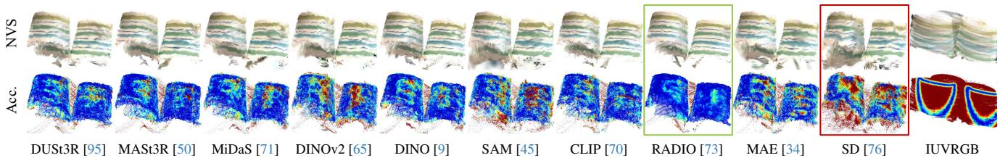  
Figure 3. Novel View Synthesis as Proxy Task to Assess 3D. We present qualitative examples from the DTU dataset, including NVS and Accuracy. Results show that NVS quality aligns with 3D metrics, proving its reliability as an indicator for 3D assessment. RADIO performs best, SD worst, with IUVRGB as a reference. ü Zoom in or check our webpage to see more details.

<table><tr><td rowspan=1 colspan=1></td><td rowspan=1 colspan=1>2D Metrics</td><td rowspan=1 colspan=3>3D Metrics</td></tr><tr><td rowspan=1 colspan=1>Feature</td><td rowspan=1 colspan=1>PSNR↑ SSIM↑ LPIPS↓|</td><td rowspan=1 colspan=3>Acc.↓Comp.↓Dist.↓</td></tr><tr><td rowspan=1 colspan=1>DUSt3R</td><td rowspan=1 colspan=1>21.36.7772.2195</td><td rowspan=1 colspan=1>2.439</td><td rowspan=1 colspan=1>1.316</td><td rowspan=1 colspan=1>6.955</td></tr><tr><td rowspan=1 colspan=1>MASt3R</td><td rowspan=1 colspan=1>21.44 .7792.2177</td><td rowspan=1 colspan=1>2.321</td><td rowspan=1 colspan=1>1.286</td><td rowspan=1 colspan=1>6.557</td></tr><tr><td rowspan=1 colspan=1>MiDaS</td><td rowspan=1 colspan=1>21.09.7712.2254</td><td rowspan=1 colspan=1>2.934</td><td rowspan=1 colspan=1>1.412</td><td rowspan=1 colspan=1>8.230</td></tr><tr><td rowspan=1 colspan=1>DINOv2</td><td rowspan=1 colspan=1>21.01.7695.2277</td><td rowspan=1 colspan=1>3.101</td><td rowspan=1 colspan=1>1.337</td><td rowspan=1 colspan=1>8.588</td></tr><tr><td rowspan=1 colspan=1>DINO</td><td rowspan=1 colspan=1>21.40.7783.2187</td><td rowspan=1 colspan=1>2.440</td><td rowspan=1 colspan=1>1.316</td><td rowspan=1 colspan=1>6.885</td></tr><tr><td rowspan=1 colspan=1>SAM</td><td rowspan=1 colspan=1>20.93.7660.2304</td><td rowspan=1 colspan=1>3.176</td><td rowspan=1 colspan=1>1.339</td><td rowspan=1 colspan=1>8.785</td></tr><tr><td rowspan=1 colspan=1>CLIP</td><td rowspan=1 colspan=1>21.26.7752.2215</td><td rowspan=1 colspan=1>2.357</td><td rowspan=1 colspan=1>1.209</td><td rowspan=1 colspan=1>6.739</td></tr><tr><td rowspan=1 colspan=1>RADIO</td><td rowspan=1 colspan=1>21.78.7871.2042</td><td rowspan=1 colspan=1>1.886</td><td rowspan=1 colspan=1>1.326</td><td rowspan=1 colspan=1>5.431</td></tr><tr><td rowspan=1 colspan=1>MAE</td><td rowspan=1 colspan=1>20.96 .7666.2289</td><td rowspan=1 colspan=1>2.963</td><td rowspan=1 colspan=1>1.337</td><td rowspan=1 colspan=1>8.374</td></tr><tr><td rowspan=1 colspan=1>SD</td><td rowspan=1 colspan=1>20.76.7638.2343</td><td rowspan=1 colspan=1>4.334</td><td rowspan=1 colspan=1>1.603</td><td rowspan=1 colspan=1>11.594</td></tr><tr><td rowspan=1 colspan=1>IUVRGB</td><td rowspan=1 colspan=1>16.09.6825.3134</td><td rowspan=1 colspan=1>13.015</td><td rowspan=1 colspan=1>16.957</td><td rowspan=1 colspan=1>46.671</td></tr></table>

(a) 2D Metrics vs. 3D Metrics

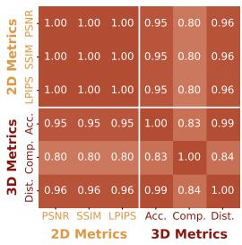  
(b) Correlation Matrix  
Table 4. Novel View Synthesis Aligns Well with 3D Metrics. (a) We report NVS quality and the Euclidean distance between reconstructed 3DGS positions and pointcloud ground truth on the DTU dataset. (b) Strong 2D-3D metric correlation supports NVS as a benchmark for 3D assessment.

Data Diversity Matters for Comprehensive Probing. Testing on small-scale data can lead to biased conclusions. As shown in Tab. 5, the evaluation results vary across probing GTA modes and different datasets. For instance, LLFF is relatively simple for novel view synthesis due to its dense view capturing and small scale. MASt3R, DUSt3R, and DINO show superior geometry results on LLFF. However, none of them ranks higher than RADIO on T&T dataset, which features more challenging scenes. We sort the datasets from easy to hard in Tab. 5 to derive insights from the variations. Additionally, we show performance correlations in Sup.Mat.’s Fig. R.1. We observe that no method consistently performs well across all datasets when the evaluation set is large. Dataset evaluation bias is inevitable. By removing the need for 3D ground truth, we can evaluate on large-scale diverse captures, thereby ensuring that the results are much less biased. Therefore, we base our findings on overall performance and discuss outliers separately.

## 4.3. Findings

Overall Performance. Table 5 benchmarks VFM features with three probing modes: Geometry, Texture and All. The mean scores across diverse datasets are plotted in Fig. 2. The top three performers in Geometry mode are RADIO > MASt3R > DUSt3R. However, they show significantly different rating in Texture mode, with MAE > SAM > MASt3R. In the All mode, MASt3R and DUSt3R achieve the best score, followed by DINO. In Tab. 5, Stable Diffusion (SD) performs the worst in most metrics, Fig. 6-A shows its significant color drift and broken geometry, check Sup.Mat. for more qualitative results of geometry. This aligns with the conclusion about SD in Probe3D [22]. Large viewpoint changes cause inconsistency in the feature space (see Fig. 7b). In the following sections, we provide a comprehensive analysis of the insights behind the above ratings.

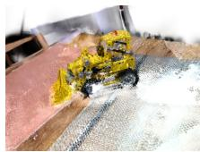  
RADIO

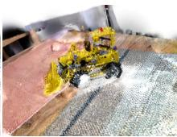  
MAE

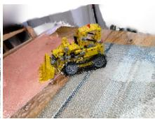  
IUVRGB

Figure 4. Texture Blurriness Comparison. MAE preserves sharper texture over RADIO. IUVRGB is shown for reference.  
  
GT

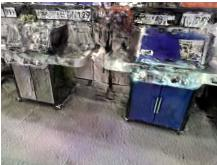  
SD

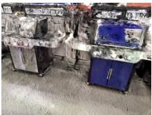  
MAE  
Figure 5. MAE vs. SD on Texture Awareness. While both MAE and SD are trained to reconstruct images (MAE in pixel space with an MSE loss and SD in feature space with a denoising loss), SD tends to result in a significant color shift.

Texture-unfriendly Training Strategies. As shown in Tab. 5 and Fig. 6, VFM features perform poorly in Texture mode, even worse than the simple IUVRGB encoding shown in Fig. 4. It suggests that current VFM features lack texture awareness, as noted in [82, 106]. One likely explanation for this is that VFMs are often trained for semantic understanding or 3D estimation, which require texture-invariant features to avoid shortcuts [30, 31]. For example, DUSt3R is trained to be texture-invariant for better 3D robustness on diverse in-the-wild captures. Heavy data augmentations in SSL (i.e., DINO [9], BYOL [32], Sim-CLR [14]), such as color jittering, Gaussian blur, and solarization, encourage the model to produce consistent outputs despite changes in appearance or lightning. Since CLIP is trained on weakly aligned image-text pairs, it often includes ambiguous and coarse semantics that are not discriminative enough to model low-level visual patterns, like colors, materials, and textures [93]. RADIO distills DINO and CLIP, achieving excellent geometry awareness, but also inherits their poor texture awareness (see Fig. 2 and Fig. 4).

<table><tr><td colspan="8"></td><td colspan="8"></td><td colspan="4"></td><td colspan="8">Casual</td></tr><tr><td rowspan="2"></td><td colspan="2">Geometry</td><td colspan="2"></td><td colspan="2">Texture</td><td colspan="2">All</td><td colspan="2"></td><td colspan="2">Geometry</td><td colspan="2">Texture</td><td colspan="2"></td><td colspan="2">All</td><td colspan="2">Geometry</td><td colspan="2">Texture</td><td colspan="2"></td><td colspan="2">All</td></tr><tr><td>Feature PSNR↑</td><td>SSIM↑</td><td>LPIPS↓</td><td>PSNR↑</td><td>SSIM↑</td><td>LPIPS↓| PSNR↑</td><td></td><td>SSIM↑</td><td></td><td>LPIPS↓| PSNR↑</td><td>SSIM↑</td><td>LPIPS↓</td><td>| PSNR↑</td><td>SSIM↑</td><td>LPIPS↓|</td><td> PSNR↑</td><td>SSIM↑</td><td>LPIPS↓ | PSNR↑</td><td>SSIM↑</td><td>LPIPS↓</td><td>PSNR↑</td><td>SSIM↑</td><td></td><td>LPIPS↓|</td><td>| PSNR↑</td><td>SSIM↑ LPIPS↓</td></tr><tr><td>DUSt3R</td><td></td><td></td><td>.2123</td><td>19.01</td><td>.7120</td><td>.2262</td><td>19.87</td><td>.7190</td><td>.2691</td><td>19.64</td><td>.7338</td><td>.3196</td><td>18.01</td><td>.6815</td><td>.3219</td><td>19.39</td><td>.7360</td><td>19.29</td><td>.6562</td><td>.3580</td><td>17.54</td><td></td><td>.5693</td><td>.3750</td><td>19.19</td><td>.6556</td><td>.4050</td></tr><tr><td>MASt3R</td><td>19.88 19.89</td><td>.7442 .7447</td><td>.2123</td><td>19.01</td><td>.7115</td><td>.2261</td><td>19.99</td><td>.7250</td><td>.2657</td><td>19.64</td><td></td><td>.3188</td><td>18.07</td><td>.6813</td><td>.3211</td><td>19.41</td><td>.7373</td><td>.3458 .3464</td><td>19.30 .6550</td><td>.3576</td><td></td><td>17.59</td><td>.5708</td><td>.3722</td><td></td><td></td><td>.4027</td></tr><tr><td></td><td></td><td>.7420</td><td></td><td>19.00</td><td>.7129</td><td>.2261</td><td>19.86</td><td>.7142</td><td>.2733</td><td>19.47</td><td>.7334</td><td></td><td>17.94</td><td>.6796</td><td>.3224</td><td>19.22</td><td>.7291</td><td>.3493 19.24</td><td>.6545</td><td></td><td></td><td></td><td>.5693</td><td>.3757</td><td>19.37 18.96</td><td>.6588 .6516</td><td>.4073</td></tr><tr><td>MiDaS DINOv2</td><td>19.81</td><td>.7345</td><td>.2154 .2226</td><td>19.04</td><td>.7133</td><td>.2254</td><td>19.91</td><td>.7163</td><td>.2637</td><td>19.47</td><td>.7271 .7293</td><td>.3311 .3288</td><td>18.00</td><td>.6805</td><td>.3223</td><td>19.27</td><td>.7317</td><td>.3479 19.42</td><td></td><td>.3612</td><td>17.52</td><td></td><td>.5701</td><td>.3754</td><td>19.21</td><td>.6535</td><td>.4023</td></tr><tr><td>DINO</td><td>19.77 19.81</td><td>.7423</td><td>.2140</td><td>18.98</td><td>.7121</td><td>.2260</td><td>19.97</td><td>.7212</td><td>.2744</td><td>19.60</td><td>.7324</td><td>.3209</td><td>17.97</td><td>.6790</td><td>.3219</td><td>19.41</td><td>.7359</td><td>.3476 19.24</td><td>.6524 .6513</td><td>.3698 .3614</td><td>17.64</td><td></td><td>.5683</td><td>.3756</td><td>19.10</td><td>.6566</td><td>.4056</td></tr><tr><td>SAM</td><td>19.72</td><td>.7354</td><td>.2181</td><td>18.98</td><td>.7133</td><td>.2260</td><td>19.76</td><td>.7144</td><td>.2629</td><td>19.48</td><td>.7297</td><td>.3271</td><td>17.97</td><td>.6822</td><td>.3218</td><td>19.20</td><td>.7272</td><td>.3459 19.32</td><td>.6469</td><td>.3704</td><td>17.50 17.52</td><td>.5725</td><td></td><td>.3736</td><td>19.19</td><td>.6569</td><td>.3981</td></tr><tr><td>CLIP</td><td>19.78</td><td>.7378</td><td>.2221</td><td>19.02</td><td>.7113</td><td>.2276</td><td>19.74</td><td>.7136</td><td>.2822</td><td>19.53</td><td>.7295</td><td>.3304</td><td>18.05</td><td>.6771</td><td>.3235</td><td>19.22</td><td>.7310</td><td>.3563 19.21</td><td>.6552</td><td>.3719</td><td>17.46</td><td></td><td>.5669</td><td>.3743</td><td>19.05</td><td>.6582</td><td>.4084</td></tr><tr><td>RADIO</td><td>19.73</td><td>.7402</td><td>.2207</td><td>19.06</td><td>.7101</td><td>.2301</td><td>19.56</td><td>.6999</td><td>.3252</td><td>19.48</td><td>.7313</td><td>.3139</td><td>18.03</td><td>.6748</td><td>.3254</td><td>19.20</td><td>.7316</td><td>.3654 19.54</td><td>.6545</td><td>.3465</td><td>17.52</td><td></td><td>.5666</td><td>.3748</td><td>18.67</td><td>.6533</td><td>.4216</td></tr><tr><td>MAE</td><td>19.75</td><td>.7363</td><td>.2183</td><td>19.00</td><td>.7128</td><td>.2249</td><td>19.92</td><td>.7209</td><td>.2612</td><td>19.54</td><td>.7288</td><td>.3248</td><td>17.98</td><td>.6821</td><td>.3207</td><td>19.34</td><td>.7310</td><td>.3448 19.03</td><td>.6502</td><td>.3690</td><td>17.51</td><td>.5691</td><td></td><td>.3758</td><td>19.18</td><td>.6547</td><td>.3974</td></tr><tr><td>SD</td><td>19.62</td><td>.7293</td><td>.2234</td><td>18.85</td><td>.7100</td><td>.2297</td><td>19.78</td><td>.7121</td><td>.2656</td><td>19.31</td><td>.7251</td><td>.3276</td><td>17.79</td><td>.6784</td><td>.3260</td><td>19.10</td><td>.7282</td><td>.3500 19.24</td><td>.6483</td><td>.3649</td><td>17.38</td><td></td><td>.5698</td><td>.3789</td><td>18.86</td><td>.6505</td><td>.4053</td></tr><tr><td rowspan="2">IUVRGB</td><td>15.55</td><td>.5765</td><td>.3986</td><td>19.75</td><td>.7303</td><td>.2262</td><td>15.38</td><td>.6175</td><td>.4308</td><td>14.78</td><td>.6326</td><td>.4541</td><td>18.75</td><td>.7023</td><td>.3250</td><td>14.05</td><td>.6431</td><td>.4386 13.17</td><td>.5454</td><td>.5248</td><td>17.88</td><td></td><td>.5927</td><td>.3846</td><td>13.71</td><td>.5917</td><td>.4955</td></tr><tr><td></td><td></td><td></td><td></td><td></td><td></td><td></td><td></td><td></td><td></td><td></td><td></td><td></td><td></td><td></td><td></td><td></td><td></td><td></td><td></td><td></td><td></td><td></td><td></td><td></td><td></td><td></td></tr></table>

<table><tr><td></td><td colspan="6"></td><td colspan="6"></td><td colspan="6">MVImgNet Texture</td><td colspan="6">Tanks and Temples (T&amp;T)</td><td colspan="5"></td></tr><tr><td></td><td colspan="2">Geometry</td><td colspan="2"></td><td colspan="2">Texture</td><td colspan="2"></td><td colspan="2">All</td><td colspan="2">Geometry</td><td colspan="2"></td><td colspan="2"></td><td colspan="2">All</td><td colspan="2"></td><td colspan="2">Geometry</td><td colspan="2"></td><td colspan="2">Texture</td><td colspan="2"></td><td>All</td></tr><tr><td>Feature</td><td>| PSNR↑ SSIM↑</td><td></td><td>LPIPS↓ | PSNR↑</td><td>SSIM↑</td><td></td><td>LPIPS↓ | PSNR↑</td><td>SSIM↑</td><td>LPIPS↓</td><td>PSNR↑</td><td>SSIM↑</td><td>LPIPS↓ | PSNR↑</td><td></td><td>SSIM↑</td><td></td><td>LPIPS↓| PSNR↑</td><td></td><td>SSIM↑</td><td></td><td>LPIPS↓| PSNR↑</td><td>SSIM↑</td><td>LPIPS↓ | PSNR↑</td><td></td><td>SSIM↑</td><td></td><td>LPIPS↓|</td><td> PSNR↑</td><td>SSIM↑</td><td>LPIPS↓</td></tr><tr><td>DUSt3R</td><td></td><td></td><td>.3795</td><td>19.10</td><td>.4489</td><td>.3816</td><td>21.02</td><td>.5048</td><td>.4752</td><td>19.47 .6004</td><td>.3073</td><td>16.88</td><td>.5348</td><td></td><td>.3334</td><td>19.43</td><td>.5937</td><td>.3674</td><td>18.85</td><td>.6458</td><td>.3715</td><td></td><td>17.53</td><td>.6222</td><td></td><td>.3328</td><td>18.61</td><td>.6477</td></tr><tr><td>MASt3R</td><td>20.82</td><td>.5008 .5093</td><td>.3745</td><td>19.21</td><td>.4540</td><td>.3803</td><td>20.92</td><td>.5054</td><td>.4749</td><td>19.49 .6008</td><td>.3032</td><td>16.91</td><td>.5350</td><td>.3337</td><td></td><td>19.49 .5983</td><td></td><td>.3637</td><td>18.80</td><td>.6428</td><td>.3703</td><td>17.68</td><td>.6238</td><td></td><td>.3319</td><td>18.76</td><td>.6512</td><td>.4023 .3991</td></tr><tr><td>MiDaS</td><td>20.92 20.89</td><td>.5059</td><td>.3815</td><td>19.05</td><td>.4509</td><td>.3813</td><td>20.84</td><td>.5004</td><td>.4795</td><td>19.35 .5900</td><td>.3222</td><td>16.82</td><td>.5336</td><td>.3343</td><td></td><td>19.34</td><td>.5910</td><td>.3672</td><td>18.53</td><td>.6374</td><td>.3798</td><td>17.64</td><td></td><td>.6238</td><td>.3333</td><td>18.32</td><td>.6428</td><td>.4039</td></tr><tr><td>DINOv2</td><td></td><td>.4946</td><td>.3953</td><td>19.05</td><td>.4495</td><td>.3821</td><td>20.75</td><td>.4924</td><td>.4684</td><td>19.35 .5896</td><td>.3246</td><td>16.88</td><td>.5359</td><td>.3344</td><td></td><td>19.43</td><td>.5943</td><td>.3674</td><td>18.71</td><td>.6432</td><td>.3772</td><td>17.58</td><td></td><td></td><td>.3348</td><td>18.43</td><td>.6443</td><td>.4064</td></tr><tr><td>DINO</td><td>20.81</td><td>.5054</td><td>.3769</td><td>19.18</td><td>.4545</td><td>.3795</td><td>20.83</td><td>.5010</td><td>.4772</td><td>19.44 .5982</td><td>.3071</td><td>16.90</td><td>.5394</td><td>.3329</td><td></td><td>19.41</td><td>.5952</td><td>.3683</td><td>18.75</td><td>.6416</td><td>.3733</td><td>17.66</td><td>.6214</td><td></td><td>.3330</td><td>18.61</td><td>.6467</td><td>.4030</td></tr><tr><td>SAM</td><td>20.91 20.73</td><td>.4913</td><td>.3945</td><td>19.14</td><td>.4556</td><td>.3775</td><td>20.75</td><td>.4949</td><td>.4639</td><td>19.23 .5899</td><td>.3188</td><td>16.84</td><td>.5346</td><td></td><td>.3346</td><td>19.29</td><td>.5915</td><td>.3649</td><td>18.65</td><td>.6421</td><td>.3780</td><td>17.49</td><td>.6233 .6217</td><td>.3338</td><td></td><td>18.43</td><td>.6425</td><td>.4029</td></tr><tr><td>CLIP</td><td>20.80</td><td>.4982</td><td>.3913</td><td>19.28</td><td>.4543</td><td>.3807</td><td>20.88</td><td>.4984</td><td>.4773</td><td>19.41</td><td>.5945 .3098</td><td>16.96</td><td>.5362</td><td></td><td>.3358</td><td>19.37</td><td>.5969</td><td>.3695</td><td>18.92</td><td>.6463</td><td>.3729</td><td>17.81</td><td>.6226</td><td>.3316</td><td></td><td>18.75</td><td>.6515</td><td>.4052</td></tr><tr><td>RADIO</td><td>20.87</td><td>.5100</td><td>.3620</td><td>19.35</td><td>.4550</td><td>.3819</td><td>20.91</td><td>.5067</td><td>.5127</td><td>19.54</td><td>.6105 .2949</td><td>16.99</td><td>.5373</td><td>.3366</td><td></td><td>19.60</td><td>.5955</td><td>.3946</td><td>19.19</td><td>.6612</td><td>.3480</td><td>17.84</td><td>.6225</td><td>.3321</td><td></td><td>19.01</td><td>.6574</td><td>.4109</td></tr><tr><td>MAE</td><td>20.82</td><td>.4992</td><td>.3884</td><td>19.14</td><td>.4572</td><td>.3781</td><td>20.79</td><td>.4995</td><td>.4668</td><td>19.23</td><td>.5909 .3142</td><td>16.84</td><td>.5355</td><td></td><td>.3328</td><td>19.25</td><td>.5914</td><td>.3680</td><td>18.65</td><td>.6395</td><td>.3758</td><td>17.55</td><td>.6234</td><td>.3333</td><td></td><td>18.49</td><td>.6451</td><td>.4000</td></tr><tr><td>SD IUVRGB</td><td>20.71</td><td>.4962</td><td>.3985</td><td>18.89</td><td>.4472</td><td>.3839</td><td>20.59</td><td>.4929</td><td>.4672</td><td>19.08</td><td>.5881 .3185</td><td>16.63</td><td>.5313</td><td>.3389</td><td></td><td>19.06</td><td>.5838</td><td>.3660</td><td>18.69</td><td>.6422</td><td>.3772</td><td>17.32</td><td>.6217</td><td>.3374</td><td></td><td>18.55</td><td>.6467</td><td>.4020</td></tr><tr><td></td><td>16.45</td><td>.4075</td><td>.5910</td><td>19.96</td><td>.4797</td><td>.3911</td><td>16.41</td><td>.4187</td><td>.5929</td><td>14.83</td><td>.5069 .4648</td><td>17.84</td><td>.5568</td><td>.3431</td><td></td><td>15.38</td><td>.5362</td><td>.4699</td><td>15.29</td><td>.5846</td><td>.4736</td><td>18.60</td><td>.6526</td><td>.3396</td><td></td><td>15.17</td><td>.5948</td><td>.4718</td></tr></table>

Table 5. Quantitative Results. We evaluate geometry and texture awareness of VFMs on NVS using Geometry, Texture, and All probing modes. Results indicate that VFM performance varies across datasets, highlighting the importance of dataset diversity. The lack of texture awareness in VFMs limits both Texture mode and All mode, especially in LPIPS. Performance is ranked by color, from worst to best.

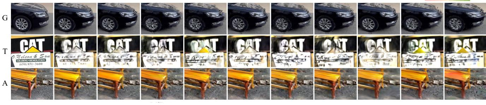  
GT GT  
SD SD [76]  
Figure 6. Qualitative Examples. We compare novel view renderings across VFM features. In Geometry mode, the multi-teacher-distillation method (RADIO) and point-regression-based methods (MASt3R, DUSt3R) produce more plausible geometry, e.g., vehicle front and the wheel, indicating better multi-view consistency. All VFM features struggle in Texture mode, and renderings in the All mode are notably blurred, both reflecting the limited texture awareness of current VFMs.

Texture Benefits from Masked Image Reconstruction. Table 5 shows that the All mode is impeded by Texture mode, leading to worse performance in LPIPS (by an average of +0.05) than Geometry mode, which does not use VFM features for 3DGS color regression. Terrible texture awareness prevents RADIO from being versatile, as Fig. 2 shows. Visually, as displayed in Fig. 6, novel view renderings in the All mode tends to appear blurred. Figure R.3 also shows that Texture mode, which excludes VFM features for 3DGS geometry regression, exhibits broken structures, while All mode appears more blurred than the same regions in Geometry mode because All mode relies on VFM features for 3DGS color regression, unlike Geometry mode, which freely optimizes colors. To further analyze the mutual correlation of GTA modes, we compute their correlation matrix using average metrics across all datasets, as shown in Sup.Mat.’s Fig. R.2. Results indicate that the All mode is more strongly correlated with Geometry mode in PSNR and SSIM, which primarily reflect structural consistency, but is more closely related to Texture mode in LPIPS, a metric used to evaluate image sharpness. This further supports the notion that the blurriness observed in the All mode stems from a lack of texture awareness in VFMs. Texture is obviously crucial for photorealism. How can it be retained in VFMs? As illustrated in Fig. 2, VFMs with masked-imagereconstruction pre-training (i.e., MAE, MASt3R, DUSt3R) rank top in T-LPIPS, and Fig. 4 backs this. MAE’s ability to recover sharp textures might be attributed to using only cropping-only augmentation. Color jittering degrades results, so it’s not included [34]. Additionally, denoise-based image reconstruction leads to color shift, as shown in Fig. 5.

Geometry Benefits from 3D Data. In Fig. 2, RADIO, MASt3R, DUSt3R and DINO rank among the top-4 in geometry awareness metrics. In Fig. 7a, these four features help reconstruct a more complete structure of the excavator, whereas others result in floating artifacts and distortion.

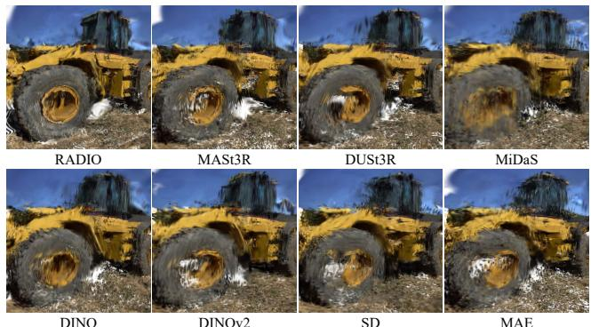

(a) NVS Comparison on Geometry Awareness  
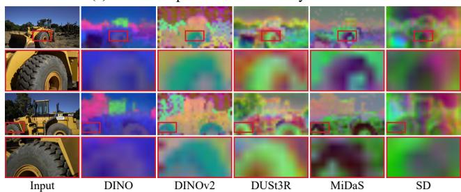  
(b) VFM Features from Training Views  
Figure 7. Feature Consistency Reflected in NVS. (a) RADIO, MASt3R, DUSt3R, and DINO effectively capture geometry. (b) DINO is consistent across training views, but PE artifacts appear in DINOv2. 3D data proves beneficial, as DUSt3R is consistent; however, MiDaS shows inconsistency, suggesting that pointmap representation is more reasonable than depth. SD also exhibits inconsistency. These inconsistencies lead to poor NVS.

Better geometry awareness implies stronger cross-view consistency, which is also supported by Fig. 7b. What is the key ingredient to achieve geometry awareness? One crucial factor is 3D data. Both of MASt3R and DUSt3R are trained with pointmap. What about 2.5D data, like depth or normal maps? It is much worse, see DUSt3R vs. MiDaS at Fig. 7a. Please note that, MiDaS and DUSt3R shares the same ViT-L/16 encoder architecture (see Tab. 2) and comparable training scales (3M vs. 2M). The depth map estimation may cause inconsistent features for the same object when viewed from different distances. In contrast, pointmap regression [95] encourages the network to generate consistent features across views, as the scene coordinates remain unchanged when the view changes [8, 80].

Model Ensembling Help. RADIO, distilling DINOv2, CLIP and SAM into a single model, achieves the best geometry awareness, as shown in Figs. 2, 6 and 7a. A natural question arises: Could simply concatenating thesefeatures yield comparable results? Yes! Specifically, we concatenate features of DINOv2, CLIP and SAM, and then apply PCA to reduce feature channels to 256, keeping the size of the network unchanged for a fair comparison. Figure 8a shows that, in Geometry mode, feature concatenation (DINOv2+CLIP+SAM) outperforms model distillation (RADIO). This inspires us to further explore: What if we combine the best Geometry mode feature and the best Texture mode feature? Sup.Mat.’s Fig. R.2 has indicated that the optimal All mode should have no weakness in either texture or geometry. As shown in Fig. 8b, the All mode using concatenated features from RADIO (best in Geometry mode) with MAE and IUVRGB (best in Texture mode), outperforms the original best All mode with MASt3R features. This exploration shows the potential of our probing method.

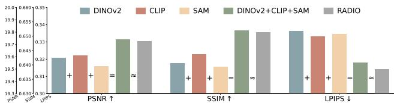

(a) Concatenated Features vs. RADIO  
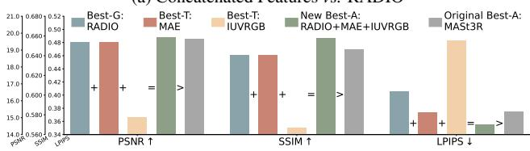  
(b) Concatenated Features vs. MASt3R  
Figure 8. Feature Concatenation. (a) RADIO, distilling DI-NOv2, CLIP, and SAM, achieves superior geometry awareness. Geometry mode with concatenated features from the three yields results comparable to RADIO. (b) The All mode using concatenated VFM features from best Geometry mode and Texture mode, outperforms the original best All mode. \protect \pmb {+} : Feature concatenation; \protec \pmb {\aprox } : Comparable performance; \protec \pmb {>} : Superior performance.

## 5. Application

Feature Pickup. Inspired by Sec. 4.3, we make three Feat2GS variants to compare with InstantSplat [23], in the NVS task using casual (sparse and uncalibrated) images. Specifically, we pick up the TOP1 of Geometry mode, RA-DIO, as the first baseline. As shown in Tab. 6, Feat2GS with RADIO features achieves better PSNR and SSIM over InstantSplat. The qualitative results in Fig. 9 show that InstantSplat often produces broken structures and discontinuity artifacts. This occurs because optimizing millions of 3DGS for sparse viewpoints leads to overfitting highfrequency details, resulting in suboptimal parameters. In contrast, Geometry mode of Feat2GS with RADIO features can produce higher-quality synthesized novel views, thanks to RADIO’s strong geometry awareness. This allows us to read out 3DGS from the deep features using a very lightweight (2-layer) MLP, which is crucial for avoiding overfitting.

Feature Ensembling. Since simple feature concatenation is effective (see Fig. 8), it makes sense to consider a straightforward approach: concatenating different VFM features. However, exploring all possible feature combinations is impractical. Thus, we rank the features based on Geometry mode performance, and concatenate them in descending (from best- to worst-performing) and ascending (from worst- to best-performing) orders, followed by PCA to reduce the feature dimensions to 256. The results are in Fig. 10. The curve indicates that performance improves as more VFM features are concatenated, with additional gains when higher-ranking VFM features are merged. Based on this observation, we simply concatenate all VFM features as our second baseline. Compared to using only RADIO features, as shown in Fig. 9, “Feat2GS w/ concat all” yields better results. For example, with RADIO features, the auditorium seat backs show Xshaped gaps, whereas concat-all model correctly recover the straight-line gaps between them. Quantitative Tab. 6 also show improvements compared to Feat2GS based on RADIO features, yet it still falls short of InstantSplat in terms of LPIPS. This limitation mainly arises from the low-resolution features extracted from VFM encoders [26, 85]. Though the feature upsampler [26] is leveraged to improve the spatial resolution of features, it does not bring much benefits (detailed in Sup.Mat.).

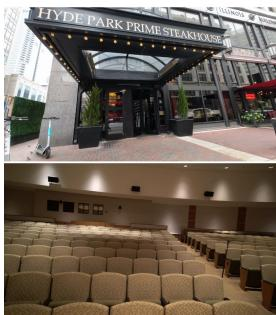  
GT

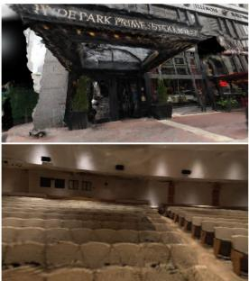  
Feat2GS w/ RADIO

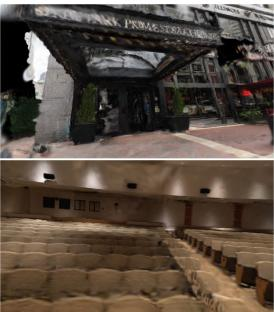  
Feat2GS w/ concat all

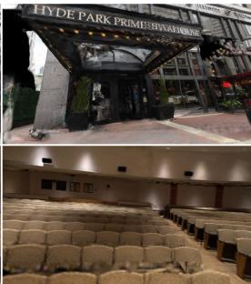  
Feat2GS w/ DUSt3R∗

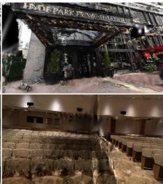  
InstantSplat

Figure 9. NVS from Casual (Sparse and Uncalibrated) Images. We compare our Geometry mode baselines against InstantSplat, which overfits to training views and results in broken structures. Feat2GS with RADIO produces more consistent results due to alignment from features and compact readout. Concatenating all VFM features leads to more complete geometry, e.g., auditorium seat backs (X-shaped gaps vs. straight-line gaps), while fine-tuned DUSt3R∗ features further refine details, e.g., signage.  
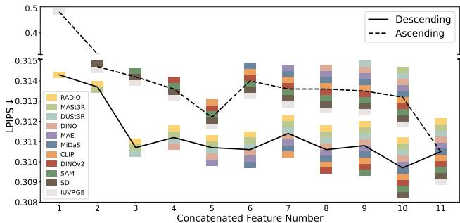  
Figure 10. Ranking-Ordered Feature Concatenation. Based on performance on Geometry mode, VFM features are ranked and concatenated in two orders: descending (best to worst) and ascending (worst to best). Performance improves with more concatenated features and with higher-ranking features.

Feature Finetuning. Lastly, we explore whether feature fine-tuning during the warm-start stage is beneficial. The results after fine-tuning different VFM features showed minimal differences, indicating that fine-tuning is effective with any well-initialized features (detailed in Sup.Mat.). Since we use DUSt3R to warm-start the readout layer, for simplicity, we compare vanilla DUSt3R with fine-tuned DUSt3R\* at Tab. 6. Feature fine-tuning could improve NVS. Figure 9 demonstrates a clear improvement over SOTA InstantSplat.

<table><tr><td></td><td colspan="2">All Datasets</td></tr><tr><td>Method</td><td>PSNR ↑ SSIM↑</td><td>LPIPS↓</td></tr><tr><td>InstantSplat [23] Feat2GS w/ RADIO</td><td>18.87 0.6044 19.73 0.6513</td><td>0.3039 0.3143</td></tr><tr><td>Feat2GS w/ concat all</td><td>19.80 0.6545</td><td>0.3105</td></tr><tr><td>Feat2GS w/ DUSt3R</td><td>19.66 0.6469</td><td>0.3247</td></tr><tr><td></td><td></td><td></td></tr><tr><td>Feat2GS w/ DUSt3R*</td><td>19.75</td><td>0.6561 0.2928</td></tr></table>

Table 6. Baselines of Feat2GS in NVS from casual (sparse and uncalibrated) images. We compare Geometry mode with RADIO features, concatenation of all VFM features, DUSt3R, and finetuned DUSt3R∗ features against the current SOTA InstantSplat.

## 6. Conclusion

We now return to our original question: Are visual foundation models (VFMs) aware of geometry and texture? To give an answer based on diverse datasets, we proposed Feat2GS, a method that maps features of VFMs to 3DGS, allowing us to explore their geometry and texture awareness through 2D images without requiring 3D ground-truth.

Our work reveals new insights: correlations between novel view synthesis and 3D metrics (Tab. 4, Fig. 3), color shift in SD (Fig. 5), and better view consistency from models trained on pointmaps over depth (Fig. 7). In addition, Feat2GS effectively harnesses VFMs for novel view synthesis task on sparse casual captures. These findings suggest that predicting 3D Gaussians from various views in a canonical space and training the model with photometric loss is a promising strategy for developing 3D VFMs, also noted at [24, 106]. Moreover, VFM feature ensembling is an interesting topic worth exploring [73, 79], and we demonstrate that this can be effectively achieved in Feat2GS through simple concatenation. We hope these insights, along with Feat2GS— a versatile tool for future model exploration — will advance VFM research and drive progress in 3D vision.

Acknowledgments. We thank Yuxuan Xue, Vladimir Guzov, Garvita Tiwari for their valuable feedback, and the members of Endless AI Lab and Real Virtual Humans for their help and discussions. This work is funded by the Research Center for Industries of the Future (RCIF) at Westlake University, the Westlake Education Foundation, the Deutsche Forschungsgemeinschaft (DFG, German Research Foundation) - 409792180 (EmmyNoether Programme, project: Real Virtual Humans), and the German Federal Ministry of Education and Research (BMBF): Tubingen AI Center, FKZ:¨ 01IS18039A. Yuliang Xiu also received funding from the European Union’s Horizon 2020 research and innovation programme under the Marie Skłodowska-Curie grant agreement No.860768 (CLIPE project), and Max Planck Institute for Intelligent Systems. Gerard Pons-Moll is a Professor at the University of Tubingen endowed by the Carl Zeiss¨ Foundation, at the Department of Computer Science and a member of the Machine Learning Cluster of Excellence, EXC number 2064/1 – Project number 390727645.

## References

[1] Henrik Aanæs, Rasmus Ramsbøl Jensen, George Vogiatzis, Engin Tola, and Anders Bjorholm Dahl. Large-scale data for multiple-view stereopsis. International Journal of Computer Vision, 120:153–168, 2016. 4

[2] Gorkay Aydemir, Weidi Xie, and Fatma G ¨ uney. Can visual ¨ foundation models achieve long-term point tracking? arXiv preprint arXiv:2408.13575, 2024. 2, 3

[3] Gwangbin Bae and Andrew J. Davison. Rethinking inductive biases for surface normal estimation. In IEEE/CVF Conference on Computer Vision and Pattern Recognition (CVPR), 2024. 1, 2

[4] Jonathan T Barron, Ben Mildenhall, Dor Verbin, Pratul P Srinivasan, and Peter Hedman. Mip-nerf 360: Unbounded anti-aliased neural radiance fields. In Proceedings of the IEEE/CVF conference on computer vision and pattern recognition, pages 5470–5479, 2022. 2, 4

[5] Wenjing Bian, Zirui Wang, Kejie Li, Jia-Wang Bian, and Victor Adrian Prisacariu. Nope-nerf: Optimising neural radiance field with no pose prior. In Proceedings of the IEEE/CVF Conference on Computer Vision and Pattern Recognition, pages 4160–4169, 2023. 3, 4

[6] Rishi Bommasani, Drew A Hudson, Ehsan Adeli, Russ Altman, Simran Arora, Sydney von Arx, Michael S Bernstein, Jeannette Bohg, Antoine Bosselut, Emma Brunskill, et al. On the opportunities and risks of foundation models. arXiv preprint arXiv:2108.07258, 2021. 1, 2

[7] Tyler Bonnen, Stephanie Fu, Yutong Bai, Thomas O’Connell, Yoni Friedman, Nancy Kanwisher, Joshua B. Tenenbaum, and Alexei A. Efros. Evaluating multiview object consistency in humans and image models, 2024. 3

[8] Eric Brachmann, Jamie Wynn, Shuai Chen, Tommaso Cavallari, Aron Monszpart, Daniyar Turmukhambetov, and Vic-´ tor Adrian Prisacariu. Scene coordinate reconstruction: Posing of image collections via incremental learning of a relocalizer. In ECCV, 2024. 2, 7, 17

[9] Mathilde Caron, Hugo Touvron, Ishan Misra, Herve J´ egou,´ Julien Mairal, Piotr Bojanowski, and Armand Joulin. Emerging properties in self-supervised vision transformers. In Proceedings ofthe IEEE/CVF international conference on computer vision, pages 9650–9660, 2021. 1, 2, 4, 5, 6, 15, 17

[10] David Charatan, Sizhe Lester Li, Andrea Tagliasacchi, and Vincent Sitzmann. pixelsplat: 3d gaussian splats from image pairs for scalable generalizable 3d reconstruction. In Proceedings of the IEEE/CVF Conference on Computer Vision and Pattern Recognition, pages 19457–19467, 2024. 1, 3

[11] Anpei Chen, Zexiang Xu, Andreas Geiger, Jingyi Yu, and Hao Su. Tensorf: Tensorial radiance fields. In European Conference on Computer Vision (ECCV), 2022. 3

[12] Anpei Chen, Haofei Xu, Stefano Esposito, Siyu Tang, and Andreas Geiger. Lara: Efficient large-baseline radiance fields. In European Conference on Computer Vision (ECCV), 2024. 3

[13] Boyuan Chen, Zhuo Xu, Sean Kirmani, Brain Ichter, Dorsa Sadigh, Leonidas Guibas, and Fei Xia. Spatialvlm: Endowing vision-language models with spatial reasoning capabilities. In Proceedings ofthe IEEE/CVF Conference on Computer Vision and Pattern Recognition, pages 14455–14465, 2024. 1, 2

[14] Ting Chen, Simon Kornblith, Mohammad Norouzi, and Geoffrey Hinton. A simple framework for contrastive learning of visual representations. In Proceedings of the 37th International Conference on Machine Learning, pages 1597–1607. PMLR, 2020. 5

[15] Xingyu Chen, Qi Zhang, Xiaoyu Li, Yue Chen, Ying Feng, Xuan Wang, and Jue Wang. Hallucinated neural radiance fields in the wild. In Proceedings ofthe IEEE/CVF Conference on Computer Vision and Pattern Recognition, pages 12943–12952, 2022. 17

[16] Yue Chen, Xingyu Chen, Xuan Wang, Qi Zhang, Yu Guo, Ying Shan, and Fei Wang. Local-to-global registration for bundle-adjusting neural radiance fields. In Proceedings of the IEEE/CVF Conference on Computer Vision and Pattern Recognition, pages 8264–8273, 2023. 3

[17] Yuedong Chen, Haofei Xu, Chuanxia Zheng, Bohan Zhuang, Marc Pollefeys, Andreas Geiger, Tat-Jen Cham, and Jianfei Cai. Mvsplat: Efficient 3d gaussian splatting from sparse multi-view images. ECCV, 2024. 3

[18] Timothee Darcet, Maxime Oquab, Julien Mairal, and Piotr´ Bojanowski. Vision transformers need registers. In The Twelfth International Conference on Learning Representations, 2024. 17

[19] Matt Deitke, Dustin Schwenk, Jordi Salvador, Luca Weihs, Oscar Michel, Eli VanderBilt, Ludwig Schmidt, Kiana Ehsani, Aniruddha Kembhavi, and Ali Farhadi. Objaverse: A universe of annotated 3d objects. In Proceedings of the IEEE/CVF Conference on Computer Vision and Pattern Recognition, pages 13142–13153, 2023. 16, 19

[20] Kangle Deng, Andrew Liu, Jun-Yan Zhu, and Deva Ramanan. Depth-supervised nerf: Fewer views and faster training for free. In Proceedings ofthe IEEE/CVF Conference on Computer Vision and Pattern Recognition, pages 12882–12891, 2022. 3

[21] Alexei A Efros and Thomas K Leung. Texture synthesis by non-parametric sampling. In Proceedings ofthe IEEE/CVF International Conference on Computer Vision, pages 1033– 1038. IEEE, 1999. 2

[22] Mohamed El Banani, Amit Raj, Kevis-Kokitsi Maninis, Abhishek Kar, Yuanzhen Li, Michael Rubinstein, Deqing Sun, Leonidas Guibas, Justin Johnson, and Varun Jampani. Probing the 3d awareness of visual foundation models. In Proceedings ofthe IEEE/CVF Conference on Computer Vision and Pattern Recognition, pages 21795–21806, 2024. 2, 3, 5, 16, 17

[23] Zhiwen Fan, Wenyan Cong, Kairun Wen, Kevin Wang, Jian Zhang, Xinghao Ding, Danfei Xu, Boris Ivanovic, Marco Pavone, Georgios Pavlakos, et al. Instantsplat: Unbounded sparse-view pose-free gaussian splatting in 40 seconds. arXiv preprint arXiv:2403.20309, 2024. 2, 3, 4, 7, 8

[24] Zhiwen Fan, Jian Zhang, Wenyan Cong, Peihao Wang, Renjie Li, Kairun Wen, Shijie Zhou, Achuta Kadambi, Zhangyang Wang, Danfei Xu, et al. Large spatial model: End-to-end unposed images to semantic 3d. NeurIPS, 2024. 2, 3, 8

[25] Yao Feng, Jing Lin, Sai Kumar Dwivedi, Yu Sun, Priyanka Patel, and Michael J Black. Chatpose: Chatting about 3d human pose. In Proceedings of the IEEE/CVF Conference on Computer Vision and Pattern Recognition, pages 2093– 2103, 2024. 2

[26] Stephanie Fu, Mark Hamilton, Laura E. Brandt, Axel Feldmann, Zhoutong Zhang, and William T. Freeman. Featup: A model-agnostic framework for features at any resolution. In The Twelfth International Conference on Learning Representations, 2024. 8, 15, 16, 19

[27] Xingyu Fu, Yushi Hu, Bangzheng Li, Yu Feng, Haoyu Wang, Xudong Lin, Dan Roth, Noah A Smith, Wei-Chiu Ma, and Ranjay Krishna. Blink: Multimodal large language models can see but not perceive. 2024. 3

[28] Xiao Fu, Wei Yin, Mu Hu, Kaixuan Wang, Yuexin Ma, Ping Tan, Shaojie Shen, Dahua Lin, and Xiaoxiao Long. Geowizard: Unleashing the diffusion priors for 3d geometry estimation from a single image. In ECCV, 2024. 2

[29] Yang Fu, Sifei Liu, Amey Kulkarni, Jan Kautz, Alexei A. Efros, and Xiaolong Wang. Colmap-free 3d gaussian splatting. In Proceedings of the IEEE/CVF Conference on Computer Vision and Pattern Recognition (CVPR), pages 20796– 20805, 2024. 3, 4

[30] Robert Geirhos, Patricia Rubisch, Claudio Michaelis, Matthias Bethge, Felix A Wichmann, and Wieland Brendel. Imagenet-trained CNNs are biased towards texture; increasing shape bias improves accuracy and robustness. In International Conference on Learning Representations, 2019. 5

[31] Robert Geirhos, Jorn-Henrik Jacobsen, Claudio Michaelis,¨ Richard Zemel, Wieland Brendel, Matthias Bethge, and Felix A Wichmann. Shortcut learning in deep neural networks. Nature Machine Intelligence, 2(11):665–673, 2020. 5

[32] Jean-Bastien Grill, Florian Strub, Florent Altche, Corentin´ Tallec, Pierre Richemond, Elena Buchatskaya, Carl Doersch,

Bernardo Avila Pires, Zhaohan Guo, Mohammad Gheshlaghi Azar, et al. Bootstrap your own latent-a new approach to self-supervised learning. Advances in neural information processing systems, 33:21271–21284, 2020. 5

[33] Nathan Halko, Per-Gunnar Martinsson, and Joel A Tropp. Finding structure with randomness: Probabilistic algorithms for constructing approximate matrix decompositions. SIAM review, 53(2):217–288, 2011. 3

[34] Kaiming He, Xinlei Chen, Saining Xie, Yanghao Li, Piotr Dollar, and Ross Girshick. Masked autoencoders are scal-´ able vision learners. In Proceedings ofthe IEEE/CVF conference on computer vision and pattern recognition, pages 16000–16009, 2022. 2, 4, 5, 6, 15, 17

[35] Yicong Hong, Kai Zhang, Jiuxiang Gu, Sai Bi, Yang Zhou, Difan Liu, Feng Liu, Kalyan Sunkavalli, Trung Bui, and Hao Tan. Lrm: Large reconstruction model for single image to 3d. ICLR, 2024. 1, 2, 3

[36] Wenbo Hu, Xiangjun Gao, Xiaoyu Li, Sijie Zhao, Xiaodong Cun, Yong Zhang, Long Quan, and Ying Shan. Depthcrafter: Generating consistent long depth sequences for open-world videos. arXiv preprint arXiv:2409.02095, 2024. 2

[37] Ajay Jain, Matthew Tancik, and Pieter Abbeel. Putting nerf on a diet: Semantically consistent few-shot view synthesis. In Proceedings of the IEEE/CVF International Conference on Computer Vision (ICCV), pages 5885–5894, 2021. 3

[38] Yoonwoo Jeong, Seokjun Ahn, Christopher Choy, Anima Anandkumar, Minsu Cho, and Jaesik Park. Self-calibrating neural radiance fields. In Proceedings of the IEEE/CVF International Conference on Computer Vision, pages 5846– 5854, 2021. 3

[39] Haian Jin, Hanwen Jiang, Hao Tan, Kai Zhang, Sai Bi, Tianyuan Zhang, Fujun Luan, Noah Snavely, and Zexiang Xu. Lvsm: A large view synthesis model with minimal 3d inductive bias, 2024. 3

[40] Bingxin Ke, Anton Obukhov, Shengyu Huang, Nando Metzger, Rodrigo Caye Daudt, and Konrad Schindler. Repurposing diffusion-based image generators for monocular depth estimation. In Proceedings ofthe IEEE/CVF Conference on Computer Vision and Pattern Recognition, pages 9492–9502, 2024. 1, 2

[41] Bernhard Kerbl, Georgios Kopanas, Thomas Leimkuhler,¨ and George Drettakis. 3d gaussian splatting for real-time radiance field rendering. ACM Transactions on Graphics, 42(4), 2023. 2, 3, 15

[42] Justin\* Kerr, Chung Min\* Kim, Ken Goldberg, Angjoo Kanazawa, and Matthew Tancik. Lerf: Language embedded radiance fields. In International Conference on Computer Vision (ICCV), 2023. 15

[43] Rawal Khirodkar, Timur Bagautdinov, Julieta Martinez, Su Zhaoen, Austin James, Peter Selednik, Stuart Anderson, and Shunsuke Saito. Sapiens: Foundation for human vision models. In ECCV, 2024. 2

[44] Chung Min Kim, Mingxuan Wu, Justin Kerr, Ken Goldberg, Matthew Tancik, and Angjoo Kanazawa. Garfield: Group anything with radiance fields. In Proceedings of the IEEE/CVF Conference on Computer Vision and Pattern Recognition, pages 21530–21539, 2024. 15

[45] Alexander Kirillov, Eric Mintun, Nikhila Ravi, Hanzi Mao, Chloe Rolland, Laura Gustafson, Tete Xiao, Spencer Whitehead, Alexander C Berg, Wan-Yen Lo, et al. Segment anything. In Proceedings ofthe IEEE/CVF International Conference on Computer Vision, pages 4015–4026, 2023. 1, 2, 4, 5, 6, 15, 17

[46] James Kirkpatrick, Razvan Pascanu, Neil Rabinowitz, Joel Veness, Guillaume Desjardins, Andrei A Rusu, Kieran Milan, John Quan, Tiago Ramalho, Agnieszka Grabska-Barwinska, et al. Overcoming catastrophic forgetting in neural networks. Proceedings of the national academy of sciences, 114(13):3521–3526, 2017. 16, 19

[47] Arno Knapitsch, Jaesik Park, Qian-Yi Zhou, and Vladlen Koltun. Tanks and temples: Benchmarking large-scale scene reconstruction. ACM Transactions on Graphics (ToG), 36 (4):1–13, 2017. 2, 4

[48] Sosuke Kobayashi, Eiichi Matsumoto, and Vincent Sitzmann. Decomposing nerf for editing via feature field distillation. In Advances in Neural Information Processing Systems, 2022. 15

[49] Jonas Kulhanek, Songyou Peng, Zuzana Kukelova, Marc Pollefeys, and Torsten Sattler. Wildgaussians: 3d gaussian splatting in the wild. arXiv preprint arXiv:2407.08447, 2024. 17

[50] Vincent Leroy, Yohann Cabon, and Jerome Revaud. Grounding image matching in 3d with mast3r, 2024. 2, 3, 4, 5, 6, 15, 17

[51] Boyi Li, Kilian Q Weinberger, Serge Belongie, Vladlen Koltun, and Rene Ranftl. Language-driven semantic segmentation. In International Conference on Learning Representations, 2022. 15

[52] Chen-Hsuan Lin, Wei-Chiu Ma, Antonio Torralba, and Simon Lucey. Barf: Bundle-adjusting neural radiance fields. In Proceedings ofthe IEEE/CVF international conference on computer vision, pages 5741–5751, 2021. 3, 4

[53] Lu Ling, Yichen Sheng, Zhi Tu, Wentian Zhao, Cheng Xin, Kun Wan, Lantao Yu, Qianyu Guo, Zixun Yu, Yawen Lu, et al. Dl3dv-10k: A large-scale scene dataset for deep learning-based 3d vision. In Proceedings ofthe IEEE/CVF Conference on Computer Vision and Pattern Recognition, pages 22160–22169, 2024. 2, 4

[54] Drew Linsley, Peisen Zhou, Alekh Karkada Ashok, Akash Nagaraj, Gaurav Gaonkar, Francis E Lewis, Zygmunt Pizlo, and Thomas Serre. The 3d-pc: a benchmark for visual perspective taking in humans and machines. arXiv preprint arXiv:2406.04138, 2024. 3

[55] Ruoshi Liu, Rundi Wu, Basile Van Hoorick, Pavel Tokmakov, Sergey Zakharov, and Carl Vondrick. Zero-1-to-3: Zero-shot one image to 3d object. In Proceedings of the IEEE/CVF international conference on computer vision, pages 9298–9309, 2023. 3

[56] Jonathon Luiten, Georgios Kopanas, Bastian Leibe, and Deva Ramanan. Dynamic 3d gaussians: Tracking by persistent dynamic view synthesis. In 3DV, 2024. 17

[57] Arjun Majumdar, Karmesh Yadav, Sergio Arnaud, Jason Ma, Claire Chen, Sneha Silwal, Aryan Jain, Vincent-Pierre Berges, Tingfan Wu, Jay Vakil, et al. Where are we in

the search for an artificial visual cortex for embodied intelligence? Advances in Neural Information Processing Systems, 36:655–677, 2023. 3

[58] Ricardo Martin-Brualla, Noha Radwan, Mehdi SM Sajjadi, Jonathan T Barron, Alexey Dosovitskiy, and Daniel Duckworth. Nerf in the wild: Neural radiance fields for unconstrained photo collections. In Proceedings ofthe IEEE/CVF conference on computer vision and pattern recognition, pages 7210–7219, 2021. 17

[59] Quan Meng, Anpei Chen, Haimin Luo, Minye Wu, Hao Su, Lan Xu, Xuming He, and Jingyi Yu. GNeRF: GANbased Neural Radiance Field without Posed Camera. In Proceedings of the IEEE/CVF International Conference on Computer Vision (ICCV), 2021. 3

[60] Andreas Meuleman, Yu-Lun Liu, Chen Gao, Jia-Bin Huang, Changil Kim, Min H Kim, and Johannes Kopf. Progressively optimized local radiance fields for robust view synthesis. In Proceedings of the IEEE/CVF Conference on Computer Vision and Pattern Recognition, pages 16539–16548, 2023. 3

[61] Ben Mildenhall, Pratul P. Srinivasan, Rodrigo Ortiz-Cayon, Nima Khademi Kalantari, Ravi Ramamoorthi, Ren Ng, and Abhishek Kar. Local light field fusion: Practical view synthesis with prescriptive sampling guidelines. ACM Transactions on Graphics (TOG), 2019. 2, 4

[62] Ben Mildenhall, Pratul P. Srinivasan, Matthew Tancik, Jonathan T. Barron, Ravi Ramamoorthi, and Ren Ng. Nerf: Representing scenes as neural radiance fields for view synthesis. In ECCV, 2020. 3, 15

[63] Thomas Muller, Alex Evans, Christoph Schied, and Alexan-¨ der Keller. Instant neural graphics primitives with a multiresolution hash encoding. ACM Trans. Graph., 41(4):102:1– 102:15, 2022. 3

[64] Michael Niemeyer, Jonathan T Barron, Ben Mildenhall, Mehdi SM Sajjadi, Andreas Geiger, and Noha Radwan. Regnerf: Regularizing neural radiance fields for view synthesis from sparse inputs. In Proceedings of the IEEE/CVF Conference on Computer Vision and Pattern Recognition, pages 5480–5490, 2022. 3

[65] Maxime Oquab, Timothee Darcet, Th ´ eo Moutakanni, Huy´ Vo, Marc Szafraniec, Vasil Khalidov, Pierre Fernandez, Daniel Haziza, Francisco Massa, Alaaeldin El-Nouby, et al. Dinov2: Learning robust visual features without supervision. arXiv preprint arXiv:2304.07193, 2023. 4, 5, 6, 15, 17

[66] Evin Pınar Ornek, Yann Labb ¨ e, Bugra Tekin, Lingni Ma, ´ Cem Keskin, Christian Forster, and Toma´s Hodaˇ n. Found-ˇ pose: Unseen object pose estimation with foundation features. ECCV, 2024. 2, 17

[67] Adam Paszke, Sam Gross, Francisco Massa, Adam Lerer, James Bradbury, Gregory Chanan, Trevor Killeen, Zeming Lin, Natalia Gimelshein, Luca Antiga, et al. Pytorch: An imperative style, high-performance deep learning library. Advances in neural information processing systems, 32, 2019. 15

[68] Songyou Peng, Kyle Genova, Chiyu ”Max” Jiang, Andrea Tagliasacchi, Marc Pollefeys, and Thomas Funkhouser. Openscene: 3d scene understanding with open vocabularies. In CVPR, 2023. 15

[69] Minghan Qin, Wanhua Li, Jiawei Zhou, Haoqian Wang, and Hanspeter Pfister. Langsplat: 3d language gaussian splatting. In Proceedings of the IEEE/CVF Conference on Computer Vision and Pattern Recognition, pages 20051–20060, 2024. 15

[70] Alec Radford, Jong Wook Kim, Chris Hallacy, Aditya Ramesh, Gabriel Goh, Sandhini Agarwal, Girish Sastry, Amanda Askell, Pamela Mishkin, Jack Clark, et al. Learning transferable visual models from natural language supervision. In International conference on machine learning, pages 8748–8763. PMLR, 2021. 1, 4, 5, 6, 15, 17

[71] Rene Ranftl, Katrin Lasinger, David Hafner, Konrad´ Schindler, and Vladlen Koltun. Towards robust monocular depth estimation: Mixing datasets for zero-shot crossdataset transfer. IEEE transactions on pattern analysis and machine intelligence, 44(3):1623–1637, 2020. 1, 2, 4, 5, 6, 15, 17

[72] Rene Ranftl, Alexey Bochkovskiy, and Vladlen Koltun. Vi-´ sion transformers for dense prediction. In Proceedings of the IEEE/CVF international conference on computer vision, pages 12179–12188, 2021. 16

[73] Mike Ranzinger, Greg Heinrich, Jan Kautz, and Pavlo Molchanov. Am-radio: Agglomerative vision foundation model reduce all domains into one. In Proceedings of the IEEE/CVF Conference on Computer Vision and Pattern Recognition (CVPR), pages 12490–12500, 2024. 1, 4, 5, 6, 8, 15, 17

[74] Nikhila Ravi, Valentin Gabeur, Yuan-Ting Hu, Ronghang Hu, Chaitanya Ryali, Tengyu Ma, Haitham Khedr, Roman Radle, Chloe Rolland, Laura Gustafson, et al. Sam 2:¨ Segment anything in images and videos. arXiv preprint arXiv:2408.00714, 2024. 15

[75] Arijit Ray, Dina Bashkirova, Reuben Tan, Kuo-Hao Zeng, Bryan A Plummer, Ranjay Krishna, and Kate Saenko. R2d3: Imparting spatial reasoning by reconstructing 3d scenes from 2d images. 2, 3

[76] Robin Rombach, Andreas Blattmann, Dominik Lorenz, Patrick Esser, and Bjorn Ommer. High-resolution image¨ synthesis with latent diffusion models. In Proceedings of the IEEE/CVF conference on computer vision and pattern recognition, pages 10684–10695, 2022. 1, 2, 4, 5, 6, 15, 17

[77] Kyle Sargent, Zizhang Li, Tanmay Shah, Charles Herrmann, Hong-Xing Yu, Yunzhi Zhang, Eric Ryan Chan, Dmitry Lagun, Li Fei-Fei, Deqing Sun, et al. Zeronvs: Zero-shot 360-degree view synthesis from a single image. In Proceedings of the IEEE/CVF Conference on Computer Vision and Pattern Recognition, pages 9420–9429, 2024. 3

[78] Johannes Lutz Schonberger and Jan-Michael Frahm.¨ Structure-from-motion revisited. In Conference on Computer Vision and Pattern Recognition (CVPR), 2016. 3

[79] Jinghuan Shang, Karl Schmeckpeper, Brandon B. May, Maria Vittoria Minniti, Tarik Kelestemur, David Watkins, and Laura Herlant. Theia: Distilling diverse vision foundation models for robot learning. In 8th Annual Conference on Robot Learning, 2024. 3, 8

[80] Jamie Shotton, Ben Glocker, Christopher Zach, Shahram Izadi, Antonio Criminisi, and Andrew Fitzgibbon. Scene

coordinate regression forests for camera relocalization in rgb-d images. In Proceedings of the IEEE conference on computer vision and pattern recognition, pages 2930–2937, 2013. 7

[81] Yawar Siddiqui, Lorenzo Porzi, Samuel Rota Bulo, Nor-´ man Muller, Matthias Nießner, Angela Dai, and Peter¨ Kontschieder. Panoptic lifting for 3d scene understanding with neural fields. In Proceedings of the IEEE/CVF Conference on Computer Vision and Pattern Recognition, pages 9043–9052, 2023. 15

[82] Brandon Smart, Chuanxia Zheng, Iro Laina, and Victor Adrian Prisacariu. Splatt3r: Zero-shot gaussian splatting from uncalibrated image pairs. arXiv preprint arXiv:2408.13912, 2024. 2, 3, 4, 5

[83] Cameron Smith, David Charatan, Ayush Tewari, and Vincent Sitzmann. Flowmap: High-quality camera poses, intrinsics, and depth via gradient descent. arXiv preprint arXiv:2404.15259, 2024. 2

[84] Noah Snavely, Steven M Seitz, and Richard Szeliski. Photo tourism: exploring photo collections in 3d. In ACM siggraph 2006 papers, pages 835–846. 2006. 17

[85] Saksham Suri, Matthew Walmer, Kamal Gupta, and Abhinav Shrivastava. Lift: A surprisingly simple lightweight feature transform for dense vit descriptors. In European Conference on Computer Vision, pages 110–128. Springer, 2025. 8

[86] Matthew Tancik, Ethan Weber, Evonne Ng, Ruilong Li, Brent Yi, Justin Kerr, Terrance Wang, Alexander Kristoffersen, Jake Austin, Kamyar Salahi, Abhik Ahuja, David McAllister, and Angjoo Kanazawa. Nerfstudio: A modular framework for neural radiance field development. In ACM SIGGRAPH 2023 Conference Proceedings, 2023. 3

[87] Prune Truong, Marie-Julie Rakotosaona, Fabian Manhardt, and Federico Tombari. Sparf: Neural radiance fields from sparse and noisy poses. In Proceedings of the IEEE/CVF Conference on Computer Vision and Pattern Recognition, pages 4190–4200, 2023. 3

[88] Vadim Tschernezki, Iro Laina, Diane Larlus, and Andrea Vedaldi. Neural Feature Fusion Fields: 3D distillation of self-supervised 2D image representations. In Proceedings of the International Conference on 3D Vision (3DV), 2022. 15

[89] Narek Tumanyan, Assaf Singer, Shai Bagon, and Tali Dekel. Dino-tracker: Taming dino for self-supervised point tracking in a single video. In European Conference on Computer Vision (ECCV), 2024. 2

[90] Joseph Tung, Gene Chou, Ruojin Cai, Guandao Yang, Kai Zhang, Gordon Wetzstein, Bharath Hariharan, and Noah Snavely. Megascenes: Scene-level view synthesis at scale. In ECCV, 2024. 3, 17

[91] Can Wang, Menglei Chai, Mingming He, Dongdong Chen, and Jing Liao. Clip-nerf: Text-and-image driven manipulation of neural radiance fields. arXiv preprint arXiv:2112.05139, 2021. 15

[92] Hengyi Wang and Lourdes Agapito. 3d reconstruction with spatial memory. arXiv preprint arXiv:2408.16061, 2024. 3, 4, 17

[93] Qixun Wang, Xu Bai, Haofan Wang, Zekui Qin, and Anthony Chen. Instantid: Zero-shot identity-preserving gener-

ation in seconds. arXiv preprint arXiv:2401.07519, 2024. 5

[94] Qianqian Wang, Vickie Ye, Hang Gao, Jake Austin, Zhengqi Li, and Angjoo Kanazawa. Shape of motion: 4d reconstruction from a single video. arXiv e-prints, pages arXiv–2407, 2024. 17

[95] Shuzhe Wang, Vincent Leroy, Yohann Cabon, Boris Chidlovskii, and Jerome Revaud. Dust3r: Geometric 3d vision made easy. In Proceedings ofthe IEEE/CVF Conference on Computer Vision and Pattern Recognition (CVPR), pages 20697–20709, 2024. 1, 2, 3, 4, 5, 6, 7, 15, 17

[96] Zirui Wang, Shangzhe Wu, Weidi Xie, Min Chen, and Victor Adrian Prisacariu. NeRF−−: Neural radiance fields without known camera parameters. arXiv preprint arXiv:2102.07064, 2021. 3, 4

[97] Frederik Warburg\*, Ethan Weber\*, Matthew Tancik, Aleksander Hołynski, and Angjoo Kanazawa. Nerfbusters: Re-´ moving ghostly artifacts from casually captured nerfs. In International Conference on Computer Vision (ICCV), 2023. 3

[98] Philippe Weinzaepfel, Vincent Leroy, Thomas Lucas, Romain Bregier, Yohann Cabon, Vaibhav Arora, Leonid Ants-´ feld, Boris Chidlovskii, Gabriela Csurka, and Jer´ ome Re-ˆ vaud. Croco: Self-supervised pre-training for 3d vision tasks by cross-view completion. Advances in Neural Information Processing Systems, 35:3502–3516, 2022. 2, 17

[99] Rundi Wu, Ben Mildenhall, Philipp Henzler, Keunhong Park, Ruiqi Gao, Daniel Watson, Pratul P Srinivasan, Dor Verbin, Jonathan T Barron, Ben Poole, et al. Reconfusion: 3d reconstruction with diffusion priors. In Proceedings of the IEEE/CVF Conference on Computer Vision and Pattern Recognition, pages 21551–21561, 2024. 3

[100] Yiheng Xie, Towaki Takikawa, Shunsuke Saito, Or Litany, Shiqin Yan, Numair Khan, Federico Tombari, James Tompkin, Vincent Sitzmann, and Srinath Sridhar. Neural fields in visual computing and beyond. In Computer Graphics Forum, pages 641–676. Wiley Online Library, 2022. 15

[101] Congrong Xu, Justin Kerr, and Angjoo Kanazawa. Splatfacto-w: A nerfstudio implementation of gaussian splatting for unconstrained photo collections. arXiv preprint arXiv:2407.12306, 2024. 17

[102] Dejia Xu, Yifan Jiang, Peihao Wang, Zhiwen Fan, Humphrey Shi, and Zhangyang Wang. Sinnerf: Training neural radiance fields on complex scenes from a single image. 2022. 3

[103] Jiawei Yang, Marco Pavone, and Yue Wang. Freenerf: Improving few-shot neural rendering with free frequency regularization. In Proceedings ofthe IEEE/CVF conference on computer vision and pattern recognition, pages 8254–8263, 2023. 3

[104] Jiawei Yang, Boris Ivanovic, Or Litany, Xinshuo Weng, Seung Wook Kim, Boyi Li, Tong Che, Danfei Xu, Sanja Fidler, Marco Pavone, et al. Emernerf: Emergent spatial-temporal scene decomposition via self-supervision. In International Conference on Learning Representations, 2024. 16

[105] Jiawei Yang, Katie Z Luo, Jiefeng Li, Congyue Deng, Leonidas J. Guibas, Dilip Krishnan, Kilian Q Weinberger, Yonglong Tian, and Yue Wang. Dvt: Denoising vision transformers. 2024. 16, 17

[106] Botao Ye, Sifei Liu, Haofei Xu, Xueting Li, Marc Pollefeys, Ming-Hsuan Yang, and Songyou Peng. No pose, no problem: Surprisingly simple 3d gaussian splats from sparse unposed images, 2024. 2, 3, 5, 8

[107] Chongjie Ye, Lingteng Qiu, Xiaodong Gu, Qi Zuo, Yushuang Wu, Zilong Dong, Liefeng Bo, Yuliang Xiu, and Xiaoguang Han. Stablenormal: Reducing diffusion variance for stable and sharp normal. ACM Transactions on Graphics (TOG), 2024. 1, 2

[108] Jianglong Ye, Naiyan Wang, and Xiaolong Wang. Featurenerf: Learning generalizable nerfs by distilling foundation models. In Proceedings of the IEEE/CVF International Conference on Computer Vision, pages 8962–8973, 2023. 15

[109] Mingqiao Ye, Martin Danelljan, Fisher Yu, and Lei Ke. Gaussian grouping: Segment and edit anything in 3d scenes. In European Conference on Computer Vision, pages 162– 179. Springer, 2025. 15

[110] Vickie Ye, Ruilong Li, Justin Kerr, Matias Turkulainen, Brent Yi, Zhuoyang Pan, Otto Seiskari, Jianbo Ye, Jeffrey Hu, Matthew Tancik, and Angjoo Kanazawa. gsplat: An open-source library for Gaussian splatting. arXiv preprint arXiv:2409.06765, 2024. 15

[111] Alex Yu, Vickie Ye, Matthew Tancik, and Angjoo Kanazawa. pixelNeRF: Neural radiance fields from one or few images. In CVPR, 2021. 3

[112] Xianggang Yu, Mutian Xu, Yidan Zhang, Haolin Liu, Chongjie Ye, Yushuang Wu, Zizheng Yan, Chenming Zhu, Zhangyang Xiong, Tianyou Liang, et al. Mvimgnet: A large-scale dataset of multi-view images. In Proceedings of the IEEE/CVF conference on computer vision and pattern recognition, pages 9150–9161, 2023. 2, 4

[113] Yuanwen Yue, Anurag Das, Francis Engelmann, Siyu Tang, and Jan Eric Lenssen. Improving 2D Feature Representations by 3D-Aware Fine-Tuning. In European Conference on Computer Vision (ECCV), 2024. 1, 17

[114] Dongbin Zhang, Chuming Wang, Weitao Wang, Peihao Li, Minghan Qin, and Haoqian Wang. Gaussian in the wild: 3d gaussian splatting for unconstrained image collections. In European Conference on Computer Vision, pages 341–359. Springer, 2025. 17

[115] Junyi Zhang, Charles Herrmann, Junhwa Hur, Varun Jampani, Trevor Darrell, Forrester Cole, Deqing Sun, and Ming-Hsuan Yang. Monst3r: A simple approach for estimating geometry in the presence of motion. arXiv preprint arxiv:2410.03825, 2024. 3, 17

[116] Xiaoshuai Zhang, Zhicheng Wang, Howard Zhou, Soham Ghosh, Danushen Gnanapragasam, Varun Jampani, Hao Su, and Leonidas Guibas. Condense: Consistent 2d/3d pretraining for dense and sparse features from multi-view images. In European Conference on Computer Vision. Springer, 2024. 17

[117] Shuaifeng Zhi, Tristan Laidlow, Stefan Leutenegger, and Andrew J Davison. In-place scene labelling and understanding with implicit scene representation. In Proceedings ofthe IEEE/CVF International Conference on Computer Vision, pages 15838–15847, 2021. 15

[118] Shijie Zhou, Haoran Chang, Sicheng Jiang, Zhiwen Fan, Zehao Zhu, Dejia Xu, Pradyumna Chari, Suya You, Zhangyang Wang, and Achuta Kadambi. Feature 3dgs: Supercharging 3d gaussian splatting to enable distilled feature fields. In Proceedings ofthe IEEE/CVF Conference on Computer Vision and Pattern Recognition, pages 21676–21685, 2024. 15

[119] Haoyi Zhu, Honghui Yang, Yating Wang, Jiange Yang, Limin Wang, and Tong He. Spa: 3d spatial-awareness enables effective embodied representation. arXiv preprint arXiv:2410.08208, 2024. 3

[120] Zehao Zhu, Zhiwen Fan, Yifan Jiang, and Zhangyang Wang. Fsgs: Real-time few-shot view synthesis using gaussian splatting, 2023. 3

[121] Chen Ziwen, Hao Tan, Kai Zhang, Sai Bi, Fujun Luan, Yicong Hong, Li Fuxin, and Zexiang Xu. Long-lrm: Longsequence large reconstruction model for wide-coverage gaussian splats. arXiv preprint 2410.12781, 2024. 3

[122] Yiming Zuo, Karhan Kayan, Maggie Wang, Kevin Jeon, Jia Deng, and Thomas L Griffiths. Towards foundation models for 3d vision: How close are we? arXiv preprint arXiv:2410.10799, 2024. 3