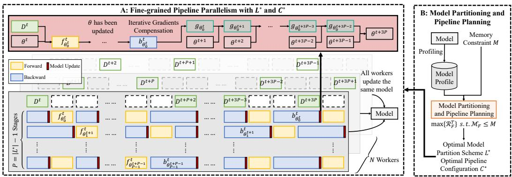
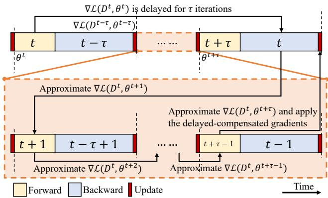
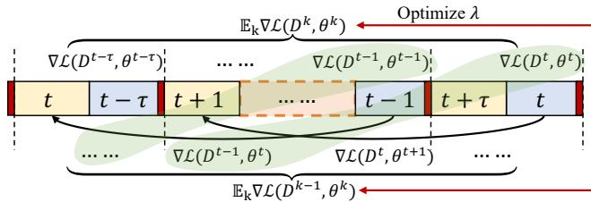
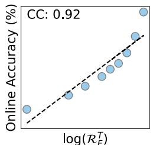
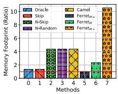
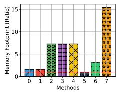
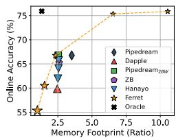
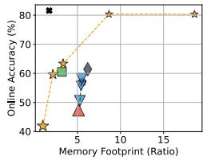

# Ferret: An Efficient Online Continual Learning Framework under Varying Memory Constraints

Yuhao Zhou1 Yuxin Tian1 Jindi Lv1 Mingjia Shi2 Yuanxi Li3

Qing Ye1† Shuhao Zhang4 Jiancheng Lv1

1Sichuan University 2National University of Singapore

3University of Illinois Urbana-Champaign 4Huazhong University of Science and Technology

## Abstract

In the realm of high-frequency data streams, achieving real-time learning within varying memory constraints is paramount. This paper presents Ferret, a comprehensive framework designed to enhance online accuracy of Online Continual Learning (OCL) algorithms while dynamically adapting to varying memory budgets. Ferret employs a finegrained pipeline parallelism strategy combined with an iterative gradient compensation algorithm, ensuring seamless handling of high-frequency data with minimal latency, and effectively counteracting the challenge of stale gradients in parallel training. To adapt to varying memory budgets, its automated model partitioning and pipeline planning optimizes performance regardless of memory limitations. Extensive experiments across 20 benchmarks and 5 integrated OCL algorithms show Ferret’s remarkable efficiency, achieving up to 3.7 lower memory overhead to reach the same online accuracy compared to competing methods. Furthermore, Ferret consistently outperforms these methods across diverse memory budgets, underscoring its superior adaptability. These findings position Ferret as a premier solutionfor efficient and adaptive OCLframework in real-time environments.

## 1. Introduction

Data is crucial for Machine Learning (ML), forming the basis for algorithms and models [30, 53, 75]. In real-world applications [23, 71], data arrives in high-frequency streams with varying distributions [52, 78]. This makes data timesensitive and short-lived [11, 48, 76], rendering offlinetrained models based on historical data ineffective for future data of unknown distribution [61]. Thus, the significance of Online Continual Learning (OCL) is growing [6, 40, 77], as it enables learning over data streams to adapt to dynamic data distributions in real-time.

In the literature, OCL tackles two main challenges: 1)

mitigating catastrophic forgetting [51], where the model retains previously learned knowledge while acquiring new information (e.g., regularization-based [2, 9, 10, 19], replaybased [12, 39, 68], sampling-based [3, 4, 83], others [25, 65], etc.), and 2) enhancing rapid adaptation [11, 48], which involves swiftly adjusting to new data or tasks (e.g., latencyoriented [29, 70], buffering [54, 82], others [27, 69], etc.). In general, the increasing demand for resource-limited systems that can seamlessly integrate new information with minimal latency has driven the popularity of OCL [32] Therefore, this paper explores the challenge of rapid adaptation under varying memory constraints in OCL.

To effectively address the above OCL challenge, it is essential to explore solutions beyond mentioned algorithmic improvements by also optimizing the underlying framework. An efficient OCL framework must prioritize both processing speed and memory management under the limited memory capacity so that it can efficiently handle unlimited data streams with dynamic data distributions for increased online accuracy [11] (i.e., a metric measuring real-time accuracy for continuous new data predictions). Specifically, the framework should quickly process incoming data to extract valuable insights and make informed decisions [56, 74] by minimizing both the latency from data receipt to its initial processing and the time taken for the learning process itself. Additionally, the framework is not only expected to operate within a predetermined memory allotment but also to demonstrate scalability across diverse memory capacities [18, 57]. This duality ensures that the framework remains efficient regardless of the memory resources available, thereby maintaining consistent performance in dynamic environments.

Numerous ML frameworks have been proposed that offer innovative approaches to scalable and flexible ML development [5, 17, 31, 36, 37, 42, 55, 84, 86]. For instance, Ray [55] facilitates distributed computing on any scale, while Pytorch [5] excels in dynamic computation graphs for model training. Despite their advancements, these frameworks often do not specifically address the unique requirements of learning over streaming data [29], which is a key focus of OCL. Recently, there are some frameworks dedicated to OCL by prioritizing real-time data processing [44, 46, 80]. Nevertheless, they either lack general applicability or fail to balance processing speed with consumed memory, leading to reduced online accuracy and low memory scalability, underscoring the need for innovative solutions in this domain.

In this work, we propose an OCL framework named Ferret, designed to achieve eFficiEnt pipeline leaRning over fRequEnt data sTreams for enhanced online accuracy across memory constraints. Ferret comprises a finegrained pipeline parallelism component with an iterative gradient compensation algorithm and a model partitioning and pipeline planning component. Firstly, to facilitate rapid adaptation over frequent streaming data for higher online accuracy, Ferret employs a fine-grained pipeline parallel strategy, allowing precise control over each pipeline stage for seamless data management. Additionally, to mitigate the impact of stale gradients in parallel processing, Ferret integrates a novel iterative gradient compensation algorithm. Secondly, to guide the selection of optimal model partition schemes and pipeline configurations under given memory budgets, Ferret solves the involved multivariate optimization problem through a bi-level optimization algorithm.

Our contributions can be outlined as follows:

• We propose a framework named Ferret for boosting the online accuracy of OCL algorithms under memory constraints. To the best of our knowledge, this is the first work focusing on enhancing OCL by employing pipeline parallelism and scheduling.

• To process high-frequent data streams without delay, Ferret employs a fine-grained pipeline parallelism strategy, enabling interleaved processing of incoming streaming data. Furthermore, Ferret utilizes an iterative gradient compensation algorithm to efficiently mitigate the effects of stale gradients across different pipeline stages, preventing performance degradation.

• We derive the optimal parameters for automatic model partitioning and pipeline planning by mapping the involved multi-variable optimization problem into a bilevel optimization problem.

• Extensive experiments on 20 benchmarks demonstrate that our proposed framework consistently enables more efficient OCL within given memory budgets. The code is open-sourced for reproduction.

## 2. Related Work

The current OCL research focuses on two areas: mitigating catastrophic forgetting and enhancing rapid adaptation.

Mitigating catastrophic forgetting: Catastrophic forgetting, often quantified by the test accuracy [29, 46, 48], poses a significant barrier to the efficacy of OCL in dynamic environments, where the ability to preserve historical information is crucial. Multiple directions have emerged to reduce catastrophic forgetting, including: 1) regularizationbased techniques [2, 9, 10, 19] impose constraints on weight updates to preserve important parameters that are crucial for past tasks. 2) replay-based techniques [12, 39, 68] help the model to rehearse old knowledge alongside new information by maintaining a memory of previous data. 3) sampling-based techniques [3, 4, 83] enhance the efficiency of replay mechanisms by selectively choosing the most relevant data samples for rehearsal. 4) other techniques [25, 65] focus on various novel approaches, such as modular networks and dynamically allocated resources, to protect previously learned information from being overwritten.

Enhancing rapid adaptation: Rapid adaptation is in scenarios where immediate processing of incoming data is required [11, 48], which is often quantified by the online accuracy [11] defined as $\begin{array} { r } { o a c c _ { \boldsymbol { A } } ( t ) = \sum _ { i = 1 } ^ { t } a c c ( \boldsymbol { y } ^ { i } , \hat { \boldsymbol { y } } ^ { i } ) / t . } \end{array}$ Strategies developed to enhance rapid adaptation include: 1) latency-oriented techniques [29, 70] iteratively generate predictions and update model parameters immediately upon the arrival of streaming data by discarding data that cannot be processed in time. 2) buffering-oriented techniques [54, 82] buffers and samples incoming data streams and apply periodic batch-training [62]. 3) other techniques [27, 69] introduce novel methods like adapting model structures in response to new tasks and learning how to learn efficiently, to adapt to dynamic data distributions rapidly.

## 3. Motivation

To effectively navigate the challenges posed by OCL, it is crucial to expand our approach beyond merely refining mentioned OCL algorithms, by also enhancing the underlying ML framework to adaptively balance processing speed with efficient memory management under memory constraints. Particularly, boosting processing speed is essentially reducing data processing time, which can be represented as $t ^ { l } + F / R _ { h } P _ { h }$ , where $t ^ { l }$ denotes the latency from data arrival to processing, F denotes the required floating point operations (FLOPS) by the underlying OCL algorithm, $R _ { h }$ and $P _ { h }$ denote the hardware utilization rate and the theoretical floating point operations per second (FLOPs) of the hardware, respectively. Clearly, only $t ^ { l }$ and $R _ { h }$ are optimizable by the framework.

Existing ML frameworks mainly focus on: 1) distributed and parallel computing [42, 55, 86], 2) Optimized model training and deployment [5, 36, 84], and 3) others including security [17, 37] and debugging [31]. These frameworks facilitate scalable and flexible ML, yet they rarely tackle the challenges of managing streaming data. Regrettably, the few ML frameworks designed for OCL [44, 46, 80] either lack general applicability or fail to concurrently optimize $t ^ { l }$ and $R _ { h }$ within memory limitations. For instance,

Kraken [80] is tailored for recommendation systems. Conversely, while Camel [46] and LifeLearner [44] boost $R _ { h }$ via buffering and sampling, they also raise $t ^ { l }$ and memory usage, reducing online accuracy.

Pipeline parallelism can naturally process sequential streaming data while utilizing batch training. This motivates us to incorporate pipeline parallelism into OCL to simultaneously minimize $t ^ { l }$ and maximize $R _ { h }$ under a given memory budget, thereby boosting online accuracy. We achieve this balance through refined scheduling strategies and better hardware integration, ensuring optimal resource utilization within the constraints of memory budgets.

## 4. Problem Formulation

In this section, we define the problem we aim to address. Note that the notations used throughout this paper are defined in Sec. 9 in the appendix.

Consider a general learning problem defined over a feature space and a label space that aims to minimize a loss function $\mathcal { L } ( D ^ { t } ; \theta )$ where data $D ^ { t } = ( { \mathbf x } ^ { t } , { \mathbf y } ^ { t } ) \in \mathcal { X } \times \mathcal { Y }$ arrives at timestamp t. Our objective is to rapidly derive an updated model $\theta ^ { t }$ with $D ^ { t }$ and $\theta ^ { t - 1 }$ under a given memory constraint M, so that the online accuracy of $\theta ^ { t }$ is high. Unlike updating a model offline with a pre-collected dataset, $D ^ { t }$ will be discarded after updating $\theta ^ { t - 1 }$ in OCL.

Directly optimizing online accuracy in our objective during runtime is hard, as the online accuracy is only calculable after obtaining labels of incoming data. Instead, we measure the volume of data values learned by the model as a proxy to estimate and optimize online accuracy. Formally, assuming $D ^ { t }$ has an initial data value of $V _ { D ^ { t } }$ and its data value declines as a time-dependent exponential decay function [76], we define the Adaptation Rate as follows.

Definition 4.1 (Adaptation Rate of A OCL framework). Consider a OCL framework receives a data $D ^ { t } \quad = \qquad $ $( \mathbf { x } ^ { t } , \mathbf { y } ^ { t } )$ at timestamp t that has an initial data value of $V _ { D ^ { t } }$ , and updates a model $\theta ^ { t - 1 }$ in the hypothesis space ! at timestamp $t + r _ { \mathcal { A } } ^ { t } \left( r _ { \mathcal { A } } ^ { t } = + \infty \right.$ if $D ^ { t }$ is discarded). Let the data value of $\check { D ^ { t } }$ decline as a time-dependent exponential decay function, and new data $D ^ { t }$ constantly arrives until $t = T$ . The Adaptation Rate of is defined as

$$
R _ { { \mathcal A } } ^ { T } = \frac { \sum _ { t = 0 } ^ { T } e ^ { - c r _ { { \mathcal A } } ^ { t } } V _ { D ^ { t } } } { T } ,\tag{1}
$$

where the constant c describes the reduction rate of $V _ { D ^ { t } }$

With Def. 4.1, our objective can be formulated as

$$
\operatorname* { m a x } _ { \mathcal { A } } \mathcal { R } _ { \mathcal { A } } ^ { T } \mathrm { ~ s . t . ~ } \mathcal { M } _ { \mathcal { A } } \leq M ,\tag{2}
$$

where $\mathcal { M } _ { A }$ is the memory footprint of during training.

## 5. Methodology

The workflow of Ferret is shown in Fig. 1, comprising a fine-grained pipeline parallelism component (A), followed by a model partitioning and pipeline planning component (B). In A, the model is trained using Ferret’s fine-grained pipeline parallelism to manage high-frequent data streams with minimal latency. Given the high degree of parallelism within the system, gradient staleness can become significant and variable, potentially causing severe model degradation. To mitigate this issue, an iterative gradient compensation algorithm is applied prior to model updating. In B, the model is profiled to optimize Eq. 2, determining the optimal model partition scheme and pipeline configuration.

## 5.1. Fine-grained Pipeline Parallelism

## 5.1.1 Architectural design

Ferret utilizes an asynchronous pipeline parallelism strategy with 1F1B scheduling to process streaming data immediately upon arrival. To efficiently handle high-frequency data streams without delay, it is imperative that $t ^ { f } + t ^ { b }$ is minimized. However, $t ^ { f } + t ^ { b }$ is inherently lower bounded by (maxi $\hat { t } _ { i } ^ { f } +$ maxi $\hat { t } _ { i } ^ { b } )$ , indicating that some of the data must be discarded if $t ^ { d }$ is less than this lower bound. To prevent the loss of data, Ferret enhances system throughput by deploying $N \leq \lceil ( t ^ { f } + t ^ { b } ) / t ^ { d } \rceil$ workers, each performing pipeline parallelism concurrently over interleaved data streams. Specifically, the i-th data is processed by the n-th worker if and only if $i \equiv c _ { n } ^ { d }$ mod $\lceil ( t ^ { f } + t ^ { b } ) \rceil ^ { } t ^ { d } \rceil$ This strategy, while effective in reducing latency, significantly increases memory usage. Therefore, Ferret balances the trade-offs between  and  by collectively employing four techniques: activation recomputation [13], gradient accumulation [59], back-propagation omission and worker removal, allowing precise control over each pipeline stage for seamless data management.

T1. Activation Recomputation: Activation recomputation exchanges additional computational overhead for reduced memory usage, as Fig. 1a illustrated. In Ferret, a binary indicator $c _ { n } ^ { r }$ within configuration C denotes whether activation recomputation is enabled for the n-th worker. When activation recomputation is enabled $( i . e . , c _ { n } ^ { r } = 1 )$ , an additional forward pass is executed prior to the backward pass, effectively managing memory consumption at the expense of increased computational load.

T2. Gradient Accumulation: Gradient Accumulation allows multiple forward and backward passes to accumulate gradients before model updating, thereby decreasing the frequency of parameter updates, as Fig. 1b depicted. In Ferret, the parameter $c _ { n , j } ^ { a }$ in configuration C defaults to 1, indicating the number of gradient accumulation steps before model updating for the j-th stage in the n-th worker. By utilizing gradient accumulation, the j-th stage in the nth worker only stores $( 1 + \lceil ( P - j - 1 ) / c _ { n , j } ^ { a } \rceil )$ ), instead of $( P - j )$ , models, thereby optimizing memory usage.

T3. Back-propagation Omission: To further reduce memory usage, back-propagation omission skips all back-

!ω,

  
Figure 1. The overall workflow of Ferret. In A, based on the optimal model partition scheme $L ^ { * }$ and pipeline configuration $C ^ { * }$ , N workers are spawned to initiate fine-grained pipeline parallelism that consumes streaming data interleavedly, and update the same model asynchronously by iteratively compensating stale gradients. In B, $L ^ { * }$ and $C ^ { * }$ are obtained by optimizing Eq. 2.

ward passes that depend on previous model parameters, as Fig. 1c illustrated. In Ferret, the parameter $c _ { n , j } ^ { o }$ in configuration C defaults to 0, indicating the number of backpropagation omission steps for the j-th stage in the n-the worker. This approach reduces memory overhead by eliminating the need to store multiple versions of models.

T4. Worker Removal: Spawning N workers increases the system throughput but also linearly increases the memory footprint. When resources are highly constrained, the n-th worker can be shut down and removed to reduce the memory overhead by setting $c _ { n } ^ { d } = - 1$ in configuration $C .$

Finally, assume the initial data value of any data is $V _ { D } ,$ and the retained value of the data when updating a subset of model parameters is proportional to the size of the subset model parameters, given L and C,  and  of the fine-grained pipeline parallelism strategy can be respectively formulated as

$$
\begin{array} { r l r } { \mathcal { R } _ { F } ^ { T } = \displaystyle \sum _ { s = 1 } ^ { N - 1 } \displaystyle \sum _ { i = 0 } ^ { P - 1 } \frac { | w _ { i } | } { \sum _ { j = 0 } ^ { P - 1 } ( | w _ { i } | ) } \frac { 1 } { c _ { n , i } ^ { n } } \displaystyle \sum _ { j = 0 } ^ { s } A _ { s , i j } , \mathrm { w h e r e } A _ { i , j } = } & \\ { \displaystyle \sum _ { s = 1 } ^ { P - 1 } \frac { 1 } { c _ { n , i } ^ { n } + 2 } \frac { | w _ { i } | } { c _ { n , i } ^ { n } + 2 } \gamma _ { i \mathrm { o } \cdot } ^ { n } + \gamma _ { n , i } ^ { n } c _ { \mathrm { o } \cdot } ^ { n + 2 } \gamma _ { i \mathrm { o } \cdot } ^ { n } } & { , } & { \mathrm { ( 3 ) } } \\ { \displaystyle \frac { e ^ { - \alpha ( P + \gamma ) t ^ { \alpha } + ( P - \alpha + 2 ) t ^ { \beta } + \epsilon _ { n } ^ { n } ( P - 4 \gamma ) t ^ { \gamma } } \gamma _ { \mathrm { D } } } { L C M ( \xi _ { n , i } ^ { \alpha } + 1 ) L \mathrm { e } \cdot [ 1 , P - 1 ] ) ( t ^ { \gamma } + t ^ { \beta } + c _ { n } ^ { n } t ^ { \gamma } ) } , } & { } & { \mathrm { ( 3 ) } } \\ { \mathcal { M } _ { F } = \displaystyle \sum _ { s = 1 } ^ { N - 1 } \displaystyle \sum _ { i = 0 } ^ { P - 1 } ( 1 + \Gamma \frac { P - i } { c _ { n , i } ^ { \alpha } } - 1 ) - c _ { n , i } ^ { \alpha } ) ( | w _ { i } | + } & { } \\ { \displaystyle \sum _ { s = 1 } ^ { N - 1 } \sum _ { i = 0 } ^ { \infty } \frac { L _ { i + 1 } - 1 } { i } } & { , } & { \mathrm { ( 4 ) } } \end{array}
$$

where $L C M ( \cdot )$ denotes the Least Common Multiple.

## 5.1.2 Iterative Gradient Compensation

Since fine-grained pipeline parallelism is asynchronous, the model will be inevitably updated by stale gradients, leading to performance degradation. Moreover, different pipeline stages of the model are updated by gradients with varying staleness. To surmount the above challenges, Ferret firstly proposes to efficiently approximate $\nabla \mathcal { L } ( D ^ { t - 1 } ; \theta ^ { t } )$ using $ { \overleftrightarrow { \nabla } } \bar { \mathcal { L } } ( D ^ { t - 1 } ; \theta ^ { t - 1 } )$ by a cost-effective approximator $A _ { \mathcal { Z } } ( \cdot )$ based on Taylor series expansion and the Fisher information matrix. Then, we extend this approximator to approximate $\nabla \mathcal { L } ( D ^ { t - 1 } ; \theta ^ { t + \tau - 1 } )$ using $\nabla \bar { \mathcal { L } } ( D ^ { t - 1 } ; \theta ^ { t - 1 } )$ by iteratively applying $A _ { \mathcal { Z } } ( \cdot )$

Gradients Compensation via Taylor Series Expansion: In prior work, $\nabla \mathcal { L } ( D ^ { t - 1 } ; \theta ^ { t } )$ was naively set to $\nabla \mathcal { L } ( D ^ { t - 1 } ; \theta ^ { t - 1 } )$ [58, 59] and can be regarded as a zeroorder Taylor series expansion, leading to a high approximation error $\lvert | \nabla \mathcal { L } ( D ^ { t - 1 } ; \theta ^ { t } ) - \rvert \nabla \mathcal { L } ( D ^ { t - 1 } ; \theta ^ { t - 1 } ) \rvert | ^ { 2 }$ . To reduce the approximation error, we expand $\nabla \mathcal { L } ( D ^ { t - 1 } ; \theta ^ { t } )$ at $\theta ^ { t - 1 }$ by a first-order Taylor series expansion as follows:

$$
\begin{array} { r } { \nabla \mathcal { L } ( D ^ { t - 1 } ; \theta ^ { t } ) \approx \nabla \mathcal { L } ( D ^ { t - 1 } ; \theta ^ { t - 1 } ) + \mathbb { H } ( \mathcal { L } ( D ^ { t - 1 } ; \theta ^ { t - 1 } ) ) \odot ( \theta ^ { t } - \theta ^ { t - 1 } ) , } \end{array}\tag{5}
$$

where H( ) denotes the Hessian matrix of . Previous works have revealed that the Fisher information matrix (FIM) serves as an approximation of the Hessian matrix if $\mathcal { L } ( \cdot )$ is a negative log-likelihood loss [28, 63]. Assuming $\theta ^ { t }$ gradually converges to its optimal value $\theta ^ { * }$ during training, we can achieve an unbiased estimation of H( ) by:

$$
\epsilon _ { t } \triangleq \mathbb { E } _ { D , \theta ^ { * } } | | \mathcal { T } ( \theta ^ { t } ) - \mathbb { H } ( \mathcal { L } ( \cdot ; \theta ^ { t } ) ) | | \to 0 , t \to + \infty ,\tag{6}
$$

where $\mathcal { T } ( \boldsymbol { \theta } )$ is the FIM. To further mitigate space complexity, $\mathcal { T } ( \boldsymbol { \theta } )$ is approximated by its diagonal elements with a hyper-parameter ε to control variance, i.e.,

$$
\begin{array} { r } { \mathbb { H } ( \mathcal { L } ( \cdot ; \theta ^ { t } ) ) \approx \lambda \nabla \mathcal { L } ( \cdot ; \theta ^ { t - 1 } ) \odot \nabla \mathcal { L } ( \cdot ; \theta ^ { t - 1 } ) ^ { \top } . } \end{array}\tag{7}
$$

Incorporating Eq.7 into Eq.5, we obtain:

$$
\begin{array} { r l r } & { \nabla \mathcal { L } ( D ^ { t - 1 } ; \theta ^ { t } ) \approx A \tau ( \nabla \mathcal { L } ( D ^ { t - 1 } ; \theta ^ { t - 1 } ) , \theta ^ { t } , \theta ^ { t - 1 } ) = } & { ( 8 ) } \\ & { \nabla \mathcal { L } ( D ^ { t - 1 } ; \theta ^ { t - 1 } ) + \lambda \nabla \mathcal { L } ( D ^ { t - 1 } ; \theta ^ { t - 1 } ) \odot \nabla \mathcal { L } ( D ^ { t - 1 } ; \theta ^ { t - 1 } ) ^ { \top } \odot \mathcal { L } } & \end{array}
$$

where $A _ { \mathcal { Z } } ( \cdot )$ serves as the approximator to compensate . Iterative Compensation: More generally, to approx-

Figure 2. To adapt to different levels of staleness in fine-grained pipeline parallelism, $\nabla \mathcal { L } ( D ^ { t } , \theta ^ { t + \tau } )$ is iteratively approximated by $\hat { \nabla } \mathcal { L } ( D ^ { t } \hat { , } \theta ^ { t } )$ ).  
  
Figure 3. To further reduce approximation errors, we optimize ϑ automatically by comparing historical approximations $( \nabla \mathcal { L } ( D ^ { t } , \theta ^ { t } )$ , etc.) and observations $( \nabla \mathcal { L } ( D ^ { t - 1 } , \theta ^ { \bar { t } } )$ , etc.)

imate $\nabla \mathcal { L } ( D ^ { t - 1 } ; \theta ^ { t + \tau - 1 } )$ using $\nabla \mathcal { L } ( D ^ { t - 1 } ; \theta ^ { t - 1 } )$ , Ferret proposes an iterative application of $A _ { \mathcal { Z } } ( \cdot )$ , as depicted in Fig. 2. This iterative process is defined as follows:

$$
\begin{array} { r l r } & { } & { \nabla \mathcal { L } ( D ^ { t - 1 } ; \theta ^ { t + \tau - 1 } ) \approx A _ { \mathcal { Z } } ( \nabla \mathcal { L } ( D ^ { t - 1 } ; \theta ^ { t + \tau - 2 } ) , \theta ^ { t + \tau - 1 } , \theta ^ { t + \tau - 2 } ) } \\ & { } & { \approx A _ { \mathcal { Z } } ( \dots A _ { \mathcal { Z } } ( \nabla \mathcal { L } ( D ^ { t - 1 } ; \theta ^ { t - 1 } ) , \theta ^ { t } , \theta ^ { t - 1 } ) \dots , \theta ^ { t + \tau - 1 } , \theta ^ { t + \tau - 2 } ) . } \\ & { } & { \quad \quad \quad ( 9 ) } \end{array}
$$

However, this iterative process introduces a cascade of errors, wherein the approximation error $| | g ^ { t } \mathrm { ~ - ~ }$ $A _ { \mathcal { T } } ( g ^ { t - 1 } , \theta ^ { t } , \theta ^ { t - 1 } ) | | ^ { 2 }$ is propagated and amplified with each successive approximation. This arises because each approximation depends on the output of the preceding one.

To mitigate this problem, we propose to optimize ε under the mild assumption that the distributions of $\mathbb { E } _ { k } D ^ { k }$ and $\mathbb { E } _ { k } D ^ { k + 1 }$ are similar, as illustrated in Fig. 3. Thus, the objective of minimizing the approximation error of iterative gradients compensation can be formulated as follows:

$$
\operatorname* { m i n } _ { \lambda } \mathbb { E } _ { k } | | \nabla \mathcal { L } ( D ^ { k } ; \theta ^ { k } ) - A _ { \mathcal { T } } ( \nabla \mathcal { L } ( D ^ { k - 1 } , \theta ^ { k } , \theta ^ { k - 1 } ) ) | | ^ { 2 } + \nu | | \lambda | | ^ { 2 }
$$

$$
= \operatorname* { m i n } _ { \lambda } \left\| D - E - \lambda F \right\| ^ { 2 } + \nu | | \lambda | | ^ { 2 } ,\tag{10}
$$

$$
\begin{array} { r } { \mathrm { w h e r e } D = \mathbb { E } _ { k } \nabla \mathcal { L } ( D ^ { k } ; \theta ^ { k } ) , E = \mathbb { E } _ { k } \nabla \mathcal { L } ( D ^ { k - 1 } ; \theta ^ { k - 1 } ) , } \end{array}
$$

$$
\begin{array} { r } { F = \mathbb { E } _ { k } \nabla \mathcal { L } ( D ^ { k - 1 } ; \boldsymbol { \theta } ^ { k - 1 } ) \odot \nabla \mathcal { L } ( D ^ { k - 1 } ; \boldsymbol { \theta } ^ { k - 1 } ) ^ { \top } \odot ( \boldsymbol { \theta } ^ { k } - \boldsymbol { \theta } ^ { k - 1 } ) . } \end{array}
$$

where $\nu | | \lambda | | ^ { 2 }$ is an $\ell _ { 2 }$ regularization term to constrain the solution of ε for better stability. To reduce memory overhead, D and E can be approximated by Exponential Mov-

ing Average (EMA), i.e.,

$$
\mathbb { E } _ { k } \nabla \mathcal { L } ( D ^ { k } ; \theta ^ { k } ) = \alpha \mathbb { E } _ { k } \nabla \mathcal { L } ( D ^ { k - 1 } ; \theta ^ { k - 1 } ) + ( 1 - \alpha ) \nabla \mathcal { L } ( D ^ { k - 1 } ; \theta ^ { k - 1 } ) ,\tag{11}
$$

where ϱ is the EMA coefficient. Hence, we have

$$
D - E = ( 1 - \alpha ) ( \nabla { \mathcal { L } } ( D ^ { k - 1 } ; \theta ^ { k - 1 } ) - \mathbb { E } _ { k } \nabla { \mathcal { L } } ( D ^ { k - 1 } ; \theta ^ { k - 1 } ) ) .\tag{12}
$$

Convergence: Similar to the analyses in [85], our iterative gradient compensation algorithm yields convergence rates of $\mathcal { O } ( V _ { 1 } ^ { 2 } \tau / T )$ and $\mathcal { O } ( V _ { 2 } / \sqrt { T } )$ for convex and nonconvex case, respectively. Here, $V _ { 1 }$ and $V _ { 2 }$ represent the upper-bound of the $| | \cdot | | ^ { 2 }$ norm and the variance of the delaycompensated gradient $A _ { \mathcal { T } } ( \cdot )$ , accordingly. Compared to the work in [85], Ferret fixes ς to 1, and minimizes $V _ { 1 }$ and $V _ { 2 }$ by Eq. 10, boosting algorithm’s robustness and accelerating the convergence of the model.

Algorithm Design: The algorithm of Ferret’s iterative gradient compensation is illustrated in Alg. 1 in the appendix. Since the maximum possible ς equals $( P - 1 )$ ), the time complexity of the algorithm is $\mathcal { O } ( P - 1 )$ , which is considered negligible during model training. Moreover, since two additional variables, v and $v _ { a } ,$ are stored in memory for optimizing ε, the space complexity of this algorithm is $\begin{array} { r } { \mathbf { \stackrel { . } { \mathcal { O } } } ( 2 \sum _ { i = 0 } ^ { \cdot } | w _ { i } | ) } \end{array}$ . However, by setting $\eta _ { \lambda } = 0 ,$ , the optimization of ε is effectively terminated, and ε remains fixed at $\lambda ^ { 0 }$ . This adjustment allows for manual tuning of ε and eliminates the need for $v _ { r }$ and $v _ { a }$ , thereby increasing flexibility and avoiding additional memory overhead.

## 5.2. Model Partitioning and Pipeline Planning

The objective of model partitioning and pipeline planning is to find an optimal model partition scheme $L ^ { * }$ and its corresponding pipeline configuration $C ^ { * }$ that maximize within a given memory constraint M, namely,

$$
L ^ { * } , C ^ { * } = arg \operatorname* { m a x } _ { L , C } \mathcal { R } _ { F } ^ { T } \mathrm { s . t . } \mathcal { M } _ { F } \leq M .\tag{13}
$$

This problem can be reformulated as a bi-level optimization problem, decomposing it into two interrelated subproblems: (1) determining the optimal $C$ given a $L ,$ and (2) identifying the optimal L based on the solution from (1):

$$
\begin{array} { r } { \begin{array} { c } { L ^ { * } = \arg \operatorname* { m a x } _ { L } \{ \mathcal { R } _ { F } ^ { T } | C _ { L } ^ { * } \} } \\ { s . t . ~ C _ { L } ^ { * } = \arg \operatorname* { m a x } _ { C } \{ \mathcal { R } _ { F } ^ { T } | L \} , \mathcal { M } _ { F } \leq M . } \end{array} } \end{array}\tag{14}
$$

## 5.2.1 Iterative Configuration Search (Sub-problem 1)

Given a model partition scheme, the objective of subproblem (1) is to solve

$$
C ^ { * } = \arg \operatorname* { m a x } _ { C } \{ \mathcal { R } _ { F } ^ { T } | L \} \ \mathrm { ~ s . t . ~ } \ \mathcal { M } _ { F } \leq M .\tag{15}
$$

With more than $2 ^ { N ( P + 1 ) }$ potential combinations for $C ,$ a brute-force enumeration of C is impractical. Observing that $\mathrm { d } { \mathcal { M } _ { F } } / \mathrm { d } \operatorname* { m a x } _ { C } \{ \mathcal { R } _ { F } ^ { T } | L \} \geq 0 ,$ , we employ an iterative algorithm to determine the optimal C that maximize $\mathcal { R } _ { F } ^ { T }$ while ensuring $\mathcal { M } _ { F }$ remains within the memory budget. Specifically, to prevent memory over-consumption, we progressively deploy T1-T4 as follows to balance $\mathcal { R } _ { F } ^ { T }$ and $\mathcal { M } _ { F }$

S1. Deploy T1 for all workers: By setting $c _ { n } ^ { r } = 1$ for all workers, the data processing time increases. Specifically, for the n-th worker, setting $c _ { n } ^ { r } = 1$ will respectively reduce $\mathcal { R } _ { F } ^ { T }$ and $\mathcal { M } _ { F }$ by Eq. 19 in the appendix.

S2. Deploy T2 for the j-th stage in the n-th worker: If $c _ { n , j } ^ { o } \ = \ 0$ , increasing $c _ { n , j } ^ { a }$ by $\begin{array} { l l } { \Delta c _ { n , j } ^ { a } } & { = } \end{array}$ $\Big \lceil \frac { P - j - 1 } { \lceil ( P - j - 1 ) / c _ { n , j } ^ { a } \rceil - 1 } \Big \rceil - c _ { n , j } ^ { a }$ will lead to a reduced frequency of model parameter updates. Here, the value of $\Delta c _ { n , j } ^ { a }$ is determined to prevent $\Delta _ { c _ { n , j } ^ { a }  c _ { n , j } ^ { a } + 1 } \mathcal { M } _ { F } = 0$ due to the ceiling function. Consequently, $\mathcal { R } _ { F } ^ { T }$ and $\mathcal { M } _ { F }$ will be respectively decreased by Eq. 20 in the appendix.

S3. Deploy T3 For the j-th stage in the n-th worker: If $\Delta c _ { n , j } ^ { a } = + \infty$ , setting $c _ { n , j } ^ { a } = 1$ and $c _ { n , j } ^ { o } = P - 1 - j$ will completely eliminate the need for the j-th stage in the n-th worker to store additional model parameters by bypassing any backward pass that requires previous model parameters. Consequently, $\mathcal { R } _ { F } ^ { T }$ and $\mathcal { M } _ { F }$ will be respectively reduced by Eq. 21 in the appendix.

S4. Deploy T4 for the n-th worker: If $c _ { n , j } ^ { o } \neq 0$ for all $j \in [ 0 , p - 1 )$ , removing the n-th worker will lead to a decrease in $\mathcal { R } _ { F } ^ { T }$ and $\mathcal { M } _ { F }$ by Eq. 22 in the appendix.

Algorithm Design: The algorithm of the proposed searching is illustrated in Alg. 2 in the appendix. Overall, the time complexity of this algorithm is $\mathcal { O } ( N P ^ { 2 } )$ , and it will be executed only once before fine-grained pipeline parallelism begins.

## 5.2.2 Brute-force Planning (Sub-problem 2)

In Ferret, L is determined by first establishing an upper bound on the time consumed for each stage (tc), and then solving the following optimization problem:

$$
L = \arg \operatorname* { m i n } _ { L } \{ P \} ~ s . t . ~ t ^ { f } + t ^ { b } \leq t ^ { c } .\tag{16}
$$

Namely, minimizing the number of pipeline stages while ensuring the time consumed for each stage is bounded. Since the layers in a stage must be consecutive, this problem can be solved in linear time by iteratively grouping consecutive layers into a stage until no additional adjacent layer can be grouped. Therefore, the solution space for L is not extensive, being limited to $( \hat { L } ^ { 2 } - \hat { L } ) / 2$ at worst. Thus, to solve sub-problem (2), we can simply enumerate all possible model partition schemes, feeding them into Alg. 2 in the appendix to obtain the global optimum $L ^ { * }$

Algorithm Design: The algorithm of the proposed planning is illustrated in Alg. 3 in the appendix. The time complexity of this algorithm is $\mathcal O ( \hat { L } ^ { 3 } )$ . Nevertheless, the algorithm will be executed only once before fine-grained pipeline parallelism begins.

## 6. Experiments

In this section, we seek answers to the following questions. (1) How does Ferret boost online accuracy? (Sec. 6.2) (2) How does Ferret mitigate catastrophic forgetting. (Sec. 6.2) (3) How does our fine-grained pipeline parallelism perform? (Sec. 6.3) (4) What are influences of different pipeline configurations? (Sec. 6.3) (5) How does our iterative gradient compensation algorithm perform?(Sec. 6.4)

## 6.1. Evaluation Setup

Datasets and models: Following the conventions of the community [46], 18 image classification datasets, including MNIST [22], FMNIST [79], CIFAR10 [43], CIFAR100 [43], SVHN [60], Tiny-ImageNet [45], CORe50 [50], CORe50-iid, Split-MNIST, Split-FMNIST, Split-CIFAR10, Split-CIFAR100, Split-SVHN, Split-Tiny-ImageNet, Covertype [8], CLEAR10 [48], CLEAR100 [48], are used in our experiments. More details about the datasets can be found in the appendix. To cover both simple and complicated learning problems, five models including Multi-Layer Perceptron (MLP), MNISTNet, ConvNet, ResNet-18 [34] and MobileNet [35] are used in the experiments. Note that ResNet-18 and MobileNet are pretrained on the ImageNet-1K dataset [21].

Compared methods: For question (1): Oracle, 1- Skip [29], Random-N B-Skip, Last-N B-Skip and Camel [46]. Here, Oracle is an ideal method that sequentially processes every streaming data without any delay. B-Skip and Camel selects a subset from the latest B unprocessed data using Random-N, Last-N and

  
Figure 7. Relation between oacc and log( T )

Coreset sampler, respectively. For question (2): Vanilla, ER [12], MIR [3], LwF [47], MAS [2]. For question (3) and (4): DAPPLE [24], Pipedream [58], Pipedream2BW [59], Zero-Bubble [66] and Hanayo [49]. For question (5): None, Step-Aware [33, 41], Gap-Aware [7], Fisher [14], and Iter-Fisher (i.e., iterative gradient compensation).

Evaluation metrics: To measure catastrophic forgetting while accounting for memory footprint, Test Accuracy [29, 46] Gain per unit of Memory1 (the higher the better) is defined as

$$
t a g m _ { B } ( \boldsymbol { A } , t ) = \log ( \frac { \exp ( t a c c _ { A } ( t ) - t a c c _ { B } ( t ) ) } { \mathcal { M } _ { A } / \mathcal { M } _ { B } } ) ,\tag{17}
$$

where tacc computes the test accuracy and  is the baseline method for comparison. Similarly, as Fig. 7 shows online accuracy can be used to estimate $\dot { \mathcal { R } } _ { F } ^ { T } \left[ 1 1 \right]$ , Online Accuracy Gain per unit of Memory1 (the higher the better) is defined as

Table 1. Online Accuracy Gain per unit of Memory $( a g m p ( A , T ) )$ of different algorithms, where is the 1-Skip. ”M-”, ”M”, ”M+” refer to the ferret method with minimal, medium and maximal memory footprint, respectively.  
  
(a) EMNIST/MNISTNet

<table><tr><td>Setting</td><td>Oracle</td><td>1-Skip</td><td>Random-N</td><td>Last-N</td><td>Camel</td><td> $\scriptstyle { \mathrm { F e r r e t } _ { \mathrm { M } - } }$ </td><td>Ferretm</td><td> ${ \mathrm { F e r r e t } } _ { \mathrm { M } + }$ </td></tr><tr><td>MNIST/MNISTNet</td><td> $2 7 . 3 2 _ { \pm 0 . 7 1 }$ </td><td> $0 _ { \pm 0 }$ </td><td> $- 0 . 4 3 _ { \pm 0 . 6 }$ </td><td> $- 0 . 2 6 _ { \pm 0 . 1 4 }$ </td><td> $- 0 . 7 1 _ { \pm 0 . 3 2 }$ </td><td> $5 . 3 1 _ { \pm 0 . 7 }$ </td><td> $1 6 . 2 6 \substack { \pm 0 . 3 7 }$ </td><td> $2 6 . 3 4 _ { \pm 0 . 7 }$ </td></tr><tr><td>FMNIST/MNISTNet</td><td> $1 9 . 3 5 _ { \pm 0 . 9 9 }$ </td><td> $0 _ { \pm 0 }$ </td><td> $- 0 . 3 1 _ { \pm 0 . 4 7 }$ </td><td> $- 0 . 2 5 _ { \pm 0 . 5 }$ </td><td> $- 0 . 6 _ { \pm 0 . 4 }$ </td><td> $5 . 9 3 _ { \pm 0 . 8 1 }$ </td><td> $\underline { { 1 2 . 6 9 } } { \scriptstyle \pm 0 . 8 1 }$ </td><td> ${ \bf 1 8 . 3 7 } _ { \pm 1 . 0 1 }$ </td></tr><tr><td>EMNIST/MNISTNet</td><td> $1 3 { \scriptstyle \pm 0 . 4 8 }$ </td><td> $0 { \pm } 0$ </td><td> $1 . 9 4 _ { \pm 0 . 0 4 }$ </td><td> $2 . 0 2 _ { \pm 0 . 0 3 }$ </td><td> $1 . 5 5 { \scriptstyle \pm 0 . 1 }$ </td><td> $4 . 1 9 _ { \pm 0 . 1 7 }$ </td><td> $\underline { { 8 . 8 \pm 0 . 4 } }$ </td><td> ${ \bf 1 2 . 0 9 { \scriptstyle \pm 0 . 4 7 } }$ </td></tr><tr><td>CIFAR10/ConvNet</td><td> $1 0 . 5 7 _ { \pm 0 . 0 9 }$ </td><td> $0 _ { \pm 0 }$ </td><td> $4 . 7 1 _ { \pm 0 . 0 5 }$ </td><td> $4 . 7 8 _ { \pm 0 . 0 3 }$ </td><td> $4 . 7 _ { \pm 0 . 0 5 }$ </td><td> $3 . 2 1 _ { \pm 0 . 1 6 }$ </td><td> $\underline { { 6 . 2 1 _ { \pm 0 . 1 5 } } }$ </td><td> ${ \bf 9 . 4 4 _ { \pm 0 . 1 2 } }$ </td></tr><tr><td>CIFAR100/ConvNet</td><td> $5 . 2 4 _ { \pm 0 . 0 1 }$ </td><td> $0 _ { \pm 0 }$ </td><td> $0 . 7 8 _ { \pm 0 . 0 7 }$ </td><td> $0 . 8 3 _ { \pm 0 . 0 6 }$ </td><td> $0 . 7 5 _ { \pm 0 . 0 8 }$ </td><td> $1 . 5 8 _ { \pm 0 . 0 4 }$ </td><td> $2 . 6 _ { \pm 0 . 0 3 }$ </td><td> ${ \bf 4 . 3 9 _ { \pm 0 . 0 5 } }$ </td></tr><tr><td>SVHN/ConvNet</td><td> $1 5 . 4 1 _ { \pm 0 . 2 3 }$ </td><td> $0 _ { \pm 0 }$ </td><td> $7 . 0 4 _ { \pm 0 . 0 8 }$ </td><td> $7 . 2 4 _ { \pm 0 . 1 1 }$ </td><td> $7 . 3 9 _ { \pm 0 . 0 9 }$ </td><td> $5 _ { \pm 0 . 1 }$ </td><td> $\underline { { 1 1 . 5 2 } } \underline { { + 0 . 2 3 } }$ </td><td> ${ \bf 1 4 . 3 4 _ { \pm 0 . 3 1 } }$ </td></tr><tr><td>TinyImagenet/ConvNet</td><td> $2 . 1 3 _ { \pm 0 . 0 7 }$ </td><td> $0 { \pm } 0$ </td><td> $- 0 . 2 2 _ { \pm 0 . 0 4 }$ </td><td> $- 0 . 2 _ { \pm 0 . 0 3 }$ </td><td> $- 0 . 2 1 _ { \pm 0 . 0 5 }$ </td><td> $0 . 4 8 _ { \pm 0 . 0 3 }$ </td><td> $\underline { { 0 . 5 4 } } \pm \mathrm { 0 . 0 3 }$ </td><td> ${ \bf 1 . 1 9 } _ { \pm 0 . 0 7 }$ </td></tr><tr><td>CORe50/ConvNet</td><td> $2 6 . 0 1 _ { \pm 0 . 4 2 }$ </td><td> $0 _ { \pm 0 }$ </td><td> $1 2 . 1 3 _ { \pm 0 . 4 2 }$ </td><td> $1 2 . 2 7 _ { \pm 0 . 4 4 }$ </td><td> $1 1 . 0 7 _ { \pm 0 . 4 8 }$ </td><td> $9 . 0 8 _ { \pm 0 . 4 5 }$ </td><td> $1 7 . 9 5 _ { \pm 0 . 4 5 }$ </td><td> $2 4 . 4 9 _ { \pm 0 . 4 3 }$ </td></tr><tr><td>CORe50-iid/ConvNet</td><td> $1 9 . 2 4 _ { \pm 2 . 9 }$ </td><td> $0 _ { \pm 0 }$ </td><td> $2 . 8 7 _ { \pm 5 . 7 1 }$ </td><td> $5 . 7 4 _ { \pm 2 . 8 }$ </td><td> $5 . 2 1 _ { \pm 2 . 4 9 }$ </td><td> $3 . 5 5 _ { \pm 2 . 7 7 }$ </td><td> $\underline { { 1 0 . 7 4 } } \substack { \pm 2 . 7 6 }$ </td><td> $\mathbf { 1 7 . 9 6 _ { \pm 2 . 8 8 } }$ </td></tr><tr><td>SplitMNIST/MNISTNet</td><td> $1 8 . 2 1 { \scriptstyle \pm 0 . 7 6 }$ </td><td> $0 { \pm } 0$ </td><td> $2 . 3 4 _ { \pm 0 . 4 3 }$ </td><td> $2 . 3 7 _ { \pm 0 . 6 3 }$ </td><td> $3 . 3 { \scriptstyle \pm 0 . 4 8 }$ </td><td> $6 . 1 1 { \scriptstyle \pm 0 . 8 4 }$ </td><td> $1 4 . 5 5 \mathrm { \pm 0 . 5 5 }$ </td><td> ${ \bf 1 7 . 0 5 { \scriptstyle \pm 0 . 7 2 } }$ </td></tr><tr><td>SplitFMNIST/MNISTNet</td><td> $1 1 . 3 2 _ { \pm 1 . 4 7 }$ </td><td> $0 _ { \pm 0 }$ </td><td> $1 . 5 3 _ { \pm 0 . 4 7 }$ </td><td> $1 . 4 9 _ { \pm 0 . 4 2 }$ </td><td> $1 . 9 6 _ { \pm 0 . 3 9 }$ </td><td> $5 . 4 3 _ { \pm 0 . 5 6 }$ </td><td> $9 . 3 7 _ { \pm 1 . 3 5 }$ </td><td> ${ \bf 1 0 . 2 9 } _ { \pm 1 . 4 7 }$ </td></tr><tr><td>SplitCIFAR10/ConvNet</td><td> $7 . 4 9 _ { \pm 0 . 1 2 }$ </td><td> $0 _ { \pm 0 }$ </td><td> $3 . 0 5 _ { \pm 0 . 1 1 }$ </td><td> $3 . 1 1 _ { \pm 0 . 1 1 }$ </td><td> $3 . 1 2 _ { \pm 0 . 0 9 }$ </td><td> $2 . 9 1 _ { \pm 0 . 1 9 }$ </td><td> $\underline { { 4 . 8 4 } } _ { \pm 0 . 2 }$ </td><td> ${ \bf 6 . 1 9 _ { \pm 0 . 0 7 } }$ </td></tr><tr><td>SplitCIFAR100/ConvNet</td><td> $1 0 . 5 1 _ { \pm 0 . 1 5 }$ </td><td> $0 _ { \pm 0 }$ </td><td> $2 . 8 1 _ { \pm 0 . 0 7 }$ </td><td> $2 . 8 6 _ { \pm 0 . 0 5 }$ </td><td> $2 . 7 4 _ { \pm 0 . 1 3 }$ </td><td> $3 . 5 4 _ { \pm 0 . 0 3 }$ </td><td> $\underline { { 6 . 1 3 } } \underline { { \pm 0 . 1 3 } }$ </td><td> ${ \bf 9 . 6 1 _ { \pm 0 . 0 4 } }$ </td></tr><tr><td>SplitSVHN/ConvNet</td><td> $6 . 4 9 _ { \pm 0 . 3 3 }$ </td><td> $0 _ { \pm 0 }$ </td><td> $2 . 9 _ { \pm 0 . 1 9 }$ </td><td> $2 . 9 1 _ { \pm 0 . 2 1 }$ </td><td> $2 . 8 9 _ { \pm 0 . 2 1 }$ </td><td> $2 . 7 6 _ { \pm 0 . 1 6 }$ </td><td> $\underline { { 5 } } _ { \pm 0 . 2 8 }$ </td><td> ${ \bf 5 . 3 8 _ { \pm 0 . 3 5 } }$ </td></tr><tr><td>SplitTinyImagenet/ConvNet</td><td> $2 . 1 4 _ { \pm 0 . 1 }$ </td><td> $0 _ { + \bar { 1 } } ^ { + \upsilon }$ </td><td> $- 0 . 2 4 _ { \pm 0 . 0 3 }$ </td><td> $- 0 . 2 1 _ { \pm 0 . 0 2 }$ </td><td> $- 0 . 2 6 _ { \pm 0 . 0 1 }$ </td><td> $0 . 4 7 _ { \pm 0 . 0 1 }$ </td><td> $0 . 6 2 _ { \pm 0 . 0 1 }$ </td><td>1.19±0.06</td></tr><tr><td>CLEAR10/ResNet</td><td> $1 0 . 3 7 _ { \pm 0 . 0 6 }$ </td><td> $\stackrel { - \pm \mathrm { v } } { 0 . + 0 }$   $0 _ { \pm 0 }$ </td><td> $7 . 8 4 _ { \pm 0 . 0 7 }$ </td><td> $\underline { { 7 . 9 3 } } \pm 0 . 0 6$ </td><td> $- 2 . 9 _ { \pm 1 0 . 5 5 }$ </td><td> $2 . 4 4 _ { \pm 0 . 0 6 }$ </td><td> $7 . 7 1 _ { \pm 0 . 0 6 }$ </td><td> ${ \bf 9 . 2 6 _ { \pm 0 . 0 8 } }$ </td></tr><tr><td>CLEAR10/MobileNet</td><td> $2 0 . 3 6 { \scriptstyle \pm 0 . 2 }$ </td><td> $0 { \pm } 0$ </td><td> $1 1 . 8 { \scriptstyle \pm 0 . 2 2 }$ </td><td> $1 2 \pm 0 . 1 4$ </td><td> $1 1 . 8 5 _ { \pm 0 . 0 7 }$ </td><td> $- 1 . 7 7 _ { \pm 0 . 1 5 }$ </td><td> $\underline { { 1 4 . 6 8 } } \pm 0 . 5$ </td><td> ${ \bf 1 8 . 5 1 { \scriptstyle \pm 0 . 3 5 } }$ </td></tr><tr><td>CLEAR100/ResNet</td><td> $2 1 . 7 1 _ { \pm 0 . 4 3 }$ </td><td> $0 _ { \pm 0 }$ </td><td> $1 5 . 1 9 _ { \pm 0 . 4 9 }$ </td><td> $1 5 . 3 6 _ { \pm 0 . 4 6 }$ </td><td> $1 4 . 3 9 _ { \pm 0 . 4 6 }$ </td><td> $7 . 5 1 _ { \pm 0 . 4 4 }$ </td><td> $1 5 . 5 3 \substack { \pm 0 . 3 5 }$ </td><td> ${ \bf 2 0 . 8 4 _ { \pm 0 . 5 7 } }$ </td></tr><tr><td>CLEAR100/MobileNet</td><td> $2 3 . 5 1 _ { \pm 1 . 0 3 }$ </td><td> $0 _ { \pm 0 }$ </td><td> $9 . 1 6 _ { \pm 0 . 2 8 }$ </td><td> $9 . 3 9 _ { \pm 0 . 1 5 }$ </td><td> $8 . 7 2 _ { \pm 0 . 0 6 }$ </td><td> $1 . 0 5 _ { \pm 0 . 1 3 }$ </td><td> $1 5 . 8 _ { \pm 0 . 3 9 }$ </td><td> $2 2 . 1 1 _ { \pm 0 . 5 9 }$ </td></tr><tr><td>Covertype/MLP</td><td> $7 . 6 6 _ { \pm 0 . 2 7 }$ </td><td> $0 { \pm } 0$ </td><td> $- 1 . 3 3 { \pm } 0 . 3 $ </td><td> $- 1 . 3 _ { \pm 0 . 3 1 }$ </td><td> $- 1 . 3 4 _ { \pm 0 . 2 9 }$ </td><td> $0 . 7 4 \substack { \pm 0 . 2 1 }$ </td><td> $\underline { { 1 . 6 1 \pm 0 . 2 9 } }$ </td><td> ${ \bf 3 . 3 8 _ { \pm 0 . 4 2 } }$ </td></tr></table>

  
(a) EMNIST/MNISTNet

Figure 4. Consumed memory of different stream learning algorithms. Ferret achieves rapid adaptation across varying memory constraints.  
(b) CIFAR100/ConvNet  
  
Table 2. Online Accuracy Gain per unit of Memory $( a g m p ( A , T ) )$ and Test Accuracy Gain per unit of Memory (tagm ( )) of different integrated OCL algorithms on CORe50/ConvNet, where is the 1-Skip. Camel has its dedicated component to mitigate catastrophic forgetting and cannot be integrated with various OCL algorithm.  
(b) CORe50/ConvNet

Figure 6. Relationships between online accuracy and memory consumption of different pipeline parallelism strategies, the marker size represents the standard errors of means.
<table><tr><td></td><td>Metric</td><td>Oracle</td><td> $1 { \cdot } \operatorname { S k i p }$ </td><td>Random-N</td><td>Last-N</td><td>Camel</td><td>FerretM-</td><td> $\mathrm { F e r e t _ { M } }$ </td><td> $\mathrm { F e r r e t _ { M + } }$ </td></tr><tr><td>Vanilla</td><td>agm</td><td> $2 6 . 0 1 _ { \pm 0 . 4 2 }$ </td><td> $0 _ { \pm 0 }$ </td><td> $1 2 . 1 3 _ { \pm 0 . 4 2 }$ </td><td> $1 2 . 2 7 _ { \pm 0 . 4 4 }$ </td><td> $1 1 . 0 7 _ { \pm 0 . 4 8 }$ </td><td> $9 . 0 8 _ { \pm 0 . 4 5 }$ </td><td> $\underline { { 1 7 . 2 1 } } { \scriptstyle \pm 0 . 4 5 }$ </td><td>24.82±0.43</td></tr><tr><td></td><td>tagm</td><td>2.36±0.64</td><td>0±0</td><td>1.08±0.62</td><td> $0 . 9 7 _ { \pm 0 . 3 9 }$ </td><td> $\underline { { 1 . 4 8 } } _ { \pm 0 . 4 2 }$ </td><td> $1 . 0 1 _ { \pm 0 . 4 5 }$ </td><td> $1 . 0 7 _ { \pm 0 . 4 9 }$ </td><td> ${ \bf 1 . 7 3 _ { \pm 0 . 5 3 } }$ </td></tr><tr><td>ER [12]</td><td>agm</td><td> $2 4 . 0 3 _ { \pm 0 . 2 6 }$ </td><td> $0 _ { \pm 0 }$ </td><td> $7 . 8 4 _ { \pm 0 . 1 7 }$ </td><td>8.11±0.29</td><td></td><td> $7 . 1 2 _ { \pm 0 . 0 9 }$ </td><td> $\underline { { 1 6 . 0 9 } } _ { \pm 0 . 1 6 }$ </td><td> $2 3 . 5 _ { \pm 0 . 2 5 }$ </td></tr><tr><td></td><td>tagm</td><td> $4 . 1 8 _ { \pm 0 . 4 3 }$ </td><td> $0 _ { \pm 0 }$ </td><td> $1 . 9 4 _ { \pm 0 . 2 6 }$ </td><td> $2 . 3 4 _ { \pm 0 . 2 9 }$ </td><td></td><td> $0 . 8 2 _ { \pm 0 . 2 9 }$ </td><td> $\underline { { 3 . 1 \pm 0 . 2 5 } }$ </td><td> $\mathbf { 4 . 0 6 _ { \pm 0 . 3 6 } }$ </td></tr><tr><td>MIR [3]</td><td>agm</td><td> $2 4 . 0 3 { \scriptstyle \pm 0 . 2 6 }$ </td><td> $0 _ { \pm 0 }$ </td><td> $7 . 8 2 _ { \pm 0 . 2 1 }$ </td><td> $8 . 0 6 _ { \pm 0 . 2 2 }$ </td><td></td><td> $7 . 1 2 _ { \pm 0 . 0 9 }$ </td><td> $\underline { { 1 6 . 0 9 } } { \scriptstyle \pm 0 . 1 5 }$ </td><td> $2 3 . 5 _ { \pm 0 . 2 5 }$ </td></tr><tr><td></td><td>tagm</td><td> $4 . 1 8 _ { \pm 0 . 4 3 }$ </td><td> $0 _ { \pm 0 }$ </td><td> $2 . 1 _ { \pm 0 . 1 5 }$ </td><td> $2 . 2 { \scriptstyle \pm 0 . 1 4 }$ </td><td></td><td> $0 . 8 2 _ { \pm 0 . 2 9 }$ </td><td> $3 . 1 \pm 0 . 2 5$ </td><td> $\mathbf { 4 . 0 6 _ { \pm 0 . 3 6 } }$ </td></tr><tr><td>LwF [47]</td><td>agm</td><td> $2 6 . 0 2 _ { \pm 0 . 4 2 }$ </td><td> $0 _ { \pm 0 }$ </td><td> $1 2 . 2 5 _ { \pm 0 . 4 2 }$ </td><td> $1 2 . 4 _ { \pm 0 . 4 5 }$ </td><td></td><td> $9 . 0 2 _ { \pm 0 . 4 }$ </td><td> $\underline { { 1 7 . 9 6 } } _ { \pm 0 . 4 6 }$ </td><td> $\mathbf { 2 4 . 6 7 _ { \pm 0 . 4 } }$ </td></tr><tr><td></td><td>tagm</td><td> $2 . 3 6 _ { \pm 0 . 6 4 }$ </td><td> $0 _ { \pm 0 }$ </td><td> $1 . 2 _ { \pm 0 . 6 2 }$ </td><td> $1 . 0 9 _ { \pm 0 . 3 9 }$ </td><td></td><td> $0 . 9 1 _ { \pm 0 . 4 4 }$ </td><td> $\underline { { 1 . 8 8 } } _ { \pm 0 . 4 9 }$ </td><td> ${ \phantom { - } 1 . 5 4 _ { \pm 0 . 5 3 } }$ </td></tr><tr><td>MAS [2]</td><td>agm</td><td> $2 5 . 8 6 _ { \pm 0 . 2 5 }$ </td><td> $0 _ { \pm 0 }$ </td><td> $1 2 . 0 4 _ { \pm 0 . 2 3 }$ </td><td> $1 2 . 2 3 _ { \pm 0 . 2 2 }$ </td><td></td><td> $8 . 7 _ { \pm 0 . 1 7 }$ </td><td> $\underline { { 1 7 . 7 9 } } { \scriptstyle \pm 0 . 2 2 }$ </td><td> $2 4 . 4 6 _ { \pm 0 . 2 3 }$ </td></tr><tr><td></td><td>tagm</td><td> $2 . 7 _ { \pm 0 . 2 3 }$ </td><td> $0 _ { \pm 0 }$ </td><td> $0 . 8 1 _ { \pm 0 . 4 1 }$ </td><td> $0 . 9 1 _ { \pm 0 . 2 4 }$ </td><td></td><td> $0 . 5 9 _ { \pm 0 . 2 3 }$ </td><td> $1 . 6 6 \pm 0 . 1 8$ </td><td> ${ \bf 1 . 6 9 _ { \pm 0 . 2 1 } }$ </td></tr></table>

$$
a g m _ { B } ( A , t ) = \log ( \frac { \exp ( o a c c _ { A } ( t ) - o a c c _ { B } ( t ) ) } { \mathcal { M } _ { A } / \mathcal { M } _ { B } } ) .\tag{18}
$$

Ferret and $\mathrm { F e r r e t _ { M + } }$ constantly outperform other competing algorithms. Notably, Ferre $\mathrm { t _ { M + } }$ even achieves comparable performance compared to Oracle, indicating that Ferret effectively enables rapid adaptation. On the other hand, while FerretM shows slightly inferior performance compared to its counterparts, it demands less memory for OCL, as depicted in Fig. 4. This implies that in scenarios where memory is severely constrained, Ferret is the only method capable of learning.

We evaluate three versions of Ferret under different memory constraints: FerretM (minimal), FerretM (the same memory constraint as $\mathrm { P i p e d r e a m _ { 2 B W } } )$ , and FerretM+ (no constraint). Without clarification, each experiment is independently repeated three times to obtain the final results. In all tables, the best and second-best performance are highlighted by bold and underline, respectively. More details about the evaluation setup can be found in Sec. 12.

## 6.2. Overall Comparisons

Furthermore, various OCL algorithms are integrated on CORe50/ConvNet in Table 2. It can be observed that Ferret not only mitigates catastrophic forgetting (i.e., increased tagm) but also markedly enhances online performance $( i . e . ,$ increased agm), validating its orthogonality and superiority compared to other OCL frameworks for rapid adaptation.

## 6.3. Comparisons on Pipeline Parallelism

Table 1 shows $a g m _ { B } ( A , T )$ across 20 different settings to evaluate both performance and consumed memory of different frameworks. Here,  is chosen to be the 1-Skip due to its low memory footprint. From the table, it is evident that

Table 3 compares $a g m _ { B } ( A , T )$ of different pipeline parallelism strategies across 20 different settings to evaluate the performance of Ferret’s fine-grained pipeline parallelism under memory constraints. Specifically, is selected as DAPPLE, and no gradients compensation is applied to any asynchronous pipeline parallelism strategies. Additionally, Hanayo1W, Hanayo2W and Hanayo3W are three variants with 1, 2, and 3 waves, respectively.

Table 4.  
Table 3. Online Accuracy Gain per unit of Memory (agm ( , T)) of different pipeline parallelism strategies , where  is the DAPPLE. Note that ”1W”, ”2W” and ”3W” refer to 1, 2 and 3 wave(s) for the Hanayo algorithm, and no gradients compensation is applied to all asynchronous pipeline parallelism strategies for fair comparisons
<table><tr><td rowspan="2">Setting</td><td colspan="5">Synchronous PP</td><td colspan="3">Asynchronous PP</td></tr><tr><td>DAPPLE</td><td>ZB</td><td>Hanayo1w</td><td>Hanayo2w</td><td>Hanayo3w</td><td>Pipedream</td><td>Pipedream2BW</td><td>Ferretm</td></tr><tr><td>MNIST/MnNet</td><td>0±0</td><td>6.79±0.4</td><td>2.44±0.3</td><td>5±0.16</td><td>7.12±0.38</td><td> $8 . 1 6 _ { \pm 0 . 3 5 }$ </td><td>8.23±0.39</td><td> $\mathbf { 8 . 3 5 _ { \pm 0 . 3 5 } }$ </td></tr><tr><td>FMNIST/MnNet</td><td>0±0</td><td>4.06±0.36</td><td> $1 . 5 2 _ { \pm 0 . 4 5 }$ </td><td>2.8±0.65</td><td>4.26±0.64</td><td> $5 . 2 9 _ { \pm 0 . 5 3 }$ </td><td> $5 . 3 6 { \scriptstyle \pm 0 . 5 4 }$ </td><td> ${ \bf 5 . 4 8 _ { \pm 0 . 5 3 } }$ </td></tr><tr><td>EMNIST/MnNet</td><td>0±0</td><td>2.33±0.08</td><td>0.9±0.02</td><td>1.81±0.05</td><td>2.55±0.04</td><td>2.84±0.09</td><td>2.99±0.07</td><td>3.02±0.09</td></tr><tr><td>C10/CNet</td><td>0±0</td><td>1.76±0.08</td><td>0.96±0.14</td><td>1.51±0.04</td><td>1.93±0.12</td><td>2.53±0.04</td><td>2.78±0.06</td><td>3.05±0.15</td></tr><tr><td>C100/CNet</td><td>0±0</td><td>0.71±0.04</td><td>0.05±0.05</td><td>0.56±0.06</td><td>0.74±0.06</td><td>0.87±0.09</td><td>1.11±0.06</td><td>1.72±0.01</td></tr><tr><td>SVHN/CNet</td><td>0±0</td><td>2.13±0.32</td><td>0.36±0.15</td><td>1.52±0.23</td><td>2.21±0.26</td><td>3.3±0.24</td><td>3.32±0.19</td><td>3.61±0.16</td></tr><tr><td>TinyI/CNet</td><td>0±0</td><td>0.18±0.02</td><td>0.03±0.01</td><td>0.19±0.02</td><td>0.19±0.04</td><td>0.26±0.01</td><td>0.52±0.03</td><td>0.5±0.06</td></tr><tr><td>CORe50/CNet</td><td>0±0</td><td>4.18±0.23</td><td>1.38±0.12</td><td>3.6±0.16</td><td>4.69±0.11</td><td>6.03±0.17</td><td>5.91±0.22</td><td>7.13±0.18</td></tr><tr><td>CORe50-iid/CNet</td><td>0±0</td><td>3.58±0.02</td><td>1.19±0.18</td><td>2.94±0.02</td><td>3.74±0.07</td><td>5.07±0.13</td><td>5.24±0.07</td><td>6.18±0.05</td></tr><tr><td>S-MNIST/MnNet</td><td>0±0</td><td>2.94±0.29</td><td>1.33±0.26</td><td>2.97±0.21</td><td>3.69±0.23</td><td>4.3±0.29</td><td>4.11±0.33</td><td>4.47±0.29</td></tr><tr><td>S-FMNIST/MnNet</td><td>0±0</td><td>1.56±0.29</td><td>0.91±0.16</td><td>1.48±0.2</td><td>1.89±0.31</td><td>2.06±0.28</td><td>2.09±0.27</td><td>2.24±0.28</td></tr><tr><td>S-C10/CNet</td><td>0±0</td><td>0.96±0.14</td><td>0.44±0.13</td><td>1.19±0.03</td><td>1.42±0.14</td><td>2.21±0.08</td><td>2.16±0.05</td><td>2.58±0.1</td></tr><tr><td>S-C100/CNet</td><td>0±0</td><td>1.57±0.05</td><td>0.54±0.14</td><td>1.25±0.12</td><td>1.67±0.12</td><td>2.48±0.12</td><td>2.49±0.1</td><td>3.49±0.06</td></tr><tr><td>S-SVHN/CNet</td><td>0±0</td><td>0.86±0.05</td><td>0.49±0.08</td><td>0.88±0.06</td><td>1.13±0.03</td><td>1.39±0.04</td><td>1.58±0.06</td><td>1.75±0.03</td></tr><tr><td>S-TinyI/CNet</td><td>0±0</td><td>0.27±0.05</td><td>0.08±0.03</td><td>0.14±0.02</td><td>0.22±0.03</td><td>0.29±0.03</td><td> $0 . 4 7 \substack { \pm 0 . 0 1 }$ </td><td>0.66±0.04</td></tr><tr><td>CLEAR10/RNet</td><td>0±0</td><td>0.38±0.13</td><td>0.46±0.08</td><td>1.04±0.06</td><td>1.4±0.04</td><td> $1 . 8 { \scriptstyle \pm 0 . 0 6 }$ </td><td>1.92±0.05</td><td> $2 . 1 2 _ { \pm 0 . 0 5 }$ </td></tr><tr><td>CLEAR10/MoNet</td><td>0±0</td><td>1.03±0.64</td><td>0.65±0.23</td><td>2.31±0.15</td><td> $2 . 6 5 _ { \pm 0 . 4 9 }$ </td><td>4.25±0.09</td><td> $3 . 8 2 _ { \pm 0 . 2 6 }$ </td><td> ${ \bar { 5 } } . 3 4 _ { \pm 0 . 1 1 }$ </td></tr><tr><td>CLEAR100/RNet</td><td>0±0</td><td>2.76±0.1</td><td> $1 . 3 6 _ { \pm 0 . 2 2 }$ </td><td>2.52±0.21</td><td> $3 . 3 _ { \pm 0 . 2 3 }$ </td><td> $3 . 8 5 _ { \pm 0 . 2 }$ </td><td> $3 . 9 8 \substack { \pm 0 . 1 9 }$ </td><td> $4 . 2 4 _ { \pm 0 . 2 2 }$ </td></tr><tr><td>CLEAR100/MoNet</td><td>0±0</td><td>3.11±0.53</td><td> $1 . 2 6 _ { \pm 0 . 1 2 }$ </td><td>3.03±0.52</td><td> $4 . 2 4 _ { \pm 0 . 1 2 }$ </td><td> $5 . 6 6 _ { \pm 0 . 1 9 }$ </td><td>5.88±0.58</td><td>7.42±0.69</td></tr><tr><td>Covertype/MLP</td><td>0±0</td><td> $0 . 6 2 _ { \pm 0 . 1 4 }$ </td><td> $0 . 2 4 _ { \pm 0 . 1 2 }$ </td><td>0.6±0.16</td><td> $0 . 8 3 _ { \pm 0 . 1 6 }$ </td><td> $\mathbf { 0 . 9 2 _ { \pm 0 . 1 6 } }$ </td><td>0.82±0.13</td><td>0.89±0.08</td></tr></table>

In general, all asynchronous pipeline parallelism strategies significantly outperform synchronous pipeline parallelism strategies, even ZB, which claims to eliminate pipeline bubbles. This is because synchronous pipeline parallelism strategies, in an effort to achieve higher hardware utilization rates and avoid conflicting model versions, must design complex workflows that stage gradients and update model parameters synchronously, resulting in delays in data processing and wasted data value. Conversely, asynchronous pipeline parallelism strategies process data and update model parameters immediately, thereby minimizing processing latency. Among all asynchronous pipeline parallelism strategies, FerretM’s fine-grained pipeline parallelism strategy consistently surpasses the others due to its more efficient memory utilization.

To investigate the impact of different pipeline configurations for Ferret, we select five different memory constraints ranging from minimum to maximum to simulate learning under varying memory budgets Fig. 6 shows that Ferret successfully solves Eq. 2 for obtaining optimal pipeline configurations under dynamic environments, scaling effectively as we increase the memory constraint. Specifically, lack of precise control over each pipeline stage to balance between performance and memory footprint prevents competing strategies from scaling well.

## 6.4. Comparisons on Gradients Compensation

To evaluate the effectiveness of Iter-Fisher, we apply various gradients compensation algorithms to FerretM+ and

Online Accuracy differences between Ferret with and without gradients compensation algorithms .
<table><tr><td colspan="3">FerretM+</td><td colspan="5">Ferretm</td></tr><tr><td>Step-Aware</td><td>Gap-Aware</td><td>Fisher</td><td>Iter-Fisher</td><td>Step-Aware</td><td>Gap-Aware</td><td>Fisher</td><td>Iter-Fisher</td></tr><tr><td>-56.04±2.78</td><td>-14.03±1.24</td><td>-0.02±0.01</td><td>0.01±0</td><td>-43.53±2.36</td><td>-12.11±1.03</td><td>-0.01±0.01</td><td>0.02±0</td></tr><tr><td>-37.75±2.17</td><td>-9.07±0.63</td><td>-0.02±0.03</td><td>0.05±0.01</td><td>-37.74±2.53</td><td>-7.07±0.55</td><td>-0.01±0.01</td><td>0.02±0</td></tr><tr><td>-20.5±0.05</td><td>-4.81±0.15</td><td>0.01±0.02</td><td>0.04±0.02</td><td>-33.36±0.13</td><td>-3.46±0.33</td><td>0.01±0.01</td><td>0.04±0.02</td></tr><tr><td>-10.12±0.19</td><td>-1.71±0.43</td><td>-0.32±0.07</td><td>0.25±0.06</td><td>-9.6±0.19</td><td>-1.22±0.39</td><td>-0.14±0.3</td><td>0.42±0.21</td></tr><tr><td>-8.08±0.17</td><td>-2.17±0.05</td><td>-0.04+0.08</td><td>0.13±0.05</td><td>-5.4±0.07</td><td>-1.04±0.04</td><td>-0.01±0.07</td><td>0.1±0.02</td></tr><tr><td>-14.92±0.42</td><td>-2.63±0.04</td><td>0.02±0.04</td><td>0.31±0.2</td><td>-24.7±1.18</td><td>-2.91±0.11</td><td>0.22±0.07</td><td>0.3±0.07</td></tr><tr><td>-3.72±0.16</td><td>-1.06±0.09</td><td>-0.01±0.02</td><td>0.06±0.03</td><td>-1.32±0.17</td><td>-0.11±0.19</td><td>0.17±0.19</td><td>0.35±0.15</td></tr><tr><td>-23.93±0.16</td><td>-3.27±0.05</td><td>-0.22±0.11</td><td>0.1±0.08</td><td>-33.41±0.24</td><td>-4.18±0.34</td><td>0.02±0.12</td><td>0.34±0.07</td></tr><tr><td>-24.56±0.22</td><td>-3.91±0.2</td><td>0.22±0.08</td><td>0.32±0.06</td><td>-23.77±0.3</td><td>-3.15±0.53</td><td>0.23±0.12</td><td>0.39±0.1</td></tr><tr><td>-26.8±3.2</td><td>-4.21±0.21</td><td>-0.05±0.02</td><td>0.03±0.01</td><td>-46.24±1.41</td><td>-4.82±0.48</td><td>-0.03±0.01</td><td>0.02±0</td></tr><tr><td>-14.43±2.83</td><td>-2.37±0.14</td><td>0.01±0.02</td><td>0.03±0.02</td><td>-46.07±4.03</td><td>-2.1±0.33</td><td>-0.01±0.01</td><td>0±0</td></tr><tr><td>-6.93±0.12</td><td>-1±0.14</td><td>-0.19±0.09</td><td>0.1±0.03</td><td>-8.11±0.75</td><td>-0.99±0.24</td><td>-0.12±0.12</td><td>0.23±0.12</td></tr><tr><td>-14.14±0.37</td><td>-3.05±0.1</td><td>-0.23±0.18</td><td>0.38±0.23</td><td>-12.56±0.23</td><td>-1.92±0.09</td><td>-0.1±0.19</td><td>0.24±0.09</td></tr><tr><td>-5.69±0.46</td><td>-1.18±0.12</td><td>-0.03±0.03</td><td>0.05±0.03</td><td>-12.13±0.87</td><td>-1.27±0.09</td><td>-0.05±0.02</td><td>0.03±0.01</td></tr><tr><td>-3.61±0.14</td><td>-1.01±0.05</td><td>0.05±0.1</td><td>0.12±0.1</td><td>-1.7±0.12</td><td>-0.37±0.03</td><td>0.08±0.07</td><td>0.18±0.08</td></tr><tr><td>-6.26±0.18</td><td>-0.72±0.08</td><td>0.02±0.06</td><td>0.14±0.04</td><td>-11.25±0.28</td><td>-0.52±0.05</td><td>-0.02±0.04</td><td>0.08±0.04</td></tr><tr><td>-18.17±0.26</td><td>-1.7±0.05</td><td>-0.14±0.32</td><td>0.5±0.15</td><td>-20.69±0.58</td><td>-1.88±0.46</td><td>-0.28±0.37</td><td>0.36±0.18</td></tr><tr><td>-17.45±0.02</td><td>-0.38±0.54</td><td>-0.07±0.04</td><td>0.65±0.32</td><td>-24.62±0.24</td><td>0.18±0.32</td><td>-0.2±0.18</td><td>1.27±0.21</td></tr><tr><td>-30.65±0.93</td><td>-0.3±0.17</td><td>0.63±0.46</td><td>1.2±0.48</td><td>-26.85±1.22</td><td>-0.3±0.33</td><td>0.58±0.78</td><td>1.03±0.7</td></tr><tr><td> $- 9 . 2 _ { \pm 1 . 1 3 } ^ { - }$ </td><td>-2.8±0.1</td><td>-0.09±0.05</td><td>0.05±0.02</td><td>-10.27±0.39</td><td>-1.52±0.14</td><td>-0.01±0</td><td>0.09±0.01</td></tr></table>

FerretM, and compare the final online accuracy gain. The results are shown in Table 4. From the table, we can observe that applying Step-Aware and Gap-Aware algorithms for compensating stale gradients significantly reduces the online accuracy. This is because these algorithms mitigate the gradient staleness problem by simply penalizing the step size of stale gradients, leading to a slow convergence rate when the system is highly paralleled. Although Fisher leverages first-order information for better compensation, it does not consider varying levels of staleness at different stages of pipeline parallelism, resulting in a marginal decrease in accuracy compared to no compensation. On the other hand, Iter-Fisher consistently improves online accuracy across all settings, without requiring manual hyperparameters tuning. This indicates that Iter-Fisher effectively adapts to different levels of staleness in parallelism, and automatically optimizes ε for better compensation, demonstrating its robustness and effectiveness.

## 7. Conclusion

This paper introduces Ferret, a novel framework designed to boost online accuracy of OCL algorithms under varying memory constraints. Ferret employs a fine-grained pipeline parallelism strategy to adapt to varying distributions of incoming streaming data rapidly. To mitigate the gradient staleness problem in parallel processing, Ferret integrates an iterative gradient compensation algorithm to prevent performance degradation. Additionally, pipelines are automatically scheduled to improve performance under any memory scenario by optimizing a bi-level optimization problem. Extensive experiments conducted on 18 datasets and 5 models confirm Ferret’s superior efficiency and robustness compared to existing methods, demonstrating its potential as a scalable solution for adaptive, memory-efficient OCL.

## Acknowledgments

This work was supported in part by the National Natural Science Foundation of China under Grant 62306198; in part by National Major Scientific Instruments and Equipments Development Project of National Natural Science Foundation of China under Grant 62427820; and in part by the Natural Science Foundation of Sichuan Province under Grant 2024NSFSC1468.

## References

[1] Mart´ın Abadi, Paul Barham, Jianmin Chen, Zhifeng Chen, Andy Davis, Jeffrey Dean, Matthieu Devin, Sanjay Ghemawat, Geoffrey Irving, Michael Isard, et al. TensorFlow : a system for Large-Scale machine learning. In 12th USENIX symposium on operating systems design and implementation (OSDI 16), pages 265–283, 2016. 1

[2] Rahaf Aljundi, Francesca Babiloni, Mohamed Elhoseiny, Marcus Rohrbach, and Tinne Tuytelaars. Memory aware synapses: Learning what (not) to forget. In Proceedings of the European conference on computer vision (ECCV), pages 139–154, 2018. 1, 2, 6, 7, 5

[3] Rahaf Aljundi, Eugene Belilovsky, Tinne Tuytelaars, Laurent Charlin, Massimo Caccia, Min Lin, and Lucas Page-Caccia. Online continual learning with maximal interfered retrieval. Advances in neural information processing systems, 32, 2019. 1, 2, 6, 7, 5

[4] Rahaf Aljundi, Min Lin, Baptiste Goujaud, and Yoshua Bengio. Gradient based sample selection for online continual learning. Advances in neural information processing systems, 32, 2019. 1, 2

[5] Jason Ansel, Edward Yang, Horace He, Natalia Gimelshein, Animesh Jain, Michael Voznesensky, Bin Bao, Peter Bell, David Berard, Evgeni Burovski, et al. Pytorch 2: Faster machine learning through dynamic python bytecode transformation and graph compilation. 2024. 1, 2

[6] Jeff Barber, Ximing Yu, Laney Kuenzel Zamore, Jerry Lin, Vahid Jazayeri, Shie Erlich, Tony Savor, and Michael Stumm. Bladerunner: Stream processing at scale for a live view of backend data mutations at the edge. In Proceedings of the ACM SIGOPS 28th Symposium on Operating Systems Principles, pages 708–723, 2021. 1

[7] Saar Barkai, Ido Hakimi, and Assaf Schuster. Gap aware mitigation of gradient staleness. arXiv preprint arXiv:1909.10802, 2019. 6, 1

[8] Jock Blackard. Covertype. UCI Machine Learning Repository, 1998. DOI: https://doi.org/10.24432/C50K5N. 6, 4

[9] Pietro Buzzega, Matteo Boschini, Angelo Porrello, Davide Abati, and Simone Calderara. Dark experience for general continual learning: a strong, simple baseline. Advances in neural information processing systems, 33:15920–15930, 2020. 1, 2, 3

[10] Lucas Caccia, Rahaf Aljundi, Nader Asadi, Tinne Tuytelaars, Joelle Pineau, and Eugene Belilovsky. New insights on reducing abrupt representation change in online continual learning. arXiv preprint arXiv:2104.05025, 2021. 1, 2

[11] Zhipeng Cai, Ozan Sener, and Vladlen Koltun. Online continual learning with natural distribution shifts: An empirical study with visual data. In Proceedings of the IEEE/CVF international conference on computer vision, pages 8281– 8290, 2021. 1, 2, 7

[12] Arslan Chaudhry, Marcus Rohrbach, Mohamed Elhoseiny, Thalaiyasingam Ajanthan, P Dokania, P Torr, and M Ran zato. Continual learning with tiny episodic memories. In Workshop on Multi-Task and Lifelong Reinforcement Learn ing, 2019. 1, 2, 6, 7, 5

[13] Tianqi Chen, Bing Xu, Chiyuan Zhang, and Carlos Guestrin. Training deep nets with sublinear memory cost. arXiv preprint arXiv:1604.06174, 2016. 3

[14] Yangrui Chen, Cong Xie, Meng Ma, Juncheng Gu, Yanghua Peng, Haibin Lin, Chuan Wu, and Yibo Zhu. Sapipe: Staleness-aware pipeline for data parallel dnn training. Advances in Neural Information Processing Systems, 35: 17981–17993, 2022. 6

[15] Franc¸ois Chollet. keras. https://github.com/ fchollet/keras, 2015. 1

[16] Gregory Cohen, Saeed Afshar, Jonathan Tapson, and Andre Van Schaik. Emnist: Extending mnist to handwritten letters. In 2017 international joint conference on neural networks (IJCNN), pages 2921–2926. IEEE, 2017. 4

[17] Bita Darvish Rouhani, Huili Chen, and Farinaz Koushanfar. Deepsigns: An end-to-end watermarking framework for ownership protection of deep neural networks. In Proceed ings of the twenty-fourth international conference on architectural support for programming languages and operating systems, pages 485–497, 2019. 1, 2

[18] Marcos Dias de Assuncao, Alexandre da Silva Veith, and Rajkumar Buyya. Distributed data stream processing and edge computing: A survey on resource elasticity and future directions. Journal ofNetwork and Computer Applications, 103: 1–17, 2018. 1

[19] Matthias De Lange and Tinne Tuytelaars. Continual prototype evolution: Learning online from non-stationary data streams. In Proceedings ofthe IEEE/CVF international conference on computer vision, pages 8250–8259, 2021. 1, 2

[20] Matthias De Lange, Rahaf Aljundi, Marc Masana, Sarah Parisot, Xu Jia, Ales Leonardis, Gregory Slabaugh, andˇ Tinne Tuytelaars. A continual learning survey: Defying forgetting in classification tasks. IEEE transactions on pattern analysis and machine intelligence, 44(7):3366–3385, 2021. 3

[21] Jia Deng, Wei Dong, Richard Socher, Li-Jia Li, Kai Li, and Li Fei-Fei. Imagenet: A large-scale hierarchical image database. In 2009 IEEE conference on computer vision and pattern recognition, pages 248–255. Ieee, 2009. 6

[22] Li Deng. The mnist database of handwritten digit images fo machine learning research. IEEE Signal Processing Maga zine, 29(6):141–142, 2012. 6, 4

[23] Matthew F Dixon, Igor Halperin, and Paul Bilokon. Machine learning infinance. Springer, 2020. 1

[24] Shiqing Fan, Yi Rong, Chen Meng, Zongyan Cao, Siyu Wang, Zhen Zheng, Chuan Wu, Guoping Long, Jun Yang, Lixue Xia, et al. Dapple: A pipelined data parallel approach

for training large models. In Proceedings of the 26th ACM SIGPLAN Symposium on Principles and Practice ofParallel Programming, pages 431–445, 2021. 6, 1

[25] Chrisantha Fernando, Dylan Banarse, Charles Blundell, Yori Zwols, David Ha, Andrei A Rusu, Alexander Pritzel, and Daan Wierstra. Pathnet: Evolution channels gradient descent in super neural networks. arXiv preprint arXiv:1701.08734, 2017. 1, 2

[26] Enrico Fini, Stephane Lathuiliere, Enver Sangineto, Moin´ Nabi, and Elisa Ricci. Online continual learning under extreme memory constraints. In Computer Vision–ECCV 2020: 16th European Conference, Glasgow, UK, August 23–28, 2020, Proceedings, Part XXVIII 16, pages 720–735. Springer, 2020. 1

[27] Chelsea Finn, Aravind Rajeswaran, Sham Kakade, and Sergey Levine. Online meta-learning. In International conference on machine learning, pages 1920–1930. PMLR, 2019. 1, 2

[28] Jerome Friedman, Trevor Hastie, and Robert Tibshirani. The elements of statistical learning. Springer series in statistics New York, 2001. 4

[29] Yasir Ghunaim, Adel Bibi, Kumail Alhamoud, Motasem Alfarra, Hasan Abed Al Kader Hammoud, Ameya Prabhu, Philip HS Torr, and Bernard Ghanem. Real-time evaluation in online continual learning: A new hope. In Proceedings of the IEEE/CVF Conference on Computer Vision and Pattern Recognition, pages 11888–11897, 2023. 1, 2, 6

[30] Rohit Girdhar, Alaaeldin El-Nouby, Zhuang Liu, Mannat Singh, Kalyan Vasudev Alwala, Armand Joulin, and Ishan Misra. Imagebind: One embedding space to bind them all. In Proceedings of the IEEE/CVF Conference on Computer Vision and Pattern Recognition, pages 15180–15190, 2023. 1

[31] Yue Guan, Yuxian Qiu, Jingwen Leng, Fan Yang, Shuo Yu, Yunxin Liu, Yu Feng, Yuhao Zhu, Lidong Zhou, Yun Liang, et al. Amanda: Unified instrumentation framework for deep neural networks. 2023. 1, 2

[32] Nuwan Gunasekara, Bernhard Pfahringer, Heitor Murilo Gomes, and Albert Bifet. Survey on online streaming continual learning. In Proceedings of the Thirty-Second International Joint Conference on Artificial Intelligence, IJCAI 2023, 19th-25th August 2023, Macao, SAR, China, pages 6628–6637. ijcai. org, 2023. 1

[33] Corentin Hardy, Erwan Le Merrer, and Bruno Sericola. Distributed deep learning on edge-devices: feasibility via adaptive compression. In 2017 IEEE 16th international symposium on network computing and applications (NCA), pages 1–8. IEEE, 2017. 6, 1

[34] Kaiming He, Xiangyu Zhang, Shaoqing Ren, and Jian Sun. Deep residual learning for image recognition. In Proceedings ofthe IEEE conference on computer vision and pattern recognition, pages 770–778, 2016. 6

[35] Andrew G Howard, Menglong Zhu, Bo Chen, Dmitry Kalenichenko, Weijun Wang, Tobias Weyand, Marco Andreetto, and Hartwig Adam. Mobilenets: Efficient convolutional neural networks for mobile vision applications. arXiv preprint arXiv:1704.04861, 2017. 6

[36] Qinghao Hu, Zhisheng Ye, Meng Zhang, Qiaoling Chen, Peng Sun, Yonggang Wen, and Tianwei Zhang. Hydro: Surrogate-Based hyperparameter tuning service in datacenters. In 17th USENIX Symposium on Operating Sys tems Design and Implementation (OSDI 23), pages 757–777, 2023. 1, 2

[37] Xing Hu, Ling Liang, Shuangchen Li, Lei Deng, Pengfei Zuo, Yu Ji, Xinfeng Xie, Yufei Ding, Chang Liu, Timothy Sherwood, et al. Deepsniffer: A dnn model extraction framework based on learning architectural hints. In Proceedings of the Twenty-Fifth International Conference on Architectural Support for Programming Languages and Operating Systems, pages 385–399, 2020. 1, 2

[38] Yanping Huang, Youlong Cheng, Ankur Bapna, Orhan Firat, Dehao Chen, Mia Chen, HyoukJoong Lee, Jiquan Ngiam, Quoc V Le, Yonghui Wu, et al. Gpipe: Efficient training of giant neural networks using pipeline parallelism. Advances in neural information processing systems, 32, 2019. 1

[39] David Isele and Akansel Cosgun. Selective experience replay for lifelong learning. In Proceedings of the AAAI Con ference on Artificial Intelligence, 2018. 1, 2

[40] Anand Jayarajan, Kimberly Hau, Andrew Goodwin, and Gennady Pekhimenko. Lifestream: a high-performance stream processing engine for periodic streams. In Proceedings ofthe 26th ACM International Conference on Architectural Support for Programming Languages and Operating Systems, pages 107–122, 2021. 1

[41] Jiawei Jiang, Bin Cui, Ce Zhang, and Lele Yu. Heterogeneity-aware distributed parameter servers. In Proceedings ofthe 2017ACM International Conference on Man agement ofData, pages 463–478, 2017. 6, 1

[42] Jin Kyu Kim, Qirong Ho, Seunghak Lee, Xun Zheng, Wei Dai, Garth A Gibson, and Eric P Xing. Strads: A distributed framework for scheduled model parallel machine learning. In Proceedings of the Eleventh European Confer ence on Computer Systems, pages 1–16, 2016. 1, 2

[43] Alex Krizhevsky, Geoffrey Hinton, et al. Learning multiple layers of features from tiny images. 2009. 6, 4

[44] Young D Kwon, Jagmohan Chauhan, Hong Jia, Stylianos I Venieris, and Cecilia Mascolo. Lifelearner: Hardware-aware meta continual learning system for embedded computing platforms. arXiv preprint arXiv:2311.11420, 2023. 2, 3

[45] Ya Le and Xuan Yang. Tiny imagenet visual recognition challenge. CS 231N, 7(7):3, 2015. 6, 3, 4

[46] Yiming Li, Yanyan Shen, and Lei Chen. Camel: Managing data for efficient stream learning. In Proceedings of the 2022 International Conference on Management of Data, pages 1271–1285, 2022. 2, 3, 6, 1

[47] Zhizhong Li and Derek Hoiem. Learning without forgetting. IEEE transactions on pattern analysis and machine intelli gence, 40(12):2935–2947, 2017. 6, 7, 1, 5

[48] Zhiqiu Lin, Jia Shi, Deepak Pathak, and Deva Ramanan. The clear benchmark: Continual learning on real-world imagery. In Thirty-fifth conference on neural information processing systems datasets and benchmarks track (round 2), 2021. 1, 2, 6, 3, 4

[49] Ziming Liu, Shenggan Cheng, Haotian Zhou, and Yang You. Hanayo: Harnessing wave-like pipeline parallelism for enhanced large model training efficiency. In Proceedings ofthe International Conference for High Performance Computing, Networking, Storage and Analysis, pages 1–13, 2023. 6, 1

[50] Vincenzo Lomonaco and Davide Maltoni. Core50: a new dataset and benchmark for continuous object recognition. In Conference on robot learning, pages 17–26. PMLR, 2017. 6, 3, 4

[51] David Lopez-Paz and Marc’Aurelio Ranzato. Gradient episodic memory for continual learning. Advances in neural information processing systems, 30, 2017. 1

[52] Zheda Mai, Ruiwen Li, Jihwan Jeong, David Quispe, Hyunwoo Kim, and Scott Sanner. Online continual learning in image classification: An empirical survey. Neurocomputing, 469:28–51, 2022. 1

[53] Gaurav Menghani. Efficient deep learning: A survey on making deep learning models smaller, faster, and better. ACM Computing Surveys, 55(12):1–37, 2023. 1

[54] Baharan Mirzasoleiman, Jeff Bilmes, and Jure Leskovec. Coresets for data-efficient training of machine learning models. In International Conference on Machine Learning, pages 6950–6960. PMLR, 2020. 1, 2

[55] Philipp Moritz, Robert Nishihara, Stephanie Wang, Alexey Tumanov, Richard Liaw, Eric Liang, Melih Elibol, Zongheng Yang, William Paul, Michael I Jordan, et al. Ray: A distributed framework for emerging AI applications. In 13th USENIX symposium on operating systems design and implementation (OSDI 18), pages 561–577, 2018. 1, 2

[56] Khan Muhammad, Amin Ullah, Jaime Lloret, Javier Del Ser, and Victor Hugo C de Albuquerque. Deep learning for safe autonomous driving: Current challenges and future directions. IEEE Transactions on Intelligent Transportation Systems, 22(7):4316–4336, 2020. 1

[57] MG Sarwar Murshed, Christopher Murphy, Daqing Hou, Nazar Khan, Ganesh Ananthanarayanan, and Faraz Hussain. Machine learning at the network edge: A survey. ACM Computing Surveys (CSUR), 54(8):1–37, 2021. 1

[58] Deepak Narayanan, Aaron Harlap, Amar Phanishayee, Vivek Seshadri, Nikhil R Devanur, Gregory R Ganger, Phillip B Gibbons, and Matei Zaharia. Pipedream: generalized pipeline parallelism for dnn training. In Proceedings ofthe 27th ACM symposium on operating systems principles, pages 1–15, 2019. 4, 6, 1

[59] Deepak Narayanan, Amar Phanishayee, Kaiyu Shi, Xie Chen, and Matei Zaharia. Memory-efficient pipeline-parallel dnn training. In International Conference on Machine Learning, pages 7937–7947. PMLR, 2021. 3, 4, 6, 1

[60] Yuval Netzer, Tao Wang, Adam Coates, Alessandro Bissacco, Baolin Wu, Andrew Y Ng, et al. Reading digits in natural images with unsupervised feature learning. In NIPS workshop on deep learning and unsupervisedfeature learning, page 7. Granada, Spain, 2011. 6, 4

[61] Shuaicheng Niu, Jiaxiang Wu, Yifan Zhang, Yaofo Chen, Shijian Zheng, Peilin Zhao, and Mingkui Tan. Efficient test-time model adaptation without forgetting. In International conference on machine learning, pages 16888–16905. PMLR, 2022. 1

[62] NVIDIA, Peter Vingelmann, and Frank H.P. Fitzek. Cuda,´ release: 10.2.89, 2020. 2

[63] Alecos Papadopoulos. The information matrix equality: proof, misspecification, and the quasi-maximum likelihood estimator. Athens University of Economics and Business, 2014. 4

[64] Adam Paszke, Sam Gross, Francisco Massa, Adam Lerer, James Bradbury, Gregory Chanan, Trevor Killeen, Zeming Lin, Natalia Gimelshein, Luca Antiga, et al. Pytorch: An im perative style, high-performance deep learning library. Advances in neural information processing systems, 32, 2019. 1

[65] Ameya Prabhu, Philip HS Torr, and Puneet K Dokania. Gdumb: A simple approach that questions our progress in continual learning. In Computer Vision–ECCV 2020: 16th European Conference, Glasgow, UK, August 23–28, 2020, Proceedings, Part II 16, pages 524–540. Springer, 2020. 1, 2

[66] Penghui Qi, Xinyi Wan, Guangxing Huang, and Min Lin. Zero bubble pipeline parallelism. arXiv preprint arXiv:2401.10241, 2023. 6, 1

[67] Jeff Rasley, Samyam Rajbhandari, Olatunji Ruwase, and Yuxiong He. Deepspeed: System optimizations enable training deep learning models with over 100 billion parameters. In Proceedings ofthe 26th ACM SIGKDD International Conference on Knowledge Discovery & Data Mining, pages 3505–3506, 2020. 1

[68] Sylvestre-Alvise Rebuffi, Alexander Kolesnikov, Georg Sperl, and Christoph H Lampert. icarl: Incremental classifier and representation learning. In Proceedings ofthe IEEE conference on Computer Vision and Pattern Recognition, pages 2001–2010, 2017. 1, 2

[69] Andrei A Rusu, Neil C Rabinowitz, Guillaume Desjardins, Hubert Soyer, James Kirkpatrick, Koray Kavukcuoglu, Raz van Pascanu, and Raia Hadsell. Progressive neural networks. arXiv preprint arXiv:1606.04671, 2016. 1, 2

[70] Doyen Sahoo, Quang Pham, Jing Lu, and Steven CH Hoi. Online deep learning: Learning deep neural networks on the fly. arXiv preprint arXiv:1711.03705, 2017. 1, 2

[71] David Sayce. The number of tweets per day in 2022. 2022 1

[72] Alexander Sergeev and Mike Del Balso. Horovod: fast and easy distributed deep learning in tensorflow. arXiv preprint arXiv:1802.05799, 2018. 1

[73] Mohammad Shoeybi, Mostofa Patwary, Raul Puri, Patrick LeGresley, Jared Casper, and Bryan Catanzaro. Megatronlm: Training multi-billion parameter language models using model parallelism. arXiv preprint arXiv:1909.08053, 2019. 1

[74] Kai Sheng Tai, Vatsal Sharan, Peter Bailis, and Gregory Valiant. Sketching linear classifiers over data streams. In Proceedings of the 2018 international conference on man agement ofdata, pages 757–772, 2018. 1

[75] Hugo Touvron, Thibaut Lavril, Gautier Izacard, Xavier Martinet, Marie-Anne Lachaux, Timothee Lacroix, Baptiste´ Roziere, Naman Goyal, Eric Hambro, Faisal Azhar, et al.\` Llama: Open and efficient foundation language models. arXiv preprint arXiv:2302.13971, 2023. 1

[76] Ehsan Valavi, Joel Hestness, Newsha Ardalani, and Marco Iansiti. Time and the value of data. arXiv preprint arXiv:2203.09118, 2022. 1, 3

[77] Sinisa Veseli, John Hammonds, Steven Henke, Hannah Par-ˇ raga, and Nicholas Schwarz. Streaming data from experimental facilities to supercomputers for real-time data processing. In Proceedings ofthe SC’23 Workshops ofThe International Conference on High Performance Computing, Network, Storage, and Analysis, pages 2110–2117, 2023. 1

[78] Liyuan Wang, Xingxing Zhang, Hang Su, and Jun Zhu. A comprehensive survey of continual learning: Theory, method and application. IEEE Transactions on Pattern Analysis and Machine Intelligence, 2024. 1

[79] Han Xiao, Kashif Rasul, and Roland Vollgraf. Fashionmnist: a novel image dataset for benchmarking machine learning algorithms. arXiv preprint arXiv:1708.07747, 2017. 6, 4

[80] Minhui Xie, Kai Ren, Youyou Lu, Guangxu Yang, Qingxing Xu, Bihai Wu, Jiazhen Lin, Hongbo Ao, Wanhong Xu, and Jiwu Shu. Kraken: memory-efficient continual learning for large-scale real-time recommendations. In SC20: International Conference for High Performance Computing, Networking, Storage and Analysis, pages 1–17. IEEE, 2020. 2, 3

[81] Yu Yang, Hao Kang, and Baharan Mirzasoleiman. Towards sustainable learning: Coresets for data-efficient deep learning. In International Conference on Machine Learning, pages 39314–39330. PMLR, 2023. 1

[82] Jaehong Yoon, Eunho Yang, Jeongtae Lee, and Sung Ju Hwang. Lifelong learning with dynamically expandable networks. arXiv preprint arXiv:1708.01547, 2017. 1, 2

[83] Jaehong Yoon, Divyam Madaan, Eunho Yang, and Sung Ju Hwang. Online coreset selection for rehearsal-based continual learning. arXiv preprint arXiv:2106.01085, 2021. 1, 2

[84] Quanlu Zhang, Zhenhua Han, Fan Yang, Yuge Zhang, Zhe Liu, Mao Yang, and Lidong Zhou. Retiarii: A deep learning Exploratory-Training framework. In 14th USENIX Symposium on Operating Systems Design and Implementation (OSDI 20), pages 919–936, 2020. 1, 2

[85] Shuxin Zheng, Qi Meng, Taifeng Wang, Wei Chen, Nenghai Yu, Zhi-Ming Ma, and Tie-Yan Liu. Asynchronous stochastic gradient descent with delay compensation. In International conference on machine learning, pages 4120–4129. PMLR, 2017. 5, 1

[86] Zhen Zheng, Chanyoung Oh, Jidong Zhai, Xipeng Shen, Youngmin Yi, and Wenguang Chen. Hiwaylib: A software framework for enabling high performance communications for heterogeneous pipeline computations. In Proceedings of the Twenty-Fourth International Conference on Architectural Support for Programming Languages and Operating Systems, pages 153–166, 2019. 1, 2

[87] Yuhao Zhou, Qing Ye, and Jiancheng Lv. Communicationefficient federated learning with compensated overlapfedavg. IEEE Transactions on Parallel and Distributed Systems, 33(1):192–205, 2021. 1

[88] Yuhao Zhou, Mingjia Shi, Yuanxi Li, Yanan Sun, Qing Ye, and Jiancheng Lv. Communication-efficient federated learning with single-step synthetic features compressor for faster

convergence. In Proceedings of the IEEE/CVF International Conference on Computer Vision, pages 5031–5040, 2023. 1

[89] Yuhao Zhou, Minjia Shi, Yuxin Tian, Qing Ye, and Jiancheng Lv. Defta: A plug-and-play peer-to-peer decentralized feder ated learning framework. Information Sciences, 670:120582, 2024. 1

[90] Yuhao Zhou, Yuxin Tian, Mingjia Shi, Yuanxi Li, Yanan Sun, Qing Ye, and Jiancheng Lv. E-3sfc: Communicationefficient federated learning with double-way features synthesizing. IEEE Transactions on Neural Networks and Learning Systems, (99):1–15, 2025. 1