# FreeUV: Ground-Truth-Free Realistic Facial UV Texture Recovery via Cross-Assembly Inference Strategy

Xingchao Yang1,2, Takafumi Taketomi1, Yuki Endo2, Yoshihiro Kanamori2 1CyberAgent 2University of Tsukuba

{you koutyo, taketomi takafumi}@cyberagent.co.jp, {endo, kanamori}@cs.tsukuba.ac.jp

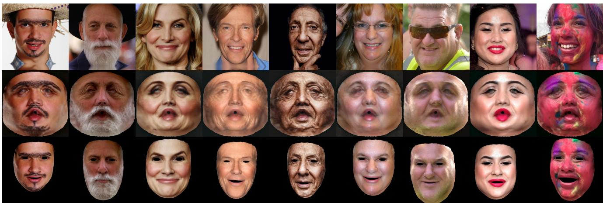  
Figure 1. Examples of FreeUV results. Top to bottom: input face images, recovered UV textures, and FLAME model-based rendering. FreeUV generates a complete UV texture from a single face image without requiring ground-truth UV supervision during training. The method captures intricate details, such as facial hair, wrinkles, occlusions, and makeup, while demonstrating robustness across diverse scenarios, achieving high fidelity and coherent texture recovery.

## Abstract

Recovering high-quality 3Dfacial texturesfrom single-view 2D images is a challenging task, especially under the constraints of limited data and complex facial details such as wrinkles, makeup, and occlusions. In this paper, we introduce FreeUV, a novel ground-truth-free UV texture recoveryframework that eliminates the needfor annotated or synthetic UV data. FreeUV leverages a pre-trained stable diffusion model alongside a Cross-Assembly inference strategy to fulfill this objective. In FreeUV, separate networks are trained independently to focus on realistic appearance and structural consistency, and these networks are combined during inference to generate coherent textures. Our approach accurately captures intricate facial features and demonstrates robust performance across diverse poses and occlusions. Extensive experiments validate FreeUV’s effectiveness, with results surpassing state-of-the-art methods in both quantitative and qualitative metrics. Additionally, FreeUV enables new applications, including local editing, facial feature interpolation, and texture recovery from

multi-view images. By reducing data requirements, FreeUV offers a scalable solution for generating high-fidelity 3D facial textures suitablefor real-world scenarios.

## 1. Introduction

Reconstructing realistic 3D facial textures from single 2D images is a longstanding challenge in computer vision and graphics. A major breakthrough in this field came with the introduction of the 3D Morphable Model (3DMM) by Blanz and Vetter [4], which enabled parametric modeling of 3D face shapes and allowed for effective 3D facial reconstruction from limited 2D input. Since then, 3DMMs have been significantly refined and expanded, resulting in a variety of models that improve reconstruction accuracy, robustness, and adaptability [6–8, 10, 14, 20–22, 29, 30, 35, 49–51, 55, 58, 66, 68, 68, 71, 72, 75, 78, 80, 86, 87, 89, 90, 92, 100]. Despite these advances, achieving high-quality textures that faithfully capture complex facial details—such as wrinkles, pores, facial hair, and diverse makeup—continues to be a challenge, particularly when only single-view, in-the-wild images are available.

To achieve high-quality 3D facial texture generation under constrained resources and lower costs, recent approaches [1, 16, 18, 19, 25–27, 42–44, 48, 49, 52, 54, 60, 65, 67, 85, 88, 90] have increasingly turned to generative models, such as GANs, to synthesize realistic textures. These generative models utilize non-linear structures to capture complex textures, achieving impressive levels of realism from a single face image. However, most 3D facial UV texture generation methods rely on supervised learning, which requires ground-truth UV datasets.

Facial UV texture generation methods can be broadly divided into two main categories based on the type of training data used: methods that use captured real data and methods that rely on synthesized data. The first category relies on costly UV datasets captured with specialized equipment as ground truth but lacks generalization to in-the-wild conditions [42, 43, 49, 65, 85]. The second category involves generating synthetic UV datasets using models like Style-GAN [39, 40] to create training data for facial texture models [1, 13, 48]. This approach faces two main limitations: (1) it is constrained by the capabilities of StyleGAN, often resulting in domain limitations that make it difficult to handle diverse, unseen faces, such as those with makeup; and (2) StyleGAN-based UV texture generation typically involves multiple steps. First, GAN inversion [84] is used to create multi-view images by adjusting the facial pose. These images are then blended to produce a complete UV texture. However, this process often results in inconsistencies in identity, expression, lighting, and appearance, making it difficult to generate realistic and coherent textures across views. In summary, both categories are fundamentally constrained by their dependence on large-scale, realistic UV textures—real or synthetic—as ground truth, which is essential for effective model training.

In this paper, we introduce FreeUV, a novel groundtruth-free UV texture generation framework that recovers realistic 3D facial UV textures from single 2D images (Fig. 1). Unlike many existing methods, FreeUV does not require complete UV ground truth during training, regardless of whether real or synthetic. Instead, it utilizes a pretrained stable diffusion model [62] and a unique Cross-Assembly inference strategy. We independently train appearance feature extraction and structural reconstruction modules, which are then integrated during inference. This setup enforces a disentanglement of appearance and structure, enabling the model to learn robust texture representations directly from partial or highly misaligned flaw UV texture inputs (see Fig. 2, third column), thereby eliminating the need for fully annotated UV datasets. By minimizing data dependency, FreeUV significantly reduces the cost and complexity of generating high-quality UV textures.

Table 1. Selective domain utilization in FreeUV’s texture recovery. Here we illustrate the Cross-Assembly strategy in FreeUV, highlighting how realistic appearance from in-the-wild images and structural consistency from 3DMM are selectively combined. The final setup targets a UV-to-UV mapping with a Realistic and Consistent combination for optimal texture generation.
<table><tr><td>Mapping</td><td>Domain</td><td>Appearance</td><td>Structure</td><td>Selected</td></tr><tr><td rowspan="2">UV-to-2D</td><td>3DMM</td><td>Non-realistic</td><td>Consistent</td><td>X</td></tr><tr><td>In-the-wild</td><td>Realistic</td><td>Reliable</td><td>L</td></tr><tr><td rowspan="2">2D-to-UV</td><td>3DMM</td><td>Non-realistic</td><td>Consistent</td><td>5</td></tr><tr><td>In-the-wild</td><td>Realistic</td><td>Unreliable</td><td>X</td></tr></table>

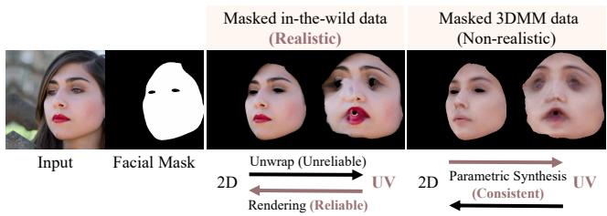  
Figure 2. Example of data and domain characteristics used in FreeUV. Realistic textures are derived from in-the-wild data, while structurally consistent textures are generated from parametric 3DMM data.

Our main idea, as illustrated in Tab. 1 and Fig. 2, is to selectively leverage the strengths of both in-the-wild real images and related 3DMM data by combining their functionalities. Specifically, during the training stage, FreeUV uses two networks, each with a complementary role: (1) The appearance feature extraction network prioritizes realism by focusing on the in-the-wild domain. Trained to map degraded UV textures to masked 2D face images, this network utilizes a CLIP-based [57] feature extractor with channel attention [36] to capture fine facial details while ensuring structural coherence. (2) The structural reconstruction network emphasizes structural control independently of appearance. Leveraging ControlNet [94], it operates in the 3DMM domain, mapping masked 3DMM face images to masked 3DMM UV textures to establish structural consistency. In the inference phase, we integrate the UV-specific modules from both networks into a pre-trained stable diffusion model, generating realistic, coherent UV textures. FreeUV effectively captures intricate details such as facial hair, wrinkles, and makeup while maintaining robustness across various poses and occlusions. By eliminating the need for ground-truth UV data, FreeUV provides a scalable, data-efficient approach to high-quality 3D facial texture generation for real-world applications.

In summary, our contributions are:

• FreeUV: A framework for generating high-quality facial UV textures without the need for costly annotated data or large synthetic datasets. By minimizing data requirements, FreeUV offers a practical and scalable solution for real-world applications;

• Cross-Assembly Inference Strategy: We utilize two complementary networks that focus separately on feature extraction (UV to 2D) and structural reconstruction (2D to UV) during training. At inference, these modules are combined (UV to UV) to generate high-fidelity textures that align with the 3DMM UV layout, effectively reducing UV unwrapping distortions, especially in large-angle faces and self-occlusions;

• Flaw-Tolerant Facial Detail Extractor: A channel attention-enhanced facial detail extractor. This module accurately captures essential facial features—including facial hair, wrinkles, and makeup—while preserving structural integrity, significantly enhancing the quality and robustness of UV texture generation across diverse conditions.

## 2. Related Work

## 2.1. 3DMM-based Face Reconstruction

3D Morphable Models (3DMMs) have served as foundational tools in reconstructing 3D facial geometry and texture from 2D images. Introduced by Blanz and Vetter [4], the 3DMM framework represents faces as linear combinations of shape and texture components derived from a set of 3D face scans. This framework has evolved significantly over time, incorporating both optimization-based and deep learning-based approaches to improve reconstruction accuracy and efficiency [2, 5, 17, 21, 22, 28, 31, 32, 47, 63, 73, 74, 76, 77, 81, 82, 96, 101, 102]. These methods typically rely on optimizing or regressing linear parameters within the 3DMM framework, which limits their expressive power. Some approaches specifically focus on enhancing geometry [11, 15, 23, 61, 86] to address this limitation. Iterative methods, such as HRN [46] and NextFace [18], employ a coarse-to-fine refinement process to simultaneously improve texture and geometry, achieving more accurate reconstructions. While these geometry-focused approaches improve structural accuracy, they often fall short in capturing the detailed textures essential for realistic facial representation.

## 2.2. High-Quality Facial Texture Recovery

Beyond enhancements within the 3DMM framework, another research direction focuses on methods for directly generating high-quality facial textures aligned with the 3DMM UV layout. Some approaches leverage image translation method [37] trained on large-scale scanned datasets to infer high-resolution textures [3, 42, 43, 49, 65, 85].

However, these models are often resource-intensive, limiting their practicality.

Alternative methods employ decoder-based approaches [40, 84] to produce detailed textures directly from 2D images [1, 12, 13, 16, 25, 27, 41, 48, 52, 67, 90], offering a practical solution for texture generation from inthe-wild image datasets. FFHQ-UV [1] proposes a method for generating face-normalized UV maps but relies on a resource-intensive iterative refinement process. Makeup Prior Models [90] similarly use iterative optimization to create facial makeup UV textures. UV-IDM [48], in contrast, generates multi-view images first, synthesizing paired 2D face images and UV maps to train a diffusion-based generative model.

While these methods improve facial UV texture quality, their dependency on StyleGAN-based frameworks restricts their generative scope and requires intricate, multistep workflows, often leading to inconsistencies and difficulties with diverse, previously unseen faces. FreeUV, in contrast, circumvents these limitations by eliminating the need for StyleGAN-generated synthetic complete UV data and employing a diffusion-based framework. This approach enables FreeUV to produce high-quality, realistic UV textures, capturing fine details with enhanced robustness across varied facial attributes and conditions.

## 2.3. Diffusion Models

Diffusion models (DMs) are generative models that transform gaussian noise into target data distributions through an iterative denoising process, yielding realistic, high-quality images [34, 69]. Due to their effectiveness, diffusion models have become the mainstream approach in image generation [24, 53, 56, 64, 70, 79, 91]. To enhance efficiency, the Latent Diffusion Model (LDM) [62] encodes data into a compressed latent space, reducing computational costs while maintaining fidelity. LDMs, including Stable Diffusion (SD) [62], achieve the state-of-the-art results, particularly when trained on large-scale datasets. SD incorporates CLIP [57], a powerful text encoder, which further improves multimodal generation quality. CLIP [57] is a multi-modal model combining an image encoder and a text encoder to create aligned visual and textual representations. This alignment enables diffusion models, including SD, to leverage CLIP’s embeddings for image generation tasks [53, 62, 91, 97–99], expanding the flexibility and control in diffusion-based generation. ControlNet [94] extends the functionality of diffusion models by introducing control signals from various modalities, such as depth or facial landmarks, enabling precise and controllable image generation. By utilizing a parallel U-Net structure with trainable layers that integrate spatial control conditions, ControlNet allows diffusion models to generate images guided by specific inputs without altering the core model. Our method is based on Stable Diffusion (SD), leveraging an enhanced CLIP image encoder for feature extraction and ControlNet for structural control.

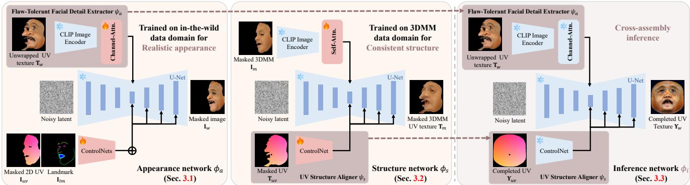  
Figure 3. Overview of FreeUV Framework. FreeUV leverages two modules, the Flaw-Tolerant Detail Extractor $\psi _ { a }$ (left) and the UV Structure Aligner $\psi _ { s }$ (middle), to separately capture realistic appearance and structural consistency. Combined during the Cross-Assembly inference phase (right), these modules produce high-quality UV textures from single-view images, without requiring ground-truth UV data.

## 3. Approach: FreeUV

We start with an overview of FreeUV. Based on the insights from Tab. 1 and Fig. 2, the overall framework of FreeUV is illustrated in Fig. 3. During the training phase, FreeUV utilizes two separate networks— $- \phi _ { a }$ and $\phi _ { s } -$ focusing on distinct aspects of appearance and structure. Specifically, $\phi _ { a }$ is trained on in-the-wild data to enhance realistic appearance, while $\phi _ { s }$ is trained on 3DMM data for structural consistency. In the inference phase, we employ a Cross-Assembly strategy to selectively integrate UV-specific modules from each network, capture both realistic appearance and consistent structure. The resulting integrated model, represented as ϕi, to produce the final realistic completed UV texture.

A key contribution of FreeUV is that it does not require complete ground-truth UV textures during training. We use a pre-trained Stable Diffusion model [62] as the backbone, with customized facial feature extractors based on the pre-trained CLIP encoder [57] and apply ControlNet [94] for effective structure control. Our networks $\phi _ { a }$ and $\phi _ { s }$ leverage the image feature embedding approach proposed by [91, 97–99], integrating cross-attention layers within the U-Net architecture to capture detailed feature embeddings essential for realistic output. These networks are symmetrically structured: $\phi _ { a }$ performs a UV-to-2D mapping, while $\phi _ { s }$ performs a 2D-to-UV mapping. This symmetry in design helps avoid input-output similarity, reinforcing module disentanglement. In the Cross-Assembly inference phase, selected UV-specific modules are integrated into the pretrained Stable Diffusion model [62], enabling conditional UV-to-UV texture generation.

To prepare the in-the-wild and 3DMM datasets, we employ a FLAME-based [50] 3DMM fitting method [90] focused on the face skin region. This method uses a re-trained version of the Deep3Dface [17] model for 3D face reconstruction. For an input image I, we generate the paired data for training and inference. Details on data preparation can be found in the supplementary materials.

In the following, we explain the two complementary networks: one focused on realistic appearance enhancement (Sec. 3.1) and the other dedicated to maintaining structural consistency (Sec. 3.2). We then explain the Cross-Assembly inference strategy that integrates these modules for coherent texture generation (Sec. 3.3).

## 3.1. Flaw-Tolerant Facial Detail Extractor

In Appearance Network $\phi _ { a } ,$ the Flaw-Tolerant Facial Detail Extractor $\psi _ { a }$ comprises a CLIP image encoder with an additional channel attention layer. This module is designed to capture intricate facial details, while remaining robust against distortions and flaws typically present in unwrapped, in-the-wild UV data. To effectively leverage the CLIP image encoder, we adopted the CLIP feature extraction approach proposed in Stable-Makeup [98], gathering features from multiple layers of the CLIP visual backbone and concatenating them along the feature axis. Additionally, the channel attention mechanism [36] selectively emphasizes relevant information while reducing the impact of less significant features. This combination enables $\psi _ { a }$ to retain fine details and achieve high fidelity in the generated UV textures, even under challenging conditions.

Specifically, module $\psi _ { a }$ extracts facial detail features from the unwrapped masked UV texture $\mathbf { T } _ { w } ,$ , selectively disregarding inaccurate features. Following structural cues from the masked rendered 2D UV position map ${ \mathbf { I } } _ { u v }$ and detected 2D landmarks $\mathbf { I } _ { l m } ,$ the network generates the masked skin region image ${ \bf { I } } _ { w }$ . This entire process can be interpreted as a reliable UV-to-2D rendering. We observe that 3DMM fitting does not achieve pixel-level alignment between ${ \mathbf { I } } _ { u v }$ and $\mathbf { I } _ { w } ,$ and thus we incorporate 2D landmarks $\mathbf { I } _ { l m }$ as an

auxiliary alignment guide.

The loss function of network $\phi _ { a }$ is similar to that of the Stable Diffusion model and can be formulated as follows:

$$
\begin{array} { r } { \mathcal { L } _ { a } ( \theta ) : = \mathbb { E } _ { \mathbf { x } _ { 0 } , t , \epsilon } \left[ \left| \left| \epsilon - \epsilon _ { \theta } ( \mathbf { x } _ { t } , t , \mathbf { c } _ { T } ^ { w } , \mathbf { c } _ { I } ^ { u v } , \mathbf { c } _ { I } ^ { l m } ) \right| \right| _ { 2 } ^ { 2 } \right] , } \end{array}\tag{1}
$$

where $\mathbf { x } _ { \mathrm { 0 } }$ is the original image latent, and $\mathbf { x } _ { t }$ represents its noisy version at time t. t denotes the time step in the diffusion process. ϵ is the noise added to $\mathbf { x } _ { \mathrm { 0 } }$ , which the denoising network $\epsilon _ { \theta } ,$ with network parameters $\theta ,$ aims to predict given xt. ${ \bf c } _ { T } ^ { w } , { \bf c } _ { I } ^ { u v }$ , and $\mathbf { c } _ { I } ^ { l m }$ are conditioning inputs embedded from $\mathbf { T } _ { w } , \mathbf { I } _ { u v }$ , and $\mathbf { I } _ { l m } .$ , respectively.

## 3.2. UV Structure Aligner

The UV Structure Aligner $\psi _ { s }$ in structure network $\phi _ { s }$ is designed to guide structural consistency that precisely aligns with the 3DMM UV layout. This network is trained using pixel-level aligned data derived from the same 3DMM parameters, including the masked 3DMM UV texture $\mathbf { T } _ { m }$ and the masked UV position map $\mathbf { T } _ { u v }$ . In the data preparation stage, the masked rendered 3DMM image ${ \mathbf I } _ { m }$ is generated by rendering $\mathbf { T } _ { m }$ , ensuring data consistency. This entire process can be viewed as a consistent 2D-to-UV mapping.

For the feature extractor in structure network $\phi _ { s } ,$ , we adopt a CLIP based spatial-aware self-attention mechanism proposed by [98]. In our experiments, we chose this distinct attention design for each mapping, based on the hypothesis that, due to the resolution difference, the UV-to-2D mapping acts as a “downsampling process,” where pixels are selectively sampled from the UV texture and mapped to the 2D image. Conversely, the 2D-to-UV mapping functions as an “upsampling process,” interpolating across missing details during unwrapping from the 2D image. Channel attention selectively identifies necessary features, while self attention captures relationships among features to enable accurate interpolation. Reversing these roles may introduce artifacts, as we will demonstrate in the experiments.

The loss function of network $\phi _ { s }$ can be formulated as follows:

$$
\begin{array} { r } { \mathcal { L } _ { s } ( \theta ) : = \mathbb { E } _ { \mathbf { x } _ { 0 } , t , \epsilon } \left[ \left\| \epsilon - \epsilon _ { \theta } ( \mathbf { x } _ { t } , t , \mathbf { c } _ { I } ^ { m } , \mathbf { c } _ { T } ^ { u v } ) \right\| _ { 2 } ^ { 2 } \right] , } \end{array}\tag{2}
$$

where ${ \bf c } _ { I } ^ { m }$ , and ${ \bf c } _ { T } ^ { u v }$ are conditioning inputs embedded from ${ \mathbf I } _ { m }$ , and $\mathbf { T } _ { u v } .$ , respectively.

## 3.3. Cross-Assemble Inference Strategy

After separately training networks $\phi _ { a }$ and $\phi _ { s }$ , we employ a Cross-Assembly strategy, combining $\psi _ { a }$ and $\psi _ { s }$ for inference. Specifically, $\psi _ { a }$ is responsible for extracting realistic, detailed facial features from $\mathbf { T } _ { w } .$ , while $\psi _ { s }$ provides structural guidance based on the UV position map $\mathbf { \hat { r } } _ { u v }$ . Notably, we utilize the complete UV position map to ensure the recovery of the full UV texture $\mathbf { \Delta } \mathbf { \hat { r } } _ { w }$

We observed that adjusting the classifier-free guidance scale during generation affects the color tone of the UV texture. This variation makes it challenging to align the color tone with the original image ${ \bf { I } } _ { w }$ . To address this, we apply a straightforward color transfer technique [59] as a postprocessing step. This method adjusts the mean and standard deviation in the Lab color space of the generated UV texture, $\Upsilon _ { w } ,$ , to match those of the image $\mathbf { I } _ { w }$

## 4. Experiments

## 4.1. Implementation Details

For the training dataset, we used a face segmentation method [93] on the FFHQ dataset [38] to isolate face regions. After manual filtering to remove images with segmentation errors, hair, or occlusions, we selected 33,419 images for training. For the Stable Diffusion backbone, we employed the pre-trained V1.5 model. The unwrapped texture used for training was resized to $5 1 2 \times 5 1 2$ pixels, and the generated UV textures also have the same resolution. The training was conducted on a single A100 GPU over 80,000 iterations, with a batch size of 4 and a learning rate of $3 \times 1 0 ^ { - 5 }$ . For inference, we utilized the DDIM sampler [70], running 30 steps with a guidance scale of 1.4, which required 4.75 seconds per inference.

## 4.2. Experimental Setup

We utilized the high-resolution face databases FFHQ [38] and CelebAMask-HQ [45], selecting 10,000 images from each for both qualitative and quantitative evaluation. To further assess model performance under diverse conditions, we included 2,000 images randomly selected from the Large Pose Face Dataset (LPFF) [83]. Through extensive experiments, we demonstrate FreeUV’s effectiveness and resilience in challenging scenarios. Specifically, our approach is compared against the state-of-the-art methods, including Deep3Dface [17], FFHQ-UV [1], HRN [46], UV-IDM [48], and Makeup Prior Models [90], where FreeUV consistently achieves superior performance across multiple metrics. Furthermore, FreeUV’s distinct design allows for flexible applications, supporting extended use cases in areas like customized local editing, facial feature interpolation, and multi-view texture recovery. Ablation studies were also conducted, providing a detailed qualitative and quantitative assessment of each module’s contribution to the overall effectiveness of FreeUV.

## 4.3. Experiment Results

3D face reconstruction. To evaluate the quality of our recovered facial UV textures, we rendered and overlaid them onto original images for qualitative comparison in 3D face reconstruction. A quantitative analysis was not performed, as the comparison methods depend on 3DMM models [11, 29, 50] and shape reconstruction techniques. As illustrated in Figs. 1, 4, and 5, our approach faithfully captures color variations and intricate facial details under challenging conditions, such as extreme lighting, specular highlights, facial hair, wrinkles, and makeup. Our method also demonstrates strong robustness against occlusions, including hair and glasses. In comparison to makeupfocused 3DMM techniques [90], our approach preserves fine makeup details—such as eyeliner—with exceptional fidelity.

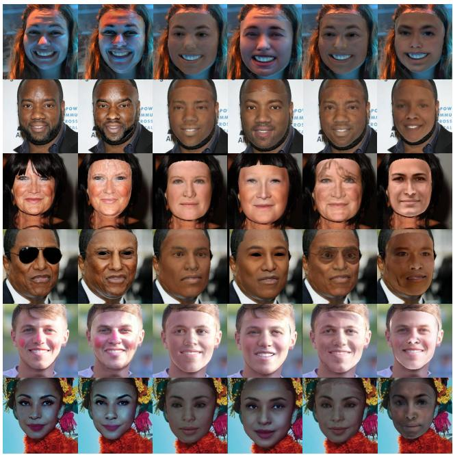

Figure 4. Comparison of 3D face reconstruction results. Our method achieves the closest match to the original input by rendering and overlaying the recovered UV texture. Even under challenging conditions, such as extreme lighting, facial hair, and occlusions, our approach preserves fine details and color consistency.  
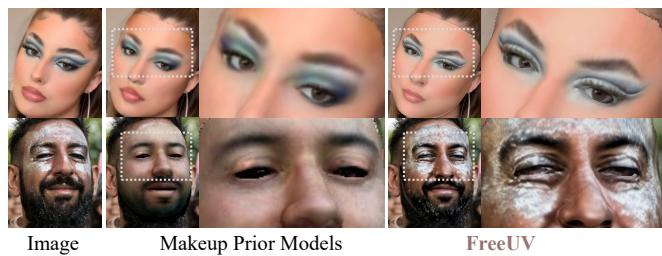  
Figure 5. Comparison with makeup-focused reconstruction method. Our approach captures finer details, accurately preserving makeup features with greater clarity and consistency.  
Figure 6. Comparison of facial UV texture recovery. Our method robustly produces realistic textures despite challenging inputs. Even with significant distortions, occlusions, and missing regions in the input data, the recovered UV textures retain fine details, smooth transitions, and consistent color tones.

UV texture recovery. As shown in Fig. 6, our method outperforms others by capturing finer details and significantly reducing artifacts. In the second column, despite inputs with substantial distortion, inaccuracies, and extensive missing regions, our approach reliably reconstructs realistic facial UV textures. We attribute this robustness to our Flaw-Tolerant Facial Detail Extractor, which selectively prioritizes accurate features, ensuring high-quality and detailrich recovery.

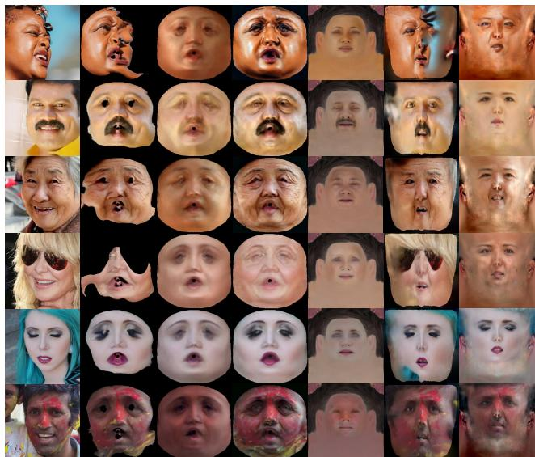  
Image Unwrapped FLAME FreeUV FFHQ-UV HRN UV-IDM

To quantitatively evaluate our approach, we adopted the comparison methodology from UV-IDM [48], focusing on non-iterative texture refinement methods and excluding iterative techniques like FFHQ-UV. We employed metrics such as DINO-I [9], CLIP-I [57], and FID [33] to measure both the semantic alignment and visual quality between original 2D face images and the recovered UV textures. As shown in Tab. 2, our method achieved superior results across DINO-I, CLIP-I, and FID scores, highlighting its capability to capture semantically meaningful and visually coherent features, while delivering textures that align closely with realistic distributions. These results underscore FreeUV’s robustness in preserving intricate facial details and ensuring high-quality, lifelike texture synthesis.

Robustness. Fig. 7 demonstrates the robustness of our method in handling partial and incomplete inputs. To simulate various input views, we manually masked sections of the unwrapped texture from a frontal face image. As shown in columns 3 to 5, each masked input serves as a partial view, where the unmasked portions retain detail and continuity, while the masked areas are seamlessly filled, maintaining color consistency and smooth transitions.

Table 2. Comparative analysis of original 2D face images and the recovered UV textures on FFHQ [38], CelebAMask-HQ [45], and LPFF [83] datasets. Values in bold indicate the top-performing results, while those underlined mark the second-best.
<table><tr><td></td><td colspan="3">FFHQ</td><td colspan="3">CelebAMask-HQ</td><td colspan="3">LPFF</td></tr><tr><td>Method</td><td>CLIP-I↑</td><td>DINO-I↑</td><td>FID↓</td><td>CLIP-I↑</td><td>DINO-I↑</td><td>FID↓</td><td>CLIP-I↑</td><td>DINO-I↑</td><td>FID↓</td></tr><tr><td>HRN [46]</td><td>0.8327</td><td>0.7389</td><td>166.19</td><td>0.8259</td><td>0.7382</td><td>189.74</td><td>0.7368</td><td>0.5951</td><td>142.82</td></tr><tr><td>UV-IDM [48]</td><td>0.7986</td><td>0.5836</td><td>228.74</td><td>0.7458</td><td>0.5690</td><td>258.34</td><td>0.7440</td><td>0.5345</td><td>239.10</td></tr><tr><td>FLAME-based [90]</td><td>0.8218</td><td>0.7269</td><td>158.06</td><td>0.8016</td><td>0.7640</td><td>164.98</td><td>0.7822</td><td>0.6724</td><td>166.31</td></tr><tr><td>FreeUV</td><td>0.8490</td><td>0.7559</td><td>142.39</td><td>0.8272</td><td>0.7948</td><td>153.43</td><td>0.7997</td><td>0.6835</td><td>158.55</td></tr></table>

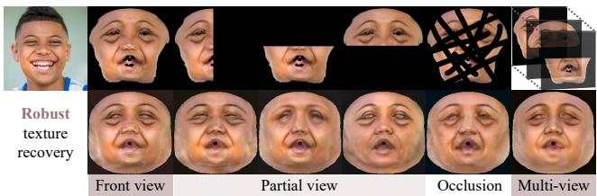  
Figure 7. Robustness evaluation. Our method effectively handles partial views, seamlessly completing missing regions and maintaining color consistency, even with extensive occlusions.

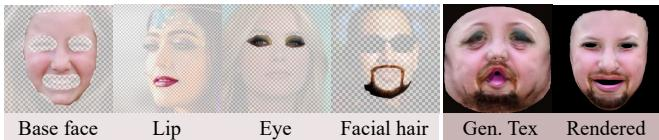  
Figure 8. Result of customized local editing application. Our method enables seamless transfer of specific facial features from different source images onto a base face, creating a coherent UV texture that combines multiple attributes.

Even under extreme occlusion, as illustrated in column 6, our method generates visually coherent and credible results. Notably, when multiple partial views are concatenated as batch input to the Flaw-Tolerant Facial Detail Extractor, the model’s output closely approaches that of a complete frontal view. The network selectively integrates the best features from each partial view, resulting in a high-quality synthesis. This capacity to handle multiple partial views opens avenues for applying FreeUV to multi-view stereo and videobased texture recovery, directions we aim to explore in future work.

Customized local editing. Following insights gained from Fig. 7, our method facilitates flexible, customized local editing. As demonstrated in Fig. 8, specific facial features—such as lips, eyes, and facial hair—can be selectively transferred from different source images to a base face. After unwrapping and layering these chosen regions into a single UV texture, the network completes the composition. This approach yields a coherent facial UV texture, seamlessly integrating the transferred features with the base face. Our method excels at preserving natural color transitions and maintaining structural consistency, resulting in realistic edits that enhance the base image without visible seams or inconsistencies. This capability not only supports detailed, user-driven customization but also showcases FreeUV’s adaptability to high-fidelity, personalized editing applications.

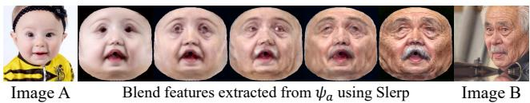  
Figure 9. Result of facial feature interpolation. Facial feature blending is achieved by interpolating features from two input images, which can be used for, e.g., customizable transformations.

Facial feature interpolation. By interpolating between two distinct input images, our method enables applications in facial feature blending. As shown in Fig. 9, we first extract features from Image A and Image B individually using our facial detail extractor. We then merge these features through a spherical linear interpolation (slerp) method, which provides smooth, visually coherent transitions between the two images. This approach supports applications such as 3D face aging, where facial features are blended to simulate realistic aging effects or other transformations. Notably, this interpolation captures subtle details and maintains structural integrity, allowing for highly customizable facial transformations with natural results.

## 4.4. Ablation Studies

Color adjustment. Fig. 10 shows the results with varying classifier-free guidance scales and applying Lab space color adjustment. Lower guidance scales diminished the detail, while higher scales introduced excessive detail and noise, causing discrepancies with the original image. After testing, we found a guidance scale of 1.4 achieved optimal detail and natural appearance. With color adjustment, the final results exhibit a consistent tone and enhanced visua alignment with the original unwrapped input.

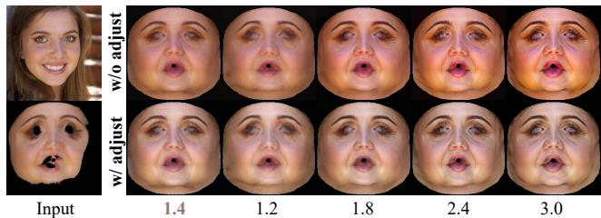  
Figure 10. Effect of classifier-free guidance (CFG) scale and subsequent color adjustment. The first row shows results with varying CFG scales, where lower scales reduce detail and higher scales amplify both detail and noise, potentially causing color mismatches. The second row applies Lab space color adjustment to the corresponding results from the first row, ensuring a coherent tone aligned with the original input.

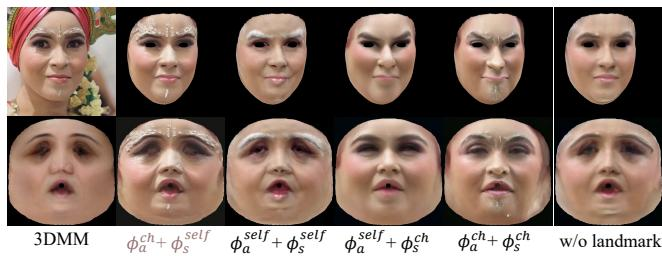  
Figure 11. Comparison of different module configurations in channel and self-attention for facial UV texture recovery. Our approach shows that channel attention excels in capturing finegrained details for UV-to-2D mapping, while self-attention better maintains structural alignment for 2D-to-UV mapping in the 3DMM domain.

Table 3. Ablation study using different module configurations. Here “w/o lm.” indicates “without landmarks” whereas “w/o adj.” means “without color adjustment.”
<table><tr><td></td><td> $\phi _ { a } ^ { c h } + \phi _ { s } ^ { s e l f }$ </td><td> $\phi _ { a } ^ { s e l f } + \phi _ { s } ^ { s e l f }$ </td><td> $\phi _ { a } ^ { s e l f } + \phi _ { s } ^ { c h }$ </td><td> $\phi _ { a } ^ { c h } + \phi _ { s } ^ { c h }$ </td><td>w/o lm.</td><td>w/o adj.</td></tr><tr><td>RMSE↓</td><td>0.0276</td><td>0.0302</td><td>0.0367</td><td>0.0379</td><td>0.0292</td><td>0.0282</td></tr><tr><td>SSIM↑</td><td>0.8001</td><td>0.7881</td><td>0.7876</td><td>0.7648</td><td>0.7928</td><td>0.7992</td></tr><tr><td>LPIPS↓</td><td>0.0463</td><td>0.0474</td><td>0.0539</td><td>0.0639</td><td>0.0481</td><td>0.0531</td></tr><tr><td>PSNR↑</td><td>30.848</td><td>30.397</td><td>28.693</td><td>28.417</td><td>30.624</td><td>30.828</td></tr></table>

Module selection. We assessed the roles of channel attention and self-attention in our task by combining different facial detail extractors in networks $\phi _ { a }$ and $\phi _ { s } .$ . As shown in Fig. 11, our experiments reveal that, for the UV-to-2D mapping in the in-the-wild domain, using channel attention in appearance network $\phi _ { a } ~ ( \phi _ { a } ^ { c h } )$ effectively preserves realistic details. This configuration captures fine-grained features, whereas self-attention $( \phi _ { a } ^ { s e l f } )$ tends to smooth the details, yielding a slightly blurred outcome. In one case, channel attention successfully retained delicate facial adornments, while self-attention produced a less detailed, more uniform result.

On the other hand, for the 2D-to-UV mapping in the 3DMM domain, self-attention in structure network $\phi _ { s } ~ ( \phi _ { s } ^ { s e l f } )$ better maintains structural alignment with the 3DMM UV layout, while channel attention $( \phi _ { s } ^ { c h } )$ introduces distortions that disrupt this consistency. Consequently, rendered results using channel attention in this setting may not align accurately with the original image.

Furthermore, excluding 2D landmarks as alignment aids in appearance network $\phi _ { a }$ results in notable detail loss, likely due to structural inaccuracies from imperfect 3DMM fitting. These inaccuracies hinder precise alignment of structure and appearance. Including detected 2D landmarks from the image mitigates this issue, improving detail preservation in the generated UV textures.

As shown in Tab. 3, we conducted quantitative experiments on different module combinations by rendering the recovered UV textures for comparison with the original 2D face image. Key evaluation metrics included RMSE, SSIM, LPIPS [95], and PSNR. Our selected configuration achieved the top scores, with the results prior to color adjustment ranking as the second best. These findings indirectly confirm the effectiveness of our selected attention modules.

## 4.5. Limitation

As illustrated in Fig. 11, while our method successfully recovers highly detailed features, it faces limitations with very fine-grained elements, such as facial accessories, spots, and blemishes. These details may exhibit slight shifts in position or quantity. Additionally, the network struggles to precisely localize these features within specific areas; for instance, when reconstructing regions originally covered by a hat, the network may unintentionally extend surrounding details to ensure texture continuity, which can compromise the accuracy of localized texture recovery.

## 5. Conclusions

We introduced FreeUV, a novel framework for 3D facial UV texture recovery that operates without the need for groundtruth UV data. By leveraging a pre-trained diffusion mode and a Cross-Assembly inference strategy, FreeUV disentangles appearance from structure, enabling precise capture of fine-grained textures alongside robust structural integrity. This approach allows FreeUV to generate realistic, highquality UV textures directly from single-view, in-the-wild images, handling complex details with adaptability across varied real-world conditions. Furthermore, FreeUV’s versatility extends to applications including customized local editing, facial feature interpolation, and multi-view texture recovery. By reducing data dependency while maintaining texture fidelity, FreeUV offers a scalable solution for highquality facial texture recovery.

## References

[1] Haoran Bai, Di Kang, Haoxian Zhang, Jinshan Pan, and Linchao Bao. FFHQ-UV: Normalized facial uv-texture dataset for 3D face reconstruction. In CVPR 2023, pages 362–371, 2023. 2, 3, 5

[2] Ziqian Bai, Zhaopeng Cui, Xiaoming Liu, and Ping Tan. Riggable 3D face reconstruction via in-network optimization. In CVPR 2021, pages 6216–6225, 2021. 3

[3] Linchao Bao, Xiangkai Lin, Yajing Chen, Haoxian Zhang, Sheng Wang, Xuefei Zhe, Di Kang, Haozhi Huang, Xinwei Jiang, Jue Wang, Dong Yu, and Zhengyou Zhang. Highfidelity 3D digital human head creation from RGB-D selfies. ACM Transactions on Graphics, 41(1):3:1–3:21, 2022. 3

[4] Volker Blanz and Thomas Vetter. A morphable model for the synthesis of 3D faces. In Proc. of SIGGRAPH 1999, pages 187–194, 1999. 1, 3

[5] Volker Blanz and Thomas Vetter. Face recognition based on fitting a 3D morphable model. IEEE Transactions on Pattern Analysis and Machine Intelligence, 25(9):1063–1074, 2003. 3

[6] James Booth, Anastasios Roussos, Stefanos Zafeiriou, Allan Ponniah, and David Dunaway. A 3D morphable model learnt from 10,000 faces. In CVPR 2016, pages 5543–5552, 2016. 1

[7] James Booth, Anastasios Roussos, Allan Ponniah, David J. Dunaway, and Stefanos Zafeiriou. Large scale 3D morphable models. International Journal of Computer Vision, 126(2-4):233–254, 2018.

[8] Chen Cao, Yanlin Weng, Shun Zhou, Yiying Tong, and Kun Zhou. FaceWarehouse: A 3D facial expression database for visual computing. Transactions on Visualization and Computer Graphics, 20(3):413–425, 2014. 1

[9] Mathilde Caron, Hugo Touvron, Ishan Misra, Herve J ´ egou,´ Julien Mairal, Piotr Bojanowski, and Armand Joulin. Emerging properties in self-supervised vision transformers. In ICCV 2021, pages 9630–9640, 2021. 6

[10] Zenghao Chai, Haoxian Zhang, Jing Ren, Di Kang, Zhengzhuo Xu, Xuefei Zhe, Chun Yuan, and Linchao Bao. REALY: rethinking the evaluation of 3D face reconstruction. In ECCV 2022, pages 74–92, 2022. 1

[11] Zenghao Chai, Tianke Zhang, Tianyu He, Xu Tan, Tadas Baltrusaitis, HsiangTao Wu, Runnan Li, Sheng Zhao, Chun Yuan, and Jiang Bian. HiFace: High-Fidelity 3D face reconstruction by learning static and dynamic details. In ICCV 2023, pages 9053–9064, 2023. 3, 6

[12] Jinsong Chen, Hu Han, and Shiguang Shan. Towards high-fidelity face self-occlusion recovery via multi-view residual-based GAN inversion. In AAAI 2022, pages 294– 302, 2022. 3

[13] Jinsong Chen, Hu Han, and Shiguang Shan. Towards high-fidelity face self-occlusion recovery via multi-view residual-based GAN inversion. In AAAI 2022, pages 294– 302, 2022. 2, 3

[14] Hang Dai, Nick E. Pears, William A. P. Smith, and Christian Duncan. Statistical modeling of craniofacial shape and

texture. International Journal of Computer Vision, 128(2): 547–571, 2020. 1

[15] Radek Danecek, Michael J. Black, and Timo Bolkart. EMOCA: Emotion driven monocular face capture and animation. In CVPR 2022, pages 20311–20322, 2022. 3

[16] Jiankang Deng, Shiyang Cheng, Niannan Xue, Yuxiang Zhou, and Stefanos Zafeiriou. UV-GAN: Adversarial facial UV map completion for pose-invariant face recognition. In CVPR 2018, pages 7093–7102, 2018. 2, 3

[17] Yu Deng, Jiaolong Yang, Sicheng Xu, Dong Chen, Yunde Jia, and Xin Tong. Accurate 3D face reconstruction with weakly-supervised learning: From single image to image set. In CVPR 2019 Workshops, pages 285–295, 2019. 3, 4, 5

[18] Abdallah Dib, Gaurav Bharaj, Junghyun Ahn, Cedric´ Thebault, Philippe Henri Gosselin, Marco Romeo, and ´ Louis Chevallier. Practical face reconstruction via differentiable ray tracing. Computer Graphics Forum, 40(2):153– 164, 2021. 2, 3

[19] Abdallah Dib, Luiz Gustavo Hafemann, Emeline Got, Trevor Anderson, Amin Fadaeinejad, Rafael M. O. Cruz, and Marc-Andre Carbonneau. MoSAR: Monocular semi-´ supervised model for avatar reconstruction using differentiable shading. In CVPR 2024, pages 1770–1780, 2024. 2

[20] Bernhard Egger, Sandro Schonborn, Andreas Schnei-¨ der, Adam Kortylewski, Andreas Morel-Forster, Clemens Blumer, and Thomas Vetter. Occlusion-aware 3D morphable models and an illumination prior for face image analysis. IJCV 2018, 126(12):1269–1287, 2018. 1

[21] Bernhard Egger, William A. P. Smith, Ayush Tewari, Stefanie Wuhrer, Michael Zollhofer, Thabo Beeler, Florian¨ Bernard, Timo Bolkart, Adam Kortylewski, Sami Romdhani, Christian Theobalt, Volker Blanz, and Thomas Vetter. 3D morphable face models - past, present, and future. ACM Transactions on Graphics, 39(5):157:1–157:38, 2020. 3

[22] Haiwen Feng, Timo Bolkart, Joachim Tesch, Michael J. Black, and Victoria Fernandez Abrevaya. Towards racially´ unbiased skin tone estimation via scene disambiguation. In ECCV 2022, pages 72–90, 2022. 1, 3

[23] Yao Feng, Haiwen Feng, Michael J. Black, and Timo Bolkart. Learning an animatable detailed 3D face model from in-the-wild images. ACM Transactions on Graphics, 40(4):88:1–88:13, 2021. 3

[24] Rinon Gal, Yuval Alaluf, Yuval Atzmon, Or Patashnik, Amit Haim Bermano, Gal Chechik, and Daniel Cohen-Or. An image is worth one word: Personalizing text-to-image generation using textual inversion. In ICLR 2023, 2023. 3

[25] Baris Gecer, Stylianos Ploumpis, Irene Kotsia, and Stefanos Zafeiriou. GANFIT: Generative adversarial network fitting for high fidelity 3D face reconstruction. In CVPR 2019, pages 1155–1164, 2019. 2, 3

[26] Baris Gecer, Alexandros Lattas, Stylianos Ploumpis, Jiankang Deng, Athanasios Papaioannou, Stylianos Moschoglou, and Stefanos Zafeiriou. Synthesizing coupled 3D face modalities by trunk-branch generative adversarial networks. In ECCV 2020, pages 415–433, 2020.

[27] Baris Gecer, Jiankang Deng, and Stefanos Zafeiriou. OS-TeC: One-shot texture completion. In CVPR 2021, pages 7628–7638, 2021. 2, 3

[28] Kyle Genova, Forrester Cole, Aaron Maschinot, Aaron Sarna, Daniel Vlasic, and William T. Freeman. Unsupervised training for 3D morphable model regression. In CVPR 2018, pages 8377–8386, 2018. 3

[29] Thomas Gerig, Andreas Morel-Forster, Clemens Blumer, Bernhard Egger, Marcel Luthi, Sandro Sch¨ onborn, and¨ Thomas Vetter. Morphable face models - an open framework. In Proceedings of International Conference on Automatic Face & Gesture Recognition, pages 75–82, 2018. 1, 6

[30] Simon Giebenhain, Tobias Kirschstein, Markos Georgopoulos, Martin Runz, Lourdes Agapito, and Matthias ¨ Nießner. Learning neural parametric head models. In CVPR 2023, pages 21003–21012, 2023. 1

[31] Yudong Guo, Juyong Zhang, Jianfei Cai, Boyi Jiang, and Jianmin Zheng. CNN-based real-time dense face reconstruction with inverse-rendered photo-realistic face images. IEEE Transactions on Pattern Analysis and Machine Intelligence, 41(6):1294–1307, 2019. 3

[32] Yudong Guo, Juyong Zhang, Jianfei Cai, Boyi Jiang, and Jianmin Zheng. CNN-based real-time dense face reconstruction with inverse-rendered photo-realistic face images. IEEE Transactions on Pattern Analysis and Machine Intelligence, 41(6):1294–1307, 2019. 3

[33] Martin Heusel, Hubert Ramsauer, Thomas Unterthiner, Bernhard Nessler, and Sepp Hochreiter. GANs trained by a two time-scale update rule converge to a local nash equilibrium. In NIPS 2017, pages 6626–6637, 2017. 6

[34] Jonathan Ho, Ajay Jain, and Pieter Abbeel. Denoising diffusion probabilistic models. In NeurIPS 2020, 2020. 3

[35] Yang Hong, Bo Peng, Haiyao Xiao, Ligang Liu, and Juyong Zhang. HeadNeRF: A real-time nerf-based parametric head model. In CVPR 2022, 2022. 1

[36] Jie Hu, Li Shen, and Gang Sun. Squeeze-and-Excitation networks. In CVPR 2018, pages 7132–7141, 2018. 2, 4

[37] Phillip Isola, Jun-Yan Zhu, Tinghui Zhou, and Alexei A. Efros. Image-to-image translation with conditional adversarial networks. In CVPR 2017, pages 5967–5976, 2017. 3

[38] Tero Karras, Samuli Laine, and Timo Aila. A style-based generator architecture for generative adversarial networks. In CVPR 2019, pages 4401–4410, 2019. 5, 7

[39] Tero Karras, Samuli Laine, and Timo Aila. A Style-based generator architecture for generative adversarial networks. In CVPR 2019, pages 4401–4410, 2019. 2

[40] Tero Karras, Samuli Laine, Miika Aittala, Janne Hellsten, Jaakko Lehtinen, and Timo Aila. Analyzing and improving the image quality of StyleGAN. In CVPR 2020, pages 8107–8116, 2020. 2, 3

[41] Jongyoo Kim, Jiaolong Yang, and Xin Tong. Learning high-fidelity face texture completion without complete face texture. In CVPR 2021, pages 13970–13979, 2021. 3

[42] Alexandros Lattas, Stylianos Moschoglou, Baris Gecer, Stylianos Ploumpis, Vasileios Triantafyllou, Abhijeet

Ghosh, and Stefanos Zafeiriou. AvatarMe: Realistically renderable 3D facial reconstruction “in-the-wild”. In CVPR 2020, pages 757–766, 2020. 2, 3

[43] Alexandros Lattas, Stylianos Moschoglou, Stylianos Ploumpis, Baris Gecer, Abhijeet Ghosh, and Stefanos P Zafeiriou. AvatarMe++: Facial shape and BRDF inference with photorealistic rendering-aware GANs. IEEE Transactions on Pattern Analysis and Machine Intelligence, 2021. 2, 3

[44] Alexandros Lattas, Stylianos Moschoglou, Stylianos Ploumpis, Baris Gecer, Jiankang Deng, and Stefanos Zafeiriou. FitMe: Deep photorealistic 3D morphable model avatars. In CVPR 2023, pages 8629–8640, 2023. 2

[45] Cheng-Han Lee, Ziwei Liu, Lingyun Wu, and Ping Luo. MaskGAN: Towards diverse and interactive facial image manipulation. In CVPR 2020, pages 5548–5557, 2020. 5, 7

[46] Biwen Lei, Jianqiang Ren, Mengyang Feng, Miaomiao Cui, and Xuansong Xie. A hierarchical representation network for accurate and detailed face reconstruction from in-thewild images. In CVPR 2023, pages 394–403, 2023. 3, 5, 7

[47] Chunlu Li, Andreas Morel-Forster, Thomas Vetter, Bernhard Egger, and Adam Kortylewski. To fit or not to fit: Model-based face reconstruction and occlusion segmentation from weak supervision. In CVPR 2023, 2023. 3

[48] Hong Li, Yutang Feng, Song Xue, Xuhui Liu, Bohan Zeng, Shanglin Li, Boyu Liu, Jianzhuang Liu, Shumin Han, and Baochang Zhang. UV-IDM: identity-Conditioned latent diffusion model for face UV-texture generation. In CVPR 2024, pages 10585–10595, 2024. 2, 3, 5, 6, 7

[49] Ruilong Li, Karl Bladin, Yajie Zhao, Chinmay Chinara, Owen Ingraham, Pengda Xiang, Xinglei Ren, Pratusha Prasad, Bipin Kishore, Jun Xing, and Hao Li. Learning for mation of physically-based face attributes. In CVPR 2020, pages 3407–3416, 2020. 1, 2, 3

[50] Tianye Li, Timo Bolkart, Michael J. Black, Hao Li, and Javier Romero. Learning a model of facial shape and expression from 4D scans. ACM Transactions on Graphics, 36(6):194:1–194:17, 2017. 4, 6

[51] Feng Liu, Luan Tran, and Xiaoming Liu. 3D face modeling from diverse raw scan data. In ICCV 2019, pages 9407– 9417, 2019. 1

[52] Huiwen Luo, Koki Nagano, Han-Wei Kung, Qingguo Xu, Zejian Wang, Lingyu Wei, Liwen Hu, and Hao Li. Normal ized avatar synthesis using styleGAN and perceptual refinement. In CVPR 2021, pages 11662–11672, 2021. 2, 3

[53] Chong Mou, Xintao Wang, Liangbin Xie, Yanze Wu, Jian Zhang, Zhongang Qi, and Ying Shan. T2I-Adapter: Learning adapters to dig out more controllable ability for text-toimage diffusion models. In AAAI 2024, pages 4296–4304, 2024. 3

[54] Foivos Paraperas Papantoniou, Alexandros Lattas, Stylianos Moschoglou, and Stefanos Zafeiriou. Relightify: Relightable 3d faces from a single image via diffusion models. In ICCV 2023, pages 8772–8783, 2023. 2

[55] Stylianos Ploumpis, Evangelos Ververas, Eimear O’ Sulli van, Stylianos Moschoglou, Haoyang Wang, Nick E. Pears,

William A. P. Smith, Baris Gecer, and Stefanos Zafeiriou. Towards a complete 3D morphable model of the human head. IEEE Transactions on Pattern Analysis and Machine Intelligence, 43(11):4142–4160, 2021. 1

[56] Dustin Podell, Zion English, Kyle Lacey, Andreas Blattmann, Tim Dockhorn, Jonas Muller, Joe Penna, and¨ Robin Rombach. SDXL: improving latent diffusion models for high-resolution image synthesis. In ICLR 2024, 2024. 3

[57] Alec Radford, Jong Wook Kim, Chris Hallacy, Aditya Ramesh, Gabriel Goh, Sandhini Agarwal, Girish Sastry, Amanda Askell, Pamela Mishkin, Jack Clark, Gretchen Krueger, and Ilya Sutskever. Learning transferable visual models from natural language supervision. In ICML 2021, pages 8748–8763, 2021. 2, 3, 4, 6

[58] Anurag Ranjan, Timo Bolkart, Soubhik Sanyal, and Michael J. Black. Generating 3D faces using convolutional mesh autoencoders. In ECCV 2018, pages 725–741, 2018. 1

[59] Erik Reinhard, Michael Ashikhmin, Bruce Gooch, and Peter Shirley. Color transfer between images. IEEE CG&A, 21(5):34–41, 2001. 5

[60] Xingyu Ren, Jiankang Deng, Yuhao Cheng, Jia Guo, Chao Ma, Yichao Yan, Wenhan Zhu, and Xiaokang Yang. Monocular identity-conditioned facial reflectance reconstruction. In CVPR 2024, pages 885–895, 2024. 2

[61] Elad Richardson, Matan Sela, Roy Or-El, and Ron Kimmel. Learning detailed face reconstruction from a single image. In CVPR 2017, pages 5553–5562, 2017. 3

[62] Robin Rombach, Andreas Blattmann, Dominik Lorenz, Patrick Esser, and Bjorn Ommer. High-Resolution image¨ synthesis with latent diffusion models. In CVPR 2022, pages 10674–10685, 2022. 2, 3, 4

[63] Sami Romdhani and Thomas Vetter. Estimating 3D shape and texture using pixel intensity, edges, specular highlights, texture constraints and a prior. In CVPR 2005, pages 986– 993, 2005. 3

[64] Nataniel Ruiz, Yuanzhen Li, Varun Jampani, Yael Pritch, Michael Rubinstein, and Kfir Aberman. DreamBooth: Fine tuning text-to-image diffusion models for subject-driven generation. In CVPR 2023, pages 22500–22510, 2023. 3

[65] Shunsuke Saito, Lingyu Wei, Liwen Hu, Koki Nagano, and Hao Li. Photorealistic facial texture inference using deep neural networks. In CVPR 2017, pages 2326–2335, 2017. 2, 3

[66] Andreas Schneider, Sandro Schonborn, Bernhard Egger,¨ Lavrenti Frobeen, and Thomas Vetter. Efficient global illumination for morphable models. In ICCV 2017, pages 3885–3893, 2017. 1

[67] Ron Slossberg, Ibrahim Jubran, and Ron Kimmel. Unsupervised high-fidelity facial texture generation and reconstruction. In ECCV 2022, pages 212–229, 2022. 2, 3

[68] William A. P. Smith, Alassane Seck, Hannah Dee, Bernard Tiddeman, Joshua B. Tenenbaum, and Bernhard Egger. A morphable face albedo model. In CVPR 2020, pages 5010– 5019, 2020. 1

[69] Jascha Sohl-Dickstein, Eric A. Weiss, Niru Maheswaranathan, and Surya Ganguli. Deep unsupervised

learning using nonequilibrium thermodynamics. In ICML 2015, pages 2256–2265, 2015. 3

[70] Jiaming Song, Chenlin Meng, and Stefano Ermon. Denoising diffusion implicit models. In ICLR 2021, 2021. 3, 5

[71] Skylar Sutherland, Bernhard Egger, and Josh Tenenbaum. Building 3D morphable models from a single scan. In ICCV 2021 Workshop, pages 1–11, 2021. 1

[72] Michail Tarasiou, Rolandos Alexandros Potamias, Eimear O’ Sullivan, Stylianos Ploumpis, and Stefanos Zafeiriou. Locally adaptive neural 3D morphable models. In CVPR 2024, pages 1867–1876, 2024. 1

[73] Ayush Tewari, Michael Zollhofer, Hyeongwoo Kim, Pablo¨ Garrido, Florian Bernard, Patrick Perez, and Christian´ Theobalt. MoFA: Model-based deep convolutional face autoencoder for unsupervised monocular reconstruction. In CVPR 2017, pages 3735–3744, 2017. 3

[74] Ayush Tewari, Michael Zollhofer, Pablo Garrido, Florian¨ Bernard, Hyeongwoo Kim, Patrick Perez, and Christian´ Theobalt. Self-supervised multi-level face model learning for monocular reconstruction at over 250 hz. In CVPR 2018, pages 2549–2559, 2018. 3

[75] Ayush Tewari, Florian Bernard, Pablo Garrido, Gaurav Bharaj, Mohamed Elgharib, Hans-Peter Seidel, Patrick Perez, Michael Zollh´ ofer, and Christian Theobalt. FML:¨ Face model learning from videos. In CVPR 2019, pages 10812–10822, 2019. 1

[76] Justus Thies, Michael Zollhofer, Marc Stamminger, Chris-¨ tian Theobalt, and Matthias Nießner. Face2face: Real-time face capture and reenactment of RGB videos. In CVPR 2016, pages 2387–2395, 2016. 3

[77] Anh Tuan Tran, Tal Hassner, Iacopo Masi, and Gerard G.´ Medioni. Regressing robust and discriminative 3D morphable models with a very deep neural network. In CVPR 2017, pages 1493–1502, 2017. 3

[78] Luan Tran and Xiaoming Liu. Nonlinear 3D face morphable model. In CVPR 2018, pages 7346–7355, 2018. 1

[79] Narek Tumanyan, Michal Geyer, Shai Bagon, and Tali Dekel. Plug-and-Play diffusion features for text-driven image-to-image translation. In CVPR 2023, pages 1921– 1930, 2023. 3

[80] Lizhen Wang, Zhiyuan Chen, Tao Yu, Chenguang Ma, Liang Li, and Yebin Liu. FaceVerse: a fine-grained and detail-controllable 3D face morphable model from a hybrid dataset. In CVPR 2022, pages 20301–20310, 2022. 1

[81] Zidu Wang, Xiangyu Zhu, Tianshuo Zhang, Baiqin Wang, and Zhen Lei. 3D face reconstruction with the geometric guidance of facial part segmentation. In CVPR 2024, pages 1672–1682, 2024. 3

[82] Yandong Wen, Weiyang Liu, Bhiksha Raj, and Rita Singh. Self-supervised 3D face reconstruction via conditional estimation. In ICCV 2021, pages 13269–13278, 2021. 3

[83] Yiqian Wu, Jing Zhang, Hongbo Fu, and Xiaogang Jin. LPFF: A portrait dataset for face generators across large poses. In ICCV 2023, pages 20270–20280, 2023. 5, 7

[84] Weihao Xia, Yulun Zhang, Yujiu Yang, Jing-Hao Xue, Bolei Zhou, and Ming-Hsuan Yang. GAN inversion: A survey. TPAMI, 45(3):3121–3138, 2023. 2, 3

[85] Shugo Yamaguchi, Shunsuke Saito, Koki Nagano, Yajie Zhao, Weikai Chen, Kyle Olszewski, Shigeo Morishima, and Hao Li. High-fidelity facial reflectance and geometry inference from an unconstrained image. ACM Transactions on Graphics, 37(4):162, 2018. 2, 3

[86] Haotian Yang, Hao Zhu, Yanru Wang, Mingkai Huang, Qiu Shen, Ruigang Yang, and Xun Cao. FaceScape: A largescale high quality 3D face dataset and detailed riggable 3D face prediction. In CVPR 2020, pages 598–607, 2020. 1, 3

[87] Kaibing Yang, Hong Shang, Tianyang Shi, Xinghan Chen, Jin Zhou, Zhongqian Sun, and Wei Yang. Asm: Adaptive skinning model for high-quality 3D face modeling. In ICCV 2023, pages 20709–20717, 2023. 1

[88] Xingchao Yang and Takafumi Taketomi. BareSkinNet: Demakeup and De-lighting via 3D Face Reconstruction. Computer Graphics Forum, 41(7):623–634, 2022. 2

[89] Xingchao Yang, Takafumi Taketomi, and Yoshihiro Kanamori. Makeup extraction of 3D representation via illumination-aware image decomposition. Computer Graphics Forum, 42(2):293–307, 2023. 1

[90] Xingchao Yang, Takafumi Taketomi, Yuki Endo, and Yoshihiro Kanamori. Makeup prior models for 3D facial makeup estimation and applications. In CVPR 2024, pages 2165–2175, 2024. 1, 2, 3, 4, 5, 6, 7

[91] Hu Ye, Jun Zhang, Sibo Liu, Xiao Han, and Wei Yang. IP-Adapter: Text compatible image prompt adapter for text-toimage diffusion models. CoRR, abs/2308.06721, 2023. 3, 4

[92] Tarun Yenamandra, Ayush Tewari, Florian Bernard, Hans-Peter Seidel, Mohamed Elgharib, Daniel Cremers, and Christian Theobalt. i3DMM: Deep implicit 3D morphable model of human heads. In CVPR 2021, pages 12803– 12813, 2021. 1

[93] Changqian Yu, Jingbo Wang, Chao Peng, Changxin Gao, Gang Yu, and Nong Sang. BiSeNet: Bilateral segmentation network for real-time semantic segmentation. In ECCV 2018, pages 334–349, 2018. 5

[94] Lvmin Zhang, Anyi Rao, and Maneesh Agrawala. Adding conditional control to text-to-image diffusion models. In ICCV 2023, pages 3813–3824, 2023. 2, 3, 4

[95] Richard Zhang, Phillip Isola, Alexei A. Efros, Eli Shechtman, and Oliver Wang. The unreasonable effectiveness of deep features as a perceptual metric. In CVPR 2018, pages 586–595, 2018. 8

[96] Tianke Zhang, Xuangeng Chu, Yunfei Liu, Lijian Lin, Zhendong Yang, Zhengzhuo Xu, Chengkun Cao, Fei Yu, Changyin Zhou, Chun Yuan, et al. Accurate 3D face reconstruction with facial component tokens. In ICCV 2023, pages 9033–9042, 2023. 3

[97] Yuxuan Zhang, Yiren Song, Jiaming Liu, Rui Wang, Jinpeng Yu, Hao Tang, Huaxia Li, Xu Tang, Yao Hu, Han Pan, and Zhongliang Jing. SSR-Encoder: Encoding selective subject representation for subject-driven generation. In CVPR 2024, pages 8069–8078, 2024. 3, 4

[98] Yuxuan Zhang, Lifu Wei, Qing Zhang, Yiren Song, Jiaming Liu, Huaxia Li, Xu Tang, Yao Hu, and Haibo Zhao. Stable-Makeup: When real-world makeup transfer meets diffusion model. CoRR, abs/2403.07764, 2024. 4, 5

[99] Yuxuan Zhang, Qing Zhang, Yiren Song, and Jiaming Liu. Stable-Hair: Real-world hair transfer via diffusion model. CoRR, abs/2407.14078, 2024. 3, 4

[100] Yiyu Zhuang, Hao Zhu, Xusen Sun, and Xun Cao. Mo-FaNeRF: Morphable facial neural radiance field. In ECCV 2022, pages 268–285, 2022. 1

[101] Wojciech Zielonka, Timo Bolkart, and Justus Thies. Towards metrical reconstruction of human faces. In ECCV 2022, pages 250–269, 2022. 3

[102] Michael Zollhofer, Justus Thies, Pablo Garrido, Derek¨ Bradley, Thabo Beeler, Patrick Perez, Marc Stamminger,´ Matthias Nießner, and Christian Theobalt. State of the art on monocular 3D face reconstruction, tracking, and applications. Computer Graphics Forum, 37(2):523–550, 2018. 3