# GA3CE: Unconstrained 3D Gaze Estimation with Gaze-Aware 3D Context Encoding

Yuki Kawana Shintaro Shiba Quan Kong Norimasa Kobori Woven by Toyota

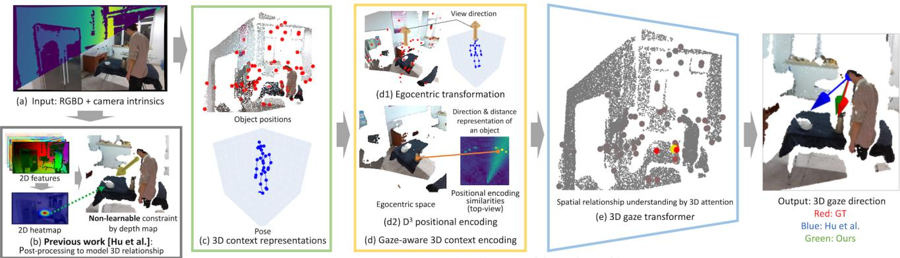  
Ours: Learning to model 3D relationship

Figure 1. (a) Our method estimates 3D gaze direction from an RGBD image and camera intrinsics. (b) Prior work [15] estimates gaze from 2D representations, incorporating 3D spatial cues only as a non-learnable post-processing step. (c) Since direct 3D gaze estimation from 2D representations is challenging, we use 3D pose and object positions as intermediate representations. (d) We introduce gaze-aware 3D context encoding (GA3CE), transforming the 3D context into a unified directional space. (d1) This space aligns with a egocentric (subject-centered) view, normalized relative to the head position and oriented to the view direction. (d2) This alignment enables the decomposition of a 3D point into direction and distance in egocentric space, with D3 positional encoding capturing their correlations. (e) The transformer then learns spatial relationships between the subject, objects, and 3D gaze.

## Abstract

We propose a novel 3D gaze estimation approach that learns spatial relationships between the subject and objects in the scene, and outputs 3D gaze direction. Our method targets unconstrained settings, including cases where close-up views of the subject’s eyes are unavailable, such as when the subject is distant orfacing away. Previous approaches typically rely on either 2D appearance alone or incorporate limited spatial cues using depth maps in the non-learnable post-processing step. Estimating 3D gaze direction from 2D observations in these scenarios is challenging; variations in subject pose, scene layout, and gaze direction, combined with differing camera poses, yield diverse 2D appearances and 3D gaze directions even when targeting the same 3D scene. To address this issue, we propose GA3CE: Gaze-Aware 3D Context Encoding. Our method represents subject and scene using 3D poses and object positions, treating them as 3D context to learn spatial relationships in 3D space. Inspired by human vision, we align this context in an egocentric space, signifi-

cantly reducing spatial complexity. Furthermore, we propose D3 (direction-distance-decomposed) positional encoding to better capture the spatial relationship between 3D context and gaze direction in direction and distance space. Experiments demonstrate substantial improvements, reducing mean angle error by 13%–37% compared to leading baselines on benchmark datasets in single-frame settings.

## 1. Introduction

Gaze direction is a powerful non-verbal cue for understanding human engagement, interest, and attention. Humans can often infer another person’s gaze direction based on various appearance cues, even when clear, close-up views of the eyes are not available, such as when the person is distant or facing away. This is possible because humans interpret gaze through cues like body pose and movement, scene context, and spatial relationships. Estimating 3D gaze direction in such unconstrained settings has a range of applications. Consider scenarios where wearable eye-tracking devices are impractical, such as detecting whether a pedestrian is attentive to traffic via a surveillance camera or analyzing customer engagement in a retail environment using video monitoring.

To estimate 3D gaze direction in these unconstrained settings, previous work has utilized cues that imply gaze direction, such as a subject’s temporal 3D direction [26]. Recently, depth maps have been incorporated to analytically constrain 3D gaze direction estimated from head appearance [15]. However, previous works overlook spatial relationships between the subject, scene, and gaze direction; scene context is not considered [26] or only considered during non-learnable, analytical step [15]. Therefore, an effective learning approach that holistically considers both subject and scene for 3D gaze estimation remains largely unexplored.

In this work, we propose a novel 3D gaze estimation approach that learns to understand the spatial relationship between the scene, subject, and gaze. Following the closest previous work [15], our method estimates 3D gaze direction given an RGB image, a depth map of the scene from a sensor or a zero-shot estimator, and camera intrinsics. In contrast to the gaze-following task which focuses on detecting the visible gazed point, our focus is to estimate the 3D direction of gaze. The task has orthogonal benefit to the gaze-following task, as it can output gaze information even when an attended point is not visible due to occlusion or being out of sight.

Estimating 3D gaze direction from 2D observations is challenging due to variations in 2D scene context and gaze direction. Even with identical 3D scenes, 2D appearances of the subject and scene, and ground truth gaze direction defined in camera space, change significantly with different camera poses, as each pose projects the 3D world differently onto a 2D image. This creates complex interactions between the relative positions of 2D features and 3D gaze directions across varying camera poses. Normalizing closeup 2D facial images with perspective correction to reduce appearance variation from different camera poses has been widely studied for 3D gaze estimation [31, 42]. However, the normalization beyond the subject’s 2D face appearance remains largely unexplored.

To address the complexity of 3D gaze estimation, we focus on three key challenges in this paper: (i) What is an effective representation of the subject and scene? (ii) How can variations in subject, scene, and gaze due to different camera poses be normalized? (iii) How can we model the spatial relationships among subject, scene, and gaze?

For (i), we represent the subject as 3D keypoints and the scene as 3D points corresponding to object positions. Instead of estimating 3D gaze direction directly from the 2D appearance of the subject and scene, these serve as robust intermediate 3D context representations. For (ii) and (iii), inspired by human vision studies [6, 8, 25] demonstrating that direction and distance to objects in the scene within subject’s view strongly influences gaze, we propose

GA3CE, for Gaze-Aware 3D Context Encoding. To address (ii), this intermediate 3D representation enables geometric transformation of 3D contexts relative to the subject’s view direction, such as prior gaze or head direction. This transformation as normalization reduces context variations across camera poses, creating a unified, egocentric space. To address (iii), we decompose the 3D context into direction and distance components for positional encoding, termed D3 positional encoding, which better captures positional and directional similarities. This decomposition, combined with a transformer-based architecture, models the spatial interactions between 3D context and the final 3D gaze direction. An overview of our method is shown in Fig. 1.

Experiments on three benchmark datasets demonstrate that our approach significantly outperforms previous methods, and an ablation study highlights the advantages of using a 3D representation with GA3CE for learning spatial relationships. Our contributions are summarized as follows:

1. We propose a novel approach for 3D gaze estimation based on an explicit understanding of the spatial relationships between a subject and objects in a 3D context.

2. We propose GA3CE, for Gaze-Aware 3D Context Encoding, to enhance the representation of the relationship between 3D context and gaze.

3. We achieve state-of-the-art quantitative and qualitative performance on three benchmark datasets [15, 19, 26].

## 2. Related Work

3D gaze estimation. Geometry-based 3D gaze estimation approaches have long been studied in computer vision. They use a 3D eye model to regress the 3D gaze direction based on geometric and optical characteristics of the eye’s appearance [12, 20], achieving high accuracy in direction estimation at the cost of requiring eye trackers.

Learning-based approaches that estimate the 3D gaze direction from a subject’s appearance have also been explored, from a close-up view of the face [9, 41, 43, 44] or under the unconstrained setting where the face is not clearly visible because the subject is facing backward [17]. More recent works [14, 15, 26] targets 3D gaze estimation in challenging scenarios where the subject is distant from the camera and captured under various camera poses.

In this paper, we also target the challenging scenario where we do not have a clear view of the subject’s facial features, and images are captured under diverse camera poses w.r.t. the subject, resulting in diverse subject’s appearances and 3D gaze directions.

Gaze estimation by context cues. Estimating 3D gaze based on context cues has been explored using optimizationbased methods with hand-crafted energy terms on temporal RGB(D) data, assuming known object positions and categories as context cues [3, 37, 38].

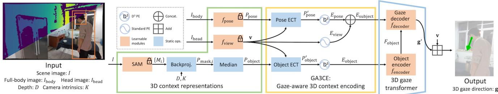  
Figure 2. Pipeline Overview. PE = positional encoding; ECT = egocentric transformation. First, we extract 3D pose and object positions as 3D context representations. To reduce their variation and better capture spatial relationships between 3D context and gaze direction, we apply GA3CE: gaze-aware 3D context encoding. Using egocentric transformation, we convert 3D context to a egocentric space, and encoding them into a high-dimensional feature space for direction and distance with $\mathrm { D ^ { 3 } }$ positional encoding. Finally, the 3D gaze transformer learns spatial relationships between the 3D context and gaze.

In learning-based approaches, previous works on 2D gazefollowing tasks, which localize the gazed point in an image, have proposed using various context cues, including body pose [10, 11], depth [7, 11, 33], objects [32, 35, 39], actions [39], and speech [13]. Some of these studies [11, 33, 35] estimate 3D gaze direction solely from head appearance as one of the context cues, while the other cues are used only for the final 2D gaze-following.

In 3D gaze estimation, prior work [26] utilizes motion cues by leveraging temporal appearances and 2D body flow. Another study [14] uses depth maps as 2D features to estimate 3D gaze direction as a prior for 3D gaze-following. The latest and the closest work to ours [15] estimates 3D gaze direction in a post-processing step using depth maps for directional constraints and gaze-following modules for 2D scene understanding.

In contrast, our approach directly learns to estimate 3D gaze direction by modeling the spatial relationships of 3D context, without relying on 2D gaze-following or postprocessing for 3D understanding. Furthermore, this paper proposes a unified approach that integrates 3D pose and object-level scene understanding for 3D gaze estimation, whereas the use of context cues has been limited to 2D gaze understanding in previous works.

## 3. Method

Given an RGB image I with the subject of interest, the corresponding depth map D from either a depth sensor or zero-shot depth estimator, and known camera intrinsics K for each image, our method estimates the subject’s 3D gaze direction $ { \mathbf { g } } \in \mathbb { S } ^ { 2 }$ . We assume 2D bounding boxes for the head $\mathbf { b } _ { \mathrm { h e a d } }$ and the full-body $\mathbf { b _ { \mathrm { b o d y } } }$ of the subject are provided, as in the previous works [15, 26].

Our approach is outlined in Fig. 2. First, we extract 3D human pose and object positions as 3D context representations (Sec. 3.1). Next, GA3CE strengthens the learning of spatial relationships between gaze direction and 3D context (Sec. 3.2). Finally, the 3D gaze transformer estimates gaze direction by modeling spatial relationships within the input context (Sec. 3.3).

## 3.1. 3D context representations

Subject representation. We represent the subject using 3D body keypoints as a pose, and a view direction as a 3D unit vector. Both body direction [26] and pose [37, 38] are closely related to gaze direction. Building on these insights, we incorporate 3D human pose estimation. Specifically, we use the pre-trained 3D human pose estimator [30], $f _ { \mathrm { p o s e } } ,$ which takes a single RGB image, $I _ { \mathrm { b o d y } }$ , cropped from I using $\mathbf { b } _ { \mathrm { b o d y } }$ , as input to estimate 3D keypoints. The output, $\bar { P _ { \mathrm { p o s e } } } = \bar { f } _ { \mathrm { p o s e } } ( \bar { I _ { \mathrm { b o d y } } } ) \in \mathbb { R } ^ { N _ { \mathrm { p o s e } } \times 3 }$ , represents the keypoints in camera space, where $N _ { \mathrm { p o s e } }$ is the number of keypoints. Since the estimator’s output scale and translation may not align precisely with the input depth map D, a depth-aware human pose estimator [45] or learning-based post-processing [1] could be considered. However, these approaches are costly to train across varying depth maps or require resourceintensive refinement steps. Instead, we use the human pose estimator trained on large-scale RGB datasets, which generalizes effectively across domains. In practice, we observed the proposed pipeline adapting to different scales and translations between 3D poses and depth maps without issue. Following the previous work [15], we use the pre-trained appearance-based estimator $f _ { \mathrm { v i e w } }$ to estimate the view direction $\mathbf { v } = f _ { \mathrm { v i e w } } ( I _ { \mathrm { h e a d } } ) \in \mathbb { S } ^ { 2 }$ as a directional prior. The input is the subject’s head image $I _ { \mathrm { h e a d } }$ , cropped from I using $\mathbf { b } _ { \mathrm { h e a d } }$

Object representation. The presence of objects in a scene can substantially influence the direction of a subject’s gaze [3, 35, 37, 38]. Previous studies, however, either assume known 3D object positions or require 2D instance annotations for training, and are often limited to specific categories. To address these limitations, we use the Segment Anything (SAM) framework [18] to sample object positions in the scene, visualized in Fig. 3.

We represent object positions $P _ { \mathrm { o b j e c t } } \in \mathbb { R } ^ { N _ { \mathrm { o b j e c t } } \times 3 }$ as their 3D coordinates in the scene, where $N _ { \mathrm { o b j e c t } }$ is the number of detected objects. For each i-th object, we first obtain a 2D instance mask $M _ { i }$ from SAM. We then backproject $M _ { i }$ into camera space as 3D points $P _ { \mathrm { m a s k } , i }$ using the camera intrinsics K and corresponding depth values based on the pinhole camera model. The object positions $P _ { \mathrm { o b j e c t } }$ are determined by taking the median of these 3D points $P _ { \mathrm { m a s k } , i }$

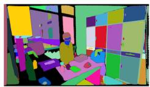  
(a) RGB input  
(b) Instance masks

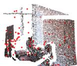  
(c) Object positions  
Figure 3. Illustration of object position sampling using the segmenteverything approach [40]. This method comprehensively identifies object positions in the scene, shown as red points in (c). The colored point cloud is shown for visualization purposes only.

The original SAM [18] typically requires 2D points as prompts to sample instance masks, where mask granularity depends on the density of 2D points in the image. To comprehensively sample objects of varying sizes, the previous work [27] employs multi-resolution point sampling as a few-shot process. To simplify this, we use MobileSAM [40], which provides exhaustive instance masks through a segment-everything approach in a single shot. Note that we do not consider object appearance features in this study. Including category-agnostic semantic features, such as CLIP [28], is left for future work.

## 3.2. Gaze-aware 3D context encoding (GA3CE)

The subject’s 3D pose, object positions, and gaze direction form a complex interaction. To effectively model this relationship, we propose a novel 3D context encoding approach tailored for understanding 3D gaze direction.

A key insight is that gaze fixations tend to focus around the center of one’s view, with depth information enhancing gaze saliency prediction in first-person perspectives [6, 8, 25]. This indicates that the direction and distance of objects relative to the subject’s view are strong cues for estimating gaze direction. Guided by this idea, we (1) normalize the 3D positions of objects $P _ { \mathrm { o b j e c t } }$ and the 3D pose $P _ { \mathrm { p o s e } }$ within a geometrically aligned, egocentric 3D coordinate space, and (2) decompose them into direction and distance components for positional encoding.

Egocentric transformation. Unlike the previous works that focus solely on 2D features [15, 26, 35], our approach explicitly considers a 3D representation of the input. This enables us to align the input context to an egocentric space, simplifying the complex relationship between input contexts and the output 3D gaze direction due to varying camera poses. Without this geometric normalization, the network would need to learn these complex combinations.

We normalize the 3D pose and object positions to be relative to the head position of the subject. Specifically, we normalize the 3D pose $P _ { \mathrm { p o s e } }$ relative to the head position $\mathbf { t } _ { \mathrm { p o s e } } \in \mathbb { R } ^ { 3 }$ and scale it using head width $s \in \mathbb { R } ^ { + }$ . Additional details are provided in Supp. A.1. Object positions $P _ { \mathrm { o b j e c t } }$ are also normalized relative to the camera center, adjusting them to be relative to the subject’s head position $\mathbf { t } _ { \mathrm { o b j e c t } } \in$ $\mathbb { R } ^ { 3 }$ , determined via backprojection using the center of the head bounding box $\mathbf { b } _ { \mathrm { h e a d } } .$ , corresponding depth, and camera intrinsics K. Note that both $\bf t _ { \mathrm { p o s e } }$ and $\mathbf { t _ { \mathrm { o b j e c t } } }$ represent head position but differ in value, with one derived from $P _ { \mathrm { p o s e } }$ and the other from the depth map D.

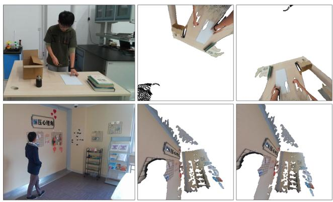  
(a) RGB input  
(b) Axis-angle rotation  
(c) Cyclotorsion rotation  
Figure 4. Visualization of geometric normalization in 3D context through the egocentric transformation. (b) and (c) show 2D renderings of the colored point cloud after applying the egocentric transformation with different rotation normalizations. Note that, for intuitive visualization of the figure, we used the colored point cloud and its 2D rendering instead of the 3D pose and object positions. They are used solely for visualization purpose.

Next, we align the rotation of the 3D pose and object positions by deriving a rotation $R \in { \bf S O } ( 3 )$ so that the subject’s view direction v in camera space aligns with the fixed direction ${ \bf z } = R { \bf v } = [ 0 , 0 , 1 ]$ . This egocentric transformation is visualized in Fig. 4. The rotation can be derived as an axis-angle rotation around the axis $\textbf { z } \times \textbf { v }$ by $\operatorname { a r c c o s } ( \mathbf { z } ^ { T } \mathbf { v } )$ However, this method results in inconsistent rotation along the z-axis depending on v, as illustrated in Fig. 4 (b). A mathematical explanation is provided in Supp. A.3. Inspired by cyclotorsion, the reactive eye movement that counteracts the head tilt to keep the horizontal axis of vision aligned with the horizon, we propose a modified approach called cyclotorsion rotation. Assuming that the horizon appears horizontal in the image I, then the rotation R is defined as:

$$
R = \operatorname { E u l e r } ( \theta , \phi , 0 ) \in \operatorname { S O } ( 3 ) \operatorname { s . t . } \operatorname* { m i n } _ { \theta , \phi } \left\| R \mathbf { v } - \mathbf { z } \right\| .\tag{1}
$$

Details and the analytical solution are provided in Supps. A.2 and A.4. Cyclotorsion rotation achieves more consistent egocentric transformation, as shown in Fig. 4 (c).

In summary, the egocentric transformation for view direc-

(a) Standard positional encoding  
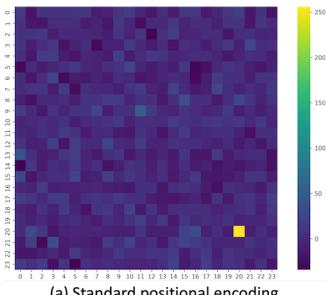

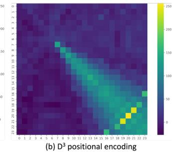  
Figure 5. 2D visualization of $\mathrm { D } ^ { 3 }$ positional encoding. Each point on a grid shows a dot product between the encoded reference point $\mathbf { x } _ { \mathrm { r e f } } = \left( 2 0 , 2 0 \right)$ ) and an encoded point $\textbf { x } \in { \Omega }$ on a 2D grid as an unnormalized similarity score. (a) shows the standard positional encoding [34], where similarity is high only at the reference point $\bf { x } _ { \mathrm { r e f } }$ itself. (b) displays the proposed ${ \bar { \mathbf { D } } } ^ { 3 }$ positional encoding, capturing both positional and directional similarities defined as $\tilde { \gamma } ( \mathbf { x } _ { \mathrm { r e f } } - \mathbf { c } ) ^ { T } \tilde { \gamma } ( \mathbf { x } - \mathbf { c } )$ , given $\mathbf { c } = ( 6 , 6 )$ as the origin. This creates a radial gaze pattern from the origin c toward the reference point $\mathbf { x } _ { \mathrm { r e f } }$ , with similarity gradually increasing along the direction and distance from the origin, simulating a gaze effect.

tion v, pose $P _ { \mathrm { p o s e } }$ and object positions $P _ { \mathrm { o b j e c t } }$ reads:

$$
\begin{array} { r } { \mathbf { v } ^ { \prime } = \mathbf { z } = R \mathbf { v } \qquad } \\ { P _ { \mathrm { p o s e } } ^ { \prime } = s R ( P _ { \mathrm { p o s e } } - \mathbf { t } _ { \mathrm { p o s e } } ) \qquad } \\ { P _ { \mathrm { o b j e c t } } ^ { \prime } = R ( P _ { \mathrm { o b j e c t } } - \mathbf { t } _ { \mathrm { o b j e c t } } ) . } \end{array}\tag{2}
$$

Note that there exist exocentric-to-egocentric view synthesis methods which learns transformation from ego-exo images [22–24] or leverages known transformations [4]. In contrast, our egocentric transformation neither requires training nor assumes a known transformation.

$\mathbf { D } ^ { 3 }$ positional encoding. The 3D direction and distance information in a subject’s view significantly influence human attention [6, 8, 25]. Thus, we hypothesize that features explicitly capturing similarities in both direction and distance improve 3D gaze estimation. With this idea, we introduce $\mathrm { D ^ { 3 } } ^ { \mathrm { \bar { } } }$ (direction-distance-decomposed) positional encoding.

We employ the commonly used sinusoidal functions [34] as our standard positional encoding γ. We define the $\mathrm { D ^ { 3 } }$ positional encoding of a 3D point p as $\begin{array} { r } { \widetilde \gamma ( \mathbf { p } ) = \gamma ( \frac { \mathbf { p } } { \left\| \mathbf { p } \right\| } ) \oplus \gamma ( \left\| \mathbf { p } \right\| ) } \end{array}$ where ⊕ denotes vector concatenation. We compare the standard positional encoding with the proposed $\mathrm { D ^ { 3 } }$ positional encoding in Fig. 5. For simplicity, we denote the standard and $\mathrm { D ^ { 3 } }$ positional encodings applied to each point in the set P as $\gamma ( P )$ and $\tilde { \gamma } ( P )$ , respectively. Thus, the positional encodings for view direction, pose, and objects are:

$$
\begin{array} { r l } & { E _ { \mathrm { v i e w } } = \gamma _ { \mathrm { v i e w } } ( \mathbf { v } ^ { \prime } ) \in \mathbb { R } ^ { C _ { \mathrm { g a z e } } } } \\ & { E _ { \mathrm { p o s e } } = \tilde { \gamma } _ { \mathrm { p o s e } } ( P _ { \mathrm { p o s e } } ^ { \prime } ) \in \mathbb { R } ^ { N _ { \mathrm { p o s e } } \times C _ { \mathrm { k e y p o i n t } } } } \\ & { E _ { \mathrm { o b j e c t } } = \tilde { \gamma } _ { \mathrm { o b j e c t } } ( P _ { \mathrm { o b j e c t } } ^ { \prime } ) \in \mathbb { R } ^ { N _ { \mathrm { o b j e c t } } \times C _ { \mathrm { l a t e n t } } } } \end{array}\tag{3}
$$

where $C _ { * }$ is the dimension of the encoded embedding. Note that although $E _ { \mathrm { v i e w } }$ remains constant when applying normalization, where $\mathbf { v } ^ { \prime } = \mathbf { z } = R \mathbf { v }$ as defined in Eq. (2), we still apply positional encoding to ensure architectural consistency in the ablation study Sec. 4.4 without normalization, where $\mathbf { v } ^ { \prime } = \mathbf { v }$ and $E _ { \mathrm { v i e w } }$ is not constant. Details of $\gamma _ { \mathrm { v i e w } }$ , γ˜pose, and $\tilde { \gamma } _ { \mathrm { o b j e c t } }$ can be found in Supp. B.1. Note that the 3D points $P _ { \mathrm { p o s e } } ^ { \prime }$ and $\boldsymbol { P _ { \mathrm { o b j e c t } } ^ { \prime } }$ are relative to their respective head positions $\bf t _ { \mathrm { p o s e } }$ and $\mathbf { t _ { \mathrm { o b j e c t } } }$ , allowing $\mathrm { D ^ { 3 } }$ positional encoding to represent high-dimensional direction and distance embedding relative to the head position. We define the subject embedding as $E _ { \mathrm { s u b j e c t } } = E _ { \mathrm { v i e w } } \oplus E _ { \mathrm { p o s e } } \in \mathbb { R } ^ { C _ { \mathrm { l a t e n } } }$ t , where $E _ { \mathrm { p o s e } }$ is flattened for concatenation to form a 1D embedding of size $C _ { \mathrm { p o s e } } = N _ { \mathrm { p o s e } } \times C _ { \mathrm { k e y p o i n t } }$ , and $C _ { \mathrm { l a t e n t } } = C _ { \mathrm { g a z e } } + C _ { \mathrm { p o s e } }$

## 3.3. 3D gaze transformer

To capture the relationship between the subject and objects, we use a transformer architecture [36]. Detailed descriptions of the encoder and decoder components can be found in [36]. The transformer encoder, $f _ { \mathrm { e n c o d e r } } .$ , employs $N _ { \mathrm { e n c o d e r } }$ layers of self-attention and non-linear transformations to encode object features $F _ { \mathrm { o b j e c t } }$ from the object embedding $E _ { \mathrm { o b j e c t } }$ . The transformer decoder, $f _ { \mathrm { d e c o d e r } } ,$ applies $N _ { \mathrm { d e c o d e r } }$ layers of selfattention, non-linear transformations, and cross-attention to decode the residual 3D gaze direction $\mathbf { g } ^ { \prime }$ in an egocentric space. In the cross-attention, the subject embedding $E _ { \mathrm { s u b j e c t } }$ is the query, and the object feature $F _ { \mathrm { o b j e c t } }$ serves as both key and value, producing the gaze feature as a weighted sum of relevant object features. This allows the model to focus on the relevant object positions.

Finally, the 3D gaze direction g is obtained by reversing the normalization: $\mathbf { g } = R ^ { T } \mathbf { g } ^ { \prime } + \mathbf { v }$ . We normalize g to have unit length. Architecture details can be found in Supp. B.2.

We train the transformer network by minimizing the angular error between the predicted 3D gaze direction g and the ground truth gGT, defined as $\mathcal { L } = \operatorname { a r c c o s } ( \mathbf { g } ^ { T } \mathbf { g } _ { \mathrm { G T } } )$

## 3.4. Implementation details

We use a pre-trained model for each dataset as the view direction estimator $f _ { \mathrm { v i e w } }$ . More details on $f _ { \mathrm { v i e w } }$ are provided in Sec. $4 .$ The weights of the SAM module [40], $f _ { \mathrm { v i e w } } ,$ and the 3D human pose estimator $f _ { \mathrm { p o s e } } \left[ 3 0 \right]$ are frozen and remain unchanged during training. We set $N _ { \mathrm { p o s e } } ~ = ~ 1 5 ,$ while $N _ { \mathrm { o b j e c t } }$ depends on the number of instances detected by MobileSAM in each input. The embedding dimensions are set as follows: $C _ { \mathrm { l a t e n t } } = 2 5 6 , C _ { \mathrm { g a z e } } = 1 0 6$ , and $C _ { \mathrm { k e y p o i n t } } =$ 10. The object encoder $f _ { \mathrm { e n c o d e r } }$ and gaze decoder fdecoder each consist of $N _ { \mathrm { e n c o d e r } } = 3$ transformer encoder layers and $N _ { \mathrm { d e c o d e r } } = 3$ transformer decoder layers, respectively. We train the network for 20 epochs on a single A10G GPU, using the AdamW optimizer with a learning rate of 0.0014. Further details are provided in Supp. B.3.

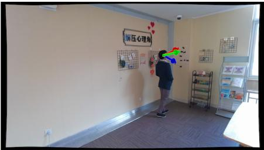

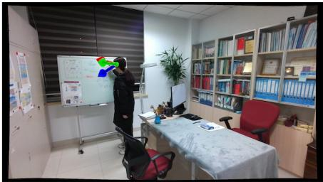

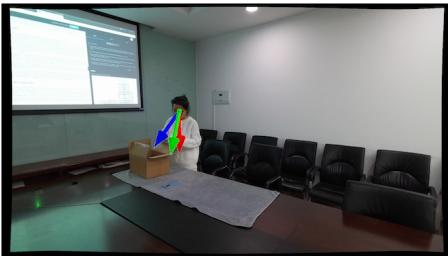

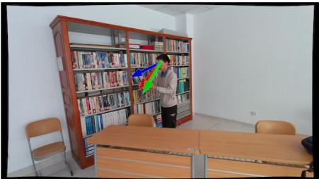

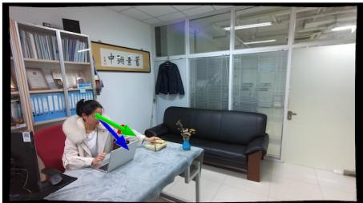

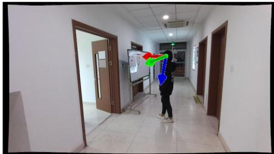  
Figure 6. Qualitative results on the GFIE dataset [15]. Red, green, and blue arrows indicate the ground truth, Ours, and GFIE [15].

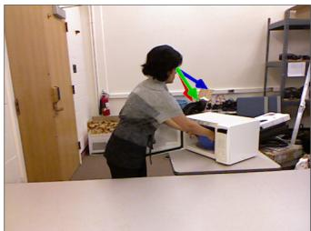

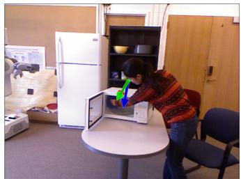

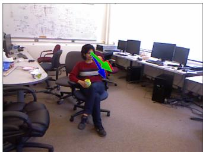

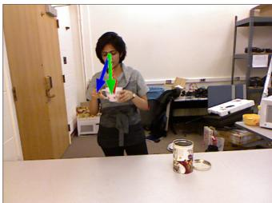  
Figure 7. Qualitative results on the CAD-120 dataset [19]. Red, green, and blue arrows shows the ground truth, Ours + GFM, and GFIE [15].

<table><tr><td>Method</td><td></td><td>Input 2D gaze AUC ↑ L2 Dist. ↓ 3D Dist. ↓ 3D MAE↓</td><td></td><td></td><td></td><td></td></tr><tr><td>Random</td><td></td><td></td><td>0.585</td><td>0.425</td><td>2.930</td><td>84.4</td></tr><tr><td>Center</td><td></td><td></td><td>0.614</td><td>0.287</td><td>2.510</td><td>87.2</td></tr><tr><td>Rt-Gene [9]</td><td>H</td><td></td><td>0.823</td><td>0.123</td><td>0.552</td><td>21.0</td></tr><tr><td>Gaze360 [17]</td><td>H</td><td></td><td>0.821</td><td>0.130</td><td>0.540</td><td>19.8</td></tr><tr><td>GazeFollow [29]</td><td>SD</td><td>√</td><td>0.941</td><td>0.131</td><td>0.856</td><td>41.5</td></tr><tr><td>Lian [21]</td><td>SD</td><td>√</td><td>0.962</td><td>0.091</td><td>0.542</td><td>26.7</td></tr><tr><td>Chong [5]</td><td>SD</td><td>√</td><td>0.972</td><td>0.069</td><td>0.455</td><td>20.8</td></tr><tr><td>GFIE [15]</td><td>SD</td><td>√</td><td>0.965</td><td>0.065</td><td>0.311</td><td>17.7</td></tr><tr><td>GFIE [15] + 3D</td><td>SD</td><td>√</td><td>0.978</td><td>0.062</td><td>0.341</td><td>16.4</td></tr><tr><td>Ours</td><td>SD</td><td></td><td>-</td><td>-</td><td>1</td><td>11.1</td></tr><tr><td>Ours*</td><td>SD</td><td></td><td></td><td></td><td></td><td>12.3</td></tr><tr><td>Ours + GFM [15]</td><td>SD</td><td>√</td><td>0.987</td><td>0.067</td><td>0.260</td><td>10.6</td></tr></table>

Table 1. Results on the GFIE dataset [15]. We denote the input modalities as follows: H = head image only; SD = scene image with depth map. Ours + GFM denotes using the gaze following modules of [15] to refine the estimated 3D gaze direction. A check mark indicates the method requires 2D gaze following; otherwise, it directly estimates 3D gaze direction. Ours\* uses a depth map from the zero-shot estimator [2].

## 4. Experiments

Dataset. This paper utilizes three publicly available benchmark datasets: the GFIE dataset [15], the CAD-120 dataset [19], and the GAFA dataset [26]. The GFIE dataset [15] includes 72K images of subjects in indoor scenes engaging in various activities, often interacting with nearby objects, such as through physical contact or proximity to objects they gaze at. Subjects are instructed to look at specified points within the scene during these activities.

<table><tr><td>Method</td><td colspan="3">AUC ↑ L2 Dist. ↓ 3D Dist. ↓ 3D MAE↓</td></tr><tr><td></td><td colspan="3">w/o GFM</td></tr><tr><td>GFIEhead [15]</td><td></td><td></td><td>27.3</td></tr><tr><td>Ours</td><td></td><td></td><td>25.2</td></tr><tr><td></td><td colspan="3">w/GFM</td></tr><tr><td>GFIE [15]</td><td>0.921</td><td>0.114 0.365</td><td>19.8</td></tr><tr><td> $\mathbf { \mathrm { O u r s } } + \mathbf { \mathrm { G F M } }$ </td><td>[15] 0.921</td><td>0.114 0.317</td><td>15.8</td></tr></table>

Table 2. Quantitative results on the CAD-120 dataset [19]. Models are trained on the GFIE dataset [15]. $\mathrm { G F I E } _ { \mathrm { h e a d } }$ uses only the head image as input without GFM [15]. Additional results are provided in Supp. C.2.

The CAD-120 dataset [19], containing 1.7K images of similar activities, is used to evaluate the generalization of models trained on the GFIE dataset to unseen scenes with different camera settings. Both datasets have visible gaze targets in the images. Following [15], we use real depth maps. We also test depth maps from the zero-shot metric depth estimator [2].

To test our method in more challenging scenarios, we use the GAFA dataset [26], which includes 882K images from four indoor and one outdoor environment. In this dataset, subjects move freely, searching for specified objects in scenes where interaction with objects is less frequent, and gaze targets may not always be visible. As it lacks depth maps, we generate them using the same zero-shot depth estimator [2].

Baselines. In our evaluation on the GFIE dataset [15] and the CAD-120 dataset [19], we compare our method with the baseline approach presented in [15], referred to as GFIE. First, the appearance-based estimator predicts the 3D gaze direction as a directional prior from the head image. We use the same estimator as $f _ { \mathrm { v i e w } }$ for the GFIE and the CAD-120 datasets, with its output serving as the view direction v. Then, a 2D gaze-following module generates a heatmap of the gazed point using RGB and depth inputs. A final nontrainable 3D module aligns this with the 3D gaze direction by computing pixel directions from the head’s 3D position and selecting the one closest to the initial gaze estimate. In this paper, we abbreviate the 2D/3D gaze-following modules as GFM. We also report other baseline results from [15] for comparison: Random, Center, head-appearance-based approaches [9, 17], and 2D gaze-following approaches [5, 21, 29]. See [15] for details on these baselines.

For the GAFA dataset [26], we also benchmark against the method proposed in [26], termed $\mathrm { G A F A _ { t e m p o r a l } }$ . First, the appearance-based estimator predicts 3D head and body directions as directional priors from temporal frames, using a total of seven frames: the target frame, along with three future and three past frames. Each frame includes the subject’s full-body RGB image, head position mask, and 2D flow of the body center. On the GAFA dataset, we use this estimator as $f _ { \mathrm { v i e w } } ,$ , aligning with $\mathrm { G A F A _ { t e m p o r a l } }$ . A temporal aggregation module then combines all frames to yield the final 3D gaze direction. We refer to GAFA as the singleframe input version, where seven identical target frames are used as input to simulate the single-frame condition. We also include other baseline results from [26]: Fixed bias and head-appearance-based methods [17, 41]. Refer to [26] for further baseline details.

Architecture details of the appearance-based estimator for each dataset are provided in Supp. B.4.

To ensure a fair comparison, we report results for the baseline GFIE and GAFA with additional inputs, $P _ { \mathrm { p o s e } }$ and $\boldsymbol { P _ { \mathrm { o b j e c t } } } ,$ , referred to as $G F I E + 3 D$ and $G A F A + 3 D ,$ , respectively. Further details are provided in Supp. B.6.

Metrics. We primarily evaluate methods using the 3D mean angular error (MAE) between predicted and ground truth 3D gaze directions. For the GFIE and the CAD-120 datasets, we additionally report AUC [16], L2 distance, and 3D distance to measure error between predicted and ground truth gazed points based on 2D gaze-following results, when 2D gaze point estimation is available, following the previous work [15]. For detailed metric descriptions, refer to [15]. Note that improving 2D gaze-following performance is not the main focus of this paper. For the GAFA dataset [26], we also report 2D MAE, calculated using only the x and y components of the 3D gaze direction, for consistency with the previous work [26].

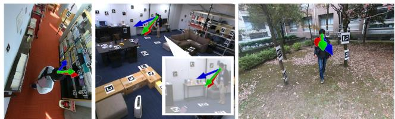  
Figure 8. Qualitative results on the GAFA dataset [26]. Red, green, and blue arrows indicate the ground truth, Ours, and GAFA [26].

<table><tr><td>Method</td><td>Input</td><td>Office</td><td>LR</td><td>Kitchen</td><td>Library</td><td>Courtyard</td><td>All</td></tr><tr><td>Fixed bias</td><td></td><td>88.0/76.0</td><td>85.5/76.7</td><td>86.0/82.4</td><td>89.0/85.1</td><td>89.7/88.7</td><td>88.1/79.7</td></tr><tr><td>Gaze360 [17]</td><td>SBI</td><td>24.0/19.2</td><td>41.1/31.3</td><td>32.4/21.2</td><td>27.5/20.7</td><td>28.2/28.3</td><td>30.4/24.5</td></tr><tr><td>XGaze [41]</td><td>SBI</td><td>24.2/23.0</td><td>42.0/40.9</td><td>23.3/22.9</td><td>24.6/22. .3</td><td>30.2/31.9</td><td>29.2/28.4</td></tr><tr><td> $\mathrm { G A F A _ { t e m p o r a l } } \left[ 2 6 \right]$ </td><td>TBI</td><td>14.4/14.3</td><td>25.1/22.6</td><td>20.4/19.6</td><td>19.8/18.4</td><td>25.4/26.9</td><td>21.7/20.9</td></tr><tr><td>GAFA [26]</td><td>SBI</td><td>16.1/15.8</td><td>26.0/23.2</td><td>21.1/20.5</td><td>20.9/19.5</td><td>27.2/28.5</td><td>22.9/22.1</td></tr><tr><td>GAFA [26] + 3D</td><td>SSD</td><td>20.5/20.3</td><td>20.6/19.3</td><td>16.3/16.3</td><td>28.5/29.2</td><td>24.4/23.5</td><td>22.8/22.4</td></tr><tr><td>Ours</td><td>SSD</td><td>13.5/13.1</td><td>21.9/23.9</td><td>16.9/16.9</td><td>17.3/16.3</td><td>26.2/28.6</td><td>19.9/20.6</td></tr></table>

Table 3. Quantitative results on the GAFA dataset [26]. Input modalities are denoted as follows: the first letter indicates frame type (S = single; T = temporal), the second denotes image type (H = head; B = full-body; S = scene), and the third represents modality (I = image-only; D = depth features).

## 4.1. Results on the GFIE dataset [15]

We present the quantitative performance in Tab. 1. Without 2D gaze-following, our approach significantly outperforms all baselines in 3D MAE, achieving a 37% improvement over the leading baseline GFIE [15]. Ours\*, which uses a depth map from a zero-shot estimator [2], performs comparably. Additionally, when combined with the gaze-following modules, Ours + GFM [15] outperforms GFIE across most metrics. It is important to note that the primary focus of this paper is enhancing 3D gaze direction estimation, rather than improving gaze-following. Qualitative results are shown in Fig. 6. Even in challenging scenarios where the subject’s face is not visible, our method provides more accurate 3D gaze direction estimates than GFIE.

## 4.2. Results on the CAD-120 dataset [19]

We evaluated the generalization capability of models trained on the GFIE dataset [15] by testing them on the CAD-120 dataset [19]. Quantitative results are presented in Tab. 2. In both cases, with and without GFM, our approach outperforms the baselines, demonstrating superior generalizability in unseen scenes with different camera settings. Qualitative results are shown in Fig. 7. Even in challenging scenarios where the subject’s face is unclear, our method estimates 3D gaze more accurately than GFIE. Results with the other baselines are discussed in Supp. C.2.

## 4.3. Results on the GAFA dataset [26]

The quantitative performance is presented in Tab. 3, where our method consistently outperforms all baselines, achieving an average improvement of 13% in 3D MAE and 7% in 2D MAE over the leading baseline GAFA [26], in the single-frame setting. Qualitative results are shown in Fig. 8, demonstrating that our approach estimates 3D gaze direction more accurately than GAFA in challenging scenarios, including backward-facing subjects, subjects far from the cameras, extreme camera angles, and cases where the gazed target is outside the camera’s field of view.

<table><tr><td>Method</td><td></td><td>GFIE [15] GAFA [26]</td></tr><tr><td>Appearance</td><td>19.4</td><td>22.9</td></tr><tr><td>Appearance + Pose</td><td>13.1</td><td>20.3</td></tr><tr><td> ${ \mathrm { A p p e a r a n c e } } + { \mathrm { P o s e } } + { \mathrm { O b j e c t } }$ </td><td>11.1</td><td>19.9</td></tr></table>

Table 4. Quantitative results on the effect of 3D pose and object positions in 3D MAE.

## 4.4. Ablation studies

Effect of 3D understanding of pose and objects. We evaluate the impact of incorporating 3D understanding of both pose and objects, as shown quantitatively in Tab. 4. Appearance refers to models that rely solely on the subject’s appearance as input, without incorporating 3D context. Model details are provided in Supp. B.7. First, we incorporate 3D pose as an additional context cue for the subject, following a setup similar to GAFA [26]. We then include object positions as a scene-level context cue, complementing the subject’s context cues, inspired by GFIE [15].

Results for the model that combines appearance with 3D pose $P _ { \mathrm { p o s e } } ,$ denoted as Appearance + Pose in Tab. 4, show performance improvements in both the GFIE and the GAFA datasets. To isolate the effect of object features, we use a constant vector as the source sequence for $f _ { \mathrm { d e c o d e r } }$ . The Appearance + Pose + Object configuration, which incorporates both 3D pose and object positions, yields even better accuracy, particularly on the GFIE dataset compared to the GAFA dataset. This difference may stem from the GAFA dataset’s challenging scenarios where subjects interact less with objects than in the GFIE dataset, yet the performance improvements are still observed by considering objects.

Performance gains are especially pronounced when the subject is closer to the gazed objects, as illustrated in the leftmost image of Fig. 8. We visualize the decoder’s attention to object positions $P _ { \mathrm { o b j e c t } }$ in Fig. 9. The leftmost figure in each triplet highlights object positions with strong attention values, determined by the 95th percentile threshold. In the GFIE dataset, objects close to the ground-truth 3D gaze point (colored yellow) receive high attention. In the GAFA dataset [26], while more diverse than the GFIE dataset [15], object positions around the ground-truth gaze direction also exhibit strong attention, suggesting that nearby object positions significantly impact the final gaze estimation.

Effect of 3D context representations. We analyze the impact of GA3CE. Quantitative results are presented in Tab. 5. The top rows demonstrate the influence of GA3CE, showing that simply adding 3D representations without the proposed context encoding does not achieve optimal performance. Similar findings are observed for the baseline methods, GFIE + 3D and GAFA + 3D, in Tab. 1 and Tab. 3, where adding 3D representation alone yields only modest improvement. The bottom rows of Tab. 5 provide further analysis, showing that disabling each component reduces performance, while enabling all components results in the best performance.

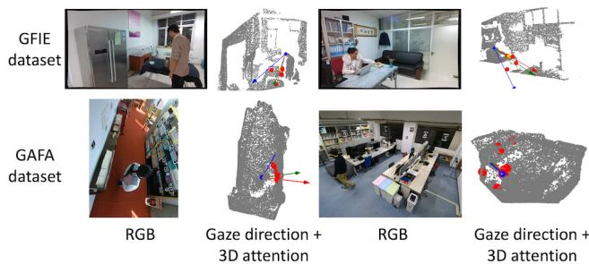  
Figure 9. Visualization of decoder attention to object positions $P _ { \mathrm { o b j e c t } } .$ In each pair, left image shows the input RGB image, and the right image shows the object positions with strong attention values and overlaid gaze directions. A yellow dot indicates the ground truth 3D gazed point in the GFIE dataset [15]. Red, green, and blue arrows indicate the 3D gaze direction of the ground truth, Ours, and the baseline GFIE for the GFIE dataset [15] and the baseline GAFA for the GAFA dataset [26], respectively.

<table><tr><td>Method</td><td>GFIE [15] GAFA [26]</td></tr><tr><td>Appearance 19.4</td><td>22.9</td></tr><tr><td>Appearance + 3D 18.9</td><td>21.2</td></tr><tr><td>Appearance + 3D + GA3CE 11.1</td><td>19.9</td></tr><tr><td>No egocentric transformation 14.2</td><td>20.8</td></tr><tr><td>No cyclotorsion rotation 12.1</td><td>20.1</td></tr><tr><td>No  $\mathrm { D ^ { 3 } }$  positional encoding 12.9</td><td>20.9</td></tr><tr><td>All 11.1</td><td>19.9</td></tr></table>

Table 5. Quantitative results on the impact of GA3CE in 3D MAE. In the top rows, 3D indicates using pose and objects as 3D context input besides view direction. In the bottom rows, the proposed techniques in GA3CE is disabled one at a time, and All means enabling all of them.

## 5. Conclusion

We propose a novel 3D gaze estimation framework that models the spatial relationship between a subject’s 3D pose and object positions in the scene. Central to our approach is GA3CE, gaze-aware 3D context encoding with two key components: egocentric transformation that normalizes 3D context input to a subject-centric space, and $\mathrm { D ^ { 3 } }$ positional encoding that effectively captures the directional and distance relationships between 3D context and 3D gaze. We show that GA3CE substantially improves reasoning about gaze direction in 3D space. Extensive evaluations on three benchmark datasets demonstrate that our method consistently outperforms leading baselines in challenging scenarios.

## References

[1] Bashirov, R., Ianina, A., Iskakov, K., Kononenko, Y., Strizhkova, V., Lempitsky, V., Vakhitov, A.: Real-time rgbd-based extended body pose estimation. In: Proceedings of the IEEE/CVF Winter Conference on Applications of Computer Vision (2021) 3

[2] Bhat, S.F., Birkl, R., Wofk, D., Wonka, P., Muller, M.:¨ Zoedepth: Zero-shot transfer by combining relative and metric depth. arXiv preprint arXiv:2302.12288 (2023) 6, 7

[3] Brau, E., Guan, J., Jeffries, T., Barnard, K.: Multiplegaze geometry: Inferring novel 3d locations from gazes observed in monocular video. In: Proceedings of the European Conference on Computer Vision (2018) 2, 3

[4] Cheng, F., Luo, M., Wang, H., Dimakis, A., Torresani, L., Bertasius, G., Grauman, K.: 4diff: 3d-aware diffusion model for third-to-first viewpoint translation. In: European Conference on Computer Vision. pp. 409– 427. Springer (2024) 5

[5] Chong, E., Wang, Y., Ruiz, N., Rehg, J.M.: Detecting attended visual targets in video. In: Proceedings of the IEEE/CVF conference on computer vision and pattern recognition (2020) 6, 7

[6] Einhauser, W., Spain, M., Perona, P.: Objects predict¨ fixations better than early saliency. Journal of vision 8(14) (2008) 2, 4, 5

[7] Fang, Y., Tang, J., Shen, W., Shen, W., Gu, X., Song, L., Zhai, G.: Dual attention guided gaze target detection in the wild. In: Proceedings of the IEEE/CVF conference on computer vision and pattern recognition (2021) 3

[8] Findlay, J.M., Gilchrist, I.D.: Active vision: The psychology of looking and seeing. No. 37, Oxford University Press (2003) 2, 4, 5

[9] Fischer, T., Chang, H.J., Demiris, Y.: Rt-gene: Realtime eye gaze estimation in natural environments. In: Proceedings of the European conference on computer vision (2018) 2, 6, 7

[10] Guan, J., Yin, L., Sun, J., Qi, S., Wang, X., Liao, Q.: Enhanced gaze following via object detection and human pose estimation. In: MultiMedia Modeling: 26th International Conference, MMM 2020, Daejeon, South Korea, January 5–8, 2020, Proceedings, Part II 26. pp. 502–513. Springer (2020) 3

[11] Gupta, A., Tafasca, S., Odobez, J.M.: A modular multimodal architecture for gaze target prediction: Application to privacy-sensitive settings. In: Proceedings of the IEEE/CVF Conference on Computer Vision and Pattern Recognition. pp. 5041–5050 (2022) 3

[12] Hennessey, C., Noureddin, B., Lawrence, P.: A single camera eye-gaze tracking system with free head motion. In: Proceedings of the 2006 symposium on Eye tracking research & applications (2006) 2

[13] Hou, Y., Zhang, Z., Horanyi, N., Moon, J., Cheng, Y., Chang, H.J.: Multi-modal gaze following in conversational scenarios. In: Proceedings of the IEEE/CVF Winter Conference on Applications of Computer Vision. pp. 1186–1195 (2024) 3

[14] Hu, Z., Yang, D., Cheng, S., Zhou, L., Wu, S., Liu, J.: We know where they are looking at from the rgb-d camera: Gaze following in 3d. IEEE Transactions on Instrumentation and Measurement 71, 1–14 (2022) 2, 3

[15] Hu, Z., Yang, Y., Zhai, X., Yang, D., Zhou, B., Liu, J.: Gfie: A dataset and baseline for gaze-following from 2d to 3d in indoor environments. In: Proceedings of the IEEE/CVF Conference on Computer Vision and Pattern Recognition (2023) 1, 2, 3, 4, 6, 7, 8

[16] Judd, T., Ehinger, K., Durand, F., Torralba, A.: Learning to predict where humans look. In: Proceedings of the IEEE/CVF international conference on computer vision (2009) 7

[17] Kellnhofer, P., Recasens, A., Stent, S., Matusik, W., Torralba, A.: Gaze360: Physically unconstrained gaze estimation in the wild. In: Proceedings of the IEEE/CVF international conference on computer vision (2019) 2, 6, 7

[18] Kirillov, A., Mintun, E., Ravi, N., Mao, H., Rolland, C., Gustafson, L., Xiao, T., Whitehead, S., Berg, A.C., Lo, W.Y., Dollar, P., Girshick, R.: Segment anything. In: Proceedings of the IEEE/CVF International Conference on Computer Vision (2023) 3, 4

[19] Koppula, H.S., Gupta, R., Saxena, A.: Learning human activities and object affordances from rgb-d videos. The International journal of robotics research 32(8) (2013) 2, 6, 7

[20] Lee, J.W., Cho, C.W., Shin, K.Y., Lee, E.C., Park, K.R.: 3d gaze tracking method using purkinje images on eye optical model and pupil. Optics and Lasers in Engineering 50(5) (2012) 2

[21] Lian, D., Yu, Z., Gao, S.: Believe it or not, we know what you are looking at! In: Proceedings of the Asian Conference on Computer Vision (2018) 6, 7

[22] Liu, G., Tang, H., Latapie, H., Yan, Y.: Exocentric to egocentric image generation via parallel generative adversarial network. In: ICASSP 2020-2020 IEEE International Conference on Acoustics, Speech and Signal Processing (ICASSP). pp. 1843–1847. IEEE (2020) 5

[23] Liu, G., Tang, H., Latapie, H.M., Corso, J.J., Yan, Y.: Cross-view exocentric to egocentric video synthesis. In: Proceedings of the 29th ACM International Conference on Multimedia. pp. 974–982 (2021)

[24] Luo, M., Xue, Z., Dimakis, A., Grauman, K.: Put myself in your shoes: Lifting the egocentric perspective from exocentric videos. In: European Conference on Computer Vision. pp. 407–425. Springer (2024) 5

[25] Ma, C.Y., Hang, H.M.: Learning-based saliency model with depth information. Journal of vision 15(6) (2015) 2, 4, 5

[26] Nonaka, S., Nobuhara, S., Nishino, K.: Dynamic 3d gaze from afar: Deep gaze estimation from temporal eye-head-body coordination. In: Proceedings of the IEEE/CVF Conference on Computer Vision and Pattern Recognition (2022) 2, 3, 4, 6, 7, 8

[27] Qin, M., Li, W., Zhou, J., Wang, H., Pfister, H.: Langsplat: 3d language gaussian splatting. In: Proceedings of the IEEE/CVF conference on computer vision and pattern recognition (2024) 4

[28] Radford, A., Kim, J.W., Hallacy, C., Ramesh, A., Goh, G., Agarwal, S., Sastry, G., Askell, A., Mishkin, P., Clark, J., et al.: Learning transferable visual models from natural language supervision. In: International conference on machine learning. pp. 8748–8763. PMLR (2021) 4

[29] Recasens, A., Khosla, A., Vondrick, C., Torralba, A.: Where are they looking? In: Advances in neural information processing systems (2015) 6, 7

[30] Sar´ andi, I., Hermans, A., Leibe, B.: Learning 3D hu-´ man pose estimation from dozens of datasets using a geometry-aware autoencoder to bridge between skeleton formats. In: Proceedings of the IEEE/CVF Winter Conference on Applications of Computer Vision (2023) 3, 5

[31] Sugano, Y., Matsushita, Y., Sato, Y.: Learning-bysynthesis for appearance-based 3d gaze estimation. In: Proceedings of the IEEE conference on computer vision and pattern recognition. pp. 1821–1828 (2014) 2

[32] Tafasca, S., Gupta, A., Bros, V., Odobez, J.M.: Toward semantic gaze target detection. Advances in Neural Information Processing Systems 37, 121422–121448 (2024) 3

[33] Tafasca, S., Gupta, A., Odobez, J.M.: Childplay: A new benchmark for understanding children’s gaze behaviour. In: Proceedings of the IEEE/CVF International Conference on Computer Vision. pp. 20935– 20946 (2023) 3

[34] Tancik, M., Srinivasan, P., Mildenhall, B., Fridovich-Keil, S., Raghavan, N., Singhal, U., Ramamoorthi, R., Barron, J., Ng, R.: Fourier features let networks learn high frequency functions in low dimensional domains. Advances in neural information processing systems 33 (2020) 5

[35] Tonini, F., Dall’Asen, N., Beyan, C., Ricci, E.: Objectaware gaze target detection. In: Proceedings of the IEEE/CVF International Conference on Computer Vision (2023) 3, 4

[36] Vaswani, A., Shazeer, N., Parmar, N., Uszkoreit, J., Jones, L., Gomez, A.N., Kaiser, Ł., Polosukhin, I.:

Attention is all you need. In: Advances in neural information processing systems (2017) 5

[37] Wei, P., Liu, Y., Shu, T., Zheng, N., Zhu, S.C.: Where and why are they looking? jointly inferring human attention and intentions in complex tasks. In: Proceedings of the IEEE conference on computer vision and pattern recognition (2018) 2, 3

[38] Wei, P., Xie, D., Zheng, N., Zhu, S.C., et al.: Inferring human attention by learning latent intentions. In: Proceedings of the International Joint Conferences on Artificial Intelligence (2017) 2, 3

[39] Yang, Y., Yin, Y., Lu, F.: Gaze target detection by merging human attention and activity cues. In: Proceedings of the AAAI Conference on Artificial Intelligence. vol. 38, pp. 6585–6593 (2024) 3

[40] Zhang, C., Han, D., Qiao, Y., Kim, J.U., Bae, S.H., Lee, S., Hong, C.S.: Faster segment anything: Towards lightweight sam for mobile applications. arXiv preprint arXiv:2306.14289 (2023) 4, 5

[41] Zhang, X., Park, S., Beeler, T., Bradley, D., Tang, S., Hilliges, O.: Eth-xgaze: A large scale dataset for gaze estimation under extreme head pose and gaze variation. In: Proceedings of the European Conference on Computer Vision (2020) 2, 7

[42] Zhang, X., Sugano, Y., Bulling, A.: Revisiting data normalization for appearance-based gaze estimation. In: Proceedings of the 2018 ACM symposium on eye tracking research & applications. pp. 1–9 (2018) 2

[43] Zhang, X., Sugano, Y., Fritz, M., Bulling, A.: Appearance-based gaze estimation in the wild. In: Proceedings of the IEEE conference on computer vision and pattern recognition (2015) 2

[44] Zhang, X., Sugano, Y., Fritz, M., Bulling, A.: It’s written all over your face: Full-face appearance-based gaze estimation. In: Proceedings of the IEEE conference on computer vision and pattern recognition workshops (2017) 2

[45] Zimmermann, C., Welschehold, T., Dornhege, C., Burgard, W., Brox, T.: 3d human pose estimation in rgbd images for robotic task learning. In: 2018 IEEE International Conference on Robotics and Automation (ICRA). pp. 1986–1992. IEEE (2018) 3