# GAF: Gaussian Avatar Reconstruction from Monocular Videos via Multi-view Diffusion

Jiapeng Tang1 Davide Davoli2 Tobias Kirschstein1 Liam Schoneveld3 Matthias Nießner1

1Technical University of Munich 2Toyota Motor Europe NV/SA 3 Woven by Toyota associated partner by contracted service

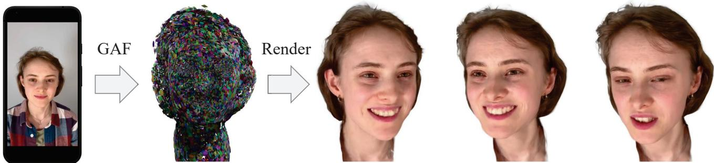  
Figure 1. Given a short, monocular video captured by a commodity device such as a smartphone, GAF reconstructs a 3D Gaussian head avatar, which can be re-animated and rendered into photo-realistic novel views. Our key idea is to distill the reconstruction constraints from a multi-view head diffusion model in order to extrapolate to unobserved views and expressions.

## Abstract

We propose a novel approach for reconstructing animatable 3D Gaussian avatarsfrom monocular videos captured by commodity devices like smartphones. Photorealistic 3D head avatar reconstruction from such recordings is challenging due to limited observations, which leaves unobserved regions under-constrained and can lead to artifacts in novel views. To address this problem, we introduce a multi-view head diffusion model, leveraging its priors tofill in missing regions and ensure view consistency in Gaussian splatting renderings. To enable precise viewpoint control, we use normal maps rendered from FLAME-based head reconstruction, which provides pixel-aligned inductive biases. We also condition the diffusion model on VAE features extracted from the input image to preserve facial identity and appearance details. For Gaussian avatar reconstruction, we distill multi-view diffusion priors by using iteratively denoised images as pseudo-ground truths, effectively mitigating over-saturation issues. To further improve photorealism, we apply latent upsampling priors to refine the denoised latent before decoding it into an image. We evaluate our method on the NeRSemble dataset, showing that GAF outperforms previous state-of-the-art methods in novel view synthesis. Furthermore, we demonstrate higher-fidelity avatar reconstructions from monocular videos captured on commodity devices. Project Page: https://tangjiapeng.github.io/projects/GAF

## 1. Introduction

Creating photorealistic and animatable head avatars has long been a challenge in computer vision and graphics. This is crucial for a vast variety of applications such as immersive telepresence in virtual and augmented reality, computer games, movie effects, virtual classrooms, and videoconferencing. Here, the goal is to generate avatars that can be realistically rendered from any viewpoint, accurately capturing facial geometry and appearance, while also enabling easy animation for realistic head portrait videos depicting various expressions and poses. The democratization of highfidelity head avatars from commodity devices is a challenge of widespread interest. However, photo-realistic head avatar reconstruction from monocular videos is challenging and ill-posed, due to limited head observations causing a lack of constraints for novel-view rendering.

To create photorealistic, animatable human avatars, researchers have integrated NeRF [49, 50] and Gaussian Splatting (GS) [31] techniques with parametric head models [23, 39, 76], enhancing control over unseen poses and expressions. Approaches like [24, 57, 90, 91] achieve highquality head reconstructions and realistic animations using dense multi-view datasets, typically captured in controlled studio settings. However, these methods encounter significant limitations with monocular recordings from commodity cameras, such as smartphone portrait videos. Monocular methods [4, 12, 21, 66, 89, 101, 102, 105] aim to reconstruct head avatars from single-camera videos but often rely on substantial head rotations to capture various angles. They only reconstruct visible regions from input frames, leaving occluded areas incomplete and under-constrained. For instance, as illustrated in Fig. 4 , front-facing videos provide limited capture on side regions, leading to visible artifacts when rendering extreme side views.

To this end, we introduce a multi-view head diffusion model that learns the joint distribution of multi-view head images. Given a single-view input image, our model generates a set of view-consistent output images. By leveraging view-consistent diffusion priors on human heads, our approach enables the robust reconstruction of Gaussian avatars, preserving both appearance and identity across novel perspectives. Unlike existing methods [41, 68, 85, 87] that use camera pose as a conditioning factor for viewpoint control, we use the normal map rendered from a reconstructed parametric face model as guidance. The normal maps provide stronger inductive biases, offering more precise and reliable novel view generation for heads. Specif ically, we condition our multi-view diffusion process on 2D features extracted from the input image’s autoencoder, rather than only using high-level semantic vectors like CLIP embeddings [58]. This design allows us to incorporate finegrained identity and appearance details directly into the multi-view denoising process, ensuring that the generated images maintain coherence and consistency across viewpoints in terms of identity and appearance.

To exploit multi-view diffusion priors for Gaussian head reconstruction, we employ a diffusion loss that uses iteratively denoised images as pseudo-ground truths for novel view renderings, instead of using a single-step score distillation sampling loss [55]. Compared to NeRF, 3D-GS enables real-time multi-view rendering, significantly reducing optimization time. Moreover, to improve the fidelity of the Gaussian renderings, we introduce a latent upsampler model to enhance facial details within the denoised latent before decoding it back to image space. As demonstrated in Fig. 1, our approach generates high-quality, photorealistic novel views of head avatars using only short monocular videos captured by a smartphone. Extensive comparisons with state-of-the-art methods show that our approach delivers higher fidelity and more view-consistent avatar reconstructions from monocular videos. Our GAF significantly outperforms state-of-the-art methods in novel view and expression synthesis on the NeRSemble dataset and other monocular datasets captured by commodity devices. Our contributions can be summarized as follows:

• We introduce a novel approach for reconstructing photorealistic, animatable head avatars from monocular videos with limited coverage captured on commodity devices, using multi-view head diffusion priors to regularize and complete unobserved regions.

• We propose a multi-view head diffusion model that generates consistent multi-view images from a single-view input, guided by normal maps rendered from FLAME head reconstructions to improve viewpoint control.

• We present a strategy to enhance the photorealism and cross-view consistency of Gaussian splatting by integrating latent upsampling and multi-view diffusion priors.

## 2. Related Work

3D Scene Representations. Neural radiance fields [49] and its variants [5–7, 11, 13, 20, 50] revolutionized 3D scene reconstruction from multi-view images. However, NeRF-based methods are often hindered by computational inefficiency during both training and inference stages. Gaussian Splatting [31] represents a scene as a composition of discrete geometric primitives, i.e. 3D Gaussians, and employs an explicit rasterizer for rendering. Compared to NeRF, GS has achieved notable runtime speedups in the training and inference stages. This enables real-time performance and more favorable image synthesis. Unlike polygonal meshes, which require careful topology handling, GS supports substantial topology changes, making it more adaptable to complex surfaces and varying densities.

Parametric Face/Head Models. Based on statistical priors of 3D morphable models (3DMM)[8, 27, 39, 81, 84], many works [19, 26, 32, 80] learn 3D face/head reconstruction and tracking from single RGB images/videos. More recent methods [23, 76, 99, 101] leveraged signed distance fields [52] and deformation fields [51, 73, 74] based on coordinate-MLPs for more fine-grained geometry reconstruction including hair and beards. HeadGAP [100] and GPHM [92] learned parametric models for head Gaussians. Our work uses the VHAP tracker [1] to obtain coarse geometries as guidance for dynamic avatar reconstruction.

Photo-realistic Avatar Reconstruction. To create photorealistic animatable head avatars, several works [21, 57, 66, 79, 89, 90, 102, 105, 105] have combined NeRF/GS with 3D morphable models (3DMM). Our work is closely related to animatable Gaussian splats [57, 66], which attached splats to the triangles of FLAME mesh, and updated their properties by triangle deformations controlled by FLAME parameters. Although promising results have been achieved, they typically require multi-view setups with high-quality cameras in studio environments [36, 43]. Some works reconstruct avatars from monocular videos [4, 89, 102, 105]. However, they only reconstruct the visible region from inputs, lacking effective priors to complete missing areas. P4D [17], P4D-v2 [18], GAGAvatar [14], and MGGTalk [25] use feed-forward networks to predict expression-driven 3D heads represented by Gaussians or triplane features [53]. While achieving impressive head reenactments, they could exhibit obvious artifacts in novel views. To address this, we utilize multi-view diffusion priors to complete unobserved regions of the face, ensuring photorealistic renderings from extremely novel viewpoints.

Distillation 2D Priors for 3D Generation. Diffusion models [29, 70–72] have been widely applied to 3D asset generation [9, 46, 77, 82, 96, 103]. Some methods leverage large-scale pretrained text-to-image priors [60, 61, 64] for 3D synthesis [40, 75] using score distillation sampling (SDS) loss [55] and its variants [47, 86, 94]. Several studies [10, 28, 104] applied SDS loss for text-driven 3D head avatar generation. For single-view 3D reconstruction, approaches like RelFusion [47], Magic123 [56], and Dreambooth3D [59] adapt text-to-image diffusion priors to specific objects to preserve identity. However, achieving consistent novel views from text prompts alone remains challenging without leveraging the input image. To address this, we learn multi-view image diffusion priors conditioned on a single image. Rather than using a single-step SDS loss, we use iteratively denoised images as pseudo-ground truths for novel view supervision, similar to ReconFusion [88]. We also introduce pretrained latent upsampler diffusion priors to improve photo-realism of pseudo-ground truths.

Multi-view Diffusion Models. Instead of text-to-image diffusion priors, some works learn image-conditioned novel view diffusion priors, which leverage the identity and appearance details of the input image to generate consistent novel views. 3DiM [87] pioneered a diffusion model for pose-conditioned novel view generation. Zero-123 finetuned StableDiffusion [61] on the Objaverse [15, 16] dataset to improve generalization ability. Some works jointly diffused multiple views from a single image via dense 3D self-attention or epipolar attention layers in the denoiser network, including MVDiffusion [78], Sync-Dreamer [42], Zero-123++ [67], Wonder3D [44], MV-Dream [68], ImageDream [85], Human3Diffusion [93], IM3D [48], CAT3D [22], and VideoMV [106]. These works primarily target general objects, but our focus is on human heads. We train multi-view diffusion models on a multiview head video dataset to obtain more head-specific priors. By using normal maps from FLAME reconstruction as the camera pose condition, we introduce pixel-aligned inductive bias to enable more precise viewpoint control, which is crucial for consistent head Gaussian supervision.

## 3. Preliminaries

## 3.1. 3D Gaussian Splatting

3D Gaussian Splatting [31] parameterizes a scene using a set of discrete geometric primitives known as 3D Gaussian splats. Each splat is characterized by a covariance matrix Σ centered at location $\mu .$ The covariance matrices are required to be semi-definite for physical interpretations. It utilizes a parametric ellipsoid definition to construct the covariance matrix $\Sigma = \bar { R S } S ^ { T } R ^ { T }$ using a scaling matrix S and a rotation matrix R. These matrices are independently optimized and represented by a scaling vector $\mathbf { s } \in \mathbb { R } ^ { 3 }$ and a quaternion $\mathbf { \bar { q } } \in \mathbb { R } ^ { 4 } . \ \mathbf { r } \in \mathbf { \bar { \mathbb { R } } } ^ { 3 \times 3 }$ denotes the corresponding rotation matrix of q. To represent scene appearance, sphere harmonic coefficients are used to represent the color c of each Gaussian. During rendering, a tile-based rasterizer is used to α-blend all 3D Gaussians overlapping the pixel within a tile. To respect visibility order and avoid per-pixel sorting expenses, splats are sorted based on depth values within each tile before blending.

## 3.2. Gaussian Avatars

To animate Gaussian splats for head avatars, we use the representation of GaussianAvatars [57] to rig 3D Gaussians using the FLAME mesh. Initially, they bind each triangle of the FLAME identity mesh with a 3D Gaussian and transform the 3D Gaussian based on triangle deformations across different time steps. The splat remains static in the local space of the attached triangle but can dynamically evolve in the global metric space along rotation, translation, and scaling transformations of the binding triangle. For each triangle, they compute the mean position T of its three vertices coordinates as the origin of the local space. They define a rotation matrix R to depict the orientation of the triangle in the global space, composed of three column vectors derived from the direction vector of one edge, the normal vector of the triangle face, and their cross product. Additionally, they determine triangle scaling k by calculating the mean length of one edge and its perpendicular in a triangle. The 3D Gaussian is parameterized by the location $\mu ,$ rotation r, and anisotropic scaling s in the local space of its parent triangle. In the initialization stage, the location $\mu$ is set as zero, rotation r as an identity matrix, and scaling s as a unit vector. During rendering, they transform these properties from local to global space by:

$$
\mathbf { r } ^ { \prime } = \mathbf { R } \mathbf { r }
$$

$$
\mu ^ { \prime } = k { \bf R } \mu + { \bf T }\tag{1}
$$

(2)

$$
\mathbf { s } ^ { \prime } = k \mathbf { s }\tag{3}
$$

The adaptive Gaussian densification process operates within local space, where newly added Gaussians inherit binding relations from their original counterparts.

## 4. Gaussian Avatars Fusion

Given a monocular sequence of RGB images $\begin{array} { r l } { \mathcal { T } } & { { } = } & { \{ \mathbf { I } _ { i } \} } \end{array}$ as input, our goal is to reconstruct head Gaussian splats $\begin{array} { r } { \mathcal { O } \ = \ \{ \mathcal { O } _ { i } \} } \end{array}$ as output. The overall pipeline is shown in Figure 2. To enable animation of the reconstructed avatar with various head poses and expressions, we optimize the Gaussian splats  rigged by a parametric head model, e.g. FLAME. The challenge is that monocular videos often lack complete observations of the head. For example, a frontfacing video with limited head rotations may provide insufficient information about the face’s sides. This poses difficulties for reconstructing a photorealistic 3D head from partial input, as the optimization over is underconstrained. To address this, we introduce a normal map-guided, multiview head diffusion model, which is designed to jointly denoise multi-view images conditioned on a single input image and normal maps rendered from FLAME tracking. Once trained, this model serves as a prior to regularize renderings from , filling in unobserved regions and improving the quality of the reconstructed avatar.

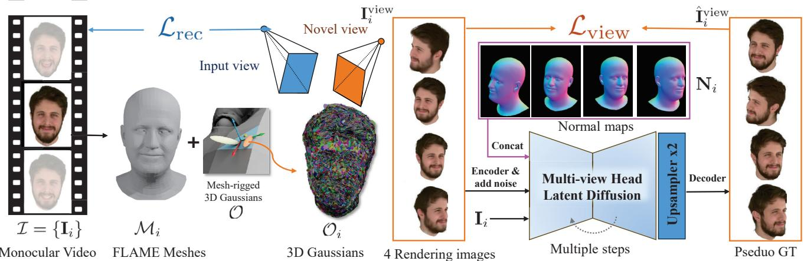  
Figure 2. Pipeline overview. Given a sequence of RGB images from monocular cameras $\mathcal { T } = \{ \mathbf { I } _ { i } \}$ , our objective is to reconstruct dynamic head avatars by optimizing an animatable Gaussian splatting representation , which is deformed to each frame as $\mathcal { O } _ { i }$ by the tracked FLAME mesh $\mathcal { M } _ { i }$ of Ii. We optimize  by minimizing an input view reconstruction loss ${ \mathcal { L } } _ { \mathrm { r e c } } ,$ plus a view sampling loss $\mathcal { L } _ { \mathrm { v i e w } } .$ ${ \mathcal { L } } _ { \mathrm { v i e w } }$ compares novel-view renderings of $\mathcal { O } _ { i }$ from four random viewpoints $\mathbf { I } _ { i } ^ { \mathrm { v i e w } }$ , with pseudo ground truths $\hat { \mathbf { I } } _ { i } ^ { \mathrm { v i e w } }$ , predicted by a multi view head latent diffusion model. $\hat { \mathbf { I } } _ { i } ^ { \mathrm { v i e w } }$ are generated by iteratively denoising 4-view latents, guided by the input image Ii and norma maps $\mathbf { N } _ { i }$ rendered from $\mathcal { M } _ { i } .$ A latent upsampler module enhances facial details before decoding the denoised latent into an RGB image.

## 4.1. Normal map-conditioned Multi-view Head Latent Diffusion

To address missing regions in monocular videos with limited head coverage, one solution is to distill pre-trained textto-image diffusion models to regularize novel view renderings. Personalized techniques like Dreambooth [63] allow for identity preservation by customizing diffusion models for specific objects we wish to reconstruct. However, personalized text-to-image diffusion models are not designed to capture the distribution of novel views from a single input image. To overcome this, we propose a novel view diffusion model that generates identity-preserved and appearancecoherent novel views conditioned on an input image. By denoising multiple novel views simultaneously, our approach enhances cross-view consistency. The multi-view head diffusion model is illustrated in Fig. 3.

Normal Map Conditioning. To control viewpoint, we leverage normal maps rendered from the FLAME mesh reconstruction at target views as diffusion guidance. The normal map is first encoded into a latent representation via pretrained VAE [34], matching the dimensionality of the noisy image latent, and these two latents are then concatenated along the channel dimension. Compared to camera pose embeddings, normal maps offer a more explicit inductive bias for view synthesis by providing pixel-aligned conditioning, which facilitates alignment between the generated images and the conditioning normal maps. Moreover, the FLAME renderings also facilitate the expression accuracy of synthesized novel views.

Model Architecture. We train a multi-view diffusion model that takes a single image of a head, $\mathbf { I } _ { c o n d } ,$ as input and generates multiple output images conditioned on normal maps rendered from desired camera poses using the FLAME reconstruction . Specifically, given $\mathbf { I } _ { c o n d }$ and the FLAME mesh , the model learns the joint distribution of N target images, $\mathbf { I } _ { t g t }$ , guided by N normal maps, $\mathbf { N } _ { t g t }$ which are rendered from at the target camera poses.

$$
p ( \mathbf { I } _ { t g t } | \mathbf { I } _ { c o n d } , \mathbf { N } _ { t g t } )\tag{4}
$$

Our model architecture is similar to multi-view diffusion models (MVLDM) [22, 68, 85, 93], which is based on 2D U-Net [62] and attention blocks [83]. As shown in Fig. 3, we use the CLIP image embedding to achieve global control over novel view generation. However, this embedding mainly contains high-level semantic features, lacking the detailed information necessary for accurately capturing the head’s identity and appearance. To address this, we incorporate the VAE latents of $\mathbf { I } _ { c o n d }$ directly into the multi-view diffusion model. By applying cross-attention between the multi-view denoised latents and the VAE latent of $\mathbf { I } _ { c o n d } .$ , we effectively transfer identity-specific details. Additionally, to ensure consistency across views, we aggregate information from the noisy latents across different viewpoints.

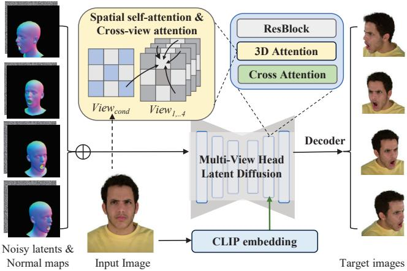  
Figure 3. Multi-view latent head diffusion models. Given multiview noisy image latents, we concatenate them with VAE latents of normal maps rendered from FLAME tracking. These combined inputs are processed by a 2D U-Net denoiser with attention blocks. To maintain 3D consistency, 3D attention blocks apply cross-attention across all views, integrating face identity and appearance details from the input image into the denoised latents while exchanging information between noisy latents across views.

## 4.2. Gaussian Avatars Reconstruction with Multiview Diffusion Priors

We now seek to utilize the multi-view diffusion priors for head Gaussian reconstruction. A commonly used strategy is Score Distillation Sampling (SDS) loss [55], which performs one-step denoising. Due to the stochastic nature of the denoising process introduced by random noise levels and seeds, it contains noisy gradients that disturb 3D optimization. Consequently, it often causes over-saturated appearance issues in synthesized 3D assets. Wu et al. [88] found that after iteratively denoising a noisy image for multiple steps, we can obtain a deterministic output.

Pseudo-image Ground Truths. At each iteration, we randomly select the i-th input frame $\mathbf { I } _ { i }$ and its FLAME mesh $\mathcal { M } _ { i }$ . By randomly sampling 4 viewpoints $\{ \phi _ { j } \} _ { j = 1 } ^ { 4 }$ , then we can generate 4 novel views from ${ \bf I } _ { i } ^ { \mathrm { v i e w } } = \mathcal { R } ( \bar { \mathcal { O } } _ { i } , \{ \phi _ { j } \} )$ and render normal maps $\mathbf { N } _ { i } = \mathcal { R } ( \mathcal { M } , \{ \phi _ { j } \} )$ from $\mathcal { M } _ { i }$ . We can employ normal map-guided multi-view diffusion priors to regularize $\mathbf { I } _ { i } ^ { \mathrm { v i e w } }$ . Concretely, we encode $\mathbf { I } _ { i } ^ { \mathrm { v i e w } }$ into latent features $\mathbf { z } ,$ which is perturbed with noise $\epsilon _ { t }$ to obtain noisy features $\mathbf { z } _ { t } .$ The noise intensity of $\epsilon _ { t }$ is controlled by the diffusion time step $t \sim [ 0 . 0 2 , 0 . 9 8 ]$ . We then iteratively perform multiple denoising steps of latent diffusion until the final clean latent $\mathbf { z } _ { 0 }$ is obtained. To accelerate the generation speed, we adopt the DDIM sampling strategy [69] by running $t / k$ intermediate steps, which can reduce the denoising steps by $k = 2 0$ times. Then $\mathbf { z } _ { 0 }$ is decoded back to 4 images $\{ \hat { \bf I } _ { i } ^ { j } \}$ that are served as pseudo supervision.

Latent Upsampler. To further enhance the facial details in $\hat { \mathbf { I } } _ { i } ^ { \mathrm { v i e w } }$ , we use a pre-trained latent upsampler diffusion model [2] to super-resolve the denoised 4-view latents $\mathbf { z } _ { 0 }$ from a resolution of $3 2 \times 3 2$ to $6 4 \times 6 4$ . This superresolution step allows the pseudo-image ground truths $\hat { \mathbf { I } } _ { i } ^ { j }$ to reach a final resolution of $5 1 2 \times 5 1 2$ . We use 10-step DDIM sampling in our latent upsampler inference.

3D-Aware Denoising. The rendered views $\mathbf { I } _ { i } ^ { \mathrm { v i e w } }$ from a global 3D representation $\mathbf { O } _ { i }$ introduce 3D-awareness into the denoising process, further enhancing multi-view consistency across pseudo ground truths $\hat { \mathbf { I } } _ { i } ^ { j }$

## 4.3. Loss Functions

We supervised the optimization of Gaussian Splats $\mathcal { O }$ by a combination of loss functions in the following:

$$
\begin{array} { r } { \mathcal { L } = \mathcal { L } _ { \mathrm { i m g } } ( \mathbf { I } ^ { \mathrm { r e c } } , \mathbf { I } ) + L _ { \mathrm { i m g } } ( \mathbf { I } ^ { \mathrm { v i e w } } , \hat { \mathbf { I } } ^ { \mathrm { v i e w } } ) } \\ { + \lambda _ { \mathrm { p o s } } \mathcal { L } _ { \mathrm { p o s } } + \lambda _ { \mathrm { s c a l e } } \mathcal { L } _ { \mathrm { s c a l e } } } \end{array}\tag{5}
$$

$L _ { \mathrm { i m g } }$ is defined by a combination of pixel-wise $L _ { 1 }$ loss, SSIM loss, and LPIPS loss:

$$
\mathcal { L } _ { \mathrm { i m g } } = \lambda _ { 1 } \mathcal { L } _ { 1 } + \lambda _ { 2 } \mathcal { L } _ { S S I M } + \lambda _ { 3 } \mathcal { L } _ { L P I P S }\tag{6}
$$

where $\lambda _ { 1 } = 0 . 8 , \lambda _ { 2 } = 0 . 2 .$ , and $\lambda _ { 3 } = 0 . 1$ . We also introduce splat position and scale regularization terms to penalize abnormally distributed splats. $\lambda _ { \mathrm { p o s } }$ and $\lambda _ { \mathrm { s c a l e } }$ are set to 0.01 and 1 respectively.

## 4.4. Implementation Details

Multi-view Head Diffusion Model. It is initialized from Stable Diffusion 2.1 [61] of ImageDream [85] and is trained on eight A100 GPUs over 20,000 iterations, taking approximately 72 hours. The training uses a learning rate of 0.0001 and a batch size of 64. During training, we employ a classifier-free guidance strategy, randomly dropping the input image at a rate of 0.1. The model is trained on the multi-view human head video dataset NeRSemble [36], which contains RGB video sequences from 16 viewpoints, covering both front and side faces. We randomly sample 50,000 timesteps to construct the training dataset.

Gaussian Avatar Optimization. The FLAME meshes are initially obtained by VHAP tracker [1] from monocular videos. The animatable Gaussians are optimized with Adam [35] for 6,000 iterations, with learning rates of 5e 5,1.7e 2, 1e 3, 2.5e 3, and $5 \mathrm { e } - 2$ for splat position, scaling factor, rotation quaternion, color and opacity respectively. We perform adaptive densification if the position gradients are larger than 0.0002 in every 300 iterations until 5,000 iterations are reached. We also remove Gaussians with opacity less than 0.005. During training, we also finetune the FLAME parameters using the learning rates 1e 6, 1e 5, and 1e 3 for translation, joint rotation, and expression coefficients. At each iteration, we randomly sample 4 out of 15 novel viewpoints from the NeRSemble dataset to calculate multi-view diffusion loss.

Runtime. Our current implementation of avatar reconstruction takes about 12 hours and uses 32 GB of memory on a single A6000 GPU. After avatar reconstruction, Our method takes 0.016 seconds to render an image at 802 550 resolution, i.e. 62 FPS.

## 5. Experiments

Datasets. We conduct head avatar reconstruction experiments on monocular video sequences from the NeRSemble dataset [36]. Note that these evaluation sequences were not seen by the multi-view diffusion model. We use monocular videos from the 8-th camera as the input, only capturing the head from the front view. And we use videos from the other 15 views for evaluation. We randomly select 12 sequences from different identities, with durations between 70 and 300 frames, downsampled to a resolution of 802 550. Additionally, we include a Monocular Video dataset consisting of 3 monocular videos from the INSTA [105] dataset at 512  512 resolution, and 3 sequences of three subjects captured by smartphone at 1280 720 resolution.

Evaluations. Following previous works [57, 105], we report the average L1 loss, LIPIS, PSNR, and SSIM between renderings and ground truths of the test set. In the NeRSemble dataset, we evaluate head avatar reconstruction and animation quality in two settings: 1) novel view synthesis: driving a reconstructed avatar with seen head poses and expressions during training, and rendering it from 15 holdout viewpoints. 2) novel expression synthesis: driving a reconstructed avatar with unseen head poses and expressions during training, and rendering it, rendered from 5 nearby hold-out views, i.e. cameras 6–10. For this dataset, 80% of frames are used for training, and 20% for evaluation. In the Monocular Video dataset, we use around 40% of frames for training and the rest for evaluation. The training sets consist of front-facing frames, while the evaluation set includes obvious head rotations to capture side faces.

Baselines. We compare our method against stateof-the-art methods for photo-realistic head reconstruction. PanoHead [3] and SphereHead [37] use 3D-GAN inversion to reconstruct static heads. They cannot reconstruct animatable avatars. Thus, they cannot be evaluated in novel expression synthesis. INSTA[105], FlashAvatar [89], and GA[57] optimize photo-realistic head avatars represented by Instant NGP or Gaussian Splatting. They overfit avatars to monocular observations. P4D-v2 [18] and GAGAvatar [14] reconstruct animatable 3D avatars from single images, that can then be reenacted with novel expressions.

## 5.1. Head Avatar Reconstruction

NeRSemble. As shown in Fig. 4, front-facing monocular videos lack sufficient side-face information. INSTA, FlashAvatar, and GA can only reconstruct observed regions and leave unobserved areas unconstrained. This often leads to artifacts in extreme hold-out views. PanoHead [3] and

<table><tr><td rowspan="2">Method</td><td colspan="2">Novel Views</td><td rowspan="2"></td><td colspan="2">Novel Expressions</td></tr><tr><td>LPIPS↓ PSNR ↑</td><td>SSIM ↑ LPIPS ↓</td><td></td><td>PSNR ↑ SSIM ↑</td></tr><tr><td>PanoHead [3] SphereHead [37]</td><td>0.171 0.174</td><td>17.40 16.94</td><td>86.11 85.98</td><td>N/A N/A</td><td>N/A N/A</td><td>N/A N/A</td></tr><tr><td>INSTA [105]</td><td>0.262</td><td>15.87</td><td>77.02</td><td>0.165</td><td>19.46</td><td>84.91</td></tr><tr><td>FlashAvatar [89]</td><td>0.247</td><td>16.94</td><td>81.05</td><td>0.145</td><td>21.37</td><td>86.08</td></tr><tr><td>GA [57]</td><td>0.218</td><td>17.51</td><td>81.66</td><td>0.138</td><td>21.63</td><td>87.00</td></tr><tr><td>P4D-v2 [18]</td><td>0.161</td><td>16.82</td><td>85.44</td><td>0.142</td><td>18.72</td><td>86.63</td></tr><tr><td>GAGAvatar [14]</td><td>0.183</td><td>21.20</td><td>80.72</td><td>0.177</td><td>21.32</td><td>80.44</td></tr><tr><td>Ours</td><td>0.125</td><td>20.88</td><td>88.91</td><td>0.087</td><td>24.12</td><td>90.66</td></tr></table>

Table 1. Quantitative comparisons on dynamic avatar reconstruction and animation from monocular videos. Results are obtained by the average of twelve sequences of different subjects on the Nersemble dataset. Best and 2nd-best are highlighted.
<table><tr><td></td><td>L1↓</td><td>LPIPS ↓</td><td>PSNR ↑</td><td>SSIM↑</td></tr><tr><td>INSTA [105]</td><td>0.0407</td><td>0.177</td><td>21.11</td><td>85.04</td></tr><tr><td>FlashAvatar [89]</td><td>0.0376</td><td>0.145</td><td>21.13</td><td>85.93</td></tr><tr><td>GA [57]</td><td>0.0263</td><td>0.109</td><td>22.55</td><td>88.61</td></tr><tr><td>P4D-v2 [17]</td><td>0.0317</td><td>0.131</td><td>20.95</td><td>86.82</td></tr><tr><td>GAGAvatar [14]</td><td>0.0282</td><td>0.108</td><td>22.34</td><td>85.38</td></tr><tr><td>Ours</td><td>0.0229</td><td>0.090</td><td>23.16</td><td>89.76</td></tr></table>

Table 2. Quantitative comparisons on dynamic avatar reconstruction on Monocular Video dataset. Results are obtained by holdout expression frames from six sequences of INSTA and smartphone capture. Note that novel view renderings cannot be evaluated due to the absence of ground truths in single-view captures.

SphereHead [37] fail to generate plausible renderings in extreme novel views. P4D-v2 [18] exhibits blurriness and artifacts in the mouth and ears, while GAGAvatar [14] suffers from identity drift due to weak constraints in less observed regions. In contrast, our method leverages multiview diffusion priors to improve novel view synthesis, effectively completing missing regions and enhancing photorealism while preserving identity and appearance consistency. As shown in Tab. 1, our approach outperforms all baselines in LPIPS and SSIM and ranks second in PSNR on the task of novel view synthesis. Interestingly, novel view constraints also benefit novel expression synethesis, resulting in superior performance across all metrics.

Monocular Videos. We also provide the comparisons on the Monocular Video dataset. Since single-view datasets lack ground-truth novel views, we evaluate animation results by applying expression parameters from hold-out frames. As shown in Tab. 2 , our method consistently surpasses others in all metrics. The qualitative results are presented in Fig. 5. While all methods can well reconstruct the input view (top right), GA [57] struggles to generate plausible novel views (bottom right), particularly for unseen face regions. It is also prone to artifacts and inconsistencies in novel pose animations. P4D-v2 [18] and GAGAvatar [14]

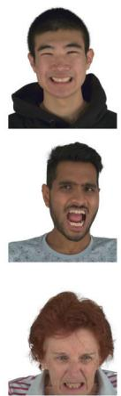  
Input

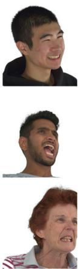  
GT

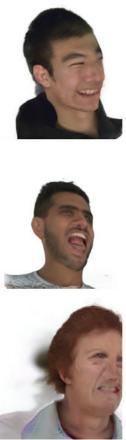

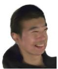  
PanoHead

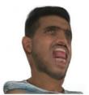

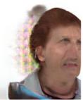  
SphereHead

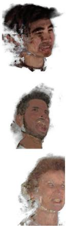  
INSTA

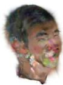

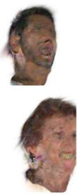  
FlashAvatar  
GA

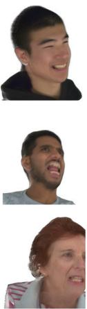

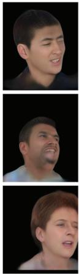

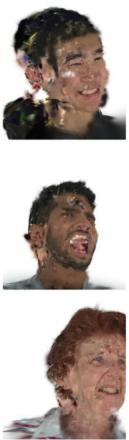  
P4D-v2  
GAGAvatar

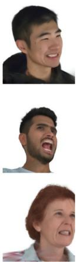  
Figure 4. Novel view synthesis from monocular videos on the NeRSemble dataset. Compared to state-of-the-art methods, our approach reconstructs unseen side facial regions in the inputs, better preserves facial identities, and consistently produces more favorable renderings from hold-out views.  
Ours

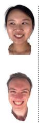  
Input

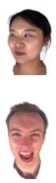  
(a)

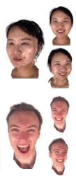  
(b)

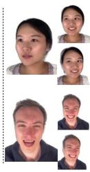  
(c)

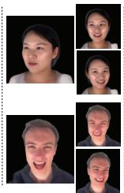

We conduct detailed ablation studies to evaluate diffusion prior choices for novel view constraints, confirming the effectiveness of each design in our face-specific multiview diffusion prior learning for 3D head reconstruction from monocular videos. We use six sequences from the NeRSemble dataset. The results are presented in Fig. 6, and Tab. 3. Please refer to the supplementary material for more implementation details of ablation studies.

What is the effect of multi-view head diffusion priors? An alternative is to use pre-trained text-to-image diffusion models Stable Diffusion [61]. Another alternative is to finehave limited capacity to represent exaggerated expressions or fine details such as wrinkles.

(d)  
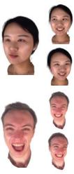  
(e)  
Figure 5. Head avatar reconstruction from monocular videos captured on commodity devices. (a) Ground truth of novel expressions; (b) GA; (c) P4D-v2; (d) GAGAvatar; (e) Ours. For each method, we display the fitting results of the input frame (top right) and novel view renderings of the input frame (bottom right). Given a front-facing sequence with limited head poses, all methods can accurately reconstruct the observed frames. However, without effective priors to constrain unobserved regions, GA struggles to generalize to novel views and poses. P4D-v2 and GAGAvatar exhibit limitations in capturing complicated facial expressions or fine-grained details such as wrinkles.

## 5.2. Ablation Studies

<table><tr><td rowspan="2">Method</td><td colspan="3">Novel Views</td><td colspan="3">Novel Expressions</td></tr><tr><td>LPIPS ↓ PSNR ↑ SSIM ↑ LPIPS ↓ PSNR ↑ SSIM ↑</td><td></td><td></td><td></td><td></td><td></td></tr><tr><td>No diffusion</td><td>0.207</td><td>18.47</td><td>82.69</td><td>0.129</td><td>22.74</td><td>88.13</td></tr><tr><td>pretrained SD</td><td>0.196</td><td>16.99</td><td>83.47</td><td>0.149</td><td>21.37</td><td>87.81</td></tr><tr><td>personalized SD</td><td>0.196</td><td>16.89</td><td>85.98</td><td>0.147</td><td>21.51</td><td>89.52</td></tr><tr><td>Ours, w/o pseduo GT</td><td>0.178</td><td>19.57</td><td>84.73</td><td>0.136</td><td>22.41</td><td>87.59</td></tr><tr><td>Ours, pose cond.</td><td>0.131</td><td>19.69</td><td>87.63</td><td>0.087</td><td>23.68</td><td>90.37</td></tr><tr><td>Ours, raymap cond.</td><td>0.150</td><td>18.56</td><td>86.70</td><td>0.095</td><td>22.84</td><td>89.73</td></tr><tr><td>Ours, w/o latent×2</td><td>0.134</td><td>21.48</td><td>89.53</td><td>0.087</td><td>25.07</td><td>91.75</td></tr><tr><td>Ours final</td><td>0.118</td><td>21.82</td><td>89.87</td><td>0.079</td><td>25.39</td><td>92.02</td></tr></table>

Table 3. Ablation Studies on different types of diffusion priors. Results are obtained from the average of six sequences of different subjects from the NeRSemble [36] dataset.

tune Stable Diffusion on RGB frames from the input video, obtaining personalized image diffusion priors. We implement both variants using normal map guidance of ControlNet [98]. In Fig. 6 (b) , pre-trained text-to-image priors often produce renderings that deviate from the original identity. In Fig. 6 (c), personalized diffusion priors improve identity preservation but struggle with appearance consistency, as they lack input image information to hallucinate novel views. Our approach learns to jointly generate multiple novel views conditioned on the input image, thus achieving higher realism and view consistency in both identity and appearance.

What is the effect of normal map conditioning for multiview diffusion models? Our multi-view head diffusion models condition on normal maps of FLAME reconstruction, which are pixel-aligned with the target novel-view images. Fig. 6 (d) and (e) reflect that using camera pose embedding and ray map conditioning could introduce obvious misalignment errors in synthesizing pseudo-image ground truths, leading to blurred 3D Gaussian renderings.

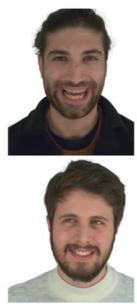  
Input

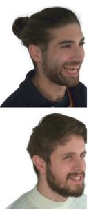  
GT

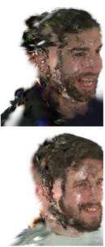  
(a)

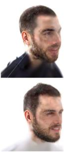  
(b)

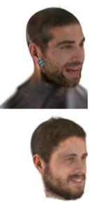  
(c)

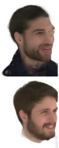  
(d)

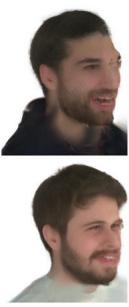  
(e)

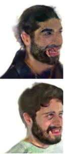  
(f)

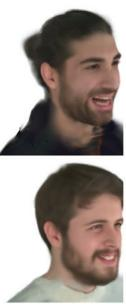  
(g)

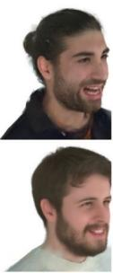  
(h)  
Figure 6. Ablation studies on different types of diffusion priors. Comparisons between method variants of (a) No diffusion; using (b) Pretrained Stable Diffusion; (c) Personalized Stable Diffusion; (d) Pose-conditioned multi-view diffusion; (e) Raymap-conditioned multi view diffusion; (f) Our multi-view diffusion using Score Distillation Sampling (SDS) loss; (g) Ours without latent upsampler 2; (h) Ou final model. Our normal map-conditioned multi-view diffusion priors enable more photo-realistic novel views with identity and appearance consistency, by constraining novel views using pseudo-image ground truths, which are decoded from iteratively denoised latents followed by the latent upsampler.

What is the effect of iteratively denoised images as pseudo-ground-truths? We can instead use Score Distillation Sampling (SDS) loss to constrain multi-view renderings. As shown in Fig. 6 (f), vanilla one-step SDS loss has appearance oversaturation issues in the face region.

What is the effect of latent upsampler module? Through Fig. 6 (g) vs. (h), we can see that the upsampler module significantly sharpens and enhances facial appearance details.

## 5.3. Multi-view Head Diffusion Models

We compare normal map conditioning to alternatives in our multi-view head diffusion models, including pose embedding and Plucker ray maps [ ¨ 54]. Results in Tab. 4 and Fig. 7 show that FLAME normal maps can achieve more superior facial alignment, with 2.56 lower $l _ { 1 }$ error and 7.73% higher SSIM.

<table><tr><td colspan="3">Method  $l _ { 1 } \downarrow$  LPIPS ↓ PSNR ↑ SSIM ↑</td></tr><tr><td>pose embedding 0.123</td><td>0.184 16.52</td><td>76.12</td></tr><tr><td>ray map</td><td>0.137 0.198 16.05</td><td>75.71</td></tr><tr><td>normal map</td><td>0.048 0.119 19.67</td><td>83.85</td></tr></table>

Table 4. Ablation studies on different camera conditioning in multi-view head diffusion.

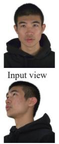  
Ground truth

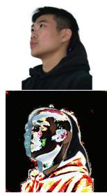  
Pose embedding

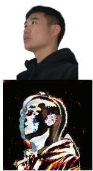  
Ray map

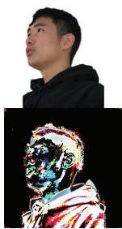  
Normal map  
Figure 7. Ablation studies on different camera conditioning in multi-view head diffusion. We show predictions in the first row and $l _ { 1 }$ difference maps between the ground truth and predictions.

## 5.4. Limitations and Future Work

While our work has shown promising results in dynamic avatar reconstruction from monocular videos captured on studio setups or commodity devices, there are limitations in our current method. First, we do not explicitly separate the material and appearance of heads, which could enable re-lighting applications [33, 65]. Second, optimizing head Gaussians using iteratively updated pseudo ground-truths from diffusion models is time-consuming. We plan to explore real-time 4D avatar reconstruction with feed-forward large reconstruction models [30, 38, 97]. Lastly, the quality of our avatar reconstruction and animation is limited by the expressiveness of current parametric head models, which lack detailed hair geometry and animation. Future work could extend Gaussian head avatars to incorporate fine-grained hair modeling and animation. [45, 95].

## 6. Conclusion

In this work, we present a novel method to reconstruct photo-realistic head avatars from monocular videos to push the frontier of avatar fidelity from commodity devices. Due to limited observation and coverage of human heads, Gaussian reconstruction from monocular videos is inherently under-constrained. To address this challenge, we introduce multi-view diffusion priors that jointly constrain photorealism across multiple views rendered from Gaussian splats. We obtain these priors by designing a multi-view head diffusion model, fine-tuned on a multi-view head video dataset to generate novel views from a single image, conditioned on rendered normal maps from FLAME tracking. To mitigate over-saturated appearances, we use iteratively denoised images as pseudo-ground truths. A pre-trained latent upsampler diffusion model further enhances facial details. By reducing data capture requirements for avatar creation, our approach has the potential to unlock new opportunities in immersive VR/AR applications and products.

## Acknowledgements

This work was supported by Toyota Motor Europe and Woven by Toyota. This work was also supported by the ERC Starting Grant Scan2CAD (804724). We thank Rundi Wu, Simon Giebenhain, and Lei Li for constructive discussions and Angela Dai for the video voice-over.

## References

[1] Versatile head alignment with adaptive appearance priors. https://github.com/ShenhanQian/VHAP. 2, 5

[2] Stable diffusion x2 latent upscaler. https : / / huggingface . co / stabilityai / sd - x2 - latent-upscaler. 5

[3] Sizhe An, Hongyi Xu, Yichun Shi, Guoxian Song, Umit Y Ogras, and Linjie Luo. Panohead: Geometry-aware 3d fullhead synthesis in 360deg. In Proceedings ofthe IEEE/CVF conference on computer vision and pattern recognition, pages 20950–20959, 2023. 6

[4] Ziqian Bai, Feitong Tan, Zeng Huang, Kripasindhu Sarkar, Danhang Tang, Di Qiu, Abhimitra Meka, Ruofei Du, Mingsong Dou, Sergio Orts-Escolano, et al. Learning personalized high quality volumetric head avatars from monocular rgb videos. In Proceedings of the IEEE/CVF Conference on Computer Vision and Pattern Recognition, pages 16890– 16900, 2023. 1, 2

[5] Jonathan T Barron, Ben Mildenhall, Matthew Tancik, Peter Hedman, Ricardo Martin-Brualla, and Pratul P Srinivasan. Mip-nerf: A multiscale representation for anti-aliasing neural radiance fields. In Proceedings of the IEEE/CVF International Conference on Computer Vision, pages 5855– 5864, 2021. 2

[6] Jonathan T Barron, Ben Mildenhall, Dor Verbin, Pratul P Srinivasan, and Peter Hedman. Mip-nerf 360: Unbounded anti-aliased neural radiance fields. In Proceedings of the IEEE/CVF Conference on Computer Vision and Pattern Recognition, pages 5470–5479, 2022.

[7] Jonathan T Barron, Ben Mildenhall, Dor Verbin, Pratul P Srinivasan, and Peter Hedman. Zip-nerf: Anti-aliased grid-based neural radiance fields. In Proceedings of the IEEE/CVF International Conference on Computer Vision, pages 19697–19705, 2023. 2

[8] Volker Blanz and Thomas Vetter. A morphable model for the synthesis of 3d faces. In Seminal Graphics Papers: Pushing the Boundaries, Volume 2, pages 157–164. 2023. 2

[9] Wei Cao, Chang Luo, Biao Zhang, Matthias Nießner, and Jiapeng Tang. Motion2vecsets: 4d latent vector set diffusion for non-rigid shape reconstruction and tracking. In Proceedings ofthe IEEE/CVF Conference on Computer Vision and Pattern Recognition, 2024. 3

[10] Yukang Cao, Yan-Pei Cao, Kai Han, Ying Shan, and Kwan-Yee K Wong. Dreamavatar: Text-and-shape guided 3d human avatar generation via diffusion models. arXiv preprint arXiv:2304.00916, 2023. 3

[11] Anpei Chen, Zexiang Xu, Andreas Geiger, Jingyi Yu, and Hao Su. Tensorf: Tensorial radiance fields. In European Conference on Computer Vision, pages 333–350. Springer, 2022. 2

[12] Yufan Chen, Lizhen Wang, Qijing Li, Hongjiang Xiao, Shengping Zhang, Hongxun Yao, and Yebin Liu. Monogaussianavatar: Monocular gaussian point-based head avatar. In ACM SIGGRAPH 2024 Conference Papers, pages 1–9, 2024. 1

[13] Yujin Chen, Yinyu Nie, Benjamin Ummenhofer, Reiner Birkl, Michael Paulitsch, Matthias Muller, and Matthias ¨ Nießner. Mesh2nerf: Direct mesh supervision for neural radiance field representation and generation. In European Conference on Computer Vision, pages 173–191. Springer, 2025. 2

[14] Xuangeng Chu and Tatsuya Harada. Generalizable and animatable gaussian head avatar. arXiv preprint arXiv:2410.07971, 2024. 2, 6

[15] Matt Deitke, Dustin Schwenk, Jordi Salvador, Luca Weihs, Oscar Michel, Eli VanderBilt, Ludwig Schmidt, Kiana Ehsani, Aniruddha Kembhavi, and Ali Farhadi. Objaverse: A universe of annotated 3d objects. In Proceedings of the IEEE/CVF Conference on Computer Vision and Pattern Recognition, pages 13142–13153, 2023. 3

[16] Matt Deitke, Ruoshi Liu, Matthew Wallingford, Huong Ngo, Oscar Michel, Aditya Kusupati, Alan Fan, Christian Laforte, Vikram Voleti, Samir Yitzhak Gadre, et al. Objaverse-xl: A universe of 10m+ 3d objects. Advances in Neural Information Processing Systems, 36, 2024. 3

[17] Yu Deng, Duomin Wang, Xiaohang Ren, Xingyu Chen, and Baoyuan Wang. Portrait4d: Learning one-shot 4d head avatar synthesis using synthetic data. In Proceedings of the IEEE/CVF Conference on Computer Vision and Pattern Recognition, pages 7119–7130, 2024. 2, 6

[18] Yu Deng, Duomin Wang, and Baoyuan Wang. Portrait4dv2: Pseudo multi-view data creates better 4d head synthesizer. In European Conference on Computer Vision, pages 316–333. Springer, 2024. 2, 6

[19] Yao Feng, Haiwen Feng, Michael J Black, and Timo Bolkart. Learning an animatable detailed 3d face model from in-the-wild images. ACM Transactions on Graphics (ToG), 40(4):1–13, 2021. 2

[20] Sara Fridovich-Keil, Alex Yu, Matthew Tancik, Qinhong Chen, Benjamin Recht, and Angjoo Kanazawa. Plenoxels: Radiance fields without neural networks. In Proceedings of the IEEE/CVF Conference on Computer Vision and Pattern Recognition, pages 5501–5510, 2022. 2

[21] Guy Gafni, Justus Thies, Michael Zollhofer, and Matthias Nießner. Dynamic neural radiance fields for monocular 4d facial avatar reconstruction. In Proceedings of the IEEE/CVF Conference on Computer Vision and Pattern Recognition, pages 8649–8658, 2021. 1, 2

[22] Ruiqi Gao, Aleksander Holynski, Philipp Henzler, Arthur Brussee, Ricardo Martin-Brualla, Pratul Srinivasan, Jonathan T Barron, and Ben Poole. Cat3d: Create anything in 3d with multi-view diffusion models. arXiv preprint arXiv:2405.10314, 2024. 3, 4

[23] Simon Giebenhain, Tobias Kirschstein, Markos Georgopoulos, Martin Runz, Lourdes Agapito, and Matthias ¨ Nießner. Learning neural parametric head models. In Proceedings ofthe IEEE/CVF Conference on Computer Vision and Pattern Recognition, pages 21003–21012, 2023. 1, 2

[24] Simon Giebenhain, Tobias Kirschstein, Martin Runz, Lour- ¨ des Agapito, and Matthias Nießner. Npga: Neural parametric gaussian avatars. arXiv preprint arXiv:2405.19331, 2024. 1

[25] Shengjie Gong, Haojie Li, Jiapeng Tang, Dongming Hu, Shuangping Huang, Hao Chen, Tianshui Chen, and Zhuoman Liu. Monocular and generalizable gaussian talking head animation. 2025. 2

[26] Philip-William Grassal, Malte Prinzler, Titus Leistner, Carsten Rother, Matthias Nießner, and Justus Thies. Neural head avatars from monocular rgb videos. In Proceedings of the IEEE/CVF Conference on Computer Vision and Pattern Recognition, pages 18653–18664, 2022. 2

[27] Yudong Guo, Lin Cai, and Juyong Zhang. 3d face from x: Learning face shape from diverse sources. IEEE Transactions on Image Processing, 30:3815–3827, 2021. 2

[28] Xiao Han, Yukang Cao, Kai Han, Xiatian Zhu, Jiankang Deng, Yi-Zhe Song, Tao Xiang, and Kwan-Yee K Wong. Headsculpt: Crafting 3d head avatars with text. Advances in Neural Information Processing Systems, 36, 2024. 3

[29] Jonathan Ho, Ajay Jain, and Pieter Abbeel. Denoising diffusion probabilistic models. Advances in Neural Information Processing Systems, 33:6840–6851, 2020. 3

[30] Yicong Hong, Kai Zhang, Jiuxiang Gu, Sai Bi, Yang Zhou, Difan Liu, Feng Liu, Kalyan Sunkavalli, Trung Bui, and Hao Tan. Lrm: Large reconstruction model for single image to 3d. arXiv preprint arXiv:2311.04400, 2023. 8

[31] Bernhard Kerbl, Georgios Kopanas, Thomas Leimkuhler,¨ and George Drettakis. 3d gaussian splatting for real-time radiance field rendering. 2023. 1, 2, 3

[32] Taras Khakhulin, Vanessa Sklyarova, Victor Lempitsky, and Egor Zakharov. Realistic one-shot mesh-based head avatars. In European Conference on Computer Vision, pages 345–362. Springer, 2022. 2

[33] Hoon Kim, Minje Jang, Wonjun Yoon, Jisoo Lee, Donghyun Na, and Sanghyun Woo. Switchlight: Co-design of physics-driven architecture and pre-training framework for human portrait relighting. In Proceedings of the IEEE/CVF Conference on Computer Vision and Pattern Recognition, pages 25096–25106, 2024. 8

[34] Diederik P Kingma. Auto-encoding variational bayes. arXiv preprint arXiv:1312.6114, 2013. 4

[35] Diederik P Kingma and Jimmy Ba. Adam: A method for stochastic optimization. arXiv preprint arXiv:1412.6980, 2014. 5

[36] Tobias Kirschstein, Shenhan Qian, Simon Giebenhain, Tim Walter, and Matthias Nießner. Nersemble: Multi-view radiance field reconstruction of human heads. ACM Transactions on Graphics (TOG), 42(4):1–14, 2023. 2, 5, 6, 7

[37] Heyuan Li, Ce Chen, Tianhao Shi, Yuda Qiu, Sizhe An, Guanying Chen, and Xiaoguang Han. Spherehead: stable

3d full-head synthesis with spherical tri-plane representation. In European Conference on Computer Vision, pages 324–341. Springer, 2024. 6

[38] Jiahao Li, Hao Tan, Kai Zhang, Zexiang Xu, Fujun Luan, Yinghao Xu, Yicong Hong, Kalyan Sunkavalli, Greg Shakhnarovich, and Sai Bi. Instant3d: Fast text-to-3d with sparse-view generation and large reconstruction model. arXiv preprint arXiv:2311.06214, 2023. 8

[39] Tianye Li, Timo Bolkart, Michael J Black, Hao Li, and Javier Romero. Learning a model of facial shape and expression from 4d scans. ACM Trans. Graph., 36(6):194–1, 2017. 1, 2

[40] Chen-Hsuan Lin, Jun Gao, Luming Tang, Towaki Takikawa, Xiaohui Zeng, Xun Huang, Karsten Kreis, Sanja Fidler, Ming-Yu Liu, and Tsung-Yi Lin. Magic3d: Highresolution text-to-3d content creation. In Proceedings of the IEEE/CVF Conference on Computer Vision and Pattern Recognition, pages 300–309, 2023. 3

[41] Ruoshi Liu, Rundi Wu, Basile Van Hoorick, Pavel Tokmakov, Sergey Zakharov, and Carl Vondrick. Zero-1-to-3: Zero-shot one image to 3d object. In Proceedings of the IEEE/CVF international conference on computer vision, pages 9298–9309, 2023. 2

[42] Yuan Liu, Cheng Lin, Zijiao Zeng, Xiaoxiao Long, Lingjie Liu, Taku Komura, and Wenping Wang. Syncdreamer: Generating multiview-consistent images from a single-view image. arXiv preprint arXiv:2309.03453, 2023. 3

[43] Stephen Lombardi, Tomas Simon, Gabriel Schwartz, Michael Zollhoefer, Yaser Sheikh, and Jason Saragih. Mixture of volumetric primitives for efficient neural rendering. ACM Transactions on Graphics (ToG), 40(4):1–13, 2021. 2

[44] Xiaoxiao Long, Yuan-Chen Guo, Cheng Lin, Yuan Liu, Zhiyang Dou, Lingjie Liu, Yuexin Ma, Song-Hai Zhang, Marc Habermann, Christian Theobalt, et al. Wonder3d: Single image to 3d using cross-domain diffusion. In Proceedings of the IEEE/CVF Conference on Computer Vision and Pattern Recognition, pages 9970–9980, 2024. 3

[45] Haimin Luo, Min Ouyang, Zijun Zhao, Suyi Jiang, Longwen Zhang, Qixuan Zhang, Wei Yang, Lan Xu, and Jingyi Yu. Gaussianhair: Hair modeling and rendering with lightaware gaussians. arXiv preprint arXiv:2402.10483, 2024. 8

[46] Shitong Luo and Wei Hu. Diffusion probabilistic mod els for 3d point cloud generation. In Proceedings of the IEEE/CVF Conference on Computer Vision and Pattern Recognition (CVPR), 2021. 3

[47] Luke Melas-Kyriazi, Iro Laina, Christian Rupprecht, and Andrea Vedaldi. Realfusion: 360deg reconstruction of any object from a single image. In Proceedings of the IEEE/CVF conference on computer vision and pattern recognition, pages 8446–8455, 2023. 3

[48] Luke Melas-Kyriazi, Iro Laina, Christian Rupprecht, Natalia Neverova, Andrea Vedaldi, Oran Gafni, and Filippos Kokkinos. Im-3d: Iterative multiview diffusion and reconstruction for high-quality 3d generation. arXiv preprint arXiv:2402.08682, 2024. 3

[49] Ben Mildenhall, Pratul P Srinivasan, Matthew Tancik, Jonathan T Barron, Ravi Ramamoorthi, and Ren Ng. Nerf:

Representing scenes as neural radiance fields for view synthesis. Communications of the ACM, 65(1):99–106, 2021. 1, 2

[50] Thomas Muller, Alex Evans, Christoph Schied, and ¨ Alexander Keller. Instant neural graphics primitives with a multiresolution hash encoding. ACM transactions on graphics (TOG), 41(4):1–15, 2022. 1, 2

[51] Michael Niemeyer, Lars Mescheder, Michael Oechsle, and Andreas Geiger. Occupancy flow: 4d reconstruction by learning particle dynamics. In Proceedings of the IEEE/CVF international conference on computer vision, pages 5379–5389, 2019. 2

[52] Jeong Joon Park, Peter Florence, Julian Straub, Richard Newcombe, and Steven Lovegrove. Deepsdf: Learning continuous signed distance functions for shape representation. In Proceedings of the IEEE/CVF conference on computer vision and pattern recognition, pages 165–174, 2019. 2

[53] Songyou Peng, Michael Niemeyer, Lars Mescheder, Marc Pollefeys, and Andreas Geiger. Convolutional occupancy networks. In Computer Vision–ECCV 2020: 16th European Conference, Glasgow, UK, August 23–28, 2020, Proceedings, Part III 16, pages 523–540. Springer, 2020. 2

[54] Julius Plucker. Xvii. on a new geometry of space. Philosophical Transactions of the Royal Society of London, (155):725–791, 1865. 8

[55] Ben Poole, Ajay Jain, Jonathan T Barron, and Ben Mildenhall. Dreamfusion: Text-to-3d using 2d diffusion. arXiv preprint arXiv:2209.14988, 2022. 2, 3, 5

[56] Guocheng Qian, Jinjie Mai, Abdullah Hamdi, Jian Ren, Aliaksandr Siarohin, Bing Li, Hsin-Ying Lee, Ivan Skorokhodov, Peter Wonka, Sergey Tulyakov, et al. Magic123: One image to high-quality 3d object generation using both 2d and 3d diffusion priors. arXiv preprint arXiv:2306.17843, 2023. 3

[57] Shenhan Qian, Tobias Kirschstein, Liam Schoneveld, Davide Davoli, Simon Giebenhain, and Matthias Nießner. Gaussianavatars: Photorealistic head avatars with rigged 3d gaussians. arXiv preprint arXiv:2312.02069, 2023. 1, 2, 3, 6

[58] Alec Radford, Jong Wook Kim, Chris Hallacy, Aditya Ramesh, Gabriel Goh, Sandhini Agarwal, Girish Sastry, Amanda Askell, Pamela Mishkin, Jack Clark, et al. Learning transferable visual models from natural language supervision. In International conference on machine learning, pages 8748–8763. PMLR, 2021. 2

[59] Amit Raj, Srinivas Kaza, Ben Poole, Michael Niemeyer, Nataniel Ruiz, Ben Mildenhall, Shiran Zada, Kfir Aberman, Michael Rubinstein, Jonathan Barron, et al. Dreambooth3d: Subject-driven text-to-3d generation. In Proceedings ofthe IEEE/CVF International Conference on Computer Vision, pages 2349–2359, 2023. 3

[60] Aditya Ramesh, Prafulla Dhariwal, Alex Nichol, Casey Chu, and Mark Chen. Hierarchical text-conditional image generation with clip latents. arXiv preprint arXiv:2204.06125, 1(2):3, 2022. 3

[61] Robin Rombach, Andreas Blattmann, Dominik Lorenz,

Patrick Esser, and Bjorn Ommer. High-resolution image ¨ synthesis with latent diffusion models, 2021. 3, 5, 7

[62] Olaf Ronneberger, Philipp Fischer, and Thomas Brox. Unet: Convolutional networks for biomedical image segmentation. In Medical image computing and computer-assisted intervention–MICCAI 2015: 18th international conference, Munich, Germany, October 5-9, 2015, proceedings, part III 18, pages 234–241. Springer, 2015. 4

[63] Nataniel Ruiz, Yuanzhen Li, Varun Jampani, Yael Pritch, Michael Rubinstein, and Kfir Aberman. Dreambooth: Fine tuning text-to-image diffusion models for subject-driven generation. In Proceedings of the IEEE/CVF Conference on Computer Vision and Pattern Recognition, pages 22500– 22510, 2023. 4

[64] Chitwan Saharia, William Chan, Saurabh Saxena, Lala Li, Jay Whang, Emily L Denton, Kamyar Ghasemipour, Raphael Gontijo Lopes, Burcu Karagol Ayan, Tim Salimans, et al. Photorealistic text-to-image diffusion models with deep language understanding. Advances in neural in formation processing systems, 35:36479–36494, 2022. 3

[65] Shunsuke Saito, Gabriel Schwartz, Tomas Simon, Junxuan Li, and Giljoo Nam. Relightable gaussian codec avatars. In Proceedings of the IEEE/CVF Conference on Computer Vision and Pattern Recognition, pages 130–141, 2024. 8

[66] Zhijing Shao, Zhaolong Wang, Zhuang Li, Duotun Wang, Xiangru Lin, Yu Zhang, Mingming Fan, and Zeyu Wang. Splattingavatar: Realistic real-time human avatars with mesh-embedded gaussian splatting. In Proceedings of the IEEE/CVF Conference on Computer Vision and Pattern Recognition, pages 1606–1616, 2024. 1, 2

[67] Ruoxi Shi, Hansheng Chen, Zhuoyang Zhang, Minghua Liu, Chao Xu, Xinyue Wei, Linghao Chen, Chong Zeng, and Hao Su. Zero123++: a single image to consistent multi-view diffusion base model. arXiv preprint arXiv:2310.15110, 2023. 3

[68] Yichun Shi, Peng Wang, Jianglong Ye, Mai Long, Kejie Li, and Xiao Yang. Mvdream: Multi-view diffusion for 3d generation. arXiv preprint arXiv:2308.16512, 2023. 2, 3, 4

[69] Jiaming Song, Chenlin Meng, and Stefano Ermon. Denoising diffusion implicit models. arXiv preprint arXiv:2010.02502, 2020. 5

[70] Yang Song and Stefano Ermon. Generative modeling by estimating gradients of the data distribution. Advances in Neural Information Processing Systems, 32, 2019. 3

[71] Yang Song and Stefano Ermon. Improved techniques for training score-based generative models. Advances in neural information processing systems, 33:12438–12448, 2020.

[72] Yang Song, Jascha Sohl-Dickstein, Diederik P Kingma, Abhishek Kumar, Stefano Ermon, and Ben Poole. Scorebased generative modeling through stochastic differential equations. arXiv preprint arXiv:2011.13456, 2020. 3

[73] Jiapeng Tang, Dan Xu, Kui Jia, and Lei Zhang. Learning parallel dense correspondence from spatio-temporal descriptors for efficient and robust 4d reconstruction. In Proceedings ofthe IEEE/CVF Conference on Computer Vision and Pattern Recognition, pages 6022–6031, 2021. 2

[74] Jiapeng Tang, Lev Markhasin, Bi Wang, Justus Thies, and Matthias Nießner. Neural shape deformation priors.

Advances in Neural Information Processing Systems, 35: 17117–17132, 2022. 2

[75] Jiaxiang Tang, Jiawei Ren, Hang Zhou, Ziwei Liu, and Gang Zeng. Dreamgaussian: Generative gaussian splatting for efficient 3d content creation. arXiv preprint arXiv:2309.16653, 2023. 3

[76] Jiapeng Tang, Angela Dai, Yinyu Nie, Lev Markhasin, Justus Thies, and Matthias Nießner. Dphms: Diffusion parametric head models for depth-based tracking. In Proceedings ofthe IEEE/CVF Conference on Computer Vision and Pattern Recognition, pages 1111–1122, 2024. 1, 2

[77] Jiapeng Tang, Yinyu Nie, Lev Markhasin, Angela Dai, Justus Thies, and Matthias Nießner. Diffuscene: Denoising diffusion models for generative indoor scene synthesis. In Proceedings ofthe IEEE/CVF Conference on Computer Vision and Pattern Recognition, 2024. 3

[78] Shitao Tang, Fuyang Zhang, Jiacheng Chen, Peng Wang, and Yasutaka Furukawa. Mvdiffusion: Enabling holistic multi-view image generation with correspondence-aware diffusion. arXiv, 2023. 3

[79] Kartik Teotia, Xingang Pan, Hyeongwoo Kim, Pablo Garrido, Mohamed Elgharib, Christian Theobalt, et al. Hq3davatar: High quality controllable 3d head avatar. arXiv preprint arXiv:2303.14471, 2023. 2

[80] Justus Thies, Michael Zollhofer, Marc Stamminger, Christian Theobalt, and Matthias Nießner. Face2face: Real-time face capture and reenactment of rgb videos. In Proceedings of the IEEE conference on computer vision and pattern recognition, pages 2387–2395, 2016. 2

[81] Luan Tran and Xiaoming Liu. Nonlinear 3d face morphable model. In Proceedings of the IEEE conference on computer vision and pattern recognition, pages 7346–7355, 2018. 2

[82] Arash Vahdat, Francis Williams, Zan Gojcic, Or Litany, Sanja Fidler, Karsten Kreis, et al. Lion: Latent point diffusion models for 3d shape generation. Advances in Neural Information Processing Systems, 35:10021–10039, 2022. 3

[83] A Vaswani. Attention is all you need. Advances in Neural Information Processing Systems, 2017. 4

[84] Daniel Vlasic, Matthew Brand, Hanspeter Pfister, and Jovan Popovic. Face transfer with multilinear models. In ACM SIGGRAPH 2006 Courses, pages 24–es. 2006. 2

[85] Peng Wang and Yichun Shi. Imagedream: Image-prompt multi-view diffusion for 3d generation. arXiv preprint arXiv:2312.02201, 2023. 2, 3, 4, 5

[86] Zhengyi Wang, Cheng Lu, Yikai Wang, Fan Bao, Chongxuan Li, Hang Su, and Jun Zhu. Prolificdreamer: Highfidelity and diverse text-to-3d generation with variational score distillation. Advances in Neural Information Processing Systems, 36, 2024. 3

[87] Daniel Watson, William Chan, Ricardo Martin-Brualla, Jonathan Ho, Andrea Tagliasacchi, and Mohammad Norouzi. Novel view synthesis with diffusion models. arXiv preprint arXiv:2210.04628, 2022. 2, 3

[88] Rundi Wu, Ben Mildenhall, Philipp Henzler, Keunhong Park, Ruiqi Gao, Daniel Watson, Pratul P. Srinivasan, Dor Verbin, Jonathan T. Barron, Ben Poole, and Aleksander Holynski. Reconfusion: 3d reconstruction with diffusion priors. arXiv, 2023. 3, 5

[89] Jun Xiang, Xuan Gao, Yudong Guo, and Juyong Zhang. Flashavatar: High-fidelity digital avatar rendering at 300fps. arXiv preprint arXiv:2312.02214, 2023. 1, 2, 6

[90] Yuelang Xu, Benwang Chen, Zhe Li, Hongwen Zhang, Lizhen Wang, Zerong Zheng, and Yebin Liu. Gaussian head avatar: Ultra high-fidelity head avatar via dynamic gaussians. arXiv preprint arXiv:2312.03029, 2023. 1, 2

[91] Yuelang Xu, Lizhen Wang, Xiaochen Zhao, Hongwen Zhang, and Yebin Liu. Avatarmav: Fast 3d head avatar reconstruction using motion-aware neural voxels. In ACM SIGGRAPH 2023 Conference Proceedings, pages 1–10, 2023. 1

[92] Yuelang Xu, Zhaoqi Su, Qingyao Wu, and Yebin Liu. Gphm: Gaussian parametric head model for monocular head avatar reconstruction. 2024. 2

[93] Yuxuan Xue, Xianghui Xie, Riccardo Marin, and Gerard Pons-Moll. Human 3diffusion: Realistic avatar creation via explicit 3d consistent diffusion models. arXiv preprint arXiv:2406.08475, 2024. 3, 4

[94] Xin Yu, Yuan-Chen Guo, Yangguang Li, Ding Liang, Song-Hai Zhang, and Xiaojuan Qi. Text-to-3d with classifier score distillation. arXiv preprint arXiv:2310.19415, 2023. 3

[95] Egor Zakharov, Vanessa Sklyarova, Michael Black, Giljoo Nam, Justus Thies, and Otmar Hilliges. Human hair reconstruction with strand-aligned 3d gaussians. In European Conference on Computer Vision, pages 409–425. Springer, 2025. 8

[96] Biao Zhang, Jiapeng Tang, Matthias Niessner, and Peter Wonka. 3dshape2vecset: A 3d shape representation for neural fields and generative diffusion models. ACM Transactions On Graphics (TOG), 42(4):1–16, 2023. 3

[97] Kai Zhang, Sai Bi, Hao Tan, Yuanbo Xiangli, Nanxuan Zhao, Kalyan Sunkavalli, and Zexiang Xu. Gs-lrm: Large reconstruction model for 3d gaussian splatting. In European Conference on Computer Vision, pages 1–19. Springer, 2025. 8

[98] Lvmin Zhang, Anyi Rao, and Maneesh Agrawala. Adding conditional control to text-to-image diffusion models. In Proceedings ofthe IEEE/CVF International Conference on Computer Vision, pages 3836–3847, 2023. 7

[99] Mingwu Zheng, Hongyu Yang, Di Huang, and Liming Chen. Imface: A nonlinear 3d morphable face model with implicit neural representations. In Proceedings of the IEEE/CVF Conference on Computer Vision and Pattern Recognition, pages 20343–20352, 2022. 2

[100] Xiaozheng Zheng, Chao Wen, Zhaohu Li, Weiyi Zhang, Zhuo Su, Xu Chang, Yang Zhao, Zheng Lv, Xiaoyuan Zhang, Yongjie Zhang, et al. Headgap: Few-shot 3d head avatar via generalizable gaussian priors. arXiv preprint arXiv:2408.06019, 2024. 2

[101] Yufeng Zheng, Victoria Fernandez Abrevaya, Marcel C ´ Buhler, Xu Chen, Michael J Black, and Otmar Hilliges. Im¨ avatar: Implicit morphable head avatars from videos. In Proceedings of the IEEE/CVF Conference on Computer Vision and Pattern Recognition, pages 13545–13555, 2022. 1, 2

[102] Yufeng Zheng, Wang Yifan, Gordon Wetzstein, Michael J Black, and Otmar Hilliges. Pointavatar: Deformable point-based head avatars from videos. In Proceedings of the IEEE/CVF conference on computer vision and pattern recognition, pages 21057–21067, 2023. 1, 2

[103] Linqi Zhou, Yilun Du, and Jiajun Wu. 3d shape generation and completion through point-voxel diffusion. In Proceedings of the IEEE/CVF international conference on computer vision, pages 5826–5835, 2021. 3

[104] Zhenglin Zhou, Fan Ma, Hehe Fan, and Yi Yang. Headstudio: Text to animatable head avatars with 3d gaussian splatting. arXiv preprint arXiv:2402.06149, 2024. 3

[105] Wojciech Zielonka, Timo Bolkart, and Justus Thies. Instant volumetric head avatars. In Proceedings of the IEEE/CVF Conference on Computer Vision and Pattern Recognition, pages 4574–4584, 2023. 1, 2, 6

[106] Qi Zuo, Xiaodong Gu, Lingteng Qiu, Yuan Dong, Zhengyi Zhao, Weihao Yuan, Rui Peng, Siyu Zhu, Zilong Dong, Liefeng Bo, et al. Videomv: Consistent multi-view generation based on large video generative model. arXiv preprint arXiv:2403.12010, 2024. 3