# GPAvatar: High-fidelity Head Avatars by Learning Efficient Gaussian Projections

Wei-Qi Feng1† Xiaoqiang Liu3

Dong Han1† Pengfei Wan3

Ze-Kang Zhou1 Di Zhang3

Shunkai Li3 Miao Wang1,2\*

1State Key Laboratory of Virtual Reality Technology and Systems, SCSE, Beihang University 2Zhongguancun Laboratory 3Kuaishou Technology

{fengweiqi, dong.han, zekangzhou, miaow}@buaa.edu.cn {lishunkai, liuxiaoqiang, wanpengfei, zhangdi08}@kuaishou.com

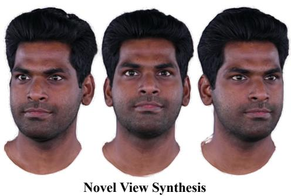

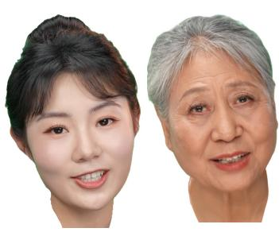  
Face Reenactment

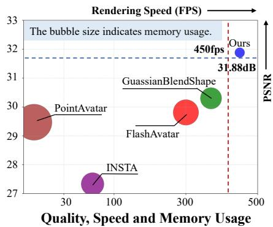  
Figure 1. Left and Middle: A monocular portrait video of an individual is used to reconstruct a 4D avatar, facilitating novel-view synthesis and facial reenactment. Right: Our method is compared with state-of-the-art approaches in terms of visual quality, rendering speed and memory usage, showcasing superior rendering quality coupled with computational efficiency and minimal memory usage.

## Abstract

Existing radiance field-based head avatar methods have mostly relied on pre-computed explicit priors (e.g., mesh, point) or neural implicit representations, making it challenging to achieve high fidelity with both computational efficiency and low memory consumption. To overcome this, we present GPAvatar, a novel and efficient Gaussian splatting-based method for reconstructing high-fidelity dynamic 3D head avatarsfrom monocular videos. We extend Gaussians in 3D space to a high-dimensional embedding space encompassing Gaussian’s spatial position and avatar expression, enabling the representation ofthe head avatar with arbitrary pose and expression. To enable splatting-based rasterization, a linear transformation is learned to project each high-dimensional Gaussian back to the 3D space, which is sufficient to capture expression variations instead ofusing complex neural networks. Furthermore, we propose an adaptive densifica-

tion strategy that dynamically allocates Gaussians to regions with high expression variance, improving the facial detail representation. Experimental results on three datasets show that our method outperforms existing state-of-the-art methods in rendering quality and speed while reducing memory usage in training and rendering.

## 1. Introduction

With the rapid development of virtual reality and augmented reality technologies, digital human technology demonstrates substantial real-world relevance, while placing higher demands on rendering quality, generation efficiency, and resource consumption. Especially in film production, game development, and social media, high-fidelity digital human technology can deliver a deeply immersive experience to users. We propose an avatar capable of rendering digital humans with high quality while ensuring rendering efficiency and reduced resource consumption.

Given the complexity of human head shape, appearance, and movement, the precise reconstruction of head avatar details from monocular videos reminds a considerable challenge. Methods [5, 9, 10, 19, 32] based on neural radiance fields (NeRF) [20] improved the rendering quality, but resulting in high computational resource demands and difficulty in achieving real-time rendering. Some approachs [3, 7, 33, 44] utilize hashing encoding [21] and tensor decomposition [4] to reduce training time from days to hours. However, they remain inadequate in achieving the high realism required for generation quality and real-time rendering speed.

Recently, 3D Gaussian Splatting (3DGS) [13] represents a high-quality and efficient method for the characterization of static scenes. Many works [2, 16, 18, 26, 27, 30, 31, 35, 40] have explored various approaches to enable animatable head avatar reconstruction using 3DGS. However, these methods typically rely on parametric face models or geometric priors, which may limit the potential to represent intricate facial details and subtle dynamics. [18, 31] require specialized handling for non-facial regions, such as teeth and hair, adding complexity to the workflow and increasing computational overhead. Some methods [1, 2, 16, 30] use neural implicit field to predict Gaussian attributes, which leads to significant memory requirements during both training and inference. This high GPU memory demand limits their broad applicability, making these methods less suitable for widespread adoption, especially in scenarios with limited hardware resources.

Current methods make trade-offs among high-quality modeling, efficient rendering, and low computational resource requirements, and thus fall short of meeting the demands of practical applications. In contrast, our approach achieves high-quality head rendering while maintaining rendering efficiency and minimizing computational resource consumption. To this end, we propose GPAvatar, a novel and unified Gaussian-based representation for rendering photorealistic head avatars with intricate facial details. Our method extends Gaussians in 3D space to a higher-dimensional embedding space encompassing Gaussian’s spatial position and avatar expression, enabling the representation of the head avatar with arbitrary pose and expression. To enable splatting-based rasterization, a linear transformation is learned to project each high-dimensional Gaussian back to the 3D space, which is sufficient to capture expression variations instead of using complex neural networks. Additionally, we propose an adaptive densification strategy that dynamically allocates Gaussians to regions with high expression variance, enhancing the rendering quality of facial details, such as teeth, wrinkles, and hair.

In summary, our contributions are as follows:

• We propose GPAvatar, an efficient Gaussian-based representation for high-fidelity head avatars from monocular videos. We extend Gaussians in 3D space to a highdimensional embedding space encompassing Gaussian’s spatial position and avatar expression, enabling reconstruction of the head avatar with arbitrary pose and expression.

• We propose a learnable Gaussian projection method to map each high-dimensional Gaussian back to the 3D space, effectively capturing expression variations without requiring complex neural networks.

• We propose an adaptive densification strategy that dynamically allocates Gaussians to regions with high expression variance, enhancing the rendering quality of facial details, such as teeth, hair and glasses.

## 2. Related Work

## 2.1. Dynamic Radiance Field

NeRF has made significant progress in reconstructing static scenes. However, extending NeRF to dynamic scenes remains a significant challenge. Currently, there are two approaches to extend static scene NeRF to dynamic scenes. The first approach [6, 17, 29] is based on spatiotemporal encoding, where time is directly used as an input to the neural radiance field. These methods are relatively straightforward but require significant memory and training time overhead. Another approach [22, 23, 25] is to use a deformation field along with a canonical space to model dynamic scenes. These methods are far from satisfying the real-time requirements of Dynamic Avatar Modeling in terms of training and rendering time. 3DGS [13] has demonstrated impressive performance in terms of rendering efficiency and quality for static scenes. DeGS [37] and SCGS [11] uses an MLPbased deformation field to predict the incremental changes of Gaussian attributes at each time step. 4D Gaussian Splatting [36] models the dynamics at each timestamp by slicing the 4D Gaussians over time, constructing a dynamic scene. While these methods can render dynamic scenes realistically and produce highly realistic novel-view renderings, they lack control over expression parameters, making them unsuitable for direct extension to digital head modeling. Consequently, applying dynamic Gaussian modeling to 3D head avatar reconstruction becomes a highly promising yet challenging approach.

## 2.2. Head Portrait Synthesis from Monocular Video

Reconstructing and animating 3D head avatars from monocular videos, while capturing head poses and facial expressions, is still a challenging area of research. Several studies have focused on explicit avatar representations using meshes or point clouds. Neural Head Avatars [8] combines a coarse morphable model with neural-based refinements to predict voxel offsets, modeling geometry and texture explicitly. PointAvatar [42] proposes a deformable point-based representation where each point maintains a uniform radius. The rendering results rely on geometric modeling, which can result in artificial artifacts.

Another research involves extending implicit neural radiance representations. NerFACE [5] employs a dynamic NeRF [20] with a morphable head model to control pose and expression. IMAvatar [41] learns an implicit deformation field mapping from canonical space to observation, influenced by expression parameters and pose. Recent advancements also focus on fast training and interactive rendering. INSTA [44] integrates a tracked FLAME [15] mesh as a geometric prior, while NeRFBlendShape [7] uses a blendshape model to manipulate a multi-level hash grid field. Avatar-Mav [33] and LatentAvatar [34] adopt blending techniques to achieve efficient head modeling. While these methods have improved rendering quality, neural radiance representations impose substantial computational overhead, making them impractical for real-world applications.

Recently, 3DGS has shown remarkable performance in both reconstruction quality and rendering efficiency. Many works leverage 3D Morphable Models (3DMMs) or implicit neural field to model dynamic variations and achieve controllability. GaussianAvatars [26] binds 3D Gaussian Splats to the FLAME mesh, enabling avatar driving through FLAME deformations. GaussianHead [30] uses neural networks to deform Gaussian attributes, while FlashAvatar [31] attaches 3D Gaussians to mesh surfaces and learns an offset network for deformation. MonoGaussianAvatar [1] expands upon PointAvatar by using Gaussian primitives to learn offset networks, person-specific deformation blendshapes, and skinning weights. GaussianBlendshapes [18] represents each expression blendshape as a set of 3D Gaussians, learning the difference between neutral Gaussians and blendshape properties. However, despite these advancements, these methods often suffer from high computational demands and limited control over fine-grained details, making them less suitable for applications requiring real-time, high-quality rendering with minimal resource consumption. Our method uses a simple learnable linear transformation to animate head avatars under different expressions, making it highly efficient during inference. Compared to FlashAvatar, which achieves 100fps with 50k Gaussians, and GaussianBlendshapes, which achieves 370fps with 70k Gaussians, our method reaches 450fps with 100k Gaussians.

## 3. Method

In this section, we present our method for reconstructing high-fidelity, animatable head avatars using an extended version of 3DGS [13]. Our approach expands the original 3D Gaussian representation into a higher-dimensional space, conditioned on expressions to enable precise modeling over facial expressions and head movements. We first provide an overview of the 3DGS method, followed by our adaptation to handle dynamic avatar representations through expression conditioning. This allows for photorealistic and responsive rendering of head avatars. We also describe the optimization process, including efficient training and Gaussian densification strategy to enhance visual quality.

## 3.1. Preliminary: 3D Gaussian Splatting

3DGS is represented by explicit Gaussian point clouds, achieving impressive results in both rendering quality and speed for static scenes. The shape (scale and rotation) of each Gaussian in the space is determined by a three-dimensional covariance matrix $\Sigma ,$ , and its spatial position $\mu ,$ expressed as:

$$
G ( x ) = \exp \left( - \frac { 1 } { 2 } ( x - \mu ) ^ { T } \Sigma ^ { - 1 } ( x - \mu ) \right) .\tag{1}
$$

The properties of the Gaussians encompass optical properties such as opacity α and spherical harmonic (SH) coefficients. During rendering, it is necessary to rasterize the 3D Gaussians onto a 2D camera plane. Given a view transformation W, and the Jacobian of the affine approximation of the projective transformation $^ { J , }$ the 2D covariance matrix in the camera coordinates can be represented as:

$$
\Sigma ^ { \prime } = J W \Sigma W ^ { T } J ^ { T } .\tag{2}
$$

Subsequently, the color $C$ of each pixel is computed through a classical point-based α-blending technique, which involves blending M sorted Gaussians overlapping the pixel:

$$
C = \sum _ { i \in M } c _ { i } \alpha _ { i } \prod _ { j = 1 } ^ { i - 1 } ( 1 - \alpha _ { j } ) ,\tag{3}
$$

where $c _ { i }$ is computed from SH and $\alpha _ { i }$ is computed by the learnable opacity multiplied 2D Gaussian with covariance $\Sigma ^ { \prime }$ . The entire rendering process is efficiently implemented through a differentiable tile-based rasterizer on GPU, achieving real-time rendering with high quality. We summarize and formulate the entire rendering process $\mathcal { R } _ { : }$ , involving M Gaussians to produce an image I as $\mathcal { T } = \mathcal { R } ( \mu ^ { M } , \Sigma ^ { M } , c ^ { M } , \alpha ^ { M } )$

## 3.2. Expression Conditioned Gaussian Projection

3DGS is a high-fidelity reconstruction method for static scenes, but for applications such as head avatars, it is imperative to impose additional conditions on Gaussians. These conditions are tailored to the unique requirements of head avatar modeling, ensuring precise control and responsiveness to subtle variations in facial expressions and head movements, distinct from general dynamic scene considerations.

Yang et al. [38] adds a marginal temporal Gaussian distribution into the origin 3D Gaussians, which extend 3D Gaussians into 4D space. Inspired by [38], we extend 3D Gaussians into much more higher n + 3 dimensional space by adding incorporating an n-dim expression code for head avatar representation. Vanilla 3DGS posits that the Gaussians are normally distributed regarding the spatial position $x \in \mathbb { R } ^ { 3 }$ . In our extension, we further assume that the joint distribution of the position x and the expression coefficient $z \in \mathbb { R } ^ { n }$ constitutes a normal distribution within an $n + 3$ dimensional space, represented as $( x , z ) \sim \mathcal { N } ( \mu , \Sigma )$ , where $\pmb { \mu } = [ \mu _ { x } , \mu _ { z } ]$ and $\Sigma = \left\lceil \begin{array} { l l } { \sum _ { x , x } } & { \sum _ { x , z } } \\ { \sum _ { z , x } } & { \sum _ { z , z } } \end{array} \right\rceil$ denote the mean and covariance of the joint normal distribution.

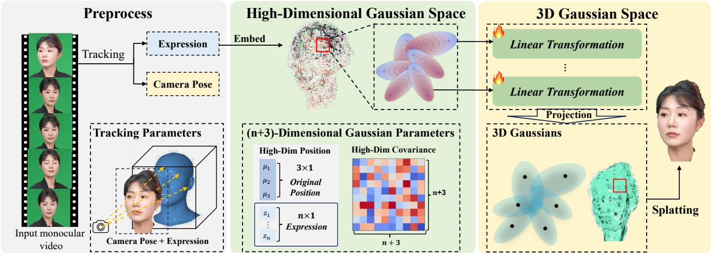  
Figure 2. Overview of GPAvatar. Our method introduce a higher-dimensional embedding space that combines spatial position and expression features, allowing for flexible representation of head avatars with arbitrary poses and expressions, which is from face tracking during preprocess. A learnable linear transformation then projects each high-dimensional Gaussian back into 3D space, enabling splatting-based rasterization without relying on complex neural networks. This approach efficiently captures expression variations, facilitating high-fidelity reconstruction with low memory consumption.

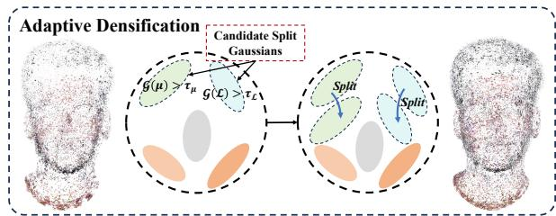  
Figure 3. Illustration of Adaptive Densification strategy.

When conditioned by a given expression coefficient ${ \mathcal { Z } } ,$ the $n + 3$ dimensional normal distribution is projected to a conditional 3D normal distribution over the spatial position x. This can be represented by the following 3D Gaussian form:

$$
G ( x | \mathcal { Z } ) = \exp { \left( - \frac { 1 } { 2 } ( x - \mu _ { x | \mathcal { Z } } ) ^ { T } \Sigma _ { x | \mathcal { Z } } ^ { - 1 } ( x - \mu _ { x | \mathcal { Z } } ) \right) }\tag{4}
$$

where $\mu _ { x | \mathcal { Z } }$ and $\Sigma _ { x | \mathcal { Z } }$ represent the mean and covariance of the projected Gaussians, respectively. These can be expressed using the conditional distributions of the multivariate normal distribution :

$$
\mu _ { x | \mathcal { Z } } = \mu _ { x } + \Sigma _ { x , z } \Sigma _ { z , z } ^ { - 1 } ( \mathcal { Z } - \mu _ { z } ) , \mathrm { a n d }\tag{5}
$$

$$
\Sigma _ { x | \mathcal { Z } } = \Sigma _ { x , x } - \Sigma _ { x , z } \Sigma _ { z , z } ^ { - 1 } \Sigma _ { z , x } .\tag{6}
$$

Following previous works [18, 31, 44], we use a FLAMEbased tracker [43] to extract expression coefficients of each input frame. We treat the face tracker as a mapping function that projects the input image into a latent expression space $z \in \mathbb { R } ^ { n }$ , where expression coefficients are disentangled from shape and appearance.

It is noteworthy that for varying values $\mathcal { Z } , \Sigma _ { x | \mathcal { Z } }$ is constant and $\mu _ { x | \mathcal { Z } }$ is only relevanted to $\Sigma _ { x , z } \Sigma _ { z , z } ^ { - 1 }$ . the final mean and covariance are exclusively associated with Z. So we can simplify Eq. (5) and Eq. (6) to:

$$
\mu _ { x | \mathcal { Z } } = \hat { \mu _ { x } } + L ( \mathcal { Z } ) , \mathrm { a n d }\tag{7}
$$

$$
\Sigma _ { x | \mathcal { Z } } = \hat { \Sigma }\tag{8}
$$

where $L ( \cdot ) : \mathbb { R } ^ { n } \to \mathbb { R } ^ { 3 }$ represents $\Sigma _ { x , z } \Sigma _ { z , z } ^ { - 1 }$ is a linear transformation with 3n learnable parameters on each Gaussian. The entire head avatar rendering process can be defined as:

$$
\boldsymbol { \mathcal { I } } ( \boldsymbol { \mathcal { Z } } ) = \mathcal { R } \big ( \hat { \mu _ { x } } ^ { M } + \boldsymbol { L } ^ { M } ( \boldsymbol { \mathcal { Z } } ) , \hat { \Sigma } ^ { M } , c ^ { M } , \alpha ^ { M } \big ) .\tag{9}
$$

## 3.3. Optimization

During training, we jointly optimize all the learnable parameters mentioned above in bold. We utilize SSIM loss $\mathcal { L } _ { \mathrm { S S I M } }$ and perceptual loss $\mathcal { L } _ { \mathrm { L P I P S } }$ with VGG [28] backbone to measure the quality loss of the rendered images:

$$
\mathcal { L } _ { \mathrm { S S I M } } = 1 - \mathrm { S S I M } ( \mathcal { I } , \mathcal { I } ^ { g t } ) ,\tag{10}
$$

$$
\mathcal { L } _ { \mathrm { L P I P S } } = \mathrm { V G G } ( \mathbb { Z } , \mathbb { Z } ^ { g t } ) .\tag{11}
$$

Table 1. Quantitative comparisons between INSTA [44], PointAvatar [42], FlashAvatar [31], GaussianBlendShapes [18] and our method. Ours-Light refers to the light configuration proposed in Sec. 3.4. Partial metrics of INSTA and PointAvatar are borrowed from [18].
<table><tr><td rowspan="2" colspan="2">Datasets</td><td colspan="8">INSTA dataset (512 × 512)</td><td colspan="4">GBS dataset (1024 × 1024)</td><td rowspan="2"> $\operatorname { A v g } .$ </td></tr><tr><td>bala</td><td>biden</td><td>justin</td><td>malte_1</td><td>marcel</td><td>nf_01</td><td>nf_03</td><td>wojtek_1</td><td>subject1</td><td>subject2 subject3</td><td>subject4</td></tr><tr><td rowspan="6">PSNR ↑</td><td>INSTA</td><td>28.66</td><td>28.38</td><td>29.74</td><td>26.27 27.46</td><td>23.75 24.60</td><td>25.89 28.34</td><td>26.10 29.82</td><td>29.84 31.94</td><td>28.88 31.43</td><td>28.16</td><td>28.60 30.83</td><td>27.93</td></tr><tr><td>PointAvatar</td><td>29.60</td><td>31.72</td><td>32.31</td><td></td><td></td><td></td><td></td><td></td><td>32.57</td><td>30.95</td><td>32.57</td><td>30.28</td></tr><tr><td>FlashAvatar</td><td>32.90</td><td>32.15</td><td>32.11</td><td>28.20</td><td>26.24</td><td>27.42</td><td>28.51</td><td>31.70</td><td>30.06</td><td>31.70 30.21</td><td>32.35</td><td>30.30</td></tr><tr><td>GaussianBlendShapes</td><td>33.40</td><td>32.52</td><td>32.63</td><td>28.45</td><td>26.57</td><td>27.92</td><td>28.65</td><td>32.63</td><td>33.38</td><td>33.63 32.09</td><td>34.11</td><td>31.33</td></tr><tr><td>Ours-Light</td><td>34.83</td><td>32.76</td><td>34.28</td><td>30.63</td><td>27.60</td><td>29.54</td><td>30.39</td><td>33.03</td><td>33.45</td><td>33.09</td><td>32.07 33.76</td><td>32.12</td></tr><tr><td>Ours</td><td>35.05</td><td>32.93</td><td>34.55</td><td>31.00</td><td>27.53</td><td>30.10</td><td>31.08</td><td>33.21</td><td>34.12</td><td>34.10</td><td>32.70 34.08</td><td>32.54</td></tr><tr><td rowspan="5">SSIM↑</td><td>INSTA</td><td>0.9130</td><td>0.9484</td><td>0.9530</td><td>0.9262</td><td>0.9133 0.9246</td><td>0.9129</td><td>0.9457</td><td>0.9195</td><td>0.9443</td><td>0.9078</td><td>0.9445</td><td>0.9294</td></tr><tr><td>PointAvatar</td><td>0.9099</td><td>0.9565</td><td>0.9595</td><td>0.9225</td><td>0.9121</td><td>0.9278 0.9208</td><td>0.9502</td><td>0.9219</td><td>0.9463</td><td>0.9062</td><td>0.9433</td><td>0.9314</td></tr><tr><td>FlashAvatar</td><td>0.9353</td><td>0.9633</td><td>0.9607</td><td>0.9410</td><td>0.9154</td><td>0.9325</td><td>0.9228</td><td>0.9508</td><td>0.8829 0.9321</td><td>0.8597</td><td>0.9280</td><td>0.9270</td></tr><tr><td>GaussianBlendShapes</td><td>0.9497</td><td>0.9664</td><td>0.9680</td><td>0.9463</td><td>0.9271</td><td>0.9435</td><td>0.9367</td><td>0.9641</td><td>0.9387</td><td>0.9610 0.9280</td><td>0.9641</td><td>0.9495</td></tr><tr><td>Ours-Light</td><td>0.9574</td><td>0.9672</td><td>0.9743 0.9753</td><td>0.9513 0.9552</td><td>0.9388</td><td>0.9480</td><td>0.9470</td><td>0.9659</td><td>0.9423</td><td>0.9612</td><td>0.9278 0.9614</td><td>0.9536</td></tr><tr><td rowspan="7"></td><td>Ours</td><td>0.9654</td><td>0.9692</td><td></td><td>0.9403</td><td>0.9514</td><td>0.9521</td><td>0.9711</td><td>0.9486</td><td>0.9672</td><td>0.9364</td><td>0.9665</td><td>0.9582</td></tr><tr><td>INSTA</td><td>0.0817</td><td>0.0545</td><td>0.0614</td><td>0.0751</td><td>0.1540</td><td>0.1285 0.1137</td><td>0.0588</td><td>0.1536</td><td>0.1208</td><td>0.1733</td><td>0.1144</td><td>0.1075</td></tr><tr><td>PointAvatar</td><td>0.0821</td><td>0.0535</td><td>0.0649</td><td>0.0718</td><td>0.1574</td><td>0.1350</td><td>0.1221 0.0661</td><td></td><td>0.1568</td><td>0.1190 0.1715</td><td>0.1285</td><td>0.1107</td></tr><tr><td>FlashAvatar</td><td>0.0382</td><td>0.0312</td><td>0.0473</td><td>0.0418</td><td>0.1112</td><td>0.0891</td><td>0.0794</td><td>0.0534</td><td>0.1674</td><td>0.1086 0.1527</td><td>0.1251</td><td>0.0871</td></tr><tr><td>GaussianBlendShapes</td><td>0.0770 0.0538</td><td>0.0525 0.0385</td><td>0.0639 0.0433</td><td>0.0712</td><td>0.1446</td><td>0.1196 0.1024</td><td>0.0982 0.0791</td><td>0.0592 0.0449</td><td>0.1529 0.1291</td><td>0.1200 0.1699</td><td>0.1105</td><td>0.1033</td></tr><tr><td>Ours-Light</td><td>0.0257</td><td>0.0273</td><td>0.0326</td><td>0.0531 0.0335</td><td>0.1180 0.0850</td><td>0.0735</td><td>0.0558</td><td></td><td></td><td>0.0980 0.1396 0.0906</td><td>0.0808 0.0630</td><td>0.0817</td></tr><tr><td>Ours</td><td></td><td></td><td></td><td></td><td></td><td></td><td></td><td>0.0237</td><td>0.0850</td><td>0.0652</td><td></td><td>0.0551</td></tr></table>

Backward propagation is relatively slow when performed with perceptual loss, so we apply perceptual loss every 5 iterations randomly. L1 loss is employed to measure the pixel-wise difference between the rendered images and the real images:

$$
\mathcal { L } _ { 1 } = \left. \mathcal { I } - \mathcal { I } ^ { g t } \right. _ { 1 } .\tag{12}
$$

As there are quite many learnable parameters in our model, giving the ability of fine details also increasing the overfitting cases. To prevent overfitting, an L2 regularization term $\mathcal { L } _ { \boldsymbol { r } \boldsymbol { e } g }$ is applied to L on every Gaussian:

$$
\mathcal { L } _ { r e g } = \sum \| L \| _ { 2 }\tag{13}
$$

In summary, the overall loss of training our model is defined as:

$$
\mathcal { L } _ { t o t a l } = \lambda _ { 1 } \mathcal { L } _ { 1 } + \lambda _ { 2 } \mathcal { L } _ { \mathrm { S S I M } } + \mathbb { I } _ { p \leq 0 . 2 } \lambda _ { 3 } \mathcal { L } _ { \mathrm { L P I P S } } + \lambda _ { 4 } \mathcal { L } _ { r e g } ,\tag{14}
$$

where we set $\lambda _ { 1 } = 0 . 8 , \lambda _ { 2 } = 0 . 1 , \lambda _ { 3 } = 0 . 3$ and $\lambda _ { 4 } = 0 . 0 8 .$

Inspired by 3DGS, we use a sigmoid activation function for L to constrain its range and obtain smooth gradients. As shown in Fig. 3, for the adaptive density control of Gaussians, we adopt the majority densification and pruning strategies from 3DGS.When the average gradient at the position $\mu$ of Gaussian surpasses a gradient threshold $\tau _ { \mu } ,$ , the strategy selects either to duplicate or split the Gaussian based on its scale. We further apply this strategy to layer $L \colon$ when the gradient of L exceeds the gradient threshold $\tau _ { L }$ we randomly sample a position within the movement range of this Gaussian to duplicate it to this new location and divide the parameter values of L by 2. To prevent an excessive increase in the number of Gaussians leading to higher memory usage and computational cost, we prune Gaussians with an opacity less than $\tau _ { \alpha }$

## 3.4. Implementation Details

We implement our approach using PyTorch [24] and differentiable 3D Gaussian rasterization [13]. For Gaussian initialization, as some datasets lack mesh data and cannot utilize 3DMM geometric information, we maintain methodological consistency by initializing through uniformly sampling 2,500 points on a sphere using the Golden Spiral algorithm.

During optimization, we use an Adam optimizer [14] with $\beta = [ 0 . 9 , 0 . 9 9 9 ]$ ]. We set the learning rate for linear layers to $3 \times 1 0 ^ { - 4 }$ . The learning rates for Gaussian positions and spherical harmonics are aligned with those used in the origin 3DGS. For scale factors and rotation quaternions, we set them to 0.1× those of vanilla 3DGS. Our standard model is trained 50 epochs and tested on a single RTX 4090 GPU, taking about 1 hour. From the 500-th iteration to the 30-th epoch, densification and pruning are performed every 500 iterations with $\tau _ { \mu } = 3 \times 1 0 ^ { - 4 } , \tau _ { L } = 1 \times 1 0 ^ { - 3 }$ and $\tau _ { \alpha } = 5 \times 1 0 ^ { - 3 }$ , opacity is set to 0.01 every 6,000 iterations. We also provide a light configuration optimized for faster training and inference, which is trained for 12 epochs, with densification and pruning performed every 500 iterations until the 6th epoch. This light configuration takes about 10 minutes to train and incurs a slight reduction in rendering quality.

## 4. Experiments

## 4.1. Baselines and Datasets

We compare our method with several state-of-the-art methods, including PointAvatar [42], INSTA [44], FlashAvatar [31] and GaussianBlendShapes [18]. These methods are trained until convergence. For FlashAvatar, we increase the UV resolution to 256 to achieve better results. Our experimental analysis is carried out on two public datasets as well as our own dataset. The INSTA dataset includes 8 identities from [44] with 512 × 512 resolution, and the GBS dataset includes 4 identities from [18] with 1024 × 1024 resolution. Each data of the same identity contains about 3 minutes (2000-4000 frames) of monocular video with diverse expressions and head rotations. Following the settings of previous works, we use the last 350 frames as the test set for the self-reenactment task.

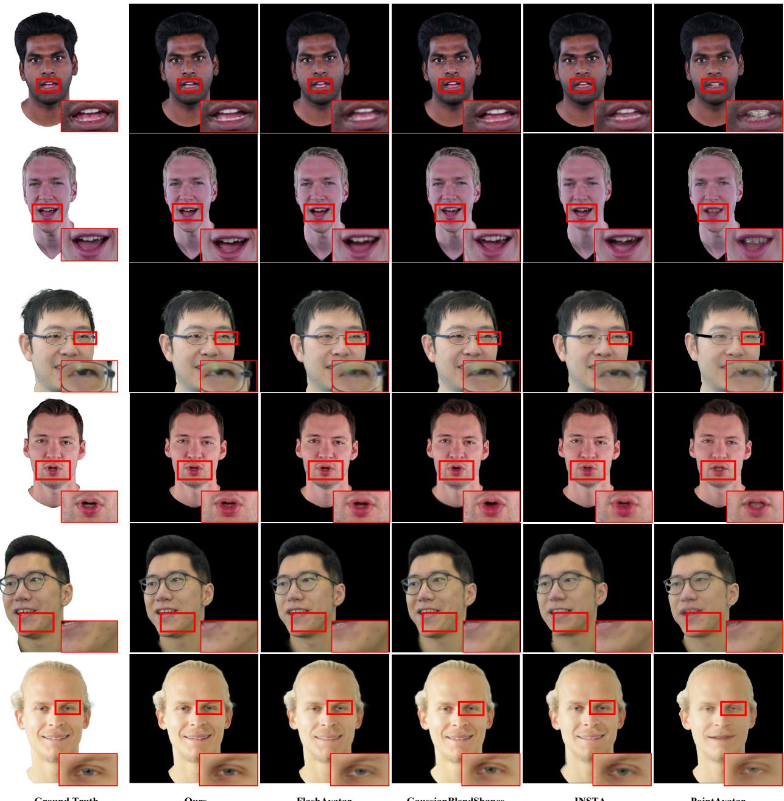  
Figure 4. Qualitative comparisons of self-reenactment results with state-of-the-art methods on INSTA dataset.

To evaluate the model capacity on longer videos, we collected our own dataset, which includes 7 professional actors, who may have subtle makeup or light beauty enhancements. Each actor was recorded for approximately 7 minutes (10000 frames) in monocular video, with the last 750 frames reserved for the test set. We cropped the head regions and resized the videos to a resolution of 1024 × 1024 and extract the expression coefficients of FLAME model through Metrical Photometric Tracker [43]. The backgrounds were removed using MODNet [12].

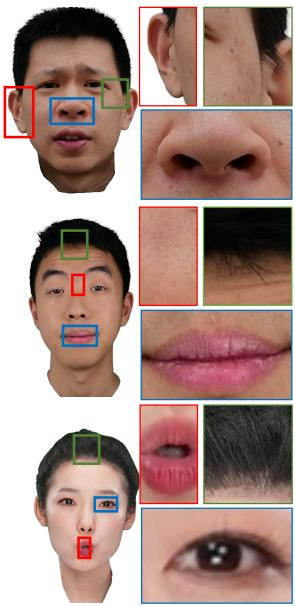  
Ground Truth

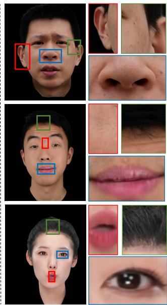  
Ours  
GaussianBlendShapes

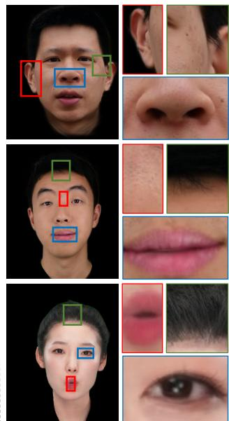  
FlashAvatar

Figure 5. Qualitative comparisons of self-reenactment results with Gaussian-based method on datasets at 1024×1024 resolution. Our method accurately reconstructs the high-resolution head avatar, demonstrating superior quality, particularly in capturing fine details of hair, teeth pores and freckles.  
Table 2. Quantitative comparisons between FlashAvatar (FA for short), GaussianBlendShapes (GBS for short) and our method on different actors from our dataset at 1024 × 1024 resolution.
<table><tr><td></td><td>Method</td><td>actor1</td><td>actor2</td><td>actor3</td><td>actor4</td><td>actor5</td><td>actor6</td><td>actor7</td><td>Avg.</td></tr><tr><td rowspan="3">PSNR ↑</td><td>FA</td><td>27.67</td><td>25.74</td><td>25.22</td><td>26.71</td><td>26.39</td><td>29.03</td><td>28.24</td><td>27.00</td></tr><tr><td>GBS</td><td>29.05</td><td>27.78</td><td>26.84</td><td>29.26</td><td>28.83</td><td>33.21</td><td>31.44</td><td>29.49</td></tr><tr><td>Ours</td><td>30.38</td><td>27.68</td><td>27.45</td><td>30.14</td><td>28.45</td><td>33.20</td><td>32.15</td><td>29.92</td></tr><tr><td rowspan="3">SSIM↑</td><td>FA</td><td>0.9284</td><td>0.8922</td><td>0.8992</td><td>0.9202</td><td>0.9189</td><td>0.9422</td><td>0.9198</td><td>0.9173</td></tr><tr><td>GBS</td><td>0.9363</td><td>0.9084</td><td>0.9165</td><td>0.9437</td><td>0.9362</td><td>0.9710</td><td>0.9459</td><td>0.9369</td></tr><tr><td>Ours</td><td>0.9535</td><td>0.9250</td><td>0.9326</td><td>0.9593</td><td>0.9506</td><td>0.9765</td><td>0.9561</td><td>0.9505</td></tr><tr><td rowspan="3">LPIPS ↓</td><td>FA</td><td>0.0675</td><td>0.0887</td><td>0.0936</td><td>0.0799</td><td>0.0753</td><td>0.0792</td><td>0.0655</td><td>0.0785</td></tr><tr><td>GBS</td><td>0.1154</td><td>0.1337</td><td>0.1380</td><td>0.1123</td><td>0.1147</td><td>0.0847</td><td>0.0845</td><td>0.1119</td></tr><tr><td>Ours</td><td>0.0676</td><td>0.0880</td><td>0.0915</td><td>0.0689</td><td>0.0741</td><td>0.0519</td><td>0.0527</td><td>0.0707</td></tr></table>

Table 3. Performance comparisons with training and testing on an RTX 4090 GPU. The rendering resolution is 512×512. PointAvatar is trained and tested on A800 GPU.
<table><tr><td></td><td>Training</td><td>Runtime</td><td>Mem. (train)</td><td>Mem. (runtime)</td></tr><tr><td>INSTA</td><td>10min</td><td>70fps</td><td>16G</td><td>4G</td></tr><tr><td>PointAvatar*</td><td>3.5h</td><td>5fps</td><td>40G</td><td>32G</td></tr><tr><td>NeRFBlendShape</td><td>20min</td><td>26fps</td><td>7G</td><td>2G</td></tr><tr><td>FlashAvatar</td><td>2h</td><td>100fps</td><td>2.5G</td><td>1.5G</td></tr><tr><td>GaussianBlendShapes</td><td>25min</td><td>370fps</td><td>14G</td><td>2G</td></tr><tr><td>Ours-Light</td><td>10min</td><td>500fps</td><td>1.5G</td><td>0.8G</td></tr><tr><td>Ours</td><td>1h</td><td>450fps</td><td>2.5G</td><td>1.5G</td></tr></table>

## 4.2. Result and Comparison

In this section, we compare the rendering quality and speed of our method to the state-of-the-art in head avatar reconstruction and facial reenactment.

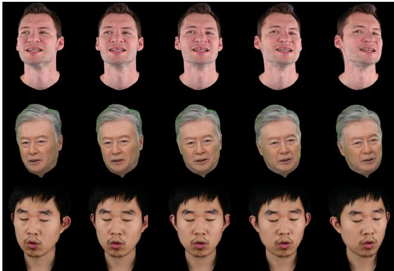  
Figure 6. Qualitative results for novel view synthesis.

We perform a quantitative evaluation of the state-of-theart methods across 3 datasets. The evaluation metrics employed include Peak Signal-to-Noise Ratio (PSNR), Structural Similarity Index (SSIM), and Learned Perceptual Image Patch Similarity (LPIPS) [39]. As indicated in Tab. 1 and Tab. 2, our method shows a modest improvement compared to previous methods. Qualitative comparisons with state-ofthe-art method for the self-reenactment task across various subjects are illustrated in Fig. 4 and Fig. 5. Our method shows superior performance in preserving fine details, such as facial textures, hair, and teeth, which are often challenging for competing methods to accurately reproduce.

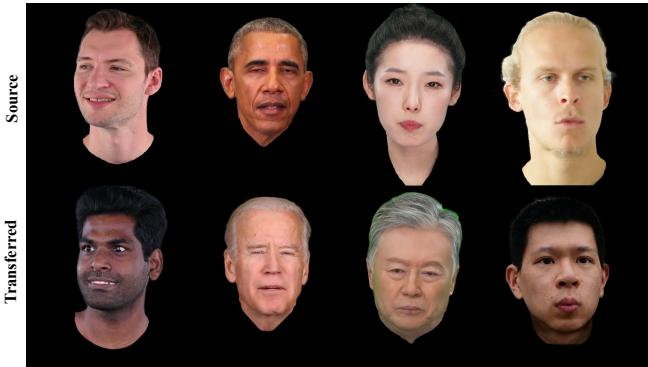  
Figure 7. Qualitative results of cross-reenactment task.

Table 4. Ablation of linear transformation on INSTA [44] dataset.
<table><tr><td>Method</td><td>PSNR ↑</td><td>Training</td><td>Runtime</td><td>Mem.(train)</td></tr><tr><td>MLP on µ</td><td>31.74</td><td>2.5h</td><td>160fps</td><td>10G</td></tr><tr><td>MLP on Σ</td><td>32.03</td><td>3h</td><td>120fps</td><td>12G</td></tr><tr><td>MLP on both</td><td>31.82</td><td>3h</td><td>140fps</td><td>8G</td></tr><tr><td>Ours</td><td>31.93</td><td>1h</td><td>450fps</td><td>2.5G</td></tr></table>

In Fig. 6, we present the results of the novel view synthesis, which highlight the strong 3D consistency of our method. Fig. 7 shows the qualitative results of the cross-identity reenactment task, demonstrating successful expression transfer while retaining the target identity’s unique features.

## 4.3. Ablation Study

## 4.3.1 Ablation on Linear Transformations

One fundamental question we address in our study is whether it is sufficient to model a head avatar solely based on linear transformations of the input expression coefficients, which alter the spatial position of Gaussians while preserving their shape (covariance matrix). To investigate this, we conducted experiments on the INSTA [44] dataset. In addition to our standard model, we evaluate three different configurations: a) Replacing the linear transformations with 3-layer Multi-Layer Perceptrons (MLPs); b) Utilizing 3-layer MLPs to predict changes in the covariance matrix based on the input expression parameters of Gaussians; c) A combination of both configurations a) and b). We report the average quantitative evaluation in Tab. 4, which shows that more complex modules do not significantly improve the overall results but instead increase the computational overhead. This suggests that our simpler design is not only more efficient, but also sufficient to achieve high-quality reconstructions.

## 4.3.2 Ablation on Optimization Strategies

In this section, we validate the effectiveness of the optimization strategies proposed in Sec. 3.3. To avoid overfitting, we introduce an L2 regularization loss in the linear transformation parameters. Furthermore, to achieve smoother gradients during training, we applied a sigmoid activation function to the linear transformation parameters, inspired by the original 3DGS [13]. We present qualitative results in Fig. 8, showing that our constraints effectively improve the quality of reconstruction.

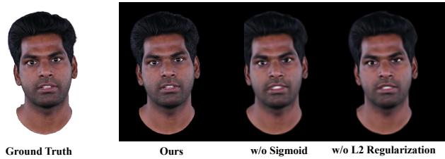

Figure 8. Ablation on our optimization strategies.  
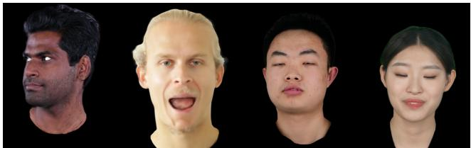  
Figure 9. Our method may fail under large novel views and expression extrapolation, potentially producing artifacts such as blurred results or incorrect handling of occlusions.

## 5. Conclusion and Discussion

In this work, we presented GPAvatar, a novel Gaussian-based representation for rendering photorealistic head avatars with intricate facial details. Our approach effectively balances computational and memory efficiency, significantly reducing rendering overhead while maintaining high visual fidelity. By extending 3D Gaussian Splatting to a higher-dimensional space conditioned on facial expressions, we achieve fine control over facial dynamics and subtle details, leading to highly realistic animations.

Limitations and Future Work. Compared to previous method like FlashAvatar [31] and GaussianBlend-Shapes [18], our method do not use geometry prior from parametric head models, which leads to bad robustness on expression and pose extrapolation as shown in Fig. 9. Future work could explore improving robustness in handling extreme facial expressions and head movements, as well as extending our approach to other types of avatars or scenes. Additionally, incorporating other modalities, such as audiodriven animation, could further enhance the realism and interactivity of the head avatars.

Acknowledgement. This work was supported by the National Natural Science Foundation of China (No. 62372025 and 62361146854).

## References

[1] Yufan Chen, Lizhen Wang, Qijing Li, Hongjiang Xiao, Shengping Zhang, Hongxun Yao, and Yebin Liu. Monogaussianavatar: Monocular gaussian point-based head avatar. In ACM SIGGRAPH 2024 Conference Papers, pages 1–9, 2024. 2, 3

[2] Helisa Dhamo, Yinyu Nie, Arthur Moreau, Jifei Song, Richard Shaw, Yiren Zhou, and Eduardo Perez-Pellitero.´ Headgas: Real-time animatable head avatars via 3d gaussian splatting. In European Conference on Computer Vision, pages 459–476. Springer, 2025. 2

[3] Hao-Bin Duan, Miao Wang, Jin-Chuan Shi, Xu-Chuan Chen, and Yan-Pei Cao. Bakedavatar: Baking neural fields for realtime head avatar synthesis. ACM Transactions on Graphics (TOG), 42(6):1–17, 2023. 2

[4] Jiemin Fang, Taoran Yi, Xinggang Wang, Lingxi Xie, Xiaopeng Zhang, Wenyu Liu, Matthias Nießner, and Qi Tian. Fast dynamic radiance fields with time-aware neural voxels. In SIGGRAPH Asia 2022 Conference Papers, pages 1–9, 2022. 2

[5] Guy Gafni, Justus Thies, Michael Zollhofer, and Matthias Nießner. Dynamic neural radiance fields for monocular 4d facial avatar reconstruction. In Proceedings ofthe IEEE/CVF Conference on Computer Vision and Pattern Recognition, pages 8649–8658, 2021. 2, 3

[6] Chen Gao, Ayush Saraf, Johannes Kopf, and Jia-Bin Huang. Dynamic view synthesis from dynamic monocular video. In Proceedings ofthe IEEE/CVF International Conference on Computer Vision, pages 5712–5721, 2021. 2

[7] Xuan Gao, Chenglai Zhong, Jun Xiang, Yang Hong, Yudong Guo, and Juyong Zhang. Reconstructing personalized semantic facial nerf models from monocular video. ACM Transactions on Graphics (TOG), 41(6):1–12, 2022. 2, 3

[8] Philip-William Grassal, Malte Prinzler, Titus Leistner, Carsten Rother, Matthias Nießner, and Justus Thies. Neural head avatars from monocular rgb videos. In Proceedings ofthe IEEE/CVF Conference on Computer Vision and Pattern Recognition, pages 18653–18664, 2022. 2

[9] Yudong Guo, Keyu Chen, Sen Liang, Yong-Jin Liu, Hujun Bao, and Juyong Zhang. Ad-nerf: Audio driven neural radiance fields for talking head synthesis. In Proceedings of the IEEE/CVF international conference on computer vision, pages 5784–5794, 2021. 2

[10] Yang Hong, Bo Peng, Haiyao Xiao, Ligang Liu, and Juyong Zhang. Headnerf: A real-time nerf-based parametric head model. In Proceedings of the IEEE/CVF Conference on Computer Vision and Pattern Recognition, pages 20374–20384, 2022. 2

[11] Yi-Hua Huang, Yang-Tian Sun, Ziyi Yang, Xiaoyang Lyu, Yan-Pei Cao, and Xiaojuan Qi. Sc-gs: Sparse-controlled gaussian splatting for editable dynamic scenes. In Proceedings of the IEEE/CVF Conference on Computer Vision and Pattern Recognition, pages 4220–4230, 2024. 2

[12] Zhanghan Ke, Jiayu Sun, Kaican Li, Qiong Yan, and Rynson WH Lau. Modnet: Real-time trimap-free portrait matting via objective decomposition. In Proceedings of the AAAI Conference on Artificial Intelligence, pages 1140–1147, 2022. 6

[13] Bernhard Kerbl, Georgios Kopanas, Thomas Leimkuhler, and¨ George Drettakis. 3d gaussian splatting for real-time radiance field rendering. ACM Trans. Graph., 42(4):139–1, 2023. 2, 3, 5, 8

[14] Diederik P Kingma. Adam: A method for stochastic optimization. arXiv preprint arXiv:1412.6980, 2014. 5

[15] Tianye Li, Timo Bolkart, Michael. J. Black, Hao Li, and Javier Romero. Learning a model of facial shape and expression from 4D scans. ACM Transactions on Graphics, (Proc. SIGGRAPH Asia), 36(6):194:1–194:17, 2017. 3

[16] Xinyang Li, Jiaxin Wang, Yixin Xuan, Gongxin Yao, and Yu Pan. Ggavatar: Geometric adjustment of gaussian head avatar. arXiv preprint arXiv:2405.11993, 2024. 2

[17] Zhengqi Li, Simon Niklaus, Noah Snavely, and Oliver Wang. Neural scene flow fields for space-time view synthesis of dynamic scenes. In Proceedings of the IEEE/CVF Conference on Computer Vision and Pattern Recognition, pages 6498– 6508, 2021. 2

[18] Shengjie Ma, Yanlin Weng, Tianjia Shao, and Kun Zhou. 3d gaussian blendshapes for head avatar animation. In ACM SIGGRAPH 2024 Conference Papers, pages 1–10, 2024. 2, 3, 4, 5, 6, 8

[19] Marko Mihajlovic, Aayush Bansal, Michael Zollhoefer, Siyu Tang, and Shunsuke Saito. Keypointnerf: Generalizing imagebased volumetric avatars using relative spatial encoding of keypoints. In European conference on computer vision, pages 179–197. Springer, 2022. 2

[20] Ben Mildenhall, Pratul P Srinivasan, Matthew Tancik, Jonathan T Barron, Ravi Ramamoorthi, and Ren Ng. Nerf: Representing scenes as neural radiance fields for view synthesis. In European Conference on Computer Vision, pages 405–421, 2020. 2, 3

[21] Thomas Muller, Alex Evans, Christoph Schied, and Alexander¨ Keller. Instant neural graphics primitives with a multiresolution hash encoding. ACM transactions on graphics (TOG), 41(4):1–15, 2022. 2

[22] Keunhong Park, Utkarsh Sinha, Jonathan T Barron, Sofien Bouaziz, Dan B Goldman, Steven M Seitz, and Ricardo Martin-Brualla. Nerfies: Deformable neural radiance fields. In Proceedings of the IEEE/CVF International Conference on Computer Vision, pages 5865–5874, 2021. 2

[23] Keunhong Park, Utkarsh Sinha, Peter Hedman, Jonathan T Barron, Sofien Bouaziz, Dan B Goldman, Ricardo Martin-Brualla, and Steven M Seitz. Hypernerf: A higherdimensional representation for topologically varying neural radiance fields. arXiv preprint arXiv:2106.13228, 2021. 2

[24] Adam Paszke, Sam Gross, Francisco Massa, Adam Lerer, James Bradbury, Gregory Chanan, Trevor Killeen, Zeming Lin, Natalia Gimelshein, Luca Antiga, et al. Pytorch: An imperative style, high-performance deep learning library. Advances in neural information processing systems, 32, 2019. 5

[25] Albert Pumarola, Enric Corona, Gerard Pons-Moll, and Francesc Moreno-Noguer. D-nerf: Neural radiance fields for dynamic scenes. In Proceedings ofthe IEEE/CVF Conference on Computer Vision and Pattern Recognition, pages 10318–10327, 2021. 2

[26] Shenhan Qian, Tobias Kirschstein, Liam Schoneveld, Davide Davoli, Simon Giebenhain, and Matthias Nießner. Gaussianavatars: Photorealistic head avatars with rigged 3d gaussians. In Proceedings of the IEEE/CVF Conference on Computer Vision and Pattern Recognition, pages 20299–20309, 2024. 2, 3

[27] Zhijing Shao, Zhaolong Wang, Zhuang Li, Duotun Wang, Xiangru Lin, Yu Zhang, Mingming Fan, and Zeyu Wang. Splattingavatar: Realistic real-time human avatars with mesh-embedded gaussian splatting. In Proceedings of the IEEE/CVF Conference on Computer Vision and Pattern Recognition, pages 1606–1616, 2024. 2

[28] Karen Simonyan and Andrew Zisserman. Very deep convolutional networks for large-scale image recognition. arXiv preprint arXiv:1409.1556, 2014. 4

[29] Chaoyang Wang, Lachlan Ewen MacDonald, Laszlo A Jeni, and Simon Lucey. Flow supervision for deformable nerf. In Proceedings of the IEEE/CVF Conference on Computer Vision and Pattern Recognition, pages 21128–21137, 2023. 2

[30] Jie Wang, Jiu-Cheng Xie, Xianyan Li, Feng Xu, Chi-Man Pun, and Hao Gao. Gaussianhead: Impressive head avatars with learnable gaussian diffusion. arXiv preprint arXiv:2312.01632, 2023. 2, 3

[31] Jun Xiang, Xuan Gao, Yudong Guo, and Juyong Zhang. Flashavatar: High-fidelity head avatar with efficient gaussian embedding. In Proceedings ofthe IEEE/CVF Conference on Computer Vision and Pattern Recognition, pages 1802–1812, 2024. 2, 3, 4, 5, 8

[32] Hongyi Xu, Guoxian Song, Zihang Jiang, Jianfeng Zhang, Yichun Shi, Jing Liu, Wanchun Ma, Jiashi Feng, and Linjie Luo. Omniavatar: Geometry-guided controllable 3d head synthesis. In Proceedings of the IEEE/CVF Conference on Computer Vision and Pattern Recognition, pages 12814–12824, 2023. 2

[33] Yuelang Xu, Lizhen Wang, Xiaochen Zhao, Hongwen Zhang, and Yebin Liu. Avatarmav: Fast 3d head avatar reconstruction using motion-aware neural voxels. In ACM SIGGRAPH 2023 Conference Proceedings, pages 1–10, 2023. 2, 3

[34] Yuelang Xu, Hongwen Zhang, Lizhen Wang, Xiaochen Zhao, Han Huang, Guojun Qi, and Yebin Liu. Latentavatar: Learning latent expression code for expressive neural head avatar. In ACM SIGGRAPH 2023 Conference Proceedings, pages 1–10, 2023. 3

[35] Yuelang Xu, Benwang Chen, Zhe Li, Hongwen Zhang, Lizhen Wang, Zerong Zheng, and Yebin Liu. Gaussian head avatar: Ultra high-fidelity head avatar via dynamic gaussians. In Proceedings of the IEEE/CVF conference on computer vision and pattern recognition, pages 1931–1941, 2024. 2

[36] Zeyu Yang, Hongye Yang, Zijie Pan, and Li Zhang. Real-time photorealistic dynamic scene representation and rendering with 4d gaussian splatting. arXiv preprint arXiv:2310.10642, 2023. 2

[37] Ziyi Yang, Xinyu Gao, Wen Zhou, Shaohui Jiao, Yuqing Zhang, and Xiaogang Jin. Deformable 3d gaussians for highfidelity monocular dynamic scene reconstruction. In Proceedings of the IEEE/CVF Conference on Computer Vision and Pattern Recognition, pages 20331–20341, 2024. 2

[38] Zeyu Yang, Hongye Yang, Zijie Pan, and Li Zhang. Real-time photorealistic dynamic scene representation and rendering with 4d gaussian splatting. In International Conference on Learning Representations (ICLR), 2024. 3

[39] Richard Zhang, Phillip Isola, Alexei A Efros, Eli Shechtman, and Oliver Wang. The unreasonable effectiveness of deep features as a perceptual metric. In Proceedings ofthe IEEE conference on computer vision and pattern recognition, pages 586–595, 2018. 7

[40] Zhongyuan Zhao, Zhenyu Bao, Qing Li, Guoping Qiu, and Kanglin Liu. Psavatar: A point-based morphable shape model for real-time head avatar creation with 3d gaussian splatting. arXiv preprint arXiv:2401.12900, 2024. 2

[41] Yufeng Zheng, Victoria Fernandez Abrevaya, Marcel C´ Buhler, Xu Chen, Michael J Black, and Otmar Hilliges. Im¨ avatar: Implicit morphable head avatars from videos. In Proceedings of the IEEE/CVF Conference on Computer Vision and Pattern Recognition, pages 13545–13555, 2022. 3

[42] Yufeng Zheng, Wang Yifan, Gordon Wetzstein, Michael J Black, and Otmar Hilliges. Pointavatar: Deformable pointbased head avatars from videos. In Proceedings of the IEEE/CVF Conference on Computer Vision and Pattern Recognition, pages 21057–21067, 2023. 2, 5

[43] Wojciech Zielonka, Timo Bolkart, and Justus Thies. Towards metrical reconstruction of human faces. In European Conference on Computer Vision, 2022. 4, 6

[44] Wojciech Zielonka, Timo Bolkart, and Justus Thies. Instant volumetric head avatars. In Proceedings of the IEEE/CVF Conference on Computer Vision and Pattern Recognition, pages 4574–4584, 2023. 2, 3, 4, 5, 6, 8