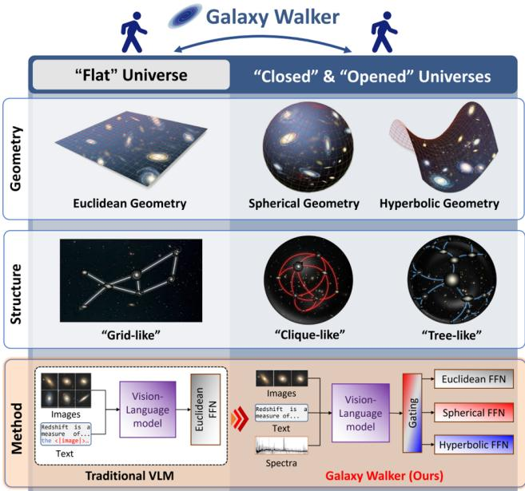
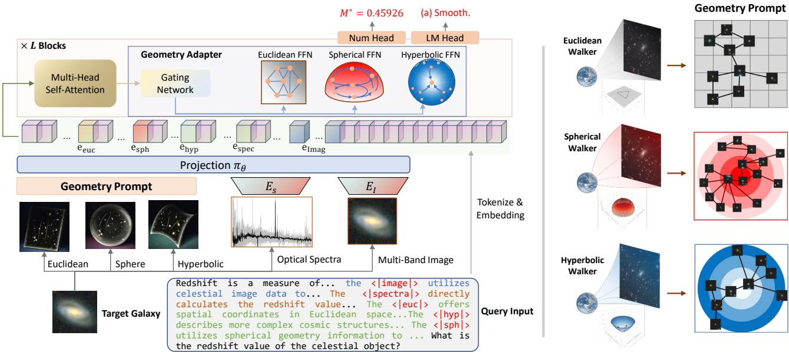
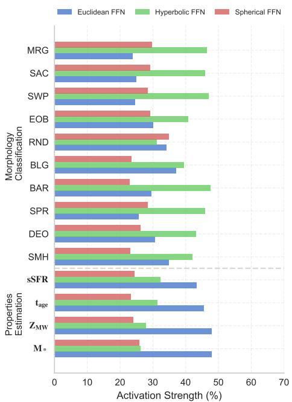
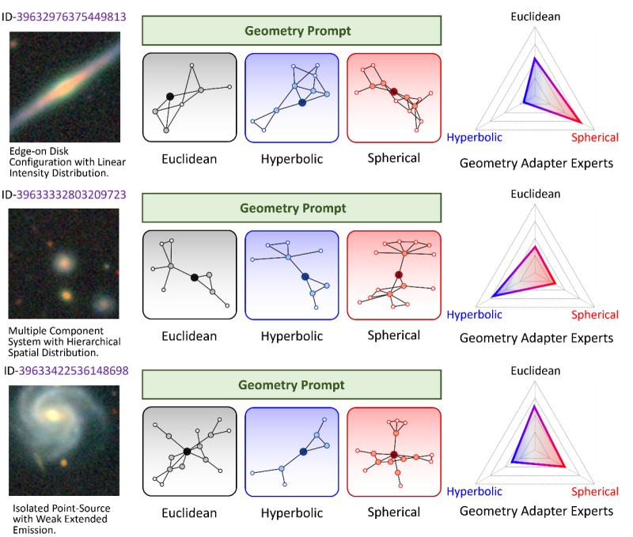
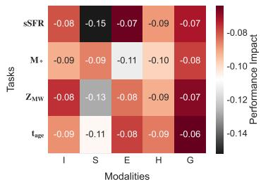
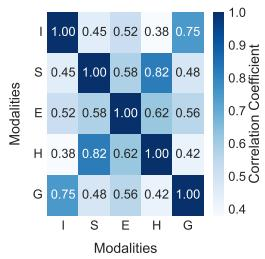
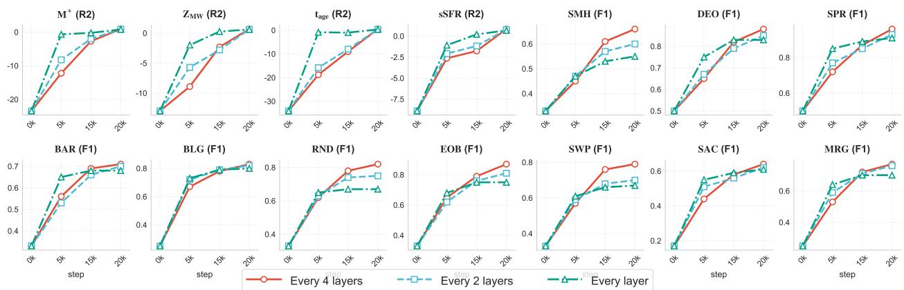

# Galaxy Walker: Geometry-aware VLMs For Galaxy-scale Understanding

Tianyu Chen⋆, Xingcheng Fu⋄, Yisen Gao†, Haodong Qian⋄, Yuecen Wei⋆‡, Kun Yan⋆ Haoyi Zhou⋆‡, Jianxin Li⋆

SKLCCSE, School of Computer Science and Engineering, Beihang University, China⋆ School of Software, Beihang University, China‡

Key Lab of Education Blockchain and Intelligent Technology, Guangxi Normal University, China⋄ Institute of Artificial Intelligence, Beihang University, Beijing, China† {tianyuc, zhouhy, lijx}@buaa.edu.cn

## Abstract

Modern vision-language models (VLMs) develop patch embedding and convolution backbone within vector space, especially Euclidean ones, at the very founding. When expanding VLMs to a galaxy scale for understanding astronomical phenomena, the integration of spherical space for planetary orbits and hyperbolic spaces for black holes raises two formidable challenges. a) The current pretraining model is confined to Euclidean space rather than a comprehensive geometric embedding. b) The predominant architecture lacks suitable backbones for anisotropic physical geometries. In this paper, we introduced Galaxy-Walker, a geometry-aware VLM, for the universe-level vision understanding tasks. We proposed the geometry prompt that generates geometry tokens by random walks across diverse spaces on a multi-scale physical graph, along with a geometry adapter that compresses and reshapes the space anisotropy in a mixture-of-experts manner. Extensive experiments demonstrate the effectiveness of our approach, with Galaxy-Walker achieving state-of-the-art performance in both galaxy property estimation (R2 scores up to 0.91) and morphology classification tasks (up to +0.17 F1 improvement in challenging features), significantly outperforming both domain-specific models and general-purpose VLMs.

## 1. Introduction

Geometric cognition has always been an essential problem in ordinary imaging, like overlap [26], scaling [3], and perspective [32]. It becomes a more challenging one in Astronomy Imagery, where the distance between pixels no longer stands for its “real” distance, and the measurement scales up to the galaxy-level. Backing to the Eddington experiment in 1919, we still view the Solar system as a flat Euclidean space [6] in telescope and measure the Gravity Lensing phenomenon, while the LIGO project [1] detects the gravitational waves of astronomical events with hyperbolic space starting from 2002. One key difference is that the physicists [13, 23] have gradually unveiled the rich geometric diversity at the galaxy scale. As illustrated in Figure 1, if we aim to walk from the flat universe to the other universes, the geometric cognition must extend from Euclidean space to diverse ones for better lare-scale understanding.

  
Figure 1. Geometries of the universe. While traditional VLMs are confined to flat Euclidean space, the actual universe exhibits rich geometric diversity including spherical and hyperbolic spaces, motivating our Galaxy Walker framework to incorporate multigeometric representations.

To take a concrete investigation on this problem, we apply the predominant Vision-Language Models (VLMs), e.g.

GPT4-o [18] and Claude3.5 [2] on astronomical analysis tasks. The complete results are included in Table 3, they achieve $R ^ { 2 }$ scores below 0.6 in galaxy property estimation tasks, while their F1 scores in morphology classification hover between 0.4-0.7. The performance degradation mainly comes from two constraints in VLM architectures: (1) At the foundational level, patch embedding and convolutional backbones are constructed within Euclidean vector spaces, struggling to effectively represent non-Euclidean geometric features; (2) At the feature fusion level, selfattention and FFN mechanisms tend to model token relationships based on planar distances, overlooking geometric measures like spherical and hyperbolic distances.

To address these challenges, we present Galaxy-Walker, the first geometry-aware VLM framework designed for galaxy-scale understanding. As illustrated in Figure 2, Galaxy-Walker introduces two key innovations: (1) A Geometry Prompt mechanism that generates geometric tokens through random walks on multi-scale physical graphs across Euclidean, spherical, and hyperbolic spaces, injecting diverse geometric priors at the input level; (2) A Geometry Adapter incorporating Euclidean, spherical, and hyperbolic FFN expert modules, which adaptively processes different geometric features through a mixture-of-experts approach, effectively reshaping spatial anisotropy.

Extensive experiments validate the effectiveness of Galaxy-Walker. In galaxy property estimation tasks, our method achieves $R ^ { 2 }$ scores ranging from 0.52 to 0.91, surpassing general VLMs by 50-80 percentage points and significantly outperforming domain-specific models like AstroCLIP. In morphology classification, Galaxy-Walker demonstrates substantial improvements (+0.17) in recognizing characteristic features such as BAR and SAC, showcasing its robust geometric understanding capabilities. These results indicate that introducing geometry awareness into VLM architectures is crucial for advancing galaxyscale understanding tasks.

Our main contributions can be summarized as follows: (1) We identify and propose a solution to address the geometric representation limitations in VLMs when processing astronomical data; (2) We design a geometry-aware framework with novel prompt and adapter mechanisms to capture diverse geometric features in galaxy observations effectively; (3) We demonstrate empirical improvements across multiple astronomical tasks, suggesting a promising direction for enhancing VLMs’ capability in domain-specific applications.

## 2. Related Work

Astronomical machine learning has evolved from early supervised learning applications [14] to more sophisticated approaches, including unsupervised methods for gravitational lens detection and anomaly identification [16, 25].

Recent advances integrate convolutional networks for image analysis and MLPs for luminosity data processing [20], with AstroCLIP pioneering cross-modal galaxy feature interaction modeling [19].

Vision Language Models have revolutionized multimodal understanding through joint visual-textual representations [8, 34]. CLIP [22] demonstrated exceptional performance through self-supervised training on 400M image-text pairs, while models like GPT4o [18], Claude 3.5 [2], and LLAMA-3.2-VL [17] continue advancing vision-language integration capabilities. Recent works like GeoCode and GeoGPT4V have explored enhancing VLMs’ geometric perception through data augmentation, aiming to address fundamental geometry-related QA tasks [5, 21].

Geometric deep learning leverages Riemannian geometry for complex data modeling. Hyperbolic geometry has proven effective for hierarchical image relationships [15, 28], while the spherical space is used to capture the global view [12, 24, 33]. Mixed curvature spaces [9] allow for flexible learning representations across a range of Riemannian manifolds. Mapping image features onto Riemannian manifolds [31] enhances the classification and comprehension of complex images.

## 3. Method

Galaxy Walker is a geometry-aware framework that enhances pre-trained VLMs with non-Euclidean geometric priors for comprehensive astronomical understanding. As illustrated in Figure 2, our framework consists of two key components: a Geometry Prompt that generates geometry tokens by random walks across diverse spaces on a multiscale physical graph, along with a Geometry Adapter that orchestrates multi-modal representations through a mixture-of-experts architecture spanning euclidean, spherical, and hyperbolic spaces. To facilitate numerical predictions while preserving the model’s language modeling capabilities, we augment the architecture with a dedicated Numeric Head alongside the original LM (Language Modeling) Head, enabling both regression and classification tasks in astronomical analysis.

## 3.1. Geometry Prompt

The geometric properties of universe space are crucial for understanding the large-scale structure of the universe [13]. It can provide large models with insights into the diverse and complex underlying structures between galaxies. By leveraging these geometric insights, we design a geometry prompt mechanism to guide the model to leverage appropriate geometric spaces for different astronomical features through specialized geometric walkers. Each walker (Euclidean, Spherical, and Hyperbolic) processes astronomical data in its corresponding geometric space, capturing distinct spatial relationships and structural patterns that complement

  
Figure 2. The overall framework of Galaxy Walker. Left: The architecture integrates a Geometry Adapter with the pre-trained VLM backbone. The adapter includes a projection layer πθ that processes various input modalities (e.g., Euclidean, Spherical, Hyperbolic embeddings, spectral data, and multi-band images), followed by L transformer blocks enhanced with geometry-aware FFN experts. A gating network dynamically routes features to appropriate geometric experts. Two parallel heads (Numeric Head and LM Head) enable both regression and classification tasks. Right: Visualization of how different geometric spaces (Euclidean, Spherical, and Hyperbolic Walker) process astronomical data, demonstrating the distinct token arrangements and relationships in each geometry. The Geometr Prompt guides the model to utilize appropriate geometric representations for different astronomical features.

## the Geometry Adapter’s expert layers.

Multi-View Structure Construction of Galaxies. The vast expanse of universe space can be understood as a complex Riemannian geometric space [13], which can encompass different geometries, including Euclidean (E), Hyperbolic (H), and Spherical (S) spaces. A Euclidean space, characterized by zero curvature, represents an infinitely flat universe. In this scenario, galaxies are highly influenced by nearby local structures. In contrast, a hyperbolic space, with its negative curvature, captures the universe’s accelerated expansion, providing a natural framework to trace the evolution of galaxies and uncover hierarchical relationships within their development. Meanwhile, spherical space, defined by positive curvature, suggests a universe with a closed, global topology, enhancing our ability to capture the overall similarity among galaxies at a global scale. To gain a deeper and more comprehensive understanding of the universe’s structure and behavior, we will explore three distinct curvatures of universe space and build models to capture the relationships among galaxies within each geometry.

As shown in Fig. 2 right, we start by constructing a multi-relational graph of galaxies based on their physical positions $\mathbf { V } _ { p h y }$ , which consist of Right Ascension (RA) and Declination (DEC). First, we establish universe coordinates from different geometric perspectives to derive relationships between galaxies. Specifically, a universe geometric coordinate $\mathbf { V } _ { \mathbb { M } }$ is first mapped to the tangent space TM at the origin by the projection function proj, and then it is transformed to the manifold M $( \mathbb { M } \in \{ \mathbb { E } , \mathbb { H } , \mathbb { S } \} )$ by the exponential mapping $e x p _ { o } ^ { c } $

$$
\begin{array} { r } { { \bf V } _ { \mathbb { M } } = e x p _ { o } ^ { c } ( p r o j ( { \bf V } _ { p h y } ) ) , } \end{array}\tag{1}
$$

where c represents the curvature of the manifold M. Subsequently, we identify galaxies with similar positions using K-Nearest Neighbors (KNN) [27] based on these universe coordinates, forming the relational graphs $\mathbb { A } _ { \mathbb { M } }$

Geometry-aware Feature Learning. After getting a graph G with node feature matrix $\mathbf { X } \in \mathbb { R } ^ { n \times d }$ and adjacency matrix $\mathbf { A } _ { \mathbb { M } }$ , we study their representation in three different geometric universes. Since the node feature X (like image/spectrum) is in Euclidean space, we first need to translate it to the corresponding manifold M (Step1). The geometric prompt is then obtained using the relational graph $\mathbb { A } _ { \mathbb { M } }$ in the manifold (Step2). The geometry-aware features $\mathbf { P } _ { \mathbb { M } }$ are learned through a two-layer architecture:

$$
\{ { \begin{array} { l l } { { \mathbf { Z } } _ { \mathbb { M } } = \mathcal { F } _ { \mathbb { E }  \mathbb { M } } ( { \mathbf { X } } , { \mathbf { A } } _ { \mathbb { M } } ) , \quad \mathrm { S t e p } 1 } \\ { { \mathbf { P } } _ { \mathbb { M } } = \mathcal { F } _ { \mathbb { M }  \mathbb { M } } ( { \mathbf { Z } } _ { \mathbb { M } } , { \mathbf { A } } _ { \mathbb { M } } ) , \quad \mathrm { S t e p } 2 } \end{array} }\tag{2}
$$

where $\mathcal { F } _ { \mathbb { M } _ { \mathrm { i n } }  \mathbb { M } _ { \mathrm { o u t } } }$ represents a Riemannian GraphSAGE layer defined as:

$$
\mathcal { F } _ { \mathbb { M } _ { \mathrm { i n } }  \mathbb { M } _ { \mathrm { o u t } } } ( \mathbf { X } , \mathbf { A } _ { \mathbb { M } _ { \mathrm { i n } } } ) = \exp _ { o } ^ { c _ { o u t } } ( \mathrm { S A G E } ( \log _ { o } ^ { c _ { i n } } ( \mathbf { X } ) , \mathbf { A } _ { \mathbb { M } _ { \mathrm { i n } } } ) ,\tag{3}
$$

where ${ l o g } _ { o } ^ { c }$ denotes logarithmic mapping, which maps the feature X located on the manifold $\mathbb { M } _ { \mathrm { i n } }$ to the tangent plane of the origin. Sage denotes the GraphSage network[11]. The specific formulation forms related to Riemannian manifold operators are reported in the Appendix.

## 3.2. Geometry Adapter

The Geometry Adapter is designed to handle spatial anisotropy through a mixture-of-experts (MoE) approach, incorporating domain-specific geometric priors from astronomical observations, while preserving the conventional Euclidean FFN from pre-trained VLMs as one expert:

$$
\mathcal { F } _ { E } ( x ) = W _ { 2 } ( \sigma ( W _ { 1 } x + b _ { 1 } ) ) + b _ { 2 } .\tag{4}
$$

We then introduce specialized experts for spherical and hyperbolic geometries to enhance the model’s capability in processing astronomical spatial relationships. Inspired by metric theories in non-Euclidean spaces [4], we design spherical and hyperbolic expert layers that form a heterogeneous MoE network. The spherical expert layer is formulated as:

$$
\mathcal { F } _ { S } ( \boldsymbol { x } ) = \boldsymbol { \kappa } \cdot \mathrm { n o r m a l i z e } ( W _ { 2 } ( \sigma ( W _ { 1 } \boldsymbol { x } + b _ { 1 } ) ) + b _ { 2 } ) ,\tag{5}
$$

where $\kappa$ controls the curvature and normalize (·) ensures the output lies on the unit sphere, effectively capturing angular relationships in celestial observations. The hyperbolic expert layer is defined as:

$$
\mathcal { F } _ { H } ( \boldsymbol { x } ) = \exp _ { 0 } ( W _ { 2 } ( \sigma ( \log _ { 0 } ( W _ { 1 } \otimes \boldsymbol { x } + b _ { 1 } ) ) ) + b _ { 2 } ) ,\tag{6}
$$

where $\mathrm { e x p } _ { 0 }$ and $\log _ { 0 }$ are the exponential and logarithmic maps at the origin of the Poincare ball, enabling the model ´ to process hierarchical astronomical structures.

For routing multimodal tokens to appropriate experts, we introduce a learnable Gating Network G that computes routing probabilities:

$$
y = \sum _ { i \in \{ E , S , H \} } G _ { i } ( x ) \cdot \mathcal { F } _ { i } ( x ) ,\tag{7}
$$

where $G _ { i } ( x )$ represents the routing weight for expert $i ,$ and $\begin{array} { r } { \sum _ { i } G _ { i } ( x ) = 1 } \end{array}$ . The Geometry Adapter is inserted in every k layer (e.g., k = 4) in the pre-trained VLM to maintain computational efficiency while providing sufficient geometric modeling capacity.

To facilitate geometric feature input, we initialize modality-specific projection layers $\pi _ { \theta }$ that align different feature types with the token embedding space. For regression tasks, we augment the model with a learnable Numeric Head that performs numerical predictions through the last token’s logits. The original LM Head is retained for classification tasks, maintaining the model’s versatility across different astronomical applications.

## 3.3. Two-stage Training

We adopt a two-stage training strategy to optimize our geometry-aware framework effectively.

Stage I: Geometric Prompt Learning. The Geometry Prompt module is first trained independently using galaxy property estimation tasks (e.g., redshift prediction) to learn the geometric representations across three spaces. This stage ensures the model captures essential geometric patterns.

Stage II: Geometry Adapter Learning. We then train the Geometry adapter module while freezing all attention blocks for efficiency. Let $\mathcal { T } _ { r }$ and $\mathcal { T } _ { c }$ denote the sets of regression and classification tasks, respectively. For each task $t \in \mathcal { T } _ { r } \cup \mathcal { T } _ { c }$ , we construct task-specific prompts using special modality tokens (details in Appendix). The training objective combines:

$$
\begin{array} { r } { \mathcal { L } = \mathcal { L } _ { L M } + \lambda \mathcal { L } _ { r e g } , } \end{array}\tag{8}
$$

where $\mathcal { L } _ { L M }$ is the language modeling loss and $\mathcal { L } _ { { r e g } }$ is the smooth L1 loss for regression tasks, computed between the numerical head predictions and ground truth values. λ balances the two objectives.

To enhance numerical stability and modal representation, modal inputs are processed in fp32 precision with L2 normalization, followed by learnable scaling factors $\alpha _ { m }$ applied after projection: $\mathbf { e } _ { m } ~ = ~ \alpha _ { m } \pi _ { m } ( \mathbf { x } _ { m } )$ We further incorporate a replay mechanism that accumulates projected embeddings to the last token hidden states: $\mathbf { h } _ { l a s t } =$ $\begin{array} { r } { \mathbf { h } _ { l a s t } + \sum _ { m } \mathbf { h } _ { m } } \end{array}$ . The trainable parameters in this stage are constrained to modal-specific projection layers $\pi _ { m } ,$ Geometry Adapter FFN layers, numerical head for regression tasks, and scaling factors $\alpha _ { m }$

## 4. Experiment

## 4.1. Experiment Settings

Tasks and Datasets. Our evaluation framework encompasses two primary astronomical analysis tasks: Property Estimation and Morphology Classification [19]. Property Estimation targets four fundamental galaxy attributes $( \mathbf { M } ^ { * }$ $\bf { Z } _ { M W } , ~ t _ { a g e } ,$ sSFR), essential for understanding galaxy evolution and stellar populations. [14] Morphology Classification examines ten distinct structural features (SMH, DEO, SPR, BAR, BLG, RND, EOB, SWP, SAC, MRG), enabling a comprehensive assessment of galactic structures across scales and orientations [29]. Following AstroCLIP’s methodology [19], we structure these tasks as questionanswering problems to facilitate unified VLM training and inference. As shown in Table 1, Our dataset consists of 84, 121 training samples and 21, 051 evaluation samples for property estimation, and a total of 271, 566 samples for morphological classification, with varying sample distributions across morphological classes.

Table 1. Statistics of our dataset for property estimation and morphological classification tasks. The rightmost column shows the total number of classification samples for each split.
<table><tr><td rowspan="2">Split</td><td rowspan="2">Property Estimation</td><td colspan="10">Morphological Classification</td></tr><tr><td>SMH</td><td>DEO</td><td>SPR</td><td>BAR</td><td>BLG</td><td>RND</td><td>EOB</td><td>SWP</td><td>SAC</td><td>MRG</td><td>Subtotal</td></tr><tr><td>Train</td><td>84,121</td><td>389</td><td>29,538</td><td>31,276</td><td>31,276</td><td>31,276</td><td>16,207</td><td>25,246</td><td>18,745</td><td>18,745</td><td>129</td><td>202,827</td></tr><tr><td>Evaluate</td><td>21,051</td><td>98</td><td>9,587</td><td>9,541</td><td>9,541</td><td>9,541</td><td>9,332</td><td>6,707</td><td>5,942</td><td>5,942</td><td>2,508</td><td>68,739</td></tr></table>

Table 2. Statistics of our multi-relational graph constructed in different geometric spaces. Each space maintains consistent node count and feature dimensionality while varying in edge connectivity to capture distinct geometric relationships.
<table><tr><td>Geometry</td><td>#Nodes</td><td>#Edges</td><td>#Features</td></tr><tr><td>Euclidean</td><td>105,172</td><td>720,665</td><td>1,024</td></tr><tr><td>Hyperbolic</td><td>105,172</td><td>699,553</td><td>1,024</td></tr><tr><td>Spherical</td><td>105,172</td><td>722,081</td><td>1,024</td></tr></table>

Input Modalities and Task Formulation. Property Estimation tasks integrate multi-band images from DESI-LS DR9 [10], spectra from DESI EDR Survey [7], and geometric features from three spaces, outputting continuous property predictions. Morphology Classification, constrained by Galaxy Zoo DECaLS5 [29] dataset limitations, utilizes only multi-band images and geometric features for categorical predictions.

Multi-geometric Graph Construction. We construct three complementary graphs based on galaxies’ physical coordinates (Right Ascension and Declination) through knearest Neighbor connections. As detailed in Table $^ { 2 , }$ these graphs span Euclidean (720,665 edges), Hyperbolic (699, 553 edges), and Spherical spaces (722, 081 edges), each containing 105, 172 nodes with 1, 024-dimensional features derived from matched DESI-LS galaxy images and DESI spectra pairs. This multi-geometric approach enables comprehensive capture of diverse spatial relationships in astronomical structures.

Other Implementation Details. We initialize the VLM of GalaxyWalker from Qwen2-VL-2B-Instruct [30]. We design training and inference templates for each task and the details are included in supplementaries.

Baselines. We evaluate our approach against both domain-specific models and general-purpose VLMs. For domain-specific baselines, we include: Photometry [20], a classical MLP-based approach representing traditional machine learning methods for astronomical property estimation; Stein [25], a specialized self-supervised model optimized for scientific data analysis; and AstroCLIP [19], a pioneering astronomical multimodal model evaluated in both zero-shot and fine-tuned settings. For general-purpose VLMs, we compare against state-of-the-art closed-source models (GPT4-o [18] and Claude-3.5 [2]) and the leading open-source multimodal model (Llama-3.2 [17]), representing the current frontier of large-scale vision-language understanding capabilities.

## 4.2. Main Results

As depicted in Table 3, our extensive experimental evaluation demonstrates the superior performance of Galaxy Walker across both galaxy property estimation and morphology classification tasks, validating our geometry-aware approach to galaxy-scale understanding.

Limitations of General VLMs. The experimental results reveal significant limitations of general-purpose VLMs (GPT4-o, Claude-3.5, Llama-3.2) when applied to astronomical tasks. Their poor performance $( R ^ { 2 }$ scores < 0.12 for property estimation) stems from their inherent Euclidean-space constraints, making them ill-suited for modeling universe phenomena in diverse geometric spaces. For instance, their struggle with sSFR estimation $( R ^ { 2 }$ scores < 0.08) particularly highlights their inability to capture the hyperbolic nature of star formation dynamics in galaxy evolution.

Analysis of Specialized Astronomical Models. Domain-specific approaches demonstrate stronger baseline performance, with AstroCLIP (Fine-tuned) achieving notable results $( R ^ { 2 } = 0 . 8 8$ for M∗ estimation). However, these methods show inconsistent performance across different tasks. While effective in controlled scenarios (e.g., SPR classification: 0.96 F1), they struggle with complex morphological features requiring geometric understanding (BAR: 0.54 F1). This performance gap indicates their limited ability to leverage geometric priors and world knowledge, particularly evident in tasks involving spiral arm patterns and bar structures that demand the understanding of galactic rotation dynamics.

Performance of GalaxyWalker. Our geometry-aware architecture achieves consistent improvements across diverse astronomical tasks through its enhanced spatial modeling capabilities. In property estimation, Galaxy Walker establishes new state-of-the-art benchmarks, notably improving sSFR estimation $( R ^ { 2 } = 0 . 8 4 , + 0 . 1 5 )$ through precise modeling of non-Euclidean star formation dynamics. The model exhibits superior performance in complex morphological analysis, particularly in features requiring sophisticated geometric understanding - BAR and SAC classifications both see +0.17 F1 score improvements while maintaining competitive performance in traditional metrics (DEO: 0.97 F1, SPR: 0.96 F1). This comprehensive enhancement stems from our geometry prompt’s effective modeling of diverse spatial configurations, from spherical planetary orbits to hyperbolic gravitational fields. While showing a marginal decrease in SMH (−0.07), the model’s substantial improvements in complex geometric features demonstrate its robust capacity for modeling intricate galactic structures. These results, showing 10-20% average improvement across tasks, validate our geometric integration approach and establish a new paradigm for astronomical vision understanding.

<table><tr><td rowspan="2">Models</td><td colspan="4">Property Estimation  $( R ^ { 2 }$  Score)</td><td colspan="10">Morphology Classification (F1 Score)</td></tr><tr><td>M</td><td> $\mathbf { Z _ { M W } }$ </td><td> $\bf t _ { a g e }$ </td><td>sSFR</td><td>SMH</td><td>DEO</td><td>SPR</td><td>BAR</td><td>BLG</td><td>RND</td><td>EOB</td><td>SWP</td><td>SAC</td><td>MRG</td></tr><tr><td>Baselines-Domain Specific Methods</td><td></td><td></td><td></td><td></td><td></td><td></td><td></td><td></td><td></td><td></td><td></td><td></td><td></td><td></td></tr><tr><td>Photometry(MLP)</td><td>0.67</td><td>0.41</td><td>0.27</td><td>0.34</td><td></td><td></td><td></td><td>1</td><td></td><td></td><td>1</td><td></td><td></td><td>1</td></tr><tr><td>Stein</td><td></td><td></td><td></td><td></td><td>0.68</td><td>0.81</td><td>0.95</td><td>0.37</td><td>0.77</td><td>0.81</td><td>0.75</td><td>0.76</td><td>0.44</td><td>0.71</td></tr><tr><td>AstroCLIP(Zero-shot)</td><td>0.87</td><td>0.57</td><td>0.43</td><td>0.63</td><td></td><td></td><td></td><td></td><td></td><td></td><td></td><td></td><td></td><td></td></tr><tr><td>AstroCLIP(Fine-tuned)</td><td>0.88</td><td>0.64</td><td>0.47</td><td>0.69</td><td>0.83</td><td>0.97</td><td>0.96</td><td>0.54</td><td>0.81</td><td>0.79</td><td>0.84</td><td>0.73</td><td>0.47</td><td>0.73</td></tr><tr><td>Baselines-General VLMs</td><td></td><td></td><td></td><td></td><td></td><td></td><td></td><td></td><td></td><td></td><td></td><td></td><td></td><td></td></tr><tr><td>GPT4-0</td><td>0.05</td><td>0.43</td><td>-0.48</td><td>0.59</td><td>0.38</td><td>0.67</td><td>0.63</td><td>0.42</td><td>0.37</td><td>0.49</td><td>0.62</td><td>0.57</td><td>0.38</td><td>0.47</td></tr><tr><td>Claude-3.5</td><td>-0.03</td><td>0.20</td><td>-0.61</td><td>0.62</td><td>0.34</td><td>0.33</td><td>0.24</td><td>0.42</td><td>0.41</td><td>0.40</td><td>0.66</td><td>0.39</td><td>0.37</td><td>0.59</td></tr><tr><td>Llama-3.2-90B-Vision-Instruct</td><td>-2.99</td><td>-5.46</td><td>0.28</td><td>0.34</td><td>0.38</td><td>0.42</td><td>0.65</td><td>0.37</td><td>0.42</td><td>0.49</td><td>0.66</td><td>0.58</td><td>0.46</td><td>0.60</td></tr><tr><td>Our Method - Geometry-aware VLM</td><td></td><td></td><td></td><td></td><td></td><td></td><td></td><td></td><td></td><td></td><td></td><td></td><td></td><td></td></tr><tr><td>Galaxy Walker</td><td>0.91</td><td>0.69</td><td>0.52</td><td>0.84</td><td>0.76</td><td>0.97</td><td>0.96</td><td>0.71</td><td>0.83</td><td>0.82</td><td>0.87</td><td>0.79</td><td>0.64</td><td>0.77</td></tr><tr><td>Improvements</td><td>+0.03</td><td>+0.05</td><td>+0.05</td><td>+0.15</td><td>-0.07</td><td>0.00</td><td>0.00</td><td>+0.17</td><td>+0.02</td><td>+0.01</td><td>+0.03</td><td>+0.06</td><td>+0.17</td><td>+0.04</td></tr></table>

Table 3. Comprehensive evaluation of different models on galaxy property estimation $( R ^ { 2 }$ score) and morphology classification (F1 score) tasks. Our proposed Galaxy Walker demonstrates superior performance across most metrics, achieving state-of-the-art results in al property estimation tasks and several morphology classification categories. The previous best results are underlined, while our best results are shown in bold. Notably, Galaxy Walker shows significant improvements in sSFR estimation (+0.15) and morphological features like BAR and SAC classifications (+0.17), while maintaining competitive performance in other categories.

## 4.3. Expert Specialization Analysis

As depicted in Figure 3, to quantitatively analyze the contribution of different geometric experts, we conduct inference on test set and measure each expert’s activation strength by averaging normalized weights during the inference process.

Expert Contribution Patterns. In property estimation tasks, the Euclidean expert demonstrates dominant activation (> 40%), particularly in $\mathbf { M } ^ { * }$ and $\mathbf { Z _ { M W } }$ estimation. This aligns with our assumption that these fundamental galaxy properties primarily rely on direct photometric measurements and local feature extraction, where Euclidean space is most effective. The $\mathbf { t _ { a g e } }$ estimation similarly benefits from Euclidean processing, presumably due to its dependence on spectral energy distribution analysis in conventional space. The morphology classification tasks reveal more diverse geometric preferences. The Hyperbolic expert shows notably higher activation (> 35%) in structurerelated features like BAR, SPR, and SAC. We hypothesize this is due to the hyperbolic nature of gravitational fields governing these structures - bar formations and spiral arms typically follow logarithmic patterns that are naturally represented in hyperbolic space. The Spherical expert exhibits consistent activation (20-30%) across most morphologica tasks, presumably capturing the projected 3D spherical nature of galaxies onto our 2D observational plane.

Case Study Analysis. Figure 3b presents three representative cases demonstrating GalaxyWalker’s capability in handling diverse galactic topological structures. In the first case, an edge-on disk configuration with linear intensity distribution shows that the Geometry Prompt effectively captures this elongated structure through complementary geometric representations. The triangle plot reveals that the Spherical expert dominates, indicating the model’s preference for spherical geometry to model the radial emission patterns and extended structure of the edge-on disk. In the second case, a multiple-component system with hierarchical spatial distribution is analyzed, where our model adapts by increasing the Hyperbolic expert’s contribution to effectively represent the complex hierarchical relationships between component galaxies. This preference for hyperbolic geometry enables the model to capture the non-Euclidean nature of gravitational interactions in this system. In the third case of an isolated point source with weak extended emission, the Geometry Adapter shows a more balanced contribution pattern with the Euclidean expert playing a more prominent role compared to previous cases, while still engaging both Spherical and Hyperbolic experts to capture the multifaceted geometric properties. These visualizations quantitatively demonstrate that the proposed geometry-aware framework enables effective encoding of diverse galactic topological patterns while facilitating adaptive geometric feature extraction through dynamically weighted expert contributions.

  
(a) Contribution analysis of different experts.

  
(b) Case study of complex galaxy structures.  
Figure 3. Visualization of geometry-specific expert contributions and case study analysis.

## 4.4. Modality Analysis

  
(a) Modality Impact on Different Tasks

  
(b) Modality Correlation  
Figure 4. Analysis of modality contributions: (a) Performance impact when removing each modality; (b) Cross-modal correlation analysis.

To comprehensively understand the contribution of different modalities in galaxy understanding, we conduct two complementary analyses in Figure 4: an ablation study measuring performance degradation when removing individual modalities, and a correlation analysis examining the relationships between different modality pairs. Our model incorporates five key modalities besides the text modal: Image (I), Spectrum (S), and three geometric representations - Euclidean Graph (E), Hyperbolic Graph (H), and Sphere Graph (G), with the latter three jointly forming our Geometry Prompt Input.

Impact of different modality. As shown in Figure 4a, removing different modalities impacts model performance to varying degrees across tasks. The spectrum modality demonstrates the strongest impact on sSFR (−0.15) and ZMW (−0.13), reflecting its crucial role in determining both star formation rates and metallicity through spectral line analysis. The Euclidean geometry representation shows moderate influence on M∗ estimation (−0.11), while hyperbolic and spherical geometries exhibit relatively consistent impact across all physical parameters (−0.06 to −0.09).

Cross-modal Correlation. We use the attention average attention scores between different modal tokens to construct the correlation matrix (Figure 4b), which reveals distinctive patterns in modality interactions. Most notably, the high correlation (0.82) between spectrum and hyperbolic graph representations suggests that spectral features naturally align with hyperbolic space, likely due to the exponential nature of stellar population distributions. Meanwhile, the strong coupling (0.75) between image and sphere graph features indicates that spherical geometric understanding significantly enhances visual feature interpretation, particularly for projecting 3D galactic structures onto 2D observations. The moderate correlation (0.58) between the Euclidean graph and spectrum features provides insight into why conventional VLMs can partially succeed in basic spectral analysis tasks, as traditional Euclidean space adequately captures certain spectral characteristics.

  
Figure 5. Training Dynamics Analysis of Different Geometry Adapter Integration Strategies. Performance evolution during training (0k-20k steps) for different adapter integration densities in Qwen2-VL-2B, comparing sparse (every 4 layer), medium (every 2 layer), and dense (every layer) integration patterns. The plots show $R ^ { \hat { 2 } }$ scores for physical property estimation (M∗, ZMW, tage, sSFR) and F1 scores for morphological classification tasks, revealing distinct convergence characteristics across different astronomical tasks.

## 4.5. Geometry Adapter Integration Strategies

To investigate the optimal integration strategy of geometryaware capabilities into vision-language models, we conducted experiments with varying densities of MoE-based Geometry Adapter integration in the 28-layer Qwen2-VL-2B architecture [30]. Figure 5 reveals distinct patterns in learning dynamics and final performance across different integration frequencies.

Comparative analysis of integration strategies reveals their distinct advantages: sparse integration (every 4 layer, which is used to achieve results in Table 3) achieves competitive performance in morphological classification (DEO: 0.85, RND: 0.8) with minimal computational overhead; medium-density integration (every 2 layer) demonstrates optimal stability across tasks and particularly excels in complex structural feature detection (BAR: 0.7, BLG: 0.8); while dense integration (every layer) enables rapid initial convergence but shows diminishing returns in later training stages, suggesting that the additional computational cost may not justify the marginal performance gains.

The training dynamics reveal a clear evolution in the relative advantages of each integration strategy. During early training (0-5k steps), dense integration provides rapid performance improvements, particularly in property estimation tasks. However, as training progresses (5k-15k steps), the performance gap between different integration densities diminishes, with all approaches converging to similar performance levels by the final training phase (15k-20k steps).

Our findings indicate that the optimal integration strategy depends primarily on specific deployment constraints and task priorities. For resource-efficient implementations, sparse integration offers a compelling balance of performance and computational cost. Medium integration provides the most robust general-purpose solution, while dense integration may be warranted in scenarios requiring rapid model adaptation. These results demonstrate that effective geometry-aware vision-language modeling can be achieved through strategic adapter placement, challenging the assumption that comprehensive layer modification is necessary for optimal performance.

## 5. Conclusion

In this paper, we introduced Galaxy Walker, a novel geometry-aware vision-language model that effectively bridges the gap between traditional VLMs and complex astronomical phenomena through the integration of multigeometric random walks and specialized adapters. By leveraging complementary geometric spaces - Euclidean for local feature extraction, hyperbolic for hierarchical structures, and spherical for celestial projections - our model achieves a more comprehensive understanding of galactic structures. Our approach demonstrates significant performance improvements over existing methods (10-20% across tasks), particularly excelling in geometry-intensive challenges like bar structure detection (+0.17 F1) and specific star formation rate estimation (+0.15 R2). Through comprehensive analysis, we validate our geometric integration strategy and reveal the specialized contributions of different geometric spaces in galaxy understanding, showing how each space contributes distinctively to different aspects of astronomical feature comprehension.

Despite these advances, our work has several limitations. Currently, Galaxy Walker is implemented on relatively small-scale VLMs and employs a limited number of geometric experts. Future work could explore scaling to larger VLMs (50B-100B parameters) and training domainspecific MoE architectures with expanded expert capacity when sufficient astronomical data becomes available.

## Acknowledgement

This work was supported by the National Science and Technology Major Project(No.2022ZD0117800), and Young Elite Scientists Sponsorship Program by CAST(No.2023QNRC001). This work was also sponsored by CAAI-Huawei MindSpore Open Fund (CAAIXSJLJJ2023MindSpore12). Yisen Gao is supported by Beijing Natural Science Foundation(QY24129). Thanks for the computing infrastructure provided by Beijing Advanced Innovation Center for Big Data and Brain Computing. Special thanks for the constructive suggestions from Ming Lu, Shanghang Zhang, Hao Wang, and Jingyang He from Peking University.

## References

[1] A. Abramovici, W. E. Althouse, R. W. Drever, Y. Gursel,¨ S. Kawamura, F. J. Raab, D. Shoemaker, L. Sievers, R. E. Spero, K. S. Thorne, R. E. Vogt, R. Weiss, S. E. Whitcomb, and M. E. Zucker. Ligo: The laser interferometer gravitational-wave observatory. Science (New York, N.Y.), 256(5055):325–333, 1992. 1

[2] Anthropic. Claude 3.5 sonnet, 2024. 2, 5

[3] P. Bariya, J. Novatnack, G. Schwartz, et al. 3d geometric scale variability in range images: Features and descriptors. International Journal of Computer Vision (IJCV), 99:232– 255, 2012. 1

[4] Michael M Bronstein, Joan Bruna, Yann LeCun, Arthur Szlam, and Pierre Vandergheynst. Geometric deep learning: going beyond euclidean data. IEEE Signal Processing Magazine, 34(4):18–42, 2017. 4

[5] Shihao Cai, Keqin Bao, Hangyu Guo, Jizhi Zhang, Jun Song, and Bo Zheng. Geogpt4v: Towards geometric multi-modal large language models with geometric image generation. In Proceedings of the 2024 Conference on Empirical Methods in Natural Language Processing, EMNLP 2024, Miami, FL, USA, November 12-16, 2024, pages 750–766. Association for Computational Linguistics, 2024. 2

[6] P. Coles. The state of the universe. Nature, 433:248–256, 2005. 1

[7] DESI Collaboration. Data for figures and tables in ”validation of the scientific program for the dark energy spectroscopic instrument”, 2023. 5

[8] Danny Driess, Fei Xia, Mehdi S. M. Sajjadi, Corey Lynch, Aakanksha Chowdhery, Brian Ichter, Ayzaan Wahid, Jonathan Tompson, Quan Vuong, Tianhe Yu, Wenlong Huang, Yevgen Chebotar, Pierre Sermanet, Daniel Duckworth, Sergey Levine, Vincent Vanhoucke, Karol Hausman, Marc Toussaint, Klaus Greff, Andy Zeng, Igor Mordatch, and Pete Florence. Palm-e: An embodied multimodal language model. In International Conference on Machine Learning, ICML 2023, 23-29 July 2023, Honolulu, Hawaii, USA, pages 8469–8488. PMLR, 2023. 2

[9] Albert Gu, Frederic Sala, Beliz Gunel, and Christopher Re.´ Learning mixed-curvature representations in product spaces. In International Conference on Learning Representations, 2018. 2

[10] ChangHoon Hahn, Michael J. Wilson, Omar Ruiz-Macias, Shaun Cole, et al. The desi bright galaxy survey: Final target selection, design, and validation. The Astronomical Journal, 165(6):253, 2023. 5

[11] William L. Hamilton, Zhitao Ying, and Jure Leskovec. Inductive representation learning on large graphs. In Neural Information Processing Systems, 2017. 4

[12] Takayuki Hara, Yusuke Mukuta, and Tatsuya Harada. Spherical image generation from a few normal-field-of-view images by considering scene symmetry. IEEE Transactions on Pattern Analysis and Machine Intelligence, 45(5):6339– 6353, 2023. 2

[13] A. Heavens. Geometry of the universe. Nature, 468:511– 512, 2010. 1, 2, 3

[14] Marc Huertas-Company and Franccois Lanusse. The dawes review 10: The impact of deep learning for the analysis of galaxy surveys. Publications of the Astronomical Society of Australia, 40, 2022. 2, 4

[15] Valentin Khrulkov, Leyla Mirvakhabova, Evgeniya Usti nova, Ivan Oseledets, and Victor Lempitsky. Hyperbolic im age embeddings, 2020. 2

[16] Peter Melchior, Yan Liang, ChangHoon Hahn, and Andy D. Goulding. Autoencoding galaxy spectra. i. architecture. The Astronomical Journal, 166, 2022. 2

[17] Meta. The llama 3 herd of models, 2024. 2, 5

[18] OpenAI. GPT-4 technical report. CoRR, abs/2303.08774, 2023. 2, 5

[19] Liam Parker, Francois Lanusse, Siavash Golkar, Leopoldo Sarra, Miles Cranmer, Alberto Bietti, Michael Eicken berg, Geraud Krawezik, Michael McCabe, Rudy Morel, Ruben Ohana, Mariel Pettee, Bruno Regaldo-Saint Blancard,´ Kyunghyun Cho, Shirley Ho, and The Polymathic AI Collaboration. Astroclip: a cross-modal foundation model for galaxies. Monthly Notices of the Royal Astronomical Society, 531(4):4990–5011, 2024. 2, 4, 5

[20] Johanna Pasquet, Emmanuel Bertin, Marie Treyer, Stephane´ Arnouts, and Dominique Fouchez. Photometric redshifts from sdss images using a convolutional neural network. Astronomy & Astrophysics, 2018. 2, 5

[21] Ofek Pearl, Itai Lang, Yuhua Hu, Raymond A. Yeh, and Rana Hanocka. Geocode: Interpretable shape programs. CoRR, abs/2212.11715, 2022. 2

[22] Alec Radford, Jong Wook Kim, Chris Hallacy, Aditya Ramesh, Gabriel Goh, Sandhini Agarwal, Girish Sastry, Amanda Askell, Pamela Mishkin, Jack Clark, Gretchen Krueger, and Ilya Sutskever. Learning transferable visual models from natural language supervision. In International Conference on Machine Learning, 2021. 2

[23] Wun-Yi Shu. The geometry of the universe. Mathematics and Statistics, 3(4):75–88, 2015. 1

[24] H. Skibbe and M. Reisert. Spherical tensor algebra: A toolkit for 3d image processing. Journal of Mathematical Imaging and Vision, 58:349–381, 2017. 2

[25] George Stein, Peter Harrington, Jacqueline Blaum, Tomislav Medan, and Zarija Lukic. Self-supervised similarity search for large scientific datasets, 2021. 2, 5

[26] Ola Suleiman Ahmad, Johan Debayle, and Jean-Charles Pinoli. A geometric-based method for recognizing overlapping polygonal-shaped and semi-transparent particles in gray tone images. Pattern Recognition Letters, 32(15):2068– 2079, 2011. 1

[27] Kashvi Taunk, Sanjukta De, Srishti Verma, and Aleena Swetapadma. A brief review of nearest neighbor algorithm for learning and classification. In 2019 International Conference on Intelligent Computing and Control Systems (ICCS), pages 1255–1260, 2019. 3

[28] Surendrabikram Thapa, Usman Naseem, Luping Zhou, and Jinman Kim. Vision-language models for biomedical applications, pages 1–2. Association for Computing Machinery, United States, 2024. First International Workshop on Vision-Language Models for Biomedical Applications (1st : 2024), VLM4Bio 2024 ; Conference date: 28-10-2024 Through 01- 11-2024. 2

[29] Mike Walmsley, Chris Lintott, Tobias Geron, Sandor Kruk,´ Coleman Krawczyk, Kyle W Willett, Steven Bamford, Lee S Kelvin, Lucy Fortson, Yarin Gal, William Keel, Karen L Masters, Vihang Mehta, Brooke D Simmons, Rebecca Smethurst, Lewis Smith, Elisabeth M Baeten, and Christine Macmillan. Galaxy zoo decals: Detailed visual morphology measurements from volunteers and deep learning for 314 000 galaxies. Monthly Notices ofthe Royal Astronomical Society, 509(3):3966–3988, 2021. 4, 5

[30] Peng Wang, Shuai Bai, Sinan Tan, Shijie Wang, Zhihao Fan, Jinze Bai, Keqin Chen, Xuejing Liu, Jialin Wang, Wenbin Ge, Yang Fan, Kai Dang, Mengfei Du, Xuancheng Ren, Rui Men, Dayiheng Liu, Chang Zhou, Jingren Zhou, and Junyang Lin. Qwen2-vl: Enhancing vision-language model’s perception of the world at any resolution. CoRR, abs/2409.12191, 2024. 5, 8

[31] Rui Wang, Xiaojun Wu, Ziheng Chen, Tianyang Xu, and Josef Kittler. Dreamnet: A deep riemannian network based on spd manifold learning for visual classification. ArXiv, abs/2206.07967, 2022. 2

[32] Tai Wang, Xinge ZHU, Jiangmiao Pang, and Dahua Lin. Probabilistic and geometric depth: Detecting objects in perspective. In Proceedings of the 5th Conference on Robot Learning, pages 1475–1485. PMLR, 2022. 1

[33] Youngho Yoon, Inchul Chung, Lin Wang, and Kuk-Jin Yoon. Spheresr: 360deg image super-resolution with arbitrary projection via continuous spherical image representation. In Proceedings of the IEEE/CVF Conference on Computer Vision and Pattern Recognition (CVPR), pages 5677–5686, 2022. 2

[34] Jingyi Zhang, Jiaxing Huang, Sheng Jin, and Shijian Lu. Vision-language models for vision tasks: A survey, 2024. 2