# Gaussian Splashing: Unified Particles for Versatile Motion Synthesis and Rendering

Yutao Feng1,2\* Xiang Feng1,2\* Yintong Shang2 Ying Jiang3 Chang Yu3 Zeshun Zong3 Tianjia Shao¹† Hongzhi Wu1Kun Zhou1 Chenfanfu Jiang3 Yin Yang2 1State Key Laboratory of CAD&CG, Zhejiang University 2University of Utah 3UCLA

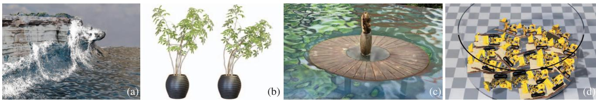  
Figure 1. Versatile motion synthesis and rendering. Gaussian Splashing (GSP) is a unified framework combining 3D Gaussian Splatting (3DGS) and position-based dynamics. By leveraging their coherent point-based representations, GSP delivers high-quality rendering for novel dynamic views involving interacting deformable bodies, rigid objects, and fluids. GSP enables a variety of compelling effects and new human-computer interaction modalities not available with existing NeRF/3DGS-based systems. The teaser figure showcases a cliff battered by waves (a), a deformable ficus plant (b), flooding garden (c) and piled and scattered rigid lego bulldozers in a box (d). The reconstructed Gaussians not only capture the nonlinear dynamics of fluids and solids but can also be rasterized to realistically render with both diffuse and specular shadings. GSP re-engineers several state-of-the-art techniques from neural surface reconstruction, specular-aware Gaussian shading, position-based surface tension, and AI inpainting to ensure the quality of both simulation and rendering with 3DGS

## Abstract

We demonstrate the feasibility of integrating physics-based animations of solids and fluids with 3D Gaussian Splatting (3DGS) to create novel effects in virtual scenes reconstructed using 3DGS. Leveraging the coherence of the Gaussian Splatting and Position-Based Dynamics (PBD) in the underlying representation, we manage rendering, view synthesis, and the dynamics of solids and fluids in a cohesive manner. Similar to GaussianShader, we enhance each Gaussian kernel with an added normal, aligning the kernel's orientation with the surface normal to refine the PBD simulation. This approach effectively eliminates spiky noises that arise from rotational deformation in solids. It also allows us to integrate physically based rendering to augment the dynamic surface reflections on fluids. Consequently, our framework is capable of realistically reproducing surface highlights on dynamic fluids and facilitating interactions between scene objects and fluids from new views.

## 1. Introduction

Visualization and reconstruction of 3D scenes have been the core of 3D graphics and vision. Recent development of learning-based techniques such as the neural radiance fields (NeRFs) [44] sheds new light on this topic. NeRF casts the reconstruction pipeline as a training procedure and delivers state-of-the-art results by encapsulating the color, texture, and geometry of the 3D scene into an implicit MLP net. Its superior convenience and efficacy inspire many followups, e.g., with improved visual quality [38], faster performance [18, 79], and sparser inputs [24, 80]. NeRF is computationally expensive due to the volume rendering. Image synthesis with NeRF has to follow the path integral, which is less suitable for real-time or interactive applications unless dedicated compression or acceleration methods are employed e.g., with NGP encoding [51]. 3D Gaussian Splatting (3DGS) [29] provides an elegant alternative. As the name suggests, 3DGS learns a collection of Gaussian kernels from the input images. Unlike NeRF, which relies on time-consuming ray marching and volume rendering, a novel view of the scene from an unseen camera pose is generated using rasterization with the tile-splatting technique.

This enables fast rendering with 3DGS.

It is noted that Gaussian kernels not only serve as a good rendering agent but also explicitly encode rich information of the scene geometry. This feature suggests 3DGS a good candidate for dynamic scenes [15, 27, 60, 70, 78], animated avatars [47, 84], or simulated physics [72]. We expand on this intuition, enhancing the current 3DGS ecosystem by injecting physics-based fluid and solid interactions into a 3DGS scene. This appears straightforward at first sight. Since 3DGS kernels are essentially a collection of ellipsoids, they can be used for the discretization of the fluid and solid dynamics just as position-based dynamics [42], oriented particles [48] or other particle-based simulation techniques. Unfortunately, a simple combination of those techniques does not yield the results expected. Large rotational deformation of the solid objects affects the splatting results with sharp and spiky noises [72]. During fluid motion, fluid particles undergo substantial positional shifts, moving from the inside to the outside or vice versa. Fluids are both translucent and specular. The vanilla 3DGS simplifies the composition of the light field without well-defined appearance properties. This limitation makes fluid rendering cumbersome with 3DGS.

This paper presents a system namely Gaussian Splashing (GSP), a 3DGS-based framework that enables realistic interactions between solid objects and fluids in a physically meaningful way, and thus generates two-way coupled fluids-solids dynamics in novel views. GSP integrates Lagrangian fluid and 3DGS scenes through a unified framework of position-based dynamics (PBD) [42, 49]. We follow a recent contribution of GaussianShader [26] to augment Gaussian kernels with additional environmental information so that specular shading can be dynamically synthesized along with the fluid's movement. For solid objects, GSP uses an anisotropy loss to cap the stretching ratio during 3DGS training and mitigate the rendering artifacts induced by rotational deformation. We approximate the normal of a fluid kernel based on the surface tension if it is near the fluid surface. For scattered fluid droplets, we resort to a depth volume rendered via the current camera pose to estimate the normal information [66]. GSP is versatile, due to the flexibility of PBD. It handles deformable bodies, rigid objects, and fluid dynamics in a unified way. While it is possible to incorporate more complicated constitutional models as in [16] and [31]. We found that PBD-based simulation suffices in many situations. We further augment GSP with an image-space segmentation module to select objects of interest from the 3DGS scene. We exploit the latest generative AI to fill the missing pixels to enable interesting physicsbased scene editing.

In a nutshell, GSP leverages a unified, volumetric, particle-based representation for rendering, 3D reconstruction, view synthesis, and dynamic simulation. It contributes a novel 3D graphics/vision system that allows natural and realistic solid-fluid interactions in real-world 3DGS scenes. This is achieved by carefully engineering the pipeline to overcome the limitations of the vanilla 3DGS. GSP could enable a variety of intriguing effects and new humancomputer interaction modalities in a diverse range of applications. For instance, one can pour water to flood the scene, floating the objects within, or directly liquefy an object, just as in science fiction. Fig. 1 showcases the dynamic interaction between a LEGO excavator and the splashing waves. There are 334,815 solid Gaussian kernels and 280,000 fluid Gaussian kernels. Through the two-way coupling dynamics, the excavator is animated to surf on the splashing waves.

## 2. Related work

Dynamic neural radiance field Dynamic neural radiance fields generalize the original NeRF system to capture timevarying scenes e.g., by decomposing time-dependent neural fields into an inverse displacement field and canonical timeinvariant neural fields [53, 54, 65, 69], or estimating the time-continuous 3D motion field [14, 17, 21, 33, 37, 57, 71] with an added temporal dimension. Existing works enable direct edits of NeRF reconstructions [3, 12, 25, 32, 45]. In dynamic scenes, the rendering process typically needs to trace deformed sample points back to rest-shape space to correctly retrieve the color/texture information [55, 59, 75, 81]. They often extract a mesh/grid from the NeRF volume. It is also possible to integrate physical simulation with NeRF using meshless methods [16, 31]. Point NeRF [74] and 3DGS [29] offer a different perspective to scene representation explicitly using points/Gaussian kernels to encode the scene. The success of 3DGS has inspired many studies to transplant techniques for dynamic NeRF to 3DGS [36, 70, 76]. They incorporate learning-based deformation and editing techniques to reconstruct or generate dynamics of NeRF scenes. It is noteworthy that a recent work from Xie et al. [72] integrates physical simulation with 3DGS, leveraging the unified proxy for both simulating and rendering.

Lagrangian fluid simulation Lagrangian fluid simulation tracks fluid motion using individual particles as they traverse the simulation domain. A seminal approach within this domain is smoothed particle hydrodynamics (SPH) [46], which solves fluid dynamics equations by assessing the influence of neighboring particles. Despite its efficacy, SPH, particularly in its standard and weakly compressible forms (WCSPH) [5], suffers from parameter sensitivity, e.g., kernel radius and time-step size for stiff equations. To relax the time-step restriction, predictivecorrective incompressible SPH (PCISPH) [61] iteratively corrects pressure based on the density error. Similarly, position-based dynamics [49] provides a robust method of solving a system of non-linear constraints using Gauss-Seidel iterations by updating particle positions directly which can also be employed in fluid simulation [40] with improved stability. Furthermore, surface tension can also be generated [73] using the position-based iterative solver by tracking surface particles and solving constraints on them to minimize the surface area.

Reflective object rendering Achieving precise rendering of reflective surfaces relies on accurately estimating scene illumination, such as environmental light, and material properties like bidirectional reflectance distribution function (BRDF). This task falls under the domain of inverse rendering [4, 52]. Some NeRF-related methodologies disentangle the visual appearance into lighting and material properties, which can jointly optimize environmental illumination, surface geometry, and material [6- 8, 62, 68, 82, 83]. Other NeRF studies [28, 34, 35, 39] aim to enhance the accuracy of the normal estimation in physically based rendering (PBR). Nevertheless, these efforts face challenges such as time-consuming training and slow rendering speed. On the contrary, 3DGS naturally offers a good normal estimation as the shortest axis of the Gaussian kernel [20, 26]. Following this idea, it is possible to achieve high-quality rendering of reflective objects and training efficiency simultaneously [26].

Point-based rendering Point-based rendering has been an active topic in computer graphics since the 1980s [30]. The simplest method [19] renders a set of points with a fixed size. It suffers from holes and relies on post-processing steps such as hole-filling [19, 56] to correct the resulting rendering. An improvement is to use ellipsoids instead of volume-less points. This strategy is usually referred to as point splatting [85]. The ellipsoids are rendered with a Gaussian alpha-mask to eliminate visible artifacts between neighboring splats and then combined by a normalizing blend function [2, 85]. Point-based rendering well synergizes with Lagrangian fluid rendering, enabling the calculation of fluid thickness and depth through splatting. This approach [66] achieves fluid rendering at an impressive realtime speed. Further extensions to splatting aim to automatically compute the shape and color of ellipsoids, for example, auto splats [11]. With the development of deep learning in recent years, learning-based approaches improve the image quality of splatting [10, 77]. 3DGS [29] has introduced this technique into 3D reconstruction, enabling high-quality real-time novel view synthesis for reconstructed scenes. A natural idea is to combine 3DGS with fluid rendering, enabling interaction between reconstructed scenes and $\mathrm { { d y } \mathrm { { - } } }$ namic fluids.

## 3. Background

To make our paper self-contained, we start with a brief review of PBD and 3DGS on which our pipeline is built. More detailed discussions are available in the supplementary material and relevant literature e.g., [26, 29, 42, 49].

## 3.1. Position-based dynamics

PBD/XPBD treats a dynamic system as a set of N vertices and M constraints. This perspective offers an easy and efficient simulation modality, converting the variational optimization to the so-called constraint projections. Specifically, XBPD considers the total system potential U as a quadratic form of all the constraints $\begin{array} { l } { \mathbf { \bar { \mathit { C } } } ( \mathbf { x } ) } \end{array} = \begin{array} { l } { [ C _ { 1 } ( \mathbf { x } ) , \mathbf { \bar { \mathit { C } } } _ { 2 } ( \mathbf { x } ) , . . . , C _ { M } ( \mathbf { x } ) ] ^ { \top } } \end{array}$ such that $\begin{array} { r l } { U } & { { } = } \end{array}$ ${ \textstyle \frac { 1 } { 2 } } \dot { C } ^ { \top } ( { \pmb x } ) \dot { { \alpha } ^ { - 1 } } C ( { \pmb x } )$ . Here, x represents the position of vertices and α is the compliance matrix, i.e., the inverse of the constraint stiffness. XBPD estimates an update of constraint force (i.e., the multiplier) ∆λ by solving:

$$
\left[ \Delta t ^ { 2 } \nabla C ( { \pmb x } ) { \cal M } ^ { - 1 } \nabla C ^ { \top } ( { \pmb x } ) + { \pmb \alpha } \right] \Delta \lambda = - \Delta t ^ { 2 } C ( { \pmb x } ) - \alpha \lambda ,\tag{1}
$$

where $\Delta t$ is the time step size, and M is the lumped mass matrix. The update of the primal variable $\Delta { } x$ can then be computed as:

$$
\Delta \pmb { x } = \pmb { M } ^ { - 1 } \nabla \pmb { C } ^ { \top } ( \pmb { x } ) \Delta \pmb { \lambda } .\tag{2}
$$

We note that such constraint-projection-based simulation naturally synergizes with 3DGS. It is also versatile and can deal with a wide range of physical problems such as fluid [40, 73], rigid bodies [50], or hyperelastic objects [41].

## 3.2. 3D Gaussian splatting

3D Gaussian splatting (3DGS) is a learning-based rasterization technique for 3D scene reconstruction and novel view synthesis. 3DGS encodes a radiance field using a set of Gaussian kernels $\mathcal { P }$ with trainable parameters ${ \bf x } _ { p } , \sigma _ { p } , { \bf A } _ { p } , { \bf c } _ { p }$ for $p \in \mathcal { P }$ , where $x _ { p } , \sigma _ { p } , A _ { p }$ and $c _ { p }$ represent the center, opacity, covariance matrix, and color function of each kernel. To generate a scene render, 3DGS projects these kernels onto the imaging plane according to the viewing matrix and blends their colors based on the opacity and depth. The final color of the i-th pixel is computed as:

$$
c _ { i } = \sum _ { k } G _ { k } ( i ) \sigma _ { k } c _ { k } ( \pmb { r } _ { k } ) \prod _ { j = 1 } ^ { k - 1 } \left( 1 - G _ { j } ( i ) \sigma _ { j } \right) .\tag{3}
$$

Here, all the kernels are re-ordered based on the z-values at kernel centers under the current view. $G _ { k } ( i )$ denotes the 2D Gaussian weight of the k-th kernel at pixel i, and $\mathbf { \nabla } r _ { k }$ is the view direction from camera to the center of the k-th kernel. The color functions only depend on the viewing direction.

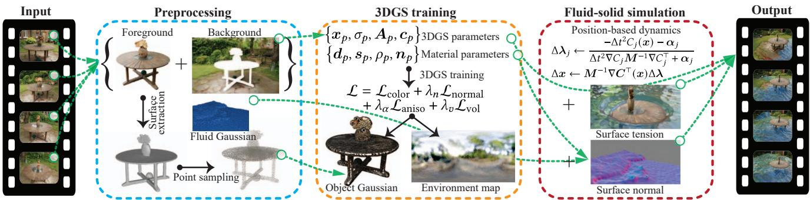  
Figure 2. An overview of GSP pipeline. The input to our system comprises multi-view images that capture a 3D scene. During the preprocessing stage, foreground objects are isolated and reconstructed. This is followed by point sampling to facilitate scene discretization for PBD simulation and Gaussian rendering. We train the Gaussian kernels using differentiable 3DGS, which takes into account appearance materials and lighting conditions. These kernels are animated using PBD, in conjunction with fluid particles, to tackle the dynamics of both solids and fluids within the scene. Finally, the dynamic scene is rendered into images. This rendering process includes detailed modeling of specular reflections, thereby providing visually accurate representations of the simulated interactions between solids and fluids.

GaussianShader [26] further enhances 3DGS by incorporating additional trainable material parameters for kernel p such as diffuse $d _ { p } ,$ specular $s _ { p } .$ roughness $\rho _ { p }$ , and normal $n _ { p } ,$ along with a global environment map. It fuses more information into the kernel's color:

$$
\begin{array} { r } { c _ { p } ( \pmb { r } _ { i } ) = \pmb { d } _ { p } + \pmb { s } _ { p } \odot L _ { s } ( \pmb { r } _ { i } , \pmb { n } _ { p } , \rho _ { p } ) , } \end{array}\tag{4}
$$

where $L _ { s } ( r _ { i } , n _ { p } , \rho _ { p } )$ is the specular light for the kernel along $\boldsymbol { r } _ { i }$ given the normal and roughness of the kernel. It can be pre-filtered into multiple mip maps. The symbol denotes the element-wise multiplication.

## 4. Method

As shown in Fig. 2, the input of our system is a collection of images of a given 3D scene taken from different viewpoints. We separate foreground objects and the image background for all the inputs and extract the surface of masked objects. We apply an anisotropy loss to mitigate undesired splatting render to prevent over-stretching Gaussian kernels when training 3DGS for the solid object. Doing so mitigates the rendering artifacts near the surface of solid models. We decouple solid simulation and rendering by utilizing a separate set of sampled particles for simulation, and interpolating deformations of these particles onto trained Gaussian kernels during rendering. This approach ensures high-quality and robust results in both simulation and rendering. On the other hand, fluids use a unified set of Gaussian kernels (for rendering) or particles (for simulation). We track the fluids surface during simulation and use surface normal to properly synthesize specular effects by augmenting them with a decomposed environment map. Under the PBD framework, both fluids and solids are made of particles, and can be animated in a unified way based on local constraint projection.

## 4.1. Training

Our training process is generally similar to traditional Gaussian Splatting. However, due to our use of Physically-Based Rendering (PBR) modeling, the visual attributes or material parameters (e.g., diffuse, specular, roughness) of Gaussian kernels need to be determined. Without them, high-quality rendering results are not possible. Similar to [26], we leverage the differentiable 3DGS pipeline to optimize the appearance of every Gaussian kernel. All Gaussian kernels are first shaded with their corresponding material parameters (Eq. (4)) and are then splatted to a rendered image. Comparing it with the training view gives a loss back-propagated to update the corresponding parameters of Gaussian kernels. Specifically, the trainable parameters for each kernel p are position $\scriptstyle { \mathbf { { \mathit { x } } } } _ { p } ,$ opacity $\sigma _ { p } .$ covariance $A _ { p }$ and material $\{ d _ { p } , s _ { p } , \rho _ { p } , n _ { p } \}$ . The loss is defined as:

$$
\mathcal { L } = \mathcal { L } _ { \mathrm { c o l o r } } + \lambda _ { n } \mathcal { L } _ { \mathrm { n o r m a l } } + \lambda _ { a } \mathcal { L } _ { \mathrm { a n i s o } } ,\tag{5}
$$

where $\scriptstyle { \mathcal { L } } _ { \mathrm { c o l o r } }$ is the color loss between render and training image; $\mathcal { L } _ { \mathrm { n o r m a l } }$ is normal consistency regularization adopted from GaussianShader [26]. The anisotropy loss $\mathcal { L } _ { \mathrm { a n i s o } }$ is designed to prevent Gaussian kernels from becoming excessively elongated or compressed and potentially producing artifacts under large deformations. It is defined as:

$$
\mathcal { L } _ { \mathrm { a n i s o } } = \frac { 1 } { | \mathcal { P } | } \sum _ { p \in \mathcal { P } } \operatorname* { m a x } \left\{ \frac { S _ { p } ^ { 1 } } { S _ { p } ^ { 2 } } - a , 0 \right\} ,\tag{6}
$$

where a is a ratio threshold and $\boldsymbol { S _ { p } } = \left\{ S _ { p } ^ { 1 } , S _ { p } ^ { 2 } , S _ { p } ^ { 3 } \right\}$ are the scalings of Gaussian kernels with $S _ { p } ^ { 1 }$ being the largest scaling and $S _ { p } ^ { 3 }$ being the smallest scaling. Note that as the shading normal is based on the minimal axis of Gaussian kernels, we do not constrain the minimal axis in the anisotropy loss. Otherwise, a spherical Gaussian kernel will result in normal ambiguity. We set $a = 1 . 1 , \lambda _ { n } = 0 . 2$ , and $\lambda _ { a } = 1 0$ in our experiments.

## 4.2. Solid simulation and interpolation

In dynamic Gaussian Splatting applications [58, 72], simulation and rendering are often coupled, with Gaussian kernels used for both processes. However, this creates issues: Gaussian kernels primarily reside on object surfaces, requiring internal kernels that are mostly unrendered unless they contribute to effects like fracturing. Moreover, uneven surface kernel distribution can degrade simulation quality, while uniform distribution can hinder rendering. Thus, decoupling simulation and rendering is essential for maintaining quality in both. Our pipeline uses reconstructed 3DGS kernels for solid rendering and a separate set of particles for simulation.

For accurate object-object interaction and fluid-solid coupling, particles must precisely represent object boundaries and interiors. We employ Poisson disk sampling [9] to place simulation particles within the surface mesh, reconstructed using NeuS [67], which extracts the zero-level set of a signed distance function for the foreground object. Existing frameworks incorporating physics with 3DGS [72] also require spatial discretization for solving dynamics equations, but these methods can lead to sparse sampling, particularly for thin object parts, which may degrade simulation quality (see supplementary material)

Once the simulation particles are sampled and in place, we perform PBD on them to animate frames of dynamic motion. Each frame, deformation gradients and displacements are interpolated from the simulation particles to the trained Gaussian kernels using generalized moving least squares (GMLS) [43], which produces smooth and robust results.

## 4.3. Position-based fluids

We employ the Position-Based Fluids (PBF) [40] as our Lagrangian fluid synthesizer. To enforce the fluid incompressibility, PBF imposes a density constraint $C _ { i } ^ { \rho }$ on each particle, maintaining the integrated density $\rho _ { i }$ computed by the SPH kernel as:

$$
C _ { i } ^ { \rho } = \frac { \rho _ { i } } { \rho _ { 0 } } - 1 = \sum _ { j } \frac { m _ { j } } { \rho _ { 0 } } W ( \pmb { p _ { i } } - \pmb { p _ { j } } ) - 1 ,\tag{7}
$$

where $m _ { j }$ is the mass of particle $j .$ 。 $\mathbf { \nabla } p _ { i }$ is the position of particle i, and $W$ is the SPH kernel function. Each constraint can be straightforwardly parallelized using GPUs.

GSP incorporates a position-based tension model [73] to more accurately simulate fluid surface dynamics. Surface detection for a particle is performed through occlusion estimation, where each particle is enclosed by a spherical screen. Neighboring particles project onto this screen, and a particle is classified as on the surface if the cumulative projection area is below a specified threshold, reflecting its partial exposure. Given the natural tendency of tensions to reduce surface area, PBF enforces an area constraint on each surface particle to minimize local surface area. This process begins with the calculation of the normal $\mathbf { \nabla } n _ { i }$ for surface particle i as:

$$
n _ { i } = \mathrm { n o r m a l i z e } ( - \nabla _ { p _ { i } } C _ { i } ^ { \rho } ) ,\tag{8}
$$

where $C _ { i } ^ { \rho } = 0$ indicates the particle is inside the fluid, and $C _ { i } ^ { \rho } = - \mathrm { { 1 } }$ indicates it is outside. After that, we project the neighboring surface particles onto a plane perpendicular to $\mathbf { n } _ { i }$ and triangularize the plane. The area constraint can then be built as:

$$
C _ { i } ^ { A } = \sum _ { t \in T ( i ) } \frac { 1 } { 2 } \| ( \pmb { p } _ { t ^ { 2 } } - \pmb { p } _ { t ^ { 1 } } ) \times ( \pmb { p } _ { t ^ { 3 } } - \pmb { p } _ { t ^ { 1 } } ) \|\tag{9}
$$

where $T ( i )$ is the set of neighboring triangles for particle i. To promote a more uniform particle distribution, additional distance constraints are introduced to push apart particles that are too close to each other:

$$
C _ { i j } ^ { D } = \operatorname* { m i n } \left\{ 0 , \| p _ { i } - { p _ { j } } \| - d _ { 0 } \right\} ,\tag{10}
$$

where $d _ { 0 }$ is the distance threshold. The original version was parallelized on CPUs; we have enhanced it for GPU parallelization. Calculations for $n _ { i } , C _ { i } ^ { A }$ and $C _ { i j } ^ { D }$ are efficiently parallelizable on GPUs. Considering that the number of surface particles surrounding each particle is typically low, local triangulation for each particle is conducted independently on separate threads.

## 4.4. Rendering

The rendering of the dynamic scene reuses the existing 3DGS pipeline. For dynamic solids, we first transform each solid Gaussian kernel from rest positions $\scriptstyle { \mathbf { { \boldsymbol { x } } } } _ { p }$ to deformed positions $\ v { x } _ { p } ^ { t }$ where t indicates the time step index. We directly place these kernels at deformed positions. For a kernel with deformation gradient $F _ { p } .$ its covariance $A _ { p } ^ { t }$ and normal ${ n _ { p } ^ { t } }$ after deformation is updated by:

$$
\pmb { A } _ { p } ^ { t } = \pmb { F } _ { p } \pmb { A } _ { p } \pmb { F } _ { p } ^ { \top } , \ \mathrm { a n d } \ n _ { p } ^ { t } = \frac { \pmb { F } _ { p } ^ { - \top } \pmb { n } _ { p } } { \left\| \pmb { F } _ { p } ^ { - \top } \pmb { n } _ { p } \right\| } .\tag{11}
$$

We then shade the deformed Gaussian kernels $\{ \pmb { x } _ { p } ^ { t } , \sigma _ { p } , \pmb { A } _ { p } ^ { t } , \pmb { n } _ { p } ^ { t } \}$ with material $\{ d _ { p } , s _ { p } , \rho _ { p } \}$ , i.e., Eq. (4) and splat them into an image $c ^ { \mathrm { b g } }$ . As shadows are important to visual outcomes in dynamic scenes, we further re-engineer nearly-soft shadows [13] into our system to enhance the realism.

The dynamic particle-based fluids are rendered with ellipsoids splatting [40], which is inherently compatible with the existing 3DGS pipeline. We begin by generating spherical fluid Gaussian kernels at each fluid particle. The initial covariance $A _ { p }$ of each kernel is determined by the particle radius. The normal $\mathbfit { n _ { p } }$ adopts the surface normal of the nearest surface fluid particle from PBF simulation. We proceed to set up the appearance material for each fluid Gaussian kernel, which requires careful engineering due to the fluid's strong reflection and refraction effects. We employ the current PBR workflow to model the reflection, which adopts the same formula of Eq. (4). We set a specular material $( s _ { p } = 1 , \ : \rho _ { p } = 0 . 0 5$ in our experiments) for all fluid kernels to imitate reflective behavior. The refraction needs careful treatment, which we model into a thicknessdependent diffuse color $d _ { p } .$ As the fluid thickness increases, the absorption of light within the fluid intensifies, resulting in reduced visibility for objects behind. Conversely, when there is less fluid present, it exhibits a more transparent appearance. The fluid thickness τ comes from the modified splatting pipeline, with the alpha blending replaced by additive blending. The refraction color $d _ { p }$ is then represented by Beer's Law [64]:

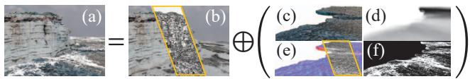  
Figure 3. GSP rendering. GSP synthesizes high-quality images corresponding to dynamically interacting fluids and solids. (a) The final rendered image combining rendered solids, fluids, and foams. (b) The rendering result of solids. (c) The rendering result of fluids. (d) The fluid thickness by additive splatting, where the darker color indicates the higher thickness. (e) The normal of fluids. (f) The intensity of foam particles. The insets in (b) and (e) represent solid and fluid Gaussian kernels, respectively.

$$
\begin{array} { r } { d _ { p } = e ^ { - k \tau _ { p } } c _ { p } ^ { \mathrm { b g } } . } \end{array}\tag{12}
$$

Here, the absorption coefficient k is defined differently for each color channel, $\tau _ { p } , c _ { p } ^ { \mathrm { b g } }$ is the fluid thickness and background back-projected to each Gaussian kernel respectively. Note that for background back-projection, a distortion $\beta n _ { p }$ is added to mimic the change of light path due to refraction. Opacity $\sigma _ { p }$ is set to 1 as most of transmission and refraction has already been modeled into $d _ { p }$ . We finally shade all fluid Gaussian kernels $\{ \pmb { x } ^ { t } , \sigma _ { p } , \pmb { A } _ { p } ^ { t } , \hat { \pmb { n } _ { p } ^ { t } } \pmb { d } _ { p } , s _ { p } , \rho _ { p } \}$ and splat them to the fluid rendering result $c ^ { \mathrm { f l u i d } }$ with Gaussian Splatting. To enhance the realism of fluids, foam particles are synthesized [22] and rendered [1]. The 3DGS pipeline is re-engineered to incorporate additive splatting with distinct kernels for foam, bubble, and spray particles. The final rendering result is achieved by combining the $c ^ { \mathrm { b g } }$ and $c ^ { \mathrm { H u i d } }$ , as shown in Fig. 3. Please refer to the supplementary material for more details on the rendering part.

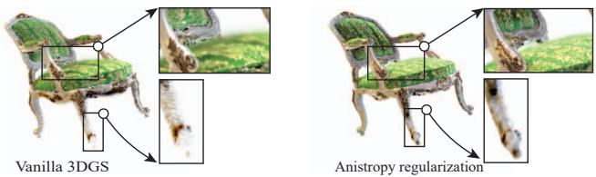  
Figure 4. Anistropy regularization. Anistropy regularization effectively maintains rendering quality under large deformations. Without the regularization term, 3DGS tends to generate fuzzy and spiky artifacts, especially near the surface of the model (left). When the regularization is applied, image quality is greatly improved with correct specular effects.

## 4.5. Inpainting

Displaced object exposes unseen areas that were originally covered to the camera. Since they are not present in the input image, 3DGS is unable to recover the color and texture information of these areas, leading to black smudges and dirty textures in the result. GSP remedies this issue using an inpainting trick. First, we remove all the Gaussian kernels of the object that may be displaced. We then use LaMa [63] to inpaint the rendered results, noting the new colors of pixels originally in spots and assigning them to the first Gaussian kernel encountered by the rays emitted from these pixels. We average the recorded colors on all noted Gaussian kernels for their diffuse color, set their opacity to 1, and their specular color to 0 to prevent highlights.

## 5. Experiments

We implemented Gaussian Splashing pipeline using Python, C++ and CUDA on a desktop PC equipped with a 12-core Intel i7-12700F CPU and an NVIDIA RTX 30 90 GPU. Specifically, for the rendering part, we ported the published implementation of GaussianShader [26] and integrated our fluid rendering using PyTorch [23]. PBD/PBF engine was implemented with CUDA, and we also group independent constraints to efficiently parallelize the constraint projections on the GPU. Please refer to the supplementary material for more details of the implementation.

## 5.1. Ablation

Anisotropy regularization 3DGS is originally designed for view synthesis. 3DGS obtained from a static scene produces low-quality renders when Gaussian kernels undergo large rotational deformations. The anisotropy regularization is effective against this limitation as shown Fig. 4. Detailed statistics regarding the experiment settings and timings are reported in Tab. 1. Most experiments can also be found in the supplementary video.

PBR material To show the importance of specular highlights in fluid rendering, we show a side-by-side comparison in a 3DGS scene. As shown in Fig. 5, we compare fluids rendered using purely diffuse materials with those that incorporated specular reflections. The fluids without specular reflection appear almost smoke-like, while the inclusion of specular term significantly enhances the realism of the fluids. It should be noted that incorporating PBR in 3DGS is key to improving the render quality of largely deformed fluids. This is in contrast to previous work [72], which baked lighting into spherical harmonics and failed to produce realistic rendering when fluids underwent significant motion.

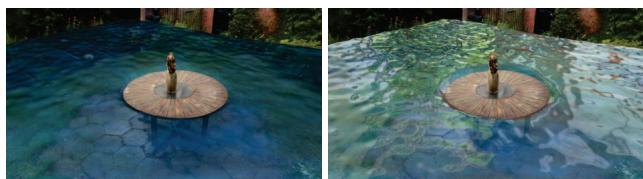  
Figure 5. Ablation study of specular. We demonstrate the impact of specular highlights on the quality of rendering. On the left is a fluid rendered with diffuse color only. On the right, surface reflective specular are added, which exhibits a more realistic and dynamic fluid.

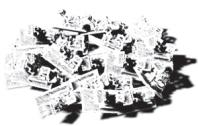  
Shadow Map

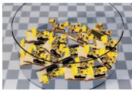  
w/o Shadow Map

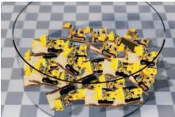  
w/ Shadow Map

Shadow map In Fig. 6, we demonstrate that GSP, with the addition of nearly soft shadows, significantly improves visual realism compared to vanilla 3DGS. Without these shadows, objects appear like flat layers pasted onto the background, lacking a sense of depth.

Inpainting We conduct an ablation experiment on inpainting as shown in Fig. 7. In this indoor scene, displacing cup and dog with vanilla 3DGS results in the occurance of black smudges and dirty textures, as the hidden area by the object could not be reconstructed properly due to missing information in the input images. GSP addresses this by using LaMa [63] for inpainting.

## 5.2. Evaluation

We evaluate GSP through a diverse set of experiments, covering the dynamics of deformable bodies, rigid bodies, and fluids, as well as two-way coupling between solids and fluids. For additional frames and more detailed results, please refer to the supplementary material. All experiments are also available in the supplementary video. Fig. 8 illustrates a dynamic fluid scene featuring a coastal cliff and waves. The waves continuously push towards the shore from a distance, and upon colliding with the cliff, they splash out foam and spray. This accurately models the complex interactions between the fluid and the solid cliff face. In Fig. 10, a lego bulldozer is surfing on the splashing waves. Through the two-way coupling, the baseplate and the bucket deform and vibrate under the impact of the waves. We also conducted a comparison with PhysGaussian [72] to demonstrate the high-quality fluid rendering of our method. Please refer to the supplementary material for details.

Figure 6. Shadow map. GSP incorporates dynamic shadows into the rendering pipeline to enhance visual realism. We re-engineer variance shadow mapping [13] within the existing 3DGS pipeline to produce nearly-soft shadows.  
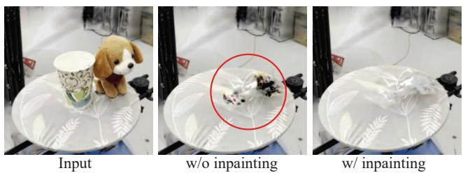  
Figure 7. 3DGS inpainting. In this indoor scene, both the paper cup and the stuffed toy dog are segmented from the input image (left). 3DGS leaves empty spots and dirty textures blended from irrelevant kernels, as highlighted in the middle figure. Applying the inpainting with generative AI [63] ameliorates this issue (right).

GSP has a semantic segmentation module. Therefore, the user is able to freely manipulate the models in the scene. Furthermore, since everything is represented as Gaussian particles, GSP allows the user to transform the state of the model. The full demonstration is provided in the supplementary material.

Our fluid simulator can also capture the surface tension within the PBD framework. This enables realistic lowvolume fluid-solid interaction. As shown in Fig. 11, water flows from a headset hanging above an office desk, resembling a faucet. Due to surface tension, the water forms droplets as it falls, sliding down the computer screen and splashing onto the desk, creating a puddle.

GSP is a versatile system and supports the manipulation of both rigid objects and deformable bodies. As shown in Fig. 9, a deformable ficus is waving at you. Due to the external force applied to it, the plant undergoes continuous deformation. In Fig. 6, bulldozers are piled and dropped in a bowl. They collide and contact with each other and eventually scattered within the box.

## 6. Conclusion

GSP is a novel pipeline combining position-based dynamics (PBD) with 3DGS. The core idea behind Gaussian Splashing is to leverage the consistency of volume particle-based discretization for integrated processing of tasks like 3D reconstruction, deformable simulation, fluid dynamics, rigid contacts, and rendering from novel viewpoints. While the concept is simple, developing Gaussian Splashing requires significant research and engineering. The presence of fluid complicates 3DGS processing due to specular highlights, and fluid-solid coupling depends on accurate surface data. Large deformations in solids lead to defective rendering, and displaced models create untracked empty regions in input images. We address these challenges by integrating state-of-the-art technologies. Gaussian Splashing enables realistic view synthesis with novel camera poses and physically-based dynamics for deformable, rigid, and fluid objects, including state transformations. Notably, integrating physically-based fluid dynamics into NeRF/3DGS has not been explored before. The main contribution is demonstrating the feasibility of a unified framework for physicsdriven and learning-based 3D reconstruction. However, Gaussian Splashing has limitations, such as the reduced accuracy of PBD, and the fluid rendering is far from perfect. Ellipsoid splatting is suitable for position-based fluids but does not fully account for real-world light transport, such as refraction.

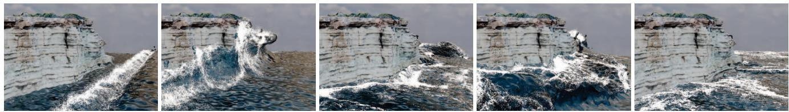  
Figure 8. Waves crashing on cliff. A coastal cliff rises from the sandy beach, while the sea waves continuously crash against the rocky surface, generating splashes and foam upon collision.

Table 1. Time performance. We present detailed time statistics for the experiments reported in the paper. All time-related evaluations are expressed in seconds. From left to right, (1) # Kernels indicates the number of Gaussian kernels, while # Solids, # Fluids, and # BG denote the foreground solid, the fluid, and the background, respectively. In some experiments (e.g., Cup & Dog and Headset), the number of fluid particles varies over time. We report the maximum number of fluid particles. (2) Sim. Time provides time statistics for simulations, with Overall representing the total simulation time per time step and Tension indicating the time taken for each surface tension constraint projection. (3) Render Time details the time statistics for rendering, with Solids, Fluids, and BG denoting the time spent on rendering the solids, fluids, and background, respectively.
<table><tr><td rowspan="2">Scene (Fig.)</td><td colspan="2"># Kernels</td><td rowspan="2"></td><td colspan="2">Sim. Time (s) Overall Tension</td><td colspan="2">|Render Time (×10−2 s)</td></tr><tr><td># Solids # Fluids</td><td>#BG</td><td></td><td></td><td>Solids Fluids</td><td>BG</td></tr><tr><td>Chair (Supp)</td><td>315K</td><td>300K</td><td>0</td><td>5.4</td><td>1.1</td><td>3.9 5.9</td><td>0</td></tr><tr><td>Waves (Fig. 8)</td><td>420K</td><td>817K</td><td>0</td><td>8.1</td><td>3.1 8.2</td><td>11.6</td><td>0</td></tr><tr><td>Garden (Fig. 5)</td><td>450K</td><td>614K</td><td>2.27M</td><td>7.3</td><td>1.6</td><td>6.9 10.3 2.9</td><td>2.3</td></tr><tr><td>Lego (Fig. 10)</td><td>330K</td><td>280K</td><td>290K</td><td>3.8</td><td>1.0</td><td>4.6</td><td>1.9</td></tr><tr><td>Cup &amp; dog (Fig. 7)</td><td>156K</td><td>160K</td><td>310K</td><td>2.1</td><td>0.6</td><td>2.4 4.1</td><td>1.9</td></tr><tr><td>Headset (Fig. 11)</td><td>357K</td><td>64K</td><td>2.22M</td><td>1.9</td><td>1.8</td><td>1.5 3.8</td><td>2.7</td></tr><tr><td>Can (Supp)</td><td>390K</td><td>254K</td><td>1.19M</td><td>1.6</td><td>0.8</td><td>2.5 4.7</td><td>2.0</td></tr><tr><td>Astronaut (Supp)</td><td>0</td><td>145K</td><td>0</td><td>0.8</td><td>0.6</td><td>4.0</td><td>0</td></tr><tr><td>Ficus (Fig. 9)</td><td>204K</td><td>0</td><td>0</td><td>2.3</td><td>0</td><td>2.6 0 0</td><td>0</td></tr><tr><td>Bulldozers (Fig. 6)</td><td>6.67M</td><td>0</td><td>350K</td><td>4.5</td><td>0</td><td>24.6</td><td>2.1</td></tr></table>

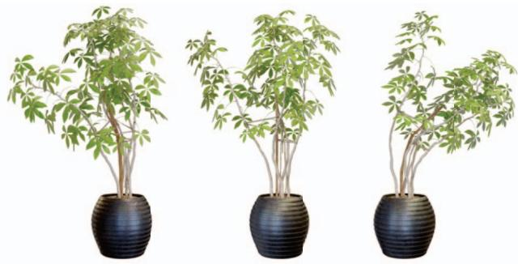  
Figure 9. Deformable ficus. A deformable ficus plant undergoes continuous shape changes as it is dragged and manipulated by external forces.

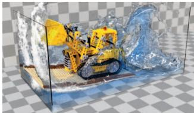

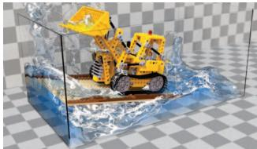  
Figure 10. Splashing LEGO. Through the two-way coupling dynamics, the LEGO bulldozer is animated to surf on the splashing waves.

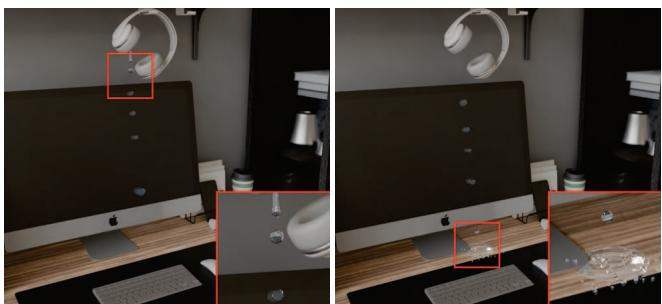  
Figure 11. Headset droplets. Water flows from a headset hanging above an office desk, resembling a faucet. Due to surface tension, the water forms droplets, sliding down the computer screen and splashing onto the desk, creating a puddle.

## Acknowledgement

We thank anonymous reviewers and AC for their constructive comments. This work is supported by NSF (2301040), NSF China (62322209, 62421003, 62332015, 62227806), the gift from Adobe Research, the XPLORER PRIZE and the 100 Talents Program of Zhejiang University.

## References

[1] Nadir Akinci, Alexander Dippel, Gizem Akinci, and Matthias Teschner. Screen space foam rendering. 2013. 6, 3

[2] Marc Alexa, Markus Gross, Mark Pauly, Hanspeter Pfister, Marc Stamminger, and Matthias Zwicker. Point-based computer graphics. In ACM SIGGRAPH 2004 Course Notes, pages 7–es. 2004. 3

[3] Chong Bao, Yinda Zhang, Bangbang Yang, Tianxing Fan, Zesong Yang, Hujun Bao, Guofeng Zhang, and Zhaopeng Cui. Sine: Semantic-driven image-based nerf editing with prior-guided editing field. In Proceedings of the IEEE/CVF Conference on Computer Vision and Pattern Recognition, pages 20919–20929, 2023. 2

[4] Jonathan T Barron and Jitendra Malik. Shape, illumination, and reflectance from shading. IEEE transactions on pattern analysis and machine intelligence, 37(8):1670–1687, 2014. 3

[5] Markus Becker and Matthias Teschner. Weakly compressible sph for free surface flows. In Proceedings of the 2007 ACM SIGGRAPH/Eurographics Symposium on Computer Animation, page 209–217, Goslar, DEU, 2007. Eurographics Association. 2

[6] Sai Bi, Zexiang Xu, Pratul Srinivasan, Ben Mildenhall, Kalyan Sunkavalli, Miloš Hašan, Yannick Hold-Geoffroy, David Kriegman, and Ravi Ramamoorthi. Neural reflectance fields for appearance acquisition. arXiv preprint arXiv:2008.03824, 2020. 3

[7] Mark Boss, Raphael Braun, Varun Jampani, Jonathan T Barron, Ce Liu, and Hendrik Lensch. Nerd: Neural reflectance decomposition from image collections. In Proceedings of the IEEE/CVF International Conference on Computer Vision, pages 12684–12694, 2021.

[8] Mark Boss, Varun Jampani, Raphael Braun, Ce Liu, Jonathan Barron, and Hendrik Lensch. Neural-pil: Neural pre-integrated lighting for reflectance decomposition. Advances in Neural Information Processing Systems, 34: 10691-10704,2021.3

[9] Robert Bridson. Fast poisson disk sampling in arbitrary dimensions. SIGGRAPH sketches, 10(1):1, 2007. 5

[10] Giang Bui, Truc Le, Brittany Morago, and Ye Duan. Pointbased rendering enhancement via deep learning. The Visual Computer, 34:829–841, 2018. 3

[11] H Childs, T Kuhlen, and F Marton. Auto splats: Dynamic point cloud visualization on the gpu. In Proc. Eurographics Symp. Parallel Graph. Vis., pages 1–10, 2012. 3

[12] Jiahua Dong and Yu-Xiong Wang. Vica-nerf: Viewconsistency-aware 3d editing of neural radiance fields. In Thirty-seventh Conference on Neural Information Processing Systems, 2023. 2

[13] William Donnelly and Andrew Lauritzen. Variance shadow maps. In Proceedings of the 2006 symposium on Interactive 3D graphics and games, pages 161–165, 2006. 5, 7, 3

[14] Yilun Du, Yinan Zhang, Hong-Xing Yu, Joshua B Tenenbaum, and Jiajun Wu. Neural radiance flow for 4d view synthesis and video processing. In 2021 IEEE/CVF International Conference on Computer Vision (ICCV), pages 14304–14314. IEEE Computer Society, 2021. 2

[15] Bardienus P Duisterhof, Zhao Mandi, Yunchao Yao, Jia-Wei Liu, Mike Zheng Shou, Shuran Song, and Jeffrey Ichnowski. Md-splatting: Learning metric deformation from 4d gaussians in highly deformable scenes. arXiv preprint arXiv:2312.00583, 2023. 2

[16] Yutao Feng, Yintong Shang, Xuan Li, Tianjia Shao, Chenfanfu Jiang, and Yin Yang. Pie-nerf: Physics-based interactive elastodynamics with nerf, 2023. 2

[17] Chen Gao, Ayush Saraf, Johannes Kopf, and Jia-Bin Huang. Dynamic view synthesis from dynamic monocular video. In Proceedings of the IEEE/CVF International Conference on Computer Vision, pages 5712–5721, 2021. 2

[18] Stephan J Garbin, Marek Kowalski, Matthew Johnson, Jamie Shotton, and Julien Valentin. Fastnerf: High-fidelity neural rendering at 200fps. In Proceedings of the IEEE/CVF International Conference on Computer Vision, pages 14346– 14355, 2021.1

[19] Jeffrey P Grossman and William J Dally. Point sample rendering. In Rendering Techniques' 98: Proceedings of the Eurographics Workshop in Vienna, Austria, June 29—July 1, 1998 9, pages 181–192. Springer, 1998. 3

[20] Antoine Guédon and Vincent Lepetit. Sugar: Surfacealigned gaussian splatting for efficient 3d mesh reconstruction and high-quality mesh rendering. arXiv preprint arXiv:2311.12775, 2023. 3

[21] Xiang Guo, Jiadai Sun, Yuchao Dai, Guanying Chen, Xiaoqing Ye, Xiao Tan, Errui Ding, Yumeng Zhang, and Jingdong Wang. Forward flow for novel view synthesis of dynamic scenes. In Proceedings of the IEEE/CVF International Conference on Computer Vision, pages 16022–16033, 2023. 2

[22] Markus Ihmsen, Nadir Akinci, Gizem Akinci, and Matthias Teschner. Unified spray, foam and air bubbles for particlebased fluids. The Visual Computer, 28:669–677, 2012. 6, 3

[23] Sagar Imambi, Kolla Bhanu Prakash, and GR Kanagachidambaresan. Pytorch. Programming with TensorFlow: Solution for Edge Computing Applications, pages 87–104, 2021. 6

[24] Ajay Jain, Matthew Tancik, and Pieter Abbeel. Putting nerf on a diet: Semantically consistent few-shot view synthesis. In Proceedings of the IEEE/CVF International Conference on Computer Vision, pages 5885–5894, 2021. 1

[25] Kaiwen Jiang, Shu-Yu Chen, Feng-Lin Liu, Hongbo Fu, and Lin Gao. Nerffaceediting: Disentangled face editing in neural radiance fields. In SIGGRAPH Asia 2022 Conference Papers, pages 1–9, 2022. 2

[26] Yingwenqi Jiang, Jiadong Tu, Yuan Liu, Xifeng Gao, Xiaoxiao Long, Wenping Wang, and Yuexin Ma. Gaussianshader: 3d gaussian splatting with shading functions for reflective surfaces, 2023. 2, 3, 4, 6

[27] Ying Jiang, Chang Yu, Tianyi Xie, Xuan Li, Yutao Feng, Huamin Wang, Minchen Li, Henry Lau, Feng Gao, Yin Yang, et al. Vr-gs: A physical dynamics-aware interactive gaussian splatting system in virtual reality. In ACM SIG-GRAPH 2024 Conference Papers, pages 1–1, 2024. 2

[28] Dahyun Kang, Daniel S Jeon, Hakyeong Kim, Hyeonjoong Jang, and Min H Kim. View-dependent scene appearance synthesis using inverse rendering from light fields. In 2021 IEEE International Conference on Computational Photography (ICCP), pages 1–12. IEEE, 2021. 3

[29] Bernhard Kerbl, Georgios Kopanas, Thomas Leimkühler, and George Drettakis. 3d gaussian splatting for real-time radiance field rendering. ACM Transactions on Graphics, 42 (4), 2023. 1, 2, 3

[30] Marc Levoy and Turner Whitted. The use of points as a display primitive. 1985. 3

[31] Xuan Li, Yi-Ling Qiao, Peter Yichen Chen, Krishna Murthy Jatavallabhula, Ming Lin, Chenfanfu Jiang, and Chuang Gan. PAC-neRF: Physics augmented continuum neural radiance fields for geometry-agnostic system identification. In The Eleventh International Conference on Learning Representations, 2023. 2

[32] Yuan Li, Zhi-Hao Lin, David Forsyth, Jia-Bin Huang, and Shenlong Wang. Climatenerf: Extreme weather synthesis in neural radiance field. In Proceedings of the IEEE/CVF International Conference on Computer Vision (ICCV), 2023. 2

[33] Zhengqi Li, Simon Niklaus, Noah Snavely, and Oliver Wang. Neural scene flow fields for space-time view synthesis of dynamic scenes. In Proceedings of the IEEE/CVF Conference on Computer Vision and Pattern Recognition, pages 6498– 6508, 2021. 2

[34] Ruofan Liang, Jiahao Zhang, Haoda Li, Chen Yang, and Nandita Vijaykumar. Spidr: Sdf-based neural point fields for illumination and deformation. arXiv preprint arXiv:2210.08398, 2022. 3

[35] Ruofan Liang, Huiting Chen, Chunlin Li, Fan Chen, Selvakumar Panneer, and Nandita Vijaykumar. Envidr: Implicit differentiable renderer with neural environment lighting. arXiv preprint arXiv:2303.13022, 2023. 3

[36] Yiqing Liang, Numair Khan, Zhengqin Li, Thu Nguyen-Phuoc, Douglas Lanman, James Tompkin, and Lei Xiao. Gaufre: Gaussian deformation fields for real-time dynamic novel view synthesis, 2023. 2

[37] Jia-Wei Liu, Yan-Pei Cao, Weijia Mao, Wenqiao Zhang, David Junhao Zhang, Jussi Keppo, Ying Shan, Xiaohu Qie, and Mike Zheng Shou. Devrf: Fast deformable voxel radiance fields for dynamic scenes. Advances in Neural Information ProcessingSystems, 35:36762–36775, 2022. 2

[38] Lingjie Liu, Jiatao Gu, Kyaw Zaw Lin, Tat-Seng Chua, and Christian Theobalt. Neural sparse voxel fields. Advances in Neural Information Processing Systems, 33:15651–15663, 2020.1

[39] Yuan Liu, Peng Wang, Cheng Lin, Xiaoxiao Long, Jiepeng Wang, Lingjie Liu, Taku Komura, and Wenping Wang. Nero: Neural geometry and brdf reconstruction of reflective objects from multiview images. arXiv preprint arXiv:2305.17398, 2023.3

[40] Miles Macklin and Matthias Müller. Position based fluids. ACM Transactions on Graphics (TOG), 32(4):1–12, 2013. 3,5,1

[41] Miles Macklin and Matthias Muller. A constraint-based formulation of stable neo-hookean materials. In Proceedings of the 14th ACM SIGGRAPH conference on motion, interaction and games, pages 1–7, 2021. 3

[42] Miles Macklin, Matthias Müller, and Nuttapong Chentanez. Xpbd: position-based simulation of compliant constrained dynamics. In Proceedings of the 9th International Conference on Motion in Games, pages 49–54, 2016. 2, 3

[43] Sebastian Martin, Peter Kaufmann, Mario Botsch, Eitan Grinspun, and Markus Gross. Unified simulation of elastic rods, shells, and solids. ACM Trans. Graph., 29(4), 2010. 5

[44] Ben Mildenhall, Pratul P. Srinivasan, Matthew Tancik, Jonathan T. Barron, Ravi Ramamoorthi, and Ren Ng. NeRF: Representing scenes as neural radiance fields for view synthesis. In The European Conference on Computer Vision (ECCV), 2020. 1

[45] Vismay Modi, Nicholas Sharp, Or Perel, Shinjiro Sueda, and David IW Levin. Simplicits: Mesh-free, geometry-agnostic elastic simulation. ACM Transactions on Graphics (TOG), 43(4):1–11, 2024. 2

[46] Joe J Monaghan. Smoothed particle hydrodynamics. Annual review of astronomy and astrophysics, 30(1):543–574, 1992. 2

[47] Arthur Moreau, Jifei Song, Helisa Dhamo, Richard Shaw, Yiren Zhou, and Eduardo Pérez-Pellitero. Human gaussian splatting: Real-time rendering of animatable avatars. arXiv preprint arXiv:2311.17113, 2023. 2

[48] Matthias Müller and Nuttapong Chentanez. Solid simulation with oriented particles. In ACM SIGGRAPH 2011 papers, pages 1–10.2011. 2

[49] Matthias Müller, Bruno Heidelberger, Marcus Hennix, and John Ratcliff. Position based dynamics. Journal of Visual Communication and Image Representation, 18(2):109–118, 2007.2,3

[50] Matthias Müller, Miles Macklin, Nuttapong Chentanez, Stefan Jeschke, and Tae-Yong Kim. Detailed rigid body simulation with extended position based dynamics. In Computer graphics forum, pages 101–112. Wiley Online Library, 2020. 3

[51] Thomas Müller, Alex Evans, Christoph Schied, and Alexander Keller. Instant neural graphics primitives with a multiresolution hash encoding. ACM Trans. Graph., 41(4), 2022. 1

[52] Merlin Nimier-David, Delio Vicini, Tizian Zeltner, and Wenzel Jakob. Mitsuba 2: A retargetable forward and inverse renderer. ACM Transactions on Graphics (TOG), 38(6):1– 17,2019.3

[53] Keunhong Park, Utkarsh Sinha, Jonathan T Barron, Sofien Bouaziz, Dan B Goldman, Steven M Seitz, and Ricardo Martin-Brualla. Nerfies: Deformable neural radiance fields. In Proceedings of the IEEE/CVF International Conference on Computer Vision, pages 5865–5874, 2021. 2

[54] Keunhong Park, Utkarsh Sinha, Peter Hedman, Jonathan T Barron, Sofien Bouaziz, Dan B Goldman, Ricardo Martin-

Brualla, and Steven M Seitz. Hypernerf: A higherdimensional representation for topologically varying neural radiance fields. arXiv preprint arXiv:2106.13228, 2021. 2

[55] Yicong Peng, Yichao Yan, Shengqi Liu, Yuhao Cheng Shanyan Guan, Bowen Pan, Guangtao Zhai, and Xiaokang Yang. Cagenerf: Cage-based neural radiance field for generalized 3d deformation and animation. In Advances in Neural Information Processing Systems, pages 31402–31415. Curran Associates, Inc., 2022. 2

[56] Ruggero Pintus, Enrico Gobbetti, and Marco Agus. Realtime rendering of massive unstructured raw point clouds using screen-space operators. In Proceedings of the 12th International conference on Virtual Reality, Archaeology and Cultural Heritage, pages 105–112, 2011. 3

[57] Albert Pumarola, Enric Corona, Gerard Pons-Moll, and Francesc Moreno-Noguer. D-nerf: Neural radiance fields for dynamic scenes. In Proceedings of the IEEE/CVF Conference on Computer Vision and Pattern Recognition, pages 10318-10327,2021.2

[58] Shenhan Qian, Tobias Kirschstein, Liam Schoneveld, Davide Davoli, Simon Giebenhain, and Matthias Nießner. Gaussianavatars: Photorealistic head avatars with rigged 3d gaussians. arXiv preprint arXiv:2312.02069, 2023. 5

[59] Yi-Ling Qiao, Alexander Gao, Yiran Xu, Yue Feng, Jia-Bin Huang, and Ming C Lin. Dynamic mesh-aware radiance fields. In Proceedings of the IEEE/CVF International Conference on Computer Vision, pages 385–396, 2023. 2

[60] Ri-Zhao Qiu, Ge Yang, Weijia Zeng, and Xiaolong Wang. Feature splatting: Language-driven physics-based scene synthesis and editing. arXiv preprint arXiv:2404.01223, 2024. 2

[61] Barbara Solenthaler and Renato Pajarola. Predictivecorrective incompressible sph. In ACM SIGGRAPH 2009 papers, pages 1–6. 2009. 2

[62] Pratul P Srinivasan, Boyang Deng, Xiuming Zhang, Matthew Tancik, Ben Mildenhall, and Jonathan T Barron. Nerv: Neural reflectance and visibility fields for relighting and view synthesis. In Proceedings of the IEEE/CVF Conference on Computer Vision and Pattern Recognition, pages 7495–7504, 2021. 3

[63] Roman Suvorov, Elizaveta Logacheva, Anton Mashikhin, Anastasia Remizova, Arsenii Ashukha, Aleksei Silvestrov, Naejin Kong, Harshith Goka, Kiwoong Park, and Victor Lempitsky. Resolution-robust large mask inpainting with fourier convolutions. In Proceedings of the IEEE/CVF winter conference on applications of computer vision, pages 2149– 2159, 2022. 6, 7

[64] Donald F Swinehart. The beer-lambert law. Journal of chemical education, 39(7):333, 1962. 6

[65] Edgar Tretschk, Ayush Tewari, Vladislav Golyanik, Michael Zollhöfer, Christoph Lassner, and Christian Theobalt. Nonrigid neural radiance fields: Reconstruction and novel view synthesis of a dynamic scene from monocular video. In Proceedings of the IEEE/CVF International Conference on Computer Vision, pages 12959–12970, 2021. 2

[66] Wladimir J. van der Laan, Simon Green, and Miguel Sainz. Screen space fluid rendering with curvature flow. In Proceedings of the 2009 Symposium on Interactive 3D Graphics

and Games, page 91–98, New York, NY, USA, 2009. Association for Computing Machinery. 2, 3

[67] Peng Wang, Lingjie Liu, Yuan Liu, Christian Theobalt, Taku Komura, and Wenping Wang. Neus: Learning neural implicit surfaces by volume rendering for multi-view reconstruction. NeurIPS, 2021. 5

[68] Zian Wang, Tianchang Shen, Jun Gao, Shengyu Huang, Jacob Munkberg, Jon Hasselgren, Zan Gojcic, Wenzheng Chen, and Sanja Fidler. Neural fields meet explicit geometric representations for inverse rendering of urban scenes. In Proceedings of the IEEE/CVF Conference on Computer Vision and Pattern Recognition, pages 8370–8380, 2023. 3

[69] Chung-Yi Weng, Brian Curless, Pratul P Srinivasan, Jonathan T Barron, and Ira Kemelmacher-Shlizerman. Humannerf: Free-viewpoint rendering of moving people from monocular video. In Proceedings of the IEEE/CVF conference on computer vision and pattern Recognition, pages 16210–16220, 2022. 2

[70] Guanjun Wu, Taoran Yi, Jiemin Fang, Lingxi Xie, Xiaopeng Zhang, Wei Wei, Wenyu Liu, Qi Tian, and Xinggang Wang. 4d gaussian splatting for real-time dynamic scene rendering. arXiv preprint arXiv:2310.08528, 2023. 2

[71] Wenqi Xian, Jia-Bin Huang, Johannes Kopf, and Changil Kim. Space-time neural irradiance fields for free-viewpoint video. In Proceedings of the IEEE/CVF Conference on Computer Vision and Pattern Recognition, pages 9421–9431, 2021.2

[72] Tianyi Xie, Zeshun Zong, Yuxing Qiu, Xuan Li, Yutao Feng, Yin Yang, and Chenfanfu Jiang. Physgaussian: Physicsintegrated 3d gaussians for generative dynamics. arXiv preprint arXiv:2311.12198, 2023. 2, 5, 7, 3, 4

[73] Jingrui Xing, Liangwang Ruan, Bin Wang, Bo Zhu, and Baoquan Chen. Position-based surface tension flow. ACM Trans. Graph., 41(6), 2022. 3, 5, 1, 2

[74] Qiangeng Xu, Zexiang Xu, Julien Philip, Sai Bi, Zhixin Shu, Kalyan Sunkavalli, and Ulrich Neumann. Point-nerf: Point-based neural radiance fields. In Proceedings of the IEEE/CVF Conference on Computer Vision and Pattern Recognition, pages 5438–5448, 2022. 2

[75] Tianhan Xu and Tatsuya Harada. Deforming radiance fields with cages. In ECCV, 2022. 2

[76] Yuelang Xu, Benwang Chen, Zhe Li, Hongwen Zhang, Lizhen Wang, Zerong Zheng, and Yebin Liu. Gaussian head avatar: Ultra high-fidelity head avatar via dynamic gaussians, 2023.2

[77] Zhenpei Yang, Yuning Chai, Dragomir Anguelov, Yin Zhou, Pei Sun, D Erhan, Sean Rafferty, and Henrik Kretzschmar Surfelgan: Synthesizing realistic sensor data for autonomous driving. 2020 ieee. In CVF Conference on Computer Vision and Pattern Recognition (CVPR), pages 11115–11124, 2020. 3

[78] Zeyu Yang, Hongye Yang, Zijie Pan, Xiatian Zhu, and Li Zhang. Real-time photorealistic dynamic scene representation and rendering with 4d gaussian splatting. arXiv preprint arXiv:2310.10642, 2023. 2

[79] Alex Yu, Ruilong Li, Matthew Tancik, Hao Li, Ren Ng, and Angjoo Kanazawa. Plenoctrees for real-time rendering

of neural radiance fields. In Proceedings of the IEEE/CVF International Conference on Computer Vision, pages 5752– 5761,2021.1

[80] Yu-Jie Yuan, Yu-Kun Lai, Yi-Hua Huang, Leif Kobbelt, and Lin Gao. Neural radiance fields from sparse rgb-d images for high-quality view synthesis. IEEE Transactions on Pattern Analysis and Machine Intelligence, 2022. 1

[81] Yu-Jie Yuan, Yang-Tian Sun, Yu-Kun Lai, Yuewen Ma, Rongfei Jia, and Lin Gao. Nerf-editing: geometry editing of neural radiance fields. In Proceedings of the IEEE/CVF Conference on Computer Vision and Pattern Recognition, pages 18353–18364, 2022.2

[82] Kai Zhang, Fujun Luan, Qianqian Wang, Kavita Bala, and Noah Snavely. Physg: Inverse rendering with spherical gaussians for physics-based material editing and relighting. In Proceedings of the IEEE/CVF Conference on Computer Vision and Pattern Recognition, pages 5453–5462, 2021. 3

[83] Xiuming Zhang, Pratul P Srinivasan, Boyang Deng, Paul Debevec, William T Freeman, and Jonathan T Barron. Nerfactor: Neural factorization of shape and reflectance under an unknown illumination. ACM Transactions on Graphics (ToG), 40(6):1–18, 2021. 3

[84] Wojciech Zielonka, Timur Bagautdinov, Shunsuke Saito, Michael Zollhöfer, Justus Thies, and Javier Romero. Drivable 3d gaussian avatars. arXiv preprint arXiv:2311.08581, 2023.2

[85] Matthias Zwicker, Hanspeter Pfister, Jeroen Van Baar, and Markus Gross. Surface splatting. In Proceedings of the 28th annual conference on Computer graphics and interactive techniques, pages 371–378, 2001. 3