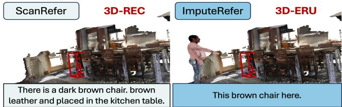
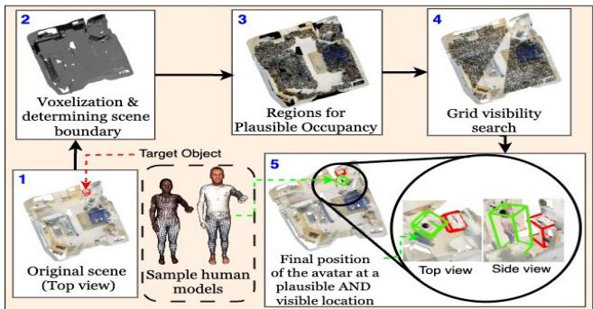
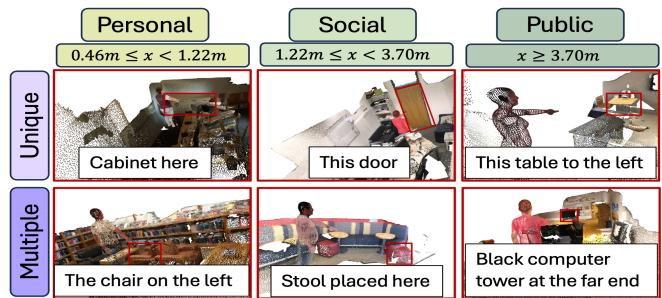
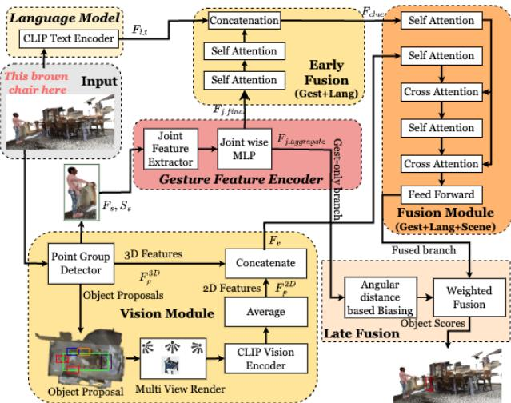
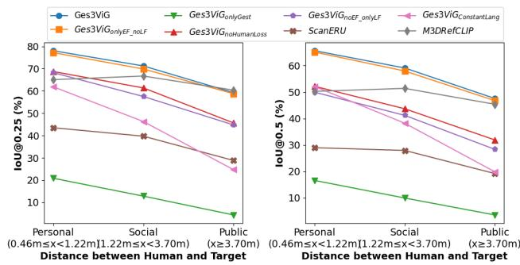

# Ges3ViG: Incorporating Pointing Gestures into Language-Based 3D Visual Grounding for Embodied Reference Understanding

Atharv Mahesh Mane⋆   
Stony Brook University, USA   
BITS Pilani Goa campus, India   
atharv.mane@stonybrook.edu

Sougata Sen BITS Pilani Goa campus, India APPCAIR, India sougatas@goa.bits-pilani.ac.in

Dulanga Weerakoon⋆ Singapore-MIT Alliance for Research and Technology Centre, Singapore dulanga.weerakoon@smart.mit.edu

Sanjay E. Sarma Massachusetts Institute of Technology, USA sesarma@mit.edu

Vigneshwaran Subbaraju Institute of High Performance Computing A\*STAR, Singapore vsubbaraju@ihpc.a-star.edu.sg

Archan Misra   
Singapore Management University,   
Singapore   
archanm@smu.edu.sg

## Abstract

3-Dimensional Embodied Reference Understanding (3D-ERU) combines a language description and an accompanying pointing gesture to identify the most relevant target object in a 3D scene. Although prior work has explored pure language-based 3D grounding, there has been limited exploration of 3D-ERU, which also incorporates human pointing gestures. To address this gap, we introduce a data augmentation framework– Imputer, and use it to curate a new benchmark dataset– ImputeRefer for 3D-ERU, by incorporating human pointing gestures into existing 3D scene datasets that only contain language instructions. We also propose Ges3ViG, a novel modelfor 3D-ERU that achieves ∼30% improvement in accuracy as compared to other 3D-ERU models and ∼9% compared to other purely languagebased 3D grounding models. Our code and dataset are available at https://github.com/AtharvMane/ Ges3ViG.

## 1. Introduction

Referring Expression Comprehension (REC) is a fundamental vision-language task that involves identifying a target object that is referred to by an instruction, as illustrated in Figure 1. Grounding such referring expressions in 3-dimensional space is a critical perceptual capability for robots and intelligent situated agents. Although several studies have explored grounding purely linguistic referring expressions in 3D scenes without accompanying pointing gestures [5, 37], pointing is an integral part of human communication and plays a vital role in situated and embodied interactions. However, the problem of 3D Embodied Reference Understanding (3D-ERU) – which includes natural human pointing gestures along with natural language references for 3D visual grounding remains relatively underexplored. This task involves (a) determination of the human’s position and the pointed direction in 3D space, and (b) identification of an object that best fits the verbal instruction and the pointed location.

  
Figure 1. 3D grounding of referring expressions with pointing.

To obtain a large workable dataset for 3D-ERU, prior work such as ScanERU [25], explored an augmentation approach by inserting a human avatar into the 3D scenes found in a pre-existing 3D-REC dataset called ScanRefer [5], such that the avatar is pointing to the target object that is being referred by the language instruction. However, the following issues remain to be tackled in both data curation and model development for 3D-ERU:

• Manual positioning of human avatar: To address the complexities of positioning the human avatar in available and appropriate vacant spaces within the 3D environment, ScanERU employed crowd-sourced human subjects to manually insert the avatar into the 3D scenes provided by ScanRefer.However, our inspection,1 revealed that the human avatars are placed very close to the target object, thus making the language instruction completely redundant. This is problematic as the models developed using such a dataset will be biased towards learning the pointing gesture alone, disregarding the language references. The scalability of the manual placement approach is also questionable, and an automated method may be preferable for collecting large-scale data.

• Unrealistic language descriptions: ScanERU retained the original language descriptions from ScanRefer even after incorporating pointing gestures. This is not realistic as prior work such as [34] has shown that the choice of words and verbosity of the language instructions will be different when a pointing gesture is used (see Figure 1).

• Limited computational model: The baseline model provided by ScanERU assumes that the ground truth of the human’s position in the scene is known and does not localize the human. However, localizing the human is an integral part of 3D-ERU, and hence, a holistic model for 3D-ERU must integrate human localization into its pipeline. We show that effective learning of human position improves the performance of 3D-ERU models.

To address these issues, we propose a novel automated data augmentation approach along with a revamped instruction dataset for 3D-ERU. We then develop a new model that incorporates human localization into 3D grounding. The following are the main contributions of this work:

• We introduce Imputer, an automated framework for augmenting existing 3D-REC datasets (e.g., ScanRefer) for 3D-ERU tasks by inserting human avatars into suitable spaces in the 3D scenes with precise control over their positioning, such that they point towards the target.

• We introduce the ImputeRefer dataset for the 3D-ERU task, which requires more complex reasoning to identify target objects than ScanERU due to a larger average distance between the human avatar and the target object. Also, the language instructions in ImputeRefer are regenerated by a VLM that is prompted by providing the context that there is a human pointing at the target.

• We develop Ges3ViG, a unified model for 3D-ERU that performs both human localization and reference understanding. It implements a new combined loss function to simultaneously learn human-localization and instruction grounding. It also uses a novel multi-stage fusion mechanism to effectively integrate the pointing gesture and the language text to achieve a significant ∼29.46% increase in grounding accuracy compared to ScanERU.

Overall, we believe that ImputeRefer and Ges3ViG help to significantly advance work on 3D-ERU.

## 2. Related Work

Referring Expression Comprehension (REC) on 2D images has been well studied, starting from ReferIt [23], and several other works that followed [26, 31, 36]. Recently, transformer-based architectures [12] and Vision-Language Models (VLMs) [32] have emerged as promising approaches for 2D-REC. The incorporation of pointing gestures into 2D-REC has also been studied by works such as M2Gestic [33], YouRefIt [8] and COSM2IC [34]. However, these 2D RGB image-based approaches are not directly applicable to 3D point cloud data, due to differences in data representation and the significant increase in the search space. For 3D-REC, pointcloud-based datasets such as ScanRefer [5] and ReferIt3D [1] were developed, with scenes obtained from the ScanNet dataset [11]. Among them, ScanRefer stands out as a large-scale 3D-REC dataset featuring human-annotated language descriptions, comprising 46,055 descriptions of 11,046 different target objects. Existing work on 3D-REC encompasses graph-based approaches [13, 20], neuro-symbolic approaches [19], techniques using multi-view images and 2D semantics [2, 21, 35], and unified models that address both dense captioning and 3D-REC [3, 6, 9]. M3DRefCLIP [37], currently, the state-of-the-art in 3D-REC, introduces a CLIP model-based approach for extracting visual features [30]. However, these works do not consider pointing gestures, which humans naturally use when referring to objects in a scene.

The problem of 3D-ERU, which considers the incorporation of pointing gestures for comprehending referring expressions in a 3D scene remains under-explored compared to 3D-REC. ScanERU [25] proposed inserting a human avatar into an existing 3D-REC dataset. To date, this stands as the sole dataset for 3D-ERU. However, ScanERU’s approach for dataset creation suffers from drawbacks such as (a) laborious manual placement of human avatar, (b) positioning the avatar too close to the target, (c) language expressions that are generated without consideration of the pointing gesture, and (d) implicitly assuming that the 3D ground truth location of the human avatar is externally available. These drawbacks hinder both the scalability of the dataset and the performance of the models.

In contrast to ScanERU, our work adopts an automated approach to insert the human avatar in the 3D scenes. Our proposed dataset consists of more challenging and realistic instructions as the human avatar is placed further away from the target (leading to larger pointing errors) and the language instructions are re-generated using a VLM that also considers the human pointing at the target object. Furthermore, our model includes human localization into the pipeline for 3D-ERU.

## 3. Imputer Framework

We next describe our augmentation framework – Imputer– to automatically generate a 3D-ERU dataset. Similar to ScanERU [25], we use the 3D scenes obtained from Scan-NetV2 [11] and insert a human avatar into it. Imputer consists of two parts: (a) Pointing gesture augmentation, where we propose a simple automated approach to determine the possible locations to ‘impute’ the pointing human avatar and (b) Language description generation, where we employ a Generative model– Gemini [15], to augment the existing verbal description to incorporate the pointing gesture. We next describe each of these components.

## 3.1. Pointing Gesture Augmentation with Imputer

Figure 2 illustrates the intermediate steps involved in the pointing gesture augmentation with Imputer framework. Before we delve into the computational process involved in inserting a human avatar, we note the following assumptions made by Imputer about the 3D scene: (a) all the 3D scenes are oriented such that the floor’s normal is aligned with the Z-axis, (b) the floor is level (there are no artifacts like stairs) for a major part of the scene, and (c) the human avatar mesh is pre-aligned with the ‘floor’ of the scene. If the mesh is not pre-oriented correctly, one can use software such as CloudCompare [16] to adjust it. This process only needs to be performed once per avatar, as the same mesh can be reused across all scenes.

Acquiring realistic human avatars: Augmenting the scene with a pointing gesture requires generating a human point cloud that can be augmented into the 3D scene such that the generated human point cloud performs a pointing gesture towards the target object. We begin this step by extracting the base human meshes for male and female subjects separately from the SMPL-X dataset [27]. Next, we utilize the Blender package [10] to adjust various model parameters, such as joint poses, height, weight, and gender, to introduce diversity across the generated human point clouds. To add color textures, we use samples from SMPLite-X [4], creating a total of 12 textured human models, evenly distributed between genders with six models each (Detailed figures provided in Supplementary).

The workflow of the Imputer framework is as follows. We first voxelize the scene and determine its boundaries. Then, we search for a set of vacant spaces for placing the human avatar so that there is a direct line of sight available for pointing at the target. The avatar is then placed in a suitable vacant space. Finally, a generative model is prompted to generate a language instruction for referring to the target object. These steps are explained in detail below.

Voxelization of the scene: We voxelize the scene to discretize the search space, which allows for efficient querying of point occupancy. Checking occupancy in a voxel grid is substantially faster compared to meshes or point clouds, and voxel grids allow interaction with ‘empty space’. These empty spaces are crucial, as they define the potential locations where the human avatar can be placed. We create voxel grid $V _ { 1 } ( \mathbb { N } ^ { 3 }  \{ 0 , 1 \} )$ ), which represents the original scene with the target object, and voxel grid $V _ { 2 } ( \mathbb { N } ^ { 3 } \ $ $\{ 0 , 1 \} )$ which represents the scene with the target object removed. Each voxel $V _ { i } ( x , y , z )$ in $V _ { 1 }$ and $V _ { 2 }$ is assigned a value of $\cdot _ { 1 } \cdot$ if it is occupied by an object or $\cdot _ { 0 } \cdot \mathrm { \ }$ if it is unoccupied. We also voxelized the human avatar mesh separately to get a 3D grid (similar dimension as $V _ { 1 }$ and $V _ { 2 } )$ given by $H ( \mathbb { N } ^ { 3 }  \{ 0 , 1 \} )$ ). A voxel $H ( x , y , z )$ is assigned a value of $\cdot _ { 1 } \cdot$ only if it is occupied by the human or to $\cdot _ { 0 } \cdot \mathrm { \ }$ otherwise. The height of the human in the voxel grid is denoted by $h _ { h v }$

  
Figure 2. Imputer pointing gesture generation

Determining scene boundaries: In this step, we calculate the scene bounds to ensure that the avatar is placed within the scene. This is done by identifying the the largest contour on the planar voxel grid created by projecting the voxel grid $V _ { 1 }$ onto the XY -plane. We then create a binary voxel grid $B ( \mathbb { N } ^ { 3 }  1 , 0 )$ , with the same dimensions as $V _ { 1 }$ . A voxel $B ( x , y , z )$ is assigned a value of $\cdot _ { 1 } \cdot$ if its x and $y$ coordinates lie within the contour boundary, or $\cdot _ { 0 } \cdot \mathrm { ~ }$ otherwise.

Finding regions for plausible occupancy: Next, we identify all regions within the scene that can accommodate a human mesh. To ensure that the feet of the human avatar is placed appropriately, i.e., just touching the floor of the scene, we must determine the appropriate co-ordinates of the human feet $( x _ { f o o t } , y _ { f o o t } , z _ { f o o t } )$ and a plausible representative z-coordinate for the floor level within the voxel grid. We define the ‘foot’ as the lowest point in the human avatar mesh after converting it into a voxel scale. Since there are multiple voxels corresponding to ‘floor’, we adopt the following approach to estimate the vertical displacement of the floor (denoted as $h _ { f l r } )$ with respect to the origin of the scene. The 3D scenes in the ScanRefer dataset originate from ScanNetV2 [11]. Using the segmentation ground truth from ScanNetV2, we can extract a list of vertices labeled as ‘floor’. We calculate $h _ { f l r }$ by taking the minimum of the following two values: (1) the average height of all floor vertices plus an offset $C _ { 1 } = 0 . 0 4 \mathrm { m }$ , and (2) the $8 5 ^ { \mathrm { t h } }$ percentile of the height distribution of ‘floor’ points. Here, $C _ { 1 }$ and $8 5 ^ { \mathrm { t h } }$ percentile are chosen empirically. Next, we convert this estimated height to a voxel scale denoted as $h _ { f v }$ . The final floor height estimated is given by $\hat { h } _ { f v } \ = \ m a x ( C _ { 2 } , h _ { f v } )$

where $C _ { 2 } = 4 . \ C _ { 2 }$ is chosen to account for potential artifacts, such as floor misalignment, that could cause it to extend into voxels at heights above zero. We allow for a small tolerance by permitting the human model to be positioned up to 4 voxels (∼10 cm in world coordinates) above the floor. In practice, this offset is generally less than 5 cm.

We then adopt a sliding volume approach to identify sufficiently large vacant spaces that can fit the human avatar. The size of the sliding volume is chosen to be equal to the size of the human avatar voxel grid. We then use the human voxel grid as a mask to check if there is sufficient space to fit the human avatar at a given point $( i , j )$ on the floor. We consider the human avatar volume H comprising of voxels whose co-ordinates range from $( i , j , \hat { h } _ { f v } )$ to $( i + x _ { m a x } , j + y _ { m a x } , \hat { h } _ { f v } + h _ { h v } )$ . We see that the entire volume falls into a clear space of the scene if it satisfies,

$$
\begin{array} { r l r } {  { \sum _ { x = 0 } ^ { y _ { m a x } } \sum _ { y = 0 } ^ { h _ { h v } } \sum _ { z = 0 } ^ { H ( x , y , z ) } } } \\ & { } & { = \sum _ { x = 0 } ^ { x _ { m a x } } \sum _ { y = 0 } ^ { y _ { m a x } } \sum _ { z = 0 } ^ { h _ { h v } } H ( x , y , z ) \times V _ { 1 } ( i + x , j + y , \hat { h } _ { f v } + z ) } \end{array}\tag{1}
$$

In practice, we observed that there could be some cases of improper human positioning even after the above condition is satisfied (especially after rotation of the avatar). To avoid such scenarios, we increase the border widths by 25 cm (10 voxels), which is approximately half the average shoulderto-shoulder width of a human. We store the co-ordinates $( i , j , \hat { h } _ { f v } + h _ { h v } )$ in the set $O _ { n o . c o l l i d e }$ if all the voxels in the volume placed at $( i , j )$ on the floor satisfy Equation 1 after accounting for the additional allowance.

Grid visibility search: In this step, we aim to identify all the voxels that are accessible via a direct line-of-sight (a spatially contiguous set of empty voxels) from the center of the object. These voxels would serve as plausible locations from where the human avatar could point at the object. We define the center of the 3D bounding box of the target object as the origin of the line of sight. We use the voxel grid $V _ { 2 } .$ where the target object is removed for visibility search. This is done so that the target object’s own boundary surface does not interfere with line-of-sight calculation.

Prior studies (e.g., [14]) have used a path-counting algorithm in 2D space to calculate visibility scores for grid cells. We extend this approach to 3D environments to compute the regions with line-of-sight. Given $V _ { 2 } .$ , we compute a visibility score grid, $S ( \mathbb { N } ^ { 3 }  \mathbb { R } )$ , where $S$ is defined as:

$$
\begin{array} { l } { S ( x , y , z ) = ( \displaystyle \frac { x \times S ( x - 1 , y , z ) } { x + y + z } + \displaystyle \frac { y \times S ( x , y - 1 , z ) } { x + y + z } } \\ { + \displaystyle \frac { z \times S ( x , y , z - 1 ) } { x + y + z } ) \times V _ { 2 } ( x , y , z ) ( 2 } \end{array}
$$

  
Figure 3. ImputeRefer with ‘unique’ and ‘multiple’ object scenes. The imputed human is placed at different distances from the target.

We then obtain $S ^ { \prime } ( \mathbb { N } ^ { 3 } \  \ \{ 1 , 0 \} )$ a thresholded version of $S ,$ where $S ^ { \prime } ( x , y , z )$ is assigned a value of $\cdot _ { 1 } \cdot$ if its visibility score is more than 0.33, or set to $\cdot _ { 0 } \cdot \mathrm { \ }$ otherwise. The value 0.33 was chosen using a rough rule of thumb – $\frac { 1 } { N o . o f d i m e n s i o n s } .$ In [14], a threshold of 0.5 was used to calculate visibility in 2D grids. We define the set of all the coordinates where $S ^ { \prime } = 1$ , as the region ofvisibility, a good approximation for all the visible regions.

Final positioning of the human avatar: A correctly imputed human avatar, with its feet at (x,y,z) and pointing at the referred object, must satisfy the following conditions: (a) the human avatar is placed within the bounds of the scene, i.e, $B ( x , y , z ) = 1$ , (b) the avatar does not occupy any already-occupied space in the scene, i.e, if $( x , y , z ) \in$ $O _ { n o . c o l l i d e }$ , and (c) there is a direct unblocked line between the human avatar’s gesture and the object of interest in the scene, i.e., if $S ^ { \prime } ( x , y , z ) \ = \ 1$ . After identifying all such feasible points, we randomly choose 5 of these points to create diverse, feasible positions of the human avatar. For each of these points, we then use the gesturing shoulder of the human avatar as a pivot of rotation to point towards the object of interest. In natural scenarios, a human may have some directional error while pointing towards a target object. To simulate this, we introduce a rotational jitter sampled uniformly within a range of $N _ { j i t t e r } = 9 ^ { \circ }$ to the correct pointing direction. We then calculate simple Euclidean transforms to move the human to the desired coordinate and then rotate the human in place. To choose from appropriately pointing meshes, we also store the angle $\angle A _ { p o i n t i n g }$ between the X-Y plane and the line joining the shoulder point to the desired pointing direction. This completes the process of augmenting the 3D scene with an appropriatelyposed human avatar as shown in Figure 2, where the avatar (green box) points towards the target object (red box).

## 3.2. Referring Expression (Re)Generation:

We use Gemini [15] to augment the referring expression. The input prompt to Gemini for generating the referring expression included a brief paragraph describing the scenario: a person pointing at the target object needs to generate an expression that uniquely identifies that object (details provided in supplementary materials). To ensure diversity in the generated expressions, for each data point in the Scan-Refer [5] dataset, we prompt Gemini to generate 3 different referring expressions and choose one of them randomly to generate our new dataset ImputeRefer for 3D-ERU, some samples of which are shown in Figure 3. Next, we describe the development of our Ges3ViG model using this dataset.

  
Figure 4. Proposed architecture of Ges3ViG

## 4. Ges3ViG: Gesture-enhanced 3D Visual Grounding

We now present Ges3ViG, a new gesture-enhanced, unified feed-forward, 3D visual grounding DNN model that integrates human localization, language understanding, and gestural reasoning to identify the 3D bounding box of the target object. To effectively combine gestural and linguistic cues, we utilize an innovative multi-stage fusion strategy that employs both early and late fusion within the same DNN. We now highlight the key components of the Ges3ViG model, visually illustrated in Figure 4.

## 4.1. Vision Module

We first encode the point cloud features using a PointGroup detector [22]. PointGroup, being a standard object detector for 3D point clouds $P \in \mathbf { \bar { \mathbb { R } } } ^ { N \times C }$ , returns both the visual features and all the objects in the scene. Here, N is the number of points in the point cloud and C is the number of channels per point, including the 3D coordinate, the per-point surface normal vector and the color of the point.

We use the following outputs from the PointGroup Detector for further processing: (1) Semantic Features $( F _ { s } ~ \in$ $\mathbb { R } ^ { N \times 3 2 } )$ , (2) Semantic Scores $( S _ { s } \in \mathbb { R } ^ { N \times N _ { c } } )$ , where $N _ { c }$ is the number of classes in the dataset, (3) Proposal Features $( F _ { p } ^ { 3 D } \in \mathbb { R } ^ { M \times 3 2 } )$ , where M is the number of proposals, and (4) Proposal Scores $( S _ { p } \in \mathbb { R } ^ { M } ) ;$ : These are essentially the instance/objectness scores for each proposal.

We use $F _ { s }$ and $S _ { s }$ for Gesture Inference (details in Section 4.3), while $S _ { p }$ is used to find proposals and $F _ { p } ^ { 3 D }$ is passed ahead to be used as 3D visual features. For each proposal $P ,$ , we render the object from 3 different views as images (similar to M3DRef-CLIP [37]). The images are passed into a CLIP [29] image encoder that generates 2D features $( F _ { p } ^ { 2 D } \ \in \ \bar { \mathbb { R } ^ { M \times 1 2 8 } } )$ for each proposal. $F _ { p } ^ { 3 D }$ and $F _ { p } ^ { 2 D }$ are concatenated into joint visual features and passed through a 1D convolution to obtain $F _ { v } \in \mathbb { R } ^ { M \times 1 2 8 }$

## 4.2. Language Feature Encoder

For language features, we use CLIP to get sentence-level and token-level feature embeddings. We define our sentence features as $F _ { l , s } \in \mathbb { R } ^ { 1 2 8 }$ and word features as $F _ { l , t } \in$ $\mathbb { R } ^ { N _ { t o k e n } \times 1 2 8 }$ , for an $N _ { t o k e n }$ token long sequence.

## 4.3. Gesture Feature Encoder

To enable gestural reasoning for human segments identified from region proposals generated by the PointGroup detector, this module uses the following components.

Joint Feature Extractor: This component computes the joint-coordinates of the pointing human and extracts jointbased features. The semantic features $( F _ { s } )$ computed in the vision module are used as input to this component. For a human segment $P _ { h u m } \subset P$ , obtained from the semantic segmentation predictions of the Vision Module and comprising $N _ { h u m }$ points, we extract a corresponding subset of semantic features, $F _ { s , h u m } \subset F _ { s }$ , consisting of $N _ { h u m }$ vectors. Given an anticipated number of human joints, $N _ { j } \in \mathbb N$ the semantic feature subset $F _ { s , h u m }$ is processed through a point-wise MLP inspired by PointNet [28], resulting in an output $W _ { h u m } \in \mathbb { R } ^ { \dot { N _ { h u m } } \times N _ { j } ^ { * } }$ . Inspired from Point2Skeleton [24], the joint coordinates $J \in \bar { \mathbb { R } } ^ { N _ { j } \times 3 }$ are then computed from $W _ { h u m }$ as $J = S o f t m a x ( W _ { h u m } ^ { T } ) \times P _ { h u m }$ and the initial joint-based features $F _ { j , i n i t } \in \bar { \mathbb { R } } ^ { \tilde { N _ { j } } , 3 2 }$ are obtained as

$$
F _ { j , i n i t } = S o f t m a x ( W _ { h u m } ^ { T } ) \times F _ { s , h u m }\tag{3}
$$

Joint-Wise MLP: We concatenate the location of each joint with its corresponding feature to form $F _ { j , i n i t }$ . This concatenated feature is processed by Joint-wise MLP, which consists of $N _ { l a y e r s }$ layers. In this configuration, the MLP processes each feature vector independently for each joint. Let $M _ { i }$ represent the i-th layer of the MLP, and let $P _ { j , i }$ denote its output for the $j ^ { \mathrm { t h } }$ joint. This module’s output is:

$$
\begin{array} { r } { F _ { j , f i n a l } = P _ { j , N _ { l a y e r s } } ; w h e r e P _ { j , i } = M _ { i } ( P _ { j , i - 1 } ) \quad } \\ { a n d P _ { j , 1 } = M _ { 1 } ( F _ { j , i n i t } ) \quad } \end{array}\tag{4}
$$

$$
F _ { j , a g g r e g a t e } = c o n c a t e n a t e _ { i = 0 } ^ { i = N _ { l a y e r s } } \sum _ { j = 0 } ^ { N _ { j } } P _ { j , i }\tag{5}
$$

Here $N _ { j }$ is the number of joints specified in SMPL.

We then adopt a multi-stage fusion approach that combines early and late fusion techniques to effectively fuse the extracted gesture features with language features. We first perform an early fusion of the ‘reference’ modalities by concatenating gesture and language instruction features. The concatenated features are fed into the ‘reference-scene fusion module, which fuses them with the 3D scene/object features obtained from the vision module to produce prediction scores for the potential target objects. Finally, a late weighted fusion biases the scores towards objects that are within a certain angular radius of the pointing hand.

## 4.4. Early Fusion of Referential Modalities

In the proposed early fusion module, we utilize $F _ { j , f i n a l } \in$ $\mathbb { R } ^ { N _ { j } \times 1 2 8 }$ , which is passed through two self-attention layers, after which they are concatenated with $F _ { l , t }$ to form $F _ { c l u e } ~ \in ~ \mathbb { R } ^ { ( N _ { t o k e n } + \hat { N } _ { j } ) \times 1 2 8 }$ . Since both gesture and language modalities provide information about the same target object, we treat them similarly and perform a simple concatenation-based fusion for the two modalities.

## 4.5. Fusion of Referential and Scene Features

We employ the same transformer-based approach for the ‘reference-scene’ fusion module as used in M3DRef-CLIP [37] to integrate object features with the referential embeddings $F _ { c l u e } ,$ generating confidence scores $( S _ { c o n f } \in$ $\mathbb { R } ^ { M } )$ for each proposal. This module consists of two selfattention and two cross-attention blocks, where the object features sequentially pass through the self-attention and cross-attention blocks. In the cross-attention blocks, $F _ { c l u e }$ is used as the key-value pairs.

## 4.6. Late Fusion of Gesture

The reference-scene fusion module’s output provides confidence scores for each object proposal, allowing to identify the target object based on the highest score. To further refine this, we introduce an additional late fusion approach that explicitly biases confidence scores to favor objects that align with the pointed direction. This corrects some errors from the previous stages that could occur due to the presence of multiple distractor objects, especially in cases where the language instruction was given more importance. Specifically, we compute a pointing biasing score, $S _ { b } \in \mathbb { R } ^ { \bar { M } }$ , and add it to $S _ { c o n f }$ to guide predictions toward points that are angularly closer to the pointing direction. To achieve this, we first extract the shoulder and fingertip points represented by $\vec { v _ { 1 } } ~ \in ~ \mathbb { R } ^ { 3 }$ and $\vec { v _ { 2 } } ~ \in ~ \mathbb { R } ^ { 3 }$ , respectively. The center coordinates of a predicted bounding box are represented by $\vec { v _ { 3 } } \in \mathbb { R } ^ { 3 }$ . The pointer bias score $S _ { b }$ is defined as follows:

$$
S _ { b } = \frac { ( \vec { v _ { 2 } } - \vec { v _ { 1 } } ) \cdot ( \vec { v _ { 3 } } - \vec { v _ { 1 } } ) } { | | ( ( \vec { v _ { 2 } } - \vec { v _ { 1 } } ) ) | | \cdot | | ( ( \vec { v _ { 3 } } - \vec { v _ { 1 } } ) ) | | }\tag{6}
$$

We calculate $S _ { b , l e f t } \in \mathbb { R } ^ { M }$ and $S _ { b , r i g h t } \in \mathbb { R } ^ { M }$ using the equation 6 for both left and right hand respectively.

Intuitively, humans may use either the left or right hand for pointing. To classify the pointing hand used, we employ a classification head that takes $F _ { j , a g g r e g a t e }$ as input to learn $W _ { l r _ { a } g g } \in \mathbb { R } ^ { 2 }$ as follows.

$$
W _ { l r . a g g } = S o f t m a x ( M L P 1 ( F _ { j , a g g r e g a t e } ) )\tag{7}
$$

With the calculated $W _ { l r \_ a g g }$ , we compute the final biasing score $S _ { b , f i n a l }$ as follows.

$$
S _ { b , f i n a l } = W _ { l r . a g g } ^ { 0 } \times S _ { b , l e f t } + W _ { l r . a g g } ^ { 1 } \times S _ { b , r i g h t }\tag{8}
$$

With $S _ { b , f i n a l }$ from the pointing biasing score and $S _ { c o n f }$ from the fusion module, we have two sets of object scores. To obtain the final object scores, we use an additional probabilistic head, denoted as $W _ { s c o r e _ { a } g g } \ \in \ \mathbb { R } ^ { 2 }$ , which adaptively aggregates scores from the two branches as follows: $W _ { s c o r e . a g g } = S o f t M a x ( M L P 2 ( F _ { j , a g g r e g a t e } ) )$ . The final object scores are obtained using the following equation, and the target object is identified by the object proposal with the highest $S _ { c o n f , f i n a l } .$

$$
S _ { c o n f , f i n a l } = W _ { s c o r e - a g g } ^ { 0 } \times S _ { c o n f } + W _ { s c o r e - a g g } ^ { 1 } \times S _ { b , f i n a l }\tag{9}
$$

## 4.7. Loss Function:

Our proposed loss function comprises of the following: Object Detection Losses:

1. Cross-entropy loss for supervising per-point semantic class prediction called the Semantic Loss, $L _ { s e m a n t i c }$

2. L1 loss for supervising per-point offset vector towards object centers (useful for instance segmentation), called the Offset Norm Loss, $\boldsymbol { L _ { o f f s e t . n o r m } }$

3. A directional loss formed as a mean of minus cosine similarities to constrain the direction of per-point offset vectors called the Offset Direction Loss, $L _ { o f f s e t \_ d i r }$

4. A binary cross-entropy loss for supervising per-point objectness confidence score called the Score Loss, $L _ { s c o r e } .$ Reference Understanding Losses:

5. Reference Loss, $L _ { r e f }$ , is a multi-class cross-entropy loss to classify object referenced by the referring expressions.

6. A symmetric contrastive loss, $L _ { c o n t r a s t i v e }$ between sentence features and the visual features to aid training.

## Human Localization Losses:

7. L2 loss between the predicted and ground truth human joint locations.

8. A classification loss $L _ { l r }$ over $W _ { l r _ { - } a g g }$ to classify the gesture as left-handed or right-handed.

## 4.8. Training Details:

We utilize an iterative training approach where we first train the PointGroup detector and gesture feature encoder for 20 epochs with a learning rate of 0.00005 with cosine annealing, using the Adam optimizer. At this step, loss term

Lsemantic, $\ b { L _ { o f f s e t . n o r m } }$ $L _ { o f f s e t \_ d i r }$ $L _ { s c o r e } .$ $L _ { h u m }$ and $L _ { l r }$ are enabled for optimization. Subsequently, we freeze the PointGroup detector and the gesture feature encoder and only enable the fusion module with the loss terms $L _ { r e f }$ and $L _ { c o n t r a s t i v e }$ enabled for 20 epochs. This step trains the comprehension module to comprehend verbal instruction.

## 5. Results

We use our new ImputeRefer dataset, to evaluate the performance of various models for the 3D-ERU task. ImputeRefer includes 707 point-cloud scenes sourced from the original ScanNetv2 dataset, augmented with human pointing gestures and modified referring expressions as described in Sections 3.1 and 3.2. Overall, our dataset encompasses 35, 581 samples, with 9, 391 designated as the test dataset. Similar to previous 3D grounding research, we adopt IoU@0.25 and IoU@0.5 as the evaluation metrics. IoU@0.25 and IoU@0.5 deem a prediction as correct if the Intersection over Union between the ground truth and predicted 3D bounding boxes ≥ 0.25 and $\geq 0 . 5 .$ , respectively.

## 5.1. Performance of Ges3ViG for 3D-ERU

Table 1 presents a comparison of the accuracy of Ges3ViG against current state-of-the-art models for 3D visual grounding, both with and without gesture support. Notably, ScanERU is the only existing model that incorporates gesture-enhanced 3D visual grounding. From the results, it is evident that Ges3ViG surpasses ScanERU significantly, achieving a 29.87% higher overall IoU@0.5 accuracy. In the presence of ‘multiple’ distractors, Ges3ViG demonstrates even more pronounced improvements of 32.71% in IoU@0.5 over ScanERU.

Ges3ViG achieves significant performance improvements over existing standard 3D visual grounding models that do not support pointing gestures. It surpasses M3DRefCLIP, the current state-of-the-art in 3D visual grounding, by 10.88%, 8.50%, and 8.93% for ‘unique’, ‘multiple’, and ‘overall’ categories respectively. These cumulative performance gains across both standard 3D visual grounding and gesture-enhanced models highlight the effectiveness of Ges3ViG in integrating both gestural and linguistic reasoning within a unified architecture.

## 5.2. Evaluating Imputer Augmentation for 3D-ERU

We evaluate the impact of Imputer augmentation on Gesture-enhanced 3D visual grounding in Table 2. While all results here use the Ges3ViG model, the first row (Scan-Refer) simply integrates the human pointing gestures into the scene while retaining the original pointing-unaware ScanRefer verbal instructions. We find that a ScanRefer instruction contains a substantially higher average word count per language description (19.18 words) compared to ImputeRefer (10.52 words), indicating that ScanRefer likely has many redundant words. However, using the ScanRefer text instructions only results in a slightly better overall IoU@0.5 (59.69%) than using the referring expressions in ImputeRefer (58.71%), despite the detailed verbal description. In practice, however, humans generally use short verbal descriptions when using a pointing gesture, justifying our curation of pointing-augmented ImputeRefer dataset. Furthermore, compared to the average human-to-target distance of ∼1.24 meters in the shared subset of ScanERU instructions that we obtained, ImputeRefer has an average distance of ∼2.31 meters. This approx. 2× increase in distance increases the complexity of gestural reasoning needed.

Table 1. Performance of Ges3ViG Vs baselines on ImputeRefer
<table><tr><td rowspan="2">Model</td><td colspan="2">unique</td><td colspan="2">multiple</td><td colspan="2">overall</td></tr><tr><td>IoU @0.25</td><td>IoU @0.5</td><td>IoU @0.25</td><td>IoU @0.5</td><td>IoU @0.25</td><td>IoU @0.5</td></tr><tr><td>without Gestures:</td><td></td><td></td><td></td><td></td><td></td><td></td></tr><tr><td>3DVG-Transformer [38]</td><td>71.56</td><td>50.66</td><td>31.35</td><td>21.54</td><td>39.17</td><td>27.20</td></tr><tr><td>HAM [7]</td><td>67.10</td><td>48.13</td><td>25.42</td><td>16.04</td><td>33.51</td><td>22.27</td></tr><tr><td>3DJCG [3]</td><td>75.93</td><td>59.19</td><td>40.34</td><td>30..61</td><td>47.24</td><td>36.16</td></tr><tr><td>RefMask-3D [18]</td><td>72.45</td><td>64.95</td><td>25.44</td><td>22.24</td><td>34.57</td><td>30.54</td></tr><tr><td>M3DRefCLIP [37]</td><td>77.32</td><td>60.15</td><td>62.62</td><td>47.27</td><td>65.53</td><td>49.78</td></tr><tr><td>with Gestures:</td><td></td><td></td><td></td><td></td><td></td><td></td></tr><tr><td>ScanERU [25]</td><td>71.6</td><td>52.79</td><td>31.91</td><td>23.06</td><td>39.54</td><td>28.84</td></tr><tr><td>Ges3ViG</td><td>84.60</td><td>71.03</td><td>67.57</td><td>55.77</td><td>70.85</td><td>58.71</td></tr></table>

Table 2. Effect of re-generated instructions in ImputeRefer
<table><tr><td rowspan=2 colspan=1>Text Inst. Source</td><td rowspan=2 colspan=1>AverageNo. of words</td><td rowspan=1 colspan=3>IoU@0.5 on Ges3ViG</td></tr><tr><td rowspan=1 colspan=1>unique</td><td rowspan=1 colspan=1>multiple</td><td rowspan=1 colspan=1>overall</td></tr><tr><td rowspan=1 colspan=1>From ScanRefer</td><td rowspan=1 colspan=1>19.18</td><td rowspan=1 colspan=1>71.77</td><td rowspan=1 colspan=1>56.75</td><td rowspan=1 colspan=1>59.69</td></tr><tr><td rowspan=1 colspan=1>Generated</td><td rowspan=1 colspan=1>10.52</td><td rowspan=1 colspan=1>71.03</td><td rowspan=1 colspan=1>55.77</td><td rowspan=1 colspan=1>58.71</td></tr></table>

Table 3. Ablation studies for Ges3ViG in ImputeRefer dataset
<table><tr><td rowspan="2">Model</td><td colspan="2">unique</td><td colspan="2">multiple</td><td colspan="2">overall</td></tr><tr><td>IoU @0.25</td><td>IoU @0.5</td><td>IoU @0.25</td><td>IoU @0.5</td><td>IoU @0.25</td><td>IoU @0.5</td></tr><tr><td>Ges3ViG i w/o Gestures</td><td>69.26</td><td>48.84</td><td>52.58</td><td>37.32</td><td>55.79</td><td>39.54</td></tr><tr><td>Ges3ViG noHumanLoss</td><td>68.76</td><td>48.57</td><td>58.75</td><td>42.31</td><td>60.68</td><td>43.51</td></tr><tr><td>Ges3ViG noEF_onlyLF</td><td>69.43</td><td>49.28</td><td>54.81</td><td>39.02</td><td>57.62</td><td>41.00</td></tr><tr><td>Ges3ViG onlyEF_noLF</td><td>83.71</td><td>70.09</td><td>66.47</td><td>54.92</td><td>69.93</td><td>58.05</td></tr><tr><td>Ges3ViG random_LF</td><td>84.0</td><td>70.6</td><td>66.1</td><td>54.6</td><td>69.6</td><td>57.7</td></tr><tr><td>Ges3ViG onlyGest</td><td>15.29</td><td>11.81</td><td>12.46</td><td>9.80</td><td>13.0</td><td>10.18</td></tr><tr><td>Ges3ViG ConstantLang</td><td>51.05</td><td>43.87</td><td>44.89</td><td>36.78</td><td>46.08</td><td>38.15</td></tr><tr><td>Ges3ViG</td><td>84.60</td><td>71.03</td><td>67.57</td><td>55.77</td><td>70.85</td><td>58.71</td></tr></table>

## 5.3. Ablation Studies

Table 3 summarizes the results of an ablation study to evaluate the effectiveness of early fusion, late fusion and human localization loss. We consider the following variants:

• Ges3ViG w/o Gestures Ges3ViG without any gestural reasoning and only relying on language-based reasoning.

• Ges3ViG onlyEF noLF integrates the gesture information only once at the early fusion and disables the late fusion of gesture information by assigning a weight of 0 to the gesture branch in late fusion.

• Ges3ViG noEF onlyLF integrates the gesture information only at the late weighted fusion stage and skips the early fusion block. To simulate this variant, we re-train this variant from scratch by directly feeding the language features to the fusion module (by-passing early fusion).

• Ges3ViG random LF uses the full Ges3ViG pipeline but with random weights in the late fusion.

• Ges3ViG onlyGest relies solely on the gesture and ignores all language information by assigning a full bias weight of 1 to the gesture branch in weighted late fusion.

• Ges3ViG noHumanLoss does not include the human localization loss component in the loss calculation. This network is also obtained by re-training from scratch.

• Ges3ViG ConstantLang All language references set to “This object”, forcing the model to heavily rely on pointing.

From Table 3, we observe that early fusion is more effective than late fusion for fusing the referential modalities as Ges3ViG onlyEF noLF provides significantly high performance than $\mathrm { G e s 3 V i G } _ { \mathrm { \ n o E F \mathrm { - } o n l y L F } } .$ But the performance of $\mathrm { G e s 3 V i G _ { \ o n l y E F \mathrm { { \_ n o L F } } } }$ is still slightly lower than Ges3ViG. The performance of Ges3ViG $\mathrm { r a n d o m . L F }$ is even lower than Ges3ViG noEF onlyLF, showing that the weighted late fusion is meaningful as it provides a small boost in accuracy as compared to early fusion. We further note that ignoring the human localization loss causes a significant difference of about 15% in IoU@0.5 for Ges3ViG noHumanLoss when compared to Ges3ViG. This underscores the importance of learning to localize the human accurately. Ges3ViG stands out as the first unified model that performs human localisation and reference understanding. Ges3ViG onlyGest variant that relies solely on gestural scores achieves significantly lower IoU@0.5 of 10.18% compared to Ges3ViG (58.71%). Similarly, Ges3ViG $\mathrm { C o n s t a n t L a n g }$ which relies heavily on pointing with the same language reference used across the dataset achieves significantly lower IoU@0.5 of 38.15%. These findings are supported by prior studies [33, 34] that showed that language references are important for reference understanding when the target object is further away from the human, and in contrast to ScanERU, where the pointing was done from a much closer distance. This result also shows that Gemini’s language instructions in ImputeRefer are meaningful and useful.

Figure 5 summarizes the effect of distance between the human and the target object on the accuracy of Ges3ViG model variants and baselines. For this analysis, we divided the test set of ImputeRefer into the following four distance ranges, using Hall’s interpersonal distance classification [17]— Intimate (x < 0.46m), Personal (0.46m ≤ $x \ < \ 1 . 2 2 m )$ , Social $( 1 . 2 2 m \leq x < 3 . 7 0 m )$ , and $P u b \mathrm { - }$ lic $( x \ge 3 . 7 0 m )$ . The test set of ImputeRefer contained 0 samples for the Intimate distance range, 1391 for Personal, 6909 for Social, and 1097 for Public distance ranges. Using this division, we plotted the variation in IoU@0.25 and IoU@0.5 across the distances in Figure 5. Across all models with gestural reasoning, we consistently observed a decline in accuracy metrics as distance increased, indicating that 3D-ERU becomes progressively more challenging as the human-to-object distance grows. We also find that the drop in IoU@0.5 is more pronounced for larger distances. In contrast, M3DRefCLIP, a model without gestural reasoning, does not exhibit a decreasing pattern of accuracy as distance increases. To ensure that gesture information is completely excluded from this study on M3DRefCLIP, we removed the human avatar from the scene. On the other hand, Ges3ViG ConstantLang, a model completely relying on pointing gestures, exhibits a clear decreasing pattern of accuracy with increasing human-to-object distance.

  
Figure 5. Accuracy at different distance ranges for 3D-ERU

## 6. Conclusion

We have demonstrated the design and performance of an enhanced model for 3D-ERU tasks, where humans refer to target objects via both gesture and verbal cues. We first introduced the Imputer framework to automatically augment existing 3D-REC datasets with pointing gesture cues and used it to create a challenging benchmark dataset for 3D-ERU, named ImputeRefer. We then introduced the novel Ges3ViG model that jointly (a) localizes the human in the 3D scene, (b) comprehends the pointing gesture, and (c) fuses language and gestural cues to accurately identify the 3D location of the target object. Ges3ViG and ImputeRefer establish a new benchmark for the 3D-ERU task, by achieving 29.5% higher accuracy compared to prior work.

## 7. Acknowledgments

This work was supported in part by: 1) National Research Foundation, Prime Minister’s Office, Singapore under its Campus for Research Excellence and Technological Enterprise (CREATE) program. The Mens, Manus, and Machina (M3S) is an interdisciplinary research group (IRG) of the Singapore-MIT Alliance for Research and Technology (SMART) centre; 2) BITS Pilani’s Grant No. GOA/ACG/2021-2022/Nov/05; 3) Science & Engineering Research Board’s SERB-SURE project number SUR/2022/002735; 4) Agency for Science, Technology and Research, Singapore under Grant #A18A2b0046. Any opinions, findings and conclusions or recommendations expressed in this material are those of the author(s) and do not reflect the views of the funding organizations.

## References

[1] Panos Achlioptas, Ahmed Abdelreheem, Fei Xia, Mohamed Elhoseiny, and Leonidas Guibas. Referit3d: Neural listeners for fine-grained 3d object identification in real-world scenes. In 16th European Conference Computer Vision– ECCV, pages 422–440. Springer, 2020. 2

[2] Eslam Bakr, Yasmeen Alsaedy, and Mohamed Elhoseiny. Look around and refer: 2d synthetic semantics knowledge distillation for 3d visual grounding. Advances in neural information processing systems, 35:37146–37158, 2022. 2

[3] Daigang Cai, Lichen Zhao, Jing Zhang, Lu Sheng, and Dong Xu. 3djcg: A unified framework for joint dense captioning and visual grounding on 3d point clouds. In Proceedings of the IEEE/CVF Conference on Computer Vision and Pattern Recognition, pages 16464–16473, 2022. 2, 7

[4] Dan Casas and Marc Comino-Trinidad. SMPLitex: A Generative Model and Dataset for 3D Human Texture Estimation from Single Image. In British Machine Vision Conference (BMVC), 2023. 3

[5] Dave Zhenyu Chen, Angel X Chang, and Matthias Nießner. Scanrefer: 3d object localization in rgb-d scans using natural language. In European conference on computer vision, pages 202–221. Springer, 2020. 1, 2, 5

[6] Dave Zhenyu Chen, Qirui Wu, Matthias Nießner, and Angel X Chang. D 3 net: A unified speaker-listener architecture for 3d dense captioning and visual grounding. In European Conference on Computer Vision, pages 487–505. Springer, 2022. 2

[7] Jiaming Chen, Weixin Luo, Ran Song, Xiaolin Wei, Lin Ma, and Wei Zhang. Learning point-language hierarchical alignment for 3d visual grounding. arXiv preprint arXiv:2210.12513, 2022. 7

[8] Yixin Chen, Qing Li, Deqian Kong, Yik Lun Kei, Song-Chun Zhu, Tao Gao, Yixin Zhu, and Siyuan Huang. Yourefit: Embodied reference understanding with language and gesture. In Proceedings of the IEEE/CVF International Conference on Computer Vision, pages 1385–1395, 2021. 2

[9] Zhenyu Chen, Ronghang Hu, Xinlei Chen, Matthias Nießner, and Angel X Chang. Unit3d: A unified transformer for 3d dense captioning and visual grounding. In Proceedings of the IEEE/CVF International Conference on Computer Vision, pages 18109–18119, 2023. 2

[10] Blender Online Community. Blender - a 3D modelling and rendering package. Blender Foundation, Stichting Blender Foundation, Amsterdam, 2018. 3

[11] Angela Dai, Angel X Chang, Manolis Savva, Maciej Halber, Thomas Funkhouser, and Matthias Nießner. Scannet: Richly-annotated 3d reconstructions of indoor scenes. In Proceedings ofthe IEEE conference on computer vision and pattern recognition, pages 5828–5839, 2017. 2, 3

[12] Jiajun Deng, Zhengyuan Yang, Tianlang Chen, Wengang Zhou, and Houqiang Li. Transvg: End-to-end visual grounding with transformers. In Proceedings of the IEEE/CVF International Conference on Computer Vision, pages 1769– 1779, 2021. 2

[13] Mingtao Feng, Zhen Li, Qi Li, Liang Zhang, XiangDong Zhang, Guangming Zhu, Hui Zhang, Yaonan Wang, and Aj-

mal Mian. Free-form description guided 3d visual graph network for object grounding in point cloud. In Proceedings of the IEEE/CVF International Conference on Computer Vision, pages 3722–3731, 2021. 2

[14] Rhys Goldstein, Kean Walmsley, Jacobo Bibliowicz, Alexander Tessier, Simon Breslav, and Azam Khan. Path counting for grid-based navigation. Journal ofArtificial In telligence Research, 74:917–955, 2022. 4

[15] Google. Gemini ai. https://gemini.google.com/, 2024. Last Accessed on 2024-11-11. 3, 4

[16] GPL software. Cloudcompare, 2024. Last Accessed on 2024-04-12. 3

[17] Edward T Hall. A system for the notation of proxemic behavior. American anthropologist, 65(5):1003–1026, 1963. 8

[18] Shuting He and Henghui Ding. Refmask3d: Languageguided transformer for 3d referring segmentation. In Proceedings ofthe 32nd ACM International Conference on Multimedia, pages 8316–8325, 2024. 7

[19] Joy Hsu, Jiayuan Mao, and Jiajun Wu. Ns3d: Neurosymbolic grounding of 3d objects and relations. In Proceedings of the IEEE/CVF Conference on Computer Vision and Pattern Recognition, pages 2614–2623, 2023. 2

[20] Pin-Hao Huang, Han-Hung Lee, Hwann-Tzong Chen, and Tyng-Luh Liu. Text-guided graph neural networks for referring 3d instance segmentation. In Proceedings of the AAAI Conference on Artificial Intelligence, pages 1610– 1618, 2021. 2

[21] Shijia Huang, Yilun Chen, Jiaya Jia, and Liwei Wang. Multiview transformer for 3d visual grounding. In Proceedings of the IEEE/CVF Conference on Computer Vision and Pattern Recognition, pages 15524–15533, 2022. 2

[22] Li Jiang, Hengshuang Zhao, Shaoshuai Shi, Shu Liu, Chi-Wing Fu, and Jiaya Jia. Pointgroup: Dual-set point grouping for 3d instance segmentation. In Proceedings of the IEEE/CVF conference on computer vision and Pattern recognition, pages 4867–4876, 2020. 5

[23] Sahar Kazemzadeh, Vicente Ordonez, Mark Matten, and Tamara Berg. Referitgame: Referring to objects in photographs of natural scenes. In Proceedings of the 2014 conference on empirical methods in natural language processing (EMNLP), pages 787–798, 2014. 2

[24] Cheng Lin, Changjian Li, Yuan Liu, Nenglun Chen, Yi-King Choi, and Wenping Wang. Point2skeleton: Learning skeletal representations from point clouds. In Proceedings of the IEEE/CVF Conference on Computer Vision and Pattern Recognition (CVPR), pages 4277–4286, 2021. 5

[25] Ziyang Lu, Yunqiang Pei, Guoqing Wang, Peiwei Li, Yang Yang, Yinjie Lei, and Heng Tao Shen. Scaneru: Interactive 3d visual grounding based on embodied reference under standing. In Thirty-Eighth AAAI Conference on Artificial In telligence, AAAI 2024, pages 3936–3944. AAAI Press, 2024. 1, 2, 7

[26] Junhua Mao, Jonathan Huang, Alexander Toshev, Oana Camburu, Alan L Yuille, and Kevin Murphy. Generation and comprehension of unambiguous object descriptions. In Proceedings of the IEEE conference on computer vision and pattern recognition, pages 11–20, 2016. 2

[27] Georgios Pavlakos, Vasileios Choutas, Nima Ghorbani, Timo Bolkart, Ahmed A. A. Osman, Dimitrios Tzionas, and Michael J. Black. Expressive body capture: 3D hands, face, and body from a single image. In Proceedings IEEE Conf. on Computer Vision and Pattern Recognition (CVPR), pages 10975–10985, 2019. 3

[28] Charles R Qi, Hao Su, Kaichun Mo, and Leonidas J Guibas. Pointnet: Deep learning on point sets for 3d classification and segmentation. In Proceedings of the IEEE conference on computer vision and pattern recognition, pages 652–660, 2017. 5

[29] Alec Radford, Jong Wook Kim, Chris Hallacy, Aditya Ramesh, Gabriel Goh, Sandhini Agarwal, Girish Sastry, Amanda Askell, Pamela Mishkin, Jack Clark, et al. Learning transferable visual models from natural language supervision. In International conference on machine learning, pages 8748–8763. PMLR, 2021. 5

[30] Alec Radford, Jong Wook Kim, Chris Hallacy, Aditya Ramesh, Gabriel Goh, Sandhini Agarwal, Girish Sastry, Amanda Askell, Pamela Mishkin, Jack Clark, et al. Learning transferable visual models from natural language supervision. In International conference on machine learning, pages 8748–8763. PMLR, 2021. 2

[31] Anna Rohrbach, Marcus Rohrbach, Ronghang Hu, Trevor Darrell, and Bernt Schiele. Grounding of textual phrases in images by reconstruction. In Computer Vision–ECCV 2016: 14th European Conference, Amsterdam, The Netherlands, October 11–14, 2016, Proceedings, Part I 14, pages 817– 834. Springer, 2016. 2

[32] Weihan Wang, Qingsong Lv, Wenmeng Yu, Wenyi Hong, Ji Qi, Yan Wang, Junhui Ji, Zhuoyi Yang, Lei Zhao, Xixuan Song, Jiazheng Xu, Bin Xu, Juanzi Li, Yuxiao Dong, Ming Ding, and Jie Tang. Cogvlm: Visual expert for pretrained language models, 2024. 2

[33] Dulanga Weerakoon, Vigneshwaran Subbaraju, Nipuni Karumpulli, Tuan Tran, Qianli Xu, U-Xuan Tan, Joo Hwee Lim, and Archan Misra. Gesture enhanced comprehension of ambiguous human-to-robot instructions. In Proceedings of the 2020 International Conference on Multimodal Interaction, pages 251–259, 2020. 2, 8

[34] Dulanga Weerakoon, Vigneshwaran Subbaraju, Tuan Tran, and Archan Misra. Cosm2ic: Optimizing real-time multimodal instruction comprehension. IEEE Robotics and Automation Letters, 7(4):10697–10704, 2022. 2, 8

[35] Zhengyuan Yang, Songyang Zhang, Liwei Wang, and Jiebo Luo. Sat: 2d semantics assisted training for 3d visual grounding. In Proceedings of the IEEE/CVF International Conference on Computer Vision, pages 1856–1866, 2021. 2

[36] Licheng Yu, Zhe Lin, Xiaohui Shen, Jimei Yang, Xin Lu, Mohit Bansal, and Tamara L Berg. Mattnet: Modular attention network for referring expression comprehension. In Proceedings of the IEEE Conference on Computer Vision and Pattern Recognition, pages 1307–1315, 2018. 2

[37] Yiming Zhang, ZeMing Gong, and Angel X Chang. Multi3drefer: Grounding text description to multiple 3d objects. In Proceedings ofthe IEEE/CVF International Conference on Computer Vision (ICCV), pages 15225–15236, 2023. 1, 2, 5, 6, 7

[38] Lichen Zhao, Daigang Cai, Lu Sheng, and Dong Xu. 3DVG-Transformer: Relation modeling for visual grounding on point clouds. In ICCV, pages 2928–2937, 2021. 7