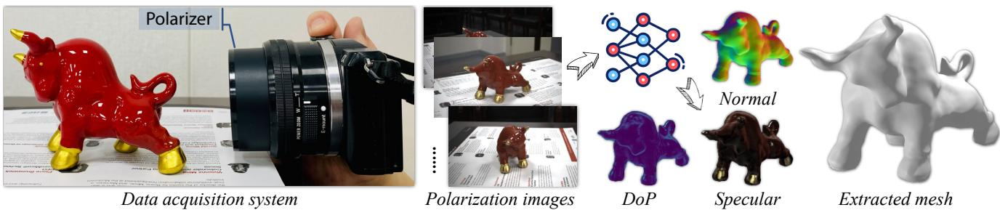
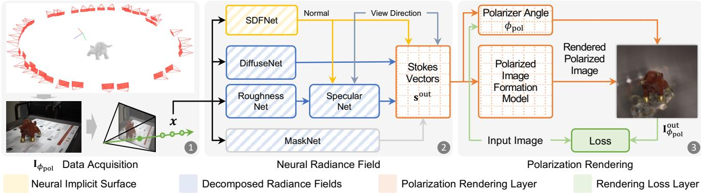
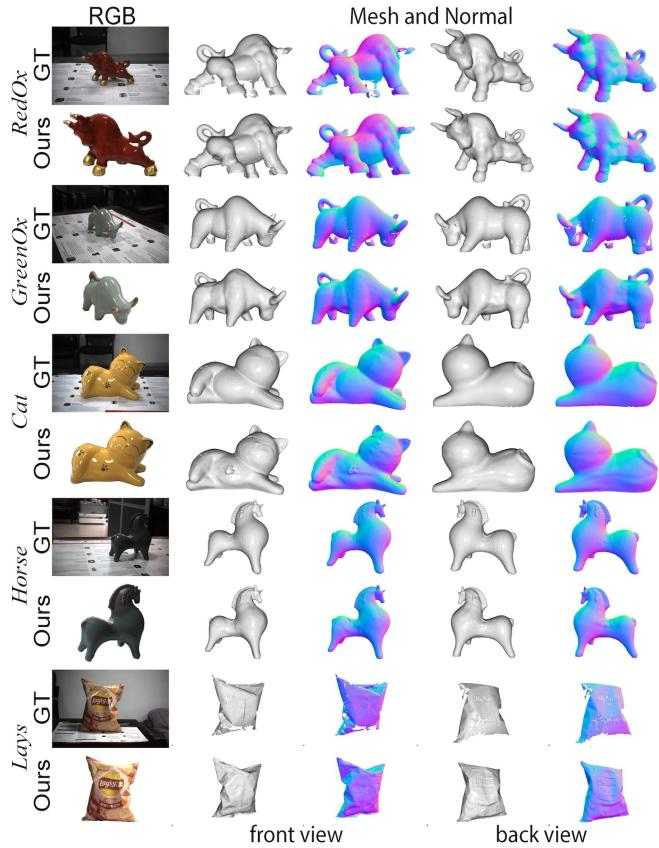
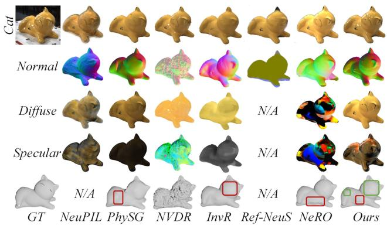
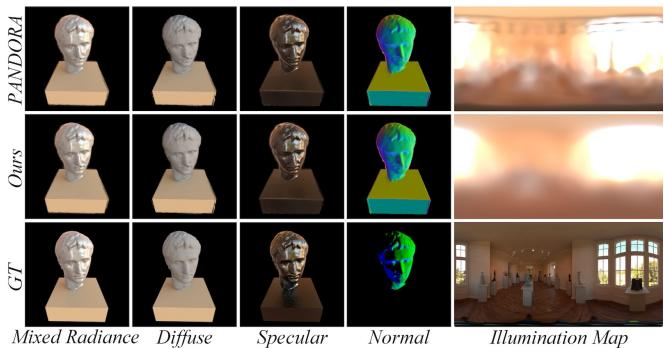
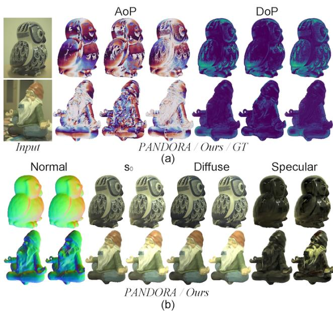
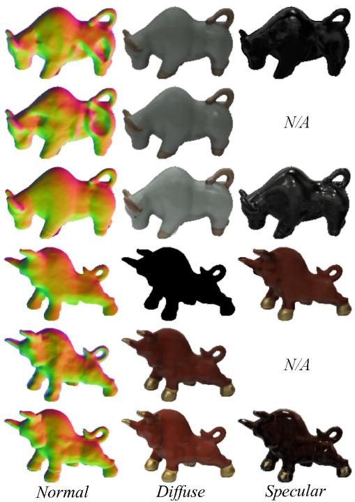
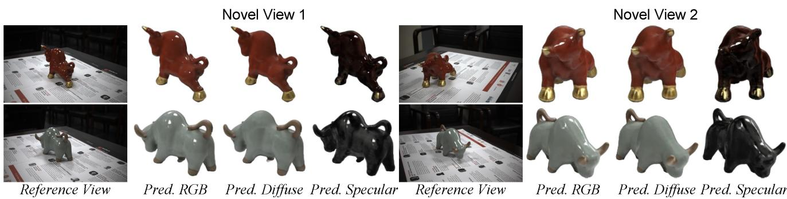
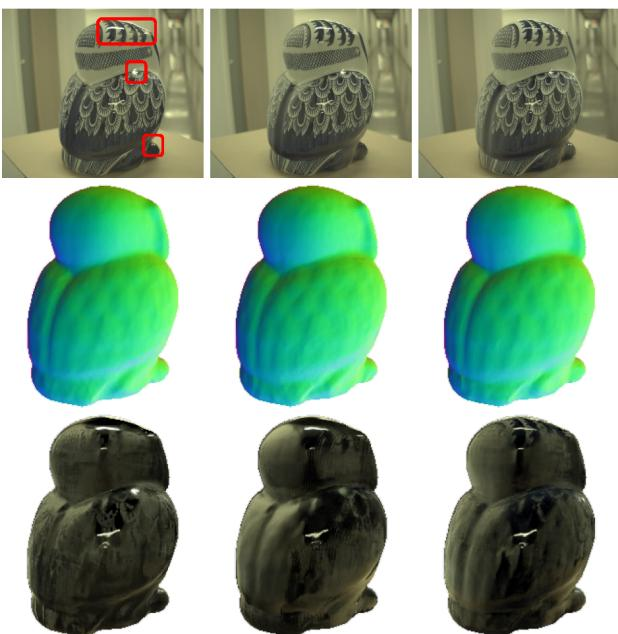

# Glossy Object Reconstruction with Cost-effective Polarized Acquisition

Bojian Wu1 Yifan Peng2,∗ Ruizhen Hu3 Xiaowei Zhou1,∗ 1Zhejiang University 2The University of Hong Kong 3Shenzhen University

  
Figure 1. We build a cost-effective data acquisition system for capturing multi-view polarization images, where a linear polarizer is mounted in front of the off-the-shelf RGB camera and a single image per-view with unknown angle of the polarizer is captured, which eliminates the need for precise alignment. For objects with a hybrid of ceramics (tummy) and metal (feet), we can still nicely recover the specular components and estimate the polarimetric states, directly leading to high-fidelity geometry.

## Abstract

The challenge of image-based 3D reconstruction for glossy objects lies in separating diffuse and specular components on glossy surfaces from captured images, a task complicated by the ambiguity in discerning lighting conditions and material properties using RGB data alone. While state-of-the-art methods rely on tailored and/or high-end equipment for data acquisition, which can be cumbersome and time-consuming, this work introduces a scalable polarization-aided approach that employs cost-effective acquisition tools. By attaching a linear polarizer to readily available RGB cameras, multi-view polarization images can be captured without the needfor advance calibration or precise measurements of the polarizer angle, substantially reducing system construction costs. The proposed approach represents polarimetric BRDF, Stokes vectors, and polarization states of object surfaces as neural implicit fields. These fields, combined with the polarizer angle, are retrieved by optimizing the rendering loss of input polarized images. By leveraging fundamental physical principles for the implicit representation of polarization rendering, our method demonstrates superiority over existing techniques through experiments in public datasets and real captured images on both reconstruction and novel view synthesis.

## 1. Introduction

3D reconstruction has been a long-standing topic in the graphics and vision communities. State-of-the-art methods are mostly designed for opaque surfaces with the Lambertian reflectance model and may perform sub-optimally in non-Lambertian scenes [18, 26], posing a challenge for both acquisition systems and reconstruction algorithms.

In particular, to deal with glossy or specular regions, except for painting with diffuse coats, specially-tailored devices are often required for recording the controlled environmental illumination and/or reflective lighting conditions. An alternative approach explores polarization cues, referred to as Shape-from-Polarization (SfP) [6, 8, 34], as polarization properties are closely related to surface normals. Moreover, diffuse and specular reflectances exhibit different polarimetric statuses, with the specular being more polarized than the diffuse and their polarization angles being orthogonal. These physical insights can be valuable for algorithms.

The existing optimization-based SfP methods face challenges when processing irregular triangles or non-manifold mesh, that could be largely overcome by incorporating neural implicit surfaces. Dave et al. [7] propose the first implementation that integrates polarization cues into neural radiance fields. It should be noted, however, that this approach requires an expensive polarization camera for data acquisition to obtain full polarization states, such as Stokes vectors, as supervision for network training. In contrast, we argue that, an off-the-shelf RGB camera equipped with a linear polarizer can already effectively acquire the required data, thereby greatly reducing the system cost.

Our approach employs a single captured polarization image per view as input and builds upon the polarimetric BRDF (pBRDF) model [1], which explicitly models the relation between polarization states of outgoing radiance and surface properties. To represent the object’s geometry, we utilize the neural implicit surface, that enables us to query the signed distance values and surface normals at any scene points. With scene coordinates, surface normals, and view directions as input, we employ separate radiance networks to represent the diffuse and specular radiances. These radiances form the basis for computing polarization states, which are depicted by the Stokes vectors and computed using the pBRDF model. Finally, the polarized images are rendered using volume rendering given the Stokes vectors at sampled scene points and the angle of polarizer. By minimizing the rendering loss between the rendered polarized images and the input polarized images, we recover neural radiance fields and surface properties. Importantly, the polarizer angle, which is typically unknown without complex calibration procedures, can be optimized along with the networks. Results tested on both public datasets and real captured data (Sec. 4) demonstrate the effectiveness and robustness of our approach (see the example in Fig. 1). The main contributions are as follows:

• We devise an cost-effective setup for acquiring polarization images by integrating an off-the-shelf RGB camera with a linear polarizer, eliminating the need for laborintensive calibration and reducing the overall cost.

• We are the first to leverage a single polarization image per view, in conjunction with neural radiance fields and fundamental physical principles, to enable the end-to-end polarization rendering.

• Experimental results demonstrate that our method well handles non-Lambertian components, leading to high fidelity geometry and radiance decomposition.

## 2. Related Work

We will next discuss only the methods of radiance decomposition and geometry recovery for glossy/specular objects using Neural Radiance Fields (NeRF) [19].

Glossy and specular surface reconstruction. Recent attempts such as Zhang et al. [32] and Boss et al. [2] aim to address this ill-posed problem by decomposing the specular reflectance with the estimated BRDF. Guo et al. [11] split a scene into transmitted and reflected components, that are modeled with separate neural radiance fields. Verbin et al. [25] consider spatially-varying scene properties and parameterize the outgoing radiance with the directional encoding of the reflected radiance. Yan et al. [28] extend this idea to dynamic scenes with a masked guided deformation field. Xu et al. [27] leverage an image-based rendering pipeline to reconstruct depth and reflection, and then select adjacent views for plausible coherent renderings. Kopanas et al. [15] propose a neural warp field to model catacaustic trajectories of reflections, which enables efficient point splattingbased rendering for complex specular effects. Although better rendering effects can be obtained, these methods often ignore the quality of geometry [30, 36]. Reconstruction results can be refined by balancing the importance of regions with different surface properties, such as adaptive reflection-aware photometric loss [9]. Liu et al. [17] propose to utilize two individual networks to encode the radiance of direct and indirect lights, respectively, which are selected subject to an estimated occlusion probability during rendering. Such a representation efficiently accommodates accurate surface reconstruction of reflective objects.

Shape from Polarization (SfP). Traditional SfP requires consideration of multi-view consistency, and constraints on the continuity and smoothness of the mesh surface to address the singularities in angle and phase caused by polarization, for better reconstruction [6, 8, 22, 34, 35]. Recent years have witnessed significant advancements of volume rendering based methods in resolving the shape [3, 4, 12, 14, 16, 20, 24, 29]. To be specific, Dave et al. [7] propose the pioneering work and first incorporate polarization cues into the neural radiance field and train the network using polarization states instead of original color information. This approach naturally facilitates decomposition of radiance into diffuse and specular components, leading to improved geometries. However, accurately characterizing polarization information often requires precise rotation and calibration of the polarizer mounted in front of the camera, which can be a tedious task and limits practical utilization. Although emerging snapshot polarization image sensors (e.g., Sony IMX250MZR on-chip polarizer [23]), allow for the acquisition of multi-directional polarized images in a single capture, the cost of such devices makes them impractical for personal use. To bypass the drawbacks of both approaches, we utilize only an RGB camera and a linear polarizer to establish an efficient yet low-cost acquisition scheme, eliminating the need for tedious pre-calibration.

## 3. Method

## 3.1. Overview of Reconstruction Pipeline

We aim to reconstruct the geometry and appearance of a glossy object from a set of posed polarization images $\{ \mathbf { I } _ { \phi _ { \mathrm { p o l } } } ^ { k } \}$ , where the angle of the polarizer filter $\phi _ { \mathrm { p o l } }$ is unknown. The entire pipeline, depicted in Fig. 2, consists of three main steps. To commence, we randomly select multiple camera poses surrounding the target object and capture a single polarization image $\mathbf { I } _ { \phi _ { \mathrm { p o l } } }$ at each view with our lowcost data acquisition system, as shown in Fig. 1. Next, in alignment with prior study [7], we employ VolSDF [31] and Ref-NeRF [25] as the fundamental blocks for modeling the neural implicit surface and decomposed radiances. Then, we harness the polarimetric BRDF model to accurately estimate Stokes vectors $\mathbf { s } ^ { \mathrm { o u t } }$ . Furthermore, we introduce an endto-end polarization rendering layer, which first estimates the polarizer’s angle $\phi _ { \mathrm { p o l } }$ and then incorporates physical rules to render a polarized image $\mathbf { I } _ { \phi _ { \mathrm { p o l } } } ^ { \mathrm { o u t } }$ , which is compared with the captured ground-truth for loss calculation.

  
Figure 2. Overview of neural glossy object reconstruction with polarization cues. Our method consists of three main steps (1–3): data acquisition, neural radiance field-based representation, and polarization rendering. This work employs neural rendering techniques in conjunction with the fundamental principles of polarization to generate a polarized image. These coupled modules allow for acquiring only one single polarization image at each viewing angle and then recover geometry and material properties through the optimization of rendering loss. Components marked with upward diagonal strips, such as DifuseNet and SpecularNet, are optimized during training, while those with grid checker patterns are calculated using corresponding equations.

As in Fig. 2, our method utilizes a polarization image $\mathbf { I } _ { \phi _ { \mathrm { p o l } } }$ as the input and initiates by sampling a collection of 3D locations along each camera ray. These locations are processed through a coordinate-based neural implicit surface module, facilitating the estimation of signed distances and surface normals. Along with view directions, separate radiance networks are employed to determine the diffuse and specular components. This separation allows us to effectively handle the non-Lambertian properties exhibited by the surface. Combined with the polarimetric BRDF model, the outgoing Stokes vectors sout can be obtained, which lay the foundation for polarization-based rendering. The details on these methods can be found in supplementary materials.

Next, we present a differentiable processing pipeline to estimate the polarizer’s angle $\phi _ { \mathrm { p o l } }$ , eliminating the need for precise polarization angle measurements and facilitating the implicit rendering of desired polarized images $\mathbf { I } _ { \phi _ { \mathrm { p o l } } } ^ { \mathrm { o u t } }$ for loss calculation. Subsequently, we provide a comprehensive analysis of the fundamental principles of polarization and its application in aiding the reconstruction and radiance decomposition in Sec. 3.2. Moreover, we illustrate the rationale behind the efficacy of using a single polarization image per view to achieve our goals and elucidate the distinctions between this approach and prior methodologies in Sec. 3.3.

## 3.2. Polarization-empowered Rendering

In this approach, we take the estimated outgoing Stokes vector $\mathbf { s } ^ { \mathrm { o u t } }$ as input, which characterizes the polarization state of light and is represented by a four-dimensional vector $[ s _ { 0 } , s _ { 1 } , s _ { 2 } , s _ { 3 } ]$ . From this, we calculate the fundamental polarization information as follows:

$$
{ \bf { I } } _ { \mathrm { { u n } } } = \frac { 1 } { 2 } s _ { 0 } , \rho = \frac { \sqrt { s _ { 1 } ^ { 2 } + s _ { 2 } ^ { 2 } } } { s _ { 0 } } , \phi = \frac { 1 } { 2 } \mathrm { { a r c t a n } } 2 ( s _ { 2 } , s _ { 1 } ) ,\tag{1}
$$

where $\rho$ is the degree of polarization (DoP), ϕ is the angle of polarization (AoP), and ${ \bf { I } } _ { \mathrm { u n } }$ is the unpolarized intensity.

On the one hand, the polarized intensity ${ \bf I } _ { \phi _ { \mathrm { p o l } } } \ ( \mathrm { i } . \mathrm { e } .$ ., the captured image) exhibits sinusoidal variation with the rotation angle of the polarizer $\phi _ { \mathrm { p o l } }$ , as shown below:

$$
\mathbf { I } _ { \phi _ { \mathrm { p o l } } } = \mathbf { I } _ { \mathrm { u n } } \left( 1 + \rho \cos ( 2 \phi - 2 \phi _ { \mathrm { p o l } } ) \right) .\tag{2}
$$

Using Eq. 1, the only unknown variable $\phi _ { \mathrm { p o l } }$ can be easily solved given $\mathbf { s } ^ { \mathrm { o u t } }$ and $\mathbf { I } _ { \phi _ { \mathrm { p o l } } }$

Moreover, Mueller matrices are only valid in the aligned reference coordinate system when considering the light passing through a polarizer. Therefore, for a linear polarizer with a rotation angle of $\phi _ { \mathrm { p o l } }$ , its Mueller matrix must be deduced according to [5]:

$$
\mathbf { M } _ { \phi _ { \mathrm { p o l } } } = \mathbf { R } _ { \phi _ { \mathrm { p o l } } } ^ { \mathbf { T } } \mathbf { M } _ { \mathbf { L P } } \mathbf { R } _ { \phi _ { \mathrm { p o l } } } ,\tag{3}
$$

where $\mathbf { R } _ { \phi _ { \mathrm { p o l } } }$ is the rotation matrix and ${ \bf M } _ { \bf L P }$ is the Mueller matrix of an ideal linear polarizer with the horizontal trans-

mission. Both are defined as follows:

$$
\mathbf { R } _ { \phi _ { \mathrm { p o l } } } = \left[ \begin{array} { c c c c c } { 1 } & { 0 } & { 0 } & { 0 } \\ { 0 } & { \cos ( 2 \phi _ { \mathrm { p o l } } ) } & { \sin ( 2 \phi _ { \mathrm { p o l } } ) } & { 0 } \\ { 0 } & { - \sin ( 2 \phi _ { \mathrm { p o l } } ) } & { \cos ( 2 \phi _ { \mathrm { p o l } } ) } & { 0 } \\ { 0 } & { 0 } & { 0 } & { 1 } \end{array} \right] , \mathbf { M } _ { \mathrm { L P } } = \left[ \begin{array} { c c c c } { 0 . 5 } & { 0 . 5 } & { 0 } & { 0 } \\ { 0 . 5 } & { 0 . 5 } & { 0 } & { 0 } \\ { 0 } & { 0 } & { 0 } & { 0 } \\ { 0 } & { 0 } & { 0 } & { 0 } \end{array} \right] .\tag{4}
$$

Accordingly, passing/modulating through a linear polarizer, the outgoing Stokes vector $\mathbf { s } ^ { \mathrm { o u t } }$ can be transformed by:

$$
\begin{array} { r } { \mathbf { s } _ { \phi _ { \mathrm { p o l } } } ^ { \mathrm { o u t } } = \mathbf { M } _ { \phi _ { \mathrm { p o l } } } \mathbf { s } ^ { \mathrm { o u t } } = \mathbf { R } _ { \phi _ { \mathrm { p o l } } } ^ { \mathbf { T } } \mathbf { M } _ { \mathbf { L P } } \mathbf { R } _ { \phi _ { \mathrm { p o l } } } \mathbf { s } ^ { \mathrm { o u t } } . } \end{array}\tag{5}
$$

Then, the final rendered polarized image is denoted by:

$$
{ \bf I } _ { \phi _ { \mathrm { p o l } } } ^ { \mathrm { o u t } } = \frac { 1 } { 2 } { \bf s } _ { \phi _ { \mathrm { p o l } } } ^ { \mathrm { o u t } } [ 0 ] ,\tag{6}
$$

where ${ \bf s } _ { \phi _ { \mathrm { p o l } } } ^ { \mathrm { o u t } } [ 0 ]$ is the first element of Stokes vector.

Loss function. In order to describe the polarization status in the region of interest (RoI) and reduce the background noise, we apply a coordinate-based network to predict the soft mask $m ( \mathbf { x } )$ of each sampled point x on the camera ray. Therefore, the complete loss function consists of three components with balancing weights denoted as follows:

$$
\mathcal { L } = \mathcal { L } _ { \mathrm { r g b } } + \mathcal { L } _ { \mathrm { m a s k } } + 0 . 1 \mathcal { L } _ { \mathrm { e i k o n a l } } .\tag{7}
$$

The RGB loss $\mathcal { L } _ { \mathrm { r g b } }$ describes the discrepancies between the rendered polarized image $\mathbf { I } _ { \phi _ { \mathrm { p o l } } } ^ { \mathrm { o u t } }$ and the captured image $\mathbf { I } _ { \phi _ { \mathrm { p o l } } }$ using $\ell _ { 1 }$ loss. The loss is masked with the ground-truth mask to reduce the noise from surrounding environment. The predicted mask is supervised by the ground-truth mask with the binary cross entropy loss $\mathcal { L } _ { \mathrm { m a s k } }$ . In addition, we introduce the eikonal loss $\mathcal { L } _ { \mathrm { e i k o n a l } }$ [10] to regularize the network to learn a valid signed distance field (SDF).

## 3.3. Theoretical Analysis

Our method aims to retrieve not only geometric and polarization information but also the polarizer’s angle from multi-view images, requiring only one polarization image per view, which presents us with more unknown variables to address within a reduced set of limitations.

As aforementioned, we utilize the polarimetric BRDF model to express the Stokes vector $\mathbf { s } ^ { \mathrm { o u t } }$ as a linear combination of polarized diffuse and specular counterparts, respectively. Here, we focus solely on the radiance component:

$$
\mathbf { I } ^ { \mathrm { o u t } } = \left( \mathbf { n } \cdot \mathbf { i } \right) \left( f _ { d } ( \mathbf { i } , \mathbf { n } , \mathbf { v } ) + f _ { s } ( \mathbf { i } , \mathbf { n } , \mathbf { v } , \eta ) \right) L _ { i } ,\tag{8}
$$

where i, n, v and $\eta$ denote the incident lighting direction, normal, viewing direction, and roughness. $L _ { i }$ is incident illumination and is usually defined as white light $( L _ { i } = 1 . 0 )$

The diffuse reflectance $f _ { d }$ pertains to light that enters the subsurface, scatters, and subsequently transmits back in the

direction of observation. The specular reflectance $f _ { s }$ models both specular lobe and spike, which are defined below:

$$
\begin{array} { r l } & { f _ { d } = k _ { d } T ( \mathbf { v } , \mathbf { n } ) T ( \mathbf { i } , \mathbf { n } ) , } \\ & { f _ { s } = k _ { s } W ( \mathbf { i } , \mathbf { n } , \mathbf { v } , \eta ) R ( \mathbf { h } , \mathbf { v } ) , } \end{array}\tag{9}
$$

where $\begin{array} { r } { W = \frac { D G } { 4 ( \mathbf { n } \cdot \mathbf { o } ) } } \end{array}$ , and all other parameters are defined in the same manner as outlined in [1].

The Fresnel coefficients $T$ and $R$ at polarization filter angle $\phi _ { \mathrm { p o l } }$ are represented by:

$$
T _ { \phi _ { \mathrm { p o l } } } = \frac { T _ { p } + T _ { s } } { 2 } + \rho _ { t } \frac { T _ { p } - T _ { s } } { 2 } \cos ( 2 \phi _ { t } - 2 \phi _ { \mathrm { p o l } } ) ,\tag{10}
$$

$$
R _ { \phi _ { \mathrm { p o l } } } = \frac { R _ { s } + R _ { p } } { 2 } + \rho _ { r } \frac { R _ { s } - R _ { p } } { 2 } \cos ( 2 \phi _ { r } - 2 \phi _ { \mathrm { p o l } } ) ,\tag{11}
$$

where the subscriptions $p$ and s indicate the components parallel and perpendicular to the reflection plane, while $\rho _ { t }$ and $\rho _ { r }$ represent the degree of linear polarization for transmittance and reflection respectively, $\phi _ { t }$ and $\phi _ { r }$ correspond to the angle of polarization of transmission and reflection.

Ultimately, the output estimated radiance ${ \bf I } ^ { \mathrm { o u t } } \left( \mathrm { E q } . \mathrm { \ 8 } \right)$ at the polarization filter angle $\phi _ { \mathrm { p o l } }$ can be expressed as follows:

$$
\begin{array} { r l } & { \mathbf { I } _ { \phi _ { \mathrm { p o l } } } ^ { \mathrm { o u t } } = ( \mathbf { n } \cdot \mathbf { i } ) ( k _ { d } T ( \mathbf { v } , \mathbf { n } , \phi _ { \mathrm { p o l } } ) T ( \mathbf { i } , \mathbf { n } ) + } \\ & { \qquad k _ { s } W ( \mathbf { i } , \mathbf { n } , \mathbf { v } , \eta ) R ( \mathbf { h } , \mathbf { v } , \phi _ { \mathrm { p o l } } ) ) L _ { i } . } \end{array}\tag{12}
$$

In our implementation, the incident direction i of the light is approximated as the reflected direction of v, thereby aligning the half vector h with the normal direction. Consequently, the unknown variables in Eq. 12 are limited to n (2 unknowns, parameterized in spherical coordinates), $k _ { d }$ (3 unknowns), $k _ { s }$ (3 unknowns), $\eta$ (1 unknown), and $\phi _ { \mathrm { p o l } }$ (1 unknown), totaling 10 unknowns. It is worth noting that, except for $\phi _ { \mathrm { p o l } }$ , the remaining variables represent intrinsic material properties of the object and are fully disentangled within this material model. These variables remain consistent for the same spatial point, irrespective of the viewing angle. The view dependency of color provides 3 separate constraints (R, G and B) for each view, implying that only four views are sufficient to render the problem overdetermined, eventually forming 12 independent equations.

Distinction to prior works. In contrast to the wellestablished polarization method, i.e., PANDORA [7], our method necessitates the acquisition of one single polarization image at each viewing angle. We employ the proposed end-to-end rendering framework and enhance geometric and material reconstruction through optimization of the rendering loss function. Comparing with conventional non-polarization solutions, such as VolSDF [31], our method stands out in rendering out the higher-quality surface reconstruction. While multi-view consistency assumptions tend to break down when dealing with glossy surfaces in certain scenes, our polarization setup allows for the effective modeling of RGB information from various perspectives through polarization rendering, as denoted by Iout earϕpol lier. This unique representation seamlessly integrates both the object’s normal vector and material properties, facilitating the deduction of geometric characteristics and material properties within a unified framework. By progressively enhancing the accuracy of $\mathbf { I } _ { \phi _ { \mathrm { p o l } } } ^ { \mathrm { o u t } }$ through the minimization of rendering loss, we implicitly refine the accuracy of normal vector and subsequently elevate the quality of geometry.

  
Figure 3. Qualitative results of captured datasets. For each scenario, the top row shows the input reference image, ground-truth mesh (obtained by painting and scanning), and corresponding normals; the bottom row demonstrates our resolved results, including the rendered image and extracted mesh.

## 4. Experiment

## 4.1. Datasets and Results

To meet our requirements, we build a simple data acquisition system using off-the-shelf products, which includes an RGB camera (SONY A6400 with 4K resolution) and a linear polarizer, as shown in Fig. 1. We select several complex objects with varying materials, such as ceramics, metal, and plastic, see examples in Figs. 1 (RedOx) and 3 (GreenOx, Cat, Horse and Lays). In practice, we fix the orientation of polarizer across all the captured views and hold the device to collect images approximately evenly around the object, see example camera poses in Fig. 2. The multi-view images are captured under uncontrolled indoor lighting environments, and about 40 images are enough for each object. In all cases, we first downsample the image by a factor of 4 and apply COLMAP [21] to obtain the initial poses.

  
Figure 4. Qualitative comparison with SOTA methods. Our approach excels in reconstructing intricate features such as beard and tail segments, due to the advantage of the polarization information.

Results tested on RedOx model and others are shown in Figs. 1 and 3. Note that, for a variety of different materials (ceramics, metal, etc.), with varying lighting conditions, our method still recovers the surface geometry reasonably well. Moreover, the fact that polarization cues behave differently for the diffuse and specular components greatly aid in understanding material properties and facilitating radiance decomposition, which is an inherently ill-posed problem. As depicted in presented examples, our results reasonably separate the diffuse and specular components. Additionally, the estimated polarimetric cues align with our intuition, i.e., the AoP is orthogonal for the diffuse and specular components, while the DoP is higher for the specular regions.

## 4.2. Assessments against Counterparts

Comparisons with non-polarization methods. We have conducted a comparison of our approach with several stateof-the-art radiance decomposition and surface reconstruction methods. For instance, as depicted in Fig. 4, NeuralPIL [2] and PhySG [32] are the baseline methods of PANDORA [7], InvRender [33] accounts for indirect lighting in the BRDF estimation and employs the Spherical Gaussian to represent direct or indirect lighting. NVDiffRec [13] utilizes differentiable Monte-Carlo sampling sampling with a denoiser. Ref-NeuS [9] aims to reduce ambiguity by attenuating the effect of reflective surfaces, while NeRO [17] proposes to reconstruct the geometry and BRDF of objects with strong reflective appearances.

Table 1. Quantitative assessment of rendering and reconstruction quality. To ensure a fair comparison in the 3D reconstruction quality, all models are normalized to the unit sphere. Note that, we do not directly compare with NeuralPIL and Ref-NeuS, as they fail to produce valid geometry in several cases, as evident in Fig. 4. Nevertheless, with the incorporation of polarization cues, our method consistently achieves the best results.
<table><tr><td></td><td colspan="3">RedOx</td><td colspan="3">GreenOx</td><td colspan="3">Cat</td><td colspan="3">Horse</td><td colspan="3">Lays</td></tr><tr><td></td><td>PSNR ↑</td><td>SSIM↑</td><td>CD↓</td><td>PSNR</td><td>SSIM</td><td>CD</td><td>PSNR</td><td>SSIM</td><td>CD</td><td>PSNR</td><td>SSIM</td><td>CD</td><td>PSNR</td><td>SSIM</td><td>CD</td></tr><tr><td>NeuralPIL</td><td>22.47</td><td>0.9378</td><td></td><td>23.51</td><td>0.9301</td><td></td><td>22.36</td><td>0.8626</td><td></td><td>21.27</td><td>0.9049</td><td></td><td>20.93</td><td>0.8657</td><td></td></tr><tr><td>PhySG</td><td>16.42</td><td>0.9737</td><td>2.36e-2</td><td>18.39</td><td>0.9822</td><td>1.43e-2</td><td>16.32</td><td>0.9513</td><td>1.48e-3</td><td>16.59</td><td>0.9518</td><td>1.31e-3</td><td>17.41</td><td>0.9569</td><td>2.66e-3</td></tr><tr><td>NVDiffRec</td><td>30.86</td><td>0.9639</td><td>0.3005</td><td>30.66</td><td>0.9862</td><td>0.2638</td><td>23.61</td><td>0.9614</td><td>0.5936</td><td>27.15</td><td>0.9590</td><td>0.1315</td><td>29.31</td><td>0.9693</td><td>0.1152</td></tr><tr><td>InvRender</td><td>22.47</td><td>0.9631</td><td>2.28e-2</td><td>27.32</td><td>0.9758</td><td>1.78e-2</td><td>22.32</td><td>0.9510</td><td>1.82e-3</td><td>24.92</td><td>0.9464</td><td>1.13e-3</td><td>25.61</td><td>0.9673</td><td>1.21e-3</td></tr><tr><td>Ref-NeuS</td><td>27.21</td><td>0.8562</td><td></td><td>27.35</td><td>0.8528</td><td></td><td>23.27</td><td>0.8464</td><td></td><td>23.45</td><td>0.8562</td><td></td><td>27.28</td><td>0.91753</td><td></td></tr><tr><td>NeRO</td><td>19.88</td><td>0.8503</td><td>2.04e-3</td><td>16.98</td><td>0.5972</td><td>1.08e-3</td><td>24.51</td><td>0.8039</td><td>9.31e-3</td><td>22.22</td><td>0.8294</td><td>1.20e-3</td><td>26.68</td><td>0.9256</td><td>1.04e-3</td></tr><tr><td>Ours (diffuse)</td><td>25.03</td><td>0.9683</td><td>1.06e-3</td><td>28.24</td><td>0.9860</td><td>7.99e-4</td><td>24.39</td><td>0.9465</td><td>5.91e-3</td><td>22.43</td><td>0.8996</td><td>7.88e-4</td><td>28.52</td><td>0.9457</td><td>3.50e-3</td></tr><tr><td>Ours (w/o pol)</td><td>26.29</td><td>0.9662</td><td>3.01e-3</td><td>30.77</td><td>0.9738</td><td>7.14e-4</td><td>23.84</td><td>0.9343</td><td>1.39e-3</td><td>25.84</td><td>0.9566</td><td>6.76e-4</td><td>24.04</td><td>0.9520</td><td>2.76e-3</td></tr><tr><td>Ours</td><td>30.88</td><td>0.9774</td><td>2.23e-4</td><td>31.02</td><td>0.9883</td><td>1.17e-4</td><td>24.83</td><td>0.9696</td><td>9.88e-5</td><td>27.97</td><td>0.9606</td><td>2.07e-4</td><td>30.82</td><td>0.9780</td><td>1.01e-3</td></tr></table>

These methods typically rely on RGB data, which can struggle with accurate geometry reconstruction and radiance decomposition due to the limitations of using only intensity measurements. This often results in artifacts and inconsistencies, particularly in areas with strong specular reflections. We propose that incorporating polarization information is essential as it connects surface normals with lighting and material properties, improving the accuracy of these processes. Our evaluations, using open-source code from the original authors, indicate that our approach still delivers superior quality as shown in Tab. 1. However, due to the inherent limitations in various methods, such as, PhySG’s overly smooth geometry and inaccurate radiance decomposition, InvRender’s superior performance only in synthetic scenarios, Ref-NeuS’s effectiveness in view-dependent weighting scheme, and NeRO’s proficiency in handling strong reflective objects, conventional objects in real-world settings often exhibit sub-optimal performance.

In Tab. 1, we further conduct a thorough evaluation concerning the quantitative accuracy on the aforementioned test set. Firstly, we assess the rendering quality of our method and compare it to state-of-the-art algorithms. Hereby, we report the average PSNR and SSIM in comparison to the ground-truth test images. Next, we employ an invasive method to reconstruct the ground-truth shapes for these highly specular objects, so as to facilitate numerical assessment on the geometry recovery. Specifically, we apply a diffuse developer to objects and scan them using a high-end industrial-level 3D scanner. However, due to the potential inconsistency between the scanning and reconstruction coordinate systems, we manually scale and translate the scanned model to align with the reconstruction coordinate system. Subsequently, we utilize the non-rigid ICP algorithm to achieve the complete alignment between the scanned model and the reconstructed model under the shared coordinate system. Once aligned, the sum of the bi-directional chamfer distance (CD) between the reconstructed and scanned models is computed.

  
Figure 5. Comparison of reflectance separation and surface normals with baselines on rendered Bust model. Note that, although PANDORA outputs sharp results, our method is also able to produce comparable results, because overall we use fewer constraints and need to solve for more unknowns.

Table 2. Quantitative evaluation on rendered Bust model. We evaluate our method and PANDORA on 10% held-out testsets of 45 images, and report the average peak signal-to-noise ratio (PSNR) and structured similarity (SSIM) of diffuse, specular and mixed radiance, mean angular error (MAE).
<table><tr><td rowspan="2">Method</td><td colspan="2">Diffuse</td><td colspan="2">Specular</td><td colspan="2">Mixed</td><td>Normals</td></tr><tr><td>PSNR ↑</td><td>SSIM↑</td><td>PSNR</td><td>SSIM</td><td>PSNR</td><td>SSIM</td><td>MAE↓</td></tr><tr><td>PANDORA</td><td>23.97</td><td>0.907</td><td>26.02</td><td>0.864</td><td>26.86</td><td>0.895</td><td>4.096°</td></tr><tr><td>Ours</td><td>23.29</td><td>0.887</td><td>25.97</td><td>0.860</td><td>26.53</td><td>0.888</td><td>4.227°</td></tr></table>

As depicted in Fig. 4, the outcomes indicate that NVDiffRec encounters challenges in effectively disentangling the diffuse and specular components and yields fundamentally erroneous geometric estimations. Surprisingly, this deficiency appears to exert minimal influence on the ultimate rendering quality, as evidenced by the high PSNR and SSIM metrics. We hypothesize that this arises from the method’s inability to effectively resolve the inherent ambiguity between these two components, yet it still manages to yield exceptional rendering results grounded primarily in RGB loss. Conversely, NeRO exhibits improved geometric reconstruction capabilities, but its performance in radiance decomposition is lackluster. This arises from its rigid design tailored for entirely specular objects.

  
Figure 6. Results of Owl and Gnome models. (a) Comparison of the estimated AoP and DoP. (b) Comparison of the estimated geometry and radiance decomposition. For Owl model, the average PSNR/SSIM on 10% held-out test set between the estimated results of s0 and the corresponding ground-truth are 24.46/0.8756 (ours) and 25.07/0.8972 (PANDORA). The PSNR/SSIM of which on Gnome model are 28.13/0.9274 and 28.43/0.9378.

Comparisons with polarization methods. Tested on the synthetic data, both visualized results (Fig. 5) and quantitative comparison (Tab. 2) reveal that our method achieves comparable performance with SOTAs. Using Bust model as an example, we present the ground-truth diffuse and specular components, as well as normals and environment map.

Next, we study the raw data collected by PANDORA [7] (Owl and Gnome), as shown in the leftmost column of Fig. 6(a). These datasets are obtained by acquiring raw images with a dedicated polarization camera equipped with SONY IMX250MZR sensor [23]. After demosaicing, the raw image could be decomposed into four polarization images with different polarizing angles of 0◦, 45◦, 90◦, and 135◦. In the following experiments, we use the image with the polarizer’s angle of 135◦ as input and leverage our approach to implicitly reconstruct the Stokes vectors and other information. For each case, we randomly select 90% of the images for training. The results are shown in Fig. 6.

It is noteworthy that, in PANDORA, the AoP and DoP are directly calculated from the captured data and are used as ground truths. In contrast, our approach generates intermediate outputs from the network, and our results can also nicely interpret the polarization states. Furthermore, since polarization is closely related to surface geometry and material properties, better estimated polarization cues result in high-quality decomposed diffuse and specular components,

w/o pol (Ref-NeRF)

w/o pol and diffuse only (VolSDF)

w/o pol (Ref-NeRF)

w/o pol and diffuse only (VolSDF)

  
Figure 7. Ablation study. For each example, the top row depicts the results obtained by excluding polarization cues during rendering. Additionally, we exclusively focus on the diffuse components, and the corresponding outcomes are presented in the middle row. The bottom row showcases our outputs.

such as the tummy of the Owl and the beard of the Gnome.

## 4.3. Analysis

Ablation study. As shown in Fig. 7, we conduct two ablation studies for validation, such as, the effectiveness of polarization cues and the consideration of specular components. We first replace the polarized rendering as described in Sec. 3.2 with the normal volume rendering. This design choice is actually an enhanced variant of Ref-NeRF [25]. Secondly, we compute the RGB loss between the rendered diffuse radiances, by removing the specular component during rendering, and the ground truth, this is actually VolSDF [31] with mask supervision used as a baseline.

Based on the reconstruction results, such as the top case of Fig. 7, where the surface exhibits distinct specular regions, without polarization cues, the network faces challenges in accurately learning distinctive features, leading to less precise surface geometry. Despite this, our method still demonstrates robustness in capturing surface details, even in regions with prominent specular components.

On the other hand, the final radiance decomposition results demonstrate that polarization cues can aid the network in better approximating true diffuse and specular components. In general, to ensure the consistency across multiple views, the network tends to focus on learning the diffuse components. As depicted, in the absence of polarization information, the network lacks substantial physical constraints, making it challenging to learn results that adhere to physics principles. In contrast, our method faithfully follows the polarization theorem during the rendering process, enabling more intuitive and reasonable decomposition.

  
Figure 8. Novel view synthesis results of real-world captured objects. Remarkably, despite never encountering this particular perspective during training, the network is still capable of producing reasonably accurate rendering results.

  
0°/ est. 2.35°  
45°/ est. 41.16°  
90°/ est. 95.74°  
Figure 9. Robustness analysis. Despite minor color variations occur in specular regions across different polarization angles, particularly those highlights indicated by red boxes, our algorithm effectively restores a coherent geometry, while accurately recovers the corresponding specular map.

Novel view synthesis. We conduct experiments on a heldout test set of the captured objects. These images are carefully chosen to be distinct from the existing viewing angles in the training set. During the testing phase, the network automatically generates essential information, including surface normals, polarization states, and decomposed radiances, using only the provided camera poses. The rendered visualizations of our results are illustrated in Fig. 8.

Robustness to different angles of the polarizer. As previously mentioned, our approach does not require the polarization angle of the input image to be calibrated in advance, as this information can be implicitly solved by the network. From another perspective, the network itself is ignorant of the polarization angle of the input image, and we can theoretically obtain the same reconstruction results. To verify this, we synthesize images with different polarization angles, such as 0◦, 45◦, and 90◦, using Eq. 2, as shown in Fig. 9. Our algorithm produces consistent and high-quality reconstruction results for different inputs. In addition, we output the estimated angle of the polarizer from the network, with an error less than 5◦.

## 5. Discussion and Conclusion

This work presents advancements in polarization-based 3D reconstruction of glossy objects, by tackling the highly challenging yet novel task of estimating geometry and appearance from multi-view images with one single polarization angle per-view without pre-calibration. We introduce a fully differentiable polarization rendering pipeline that streamlines data acquisition to a single image per view and automatically determines the polarizer angle, eliminating manual calibration requirements and reducing costs.

Despite challenges such as color bleeding, our approach accurately reconstructs object geometry and material properties, predicting diffuse and specular maps essential for polarization cues. By implicitly estimating the polarization angle to render a polarized image and comparing it to the captured image to compute loss, our integration of polarization information reinforces the relationship between surface normals and radiances, facilitating precise estimation of components for accurate geometry reconstructions. This work paves the way for high-fidelity reconstruction using accessible tools, with potential applications on devices like smartphones or IoTs.

## Acknowledgments

This work was partially supported by NSFC (U24B20154, 62322217, 62322207), Ant Group, Information Technology Center and State Key Lab of CAD&CG, Zhejiang University, and the Research Grants Council of Hong Kong (ECS 27212822, GRF 17208023).

## References

[1] Seung-Hwan Baek, Daniel S Jeon, Xin Tong, and Min H Kim. Simultaneous acquisition of polarimetric svbrdf and normals. ACM Trans. on Graphics (Proc. of SIGGRAPH Asia), 37(6):268–1, 2018. 2, 4

[2] Mark Boss, Varun Jampani, Raphael Braun, Ce Liu, Jonathan Barron, and Hendrik Lensch. Neural-pil: Neural pre-integrated lighting for reflectance decomposition. Proc. Neural Information Processing Systems, 34:10691–10704, 2021. 2, 5

[3] Jiakai Cao, Zhenlong Yuan, Tianlu Mao, Zhaoqi Wang, and Zhaoxin Li. Nerf-based polarimetric multi-view stereo. Pattern Recognition, 158:111036, 2025. 2

[4] Guangcheng Chen, Yicheng He, Li He, and Hong Zhang. Pisr: Polarimetric neural implicit surface reconstruction for textureless and specular objects. arXiv preprint arXiv:2409.14331, 2024. 2

[5] Edward Collett. Polarized light: Fundamentals and applications. Optical Engineering, 1992. 3

[6] Zhaopeng Cui, Jinwei Gu, Boxin Shi, Ping Tan, and Jan Kautz. Polarimetric multi-view stereo. In Proc. IEEE Conf. on Computer Vision & Pattern Recognition, pages 1558– 1567, 2017. 1, 2

[7] Akshat Dave, Yongyi Zhao, and Ashok Veeraraghavan. Pandora: Polarization-aided neural decomposition of radiance. In Proc. Euro. Conf. on Computer Vision, pages 538–556, 2022. 1, 2, 3, 4, 5, 7

[8] Yoshiki Fukao, Ryo Kawahara, Shohei Nobuhara, and Ko Nishino. Polarimetric normal stereo. In Proc. IEEE Conf. on Computer Vision & Pattern Recognition, pages 682–690, 2021. 1, 2

[9] Wenhang Ge, Tao Hu, Haoyu Zhao, Shu Liu, and Ying-Cong Chen. Ref-neus: Ambiguity-reduced neural implicit surface learning for multi-view reconstruction with reflection. arXiv preprint arXiv:2303.10840, 2023. 2, 5

[10] Amos Gropp, Lior Yariv, Niv Haim, Matan Atzmon, and Yaron Lipman. Implicit geometric regularization for learning shapes. Proc. Int. Conf. on Machine Learning, 2020. 4

[11] Yuan-Chen Guo, Di Kang, Linchao Bao, Yu He, and Song-Hai Zhang. Nerfren: Neural radiance fields with reflections. In Proc. IEEE Conf. on Computer Vision & Pattern Recognition, pages 18409–18418, 2022. 2

[12] Yufei Han, Heng Guo, Koki Fukai, Hiroaki Santo, Boxin Shi, Fumio Okura, Zhanyu Ma, and Yunpeng Jia. Nersp: Neural 3d reconstruction for reflective objects with sparse polarized images. In Proceedings of the IEEE/CVF Conference on Computer Vision and Pattern Recognition, pages 11821– 11830, 2024. 2

[13] Jon Hasselgren, Nikolai Hofmann, and Jacob Munkberg. Shape, light, and material decomposition from images using monte carlo rendering and denoising. Proc. Neural Informa tion Processing Systems, 35:22856–22869, 2022. 5

[14] Youngchan Kim, Wonjoon Jin, Sunghyun Cho, and Seung-Hwan Baek. Neural spectro-polarimetric fields. In Proc. of SIGGRAPH Asia, 2023. 2

[15] Georgios Kopanas, Thomas Leimkuhler, Gilles Rainer,¨ Clement Jambon, and George Drettakis. Neural point cata-´ caustics for novel-view synthesis of reflections. ACM Trans. on Graphics (Proc. of SIGGRAPH Asia), 41(6):1–15, 2022. 2

[16] Chenhao Li, Taishi Ono, Takeshi Uemori, Hajime Mihara, Alexander Gatto, Hajime Nagahara, and Yusuke Moriuchi. Neisf: Neural incident stokes field for geometry and material estimation. In Proceedings ofthe IEEE/CVF Conference on Computer Vision and Pattern Recognition, pages 21434– 21445, 2024. 2

[17] Yuan Liu, Peng Wang, Cheng Lin, Xiaoxiao Long, Jiepeng Wang, Lingjie Liu, Taku Komura, and Wenping Wang. Nero: Neural geometry and brdf reconstruction of reflective objects from multiview images. ACM Trans. on Graphics (Proc. of SIGGRAPH), 42(4), 2023. 2, 5

[18] Jiahui Lyu, Bojian Wu, Dani Lischinski, Daniel Cohen-Or, and Hui Huang. Differentiable refraction-tracing for mesh reconstruction of transparent objects. ACM Trans. on Graph ics (Proc. ofSIGGRAPHAsia), 39(6):195:1–195:13, 2020. 1

[19] Ben Mildenhall, Pratul P. Srinivasan, Matthew Tancik, Jonathan T. Barron, Ravi Ramamoorthi, and Ren Ng. Nerf: Representing scenes as neural radiance fields for view synthesis. In Proc. Euro. Conf. on Computer Vision, pages 405– 421, 2020. 2

[20] Henry Peters, Yunhao Ba, and Achuta Kadambi. pcon: Polarimetric coordinate networks for neural scene representations. In Proc. IEEE Conf. on Computer Vision & Pattern Recognition, pages 16579–16589, 2023. 2

[21] Johannes Lutz Schonberger and Jan-Michael Frahm.¨ Structure-from-motion revisited. In Proc. IEEE Conf. on Computer Vision & Pattern Recognition, 2016. 5

[22] Mingqi Shao, Chongkun Xia, Dongxu Duan, and Xueqian Wang. Polarimetric inverse rendering for transparent shapes reconstruction. IEEE Transactions on Multimedia, 2024. 2

[23] SONY. Polarization image sensor. https : / / www . sony - semicon . com / en / products / is / industry/polarization.html, 2018. Online. 2, 7

[24] Ashish Tiwari and Shanmuganathan Raman. Ss-sfp: Neu ral inverse rendering for self supervised shape from (mixed) polarization. arXiv preprint arXiv:2407.09294, 2024. 2

[25] Dor Verbin, Peter Hedman, Ben Mildenhall, Todd Zickler, Jonathan T Barron, and Pratul P Srinivasan. Ref-nerf: Structured view-dependent appearance for neural radiance fields. In Proc. IEEE Conf. on Computer Vision & Pattern Recognition, pages 5481–5490. IEEE, 2022. 2, 3, 7

[26] Bojian Wu, Yang Zhou, Yiming Qian, Minglun Gong, and Hui Huang. Full 3d reconstruction of transparent objects. ACM Trans. on Graphics (Proc. of SIGGRAPH), 37(4): 103:1–103:11, 2018. 1

[27] Jiamin Xu, Xiuchao Wu, Zihan Zhu, Qixing Huang, Yin Yang, Hujun Bao, and Weiwei Xu. Scalable image-based indoor scene rendering with reflections. ACM Trans. on Graphics (Proc. ofSIGGRAPH), 40(4):1–14, 2021. 2

[28] Zhiwen Yan, Chen Li, and Gim Hee Lee. Nerf-ds: Neural radiance fields for dynamic specular objects. arXiv preprint arXiv:2303.14435, 2023. 2

[29] LI Yang, WU Ruizheng, LI Jiyong, and CHEN Ying-cong. Gnerp: Gaussian-guided neural reconstruction of reflective objects with noisy polarization priors. arXiv preprint arXiv:2403.11899, 2024. 2

[30] Wenqi Yang, Guanying Chen, Chaofeng Chen, Zhenfang Chen, and Kwan-Yee K Wong. Ps-nerf: Neural inverse rendering for multi-view photometric stereo. In Proc. Euro. Conf. on Computer Vision, pages 266–284. Springer, 2022. 2

[31] Lior Yariv, Jiatao Gu, Yoni Kasten, and Yaron Lipman. Volume rendering of neural implicit surfaces. Proc. Neural Information Processing Systems, 34:4805–4815, 2021. 3, 4, 7

[32] Kai Zhang, Fujun Luan, Qianqian Wang, Kavita Bala, and Noah Snavely. Physg: Inverse rendering with spherical gaussians for physics-based material editing and relighting. In Proc. IEEE Conf. on Computer Vision & Pattern Recognition, pages 5453–5462, 2021. 2, 5

[33] Yuanqing Zhang, Jiaming Sun, Xingyi He, Huan Fu, Rongfei Jia, and Xiaowei Zhou. Modeling indirect illumination for inverse rendering. In Proc. IEEE Conf. on Computer Vision & Pattern Recognition, 2022. 5

[34] Jinyu Zhao, Yusuke Monno, and Masatoshi Okutomi. Polarimetric multi-view inverse rendering. IEEE Trans. Pattern Analysis & Machine Intelligence, 2022. 1, 2

[35] Jinyu Zhao, Jumpei Oishi, Yusuke Monno, and Masatoshi Okutomi. Polarimetric patchmatch multi-view stereo. In Proceedings of the IEEE/CVF Winter Conference on Applications ofComputer Vision, pages 3476–3484, 2024. 2

[36] Bingfan Zhu, Yanchao Yang, Xulong Wang, Youyi Zheng, and Leonidas Guibas. Vdn-nerf: Resolving shape-radiance ambiguity via view-dependence normalization. arXiv preprint arXiv:2303.17968, 2023. 2