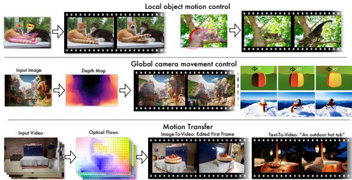
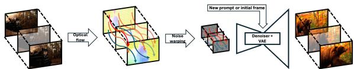
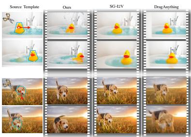
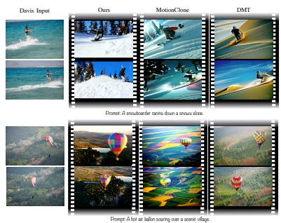
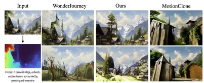
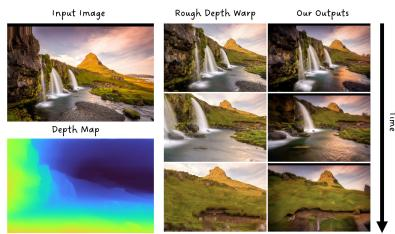
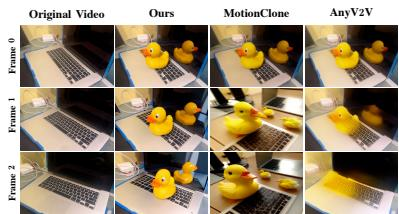

# Go-with-the-Flow: Motion-Controllable Video Diffusion Models Using Real-Time Warped Noise

Ryan Burgert1,3 Yuancheng Xu1,4 Wenqi Xian1 Oliver Pilarski1 Pascal Clausen1 Mingming He1 Li Ma1 Yitong Deng2,5 Lingxiao Li2 Mohsen Mousavi1 Michael Ryoo3 Paul Debevec1 Ning Yu1†

1Netflix Eyeline Studios 2Netflix 3Stony Brook University 4University of Maryland 5Stanford University

https://eyeline-research.github.io/Go-with-the-Flow/

## Abstract

Generative modeling aims to transform random noise into structured outputs. In this work, we enhance video diffusion models by allowing motion control via structured latent noise sampling. This is achieved by just a change in data: we pre-process training videos to yield structured noise. Consequently, our method is agnostic to diffusion model design, requiring no changes to model architectures or training pipelines. Specifically, we propose a novel noise warping algorithm, fast enough to run in real time, that replaces random temporal Gaussianity with correlated warped noise derivedfrom opticalflowfields, while preserving the spatial Gaussianity. The efficiency of our algorithm enables us to fine-tune modern video diffusion base models using warped noise with minimal overhead, and provide a one-stop solution for a wide range of userfriendly motion control: local object motion control, global camera movement control, and motion transfer. The harmonization between temporal coherence and spatial Gaussianity in our warped noise leads to effective motion control while maintaining per-frame pixel quality. Extensive experiments and user studies demonstrate the advantages of our method, making it a robust and scalable approach for controlling motion in video diffusion models. Please see our project webpage; source code and checkpoints are available on GitHub.

## 1. Introduction

“We adore chaos because we love to produce order.” — M. C. Escher, Dutch artist

  
Figure 1. Go-with-the-Flow presents a simple yet effective method for motion-controllable video diffusion models based on optical flow and noise warping. It only requires fine-tuning video diffusion models as a black box using warped noise patterns. Leveraging our models, we can (1) control the motion of individual objects or parts of those objects, (2) direct the camera movement by providing global flow fields corresponding to the desired movements, and (3) transfer the motion from input videos to target contexts.

The essence of generative modeling lies in producing order from chaos, learning to transform random noise from latent space into structured outputs that align with the distribution of training data. In this paper, we propose a novel approach to enhance generative model learning by proactively introducing partial order into latent space sampling.

Our work is motivated by the remarkable progress in video diffusion generative models [3, 4, 6, 14, 15, 60] and the equally significant challenges they face in terms of controllability beyond text and image guidance. Finegrained interactive control over motion dynamics remains an under-explored area due to the intricate spatiotemporal correlations among video frames. The complexity of modern video diffusion architectures [6, 60], which leverage 3D autoencoders [64] and spatiotemporal tokenizers [33], further complicates efforts to adapt models for effective motion control. An ideal format for defining and disentangling motion control from other guidance remains an open question.

Motion-controllable video diffusion model applications typically fall into three categories: (1) local object motion control, represented by object bounding boxes or masks with motion trajectories [12, 24, 36, 42, 45, 54, 56, 59]; (2) global camera movement control, parameterized by camera poses and trajectories [16, 28, 54, 55, 58, 59] or categorized by common directional patterns such as panning and tilting [15, 59]; and (3) motion transfer from reference videos to target contexts specified by prompts or initial frames [1, 13, 27, 32, 35, 53, 61, 62]. However, these approaches share three key limitations: (1) they often necessitate complex modifications to the base model design such as guidance attention [42], limiting compatibility with modern full-attention architectures involving spatiotemporal tokens [60]; (2) they are constrained to specific applications, requiring detailed parameterized motion signals, such as camera parameters, which are challenging to acquire or estimate accurately [67], thus restricting generalizability across diverse scenarios; and (3) they are over-rigid to motion control at the cost of spatiotemporal visual quality.

To address these limitations, we propose a novel and straightforward method to incorporate motion control as a structured component within the chaos of video diffusion’s latent space. We achieve this by correlating the temporal distribution of latent noise. Specifically, starting with a 2D Gaussian noise slice, we temporally concatenate it with warped noise slices, given the optical flow field [49] extracted from a training video sample. Fig. 2 illustrates the diagram of our method. Our approach requires only a change in data: we pre-process training videos to yield warped noise and then fine-tune a video diffusion model. As it occurs solely during noise sampling, our method is agnostic to diffusion model design, requiring no modifications to model architectures or training pipelines. Surprisingly, removing temporal Gaussianity from the noise distribution does not deteriorate model fine-tuning. Instead, it can be quickly adapted after fine-tuning because temporal structure in the chaos of latent space facilitates generative learning and enables motion correspondence. Temporal coherence occurring in the latent space also harmonizes motion control with per-frame pixel quality by inheriting the high-quality prior from the base model.

It is worth noting that video diffusion fine-tuning relies on efficient noise warping algorithms that introduce minimal overhead during data pre-processing and noise sampling. The existing noise warping algorithm, How I Warped Your Noise (HIWYN) [7], that maintains spatial Gaussianity and enables temporal flow warping, however, suffers from the quadratic computation costs w.r.t. frame count, making it much slower than in real time and therefore impractical for large-scale video diffusion model training. To address this, we propose a novel noise warping algorithm that runs fast enough in real time. Rather than warping each frame through a chain of operations from the initial frame, our algorithm iteratively warps noise between consecutive frames. This is achieved by carefully tracking the noise and the flow density along a forward and a backward flow at the pixel level, accounting for both expansion and contraction dynamics, supplemented with conditional white noise sampling from HIWYN Chang et al. [7] to preserve Gaussianity. Algorithm 1 provides further details. We validate the spatial Gaussianity and time complexity of our noisewarping algorithm and apply it to training-free image diffusion models for quantitative and qualitative assessments of controllability and temporal consistency.

During video diffusion inference, our method offers a one-stop solution for diverse motion control applications by adapting noise warping based on motion type. (1) For local object motion, we interactively transform noise elements within object masks given users’ dragging signals. (2) For global camera movement control, we reuse the optical flows from reference videos to warp input noise, and regenerate videos conditioned on different texts or initial frames. (3) For arbitrary motion transfer, the motion representations are not limited to optical flows [49], but also include flows from 3D rendering engines [51], depth warping [63], etc. We validate the effectiveness of our solution across various video generation tasks, demonstrating its ability to preserve motion across different contexts or render distinct motions for the same context. Experiments and user studies indicate the advantages of our solution in pixel quality, motion control, text alignment, temporal consistency, and user preference.

In summary, our contributions include:

(1) A novel and simple one-stop solution for motioncontrollable video diffusion models, integrating motion control as a flow field for noise warping in latent space sampling, plug-and-play for any video diffusion base models as a black box, and compatible with other types of controls.

(2) An efficient noise warping algorithm that maintains spatial Gaussianity and follows temporal motion flows across frames, facilitating motion-controllable video diffusion model fine-tuning with minimal overhead.

(3) Comprehensive experiments and user studies demonstrating the overall advantageous pixel quality, controllability, temporal consistency, and subjective preference of our method on diverse motion control applications including local object motion control, motion transfer to new contexts, and reference-based global camera movement control.

## 2. Related work

## 2.1. Image and video diffusion models

A natural extension of image generation [18, 19, 26, 37, 39, 44, 46–48] use cases is to cover the temporal dimension for video generation. A common approach is frame-by-frame generation using fixed weights, often resulting in flicker or drift. HIWYN [7] addresses this via noise warping, introducing temporally-correlated latent noise based on optical flow, though at the cost of spatial Gaussianity and speed. We propose a novel warped noise sampling algorithm that preserves spatial Gaussianity and runs in real time. Applied to training-free models like DifFRelight [17] and Deep-Floyd IF [48], our method improves temporal consistency in relighting and super-resolution.

Training full video diffusion models offers higher quality [3, 4, 6, 8, 15, 41, 57, 60]. AnimateDiff [15] fine-tunes temporal attention layers atop image models. CogVideoX [60], a leading open-source model, combines spatial-temporal encoding via 3D causal VAEs [64] and diffusion transformers [38]. We incorporate our warped noise sampling into both CogVideoX and AnimateDiff to enable motion-controllable fine-tuning, showcasing modelagnostic applicability.

## 2.2. Motion controllable video generation

Motion control enhances video diffusion beyond text [15, 60] and image conditioning [14, 57, 69], enabling finegrained spatiotemporal guidance. Existing work follows three main directions:

First, local object motion control uses masks or boxes with trajectories [12, 24, 36, 42, 45, 54, 56, 59]. DragAnything [56] manipulates object motion in images without retraining; SG-I2V [36] synthesizes motion from single images. Our method is plug-and-play, treating models as black boxes while using synthetic flows to densify motion at the pixel level.

Second, global camera control involves camera trajectories [16, 28, 54, 55, 58, 59] or learned directional priors [15, 21, 59, 65, 66]. Unlike supervised camera modules, our method generalizes new camera movements from reference videos without collecting pose annotations.

Lastly, motion transfer adapts motion from reference videos [1, 13, 27, 32, 35, 53, 61, 62]. DiffusionMotion-Transfer [61] preserves layout and motion fidelity; Motion-Clone [32] encodes motion with temporal attention. Using them as motion transfer baselines, we demonstrate our model’s flexibility in combining reference geometries with target text guidance.

## 3. Method

Go-with-the-Flow is comprised of two separate parts: our noise warping algorithm and video diffusion fine-tuning. The noise warping algorithm operates independently from the diffusion model training process: we use the noise patterns it produces to train the diffusion model. Our motion control is based entirely on noise initializations, introducing no extra parameters to the video diffusion model.

  
Figure 2. Our method consists of three components: flow field extraction, real-time noise warping, and diffusion model finetuning/inference. During fine-tuning, we use the original captions of video samples. At inference, our method enables adaptation of reference motion to various prompts and/or initial frames.

Inspired by the existing noise warping algorithm HI-WYN [7], which introduced noise warping for image diffusion models, we introduce a new use case for the warped noise: we use it as a form of motion conditioning for video generation models. After fine-tuning a video diffusion model on a large corpus of videos paired with warped noise, we can control the motion of videos at inference time.

## 3.1. Go-with-the-Flow noise warping

## 3.1.1 Algorithm

To facilitate the large-scale noise warping required by this new use case, we introduce a fast noise warping algorithm (Algorithm 1) that warps noise frame-by-frame, storing just the previous frame’s noise (with dimensions $H \times W \times C .$ where H is height, W is width, and C is the number of channels) and a matrix of per-pixel flow density values (with dimensions $H \times W )$ The density values indicate how much noise has been compressed into a given region. Unlike HIWYN [7] which requires time-consuming polygon rasterization and upsampling of each pixel, our algorithm directly tracks the necessary expansion and contraction between frames according to the optical flow and uses only pixel-level operations that are easily parallelizable. We show that our algorithm retains the same Gaussianity guarantee as HIWYN [7] (Proposition 1).

Next-frame noise warping. Our noise warping algorithm calculates noise iteratively, where the noise for a given frame depends only on the state of the previous frame.

Let $H \times W$ be the dimensions of each video frame. Let $D = [ H ] \times [ W ]$ denote a 2D matrix with height H and width W, where we use the notation $[ n ] : = 1 , \ldots , n$ . Given the previous frame’s noise1 $q \in \mathbb { R } ^ { D }$ and the flow density $\boldsymbol { p } \in \mathbb { R } ^ { D }$ together with forward and backward $\mathsf { f l o w s } ^ { 2 } \ f , f ^ { \prime }$ $D \to \mathbb { N } ^ { 2 }$ , our algorithm computes the next-frame noise and density $q ^ { \prime } , p ^ { \prime } \in \mathbf { \mathbb { R } } ^ { D }$ such that $q ^ { \prime }$ (resp. $p ^ { \prime } )$ is temporally correlated with q (resp. p) via the flows.

At a high level, our algorithm (in Algorithm 1) combines two types of dynamics: expansion and contraction. In the case of expansion, such as when a region of the video zooms in or an object moves towards the camera, one noise pixel is mapped to one or more noise pixels in the next frame (hence it “expands”). In the case of contraction, we adopt the Lagrangian fluid dynamics viewpoint of treating noise pixels as particles moving along the forward flow $f .$ This often leaves gaps that need to be filled. Hence, for regions not reached when flowing along $f ,$ we use the backward flow $f ^ { \prime }$ to pull back a noise pixel. That gap is filled with noise calculated with the expansion case.

Additionally, to preserve the distribution correctly over long time periods, we use density values to keep track of how many noise pixels were aggregated into a given region, so that when mixed with other nearby particles in the contraction case, these higher density particles have a larger weight. This is illustrated in Fig. 8.

We unify both expansion and contraction cases by building a bipartite graph G where edges represent how noise and density should be transferred from the previous frame to the next. When aggregating the influence from graph edges to form the next-frame noise $q ^ { \prime } ,$ we scale the noise in accordance with the flow density to ensure the preservation of the original frame’s distribution, as detailed in Algorithm 1. The expansion and contraction cases are calculated in tandem to prevent any cross-correlation, guaranteeing the output will be perfectly Gaussian.

## 3.1.2 Theoretical analysis

Proposition 1 (Preservation of Gaussian white noise). If the pixels of the previous-frame noise q in Algorithm 1 are i.i.d. standard Gaussians, then the output next-frame noise $q ^ { \prime }$ also has i.i.d. standard Gaussian pixels. Please check the appendix for a formal mathematical proof.

Proposition 2 (Time Complexity). For a given frame, the time complexity of this algorithm is $O ( D )$ , linear time with respect to the number of noise pixels processed. Proof: There are only two cases - contraction and expansion. Because each previous-frame pixel can only be contracted to one current-frame pixel, and during expansion each current-frame pixel can only be mapped to one previousframe pixel, the total number of edges E will never exceed 2D.

## 3.2. Training-free image diffusion models with warped noise

As shown by Chang et al. [7] and Deng et al. [10], noise warping can be combined with image diffusion models to yield temporally consistent video edits without training. To do this, we first take an input video and calculate its optical flows using RAFT [49]. Then, with Algorithm 1, we use the flow fields to create sequences of Gaussian noise for each frame in the input video, ensuring that the noise moves along the flow fields. These noises are used during the perframe diffusion processes in place of what would normally be temporally independently sampled Gaussian noise. This enables temporally consistent inference for video tasks, such as relighting [17] and super-resolution [48], using image-based diffusion models.

## 3.3. Fine-tuning video diffusion models with warped noise

We use warped noise to condition a video diffusion model on optical flow. In particular, we fine-tune two variants of a latent video diffusion model CogVideoX [60], both the text-to-video (T2V) and image-to-video (I2V) variants. We regard CogVideoX as a black box without changing its architecture.

We use the same training objective as in normal finetuning, i.e., the mean squared loss between denoised samples and samples with noise added. In fact, we use the exact same training pipeline as the original CogVideoX repository, with exactly one difference: during training, we use warped noise instead of regular Gaussian noise. For each training video, we calculate its optical flow for each frame, and create a warped noise tensor $\mathbf { \bar { Q } } \in \mathbb { R } ^ { F \times C \times H \times W }$ , where $F , C , H , W$ are the number of frames, the number of channels, the height and width of encoded video samples respectively by applying our algorithm iteratively.

We also introduce the concept of noise degradation, which lets us control the strength of our motion conditioning at inference time. After calculating the clean warped noise, we then degrade it by a random degradation level $\gamma \in \ [ 0 , 1 ]$ , by first sampling uncorrelated gaussian noise $\zeta ~ \sim ~ \mathcal { N } ( 0 , 1 )$ and modifying the warped noise ${ \textbf { Q } } $ $\frac { ( 1 - \gamma ) \mathbf { Q } + \zeta \gamma } { \sqrt { ( 1 - \gamma ) ^ { 2 } + \gamma ^ { 2 } } }$ . As degradation level $\gamma  1 , \mathbf { Q }$ approaches an uncorrelated Gaussian, and as $\gamma  0 , \mathbf { Q }$ approaches clean warped noise. At inference, the user can control how strictly the resulting video should adhere to the input flow. Please see Fig. 10 for a qualitative depiction of $\gamma .$

In practice, because the diffusion model works on latent embeddings, we calculate the optical flow and warped noise in image space and then downsample that noise into latent space, which in the case of CogVideoX means downscaling by a factor of $8 \times 8$ spatially and 4 temporally. We use nearest-neighbor interpolation along the temporal axis and mean-pooling along the two spatial axes, which are then multiplied by 8 to preserve unit variance.

## 3.4. Video diffusion inference with warped noise

At inference, we generate warped noise from an input video to guide the motion of the output video. Then, using a deterministic sampling process such as DDIM [46], we use that warped noise to initialize the diffusion process of our fine-tuned video diffusion model. This method of control is much simpler than other motion control methods, as it does not require any changes to the diffusion pipeline or architecture - using exactly the same amount of memory and runtime as the base model.

In the case of local object motion control, we allow the user to specify object movements through a simple user interface as shown in Fig. 3. It is used to generate synthetic optical flows, where multiple layers of polygons are overlaid on an image. Then, these polygons are translated, rotated and scaled with paths defined by the user. We warp the noise accordingly, and use that noise to initialize the diffusion process, along with a text prompt, and in the case of the image-to-video model, a given first frame image. By controlling the extent to which the output video follows these polygons, users can simulate camera movement by shifting the background, or even 3D motion effects by overlaying two polygons in parallax and moving them at different speeds. We find that this motion control representation is quite robust to user error, where even if the polygon only roughly matches the object or area of interest it will still produce high quality results. For local object motion, we typically use a degradation value γ between 0.5 and 0.7, depending on the level of motion precision the user desires, which is a higher level than we would normally use for motion transfer.

The case of motion transfer and camera motion control are very similar – the only difference is the source of the flows used to generate the warped noise. In the case of motion transfer, we calculate the optical flow of a driving video, get warped noises that match the motion. Like in local object motion control, we use that warped noise to initialize a diffusion process. In the case of motion transfer, we typically use a lower degradation value γ between 0.2 and 0.5, as we usually want the output video’s motion to match the driving video’s motion as closely as possible.

## 4. Experiments

## 4.1. Gaussianity

Evaluation metrics. Validating the preservation of spatial i.i.d. Gaussianity, we follow the evaluation protocol outlined by InfRes [10]. Specifically, we use Moran’s I to measure the spatial correlation of warped noise and the Kolmogorov-Smirnov (K-S) test to assess normality.

Baselines. Following HIWYN [7], we choose fixed per frame and independently sampled noise as oracle baselines for perfect spatial Gaussianity but zero temporal correlation. We choose bilinear, bicubic, and nearest neighbor temporal interpolation as oracle baselines for sufficient temporal correlation but no spatial Gaussianity. We also compare withrecent noise warping algorithms including HIWYN [7] and InfRes [10]. In line with these papers, we also include baselines Preserve Your Own Correlation (PYoCo) [11] and Control-A-Video (CaV) [9], which have perfect Gaussianity but zero and poor temporal correlation, respectively.

Table 1. Noise warping algorithm benchmarking in terms of Gaussianity, efficiency, and spatial quality and temporal consistency for two image diffusion based applications. ⇑/⇓ indicates a higher/lower value is better.
<table><tr><td rowspan="2"></td><td colspan="3">Noise w/o warping</td><td colspan="6">Noise warping method</td></tr><tr><td>Fixed</td><td>Random</td><td>Bilinear</td><td>Bicubic Nearest</td><td>PYoCo</td><td>CaV</td><td>HIWYN</td><td>InfRes</td><td>Ours</td></tr><tr><td colspan="10">Gaussianity</td></tr><tr><td>Moran&#x27;s I (index) ↓</td><td>-0.00027</td><td>0.00019</td><td>0.30</td><td>0.24</td><td>0.26</td><td>0.00023</td><td>-0.00079</td><td>0.0011</td><td>0.00036</td><td>0.00014</td></tr><tr><td>Moran&#x27;s I (p-value) 介</td><td>0.29</td><td>0.36</td><td>0.0</td><td>0.0</td><td>0.0</td><td>0.73</td><td>0.25</td><td>0.11</td><td>0.60</td><td>0.84</td></tr><tr><td>K-S Test (index) ↓</td><td>0.089</td><td>0.075</td><td>0.34</td><td>0.37</td><td>0.17</td><td>0.13</td><td>0.073</td><td>0.062</td><td>0.055</td><td>0.060</td></tr><tr><td>K-S Test (p-value) 介</td><td>0.12</td><td>0.19</td><td>0.0005</td><td>0.0004</td><td>0.04</td><td>0.08</td><td>0.27</td><td>0.42</td><td>0.50</td><td>0.44</td></tr><tr><td></td><td></td><td></td><td colspan="8">Efficiency at 1024× 1024 resolution</td></tr><tr><td>GPU time (ms) ↓</td><td>&lt; 1</td><td>&lt; 1</td><td>4.41 4.33</td><td></td><td>6.82</td><td>3.54</td><td>2.31</td><td>55.2</td><td>2.61</td><td>2.14</td></tr><tr><td colspan="10">Super-resolution - DeepFloyd IF</td></tr><tr><td>LPIPS ↓</td><td>0.29</td><td>0.29</td><td>0.60</td><td>0.62</td><td>0.55</td><td>0.28</td><td>0.28</td><td>0.29</td><td>0.28</td><td>0.29</td></tr><tr><td>SSIM介</td><td>0.88</td><td>0.88</td><td>0.72</td><td>0.70</td><td>0.65</td><td>0.88</td><td>0.88</td><td>0.87</td><td>0.88</td><td>0.88</td></tr><tr><td>PSNR介</td><td>29.36</td><td>29.41</td><td>28.68</td><td>28.55</td><td>28.59</td><td>29.40</td><td>29.39</td><td>29.31</td><td>29.38</td><td>29.39</td></tr><tr><td>Warping error ↓</td><td>163.84</td><td>233.65</td><td>165.90</td><td>167.95</td><td>244.72</td><td>186.63</td><td>220.28</td><td>164.35</td><td>190.82</td><td>152.04</td></tr><tr><td colspan="10">Relighting - DifFRelight</td></tr><tr><td>LPIPS ↓</td><td>0.33</td><td>0.31</td><td>0.40</td><td>0.41</td><td>0.73</td><td>0.35</td><td>0.35</td><td>0.36</td><td>0.35</td><td>0.33</td></tr><tr><td>SSIM介</td><td>0.69</td><td>0.77</td><td>0.73</td><td>0.70</td><td>0.38</td><td>0.58</td><td>0.67</td><td>0.64</td><td>0.60</td><td>0.70</td></tr><tr><td>PSNR介</td><td>28.91</td><td>29.02</td><td>28.87</td><td>28.82</td><td>28.21</td><td>28.83</td><td>28.87</td><td>28.82</td><td>28.81</td><td>28.92</td></tr><tr><td>Warping error ↓</td><td>86.65</td><td>128.11</td><td>47.53</td><td>43.57</td><td>164.42</td><td>95.24</td><td>106.77</td><td>87.72</td><td>87.97</td><td>85.82</td></tr></table>

Results. According to Tab. 1 1st section, we observe:

(1) For Moran’s I, a value close to 0 indicates no spatial cross-correlation, which is desirable for i.i.d. noise. Our method achieves a Moran’s I index of 0.00014 and a high p-value of 0.84, indicating strong evidence for no spatial autocorrelation. Similarly low Moran’s I values and high pvalues are observed for PYoCo, CaV, HIWYN and InfRes, because they also aim to generate spatially gaussian outputs.

(2) The K-S test compares the empirical distribution of the warped noise to a standard normal distribution. A small K-S statistic and a high p-value indicate the two distributions are similar. Our method obtains a K-S statistic of 0.060 and p-value of 0.44, suggesting the warped noise follows a normal distribution. Comparable results are seen for the other Gaussianity-preserving methods.

(3) In contrast, the bilinear, bicubic, and nearest neighbor warping methods fail to maintain Gaussianity, exhibiting Moran’s I values an order of magnitude higher (0.24 to 0.30) with p-values of 0.0, and K-S statistics 3-6 times larger (0.17 to 0.37) with very low p-values (<0.05). These results provide strong evidence for the presence of spatial autocorrelation and deviation from normality in the warped noise from these interpolation-based methods.

## 4.2. Efficiency

Noise generation efficiency is measured by wall time profiling on an NVIDIA A100 40GB GPU, generating noise at a resolution of 1024×1024 pixels. We compare with the same baselines as above. According to Tab. 1 2nd section, our method runs faster than the concurrent InfRes and significantly outperforms the most recent published baseline HIWYN by 26×, due to our algorithm’s linear time complexity. The efficiency is one order of magnitude faster than real time, validating our feasibility to apply noise warping on the fly during video diffusion model fine-tuning.

## 4.3. Video editing via image diffusion

To further validate the effectiveness of our noise warping algorithm, we repurpose off-the-shelf image-to-image diffusion models to perform video-to-video editing tasks in a frame-by-frame manner, without training. Noise is warped using our algorithm and the above baselines based on the RAFT optical flow [49] from input video and fed to two image pre-trained diffusion models: DeepFloyd IF [48] for super-resolution and DifFRelight [17] for portrait relighting. By measuring the quality and temporal consistency of the output video, we can effectively evaluate the spatial Gaussianity and temporal consistency of different noise warping algorithms.

Evaluation metrics. We use LPIPS [68], SSIM [20], and PSNR [20] to measure the quality of the output frames w.r.t. ground truth frames. We use warping error [29] to measure temporal consistency (mean square error) between two adjacent generated frames after flow warping.

## 4.3.1 DeepFloyd IF video super-resolution

We evaluate noise warping on DeepFloyd IF [48] superresolution using 43 videos from the DAVIS dataset [40]. The videos were downsampled to the 64×64 and superresolved to 256×256.

Results. According to Tab. 1 3rd section, our algorithm outperforms all the baselines in terms of temporal consistency (warping error). Our supplementary video also shows that our algorithm is more stable for the foreground, background, and edges, in contrast to InfRes which is often unstable in the background and HIWNY which is much less stable around moving edges. Our algorithm is comparable to other methods in PSNR, SSIM, and LPIPS image quality metrics, apart from the bilinear, bicubic, and nearest methods which result in low quality generation due to spatial non-Gaussianity. See Fig. 12 in the supplementary material for more details.

## 4.3.2 DifFRelight video relighting

We evaluate noise warping on DifFRelight [17] portrait video relighting using their own dataset, which includes 4 subjects in 4 scenarios: a 180-degree view animation, a 720-degree view animation, a zigzag camera movement sequence, and an interpolating camera path through several fixed stage capture positions, all with fixed lighting conditions. During inference, we center crop a 1024×1024 region out of a 1080×1920 Gaussian splat rendering and infer with various noises using conditioned lighting.

Results. According to Tab. 1 4th section, throughout all baseline comparisons, our algorithm shows consistently advantageous scores in both image and temporal metrics, validating its fundamental benefits to the image diffusion model. Although our visual results at first glance are comparable to HIWYN and InfRes in the supplementary Fig. 13 and our webpage, its visual improvements can be seen in the beard regions and skin reflections. We also notice quite low warping error values on the bilinear and bicubic noise inferences, likely coming from the long blurry streaks generated along the flow, while at the same time image quality deteriorates significantly.

  
Figure 3. Qualitative comparisons of local object motion control. Zoom in for details. The user selects any number of polygons, then scales, rotates, or translates them along arbitrary paths, which are then used to create the warped noise flow.

## 4.4. Video diffusion with motion control

## 4.4.1 Local object motion control

We introduce a novel method for controlling object motion, by leveraging the flows of input templates. These templates include user-defined local region masks and cut-and-drag trajectories allowing users to specify motion of one or more objects built with an intuitive UI (Fig. 3), and synthetic flows of a camera rotating around 3D objects (Fig. 9).

During inference, we use the precise flow computed from the input template frames to guide noise warping for video generation. This enables our I2V model to apply accurate, localized movements and adjustments to the input image while preserving object structure and faithfully following the intended motion trajectory. We also provide quantitative benchmarks. Following [36], we use the VIPSeg [34] to benchmark our method on local object motion control, as well as the 40 videos from our user study.

Baselines. We evaluate our video generation model against five state-of-the-art baselines, SG-I2V [36], Motion-Clone [32], DragAnything [56], to benchmark its ability to accurately control object and camera movements derived from a given input template. One of the most recent works, SG-I2V, is an I2V model for object motion transfer guided by bounding box trajectories. We adapt our user-defined polygons to bounding boxes as its input.

Results. From Fig. 3, Fig. 9, Tab. 2, and our webpage, we observe: (1) Existing methods struggle to handle complex, localized object motions. Specifically, when specifying local adjustments, such as rotating a dog’s head while keeping the rest of the body static, these methods often fail, applying unnatural translational or global transformations to the entire object. (2) We find that SG-I2V frequently misinterprets object-specific movements as global camera shifts, resulting in scene-wide translations rather than accurate object manipulations. (3) DragAnything, which employs single-line trajectory control, lacks temporal and 3D consistency, leading to significant distortions and reduced fidelity in complex motion scenarios. (4) MotionClone also fails to capture subtle object dynamics, as it relies on sparse temporal attention for motion guidance and is likely limited by the low spatial resolution of its diffusion features. (5) Qualitatively, our model outperforms these baselines by maintaining high object fidelity and 3D consistency, even in scenarios with intricate or overlapping motions. Notably, our approach preserves object integrity and introduces plausible physical interactions, such as generating realistic splashes when moving a duck within a tub. Extensive user studies and quantitative evaluations validate our superior performance in motion consistency, visual fidelity, and overall realism.

(6) Our quantitative evaluation matches our qualitative observations. On both VIPSeg and the 40 videos from our user-study, our method outperforms all the training-based and training-free baselines.

User study. We conducted a comprehensive user study with 40 participants, asking them to evaluate and rate different methods based on their effectiveness in object motion control and maintaining 3D and temporal consistency. Our method stands out significantly, achieving a win percentage of 82% for cut-and-draglocal object motion control like Fig. 3 and 90% for the turnable camera movement control like Fig. 9. The three baselines have substantially lower performance levels. More user study details are included in the supplementary material Sec. 6.3 and Fig. 15.

## 4.4.2 Motion transfer and camera movement control

Our method also supports motion transfer and camera movement control, working with both T2V and I2V video diffusion models. By using reference videos and applying noise warping based on their optical flows, it can effectively capture and transfer complex motions.

Datasets. We choose the DAVIS video dataset [40] containing 43 videos of general object motion with ground truth object segmentation annotations, a random subset of 100 videos from the DL3DV dataset [31], and 19 videos generated with WonderJourney [63] that mostly feature camera movements (Fig. 5), which itself uses depth-warping.

Evaluation metrics. For pixel quality, we calculate Frechet´ Inception Distance (FID) between a set of real and generated frames. For motion controllability, we calculate (1) the mean Interaction over Union (mIoU) of CoTracker’s tracking bounding boxes [25] between ground-truth and generated videos, and (2) the pixel MSE between ground-truth and generated videos, considering an I2V diffusion model is conditioned on ground-truth prompts, ground-truth initial frames, and ground-truth motion trajectories/flows. For text controllability, we calculate the cosine similarity between the prompt’s CLIP [43] text embedding and the generated frames’ CLIP image embeddings, and average over frames of a generated video. For temporal consistency, we calculate (1) the cosine similarity of the CLIP image embeddings between two consecutive generated frames and average over all pairs in a generated video, and (2) the Frechet´ Video Distance (FVD) [50] between a set of real and generate videos. In addition, we also benchmark on four metrics of VBench [23], specifically for the temporal consistency/smoothness dimension.

Baselines. For the motion transfer T2V scenario, we compare with the recent state-of-the-art methods Diffusion Motion Transfer (DMT) [61], MotionClone [32], and MotionCtrl [54]. For the motion transfer I2V, we compare Motion-Clone and ImageConductor [30]) as DMT does not take an image as input.

In addition, we demonstrate video first-frame editing, a challenge where a user starts with an original video and an edited version of its initial frame. The goal is to seamlessly propagate the edits made to the first frame throughout the entire video while preserving the original motion. We qualitatively compare with MotionClone [32] and the state-ofthe-art video editing method AnyV2V [27] on real videos with photoshopped first frames.

We also source a few images for image-based depth warping, where we take an image, use a monocular depth estimator, DepthPro [5], to get a depth map, and crudely warp it to simulate a desired camera trajectory.

Results. We present qualitative and quantitative comparisons with baselines in Tab. 2, Fig. 4, Fig. 5, Fig. 6, Fig. 7, and our webpage. We observe:

(1) Our superior object motion transfer: On the DAVIS dataset, which includes object motion along with some degree of camera movement, our method demonstrates improved motion fidelity and overall video quality, as measured by Vbench. In particular, in the I2V setting, where both the initial frame and the source video are provided, our method achieves significantly better scores in FID, FVD, and motion metrics, indicating much closer reconstructions of the ground truth videos.

(2) Our superior camera movement control: On the DL3DV and WonderJourney datasets, which involve substantial camera movement, our method notably outperforms MotionClone in both motion fidelity and general video quality. This highlights our method’s ability to effectively replicate intricate camera movements while maintaining visual coherence. For our depth-warping example Fig. 6, our results are far better than simply warping an image from its depth map, resulting in a smooth, realistic camera trajectory. See our webpage for videos.

(3) Our superior video first-frame editing: In Fig. 7, our method seamlessly integrates the added object into the scene while accurately preserving the camera movement from the original video. In contrast, both baselines exhibit significant identity loss: MotionClone generates additional, unintended objects, and in AnyV2V, the foreground object gradually disappears. This demonstrates the superiority of our method in maintaining the original video’s motion while preserving the identity of the object added to the first frame.

Figure 4. Qualitative comparisons of motion transfer T2V on the DAVIS dataset.  

Figure 5. We apply our method to depth-warped frames, enabling 3D scene generation from a single image, using WonderJourney results.  

Figure 6. 3D scene exploration using DepthPro for depth estimation, creating warped video and noise, which feeds into our motion-conditioned I2V model.  
  
Figure 7. Comparison of initial frame video editing results across different methods. All methods start with the same edited initial frame derived from the original video.

## 4.4.3 Ablation studies

In Tab. 2 for the DAVIS I2V task, we compare our method with a variant that excludes motion conditioning using warped noise (“Original CogVideoX-5B”), relying solely on textual prompts describing the objects. We observe: (1) Better video reconstruction: Our method, which incorporates motion conditioning, achieves superior FID, FVD, and CoTracker mIoU scores, indicating more accurate reconstruction of the source video. This is because textual prompts and the initial frame alone are insufficient to capture a video’s future dynamics, whereas incorporating real video-derived motion guidance enables the generation of more realistic sequences. (2) Improved video quality: By utilizing warped noise for motion conditioning, our approach not only maintains but also enhances overall video quality, as measured by Vbench, demonstrating that integrating realistic motion cues improves the plausibility of the generated videos without compromising quality.

Table 2. Quantitative comparisons of motion transfer. ⇑/⇓ indi cates a higher/lower value is better. Bold indicates the best results. Gray background rows indicate our final model. Dashed lines separate ablation study from baseline benchmarking.
<table><tr><td rowspan="2"></td><td rowspan="2">Train free?</td><td rowspan="2">FID</td><td rowspan="2">CoTrck. mIoU</td><td rowspan="2">Opt. flow err. ↓</td><td rowspan="2">Pixel MSE</td><td rowspan="2">CLIP text</td><td rowspan="2">CLIP img.</td><td rowspan="2">FVD ×103</td><td rowspan="2">Subj.</td><td colspan="3">VBench介</td></tr><tr><td>Bg. cons.</td><td>Motion smooth</td><td>Temp. flicker</td></tr><tr><td colspan="10">↓ 介 ↓ 介 Local object motion control on VIPSeg</td><td rowspan="3"></td></tr><tr><td></td><td></td><td></td><td></td><td>0.48</td><td></td><td></td><td></td><td></td><td></td><td></td><td></td></tr><tr><td>MotionClone</td><td>√</td><td>85.2</td><td>0.71 0.63</td><td>0.84</td><td>0.086 0.065</td><td>0.31</td><td>0.95</td><td>1.26</td><td>0.88</td><td>0.85</td><td>0.94 0.90</td></tr><tr><td>SG-I2V Ours</td><td>√ X</td><td>61.4 41.1</td><td>0.75</td><td>0.36</td><td>0.039</td><td>0.31 0.32</td><td>0.97 0.98</td><td>1.06 0.47</td><td>0.93 0.91</td><td>0.95 0.92</td><td>0.96 0.97</td><td>0.94 0.95</td></tr><tr><td></td><td colspan="10"></td></tr><tr><td></td><td></td><td></td><td></td><td></td><td></td><td></td><td></td><td></td><td></td><td>Local object motion control on our 40 samples in the user study</td><td></td><td>0.95</td></tr><tr><td>MotionClone SG-I2V</td><td>√</td><td>96.6 79.9</td><td></td><td>0.80 0.64</td><td>0.048 0.042</td><td>0.33 0.32</td><td>0.98</td><td>1.38</td><td>0.86</td><td>0.93</td><td>0.97 0.98</td><td>0.94</td></tr><tr><td>DragAnything</td><td>√ X</td><td>82.8</td><td></td><td>0.62</td><td>0.047</td><td>0.31</td><td>0.98 0.97</td><td>1.27 1.30</td><td>0.95 0.93</td><td>0.95 0.95</td><td>0.98</td><td>0.95</td></tr><tr><td>Ours</td><td>x</td><td>74.3</td><td></td><td>0.56</td><td>0.028</td><td>0.32</td><td>0.98</td><td>0.94</td><td>0.96</td><td>0.95</td><td>0.98</td><td>0.96</td></tr><tr><td></td><td></td><td colspan="10"></td></tr><tr><td>DMT</td><td>√</td><td></td><td>0.85</td><td>0.28</td><td></td><td>Motion transfer T2V on DAVIS 0.31</td><td>0.95</td><td></td><td>0.86</td><td>0.92</td><td>0.94</td><td>0.91</td></tr><tr><td>MotionClone</td><td>√</td><td></td><td>0.75</td><td>0.38</td><td></td><td>0.32</td><td>0.93</td><td></td><td>0.78</td><td>0.89</td><td>0.86</td><td>0.81</td></tr><tr><td>MotionCtrl</td><td>×</td><td></td><td>0.47</td><td>0.85</td><td></td><td>0.32</td><td>0.97</td><td></td><td>0.97</td><td>0.93</td><td>0.98</td><td>0.92</td></tr><tr><td>Ours</td><td>X</td><td></td><td>0.70</td><td>0.41</td><td></td><td>0.33</td><td>0.98</td><td></td><td>0.88</td><td>0.93</td><td>0.97</td><td>0.89</td></tr><tr><td>Ours-CogVX-2B</td><td>×</td><td></td><td>0.64</td><td>0.48</td><td></td><td>0.32</td><td>0.95</td><td></td><td>0.89</td><td>0.9ī</td><td>0.97</td><td>0.90</td></tr><tr><td></td><td></td><td colspan="10"></td></tr><tr><td>MotionClone</td><td>√</td><td>99.4</td><td>0.72</td><td>0.42</td><td>0.068</td><td>0.31</td><td>Motion transfer I2V on DAVIS 0.94</td><td>1.84</td><td>0.75</td><td>0.85</td><td>0.92</td><td>0.87</td></tr><tr><td>ImageConductor</td><td>X</td><td>104.6</td><td>0.66</td><td>0.64</td><td>0.072</td><td>0.31</td><td>0.93</td><td>1.58</td><td>0.77</td><td>0.88</td><td>0.93</td><td>0.90</td></tr><tr><td>Orig. CogVX-5B</td><td>√</td><td>76.62</td><td>0.52</td><td>0.67</td><td>0.088</td><td>0.31</td><td>0.96</td><td>1.36</td><td>0.85</td><td>0.91</td><td>0.96</td><td>0.92</td></tr><tr><td>Ours (γ = 0.5)</td><td>×</td><td>78.6</td><td>0.74</td><td>0.36</td><td>0.053</td><td>0.31</td><td>0.97</td><td>1.21</td><td>0.88</td><td>0.92</td><td>0.98</td><td>0.93</td></tr><tr><td>Our (γ = 0.9)</td><td>×</td><td>92.5</td><td>0.50</td><td>0.65</td><td>0.072</td><td>0.31</td><td>0.95</td><td>1.59</td><td>0.80</td><td>0.89</td><td>0.94</td><td>0.91</td></tr><tr><td>Our (γ = 0.8)</td><td>X</td><td>80.6</td><td>0.68</td><td>0.47</td><td>0.067</td><td>0.31</td><td>0.96</td><td>1.50</td><td>0.85</td><td>0.91</td><td>0.96</td><td>0.92</td></tr><tr><td>Our (γ = 0.4)</td><td>×</td><td>77.7</td><td>0.74</td><td>0.36</td><td>0.056</td><td>0.31</td><td>0.97</td><td>1.27</td><td>0.87</td><td>0.91</td><td>0.97</td><td>0.93</td></tr><tr><td>Our (γ = 0.2)</td><td>×i×</td><td>77.1</td><td>0.74</td><td>0.37</td><td>0.058</td><td>0.32</td><td>0.97</td><td>1.29</td><td>0.86</td><td>0.91</td><td>0.97</td><td>0.93</td></tr><tr><td>Our (33% data)</td><td></td><td>100.1</td><td>0.73</td><td>0.40</td><td>0.066</td><td>0.31</td><td>0.97</td><td>1.46</td><td>0.85</td><td>0.90</td><td>0.97</td><td>0.92</td></tr><tr><td>Our (12.5% data)</td><td>X</td><td>105.2 0.71</td><td>0.39</td><td>0.072</td><td></td><td>0.31</td><td>0.96</td><td>1.93</td><td>0.84</td><td>0.89</td><td>0.97</td><td>0.91</td></tr><tr><td></td><td colspan="10">Camera movement transfer I2V on DL3DV</td><td></td><td></td></tr><tr><td>MotionClone</td><td>√</td><td>82.7</td><td>0.71</td><td>0.44</td><td>0.104</td><td>0.33</td><td>0.94</td><td>1.11</td><td>0.74</td><td>0.85</td><td>0.91</td><td>0.86</td></tr><tr><td>ImageConductor</td><td>X</td><td>89.2</td><td>0.61</td><td>0.78</td><td>0.068</td><td>0.31</td><td>0.95</td><td>0.91</td><td>0.85</td><td>0.90</td><td>0.95</td><td>0.93</td></tr><tr><td>Ours</td><td>X</td><td>48.4</td><td>0.83</td><td>0.20</td><td>0.046</td><td>0.32</td><td>0.97</td><td>0.34</td><td>0.88</td><td>0.92</td><td>0.97</td><td>0.93</td></tr><tr><td></td><td colspan="10"></td><td></td></tr><tr><td>MotionClone</td><td>√</td><td>177.9</td><td>0.81</td><td>Camera movement transfer I2V on WonderJourney 0.17</td><td>0.103</td><td>0.32</td><td>0.96</td><td>1.93</td><td>0.75</td><td>0.87</td><td>0.93</td><td>0.87</td></tr><tr><td>ImageConductor Ours</td><td>×</td><td>166.1</td><td>0.79</td><td>0.39</td><td>0.085</td><td>0.32</td><td>0.94</td></table>

Further exploring the effects of degradation, we find that as the degradation values γ increase, the motion control becomes tighter - resulting in higher optical flow and CoTracker-mIoU scores, along with a closer per-frame similarity to target videos on the I2V DAVIS task. We find that, in general, γ ≈ 0.5 is a good value for most tasks.

We also perform ablations on dataset size, comparing models trained on different fractions of our dataset: training with a fraction of dataset yields worse performance.

In addition, we perform an ablation where we use the weaker base model CogVideoX-2B, and find its performance is weaker than our main T2V model, based on CogVideoX-5B.

## Acknowledgments

We would like to express our gratitude to Stephan Trojansky and Jeffrey Shapiro for their initial and ongoing executive support; Sebastian Sylwan, Daniel Heckenberg, Jitendra Agarwal, Matheus Leao, and Sungmin Lee for their IT˜ support; Xueming Yu and David George for their hardware support; Jennifer Lao and Lianette Alnaber for their operational support; and Winnie Lin, Ahmet Tasel, Yiqun Mei, Lukas Lepicovsky, Rahul Garg, Ashish Rastogi, Ritwik Kumar, Cornelia Carapcea, and Girish Balakrishnan for their insightful technical discussions.

## References

[1] Luca Savant Aira, Antonio Montanaro, Emanuele Aiello, Diego Valsesia, and Enrico Magli. Motioncraft: Physicsbased zero-shot video generation. In NeurIPS, 2024. 2, 3

[2] Max Bain, Arsha Nagrani, Gul Varol, and Andrew Zisser-¨ man. Frozen in time: A joint video and image encoder for end-to-end retrieval. In ICCV, 2021. 13, 14

[3] Andreas Blattmann, Tim Dockhorn, Sumith Kulal, Daniel Mendelevitch, Maciej Kilian, Dominik Lorenz, Yam Levi, Zion English, Vikram Voleti, Adam Letts, et al. Stable video diffusion: Scaling latent video diffusion models to large datasets. arXiv, 2023. 1, 3

[4] Andreas Blattmann, Robin Rombach, Huan Ling, Tim Dockhorn, Seung Wook Kim, Sanja Fidler, and Karsten Kreis. Align your latents: High-resolution video synthesis with latent diffusion models. In CVPR, 2023. 1, 3

[5] Aleksei Bochkovskii, Amael Delaunoy, Hugo Germain,¨ Marcel Santos, Yichao Zhou, Stephan R. Richter, and Vladlen Koltun. Depth pro: Sharp monocular metric depth in less than a second, 2024. 7

[6] Tim Brooks, Bill Peebles, Connor Holmes, Will DePue, Yufei Guo, Li Jing, David Schnurr, Joe Taylor, Troy Luhman, Eric Luhman, et al. Video generation models as world simulators. 2024. URL https://openai. com/research/videogeneration-models-as-world-simulators, 2024. 1, 3

[7] Pascal Chang, Jingwei Tang, Markus Gross, and Vinicius C Azevedo. How i warped your noise: a temporally-correlated noise prior for diffusion models. In ICLR, 2024. 2, 3, 4, 5, 14, 15

[8] Haoxin Chen, Menghan Xia, Yingqing He, Yong Zhang, Xiaodong Cun, Shaoshu Yang, Jinbo Xing, Yaofang Liu, Qifeng Chen, Xintao Wang, et al. Videocrafter1: Open diffusion models for high-quality video generation. arXiv, 2023. 3

[9] Weifeng Chen, Yatai Ji, Jie Wu, Hefeng Wu, Pan Xie, Jiashi Li, Xin Xia, Xuefeng Xiao, and Liang Lin. Control-a-video: Controllable text-to-video generation with diffusion models. arXiv, 2023. 5

[10] Yitong Deng, Winnie Lin, Lingxiao Li, Dmitriy Smirnov, Ryan Burgert, Ning Yu, Vincent Dedun, and Mohammad H Taghavi. Infinite-resolution integral noise warping for diffusion models. arXiv, 2024. 4, 5

[11] Songwei Ge, Seungjun Nah, Guilin Liu, Tyler Poon, Andrew Tao, Bryan Catanzaro, David Jacobs, Jia-Bin Huang, Ming Yu Liu, and Yogesh Balaji. Preserve your own correlation: A noise prior for video diffusion models. In ICCV, 2023. 5

[12] Daniel Geng, Charles Herrmann, Junhwa Hur, Forrester Cole, Serena Zhang, Tobias Pfaff, Tatiana Lopez-Guevara, Carl Doersch, Yusuf Aytar, Michael Rubinstein, et al. Motion prompting: Controlling video generation with motion trajectories. arXiv, 2024. 2, 3

[13] Michal Geyer, Omer Bar-Tal, Shai Bagon, and Tali Dekel. Tokenflow: Consistent diffusion features for consistent video editing. In ICLR, 2024. 2, 3

[14] Yuwei Guo, Ceyuan Yang, Anyi Rao, Maneesh Agrawala, Dahua Lin, and Bo Dai. Sparsectrl: Adding sparse controls to text-to-video diffusion models. In ECCV, 2024. 1, 3

[15] Yuwei Guo, Ceyuan Yang, Anyi Rao, Zhengyang Liang, Yaohui Wang, Yu Qiao, Maneesh Agrawala, Dahua Lin, and Bo Dai. Animatediff: Animate your personalized text-toimage diffusion models without specific tuning. In ICLR, 2024. 1, 2, 3, 13, 14

[16] Hao He, Yinghao Xu, Yuwei Guo, Gordon Wetzstein, Bo Dai, Hongsheng Li, and Ceyuan Yang. Cameractrl: Enabling camera control for text-to-video generation. arXiv, 2024. 2, 3

[17] Mingming He, Pascal Clausen, Ahmet Levent Tas¸el, Li Ma, Oliver Pilarski, Wenqi Xian, Laszlo Rikker, Xueming Yu, Ryan Burgert, Ning Yu, et al. Diffrelight: Diffusion-based facial performance relighting. In SIGGRAPH Asia, 2024. 3, 4, 6

[18] Jonathan Ho and Tim Salimans. Classifier-free diffusion guidance. arXiv, 2022. 2

[19] Jonathan Ho, Ajay Jain, and Pieter Abbeel. Denoising diffusion probabilistic models. In NeurIPS, 2020. 2

[20] Alain Hore and Djemel Ziou. Image quality metrics: Psnr vs. ssim. In ICPR, 2010. 6

[21] Chen Hou, Guoqiang Wei, Yan Zeng, and Zhibo Chen. Training-free camera control for video generation. arXiv, 2024. 3

[22] Edward J. Hu, Yelong Shen, Phillip Wallis, Zeyuan Allen-Zhu, Yuanzhi Li, Shean Wang, Lu Wang, and Weizhu Chen. Lora: Low-rank adaptation of large language models, 2021. 13

[23] Ziqi Huang, Yinan He, Jiashuo Yu, Fan Zhang, Chenyang Si, Yuming Jiang, Yuanhan Zhang, Tianxing Wu, Qingyang Jin, Nattapol Chanpaisit, et al. Vbench: Comprehensive bench mark suite for video generative models. In CVPR, 2024. 7

[24] Yash Jain, Anshul Nasery, Vibhav Vineet, and Harkirat Behl. Peekaboo: Interactive video generation via masked diffusion. In CVPR, 2024. 2, 3

[25] Nikita Karaev, Ignacio Rocco, Benjamin Graham, Natalia Neverova, Andrea Vedaldi, and Christian Rupprecht. Cotracker: It is better to track together. arXiv, 2023. 7

[26] Tero Karras, Miika Aittala, Timo Aila, and Samuli Laine. Elucidating the design space of diffusion-based generative models. In NeurIPS, 2022. 2

[27] Max Ku, Cong Wei, Weiming Ren, Huan Yang, and Wenhu Chen. Anyv2v: A plug-and-play framework for any videoto-video editing tasks. arXiv, 2024. 2, 3, 7

[28] Zhengfei Kuang, Shengqu Cai, Hao He, Yinghao Xu, Hongsheng Li, Leonidas Guibas, and Gordon Wetzstein. Collaborative video diffusion: Consistent multi-video generation with camera control. arXiv, 2024. 2, 3

[29] Wei-Sheng Lai, Jia-Bin Huang, Oliver Wang, Eli Shechtman, Ersin Yumer, and Ming-Hsuan Yang. Learning blind video temporal consistency. In ECCV, 2018. 6

[30] Yaowei Li, Xintao Wang, Zhaoyang Zhang, Zhouxia Wang, Ziyang Yuan, Liangbin Xie, Yuexian Zou, and Ying Shan. Image conductor: Precision control for interactive video synthesis. arXiv, 2024. 7

[31] Lu Ling, Yichen Sheng, Zhi Tu, Wentian Zhao, Cheng Xin, Kun Wan, Lantao Yu, Qianyu Guo, Zixun Yu, Yawen Lu, et al. Dl3dv-10k: A large-scale scene dataset for deep learning-based 3d vision. In CVPR, 2024. 7

[32] Pengyang Ling, Jiazi Bu, Pan Zhang, Xiaoyi Dong, Yuhang Zang, Tong Wu, Huaian Chen, Jiaqi Wang, and Yi Jin. Motionclone: Training-free motion cloning for controllable video generation. arXiv, 2024. 2, 3, 6, 7

[33] Xin Ma, Yaohui Wang, Gengyun Jia, Xinyuan Chen, Ziwei Liu, Yuan-Fang Li, Cunjian Chen, and Yu Qiao. Latte: Latent diffusion transformer for video generation. arXiv, 2024. 1

[34] Jiaxu Miao, Yunchao Wei, Yu Wu, Chen Liang, Guangrui Li, and Yi Yang. Vspw: A large-scale dataset for video scene parsing in the wild. In CVPR, 2021. 6

[35] Chong Mou, Mingdeng Cao, Xintao Wang, Zhaoyang Zhang, Ying Shan, and Jian Zhang. Revideo: Remake a video with motion and content control. ArXiv, abs/2405.13865, 2024. 2, 3

[36] Koichi Namekata, Sherwin Bahmani, Ziyi Wu, Yash Kant, Igor Gilitschenski, and David B Lindell. Sg-i2v: Self-guided trajectory control in image-to-video generation. arXiv, 2024. 2, 3, 6

[37] Alex Nichol, Prafulla Dhariwal, Aditya Ramesh, Pranav Shyam, Pamela Mishkin, Bob McGrew, Ilya Sutskever, and Mark Chen. Glide: Towards photorealistic image generation and editing with text-guided diffusion models. arXiv, 2021. 2

[38] William Peebles and Saining Xie. Scalable diffusion models with transformers. In ICCV, 2023. 3

[39] Dustin Podell, Zion English, Kyle Lacey, Andreas Blattmann, Tim Dockhorn, Jonas Muller, Joe Penna, and¨ Robin Rombach. Sdxl: Improving latent diffusion models for high-resolution image synthesis. arXiv, 2023. 2

[40] Jordi Pont-Tuset, Federico Perazzi, Sergi Caelles, Pablo Arbelaez, Alex Sorkine-Hornung, and Luc Van Gool. The 2017´ davis challenge on video object segmentation. arXiv, 2017. 6, 7

[41] Zhiwu Qing, Shiwei Zhang, Jiayu Wang, Xiang Wang, Yujie Wei, Yingya Zhang, Changxin Gao, and Nong Sang. Hierarchical spatio-temporal decoupling for text-to-video generation. In CVPR, 2024. 3

[42] Haonan Qiu, Zhaoxi Chen, Zhouxia Wang, Yingqing He, Menghan Xia, and Ziwei Liu. Freetraj: Tuning-free trajectory control in video diffusion models. arXiv, 2024. 2, 3

[43] Alec Radford, Jong Wook Kim, Chris Hallacy, Aditya Ramesh, Gabriel Goh, Sandhini Agarwal, Girish Sastry, Amanda Askell, Pamela Mishkin, Jack Clark, et al. Learning transferable visual models from natural language supervision. In ICML, 2021. 7

[44] Robin Rombach, Andreas Blattmann, Dominik Lorenz, Patrick Esser, and Bjorn Ommer. High-resolution image syn-¨ thesis with latent diffusion models. In CVPR, 2022. 2

[45] Xiaoyu Shi, Zhaoyang Huang, Fu-Yun Wang, Weikang Bian, Dasong Li, Yi Zhang, Manyuan Zhang, Ka Chun Cheung, Simon See, Hongwei Qin, et al. Motion-i2v: Consistent and controllable image-to-video generation with explicit motion modeling. In SIGGRAPH, 2024. 2, 3

[46] Jiaming Song, Chenlin Meng, and Stefano Ermon. Denoising diffusion implicit models. In ICLR, 2021. 2, 4

[47] Yang Song, Jascha Sohl-Dickstein, Diederik P Kingma, Abhishek Kumar, Stefano Ermon, and Ben Poole. Score-based generative modeling through stochastic differential equations. In ICLR, 2021.

[48] StabilityAI. Deepfloyd if. URL https://github.com/deep floyd/IF?tab=readme-ov-file, 2023. 2, 3, 4, 6

[49] Zachary Teed and Jia Deng. Raft: Recurrent all-pairs field transforms for optical flow. In ECCV, 2020. 2, 4, 6

[50] Thomas Unterthiner, Sjoerd Van Steenkiste, Karol Kurach, Raphael Marinier, Marcin Michalski, and Sylvain Gelly. Towards accurate generative models of video: A new metric & challenges. arXiv, 2018. 7

[51] Oliver Villar. Learning Blender. Addison-Wesley Professional, 2021. 2

[52] Weihan Wang, Qingsong Lv, Wenmeng Yu, Wenyi Hong, Ji Qi, Yan Wang, Junhui Ji, Zhuoyi Yang, Lei Zhao, Xixuan Song, Jiazheng Xu, Bin Xu, Juanzi Li, Yuxiao Dong, Ming Ding, and Jie Tang. Cogvlm: Visual expert for pretrained language models. arXiv, 2024. 13

[53] Xiang Wang, Hangjie Yuan, Shiwei Zhang, Dayou Chen, Jiuniu Wang, Yingya Zhang, Yujun Shen, Deli Zhao, and Jingren Zhou. Videocomposer: Compositional video synthesis with motion controllability. In NeurIPS, 2024. 2, 3

[54] Zhouxia Wang, Ziyang Yuan, Xintao Wang, Yaowei Li, Tianshui Chen, Menghan Xia, Ping Luo, and Ying Shan. Motionctrl: A unified and flexible motion controller for video generation. In SIGGRAPH, 2024. 2, 3, 7

[55] Rundi Wu, Ruiqi Gao, Ben Poole, Alex Trevithick, Changxi Zheng, Jonathan T Barron, and Aleksander Holynski. Cat4d: Create anything in 4d with multi-view video diffusion models. arXiv, 2024. 2, 3

[56] Weijia Wu, Zhuang Li, Yuchao Gu, Rui Zhao, Yefei He, David Junhao Zhang, Mike Zheng Shou, Yan Li, Tingting Gao, and Di Zhang. Draganything: Motion control for any thing using entity representation. In ECCV, 2024. 2, 3, 6

[57] Jinbo Xing, Menghan Xia, Yong Zhang, Haoxin Chen, Wangbo Yu, Hanyuan Liu, Gongye Liu, Xintao Wang, Ying Shan, and Tien-Tsin Wong. Dynamicrafter: Animating open-domain images with video diffusion priors. In ECCV, 2024. 3

[58] Dejia Xu, Weili Nie, Chao Liu, Sifei Liu, Jan Kautz, Zhangyang Wang, and Arash Vahdat. Camco: Camera

controllable 3d-consistent image-to-video generation. arXiv, 2024. 2, 3

[59] Shiyuan Yang, Liang Hou, Haibin Huang, Chongyang Ma, Pengfei Wan, Di Zhang, Xiaodong Chen, and Jing Liao. Direct-a-video: Customized video generation with userdirected camera movement and object motion. In SIG-GRAPH, 2024. 2, 3

[60] Zhuoyi Yang, Jiayan Teng, Wendi Zheng, Ming Ding, Shiyu Huang, Jiazheng Xu, Yuanming Yang, Wenyi Hong, Xiaohan Zhang, Guanyu Feng, et al. Cogvideox: Text-to-video diffusion models with an expert transformer. arXiv, 2024. 1, 2, 3, 4, 13

[61] Danah Yatim, Rafail Fridman, Omer Bar-Tal, Yoni Kasten, and Tali Dekel. Space-time diffusion features for zero-shot text-driven motion transfer. In CVPR, 2024. 2, 3, 7

[62] Wenjie Yin, Yi Yu, Hang Yin, Danica Kragic, and Marten˚ Bjorkman. Scalable motion style transfer with constrained¨ diffusion generation. In AAAI, 2024. 2, 3

[63] Hong-Xing Yu, Haoyi Duan, Junhwa Hur, Kyle Sargent, Michael Rubinstein, William T Freeman, Forrester Cole, Deqing Sun, Noah Snavely, Jiajun Wu, et al. Wonderjourney: Going from anywhere to everywhere. In CVPR, 2024. 2, 7

[64] Lijun Yu, Jose Lezama, Nitesh B Gundavarapu, Luca Ver-´ sari, Kihyuk Sohn, David Minnen, Yong Cheng, Vighnesh Birodkar, Agrim Gupta, Xiuye Gu, et al. Language model beats diffusion–tokenizer is key to visual generation. In ICLR, 2024. 1, 3

[65] Wangbo Yu, Jinbo Xing, Li Yuan, Wenbo Hu, Xiaoyu Li, Zhipeng Huang, Xiangjun Gao, Tien-Tsin Wong, Ying Shan, and Yonghong Tian. Viewcrafter: Taming video diffusion models for high-fidelity novel view synthesis. arXiv, 2024. 3

[66] David Junhao Zhang, Roni Paiss, Shiran Zada, Nikhil Karnad, David E Jacobs, Yael Pritch, Inbar Mosseri, Mike Zheng Shou, Neal Wadhwa, and Nataniel Ruiz. Recapture: Generative video camera controls for user-provided videos using masked video fine-tuning. arXiv, 2024. 3

[67] Junyi Zhang, Charles Herrmann, Junhwa Hur, Varun Jampani, Trevor Darrell, Forrester Cole, Deqing Sun, and Ming-Hsuan Yang. Monst3r: A simple approach for estimating geometry in the presence of motion. arXiv, 2024. 2

[68] Richard Zhang, Phillip Isola, Alexei A Efros, Eli Shechtman, and Oliver Wang. The unreasonable effectiveness of deep features as a perceptual metric. In CVPR, 2018. 6

[69] Yupeng Zhou, Daquan Zhou, Ming-Ming Cheng, Jiashi Feng, and Qibin Hou. Storydiffusion: Consistent selfattention for long-range image and video generation. arXiv, 2024. 3