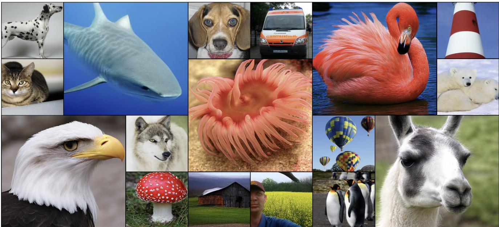
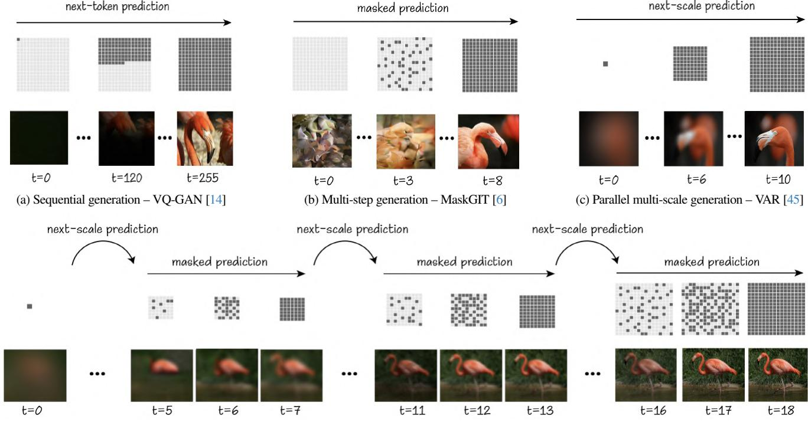
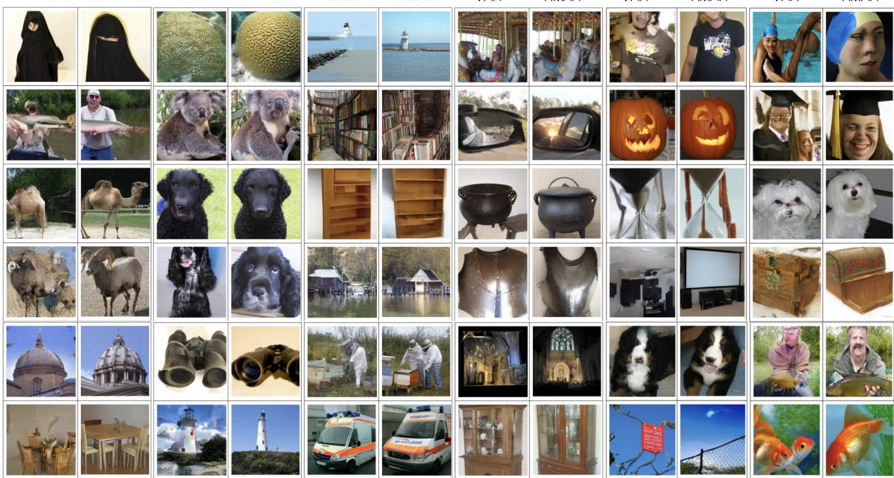
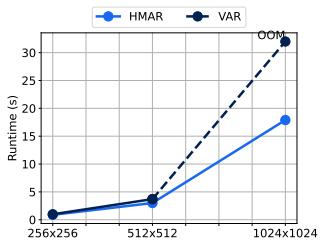
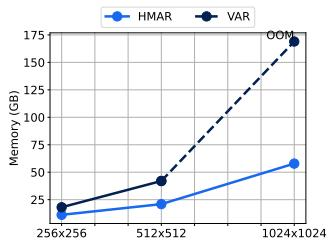
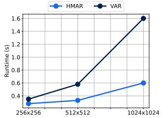
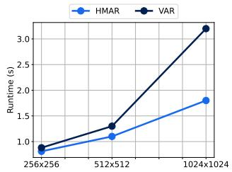
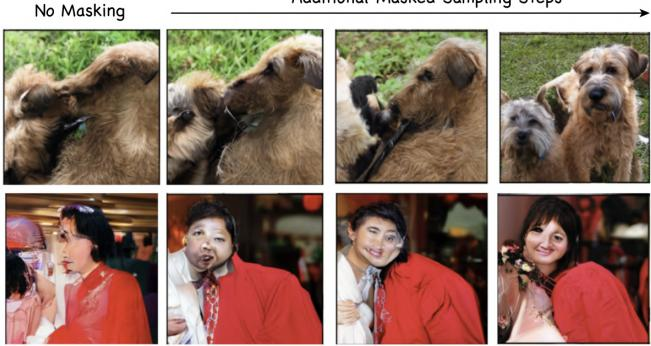
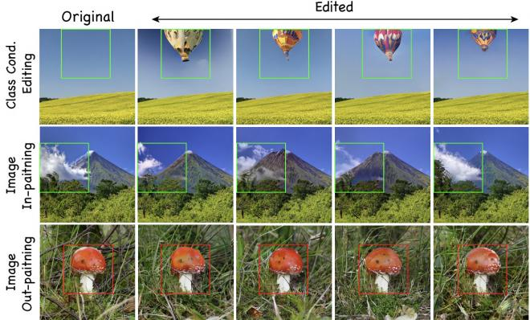

# HMAR: Efficient Hierarchical Masked Auto-Regressive Image Generation

Hermann Kumbong1,2\* Xian Liu2,3\* Tsung-Yi Lin2 Ming-Yu Liu2 Xihui Liu4 Ziwei Liu5 Daniel Y. Fu6,7 Christopher Re´1† David W. Romero2† 1Stanford University 2NVIDIA 3CUHK 4HKU 5NTU 6UCSD 7Together AI

  
Figure 1. HMAR Samples: Class-conditional ImageNet generated samples at 256×256 (HMAR-d30) and 512×512 (HMAR-d24) resolutions.

## Abstract

Visual Auto-Regressive modeling (VAR) has shown promise in bridging the speed and quality gap between autoregressive image models and diffusion models. VAR reformulates autoregressive modeling by decomposing an image into successive resolution scales. During inference, an image is generated by predicting all the tokens in the next (higher-resolution) scale, conditioned on all tokens in all previous (lower-resolution) scales. However, thisformulation suffersfrom reduced image quality due to the parallel generation of all tokens in a resolution scale; has sequence lengths scaling superlinearly in image resolution; and requires retraining to change the sampling schedule.

We introduce Hierarchical Masked AutoRegressive modeling (HMAR), a new image generation algorithm that alleviates these issues using next-scale prediction and masked prediction to generate high-quality images withfast sampling. HMAR reformulates next-scale prediction as a Markovian process, wherein the prediction ofeach resolution scale is conditioned only on tokens in its immediate predecessor instead of the tokens in all predecessor resolutions. When predicting a resolution scale, HMAR uses a controllable multi-step masked generation procedure to generate a subset of the tokens in each step. On

ImageNet 256×256 and 512×512 benchmarks, HMAR models match or outperform parameter-matched VAR, diffusion, and autoregressive baselines. We develop efficient IO-aware block sparse attention kernels that allow HMAR to achieve faster training and inference times over VAR by over 2.5× and 1.75× respectively, as well as over 3× lower inference memoryfootprint. Finally, HMAR yields additional flexibility over VAR; its sampling schedule can be changed withoutfurther training, and it can be applied to image editing tasks in a zero-shot manner.

## 1. Introduction

Autoregressive modeling is the dominant approach for text generation [1, 32, 33]. However, for images and videos, autoregressive models are yet to match diffusion models in speed and quality, making the latter the de-facto generative approach for these modalities [12, 36, 41]. This disparity raises the question of whether autoregressive models can match diffusion models in speed and quality for image generation.

Adapting the next-token autoregressive generation paradigm from language to images introduces multiple challenges. Images are multi-dimensional, making it difficult to determine an appropriate causal ordering. Orderings like raster-scan [14, 42, 49] break the natural spatial relationships within images, resulting in lower-quality outputs. Additionally, sequential pixel-by-pixe generation becomes impractically slow, especially at high resolutions. Masked autoregressive models, such as MaskGIT [6], MAR [24], and MAE [23], do not impose a strict order on the image and instead use global information to progressively fill an empty multi-dimensional canvas. However, the quality of their generation in practice still trails behind diffusion models, leaving diffusion as the preferred approach for image generation.

next-scale prediction  
  
(d) Hierarchical multi-step generation – HMAR (Ours)  
Figure 2. Illustration of the sequential decoding formulation in different methods. We show the decoding process of next-token prediction [14, 42], parallel masked prediction [6], next-scale prediction [45], and our proposed hierarchical multi-step masked prediction. The dark and light grey squares represent the un-generated and generated tokens, respectively. HMAR generates images in an iterative two-step process by first producing a rough prediction of the next scale, then refining it using multi-step masked prediction until the final scale is reached.

Recently, Visual Auto-Regressive modeling (VAR) [45] has shown promise in bridging the quality and speed gap between diffusion and autoregressive image models. VAR frames image generation as successive coarse-to-fine next-scale prediction over successively higher-resolution scales. VAR generates higher-resolution scales by conditioning on the tokens across all previous lower-resolution scales. To make the autoregressive generation tractable, VAR generates all the tokens in a resolution scale in a single model iteration (as opposed to generating tokens one at a time). As a result, VAR achieves faster sampling speeds than diffusion models and delivers the state-of-the-art image quality among autoregressive approaches [45].

However, VAR still faces challenges in terms of achievable image quality, efficiency andflexibility:

• Quality. VAR accelerates generation by sampling all the tokens within a given scale in parallel. We hypothesize that this assumes all the tokens at a given scale are conditionally independent given all previous scales and does not accurately capture the underlying joint distribution within each scale, which can cause inconsistencies within the same scale and error accumulation across scales, ultimately contributing to degraded sample quality (Fig. 17).

• Efficiency. Next-scale prediction conditioned on all previous scales leads to longer sequences—up to 5.84× longer than next-token prediction at 256 × 256—which grow in both the input resolution and the number of scales (Fig. 8). This makes VAR more expensive to train at higher resolutions due to the quadratic time complexity of self-attention with sequence length. Furthermore, efficient self-attention libraries such as FlashAttention do not support the block-causal attention pattern (Fig. 10) in VAR. During inference, caching the lower-resolution scales increases the memory footprint and leads to out-of-memory issues at higher resolutions and larger model sizes.

• Flexibility. Next-scale prediction requires defining the number of sampling steps at training. As a result, increasing the number of sampling steps to improve image quality requires retraining the model from scratch with a new set of scales.

To address these issues, we introduce Hierarchical Masked AutoRegressive modeling (HMAR), a new image generation framework that combines next-scale prediction and masked prediction. HMAR reformulates next-scale prediction as a Markovian process, conditioning the generation of each successive resolution scale only on the tokens of its immediate predecessor (instead of all predecessor scales). The Markovian formulation enables a block-diagonal, windowed attention pattern (Fig. 10) during training, offering up to 5× times more sparsity than VAR’s block-causal pattern at 256 × 256. HMAR furthermore replaces the single-step scale generation of VAR with a controllable, multi-step masked generation procedure similar to MaskGIT [6], thereby removing the per-scale conditional independence assumption of VAR. Finally, HMAR’s hierarchical coarse-to-fine ordering allows reweighting of the training loss to focus the model’s capacity on crucial image details at the most important hierarchy levels.

HMAR improves over VAR and autoregressive modeling in terms of image quality, efficiency, and flexibility:

• Quality. On ImageNet- 256×256 and ImageNet-512×512 benchmarks, our parameter-matched HMAR models match or outperform VAR in FID while improving the Inception Score by up to ≈ 30 points. HMAR outperforms previous AR and Diffusion baselines (DiT) in FID and Inception Score. Qualitatively, HMAR enhances image quality over VAR [45].

• Efficiency. Due to its Markovian formulation, HMAR does not need to compute or cache any preceding-scale tokens, resulting in up to 1.75× speedup and 3× memory reduction during inference. In addition, the block-diagonal attention pattern enables 10× faster attention computation via an I/O-aware window attention kernel. This results in up to 2.5× faster end-to-end training time compared to VAR.

• Flexibility. The intra-scale masked generation procedure provides flexibility, allowing an increase in the number of sampling steps without retraining the model from scratch. Increasing masked sampling steps at coarser scales improves FID scores while increasing them at finer scales enhances perceptual image quality. HMAR’s intra-scale masking makes it easy to adapt HMAR to image editing tasks like inpainting, outpainting, and class-conditional editing.

The remainder of this paper is structured as follows: Section 2 gives an abbreviated treatment of related work. Section 3 discusses the necessary background. Section 4 discusses the HMAR method. Section 5 presents experiments. Section 6 concludes and discusses future work. Additional details are provided in the supplementary material.

## 2. Related Work

We provide an abbreviated discussion of related work. A full treatment is given in Appendix A.

Diffusion models [12, 19, 34, 37, 40, 41] are the dominant class of generative models for image synthesis and are trained to reverse a gradual noising process. Autoregressive image generation models [38, 48, 49] offer an alternative approach by generating images sequentially, typically following a raster scan pattern. Recent work has improved efficiency by using vectorquantized VAEs [14, 50] to compress images into discrete tokens for autoregressive generation. Masked image generative models [6, 7, 23, 52] use a masked prediction objective similar to BERT [11]. By predicting multiple masked tokens in parallel, these models achieve faster generation speeds compared to next-token autoregressive image models. Visual autoregressive modeling (VAR) [45] enhances the efficiency and quality of autoregressive image generation by reframing autoregressive image generation as next-scale prediction instead of next-token prediction. Finally, efficient attention implementations like FlashAttention [9, 10, 39] compute self-attention efficiently on GPU but only support a limited number of attention patterns. Recent work such as FlexAttention [30] supports a wider range of attention patterns but currently restricts sequence lengths to multiples of 128.

## 3. Background

In this section, we discuss the necessary background on VAR that we build on. We first discuss image generation as next-token prediction and then image generation as next-scale prediction. We then discuss the tokenization scheme used in VAR, which we also adopt in HMAR.

Image generation as next-token prediction. An image is represented as a sequence of N discrete tokens $\mathbf { x } { = } \left( \mathrm { x } _ { 1 } , \mathrm { x } _ { 2 } { , } { \ldots } { } , \mathrm { x } _ { \mathrm { N } } \right)$ flattened according to a specified order, e.g., raster-scan. Each token $\mathrm { x } _ { n }$ is an integer from a vocabulary of size V and corresponds to a vector in a codebook $\mathbf { V } { \in } \mathbb { R } ^ { \mathrm { { V } \times \bar { D } } }$ with latent dimension D. The probability of the image, p(x), is then modeled as:

$$
\operatorname { p } ( \mathbf { x } ) { = } \prod _ { t = 1 } ^ { \mathrm { N } } \operatorname { p } ( \mathbf { x } _ { t } | \mathrm { x } _ { 1 } , \mathrm { x } _ { 2 } , . . . , \mathrm { x } _ { t - 1 } ) .\tag{1}
$$

Flattening an image into a one-dimensional sequence breaks the spatial relationships between neighboring pixels. Closely connected pixels are widely separated in the sequence, making it difficult to capture important local patterns. Moreover, the uni-directional ordering restricts the model’s ability to leverage the full image context, resulting in reduced quality and limited flexibility. Finally, the number of required sampling steps grows linearly with image resolution, making high-resolution image generation computationally expensive and often impractical.

Image generation as next-scale prediction. Visual Auto-Regressive Modeling (VAR) [45] overcomes the limitations of next-token autoregressive image generation by reformulating the task as next-scale rather than next-token prediction. In this approach, an image x is decomposed into K sub-images of increasing resolutions $( \mathbf { r } _ { 1 } , \mathbf { r } _ { 2 } , . . . \mathbf { r } _ { \mathrm { K } } )$ , and the likelihood is defined over the sequence of scales as:

$$
\mathrm { p } ( \mathbf { x } ) { = } \mathrm { p } ( \mathbf { r } _ { 1 } , \mathbf { r } _ { 2 } , . . . , \mathbf { r } _ { \mathrm { K } } ) { = } \prod _ { k = 1 } ^ { \mathrm { K } } \mathrm { p } ( \mathbf { r } _ { k } | \mathbf { r } _ { 1 } , . . . , \mathbf { r } _ { k - 1 } ) .\tag{2}
$$

Each autoregressive step now generates a scale $\mathbf { r } _ { k }$ containing $\mathrm { H } _ { k } \times \mathrm { W } _ { k }$ tokens and no flattening like raster-scan is needed. The full context of the image at the preceding scales is available for conditioning. Additionally, the number of autoregressive steps is now controlled by the number of scales, making this method far more scalable.

A block-causal mask (Fig. 10) is used during training to enforce causality across scales while preserving bidirectional dependencies among tokens within each scale. During inference, all tokens within a scale are sampled in parallel, conditioned on the tokens of all previous scales. This leads to fast sampling while providing good visual quality.

Multi-scale vector quantization. In order to translate images from a continuous pixel space into a discrete token space, VAR uses a multi-scale residual quantization method, where the sub-images $( \mathbf { r } _ { 1 } , \mathbf { r } _ { 2 } , . . . \mathbf { r } _ { \mathrm { K } } )$ progressively add information to a residual approximation of the image x˜, such that, after K stages, the approximation resembles the original image as faithfully as possible. VAR uses a VQ-VAE quantization method to quantize continuous vectors into discrete tokens. In particular, VAR maps each of the $\mathrm { x } _ { i , j }$ values of the latent image representation x to one of V learnable vectors v∈V, $\mathbf { V } { \in } \mathbb { R } ^ { \mathrm { { V } \times D } }$ as:

$$
\begin{array} { r } { \tilde { \mathrm { x } } _ { i , j } = \mathcal { Q } ( \mathrm { x } _ { i , j } ) = \biggl ( \operatorname * { a r g m i n } _ { v \in [ \mathrm { V } ] } \| \mathbf { V } _ { v , : } - \mathrm { x } _ { i , j } \| _ { 2 } \biggr ) . } \end{array}\tag{3}
$$

In VAR, the latent image representation is further interpolated across various resolutions corresponding to the scales, $k \in [ \mathrm { K } ]$ . At each scale, the residual between the cumulative approximation and the original image is quantized and used as the token map for that level. The associated learnable vector v is then used for reconstruction. Encoding and reconstruction in multi-scale vector quantization are depicted in Algs. 1 and 2. We adopt the same approach in HMAR.

Algorithm 1 Multi-scale VQ-VAE Encoding   
1: Input: Latent image representation x   
2: Parameters: Steps K, resolutions $\{ ( \mathrm { H } _ { k } , \mathrm { W } _ { k } ) \} _ { k = 1 } ^ { \mathrm { K } }$   
3: Output: Multi-scale token maps R   
4: $\mathbf { R } { = } \breve { [ ] }$   
5: for $k { = } 1 , { \cdots } , \mathrm { K }$ do   
6: $\mathbf { r } _ { k } = \mathcal { Q } ($ (interpolate $\left( \mathbf { x } , \mathrm { H } _ { k } , \mathrm { W } _ { k } \right) )$   
7: R.append(rk)   
8: $\widetilde { \mathbf { x } } _ { k } = \dot { \mathbf { 1 } }$ interpolate(lookup $( \mathbf { V } , \mathbf { r } _ { k } ) , \mathrm { H _ { K } } , \mathrm { W _ { K } } )$   
9: $\begin{array} { r } { { \bf x } = { \bf x } - \tilde { \bf x } _ { k } } \end{array}$   
10: end for   
11: return R

Algorithm 2 Multi-scale VQ-VAE Reconstruction   
1: Input: Multi-scale token maps R   
2: Parameters: Steps K, resolutions $\{ ( \mathrm { H } _ { k } , \mathrm { W } _ { k } ) \} _ { k = 1 } ^ { \mathrm { K } }$   
3: Output: Latent image reconstruction x˜   
4: $\tilde { \mathbf { x } } _ { 0 } = 0$   
5: for $k { = } 1 , { \cdots } , \mathrm { K }$ do   
6: $\mathbf { r } _ { k } { = } \mathbf { R } [ k ]$   
7: $\tilde { \mathbf { x } } _ { k } = \dot { \mathbf { 1 } }$ nterpolate(lookup(V,rk)),HK,WK)   
8: $\tilde { \mathbf { x } } _ { 1 : k } = \tilde { \mathbf { x } } _ { 1 : k - 1 } + \tilde { \mathbf { x } } _ { k }$   
9: end for   
10: return $\tilde { \bf x } _ { \mathrm { 1 : K } }$

## 4. Hierarchical Masked Image Generation

In this section, we describe the key components of HMAR. Section 4.1 formulates next-scale prediction with a Markovian assumption, conditioned only on the tokens in the previous scale. We then develop GPU kernels to leverage the resultant block-sparse attention pattern during training. Section 4.2 describes HMAR’s intra-scale multi-step masked generation process. Section 4.3 describes how HMAR focuses on more important resolution scales during training for higher quality. Finally, Section 4.4 describes the overall HMAR approach.

## 4.1. Efficient Markovian Next-Scale Prediction

We reformulate next-scale prediction to be Markovian and develop an efficient, I/O-aware, block-sparse attention GPU kernel that enables faster training.

Reformulating Next-Scale Prediction to be Markovian. In VAR, each resolution scale contains only residual information of the input (Alg. 2, L7). Hence, next-scale prediction is conditioned on the tokens of all previous scales. However, this leads to longer sequences (Fig. 8) which are expensive for training and inference. We observe that the running image reconstruction up to the stage k, x˜1:k (Alg. 2, L8) contains the information from all stages up to the stage k. Consequently, conditioning of the running reconstruction is equivalent to conditioning on all previous stages. That is $\operatorname { p } ( \mathbf { r } _ { k } | \mathbf { r } _ { 1 } , \mathbf { r } _ { 2 } , . . . , \mathbf { r } _ { k - 1 } ) = \operatorname { p } ( \mathbf { r } _ { k } | { \widetilde { \mathbf { x } } } _ { 1 : k - 1 } )$ and therefore, the likelihood of x can be rewritten as:

$$
\mathrm { p } ( \mathbf { x } ) { = } \mathrm { p } ( \mathbf { r } _ { 1 } , \mathbf { r } _ { 2 } , { \ldots } , \mathbf { r } _ { \mathrm { K } } ) { = } \prod _ { k = 1 } ^ { \mathrm { K } } \mathrm { p } ( \mathbf { r } _ { k } | { \widetilde { \mathbf { x } } } _ { 1 : k - 1 } ) .\tag{4}
$$

This equivalence depicts the Markovian nature of next-scale prediction akin to Laplacian and Gaussian pyramids [2, 5]. We note that only the conditioning changes in this formulation, and we still predict the residual tokens rk.

In Fig. 9, we illustrate the attention pattern in VAR, revealing that the majority of attention is concentrated on the previous scale, which further validates our approach. In practice, we make use of the interpolation function used in Alg. 1, L6, to map the running reconstruction $\tilde { \bf x } _ { 1 : k - 1 }$ to an image of shape $\mathrm { H } _ { k - 1 } \times \mathrm { W } _ { k - 1 }$ . This allows us to modify the attention pattern of VAR [45] from a lower block-triangular pattern to a block-diagonal pattern (Fig. 10) which is much more sparse. Furthermore, this formulation removes the need for prefix computations and KV-caching during inference, leading to faster inference and reduced inference memory usage.

I/O-Aware Windowed Attention. Our Markovian formulation theoretically enables faster attention computation compared to the original VAR due to its higher sparsity (Fig. 10). However, leveraging this sparsity in practice is not straightforward. Efficient attention implementations such as FlashAttention [9, 10, 39], only support a handful ofattention variants of which our block-diagonal pattern and the original block-causal pattern in VAR are not among.

To address this, we develop a custom GPU kernel using

Triton [46] that extends FlashAttention [9, 10, 39] to support these patterns. Our kernels further leverage the sparsity pattern to accelerate attention computation, leading to more than 10× speed-up in attention computation. We provide additional details and micro-benchmarks in Appendix B.

## 4.2. Hierarchical Multi-Step Masked Generation

We describe the quality impacts of VAR’s single-step generation process for each resolution scale, and we describe the intra-scale multi-step masked generation in HMAR.

Oversmoothing and Error Accumulation in VAR. VAR samples all tokens within a scale $\mathbf { r } _ { k }$ in parallel given the previous scales from $\mathrm { p } ( \mathbf { r } _ { k } | \mathbf { r } _ { < k } )$ . While this approach accelerates sampling, we hypothesize that it implicitly assumes that all tokens $\mathrm { r } _ { k } ^ { ( i , j ) }$ within a scale k are conditionally independent given the previous scales $\mathbf { r } _ { < k } .$ . That is, VAR implicitly models $\mathrm { p } ( \mathbf { r } _ { k } | \mathbf { r } _ { < k } )$ as:

$$
\mathrm { p } ( \mathbf { r } _ { k } | \mathbf { r } _ { < k } ) { = } \mathrm { p } \big ( \mathrm { r } _ { k } ^ { ( 1 , 1 ) } \big | \mathbf { r } _ { < k } \big ) . . . \mathrm { p } \big ( \mathrm { r } _ { k } ^ { ( \mathrm { H } _ { k } , \mathrm { W } _ { k } ) } \big | \mathbf { r } _ { < k } \big ) . . .\tag{5}
$$

This is an approximation of the true joint distribution $\mathrm { p } ( \mathbf { r } _ { k } | \mathbf { r } _ { < k } )$ given by the chain rule (Equation 1). We hypothesize that this is not a very accurate approximation of the underlying distribution and “oversmooths” the relationship between tokens in the same scale. Oversmoothing potentially degrades image quality, especially when dependencies between tokens are strong. We demonstrate this effect in (Fig 17), showing how errors generated in earlier scales can propagate during generation to impact the image quality.

Efficient modeling of intra-scale dependencies. According to the chain rule, the mathematically correct way to model $\mathrm { p } ( \mathbf { r } _ { k } | \mathbf { r } _ { < k } )$ entails sampling each token one by one at each scale. However, token-by-token sampling becomes intractable for next-scale prediction. To strike an optimal trade-off between speed and quality, we instead make use of a multi-step masked generation strategy similar to MaskGIT [6] at each scale.

Given a number of masking steps $\mathrm { M } _ { k }$ at scale $k ,$ we utilize an iterative process to sample a subset of tokens (at each scale) per step, such that after $\mathrm { M } _ { k }$ steps, all the tokens at the corresponding scale are sampled. In HMAR, each step is conditioned on the tokens sampled so far at the current stage as well as the tokens from the previous stage. Formally, let $\mathbf { r } _ { k } ^ { m }$ be the tokens at the scale k after m intra-scale sampling steps. The probability of the tokens at the scale $\mathrm { p } ( \mathbf { r } _ { k } | \mathbf { r } _ { < k } )$ is given as:

$$
\operatorname { p } ( \mathbf { r } _ { k } | \mathbf { r } _ { < k } ) = \prod _ { m = 1 } ^ { \mathrm { M } } \mathrm { p } ( \mathbf { r } _ { k } ^ { m } | \mathbf { r } _ { k } ^ { 1 } , . . . , \mathbf { r } _ { k } ^ { m - 1 } , \mathbf { r } _ { k } ^ { 0 } , \mathbf { r } _ { < k } ) \mathrm { p } ( \mathbf { r } _ { k } ^ { 0 } | \mathbf { r } _ { < k } ) ,\tag{6}
$$

where $\mathbf { r } _ { k } ^ { 0 }$ corresponds to the initial next-scale estimation of the VAR next-scale prediction. $\mathrm { M } _ { k }$ offers an adjustable trade-off between quality and speed, where $\mathrm { M } _ { k } { = } 0$ yields the VAR approximation in (5), and $\mathrm { M } _ { k } { = } \mathrm { H } _ { k } { \times } \mathrm { W } _ { k }$ corresponds to nexttoken prediction at each scale. We demonstrate this in Fig. 2. While this introduces additional sampling steps, our efficient reformulation of next-scale prediction allows it to still be efficient.

## 4.3. Training Dynamics

The hierarchical generation process in HMAR, similar to Diffusion models, provides a unique advantage; it allows us to prioritize specific detail levels, allocating model capacity accordingly [13]. We motivate the need to balance the importance of different scales during training and how we achieve this in HMAR. Multi-Scale Training: Balancing Scale Contributions. VAR is trained by optimizing the cross-entropy loss across all tokens at all scales that make up the image. In VAR [45], the loss is simply averaged across all tokens irrespective of the scale. $\mathcal { L } _ { \mathrm { t r a i n } }$ is given by:

$$
\mathcal { L } _ { \mathrm { t r a i n } } { = } \frac { 1 } { N } { \sum _ { k = 1 ( i , j ) } ^ { \mathrm { K } } } \mathcal { L } \big ( \mathrm { r } _ { k } ^ { ( i , j ) } \big ) ,\tag{7}
$$

where $\mathcal { L } ( \mathrm { r } _ { k } ^ { ( i , j ) } )$ denotes the cross-entropy loss for the (i,j)-th token at scale k and N is the total number of tokens.

However, this fails to take into account several considerations: 1) Number of Tokens per Scale. For VAR [45], which employs K=10 levels, the finest scale contributes 256 times more than the coarsest scale. This imbalance leads the mode to prioritize the finer scales, neglecting the coarse scales that capture the global image structure. 2) Learning Difficulty of each Scale. We use the minimum test loss at each scale as an indicator of learning difficulty and illustrate in Fig. 12 that it approximately follows a log-normal distribution, suggesting that each level has varied difficulty and this should be incorporated in the learning algorithm. 3) Perceptual Importance of each Scale. Each scale plays a distinct role in determining the perceptual quality of an image. Earlier scales focus on capturing the global structure, while later scales refine finer details. Moreover, errors introduced at earlier scales tend to propagate and accumulate during the generation process, emphasizing the critical importance of accurately capturing these early scales (Fig. 17). Loss Reweighting. To leverage the above insights, we reweight the training loss to account for each scale as follows:

$$
\mathcal { L } _ { \mathrm { t r a i n } } = \sum _ { k = 1 } ^ { \mathrm { K } } w ( k ) { \sum _ { ( i , j ) } } \mathcal { L } \big ( \mathrm { r } _ { k } ^ { ( i , j ) } \big ) , \quad 0 \leq w ( k ) \leq 1 , \quad \sum _ { k = 1 } ^ { \mathrm { K } } w ( k ) = 1\tag{8}
$$

We empirically experiment with different loss weighting functions in the Appendix. C.2. We find that the choice of weighting function significantly impacts quality (Table. 4). Additionally, we find that a log-normal weighting function (Fig. 13), which parallels the loss difficulty distribution (Fig. 12), yields the best FID and Inception Score.

## 4.4. The HMAR Architecture

HMAR consists of two sub-modules: the next-scale prediction module and the intra-scale refining module. The next-scale model corresponds to a Markovian VAR model (Sec. 4.1), and the intra-scale refining module corresponds to a multi-step masked generation module as presented in Sec. 4.2. The whole

<table><tr><td>Type</td><td>Model</td><td>FID↓</td><td>IS↑</td><td>Precision ↑</td><td>Recall ↑</td><td># Params</td><td># Steps</td></tr><tr><td>Diffusion</td><td>DiT-XL/2 [29]</td><td>2.27</td><td>278.2</td><td>0.83</td><td>0.57</td><td>675M</td><td>250</td></tr><tr><td rowspan="3">Mask.</td><td>MaskGIT [6]</td><td>6.18</td><td>182.1</td><td>0.80</td><td>0.51</td><td>227M</td><td>8</td></tr><tr><td>MAR-L [24]</td><td>2.35</td><td>227.8</td><td>0.79</td><td>0.62</td><td>943M</td><td>256</td></tr><tr><td>MAGE [23]</td><td>7.04</td><td>123.5</td><td>-</td><td>-</td><td>439M</td><td>20</td></tr><tr><td rowspan="6">AR</td><td>VQGAN [14]</td><td>15.8</td><td>74.3</td><td></td><td></td><td>1.4B</td><td>256</td></tr><tr><td>Llamagen [42]</td><td>2.81</td><td>263.3</td><td>0.81</td><td>0.58</td><td>3.1B</td><td>256</td></tr><tr><td>VAR-d16 [45]</td><td>3.36</td><td>277.8</td><td>0.84</td><td>0.51</td><td>310M</td><td>10</td></tr><tr><td>VAR-d20 [45]</td><td>2.67</td><td>304.4</td><td>0.84</td><td>0.55</td><td>600M</td><td>10</td></tr><tr><td>VAR-d24 [45]</td><td>2.15</td><td>312.4</td><td>0.82</td><td>0.58</td><td>1.0B</td><td>10</td></tr><tr><td>VAR-d30 [45]</td><td>1.95</td><td>303.6</td><td>0.81</td><td>0.59</td><td>2.0B</td><td>10</td></tr><tr><td>Hybrid AR</td><td>HART [43]</td><td>1.77</td><td>330.3</td><td>-</td><td>-</td><td>2.0B</td><td>10</td></tr><tr><td rowspan="4">HMAR (Ours)</td><td>HMAR-d16</td><td>3.01</td><td>288.6</td><td>0.84</td><td>0.55</td><td>465M</td><td>14</td></tr><tr><td>HMAR-d20</td><td>2.50</td><td>319.0</td><td>0.85</td><td>0.57</td><td>840M</td><td>14</td></tr><tr><td>HMAR-d24</td><td>2.10</td><td>324.3</td><td>0.83</td><td>0.60</td><td>1.3B</td><td>14</td></tr><tr><td>HMAR-d30</td><td>1.95</td><td>334.5</td><td>0.82</td><td>0.62</td><td>2.4B</td><td>14</td></tr></table>

Table 1. Quantitative evaluation on class-conditional ImageNet 256×256. ↓ and ↑ indicate whether lower or higher values are better. We report numerical results on commonly used metrics of FID, IS, Precision, and Recall, which are comprehensive to cover generation quality and diversity. # Steps indicate the number of model runs needed to generate an image. The −d notation in VAR and HMAR indicates the number of layers in the model.

HMAR architecture is shown in Fig. 2. The remainder of this section describes the training and inference of HMAR.

Training. HMAR is trained in two steps. First, the next-scale prediction module is trained using an IO-aware windowed attention mask for each image, as described in Section 4.1. Then, a finetuning step is started for the training of the intra-scale masked prediction module. To this end, we add a masked prediction head and finetune it with a masked prediction objective similar to MaskGIT [6]. In this phase, we uniformly sample a ratio $\gamma _ { k } \sim \mathcal { U } ( 0 , 1 )$ , and randomly select $\lceil \gamma \mathrm { H } _ { k } \mathrm { W } _ { k } \rceil$ tokens from each rk and replace them with a special [MASK] token. Then, given the unmasked tokens, the model is trained to predict the value of the masked tokens at each scale. We find that using the same masking ratio $\gamma _ { k } = \gamma$ across scales leads to more stable training.

Let $\gamma _ { k } \mathbf { r } _ { k }$ and $\bar { \gamma } _ { k } \mathbf { r } _ { k }$ depict the masked and unmasked tokens at a scale k. Then, the intra-scale refining module is trained to minimize the cross entropy of the masked tokens given the unmasked tokens. That is:

$$
\mathcal { L } _ { \mathrm { m a s k } } = \sum _ { k = 1 } ^ { \mathrm { K } } \mathcal { L } ( \gamma _ { k } \mathbf { r } _ { k } | \bar { \gamma } _ { k } \mathbf { r } _ { k } ) = \sum _ { k = 1 } ^ { \mathrm { K } } \mathcal { L } ( \gamma \mathbf { r } _ { k } | \bar { \gamma } \mathbf { r } _ { k } )\tag{9}
$$

We condition on both the unmasked tokens within that scale and the accumulated reconstruction of the image from previous scales. Doing so allows us to preserve all the incoming information from the next-scale module during refinement, which gives us image generation of higher quality.

Inference. Just as for training, HMAR follows a two-stage process during generation as well. First, we iteratively obtain a coarse estimation of the next scale using the next-scale prediction module, and then we iteratively refine these predictions using the intra-scale masked refinement module. At this point, we generate the initial tokens based only on the estimations of the next-scale module, and then we mask out some of them and then generate them again, conditioning on the accumulated reconstruction of the image and the unmasked tokens at that scale.

## 5. Experiments

We evaluate HMAR on quality, efficiency, and flexibility. Quality. We evaluate HMAR on ImageNet 256×256 and 512× 512 for class-conditional image generation. HMAR achieves better or comparable FID scores and significantly higher Inception Scores compared to VAR, AR, and diffusion baselines. We also provide qualitative analysis of generated samples.

Efficiency. We benchmark HMAR models for both training and inference efficiency, showing that HMAR achieves both faster training and inference than VAR, with the efficiency gains increasing as we scale to higher resolutions.

Flexibility. We demonstrate HMAR’s flexibility, showing that its sampling can be changed without any additional training to improve image quality, and it can be applied to image editing tasks like in-painting, out-painting, and class-conditional image editing. We end with an ablation study evaluating the effect of the individual components of HMAR on image quality.

Experimental Setup. We align our experimental setup with VAR [45]. We train all our models from scratch with similar parameters and number of transformer layers as VAR. For each scale, we maintain consistency with VAR by adopting identical hyperparameters, number of scales, and training durations. For image tokenization, we employ the pre-trained multi-scale VQ-VAE tokenizer from VAR [45]. During the inference phase, we implement top-k top-p sampling. For comparison with VAR models, we utilize open-source pre-trained checkpoints for evaluation. We use the same setup to evaluate both efficiency

HMAR

HMAR

HMAR

HMAR

VAR

VAR  
  
Figure 3. Visual Comparisons of Samples from VAR-d16 and HMAR-d16. Selected samples highlighting how HMAR’s multi-step generation at each scale can enhance image quality compared to using only next-scale prediction in VAR.

  
(a) Inference Runtime and Memory Footprint vs Resolution, d-24, bs = 16

  
(b) Training FWD (left) and BWD (right), d-24, largest bs at each resolution. Figure 4. Inference and Training Efficiency. HMAR enables more efficient training and inference compared to VAR, with the efficiency gap becoming more pronounced as we scale to higher resolutions.

and quality performance.

## 5.1. Quality

In this section, we evaluate the quality of HMAR image generation using both quantitative metrics and qualitative analysis. Quantitative Metrics. We evaluate class-conditional image generation on ImageNet at 255×256 (Table 1) and 512×512 (Table 2) resolutions. Using standard metrics (FID, Inception Score, Precision, and Recall), we find that HMAR consistently matches or outperforms baselines in FID scores while significantly surpassing them in Inception Score. This demonstrates HMAR’s ability to generate high-quality, diverse images.

<table><tr><td colspan="5">ImageNet 512x512 Benchmark</td></tr><tr><td>Type</td><td>Model</td><td>FID↓</td><td>IS↑</td><td>#Para</td></tr><tr><td>Diff.</td><td>DiT-XL/2 [29]</td><td>3.04</td><td>240.8</td><td>675M</td></tr><tr><td>Mask. AR Mask. AR</td><td>MaskGIT [6] MAR-L [24]</td><td>7.32 2.74</td><td>156.0 205.2</td><td>481M</td></tr><tr><td>VAR</td><td>VAR-d36 [45]</td><td>2.63</td><td>303.2</td><td>2.5B</td></tr><tr><td>HMAR</td><td>HMAR-d24</td><td>2.99</td><td>304.1</td><td>1.3B</td></tr></table>

Table 2. ImageNet 512x512 Benchmark. Due to limited computational resources, we train our HMAR model with ≈ 2× fewer parameters compared to VAR and find it to be competitive.

Qualitative Analysis. We show class conditional samples from HMAR on ImageNet 256 × 256 and 512 × 512 in Fig. 1. In Fig. 3, we compare selected samples from HMAR against samples generated from VAR[54]. In Appendix F, we provide additional qualitative comparisons against other baselines, as well as additional samples from HMAR. Our results show that HMAR generates images with comparable or better visual quality compared to baseline methods.

Additional Masked Sampling Steps  
  
Figure 5. Impact of Masking on Visual Quality HMAR-d16. Increasing masked sampling steps can yield improved visual quality.

## 5.2. Efficiency

We benchmark the training speed, the inference speed, and the memory footprint of HMAR compared to VAR. All benchmarks are on a single A100 80GB and averaged over 25 repetitions.

Training. We benchmark the end-to-end runtime of HMAR (using our custom block diagonal attention kernel) and compare it against the VAR baseline (Fig. 4b). HMAR demonstrates consistently faster performance, with the speed advantage growing more pronounced at higher resolutions. At the 1024×1024 resolution, HMAR achieves a 2.5× end-to-end speedup over VAR. We provide additional micro-benchmarks on the performance of our attention implementation in Appendix B.

Inference. Fig. 4a compares the inference runtime and memory footprint of our HMAR model to VAR. HMAR demonstrates faster inference, with the speed advantage increasing at higher resolutions, primarily due to avoiding prefix computations. The memory footprint of HMAR is significantly lower than VAR, which requires a KV-cache. This performance gap widens as we scale to higher resolutions and larger model sizes.

## 5.3. Flexibility

In Fig. 5, we demonstrate how HMAR’s flexible sampling strategy can help improve quality by increasing the number of sampling steps at inference time. In Fig. reffig:masking-quantitative we show how increasing the number of sampling steps at inference time can improve the FID score. We show HMAR’s generalization to zero-shot image editing tasks in Fig. 6.

## 5.4. Ablation Study

We ablate the key components in HMAR and quantify their impact in Table 3. In Appendix C.2, we provide a detailed ablation on different loss-weighting choices. Fig. 20 demonstrates that increasing the number of sampling steps through masking enhances the FID score in our HMAR-d16 model. We find that a few additional sampling steps at lower resolution scales improve the FID score; while additional steps at higher scales don’t meaningfully improve FID, they can enhance visual quality, as illustrated in Figure 5.

  
Figure 6. Image Editing. Applying HMAR zero-shot to editing tasks

<table><tr><td rowspan=1 colspan=1>Model</td><td rowspan=1 colspan=1>Method</td><td rowspan=1 colspan=1>FID↓  IS↑</td><td rowspan=1 colspan=1># Steps</td></tr><tr><td rowspan=1 colspan=1>VAR-d16</td><td rowspan=1 colspan=1>Reported [45]Our run</td><td rowspan=1 colspan=1>3.30  274.43.50  276.0</td><td rowspan=1 colspan=1>1010</td></tr><tr><td rowspan=1 colspan=1>HMAR-d16</td><td rowspan=1 colspan=1>Markov AssumptionLoss WeightingMasked Prediction</td><td rowspan=1 colspan=1>3.76   293.33.42  307.93.01   288.6</td><td rowspan=1 colspan=1>101014</td></tr><tr><td rowspan=1 colspan=1>HMAR-d30</td><td rowspan=1 colspan=1>Scale-up</td><td rowspan=1 colspan=1>1.95  334.5</td><td rowspan=1 colspan=1>14</td></tr></table>

Table 3. Ablation study comparing successive HMAR enhancements compared to VAR. We show that each of our proposed methods improves both the image generation quality and diversity metrics.

## 6. Discussion and Conclusion

Conclusion. This paper introduces Hierarchical Masked AutoRegressive Image Generation (HMAR), a new image generation algorithm that improves upon Visual Autoregressive Modeling (VAR) in quality, efficiency and flexibility. HMAR enhances the efficiency of next-scale prediction by conditioning only on the immediate past scale instead of all previous scales. This accelerates inference, reduces memory usage, and enables a sparser attention pattern. We develop sparse attention kernels to leverage the sparse attention pattern, enabling faster training compared to VAR. HMAR then incorporates masked prediction within each scale, providing flexible sampling while enhancing image quality. HMAR demonstrates superior performance on ImageNet benchmarks at 256×256 and 512×512 resolutions, matching or exceeding the quality of VAR, AR, and diffusion models while providing substantial improvements in training speed, inference speed, and memory efficiency.

Limitations and Future Work. While this work focuses on class-conditional image generation, we believe HMAR’s framework can be naturally extended to Text-to-Image synthesis, offering another promising direction for future investigation. In future work, we also plan to investigate further improvements to the overall pipeline, including improvements to the multi-scale VQ-VAE tokenizer (Appendix E).

## 7. Acknowledgements

We thank Sabri Eyuboglu, Chris Fifty, Dan Biderman, Kelly Buchanan, Jerry Liu, Mayee Chen, Michael Zhang, Benjamin Spector, Simran Arora, Alycia Unell, Ben Viggiano, Zekun Hao, Siddharth Kumar, J.P. Lewis and Prithvijit Chattopadhyay for helpful feedback and discussions during this work. This work was supported by NIH under No. U54EB020405 (Mobilize), NSF under Nos. CCF2247015 (Hardware-Aware), CCF1763315 (Beyond Sparsity), CCF1563078 (Volume to Velocity), and 1937301 (RTML); US DEVCOM ARL under Nos. W911NF-23-2-0184 (Long-context) and W911NF-21- 2-0251 (Interactive Human-AI Teaming); ONR under Nos. N000142312633 (Deep Signal Processing); Stanford HAI under No. 247183; NXP, Xilinx, LETI-CEA, Intel, IBM, Microsoft, NEC, Toshiba, TSMC, ARM, Hitachi, BASF, Accenture, Ericsson, Qualcomm, Analog Devices, Google Cloud, Salesforce, Total, the HAI-GCP Cloud Credits for Research program, the Stanford Data Science Initiative (SDSI), and members of the Stanford DAWN project: Meta, Google, and VMWare. The U.S. Government is authorized to reproduce and distribute reprints for Governmental purposes notwithstanding any copyright notation thereon. Any opinions, findings, and conclusions or recommendations expressed in this material are those of the authors and do not necessarily reflect the views, policies, or endorsements, either expressed or implied, of NIH, ONR, or the U.S. Government.

## References

[1] Josh Achiam, Steven Adler, Sandhini Agarwal, Lama Ahmad, Ilge Akkaya, Florencia Leoni Aleman, Diogo Almeida, Janko Altenschmidt, Sam Altman, Shyamal Anadkat, et al. Gpt-4 technical report. arXiv preprint arXiv:2303.08774, 2023. 1

[2] Edward H Adelson and Peter J Burt. Image data compression with the Laplacian pyramid. University of Maryland Computer Science, 1980. 4

[3] Hangbo Bao, Li Dong, Songhao Piao, and Furu Wei. Beit: Bert pre-training of image transformers, 2022. 12

[4] Tom B. Brown, Benjamin Mann, Nick Ryder, Melanie Subbiah, Jared Kaplan, Prafulla Dhariwal, Arvind Neelakantan, Pranav Shyam, Girish Sastry, Amanda Askell, Sandhini Agarwal, Ariel Herbert-Voss, Gretchen Krueger, Tom Henighan, Rewon Child, Aditya Ramesh, Daniel M. Ziegler, Jeffrey Wu, Clemens Winter, Christopher Hesse, Mark Chen, Eric Sigler, Mateusz Litwin, Scott Gray, Benjamin Chess, Jack Clark, Christopher Berner, Sam McCandlish, Alec Radford, Ilya Sutskever, and Dario Amodei. Language models are few-shot learners, 2020. 12

[5] Peter J Burt and Edward H Adelson. The laplacian pyramid as a compact image code. In Readings in computer vision, pages 671–679. Elsevier, 1987. 4

[6] Huiwen Chang, Han Zhang, Lu Jiang, Ce Liu, and William T Freeman. Maskgit: Masked generative image transformer. In Proceedings ofthe IEEE/CVF Conference on Computer Vision and Pattern Recognition, pages 11315–11325, 2022. 2, 3, 5, 6, 7, 12

[7] Huiwen Chang, Han Zhang, Jarred Barber, AJ Maschinot, Jose

Lezama, Lu Jiang, Ming-Hsuan Yang, Kevin Murphy, William T Freeman, Michael Rubinstein, et al. Muse: Text-to-image generation via masked generative transformers. arXiv preprint arXiv:2301.00704, 2023. 3, 12

[8] Zigeng Chen, Xinyin Ma, Gongfan Fang, and Xinchao Wang. Collaborative decoding makes visual auto-regressive modeling efficient. arXiv preprint arXiv:2411.17787, 2024. 12

[9] Tri Dao. FlashAttention-2: Faster attention with better parallelism and work partitioning. In International Conference on Learning Representations (ICLR), 2024. 3, 4, 5, 12

[10] Tri Dao, Daniel Y. Fu, Stefano Ermon, Atri Rudra, and Christopher Re. FlashAttention: Fast and memory-efficient exact´ attention with IO-awareness. In Advances in Neural Information Processing Systems (NeurIPS), 2022. 3, 4, 5, 12

[11] Jacob Devlin, Ming-Wei Chang, Kenton Lee, and Kristina Toutanova. Bert: Pre-training of deep bidirectional transformers for language understanding, 2019. 3, 12

[12] Prafulla Dhariwal and Alexander Nichol. Diffusion models beat gans on image synthesis. Advances in neural information processing systems, 34:8780–8794, 2021. 1, 3, 12

[13] Sander Dieleman. Noise schedules considered harmful. https://sander.ai/2024/06/14/noiseschedules.html, 2024. 5

[14] Patrick Esser, Robin Rombach, and Bjorn Ommer. Taming trans-¨ formers for high-resolution image synthesis, 2021. 1, 2, 3, 6, 12

[15] Bulat Gabdullin, Nina Konovalova, Nikolay Patakin, Dmitry Senushkin, and Anton Konushin. Depthart: Monocular depth estimation as autoregressive refinement task. arXiv preprint arXiv:2409.15010, 2024. 12

[16] Ian Goodfellow, Jean Pouget-Abadie, Mehdi Mirza, Bing Xu, David Warde-Farley, Sherjil Ozair, Aaron Courville, and Yoshua Bengio. Generative adversarial nets. Advances in neural information processing systems, 27, 2014. 12

[17] Jian Han, Jinlai Liu, Yi Jiang, Bin Yan, Yuqi Zhang, Zehuan Yuan, Bingyue Peng, and Xiaobing Liu. Infinity: Scaling bitwise autoregressive modeling for high-resolution image synthesis. arXiv preprint arXiv:2412.04431, 2024. 12

[18] Kaiming He, Xinlei Chen, Saining Xie, Yanghao Li, Piotr Dollar,´ and Ross Girshick. Masked autoencoders are scalable vision learners, 2021. 12

[19] Jonathan Ho, Ajay Jain, and Pieter Abbeel. Denoising diffusion probabilistic models. Advances in neural information processing systems, 33:6840–6851, 2020. 3, 12

[20] Yang Jin, Zhicheng Sun, Ningyuan Li, Kun Xu, Hao Jiang, Nan Zhuang, Quzhe Huang, Yang Song, Yadong Mu, and Zhouchen Lin. Pyramidal flow matching for efficient video generative modeling. arXiv preprint arXiv:2410.05954, 2024. 12

[21] Diederik P Kingma. Auto-encoding variational bayes. arXiv preprint arXiv:1312.6114, 2013. 12

[22] Doyup Lee, Chiheon Kim, Saehoon Kim, Minsu Cho, and Wook-Shin Han. Autoregressive image generation using residual quantization. In Proceedings ofthe IEEE/CVF Conference on Computer Vision and Pattern Recognition, pages 11523–11532, 2022. 12

[23] Tianhong Li, Huiwen Chang, Shlok Mishra, Han Zhang, Dina Katabi, and Dilip Krishnan. Mage: Masked generative encoder to unify representation learning and image synthesis. In Proceedings of the IEEE/CVF Conference on Computer Vision and Pattern Recognition, pages 2142–2152, 2023. 2, 3, 6, 12

[24] Tianhong Li, Yonglong Tian, He Li, Mingyang Deng, and Kaiming He. Autoregressive image generation without vector quantization, 2024. 2, 6, 7, 12

[25] Xiang Li, Hao Chen, Kai Qiu, Jason Kuen, Jiuxiang Gu, Bhiksha Raj, and Zhe Lin. Imagefolder: Autoregressive image generation with folded tokens. arXiv preprint arXiv:2410.01756, 2024. 12

[26] Xiang Li, Kai Qiu, Hao Chen, Jason Kuen, Zhe Lin, Rita Singh, and Bhiksha Raj. Controlvar: Exploring controllable visual autoregressive modeling. arXiv preprint arXiv:2406.09750, 2024. 12

[27] Xian Liu, Jian Ren, Aliaksandr Siarohin, Ivan Skorokhodov, Yanyu Li, Dahua Lin, Xihui Liu, Ziwei Liu, and Sergey Tulyakov. Hyperhuman: Hyper-realistic human generation with latent structural diffusion. arXiv preprint arXiv:2310.08579, 2023. 12

[28] Xiaoxiao Ma, Mohan Zhou, Tao Liang, Yalong Bai, Tiejun Zhao, Huaian Chen, and Yi Jin. Star: Scale-wise text-to-image generation via auto-regressive representations. arXiv preprint arXiv:2406.10797, 2024. 12

[29] William Peebles and Saining Xie. Scalable diffusion models with transformers, 2023. 6, 7

[30] PyTorch Team. Flexattention: The flexibility of pytorch with the performance of flashattention. https : / / pytorch . org / blog / flexattention/, 2024. Accessed: 2024-10-17. 3, 12

[31] Markus N Rabe and Charles Staats. Self-attention does not need o(nˆ2) memory. arXiv preprint arXiv:2112.05682, 2021. 12

[32] Alec Radford. Improving language understanding by generative pre-training. 2018. 1

[33] Alec Radford, Jeffrey Wu, Rewon Child, David Luan, Dario Amodei, Ilya Sutskever, et al. Language models are unsupervised multitask learners. OpenAI blog, 1(8):9, 2019. 1, 12

[34] Aditya Ramesh, Prafulla Dhariwal, Alex Nichol, Casey Chu, and Mark Chen. Hierarchical text-conditional image generation with clip latents. arXiv preprint arXiv:2204.06125, 1(2):3, 2022. 3, 12

[35] Ali Razavi, Aaron Van den Oord, and Oriol Vinyals. Generating diverse high-fidelity images with vq-vae-2. Advances in neural information processing systems, 32, 2019. 12

[36] Robin Rombach, Andreas Blattmann, Dominik Lorenz, Patrick Esser, and Bjorn Ommer. High-resolution image synthesis¨ with latent diffusion models. In Proceedings ofthe IEEE/CVF conference on computer vision and pattern recognition, pages 10684–10695, 2022. 1

[37] Chitwan Saharia, William Chan, Saurabh Saxena, Lala Li, Jay Whang, Emily L Denton, Kamyar Ghasemipour, Raphael Gontijo Lopes, Burcu Karagol Ayan, Tim Salimans, et al. Photorealistic text-to-image diffusion models with deep language understanding. Advances in neural information processing systems, 35:36479–36494, 2022. 3, 12

[38] Tim Salimans, Andrej Karpathy, Xi Chen, and Diederik P. Kingma. Pixelcnn++: Improving the pixelcnn with discretized logistic mixture likelihood and other modifications, 2017. 3, 12

[39] Jay Shah, Ganesh Bikshandi, Ying Zhang, Vijay Thakkar, Pradeep Ramani, and Tri Dao. Flashattention-3: Fast and accurate attention with asynchrony and low-precision. arXiv preprint arXiv:2407.08608, 2024. 3, 4, 5, 12

[40] Jascha Sohl-Dickstein, Eric Weiss, Niru Maheswaranathan, and Surya Ganguli. Deep unsupervised learning using nonequilibrium

thermodynamics. In International conference on machine learning, pages 2256–2265. PMLR, 2015. 3, 12

[41] Jiaming Song, Chenlin Meng, and Stefano Ermon. Denoising diffusion implicit models. arXiv preprint arXiv:2010.02502, 2020. 1, 3, 12

[42] Peize Sun, Yi Jiang, Shoufa Chen, Shilong Zhang, Bingyue Peng, Ping Luo, and Zehuan Yuan. Autoregressive model beats diffusion: Llama for scalable image generation. arXiv preprint arXiv:2406.06525, 2024. 1, 2, 6, 12

[43] Haotian Tang, Yecheng Wu, Shang Yang, Enze Xie, Junsong Chen, Junyu Chen, Zhuoyang Zhang, Han Cai, Yao Lu, and Song Han. Hart: Efficient visual generation with hybrid autoregressive transformer. arXiv preprint arXiv:2410.10812, 2024. 6, 12, 18

[44] Yao Teng, Han Shi, Xian Liu, Xuefei Ning, Guohao Dai, Yu Wang, Zhenguo Li, and Xihui Liu. Accelerating auto-regressive text-to-image generation with training-free speculative jacobi decoding. arXiv preprint arXiv:2410.01699, 2024. 12

[45] Keyu Tian, Yi Jiang, Zehuan Yuan, Bingyue Peng, and Liwei Wang. Visual autoregressive modeling: Scalable image generation via next-scale prediction. arXiv preprint arXiv:2404.02905, 2024. 2, 3, 4, 5, 6, 7, 8, 12, 18

[46] Philippe Tillet, Hsiang-Tsung Kung, and David Cox. Triton: an intermediate language and compiler for tiled neural network computations. In Proceedings of the 3rd ACM SIGPLAN International Workshop on Machine Learning and Programming Languages, pages 10–19, 2019. 5

[47] Hugo Touvron, Louis Martin, Kevin Stone, Peter Albert, Amjad Almahairi, Yasmine Babaei, Nikolay Bashlykov, Soumya Batra, Prajjwal Bhargava, Shruti Bhosale, et al. Llama 2: Open foundation and fine-tuned chat models. arXiv preprint arXiv:2307.09288, 2023. 12

[48] Aaron Van Den Oord, Nal Kalchbrenner, and Koray Kavukcuoglu.¨ Pixel recurrent neural networks. In International conference on machine learning, pages 1747–1756. PMLR, 2016. 3, 12

[49] Aaron van den Oord, Nal Kalchbrenner, Oriol Vinyals, Lasse Espeholt, Alex Graves, and Koray Kavukcuoglu. Conditional image generation with pixelcnn decoders, 2016. 1, 3, 12

[50] Aaron van den Oord, Oriol Vinyals, and Koray Kavukcuoglu. Neural discrete representation learning, 2018. 3, 12

[51] Anton Voronov, Denis Kuznedelev, Mikhail Khoroshikh, Valentin Khrulkov, and Dmitry Baranchuk. Switti: Designing scale-wise transformers for text-to-image synthesis. arXiv preprint arXiv:2412.01819, 2024. 12

[52] Mark Weber, Lijun Yu, Qihang Yu, Xueqing Deng, Xiaohui Shen, Daniel Cremers, and Liang-Chieh Chen. Maskbit: Embedding-free image generation via bit tokens, 2024. 3, 12

[53] Jiahui Yu, Yuanzhong Xu, Jing Yu Koh, Thang Luong, Gunjan Baid, Zirui Wang, Vijay Vasudevan, Alexander Ku, Yinfei Yang, Burcu Karagol Ayan, Ben Hutchinson, Wei Han, Zarana Parekh, Xin Li, Han Zhang, Jason Baldridge, and Yonghui Wu. Scaling autoregressive models for content-rich text-to-image generation, 2022. 12

[54] Qian Zhang, Xiangzi Dai, Ninghua Yang, Xiang An, Ziyong Feng, and Xingyu Ren. Var-clip: Text-to-image generator with visual auto-regressive modeling. arXiv preprint arXiv:2408.01181, 2024. 7, 12