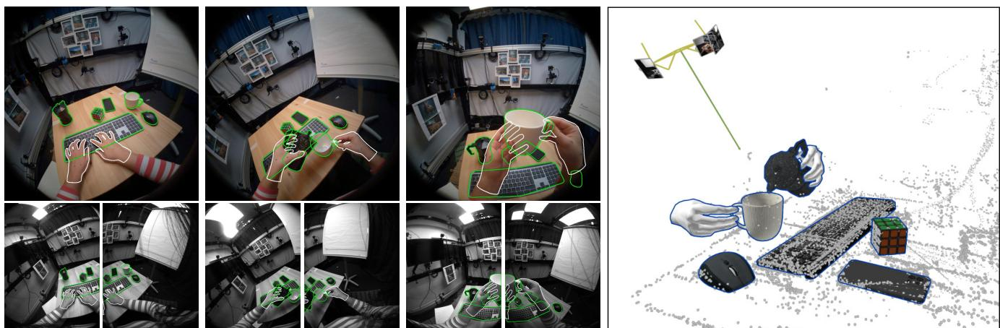
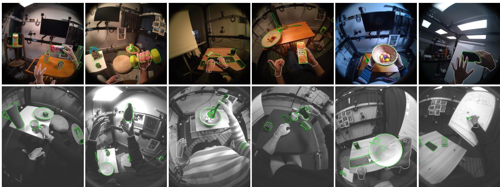
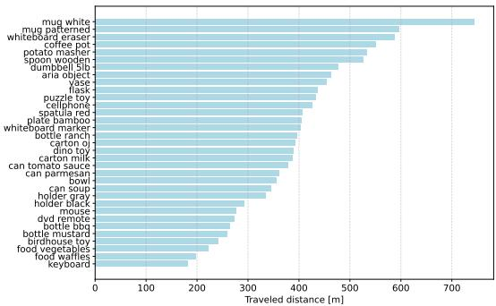
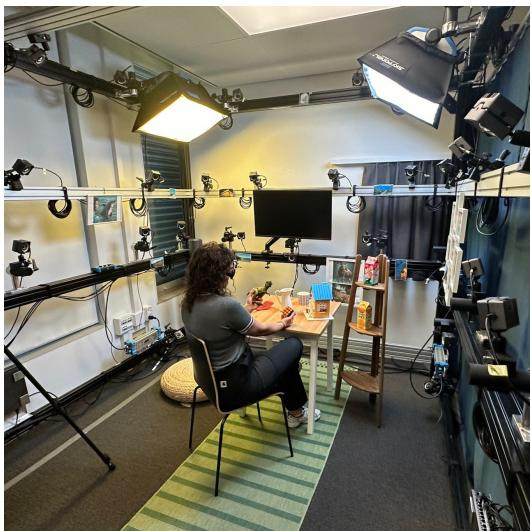
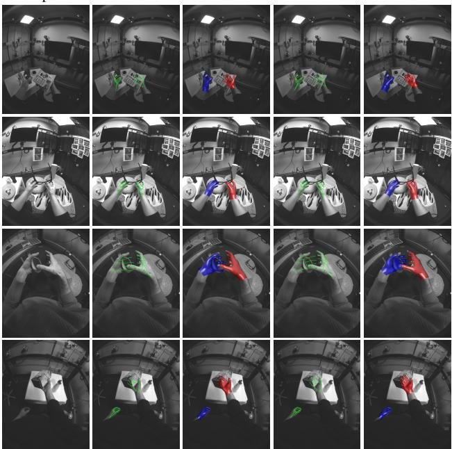
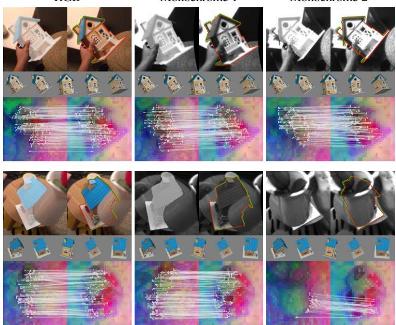
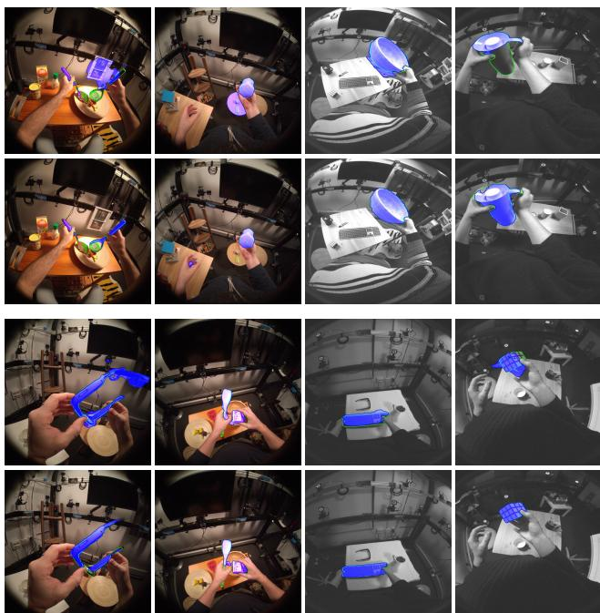
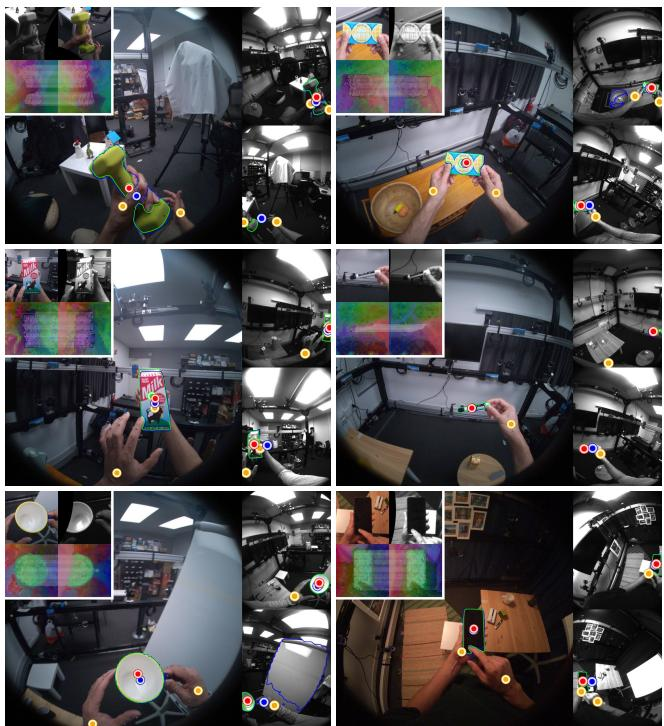

# HOT3D: Hand and Object Tracking in 3D from Egocentric Multi-View Videos

Prithviraj Banerjee, Sindi Shkodrani, Pierre Moulon, Shreyas Hampali, Shangchen Han, Fan Zhang, Linguang Zhang, Jade Fountain, Edward Miller, Selen Basol, Richard Newcombe, Robert Wang, Jakob Julian Engel, Tomas Hodan

Meta Reality Labs facebookresearch.github.io/hot3d

  
Figure 1. HOT3D overview. The dataset includes multi-view egocentric image streams from Aria [13] and Quest 3 [40] annotated with high-quality ground-truth 3D poses and models of hands and objects. Three multi-view frames from Aria are shown on the left, with contours of 3D models of hands and objects in the ground-truth poses in white and green, respectively. Aria also provides 3D point clouds from SLAM and eye gaze information (right).

## Abstract

We introduce HOT3D, a publicly available datasetfor egocentric hand and object tracking in 3D. The dataset offers over 833 minutes (3.7M+ images) ofrecordings thatfeature 19 subjects interacting with 33 diverse rigid objects. In addition to simplepickup, observe, and put-down actions, the subjects perform actions typicalfor a kitchen, office, and living room environment. The recordings include multiple synchronized data streams containing egocentric multi-view RGB/monochrome images, eye gaze signal, scene point clouds, and 3D poses ofcameras, hands, and objects. The dataset is recorded with two headsetsfrom Meta: Project Aria, which is a research prototype ofAI glasses, and Quest 3, a virtualreality headset that has shipped millions ofunits. Ground-truth poses were obtained by a motion-capture system using small optical markers attached to hands and objects. Hand annotations are provided in the UmeTrack and MANOformats, and objects are represented by 3D meshes with PBR materials obtained by an in-house scanner. In our experiments, we demonstrate the effectiveness ofmulti-view egocentric datafor three popular tasks: 3D hand tracking, model-based 6DoF object pose estimation, and 3D lifting ofunknown in-hand objects. The evaluated multi-view methods, whose benchmarking is uniquely enabled by HOT3D, significantly outperform their single-view counterparts.

## 1. Introduction

We use our hands to communicate, interact with objects, or utilize objects as tools to act upon our environment. The dexterity with which we can manipulate objects is unmatched by other species and has been a key factor in our evolution [2]. Hand-object interaction has therefore naturally received considerable attention from various research fields, including computer vision [47].

A vision-based system for automatic understanding of hand object interaction, which would be able to capture information about 3D motion, shape and contact of hands and objects, would be useful for a wide range of applications. For instance, such a system could enable transferring manual skills between users by first capturing expert users performing a sequence of hand-object interactions (while assembling a piece of furniture, doing a tennis serve, etc.), and later using the captured information to guide less expe rienced users, e.g., via AR glasses. The skills could be similarly transferred from humans to robots. Such a system could also help AI assistants better understand the context of a user’s actions, or enable new input capabilities for AR/VR users. For example, it could turn any physical surface into a virtual keyboard or transform any pencil into a multi-functional magic wand. However, the accuracy and speed of existing methods for understanding hand-object interaction are not sufficient to reliably support such applications.

  
Figure 2. Sample images from Aria (top) and Quest 3 (bottom). Aria recordings include one RGB and two monochrome image streams, while Quest 3 recordings include two monochrome streams (only images from one of the multi-view streams are shown). Contours of 3D models of hands and objects in the ground-truth poses are shown in white and green respectively. In addition to simple pick-up/observe/put-down actions, the subjects perform actions that are common in a kitchen, office, and living room. To increase diversity, the lighting, furniture, and decorations in the capture lab were regularly randomized.

To accelerate computer vision research on hand-object interaction, we are publicly releasing HOT3D, an egocentric dataset recorded using two recent head-mounted devices from Meta: Project Aria [13], which is a research prototype of light-weight AI glasses, and Quest 3 [40], a virtual-reality headset that has shipped millions of units. The dataset offers over 833 minutes of egocentric video streams, including over 1.5M multi-view frames (3.7M+ images) and showing 19 subjects interacting with 33 diverse rigid objects. Besides a simple inspection scenario, where subjects pick up, observe, and put down the objects, the recordings show scenarios resembling typical actions in kitchen, office, and living room spaces. Hands and objects are annotated with accurate 3D poses collected using a passive marker-based motion-capture system. The dataset also includes 3D object models which were obtained by an in-house scanning-based 3D object reconstruction pipeline and include high-resolution geometry and PBR materials [39]. Recordings from Aria additionally include 3D scene point clouds from SLAM and eye gaze signal. Sample images are in Fig. 2.

The HOT3D dataset is primarily intended for the training and evaluation of hand and object tracking methods in 3D space from localized, egocentric, multi-view video streams, as opposed to monocular views or individual images. Since images from all streams are synchronized with a hardware trigger (i.e., captured at the same timestamp), the dataset enables development of methods that leverage multi-view and/or temporal information. While providing a testbed for CAD-based object tracking, the dataset also enables a CAD-free tracking setup by providing reference sequences showing different views at each object, which can be used to onboard the objects in a few-shot manner. Furthermore, the dataset can be used for tasks such as 3D object reconstruction and 2D detection or segmentation of hand-object interactions. We also encourage research that leverages the eye gaze information from Aria, which can enable predicting the user’s intent or efficient allocation of the computational budget via foveated sensing.

In our experiments, we primarily focus on demonstrating the effectiveness of multi-view egocentric data for several popular tasks. This type of data has been largely unexplored despite being commonly available on current AR/VR devices. Our results show that multi-view methods for 3D hand tracking, model-based 6DoF object pose estimation, and 3D lifting of unknown in-hand objects significantly outperform their single-view variants.

## In summary, we make the following contributions:

1. Publicly available HOT3D dataset: We collected and release the first large-scale dataset that offers (1) multi-view egocentric video streams recorded with real headsets, (2) high-quality pose annotations of the headset and multiple objects in each scene, as well as pose and shape annotations of both hands, (3) non-trivial hand-object interaction scenarios with dynamic grasps, and (4) 3D object models with materials for physically based rendering. HOT3D enables benchmarking methods for various 2D/3D tasks on understanding hand-object interaction.

2. Strong baselines for tasks enabled by HOT3D: We developed simple yet powerful multi-view baseline methods for two tasks that are relevant for AR/VR and contextual AI applications: model-based 6DoF object pose estimation (extending FoundPose [49]), and 3D lifting of unknown in-hand objects (based on stereo matching of DINOv2 [48] features).

3. Demonstrated effectiveness of multi-view egocentric data: Our experiments show that multi-view methods for 3D hand tracking, 6DoF object pose estimation, and 3D lifting of handheld objects clearly outperform their single-view counterparts. This is an important result for research on power-efficient egocentric vision systems, which can typically afford a multi-view camera setup [13] but not, e.g., active depth sensors [66].

<table><tr><td>Dataset</td><td>Images</td><td>Channels</td><td>Ego / exo</td><td>HW trigger</td><td>Headsets</td><td>Subjects</td><td>Hands</td><td>Objects</td><td>per scene</td><td>Gaze</td><td>Annotation</td></tr><tr><td>HOT3D (ours)</td><td>3.7M</td><td>RGB/gray</td><td>2-3/0</td><td>√</td><td>Aria, Quest 3</td><td>19</td><td>Both</td><td>33</td><td>~6</td><td>√</td><td>Mocap</td></tr><tr><td>ARTIC [15]</td><td>2.1M</td><td>RGB</td><td>1/8</td><td>√</td><td>Helmet</td><td>10</td><td>Both</td><td>11</td><td>1</td><td>x</td><td>Mocap</td></tr><tr><td>HOI4D [38]</td><td>2.4M</td><td>RGB-D</td><td>2/0</td><td>x</td><td>Helmet</td><td>4</td><td>Both</td><td>800</td><td>1-12</td><td>x</td><td>RGB-D+man.</td></tr><tr><td>HO-Cap [67]</td><td>699K</td><td>RGB-D</td><td>1/9</td><td>x</td><td>HoloLens</td><td>9</td><td>Both</td><td>64</td><td>4</td><td>x</td><td>RGB-D + optim.</td></tr><tr><td>DexYCB [8]</td><td>582K</td><td>RGB-D</td><td>0/8</td><td>√</td><td></td><td>10</td><td>Single</td><td>20</td><td>24</td><td>x</td><td>Manual</td></tr><tr><td>HOGraspNet [9]</td><td>1.5M</td><td>RGB-D</td><td>0/4</td><td>√</td><td></td><td>99</td><td>Single</td><td>30</td><td>1</td><td>x</td><td>RGB-D + optim.</td></tr><tr><td>H2O-3D [24]</td><td>75K</td><td>RGB-D</td><td>0/5</td><td>x</td><td></td><td>6</td><td>Both</td><td>10</td><td>1</td><td>x</td><td>RGB-D + optim.</td></tr><tr><td>HO-3D [23]</td><td>78K</td><td>RGB</td><td>0/1</td><td>1</td><td></td><td>10</td><td>Single</td><td>10</td><td>1</td><td>x</td><td>RGB-D + optim.</td></tr><tr><td>H2O [37]</td><td>572K</td><td>RGB-D</td><td>1/4</td><td>√</td><td>Helmet</td><td>4</td><td>Both</td><td>8</td><td>1</td><td>x</td><td>RGB-D + optim.</td></tr><tr><td>ContactPose [5]</td><td>2.9M</td><td>RGB-D</td><td>0/3</td><td>x</td><td>一</td><td>50</td><td>Both</td><td>25</td><td>1</td><td>x</td><td>RGB-D+mocap</td></tr><tr><td>ObMan [26]</td><td>147K</td><td>Synth. RGB</td><td>0/1</td><td>1</td><td></td><td>20</td><td>Single</td><td>2772</td><td>1</td><td>x</td><td>Synthetic</td></tr></table>

Table 1. Datasets with 3D hands and object annotations. HOT3D is the first dataset to provide multi-view, hardware time-synced, egocentric videos captured with real headsets. It is the largest dataset in terms of total image count and provides high quality ground-truth annotations (comparable to [15]).

## 2. Related work

The progress of research in computer vision has been strongly influenced by benchmark datasets [14, 19, 31, 55, 56] which enable comparing methods and understanding their limitations. In this section, we first review existing datasets with either hand or object pose annotations, and then focus on datasets that offer annotations of hands and hand-manipulated objects.

Datasets with hands only. Vision-based 3D hand pose estimation and tracking has been studied for many years, with the first methods focusing on custom datasets with monochrome images [28, 52]. Significant improvements were later achieved on RGB-D images from datasets such as NYU [64], ICVL [63], MSRA [61], Tzionas et al. [65], EgoDexter [43], or HANDS17 [71]. Recently, partly motivated by AR/VR use cases where depth sensors are often unavailable due to high power consumption, the research community has largely switched to RGB or monochrome images, working on datasets such as Stereo [72], InterHand2.6M [42], Frei-HAND [74], UmeTrack [25], AssemblyHands [46], and datasets with pose annotations of both hands and objects reviewed below.

Datasets with objects only. Research on 6DoF object pose estimation and tracking has followed a similar path, starting off with custom monochrome datasets [44,53] and later largely switching to RGB-D datasets such as LM [29], YCB-V [69], and T-LESS [30], which are included in the BOP benchmark [31–33, 62]. The benchmark currently includes twelve datasets in a unified format, offering 3D object models and training and test RGB-D images annotated with 6DoF object poses. The 3D object models are created manually or using KinectFusion-like systems [45] for 3D surface reconstruction. The training images are real or synthetic (photo-realistically rendered with BlenderProc [11,12]) and all test images are real. Besides these instance-level datasets, the community also uses category-level RGB-D datasets such as Wild6D [17], HouseCat6D [35], and PhoCal [68]. Recent methods started to focus again on estimating object pose from RGB-only images, using datasets such as OnePose [60] and HANDAL [21].

Datasets with hands and objects. Many existing datasets include images of hands and objects (e.g., [1,6,10,16,51,58,73]), but only provide annotations in the form of 2D bounding boxes, segmentation masks, or action labels. Some datasets for 3D hand pose estimation (e.g., [43,46,74]) include images of hands interacting with objects, but do not provide 6DoF object pose annotations.

The first dataset with ground-truth poses of both hands and objects was created by Sridhar et al. [59] and offers 3014 exocentric RGB-D images of a hand manipulating a cube, manually annotated with fingertip positions and 6DoF poses of the cube. To avoid the manual annotation, which is tedious and not scalable, the FHPA dataset [18] used magnetic sensors attached to one hand and objects, noticeably affecting their appearance. This dataset includes 105K egocentric RGB-D images with ground-truth poses of a single hand and 4 objects. The ObMan dataset [26] resorted to synthesizing images of hands grasping objects, with the grasps generated by an algorithm from robotics.

HO-3D [23] was the first dataset with real images annotated by an optimization procedure that leverages multi-view RGB-D image streams and is almost fully automatic. The dataset offers 78K images from several exocentric cameras, showing 10 subjects and 10 objects. A similar annotation procedure was used for several subsequent datasets [3,8,24,37,38]. H2O [37] includes 572K egocentric multi-view RGB-D images of 4 subjects manipulating 8 objects. H2O-3D [24] provides 75K exocentric RGB images of 6 subjects manipulating 10 YCB objects [7]. DexYCB [8] consists of 1000 clips of 3 seconds with the total of 582K RGB-D images, recorded from 8 exocentric views and showing 10 subjects picking up 20 YCB objects with near-static grasps. HOI4D [38] includes 2.4M egocentric RGB-D images from over 4000 video sequences showing 9 subjects interacting with 800 different objects from 16 categories in 610 different indoor environments. Besides rigid objects, this dataset contains articulated objects, but focuses on simpler scenarios with a single hand and a single object, and only includes single-view video sequences. An RGB-D optimization procedure was also used in ContactPose [5] along with the information from thermal cameras for accurately annotating hand poses, while the object poses were annotated using optical markers. ContactPose includes 2.9M RGB-D images of 50 subjects grasping 25 household objects, however, the grasps are static, background green and all objects are blue (3D printed), which makes the images less realistic.

Similar to HOT3D, a marker-based motion-capture system was used to collect ground-truth poses of hands and objects in the recent ARCTIC dataset [15]. This dataset includes 2.1M RGB images showing 10 subjects interacting with 11 articulated objects. The images were captured at 233K timestamps from 9 views, only one of which is egocentric – recorded with a mock-up of an egocentric device (a camera mounted on a helmet).

Besides HOT3D, HO-Cap [67] is the only other dataset that is recorded with a real headset (Microsoft HoloLens) and provides 3D annotations of both hands and multiple objects, although the annotations were obtained using RGB-D cameras (instead of a precise motion-capture lab) and are therefore of a lower accuracy.

## 3. HOT3D dataset

833 minutes of recordings. HOT3D includes egocentric, multiview, synchronized data streams recorded with Aria [13] and Quest 3 [40]. Image streams are recorded at 30 fps and contain 1.5M+ multi-view frames consisting of 3.7M+ images. Each Aria frame consists of one RGB 1408×1408 image and two monochrome 640×480 images. Each Quest 3 frame consists of two monochrome 1280×1024 images. Intrinsic parameters and camera-to-world transformations are available for all images. Aria recordings also include 3D scene point clouds (from SLAM) and eye gaze signal. See supplement for details.

3D mesh models of 33 objects. The models were obtained using an in-house scanning-based 3D object reconstruction pipeline, which provides high-resolution geometry and PBR [39] materials. These materials include metallic, roughness, and normal maps and enable rendering of photo-realistic training images [32,34]. The object collection includes household and office objects of diverse appearance, size, and affordances (Fig. 3).

19 diverse subjects. To ensure diversity, we recruited 19 participants with different hand appearances and shapes. Hands of each participant were scanned by a custom 3D hand scanner and are provided in the UmeTrack [25] and MANO [54] formats.

4 everyday scenarios. In addition to a simple inspection scenario, where subjects pick up, observe, and put down objects, subjects were asked to perform typical actions in a kitchen, office, and living room. All scenarios were captured in the same lab equipped with scenario-specific furniture. In each recording, subjects were asked to interact with up to 6 objects. To enhance diversity within the dataset, we regularly randomized various aspects such as lighting, furniture placement, and decorative elements. The resulting dataset consists of 425 recordings, with 198 captured with Aria and 226 with Quest 3. Each recording is around 2 minutes long.

Ground-truth annotations. Recordings are annotated with perframe ground-truth poses of hands and objects obtained in a motion-capture lab shown in Fig. 5 and described in the supplement. Object and wrist poses are represented as 3D rigid transformations from the 3D model space to the scene space, and hand poses are represented in the UmeTrack [25] and MANO [54] formats (UmeTrack is more accurate while MANO is more standard). Annotations in some frames may be missing or be of a lower quality. Out of 1.5M frames included in the dataset, 1.16M frames are fully annotated (i.e., ground-truth poses of all hands and objects are available) and passed our visual inspection (manually flagging frames were rendering of hand and object models in the ground-truth poses is not closely aligned with the observed image). We release all 1.5M frames, which may be useful for unsupervised training, and provide a mask of the valid 1.16M frames. See Fig. 4 and the supplement for statistics of the ground-truth object poses.

  
Figure 3. High-quality 3D mesh models. This image shows a rendering of the 33 object models, demonstrating their quality. The models were obtained by an in-house scanning-based 3D object reconstruction pipeline and include PBR materials, which enable rendering of photo-realistic training images for methods that require it. The collection includes household and office objects of diverse appearance, size, and affordances.

  
Figure 4. Distances traveled by HOT3D objects. In total, subjects moved the 33 objects over 13 km. While objects like the keyboard and waffles were mostly resting, the white mug is a true explorer.

Training and test splits. The training split of HOT3D includes recordings of 13 subjects (1M multi-view frames), and the test split includes recordings of the remaining 6 subjects (0.5M multi-view frames). Ground-truth pose annotations are publicly released only for the training split. Ground-truth annotations for the test split are accessible only by dedicated evaluation servers.

Curated clips (HOT3D-Clips). To facilitate benchmarking of various tracking and pose estimation methods, we also release 3832 curated clips extracted from the full recordings (2804 clips come from the training and 1028 from the test split; 1983 from Aria and 1849 from Quest 3). Each clip has 150 frames (5 seconds) which all passed several quality-assurance tests (verifying that all hand and object annotations are present, at least one hand and one object are visible, discarding overexposed frames) and our visual inspection mentioned earlier.

  
Figure 5. Motion-capture lab. The HOT3D dataset was collected using a motion-capture rig equipped with a few dozens of infrared exocentric OptiTrack cameras and light diffuser panels for illumination variability.

Object onboarding sequences. To enable benchmarking model free object tracking methods [60], which learn new objects from reference images, and 3D object reconstruction methods [41], HOT3D includes two types of onboarding sequences which show all possible views of each object: (1) sequences showing a static object on a desk, when the object is standing upright and upside-down, and (2) sequences showing an object manipulated by hands. The static onboarding setup is suitable for NeRF-like reconstruction methods [41], while the latter is more practical for AR/VR applications yet more challenging [22]. The ground-truth object poses are provided for all frames of the static sequences, but only for the first frame of the dynamic sequences. This is to simulate real-world settings, where the poses can be easily obtained by SfM [57] in the static setup, but are challenging to obtain in the dynamic setup. The ground-truth pose for the first frame of dynamic sequences is provided to define the canonical objec space, which is necessary for evaluating 6DoF object tracking.

## 4. Experiments

Wearable headsets often feature multiple cameras, which makes them naturally suited for developing multi-view 3D vision methods. In this section, we demonstrate that multi-view methods outperform single-view methods for several popular egocentric tasks. First, we compare the single-view and multi-view versions of the UmeTrack [25] method for 3D hand tracking. Second, we extend the FoundPose [49] method for model-based 6DoF object pose estimation to multiple views and evaluate against the original version. Third, we develop a method for 3D lifting of unknown in-hand objects by stereo matching of DINOv2 [48] features, which we compare against a single-view method similar to OSNOM [50]. Note that all 3D predictions in our experiments were expressed in the headset space but could be transformed to the world space as the camera-to-world transformation is available (from on-headset SLAM).

## 4.1. 3D hand pose tracking

Experimental setup. Given the hand shape (3D hand skeleton in the canonical pose) and ground-truth 2D bounding boxes ofvisible hands, the task is to estimate the hand poses (3D locations of skeleton joints) in every frame of an input sequence. We train the Ume-Track [25] hand tracker on three variants of training data: (1) training sequences from the UmeTrack dataset, (2) HOT3D training sequences recorded with Quest 3, and (3) the combination of the two. The UmeTrack dataset was recorded with the Quest 2 headset, which has the same but differently arranged cameras compared to Quest 3, and includes 1397 real and 1397 synthetic sequences, each recorded at 30 fps for 15 seconds. The sequences depict single-hand motions and hand-hand interactions performed by 53 participants, but do not include any hand-object interactions. All three UmeTrack models were trained on two-view image streams with one of the views randomly masked out (as in [25]). The masking increases the tracking robustness and encourages the models not to rely on both views, which enables a fair comparison of their single- and two-view modes. We evaluate the models on all frames of test UmeTrack sequences and all frames of test HOT3D clips from Quest 3. The accuracy of the predicted 3D locations is measured by the Mean Keypoint Position Error (MPKE) [25].

Results (Table 2). When trained on the UmeTrack dataset, the hand tracker in the single-view mode performs poorly on HOT3D (24.2 MKPE on HOT3D vs. 13.6 on UmeTrack). Similarly, when trained on HOT3D, the single-view tracker performs poorly on UmeTrack (23.7 MKPE on UmeTrack vs. 18.0 on HOT3D). The main reason of these accuracy gaps is that hand-object interactions are present only in HOT3D while hand-hand interactions only in the UmeTrack dataset. The accuracy drop is even larger when the tracker, still trained only on one of the datasets, is evaluated in the two-view mode. This is because the datasets are recorded with different headsets (Quest 2 vs. Quest 3) and the tracker overfits to the camera configuration seen at training. The domain gap between the two datasets is effectively closed when the tracker is trained on both, achieving 13.4 MKPE on UmeTrack and 15.4 on HOT3D in the single-view mode, and a significant 41% improvement (9.5 MKPE on UmeTrack and 10.9 on HOT3D) in the two-view mode.

## 4.2. 6DoF object pose estimation

Experimental setup. In this experiment we focus on training-free 6DoF object pose estimation, where objects are onboarded during a short stage using only their CAD models [33]. We evaluate FoundPose [49], a recent open-source method that achieves stateof-the-art results in refinement-free pose estimation from a single RGB image, and its extension to multi-view input that we propose below. We evaluate refinement-free versions of these methods on every 30th frame of the test HOT3D clips from both Aria and Quest 3. The input of the methods is a single/multi-view frame with ground-truth 2D segmentation masks of visible objects. The accuracy of the estimated poses is measured by a recall rate defined as the fraction of samples for which a correct pose was estimated. A pose estimate is considered correct if its symmetryaware translational and rotational errors are below a threshold.

<table><tr><td>Training dataset</td><td>Views</td><td>MKPE on UmeTrack ↓</td><td>MKPE on HOT3D↓</td></tr><tr><td>UmeTrack [25]</td><td>1</td><td>13.6</td><td>24.2</td></tr><tr><td>UmeTrack [25]</td><td>2</td><td>9.7</td><td>25.6</td></tr><tr><td>HOT3D-Quest3</td><td>1</td><td>23.7</td><td>18.0</td></tr><tr><td>HOT3D-Quest3</td><td>2</td><td>30.3</td><td>13.1</td></tr><tr><td>UmeTrack + HOT3D-Quest3</td><td>1</td><td>13.4</td><td>15.4</td></tr><tr><td>UmeTrack + HOT3D-Quest3</td><td>2</td><td>9.5</td><td>10.9</td></tr></table>

Table 2. 3D hand pose tracking by UmeTrack [25]. Reported is the Mean Keypoint Position Error (MKPE, in mm) achieved on the UmeTrack and HOT3D-Quest3 datasets by single-view and two-view variants of the UmeTrack hand tracker, which was trained on training splits of either of the datasets or on their combination.

Input  
GT skeleton  
GT mesh  
Pred. skeleton  
Pred. mesh  
  
Figure 6. Example 3D hand pose tracking results by UmeTrack [25]. Shown are hand skeletons and meshes of the UmeTrack hand model in the ground-truth and estimated poses. The UmeTrack hand tracker was provided the ground-truth hand skeleton and was tasked to estimate 3D locations of the skeleton joints.

FoundPose [49] and its multi-view extension. During a short onboarding stage, FoundPose renders RGB-D templates showing the object model in different orientations, extracts DINOv2 patch features from the RGB channels, and registers the features in 3D using the depth channel. At inference time, FoundPose crops the RGB query image around the object mask and retrieves a small set of most similar templates using a DINOv2-based bag-ofwords approach. For each retrieved template, a pose hypothesis is generated by PnP-RANSAC from 2D-3D correspondences established by matching DINOv2 patch features of the image crop and the template. Finally, the pose hypothesis with the highest number of inlier correspondences is selected as the pose estimate.

<table><tr><td rowspan="2">Test dataset</td><td rowspan="2">Views</td><td colspan="3">Recall [%] ↑</td></tr><tr><td> $5 \mathrm { c m } , 5 ^ { \circ }$ </td><td>10 cm, 10°</td><td>20 cm, 20°</td></tr><tr><td>HOT3D-Aria</td><td>1</td><td>25.2</td><td>41.7</td><td>54.5</td></tr><tr><td>HOT3D-Aria</td><td>3</td><td>33.8</td><td>52.9</td><td>66.2</td></tr><tr><td>HOT3D-Quest3</td><td>1</td><td>28.9</td><td>46.6</td><td>58.9</td></tr><tr><td>HOT3D-Quest3</td><td>2</td><td>36.9</td><td>55.9</td><td>66.4</td></tr></table>

Table 3. 6DoF object pose estimation by FoundPose [49]. The proposed multi-view extension of FoundPose is compared with the original single-view version in recall rates on test images from both headsets. The recall rate is defined as the fraction of pose estimates whose translational and rotational errors are below a specified threshold.

RGB  
Monochrome 1  
Monochrome 2  
  
Figure 7. Example 6DoF pose estimation results by FoundPose [49]. Each row shows synchronized views of the same object from three Aria cameras. Our multi-view extension of FoundPose estimates the object pose from 2D-3D correspondences established between all available views and retrieved RGB-D templates. Thanks to the multi-view input, the method is able to estimate poses of heavily occluded objects (bottom row). Contours of 3D object models in the ground-truth and the estimated poses are shown in green and red respectively (top right corners). Found Pose was provided the ground-truth object mask as input (top left corners).

To study the effect of multi- vs. single-view input for this task, we propose a straightforward multi-view extension of the original FoundPose method. The extended version relies on the same onboarding stage, but at inference time crops the object in all available views, retrieves a handful of templates with the highest sum of per-view template scores, establishes multi-view 2D-3D correspondences between each of the templates and all views, and solves for the pose by solving the generalized PnP problem [36].

Results (Table 3). Our straightforward multi-view extension of FoundPose significantly outperforms the original single-view version, achieving 8–12% higher recall rates (13–34% relative improvement) on data from both headsets. Besides introducing additional constraints for 3D reasoning, the multi-view input offers more opportunities to observe objects that may be heavily or fully occluded in a single view. It is noteworthy that FoundPose performs well on the two-view monochrome setup from Quest3 and also the three-view setup from Aria, where one view is captured by a high-resolution RGB camera and the other two by lower-resolution monochrome cameras. We attribute this ability to generalize across different sensors primarily to DINOv2, which serves as a backbone for FoundPose.

## 4.3. 2D segmentation of in-hand objects

Experimental setup. Given an input image, the task is to predict a binary 2D mask of objects manipulated by hands. Besides serving as a prerequisite for 3D lifting of in-hand objects (Sec. 4.4), this task is useful for downstream applications such as hand state classification or video activity recognition [73]. We evaluate three methods, including the off-the-shelf EgoHOS [73] and two variants of Mask R-CNN [27], trained on a proprietary dataset of 400K RGB Aria images annotated with 52K masks of in-hand objects. We trained one model directly on the RGB image channels (denoted as MRCNN in Tab. 4), and one on the depth channel predicted by Depth Anything V2 [70] (denoted as MRCNN-DA). We evaluate these methods on every 30th frame of the training and test HOT3D clips from both Aria and Quest3 (∼19K frames). Objects are considered to be in-hand if the minimum distance between object and hand mesh vertices in their ground-truth poses is below a threshold of 1 cm and the object is moving with a velocity larger than 1 cm/s. Masks of such objects are used as the ground truth for this task. The accuracy of predicted masks is measured by mean Intersection over Union (mIoU), as in [73].

Results (Table 4). The EgoHOS [73] model exhibits a noticeable decline in accuracy on HOT3D compared to its performance on the EgoHOS dataset, which we attribute to the domain gap between the datasets. This is particularly evident in the ∼50% lower accuracy on Quest 3 monochrome images. MRCNN-DA is the top performing method, outperforming EgoHOS on Aria and Quest 3 frames by 30% and 65% respectively. The incorporation of predicted depth maps enables more accurate disambiguation of foreground in-hand objects from the background, resulting in improved segmentation masks (Fig. 8).

## 4.4. 3D lifting of in-hand objects

Experimental setup. Finally, we focus on the task of 3D lifting of unknown in-hand objects, which is useful for object indexing and long-term tracking [50]. Given per-view 2D segmentation masks of an in-hand object, the goal is to estimate the 3D object location. We developed and compare the performance of three methods described below. The accuracy of the estimated locations is measured by a recall rate defined as the fraction of samples for which a correct location was estimated. A location is considered correct if its offset from the ground-truth location, defined by the center of the 3D object bounding box, is below a threshold.

<table><tr><td rowspan="2">Method</td><td rowspan="2">Test dataset</td><td colspan="3">Object in hand (mIoU ↑):</td></tr><tr><td>Either</td><td>Left Right</td><td>Both</td></tr><tr><td>EgoHOS [73]</td><td>EgoHOS</td><td>一</td><td>62.2 44.4</td><td>52.8</td></tr><tr><td>EgoHOS [73] MRCNN</td><td>HOT3D-Aria</td><td>42.6</td><td>21.0 26.3</td><td>32.5</td></tr><tr><td>MRCNN-DA</td><td>HOT3D-Aria HOT3D-Aria</td><td>47.1 55.2</td><td>一 一 一</td><td>一</td></tr><tr><td>EgoHOS [73]</td><td></td><td></td><td></td><td></td></tr><tr><td>MRCNN</td><td>HOT3D-Quest3</td><td>33.1</td><td>13.5 14.4</td><td>24.8</td></tr><tr><td></td><td>HOT3D-Quest3</td><td>37.8</td><td>一</td><td>一</td></tr><tr><td>MRCNN-DA</td><td>HOT3D-Quest3</td><td>54.7</td><td>一 一</td><td>一</td></tr></table>

Table 4. 2D segmentation of in-hand objects. EgoHOS [73] trained on the EgoHOS dataset is compared with our baselines based on Mask R-CNN [27] and trained on our in-house dataset of images from Aria. We observe a large accuracy drop of the EgoHOS model on HOT3D.

  
Figure 8. Example results of 2D segmentation of in-hand objects. Masks predicted by EgoHOS [73] (1st and 3rd row) are compared with masks predicted by our MRCNN-DA (2nd and 4th row). Predicted masks are shown in blue, and the contour of ground-truth masks in green.

Using hand as the object proxy (HandProxy). As a simple baseline, we use the ground-truth 3D palm center as the 3D object location. We define the palm center as the middle point between the wrist joint and the first joint of the middle finger.

<table><tr><td colspan="4"></td><td colspan="3">Recall [%] ↑</td></tr><tr><td>Method</td><td>Test dataset</td><td>Views</td><td>5cm</td><td>10cm</td><td>20 cm</td><td>30 cm</td></tr><tr><td>HandProxy</td><td>HOT3D-Aria</td><td></td><td>0.5</td><td>13.5</td><td>90.6</td><td>98.4</td></tr><tr><td colspan="7">Using ground-truth 2D segmentation masks:</td></tr><tr><td>MonoDepth StereoMatch</td><td>HOT3D-Aria HOT3D-Aria</td><td>1 3</td><td>14.3 64.4</td><td>30.2 86.2</td><td>53.6 95.5</td><td>69.9 96.9</td></tr><tr><td>StereoMatch</td><td>HOT3D-Quest3</td><td>2</td><td>76.4</td><td>96.8</td><td>99.1</td><td>99.2</td></tr><tr><td colspan="7">Using 2D segmentation masks predicted by MRCNN-DA:</td></tr><tr><td>MonoDepth</td><td>HOT3D-Aria</td><td>1</td><td>11.1</td><td>23.3</td><td>43.7</td><td>58.2</td></tr><tr><td>StereoMatch</td><td>HOT3D-Aria</td><td>3</td><td>42.6</td><td>56.4</td><td>63.6</td><td>66.0</td></tr><tr><td>StereoMatch</td><td>HOT3D-Quest3</td><td>2</td><td>59.1</td><td>75.3</td><td>80.4</td><td>81.3</td></tr></table>

Table 5. 3D lifting of in-hand objects. Shown are recall rates of our three baseline methods for several thresholds of correctness (a predicted 3D location is considered correct if its distance from the ground-truth location is below a threshold). The multi-view method (StereoMatch) clearly outperforms the other two methods at stricter threshold levels.

  
Figure 9. Example results of 3D lifting of in-hand objects. Groundtruth 3D object locations are shown in green, predictions from StereoMatch in red, MonoDepth in blue, and HandProxy in orange. The locations are projected to the three Aria views. In each example, the RGB image is on the left, monochrome images on the right, and DINOv2 stereo matching between the RGB and a monochrome image in the top left.

If both hands are visible, we use the 3D palm location whose 2D projection is closer to the 2D object mask centroid. The goal of this baseline is to evaluate whether a specialized solution is necessary for this task or whether an accurate 3D hand tracker could provide a sufficient estimate.

Lifting by monocular depth estimation (MonoDepth). Our second approach is inspired by [50] and relies on monocular depth prediction and sparse SLAM observations. Specifically, we predict a monocular depth map by applying Depth Anything V2 [70] to a rectilinear input image (warped from the fisheye camera to a pinhole camera), align it to the 3D point cloud from SLAM by a scale-shift transformation [50], and finally calculate the 3D object location as the median of 3D points given by the aligned depth values collected from the object mask. Since MonoDepth requires SLAM observations that are not available for Quest 3, we evaluate this method only on recordings from Aria (using RGB images).

Lifting by stereo matching (StereoMatch). Our third approach for 3D lifting of in-hand objects is based on matching DINOv2 features in stereo images. Given 2D object segmentation masks in two views, we first construct a stereo crop pair such as the crops closely surround the given masks, both have a resolution of 420×420 pixels, and a pixel in one crop is guaranteed to have its corresponding pixel in the same pixel row of the other crop [4]. Next, we extract patch features from each of the crops using DINOv2 ViT-S [48], and establish 2D-2D correspondences between the crops by linking each patch from one crop with the nearest patch (in terms of L2 distance between DINOv2 feature vectors) from the same row in the other view. We retain up to 500 correspondences with the smallest cyclic distance [20], and triangulate them to obtain a set of 3D points. The 3D object location is estimated using the robust mean of the 3D point set.

Results (Table 5). The StereoMatch method outperforms Mon oDepth regardless of whether the ground-truth segmentation masks or masks predicted by MRCNN-DA are used as input. The 3D localization error of MonoDepth is primarily along the optical axis and therefore caused by inaccurate depth predictions. This is evident in Fig. 9 where the localization error is most pronounced in camera viewpoints with a larger baseline w.r.t. the input RGB camera. Finally, the HandProxy baseline demonstrates that while hand tracking alone is sufficient for localizing objects within a 30 cm uncertainty radius (similar to evaluations in [50]), a dedi cated method for multi-view 3D lifting of in-hand objects provides additional value for finer-grained localization within 10 cm.

## 5. Conclusion

We have introduced HOT3D, a large-scale dataset designed to facilitate the training and evaluation of methods for various 2D and 3D egocentric tasks related to hand-object interaction. Our experiments show that multi-view methods, whose benchmarking is uniquely enabled by HOT3D, significantly outperform their singleview counterparts across several popular tasks. Besides multi-view 3D object tracking, we addressed the tasks of multi-view 6DoF object pose estimation and 3D lifting of in-hand objects, for which we developed strong baselines. By publicly releasing the dataset and co-organizing public challenges12 on the dataset, we hope to accelerate research on egocentric vision and contextual AI.

## Acknowledgements

Big thanks to Lingni Ma for the initial discussions, insightful ideas, and sharing her expertise with motion capture, which all served as the foundation for the HOT3D project. Thanks to Kevin Harris and Steve Olsen for their invaluable expertise and help with setting up the motion-capture lab. Thanks to Ben Schneiders, Mateja Kodila, Elizabeth Beres, Pablo Gomez Ponce, and Nicolas´ Greiner for organizing data collections and helping with data processing. Thanks to Fadime Sener, Bugra Tekin, Yann Labbe,´ Christian Forster, Mariano Jaimez, Rainer Stal, Timo Stoffregen, Pierluigi Taddei, Eric Sauser, Shitai Li, Lukas Bode, and Ben Schneiders for participating in the data collections. Thanks to Evgeniy Oleinik and Maien Hamed for help with hosting the dataset on Meta infrastructure. Thanks to Xiaqing Pan for his guidance on open sourcing the HOT3D toolkit. Thanks to Mark Schwesinger, Christopher Pistritto, Elizabeth Argall, and Josiah Zacharias for providing legal and writing support to release HOT3D on time. Thanks to Nick Charron, Alexander Gamino, and David Caruso for their help with calibration and SLAM-OptiTrack alignment. Thanks to Ka Chen, Allison Tilp, and Thibaud Gayraud for supporting the creation of high-fidelity CAD models of the HOT3D objects. Thanks to Abha Arora, Luis Pesqueira, and Yuyang Zou for helping with organizing the Aria data campaign and setting up the Aria data collection infrastructure. Thanks to Tomasz Malisiewicz for his help with training models for 2D in-hand object segmentation. Thanks to Weiguang Si for his help with preparing HOT3D for the Hand Tracking Challenge at ECCV 2024.

## References

[1] Sven Bambach, Stefan Lee, David J. Crandall, and Chen Yu. Lending a hand: Detecting hands and recognizing activities in complex egocentric interactions. In ICCV, 2015. 3

[2] Ameline Bardo, Katie Town, Tracy L Kivell, Georgina Donati, Haiko Ballieux, Cosmin Stamate, Trudi Edginton, and Gillian S Forrester. The precision of the human hand: variability in pinch strength and manual dexterity. Symmetry, 2022. 1

[3] Bharat Lal Bhatnagar, Xianghui Xie, Ilya Petrov, Cristian Sminchisescu, Christian Theobalt, and Gerard Pons-Moll. BEHAVE: Dataset and method for tracking human object interactions. In CVPR, 2022. 3

[4] Gary Bradski. Learning OpenCV: Computer vision with the OpenCV library. O’REILLY, 2008. 8

[5] Samarth Brahmbhatt, Catherine Ham, Charles C Kemp, and James Hays. ContactPose: A dataset of grasps with object contact and hand pose. In ECCV, 2020. 3

[6] Ian M. Bullock, Thomas Feix, and Aaron M. Dollar. The Yale human grasping dataset: Grasp, object, and task data in household and machine shop environments. IJRR, 2015. 3

[7] Berk Calli, Arjun Singh, Aaron Walsman, Siddhartha Srinivasa, Pieter Abbeel, and Aaron M Dollar. The YCV object and model set: Towards common benchmarks for manipulation research. In ICAR, 2015. 3

[8] Yu-Wei Chao, Wei Yang, Yu Xiang, Pavlo Molchanov, Ankur Handa, Jonathan Tremblay, Yashraj S. Narang, Karl Van Wyk, Umar Iqbal, Stan Birchfield, Jan Kautz, and Dieter Fox. DexYCB:

A benchmark for capturing hand grasping of objects. In CVPR, 2021. 3

[9] Woojin Cho, Jihyun Lee, Minjae Yi, Minje Kim, Taeyun Woo, Donghwan Kim, Taewook Ha, Hyokeun Lee, Je-Hwan Ryu, Woontack Woo, and Tae-Kyun Kim. Dense hand-object(HO) GraspNet with full grasping taxonomy and dynamics. In ECCV, 2024. 3

[10] Dima Damen, Hazel Doughty, Giovanni Maria Farinella, Antonino Furnari, Jian Ma, Evangelos Kazakos, Davide Moltisanti, Jonathan Munro, Toby Perrett, Will Price, and Michael Wray. Rescaling egocentric vision: Collection, pipeline and challenges for EPIC-KITCHENS-100. IJCV, 2022. 3

[11] Maximilian Denninger, Martin Sundermeyer, Dominik Winkelbauer, Dmitry Olefir, Toma´s Hodaˇ n, Youssef Zidan, Mohamadˇ Elbadrawy, Markus Knauer, Harinandan Katam, and Ahsan Lodhi. BlenderProc: Reducing the reality gap with photorealistic rendering. RSS Workshops, 2020. 3

[12] Maximilian Denninger, Martin Sundermeyer, Dominik Winkelbauer, Youssef Zidan, Dmitry Olefir, Mohamad Elbadrawy, Ahsan Lodhi, and Harinandan Katam. Blenderproc. arXiv preprint arXiv:1911.01911, 2019. 3

[13] Jakob Engel, Kiran Somasundaram, Michael Goesele, Albert Sun, Alexander Gamino, Andrew Turner, Arjang Talattof, Arnie Yuan, Bilal Souti, Brighid Meredith, Cheng Peng, Chris Sweeney, Cole Wilson, Dan Barnes, Daniel DeTone, David Caruso, Derek Valleroy, Dinesh Ginjupalli, Duncan Frost, Edward Miller, Elias Mueggler, Evgeniy Oleinik, Fan Zhang, Guruprasad Somasundaram, Gustavo Solaira, Harry Lanaras, Henry Howard-Jenkins, Huixuan Tang, Hyo Jin Kim, Jaime Rivera, Ji Luo, Jing Dong, Julian Straub, Kevin Bailey, Kevin Eckenhoff, Lingni Ma, Luis Pesqueira, Mark Schwesinger, Maurizio Monge, Nan Yang, Nick Charron, Nikhil Raina, Omkar Parkhi, Peter Borschowa, Pierre Moulon, Prince Gupta, Raul Mur-Artal, Robbie Pennington, Sachin Kulkarni, Sagar Miglani, Santosh Gondi, Saransh Solanki, Sean Diener, Shangyi Cheng, Simon Green, Steve Saarinen, Suvam Patra, Tassos Mourikis, Thomas Whelan, Tripti Singh, Vasileios Balntas, Vijay Baiyya, Wilson Dreewes, Xiaqing Pan, Yang Lou, Yipu Zhao, Yusuf Mansour, Yuyang Zou, Zhaoyang Lv, Zijian Wang, Mingfei Yan, Carl Ren, Renzo De Nardi, and Richard Newcombe. Project Aria: A new tool for egocentric multi-modal AI research, 2023. 1, 2, 4

[14] Mark Everingham, Luc Van Gool, Christopher KI Williams, John Winn, and Andrew Zisserman. The PASCAL visual object classes (VOC) challenge. IJCV, 2010. 3

[15] Zicong Fan, Omid Taheri, Dimitrios Tzionas, Muhammed Kocabas, Manuel Kaufmann, Michael J Black, and Otmar Hilliges. ARCTIC: A dataset for dexterous bimanual hand-object manipulation. In CVPR, 2023. 3, 4

[16] Alireza Fathi, Xiaofeng Ren, and James M. Rehg. Learning to recognize objects in egocentric activities. In CVPR, 2011. 3

[17] Yang Fu and Xiaolong Wang. Category-level 6D object pose estimation in the wild: A semi-supervised learning approach and a new dataset. NeurIPS, 2022. 3

[18] Guillermo Garcia-Hernando, Shanxin Yuan, Seungryul Baek, and Tae-Kyun Kim. First-person hand action benchmark with RGB-D videos and 3D hand pose annotations. In CVPR, 2018. 3

[19] Andreas Geiger, Philip Lenz, and Raquel Urtasun. Are we ready for autonomous driving? The KITTI vision benchmark suite. In CVPR, 2012. 3

[20] Walter Goodwin, Sagar Vaze, Ioannis Havoutis, and Ingmar Posner. Zero-shot category-level object pose estimation. In ECCV, 2022. 8

[21] Andrew Guo, Bowen Wen, Jianhe Yuan, Jonathan Tremblay, Stephen Tyree, Jeffrey Smith, and Stan Birchfield. HANDAL: A dataset of real-world manipulable object categories with pose annotations, affordances, and reconstructions. In IROS, 2023. 3

[22] Shreyas Hampali, Tomas Hodan, Luan Tran, Lingni Ma, Cem Keskin, and Vincent Lepetit. In-hand 3D object scanning from an RGB sequence. In CVPR, 2023. 5

[23] Shreyas Hampali, Mahdi Rad, Markus Oberweger, and Vincent Lepetit. HOnnotate: A method for 3D annotation of hand and object poses. In CVPR, pages 3196–3206, 2020. 3

[24] Shreyas Hampali, Sayan Deb Sarkar, Mahdi Rad, and Vincent Lepetit. Keypoint transformer: Solving joint identification in challenging hands and object interactions for accurate 3D pose estimation. In CVPR, 2022. 3

[25] Shangchen Han, Po-chen Wu, Yubo Zhang, Beibei Liu, Linguang Zhang, Zheng Wang, Weiguang Si, Peizhao Zhang, Yujun Cai, Tomas Hodan, et al. UmeTrack: Unified multi-view end-to-end hand tracking for VR. In SIGGRAPH Asia 2022, 2022. 3, 4, 5, 6

[26] Yana Hasson, Gul Varol, Dimitrios Tzionas, Igor Kalevatykh,¨ Michael J Black, Ivan Laptev, and Cordelia Schmid. Learning joint reconstruction of hands and manipulated objects. In CVPR, 2019. 3

[27] Kaiming He, Georgia Gkioxari, Piotr Dollar, and Ross Girshick.´ Mask R-CNN. ICCV, 2017. 7

[28] Tony Heap and David Hogg. Towards 3D hand tracking using a deformable model. In Proceedings ofthe Second International Conference on Automatic Face and Gesture Recognition, 1996. 3

[29] Stefan Hinterstoisser, Vincent Lepetit, Slobodan Ilic, Stefan Holzer, Gary Bradski, Kurt Konolige, and Nassir Navab. Model based training, detection and pose estimation of texture-less 3D objects in heavily cluttered scenes. In ACCV, 2013. 3

[30] Toma´s Hoda ˇ n, Pavel Haluza, ˇ Stˇ epˇ an Obdr ´ zˇalek, Ji ´ ˇr´ı Matas, Manolis Lourakis, and Xenophon Zabulis. T-LESS: An RGB-D dataset for 6D pose estimation of texture-less objects. WACV, 2017. 3

[31] Toma´s Hodaˇ n, Frank Michel, Eric Brachmann, Wadim Kehl,ˇ Anders Glent Buch, Dirk Kraft, Bertram Drost, Joel Vidal, Stephan Ihrke, Xenophon Zabulis, Caner Sahin, Fabian Manhardt, Federico Tombari, Tae-Kyun Kim, Jiˇr´ı Matas, and Carsten Rother. BOP: Benchmark for 6D object pose estimation. ECCV, 2018. 3

[32] Toma´s Hodaˇ n, Martin Sundermeyer, Bertram Drost, Yann Labbˇ e,´ Eric Brachmann, Frank Michel, Carsten Rother, and Jiˇr´ı Matas. BOP Challenge 2020 on 6D object localization. In ECCV, 2020. 3, 4

[33] Toma´s Hoda ˇ n, Martin Sundermeyer, Yann Labb ˇ e, Van Nguyen´ Nguyen, Gu Wang, Eric Brachmann, Bertram Drost, Vincent Lepetit, Carsten Rother, and Jiˇr´ı Matas. BOP challenge 2023 on detection, segmentation and pose estimation of seen and unseen rigid objects. CVPRW, 2024. 3, 5

[34] Toma´s Hodaˇ n, Vibhav Vineet, Ran Gal, Emanuel Shalev, Jonˇ Hanzelka, Treb Connell, Pedro Urbina, Sudipta Sinha, and Brian Guenter. Photorealistic image synthesis for object instance detection. ICIP, 2019. 4

[35] HyunJun Jung, Guangyao Zhai, Shun-Cheng Wu, Patrick Ruhkamp, Hannah Schieber, Giulia Rizzoli, Pengyuan Wang, Hongcheng Zhao, Lorenzo Garattoni, Sven Meier, et al. House-Cat6D – a large-scale multi-modal category level 6D object perception dataset with household objects in realistic scenarios. arXiv preprint arXiv:2212.10428, 2022. 3

[36] Zuzana Kukelova, Jan Heller, and Andrew Fitzgibbon. Efficient intersection of three quadrics and applications in computer vision. In CVPR, 2016. 7

[37] Taein Kwon, Bugra Tekin, Jan Stuhmer, Federica Bogo, and Marc Pollefeys. H2O: A benchmark for egocentric hand-object interaction recognition. IEEE Transactions on Multimedia, 2020. 3

[38] Yunze Liu, Yun Liu, Che Jiang, Kangbo Lyu, Weikang Wan, Hao Shen, Boqiang Liang, Zhoujie Fu, He Wang, and Li Yi. HOI4D: A 4D egocentric dataset for category-level human-object interaction. In CVPR, 2022. 3

[39] Wes McDermott. The PBR guide. Allegorithmic, 2018. 2, 4

[40] Meta. Quest 3. https://www.meta.com/quest/quest-3/, 2023. 1, 2, 4

[41] Ben Mildenhall, Pratul P Srinivasan, Matthew Tancik, Jonathan T Barron, Ravi Ramamoorthi, and Ren Ng. NeRF: Representing scenes as neural radiance fields for view synthesis. ECCV, 2020. 5

[42] Gyeongsik Moon, Shoou-I Yu, He Wen, Takaaki Shiratori, and Kyoung Mu Lee. Interhand2.6M: A dataset and baseline for 3D interacting hand pose estimation from a single RGB image. In ECCV, 2020. 3

[43] Franziska Mueller, Dushyant Mehta, Oleksandr Sotnychenko, Srinath Sridhar, Dan Casas, and Christian Theobalt. Real-time hand tracking under occlusion from an egocentric RGB-D sensor. In ICCV, 2017. 3

[44] Hiroshi Murase and Shree K Nayar. Visual learning and recognition of 3-D objects from appearance. IJCV, 1995. 3

[45] Richard A Newcombe, Shahram Izadi, Otmar Hilliges, David Molyneaux, David Kim, Andrew J Davison, Pushmeet Kohi, Jamie Shotton, Steve Hodges, and Andrew Fitzgibbon. KinectFusion: Real-time dense surface mapping and tracking. ISMAR, 2011. 3

[46] Takehiko Ohkawa, Kun He, Fadime Sener, Tomas Hodan, Luan Tran, and Cem Keskin. AssemblyHands: Towards egocentric activity understanding via 3D hand pose estimation. In CVPR, 2023. 3

[47] Iason Oikonomidis, Guillermo Garcia-Hernando, Angela Yao, Antonis Argyros, Vincent Lepetit, and Tae-Kyun Kim. HANDS18: Methods, techniques and applications for hand observation. In ECCVW, 2018. 1

[48] Maxime Oquab, Timothee Darcet, Th´ eo Moutakanni, Huy Vo,´ Marc Szafraniec, Vasil Khalidov, Pierre Fernandez, Daniel Haziza, Francisco Massa, Alaaeldin El-Nouby, et al. DINOv2: Learning robust visual features without supervision. TMLR, 2024. 2, 5, 8

[49] Evin Pınar Ornek, Yann Labb ¨ e, Bugra Tekin, Lingni Ma, Cem Ke-´ skin, Christian Forster, and Tomas Hodan. FoundPose: Unseen object pose estimation with foundation features. ECCV, 2024. 2, 5, 6

[50] Chiara Plizzari, Shubham Goel, Toby Perrett, Jacob Chalk, Angjoo Kanazawa, and Dima Damen. Spatial cognition from egocentric video: Out of sight, not out of mind. arXiv preprint arXiv:2404.05072, 2024. 5, 7, 8

[51] Francesco Ragusa, Rosario Leonardi, Michele Mazzamuto, Claudia Bonanno, Rosario Scavo, Antonino Furnari, and Giovanni Maria Farinella. Enigma-51: Towards a fine-grained understanding of human-object interactions in industrial scenarios. IEEE Winter Conference on Application ofComputer Vision (WACV), 2024. 3

[52] James M Rehg and Takeo Kanade. Visual tracking of high DoF articulated structures: an application to human hand tracking. In ECCV, 1994. 3

[53] Lawrence G Roberts. Machine perception ofthree-dimensional solids. PhD thesis, Massachusetts Institute of Technology, 1963. 3

[54] Javier Romero, Dimitrios Tzionas, and Michael J Black. Embodied hands: Modeling and capturing hands and bodies together. TOG, 2017. 4

[55] Olga Russakovsky, Jia Deng, Hao Su, Jonathan Krause, Sanjeev Satheesh, Sean Ma, Zhiheng Huang, Andrej Karpathy, Aditya Khosla, Michael Bernstein, et al. Imagenet large scale visual recognition challenge. IJCV, 2015. 3

[56] Daniel Scharstein and Richard Szeliski. A taxonomy and evaluation of dense two-frame stereo correspondence algorithms. IJCV, 2002. 3

[57] Johannes L Schonberger and Jan-Michael Frahm. Structure-frommotion revisited. In CVPR, 2016. 5

[58] Dandan Shan, Jiaqi Geng, Michelle Shu, and David F Fouhey. Understanding human hands in contact at internet scale. In CVPR, 2020. 3

[59] Srinath Sridhar, Franziska Mueller, Michael Zollhofer, Dan Casas,¨ Antti Oulasvirta, and Christian Theobalt. Real-time joint tracking of a hand manipulating an object from RGB-D input. In ECCV, 2016. 3

[60] Jiaming Sun, Zihao Wang, Siyu Zhang, Xingyi He, Hongcheng Zhao, Guofeng Zhang, and Xiaowei Zhou. OnePose: One-shot object pose estimation without cad models. In CVPR, 2022. 3, 5

[61] Xiao Sun, Yichen Wei, Shuang Liang, Xiaoou Tang, and Jian Sun. Cascaded hand pose regression. In CVPR, 2015. 3

[62] Martin Sundermeyer, Tomas Hodan, Yann Labbe, Gu Wang, Eric´ Brachmann, Bertram Drost, Carsten Rother, and Jiri Matas. BOP challenge 2022 on detection, segmentation and pose estimation of specific rigid objects. CVPRW, 2023. 3

[63] Danhang Tang, Hyung Jin Chang, Alykhan Tejani, and Tae-Kyun Kim. Latent regression forest: Structured estimation of 3D articulated hand posture. In CVPR, 2014. 3

[64] Jonathan Tompson, Murphy Stein, Yann Lecun, and Ken Perlin. Real-time continuous pose recovery of human hands using convolutional networks. ToG, 2014. 3

[65] Dimitrios Tzionas, Luca Ballan, Abhilash Srikantha, Pablo Aponte, Marc Pollefeys, and Juergen Gall. Capturing hands in action using discriminative salient points and physics simulation. IJCV, 2016. 3

[66] Dorin Ungureanu, Federica Bogo, Silvano Galliani, Pooja Sama, Xin Duan, Casey Meekhof, Jan Stuhmer, Thomas J Cashman,¨ Bugra Tekin, Johannes L Schonberger, et al. Hololens 2 research¨ mode as a tool for computer vision research. arXiv, 2020. 2

[67] Jikai Wang, Qifan Zhang, Yu-Wei Chao, Bowen Wen, Xiaohu Guo, and Yu Xiang. Ho-cap: A capture system and dataset for 3d reconstruction and pose tracking of hand-object interaction, 2024. 3, 4

[68] Pengyuan Wang, HyunJun Jung, Yitong Li, Siyuan Shen, Rahul Parthasarathy Srikanth, Lorenzo Garattoni, Sven Meier, Nassir Navab, and Benjamin Busam. Phocal: A multi-modal dataset for category-level object pose estimation with photometrically challenging objects. In CVPR, 2022. 3

[69] Yu Xiang, Tanner Schmidt, Venkatraman Narayanan, and Dieter Fox. PoseCNN: A convolutional neural network for 6D object pose estimation in cluttered scenes. RSS, 2018. 3

[70] Lihe Yang, Bingyi Kang, Zilong Huang, Zhen Zhao, Xiaogang Xu, Jiashi Feng, and Hengshuang Zhao. Depth anything v2. arXiv:2406.09414, 2024. 7, 8

[71] Shanxin Yuan, Qi Ye, Guillermo Garcia-Hernando, and Tae-Kyun Kim. The 2017 HANDS in the million challenge on 3D hand pose estimation. arXiv preprint arXiv:1707.02237, 2017. 3

[72] Jiawei Zhang, Jianbo Jiao, Mingliang Chen, Liangqiong Qu, Xiaobin Xu, and Qingxiong Yang. 3D hand pose tracking and estimation using stereo matching. arXiv preprint arXiv:1610.07214, 2016. 3

[73] Lingzhi Zhang, Shenghao Zhou, Simon Stent, and Jianbo Shi. Fine-grained egocentric hand-object segmentation: Dataset, model, and applications. In ECCV, 2022. 3, 7

[74] Christian Zimmermann, Duygu Ceylan, Jimei Yang, Bryan Russell, Max Argus, and Thomas Brox. FreiHAND: A dataset for markerless capture of hand pose and shape from single RGB images. In ICCV, 2019. 3