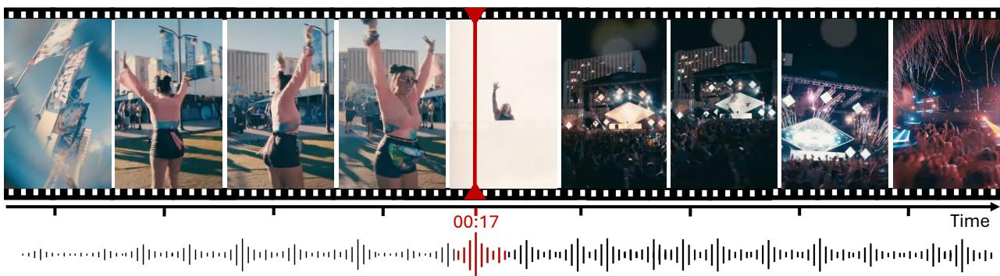
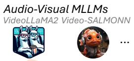
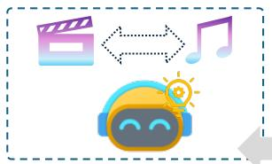
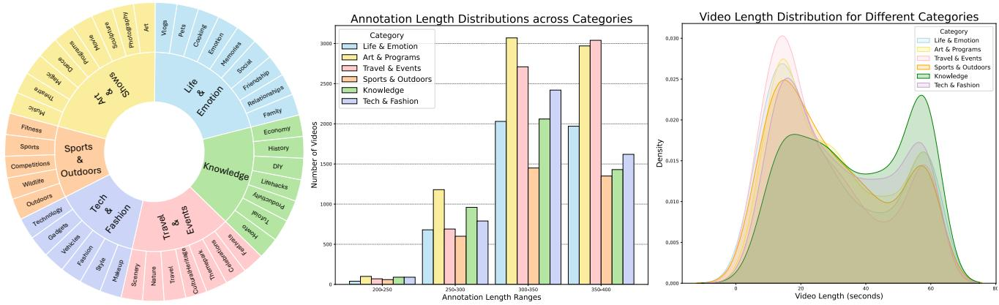
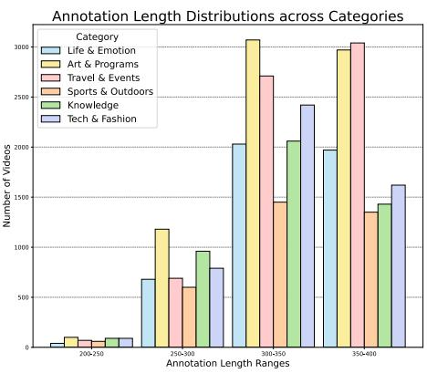
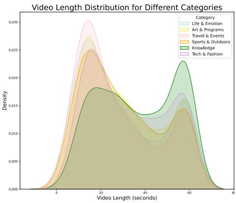
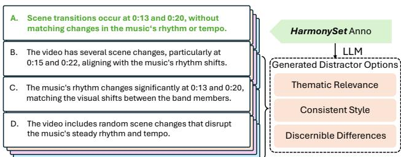
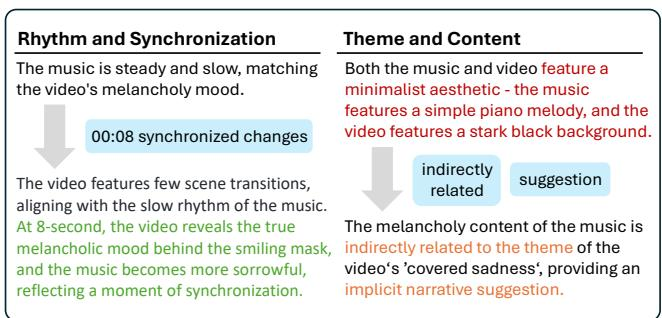
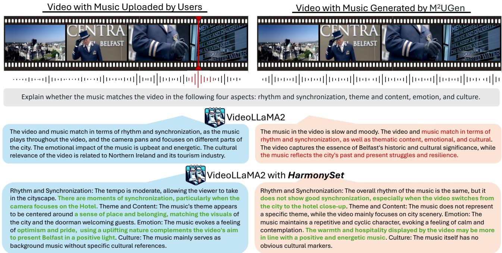

# HarmonySet: A Comprehensive Dataset for Understanding Video-Music Semantic Alignment and Temporal Synchronization

Zitang Zhou⇤,1,2, Ke Mei⇤,1, Yu Lu1,3,B, Tianyi Wang1, Fengyun Rao1 1 WeChat Vision, Tencent Inc. 2 Beijing University of Posts and Telecommunications 3 Zhejiang University

Does the background music fit this video? Evaluate the video-music relevance across rhythm, theme, emotion, and culture.

The music is upbeat and catchy, with a strong rhythm that matches the lively movements. The emotion conveyed is one of joy and freedom.

HarmonySet --- Semantic and Temporal Video-Music Understanding

## Rhythmic Synchronization

There‘s a distinct shift in the music at the 17- second mark, coinciding with a transition in the video from close-up shots of individuals to a shot of a large crowd and stage with pyrotechnics. This synchronization accentuates the shift in energy. The rapid transitions and dynamic visuals aligns well with the music's driving rhythm.

## Thematic Coherence

The content of the video is a celebration similar to a music festival. The explosive nature of the music and contemporary instruments used like electronic guitar indicate a modern celebration theme, suggesting an ongoing carnival that matches the main visual content.

## Emotional Alignment

The fast-paced music conveys exciting and joyful emotion similar to the visuals, enhancing the atmosphere of the celebration and exhilaration. In the latter part of the video, the music and visuals together reach the climax of emotion.

## Cultural Relevance

The video is primarily related to party culture. While the music does not contain specific cultural elements, it suggests the excitement of the party atmosphere.

Figure 1. We introduce HarmonySet, the first instruction tuning dataset for MLLMs to understand the alignment between video and music. While existing MLLMs typically offer surface-level interpretations of video-music relationships, HarmonySet includes 48,328 video-music pairs, each annotated with rich information on rhythmic synchronization, emotional alignment, thematic coherence, and cultural relevance

## Abstract

This paper introduces HarmonySet, a comprehensive dataset designed to advance video-music understanding. Harmony-Set consists of48,328 diverse video-music pairs, annotated with detailed information on rhythmic synchronization, emotional alignment, thematic coherence, and cultural relevance. We propose a multi-step human-machine collaborativeframeworkfor efficient annotation, combining human insights with machine-generated descriptions to identify key transitions and assess alignment across multiple dimensions. Additionally, we introduce a novel evaluationframework with tasks and metrics to assess the multi-dimensional alignment of video and music, including rhythm, emotion, theme, and cultural context. Our extensive experiments demonstrate that HarmonySet, along with the proposed evaluation framework, significantly improves the ability of multimodal models to capture and analyze the intricate relationships between video and music. Project page: https://harmonyset.github.io/.

## 1. Introduction

The rapid growth of online video platforms has led to a rising demand for multimodal content analysis across video, text, and music. This demand is fueled by advancements in large-scale multimodal datasets [7–14] and models [15? , 16], such as Video Multimodal Large Language Models (MLLMs) [17–21], which show strong potential for understanding video semantics and performing cross-modal reasoning tasks.

Despite these advancements, a key challenge remains in the domain of video-music understanding, where capturing the complex semantic and temporal relationships between video content and music proves difficult [22]. Effective video-music understanding requires the ability to recognize nuanced elements, such as emotional tone, narrative progression, and symbolic imagery—critical aspects that underlie the synchronization between video and music. Current models [23–26], however, often provide surface-level interpretations of video-music relationships, failing to capture deeper, context-specific insights, such as rhythm synchronization, emotional alignment, and thematic coherence (as illustrated in the left panel of Figure 1).

A significant limitation in addressing these challenges is the lack of effective datasets that provide comprehensive annotations for video-music understanding. Existing datasets offer paired video and music content [1, 2, 5, 27–30], but their textual annotations typically consist of basic descriptions [3, 6, 31] that fail to capture the detailed semantic alignment and temporal synchronization necessary for effective training of MLLMs. This results in a limited understanding of how music influences the narrative rhythm and emotional tone of video content.

Creating datasets that capture these complex video-music relationships with detailed annotations is a labor-intensive process. Annotators must watch videos while listening to the accompanying music, carefully identifying key transitions to ensure precise temporal alignment. Furthermore, evaluating video-music pairs is inherently subjective [32], as personal taste and cultural context can significantly influence interpretations, making it difficult to standardize annotations.

To address these challenges, we introduce HarmonySet, a novel dataset designed to facilitate a deeper understanding of video-music alignment. HarmonySet consists of 48,328 diverse video-music pairs, curated from a broad range of genres to ensure comprehensive representation. Each pair is annotated with rich information on key aspects of temporal synchronization and semantic alignment, enabling more robust training of multimodal models. As illustrated in Figure 1 , HarmonySet provides annotations that go beyond simple descriptions, offering detailed insights into how video and music align both temporally and semantically.

To efficiently generate these annotations, we propose a multi-step human-machine collaborative labeling framework. Initially, human annotators identify key timestamps that mark synchronized transitions between video and music, forming the foundation for deeper analysis. These timestamps serve as anchors for categorizing the video-music alignment into dimensions such as rhythm synchronization, emotional alignment, thematic coherence, and cultural relevance. Annotators then assess each dimension on a scale, ensuring that the annotations capture the full complexity of the video-music relationship. Machine-generated descriptions are subsequently produced by an MLLM [21], which utilizes the identified timestamps and video metadata to provide detailed, context-aware descriptions of the video-music alignment. This combined human-machine approach significantly reduces annotation workload while maintaining high-quality, multi-dimensional insights.

In addition to the dataset, we introduce a novel evaluation framework for benchmarking video-music understanding models. Our framework includes a series of tasks and metrics designed to evaluate critical aspects of video-music alignment, such as temporal synchronization, emotional congruence, and thematic integration. By providing standardized benchmarks, we aim to establish a more rigorous approach to evaluating the performance of models in understanding the complex interplay between video and music.

Comprehensive experiments demonstrate that both HarmonySet and our evaluation framework significantly enhance the ability of multimodal models to capture and analyze the intricate relationships between video and music.

Our key contributions are threefold:

• We introduce HarmonySet, a diverse collection of videomusic pairs with rich annotations on rhythmic synchronization, emotional alignment, and thematic coherence, addressing the gap in existing datasets for video-music understanding.

• We propose an efficient, multi-step human-machine framework for annotating video-music relationships. This approach combines human insights with machine-generated descriptions to label key transitions and assess alignment across multiple dimensions.

• We introduce a new evaluation framework with tasks and metrics for assessing temporal alignment, emotional congruence, and thematic integration, providing a standardized benchmark for video-music understanding tasks.

Table 1. Overview of Video-Music Datasets. HarmonySet provides comprehensive video-music content, and stands out among existing video-music datasets by offering both semantic matching and temporal synchronization annotations.
<table><tr><td>Dataset</td><td>Year</td><td>Music Style</td><td>#Hours</td><td>#Videos</td><td>#Annotations</td><td>Semantic Matching</td><td>Temporal Synchronization</td></tr><tr><td>TT-150K [1]</td><td>2021</td><td>diverse</td><td></td><td>146,351</td><td></td><td>X</td><td>X</td></tr><tr><td>MovieClips [2]</td><td>2022</td><td>diverse</td><td>230</td><td>20,000</td><td></td><td>X</td><td>X</td></tr><tr><td>MuseChat [3]</td><td>2024</td><td>songs</td><td></td><td>98,206</td><td>98,206</td><td></td><td>X</td></tr><tr><td>BGM909 [4]</td><td>2024</td><td>piano</td><td></td><td>909</td><td>9,090</td><td>X</td><td>X</td></tr><tr><td>SVM-10K [5]</td><td>2024</td><td>diverse</td><td></td><td>10,000</td><td></td><td>X</td><td>X</td></tr><tr><td>MMTrail [6]</td><td>2024</td><td>diverse</td><td>27,100</td><td>290,000</td><td>290,000</td><td>X</td><td>X</td></tr><tr><td>HarmonySet (Ours)</td><td>2024</td><td>diverse</td><td>458.8</td><td>48,328</td><td>48,328</td><td>√</td><td>√</td></tr></table>

## 2. Related Work

## 2.1. Video-Audio Datasets

Existing datasets used for training MLLMs emphasize general audio features, rather than the specific musical elements that are central to modern video multimodal contents. For instance, AudioSet [33] and VGGSound [34] are large-scale datasets primarily designed for audio event recognition. Other datasets like FSD50K [35] and ESC-50 [36] are also commonly employed in pre-training multimodal models that accept audio inputs.

## 2.2. Video-Music Datasets

As shown in Table 1, recent benchmarks [27, 29, 30] incorporate video-music content, exploring video-level visual-music semantic alignment. For instance, TT-150K [1] collected 150,000 short videos with music tracks for video-music recommendation. SVM-10K [5] collected short videos with high likes for filtering high-quality music. MovieClips [2] comprises 20,000 videos sourced from the MovieClips YouTube channel. However, these datasets merely offer paired music and video data without detailed annotations, limiting their utility in enhancing MLLM capabilities. Some datasets [4, 28, 37–41] provide annotations for video-music rhythm matching, such as BGM909 [4] providing short music descriptions, music chords, and beats, but they lack analysis of emotional alignment and semantic transitions. MM-Trail [6] provides trailer videos and includes descriptions for MLLM instruction tuning, but it does not thoroughly investigate the video-music relationship. Musechat [3] and YT8M-MusicTextClips [31] automatically formulated music recommendation dialogues. None of these datasets deliver cohesive and multi-dimensional reasoning on the intricate video-music relationships. The temporal synchronization that enhances the harmony between music and visual narratives remains largely unexplored.

## 2.3. Video Datasets and Benchmarks

Traditional Vision-Language (VL) benchmarks [42–46] have primarily focused on specific capabilities such as multimodal retrieval and vision question answering (QA). The advent of multimodal large language models (MLLMs) has spurred the development of benchmarks designed to assess more integrated VL tasks [7–9, 47–54]. For instance, VideoMME [13], MM-Vet [12], Q-Bench [14], EgoSchema [10], and MMBench [11] emphasize comprehensive VL skills. These benchmarks introduce evaluation metrics that go beyond simple model hierarchies, providing a more nuanced assessment of model performance across a range of vision-language tasks.

## 2.4. Multimodal Large Language Models

Video large language models have evolved significantly from captioning tools like BLIP2 [55] to more advanced systems such as VideoChat [56] and Video-LLaVA [19], which demonstrate capabilities in dialogue generation and question-answering [17, 18, 20, 56–58]. Increasingly, models are also incorporating audio modalities [59, 60]. Examples include VideoLLaMA2 [23], video-SALMONN [24], Macaw-LLM [26], and VALOR [25], which can analyze both video and audio content and provide open-ended text outputs. These methods leverage powerful language models and can provide a deeper understanding of the relationship between video, audio, and text content, going beyond mere video-audio matching.

## 3. The HarmonySet Dataset & Benchmark

HarmonySet is designed to advance the understanding of video-music relationships by examining how background music aligns with and enhances visual narratives. This dataset emphasizes key aspects of synchronization and semantic alignment, focusing on temporal dynamics, rhythm, theme, emotion, and cultural relevance. In this section, we describe the data collection and annotation process, present dataset statistics, and discuss quality control measures. We demonstrate that HarmonySet is a pioneering resource for studying video-music alignment, offering rich insights into the synchronization between music and visual storytelling.

## 3.1. Video Collection

To ensure a diverse and high-quality collection of videomusic pairs, we implemented a hierarchical tagging structure to facilitate the identification of videos that feature wellaligned background music. This structure includes primary categories such as Life & Emotions, Arts & Performance, Travel & Events, Sports & Fitness, Knowledge, and Technology & Fashion, each of which represents a broad genre, format, and cultural expression. These categories are further subdivided into 43 specific subcategories (see Figure 2, left). In addition, we generated 293 relevant keywords derived from these subcategories to guide our video search process. Using these keywords, we crawled videos from YouTube Shorts, ensuring a variety of music genres and visual content. The dataset exclusively includes videos with user-added background music that complements the visual content. To ensure data consistency, annotators manually reviewed the collected videos to remove those lacking music. To verify the presence of music, we employed the PANNs [61] model, which confirmed that 83% of the videos from our search contained music. Videos without music were excluded to maintain dataset integrity.

## 3.2. Annotation Construction

To make HarmonySet a valuable resource for research on video-music relationships, we implemented a multi-phase annotation process that captures various aspects of the audiovisual content. The annotation process consists of two primary phases: manual annotation by trained annotators and automated refinement using machine-generated annotations.

## 3.2.1. Manual Annotation

Manual annotation includes two main components: synchronization with timestamps and multi-dimensional label assignment.

Synchronization Annotation: Annotators identify key moments in the video, such as transitions or shifts in the visual narrative (e.g., scene changes or plot twists). They assess whether the music changes at these points and whether these changes align with the visual transitions, marking the timestamps for temporal synchronization.

Labeling: A structured labeling system is used to evaluate the relationship between the video and music across four dimensions: rhythm and synchronization, theme and content, emotion, and cultural relevance. Each label reflects the extent of alignment between the music and video. For example, in the content alignment dimension, possible labels include “strongly related,” “indirectly related,” “unrelated,” and “conflicting.” In the narrative enhancement dimension, labels include “enhancing,” “suggesting,” “reversing,” “independent narrative,” and “no supplement.” Annotators select the most appropriate label for each dimension, providing a nuanced and multi-faceted understanding of the video-music

relationship.

Each video is annotated by three independent annotators to ensure objectivity and reliability. The final annotations are derived from the consensus among these annotators, minimizing individual biases and enhancing the robustness of the dataset.

## 3.2.2. Quality Control

A rigorous quality review process was implemented to ensure accurate and reliable annotations. A dedicated reviewer cross-checked each annotation for key timestamp accuracy consistency and factual grounding of the labels. This process mitigates potential biases and ensures data quality.

## 3.2.3. Automated Annotation Curation

Following manual annotation, we employed Gemini 1.5 Pro [21] to generate enhanced annotations. The inputs for this process included the video and audio content, the manually verified annotations (used as ground truth), and the video metadata (e.g., titles, and descriptions). The system was tasked with generating detailed descriptions of the videomusic relationship, focusing on the four key dimensions: rhythm and synchronization, theme and content, emotion, and cultural relevance. The final output provides temporally aligned, multi-dimensional annotations that offer deeper insights into the alignment between video and music. Specific generation prompts and further details on the automated annotation process can be found in the appendix.

## 3.3. Instruction Tuning Dataset Statistics

To further enhance the utility of the HarmonySet dataset for training multimodal models, we created an instructiontuning dataset. This dataset includes structured annotations that provide detailed explanations of the video-music relationships, enabling the fine-tuning of models for MLLMs to better understand video-music content.

The HarmonySet instruction tuning dataset consists of 44,470 video-music pairs, each with an annotation that provides a structured explanation of the video-music connections. Figure 2 (middle & right) illustrates the distribution of annotation length and video durations within the Harmony-Set dataset. The videos are between 2.96 and 63.38 seconds in length, with an average duration of 31.5 seconds, contributing to a total of 458.8 hours of video and music content. The average number of words in HarmonySet annotations is 352.65 words for each video-music pair.

## 3.4. HarmonySet Benchmark

HarmonySet-OE HarmonySet-OE is comprised of 3,858 video-music pairs along with their accompanying annotations. MLLMs are required to address the video-music alignment relationships, including both temporal synchronization and semantic matching. The expected responses are designed to be open-ended to cover the diverse angles of video-music relationships. Traditional language metrics like BLEU-4 [62] and ROUGE-L [63] are only sensitive to lexical variations and cannot identify changes in sentence semantics. Recent study [64] has proved LLM [65] to be a reliable evaluation tool for open-ended responses. Therefore, MLLM scores are obtained by comparing the MLLM outputs with the ground truth provided by HarmonySet-OE using LLM. The specific prompt of LLM for evaluation can be found in Appendix.

  
Figure 2. HarmonySet Statistics. (Left) HarmonySet covers 6 main categories and is divided into 43 subclasses with a full spectrum o content types. (Middle) Distributions of the number of words across categories in HarmonySet annotations. HarmonySet has a balanced annotation length across 6 main categories. (Right) Video duration distributions for different categories. The video durations are concentrated between 10 seconds and 60 seconds, with a rich number of videos in each time segment.

  
Figure 3. An example of HarmonySet-MC curation. We used LLM to convert open-ended annotations into multiple-choice options, with HarmonySet annotations serving as the correct options. Wrong options are constructed to be challenging yet distinguishable from the correct option.

HarmonySet-MC We further developed HarmonySet-MC, a multiple-choice extension of HarmonySet-OE, to facilitate a more structured and objective evaluation process. Specifically, we instructed GPT-4o to use the annotated answer as the correct option and create three wrong options. These distracting options were carefully crafted to meet the following criteria: 1) Maintain thematic relevance to the correct answer, avoiding overly obvious discrepancies, 2) Resemble the correct answer in length and sentence structure, avoiding superficial distinctions, and 3) Present discernible semantic differences compared to the correct answer, see Figure 3 for an example. HarmonySet-MC includes the same 3,858 video-music pairs with HarmonySet-OE, each with four multiple-choice questions corresponding to four distinct aspects of rhythm, emotion, theme, and cultural context. HarmonySet-MC offers a convenient evaluation tool, allowing direct assessment of model performance using multiple-choice accuracy.

  
Figure 4. An example of annotation before and after the introduction of manual labels. The red text highlights an unreasonable explanation that arises in the absence of human guidance.

## 3.5. Dataset Assessment

Due to the potential influence of individual biases on the annotations, we conducted a consensus evaluation after completing all annotations to ensure agreement and objectivity. The results, detailed in Table 3, show that HarmonySet gets 92% high consensus.

Figure 4 illustrates the comparison of a video’s two aspects of annotation before and after injecting manual labels. Manual annotations provide more accurate semantic alignment understanding and incorporate specific temporal synchronization information. Without human knowledge, models tend to generate spurious video-music connections or meaningless responses. Experiment in Table 4 also confirms the significant positive impact of human annotation on improving video-music understanding.

Table 2. Main Results on HarmonySet-OE. We tested Gemini-1.5 Pro and open source MLLMs including VideoLLaMA2 and video-SALMONN. The bottom part presents results of VideoLLaMA2 finetuned on our instruction tuning dataset. While Gemini-1.5 Pro leads among untrained models, VideoLLaMA2 finetuned with HarmonySet demonstrates significant improvement and a strong understanding of video-music alignment. Results on synchronization can be found in R & S (Rhythm & Synchronization), and semantic matching results consist of scores in T (Theme), E (Emotion), and C (Culture).
<table><tr><td>Models</td><td>LLM</td><td>Metrics</td><td>Life &amp; Emotion</td><td>Art &amp; Performance</td><td>Travel &amp; Events</td><td>Sports &amp; Outdoors</td><td>Knowledge</td><td>Tech &amp; Fashion</td><td>Overall</td></tr><tr><td>- Close-source MLLM</td><td></td><td></td><td></td><td></td><td></td><td></td><td></td><td></td><td></td></tr><tr><td rowspan="4">Gemini-1.5 Pro [66]</td><td rowspan="4"></td><td>R&amp;S</td><td>5.30</td><td>6.05</td><td>5.69</td><td>4.94</td><td>4.91</td><td>4.98</td><td>5.43</td></tr><tr><td>T</td><td>5.25</td><td>5.76</td><td>5.75</td><td>4.41</td><td>4.46</td><td>4.49</td><td>5.18</td></tr><tr><td>E</td><td>5.28</td><td>5.75</td><td>5.60</td><td>4.59</td><td>4.45</td><td>4.43</td><td>5.15</td></tr><tr><td>C</td><td>4.64</td><td>4.91</td><td>4.77</td><td>3.85</td><td>4.27</td><td>4.03</td><td>4.51</td></tr><tr><td>- Open-source MLLMs</td><td></td><td></td><td></td><td></td><td></td><td></td><td></td><td></td><td></td></tr><tr><td rowspan="5">VideoLLaMA2 [23]</td><td rowspan="5">Qwen2-7B</td><td>R&amp;S</td><td></td><td>4.80</td><td>4.56</td><td></td><td></td><td>3.54</td><td>4.15</td></tr><tr><td>T</td><td>3.89 4.09</td><td></td><td>4.93</td><td>4.01</td><td>3.39 3.44</td><td>3.71</td><td>4.29</td></tr><tr><td></td><td>4.36</td><td>4.83</td><td>5.02</td><td>3.89 4.08</td><td>3.44</td><td>3.49</td><td>4.38</td></tr><tr><td>E C</td><td>2.95</td><td>5.01</td><td>3.69</td><td></td><td>2.32</td><td>2.52</td><td>3.05</td></tr><tr><td></td><td></td><td>3.46</td><td></td><td>2.56</td><td></td><td></td><td></td></tr><tr><td rowspan="4">video-SALMONN [24]</td><td rowspan="4">Vicuna-13B-v1.5</td><td></td><td>2.43</td><td>3.53</td><td>2.98</td><td>2.68</td><td>2.32</td><td>2.51</td><td>2.83</td></tr><tr><td>R&amp;S T</td><td>3.24</td><td>4.18</td><td>3.97</td><td>3.23</td><td>2.96</td><td>3.00</td><td>3.55</td></tr><tr><td>E</td><td>3.11</td><td>4.12</td><td>3.84</td><td>3.13</td><td>2.56</td><td>2.70</td><td>3.38</td></tr><tr><td>C</td><td>1.85</td><td>2.51</td><td>2.51</td><td>1.77</td><td>1.68</td><td>1.84</td><td>2.12</td></tr><tr><td>- With HarmonySet</td><td></td><td></td><td></td><td></td><td></td><td></td><td></td><td></td><td></td></tr><tr><td rowspan="4">VideoLLaMA2 (HarmonySet)</td><td rowspan="4"></td><td></td><td></td><td></td><td></td><td></td><td></td><td></td><td></td></tr><tr><td>R&amp;S</td><td>5.43</td><td>6.35</td><td>6.03</td><td>4.94</td><td>5.33</td><td>4.83 4.85</td><td>5.55</td></tr><tr><td>T E</td><td>5.12</td><td>5.21</td><td>5.03</td><td>4.84</td><td>5.21 4.88</td><td>4.47</td><td>5.06 5.26</td></tr><tr><td>C</td><td>5.25 4.87</td><td>6.41 4.98</td><td>5.84 4.72</td><td>4.00 3.31</td><td>5.23</td><td>4.09</td><td>4.62</td></tr></table>

Table 3. Consensus evaluation result. We randomly sampled 10% of the data and had human reviewers select “Low”, “Medium”, or “High” as their level of agreement with the annotations. Harmony-Set gets 92% high consensus, showing a high level of agreement.
<table><tr><td></td><td>Low</td><td>Medium</td><td>High</td></tr><tr><td>Consensus</td><td>3%</td><td>5%</td><td>92%</td></tr></table>

## 3.6. Dataset Property

HarmonySet emphasis on temporal synchronization. One crucial factor of video-music connection lies in temporal synchronization. For example, the music becomes more intense just as an athlete makes a final sprint. Such synchronized changes contribute significantly to an immersive visual-music experience. Static images paired with music can only achieve content or mood matching, lacking the ability to express such dynamic transitions. HarmonySet not only includes detailed annotations on the overall pace suitability and beat matching but also provides timestamped explanations of video-music transitions. 58% of the data in HarmonySet contains key timestamp annotations, providing valuable support for understanding temporal relationships between video and music.

HarmonySet provides deep semantic alignment understanding. The semantic resonance between video and music often manifests as a subtle connection that is difficult to articulate. HarmonySet categorizes this semantic alignment into four dimensions, providing a comprehensive framework for understanding these complex relationships.

## 4. Experiments

## 4.1. Baselines

We conduct the evaluation on Gemini 1.5 Pro [21] and stateof-the-art open-source video-audio MLLMs, including VideoLLaMA2 [23] and video-SALMONN [24]. For a fair comparison, we adopt the zero-shot setting to infer HarmonySet-OE questions with all MLLMs based on the same prompt. In the experiments presented in Table 2, we used a consistent 16 frames for the video input of open-source models for both inference and fine-tuning. A special case is Gemini 1.5 Pro, which supports relatively long multimodal contexts, and videos are sampled at 1 frame per second for the input. In the Appendix, we provide detailed information regarding the architecture and the parameter size for all open-source MLLMs evaluated in this paper, as well as additional results for more MLLMs under various settings.

Table 4. Comparison between performance of VideoLLaMA2 trained on fully automated data and HarmonySet data. Models trained with our instruction tuning data demonstrates a clear advantage, validating the value of human expertise in providing rich information on synchronization and semantic alignment and the effectiveness of our human-machine collaborative framework.
<table><tr><td>Models</td><td>Metrics</td><td>Life &amp; Emotion</td><td>Art &amp; Performance</td><td>Travel &amp; Events</td><td>Sports &amp; Outdoors</td><td>Knowledge</td><td>Tech &amp; Fashion</td><td>Overall</td></tr><tr><td rowspan="4">VideoLLaMA2 (F.A., 10k)</td><td>R&amp;S</td><td>4.56</td><td>5.05</td><td>4.97</td><td>4.28</td><td>4.20</td><td>4.17</td><td>4.59</td></tr><tr><td>T</td><td>4.20</td><td>5.01</td><td>4.85</td><td>3.49</td><td>3.36</td><td>3.41</td><td>4.16</td></tr><tr><td>E</td><td>4.29</td><td>4.76</td><td>4.67</td><td>4.03</td><td>3.76</td><td>3.79</td><td>4.28</td></tr><tr><td>C</td><td>3.53</td><td>3.98</td><td>3.67</td><td>2.93</td><td>3.13</td><td>3.02</td><td>3.44</td></tr><tr><td rowspan="4">VideoLLaMA2 (HarmonySet, 10k)</td><td>R&amp;S</td><td>4.69</td><td>5.58</td><td>5.30</td><td>4.49</td><td>4.36</td><td>4.25</td><td>4.86</td></tr><tr><td>T</td><td>4.66</td><td>5.02</td><td>4.98</td><td>4.40</td><td>4.39</td><td>4.29</td><td>4.70</td></tr><tr><td>E</td><td>4.64</td><td>5.43</td><td>5.26</td><td>4.06</td><td>3.85</td><td>3.78</td><td>4.66</td></tr><tr><td>C</td><td>3.99</td><td>4.30</td><td>4.25</td><td>2.97</td><td>3.79</td><td>3.34</td><td>3.89</td></tr></table>

Table 5. Human and model performance on HarmonySet-MC. While VideoLLaMA2 tuned on HarmonySet surpasses Gemini-1.5 Pro in certain aspects, it still falls short of human performance, highlighting both the challenging nature of our task and the limitations of current models.
<table><tr><td></td><td>R &amp; S (Acc.)</td><td>T (Acc.)</td><td>E (Acc.)</td><td>C (Acc.)</td></tr><tr><td>Gemini-1.5 Pro</td><td>41.84%</td><td>45.45%</td><td>44.43%</td><td>50.40%</td></tr><tr><td>Video-LLaMA2</td><td>21.76%</td><td>48.95%</td><td>52.76%</td><td>24.29%</td></tr><tr><td>Video-LLaMA2 (HarmonySet)</td><td>10.63%</td><td>54.16%</td><td>47.32%</td><td>36.66%</td></tr><tr><td>Human</td><td>85.26%</td><td>88.19%</td><td>84.49%</td><td>93.81%</td></tr></table>

Table 6. Results of VideoLLaMA2 trained on HarmonySet with 16, 32, and 64 frames. Using 64 frames yields the lowest scores, indicating potential redundancy or even negative effects from excessive visual input within short (<1 minute) videos.
<table><tr><td></td><td>R&amp;S</td><td>T</td><td>E</td><td>C</td></tr><tr><td>16 Frames</td><td>5.55</td><td>5.06</td><td>5.26</td><td>4.62</td></tr><tr><td>32 Frames</td><td>5.59</td><td>5.08</td><td>5.29</td><td>4.65</td></tr><tr><td>64 Frames</td><td>5.49</td><td>4.94</td><td>5.21</td><td>4.53</td></tr></table>

## 4.2. Main Results

Table 2 shows the main results on HarmonySet-OE. Gemini-1.5 Pro generally outperforms untrained opensource MLLMs across all categories and metrics, significantly exceeding the second-best model in Rhythm & Synchronization (by 1.28) and Culture (by 1.46). This might be due to its capacity for long context inputs and timestamped outputs, allowing for better alignment with human annotations that often consider temporal relationships. The performance in culturally nuanced pairings might stem from Gemini-1.5 Pro’s extensive training data.

Untrained VideoLLaMA2 and video-SALMONN both underperform Gemini-1.5 Pro. While VideoLLaMA2 shows moderate rhythmic synchronization (4.15), its semantic matching capabilities are weaker, particularly in cultural understanding (3.05). This suggests a deficiency in comprehending nuanced cultural differences and contextual information. Video-SALMONN consistently scores lowest across all metrics and categories, struggling with understanding temporal synchronization, emotional congruence, thematic integration, and cultural relevance. The open-source models weaker performance likely stems from having less training data (in both quantity and quality, especially regarding cultural nuances) and limited input capacity, hindering analysis of complex relationships and rhythmic synchronization requiring longer temporal contexts.

Training VideoLLaMA2 on HarmonySet yields substantial improvements, boosting its Rhythm & Synchronization score by 1.40 and Culture score by 1.57. This surpasses previous state-of-the-art results in most domains, demonstrating HarmonySet’s effectiveness in addressing limitations of models trained on lower-quality data and fostering deeper multimodal understanding.

## 4.3. HarmonySet-MC Results

We evaluated different models on HarmonySet-MC and invited individuals unfamiliar with the dataset to provide human performance. From Table 5, it is evident that human performance significantly outperforms the best model results across all evaluation perspectives. This highlights the challenging nature of our dataset, which effectively measures the gap between model performance and human-level understanding. These results indicate that current models still struggle to effectively understand the complex interplay between video and music, underscoring the need for further advancements in model training and dataset annotation to bridge this performance gap. The complete experimental results on HarmonySet-MC can be found in the Appendix.

## 4.4. Ablations

Ablation on frame number. We designed experiments to investigate the impact of the number of frames used during training on the model’s performance, as shown in Table 6. Increasing the frames from 16 to 32 improves the model’s performance across all aspects. However, using 64 frames yields the worst performance, even lower than with 16 frames. This might be attributed to the focus of our videos on short-form content under one minute, where 64 frames could introduce increased computational complexity, potential overfitting, or information redundancy.

  
Figure 5. VideoLLaMA2’s response before and after training with our instruction tuning dataset. The left video features human-composed soundtracks, while the right video is with AI-generated soundtracks. Without HarmonySet, the model often provides the wrong justification for the generated music for its harmony with the visual content (highlighted in red text). The trained model offers more insightful analysis and can effectively assess both human-composed and AI-generated music. Our dataset facilitates a deeper understanding of both synchronization and semantic alignment.

Can fully automated data provide sufficient capability? HarmonySet provides valuable video-music annotations that enhance the multimodal understanding of MLLMs. To evaluate the dataset’s effectiveness, we compared two types of training data: annotations fully generated by Gemini 1.5 Pro and those derived from our HarmonySet. Both training processes utilized 10,000 samples. Results show in Table 4 that training on the fully automated data yields minimal performance gains. Models trained with HarmonySet annotations consistently surpass those trained with auto-generated data, especially in capturing synchronization and semantic alignment between video and music. These results highlight the importance of a human-machine collaborative framework in enhancing multimodal models’ video-music understanding.

## 4.5. Effectiveness on Assessing AI-Generated Music

Generating music for videos [67–71] is a highly challenging task that requires harmony between music and visual narratives in terms of synchronization and semantic alignment. Figure 5 shows VideoLLaMA2’s improved ability to differentiate between human-composed and AI-generated soundtracks [67] after training with HarmonySet. The vanilla

VideoLLaMA2 struggled to justify the generated music’s harmony with the video, likely due to a lack of understanding of what constitutes harmonious alignment. With Harmony-Set, the model provides more detailed temporal and semantic analyses, enabling more objective evaluation. These results offer valuable insights for future video soundtrack creation.

## 5. Conclusion

We introduce HarmonySet, the first dataset focused on facilitating the ability of MLLMs in comprehensive videomusic understanding. HarmonySet comprises a diverse domain of videos with high-quality music, each annotated with structured explanations detailing the semantic matching and temporal synchronization between video and music. Our extensive evaluation of state-of-the-art MLLMs, encompassing commercial and open-source models, reveals the limitations of MLLMs’ reasoning about the interplay between visual and musical elements. This highlights the challenge of achieving in-depth video-music understanding. There are many exciting directions to build upon this work, including developing novel MLLM architectures specifically tailored for video-music analysis and investigating the potential for cross-modal knowledge transfer between video and music content. We hope HarmonySet will inspire future research and development in improving the capabilities of MLLMs.

## References

[1] Jing Yi, Yaochen Zhu, Jiayi Xie, and Zhenzhong Chen. Crossmodal variational auto-encoder for content-based micro-video background music recommendation. IEEE Transactions on Multimedia, 25:515–528, 2021. 2, 3

[2] D´ıdac Sur´ıs, Carl Vondrick, Bryan Russell, and Justin Salamon. It’s time for artistic correspondence in music and video. In Proceedings of the IEEE/CVF Conference on Computer Vision and Pattern Recognition, pages 10564–10574, 2022. 2, 3

[3] Zhikang Dong, Xiulong Liu, Bin Chen, Pawel Polak, and Peng Zhang. Musechat: A conversational music recommendation system for videos. In Proceedings of the IEEE/CVF Conference on Computer Vision and Pattern Recognition, pages 12775–12785, 2024. 2, 3

[4] Sizhe Li, Yiming Qin, Minghang Zheng, Xin Jin, and Yang Liu. Diff-bgm: A diffusion model for video background music generation. In Proceedings of the IEEE/CVF Conference on Computer Vision and Pattern Recognition, pages 27348– 27357, 2024. 3

[5] Jiajie Teng, Huiyu Duan, Yucheng Zhu, Sijing Wu, and Guangtao Zhai. Mvbind: Self-supervised music recommendation for videos via embedding space binding. arXiv preprint arXiv:2405.09286, 2024. 2, 3

[6] Xiaowei Chi, Yatian Wang, Aosong Cheng, Pengjun Fang, Zeyue Tian, Yingqing He, Zhaoyang Liu, Xingqun Qi, Jiahao Pan, Rongyu Zhang, et al. Mmtrail: A multimodal trailer video dataset with language and music descriptions. arXiv preprint arXiv:2407.20962, 2024. 2, 3

[7] Shuai Bai, Shusheng Yang, Jinze Bai, Peng Wang, Xingxuan Zhang, Junyang Lin, Xinggang Wang, Chang Zhou, and Jingren Zhou. Touchstone: Evaluating vision-language models by language models. arXiv preprint arXiv:2308.16890, 2023. 2, 3

[8] Kunchang Li, Yali Wang, Yinan He, Yizhuo Li, Yi Wang, Yi Liu, Zun Wang, Jilan Xu, Guo Chen, Ping Luo, et al. Mvbench: A comprehensive multi-modal video understanding benchmark. In Proceedings of the IEEE/CVF Conference on Computer Vision and Pattern Recognition, pages 22195– 22206, 2024.

[9] Bohao Li, Yuying Ge, Yixiao Ge, Guangzhi Wang, Rui Wang, Ruimao Zhang, and Ying Shan. Seed-bench: Benchmarking multimodal large language models. In Proceedings of the IEEE/CVF Conference on Computer Vision and Pattern Recognition, pages 13299–13308, 2024. 3

[10] Karttikeya Mangalam, Raiymbek Akshulakov, and Jitendra Malik. Egoschema: A diagnostic benchmark for very longform video language understanding. Advances in Neural Information Processing Systems, 36:46212–46244, 2023. 3

[11] Yuan Liu, Haodong Duan, Yuanhan Zhang, Bo Li, Songyang Zhang, Wangbo Zhao, Yike Yuan, Jiaqi Wang, Conghui He, Ziwei Liu, et al. Mmbench: Is your multi-modal model an all-around player? In European Conference on Computer Vision, pages 216–233. Springer, 2025. 3

[12] Weihao Yu, Zhengyuan Yang, Linjie Li, Jianfeng Wang, Kevin Lin, Zicheng Liu, Xinchao Wang, and Lijuan Wang.

Mm-vet: Evaluating large multimodal models for integrated capabilities. arXiv preprint arXiv:2308.02490, 2023. 3

[13] Chaoyou Fu, Yuhan Dai, Yongdong Luo, Lei Li, Shuhuai Ren, Renrui Zhang, Zihan Wang, Chenyu Zhou, Yunhang Shen, Mengdan Zhang, et al. Video-mme: The first-ever comprehensive evaluation benchmark of multi-modal llms in video analysis. arXiv preprint arXiv:2405.21075, 2024. 3

[14] Haoning Wu, Zicheng Zhang, Erli Zhang, Chaofeng Chen, Liang Liao, Annan Wang, Chunyi Li, Wenxiu Sun, Qiong Yan, Guangtao Zhai, et al. Q-bench: A benchmark for general-purpose foundation models on low-level vision. arXiv preprint arXiv:2309.14181, 2023. 2, 3

[15] Yucheng Suo, Fan Ma, Linchao Zhu, and Yi Yang. Knowledge-enhanced dual-stream zero-shot composed image retrieval. In Proceedings of the IEEE/CVF Conference on Computer Vision and Pattern Recognition (CVPR), pages 26951–26962, June 2024. 2

[16] Yucheng Suo, Fan Ma, Kaixin Shen, Linchao Zhu, and Yi Yang. Long-horizon visual instruction generation with logic and attribute self-reflection. In The Thirteenth International Conference on Learning Representations, 2025. 2

[17] Muhammad Maaz, Hanoona Rasheed, Salman Khan, and Fahad Shahbaz Khan. Video-chatgpt: Towards detailed video understanding via large vision and language models. arXiv preprint arXiv:2306.05424, 2023. 2, 3

[18] Renrui Zhang, Jiaming Han, Chris Liu, Peng Gao, Aojun Zhou, Xiangfei Hu, Shilin Yan, Pan Lu, Hongsheng Li, and Yu Qiao. Llama-adapter: Efficient fine-tuning of language models with zero-init attention. arXiv preprint arXiv:2303.16199, 2023. 3

[19] Bin Lin, Yang Ye, Bin Zhu, Jiaxi Cui, Munan Ning, Peng Jin, and Li Yuan. Video-llava: Learning united visual representation by alignment before projection. arXiv preprint arXiv:2311.10122, 2023. 3

[20] Bo Li, Yuanhan Zhang, Dong Guo, Renrui Zhang, Feng Li, Hao Zhang, Kaichen Zhang, Yanwei Li, Ziwei Liu, and Chunyuan Li. Llava-onevision: Easy visual task transfer. arXiv preprint arXiv:2408.03326, 2024. 3

[21] Gemini Team, Petko Georgiev, Ving Ian Lei, Ryan Burnell, Libin Bai, Anmol Gulati, Garrett Tanzer, Damien Vincent, Zhufeng Pan, Shibo Wang, et al. Gemini 1.5: Unlocking multimodal understanding across millions of tokens of context. arXiv preprint arXiv:2403.05530, 2024. 2, 4, 6

[22] RHYTHMIC SYNCHRONIZATION. Muvi: Video-to-music generation with seman-tic alignment and rhythmic synchronization. 2

[23] Zesen Cheng, Sicong Leng, Hang Zhang, Yifei Xin, Xin Li, Guanzheng Chen, Yongxin Zhu, Wenqi Zhang, Ziyang Luo, Deli Zhao, et al. Videollama 2: Advancing spatialtemporal modeling and audio understanding in video-llms. arXiv preprint arXiv:2406.07476, 2024. 2, 3, 6

[24] Guangzhi Sun, Wenyi Yu, Changli Tang, Xianzhao Chen, Tian Tan, Wei Li, Lu Lu, Zejun Ma, Yuxuan Wang, and Chao Zhang. video-salmonn: Speech-enhanced audio-visual large language models. arXiv preprint arXiv:2406.15704, 2024. 3, 6

[25] Sihan Chen, Xingjian He, Longteng Guo, Xinxin Zhu, Weining Wang, Jinhui Tang, and Jing Liu. Valor: Vision-audiolanguage omni-perception pretraining model and dataset. arXiv preprint arXiv:2304.08345, 2023. 3

[26] Chenyang Lyu, Minghao Wu, Longyue Wang, Xinting Huang, Bingshuai Liu, Zefeng Du, Shuming Shi, and Zhaopeng Tu. Macaw-llm: Multi-modal language modeling with image, audio, video, and text integration. arXiv preprint arXiv:2306.09093, 2023. 2, 3

[27] Sungeun Hong, Woobin Im, Jongbin Ryu, and Hyun S Yang. Sspp-dan: Deep domain adaptation network for face recognition with single sample per person. In 2017 IEEE International Conference on Image Processing (ICIP), pages 825–829. IEEE, 2017. 2, 3

[28] Bochen Li, Xinzhao Liu, Karthik Dinesh, Zhiyao Duan, and Gaurav Sharma. Creating a multitrack classical music performance dataset for multimodal music analysis: Challenges, insights, and applications. IEEE Transactions on Multimedia, 21(2):522–535, 2018. 3

[29] Zeyue Tian, Zhaoyang Liu, Ruibin Yuan, Jiahao Pan, Qifeng Liu, Xu Tan, Qifeng Chen, Wei Xue, and Yike Guo. Vidmuse: A simple video-to-music generation framework with longshort-term modeling. arXiv preprint arXiv:2406.04321, 2024. 3

[30] Guangyao Li, Yake Wei, Yapeng Tian, Chenliang Xu, Ji-Rong Wen, and Di Hu. Learning to answer questions in dynamic audio-visual scenarios. In Proceedings of the IEEE/CVF Conference on Computer Vision and Pattern Recognition, pages 19108–19118, 2022. 2, 3

[31] Daniel McKee, Justin Salamon, Josef Sivic, and Bryan Russell. Language-guided music recommendation for video via prompt analogies. In Proceedings of the IEEE/CVF Conference on Computer Vision and Pattern Recognition, pages 14784–14793, 2023. 2, 3

[32] Andres Ferraro, Xavier Serra, and Christine Bauer. Break the loop: Gender imbalance in music recommenders. In Proceedings of the 2021 conference on human information interaction and retrieval, pages 249–254, 2021. 2

[33] Jort F Gemmeke, Daniel PW Ellis, Dylan Freedman, Aren Jansen, Wade Lawrence, R Channing Moore, Manoj Plakal, and Marvin Ritter. Audio set: An ontology and human-labeled dataset for audio events. In 2017 IEEE international conference on acoustics, speech and signal processing (ICASSP), pages 776–780. IEEE, 2017. 3

[34] Honglie Chen, Weidi Xie, Andrea Vedaldi, and Andrew Zisserman. Vggsound: A large-scale audio-visual dataset. In ICASSP 2020-2020 IEEE International Conference on Acoustics, Speech and Signal Processing (ICASSP), pages 721–725. IEEE, 2020. 3

[35] Eduardo Fonseca, Xavier Favory, Jordi Pons, Frederic Font, and Xavier Serra. Fsd50k: an open dataset of human-labeled sound events. IEEE/ACM Transactions on Audio, Speech, and Language Processing, 30:829–852, 2021. 3

[36] Karol J Piczak. Esc: Dataset for environmental sound classification. In Proceedings of the 23rd ACM international conference on Multimedia, pages 1015–1018, 2015. 3

[37] Ruilong Li, Shan Yang, David A Ross, and Angjoo Kanazawa. Ai choreographer: Music conditioned 3d dance generation

with aist++. In Proceedings of the IEEE/CVF International Conference on Computer Vision, pages 13401–13412, 2021. 3

[38] Le Zhuo, Zhaokai Wang, Baisen Wang, Yue Liao, Chenxi Bao, Stanley Peng, Songhao Han, Aixi Zhang, Fei Fang, and Si Liu. Video background music generation: Dataset, method and evaluation. In Proceedings of the IEEE/CVF International Conference on Computer Vision, pages 15637–15647, 2023.

[39] Jiashuo Yu, Yaohui Wang, Xinyuan Chen, Xiao Sun, and Yu Qiao. Long-term rhythmic video soundtracker. In International Conference on Machine Learning, pages 40339– 40353. PMLR, 2023.

[40] Kaixing Yang, Xukun Zhou, Xulong Tang, Ran Diao, Hongyan Liu, Jun He, and Zhaoxin Fan. Beatdance: A beat-based model-agnostic contrastive learning framework for music-dance retrieval. In Proceedings of the 2024 International Conference on Multimedia Retrieval, pages 11– 19, 2024.

[41] Ye Zhu, Kyle Olszewski, Yu Wu, Panos Achlioptas, Menglei Chai, Yan Yan, and Sergey Tulyakov. Quantized gan for complex music generation from dance videos. In European Conference on Computer Vision, pages 182–199. Springer, 2022. 3

[42] Jun Xu, Tao Mei, Ting Yao, and Yong Rui. Msr-vtt: A large video description dataset for bridging video and language. In Proceedings of the IEEE conference on computer vision and pattern recognition, pages 5288–5296, 2016. 3

[43] Dejing Xu, Zhou Zhao, Jun Xiao, Fei Wu, Hanwang Zhang, Xiangnan He, and Yueting Zhuang. Video question answering via gradually refined attention over appearance and motion. In Proceedings of the 25th ACM international conference on Multimedia, pages 1645–1653, 2017.

[44] Raghav Goyal, Samira Ebrahimi Kahou, Vincent Michalski, Joanna Materzynska, Susanne Westphal, Heuna Kim, Valentin Haenel, Ingo Fruend, Peter Yianilos, Moritz Mueller-Freitag, et al. The” something something” video database for learning and evaluating visual common sense. In Proceedings of the IEEE international conference on computer vision, pages 5842–5850, 2017.

[45] Will Kay, Joao Carreira, Karen Simonyan, Brian Zhang, Chloe Hillier, Sudheendra Vijayanarasimhan, Fabio Viola, Tim Green, Trevor Back, Paul Natsev, et al. The kinetics human action video dataset. arXiv preprint arXiv:1705.06950, 2017.

[46] Junbin Xiao, Xindi Shang, Angela Yao, and Tat-Seng Chua. Next-qa: Next phase of question-answering to explaining temporal actions. In Proceedings of the IEEE/CVF conference on computer vision and pattern recognition, pages 9777– 9786, 2021. 3

[47] Kaining Ying, Fanqing Meng, Jin Wang, Zhiqian Li, Han Lin, Yue Yang, Hao Zhang, Wenbo Zhang, Yuqi Lin, Shuo Liu, et al. Mmt-bench: A comprehensive multimodal benchmark for evaluating large vision-language models towards multitask agi. arXiv preprint arXiv:2404.16006, 2024. 3

[48] Junjie Zhou, Yan Shu, Bo Zhao, Boya Wu, Shitao Xiao, Xi Yang, Yongping Xiong, Bo Zhang, Tiejun Huang, and Zheng Liu. Mlvu: A comprehensive benchmark for multi-task

long video understanding. arXiv preprint arXiv:2406.04264, 2024.

[49] Haoning Wu, Dongxu Li, Bei Chen, and Junnan Li. Longvideobench: A benchmark for long-context interleaved video-language understanding. arXiv preprint arXiv:2407.15754, 2024.

[50] Yu Lu, Ruijie Quan, Linchao Zhu, and Yi Yang. Exploiting unlabeled videos for video-text retrieval via pseudo-supervised learning. IEEE Transactions on Image Processing, 2024.

[51] Yu Lu, Feiyue Ni, Haofan Wang, Xiaofeng Guo, Linchao Zhu, Zongxin Yang, Ruihua Song, Lele Cheng, and Yi Yang. Show me a video: A large-scale narrated video dataset for coherent story illustration. IEEE Transactions on Multimedia, 2023.

[52] Yu Lu, Ruijie Quan, Linchao Zhu, and Yi Yang. Zeroshot video grounding with pseudo query lookup and verification. IEEE Transactions on Image Processing, 33:1643–1654, 2024.

[53] Binzhu Xie, Sicheng Zhang, Zitang Zhou, Bo Li, Yuanhan Zhang, Jack Hessel, Jingkang Yang, and Ziwei Liu. Funqa: Towards surprising video comprehension. In European Conference on Computer Vision, pages 39–57. Springer, 2024.

[54] Yongliang Wu, Wenbo Zhu, Jiawang Cao, Yi Lu, Bozheng Li, Weiheng Chi, Zihan Qiu, Lirian Su, Haolin Zheng, Jay Wu, et al. Video repurposing from user generated content: A large-scale dataset and benchmark. arXiv preprint arXiv:2412.08879, 2024. 3

[55] Junnan Li, Dongxu Li, Silvio Savarese, and Steven Hoi. Blip-2: Bootstrapping language-image pre-training with frozen image encoders and large language models. In International conference on machine learning, pages 19730–19742. PMLR, 2023. 3

[56] KunChang Li, Yinan He, Yi Wang, Yizhuo Li, Wenhai Wang, Ping Luo, Yali Wang, Limin Wang, and Yu Qiao. Videochat: Chat-centric video understanding. arXiv preprint arXiv:2305.06355, 2023. 3

[57] Jingkang Yang, Yuhao Dong, Shuai Liu, Bo Li, Ziyue Wang, Haoran Tan, Chencheng Jiang, Jiamu Kang, Yuanhan Zhang, Kaiyang Zhou, et al. Octopus: Embodied vision-language programmer from environmental feedback. In European Conference on Computer Vision, pages 20–38. Springer, 2024.

[58] Hang Zhang, Xin Li, and Lidong Bing. Video-LLaMA: An instruction-tuned audio-visual language model for video understanding. In Yansong Feng and Els Lefever, editors, Proceedings of the 2023 Conference on Empirical Methods in Natural Language Processing: System Demonstrations, pages 543–553, Singapore, December 2023. Association for Computational Linguistics. 3

[59] Sihan Chen, Handong Li, Qunbo Wang, Zijia Zhao, Mingzhen Sun, Xinxin Zhu, and Jing Liu. Vast: A vision-audio-subtitletext omni-modality foundation model and dataset. Advances in Neural Information Processing Systems, 36:72842–72866, 2023. 3

[60] Bin Zhu, Bin Lin, Munan Ning, Yang Yan, Jiaxi Cui, HongFa Wang, Yatian Pang, Wenhao Jiang, Junwu Zhang, Zongwei Li, et al. Languagebind: Extending video-language pretraining

to n-modality by language-based semantic alignment. arXiv preprint arXiv:2310.01852, 2023. 3

[61] Qiuqiang Kong, Yin Cao, Turab Iqbal, Yuxuan Wang, Wenwu Wang, and Mark D Plumbley. Panns: Large-scale pretrained audio neural networks for audio pattern recognition. IEEE/ACM Transactions on Audio, Speech, and Language Processing, 28:2880–2894, 2020. 4, 1

[62] Kishore Papineni, Salim Roukos, Todd Ward, and Wei-Jing Zhu. Bleu: a method for automatic evaluation of machine translation. In Proceedings of the 40th annual meeting of the Association for Computational Linguistics, pages 311–318, 2002. 5, 2

[63] Chin-Yew Lin. Rouge: A package for automatic evaluation of summaries. In Text summarization branches out, pages 74–81, 2004. 5, 3

[64] Lianmin Zheng, Wei-Lin Chiang, Ying Sheng, Siyuan Zhuang, Zhanghao Wu, Yonghao Zhuang, Zi Lin, Zhuohan Li, Dacheng Li, Eric Xing, et al. Judging llm-as-a-judge with mt-bench and chatbot arena. Advances in Neural Information Processing Systems, 36:46595–46623, 2023. 5

[65] OpenAI, Josh Achiam, Steven Adler, Sandhini Agarwal, Lama Ahmad, Ilge Akkaya, Florencia Leoni Aleman, Diogo Almeida, Janko Altenschmidt, Sam Altman, et al. Gpt-4 technical report, 2024. 5

[66] Aaron Hurst, Adam Lerer, Adam P Goucher, Adam Perelman, Aditya Ramesh, Aidan Clark, AJ Ostrow, Akila Welihinda, Alan Hayes, Alec Radford, et al. Gpt-4o system card. arXiv preprint arXiv:2410.21276, 2024. 6

[67] Shansong Liu, Atin Sakkeer Hussain, Chenshuo Sun, and Ying Shan. M2ugen: Multi-modal music understanding and generation with the power of large language models. arXiv preprint arXiv:2311.11255, 2023. 8

[68] Kun Su, Xiulong Liu, and Eli Shlizerman. How does it sound? generation of rhythmic soundtracks for human movement videos. In Conf. Neural Inf. Process. Syst, volume 35, pages 0–10, 2021.

[69] Wei Guo, Heng Wang, Weidong Cai, and Jianbo Ma. Gotta hear them all: Sound source aware vision to audio generation. arXiv preprint arXiv:2411.15447, 2024.

[70] Xinhao Mei, Varun Nagaraja, Gael Le Lan, Zhaoheng Ni, Ernie Chang, Yangyang Shi, and Vikas Chandra. Foleygen: Visually-guided audio generation. In 2024 IEEE 34th International Workshop on Machine Learning for Signal Processing (MLSP), pages 1–6. IEEE, 2024.

[71] Xiulong Liu, Kun Su, and Eli Shlizerman. Tell what you hear from what you see–video to audio generation through text. arXiv preprint arXiv:2411.05679, 2024. 8

[72] Thibault Sellam, Dipanjan Das, and Ankur P Parikh. Bleurt: Learning robust metrics for text generation. arXiv preprint arXiv:2004.04696, 2020. 3

[73] Ramakrishna Vedantam, C Lawrence Zitnick, and Devi Parikh. Cider: Consensus-based image description evaluation. In Proceedings of the IEEE conference on computer vision and pattern recognition, pages 4566–4575, 2015. 3

[74] Zhibiao Wu and Martha Palmer. Verb semantics and lexical selection. arXiv preprint cmp-lg/9406033, 1994. 3