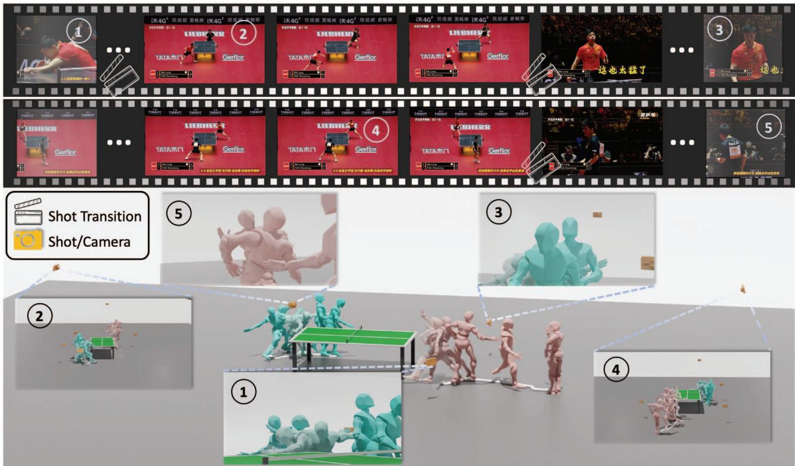
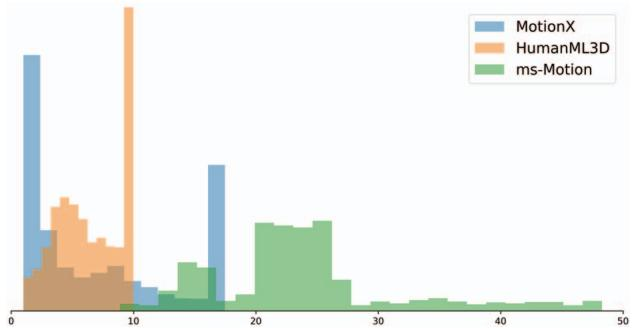
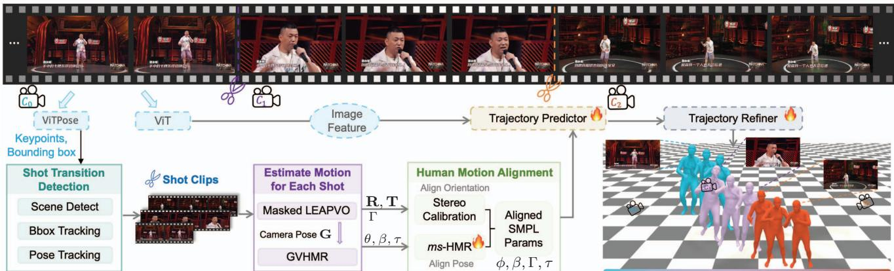
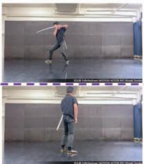
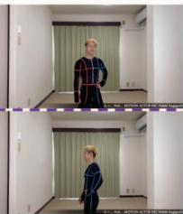
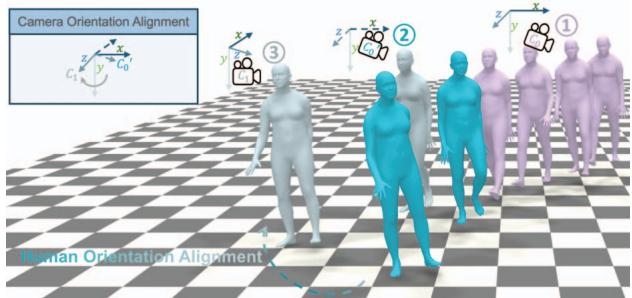
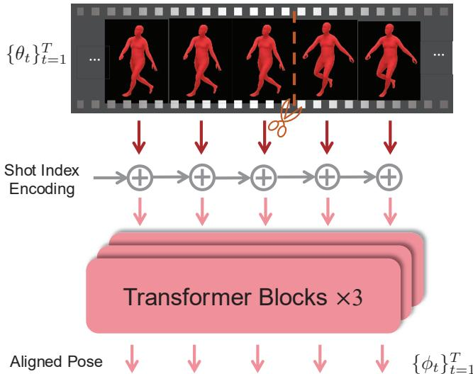
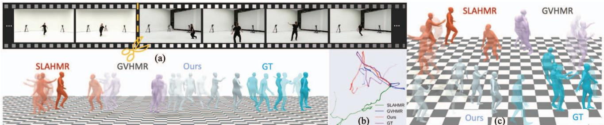

# HumanMM: Global Human Motion Recovery from Multi-shot Videos

Yuhong Zhang1,2,‡\* Guanlin Wu2,3,‡∗ Ling-Hao Chen1,2,‡ Zhuokai Zhao4 Jing Lin1,2   
Xiaoke Jiang2 Jiamin Wu2,5 Zhuoheng Li6 Hao Frank Yang3 Haoqian Wang1† Lei Zhang2†   
1Tsinghua University 2IDEA Research 3Johns Hopkins University 4University of Chicago 5HKUST 6HKU dsyuhong, guanlinwu0930, thu.lhchen @gmail.com Project page: https://zhangyuhong01.github.io/HumanMM

  
Figure 1. Recovering a human motion from multi-shot videos. Top: We take two multi-shot table tennis game videos with shot transitions as input. We aim to recover two motions of two athletes (Long MA and Zhendong FAN) from two videos, respectively. The first video is recorded by three shots (“①”, “②”, and “③” ), and the second one is recovered by two shots (“④” and “⑤” ). Bottom: We recover two motions (Long MA in green and Zhendong FAN in pink), different shots, and camera poses for each multi-shot video. The recovered motion is aligned with the motion in the videos.

## Abstract

In this paper, we present a novel framework designed to reconstruct long-sequence 3D human motion in the world coordinatesfrom in-the-wild videos with multiple shot transitions. Such long-sequence in-the-wild motions are highly valuable to applications such as motion generation and motion understanding, but are of great challenge to be recovered due to abrupt shot transitions, partial occlusions, and dynamic backgrounds presented in such videos. Existing

methods primarilyfocus on single-shot videos, where continuity is maintained within a single camera view, or simplify multi-shot alignment in camera space only. In this work, we tackle the challenges by integrating an enhanced camera pose estimation with Human Motion Recovery (HMR) by incorporating a shot transition detector and a robust alignment module for accurate pose and orientation continuity across shots. By leveraging a custom motion integrator, we effectively mitigate the problem offoot sliding and ensure temporal consistency in human pose. Extensive evaluations on our created multi-shot dataset from public 3D human datasets demonstrate the robustness of our method in reconstructing realistic human motion in world coordinates.

## 1. Introduction

In recent years, significant advances have been made in 3D human pose estimation, particularly in enhancing the accuracy of human motion recovery (HMR)1 from monocular video sequences. HMR has demonstrated extensive applications in human-AI interaction [1, 2], human motion understanding [3–6], and motion generation [3, 7–24]. While existing methods [25] achieved relatively high performance in recovering human mesh in camera coordinates, estimating human motion in world coordinates remains challenging [26–29] due to inaccurate camera pose estimation and the complexity of reconstructing human motion spatially.

Most current progress in 3D human motion community mainly benefits from large scale data [25, 27–31], and longsequence videos. These resources enhance estimation accuracy for HMR methods and improve the understanding and generation of longer motion sequences for tasks such as motion understanding [3, 32, 33] and generation [3, 7– 20, 34–47], even when annotations are derived from markerless capturing methods like pseudo labels [48–51].

A promising approach to enlarge the scale of the motion databases is to estimate human motions from unlimited online videos in a markerless manner. However, many longsequence online videos are recorded with multiple shots, referred to as multi-shot videos2, especially prevalent in domains such as sports broadcasting, talk shows, and concerts. In filmmaking and television live show, a “shot” denotes an individual camera view capturing a specific moment or action from a particular vantage point [52].

Segmenting multi-shot videos into separate shots inevitably reduces the length of the video sequences, which can be detrimental to tasks that benefit from longer sequences, such as long motion generation [47, 53]. This limitation is highlighted in the existing datasets [54, 55], where the longest clip is less than 20 seconds after segmentation, as shown in Fig. 2. Moreover, focusing exclusively on online single-shot videos diminishes the utilization ratio of available online videos and may negatively impact the diversity of scenarios represented in the created datasets.

Therefore, how to address the issue of discontinuities caused by shot transitions is notoriously difficult in the community. To resolve this problem, previous works [56– 59] have proposed algorithms to address human mesh recovery in a camera space from movies containing shot change between long shots and close-ups.

  
Figure 2. The comparison between the distribution of sequence lengths in different existing large-scale markerless motion datasets with ours. The x-axis and y-axis denote the duration time (s) and percentage of video number, respectively. Our dataset (in green) contains more portion of long-sequence videos in general.

However, recovering human motions in world coordinates from multi-shot videos presents two fundamental challenges that remain underexplored. 1) How to align the human motion and orientation in the world coordinates during shot transitions? Ensuring continuity of human orientation and pose across shots is complicated by factors such as partial visibility of human body (e.g. transitioning from long shot to close-up) and changes in human orientation (e.g. two long shots from different viewpoints). These issues, caused by abrupt changes in camera viewpoints, necessitate robust alignment mechanisms. 2) How to reconstruct accurate human motion in world coordinates? Existing approaches employ Simultaneous Localization and Mapping (SLAM) methods to estimate camera parameters, which are then used to project recovered human meshes from camera to world coordinates [26–29]. This process requires highly accurate camera estimation and must address motion consistency and foot sliding in the recovered human motion within the world space.

Despite these challenges, human motion in multi-shot videos often remain continuous across shots, even as camera viewpoints change. This observation suggests that with appropriate handling of shot transitions and camera motion, it is possible to reconstruct consistent and complete 3D human motions throughout multi-shot videos.

In this paper, we propose a novel framework HumanMM, Human Motion recovery from Multi-shot videos, to address these challenges. It integrates human pose estimation across shots with robust camera estimation in the world space. Firstly, we develop a shot transition detector to identify frames with shot transitions. To ensure a more robust camera pose estimation, we introduce an enhanced SLAM method incorporating long-term tracking of feature points and exclusion of moving human from bundle adjustment process. We utilize existing HMR method integrated with our enhanced camera estimation to get the initial human parameters for each separated shot. Subsequently, we implement an alignment module to align human orientation based on stereo calibration and smooth human poses through a trained multi-shot HMR encoder, which effectively captures the temporal context of human movements across different shots. Finally, after aligning human and camera parameters between shot transitions, we train a motion decoder and a trajectory refiner to smooth the human pose and mitigate issues such as foot sliding, thereby enhancing the overall motion consistency in the reconstructed 3D human motions.

Our contributions can be summarized as follows.

• We present the first approach to reconstruct human motion from multi-shot videos in world coordinates.

• We introduce HumanMM, a HMR framework for multishot videos. It includes an enhanced camera trajectory estimation method, a human motion alignment module and a motion integrator to ensure accurate and consistent recovery of human pose and orientation in world coordinates across different shots in the whole video.

• We develop a multi-shot video dataset ms-Motion to evaluate the performance of HMR from multi-shot videos, based on existing public datasets such as AIST [60] and Human3.6M [61]. Extensive experiments on related benchmarks verify the effectiveness of our method.

## 2. Related Work

## 2.1. HMR from One-shot Video

One-shot videos, captured with a single camera without shot transitions, has been extensively studied within the community for human mesh and motion recovery.

Human mesh recovery in camera coordinates can be broadly categorized into two approaches: optimizationbased methods [62–66] and regression-based methods [30, 67–70]. With the significant advancements of transformer [71], HMR2.0 [25] has surpassed previous methods and benefits several downstream tasks related to HMR.

Although there are several previous works tried to recover motions in world coordinates with multi-camera capture system [60, 72] and IMU-based methods [73, 74] and enjoy relatively satisfying results, this setup limits their use for applications of infinite in-the-wild monocular videos. To address this limitation, several attempts [26–29] integrate SLAM into the HMR pipeline by first estimating the camera pose using SLAM methods, e.g. DROID-SLAM [75] or DPVO [76], and then project the recovered human motion from camera to world coordinates. To exclude the inconsistencies caused by dynamic objects, such as moving humans, TRAM [27] modifies DROID-SLAM by incorporating human masking and depth-based distance rescaling. However, DROID-SLAM performs dense bundle adjustment (DBA) on feature maps from downsampled images and selects features based only on two consecutive frames rather than long-term video sequences [75–77]. Consequently, masking significantly reduces the number of informative and consistent features, especially when humans occupy large portions of the image, leading to inaccuracies. Therefore, developing a SLAM method that retains sufficient and representative features for DBA after masking is important.

## 2.2. HMR from Multi-shot Video

Multiple shots are fundamental elements of cinematic storytelling and live performances, utilizing various camera positions and focal lengths to create immersive and detailed viewing experiences for audiences [52]. However, most marker-based motion capture (MoCap) datasets [60, 72, 73, 78, 79] consist single-shot videos only, resulting in limited research on HMR from multi-shot videos.

Recovering human motion from multi-shot videos in camera coordinates is already challenging. This is because treating each pose estimation result of each shot separately leads to inconsistencies when combining all estimations, caused by partially or fully invisible human bodies across shot transitions. Pavlakos et al. [56] addresses this issue by focusing on shot changes from long shots to close-ups, which are common in film. They develop smoothness constraints within a temporal Human Mesh and Motion Recovery (t-HMMR) model to infer motions during occlusions caused by shot transitions.

Advancements in HMR methods [29] for single-shot videos in world coordinates have paved the way for extending HMR to multi-shot videos with varying camera viewpoints. However, aligning human orientation, body pose, and translation continuously across multi-shot videos in world coordinates underexplored. Effective alignment is crucial to maintain motion continuity and coherence, especially when dealing with diverse camera perspectives and abrupt transitions between shots.

In summary, while substantial progress has been made in HMR from single-shot videos, extending these techniques to multi-shot videos requires addressing additional complexities related to camera pose alignment and motion consistency across shot transitions. We address this challenge by proposing a novel pipeline that ensures accurate and continuous 3D HMR from multi-shot monocular videos.

## 3. Method

In this section, we propose HumanMM to recover human motion from multi-shot videos. The system overview is shown in Fig. 3. Given an input video sequence V = $\{ I _ { t } \} _ { t = 1 } ^ { T }$ of length $T ,$ where $I _ { t }$ denotes the t-th frame, our objective is to recover human motion in world coordinates. We begin by detecting shot transition frames based on human bounding box (a.k.a. bbox) and 2D keypoints (a.k.a. KPTs) through a shot transition detector (Sec. 3.2). For each clipped shot, we initialize the camera pose (camera rotation and camera translation) and recover initial human motion in world coordinates (Sec. 3.3). The initialized SMPL parameters and camera poses are then fed into a human motion alignment module (Sec. 3.4), which aligns human orientations via camera calibration based on human 2D KPTs and smooth the human pose by incorporating pose information across different shots. Additionally, it refines the entire motion sequence through whole video using a temporal motion encoder ms-HMR. Finally, we introduce a postprocessing module for motion integration (Sec. 3.5).

  
Figure 3. The overview of HumanMM. HumanMM processes multi-shot video sequences by first extracting motion feature such as keypoints and bounding boxes, using ViTPose [80] and image feature using ViT [81]. These features are then segmented into single shot clips via Shot Transition Detection (Sec. 3.2). Initialized camera (camera rotation R and camera translation T) and human (SMPL) parameters for each shot are estimated using Masked LEAP-VO (Sec. 3.3) and GVHMR [29]. Human orientation is aligned across shots through camera calibration (3.4.1), and ms-HMR (Sec. 3.4.2) ensures consistent pose alignment. Finally, a bi-directional LSTM-based trajectory predictor with trajectory refiner predicts trajectory based on aligned motion and mitigates foot sliding throughout the video.

## 3.1. Preliminary: 3D Human Model

Our method aims to recover motions in world coordinates in the SMPL [82] format, whose pose at frame t can be represented as $\mathcal { M } _ { t } ( \theta _ { t } , \beta _ { t } , \Gamma _ { t } , \tau _ { t } ) \ \stackrel { \mathrm { ~ \tiny ~ \displaystyle ~  } } { \in } \ \mathbb { R } ^ { 6 8 9 0 \times 3 }$ . Here, the body pose, body shape, root orientation, and translation are ${ \boldsymbol { \theta } } _ { t } \in \mathbb { R } ^ { 2 3 \times 3 } , \beta _ { t } \in \mathbb { R } ^ { 1 0 } , \Gamma _ { t } \in \mathbb { R } ^ { 3 }$ , and $\tau _ { t } \in \mathbb { R } ^ { 3 }$ , respectively. We use $\mathbf { K } _ { t } ^ { 2 D }$ to denote human 2D KPTs at each frame t.

## 3.2. Shot Transition Detector For Multi-shot Video

Our algorithm begins with shot transition detection in one video. As shown in Fig. 3, the shot transition detector has three key components, scene transition detector, bounding box (a.k.a. bbox) tracking, and human keypoints tracking. (1) Scene change transition detector. Initially, we employ the SceneDetect [83] algorithm to identify scene changes based on significant variations in the background. However, the SceneDetect fails to detect shot transitions when background changes are unnoticeable, illustrated in Fig. 4. Subsequently, we leverage the following modules to bridge the gap. (2) Bbox tracking for shot transition. As a shot change often accompanies with a sudden change of human subject size, we track humans in a video via mmtracking [84]. Consequently, we compute the Intersection over Union (IoU) between neighbor bboxes and identify a shot transition when the IoU falls smaller than a manually tuned threshold. (3) Human pose tracking for shot transition detection. To achieve a finer granularity, we additionally introduce human 2D KPTs to detect extreme corner shot changes in a video. By thresholding the IoU of corresponding keypoints between neighbor frames, we can accurately identify shot transitions even with subtle human movements.

  
(a) Scene Change

  
(b) Position Change

  
(c) Pose Change  
Figure 4. Shot transition detection examples. Examples (a), (b), and (c) illustrate multi-shot scenarios in online videos. (a) shows scene transitions detectable by SceneDetect. (b) illustrates significant position changes undetectable by SceneDetect but resolvable with bbox tracking-based method. (c) shows pose or orientation transition, requiring pose tracking-based methods as they cannot be addressed by either SceneDetect or bbox tracking.

As each separate module cannot identify all kinds of shot transitions, the three modules are jointly used to clip a video into several sub-sequences serially.

## 3.3. Human Motion and Camera Pose Estimation For Each Shot

After obtaining the clipped videos, our next goal is to estimate the camera pose and SMPL parameters in the world coordinates for each clipped video. The estimated camera pose and motions for each shot will be used to construct the whole motion sequence in the next stage (Sec. 3.4).

How to estimate the camera parameters accurately? Our approach for camera parameter calculation is based on a visual odometry (VO) estimation method, LEAP-VO [77]. Utilizing the CoTracker method [85], LEAP-VO estimates the visibility and trajectories of N selected points by analyzing image gradients across the video sequence. LEAP-VO subsequently computes confidence scores for each trajectory, retaining only those with high confidence while discarding trajectories shorter than a predefined threshold. The remaining trajectories undergo bundle adjustment (BA) within a fixed window size to estimate the camera poses.

However, simply applying LEAP-VO in the camera estimation process is still unsatisfactory in most human-centric scenarios. The primary limitation stems from the dynamic movements of human subjects, which typically occupy a substantial portion of each image in human-centric videos. This dynamic presence introduces noise into the camera pose estimation in world coordinates, as the estimation process relies heavily on the relationship between the camera and the static environment. To address this issue, we propose a Masked LEAP-VO algorithm. Our approach involves inputting the image $I _ { t }$ and the human bbox at frame t into SAM [86] to generate a human mask. We then assign a visibility value of zero to points within the human mask, effectively excluding these trajectories from the BA process. For clarity, we denote $S _ { B A }$ as the window size of BA, nˆ denotes the number of filtered point trajectories, and $w _ { i j , \hat { n } }$ as the normalized weight based on confidence score and visibility. For estimating the camera poses ${ \bf G } = \{ { \bf R } , { \bf T } \}$ of orientation and translation, the reprojection loss function for BA can then be formulated as follows,

$$
\mathbf { G } = \underset { \mathbf { G } , d _ { i } , \hat { n } } { \arg \operatorname* { m i n } } \sum _ { i } \sum _ { \substack { j \in | i - j | \leq S _ { B A } } } \sum _ { \hat { n } } w _ { i j , \hat { n } } | | \mathcal { F } ( \mathbf { G } _ { i } , \mathbf { G } _ { j } , d _ { i , \hat { n } } ) - \Pi _ { i j } ( \mathbf { p } _ { i , \hat { n } } ) | | ,
$$

where $\mathcal { F } ( \mathbf { G } _ { i } , \mathbf { G } _ { j } , d _ { i , \hat { n } } )$ denotes the point positions calculated by camera pose G at frame i and $j$ with depth $d _ { i , \hat { n } }$ $\Pi _ { i j } ( \mathbf { p } _ { i , \hat { n } } )$ denotes the position for project position of $\mathbf { p } _ { i , \hat { n } }$ from frame i to $j .$ . Consequently, we obtain the camera rotation $\mathbf { R } _ { t }$ and translation $\mathbf { T } _ { t }$ from camera pose $\mathbf { G } _ { t }$ at t.

Recovering human motion in world coordinates with estimated camera parameters. Given an input video, we feed the estimated camera parameters (Rt and $\mathbf { T } _ { t } )$ into the state-of-the-art motion recovering model, GVHMR [29],

$$
\begin{array} { r } { \theta _ { t } ^ { w } , \beta _ { t } ^ { w } , \Gamma _ { t } ^ { w } , \tau _ { t } ^ { w } = \mathtt { G V H M R } ( I _ { t } , \mathbf { R } _ { t } , \mathbf { T } _ { t } ) . } \end{array}\tag{1}
$$

Initialized human parameters $\theta _ { t } ^ { w } , \beta _ { t } ^ { w } , \Gamma _ { t } ^ { w } , \tau _ { t } ^ { w }$ and camera parameters $\mathbf { R } _ { t } , \mathbf { T } _ { t }$ will input to human motion alignment.

## 3.4. Aligning Human Motion Between Shots

Based on initialized world motion for each individual shot, the subsequent question is how to merge discontinuous motionsfrom different shots into a continuous motion sequence as a whole in world coordinates. A straightforward solution is to align all motion sequences to the world coordinate system of the first shot. However, finding the correspondence between different shots is still under-explored and challenging. To resolve this issue, we decompose the motion parameters into camera-dependent and camera-independent ones. The former (Sec. 3.4.1) achieves alignment between shots via human orientation alignment based on camera calibration, whereas the latter (Sec. 3.4.2) is a trainable module to enhance the continuity of human motion sequence. These two key designs ensure a consistent motion sequence between frames when encountering shot transitions.

  
Figure 5. Human orientation alignment module. Following a shot transition after the foremost purple human mesh (shot ① captured by camera C0), the unaligned (blue) and aligned (green) motions are captured as shot ② and shot $\textcircled { 3 } \textcircled { 3 }$ by camera $C _ { 0 } ^ { ' }$ and $C _ { 1 }$ respectively. $C _ { 0 } ^ { ' } = C _ { 0 }$ . To achieve human orientation alignment from shot $^ { 6 6 } \textcircled { 1 } ^ { 3 9 } \ \mathbf { t o } \ ^ { 6 6 } \textcircled { 3 } ^ { 3 }$ , the camera rotation matrix from $C _ { 0 } ^ { ' }$ to $C _ { 1 }$ is computed and applied as the offset of human orientation.

## 3.4.1 Aligning Human Orientations Between Shots

After obtaining the initial SMPL and camera parameters $\{ \theta _ { t } ^ { i } , \beta _ { t } ^ { i } , \Gamma _ { t } ^ { i } , \tau _ { t } ^ { i } , \mathbf { R } _ { t } ^ { i } , \mathbf { T } _ { t } ^ { i } \}$ for each shot, directly concatenating motions between shots result abrupt changes of human poses and orientations. To address this issue, we introduce the Orientation Alignment Module (OAM), as shown in Fig. 5, to align human orientations. As the whole motion sequence is continuous, we have the following assumption. Assumption 1 Human orientations and translations during the shot transition in world coordinates are continuous. To align the orientations between two frames with shot transition under Assumption 1, we decompose the human orientation with shot transitions in world coordinates as,

$$
\begin{array} { r } { \mathrm { \bf R } ( \Gamma _ { \mathrm { w o r l d } } ) = { \bf R } _ { \delta _ { \mathrm { c a m } } } \mathrm { \bf R } ( \Gamma _ { \mathrm { v i e w } } ) , } \end{array}\tag{2}
$$

where $\mathbf { R } _ { \delta _ { \mathrm { c a m } } }$ represents the camera rotation on the Y-axis between current t-th and previous t 1-th frame, $\Gamma _ { \mathrm { v i e w } }$ denotes the human orientation estimated by the current shot, and $\mathbb { R } ( \cdot ) : \mathbb { R } ^ { 3 }  \mathbb { R } ^ { 9 }$ is the mapping from axis angle to rotation matrix. As $\Gamma _ { \mathrm { v i e w } }$ in current shot can be estimated independently, mentioned in Sec. 3.3, obtaining accurate $\Gamma _ { \mathrm { w o r l d } }$ in Eq. (2) remains a key challenge to estimate the relative camera rotation $\mathbf { R } _ { \delta _ { \mathrm { c a m } } }$ between frames in shot transitions.

Estimating the relative camera pose $\mathbf { R } _ { \delta _ { \mathrm { c a m } } }$ between transition frames. Different from our approach of estimating camera pose in each shot (Sec. 3.3), we do not mask the human subject when estimating camera rotation $\mathbf { R } _ { \delta _ { \mathrm { c a m } } }$ . Instead, we use human 2D KPTs as explicit feature matching. Specifically, we filter out unmatched keypoints based on their visibility and unaligned direction using RANSAC [87], effectively addressing camera pose estimation during shot transitions. This procedure is referred to as Camera Calibration (a.k.a. epipolar-geometry-based camera extrinsics estimation), and is detailed below.

In Camera Calibration, we assume that the human translations remain unchanged across the shot transition, implying that only the camera’s orientation changes (i.e. Assumption 1). Consequently, we calculate the orientation offset by determining the change in camera orientation using camera calibration. We begin by extracting human 2D KPTs from two consecutive frames during the shot transition. Due to the shot transition, the visibility of 2D KPTs may vary, $e . g .$ occlusion in some shots. Therefore, we employ ED-Pose [88] to filter out invisible 2D KPTs between shot transition frames. Subsequently, RANSAC identifies matching 2D KPTs corresponding to the most possible camera rotation direction. These matched 2D KPTs facilitate the estimation of the aligned camera rotation ${ \mathbf { R } } _ { \delta _ { \mathrm { c a m } } } .$ The detailed estimation process is as follows.

We denote the detected 2D KPTs of two frames in the shot transition as $\begin{array} { r l } { \mathbf { S } _ { 1 } } & { { } = } \end{array}$ $[ ( x _ { 1 } ^ { ( 1 ) } , y _ { 1 } ^ { ( 1 ) } ) , ( x _ { 1 } ^ { ( 2 ) } , y _ { 1 } ^ { ( 2 ) } ) , \cdot \cdot \cdot , ( x _ { 1 } ^ { ( N ) } , y _ { 1 } ^ { ( N ) } ) ] ^ { \top } \quad \in \quad \mathtt { R } ^ { 2 \times N }$ and $\mathbf { S } _ { 2 } = [ ( x _ { 2 } ^ { ( 1 ) } , y _ { 2 } ^ { ( 1 ) } ) , ( x _ { 2 } ^ { ( 2 ) } , y _ { 2 } ^ { ( 2 ) } ) , \cdot \cdot \cdot , ( x _ { 2 } ^ { ( N ) } , y _ { 2 } ^ { ( N ) } ) ] ^ { \top } \in$ $\mathtt { R } ^ { 2 \times N }$ . The essential matrix $\mathbf { E } = [ \mathbf { T } ] _ { \times } \mathbf { R }$ should satisfy the following orthogonal property such that,

$$
\mathbf { S } _ { 1 } ^ { \top } \mathbf { E } \mathbf { S } _ { 2 } = \mathbf { 0 } .\tag{3}
$$

Once E is obtained by solving Eq. (3), we enforce the rank-2 constraint on E through SVD decomposition and subsequently derive the aligned camera rotation $\mathbf { R } _ { \delta _ { \mathrm { c a m } } }$ between two frames (cf. Hartley et al. [89] for more details).

In summary, we reformulate the alignment problem of human orientation in shot transitions as estimating the relative camera rotation $\mathbf { R } _ { \delta _ { \mathrm { c a m } } }$ between frames. Accordingly, we obtain the camera rotation $\mathbf { R } _ { \delta _ { \mathrm { c a m } } }$ via camera calibration.

## 3.4.2 Aligning Human Poses Between Shots

In shot transition, video sequences recorded by two shots are often with various occlusions. However, unoccluded body parts in two shots can be complementary to each other for motion alignment. Thus, we introduce the multi-shot $H M R \left( m s \mathrm { - } \mathrm { H M R } , i . e . \mathrm { } \mathbb { E } _ { M } ( \cdot ) \right)$ module to refine the whole motion sequence. As shown in Fig. 6, the ms-HMR is a Transformer encoder-like architecture, whose input and output are the estimated global motion and the refined global motion, respectively. The process can be formulated as,

$$
\phi _ { 1 } , \phi _ { 2 } , \cdot \cdot \cdot ~ , \phi _ { T } = \mathtt { E } _ { M } \big ( \theta _ { 1 } , \theta _ { 2 } , \cdot \cdot ~ , \theta _ { T } \big ) ,\tag{4}
$$

where $\phi _ { * }$ denotes the refined motion of each frame. With this design, our method can adapt to diverse occlusions of human body brought by shot transitions.

## 3.5. Post-processing Module for Motion Integration

Trajectory Predictor and Trajectory Refiner. Based on the aligned human pose and orientation, we introduce a

  
Figure 6. ms-HMR Structure. The initial human pose parameters θ across multiple video shots are input into a transformer with shot-index-based positional encoding. This enables ms-HMR to generate consistent human poses across all shots in the video. bi-directional LSTM trajectory predictor to recover footground contact probabilities $p _ { t } ^ { c } .$ , and root velocity $v _ { t }$ as,

$$
\begin{array} { r } { p _ { t } ^ { c } , v _ { t } = \mathtt { L S T M } ( \phi _ { 1 } ^ { m } , \Gamma _ { 1 } , \mathtt { F } ( I _ { 1 } ) , \phi _ { 2 } ^ { m } , \Gamma _ { 2 } , \mathtt { F } ( I _ { 2 } ) , \cdot \cdot \cdot , } \\ { \phi _ { T } ^ { m } , \Gamma _ { T } , \mathtt { F } ( I _ { T } ) ) , } \end{array}\tag{5}
$$

where $\operatorname { F } ( \cdot )$ denotes the image feature of each frame extracted by ViT [81]. Accordingly, the contact probabilities $\mathbf { \nabla } p _ { t } ^ { c }$ , and velocity $v _ { t }$ are supervised by the ground-truth labels with MSE loss and are used to reconstruct the trajectory. Besides, we extend the trajectory refiner in WHAM [28] to alleviate foot sliding problem in our estimated trajectory.

## 4. Benchmarking Multi-shot Motion Recovery

Dataset Construction. To create a multi-shot 3D human motion dataset, we introduce ms-Motion by processing existing public 3D human datasets with multiple camera settings and ground truth human and camera parameters, specifically AIST [60] and Human3.6M (H3.6M) [61]. In our construction pipeline, we randomly separate each original one-shot video into several clips. Then, we choose each clip from different shots and concatenate them together as one video recorded by multiple shots. For example, AIST provides each video with eight cameras $\mathbb { C } 0 , \mathbb { C } 1 , . . . , \mathbb { C } ^ { 7 }$ from different view point and we choose a video and split it into 5 clips $\mathrm { a t ~ t 0 , ~ t 1 , ~ } . . . , \mathrm { ~ t 4 ~ }$ . For frames in these separated clips, we choose frames shot by a random camera for each clip and combine five clips as one multi-shot video. Therefore, we construct a multi-shot version of AIST and H3.6M, which are named ms-AIST and ms-H3.6M subsets. Then we combine them and name this new dataset ms-Motion. The detailed statistics of ms-Motion are shown in Tab. 2. We do not compare with other existing 3D human datasets as they contain limited number of multi-shot videos.

Benchmark Evaluation Protocol. To evaluate the performance of our proposed methods on multi-shot videos, our target is to evaluate metrics for accurately reflecting the performance on videos with shot transitions. To this end, we use Root Orientation Error (a.k.a. ROE in deg ) to measure the performance of the proposed method on human orientation alignment across different shots. Besides, we use Root Translation Error (a.k.a. RTE in m) to assess the performance of the proposed method on global trajectory recovery. Jitter $\big ( \frac { 1 \bar { 0 } m } { f p s ^ { 3 } } \big )$ is also used to evaluate the stability of recovered human pose from multi-shot videos. We also include foot sliding (cm), the averaged displacement of foot vertices during contact with the ground, to assess the precision of recovered motion in the world coordinates [28].

<table><tr><td rowspan="2">Dataset</td><td rowspan="2">Models</td><td colspan="6">2-Shot</td><td colspan="6">3-Shot</td><td colspan="6">4-Shot</td></tr><tr><td>PA.↓</td><td>WA.↓</td><td>RTE↓</td><td>ROE↓</td><td>Jitter↓</td><td>F.S.↓</td><td>PA.↓</td><td>WA.↓</td><td>RTE↓</td><td>ROE↓</td><td>Jitter↓</td><td>F.S.↓</td><td>PA↓</td><td>WA↓</td><td>RTE↓</td><td>ROE↓</td><td>Jitter↓</td><td>F.S.↓</td></tr><tr><td rowspan="3">ms-AIST</td><td>SLAHMR [2023]</td><td>72.34</td><td>341.75</td><td>9.62</td><td>96.26</td><td>62.59</td><td>3.26</td><td>80.35</td><td>510.77</td><td>10.33</td><td>101.36</td><td>72.39</td><td>4.43</td><td>90.32</td><td>803.69</td><td>12.11</td><td>104.07</td><td>80.37</td><td>16.52</td></tr><tr><td>WHAM [2024]</td><td>65.34</td><td>336.82</td><td>4.39</td><td>84.48</td><td>25.24</td><td>2.75</td><td>78.68</td><td>451.32</td><td>5.14</td><td>89.84</td><td>24.06</td><td>2.99</td><td>102.88</td><td>603.93</td><td>5.57</td><td>90.07</td><td>26.29</td><td>3.62</td></tr><tr><td>GVHMR [2024]</td><td>60.72</td><td>231.36</td><td>6.20</td><td>96.58</td><td>34.87</td><td>7.65</td><td>70.33</td><td>357.16</td><td>7.55</td><td>99.69</td><td>34.46</td><td>9.42</td><td>83.77</td><td></td><td>563.17 8.96</td><td>104.53</td><td>35.67</td><td>9.78</td></tr><tr><td rowspan="4">ms-H3.6M</td><td>Ours</td><td>36.82</td><td>121.35</td><td>2.56</td><td>69.23</td><td>33.27</td><td>2.66</td><td>38.52</td><td>141.38</td><td>3.64</td><td>67.71</td><td>35.07</td><td>3.55</td><td>39.63</td><td>161.52</td><td>4.55</td><td>70.31</td><td>39.49</td><td>4.09</td></tr><tr><td>SLAHMR [2023]</td><td>80.67</td><td>352.61</td><td>16.67</td><td>111.97</td><td>37.80</td><td>7.93</td><td>97.15</td><td>562.10</td><td>16.91</td><td>118.46</td><td>52.23</td><td>9.96</td><td>107.90</td><td>748.58</td><td>17.85</td><td>116.72</td><td>65.15</td><td>11.58</td></tr><tr><td>WHAM [2024]</td><td>71.32</td><td>313.58</td><td>11.41</td><td>82.42</td><td>18.40</td><td>5.09</td><td>79.51</td><td>423.98</td><td>12.36</td><td>84.85</td><td>18.87</td><td>5.03</td><td>90.50</td><td>512.66</td><td>12.91</td><td>90.34</td><td>18.40</td><td>5.69</td></tr><tr><td>GVHMR [2024] Ours</td><td>64.63 40.52</td><td>254.30 132.13</td><td>6.94 3.65</td><td>81.93 53.39</td><td>18.45 19.05</td><td>8.80 4.17</td><td>80.79 45.35</td><td>296.74 145.36</td><td>85.25 5.33</td><td>58.26 58.26</td><td>18.36 17.35</td><td>10.62 4.62</td><td>85.19 50.59</td><td>471.53</td><td>9.12 147.62 6.20</td><td>91.63 61.22</td><td>19.47 19.77</td><td>10.65 5.12</td></tr></table>

Table 1. Quantitative comparison of different HMR methods on ms-Motion dataset. We record the results for ms-AIST and ms-H3.6M separately. PA. and WA. means PA-MPJPE and WA-MPJPE respectively, while F.S. is Foot Sliding. Our proposed method has achieved the best performance in PA-MPJPE, WA-MPJPE, RTE and ROE across ms-Motion among these methods.
<table><tr><td>Dataset</td><td>Duration(s)</td><td>Videos</td><td>FPS</td><td>Max Length Min Length</td><td></td><td>Shots</td></tr><tr><td>ms-Motion</td><td>23.7</td><td>600</td><td>30</td><td>1478</td><td>314</td><td>2,3,4</td></tr></table>

Table 2. Statistics of the ms-Motion dataset. By shots, we mean the number of shot transitions in a single video.

## 5. Experiment

## 5.1. Datasets and Metrics

Evaluation Datasets. To evaluate the performance of our proposed pipeline for multi-shot videos, we use ms-Motion dataset and EMDB-1 dataset [73] with self-added noise for the evaluation of ablation study. For camera trajectory estimation, we use EMDB-1 and EMDB-2 split [73] as they contain the GT moving camera trajectory. Our self-created dataset contains 600 multi-shot videos, 42.7K frames, totaling 237 minutes. EMDB-1 split contains 17 video sequences totaling 13.5 minutes and EMDB-2 split contains 25 sequences in a total of 24.0 minutes.

Evaluation Metrics. For shot detection we use Recall, Precision and F1 Score as evaluation metrics. For 3D human pose estimation-related tasks, we use ROE, RTE, jitter, and foot-sliding for evaluating the human motion recovery results on multi-shot videos. For the ablation study of our proposed pipeline, we evaluate the Procrustes-aligned Mean Per Joint Position Error (a.k.a. PA-MPJPE) and Per Vertex Error (a.k.a. PVE) as additional metrics besides previous mentioned ones. For camera pose estimation, we use absolute trajectory error (a.k.a. ATE) (m), Relative Pose Error (a.k.a. RPE) rotation (deg), and RPE translation (m).

<table><tr><td rowspan="2">Methods</td><td colspan="2">ms-Motion</td></tr><tr><td>Recall↑ Precision↑ F1 Score↑</td><td></td></tr><tr><td>Scenes Detect (SD) [83]</td><td>0.74</td><td>0.72 0.70</td></tr><tr><td>SD+Bbox Tracking (Bbox)</td><td>0.88 0.85</td><td>0.86</td></tr><tr><td>SD+Bbox+Pose Tracking</td><td>0.96 0.88</td><td>0.92</td></tr></table>

<table><tr><td>Methods</td><td>|ATE↓</td><td>RPE Trans.↓</td><td>RPE Rot.↓</td></tr><tr><td>DPVO (w/o mask)</td><td>0.48</td><td>1.85</td><td>1.06</td></tr><tr><td>Masked DPVO</td><td>0.48</td><td>1.57</td><td>0.97</td></tr><tr><td>LEAP-VO (w/o mask)</td><td>0.50</td><td>0.93</td><td>0.97</td></tr><tr><td>Masked LEAP-VO</td><td>0.51</td><td>0.92</td><td>0.95</td></tr></table>

Table 3. Comparison between differ ence shot detection algorithms. We evaluate our shot transition detector on our proposed multi-shot video human motion dataset ms-Motion.  
Table 4. Camera tracking results on EMDB-1 [73]. Our method has achieved 50% on RPE trans. than that of the original DPVO and perform the best in RPE rot. metrics.

## 5.2. Implementation Details

The ms-HMR, the trajectory, and foot sliding refiner are trained on the AMASS [78], 3DPW [79], Human3.6M [61], and BEDLAM [90] datasets, and evaluated on EMDB and our ms-Motion. During training, we introduce random rotational noise (ranging from 0 to 1 radian) along the y-axis to the root pose Γ and random noise to the body pose θ at random positions to simulate the inaccuracies of pre-estimated human motions caused by shot transitions in multi-shot videos. This strategy enables the network to robustly recover smooth and consistent human motion from noisy initial parameters. The benchmark test results were obtained after training for 80 epochs on one NVIDIA-A100 GPU.

## 5.3. Main Results: Comparison of Global Human Motion Recovery Results on the Benchmark

We compare our proposed method HumanMM with several state-of-the-art HMR methods (SLAHMR [26], WHAM [28] and GVHMR [29]) on our proposed benchmark ms-Motion. As illustrated in Tab. 1, our proposed method has achieved the best performance for PA&WA-MPJPE, RTE and ROE through videos with all numbers of shots across ms-AIST and ms-H3.6M, indicating that our method reconstructs both the global human motion and orientations in the world coordinates more accurately and robustly. For the foot sliding metric, our method also performs as the best on ms-H3.6M across all numbers of shots.

## 5.4. Ablation Studies

Human-centric Scene Shot Boundary Detection Evaluation. To evaluate the performance of our proposed Shot Transition Detector, we test the algorithm on our proposed multi-shot human motion recovery benchmark and compare the output frame list of shot transitions with the ground truth (GT) of our dataset. As shown in Tab. 3, by applying the proposed finer granularity shot detection methods, the number of recall, precision, and F1 score all increases consistently. The combination of three steps (ScenesDetect, bbox tracking, and pose tracking) has achieved 0.96, 0.88, and 0.92 on the recall, precision, and F1 score, respectively, which indicates a comparable performance in shot boundary detection. Besides, as can be seen in the results, the latter two steps of shot detection contribute to the fine-grained final results significantly and jointly.

  
Figure 7. Qualitative comparison of different HMR methods on ms-Motion dataset. The side view of the rendered mesh for input mutli-shot video is shown in (a), while the top view is shown in (c). We also draw the comparison of the human trajectory as shown in (b). Our method is the most similar as GT in both rendered motion and trajectories among these methods.

<table><tr><td>Methods</td><td>|PA-MPJPE↓ MPJPE↓ WA-MPJPE↓ W-MPJPE↓</td><td></td><td></td><td></td><td>PVE↓</td><td>ACCEL↓ RTE↓ ROE↓ F.S.↓</td><td></td><td></td><td></td></tr><tr><td>Baseline (Concat)</td><td>106.48</td><td>141.67</td><td>273.15</td><td>553.67</td><td>122.15</td><td>6.14</td><td>10.86 91.55 14.91</td><td></td><td></td></tr><tr><td>w/o ms-HMR</td><td>78.24</td><td>101.52</td><td>246.42</td><td>436.57</td><td>85.77</td><td>5.87</td><td>3.89</td><td>50.63</td><td>3.54</td></tr><tr><td>w/o OAM</td><td>73.56</td><td>92.13</td><td>243.65</td><td>425.18</td><td>79.64</td><td>5.67</td><td>6.61</td><td>76.74 4.45</td><td></td></tr><tr><td>w/o traj. pred.</td><td>50.49</td><td>83.68</td><td>231.75</td><td>432.17</td><td>75.77</td><td>5.75</td><td>5.52</td><td>47.68</td><td>4.96</td></tr><tr><td>w/o traj. ref.</td><td>50.49</td><td>83.68</td><td>198.58</td><td>397.65</td><td>75.77</td><td>5.23</td><td>4.06</td><td>47.68</td><td>7.84</td></tr><tr><td>HumanMM (Ours)</td><td>50.49</td><td>83.68</td><td>194.77</td><td>393.21</td><td>75.77</td><td>5.16</td><td>3.54</td><td>47.68</td><td>3.28</td></tr></table>

Table 5. Ablation studies on different combinations of HumanMM modules. We evaluate the contributions of each key module on EMDB-1.

Key modules in the Proposed Method. We compare our methods with four variants on EMDB with noise dataset, as shown in Tab. 5, ms-HMR is the key component for the improvement in PA-MPJPE and PVE, which indicates a more accurate modeling of the whole motion sequence. This design serves as a recovery module to estimate some invisible body parts in some shots. Additionally, the orientation alignment module (OAM, in Sec. 3.4) is also a critical block for accurate human orientation estimation, indicated by the metric ROE. This module helps to model the global human motion between shots. For foot sliding, the results in Tab. 5 also show that the trajectory refiner (Sec. 3.5) in our method helps mitigate the foot sliding issue.

Comparison on Camera Trajectory Estimation. To evaluate the performance of our proposed camera trajectory estimation method Masked LEAP-VO, we evaluate the camera trajectory accuracy on EMDB-1 and EMDB-2. For more convenient comparison, we introduce two baselines, DPVO [76], which has been widely used in HMR methods such as WHAM [28] and GVHMR [29], and LEAP-VO [77]. To provide more intuition about the insights of masking dynamic humans in the video, we also implement a variant, Masked DPVO, by applying SAM at the patchify stage of DPVO to exclude patches containing human pixels. As shown in Tab. 4 and Tab. 6, compared with baseline methods, our key design of masking dynamic human subjects improves the result in both RPE Translation and

<table><tr><td>Methods</td><td>|ATE↓ RPE Trans.↓ RPE Rot.↓</td><td></td></tr><tr><td>DPVO (w/o mask)</td><td>0.48</td><td>1.26</td></tr><tr><td>Masked DPVO</td><td>0.50 0.86</td><td>1.21</td></tr><tr><td>LEAP-VO (w/o mask)</td><td>0.50</td><td>1.21</td></tr><tr><td>Masked LEAP-VO</td><td>0.83 0.49 0.83</td><td>1.19</td></tr></table>

Table 6. Camera tracking results on EMDB-2 [73]. Masked LEAP-VO performs better in both RPE Trans. and RPE Rot. metrics.

<table><tr><td>Methods</td><td>|WA-MPJPE↓</td><td>W-MPJPE↓</td><td>RTE.↓</td><td>Jitter↓</td><td>F.S.↓</td></tr><tr><td>DPVO</td><td>305.40</td><td>117.10</td><td>5.10</td><td>17.90</td><td>3.50</td></tr><tr><td>Masked DPVO</td><td>303.90</td><td>116.40</td><td>4.10</td><td>17.40</td><td>3.50</td></tr><tr><td>LEAP-VO</td><td>284.10</td><td>112.80</td><td>3.10</td><td>16.30</td><td>3.50</td></tr><tr><td>Masked LEAP-VO</td><td>283.70</td><td>112.70</td><td>3.10</td><td>16.30</td><td>3.50</td></tr></table>

Table 7. Global motion recovery results on EMDB-2 [73]. We input estimated cam era parameters from different methods into GVHMR for comparison on HMR.

RPE Rotation while maintaining competitive ATE. This result indicates the effectiveness of the design of masking dynamic human subjects in the process of camera trajectory estimation. Compared with the DPVO baseline, our method achieves 50% RPE translation on EMDB-1. In addition, we run GVHMR [29] on EMDB-2 with different estimated camera trajectories. The results is shown in Tab. 7, which further illustrates the effectiveness of our method.

## 6. Conclusion and Discussion

Conclusion. In this paper, we introduce HumanMM, the first framework designed for human motion recovery from multi-shot videos in world coordinates. HumanMM addresses the challenges inherent in multi-shot videos by incorporating three key components: an enhanced camera trajectory estimation method called masked LEAP-VO, a human motion alignment module that ensures consistency across different shots, and a post-processing module for seamless motion integration. Extensive experiments demonstrate that HumanMM outperforms existing human motion recovery methods across various benchmarks, achieving state-of-the-art accuracy on our newly created multi-shot human motion dataset, ms-Motion.

Limitations and Future Work. While HumanMM represents an dvancement in human motion recovery from multishot videos in world coordinates, its performance may decline when faced with an excessive number of shot transitions. Despite these challenges, HumanMM provides a solid baseline for human motion recovery from multi-shot videos and can be employed in annotating markerless human motion datasets. Our newly introduced dataset, ms-Motion, offers a valuable benchmark for evaluating general human motion recovery methods in world coordinates, especially regarding their performance on multi-shot videos. Based on the proposed method, our future work aims to enlarge the related datasets for larger-scale motion databases.

## Acknowledgement

This research was funded through the National Key Research and Development Program of China Project No. 2022YFB36066), in part by the Shenzhen Science and Technology Project under Grant (KJZD20240903103210014). The author team would also like to convey sincere thanks to Ms. Yaxin Chen from IDEA Research for the expressive dance motion used in the demo presentation.

## References

[1] Jingbo Wang, Yu Rong, Jingyuan Liu, Sijie Yan, Dahua Lin, and Bo Dai. Towards diverse and natural scene-aware 3d human motion synthesis. In CVPR, pages 20428–20437, 2022. 2

[2] Zeqi Xiao, Tai Wang, Jingbo Wang, Jinkun Cao, Wenwei Zhang, Bo Dai, Dahua Lin, and Jiangmiao Pang. Unified human-scene interaction via prompted chain-of-contacts. In ICLR, 2024. 2

[3] Chuan Guo, Xinxin Zuo, Sen Wang, and Li Cheng. Tm2t: Stochastic and tokenized modeling for the reciprocal generation of 3d human motions and texts. In ECCV, pages 580– 597, 2022. 2

[4] Biao Jiang, Xin Chen, Wen Liu, Jingyi Yu, Gang Yu, and Tao Chen. Motiongpt: Human motion as a foreign language. NeurIPS, 2024.

[5] Liang Pan, Jingbo Wang, Buzhen Huang, Junyu Zhang, Haofan Wang, Xu Tang, and Yangang Wang. Synthesizing physically plausible human motions in 3d scenes. In 3DV, 2024.

[6] Jingbo Wang, Ye Yuan, Zhengyi Luo, Kevin Xie, Dahua Lin, Umar Iqbal, Sanja Fidler, and Sameh Khamis. Learning human dynamics in autonomous driving scenarios. In ICCV, pages 20739–20749, 2023. 2

[7] Guy Tevet, Brian Gordon, Amir Hertz, Amit H Bermano, and Daniel Cohen-Or. Motionclip: Exposing human motion generation to clip space. In ECCV, pages 358–374, 2022. 2

[8] Mathis Petrovich, Michael J Black, and Gul Varol. Temos:¨ Generating diverse human motions from textual descriptions. In ECCV, pages 480–497, 2022.

[9] Mingyuan Zhang, Zhongang Cai, Liang Pan, Fangzhou Hong, Xinying Guo, Lei Yang, and Ziwei Liu. Motiondiffuse: Text-driven human motion generation with diffusion model. IEEE TPAMI, 2024.

[10] Guy Tevet, Sigal Raab, Brian Gordon, Yonatan Shafir, Daniel Cohen-Or, and Amit H Bermano. Human motion diffusion model. In ICLR, 2022.

[11] Zan Wang, Yixin Chen, Tengyu Liu, Yixin Zhu, Wei Liang, and Siyuan Huang. Humanise: Language-conditioned human motion generation in 3d scenes. NeurIPS, pages 14959– 14971, 2022.

[12] Xin Chen, Biao Jiang, Wen Liu, Zilong Huang, Bin Fu, Tao Chen, and Gang Yu. Executing your commands via motion diffusion in latent space. In CVPR, pages 18000–18010, 2023.

[13] Ye Yuan, Jiaming Song, Umar Iqbal, Arash Vahdat, and Jan Kautz. Physdiff: Physics-guided human motion diffusion model. In ICCV, pages 16010–16021, 2023.

[14] Jianrong Zhang, Yangsong Zhang, Xiaodong Cun, Yong Zhang, Hongwei Zhao, Hongtao Lu, Xi Shen, and Ying Shan. Generating human motion from textual descriptions with discrete representations. In CVPR, pages 14730–14740, 2023.

[15] Yonatan Shafir, Guy Tevet, Roy Kapon, and Amit H Bermano. Human motion diffusion as a generative prior. In ICLR, 2024.

[16] Korrawe Karunratanakul, Konpat Preechakul, Supasorn Suwajanakorn, and Siyu Tang. Guided motion diffusion for controllable human motion synthesis. In CVPR, pages 2151– 2162, 2023.

[17] Ling-Hao Chen, Shunlin Lu, Wenxun Dai, Zhiyang Dou, Xuan Ju, Jingbo Wang, Taku Komura, and Lei Zhang. Pay attention and move better: Harnessing attention for interactive motion generation and training-free editing, 2024.

[18] Zeqi Xiao, Tai Wang, Jingbo Wang, Jinkun Cao, Wenwei Zhang, Bo Dai, Dahua Lin, and Jiangmiao Pang. Unified human-scene interaction via prompted chain-of-contacts. In ICLR, 2024.

[19] Yiming Xie, Varun Jampani, Lei Zhong, Deqing Sun, and Huaizu Jiang. Omnicontrol: Control any joint at any time for human motion generation. In ICLR, 2024.

[20] Shunlin Lu, Ling-Hao Chen, Ailing Zeng, Jing Lin, Ruimao Zhang, Lei Zhang, and Heung-Yeung Shum. Humantomato: Text-aligned whole-body motion generation. ICML, 2024. 2

[21] Wenxun Dai, Ling-Hao Chen, Jingbo Wang, Jinpeng Liu, Bo Dai, and Yansong Tang. Motionlcm: Real-time controllable motion generation via latent consistency model. ECCV, 2024.

[22] Ling-Hao Chen, Jiawei Zhang, Yewen Li, Yiren Pang, Xiaobo Xia, and Tongliang Liu. Humanmac: Masked motion completion for human motion prediction. In ICCV, pages 9544–9555, 2023.

[23] Shunlin Lu, Jingbo Wang, Zeyu Lu, Ling-Hao Chen, Wenxun Dai, Junting Dong, Zhiyang Dou, Bo Dai, and Ruimao Zhang. Scamo: Exploring the scaling law in autoregressive motion generation model. arXiv preprint arXiv:2412.14559, 2024.

[24] Wenxun Dai, Ling-Hao Chen, Yufei Huo, Jingbo Wang, Jin peng Liu, Bo Dai, and Yansong Tang. Real-time controllable motion generation via latent consistency model. 2025. 2

[25] Shubham Goel, Georgios Pavlakos, Jathushan Rajasegaran, Angjoo Kanazawa\*, and Jitendra Malik\*. Humans in 4D: Reconstructing and tracking humans with transformers. In ICCV, 2023. 2, 3

[26] Vickie Ye, Georgios Pavlakos, Jitendra Malik, and Angjoo Kanazawa. Decoupling human and camera motion from videos in the wild. In CVPR, 2023. 2, 3, 7

[27] Yufu Wang, Ziyun Wang, Lingjie Liu, and Kostas Daniilidis. Tram: Global trajectory and motion of 3d humans from in the-wild videos. ECCV, 2024. 2, 3

[28] Soyong Shin, Juyong Kim, Eni Halilaj, and Michael J. Black. WHAM: Reconstructing world-grounded humans with accu rate 3D motion. In CVPR, 2024. 6, 7, 8

[29] Zehong Shen, Huaijin Pi, Yan Xia, Zhi Cen, Sida Peng, Zechen Hu, Hujun Bao, Ruizhen Hu, and Xiaowei Zhou. World-grounded human motion recovery via gravity-view coordinates. In ACM SIGGRAPH Asia, 2024. 2, 3, 4, 5, 7, 8

[30] Angjoo Kanazawa, Jason Y. Zhang, Panna Felsen, and Jitendra Malik. Learning 3d human dynamics from video. In CVPR, 2019. 3

[31] Muhammed Kocabas, Ye Yuan, Pavlo Molchanov, Yunrong Guo, Michael J. Black, Otmar Hilliges, Jan Kautz, and Umar Iqbal. Pace: Human and motion estimation from in-the-wild videos. In 3DV, 2024. 2

[32] Ling-Hao Chen, Shunlin Lu, Ailing Zeng, Hao Zhang, Benyou Wang, Ruimao Zhang, and Lei Zhang. Motionllm: Understanding human behaviors from human motions and videos. arXiv preprint arXiv:2405.20340, 2024. 2

[33] Matthias Plappert, Christian Mandery, and Tamim Asfour. Learning a bidirectional mapping between human wholebody motion and natural language using deep recurrent neural networks. RAS, 109:13–26, 2018. 2

[34] Fangzhou Hong, Mingyuan Zhang, Liang Pan, Zhongang Cai, Lei Yang, and Ziwei Liu. Avatarclip: Zero-shot textdriven generation and animation of 3d avatars. ACM SIG-GRAPH, 2022. 2

[35] Nikos Athanasiou, Mathis Petrovich, Michael J Black, and Gul Varol. Teach: Temporal action composition for 3d hu-¨ mans. In 3DV, pages 414–423, 2022.

[36] Rishabh Dabral, Muhammad Hamza Mughal, Vladislav Golyanik, and Christian Theobalt. Mofusion: A framework for denoising-diffusion-based motion synthesis. In CVPR, pages 9760–9770, 2023.

[37] Mingyuan Zhang, Xinying Guo, Liang Pan, Zhongang Cai, Fangzhou Hong, Huirong Li, Lei Yang, and Ziwei Liu. Remodiffuse: Retrieval-augmented motion diffusion model. In ICCV, 2023.

[38] Weilin Wan, Zhiyang Dou, Taku Komura, Wenping Wang, Dinesh Jayaraman, and Lingjie Liu. Tlcontrol: Trajectory and language control for human motion synthesis. ECCV, 2024.

[39] Chuan Guo, Yuxuan Mu, Muhammad Gohar Javed, Sen Wang, and Li Cheng. Momask: Generative masked modeling of 3d human motions. In CVPR, pages 1900–1910, 2024.

[40] Jinpeng Liu, Wenxun Dai, Chunyu Wang, Yiji Cheng, Yansong Tang, and Xin Tong. Plan, posture and go: Towards open-world text-to-motion generation. ECCV, 2024.

[41] Bo Han, Hao Peng, Minjing Dong, Yi Ren, Yixuan Shen, and Chang Xu. Amd: Autoregressive motion diffusion. In AAAI, pages 2022–2030, 2024.

[42] Zhenyu Xie, Yang Wu, Xuehao Gao, Zhongqian Sun, Wei Yang, and Xiaodan Liang. Towards detailed text-tomotion synthesis via basic-to-advanced hierarchical diffusion model. In AAAI, pages 6252–6260, 2024.

[43] Wenyang Zhou, Zhiyang Dou, Zeyu Cao, Zhouyingcheng Liao, Jingbo Wang, Wenjia Wang, Yuan Liu, Taku Komura, Wenping Wang, and Lingjie Liu. Emdm: Efficient motion diffusion model for fast, high-quality motion generation. ECCV, 2024.

[44] Mathis Petrovich, Or Litany, Umar Iqbal, Michael J Black, Gul Varol, Xue Bin Peng, and Davis Rempe. Multi-track timeline control for text-driven 3d human motion generation. In CVPRW, pages 1911–1921, 2024.

[45] Boxun Hu, Mingze Xia, Ding Zhao, and Guanlin Wu. Mona: Moving object detection from videos shot by dynamic cam era, 2025.

[46] Zan Wang, Yixin Chen, Baoxiong Jia, Puhao Li, Jinlu Zhang, Jingze Zhang, Tengyu Liu, Yixin Zhu, Wei Liang, and Siyuan Huang. Move as you say interact as you can: Language-guided human motion generation with scene affordance. In CVPR, pages 433–444, 2024.

[47] Zhongfei Qing, Zhongang Cai, Zhitao Yang, and Lei Yang. Story-to-motion: Synthesizing infinite and controllable character animation from long text, 2023. 2

[48] Hui En Pang, Zhongang Cai, Lei Yang, Tianwei Zhang, and Ziwei Liu. Benchmarking and analyzing 3d human pose and shape estimation beyond algorithms. In NeurIPS, 2022. 2

[49] Gyeongsik Moon, Hongsuk Choi, and Kyoung Mu Lee. Neuralannot: Neural annotator for 3d human mesh training sets. In CVPRW, 2022.

[50] Gyeongsik Moon, Hongsuk Choi, Sanghyuk Chun, Jiyoung Lee, and Sangdoo Yun. Three recipes for better 3d pseudo gts of 3d human mesh estimation in the wild. In CVPRW, 2023.

[51] Hongwei Yi, Hualin Liang, Yifei Liu, Qiong Cao, Yandong Wen, Timo Bolkart, Dacheng Tao, and Michael J Black. Generating holistic 3d human motion from speech. In CVPR, pages 469–480, 2023. 2

[52] C.J. Bowen and R. Thompson. Grammar of the Edit. Focal Press, 2013. 2, 3

[53] Mathis Petrovich, Or Litany, Umar Iqbal, Michael J. Black, Gul Varol, Xue Bin Peng, and Davis Rempe. Multi-track ¨ timeline control for text-driven 3d human motion generation. In CVPRW, 2024. 2

[54] Yuhong Zhang, Jing Lin, Ailing Zeng, Guanlin Wu, Shunlin Lu, Yurong Fu, Yuanhao Cai, Ruimao Zhang, Haoqian Wang, and Lei Zhang. Motion-x++: A large-scale multimodal 3d whole-body human motion dataset. arXiv preprint arXiv:2501.05098, 2025. 2

[55] Chuan Guo, Shihao Zou, Xinxin Zuo, Sen Wang, Wei Ji, Xingyu Li, and Li Cheng. Generating diverse and natural 3d human motions from text. In CVPR, pages 5152–5161, 2022. 2

[56] Georgios Pavlakos, Jitendra Malik, and Angjoo Kanazawa. Human mesh recovery from multiple shots. In CVPR, 2022. 2, 3

[57] Peng Wu, Xiankai Lu, Jianbing Shen, and Yilong Yin. Clip fusion with bi-level optimization for human mesh reconstruction from monocular videos. In ACM MM, page 105–115, New York, NY, USA, 2023. Association for Computing Machinery.

[58] Kuan-Chieh Wang, Zhenzhen Weng, Maria Xenochristou, Joao Pedro Araujo, Jeffrey Gu, C Karen Liu, and Serena Yeung. Nemo: 3d neural motion fields from multiple video instances of the same action. In CVPR, 2023.

[59] Fabien Baradel, Thibault Groueix, Philippe Weinzaepfel, Romain Bregier, Yannis Kalantidis, and Gr ´ egory Rogez. ´ Leveraging mocap data for human mesh recovery. In 3DV, pages 586–595, 2021. 2

[60] Ruilong Li, Shan Yang, David A. Ross, and Angjoo Kanazawa. Ai choreographer: Music conditioned 3d dance generation with aist++, 2021. 3, 6

[61] Catalin Ionescu, Dragos Papava, Vlad Olaru, and Cristian Sminchisescu. Human3.6m: Large scale datasets and predictive methods for 3d human sensing in natural environments. IEEE TPAMI, 36(7):1325–1339, 2014. 3, 6, 7

[62] Javier Romero, Dimitrios Tzionas, and Michael J. Black. Embodied hands: Modeling and capturing hands and bodies together. ACM TOG, 36(6), 2017. 3

[63] Federica Bogo, Angjoo Kanazawa, Christoph Lassner, Peter Gehler, Javier Romero, and Michael J. Black. Keep it SMPL: Automatic estimation of 3D human pose and shape from a single image. In Computer Vision – ECCV 2016. Springer International Publishing, 2016.

[64] Anurag\* Arnab, Carl\* Doersch, and Andrew Zisserman. Exploiting temporal context for 3d human pose estimation in the wild. In CVPR, 2019.

[65] Ahmed A. A. Osman, Timo Bolkart, and Michael J. Black. STAR: Sparse Trained Articulated Human Body Regressor, page 598–613. Springer International Publishing, 2020.

[66] Yinghao Huang, Federica Bogo, Christoph Lassner, Angjoo Kanazawa, Peter V. Gehler, Javier Romero, Ijaz Akhter, and Michael J. Black. Towards accurate marker-less human shape and pose estimation over time. In 3DV, 2017. 3

[67] Angjoo Kanazawa, Michael J. Black, David W. Jacobs, and Jitendra Malik. End-to-end recovery of human shape and pose. In CVPR, 2018. 3

[68] Muhammed Kocabas, Nikos Athanasiou, and Michael J. Black. Vibe: Video inference for human body pose and shape estimation. In CVPR, 2020.

[69] Nikos Kolotouros, Georgios Pavlakos, and Kostas Daniilidis. Convolutional mesh regression for single-image human shape reconstruction. In CVPR, 2019.

[70] Zhengyi Luo, S. Alireza Golestaneh, and Kris M. Kitani. 3d human motion estimation via motion compression and refinement. In ACCV, 2020. 3

[71] Ashish Vaswani, Noam Shazeer, Niki Parmar, Jakob Uszkoreit, Llion Jones, Aidan N Gomez, Ł ukasz Kaiser, and Illia Polosukhin. Attention is all you need. In NeurIPS. Curran Associates, Inc., 2017. 3

[72] Chun-Hao P. Huang, Hongwei Yi, Markus Hoschle, Matvey¨ Safroshkin, Tsvetelina Alexiadis, Senya Polikovsky, Daniel Scharstein, and Michael J. Black. Capturing and inferring dense full-body human-scene contact. In CVPR, pages 13274–13285, 2022. 3

[73] Manuel Kaufmann, Jie Song, Chen Guo, Kaiyue Shen, Tianjian Jiang, Chengcheng Tang, Juan Jose Z´ arate, and Otmar´ Hilliges. EMDB: The Electromagnetic Database of Global 3D Human Pose and Shape in the Wild. In ICCV, 2023. 3, 7, 8

[74] Xinyu Yi, Yuxiao Zhou, and Feng Xu. Transpose: Real-time 3d human translation and pose estimation with six inertial sensors. ACM TOG, 40(4), 2021. 3

[75] Zachary Teed and Jia Deng. Droid-slam: Deep visual slam for monocular, stereo, and rgb-d cameras. In NeurIPS, pages 16558–16569. Curran Associates, Inc., 2021. 3

[76] Zachary Teed, Lahav Lipson, and Jia Deng. Deep patch vi sual odometry. NeurIPS, 2023. 3, 8

[77] Weirong Chen, Le Chen, Rui Wang, and Marc Pollefeys. Leap-vo: Long-term effective any point tracking for visual odometry. In CVPR, 2024. 3, 4, 8

[78] Naureen Mahmood, Nima Ghorbani, Nikolaus F. Troje, Ger ard Pons-Moll, and Michael J. Black. AMASS: Archive of motion capture as surface shapes. In ICCV, pages 5442– 5451, 2019. 3, 7

[79] Timo von Marcard, Roberto Henschel, Michael Black, Bodo Rosenhahn, and Gerard Pons-Moll. Recovering accurate 3d human pose in the wild using imus and a moving camera. In ECCV, 2018. 3, 7

[80] Yufei Xu, Jing Zhang, Qiming Zhang, and Dacheng Tao. ViTPose: Simple vision transformer baselines for human pose estimation. In NeurIPS, 2022. 4

[81] Alexey Dosovitskiy, Lucas Beyer, Alexander Kolesnikov, Dirk Weissenborn, Xiaohua Zhai, Thomas Unterthiner, Mostafa Dehghani, Matthias Minderer, Georg Heigold, Sylvain Gelly, Jakob Uszkoreit, and Neil Houlsby. An image is worth 16x16 words: Transformers for image recognition at scale. ICLR, 2021. 4, 6

[82] Matthew Loper, Naureen Mahmood, Javier Romero, Gerard Pons-Moll, and Michael J. Black. SMPL: A skinned multiperson linear model. ACM TOG, 34(6):248:1–248:16, 2015. 4

[83] Qingqiu Huang, Yu Xiong, Anyi Rao, Jiaze Wang, and Dahua Lin. Movienet: A holistic dataset for movie understanding. In ECCV, 2020. 4, 7

[84] MMTracking Contributors. MMTracking: OpenMMLab video perception toolbox and benchmark. https:// github.com/open-mmlab/mmtracking, 2020. 4

[85] Nikita Karaev, Ignacio Rocco, Benjamin Graham, Natalia Neverova, Andrea Vedaldi, and Christian Rupprecht. Co-Tracker: It is better to track together. In ECCV, 2024. 4

[86] Alexander Kirillov, Eric Mintun, Nikhila Ravi, Hanzi Mao, Chloe Rolland, Laura Gustafson, Tete Xiao, Spencer Whitehead, Alexander C. Berg, Wan-Yen Lo, Piotr Dollar, and´ Ross Girshick. Segment anything. In ICCV, 2023. 5

[87] Martin A. Fischler and Robert C. Bolles. Random sample consensus: a paradigm for model fitting with applications to image analysis and automated cartography. Commun. ACM, 24(6):381–395, 1981. 5

[88] Jie Yang, Ailing Zeng, Shilong Liu, Feng Li, Ruimao Zhang, and Lei Zhang. Explicit box detection unifies end-to-end multi-person pose estimation. In ICLR, 2023. 6

[89] Richard Hartley and Andrew Zisserman. Multiple View Geometry in Computer Vision. Cambridge University Press, USA, 2 edition, 2003. 6

[90] Michael J. Black, Priyanka Patel, Joachim Tesch, and Jinlong Yang. BEDLAM: A synthetic dataset of bodies exhibiting detailed lifelike animated motion. In CVPR, pages 8726– 8737, 2023. 7