# HyperGS: Hyperspectral 3D Gaussian Splatting

Christopher Thirgood1, Oscar Mendez1, Erin Ling1, Jon Storey2, Simon Hadeld1 1University of Surrey, 2I3D Robotics

{c.thirgood, o.mendez, chao.ling, s.hadfield}@surrey.ac.uk, jstorey@i3drobotics.com

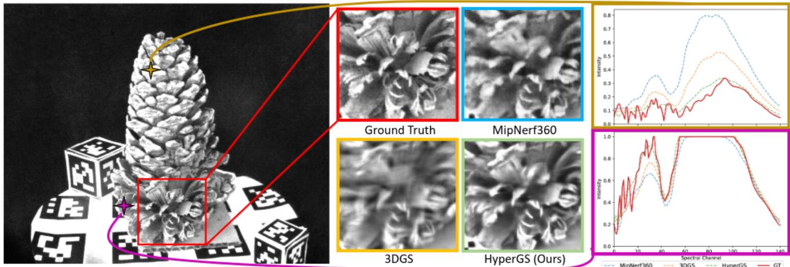

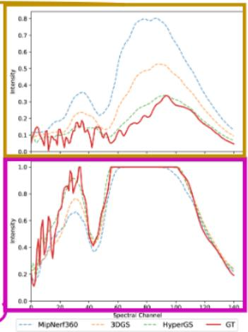  
Figure 1. This image represents a novel hyperspectral image at the 70th channel of a 141-channel image predicted from the top thre models, HyperGS (Ours), 3DGS and MipNerf360 for the hyperspectral novel view synthesis task. Two random pixel reconstructions taken from the novel view with corresponding border color for its plot and pixel location in the image represented by the stars.

## Abstract

We introduce HyperGS, a novel framework for Hyperspectral Novel View Synthesis (HNVS), based on a new latent 3D Gaussian Splatting (3DGS) technique. Our approach enables simultaneous spatial and spectral renderings by encoding material properties from multi-view 3D hyperspectral datasets. HyperGS reconstructs high-delity views from arbitrary perspectives with improved accuracy and speed, outperforming currently existing methods. To address the challenges of high-dimensional data, we perform view synthesis in a learned latent space, incorporating a pixel-wise adaptive density function and a pruning technique for increased training stability and efciency. Additionally, we introduce the rst HNVS benchmark, implementing a number of new baselines based on recent SOTA RGB-NVS techniques, alongside the small number ofprior works on HNVS. We demonstrate HyperGS’s robustness through extensive evaluation of real and simulated hyperspectral scenes with a 14db accuracy improvement upon previously published models.

## 1. Introduction

Recent advancements in Novel View Synethesis (NVS), particularly with implicit Neural Radiance Field modeling (NeRFs) [22] and explicit Gaussian models (3DGS)[13], have dramatically improved the delity of synthetically rendered views for conventional RGB images. However, RGB imaging is fundamentally limited, as it cannot capture the detailed material properties or non-visible scene characteristics critical for deeper scene understanding.

Hyperspectral imaging addresses these limitations by capturing a continuous spectrum of light across narrow bands for each pixel, providing valuable material properties and subtle spectral signatures. This modality is crucial for applications such as remote sensing, medical diagnostics, environmental monitoring, and robotics [27], where spectral information is paramount. The demand for Hyperspectral Novel View Synthesis (HNVS) is driven by the need for accurate, real-time spectral and spatial modeling. However, synthesizing novel views from hyperspectral data presents signicant challenges due to its high dimensionality and the requirement for spectral consistency across different perspectives for each pixel.

Previous works, such as HS-NeRF [5], have explored HNVS by adapting NeRF architectures to hyperspectral data. However, these methods suffer from unstable training dynamics, slow rendering times, and inefciencies in handling high-dimensional.

3DGS has recently emerged as a promising approach for fast NVS in the RGB domain, offering efcient, high-delity rendering of 3D scenes through point-based representations. By projecting 3D Gaussians onto the image plane, 3DGS enables smooth, continuous representations of scene geometry while preserving ne surface details. However, despite its efciency and rendering quality, 3DGS has not yet been successfully extended to accommodate high-dimensional data types. In our benchmark, traditional 3DGS fails to achieve consistent results against NeRF baselines for HNVS (Section 5 and Section 9 of the supplementary materials). HyperGS aims to address these challenges. In summary, the contributions of this paper are:

1. We present the rst method that successfully integrates view-dependent hyperspectral material information with 3DGS for high-quality HNVS.

2. We introduce an adaptive density control and global pruning process that leverages hyperspectral signatures for efciency alongside a hyperspectral SFM process to stabilize the modeling.

3. A comprehensive benchmark of hyperspectral NeRF approaches and adaptations of classical RGB-NVS models for HNVS.

## 2. Literature review

## 2.1. Hyperspectral 3D reconstruction

Efforts to extend 3D reconstruction to multispectral and hyperspectral domains include works from Zia et al. [31] and Liang J et al. [17], which employ point clouds and key point descriptors for structure-from-motion. These methods enhance 3D reconstruction by improving point matching but often result in sparse, noisy point clouds with inadequate occupancy information for multi-view stereo. Shadows and lighting variations degrade geometric quality. A faster approach by Zia et al. [32] instead skips rasterization by mapping hyperspectral images onto preprocessed 3D meshes.

## 2.2. NeRFs

NeRFs have gained signicant attention [8] since Mildenhall et al. [23] introduced the technique. NeRFs rely on classical volume rendering techniques for scene synthesis. Recent advances have sought to adapt NeRFs for spectral and hyperspectral imaging. SpectralNeRF [16] incorporates a spectrum attention mechanism (SAUNet) for realistic lowchannel multi-spectral rendering under variable lighting. However, the reliance on attention mechanisms introduces computational overhead, making long-range spectra dif- cult to capture. Spec-NeRF [15] takes a more efcient approach by adapting TensoRF [4] for reconstruction, with a seperate MLP estimating the camera’s spectral sensitivity, focusing on computationally efcient spectral scene reconstructions. HS-NeRF [5] targets hyperspectral novel view synthesis by learning sinusoidal position encoding for each channel, allowing it to interpolate between viewpoints. This approach struggles with full-spectrum delity due to its lack of end-to-end training. HS-NeRF also released two multiview hyperspectral datasets, using two different hyperspectral cameras with varying signal-to-noise ratios. These, NeRF-based methods remain limited by their large parameter counts and instability when handling high-dimensional hyperspectral data alongside slower inference times.

## 2.3. 3DGS

Advancements in 3DGS improve point cloud efciency for hyperspectral imaging but rely on discrete thresholds, causing uneven textures and memory issues with high dimensional HSI data. VDGS [20] employs a hybrid NeRF neural model for color and opacity, improving spectral reconstruction for HSI. However, this model still heavily depends on the 3DGS prediction and only uses opacity estimation from the MLP. Scaffold-GS [19] introduces compressed representations to smooth surfaces but, like 3DGS, it struggles with artifacts in sparse regions. Mip-Splatting [30] addresses rendering quality by applying 3D smoothing and a 2D Mip lter, yet it remains constrained by view frustum-based Gaussian selection, limiting its effectiveness in dynamic scenes. Challenges in Gaussian initialization, especially due to poor SfM data, are tackled by RAIN-GS [12], which incorporates adaptive optimization. InstantSplat [10] improves stability by using simpler point provisioning alongside the use of dust3r [28] which offers better SFM than COLMAP but has difculty in processing large amounts of images. Meanwhile, Bulo [3] proposes pixel-level error-based densication to ensure consistent quality, and GaussianPro [6] extends pixel-wise loss methods to better align 3D Gaussian normals during rendering, albeit at the cost of longer training times. EfcientGS[18] and LightGaussian[9] reduce model size and computational load through pruning methods but risk losing important visual details, especially when over-decimation occurs without proper ranking thresholds[18]. These methods often prioritize storage efciency over rendering performance, overlooking challenges in real-time optimization. Although no previous works have explored the adaptation of Gaussian Splatting to Hyperspectral data, our experiments show that a naive adaptation struggles to model ne details. HyperGS solves these issues by operating in a lower-dimensional learned latent space.

## 3. Preliminaries

3DGS, developed by Kerbl et al. [13], represents 3D environments using N Gaussian primitives. Each Gaussian is parameterized by its position $x _ { i } \in \mathbb { R } ^ { 3 }$ in world coordinates, a scaling vector $\mathbf { S } _ { i } \in \mathbb { R } ^ { 3 }$ dening the size of the Gaussian along each axis, a rotation quaternion $\mathcal { R } _ { i } \in \mathbb { R } ^ { 4 }$ dening its orientation, opacity $\sigma _ { i } ~ \in ~ \mathbb { R }$ , which is controlled by a sigmoid function, and appearance features $f _ { i } \in \mathbb { R } ^ { k }$ to represent view-dependent RGB signals. The core of 3DGS lies in transforming these Gaussians from 3D world space into the 2D image plane for rendering. To do this, we rst dene the 3D covariance matrix of each Gaussian in world space as:

$$
\Sigma _ { i } = R _ { i } S _ { i } ^ { 2 } R _ { i } ^ { T } ,\tag{1}
$$

where $R _ { i }$ is the rotation matrix derived from the quaternion $\mathcal { R } _ { i } ,$ and $S _ { i }$ is the scaling matrix derived from the vector $\mathbf { S } _ { i }$

To splat the Gaussian onto the 2D image plane, we transform the covariance matrix using the viewing transformation matrix $W$ and the Jacobian matrix $J ,$ which handles the projection onto the camera’s image plane as

$$
\begin{array} { r } { \hat { \Sigma } _ { i } = J W \Sigma _ { i } W ^ { T } J ^ { T } . } \end{array}\tag{2}
$$

accounting for the perspective distortion and view transformation. When rendering to a particular pixel, the opacity $\alpha _ { i }$ of Gaussian i is computed as:

$$
\alpha _ { i } = 1 - \exp ( - \delta _ { i } ^ { T } \hat { \Sigma } _ { i } ^ { - 1 } \delta _ { i } ) ,\tag{3}
$$

where $\delta _ { i }$ is the distance between the pixel and the projected center of the Gaussian in 2D.

The transmittance $T _ { i }$ , which represents the cumulative transparency along the ray up to the i-th Gaussian. It is computed as:

$$
T _ { i } = \prod _ { j = 1 } ^ { i - 1 } ( 1 - \sigma _ { i } \alpha _ { j } ) .\tag{4}
$$

The nal color $C$ of each pixel, $p$ is obtained by blending the colors of all Gaussian’s projected onto that pixel:

$$
C ( p ) = \sum _ { i \in N } T _ { i } \alpha _ { i } c _ { i } ,\tag{5}
$$

where $p$ is the coordinate position in the image, $c _ { i }$ is the color of the i-th Gaussian, derived from its color appearance coefcients $f _ { i }$ . In summary, this process transforms and projects the Gaussian primitives from 3D space into 2D image space and computes the nal pixel colors through opacity and transmittance blending.

## 4. Methodology

HyperGS aims to provide a lightweight, fast rasterization solution to HNVS that is robust to different hyperspectral cameras’ sensitivity functions with outstanding accuracy. Our system diagram is seen in Figure 2.

## 4.1. Hyperspectral Compression

To address the challenges of high-dimensional optimization, we adopt a novel latent space exploration method for the hyperspectral data. The latent space of a pre-trained autoencoder (AE) serves as an exploratory space for our 3DGS system. This approach reduces the computational load during 3DGS optimization by providing a compact, lower-dimensional target. Additionally, the latent space bounds the error by encapsulating the spectral sensitivity of the hyperspectral camera for each channel, enhancing the accuracy and reliability of novel view reconstruction in the spectral domain. During testing, the latent space 3DGS viewpoint estimations are decoded using the frozen AE to produce novel HSIs from which gradient ow will be calculated.

The compression network is a fast convolutional AE. Both sides are symmetrical and is built using a series of 1D convolutional layers and Squeeze-Excitation (SE) blocks that operate across the spectral dimension of the images. The SE blocks benet the performance by weighting features between layers for improved spectral discrimination. The model is trained on the pixel level of the scenes dataset. The encoder compresses the high-dimensional hyperspectral data into a latent representation via max-pooling layers, while the decoder reconstructs the original spectral information from this compressed form via upsampling. The architecture omits skip connections to ensure the decoder can function independently during training and testing to decode the LHSI data produced by the 3DGS system. For a detailed layout of the network architecture, please refer to Fig. 3.

The AE minimizes the loss $L _ { a e } ,$ dened as:

$$
L _ { a e } = L _ { H u b e r } ( C ^ { * } ( p ) , D e c ( E n c ( C ^ { * } ( p ) ) ) ) ,\tag{6}
$$

where $C ^ { * }$ is the ground truth pixel spectrum. The Huber loss provides a smooth optimization process throughout training, as it handles outliers effectively while maintaining smooth gradients. Since each hyperspectral dataset includes varying levels of signal-to-noise ratios, this approach helps improve robustness against noise-related issues.

## 4.2. Latent Hyperspectral 3D Gaussian Splatting

Each Gaussian in the splatting process is assigned a latent spectral signature $\mathbf { f } _ { i } ~ \in ~ \mathbb { R } ^ { m }$ , where m represents the latent space dimensionality. Inspired by many previous RGB techniques [14, 19, 21, 29] an MLP conditioned on viewdirectional hash encoding is used to predict anisotropic opacity and spectral color information for each Gaussian. This allows view-dependent spectral effects to be modelled upon specic bands. This signature is mapped directly to the pixel values using the decoder model dened in Section 4.1. For camera $d ,$ the MLP F predicts view-dependent spectral effects $\tilde { f } _ { i , d }$ and opacity $\tilde { \sigma } _ { i , d }$ effects for each Gaussian. Specically, the MLP takes the centre $\mathbf { m } _ { i }$ of each Gaussian and the view direction as inputs:

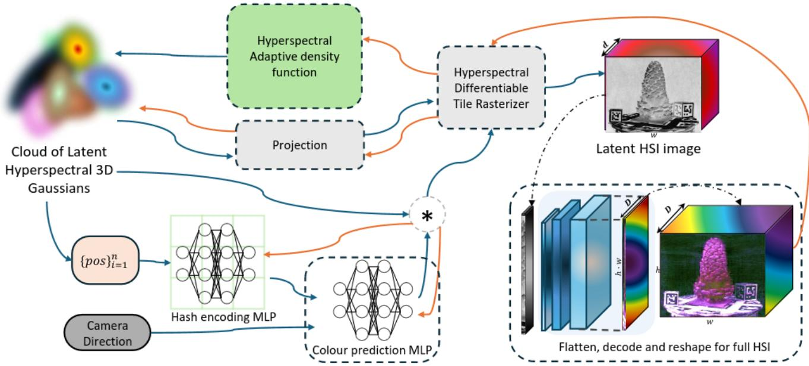  
Figure 2. Visual system diagram of our approach. Blue lines indicate the operational ow, while orange lines represent the gradient ow. Our novel modied latent hyperspectral adaptive density function operates within a latent space provided by a frozen autoencoder, which is also responsible for decoding the nal images. Latent space novel views are generated through a combination of the latent hyperspectral Gaussian point cloud and a NeRF-style MLP. Gradients are updated based on the decoded images.

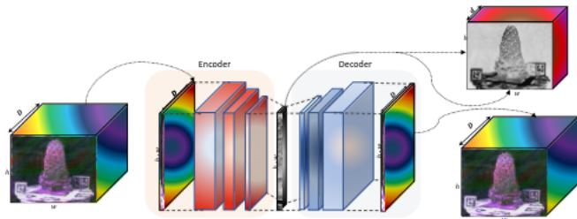  
Figure 3. Our channel-wise convolutional AE model learns LHSI space representation of the scene. The decoder is only used in training and inference for the 3DGS system after the preprocessing of the dataset is nished.

$$
[ \tilde { f } _ { i , d } , \tilde { \sigma } _ { i , d } ] = \mathscr { F } _ { v } ( h ( \mathbf { m } _ { i } , \mathbf { d } ) ; \Theta ) ,\tag{7}
$$

where $h$ is the hash encoding of the inputs while $\tilde { \Theta }$ denotes the MLP parameters similar to that of I-NGP [24] and Mip-Nerf360 [1].

These view-dependent spectral and opacity effects are multiplied with those stored in the Gaussian Cloud, leading to the updated volumetric rendering equations with transmittance being dened as:

$$
T _ { i , d } = \prod _ { j = 1 } ^ { i - 1 } ( 1 - \alpha _ { j } \sigma _ { i } \tilde { \sigma } _ { i , d } ) .\tag{8}
$$

The nal latent signature $\hat { C }$ of each pixel is obtained by blending the colors of all Gaussians projected onto that pixel $p \mathrm { : }$

$$
\hat { C } ( p , d ) = \sum _ { i \in N } T _ { i , d } \alpha _ { i } f _ { i } \tilde { f } _ { i , d } .\tag{9}
$$

It is worth emphasizing that these view-dependent spectral effects are applied within the learned latent space before decoding. This helps maintain a low computational complexity while minimizing outliers.

A decoding operation is then performed to provide the full delity prediction from the system using the decoder from Section 4.1.

$$
C ( p , d ) = D e c ( \hat { C } ( p , d ) ) .\tag{10}
$$

The nal rendering ensures that the spectral integrity is maintained throughout the entire process, which is critical for accurately reconstructing material properties. By leveraging the latent space, HyperGS provides a more meaningful and efcient spectral representation of the scene, than the original full hyperspectral image. The original loss proposed in 3DGS for spatial and geometric consistency in rendered images uses a weighted DSSIM and L1 loss. However, this type of loss have been shown to lead to undertting for HSI in other elds. This is because an L1 loss can produce extreme errors for sensitive spectral bands, destabilizing training. To address this, we employ a weighted loss combining Charbonnier loss and cosine similarity to account for both spectral quality and spatial consistency.

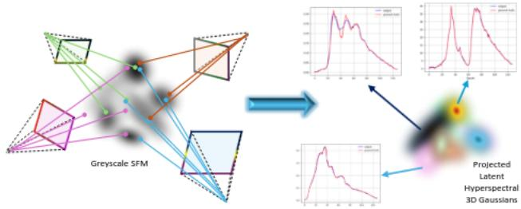  
Figure 4. Visualization of our re-projection protocol for initializing the SFM point cloud. We estimate the SFM from grayscale channel slices of the hyperspectral image scene with COLMAP. Then, using the average of all views, we re-project each point into LHSI from provided by our AE, providing an optimal initialization of latent spectral color for the 3DGS system.

The cosine similarity provides a measured angular distance between vectors, making it ideal for comparing spectra. To provide an overall consistency in the spatial and spectral domain we keep the SSIM score in the training from the original 3DGS system. The per pixel HyperGS training loss $L _ { d } ( p )$ is:

$$
L _ { d } ( p ) = ( 1 - \lambda ) ( \beta L _ { C B } ( p ) + L _ { C S } ( p ) ) + \lambda L _ { S S I M } ( p ) ,\tag{11}
$$

where $\beta$ weighs the spectral loss balancing the cosine similarity and charbonnier loss. Thus the total training loss across all pixels and views is:

$$
L ( C , C ^ { * } ) = \sum _ { p = 1 } ^ { P } \sum _ { d \in V } L _ { d } ( p ) ,\tag{12}
$$

where C is the 3DGS systems network prediction after decoding the entire latent image, $C ^ { * }$ is the ground truth hyperspectral image, and $V$ is the set of training view directions.

## 4.2.1 Initialisation

Since there is no dedicated hyperspectral Structure-from-Motion (SfM) algorithm compatible with COLMAP, we rst convert the hyperspectral images into grayscale images, $I _ { \mathrm { g r a y } }$ , by selecting the spectral channel with the highest foreground intensity variance to preserve key features for the SfM process. Our process is visualized in Figure 4. Using these grayscale images and their corresponding camera projection matrices for each view $d ,$ we apply COLMAP to generate a sparse 3D point cloud. Each 3D point $\mathbf { X } = ( \bar { X , Y , Z , 1 } ) ^ { T }$ in world coordinates is related to its pixel coordinate $\mathbf { p } _ { d } = ( x _ { d } , y _ { d } , 1 ) ^ { T }$ in the image plane via the camera projection ${ \mathbf { K } } _ { d } { \mathbf { E } } _ { d } \mathrm { : }$

$$
\mathbf { p } _ { d } = \mathbf { K } _ { d } \mathbf { E } _ { d } \mathbf { X } ,\tag{13}
$$

where $\mathbf { K } _ { d }$ are the camera intrinsics and $\mathbf { E } _ { d }$ the extrinsics. After generating 3D points and recovering camera poses, we re-project the points into the LHSIs. Each 3D point X is linked to pixel coordinates $\mathbf { p } _ { d }$ across all views. We then initialize the Gaussian cloud with one Gaussian centered on each 3D point X, with spectral signature $\mathbf { f } _ { i }$ computed by averaging the latent hyperspectral signatures $H _ { d } ( y _ { d } , x _ { d } )$ across all views d:

$$
f _ { i } = \frac { 1 } { | V | } \sum _ { v = 1 } ^ { V } \hat { C } _ { d } ^ { * } ( \mathbf { p } _ { d } ) ,\tag{14}
$$

where $\hat { C } _ { d } ^ { * } ( \mathbf { p } _ { d } )$ is the latent hyperspectral signature at pixel p for view d, and $V$ is the set of training views. This averaging ensures the spectral information is captured robustly.

## 4.2.2 Latent Hyperspectral Densication

As the number of color channels in HSI data increases, visual discontinuities become more prevalent. Additionally, our initial SFM reconstruction is less dense compared to standard RGB 3DGS. To address these issues, we incorporate an advanced densication method that enhances stability in both results and training. A key component of 3DGS involves determining whether a Gaussian should be split or cloned based on the gradient magnitude of the Normalized Device Coordinates (NDC) across various viewpoints. However, in sparse regions, this can cause artefacts as large Gaussians are highly visible in many viewpoints, leading to inconsistent splitting. This challenge is exacerbated in the hyperspectral domain of 3DGS, where the larger number of channels and highly variable value ranges make it harder to set effective thresholds. To mitigate this, we scale the gradient by the square of the depth relative to the scene’s radius, which reduces the inuence of Gaussians near the camera. More formally, we dene the splitting score as:

$$
\begin{array} { c c c } { \displaystyle { S ( g _ { i } ) = \sum _ { d \in V } \sum _ { p = 1 } ^ { P } h ( d , i ) \sqrt { \bigg ( \frac { \partial L _ { d } ( p ) } { \partial x _ { i } } \bigg ) ^ { 2 } + \bigg ( \frac { \partial L _ { d } ( p ) } { \partial y _ { i } } \bigg ) ^ { 2 } } , } } \end{array}\tag{15}
$$

where the depth-scaling function is:

$$
h ( d , i ) = \left( \frac { \left| \mathbf { E } _ { d } \mathbf { X } _ { i } \right| } { \beta _ { \mathrm { f i e l d } } \times R } \right) ^ { 2 } ,\tag{16}
$$

$\beta _ { \mathrm { f i e l d } }$ is a tunable parameter, and R is the scene’s radius, based on the largest distance between any pair of cameras.

The Gaussian $g _ { i }$ is split or cloned if ${ \cal { S } } ( g _ { i } ) > \theta _ { q }$ . This approach accounts for depth-based scaling and pixel contributions, leading to better hyperspectral scene reconstruction with fewer artifacts near the camera. However, this more expressive densication can result in an excessive number of Gaussians in scenes with high-frequency details (e.g., the “pinecone” scene in Figure 1, to stabilize this we deploy a global pruning strategy.

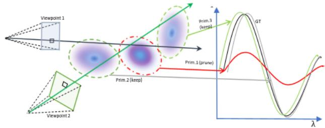  
Figure 5. Visualization of our pixel-wise pruning. Gaussians with poor similarity scores below a threshold are pruned, such as the red-circled Gaussian and the black ground truth spectrum.

## 4.3. Global Hyperspectral Gaussian Pruning

In HyperGS, we deploy pixel-wise pruning [25] to preserve the spectral integrity of latent hyperspectral images (LHSIs) while lowering the overall number of primitives to improve the scene quality, model size, and spectral gradient descent. Unlike cross-view pruning methods, which evaluate Gaussians across multiple viewpoints and leads to over-pruning [11, 18], our approach assesses each Gaussian’s contribution at the pixel level. This approach retains ne spectral details specic to each pixel. For each Gaussian gi, pruning is based on its pixel-wise importance I across all viewpoints and pixels. We compute the importance for every combination of Gaussian, pixel and viewpoint as the spectral difference between the ground truth hyperspectral value $\hat { C } _ { d } ^ { * } ( p )$ and the decoded Gaussians LHSI, with the pruning score dened as:

$$
\begin{array} { r } { \mathcal { T } [ g _ { i } , p , d ] = \left( 1 - | C _ { d } ^ { * } ( p ) - D e c ( f _ { i } ) | \right) \alpha _ { i } T _ { i } , } \end{array}\tag{17}
$$

where $T _ { i }$ is the accumulated transmittance of Gaussian $g _ { i }$ Including $\alpha _ { i }$ and $T _ { i }$ ensures that only Gaussians contributing signicantly in visibility and spectral accuracy are retained, and also ensures that the score is 0 for Gaussians that do not overlap the given pixel.

Following recent works, we do not prune Gaussians based on the average, or the total pixel-wise importance score. Instead, we retain all Gaussians within the top-K importance ranking for any pixel. More formally the ltered Gaussian cloud $\mathcal { G }$ is

$$
\mathcal { G } = \{ g _ { i } | \exists ( p , d ) , \mathrm { R a n k } ( g _ { i } , \mathcal { T } [ : , p , d ] < \tau _ { p } ) \} ,\tag{18}
$$

where “Rank” is a function that returns the rank of a given Gaussian within the slice of the score tensor for that pixel and view.

## 5. Experiments

We rst evaluate HyperGS using the HS-NeRF datasets [5]. These datasets differ in signal-to-noise ratios, channel lengths, and the number of images per scene, providing a comprehensive test of model performance. The Bayspec dataset [5] contains around 360 images per scene (3 scenes total), while the SOP dataset [5] has around 40 images per scene (4 scenes total). Due to the lack of continuous HSI datasets for non-object-centric scenes, we also evaluate HyperGS on a synthetic dataset curated from ScanNetv200 [7] (Section 9 in the supplementary materials, where we replace each semantic label with distinct hyperspectral signatures as seen in our supplementary materials). The baselines we have implemented for the HNVS problem include conventional 3DGS (with our reprojected SFM initialisation 4.2.1 and removed SH coefcients), traditional NeRF models adapted for hyperspectral data (NeRF [22], MipNeRF [2] MipNeRF-360 [1], Nerfacto [26] and TensorF [4] (Spec-NeRF), and the only existing HNVS method HS-NeRF [5].

All experiments were conducted on an NVIDIA A100 80GB GPU, as MipNeRF360 requires signicantly more VRAM than the other methods, which could run on a NVIDIA 3090 GPU. Using the A100 also facilitated accurate tracking of training times across all methods. We assess the performance of HyperGS after 60k training iterations, while NeRF methods are trainined with the standard 1024 rays per batch and competing methods using rigorous metrics that capture both accuracy and spectral delity: PSNR, SSIM, Spectral Angle Mapping (SAM), RMSE. We use a 90% training and 10% test split according to the HS-NeRF dataset.

## 5.1. Real HSI

We compare two HNVS datasets from HS-NeRF with different spectral channels and noise levels. The SOC710-VP (SOP) camera, covering 370–1100 nm, provides high spatial (696×520) and spectral (128 channels) resolution but suffers from poor temporal resolution due to long exposure. The BaySpec GoldenEye camera offers comparable spatial (640×512) and spectral (141 channels) resolution with faster captures, introducing more noise. Tables 1 and 2 show that HyperGS consistently outperforms other methods on unseen images across all scenes.

The BaySpec dataset particularly highlights HyperGS’s strengths. Its autoencoder produces bounded errors in latent space, letting HyperGS effectively manage noise by averaging spectra and decoding within well-dened 1D feature structures. This yields more accurate reconstructions than standard end-to-end training methods. Figure 6 further shows how HyperGS better predicts object size and specular reections compared to other baselines.

Similar to its performance on natural NeRF tasks, Mip-NeRF360 performed the best among NeRF methods for HNVS. We attribute its performance to its use of positional encoding and the efcient scene representation using tensor decomposition initially employed by TensorF providing more targeted spectral predictions. Our densication and pruning techniques further rene HyperGS’s performance by effectively ltering poor spectral representations. Meanwhile, the SOP dataset favors both 3DGS approaches. Due to the high number of frames present in the BaySpec camera scenes, the NeRF approaches adapt well to this abundance of data and can provide far better and more stable representations of the scene given the volume of viewpoints. This volume makes predicting the noisier spectra that the BaySpec camera provides easier than 3DGS. In contrast, although the SOP datasets may have smoother spectra, the number of training viewpoints is far smaller. This leads to NeRF approaches evidently struggling with scene scale and spectral reconstruction, as they struggle to understand the scene scale and perform spectral reconstruction due to the lack of data. In contrast, 3DGS approaches excel due to smoother data interpolation and simpler optimization. This is outlined by Figure 7 highlighting the intense error heatmaps from NeRF approaches compared to 3DGS and HyperGS. HyperGS, however, outperforms all methods across all scenes and camera datasets, suggesting that it provides a far more robust and accurate performance than both 3DGS and NeRF methods for HNVS. For visualizations of random pixels and spectral images, please refer to Figures 8 and then 9 which showcases HyperGS’s superior pixel reconstruction capabilities compared to other benchmarked methods.

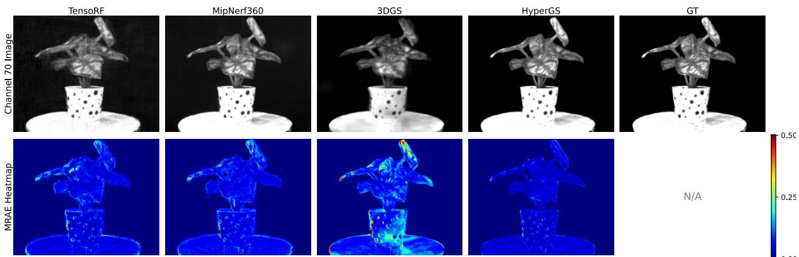  
Figure 6. Visualisation of the top 4 methods for frame 51 of 359 for the Caladium plant scene from the Bayspec dataset. The top row shows the 70th channel of the 141 channel image predicted, the bottom row provides a raw pixel-wise error heatmap of the scene.

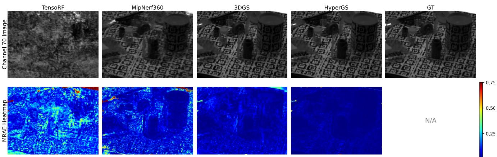  
Figure 7. Visualisation of the top 4 methods for frame 31 of 49 for the Tools plant scene from the SOP dataset. The top row shows the 70th channel of the 128 channel image predicted, the bottom row provides a raw pixel-wise error heatmap of the scene.

BaySpec Datasets
<table><tr><td rowspan="2">Method</td><td colspan="3">Average Results</td></tr><tr><td>PSNR ↑</td><td>SSIM↑ SAM↓</td><td>RMSE↓</td></tr><tr><td>NeRF</td><td>23.35</td><td>0.6061 0.0440</td><td>0.0687</td></tr><tr><td>MipNeRF</td><td>22.75</td><td>0.5947 0.0435</td><td>0.0776</td></tr><tr><td>TensoRF</td><td>24.66</td><td>0.6482 0.0501</td><td>0.0587</td></tr><tr><td>Nerfacto</td><td>19.12</td><td>0.5866 0.0551</td><td>0.1174</td></tr><tr><td>MipNerf360</td><td>26.53</td><td>0.7442 0.0280</td><td>0.0476</td></tr><tr><td>HS-NeRF</td><td>19.82</td><td>0.6714 0.0534</td><td>0.1071</td></tr><tr><td>3DGS</td><td>22.91</td><td>0.6321 0.1335</td><td>0.0810</td></tr><tr><td>HyperGS</td><td>27.11</td><td>0.7804 0.0254</td><td>0.0440</td></tr></table>

Table 1. Quantitative results using the Bayspec datasets against separate hyperspectral methods and baseline NeRF and 3DGS (best bold, second best italic).

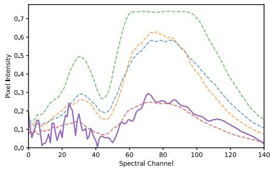

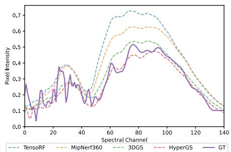

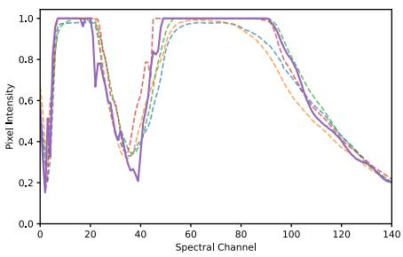

Figure 8. Three random pixel reconstructions taken from test frame 151 of the bayspec Anacampseros scene.  
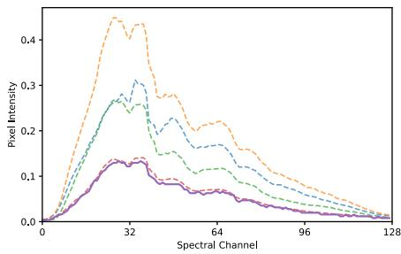

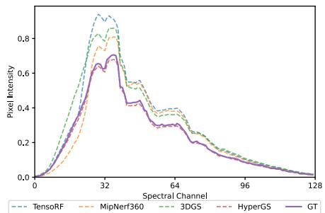

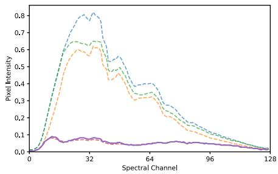  
Figure 9. Three random pixel reconstructions from test frame 31 of the SOP origami scene.

Surface Optics Datasets
<table><tr><td rowspan="2">Method</td><td colspan="4">Average Results</td></tr><tr><td>PSNR ↑</td><td>SSIM↑</td><td>SAM↓</td><td>RMSE↓</td></tr><tr><td>NeRF</td><td>10.89</td><td>0.5905</td><td>0.0625</td><td>0.3479</td></tr><tr><td>MipNeRF</td><td>12.53</td><td>0.5481</td><td>0.0568</td><td>0.3198</td></tr><tr><td>TensorF</td><td>13.00</td><td>0.5696</td><td>0.0595</td><td>0.2780</td></tr><tr><td>Nerfacto</td><td>16.37</td><td>0.6986</td><td>0.0352</td><td>0.1601</td></tr><tr><td>MipNeRF360</td><td>12.28</td><td>0.6824</td><td>0.1369</td><td>0.2658</td></tr><tr><td>HS-NeRF</td><td>14.44</td><td>0.6165</td><td>0.2037</td><td>0.1953</td></tr><tr><td>3DGS</td><td>28.58</td><td>0.9627</td><td>0.0301</td><td>0.0478</td></tr><tr><td>HyperGS</td><td>30.51</td><td>0.9756</td><td>0.00415</td><td>0.0354</td></tr></table>

Table 2. Quantitative results using the SOP datasets against separate hyperspectral methods and baseline NeRF and 3DGS.

## 5.2. Ablation Study

To evaluate the effectiveness and impact of various components in our HyperGS model, we conducted a series of ablation experiments. These experiments help to understand the contribution of individual components and choices in our model’s design. As shown in Table 3, each new feature added to the baseline 3DGS model improves HNVS performance. The joint latent autoencoder-3DGS architecture boosts spectral reconstruction the most while the proposed densication provides greater overall details captured. With the latent space learning and positional encoding, the performance of HyperGS gets a signicant boost in performance too. Please refer to our supplementary materials for additional ablations, including analyses of HyperGS performance, pruning strategy scoring functions, autoencoder performance with varying data and latent sizes, the global pruning strategy, and system speed bottlenecks.

<table><tr><td rowspan="2">Ablation Step</td><td colspan="5">Average Results for the Bayspec dataset</td></tr><tr><td>PSNR ↑</td><td>SSIM↑</td><td>SAM↓</td><td>RMSE↓</td><td>N.Prim ↓</td></tr><tr><td>Base. 3DGS</td><td>22.91</td><td>0.6320</td><td>0.1335</td><td>0.0810</td><td>440k</td></tr><tr><td>+ Spec. SFM</td><td>23.05</td><td>0.6331</td><td>0.1310</td><td>0.0799</td><td>421k</td></tr><tr><td>+ Latent space AE</td><td>24.87</td><td>0.7101</td><td>0.0548</td><td>0.0602</td><td>500k</td></tr><tr><td>+ Densification</td><td>25.25</td><td>0.7356</td><td>0.0365</td><td>0.0548</td><td>1.3M</td></tr><tr><td>+ Pruning</td><td>25.17</td><td>0.7199</td><td>0.0374</td><td>0.0555</td><td>412k</td></tr><tr><td>+ View depenent MLP</td><td>27.05</td><td>0.7792</td><td>0.0253</td><td>0.0443</td><td>309k</td></tr><tr><td>+ Custom L.Func</td><td>27.11</td><td>0.7801</td><td>0.0254</td><td>0.0440</td><td>310k</td></tr></table>

Table 3. Adding each new feature to 3DGS signicantly improves the model’s average performance for the HNVS task in the bayspec dataset while creating a more stable number of primitives (N.Prim) in the point cloud.

## 6. Conclusions

In this paper, we introduced HyperGS, the rst effective approach for hyperspectral novel view synthesis (HNVS). By encoding latent spectral data within Gaussian primitives and performing Gaussian splatting in a learned latent space, HyperGS achieves high-quality, material-aware rendering. Our adaptive density control and pruning techniques efciently handle latent hyperspectral signatures in 3D Gaussian point clouds, ensuring stable training and superior accuracy compared to benchmark methods. For future work, we aim to extend HyperGS with more comprehensive latent space decoding that corrects and renes both spectral and spatial information, providing richer contextual detail.

## 7. Acknowledgements

This work was partially supported by Industrial 3D Robotics (I3D), IS-Instruments and partially funded by the EPSRC under grant agreement EP/S035761/1.

## References

[1] J.T. Barron, B. Mildenhall, D. Verbin, P.P. Srinivasan, and P. Hedman. Mip-nerf 360: Unbounded anti-aliased neural radiance elds. In Proceedings ofthe IEEE/CVF Conference on Computer Vision and Pattern Recognition (CVPR), 2022. 4, 6

[2] Jonathan T. Barron, Ben Mildenhall, Matthew Tancik, Peter Hedman, Ricardo Martin-Brualla, and Pratul P. Srinivasan. Mip-nerf: A multiscale representation for anti-aliasing neural radiance elds, 2021. 6

[3] S. R. Bulo, L. Porzi, and P. Kontschieder. Revising densi \` - cation in gaussian splatting. ArXiv, 2024. 2

[4] Anpei Chen, Zexiang Xu, Andreas Geiger, Jingyi Yu, and Hao Su. Tensorf: Tensorial radiance elds. In European Conference on Computer Vision (ECCV), 2022. 2, 6

[5] G. Chen, S. K. Narayanan, T. G. Ottou, B. Missaoui, H. Muriki, C. Pradalier, and Y. Chen. Hyperspectral neural radiance elds. ArXiv, 2024. 2, 6

[6] Kai Cheng, Xiaoxiao Long, Kaizhi Yang, Yao Yao, Wei Yin, Yuexin Ma, Wenping Wang, and Xuejin Chen. Gaussianpro: 3d gaussian splatting with progressive propagation. arXiv preprint arXiv:2402.14650, 2024. 2

[7] Angela Dai, Angel X. Chang, Manolis Savva, Maciej Halber, Thomas Funkhouser, and Matthias Nießner. Scannet: Richly-annotated 3d reconstructions of indoor scenes. In Proc. Computer Vision and Pattern Recognition (CVPR), IEEE, 2017. 6, 1

[8] F. Dellaert. NeRF explosion 2020. https://dellaert. github.io/NeRF/, 2020. 2

[9] Z. Fan, K. Wang, K. Wen, Z. Zhu, D. Xu, and Z. Wang. Lightgaussian: Unbounded 3d gaussian compression with 15x reduction and 200+ fps. arXiv preprint arXiv:2311.17245, 2023. 2

[10] Z. Fan, W. Cong, K. Wen, K. Wang, J. Zhang, X. Ding, D. Xu, B. Ivanovic, M. Pavone, G. Pavlakos, Z. Wang, and Y. Wang. Instantsplat: Sparse-view sfm-free gaussian splatting in seconds. ArXiv, 2024. 2

[11] S. Girish, K. Gupta, and A. Shrivastava. Eagles: Efcient accelerated 3d gaussians with lightweight encodings. arXiv preprint arXiv:2312.04564, 2023. 6

[12] Jaewoo Jung, Jisang Han, Honggyu An, Jiwon Kang, Seonghoon Park, and Seungryong Kim. Relaxing accurate initialization constraint for 3d gaussian splatting. arXiv preprint arXiv:2403.09413, 2024. 2

[13] Bernhard Kerbl, Georgios Kopanas, Thomas Leimkuhler,¨ and George Drettakis. 3d gaussian splatting for real-time radiance eld rendering. ACM Transactions on Graphics (SIG-GRAPH Conference Proceedings), 42(4), 2023. 1, 3

[14] Byeonghyeon Lee, Howoong Lee, Xiangyu Sun, Usman Ali, and Eunbyung Park. Deblurring 3d gaussian splatting, 2024. 3

[15] J. Li, Y. Li, C. Sun, C. Wang, and J. Xiang. Spec-nerf: Multispectral neural radiance elds. ArXiv, 2023. 2

[16] R. Li, J. Liu, G. Liu, S. Zhang, B. Zeng, and S. Liu. Spectralnerf: Physically based spectral rendering with neural radiance eld. ArXiv, 2023. 2

[17] Jie Liang, Ali Zia, Jun Zhou, and Xavier Sirault. 3d plant modelling via hyperspectral imaging. In 2013 IEEE International Conference on Computer Vision Workshops, pages 172–177, 2013. 2

[18] W. Liu, T. Guan, B. Zhu, L. Ju, Z. Song, D. Li, Y. Wang, and W. Yang. Efcientgs: Streamlining gaussian splatting for large-scale high-resolution scene representation. ArXiv, 2024. 2, 6

[19] T. Lu, M. Yu, L. Xu, Y. Xiangli, L. Wang, D. Lin, and B. Dai. Scaffold-gs: Structured 3d gaussians for view-adaptive rendering. ArXiv, 2023. 2, 3

[20] D. Malarz, W. Smolak, J. Tabor, S. Tadeja, and P. Spurek. Gaussian splatting with nerf-based color and opacity. ArXiv, 2023. 2

[21] D. Malarz, W. Smolak, J. Tabor, S. Tadeja, and P. Spurek. Gaussian splatting with nerf-based color and opacity. ArXiv, 2023. 3

[22] Ben Mildenhall, Pratul P. Srinivasan, Matthew Tancik, Jonathan T. Barron, Ravi Ramamoorthi, and Ren Ng. Nerf: Representing scenes as neural radiance elds for view synthesis. In ECCV, 2020. 1, 6

[23] B. Mildenhall, P. Hedman, R. Martin-Brualla, P.P. Srinivasan, and J.T. Barron. Nerf in the dark: High dynamic range view synthesis from noisy raw images. In Proceedings of the IEEE/CVF Conference on Computer Vision and Pattern Recognition (CVPR), 2022. 2

[24] T. Muller, A. Evans, C. Schied, and A. Keller. Instant neu-¨ ral graphics primitives with a multiresolution hash encoding. ACM Transactions on Graphics (TOG), 41(4):102:1–102:15, 2022. 4

[25] S. Niedermayr, J. Stumpfegger, and R. Westermann. Compressed 3d gaussian splatting for accelerated novel view synthesis. arXiv preprint arXiv:2401.02436, 2023. 6

[26] M. Tancik, E. Weber, E. Ng, R. Li, B. Yi, J. Kerr, T. Wang, A. Kristoffersen, J. Austin, K. Salahi, A. Ahuja, D. McAllister, and A. Kanazawa. Nerfstudio: A modular framework for neural radiance eld development. arXiv preprint arXiv:2302.04264, 2023. 6

[27] Christopher Thirgood, Oscar Mendez, Erin Chao Ling, Jon Storey, and Simon Hadeld. Raspectloc: Raman spectroscopy-dependent robot localisation. In 2023 IEEE/RSJ International Conference on Intelligent Robots and Systems (IROS), pages 5296–5303, 2023. 1

[28] S. Wang, V. Leroy, Y. Cabon, B. Chidlovskii, and J. Revaud. DUSt3R: Geometric 3D Vision Made Easy. arXiv preprint arXiv:2312.14132, 2023. 2

[29] Z. Yang, X. Gao, Y. Sun, Y. Huang, X. Lyu, W. Zhou, S. Jiao, X. Qi, and X. Jin. Spec-Gaussian: Anisotropic View-Dependent Appearance for 3D Gaussian Splatting. ArXiv, 2024. 3

[30] Zehao Yu, Anpei Chen, Binbin Huang, Torsten Sattler, and Andreas Geiger. Mip-splatting: Alias-free 3d gaussian splatting. In Proceedings of the IEEE/CVF Conference on Computer Vision and Pattern Recognition (CVPR), pages 19447– 19456, 2024. 2

[31] A. Zia, J. Liang, J. Zhou, and Y. Gao. 3d reconstruction from hyperspectral images. In 2015 IEEE Winter Conference on

Applications of Computer Vision (WACV), pages 318–325, 2015. 2

[32] Ali Zia, Jie Liang, Jun Zhou, and Yongsheng Gao. 3d reconstruction from hyperspectral images. In 2015 IEEE Winter Conference on Applications ofComputer Vision, pages 318– 325, 2015. 2