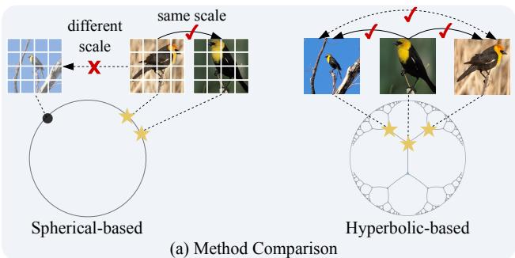
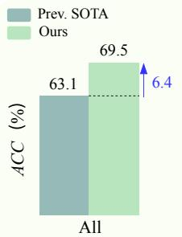
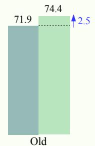
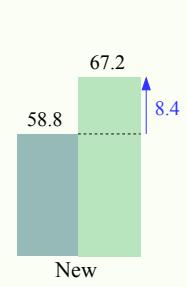
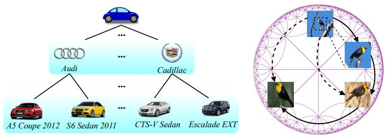
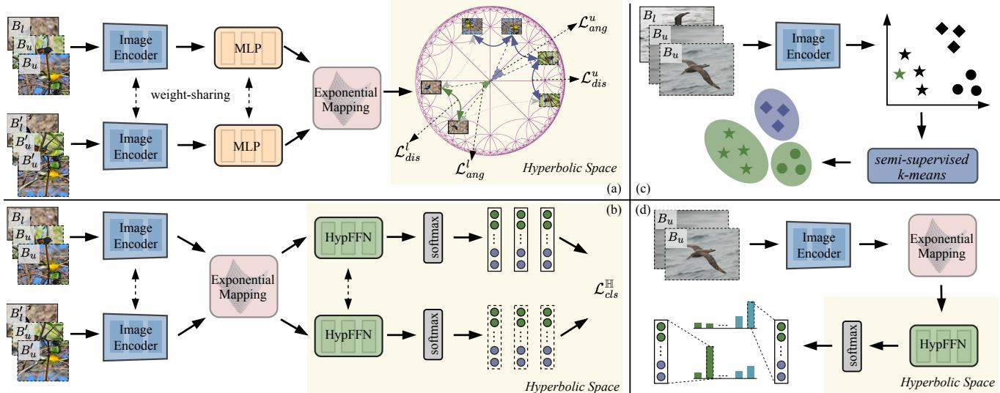
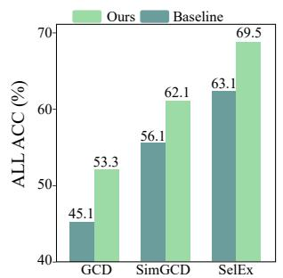
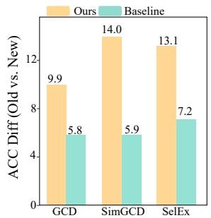
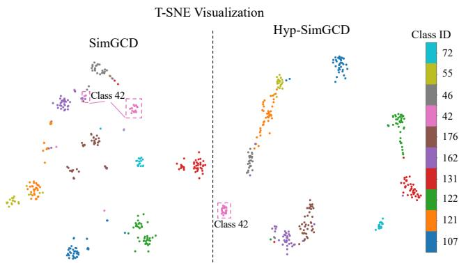

# Hyperbolic Category Discovery

Yuanpei Liu Zhenqi He Kai Han† Visual AI Lab, The University of Hong Kong {ypliu0,zhenqi he}@connect.hku.hk kaihanx@hku.hk

## Abstract

Generalized Category Discovery (GCD) is an intriguing open-world problem that has garnered increasing attention. Given a dataset that includes both labelled and unlabelled images, GCD aims to categorize all images in the unlabelled subset, regardless of whether they belong to known or unknown classes. In GCD, the common practice typically involves applying a spherical projection operator at the end of the self-supervised pretrained backbone, operating within Euclidean or spherical space. However, both of these spaces have been shown to be suboptimal for encoding samples that possesses hierarchical structures. In contrast, hyperbolic space exhibits exponential volume growth relative to radius, making it inherently strong at capturing the hierarchical structure of samples from both seen and unseen categories. Therefore, we propose to tackle the category discovery challenge in the hyperbolic space. We introduce HypCD, a simple Hyperbolic framework for learning hierarchy-aware representations and classifiersfor generalized Category Discovery. HypCD first transforms the Euclidean embedding space ofthe backbone network into hyperbolic space,facilitating subsequent representation and classification learning by considering both hyperbolic distance and the angle between samples. This approach is particularly helpfulfor knowledge transfer from known to unknown categories in GCD. We thoroughly evaluate HypCD on public GCD benchmarks, by applying it to various baseline and state-of-the-art methods, consistently achieving significant improvements. Project page: https://visual-ai.github.io/hypcd/

## 1. Introduction

Recently, category discovery – initially explored as novel category discovery (NCD) [24] and subsequently extended to generalized category discovery (GCD) [51] – has emerged as an intriguing open-world problem, gaining increasing attention. GCD addresses the challenges posed by partially labelled datasets, where the unlabelled subset may contain instances from both seen and unseen classes. The goal is to leverage knowledge from labelled data to effectively categorize the unlabelled data. Based on the way to predict category index, existing GCD methods can be broadly classified into two types: non-parametric methods [27, 44, 45, 51] and parametric methods [37, 55, 59]. Non-parametric methods predict category index based on feature clustering while parametric methods utilize a parametric classifier.

  
(b) Accuracy Comparison  
Figure 1. (a) Spherical-based vs. Hyperbolic-based methods, where hyperbolic space better accommodates variations in scale and improves connections between samples. (b) Average ACC comparison of our method and previous SOTA across ‘All’, ‘Old’, and ‘New’ categories on the SSB [52] benchmark using DINO [7].

As shown in the GCD literature [51], object parts are effective for knowledge transfer from seen to unseen categories, which is crucial for novel category discovery. Methods have been developed to explicitly learn better local features by learning pixel-level prompts around local image regions [55] or utilizing part-level features [63]. However, these methods consider object parts as rigid image patches of the same size, without considering the hierarchical nature of the object parts and the scale discrepancy of the same parts in different images, thus unavoidably restrict ing the performance for GCD (see Fig. 1(a)), in which the objects often have distinct poses, scales and appearance. To address this problem, one possible solution is to learn im age embeddings possessing hierarchical constraints or following tree-like structures. This has been proven to be ef fective in many tasks. For example, in image retrieval and clustering, the hierarchy constraint may arise from whole fragment relation [29, 31]. Intuitively, in category discovery, which can be regarded as a transfer clustering task [24], we hypothesize that an embedding space that captures the hierarchical relations of object parts can also facilitate the discovery of new categories. Indeed, the hierarchical relations have been studied in GCD, such as [27, 41, 44, 45, 57]. However, they study from a substantially different perspective: inter-category hierarchy (see Fig. 2(a)). This only considers the hierarchy of different semantic classes from coarse to fine levels. Additionally, these methods require the relationships and number of levels in the hierarchy to be predefined, resulting in a lack of flexibility and scalability. Moreover, these methods are unable to capture more complex hierarchies, such as the compositional parts of an object (see Fig. 2(b)). This is particularly the case because existing methods [45, 51, 55, 59], no matter whether they consider the hierarchy or not, learn the image embeddings in a spherical space. This follows the common practice of applying a spherical projection operator at the end of the self-supervised feature backbone [7, 40]. Consequently, all subsequent operations, including distance calculations, are performed under either Euclidean or spherical geometry, resulting in limited awareness of hierarchical object parts.

(a) Inter-Category Relation  
  
(b) Intra-Category Relation  
Figure 2. Hierarchical relations in GCD. (a) Inter-category relationships within the Stanford-Cars dataset [33]. (b) Intra-category relationships within CUB [54] dataset.

In this work, we study the overlooked perspective in category discovery: instead of learning in the Euclidean or spherical space, we advocate a space that captures the hierarchical structure of each data point. In spherical space, both the radius and volume are constant, whereas in Euclidean space, the volume grows polynomially with respect to the radius. Both of these spaces have been shown to be suboptimal for encoding samples that possess hierarchical structures [10, 15, 31]. In contrast, hyperbolic space possesses a distinctive property where its volume grows exponentially relative to the radius. This characteristic makes hyperbolic space particularly suitable for embedding treelike data, enhancing its representational power. Learning representations in hyperbolic space has proven to be effective in various computer vision tasks, including object recognition [15], object detection [32], semantic segmentation [58], and anomaly detection [35]. Inspired by these successes, we aim to realize the idea of learning hierarchyaware representations to facilitate knowledge transfer in category discovery, thereby unleashing the potential of hyperbolic representations.

To achieve this goal, we propose a simple yet effective framework, HypCD, to properly learn the hierarchyaware representation and classifier for category discovery through the lens of hyperbolic geometry. In this framework, we adapt our framework to popular parametric [59] and non-parametric [51] GCD baselines as well as the state-of-the-art (SOTA) method SelEx [45], obtaining substantial improvements for them, establishing the new SOTA (see Fig. 1(b)). Firstly, starting from the selfsupervised backbone pretrained in Euclidean space, we propose to map the Euclidean representation to a constrained Poincare ball through feature clipping and expo-´ nential mapping. Secondly, we implement the hyperbolic representation learning and build a hyperbolic classifier on the Poincare ball, considering both angle and distance be-´ tween samples in hyperbolic space. Thirdly, to assign labels to unlabelled data after training, for non-parametric methods, we apply semi-supervised k-means following the common practice; for parametric methods, we employ a hyperbolic classifier to make predictions. Despite its simplicity, our framework achieves significant performance improvements with two different pretrained weights (DINO [7] and DINOv2 [40]) on the public GCD datasets, including the coarse-grained classification datasets CIFAR-10 [34], CIFAR-100 [34], and ImageNet-100 [13], as well as the fine-grained SSB [50] benchmark.

In summary, we make the following contributions in this paper: (i) We identify the existing GCD methods’ common shortcoming in encoding the hierarchical structure and propose to incorporate the hyperbolic geometry into the embedding space to address this limitation; (ii) We propose a simple yet effective framework, called HypCD, for incorporating the hyperbolic geometry in representation learning and classification for category discovery; and (iii) Through extensive experiments on public GCD benchmarks by applying HypCD to baseline and SOTA methods, our method consistently demonstrates effectiveness and superiority.

## 2. Related Work

Category Discovery. Novel category discovery (NCD) is initially introduced in [24] to establish a realistic framework for transferring knowledge from seen categories to cluster unseen categories, by considering it as a transfer clustering problem. Many subsequent methods have been proposed to advance the field [17, 25, 26, 28, 63, 65]. Generalized category discovery [51] (GCD) relaxes the assumption in NCD by considering unlabelled data containing samples from both known and unknown classes [51]. Further investigations [6, 8, 27, 30, 37, 42, 56] have explored a variety of strategies to address the challenges posed by GCD. One notable approach, SimGCD [59], proposes to learn a parametric classifier enhanced by mean entropy regularization, thereby improving performance. In another vein, GPC [64] employs Gaussian mixture models to jointly learn robust representations while simultaneously estimating the number of unknown categories. SPT-Net [55] presents a spatial prompt tuning method that enables models to concentrate more effectively on specific object parts, thus enhancing knowledge transfer in GCD. Most recently, SelEx [45] has been proposed, leveraging hierarchical semi-supervised k-means to achieve SOTA results on fine-grained datasets. Additionally, various efforts are focused on addressing category discovery from multiple perspectives. For instance, [28] emphasizes multi-modal category discovery; [62] and [8] explore a continual setting; [43] studies category discovery in a federated setting; and [56] examines GCD in the presence of domain shifts.

Hyperbolic Geometry. Hyperbolic space, defined as a non-Euclidean manifold with exponential volume growth in relation to its radius, is inherently aligned with the embedding of tree-like and hierarchical data structures in visual recognition tasks. Significant advancements in this area include [31], which presents a hyperbolic image embedding technique by projecting model outputs into hyperbolic space, and [15], which integrates hyperbolic geometry into various vision transformer architectures, showcasing performance that surpasses their Euclidean counterparts. Hyperbolic methods have also been developed on diverse tasks such as image classification [15, 23, 31], action recognition [18], few-shot learning [20] and object segmentation [21, 60]. Moreover, recent developments have introduced hyperbolic geometry for neural networks including fully connected layers [46], convolutional neural networks [3], graph neural networks [9, 36], and attention network [22], thereby facilitating a deeper integration of hyperbolic geometry into deep learning regime.

## 3. Method

In this section, we first introduce the task in Sec. 3.1, then move to a review of baselines in Sec. 3.2. Afterwards, the geometry mapping and training details of our framework are described in Sec. 3.3 and Sec. 3.4. Lastly, the label assignment details are outlined in Sec. 3.5.

## 3.1. Problem Statement

GCD aims to learn a model capable of accurately classifying unlabelled samples from known categories while simultaneously clustering those from unknown categories. Consider an unlabelled dataset denoted as $\mathbf { D } _ { u } = \{ ( \mathbf { x } _ { i } ^ { u } , y _ { i } ^ { u } ) \} \in$ $\mathbf { X } \times \mathbf { Y } _ { u }$ and a labelled dataset represented as $\begin{array} { r l } { \mathbf { D } _ { l } } & { { } = } \end{array}$ $\{ ( \mathbf { x } _ { i } ^ { l } , \boldsymbol { y } _ { i } ^ { l } ) \} \in \mathbf { X } \times \mathbf { Y } _ { l } ,$ , where $\mathbf { Y } _ { u }$ and $\mathbf { Y } _ { l }$ denote the respective label sets. The unlabelled dataset comprises samples from both known and unknown categories, $i . e . ,$ , specifically $\mathbf { Y } _ { l } \subset \mathbf { Y } _ { u } .$ Let the number of labelled categories be denoted by $M = | { \bf Y } _ { l } |$ . We assume that the total number of categories, $K = | \mathbf { Y } _ { l } \cup \mathbf { Y } _ { u } |$ , is known, as posited in prior works [26, 53, 59]. In scenarios where this information is unavailable, alternative methods such as those proposed in [24, 51] can be employed to yield a reliable estimation.

## 3.2. Review of Baselines

Non-parametric Baseline. [51] formalizes the GCD task and proposes a non-parametric baseline. The approach involves finetuning the pre-trained DINO [7] model [14] to enhance the learned representation. The loss function comprises a supervised contrastive loss, which operates on the labelled samples, and a self-supervised contrastive loss, which operates on all the samples. Specifically, given two randomly augmented views $\mathbf { x } _ { i }$ and $\mathbf { x } _ { i } ^ { \prime }$ for the same image in a mini-batch B, the self-supervised contrastive loss is:

$$
\begin{array} { r } { \mathcal { L } _ { r e p } ^ { u } = \frac { 1 } { | B | } \sum _ { i \in B } - \log \frac { \exp \left( \mathbf { z } _ { i } \cdot \mathbf { z } _ { i } ^ { \prime } / \tau _ { r } \right) } { \sum _ { j } ^ { j \ne i } \exp \left( \mathbf { z } _ { i } \cdot \mathbf { z } _ { j } ^ { \prime } / \tau _ { r } \right) } , } \end{array}\tag{1}
$$

where the feature $\mathbf { z } _ { i } = \rho _ { r } ( \phi ( \mathbf { x } _ { i } ) )$ is a $\ell _ { 2 } \cdot$ -normalized vector and $\mathbf { z } _ { i } ^ { \prime }$ represents feature from another view $\mathbf { x } _ { i } ^ { \prime } .$ Here, $\phi$ refers to the backbone network, $\rho _ { r }$ denotes the projection head, and $\tau _ { r }$ stands as the temperature parameter used for scaling the features. The supervised contrastive loss for labelled samples is:

$$
\begin{array} { r } { \mathcal { L } _ { r e p } ^ { s } = \frac { 1 } { \left| { B _ { l } } \right| } \sum _ { i \in B _ { l } } \frac { 1 } { \left| { N _ { i } } \right| } \displaystyle \sum _ { q \in N _ { i } } { - \log \frac { { \exp \left( { { \bf { z } } _ { i } } \cdot { \bf { z } } _ { q } \right)} / { \tau _ { r } }  } { \sum _ { j } ^ { j \ne i } { \exp \left( { { \bf { z } } _ { i } } \cdot { \bf { z } } _ { j } \right)} / { \tau _ { r } }  } } , } \end{array}\tag{2}
$$

where $N _ { i }$ is the index set for all other images in the labelled mini-batch $B _ { l } \subset B$ having the same label as $\mathbf { x } _ { i }$ . The overall representation learning loss is then: $\mathcal { L } _ { r e p } = ( 1 - \lambda _ { b } ) \mathcal { L } _ { r e p } ^ { u } +$ $\lambda _ { b } \mathcal { L } _ { r e p } ^ { s } .$ , where $\lambda _ { b }$ is a balance factor.

Parametric Baseline. [59] introduces a robust parametric GCD baseline, which has been widely adopted in the field ever since [53, 55]. This method employs a parametric classifier implemented in a self-distillation framework [7]. The classifier is randomly initialized with K normalized category prototypes $\mathbf { C } = \{ \mathbf { c } _ { 1 } , . . . , \mathbf { c } _ { K } \}$ . For a randomly augmented view $\mathbf { x } _ { i }$ and its corresponding normalized hidden feature vector $\mathbf { h } _ { i } = \phi ( \mathbf { x } _ { i } ) / | | \phi ( \mathbf { x } _ { i } ) | |$ , the output probability for the k-th category is given by:

$$
\begin{array} { r } { \mathbf { p } _ { i } ^ { ( k ) } = \frac { \exp ( \mathbf { h } _ { i } \cdot \mathbf { c } _ { k } / \tau _ { s } ) } { \sum _ { j = 1 } ^ { K } \exp ( \mathbf { h } _ { i } \cdot \mathbf { c } _ { j } / \tau _ { s } ) } , } \end{array}\tag{3}
$$

where $\tau _ { s }$ is the scaling temperature for the ‘student’ view. The soft label $\mathbf { q } _ { i }$ is generated by the ‘teacher’ view with a sharper temperature $\tau _ { t }$ based on another augmented view in a similar manner. The self-distillation loss for the two views is then computed using the cross-entropy loss function: $\begin{array} { r } { \ell _ { c e } ( \mathbf { q } ^ { \prime } , \mathbf { p } ) = \dot { - } \sum _ { i = 1 } ^ { K } \mathbf { q } ^ { \prime ( j ) } \log \mathbf { p } ^ { ( j ) } } \end{array}$ . The unsupervised loss is then computed by aggregating contributions from all samples in the mini-batch B as follows:

$$
\begin{array} { r } { \mathcal { L } _ { c l s } ^ { u } = \frac { 1 } { | B | } \sum _ { i \in B } \ell _ { c e } ( \mathbf { q } _ { i } ^ { \prime } , \mathbf { p } _ { i } ) - \xi \mathcal { H } ( \mathbf { \overline { { p } } } ) , } \end{array}\tag{4}
$$

where $\begin{array} { r } { \overline { { \bf p } } = \frac { 1 } { 2 | B | } \sum _ { i \in B } ( { \bf p } _ { i } + { \bf p } _ { i } ^ { \prime } ) } \end{array}$ denotes the mean prediction across the mini-batch. The mean entropy is defined as: $\begin{array} { r } { \mathcal { H } ( \overline { { \mathbf { p } } } ) = - \sum _ { i = 1 } ^ { K } \overline { { \mathbf { p } } } ^ { ( j ) } \log \overline { { \mathbf { p } } } ^ { ( j ) } } \end{array}$ , weighted by $\xi .$

For the labelled samples, the supervised classification loss is written as $\begin{array} { r } { \mathcal { L } _ { c l s } ^ { s } = \frac { 1 } { \left| B _ { l } \right| } \sum _ { i \in B _ { l } } \ell _ { c e } ( \mathbf { p } _ { i } , \mathbf { y } _ { i } ) } \end{array}$ , where $\mathbf { y } _ { i }$ represents the one-hot vector corresponding to the groundtruth label $y _ { i }$ . The overall objective is $\mathcal { L } _ { c l s } = ( 1 - \lambda _ { b } ) \mathcal { L } _ { c l s } ^ { u } +$ $\lambda _ { b } \mathcal { L } _ { c l s } ^ { s }$ . Integrating this with the representation learning loss $\mathcal { L } _ { \boldsymbol { r } \boldsymbol { e p } }$ adopted from [51], the comprehensive training objective is expressed as: $\mathcal { L } _ { g c d } = \mathcal { L } _ { c l s } + \mathcal { L } _ { r e p }$ . Through training with $\mathcal { L } _ { g c d }$ on both $\mathbf { D } _ { l }$ and $\mathbf { D } _ { u } ,$ the classifier is empowered to directly predict labels for the unlabelled samples after the training process concludes.

## 3.3. Hyperbolic Space for Category Discovery

As previously discussed, object parts are critical for facilitating knowledge transfer from labelled categories to unseen ones in GCD. Each sample inherently contains object parts that reside within a hierarchical structure. Moreover, existing GCD methods [44, 45] emphasize the intercategory hierarchy to enhance the clustering performance of unlabelled samples in Euclidean or spherical spaces. However, the geometry of representation space limits their ability to effectively capture other kinds of hierarchy [31]. In contrast, hyperbolic space, characterized by its property of exponential volume growth with respect to the radius [15], emerges as a more suitable space for GCD.

Hyperbolic space $\mathbb { H } ^ { n }$ is defined as an n-dimensional Riemannian manifold exhibiting constant negative curvature, and it encompasses several analytic models [5]. Following previous literature [15, 31], we employ the Poincare ball´ [39] model. In this model, the hyperbolic space is represented as an n-dimensional ball $\mathbb { D } _ { c } ^ { n } =$ $\{ \mathbf { a } \in \bar { \mathbb { R } ^ { n } } \ | \ c | | \mathbf { a } | | ^ { \bar { 2 } } < 1 \}$ with curvature value $- c ^ { 2 }$ , where c is the non-negative curvature parameter. The manifold is equipped with the Riemannian metric $\begin{array} { r } { g ^ { \mathbb { D } } = \lambda _ { c } ^ { 2 } g ^ { \mathbb { E } } } \end{array}$ where $\begin{array} { r } { \lambda _ { c } ( \mathbf { a } ) = \frac { 2 } { 1 - c \| \mathbf { a } \| ^ { 2 } } } \end{array}$ is the conformalfactor and $g ^ { \mathbb { E } }$ is the identity metric ${ \mathbf I } _ { n }$ in Euclidean space. In this way, the local distances are scaled by the factor $\lambda _ { c }$ approaching infinity near the boundary of the ball. This gives rise to the exponential expansion property of hyperbolic spaces, unlike the polynomial expansion in Euclidean space. However, hyperbolic space is not vector space and thus operations such as addition can not be directly conducted. To address this problem, we leverage the gyrovector formalism [48]. For a pair of points a, b $\in \mathbb { D } _ { c } ^ { n }$ , their Mobius addition¨ is defined as:

$$
\begin{array} { r } { \mathbf { a } \oplus _ { c } \mathbf { b } = \frac { ( 1 + 2 c \langle \mathbf { a } , \mathbf { b } \rangle + c \lVert \mathbf { b } \rVert ^ { 2 } ) \mathbf { a } + ( 1 - c \lVert \mathbf { a } \rVert ^ { 2 } ) \mathbf { b } } { 1 + 2 c \langle \mathbf { a } , \mathbf { b } \rangle + c ^ { 2 } \lVert \mathbf { a } \rVert ^ { 2 } \lVert \mathbf { b } \rVert ^ { 2 } } . } \end{array}\tag{5}
$$

The hyperbolic distance between them is then:

$$
\begin{array} { r } { \mathcal { D } _ { \mathbb { H } } ( \mathbf { a } , \mathbf { b } ) = \frac { 2 } { \sqrt { c } } \mathrm { a r c t a n h } ( \sqrt { c } \lVert - \mathbf { a } \oplus _ { c } \mathbf { b } \rVert ) } \end{array}\tag{6}
$$

When $c \to 0$ , the hyperbolic distance (Eq. 6) closes to the Euclidean distance lim $\mathsf { i } _ { c \to 0 } \mathscr { D } _ { \mathbb { H } } ( \mathbf { a } , \mathbf { b } ) = 2 \| \mathbf { a } - \mathbf { b } \|$ .

## 3.4. HypCD

As illustrated in Fig. 3, we propose a unified framework, HypCD, for category discovery in hyperbolic space, incorporating both parametric [59] and non-parametric GCD approaches. Given two randomly augmented views, we initially obtain the respective Euclidean feature vectors $\mathbf { z } _ { i }$ and $\mathbf { z } _ { i } ^ { \prime }$ through a self-supervised pretrained backbone $[ 7 ,$ 40]. Subsequently, the feature embeddings are mapped into hyperbolic space $\mathbb { H } ^ { n }$ using exponential mapping, facilitating representation learning within this exponentially growing space to more effectively capture and utilize the hierarchical relationships inherent in the training data.

The exponential mapping [31] serves as a bijective projection between Euclidean space $\mathbb { E } ^ { n }$ and hyperbolic space $\mathbb { H } ^ { n }$ . The projection of tangent vector z from $\mathbb { E } ^ { n }$ to $\mathbb { H } ^ { n }$ is formulated as:

$$
\exp _ { \mathbf { o } } ^ { c } ( \mathbf { z } ) = \mathbf { o } \oplus _ { c } \Bigg ( \operatorname { t a n h } \Bigg ( \sqrt { c } \frac { \lambda _ { \mathbf { o } } ^ { c } \| \mathbf { z } \| } { 2 } \Bigg ) \frac { \mathbf { z } } { \sqrt { c } \| \mathbf { z } \| } \Bigg ) ,\tag{7}
$$

where $\oplus _ { c }$ is the Mobius addition¨ , as introduced in Eq. 5 and o represents the base point of the mapping. To address the issue of gradient vanishing [23] near the boundary of the Poincare ball during training, we implement a ´ feature clipping operation in $\mathbb { E } ^ { n }$ prior to the exponential mapping. The operation is defined as: $\begin{array} { r } { \mathcal { C } ( \mathbf { z } ) = \operatorname* { m i n } \{ 1 , \frac { r } { | | \mathbf { z } | | } \} \cdot \mathbf { z } , } \end{array}$ , where r denotes the clipping value. For the feature vector $\mathbf { z } _ { i }$ in $\mathbb { E } ^ { n }$ , the corresponding mapped feature in $\mathbb { H } ^ { n }$ is expressed as $\begin{array} { r } { \mathcal { M } ( \mathbf { z } _ { i } ) = \exp _ { \mathbf { o } } ^ { c } ( \mathcal { C } ( \mathbf { z } _ { i } ) ) } \end{array}$ ). The same operation will also be applied to the other feature vector $\mathbf { z } _ { i } ^ { \prime }$

As described in Sec.3.2, both parametric [51] and nonparametric [59] baselines utilize the same representation learning method. In our framework, we implement a consistent representation learning solution in hyperbolic space for them (Fig.3(a)). For parametric approaches, a hyperbolic parametric classifier is employed (Fig. 3(b)). We will introduce these components in detail subsequently.

Hyperbolic Representation Learning. Following prior attempts [45, 51, 59], we incorporate both self-supervised and supervised contrastive learning into our framework. However, our approach uniquely operates within hyperbolic space. Furthermore, unlike previous GCD methods that exclusively utilize cosine distance [51, 55, 59] (angle-based) or Euclidean distance [45] (distance-based) for calculating pairwise similarity, we propose a hybrid approach that combines both distance-based and angle-based losses. Such integration has been shown to be more effective for model optimization in hyperbolic space [18]. First, the unified form of self-supervised contrastive loss can be defined as:

  
Figure 3. Overall pipeline of our HypCD framework for parametric and non-parametric GCD baselines. (a) Hyperbolic representation learning. (b) Hyperbolic classifier. (c) Non-parametric label assignment. (d) Parametric label assignment.

$$
\begin{array} { r } { \mathcal { L } ^ { u } = \frac { 1 } { | B | } \displaystyle \sum _ { i \in B } - \log \frac { \exp ( \mathcal { S } ( \mathcal { M } ( \mathbf { z } _ { i } ) , \mathcal { M } ( \mathbf { z } _ { i } ^ { \prime } ) ) / \tau _ { r } ) } { \sum _ { j } ^ { j \mp i } \exp ( \mathcal { S } ( \mathcal { M } ( \mathbf { z } _ { i } ) , \mathcal { M } ( \mathbf { z } _ { j } ^ { \prime } ) ) / \tau _ { r } ) } . } \end{array}\tag{8}
$$

Similarly, the supervised contrastive loss is unified as:

$$
\begin{array} { r } { \mathcal { L } ^ { s } = \frac { 1 } { \vert B _ { l } \vert } { \displaystyle \sum _ { i \in B _ { l } } } \frac { 1 } { \vert N _ { i } \vert } { \displaystyle \sum _ { q \in N _ { i } } } - \log \frac { \exp ( \mathcal { S } ( \mathcal { M } ( \mathbf { z } _ { i } ) , \mathcal { M } ( \mathbf { z } _ { q } ) ) / \tau _ { r } ) } { \sum _ { j \ne i } ^ { \infty } \exp ( \mathcal { S } ( \mathcal { M } ( \mathbf { z } _ { i } ) , \mathcal { M } ( \mathbf { z } _ { j } ) ) / \tau _ { r } ) } } ,  \end{array}\tag{9}
$$

where S denotes the similarity function, which can be either distance-based or angle-based. For distance-based contrastive loss, we utilize ${ \cal S } _ { d } = - { \cal D } _ { \mathbb { H } }$ as the similarity function, which is formally computed using negative Euclidean distance in prior methods [45]. For angle-based contrastive loss, we employ the cosine similarity, formulated as:

$$
\begin{array} { r } { \mathcal { S } _ { a } ( \mathcal { M } ( { \bf z } _ { i } ) , \mathcal { M } ( { \bf z } _ { i } ^ { \prime } ) ) = \frac { \mathcal { M } ( { \bf z } _ { i } ) \cdot \mathcal { M } ( { \bf z } _ { i } ^ { \prime } ) } { | | \mathcal { M } ( { \bf z } _ { i } ) | | \cdot | | \mathcal { M } ( { \bf z } _ { i } ^ { \prime } ) | | } . } \end{array}\tag{10}
$$

Since hyperbolic space is conformal with Euclidean space, cosine similarity remains equivalent in both $\mathbb { E } ^ { n }$ and $\mathbb { H } ^ { n }$

The final supervised and self-supervised hyperbolic contrastive loss is composed of both distance-based and anglebased losses:

$$
\begin{array} { r } { \mathcal { L } _ { h r e p } ^ { s } = \alpha _ { d } \mathcal { L } _ { d i s } ^ { s } + ( 1 - \alpha _ { d } ) \mathcal { L } _ { a n g } ^ { s } , } \\ { \mathcal { L } _ { h r e p } ^ { u } = \alpha _ { d } \mathcal { L } _ { d i s } ^ { u } + ( 1 - \alpha _ { d } ) \mathcal { L } _ { a n g } ^ { u } , } \end{array}\tag{11}
$$

where $\mathcal { L } _ { h r e p } ^ { s }$ and $\mathcal { L } _ { h r e p } ^ { u }$ represent the supervised and selfsupervised hyperbolic contrastive loss, respectively. The terms $\mathcal { L } _ { d i s }$ and $\mathcal { L } _ { a n g }$ correspond to distance-based and angle-based contrastive loss, respectively, obtained by substituting S with $\textstyle { S _ { d } }$ and $ { \boldsymbol { S } } _ { a }$ . Additionally, $\alpha _ { d }$ is the loss weight of distance-based loss. The overall training objective for hyperbolic representation learning is:

$$
\mathcal { L } _ { r e p } ^ { \mathbb { H } } = ( 1 - \lambda _ { b } ^ { \mathbb { H } } ) \mathcal { L } _ { h r e p } ^ { u } + \lambda _ { b } ^ { \mathbb { H } } \mathcal { L } _ { h r e p } ^ { s } ,\tag{12}
$$

where $\lambda _ { b } ^ { \mathbb { H } }$ serves as the balancing factor between the supervised and unsupervised losses.

Hyperbolic Classifier. To enhance the parametric baseline with hyperbolic geometry, we replace the conventional Euclidean classification head—traditionally reliant on a multilayer perceptron (MLP) in Euclidean space—with its hyperbolic counterpart, the hyperbolic feed forward network (HypFFN). The hyperbolic linear layer [19] exhibits greater alignment with the baseline [59], and we experimentally find that it outperforms the hyperbolic multinomial logistic regression layer. Consider the last linear layer of the MLP; similar to its Euclidean counterpart, the hyperbolic linear layer is parameterized by a weight matrix $\mathbf { \bar { w } } \in \mathbb { R } ^ { I \times K }$ and a bias vector s $\in \mathbb { R } ^ { \mathrm { i } \times K }$ , where I denotes the input feature dimension. Given the hyperbolic feature $\mathbf { z } _ { i } ^ { \mathbb { H } } = \mathcal { M } ( \mathbf { z } _ { i } ) \in \mathbb { R } ^ { 1 \times I }$ , the linear layer operates as HypLinear $( \mathbf { z } _ { i } ^ { \mathbb { H } } , \mathbf { w } , \mathbf { s } ) = \mathbb { P } \mathbb { r } \mathrm { o } \mathbf { j } [ ( \mathbf { w } \otimes _ { c } \mathbf { z } _ { i } ^ { \mathbb { H } } ) \oplus _ { c } \mathbf { s } ]$ , where ⊕c follows Eq. 5. The Mobius matrix-vector multiplication¨ $\mathbf { v } _ { i } = \mathbf { w } \otimes _ { c } \mathbf { z } _ { i } ^ { \mathbb { H } }$ is defined as:

$$
\begin{array} { r l } & { \frac { 1 } { \sqrt { c } } \operatorname { t a n h } \left( \frac { \| { \mathbf z } _ { i } ^ { \mathbb { H } } \mathbf { w } \| _ { 2 } } { \| { \mathbf z } _ { i } ^ { \mathbb { H } } \| _ { 2 } } \operatorname { t a n h } ^ { - 1 } ( \sqrt { c } \| { \mathbf z } _ { i } ^ { \mathbb { H } } \| _ { 2 } ) \right) \frac { { \mathbf z } _ { i } ^ { \mathbb { H } } \mathbf { w } } { \| { \mathbf z } _ { i } ^ { \mathbb { H } } \mathbf { w } \| _ { 2 } } . } \end{array}\tag{13}
$$

To ensure numerical stability [19], a safe projection is operated on the result manifold and represented as:

$$
\begin{array} { r } { \mathrm { P r o j } ( \mathbf { v } _ { i } ) = \left\{ \begin{array} { l l } { \frac { \mathbf { v } _ { i } } { \| \mathbf { v } _ { i } \| _ { 2 } } \times \frac { 1 - 1 0 ^ { - 3 } } { \sqrt { c } } , \frac { 1 - 1 0 ^ { - 3 } } { \sqrt { c } } < \| \mathbf { v } _ { i } \| _ { 2 } } \\ { \mathbf { v } _ { i } , \qquad \mathrm { o t h e r w i s e } } \end{array} \right. . } \end{array}\tag{14}
$$

This integration allows our hyperbolic classifier to be seamlessly incorporated into the baseline [59] by substituting the original MLP with HypFFN. For each point in $\mathbb { H } ^ { n }$ the tangent space at that point serves as a Euclidean subspace, enabling straightforward adaptation of Euclidean operations within this space [10]. Consequently, the crossentropy loss for the hyperbolic classifier can be expressed as: $\ell _ { c e } ^ { \mathbb { H } } = \ell _ { c e } \big ( \mathrm { H y p F F N } \big ( \mathbf { z } _ { i } ^ { \mathbb { H } } \big ) , \mathbf { y } _ { i } \big )$ . Additionally, we can define the hyperbolic counterpart $\mathcal { H } ^ { \mathbb { H } }$ for the mean entropy $\mathcal { H } .$ By substituting the original $\ell _ { c e }$ and H with our derived $\ell _ { c e } ^ { \mathbb { H } }$ and $\mathcal { H } ^ { \mathbb { H } }$ , respectively, we can readily compute the final hyperbolic classifier loss $\mathcal { L } _ { c l s } ^ { \mathbb { H } } .$ , as detailed in Sec. 3.2.

## 3.5. Label Assignment

Existing approaches typically employ either a parametric classification head or non-parametric methods, such as semi-supervised k-means [51], for label assignment. In this paper, we do not independently assess these two methods; rather, we integrate both within the HypCD framework as shown in Fig. 3(c) and (d). For non-parametric approaches, including [51] and the recent SelEx [45], we retain the original label assignment strategy by applying semi-supervised k-means clustering directly to feature representations extracted by ϕ in $\mathbb { E } ^ { n }$ . Our empirical results indicate that training in hyperbolic space allows for the transfer of hierarchical structure encoding from $\mathbb { H } ^ { n }$ to En. Moreover, we find that the operations of k-means in $\mathbb { E } ^ { n }$ are significantly more efficient while maintaining comparable performance. For the parametric baseline exemplified by SimGCD [59], we utilize the hyperbolic classification head to conduct classification within hyperbolic space using the trained hyperbolic classifier HypFFN. Both design choices are theoretically supported by the property of hyperbolic geometry of encoding hierarchical structures, facilitating a more intuitive and effective representation and classifier for GCD.

## 4. Experiment

## 4.1. Setups and Implementations

Datasets. We thoroughly evaluate our method across diverse benchmarks, including the generic image recognition datasets CIFAR-10 and CIFAR-100 [34], as well as ImageNet-100 [13]. Additionally, we assess our approach on the Semantic Shift Benchmark (SSB)[52], which includes fine-grained datasets such as CUB[54], Stanford-Cars [33], and FGVC-Aircraft [38]. For each dataset, we adhere to the data split scheme detailed in [51]. The method involves sampling a subset of all classes as the known (‘Old’) classes $\mathbf { Y } _ { l } .$ . Subsequently, 50% of the images from these known classes are utilized to construct $\mathbf { D } _ { l } ,$ while the remaining images are designated as the unlabelled data $\mathbf { D } _ { u } .$ Evaluation Metrics. We evaluate the performance using the clustering accuracy (ACC) as defined in the literature [51]. The ACC on $\mathbf { D } _ { u }$ is computed as follows, given the ground truth $y _ { i }$ and the predicted labels ${ \hat { y } } _ { i } \colon A C C \ =$ $\begin{array} { r } { \frac { 1 } { \left| \mathbf { D } _ { u } \right| } \mathbf { \bar { \Psi } } \sum _ { i = 1 } ^ { \left| \mathbf { D } _ { u } \right| } \mathbb { 1 } ( y _ { i } = h ( \hat { y } _ { i } ) ) } \end{array}$ , where h denotes the optimal permutation that aligns the predicted cluster assignments with the ground-truth labels. The ACC values for the ‘All’, ‘Old’ and ‘New’ classes are reported separately.

Implementation Details. We evaluate HypCD against the non-parametric baseline GCD [51], the parametric baseline SimGCD [59], and the SOTA method SelEx [45], utilizing both DINO [7] and DINOv2 [40] pretrained weights. Detailed information regarding SelEx can be found in the supplementary materials. For GCD [51], the output dimension of the projection head $\rho _ { r }$ is 256. In the case of SimGCD [59], the feature dimension from backbone $\phi$ is 768. $\rho _ { r }$ and the final block of $\phi$ are optimized using the SGD optimizer, with an initial learning rate of 0.1, which is decayed to 0.001 over time according to a cosine annealing schedule. The HypFFN is optimized using the Riemannian Adam optimizer [4], with a constant learning rate of 0.01. All models are trained for 200 epochs using a batch size of 128. The curvature parameter c is set to 0.05 for the fine-grained datasets and 0.01 for the generic datasets. Following baselines, the balancing factor $\lambda _ { b } ^ { \mathbb { H } }$ is set to 0.35. By default, the loss weight $\alpha _ { d }$ increases linearly from 0 to 1.0.

## 4.2. Quantitative Comparison

We compare our method with recent GCD methods (including ORCA [6], GCD [51], XCon [16], OpenCon [47], PromptCAL [61], DCCL [42], GPC [64], CiPR [27], SimGCD [59], µGCD [53], InfoSieve [44], SPTNet [55], CMS [12], AMEND [2] and SelEx [45]) and report the results in Tab. 1. The evaluation encompasses performance on the SSB benchmark [52] and generic datasets [13, 34]. The hyperbolic methods applying our HypCD framework are indicated by the ‘Hyp-’ prefix.

  
Figure 4. Comparison of baseline and hyperbolic counterparts on the SSB. Left: ‘All’ ACC (higher is better). Right: Discrepancy between ‘Old’ and ‘New’ ACC (smaller is better).

Results on SSB. The performance of the GCD methods on the SSB benchmark, utilizing both DINO [7] and DI-NOv2 [40] pretrained weights, is summarized in the left section of Tab. 1. Besides, we provide a comparative analysis between the three baseline methods and their hyperbolic counterparts with DINO backbone in Fig. 4. Our hyperbolic methods consistently outperform their Euclidean counterparts, with particularly strong results observed when utilizing the DINOv2 backbone. Among the evaluated methods, Hyp-SelEx achieves the highest average accuracy (ACC) across all datasets, notably excelling on the CUB dataset, where it records an accuracy of 79.8% for the ‘All’ classes with DINO and 90.7% with DINOv2, establishing it as the leading approach. More strikingly, on the Stanford-Cars dataset, our Hyp-GCD method outperforms the baseline by 11.8%, 13.3% and 15.9% in terms of ACC for the ‘All’, ‘Old’ and ‘New’ categories, respectively. Fig. 4 (left) illustrates the average ACC on ‘All’ categories across the three datasets in the SSB benchmark, indicating that our hyperbolic methods surpass the baseline by a margin of at least 6.0%. Furthermore, as shown in Fig. 4 (right), hyperbolic methods exhibit a consistently smaller ACC gap between ‘Old’ and ‘New’ classes, highlighting the effectiveness of HypCD in enhancing knowledge transfer from known to unseen categories. Additionally, DINOv2 outperforms DINO across all methods, underscoring its ability to capture complex data representations more effectively.

Table 1. Comparison of GCD methods on the SSB [52] benchmark, CIFAR-10 [34], CIFAR-100 [34] and ImageNet-100 [13] datasets. Results are reported in ACC across the ‘All’, ‘Old’ and ‘New’ categories.
<table><tr><td></td><td colspan="3">CUB [54]</td><td colspan="3">Stanford-Cars [33]</td><td colspan="3">FGVC-Aircraft [38]</td><td colspan="3">CIFAR-10 [34]</td><td colspan="3">CIFAR-100 [34]</td><td colspan="3">ImageNet-100 [13]</td></tr><tr><td>Method</td><td></td><td>All</td><td>Old</td><td>New All</td><td>Old</td><td>New</td><td>All</td><td>Old</td><td>New</td><td>All</td><td>Old</td><td>New</td><td>All</td><td>Old</td><td>New</td><td>All</td><td>Old</td><td>New</td></tr><tr><td>ORCA [6]</td><td></td><td>36.3</td><td>43.8</td><td>32.6 31.6</td><td>32.0</td><td>31.4</td><td>31.9</td><td>42.2</td><td>26.9</td><td>69.0</td><td>77.4</td><td>52.0</td><td>73.5</td><td>92.6</td><td>63.9</td><td>81.8</td><td>86.2</td><td>79.6</td></tr><tr><td>XCon [16]</td><td></td><td>52.1</td><td>54.3</td><td>51.0 40.5</td><td>58.8</td><td>31.7</td><td>47.7</td><td>44.4</td><td>49.4</td><td>96.0</td><td>97.3</td><td>95.4</td><td>74.2</td><td>81.2</td><td>60.3</td><td>77.6</td><td>93.5</td><td>69.7</td></tr><tr><td>OpenCon [47]</td><td></td><td>54.7</td><td>63.8</td><td>54.7 49.1</td><td>78.6</td><td>32.7</td><td></td><td></td><td></td><td></td><td></td><td></td><td></td><td></td><td></td><td>84.0</td><td>93.8</td><td>81.2</td></tr><tr><td>PromptCAL [61]</td><td></td><td>62.9</td><td>64.4</td><td>62.1 50.2</td><td>70.1</td><td>40.6</td><td>52.2</td><td>52.2</td><td>52.3</td><td>97.9</td><td>96.6</td><td>98.5</td><td>81.2</td><td>84.2</td><td>75.3</td><td>83.1</td><td>92.7</td><td>78.3</td></tr><tr><td>DCCL [42] GPC [64]</td><td></td><td>63.5 52.0</td><td>60.8</td><td>64.9 43.1</td><td>55.7</td><td>36.2</td><td></td><td></td><td></td><td>96.3</td><td>96.5</td><td>96.9</td><td>75.3</td><td>76.8</td><td>70.2</td><td>80.5</td><td>90.5</td><td>76.2</td></tr><tr><td></td><td></td><td>55.5</td><td></td><td>47.5 38.2</td><td>58.9</td><td>27.4</td><td>43.3</td><td>40.7</td><td>44.8</td><td>90.6</td><td>97.6</td><td>87.0</td><td>75.4</td><td>84.6</td><td>60.1</td><td>75.3</td><td>93.4</td><td>66.7</td></tr><tr><td>PIM [11]</td><td>62.7</td><td>75.7</td><td>56.2</td><td>43.1</td><td>66.9</td><td>31.6</td><td></td><td></td><td></td><td>94.7</td><td>97.4</td><td>93.3</td><td>78.3</td><td>84.2</td><td>66.5</td><td>83.1</td><td>95.3</td><td>77.0</td></tr><tr><td>µGCD [53]</td><td>65.7</td><td>68.0</td><td>64.6</td><td>56.5</td><td>68.1</td><td>50.9</td><td>53.8</td><td>55.4</td><td>53.0</td><td></td><td></td><td></td><td></td><td></td><td></td><td></td><td></td><td></td></tr><tr><td>InfoSieve [44] DNIO</td><td></td><td>69.4 77.9</td><td>65.2</td><td>55.7</td><td>74.8</td><td>46.4</td><td>56.3</td><td>63.7</td><td>52.5</td><td>94.8</td><td>97.7</td><td>93.4</td><td>78.3</td><td>82.2</td><td>70.5</td><td>80.5</td><td>93.8</td><td>73.8</td></tr><tr><td>CiPR [27]</td><td>57.1</td><td>58.7</td><td>55.6</td><td>47.0</td><td>61.5</td><td>40.1</td><td></td><td></td><td></td><td>97.7</td><td>97.5</td><td>97.7</td><td>81.5</td><td>82.4</td><td>79.7</td><td>80.5</td><td>84.9</td><td>78.3</td></tr><tr><td>SPTNet [55]</td><td>65.8</td><td>68.8</td><td>65.1</td><td>59.0</td><td>79.2</td><td>49.3</td><td>59.3</td><td>61.8</td><td>58.1</td><td>97.3</td><td>95.0</td><td>98.6</td><td>81.3</td><td>84.3</td><td>75.6</td><td>85.4</td><td>93.2</td><td>81.4</td></tr><tr><td>CMS [12]</td><td>68.2</td><td>76.5</td><td>64.0</td><td>56.9</td><td>76.1</td><td>47.6</td><td>56.0</td><td>63.4</td><td>52.3</td><td></td><td></td><td></td><td>82.3</td><td>85.7</td><td>75.5</td><td>84.7</td><td>95.6</td><td>79.2</td></tr><tr><td>AMEND [2]</td><td>64.9</td><td>75.6</td><td>59.6</td><td>52.8</td><td>61.8</td><td>48.3</td><td>56.4</td><td>73.3</td><td>48.2</td><td>96.8</td><td>94.6</td><td>97.8</td><td>81.0</td><td>79.9</td><td>83.3</td><td>83.2</td><td>92.9</td><td>78.3</td></tr><tr><td>GCD [51]</td><td>51.3</td><td>56.6</td><td>48.7</td><td>39.0</td><td>57.6</td><td>29.9</td><td>45.0</td><td>41.1</td><td>46.9</td><td>91.5</td><td>97.9</td><td>88.2</td><td>73.0</td><td>76.2</td><td>66.5</td><td>74.1</td><td>89.8</td><td>66.3</td></tr><tr><td>Hyp-ĠCD</td><td></td><td>61.0</td><td>67.0</td><td>58.0 50.8</td><td>60.9</td><td>45.8</td><td>48.2</td><td>43.6</td><td>50.5</td><td>92.9</td><td>97.5</td><td>90.6</td><td>74.0</td><td>80.0</td><td>62.0</td><td>80.4</td><td>92.5</td><td>74.4</td></tr><tr><td>SimGCD [59]</td><td>60.3</td><td>65.6</td><td></td><td>57.7 53.8</td><td>71.9</td><td>45.0</td><td>54.2</td><td>59.1</td><td>51.8</td><td>97.1</td><td>95.1</td><td>98.1</td><td>80.1</td><td>81.2</td><td>77.8</td><td>83.0</td><td>93.1</td><td>77.9</td></tr><tr><td>Hyp-SimGCD</td><td>64.8</td><td>65.8</td><td>64.2</td><td>62.8</td><td>73.4</td><td>57.7</td><td>58.7</td><td>58.9</td><td>58.5</td><td>96.8</td><td>95.9</td><td>97.2</td><td>82.4</td><td>83.1</td><td>81.2</td><td>86.5</td><td>93.7</td><td>83.0</td></tr><tr><td>SelEx [45] Hyp-SelEx</td><td>73.6 79.8</td><td>75.3</td><td>72.8</td><td>58.5</td><td>75.6</td><td>50.3</td><td>57.1</td><td>64.7</td><td>53.3</td><td>95.9</td><td>98.1</td><td>94.8</td><td>82.3</td><td>85.3</td><td>76.3</td><td>83.1</td><td>93.6</td><td>77.8</td></tr><tr><td>µGCD [53]</td><td></td><td>75.8</td><td>81.8</td><td>62.9</td><td>80.0</td><td>54.7</td><td>65.9</td><td>67.3</td><td>65.1</td><td>96.7</td><td>97.6</td><td>96.3</td><td>82.4</td><td>85.1</td><td>77.0</td><td>86.8</td><td>94.6</td><td>82.8</td></tr><tr><td>CiPR [27]</td><td>74.0</td><td>75.9</td><td>73.1</td><td>76.1</td><td>91.0</td><td>68.9</td><td>66.3</td><td>68.7</td><td>65.1</td><td></td><td></td><td></td><td></td><td></td><td></td><td></td><td></td><td></td></tr><tr><td>SPTNet [55]</td><td></td><td>78.3 73.4</td><td>80.8</td><td>66.7</td><td>77.0</td><td>61.8</td><td></td><td></td><td></td><td>99.0</td><td>98.7</td><td>99.2</td><td>90.3</td><td>89.0</td><td>93.1</td><td>88.2 90.1</td><td>87.6 96.1</td><td>88.5 87.1</td></tr><tr><td>DIONV GCD [51] Hyp-ĠCD</td><td>71.9</td><td>76.3 79.5</td><td>71.2 72.3</td><td>74.6</td><td></td><td></td><td></td></table>

\*results from our implementation.

Results on Generic Datasets. In the right section of Tab. 1, we present the results on three widely used generic datasets: CIFAR-10 [34], CIFAR-100 [34], and ImageNet-100 [13]. Our methods demonstrate consistent improvements across all cases, regardless of the backbone employed. Notably, these enhancements are especially significant on CIFAR-100 and ImageNet-100, which present greater challenges compared to CIFAR-10, where performance is nearly saturated. For CIFAR-100, Hyp-SimGCD and Hyp-SelEx achieve the highest accuracy of 82.4% for the ‘All’ categories using DINO, while Hyp-SimGCD ranks first with an accuracy of 91.5% on this metric when utilizing DINOv2, significantly surpassing baseline methods and the previous SOTA. Results on ImageNet-100 further validate the effectiveness of hyperbolic methods; Hyp-SelEx achieves the highest performance across ‘All’, ‘Old’, and ‘New’ categories with both DINO and DINOv2, outperforming the baseline by a margin of up to 3.7%.

## 4.3. Impact of Hyperparameters

Manifold Curvature. Building on previous studies [1, 31] that explore the application of hyperbolic geometry across various tasks, the curvature parameter c (as discussed in Sec. 3.3) is a crucial factor influencing performance and may yield different optimal values across datasets and methods. Intuitively, as the value of c approaches 0, the radius tends toward infinity, causing the Poincare ball to flatten´ and resemble Euclidean space; conversely, larger values of c correspond to a steeper configuration. The widely accepted range for c is between 0.01 and 0.3 [15], with larger values exceeding this range resulting in performance degradation. In our experiments, we evaluate different curvature values of 0.01, 0.05, and 0.1 using Hyp-SimGCD, as presented in Tab. 2. Our findings indicate that the optimal curvature values differ between generic and fine-grained datasets. For fine-grained datasets such as CUB [54], the optimal value is 0.05, while for generic datasets like CIFAR-100, a value of 0.01 proves to be more effective.

Table 2. Experimental results using different $c , r$ and $\alpha _ { d } ^ { \operatorname* { m a x } }$ values in Hyp-SimGCD with DINO [7] pre-trained backbone. Results on the CUB [54] and CIFAR-100 [34] datasets are reported.
<table><tr><td></td><td colspan="3">Stanford-Cars [33]</td><td colspan="3">CIFAR-100 [34]</td></tr><tr><td>parameter</td><td>All</td><td>Old</td><td>New</td><td>All</td><td>Old</td><td>New</td></tr><tr><td> $c = 0 . 0 1$ </td><td>61.4</td><td>74.4</td><td>55.1</td><td>82.4</td><td>83.1</td><td>81.2</td></tr><tr><td> $c = 0 . 0 5$ </td><td>62.8</td><td>73.4</td><td>57.7</td><td>81.6</td><td>84.0</td><td>76.7</td></tr><tr><td> $c = 0 . 1$ </td><td>62.3</td><td>75.1</td><td>56.1</td><td>81.1</td><td>82.3</td><td>78.8</td></tr><tr><td> $r = 1 . 0$ </td><td>60.0</td><td>72.9</td><td>53.7</td><td>82.4</td><td>83.1</td><td>81.2</td></tr><tr><td> $r = 1 . 5$ </td><td>61.2</td><td>75.7</td><td>54.2</td><td>81.2</td><td>82.4</td><td>78.8</td></tr><tr><td> $r = 2 . 3$ </td><td>62.8</td><td>73.4</td><td>57.7</td><td>80.1</td><td>81.1</td><td>78.3</td></tr><tr><td> $\alpha _ { d } ^ { \mathrm { m a x } } = 0 . 1$ </td><td>59.6</td><td>77.5</td><td>51.0</td><td>81.3</td><td>82.4</td><td>79.1</td></tr><tr><td> $\alpha _ { d } ^ { \mathrm { { \bar { m a x } } } } = 0 . 5$ </td><td>62.0</td><td>77.2</td><td>54.6</td><td>82.4</td><td>83.1</td><td>81.2</td></tr><tr><td> $\alpha _ { d } ^ { \mathrm { { \tiny { m a x } } } } = 1 . 0$ </td><td>62.8</td><td>73.4</td><td>57.7</td><td>78.9</td><td>83.5</td><td>69.7</td></tr></table>

Clipping Value. As articulated in [23], feature clipping has emerged as a standard technique for training hyperbolic neural networks. In our framework, we also observe that it plays a crucial role in category discovery performance. In line with the methodology outlined in [23], we investigate a range of clipping values, specifically 1.0, 1.5, and 2.3. The results shown in the second row of Tab. 2 demonstrate that optimal clipping values vary between fine-grained and generic datasets. For fine-grained datasets like CUB [54], the optimal clipping value is determined to be 2.3. Conversely, for generic datasets like CIFAR-100 [34], a clipping value of 1.0 is shown to be more effective.

Loss Weight. As detailed in Sec. 3.4, we implement a hybrid contrastive loss that combines both distance-based and angle-based components, which is essential for effective optimization in hyperbolic space. A loss weight, denoted as $\alpha _ { d } ,$ is introduced to regulate the balance between these two types of losses and linearly increasing from 0. In the initial stages, the model prioritizes optimizing the angle between sample points and progressively shifts focus toward optimizing the hyperbolic distance. Consistent with the observations for curvature and clipping values, the optimal max value $\alpha _ { d } ^ { \mathrm { m a x } }$ , varies considerably between coarsegrained and fine-grained datasets. For fine-grained datasets such as CUB [54], an optimal value of 1.0 is observed, whereas for more generic datasets like CIFAR-100 [34], a value of 0.5 is found to yield better performance.

  
Figure 5. T-SNE [49] comparison between SimGCD [59] and our Hyp-SimGCD using 40 randomly sampled instances from 10 randomly selected categories of the Stanford-Cars dataset [33].

## 4.4. Qualitative Comparison

In Fig. 5, we present a t-SNE [49] visualization of features extracted from the backbone, represented as $\begin{array} { r l } { \mathbf { z } _ { i } } & { { } = } \end{array}$ $\phi ( \mathbf { x } _ { i } )$ . This visualization compares SimGCD with our Hyp-SimGCD. On the left side of the figure, the clusters generated by SimGCD appear dispersed. Data points from Class 42, highlighted in pink, are spread across multiple areas, indicating significant overlap and a lack of compactness. In contrast, Hyp-SimGCD creates more distinct and tightly clustered groups, concentrating the data points of Class 42 in a more confined area. This comparison implies that Hyp-SimGCD enhances both intra-class compactness and inter-class separation through our hyperbolic representation and classifier learning method. Importantly, even within the original Euclidean space of the backbone network, Hyp-SimGCD exhibits robust clustering performance, which arises from the properties of hyperbolic space in encoding hierarchical structures.

## 5. Conclusion

In this paper, we investigate a previously overlooked perspective in GCD by utilizing a representation space that captures the hierarchical structure of each sample, instead of the conventional Euclidean or spherical spaces. Our approach leverages the distinctive properties of hyperbolic space, where the volume increases exponentially with radius. This characteristic makes hyperbolic space especially suitable for modelling data possessing hierarchical structures, thereby enhancing representational capacity for category discovery. We propose a simple yet effective framework, HypCD, for integrating hyperbolic geometry into GCD methods. Through extensive experiments with parametric and non-parametric GCD baselines and the SOTA method, our framework consistently demonstrates superior performance on public benchmarks, underscoring the effectiveness of hyperbolic space for category discovery.

Acknowledgements. This work is supported by National Natural Science Foundation of China (Grant No. 62306251), Hong Kong Research Grant Council - Early Career Scheme (Grant No. 27208022) and General Research Fund (Grant No. 17211024), and HKU Seed Fund for Basic Research.

## References

[1] Mina Ghadimi Atigh, Julian Schoep, Erman Acar, Nanne Van Noord, and Pascal Mettes. Hyperbolic image segmentation. In CVPR, 2022. 7

[2] Anwesha Banerjee, Liyana Sahir Kallooriyakath, and Soma Biswas. Amend: Adaptive margin and expanded neighborhood for efficient generalized category discovery. In WACV, 2024. 6, 7

[3] Ahmad Bdeir, Kristian Schwethelm, and Niels Landwehr. Fully hyperbolic convolutional neural networks for computer vision. In ICLR, 2024. 3

[4] Gary Becigneul and Octavian-Eugen Ganea. Riemannian adaptive optimization methods. In ICLR, 2019. 6

[5] James W Cannon, William J Floyd, Richard Kenyon, Walter R Parry, et al. Hyperbolic geometry. Flavors of geometry, 31(59-115):2, 1997. 4

[6] Kaidi Cao, Maria Brbic, and Jure Leskovec. Open-world semi-supervised learning. In ICLR, 2022. 3, 6, 7

[7] Mathilde Caron, Hugo Touvron, Ishan Misra, Herve J ´ egou,´ Julien Mairal, Piotr Bojanowski, and Armand Joulin. Emerging properties in self-supervised vision transformers. In ICCV, 2021. 1, 2, 3, 4, 6, 8

[8] Fernando Julio Cendra, Bingchen Zhao, and Kai Han. Promptccd: Learning gaussian mixture prompt pool for con tinual category discovery. In ECCV, 2024. 3

[9] Ines Chami, Rex Ying, Christopher Re, and Jure Leskovec.´ Hyperbolic graph convolutional neural networks. In NeurIPS, 2019. 3

[10] Weize Chen, Xu Han, Yankai Lin, Hexu Zhao, Zhiyuan Liu, Peng Li, Maosong Sun, and Jie Zhou. Fully hyperbolic neural networks. In ACL, 2022. 2, 6

[11] Florent Chiaroni, Jose Dolz, Ziko Imtiaz Masud, Amar Mitiche, and Ismail Ben Ayed. Parametric information maximization for generalized category discovery. In ICCV, 2023. 7

[12] Sua Choi, Dahyun Kang, and Minsu Cho. Contrastive meanshift learning for generalized category discovery. In CVPR, 2024. 6, 7

[13] Jia Deng, Wei Dong, Richard Socher, Li-Jia Li, Kai Li, and Li Fei-Fei. Imagenet: A large-scale hierarchical image database. In CVPR, 2009. 2, 6, 7

[14] Alexey Dosovitskiy, Lucas Beyer, Alexander Kolesnikov, Dirk Weissenborn, Xiaohua Zhai, Thomas Unterthiner, Mostafa Dehghani, Matthias Minderer, Georg Heigold, Sylvain Gelly, et al. An image is worth 16x16 words: Transformers for image recognition at scale. In ICLR, 2021. 3

[15] Aleksandr Ermolov, Leyla Mirvakhabova, Valentin Khrulkov, Nicu Sebe, and Ivan Oseledets. Hyperbolic vision transformers: Combining improvements in metric learning. In CVPR, 2022. 2, 3, 4, 8

[16] Yixin Fei, Zhongkai Zhao, Siwei Yang, and Bingchen Zhao. Xcon: Learning with experts for fine-grained category dis covery. In BMVC, 2022. 6, 7

[17] Enrico Fini, Enver Sangineto, Stephane Lathuiliere, Zhun´ Zhong, Moin Nabi, and Elisa Ricci. A unified objective for novel class discovery. In ICCV, 2021. 3

[18] Luca Franco, Paolo Mandica, Bharti Munjal, and Fabio Galasso. Hyperbolic self-paced learning for self-supervised skeleton-based action representations. In ICLR, 2023. 3, 5

[19] Octavian Ganea, Gary Becigneul, and Thomas Hofmann.´ Hyperbolic neural networks. In NeurIPS, 2018. 5

[20] Zhi Gao, Yuwei Wu, Yunde Jia, and Mehrtash Harandi. Curvature generation in curved spaces for few-shot learning. In ICCV, 2021. 3

[21] Mina GhadimiAtigh, Julian Schoep, Erman Acar, Nanne van Noord, and Pascal Mettes. Hyperbolic image segmentation. In CVPR, 2022. 3

[22] Caglar Gulcehre, Misha Denil, Mateusz Malinowski, Ali Razavi, Razvan Pascanu, Karl Moritz Hermann, Peter Battaglia, Victor Bapst, David Raposo, Adam Santoro, and Nando de Freitas. Hyperbolic attention networks. In ICLR, 2019. 3

[23] Yunhui Guo, Xudong Wang, Yubei Chen, and Stella X. Yu. Clipped hyperbolic classifiers are super-hyperbolic classi fiers. In CVPR, 2022. 3, 4, 8

[24] Kai Han, Andrea Vedaldi, and Andrew Zisserman. Learning to discover novel visual categories via deep transfer cluster ing. In ICCV, 2019. 1, 2, 3

[25] Kai Han, Sylvestre-Alvise Rebuffi, Sebastien Ehrhardt, An drea Vedaldi, and Andrew Zisserman. Automatically discovering and learning new visual categories with ranking statistics. In ICLR, 2020. 3

[26] Kai Han, Sylvestre-Alvise Rebuffi, Sebastien Ehrhardt, An drea Vedaldi, and Andrew Zisserman. Autonovel: Automatically discovering and learning novel visual categories. IEEE TPAMI, 2021. 3

[27] Shaozhe Hao, Kai Han, and Kwan-Yee K Wong. Cipr: An efficient framework with cross-instance positive relations for generalized category discovery. TMLR, 2024. 1, 2, 3, 6, 7

[28] Xuhui Jia, Kai Han, Yukun Zhu, and Bradley Green. Joint representation learning and novel category discovery on single-and multi-modal data. In ICCV, 2021. 3

[29] Justin Johnson, Ranjay Krishna, Michael Stark, Li-Jia Li, David Shamma, Michael Bernstein, and Li Fei-Fei. Image retrieval using scene graphs. In CVPR, 2015. 2

[30] KJ Joseph, Sujoy Paul, Gaurav Aggarwal, Soma Biswas, Piyush Rai, Kai Han, and Vineeth N Balasubramanian. Novel class discovery without forgetting. In ECCV, 2022. 3

[31] Valentin Khrulkov, Leyla Mirvakhabova, Evgeniya Ustinova, Ivan Oseledets, and Victor Lempitsky. Hyperbolic im age embeddings. In CVPR, 2020. 2, 3, 4, 7

[32] Fanjie Kong, Yanbei Chen, Jiarui Cai, and Davide Modolo. Hyperbolic learning with synthetic captions for open-world detection. In CVPR, 2024. 2

[33] Jonathan Krause, Michael Stark, Jia Deng, and Li Fei-Fei. 3d object representations for fine-grained categorization. In ICCV workshop, 2013. 2, 6, 7, 8

[34] Alex Krizhevsky, Geoffrey Hinton, et al. Learning multiple layers of features from tiny images. 2009. 2, 6, 7, 8

[35] Huimin Li, Zhentao Chen, Yunhao Xu, and Junlin Hu. Hyperbolic anomaly detection. In CVPR, 2024. 2

[36] Qi Liu, Maximilian Nickel, and Douwe Kiela. Hyperbolic graph neural networks. In NeurIPS, 2019. 3

[37] Yuanpei Liu and Kai Han. Debgcd: Debiased learning with distribution guidance for generalized category discovery. In ICLR, 2025. 1, 3

[38] Subhransu Maji, Esa Rahtu, Juho Kannala, Matthew Blaschko, and Andrea Vedaldi. Fine-grained visual classification of aircraft. arXiv preprint arXiv:1306.5151, 2013. 6, 7

[39] Maximilian Nickel and Douwe Kiela. Poincare embeddings´ for learning hierarchical representations. In NeurIPS, 2017. 4

[40] Maxime Oquab, Timothee Darcet, Th´ eo Moutakanni, Huy´ Vo, Marc Szafraniec, Vasil Khalidov, Pierre Fernandez, Daniel Haziza, Francisco Massa, Alaaeldin El-Nouby, et al. Dinov2: Learning robust visual features without supervision. arXiv preprint arXiv:2304.07193, 2023. 2, 4, 6

[41] Jona Otholt, Christoph Meinel, and Haojin Yang. Guided cluster aggregation: A hierarchical approach to generalized category discovery. In WACV, pages 2618–2627, 2024. 2

[42] Nan Pu, Zhun Zhong, and Nicu Sebe. Dynamic conceptional contrastive learning for generalized category discovery. In CVPR, 2023. 3, 6, 7

[43] Nan Pu, Wenjing Li, Xingyuan Ji, Yalan Qin, Nicu Sebe, and Zhun Zhong. Federated generalized category discovery. In CVPR, 2024. 3

[44] Sarah Rastegar, Hazel Doughty, and Cees Snoek. Learn to categorize or categorize to learn? self-coding for generalized category discovery. In NeurIPS, 2023. 1, 2, 4, 6, 7

[45] Sarah Rastegar, Mohammadreza Salehi, Yuki M Asano, Hazel Doughty, and Cees G M Snoek. Selex: Self-expertise in fine-grained generalized category discovery. In ECCV, 2024. 1, 2, 3, 4, 5, 6, 7

[46] Ryohei Shimizu, Yusuke Mukuta, and Tatsuya Harada. Hyperbolic neural networks++. In ICLR, 2021. 3

[47] Yiyou Sun and Yixuan Li. Opencon: Open-world contrastive learning. TMLR, 2022. 6, 7

[48] Abraham Albert Ungar. A gyrovector space approach to hyperbolic geometry. Synthesis Lectures on Mathematics and Statistics, 1(1):1–194, 2008. 4

[49] Laurens Van der Maaten and Geoffrey Hinton. Visualizing data using t-sne. JMLR, 2008. 8

[50] Sagar Vaze, Kai Han, Andrea Vedaldi, and Andrew Zisserman. Open-set recognition: A good closed-set classifier is all you need? In ICLR, 2022. 2

[51] Sagar Vaze, Kai Han, Andrea Vedaldi, and Andrew Zisserman. Generalized category discovery. In CVPR, 2022. 1, 2, 3, 4, 5, 6, 7

[52] Sagar Vaze, Kai Han, Andrea Vedaldi, and Andrew Zisserman. The semantic shift benchmark. In ICML workshop, 2022. 1, 6, 7

[53] Sagar Vaze, Andrea Vedaldi, and Andrew Zisserman. No representation rules them all in category discovery. In NeurIPS, 2023. 3, 6, 7

[54] Catherine Wah, Steve Branson, Peter Welinder, Pietro Per ona, and Serge Belongie. The caltech-ucsd birds-200-2011 dataset. 2011. 2, 6, 7, 8

[55] Hongjun Wang, Sagar Vaze, and Kai Han. Sptnet: An efficient alternative framework for generalized category discovery with spatial prompt tuning. In ICLR, 2024. 1, 2, 3, 5, 6, 7

[56] Hongjun Wang, Sagar Vaze, and Kai Han. Hilo: A learning framework for generalized category discovery robust to domain shifts. In ICLR, 2025. 3

[57] Yu Wang, Zhun Zhong, Pengchong Qiao, Xuxin Cheng, Xi awu Zheng, Chang Liu, Nicu Sebe, Rongrong Ji, and Jie Chen. Discover and align taxonomic context priors for open world semi-supervised learning. In NeurIPS, 2024. 2

[58] Simon Weber, Bar Zong¨ ur, Nikita Araslanov, and Daniel¨ Cremers. Flattening the parent bias: Hierarchical semantic segmentation in the poincare ball. In ´ CVPR, 2024. 2

[59] Xin Wen, Bingchen Zhao, and Xiaojuan Qi. Parametric classification for generalized category discovery: A baseline study. In ICCV, 2023. 1, 2, 3, 4, 5, 6, 7, 8

[60] Zhenzhen Weng, Mehmet Giray Ogut, Shai Limonchik, and Serena Yeung. Unsupervised discovery of the long-tail in instance segmentation using hierarchical self-supervision. In CVPR, 2021. 3

[61] Sheng Zhang, Salman Khan, Zhiqiang Shen, Muzammal Naseer, Guangyi Chen, and Fahad Shahbaz Khan. Promptcal: Contrastive affinity learning via auxiliary prompts for generalized novel category discovery. In CVPR, 2023. 6, 7

[62] Xinwei Zhang, Jianwen Jiang, Yutong Feng, Zhi-fan Wu, Xibin Zhao, Hai Wan, Mingqian Tang, Rong Jin, and Yue Gao. Grow and merge: a unified framework for continuous categories discovery. In NeurIPS, 2022. 3

[63] Bingchen Zhao and Kai Han. Novel visual category discovery with dual ranking statistics and mutual knowledge distil lation. In NeurIPS, 2021. 1, 3

[64] Bingchen Zhao, Xin Wen, and Kai Han. Learning semi supervised gaussian mixture models for generalized category discovery. In ICCV, 2023. 3, 6, 7

[65] Zhun Zhong, Enrico Fini, Subhankar Roy, Zhiming Luo, Elisa Ricci, and Nicu Sebe. Neighborhood contrastive learn ing for novel class discovery. In CVPR, 2021. 3