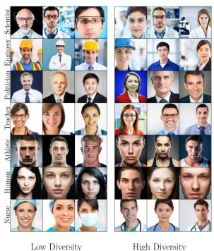
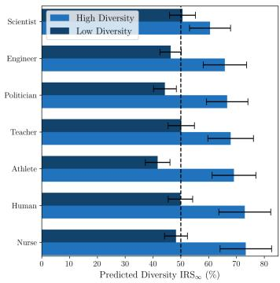
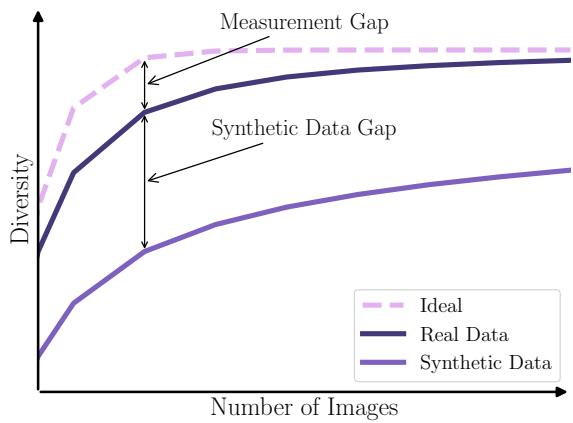
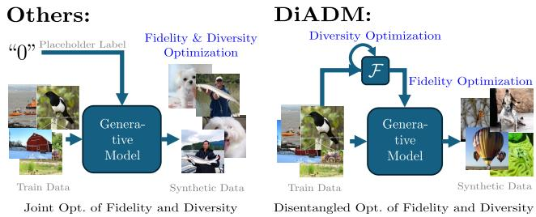
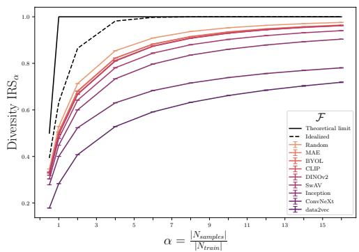
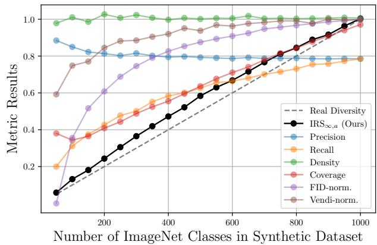

# Image Generation Diversity Issues and How to Tame Them

Mischa Dombrowski1 Weitong Zhang2 Sarah Cechnicka2 Hadrien Reynaud2 Bernhard Kainz1,2 1Friedrich–Alexander–Universitat Erlangen–N ¨ urnberg ¨ 2Imperial College London mischa.dombrowski@fau.de

## Abstract

Generative methods have reached a level of quality that is almost indistinguishable from real data. However, while individual samples may appear unique, generative models often exhibit limitations in covering the full data distribution. Unlike quality issues, diversity problems within generative models are not easily detected by simply observing single images or generated datasets, which means we need a specific measure to assess the diversity of these models. In this paper, we draw attention to the current lack of diversity in generative models and the inability of common metrics to measure this. We achieve this by framing diversity as an image retrieval problem, where we measure how many real images can be retrieved using synthetic data as queries. This yields the Image Retrieval Score (IRS), an interpretable, hyperparameter-free metric that quantifies the diversity ofa generative model’s output. IRS requires only a subset of synthetic samples and provides a statistical measure of confidence. Our experiments indicate that current feature extractors commonly used in generative model assessment are inadequatefor evaluating diversity effectively. Consequently, we perform an extensive search for the best feature extractors to assess diversity. Evaluation reveals that current diffusion models converge to limited subsets of the real distribution, with no current state-of-the-art models superpassing 77% of the diversity of the training data. To address this limitation, we introduce Diversity-Aware Diffusion Models (DiADM), a novel approach that improves diversity of unconditional diffusion models without loss of image quality. We do this by disentangling diversity from image quality by using a diversity aware module that uses pseudo-unconditional features as input. We provide a Python package offering unifiedfeature extraction and metric computation to further facilitate the evaluation of generative models https://github.com/MischaD/beyondfid.

Figure 1. Predicted gender diversity - as one possible example for diversity - after sampling pre-trained text-to-image diffusion models infinitely often. Visually it is apparent that most terms are inherently biased toward one gender. Our proposed IRS score predicts that off-the-shelf models will only ever reach 50 percent diversity, which is equivalent to one gender being perfectly represented while the other gender is missing entirely. Using diversification strategies increases diversity. Details about this can be found in Sec. 4.4.

## 1. Introduction

With advancements in large-scale models and datasets, diffusion models have demonstrated substantial capacity to capture high-dimensional, complex distributions, enabling photo-realistic conditional image generation across diverse guidance types, including image-based [56], classifierbased [11], and text-based guidance [42]. However, diffusion models frequently inherit and amplify data biases due to their reliance on large-scale, naturally biased datasets [4, 53], limiting comprehensive distributional coverage in generated samples. For instance, text-to-image diffusion models often exhibit gender bias for certain occupations. When prompted with “a teacher”, models predominantly generate females, with male representations notably underrepresented, as shown in Fig. 1. The “conditional mode collapse” [1, 31] also affects image- [56] and classconditional [11] diffusion models, where the guidance often produces overly uniform outputs, leading to a loss in diversity in the sampled distribution. Dataset diversity remains an unresolved issue, even for real datasets [58], due to ambiguous definitions and concepts. In contrast, synthetic data can leverage its training data as a reference. To avoid problems like mode drift [2], synthetic data should be at least as diverse as its training set. Key motivations for ensuring diversity include content creation [44], addressing privacy and memorization concerns [6], mitigating the lack of diversity in synthetic datasets [14], data augmentation [15], promoting algorithmic fairness [17], and enhancing downstream performance [8]. To improve diversity in conditional image generation, [28] introduces noise perturbations to enhance diversity, though at the expense of image quality and certainty. [30] balances a trade-off between faithfulness and realism in diverse image synthesis, where diversity comes at the cost of fidelity. These diversity-oriented approaches highlight an inherent compromise: diversity is achieved by sacrificing generation quality, with randomness that lacks interpretability. In parallel, classifier-based diversity guidance [47] and text-based methods [13, 55] have been developed to reduce bias in text-to-image generation. However, these techniques are task-specific and lack generalizability across different types of diffusion models for diversity enhancement. Thus, a fundamental challenge emerges: a universal, interpretable metric to evaluate diversity without bias or conditional dependence, and without compromising generation quality.

To address this, we propose the Image Retrieval Score (IRS), an interpretable metric for quantifying diversity in generative models. IRS assesses how effectively synthetic data retrieves real images as queries, providing a hyperparameter-free, statistically grounded evaluation based on minimal samples. Our approach is motivated by a thought experiment that illustrates how individual samples reveal model diversity. 1 Using IRS as a core, generic metric for diversity, we quantify and reveal two key findings: (1) existing feature extractors used to evaluate generative models lack the capacity to measure diversity effectively, and (2) current diffusion models converge on limited subsets of the real distribution, with no state-of-the-art models surpassing 77% of the diversity in training data.

This further motivates the use of IRS as an unbiased guidance to drive a comprehensive search for optimal feature extractors, enhancing diversity evaluation without compromising generation quality. Our selection is based on [49] who experimented on the impact of feature extractors on existing generative metrics. Building on these insights, we introduce Diversity-Aware Diffusion Models (DiADM), an approach that improves diversity across the full data distribution in unconditional diffusion models without compromising image quality. DiADM accomplishes this by disentangling diversity from image quality through a diversityaware module utilizing pseudo-unconditional features. Our contributions can be summarized as follows:

  
Figure 2. We model finding image pairs (image retrieval) as randomly drawing from urns with replacement (Ideal). We observe that all used feature extraction models exhibit performance issues by collapsing in the feature space for real images resulting in a measurement gap affecting currently used metrics such as FIDInception, FIDDINOv2, Precision and Recall. Comparing the results of synthetic images to real data shows that datasets generated by generative models show even stronger diversity issues which result in a synthetic data distribution gap. Our proposed metric leverages a real reference dataset to remove this measurement gap.

• We demonstrate the limitations of widely-used feature extractors for diversity metrics, highlighting their poor performance on real datasets.

• We propose an intuitive framework for assessing dataset diversity in unconditional diffusion models.

• We identify and quantify the reduction in diversity resulting from current training methodologies.

• We provide a comprehensive analysis showing limited image diversity across a wide range of state-of-the-art diffusion models.

• We introduce a diversity-aware plug-in module, which utilizes pseudo-labels to separate diversity from fidelity, thereby enhancing generative diversity in unconditional diffusion models.

## 2. Related Work

Image Generation: Diffusion models [48] progressively map complex distributions to a standard Gaussian. Conditional diffusion models have demonstrated a strong ability to generate highly realistic images that align closely with specified conditions, excelling in tasks such as image synthesis [54], image restoration [57], and image reconstruction [56]. Additionally, [11] enhances diffusion models with an auxiliary classifier, enabling high-fidelity, class-conditional generation, while text-conditional models generate images based on text prompts [13, 55]. However, diffusion models often struggle to achieve sufficient diversity in task-agnostic generation, especially when trained on large-scale datasets that carry inherent biases [4, 53]. For example, Stable Diffusion, based on latent diffusion models (LDM) [39, 42], produces high-quality images aligned with text prompts, yet frequently reflects bias (e.g., age, gender) for certain terms. These limitations lead to restricted distributional coverage and biased outputs.

Diversity in Generation: Research on diversity in diffusion models is limited, with most existing approaches focused on GAN-based models [9, 25]. Current methods for diversity in diffusion models fall into the primary categories: bias mitigation and diversity enhancement. In bias mitigation, [37] uses a re-weighted loss to address long tailed distributions, promoting balanced class representation. For text-conditional models, [13] attempts to mitigate bias by adding attribute words to prompts, though the added prompts may be ambiguous. [31] extends this to both class- and text-conditional models, using reinforcement learning to match the diversity ratio in reference images but relying on task-specific diversity reward functions. For diversity enhancement, [28] introduces noise perturbations, which increase diversity at the expense of image quality and certainty. Similarly, [30] balances diversity with realism, where gains in diversity tend to compromise fidelity.

Metrics of Diversity: Existing metrics in diffusion models remain limited and are unsuitable for accurate and interpretable diversity assessment. Traditional image quality metrics like FID [20] require extensive sampling (e.g., 50k images) to be reliable, making them computationally intensive and challenging to interpret in practical applications. Precision and recall [26] are most established in literature [12, 36, 41, 46]. They add supplementary insights but are hindered by dependency on dataset size, hyperparameters, and interpretability issues. Credibility and interpretability of metrics are highly underestimated properties. For example, a comparison of three years of advancements in diffusion models, as seen in [12] and [27], shows an order-of-magnitude improvement in FID but a one percentage point reduction in precision. Coverage and density [32] also measure diversity but are dependant on the ratio between train and test set, highly depend on hyperparameters, lack evaluation on real datasets, and density was designed to ignore real outliers which are important in the context of diversity assessment. Vendi Score [16], which operates entirely without a real reference set, sacrifices fidelity and is computationally prohibitive for large datasets.

## 3. Method

Let $\mathbf { x _ { t } }$ be image t from a dataset consisting of $\Nu _ { t r a i n }$ real images residing in image space $\mathcal { X } \in \mathbb { R } ^ { c \times h \times w }$ . Unconditional generative models aim to learn the distribution $p _ { d a t a } ( \mathbf { X } )$ and sample $\mathrm { N } _ { s a m p l e }$ synthetic images from it.

## 3.1. Coupon Collector Problem

The performance of generative models is generally measured by assessing the similarity of the real and the synthetic datasets. It is assumed that the training samples represent discrete observations from a continuous unknown distribution. We suggest viewing all synthetic images as a composition of real images, which holds true as long as there is no training objective that enforces out-of-distribution generation. To assess diversity, we argue that every training sample should be the main component of at least one synthetic sample. To measure this we use the fact that the observed training distribution is discrete. A model that has perfectly memorized every training sample would generate all images with equal probability $\scriptstyle { \frac { \mathbf { \bar { \alpha } } _ { 1 } } { \mathbf { N } _ { t r a i n } } }$ . Consequently, we can model sampling synthetic images with an urn experiment. Each synthetic sample consists mainly of one component which is then compounded with other training images. A real sample is considered learned if it serves as the main component for at least one synthetic image. Evaluating diversity in this context can be framed as the coupon collector problem [5]. Let $P _ { n } ( N _ { t } ~ > ~ 0 )$ denote the probability of generating n samples where at least one corresponds to a training image t, with $N _ { t }$ denoting the number of generated images a training image is associated with. This probability can be computed by considering the compound probability of not sampling this training image which is $\frac { \mathrm { N } _ { t r a i n } - 1 } { \mathrm { N } _ { t r a i n } }$ . Since the same probability applies to each image the expected value of the diversity can be calculated as

$$
\mathbb { E } [ \mathrm { D i v e r s i t y } ] = \left( 1 - \left( \frac { \mathbf { N } _ { t r a i n } - 1 } { \mathbf { N } _ { t r a i n } } \right) ^ { n } \right) .\tag{1}
$$

In this definition, diversity is equal to the percentage of learned real images. This idealized scenario is shown as ideal in Fig. 2. Therefore, assessing diversity comes down to predicting which training image corresponds to which synthetic image.

## 3.2. Image Retrieval

To assess diversity we first need to define how to decide on what constitutes a main component for each synthetic image. For each synthetic image instance $\mathbf { x _ { t } ^ { \prime } }$ we aim to identify the real image $\mathbf { x _ { t } }$ that is closest to it according to a measurement $\mathcal { P } \left( e . g . \right.$ ., Euclidean distance) on the feature of the images extracted by a pretrained feature extractor ${ \mathcal F } .$ . Then, to assess the diversity we have to compute the size of the dataset of learned images:

$$
\mathcal { X } _ { \mathrm { l e a r n e d } } = \left. \mathbf { x _ { t } } \in \mathcal { X } \mid \exists \mathbf { x _ { t } ^ { \prime } } \in \mathcal { X } ^ { \prime } : \mathbf { x _ { t } } = \arg \operatorname* { m i n } _ { \mathbf { x _ { t } } } \mathcal { P } ( \mathbf { x _ { t } } , \mathbf { x _ { t } ^ { \prime } } ) \right. .\tag{2}
$$

We define the cardinality of this set as $\mathrm { N } _ { l e a r n e d }$

We then call the trained image instance $\mathbf { x _ { t } }$ “learned” and compute the diversity of the synthetic dataset as:

$$
\mathrm { I R S } _ { \alpha } = \frac { \mathrm N _ { l e a r n e d } } { \mathrm N _ { t r a i n } } \in [ 0 , 1 ]\tag{3}
$$

We term this quantity as the image retrieval score (IRS). To emphasize that $\mathrm { I R } { \cal S } _ { \underline { { \alpha } } }$ depends on the number of images sampled we add $\begin{array} { r } { \alpha : = \frac { \mathrm { N } _ { s a m p l e } } { \mathrm { N } _ { t r a i n } } } \end{array}$ as a subscript. Note that all other generative metrics also depend on ω but often ignore this dependency. The name image retrieval score derives from the fact that computing IRS also works when comparing two disjoint real datasets. In this context the problem can be thought of as an image retrieval task, where a real image serves as the query image and the goal is to find the most similar image in a comparison dataset. Intuitively, IRS measures the ratio of images in a training dataset that are retrievable by another dataset. If the comparison dataset consists of real images we say that an image is “retrievable”. If the comparison dataset consists of synthetic images we say that an image is “learned”.

The key advantage of IRS is that we can give a reasonably good estimate of dataset diversity with only a minimal number of samples. For example, if the same image appears three times within just ten samples, it is a strong indicator of overfitting. Consequently, we aim to estimate the diversity after $n < < \Nu _ { t r a i n }$ samples. To compute the probability of retrieving exactly $k = \mathcal { X } _ { \mathrm { l e a r n e d } }$ images we use standard combinatorics. This problem can be split into two parts. Firstly, we compute the number of possibilities of splitting n into k different subsets. Instinctively, we are computing the number of combinations in which different synthetic samples derive from the same retrieved (still unassigned) image $\mathbf { x _ { t } }$ according to equation Eq. (2). The computation involves using Stirling’s number of the second kind, Stir $( n , k )$ , which should be multiplied by the total number of possible assignments for each subset, given by $\frac { \mathrm { N } _ { t r a i n } ! } { \left( \mathrm { N } _ { t r a i n } - \mathrm { N } _ { l e a r n e d } \right) ! }$ . This will become more clear with an example. Say, the first subset consists of three different images $x _ { 3 } ^ { \prime } , x _ { 1 0 } ^ { \prime } , x _ { 1 1 } ^ { \prime }$ , all of which are learned from the same real image. Then for the first of k subsets, there are $\Nu _ { t r a i n }$ different choices. For the second subset, we have $\mathrm { N } _ { t r a i n } - 1$ choices and so on. Dividing by all choices leaves us with the probability for generating $k = \Nu _ { l e a r n e d }$ different images:

$$
\operatorname { P } ( k , n , s ) = { \frac { \operatorname { S t i r } ( n , k ) * s ! } { ( s - k ) ! * ( s ) ^ { n } } } ,\tag{4}
$$

with $k = \Nu _ { l e a r n e d }$ and $s ~ = ~ \Nu _ { t r a i n }$ and $n \ = \ \mathrm { N } _ { s a m p l e } .$

For large values, we estimate this by computing the log of Eq. (4) instead. [51] showed that

$$
\operatorname { S t i r } ( n , k ) = { \sqrt { \frac { v - 1 } { v ( 1 - G ) } } } \left( { \frac { v - 1 } { v - G } } \right) ^ { n - k } { \frac { k ^ { n } } { n ^ { k } } } e ^ { k ( 1 - G ) } { \binom { n } { k } } ,\tag{5}
$$

where $\begin{array} { r } { v \ = \ \frac { n } { k } } \end{array}$ and $G \in \mathsf { \Gamma } ( 0 , 1 )$ is the unique solution to $G = v e ^ { G - v }$ . Asymptotically, this estimate is close, reaching a maximum relative error of roughly $\textstyle { \frac { 0 . 0 6 6 } { n } }$ if n and k are small, e.g., (10, 3) [51]. Computing this in log-space for ImageNet roughly takes 3 seconds and using memorization techniques reduces consecutive computations to 1.3 seconds.

## 3.3. Image Retrieval Score

Given Eq. (5) we can now estimate IRS as well as a confidence interval for it. We assume that $\mathrm { N } _ { l e a r n e d }$ and $\mathrm { N } _ { s a m p l e }$ are fixed and we aim to estimate the model diversity. To compute the maximum likelihood estimate for IRS, we optimize over values of $s \in \mathbb { N } \cap [ \mathbf { N } _ { l e a r n e d } , \mathbf { N } _ { t r a i n } ] !$

$$
\mathrm { I R S } _ { \infty } = \frac { 1 } { \mathrm { N } _ { t r a i n } } \arg \operatorname* { m a x } _ { s } \mathrm { P } ( \mathrm { N } _ { l e a r n e d } , \mathrm { N } _ { s a m p l e } , s ) ,\tag{6}
$$

which means we expect $\mathrm { N } _ { \mathrm { l e a r n e d , \infty } } = \mathrm { N } _ { t r a i n } * \mathrm { I R S } _ { \infty }$ different images to be sampled eventually. To compute the lower bound we want to minimize the probability of the real diversity being lower but sampling abnormally many different images early. Mathematically, we estimate this as:

$$
\begin{array} { r } { \mathrm { I R S } _ { \infty , L } = \displaystyle \frac { 1 } { N _ { \mathrm { t r a i n } } } \arg \underset { s \in \mathbb { N } \cap \lbrack N _ { \mathrm { l e a r e d } , \infty } , N _ { \mathrm { t r a i n } } \rbrack } { \operatorname* { m a x } } } \\ { \quad \quad \quad \quad \quad \quad \quad \quad \quad \quad \quad \quad \quad \quad \quad \quad \quad \quad \quad \quad \quad \quad \quad \quad } \\ { \quad \quad \quad \quad \quad \quad \quad \quad \quad \quad \quad \quad \quad \quad \quad \quad \quad \quad \quad \quad \quad \quad \quad \quad \quad \quad \quad \quad \quad \quad \quad \quad \quad \quad } \\ { \quad \quad \quad \quad \quad \quad \quad \quad \quad \quad \quad \quad \quad \quad \quad \quad \quad \quad \quad \quad \quad \quad \quad \quad \quad \quad \quad \quad \quad \quad \quad \quad \quad \quad } \\ { \quad \quad \quad \quad \quad \quad \quad \quad \quad \quad \quad \quad \quad \quad \quad \quad \quad \quad \quad \quad \quad \quad \quad \quad \quad \quad \quad \quad \quad \quad \quad \quad } \end{array}\tag{7}
$$

Accordingly, we can compute the estimate for the upper boundary:

$$
\begin{array} { r l r } {  { \mathrm { I R S } _ { \infty , U } = \frac { 1 } { N _ { \mathrm { t r a i n } } } \arg \operatorname* { m i n } _ { s \in \mathbb { N } \cap [ N _ { \mathrm { l e a r n e d } , N _ { \mathrm { l e a r n e d } , \infty } } ] } } } \\ & { } & { \displaystyle \sum _ { k = 1 } ^ { s } \mathrm { P } ( k , N _ { \mathrm { s a m p l e } } , s ) > \alpha _ { e } } \end{array}\tag{8}
$$

for a desired probability of error $\alpha _ { e } .$ . Intuitively, this value represents the most likely estimate of $N _ { \mathrm { l e a r n e d , \infty } }$ that would produce $N _ { \mathrm { l e a r n e d } }$ unique samples after drawing $N _ { \mathrm { s a m p l e } }$ images. We use the infinity symbol to indicate that this estimate represents the potential diversity if we sampled an infinite number of images. This value also reflects the model’s diversity, representing the percentage of samples that the model can generate at its limit. In Appx. 7 we show the dependency of IRS and the confidence intervals on the number of samples showing that at $\alpha = 0 . 1$ , the estimates start to get very confident around the ground truth value.

  
Figure 3. Overview of our proposed DiADM model. Instead of using placeholder labels for unconditional generation, we propose to leverage precomputed features from  instead. That way we can disentangle fidelity (FID) from diversity (IRS).

## 3.4. Adjusting for Measurement Gap

In Sec. 4 we will show the measurement gap stemming from feature extractors collapsing to smaller representation spaces. This results in the underestimation of diversity for real data which in turn also influences the measured diversity for synthetic data. To eliminate the influence of the measurement gap we adjust for the reduced amount of diversity in the feature space of the extractor by normalizing by the measured diversity of real data according to the feature extractor. Effectively, we compute $\mathrm { I R S } _ { \infty , r e a l }$ on real data using a reference dataset. Then we compute $\mathrm { I R S } _ { \infty , s n t h }$ on synthetic data and report the adjusted $\begin{array} { r } { \mathrm { I R S } _ { \infty , a } ~ = ~ \frac { \mathrm { I R S } _ { \infty , s n t h } } { \mathrm { I R S } _ { \infty , r e a l } } } \end{array}$ instead. Intuitively, $\mathrm { I R S } _ { \infty , a }$ computes the ratio of diversity in the feature space of the synthetic images compared to the real images. Note that this implies that the adjusted score can be above one for low ω values (see Fig. 4). We provide additional theoretical analysis in Appx. 15.1 and more quantitative results in Appx. 15.2, to demonstrate effectiveness in enhancing sensitivity and reliability for measuring diversity in generative models compared to other metrics.

## 3.5. Diversity-Aware Diffusion Models

To address diversity issues, we propose DiADMs. These models leverage the ability to extract meaningful representations using Inception v3 as feature extractor without relying on labels. Rather than employing placeholder labels, as is common in unconditional image generation, we use these pre-computed image features and feed them directly into the model. We term this approach ‘pseudo-unconditional’ because, while the architecture resembles a conditional setup, no explicit labels are needed. In principle, any feature extractor or custom self-supervised model can be used. However, we use the pre-trained ImageNet model, which is widely recognized as an effective feature extractor. The core idea is that, with proper training, the model behaves as if each training instance represents its own class, allowing for direct diversification of training instances during sampling time. Crucially, this approach decouples the diversity of the generated images from their fidelity as shown in Fig. 3. The diffusion model is responsible for producing high-fidelity images, while the diversity module ensures comprehensive coverage of the training distribution’s diversity. We directly utilize features extracted from $\mathcal { F }$ of the training dataset to generate synthetic data, resulting in a synthetic dataset that should maintain diversity if trained properly. The backbone model employed is the XS architecture as proposed by [24], with modifications to adapt the label dimensionality to match the feature dimensionality of . Inception is used as the feature extraction model for all datasets to maintain generalizability.

## 4. Experiments

Image Generation Models: Since diversity is mostly underexplored we aim to compare a series of different state-ofthe-art methods against one another. [12] introduced classifier guidance and other modifications to Diffusion Models that first lead to competitive performance. Unlike all the current methods, they operate in image space. [41] were the first to introduce a model that performs diffusion in latent space. [24] use several improved training and design strategies for the U-Net backbone. [36] propose to use a Transformer architecture. [27] use autoregressive prediction and leverage masking for efficient training. Our experiments focus on both label-conditional and unconditional generative models, with an emphasis on enhancing diversity in unconditional image generation. This focus is motivated by the observation that any form of conditioning ultimately reduces to unconditional generation over the marginal distribution defined by the conditioning. We use pre-trained models directly and if no unconditional implementation was provided we mimic it by setting the class conditioning to the plaseholder value used for unconditional training [22]. For our experiment with DiADM we train models ourselves using a fixed compute budget of 574 A40 GPU hours, which is only one-tenth of the training length in [24].

Metrics: We sample each model 50000 times which is a common choice to get a good estimate for FID [23, 49]. To mitigate the influence of distribution shift to the test datasets, which is the case for example in ImageNet, we report all metrics on the entire training set. To get a reference dataset for the adjusted IRS score, we take away 50000 samples for the reference dataset. If the datasets are smaller than 100000 samples we split the dataset in half and average the IRS results for as many runs as we have synthetic images.

Datasets: For our primary experiments, we use ImageNet-

  
Figure 4. Visualization of the measurement gap across a diverse set of feature extractors by computing the unadjusted diversity of real data. The theoretical limit would be sampling $\Nu _ { t r a i n }$ images where all of them correspond to a different image in the training dataset. The idealized scenario follows Eq. (1).

512 [10]. To explore diversity within a more densely populated image space, we also include FFHQ [23], a bench mark dataset focused on facial images, and Chest-Xray14, which comprises medical chest X-ray images [52]. Additionally, we evaluate CelebV-HQ, a dataset containing face video frames [59], and Dynamic, a medical video dataset [35], treating the data as individual frames as done in [40]. The spatial resolution is fixed to 512 pixels and videos are additionally limited to the first 60 frames.

Encoders: To find the best feature extractor we compute the features using a large set of publicly available feature extractors following the selection of [49]. This includes BYOL [18], CLIP [38], a ConvNeXT based architecture [29], data2vec [3], DINOv2 [34], Inception [21, 45, 50], MAE [19], SwAV [7]. Additionally we add “Random” which uses a randomly initialized Inception-v3 [50] which has been shown to already extract meaningful features [33].

## 4.1. Measurement Gap

First we need to decide for a feature extractor that decides whether two samples correspond to each other. We choose to limit ourself to large, pre-trained and publicly available feature extractors due to their universal applicability and established use. Custom feature extractors are also possible and could be used to increase interpretability even further. In Appx. 13 for example we compute IRS using a re-identification model trained to detect memorized samples unveiling diversity issues. To remain generalizable our goal is to find the most meaningful feature space in terms of image retrieval, that can be generally applied to different datasets. We experiment with a vast set of feature extractors ${ \mathcal { F } } ,$ , measurements , and datasets. Importantly we limit the experiments to evaluation on real data. In Sec. 3.1 we made the assumption, that all samples of the training dataset should be the main component of at least one synthetic image. In the context of only comparing real images, this means that every train image should have at least one test image it is more similar to than all other train images. However, as we show in Fig. 13 and Tab. 6 of the supplementary material, all feature extractors are drastically worse than the expected value. This is a clear indicator for the insufficient representative nature of feature extractors currently used to compute all metrics in the realm of image generation. We refer to this observation as measurement gap. In the supplements we present examples how this measurement gap can be reduced largely if tailord towards certain datasets (e.g., Tab. 5). However, to remain dataset agnostic we propose an adjustment step that uses the measaured IRS on real data as reference value to make up for this measurement gap. Visually this gap results in a lower apparent diversity as shown in Fig. 4. There are two key takeaways from this experiment. First, not even real data is diverse according to commonly used feature extractors which severly reduces the interpretability of currently used diversity metrics. Secondly, it could be worthwhile for special tasks, to train feature extractors specifically to assess diversity as done in Tab. 5.

However, thanks to the adjustment step described in Sec. 3.4, for our metric the absolute value of diversity of real data does not matter. For synthetic data it just matters how diverse the synthetic data is in comparison to the real data. This adjustment leads to direct interpretability of the metric as diversity of images. In Fig. 5 we visualize this interpretability of IRS by balancing and splitting ImageNet into train, reference and test datasets. We use the labels to manually reduce the diversity in the test dataset by successively removing classes. We use 500 images of each class for train and 100 image of each class for reference and test data. We can see a clear linear correlation between the number of classes and our proposed IRS score. Additionally, it is the only diversity metric that achieves 100% diversity when all classes are present in the test dataset. The slight overestimation of IRS in the mid-diversity-range is likely to be caused by label ambiguity. Coverage also correlatates well but severely overestimates diversity when the number of classes is very low. It saturates at 0.97 and completely fails for different hyperparmeter settings as we show in Sec. 15.2. Recall, which is the most commonly used metric to assess synthetic diversity, saturates at about 0.8. From our point of view, this is one of the key reasons why diversity has not yet established itself as the key metric that should be optimized.

While IRS works with any kind of feature extractor, we choose to use the one that has the best visual interpretability when it comes to image retrieval to make the results even more meaningful. Hence, we choose  based on the meaningfulness of the image retrieval. To avoid the necessity of a ground truth image retrieval dataset from the training dataset, we ensemble all feature extractors to compute a consensus on the image retrieval of real images. Details and qualitative examples can be found in Sec. 9. Consensus is reached if five or more models agree on the same image pair. For every image pair where consensus is reached we compute how often a single model agrees with the ensemble and report the results in Tab. 1. As expected the percentage of cases where consensus is reached is higher for natural images. Overall we see that SwAV generally agrees the most with the ensemble. Unless mentioned otherwise, this is the feature extractor we use to compute IRS scores.

<table><tr><td>Dataset</td><td> $\mathrm { N } _ { C o n s e n s u s }$ </td><td>BYOL</td><td>CLIP</td><td>ConvNeXt</td><td>data2vec</td><td>DINOv2</td><td>Inception</td><td>MAE</td><td>Random</td><td>SwAV</td></tr><tr><td>ImageNet</td><td>35142 (3.43%)</td><td>21.72</td><td>89.56</td><td>95.51</td><td>2.65</td><td>92.70</td><td>74.20</td><td>87.17</td><td>12.34</td><td>89.39</td></tr><tr><td>FFHQ</td><td>1862 (3.33%)</td><td>14.18</td><td>93.02</td><td>97.85</td><td>2.42</td><td>92.16</td><td>75.35</td><td>86.79</td><td>21.43</td><td>98.60</td></tr><tr><td>ChestX-ray14</td><td>1389 (1.55%)</td><td>40.32</td><td>45.93</td><td>77.75</td><td>1.94</td><td>83.15</td><td>75.95</td><td>89.70</td><td>33.77</td><td>96.11</td></tr><tr><td>CelebV-HQ</td><td>5329 (19.47%)</td><td>31.83</td><td>89.40</td><td>93.71</td><td>6.68</td><td>91.33</td><td>79.94</td><td>94.86</td><td>51.79</td><td>96.70</td></tr><tr><td>Dynamic</td><td>23 (0.29%)</td><td>47.83</td><td>34.78</td><td>95.65</td><td>8.70</td><td>78.26</td><td>65.22</td><td>95.65</td><td>65.22</td><td>100.00</td></tr></table>

Table 1. Measures the agreement of each P with the ensemble if five or more agree on the same retrieved image(%).

  
Figure 5. Measuring diversity of datasets by removing classes and computing IRS. If only 800 out of 1000 classes are part of the test set say that the diversity is at 80%. By manually removing ImageNet classes we can assess how good commonly used metrics are at measuring diversity compared to ours. To improve visual interpretability we normalize FID and Vendi to be within 0 and 1 with 1 being best. IRS correlates best with the real diversity measured as fraction between number of classes in test and train dataset.

## 4.2. Diversity Issue in State-of-the-art Diffusion models

Recently, [40] published a synthetic ultrasound video dataset based on the EchoNet dataset [35]. It is accompanied with a feature extraction model used to privatize the dataset using re-identification. Analyzing these features, [14] were the first to notice a diversity issue. Using our proposed IRS score we are now able to quantify it. First we try retrieve training samples using real frames from the test dataset. The dataset has 7465 training videos and we can see that 1277 test frames are able to retrieve 1159 distinct train videos. Following Eqs. (6) to (8) this means real data has a diversity of $\mathrm { I R S } _ { \infty , r e a l } = 8 6 \% \left[ 7 5 \% , 1 0 0 \% \right]$ Contrary to that, 1159 different synthetic frames are only able retrieve 692 out of 7465 samples. This is equivalent to an $\mathrm { I R S } _ { \infty , s n t h } = 1 2 . 3 \% [ 1 1 . 9 \% , 1 2 . 9 \% ]$ . Following the adjustement step introduced in Sec. 3.4 we conclude that the model has only learned $\operatorname { I R S } _ { \infty , a } = 1 4 . 3 \%$ of the data. Next, we compare multiple state-of-the-art approaches on conditional and unconditional image generation for ImageNet. We show their diversity accroding to IRS accompanied with other common metrics in Sec. 4.2. We initially expected that models for lower resolution outperform those with higher resolution. But overall this does not seem to be the case. Our experiments on MAR and EDM nicely confirm the feasibility of IRS as metrics as the score increases with the model size. Other metrics like Recall and Coverage confirm this observation but the difference seems marginal. Using IRS we can quantize and interpret the size of the gap between the smallest and largest models. The smallest model only reached a diversity of 46% whereas the largest model reached 75 %. Unlike the relatively small gap of 0.9 points in FID, this indicates a large gap in sampling diversity. Crucially, following our experiments from Fig. 5 our proposed IRS score can be interpreted. Even the best model only properly learned 77% of the data, irrespective of the number of samples generated. Note that this is for conditional image generation, so generation specifically asks the model to generate an equal number of images from all classes. Generally, the conditional models performed better than the uncondtional model which leads us to believe that the conditioning needs to be improved. Due to limited resources, we will continue our experiments by fixing the compute and only use the best performing method in terms of FID and IRS which is EDM. To keep the training time reasonable we restrict our experiments on the XS variant.

## 4.3. Improving Diversity Using Pseudo Labels

Now that we have established EDM as the best method for unconditional image generation and at the same time have shown that this method still lacks diversity, we continue with EDM-2 as baseline for unconditional image generation and compare the trained models with a fixed compute budget. Quantitative results are shown in Tab. 3. The results show that the leveraging pseudo labels improves the sampling diversity compared to EDM-2 in all cases. In three cases the diversity is even better than that of the real reference dataset proofing that the pseudo conditioning works well and we can specifically query the model to generate diverse data. It also improves FID scores compared to the unconditional trainings.

<table><tr><td>Model</td><td>Image Resolution</td><td>FID↓</td><td>Prec. ↑</td><td>Rec. ↑</td><td>Dens. ↑</td><td>Cov. ↑</td><td>Vendi ↑</td><td>IRS∞,a ↑ (Ours)</td></tr><tr><td>Pixel diffusion</td><td></td><td></td><td></td><td></td><td></td><td></td><td></td><td></td></tr><tr><td>ADM-256 [12]</td><td>256</td><td>6.01 (30.30)</td><td>0.82 (0.57)</td><td>0.62 (0.73)</td><td>1.08 (0.41)</td><td>0.91 (0.40)</td><td>70.94 (36.18)</td><td>0.44 (0.20)</td></tr><tr><td>Transformer</td><td></td><td></td><td></td><td></td><td></td><td></td><td></td><td></td></tr><tr><td>DiT-XL/2-256 [36]</td><td>256</td><td>22.15 (8.72)</td><td>0.94 (0.69)</td><td>0.34 (0.76)</td><td>1.58 (0.70)</td><td>0.85 (0.84)</td><td>126.96 (58.15)</td><td>0.23 (0.33)</td></tr><tr><td>DiT-XL/2-512 [36]</td><td>512</td><td>22.99 (9.54)</td><td>0.96 (0.70)</td><td>0.27 (0.73)</td><td>1.90 (0.72)</td><td>0.86 (0.82)</td><td>128.98 (55.17)</td><td>0.21 (0.34)</td></tr><tr><td>MAR-B-256 [27]</td><td>256</td><td>3.79 (10.36)</td><td>0.83 (0.72)</td><td>0.67 (0.71)</td><td>1.18 (0.72)</td><td>0.96 (0.75)</td><td>83.03 (55.78)</td><td>0.45 (0.38)</td></tr><tr><td>MAR-L-256 [27]</td><td>256</td><td>3.30 (10.36)</td><td>0.82 (0.72)</td><td>0.71 (0.71)</td><td>1.10 (0.73)</td><td>0.96 (0.75)</td><td>81.80 (55.95)</td><td>0.56 (0.38)</td></tr><tr><td>MAR-H-256 [27]</td><td>256</td><td>3.11 (10.36)</td><td>0.82 (0.72)</td><td>0.72 (0.71)</td><td>1.07 (0.74)</td><td>0.96 (0.76)</td><td>81.37 (55.82)</td><td>0.64 (0.38)</td></tr><tr><td>Latent diffusion, U-Net</td><td></td><td></td><td></td><td></td><td></td><td></td><td></td><td></td></tr><tr><td>LDM-256 [43]</td><td>256</td><td>26.09 (37.39)</td><td>0.96 (0.61)</td><td>0.21 (0.68)</td><td>1.80 (0.45)</td><td>0.83 (0.28)</td><td>126.94 (30.83)</td><td>0.16 (0.16)</td></tr><tr><td>EDM-2-XS-512 [24]</td><td>512</td><td>3.79 (75.02)</td><td>0.83 (0.42)</td><td>0.65 (0.63)</td><td>1.22 (0.25)</td><td>0.95 (0.13)</td><td>72.41 (26.95)</td><td>0.46 (0.09)</td></tr><tr><td>EDM-2-S-512 [24]</td><td>512</td><td>3.33 (122.48)</td><td>0.85 (0.33)</td><td>0.67 (0.42)</td><td>1.26 (0.16)</td><td>0.97 (0.07)</td><td>80.25 (21.34)</td><td>0.59 (0.04)</td></tr><tr><td>EDM-2-M-512 [24]</td><td>512</td><td>3.30 (107.45)</td><td>0.85 (0.36)</td><td>0.69 (0.61)</td><td>1.24 (0.19)</td><td>0.97 (0.09)</td><td>82.99 (22.19)</td><td>0.65 (0.06)</td></tr><tr><td>EDM-2-L-512 [24]</td><td>512</td><td>2.90 (118.87)</td><td>0.84 (0.23)</td><td>0.70 (0.51)</td><td>1.22 (0.11)</td><td>0.97 (0.06)</td><td>82.10 (22.89)</td><td>0.71 (0.03)</td></tr><tr><td>EDM-2-XL-512 [24]</td><td>512</td><td>2.92 (141.74)</td><td>0.84 (0.25)</td><td>0.71 (0.45)</td><td>1.21 (0.12)</td><td>0.97 (0.06)</td><td>83.23 (20.04)</td><td>0.77 (0.03)</td></tr><tr><td>EDM-2-XXL-512 [24]</td><td>512</td><td>2.87 (124.29)</td><td>0.84 (0.33)</td><td>0.71 (0.60)</td><td>1.22 (0.17)</td><td>0.97 (0.07)</td><td>82.45 (21.52)</td><td>0.75 (0.05)</td></tr></table>

Table 2. Image generation of ImageNet across different generative models. Numbers in brackets indicate results when sampling the mode without conditioning. Inception is used as feature extractor for all metrics except for IRS where we use SwAV. Precision, recall, density, coverage and Vendi score had to be computed on a subset of the training data of 50000 and 10000 for Vendi score. Pretrained conditional models were used as unconditional models by setting conditional guidance to 0.

<table><tr><td></td><td colspan="2">FID↓</td><td colspan="2">IRS∞,a ↑</td></tr><tr><td></td><td>EDM [24]</td><td>DiADM (Ours)</td><td>EDM [24]</td><td>DiADM (Ours)</td></tr><tr><td>ImageNet-512</td><td>51.59</td><td>22.28</td><td>0.09</td><td>0.15</td></tr><tr><td>FFHQ</td><td>40.92</td><td>6.24</td><td>0.23</td><td>1.51</td></tr><tr><td>ChestX-ray14</td><td>24.29</td><td>6.76</td><td>0.19</td><td>1.08</td></tr><tr><td>CelebV-HQ</td><td>68.41</td><td>13.64</td><td>0.18</td><td>0.69</td></tr><tr><td>Dynamic</td><td>13.82</td><td>5.56</td><td>0.60</td><td>1.04</td></tr></table>

Table 3. FID and IRS results with and without our proposed diversity awareness module

## 4.4. Text-to-image example

Extending IRS to text-conditional image generation is straightforward. The evaluation of diversity depends on the chosen perspective, which is defined by the reference datasets. By changing the reference dataset, we can address various diversity-related issues, such as fairness. One notable example is the gender bias observed in text-to-image models. For our experiments, we use Deepfloyd (IF-I-XLv1.0)2. To assess gender diversity, we create a reference dataset with a balanced gender distribution for specific job roles by prompting the model to generate 100 images each of males and females. Half of these images are reserved as a balanced test dataset. We then prompt the model without specifying gender. The results are presented in Sec. 4.2. All groups, including the general term human, show gender bias, with the latter generating only female images. IRS estimates that in all cases, the generated diversity reaches only about 50% of that of the balanced reference dataset.

## 4.5. Limitations

The stochasticity involved for a low number of samples means that minor IRS differences are not meaningful for a low number of samples. However, this is also reflected in the high values of uncertainty. Additionally, we believe that finding a better feature extractor that maximizes measured diversity (unadjusted IRS) on real datasets should be the focus. Experiments on improving diversity are limited to using real features for generation and restrictive computational budget. Furthermore, increasing the conditioning requires similar experiments analyzing memorization issues as text-conditioning [6].

## 5. Conclusion and Outlook

In this paper, we reveal that all current methods for evaluating diversity and the feature extractors they are based on are inadequate. Using our proposed IRS metric, we demonstrate that these shortcomings result in all state-of-the-art image generation methods facing challenges with diversity. To address this issue for unconditional diffusion models, we propose DiADMs, which enhance the performance of current methods by separating diversity from fidelity. In future work, we aim to extend our efforts to improve diversity in conditional image generation as well.

Acknowledgements: This work was supported by the High-Tech-Agenda Bavaria. HPC resources were provided by the Erlangen National High Performance Computing Center (NHR@FAU) of the Friedrich-Alexander-Universitat Erlangen-N¨ urnberg (FAU) under the NHR¨ project b143dc and b180dc. NHR funding is provided by federal and Bavarian state authorities. NHR@FAU hardware is partially funded by the German Research Foundation (DFG) – 440719683. Support was also received by the ERC - projects MIA-NORMAL 101083647 as well as DFG 513220538, 512819079 and DFG large scale infrastructure funding Art 91b GG. This work was supported by the UKRI Centre for Doctoral Training in Artificial Intelligence for Healthcare (EP/S023283/1) and Ultromics Ltd.

## References

[1] Sumukh K Aithal, Pratyush Maini, Zachary C Lipton, and J Zico Kolter. Understanding hallucinations in diffusion models through mode interpolation. arXiv preprint arXiv:2406.09358, 2024. 1

[2] Sina Alemohammad, Josue Casco-Rodriguez, Lorenzo Luzi, Ahmed Imtiaz Humayun, Hossein Babaei, Daniel LeJeune, Ali Siahkoohi, and Richard G. Baraniuk. Self-Consuming Generative Models Go MAD, 2023. arXiv:2307.01850 [cs]. 2

[3] Alexei Baevski, Wei-Ning Hsu, Qiantong Xu, Arun Babu, Jiatao Gu, and Michael Auli. data2vec: A General Framework for Self-supervised Learning in Speech, Vision and Language. In Proceedings ofthe 39th International Conference on Machine Learning, pages 1298–1312. PMLR, 2022. ISSN: 2640-3498. 6

[4] Hritik Bansal, Da Yin, Masoud Monajatipoor, and Kai-Wei Chang. How well can text-to-image generative models understand ethical natural language interventions? arXiv preprint arXiv:2210.15230, 2022. 1, 3

[5] Leonard E. Baum and Patrick Billingsley. Asymptotic Distributions for the Coupon Collector’s Problem. The Annals of Mathematical Statistics, 36(6):1835–1839, 1965. Publisher: Institute of Mathematical Statistics. 3

[6] Nicholas Carlini, Jamie Hayes, Milad Nasr, Matthew Jagielski, Vikash Sehwag, Florian Tramer, Borja Balle, Daphne \` Ippolito, and Eric Wallace. Extracting Training Data from Diffusion Models, 2023. arXiv:2301.13188 [cs]. 2, 8

[7] Mathilde Caron, Ishan Misra, Julien Mairal, Priya Goyal, Piotr Bojanowski, and Armand Joulin. Unsupervised Learning of Visual Features by Contrasting Cluster Assignments. In Advances in Neural Information Processing Systems, pages 9912–9924. Curran Associates, Inc., 2020. 6

[8] Tingxiu Chen, Yilei Shi, Zixuan Zheng, Bingcong Yan, Jingliang Hu, Xiao Xiang Zhu, and Lichao Mou. Ultrasound Image-to-Video Synthesis via Latent Dynamic Diffusion Models. In Medical Image Computing and Computer Assisted Intervention – MICCAI 2024, pages 764–774. Springer Nature Switzerland, Cham, 2024. Series Title: Lecture Notes in Computer Science. 2

[9] Ching-Yao Chuang, Varun Jampani, Yuanzhen Li, Antonio Torralba, and Stefanie Jegelka. Debiasing visionlanguage models via biased prompts. arXiv preprint arXiv:2302.00070, 2023. 3

[10] Jia Deng, Wei Dong, Richard Socher, Li-Jia Li, Kai Li, and Li Fei-Fei. ImageNet: A Large-Scale Hierarchical Image Database. 2015. 6

[11] Prafulla Dhariwal and Alexander Nichol. Diffusion models beat gans on image synthesis. Advances in neural informa tion processing systems, 34:8780–8794, 2021. 1, 2

[12] Prafulla Dhariwal and Alex Nichol. Diffusion Models Beat GANs on Image Synthesis, 2021. arXiv:2105.05233 [cs, stat]. 3, 5, 8

[13] Ming Ding, Zhuoyi Yang, Wenyi Hong, Wendi Zheng, Chang Zhou, Da Yin, Junyang Lin, Xu Zou, Zhou Shao, Hongxia Yang, et al. Cogview: Mastering text-to-image generation via transformers. Advances in neural information processing systems, 34:19822–19835, 2021. 2, 3

[14] Mischa Dombrowski, Hadrien Reynaud, and Bernhard Kainz. Uncovering Hidden Subspaces in Video Diffusion Models Using Re-Identification, 2024. arXiv:2411.04956. 2, 7, 5, 6

[15] Chun-Mei Feng, Kai Yu, Yong Liu, Salman Khan, and Wangmeng Zuo. Diverse Data Augmentation with Diffusions for Effective Test-time Prompt Tuning. In 2023 IEEE/CVF International Conference on Computer Vision (ICCV), pages 2704–2714, Paris, France, 2023. IEEE. 2

[16] Dan Friedman and Adji Bousso Dieng. The Vendi Score: A Diversity Evaluation Metric for Machine Learning, 2023. arXiv:2210.02410. 3

[17] Felix Friedrich, Manuel Brack, Lukas Struppek, Dominik Hintersdorf, Patrick Schramowski, Sasha Luccioni, and Kristian Kersting. Fair Diffusion: Instructing Text-to-Image Generation Models on Fairness, 2023. arXiv:2302.10893. 2

[18] Jean-Bastien Grill, Florian Strub, Florent Altche, Corentin´ Tallec, Pierre H. Richemond, Elena Buchatskaya, Carl Doersch, Bernardo Avila Pires, Zhaohan Daniel Guo, Mohammad Gheshlaghi Azar, Bilal Piot, Koray Kavukcuoglu, Remi Munos, and Michal Valko. Bootstrap your own la- ´ tent: A new approach to self-supervised Learning, 2020. arXiv:2006.07733 [cs, stat]. 6

[19] Kaiming He, Xinlei Chen, Saining Xie, Yanghao Li, Pi otr Dollar, and Ross Girshick. Masked Autoencoders Are Scalable Vision Learners. In 2022 IEEE/CVF Conference on Computer Vision and Pattern Recognition (CVPR), pages 15979–15988, New Orleans, LA, USA, 2022. IEEE. 6

[20] Martin Heusel, Hubert Ramsauer, Thomas Unterthiner, Bernhard Nessler, and Sepp Hochreiter. Gans trained by a two time-scale update rule converge to a local nash equilibrium. Advances in neural information processing systems, 30, 2017. 3, 6

[21] Martin Heusel, Hubert Ramsauer, Thomas Unterthiner, Bernhard Nessler, and Sepp Hochreiter. GANs Trained by a Two Time-Scale Update Rule Converge to a Local Nash Equilibrium. In Advances in Neural Information Processing Systems. Curran Associates, Inc., 2017. 6

[22] Jonathan Ho and Tim Salimans. Classifier-Free Diffusion Guidance. 2022. 5

[23] Tero Karras, Samuli Laine, and Timo Aila. A Style-Based Generator Architecture for Generative Adversarial Networks. 2019. 5, 6

[24] Tero Karras, Miika Aittala, Jaakko Lehtinen, Janne Hellsten, Timo Aila, and Samuli Laine. Analyzing and Improving the Training Dynamics of Diffusion Models, 2024. arXiv:2312.02696 [cs, stat]. 5, 8

[25] Nupur Kumari, Bingliang Zhang, Richard Zhang, Eli Shechtman, and Jun-Yan Zhu. Multi-concept customization of text-to-image diffusion. In Proceedings of the IEEE/CVF Conference on Computer Vision and Pattern Recognition, pages 1931–1941, 2023. 3

[26] Tuomas Kynka¨anniemi, Tero Karras, Samuli Laine, Jaakko ¨ Lehtinen, and Timo Aila. Improved Precision and Recall Metric for Assessing Generative Models. 2019. 3

[27] Tianhong Li, Yonglong Tian, He Li, Mingyang Deng, and Kaiming He. Autoregressive Image Generation without Vector Quantization, 2024. arXiv:2406.11838 [cs]. 3, 5, 8

[28] Jiawei Liu, Qiang Wang, Huijie Fan, Yinong Wang, Yandong Tang, and Liangqiong Qu. Residual denoising diffusion models. In Proceedings of the IEEE/CVF Conference on Computer Vision and Pattern Recognition, pages 2773– 2783, 2024. 2, 3

[29] Zhuang Liu, Hanzi Mao, Chao-Yuan Wu, Christoph Feichtenhofer, Trevor Darrell, and Saining Xie. A ConvNet for the 2020s, 2022. arXiv:2201.03545. 6

[30] Chenlin Meng, Yutong He, Yang Song, Jiaming Song, Jiajun Wu, Jun-Yan Zhu, and Stefano Ermon. Sdedit: Guided image synthesis and editing with stochastic differential equations. In International Conference on Learning Representations, 2022. 2, 3

[31] Zichen Miao, Jiang Wang, Ze Wang, Zhengyuan Yang, Lijuan Wang, Qiang Qiu, and Zicheng Liu. Training diffusion models towards diverse image generation with reinforcement learning. In Proceedings of the IEEE/CVF Conference on Computer Vision and Pattern Recognition, pages 10844– 10853, 2024. 1, 3

[32] Muhammad Ferjad Naeem, Seong Joon Oh, Youngjung Uh, Yunjey Choi, and Jaejun Yoo. Reliable Fidelity and Diversity Metrics for Generative Models. 2020. 3

[33] Jamie A. OaReilly and Fawad Asadi. Pre-trained vs. Random Weights for Calculating Frechet Inception Distance in´ Medical Imaging. In 2021 13th Biomedical Engineering International Conference (BMEiCON), pages 1–4, Ayutthaya, Thailand, 2021. IEEE. 6, 5

[34] Maxime Oquab, Timothee Darcet, Th´ eo Moutakanni, Huy´ Vo, Marc Szafraniec, Vasil Khalidov, Pierre Fernandez, Daniel Haziza, Francisco Massa, Alaaeldin El-Nouby, Mahmoud Assran, Nicolas Ballas, Wojciech Galuba, Russell Howes, Po-Yao Huang, Shang-Wen Li, Ishan Misra, Michael Rabbat, Vasu Sharma, Gabriel Synnaeve, Hu Xu, Herve Je-´ gou, Julien Mairal, Patrick Labatut, Armand Joulin, and Piotr Bojanowski. DINOv2: Learning Robust Visual Features without Supervision, 2024. arXiv:2304.07193 [cs]. 6, 2

[35] David Ouyang, Bryan He, Amirata Ghorbani, Neal Yuan, Joseph Ebinger, Curtis P. Langlotz, Paul A. Heidenreich, Robert A. Harrington, David H. Liang, Euan A. Ashley, and

James Y. Zou. Video-based AI for beat-to-beat assessment of cardiac function. Nature, 580(7802):252–256, 2020. Publisher: Springer US. 6, 7, 5

[36] William Peebles and Saining Xie. Scalable Diffusion Models with Transformers. In 2023 IEEE/CVF International Confer ence on Computer Vision (ICCV), pages 4172–4182, Paris, France, 2023. IEEE. 3, 5, 8

[37] Yiming Qin, Huangjie Zheng, Jiangchao Yao, Mingyuan Zhou, and Ya Zhang. Class-balancing diffusion models. In Proceedings of the IEEE/CVF Conference on Computer Vi sion and Pattern Recognition, pages 18434–18443, 2023. 3

[38] Alec Radford, Jong Wook Kim, Chris Hallacy, Aditya Ramesh, Gabriel Goh, Sandhini Agarwal, Girish Sastry, Amanda Askell, Pamela Mishkin, Jack Clark, Gretchen Krueger, and Ilya Sutskever. Learning Transferable Visual Models From Natural Language Supervision, 2021. arXiv:2103.00020. 6

[39] Alec Radford, Jong Wook Kim, Chris Hallacy, Aditya Ramesh, Gabriel Goh, Sandhini Agarwal, Girish Sastry, Amanda Askell, Pamela Mishkin, Jack Clark, et al. Learning transferable visual models from natural language supervision. In International conference on machine learning, pages 8748–8763. PMLR, 2021. 3

[40] Hadrien Reynaud, Qingjie Meng, Mischa Dombrowski, Arijit Ghosh, Thomas Day, Alberto Gomez, Paul Leeson, and Bernhard Kainz. EchoNet-Synthetic: Privacy-preserving Video Generation for Safe Medical Data Sharing, 2024. arXiv:2406.00808 [cs]. 6, 7, 5

[41] Robin Rombach, Andreas Blattmann, Dominik Lorenz, Patrick Esser, and Bjorn Ommer. High-Resolution Image¨ Synthesis with Latent Diffusion Models. 2021. 3, 5

[42] Robin Rombach, Andreas Blattmann, Dominik Lorenz, Patrick Esser, and Bjorn Ommer. High-resolution image¨ synthesis with latent diffusion models. In Proceedings of the IEEE/CVF conference on computer vision and pattern recognition, pages 10684–10695, 2022. 1, 3

[43] Robin Rombach, Andreas Blattmann, Dominik Lorenz, Patrick Esser, and Bjorn Ommer. High-Resolution¨ Image Synthesis with Latent Diffusion Models, 2022. arXiv:2112.10752 [cs]. 8

[44] Nataniel Ruiz, Yuanzhen Li, Varun Jampani, Yael Pritch, Michael Rubinstein, and Kfir Aberman. DreamBooth: Fine Tuning Text-to-Image Diffusion Models for Subject-Driven Generation. 2022. 2

[45] Tim Salimans, Ian Goodfellow, Wojciech Zaremba, Vicki Cheung, Alec Radford, Xi Chen, and Xi Chen. Improved Techniques for Training GANs. 2016. 6

[46] Axel Sauer, Katja Schwarz, and Andreas Geiger. StyleGAN XL: Scaling StyleGAN to Large Diverse Datasets, 2022. arXiv:2202.00273 [cs]. 3

[47] Vikash Sehwag, Caner Hazirbas, Albert Gordo, Firat Ozgenel, and Cristian Canton. Generating high fidelity data from low-density regions using diffusion models. In Proceedings of the IEEE/CVF Conference on Computer Vision and Pattern Recognition, pages 11492–11501, 2022. 2

[48] Jiaming Song, Chenlin Meng, and Stefano Ermon. Denoising diffusion implicit models. arXiv preprint arXiv:2010.02502, 2020. 2

[49] George Stein, Jesse C. Cresswell, Rasa Hosseinzadeh, Yi Sui, Brendan Leigh Ross, Valentin Villecroze, Zhaoyan Liu, Anthony L. Caterini, J. Eric T. Taylor, and Gabriel Loaiza-Ganem. Exposing flaws of generative model evaluation metrics and their unfair treatment of diffusion models, 2023. arXiv:2306.04675 [cs, stat]. 2, 5, 6

[50] Christian Szegedy, Vincent Vanhoucke, Sergey Ioffe, Jon Shlens, and Zbigniew Wojna. Rethinking the Inception Architecture for Computer Vision. In 2016 IEEE Conference on Computer Vision and Pattern Recognition (CVPR), pages 2818–2826, Las Vegas, NV, USA, 2016. IEEE. 6

[51] N. M. Temme. Asymptotic Estimates of Stirling Numbers. Studies in Applied Mathematics, 89(3):233–243, 1993. 4

[52] Xiaosong Wang, Yifan Peng, Le Lu, Zhiyong Lu, Mohammadhadi Bagheri, and Ronald M Summers. ChestX-ray8: Hospital-Scale Chest X-Ray Database and Benchmarks on Weakly-Supervised Classification and Localization of Common Thorax Diseases. 2017. 6

[53] Ling Yang, Zhilong Zhang, Yang Song, Shenda Hong, Runsheng Xu, Yue Zhao, Wentao Zhang, Bin Cui, and Ming-Hsuan Yang. Diffusion models: A comprehensive survey of methods and applications. ACM Computing Surveys, 56(4): 1–39, 2023. 1, 3

[54] Ling Yang, Jingwei Liu, Shenda Hong, Zhilong Zhang, Zhilin Huang, Zheming Cai, Wentao Zhang, and Bin Cui. Improving diffusion-based image synthesis with context prediction. Advances in Neural Information Processing Systems, 36, 2024. 2

[55] Cheng Zhang, Xuanbai Chen, Siqi Chai, Chen Henry Wu, Dmitry Lagun, Thabo Beeler, and Fernando De la Torre. Itigen: Inclusive text-to-image generation. In Proceedings of the IEEE/CVF International Conference on Computer Vision, pages 3969–3980, 2023. 2, 3

[56] Weitong Zhang, Chengqi Zang, Liu Li, Sarah Cechnicka, Cheng Ouyang, and Bernhard Kainz. Stability and generalizability in sde diffusion models with measure-preserving dynamics. In NeurIPS, 2024. 1, 2

[57] Yi Zhang, Xiaoyu Shi, Dasong Li, Xiaogang Wang, Jian Wang, and Hongsheng Li. A unified conditional framework for diffusion-based image restoration. Advances in Neural Information Processing Systems, 36, 2024. 2

[58] Dora Zhao, Jerone T. A. Andrews, Orestis Papakyriakopoulos, and Alice Xiang. Position: Measure Dataset Diversity, Don’t Just Claim It, 2024. arXiv:2407.08188. 2

[59] Hao Zhu, Wayne Wu, Wentao Zhu, Liming Jiang, Siwei Tang, Li Zhang, Ziwei Liu, and Chen Change Loy. CelebV-HQ: A Large-Scale Video Facial Attributes Dataset, 2022. arXiv:2207.12393 [cs]. 6