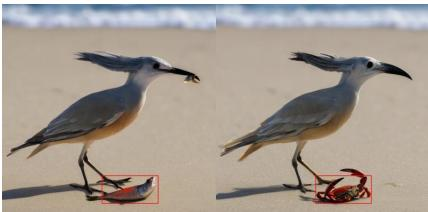
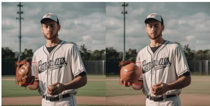
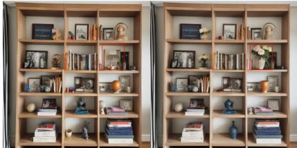
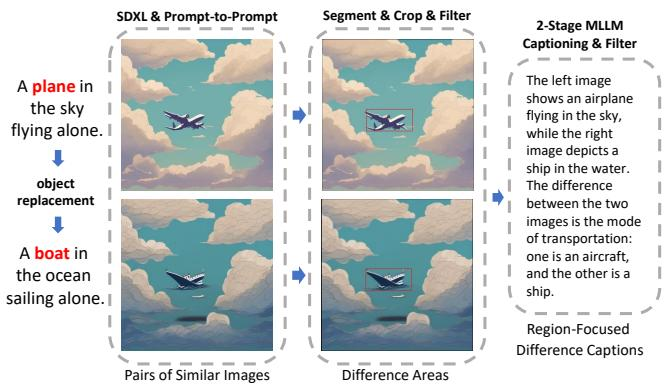
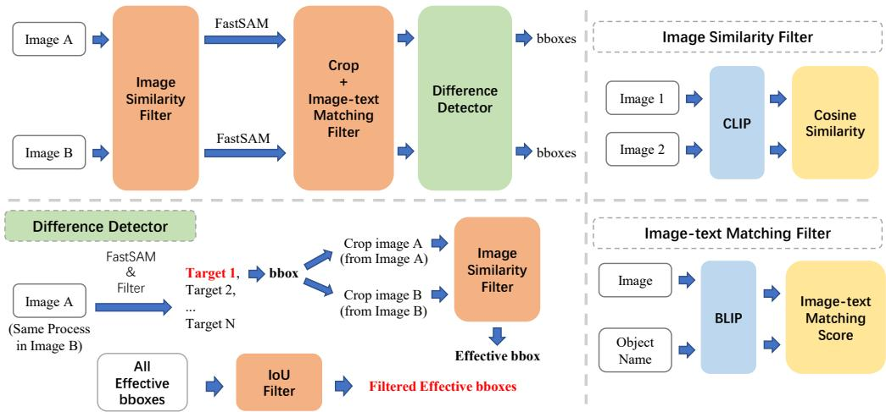
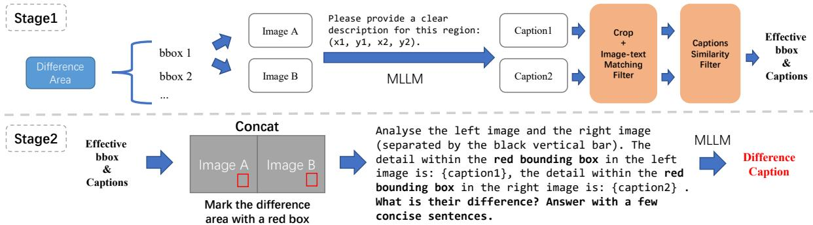
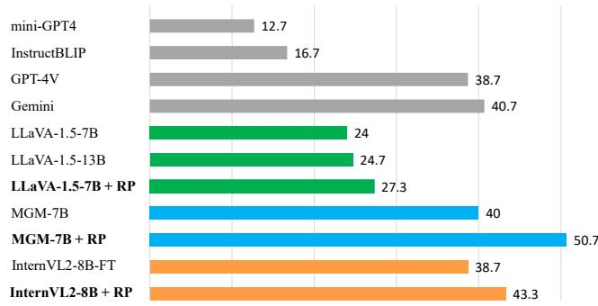
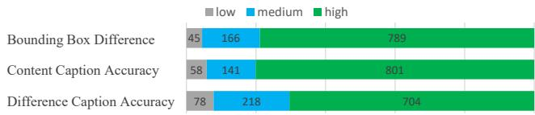

# Img-Diff: Contrastive Data Synthesis for Multimodal Large Language Models

Qirui Jiao1, Daoyuan Chen2, Yilun Huang2, Bolin Ding2, Yaliang Li2, Ying Shen1,3

1Sun Yat-Sen University, 2Alibaba Group, 3FSIETP

jiaoqr3@mail2.sysu.edu.cn, sheny76@mail.sysu.edu.cn

{daoyuanchen.cdy,lielin.hyl,bolin.ding,yaliang.li}@alibaba-inc.com

  
... the left image highlights a fish on the ground, while the right image highlights a red crab on the sand.

  
... In the left image, the player is holding a baseball glove, while in the right image, the player is holding a basketball.

  
The left image shows a framed picture on a shelf, while the right image shows a white vase with pink flowers. ...  
Figure 1. Three “object replacement” examples within IMG-DIFF, highlighting fine-grined difference in both vision and language.

## Abstract

High-performance Multimodal Large Language Models (MLLMs) rely heavily on data quality. This study introduces a novel data synthesis method, leveraging insights from contrastive learning and image difference captioning to enhance fine-grained image recognition in MLLMs. By analyzing object differences in detailed regions between similar images, we challenge the model to identify both matching and distinct components. Specifically, our method initially create pairs of similar images that highlight object variations. After that, we introduce a Difference Area Generator for object differences identifying, followed by a Difference Captions Generator for differences describing. The outcome is a high-quality dataset of “object replacement” samples, named Img-Diff, which can be expanded as needed due to its automation. We use the generated dataset to finetune state-of-the-art (SOTA) MLLMs such as InternVL2, yielding comprehensive improvements across numerous image difference and Visual Question Answering tasks. For instance, the trained models notably surpass the SOTA models GPT-4V and Gemini on the MMVP benchmark. Additionally, we conduct thorough evaluations to confirm the dataset’s diversity, quality, and robustness, presenting several insights on the synthesis of such a contrastive dataset.

We release our codes and dataset to encourage further research on multimodal data synthesis and MLLMs’ fundamental capabilities for image understanding.

## 1. Introduction

The emergence of large language models (LLMs) has revolutionized natural language processing [48, 64], also paved the way for the development of Multimodal Large Language Models (MLLMs) that seamlessly integrate linguistic and visual understanding. Improving the performance of MLLMs hinges on two primary avenues: evolving model architectures and enhancing dataset quality [53]. The majority of state-of-the-art (SOTA) MLLMs [3, 37, 41–43] employ a two-phase training strategy, commencing with a pre-training phase involving extensive image-text pairs for modality alignment, followed by a fine-tuning phase aimed at optimizing visual question answering (VQA) capabilities with specific instruction tuning datasets.

The quality of visual instruction tuning datasets plays a crucial role in MLLMs’ overall performance in VQA tasks and diverse downstream applications. With the evolution of visual instruction tuning datasets, several recent studies have explored the integration of object detection and Optical Character Recognition (OCR) datasets, such as RefCOCO [28], Visual Genome [31], OCR-VQA [49], and TextVQA [60], effectively enhancing MLLMs’ proficiency in tasks requiring detailed image perception.

In this paper, we focus on a new direction for enhancing MLLM datasets, driven by the potential of object variations in image pairs to refine models’ image recognition capabilities, as demonstrated by advancements in contrastive learning and image difference captioning [5, 26, 51, 80]. Specifically, we introduce a general-purpose yet challenging dataset named IMG-DIFF, which sets itself apart from existing visual instruction tuning datasets by generating pairs of highly similar images featuring subtle object alterations. Rather than compelling MLLMs to focus solely on a single image, our dataset challenges them to analyze paired images and articulate the differences within designated regions, meanwhile taking the high-quality textual descriptions of the difference as learning signals. By doing so, we aim to empower MLLMs with enhanced capabilities of finegrained image recognition.

To evaluate the effectiveness of our data synthesis method, we integrate the generated dataset into the original visual instruction tuning datasets of LLaVA-1.5 [41], MGM [37], and InternVL2 [12], and conduct fine-tuning. Subsequently, we evaluate their performance on image difference benchmarks, including MMVP [63], Spot-the-Diff [26], and Image-Edit-Request [62], as well as widely recognized MLLM benchmarks. Our evaluation results reveal that after fine-tuning with our IMG-DIFF dataset, the MLLMs achieve notable enhancements in image difference benchmarks, aligning their performance with state-of-theart (SOTA) models. For instance, they notably surpass the SOTA models GPT-4V [1] and Gemini [16] on the MMVP benchmark, achieving an improvement of up to 12. Moreover, the models exhibit comprehensive improvements across eight well-recognized MLLM benchmarks, achieving an average score improvement of up to 3.06%, underscoring the useful role our dataset plays in bolstering MLLMs’ competencies in both image difference recognition and fine-grained image analysis.

We further evaluate the diversity and quality of our dataset, ensuring it encompasses a broad array of object categories while showcasing rich variability. Through meticulous manual labeling, we affirm the high quality of our dataset. Furthermore, we conduct ablation studies to examine the effects of various filtering intensities. We also investigate an alternative methodology for constructing image difference data focusing on “object removal”, assessing its effectiveness and presenting fruitful insights on the construction of contrastive data.

Our contributions are summarized as follows:

• We present a novel data synthesis method and an effectproven IMG-DIFF dataset, comprising pairs of highly similar images, with a focus on processes such as segmentation, filtering, and detailed captioning of image differences.

• We conduct visual instruction tuning on LLaVA-1.5-7B, MGM-7B, and InternVL2-8B using our dataset, and rigorously assess the fine-tuned models’ performance on many widely-used MLLM benchmarks and image difference benchmarks. Our dataset brings substantial performance improvements to the fine-tuned MLLMs.

• We provide a comprehensive evaluation of the diversity and quality of our dataset, confirming its richness and high standard. Through ablation studies, we identify good empirical filtering thresholds for such contrastive dataset.

• We open-source our dataset and codes at https://github. com/modelscope/data-juicer/tree/ImgDiffto facilitate ongoing research, encouraging innovative endeavors in MLLM datasets and image difference methods.

## 2. Background and Related Works

## 2.1. Multimodal Large Language Models

Multimodal Large Language Models (MLLMs) have exhibited remarkable advancements since their introduction [1, 16, 37, 43, 44]. Research highlights two key factors that primarily influence the effectiveness of MLLMs: model architecture and dataset quality [53].

With respect to model architecture, notable approaches [2, 3, 25, 32, 35] leverage learnable queries to extract essential information from CLIP [15, 54] image features. Alternatively, LLaVA [41–43] and MGM [37] utilize projectionbased interfaces to facilitate interactions between text and image modalities. Furthermore, LLaMA-Adapter [81] and LaVIN [47] implement parameter-efficient tuning mechanisms to transfer image-related information to the LLM.

From the perspective of datasets, there are two prevalent strategies: enhancing the quality of pre-training data and improving instruction tuning data. The former aims for better semantic alignment between images and text by introducing abundant image-text pairs, enhancing MLLMs’ fundamental capabilities such as image captioning. As for the latter, research has increasingly concentrated on refining instruction tuning datasets, boosting performance across various question-answering tasks. Works like LLaVA [41–43], SPHINX [40], MGM [37], and InternVL2 [12] leverage high-quality fine-tuning datasets with extensive task diversity, allowing models to excel in tasks related to image perception, reasoning, and optical character recognition. Additionally, methods such as Shikra [10], ASM [72], and PINK [75] utilize substantial amounts of object detection data to enhance the models’ localization capabilities.

In contrast to previous works, our research introduces a fully automated data synthesis method and generates a dataset that emphasizes image differences, showing empirical effectiveness and great potential to augment MLLMs’ VQA proficiency, object localization capabilities, and discernment of image distinctions.

## 2.2. Image Difference Datasets

Datasets focused on image differences typically consist of pairs of similar images and textual descriptions that describe the variations. For instance, the Spot-the-Diff dataset [26] contains pairs of street scenes captured at different times by the same surveillance cameras. The CLEVR-Change dataset [51] delineates scene variations of geometric objects against a clean backdrop. The CUB-Bird dataset [69] focuses on the nuanced differences among various bird species found in natural habitats. The Image-Edit-Request [62] dataset features edited images, accompanied by descriptions of modifications made.

Leveraging advancements in image editing technologies, some studies have employed generative models and editing techniques to create datasets centered on image differences. A prime example is InstructPix2Pix [6], which utilizes the image editing technique, named Prompt-to-Prompt [20], to direct Stable-Diffusion-1.5 [56] in generating pairs of similar images, while employing GPT-3 [48] to craft the edited text as reference captions for image differences.

Our approach, referring to InstructPix2Pix, employs the Prompt-to-Prompt technique alongside an advanced generative model Stable-Diffusion-XL [52], which produces more realistic images, to generate pairs of similar images. Unlike InstructPix2Pix, we incorporate multiple filtering stages to ensure data quality, with a particular emphasis on producing difference captions that focus on specific regions rather than the entire image, which ensures greater accuracy.

## 2.3. Models for Image Difference Captioning

Image Difference Captioning (IDC) represents a specialized domain within image captioning characterized by its focus on subtle variations between images. As for the pioneering work in IDC, Spot-the-Diff [26] presents potential change clusters and employs an LSTM [21] decoder to generate difference captions. DUDA [51] explores image differences at the semantic level, using a ResNet [19] and an LSTM to compute dynamic attention weights and produce captions. VARD [65] introduces a viewpoint-adaptive representation disentanglement network based on LSTM for differentiating between real and pseudo changes. Meanwhile, NCT [66] employs a transformer [67] to integrate neighboring features, and CLIP4IDC [18] uses BERT-like training methodologies, adapting a CLIP model for IDC tasks. With the emergence of MLLMs, VIXEN [5] marks the inaugural use of these models for IDC tasks, mapping the features of differential images to text space and employing an LLM to generate image difference captions.

Our data synthesis method is specifically designed for MLLMs. We build our dataset following the instructionfollowing format adopted by mainstream MLLMs such as LLaVA-1.5, highlighting a novel research direction aimed at enhancing MLLMs from a data-centric perspective.

  
Figure 2. The generation process for “object replacement” data.

## 3. Methodology

## 3.1. Overview

In recent years, contrastive learning have significantly enhanced the image-text understanding of vision-language models [54, 80]. These methods typically involve constructing batches of images and texts, requiring the model to distinguish between matching and non-matching image-text pairs, which improves its ability to differentiate between semantically similar and dissimilar pairs.

Our method leverages the principles of contrastive learning to generate MLLM image-text data. Specifically, it focuses on replacing objects within image pairs, encouraging MLLMs to identify similarities and differences in specific regions. This method aims to enhance models’ capacity to recognize fine-grained differences in images, guided by textual descriptions that highlight detailed distinctions.

As shown in Figure 2, the process of generating “object replacement” data can be divided into three key parts. The first part involves creating similar images and forming image pairs, where the only difference between the images in pairs is the objects replaced (Section 3.2). The second part, named the “Difference Area Generator”, extracts bounding box regions that contain object differences between the images in pairs (Section 3.3). The third part, termed as the “Difference Captions Generator” (Section 3.4), utilizes an MLLM to generate descriptive text for the areas with object differences and creates question-answer pairs.

This process incorporates multiple filtering operations, with specific thresholds outlined in Section 18.4, which we determine through experimental comparisons in Section 17. Additional experimental details, including model selection and the time consumption, are also presented in Section 18. For readability, we present data examples in Section 20.

To enhance reproducibility and reusability, our proposed components and end-to-end construction workflow are implemented as data processing operators and configurable data recipes within Data-Juicer [8, 9].

  
Figure 3. An overview of the Difference Area Generator and its three internal components: Image Similarity Filter, Image-text Matching Filter, and Difference Detector.

## 3.2. Image Pairs Generation

The first step of our data synthesis method is to generate pairs of similar images as candidates. The process is shown in Figure 2. We employ a generative model called Stable-Diffusion-XL [52] and an image editing technique called Prompt-to-Prompt [20] to generate image pairs that highlight object replacement.

We start by obtaining image captions from caption databases, which contain descriptions biased towards real photos. Then, we use an LLM to perform object replacement in the captions. The prompt used is “Here is a sentence: ‘INPUT’. Please only replace one of the objects in this sentence with another object.” Here, INPUT refers to the original caption. Next, based on the caption pairs, we use the Stable-Diffusion-XL and the Prompt-to-Prompt to generate image pairs with only few objects replaced.

## 3.3. Difference Area Generator

## 3.3.1. Overview

The Difference Area Generator is used to identify the locations of object differences between the two images in pairs. Although object detection models are capable of detecting objects in images, the range of object categories is quite limited [27, 78]. Therefore, to increase the number of detectable object categories and enhance data diversity, we develop the Difference Area Generator based on segmentation and image similarity comparisons.

As shown in Figure 3, we first use an Image Similarity Filter to obtain image pairs with high similarity but not identical. Next, we use the FastSAM [82] to perform image segmentation on each image. After that, we crop the images based on the bounding box information obtained from segmentation and use an Image-text Matching Filter to filter the cropped sub-images for the presence of valid objects.

Finally, we use a Difference Detector to determine whether there are indeed differences between the bounding box regions of the two images and perform IoU (Intersection over Union) filtering to remove overlapping bounding boxes, ultimately obtaining valid bounding box information.

## 3.3.2. Image Similarity Filter

The Image Similarity Filter aims to filter image pairs based on the degree of similarity. The module first uses CLIP [54] to extract image features from each image in pairs and then calculates the cosine similarity score. If their score falls within the pre-set threshold, the image pair will be considered valid. Specifically, we use the module twice in the Difference Area Generator. Before the segmentation, we use the module to ensure that the images in pairs are highly similar but not the same. In the Difference Detector stage, after cropping, we use the module to filter the sub-image pairs and keep only the differing ones.

## 3.3.3. Image-text Matching Filter

The Image-text Matching Filter determines whether an image contains valid objects (i.e. the replaced or replacing objects). This module first uses BLIP [34] to extract image features, which are then compared with text features of object names. When the image-text matching score falls within the pre-set threshold, we consider the image to contain valid objects. In the mid-stage of the Difference Area Generator, after cropping, we use the module to determine whether these sub-images contain valid objects and get valid bounding boxes.

## 3.3.4. Difference Detector

The Difference Detector determines whether there are differences between the two regions in the image pair of the same bounding box. Based on a given bounding box, we first crop two sub-images from both image A and image B. The two sub-images are then filtered through the Image Similarity Filter and the bounding box is considered effective only if the difference is significant enough. After processing all bounding boxes, we use the IoU method to filter out overlapping bounding boxes. Only the bounding boxes with a higher degree of difference are retained.

  
Figure 4. An overview of the Difference Captions Generator and its two stages.

## 3.4. Difference Captions Generator

## 3.4.1. Overview

After obtaining the valid bounding box regions, we use the Difference Captions Generator to generate descriptions for the differences inside these areas (with each round of the process focusing on only one bounding box in one image pair). Evidently, an image pair can contain multiple object differences but a single difference caption cannot fully capture all of them. Therefore, we highlight specific regions with red boxes and provide targeted difference captions to ensure greater accuracy.

The module consists of two stages: the first stage generates captions for the content in the bounding box regions and then filters the bounding boxes using an Image-text Matching Filter and a Captions Similarity Filter. The second stage uses the content captions and the images highlighted with red boxes to generate difference captions. The overview is shown in Figure 4.

## 3.4.2. Stage1: Object Labeling & Filtering

In Stage 1, for each image pair, we first select N bounding box regions with the lowest similarity between images (N is set to 5 in this project) as candidate regions. Then, for each bounding box, we use the MLLM LLaVA-NEXT [43] to describe its corresponding regions and then apply two filtering processes: the first filter is an Image-text Matching Filter, which checks whether the content of the regions matches the captions; the second filter is an Captions Similarity Filter, which assesses whether there are differences between the two captions. Once the filtering is complete, we obtain valid bounding boxes and captions for subsequent difference captioning.

## 3.4.3. Captions Similarity Filter

The Captions Similarity Filter determines whether the two captions of the same bounding box coordinates are different. We use CLIP to obtain text features and calculate the cosine similarity between them. When the score is low enough, we consider the two captions to be different.

## 3.4.4. Stage2: Difference Captions Generating

In Stage 2, for each valid bounding box of each image pair, we first draw two red boxes into the images based on the bounding box coordinates, highlighting the differences for easier localization. Then, we provide the MLLM LLaVA-NEXT with the captions of the bounding box content and instruct it to describe the difference based on these captions and the highlighted images. Finally, we can obtain the difference caption for the highlighted area.

## 3.5. Data Statistics

Using captions from MSCOCO [39], we generate 118K pairs of similar images. We then employ the Image Similarity Filter to get 38,533 highly similar but not identical image pairs. Next, we use the Difference Area Generator to filter and produce 117,779 pieces of valid bounding box information (with a maximum of 5 valid bounding boxes per image pair). Finally, we employ the Difference Captions Generator to filter and generate 12,688 high-quality “object replacement” instances. Our evaluations on the main page are based on this dataset.

In addition, we also use captions from the LLaVA pretraining dataset to generate 34,538 “object replacement” samples. In Section 10 of the appendix, we evaluate this dataset and discuss the relationship between data quantity, data quality, and model performance improvement, emphasizing the importance of prioritizing quality over quantity.

## 4. Evaluation and Main Results

## 4.1. Evaluation Settings

To evaluate the effectiveness of our IMG-DIFF dataset, we use it to fine-tune SOTA MLLMs, including LLaVA-1.5-

7B, MGM-7B, and InternVL2-8B on the main page, as well as InternVL2-1B and LLaVA-1.5-13B in the supplementary materials. We evaluate these models on extensive benchmarks commonly used for image difference and MLLMs. Specifically, the image difference benchmarks include MMVP [63], Spot-the-Diff [26], and Image-Edit-Request [62]. Besides, the details and results of the MLLM benchmarks are shown in Section 4.5.

During our fine-tuning process, we first mix our data with MLLMs’ original visual instruction tuning data respectively. For LLaVA-1.5 and MGM, we conduct the finetuning anew. For InternVL2, we follow the guidelines from its official repository and perform a second fine-tuning. (To ensure a fair comparison, we perform a second fine-tuning on InternVL2 using its original fine-tuning dataset, termed as InternVL2-FT, and use it as a baseline.) Regarding the Spot-the-Diff and Image-Edit-Request benchmarks, as they contain data of training splits, we further fine-tune the finetuned MLLMs for an additional 2 epochs using only these benchmarks’ training data.

In the tables, “RP” represents “object replacement” data.

## 4.2. Results on the MMVP Benchmark

The MMVP benchmark is designed to systematically assess the visual capabilities of MLLMs. Its data processing method is highly related to image difference: it first collects CLIP-blind pairs, which have similar CLIP features but differ in image content. Then, the differences between the images are manually described and question-answer pairs are created. Hence, the questions in MMVP is highly relevant to our dataset, as both place significant emphasis on the differences between similar images.

  
Figure 5. Performance comparison on the MMVP benchmark.

As shown in Figure 5, fine-tuning MLLMs with our “object replacement” data significantly improves their performance on the MMVP benchmark. After fine-tuning, the score of LLaVA-1.5-7B exceeds that of LLaVA-1.5-13B. Furthermore, the fine-tuned MGM-7B shows a significant improvement in score compared to the original MGM-7B, even surpassing the scores of the SOTA models GPT-4V and Gemini by up to 12. Additionally, the performance of

InternVL2-8B is also enhanced. These results suggest that our dataset enhances MLLMs’ abilities to distinguish images with similar CLIP features but different content.

## 4.3. Results on the Spot-the-Diff Benchmark

The dataset of Spot-the-Diff comprises pairs of street view images that display subtle object differences. These images are obtained by capturing scenes from fixed surveillance cameras at different time.

Table 1. Performance comparison on Spot-the-Diff.
<table><tr><td>Model</td><td>BLEU</td><td>METEOR</td><td>CIDEr-D</td><td>ROUGE-L</td></tr><tr><td>VAM[59]</td><td>10.1</td><td>12.4</td><td>38.1</td><td>31.3</td></tr><tr><td>IFDC[23]</td><td>8.7</td><td>11.7</td><td>37</td><td>30.2</td></tr><tr><td>DUDA+Aux[22]</td><td>8.1</td><td>12.5</td><td>34.5</td><td>29.9</td></tr><tr><td>VACC[29]</td><td>9.7</td><td>12.6</td><td>41.5</td><td>32.1</td></tr><tr><td>LLaVA-1.5-7B</td><td>8.5</td><td>12.0</td><td>38.3</td><td>30.1</td></tr><tr><td>LLaVA-1.5-7B + RP</td><td>9.7</td><td>13.0</td><td>43.2</td><td>30.8</td></tr><tr><td>MGM-7B</td><td>9.9</td><td>12.0</td><td>46.3</td><td>31.5</td></tr><tr><td>MGM-7B + RP</td><td>10.8</td><td>13.1</td><td>53.5</td><td>33.0</td></tr><tr><td>InternVL2-8B-FT</td><td>6.6</td><td>11.7</td><td>26.5</td><td>27.3</td></tr><tr><td>InternVL2-8B + RP</td><td>8.4</td><td>12.8</td><td>32.2</td><td>28.5</td></tr></table>

Following previous works, our fine-tuned MLLMs are evaluated on BLEU [50], METEOR [4], CIDEr-D [68] and ROUGE-L [38]. As shown in Table 1, after fine-tuning with our “object replacement” data, both LLaVA-1.5-7B, MGM-7B, and InternVL2-8B achieve significant performance gains on Spot-the-Diff. Compared to score increases seen in prior models, our dataset yields even greater enhancements than those from previous iterations of image difference models. These positive results indicate that our dataset can enhance the ability of MLLMs to detect subtle differences between similar images.

## 4.4. Results on Image-Editing-Request

The Image-Editing-Request benchmark focuses on image editing. Each instance in its dataset consists of an image pair (i.e. a source image and an edited image) and an editing instruction that describes the transformation. During the evaluation, our models are required to generate transformation descriptions for these image pairs, and we then calculate the BLEU, METEOR, CIDEr-D, and ROUGE-L scores using the models’ responses and the reference answers.

As shown in Table 2, LLaVA-1.5-7B, MGM-7B, and InternVL2-8B originally show SOTA performance on the Image-Edit-Request benchmark. Upon incorporating our “object replacement” data for better fine-tuning, the performance of all three models improves even more, achieving new SOTA scores. This suggests that our dataset enhances MLLMs’ abilities to recognize similarities and dissimilarities in image pairs, as well as enables them to describe differences more accurately.

Table 2. Performance comparison on Image-Edit-Request.
<table><tr><td>Model</td><td>BLEU</td><td>METEOR</td><td>CIDEr-D</td><td>ROUGE-L</td></tr><tr><td>VARD[65]</td><td>10</td><td>14.8</td><td>35.7</td><td>39</td></tr><tr><td>CLIP4IDC[18]</td><td>8.2</td><td>14.6</td><td>32.2</td><td>40.4</td></tr><tr><td>NCT[66]</td><td>8.1</td><td>15</td><td>34.2</td><td>38.8</td></tr><tr><td>BiDiff[61]</td><td>6.9</td><td>14.6</td><td>27.7</td><td>38.5</td></tr><tr><td>VIXEN[5]</td><td>8.6</td><td>15.4</td><td>38.1</td><td>42.5</td></tr><tr><td>LLaVA-1.5-7B</td><td>15.1</td><td>17.8</td><td>60.6</td><td>45.2</td></tr><tr><td>LLaVA-1.5-7B + RP</td><td>16.2</td><td>19.5</td><td>60.9</td><td>46.7</td></tr><tr><td>MGM-7B</td><td>16.5</td><td>17.7</td><td>66.8</td><td>44.8</td></tr><tr><td>MGM-7B + RP</td><td>16.6</td><td>18.2</td><td>68.1</td><td>45.7</td></tr><tr><td>InternVL2-8B-FT</td><td>12.4</td><td>14.1</td><td>51.5</td><td>38.9</td></tr><tr><td>InternVL2-8B + RP</td><td>12.5</td><td>14.2</td><td>56.0</td><td>39.4</td></tr></table>

## 4.5. Results on MLLM Benchmarks

Aside from the evaluations related to image difference discrimination, we also assess the performance of our “object replacement” data in enhancing the comprehensive abilities of MLLMs. We test the fine-tuned MLLMs using commonly used MLLM benchmarks, including VQAv2 [17] and GQA [24] for assessing the comprehensive VQA capabilities; MMBench [45], MM-Vet [76], ScienceQA [46], and SEED-Bench [33] for testing perceptual and reasoning abilities; and POPE [36] for evaluating fine-grained object localization abilities. Table 3 presents the results on these MLLM benchmarks, with the △ metric indicating the percentage improvement averaged across them.

Table 3. Performance comparison on 8 MLLM benchmarks.
<table><tr><td>Model</td><td>VQAv2</td><td>GQA</td><td>POPE</td><td>MMB</td><td>MMBCN</td></tr><tr><td>LLaVA-1.5-7B LLaVA-1.5-7B + RP</td><td>78.5</td><td>62 62.8↑</td><td>85.9 86.4↑</td><td>64.3 66.1↑</td><td>58.3 59.8↑</td></tr><tr><td>MGM-7B</td><td>79.3↑ 80.4</td><td>62.6</td><td>86</td><td>69.3</td><td>58.9</td></tr><tr><td>MGM-7B + RP</td><td>80.7↑</td><td>62.7↑</td><td>86.2↑</td><td>68.7↓</td><td>59.6↑</td></tr><tr><td>InternVL2-8B-FT InternVL2-8B + RP</td><td>81.8</td><td>62.6</td><td>87.7</td><td>82.5</td><td>81.5</td></tr><tr><td></td><td>81.8</td><td>62.6</td><td>88.0↑</td><td>82.7↑</td><td>81.4↓</td></tr><tr><td>Model</td><td>MM-Vet</td><td>SQA1</td><td>SEED</td><td></td><td></td></tr><tr><td>LLaVA-1.5-7B</td><td>30.5</td><td>66.8</td><td></td><td>△</td><td></td></tr><tr><td>LLaVA-1.5-7B + RP</td><td>33.2↑</td><td>68.2↑</td><td>58.6 61.7↑</td><td>+3.06%</td><td></td></tr><tr><td>MGM-7B</td><td></td><td></td><td></td><td></td><td></td></tr><tr><td>MGM-7B + RP</td><td>40.8</td><td>70.6</td><td>63.5</td><td></td><td></td></tr><tr><td></td><td>44.1↑</td><td>71.7↑</td><td>63.2↓</td><td>+1.28%</td><td></td></tr><tr><td>InternVL2-8B-FT</td><td>49.2</td><td>96.5</td><td></td><td></td><td></td></tr><tr><td>InternVL2-8B + RP</td><td>52.6↑</td><td>96.6↑</td><td>69.5 69.9↑</td><td>+1.01%</td><td></td></tr></table>

Based on Table 3, after fine-tuning with our dataset, the performance of LLaVA-1.5-7B shows a comprehensive improvement, with an average increase of 3.06% across all benchmarks. For MGM-7B and InternVL2-8B, the improvements brought by our dataset are not as pronounced as those observed with LLaVA-1.5-7B, as their training datasets already encompass a large volume of high-quality data, but they still achieve an average increase of 1.28% and 1.01%. These improvements indicate that fine-tuning MLLMs with our dataset not only enhances their ability to discern differences but also improves their overall visual capabilities, thereby making them better address VQA tasks.

## 5. Evaluation of Data Quality and Diversity

## 5.1. Data Quality

To assess the quality of our Img-Diff dataset, we randomly select 1,000 instances of “object replacement” data and employ multiple professional dataset annotators to evaluate the samples based on three metrics. The final scores are determined through a voting process. Specifically, the first metric is “Bounding Box Difference”, which evaluates whether there are differences between the two highlighted regions in pairs. If the objects are different, we score it as “high”; if the objects are the same but their features (such as color, shape, etc.) are different, we score it as “medium”; if the objects are the same and their features are similar, we score it as “low”. The second metric is “Content Caption Accuracy”, which evaluates whether the captions generated by Stage 1 of the Difference Captions Generator accurately describe the two highlighted regions. If the captions are correct, we score it as “high”; if the captions identify the objects but incorrectly describe their features, we score it as “medium”; if the captions incorrectly identify the objects, we score it as “low”. The third metric is “Difference Caption Accuracy”, which evaluates whether the final difference captions accurately describe the object differences between highlighted regions of the image pairs. If the description is accurate, we score it as “high”; if it recognizes the objects but the feature description is incorrect, we score it as “medium”; if the object recognition is incorrect, we score it as “low”. The results are shown in Figure 6.

  
Figure 6. Quality assessment of the “object replacement” data.

Based on Figure 6, our dataset demonstrates a high level of quality. For the “Bounding Box Difference” metric, only 4.5% of the instances are classified as “low”, and nearly 80% of instances exhibit valid object differences between their two highlighted regions. In terms of “Content Caption Accuracy”, 80.1% of highlighted region pairs are described accurately, indicating that using an MLLM for labeling is effective and that our filtering strategy is also functioning well. For the “Difference Caption Accuracy” metric, over 70% of the difference descriptions are completely accurate, with 21.8% of the samples having errors solely in feature labeling while still maintaining correct descriptions of object differences, which underscores the effectiveness of our difference caption generation strategy.

## 5.2. Data Diversity

In designing the generation process, we have made efforts to enhance the diversity of our dataset, which can be divided into two aspect: (a) the inherent diversity of the caption databases; and (b) the introduction of new object names through our object replacement strategy. As for the former, we are using the captions from MS COCO and the LLaVA pre-training dataset, which cover a majority of object categories. We can easily further enhance the data diversity by employing caption databases with greater variability. As for the latter, we employ two methods, including increasing the temperature of the LLM used for noun replacement, as well as randomly replacing object names with nouns from a noun lexicon (shown in Appendix, Section 11). We can further improve data diversity by expanding the noun lexicon.

By analyzing the valid object names included in the captions that describe highlighted regions, we assess the diversity of our “object replacement” data. Specifically, we count the total number of object categories covered, and the total number of unique “object replacement pairs”. Through our statistical analysis, we find that our dataset covers 1,203 object categories, which encompasses most real-life objects. An “object replacement pair” refers to the combination of the replaced and replacing object names. Our dataset includes 3,680 unique “object replacement pairs”.

To evaluate the coverage of common object categories in our dataset, we analyze the occurrences of the object names from the Object365 [58] dataset in our own dataset. The results show that the object names from the Object365 dataset appears 13,164 times in total, which accounts for approximately 52.06% of the total occurrences of object names.

These statistics show that our data covers a substantial number of common object names, ensuring a high frequency of common objects. Additionally, less common object names make up nearly half of our dataset, indicating that our dataset is both diverse and comprehensive.

## 6. More Empirical Supports and Details

We list additional experimental details and extensions of our data synthesis method in the supplementary material, and conduct further experiments to validate the effectiveness of our IMG-DIFF dataset, along with its limitations.

Further Experiments and Analysis. In Section 9, we compare our IMG-DIFF dataset with existing image difference datasets on characteristics and performance, validating its superiority. In Section 10, we discuss the relationship between the data volume and model performance improvement. In Section 11, we explore the use of lexicons for object replacement and validate its effectiveness in enhancing diversity. In Section 12, we evaluate our dataset using the Contrastive Chain-of-Thought method. In Section 13, we validate the effectiveness of our dataset on MLLMs of different scales. In Section 14, we evaluate top-performing MLLMs on difference detection. In Section 15, we assess the impact of unnatural images. In Section 16, we show our data’s efficacy in enhancing spatial reasoning capabilities.

Implementation Details. In Section 17, we investigate the effect of different filtering intensities on the performance of the generated datasets. In Section 18, we present additional experimental details, including image pair preprocessing, model training procedures, model selection, filtering thresholds, and time consumption.

The “Object Removal” Exploration. In Section 19, we generate an extended dataset that focuses on object removal, which prompts MLLMs to analyze which image contains a specific object. The new data brings further improvement to the fine-tuned MLLM.

## 7. Conclusion

In this paper, we draw inspiration from recent advances in contrastive learning and image difference captioning to propose a novel method of contrastive data synthesis. This method enables the creation of a high-quality dataset called “IMG-DIFF”, which highlights object differences focusing on fine-grained regions in images. Specifically, we first generate pairs of similar images where the main focus is on object replacement. Then, we use the proposed Difference Area Generator and Difference Captions Generator to generate difference captions and form question-answer pairs. In contrast to previous image difference datasets, our dataset focuses exclusively on specific regions inside images. This characteristic circumvents the issue where a single description cannot fully capture the differences of the whole images in pairs, enhancing the accuracy. Afterwards, we fine-tune many MLLMs using the generated dataset, yielding high-performance scores on par with SOTA models in image difference tasks and comprehensive performance improvements in eight widely recognized MLLM benchmarks. These results confirm the effectiveness of our dataset to improve the ability of MLLMs in recognizing detailed differences between images.

In a nutshell, we provide a series of insights about the construction of high-quality image difference datasets, showing great potential to effectively and efficiently enhance MLLMs via contrastive data-centric approaches. With this work, we hope it can catalyze further investigation into the realm of image difference datasets and the fine-grained image recognition capabilities of MLLMs.

## References

[1] Josh Achiam, Steven Adler, Sandhini Agarwal, Lama Ahmad, Ilge Akkaya, Florencia Leoni Aleman, Diogo Almeida, Janko Altenschmidt, Sam Altman, Shyamal Anadkat, et al. Gpt-4 technical report. arXiv preprint arXiv:2303.08774, 2023. 2

[2] Jean-Baptiste Alayrac, Jeff Donahue, Pauline Luc, Antoine Miech, Iain Barr, Yana Hasson, Karel Lenc, Arthur Mensch, Katherine Millican, Malcolm Reynolds, et al. Flamingo: a visual language model for few-shot learning. Advances in Neural Information Processing Systems, 35:23716–23736, 2022. 2

[3] Jinze Bai, Shuai Bai, Shusheng Yang, Shijie Wang, Sinan Tan, Peng Wang, Junyang Lin, Chang Zhou, and Jingren Zhou. Qwen-vl: A frontier large vision-language model with versatile abilities. arXiv preprint arXiv:2308.12966, 2023. 1, 2

[4] Satanjeev Banerjee and Alon Lavie. Meteor: An automatic metric for mt evaluation with improved correlation with human judgments. In Proceedings of the acl workshop on intrinsic and extrinsic evaluation measuresfor machine translation and/or summarization, pages 65–72, 2005. 6

[5] Alexander Black, Jing Shi, Yifei Fan, Tu Bui, and John Collomosse. Vixen: Visual text comparison network for image difference captioning. In Proceedings of the AAAI Conference on Artificial Intelligence, pages 846–854, 2024. 2, 3, 7

[6] Tim Brooks, Aleksander Holynski, and Alexei A Efros. Instructpix2pix: Learning to follow image editing instructions. In Proceedings of the IEEE/CVF Conference on Computer Vision and Pattern Recognition, pages 18392–18402, 2023. 3, 1, 2

[7] Zheng Cai, Maosong Cao, Haojiong Chen, Kai Chen, Keyu Chen, Xin Chen, Xun Chen, Zehui Chen, Zhi Chen, Pei Chu, Xiaoyi Dong, Haodong Duan, Qi Fan, Zhaoye Fei, Yang Gao, Jiaye Ge, Chenya Gu, Yuzhe Gu, Tao Gui, Aijia Guo, Qipeng Guo, Conghui He, Yingfan Hu, Ting Huang, Tao Jiang, Penglong Jiao, Zhenjiang Jin, Zhikai Lei, Jiaxing Li, Jingwen Li, Linyang Li, Shuaibin Li, Wei Li, Yining Li, Hongwei Liu, Jiangning Liu, Jiawei Hong, Kaiwen Liu, Kuikun Liu, Xiaoran Liu, Chengqi Lv, Haijun Lv, Kai Lv, Li Ma, Runyuan Ma, Zerun Ma, Wenchang Ning, Linke Ouyang, Jiantao Qiu, Yuan Qu, Fukai Shang, Yunfan Shao, Demin Song, Zifan Song, Zhihao Sui, Peng Sun, Yu Sun, Huanze Tang, Bin Wang, Guoteng Wang, Jiaqi Wang, Jiayu Wang, Rui Wang, Yudong Wang, Ziyi Wang, Xingjian Wei, Qizhen Weng, Fan Wu, Yingtong Xiong, Chao Xu, Ruiliang Xu, Hang Yan, Yirong Yan, Xiaogui Yang, Haochen Ye, Huaiyuan Ying, Jia Yu, Jing Yu, Yuhang Zang, Chuyu Zhang, Li Zhang, Pan Zhang, Peng Zhang, Ruijie Zhang, Shuo Zhang, Songyang Zhang, Wenjian Zhang, Wenwei Zhang, Xingcheng Zhang, Xinyue Zhang, Hui Zhao, Qian Zhao, Xiaomeng Zhao, Fengzhe Zhou, Zaida Zhou, Jingming Zhuo, Yicheng Zou, Xipeng Qiu, Yu Qiao, and Dahua Lin. Internlm2 technical report, 2024. 6

[8] Daoyuan Chen, Yilun Huang, Zhijian Ma, Hesen Chen, Xuchen Pan, Ce Ge, Dawei Gao, Yuexiang Xie, Zhaoyang

Liu, Jinyang Gao, et al. Data-juicer: A one-stop data processing system for large language models. In Companion of the 2024 International Conference on Management ofData, pages 120–134, 2024. 3

[9] Daoyuan Chen, Haibin Wang, Yilun Huang, Ce Ge, Yaliang Li, Bolin Ding, and Jingren Zhou. Data-juicer sandbox: A feedback-driven suite for multimodal data-model codevelopment. arXiv preprint arXiv:2407.11784, 2024. 3

[10] Keqin Chen, Zhao Zhang, Weili Zeng, Richong Zhang, Feng Zhu, and Rui Zhao. Shikra: Unleashing multi modal llm’s referential dialogue magic. arXiv preprint arXiv:2306.15195, 2023. 2

[11] Zhaorun Chen, Yichao Du, Zichen Wen, Yiyang Zhou, Chenhang Cui, Zhenzhen Weng, Haoqin Tu, Chaoqi Wang, Zhengwei Tong, Qinglan Huang, Canyu Chen, Qinghao Ye, Zhihong Zhu, Yuqing Zhang, Jiawei Zhou, Zhuokai Zhao, Rafael Rafailov, Chelsea Finn, and Huaxiu Yao. Mj-bench: Is your multimodal reward model really a good judge for text-to-image generation?, 2024. 1, 2

[12] Zhe Chen, Weiyun Wang, Hao Tian, Shenglong Ye, Zhangwei Gao, Erfei Cui, Wenwen Tong, Kongzhi Hu, Jiapeng Luo, Zheng Ma, et al. How far are we to gpt-4v? closing the gap to commercial multimodal models with open-source suites. arXiv preprint arXiv:2404.16821, 2024. 2, 3

[13] Wei-Lin Chiang, Zhuohan Li, Zi Lin, Ying Sheng, Zhanghao Wu, Hao Zhang, Lianmin Zheng, Siyuan Zhuang, Yonghao Zhuang, Joseph E Gonzalez, et al. Vicuna: An open-source chatbot impressing gpt-4 with 90%\* chatgpt quality. See https://vicuna. lmsys. org (accessed 14 April 2023), 2023. 8

[14] W Dai, J Li, D Li, AMH Tiong, J Zhao, W Wang, B Li, P Fung, and S Hoi. Instructblip: Towards generalpurpose vision-language models with instruction tuning. arXiv preprint arXiv:2305.06500, 2023. 3

[15] Alexey Dosovitskiy, Lucas Beyer, Alexander Kolesnikov, Dirk Weissenborn, Xiaohua Zhai, Thomas Unterthiner, Mostafa Dehghani, Matthias Minderer, Georg Heigold, Sylvain Gelly, et al. An image is worth 16x16 words: Transformers for image recognition at scale. arXiv preprint arXiv:2010.11929, 2020. 2

[16] Google. Gemini. 2023. 2

[17] Yash Goyal, Tejas Khot, Douglas Summers-Stay, Dhruv Ba tra, and Devi Parikh. Making the v in vqa matter: Elevating the role of image understanding in visual question answering. In Proceedings of the IEEE conference on computer vision and pattern recognition, pages 6904–6913, 2017. 7

[18] Zixin Guo, Tzu-Jui Julius Wang, and Jorma Laaksonen. Clip4idc: Clip for image difference captioning. arXiv preprint arXiv:2206.00629, 2022. 3, 7

[19] Kaiming He, Xiangyu Zhang, Shaoqing Ren, and Jian Sun. Deep residual learning for image recognition. In Proceed ings of the IEEE conference on computer vision and pattern recognition, pages 770–778, 2016. 3

[20] Amir Hertz, Ron Mokady, Jay Tenenbaum, Kfir Aberman, Yael Pritch, and Daniel Cohen-Or. Prompt-to-prompt im age editing with cross attention control. arXiv preprint arXiv:2208.01626, 2022. 3, 4

[21] Sepp Hochreiter and Jurgen Schmidhuber. Long short-term¨ memory. Neural computation, 9(8):1735–1780, 1997. 3

[22] Mehrdad Hosseinzadeh and Yang Wang. Image change captioning by learning from an auxiliary task. In Proceedings of the IEEE/CVF Conference on Computer Vision and Pattern Recognition, pages 2725–2734, 2021. 6

[23] Qingbao Huang, Yu Liang, Jielong Wei, Yi Cai, Hanyu Liang, Ho-fung Leung, and Qing Li. Image difference captioning with instance-level fine-grained feature representation. IEEE transactions on multimedia, 24:2004–2017, 2021. 6

[24] Drew A Hudson and Christopher D Manning. Gqa: A new dataset for real-world visual reasoning and compositional question answering. In Proceedings of the IEEE/CVF conference on computer vision and pattern recognition, pages 6700–6709, 2019. 7

[25] Laurenc¸on Hugo, van Strien Daniel, Bekman Stas, Tronchon Leo, Saulnier Lucile, Wang Thomas, Karamcheti Siddharth, Singh Amanpreet, Pistilli Giada, Jernite Yacine, and Sanh Victor. Introducing idefics: An open reproduction of state-of-the-art visual language model. https: //huggingface.co/blog/idefics, 2023. 2

[26] Harsh Jhamtani and Taylor Berg-Kirkpatrick. Learning to describe differences between pairs of similar images. arXiv preprint arXiv:1808.10584, 2018. 2, 3, 6, 1

[27] Glenn Jocher, Ayush Chaurasia, and Jing Qiu. Ultralytics YOLO, 2023. 4

[28] Sahar Kazemzadeh, Vicente Ordonez, Mark Matten, and Tamara Berg. Referitgame: Referring to objects in photographs of natural scenes. In Proceedings of the 2014 conference on empirical methods in natural language processing (EMNLP), pages 787–798, 2014. 1

[29] Hoeseong Kim, Jongseok Kim, Hyungseok Lee, Hyunsung Park, and Gunhee Kim. Agnostic change captioning with cycle consistency. In Proceedings of the IEEE/CVF International Conference on Computer Vision, pages 2095–2104, 2021. 6

[30] Alexander Kirillov, Eric Mintun, Nikhila Ravi, Hanzi Mao, Chloe Rolland, Laura Gustafson, Tete Xiao, Spencer Whitehead, Alexander C Berg, Wan-Yen Lo, et al. Segment anything. In Proceedings of the IEEE/CVF International Conference on Computer Vision, pages 4015–4026, 2023. 8

[31] Ranjay Krishna, Yuke Zhu, Oliver Groth, Justin Johnson, Kenji Hata, Joshua Kravitz, Stephanie Chen, Yannis Kalantidis, Li-Jia Li, David A Shamma, et al. Visual genome: Connecting language and vision using crowdsourced dense image annotations. International journal of computer vision, 123:32–73, 2017. 1

[32] Hugo Laurenc¸on, Leo Tronchon, Matthieu Cord, and Victor´ Sanh. What matters when building vision-language models? arXiv preprint arXiv:2405.02246, 2024. 2, 3

[33] Bohao Li, Rui Wang, Guangzhi Wang, Yuying Ge, Yixiao Ge, and Ying Shan. Seed-bench: Benchmarking multimodal llms with generative comprehension. arXiv preprint arXiv:2307.16125, 2023. 7

[34] Junnan Li, Dongxu Li, Caiming Xiong, and Steven Hoi. Blip: Bootstrapping language-image pre-training for unified

vision-language understanding and generation. In Interna tional conference on machine learning, pages 12888–12900. PMLR, 2022. 4

[35] Junnan Li, Dongxu Li, Silvio Savarese, and Steven Hoi. Blip-2: Bootstrapping language-image pre-training with frozen image encoders and large language models. arXiv preprint arXiv:2301.12597, 2023. 2

[36] Yifan Li, Yifan Du, Kun Zhou, Jinpeng Wang, Wayne Xin Zhao, and Ji-Rong Wen. Evaluating object hallucination in large vision-language models. arXiv preprint arXiv:2305.10355, 2023. 7

[37] Yanwei Li, Yuechen Zhang, Chengyao Wang, Zhisheng Zhong, Yixin Chen, Ruihang Chu, Shaoteng Liu, and Jiaya Jia. Mini-gemini: Mining the potential of multi-modality vision language models. arXiv:2403.18814, 2023. 1, 2, 3

[38] Chin-Yew Lin. Rouge: A package for automatic evaluation of summaries. In Text summarization branches out, pages 74–81, 2004. 6

[39] Tsung-Yi Lin, Michael Maire, Serge Belongie, James Hays, Pietro Perona, Deva Ramanan, Piotr Dollar, and C Lawrence´ Zitnick. Microsoft coco: Common objects in context. In Computer Vision–ECCV 2014: 13th European Conference, Zurich, Switzerland, September 6-12, 2014, Proceedings, Part V 13, pages 740–755. Springer, 2014. 5

[40] Ziyi Lin, Chris Liu, Renrui Zhang, Peng Gao, Longtian Qiu, Han Xiao, Han Qiu, Chen Lin, Wenqi Shao, Keqin Chen, et al. Sphinx: The joint mixing of weights, tasks, and visual embeddings for multi-modal large language models. arXiv preprint arXiv:2311.07575, 2023. 2

[41] Haotian Liu, Chunyuan Li, Yuheng Li, and Yong Jae Lee. Improved baselines with visual instruction tuning, 2023. 1, 2

[42] Haotian Liu, Chunyuan Li, Qingyang Wu, and Yong Jae Lee. Visual instruction tuning. arXiv preprint arXiv:2304.08485, 2023.

[43] Haotian Liu, Chunyuan Li, Yuheng Li, Bo Li, Yuanhan Zhang, Sheng Shen, and Yong Jae Lee. Llava-next: Im proved reasoning, ocr, and world knowledge, 2024. 1, 2, 5, 3

[44] Mengsha Liu, Daoyuan Chen, Yaliang Li, Guian Fang, and Ying Shen. ChartThinker: A contextual chain-of-thought approach to optimized chart summarization. In Proceedings of the 2024 Joint International Conference on Computational Linguistics, Language Resources and Evaluation (LREC-COLING 2024), pages 3057–3074, 2024. 2

[45] Yuan Liu, Haodong Duan, Yuanhan Zhang, Bo Li, Songyang Zhang, Wangbo Zhao, Yike Yuan, Jiaqi Wang, Conghui He, Ziwei Liu, et al. Mmbench: Is your multi-modal model an all-around player? arXiv preprint arXiv:2307.06281, 2023. 7

[46] Pan Lu, Swaroop Mishra, Tanglin Xia, Liang Qiu, Kai-Wei Chang, Song-Chun Zhu, Oyvind Tafjord, Peter Clark, and Ashwin Kalyan. Learn to explain: Multimodal reasoning via thought chains for science question answering. Advances in Neural Information Processing Systems, 35:2507–2521, 2022. 7

[47] Gen Luo, Yiyi Zhou, Tianhe Ren, Shengxin Chen, Xiaoshuai Sun, and Rongrong Ji. Cheap and quick: Efficient visionlanguage instruction tuning for large language models. arXiv preprint arXiv:2305.15023, 2023. 2

[48] Ben Mann, N Ryder, M Subbiah, J Kaplan, P Dhariwal, A Neelakantan, P Shyam, G Sastry, A Askell, S Agarwal, et al. Language models are few-shot learners. arXiv preprint arXiv:2005.14165, 1, 2020. 1, 3

[49] Anand Mishra, Shashank Shekhar, Ajeet Kumar Singh, and Anirban Chakraborty. Ocr-vqa: Visual question answering by reading text in images. In 2019 international conference on document analysis and recognition (ICDAR), pages 947– 952. IEEE, 2019. 1

[50] Kishore Papineni, Salim Roukos, Todd Ward, and Wei-Jing Zhu. Bleu: a method for automatic evaluation of machine translation. In Proceedings of the 40th annual meeting of the Association for Computational Linguistics, pages 311–318, 2002. 6

[51] Dong Huk Park, Trevor Darrell, and Anna Rohrbach. Robust change captioning. In Proceedings of the IEEE/CVF International Conference on Computer Vision, pages 4624–4633, 2019. 2, 3

[52] Dustin Podell, Zion English, Kyle Lacey, Andreas Blattmann, Tim Dockhorn, Jonas Muller, Joe Penna, and¨ Robin Rombach. Sdxl: Improving latent diffusion models for high-resolution image synthesis. arXiv preprint arXiv:2307.01952, 2023. 3, 4

[53] Zhen Qin, Daoyuan Chen, Wenhao Zhang, Liuyi Yao, Yilun Huang, Bolin Ding, Yaliang Li, and Shuiguang Deng. The synergy between data and multi-modal large language models: A survey from co-development perspective. arXiv preprint arXiv:2407.08583, 2024. 1, 2

[54] Alec Radford, Jong Wook Kim, Chris Hallacy, Aditya Ramesh, Gabriel Goh, Sandhini Agarwal, Girish Sastry, Amanda Askell, Pamela Mishkin, Jack Clark, et al. Learning transferable visual models from natural language supervision. In International conference on machine learning, pages 8748–8763. PMLR, 2021. 2, 3, 4

[55] Kanchana Ranasinghe, Satya Narayan Shukla, Omid Poursaeed, Michael S Ryoo, and Tsung-Yu Lin. Learning to localize objects improves spatial reasoning in visual-llms. In Proceedings of the IEEE/CVF Conference on Computer Vision and Pattern Recognition, pages 12977–12987, 2024. 6

[56] Robin Rombach, Andreas Blattmann, Dominik Lorenz, Patrick Esser, and Bjorn Ommer. High-resolution image ¨ synthesis with latent diffusion models. In Proceedings of the IEEE/CVF Conference on Computer Vision and Pattern Recognition (CVPR), pages 10684–10695, 2022. 3

[57] Axel Sauer, Dominik Lorenz, Andreas Blattmann, and Robin Rombach. Adversarial diffusion distillation. arXiv preprint arXiv:2311.17042, 2023. 9, 10

[58] Shuai Shao, Zeming Li, Tianyuan Zhang, Chao Peng, Gang Yu, Xiangyu Zhang, Jing Li, and Jian Sun. Objects365: A large-scale, high-quality dataset for object detection. In Proceedings ofthe IEEE/CVF international conference on computer vision, pages 8430–8439, 2019. 8

[59] Xiangxi Shi, Xu Yang, Jiuxiang Gu, Shafiq Joty, and Jianfei Cai. Finding it at another side: A viewpoint-adapted match-

ing encoder for change captioning. In Computer Vision– ECCV 2020: 16th European Conference, Glasgow, UK, August 23–28, 2020, Proceedings, Part XIV 16, pages 574–590. Springer, 2020. 6

[60] Amanpreet Singh, Vivek Natarajan, Meet Shah, Yu Jiang, Xinlei Chen, Dhruv Batra, Devi Parikh, and Marcus Rohrbach. Towards vqa models that can read. In Proceedings ofthe IEEE/CVF conference on computer vision and pattern recognition, pages 8317–8326, 2019. 1

[61] Yaoqi Sun, Liang Li, Tingting Yao, Tongyv Lu, Bolun Zheng, Chenggang Yan, Hua Zhang, Yongjun Bao, Guiguang Ding, and Gregory Slabaugh. Bidirectional difference locating and semantic consistency reasoning for change captioning. International Journal of Intelligent Systems, 37 (5):2969–2987, 2022. 7

[62] Hao Tan, Franck Dernoncourt, Zhe Lin, Trung Bui, and Mohit Bansal. Expressing visual relationships via language. arXiv preprint arXiv:1906.07689, 2019. 2, 3, 6, 1

[63] Shengbang Tong, Zhuang Liu, Yuexiang Zhai, Yi Ma, Yann LeCun, and Saining Xie. Eyes wide shut? exploring the visual shortcomings of multimodal llms. In Proceedings of the IEEE/CVF Conference on Computer Vision and Pattern Recognition, pages 9568–9578, 2024. 2, 6

[64] Hugo Touvron, Thibaut Lavril, Gautier Izacard, Xavier Martinet, Marie-Anne Lachaux, Timothee Lacroix, Baptiste´ Roziere, Naman Goyal, Eric Hambro, Faisal Azhar, et al.\` Llama: Open and efficient foundation language models. arXiv preprint arXiv:2302.13971, 2023. 1

[65] Yunbin Tu, Liang Li, Li Su, Junping Du, Ke Lu, and Qingming Huang. Adaptive representation disentanglement network for change captioning. IEEE Transactions on Image Processing, 32:2620–2635, 2023. 3, 7

[66] Yunbin Tu, Liang Li, Li Su, Ke Lu, and Qingming Huang. Neighborhood contrastive transformer for change caption ing. IEEE Transactions on Multimedia, 25:9518–9529, 2023. 3, 7

[67] Ashish Vaswani, Noam Shazeer, Niki Parmar, Jakob Uszkoreit, Llion Jones, Aidan N Gomez, Łukasz Kaiser, and Illia Polosukhin. Attention is all you need. Advances in neural information processing systems, 30, 2017. 3

[68] Ramakrishna Vedantam, C Lawrence Zitnick, and Devi Parikh. Cider: Consensus-based image description evaluation. In Proceedings of the IEEE conference on computer vision and pattern recognition, pages 4566–4575, 2015. 6

[69] Catherine Wah, Steve Branson, Peter Welinder, Pietro Per ona, and Serge Belongie. The caltech-ucsd birds-200-2011 dataset. 2011. 3, 1, 2

[70] Jiayu Wang, Yifei Ming, Zhenmei Shi, Vibhav Vineet, Xin Wang, Yixuan Li, and Neel Joshi. Is a picture worth a thousand words? delving into spatial reasoning for vision lan guage models. In The Thirty-Eighth Annual Conference on Neural Information Processing Systems, 2024. 7

[71] Peng Wang, Shuai Bai, Sinan Tan, Shijie Wang, Zhihao Fan, Jinze Bai, Keqin Chen, Xuejing Liu, Jialin Wang, Wenbin Ge, Yang Fan, Kai Dang, Mengfei Du, Xuancheng Ren, Ru Men, Dayiheng Liu, Chang Zhou, Jingren Zhou, and Junyang Lin. Qwen2-vl: Enhancing vision-language model’s

perception of the world at any resolution. arXiv preprint arXiv:2409.12191, 2024. 6

[72] Weiyun Wang, Min Shi, Qingyun Li, Wenhai Wang, Zhenhang Huang, Linjie Xing, Zhe Chen, Hao Li, Xizhou Zhu, Zhiguo Cao, et al. The all-seeing project: Towards panoptic visual recognition and understanding of the open world. In The Twelfth International Conference on Learning Representations, 2023. 2

[73] Weiyun Wang, Zhe Chen, Wenhai Wang, Yue Cao, Yangzhou Liu, Zhangwei Gao, Jinguo Zhu, Xizhou Zhu, Lewei Lu, Yu Qiao, and Jifeng Dai. Enhancing the reasoning ability of multimodal large language models via mixed preference optimization. arXiv preprint arXiv:2411.10442, 2024. 6

[74] Zhe Xu, Daoyuan Chen, Zhenqing Ling, Yaliang Li, and Ying Shen. Mindgym: Enhancing vision-language models via synthetic self-challenging questions, 2025. 3

[75] Shiyu Xuan, Qingpei Guo, Ming Yang, and Shiliang Zhang. Pink: Unveiling the power of referential comprehension for multi-modal llms. arXiv preprint arXiv:2310.00582, 2023. 2

[76] Weihao Yu, Zhengyuan Yang, Linjie Li, Jianfeng Wang, Kevin Lin, Zicheng Liu, Xinchao Wang, and Lijuan Wang. Mm-vet: Evaluating large multimodal models for integrated capabilities. arXiv preprint arXiv:2308.02490, 2023. 7

[77] Daoan Zhang, Junming Yang, Hanjia Lyu, Zijian Jin, Yuan Yao, Mingkai Chen, and Jiebo Luo. Cocot: Contrastive chain-of-thought prompting for large multimodal models with multiple image inputs. arXiv preprint arXiv:2401.02582, 2024. 5

[78] Hao Zhang, Feng Li, Shilong Liu, Lei Zhang, Hang Su, Jun Zhu, Lionel M Ni, and Heung-Yeung Shum. Dino: Detr with improved denoising anchor boxes for end-to-end object detection. arXiv preprint arXiv:2203.03605, 2022. 4

[79] Kai Zhang, Lingbo Mo, Wenhu Chen, Huan Sun, and Yu Su. Magicbrush: A manually annotated dataset for instructionguided image editing. In Advances in Neural Information Processing Systems, 2023. 1, 2

[80] Qi Zhang, Yifei Wang, and Yisen Wang. On the generalization of multi-modal contrastive learning. In International Conference on Machine Learning, pages 41677– 41693. PMLR, 2023. 2, 3

[81] Renrui Zhang, Jiaming Han, Aojun Zhou, Xiangfei Hu, Shilin Yan, Pan Lu, Hongsheng Li, Peng Gao, and Yu Qiao. Llama-adapter: Efficient fine-tuning of language models with zero-init attention. arXiv preprint arXiv:2303.16199, 2023. 2

[82] Xu Zhao, Wenchao Ding, Yongqi An, Yinglong Du, Tao Yu, Min Li, Ming Tang, and Jinqiao Wang. Fast segment anything. arXiv preprint arXiv:2306.12156, 2023. 4

[83] Ting Zhou, Daoyuan Chen, Qirui Jiao, Bolin Ding, Yaliang Li, and Ying Shen. Humanvbench: Exploring human-centric video understanding capabilities of mllms with synthetic benchmark data, 2025. 3