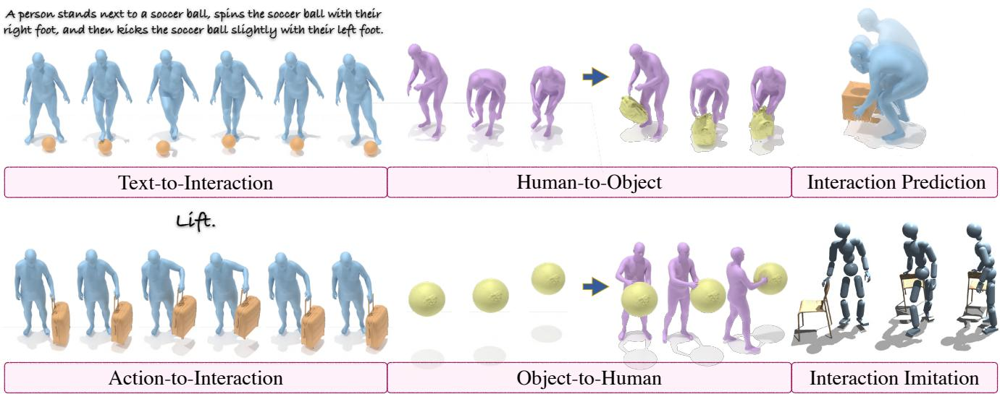
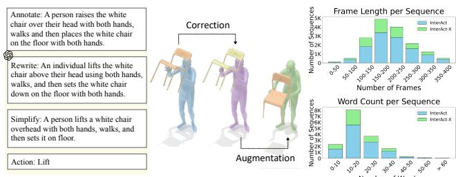
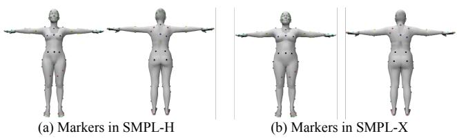
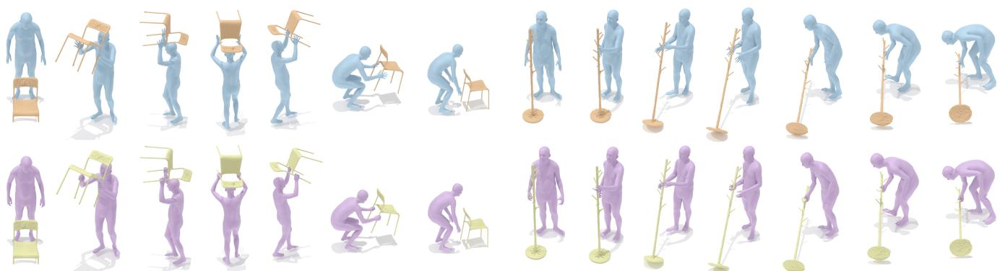
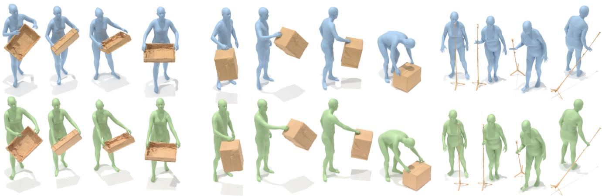
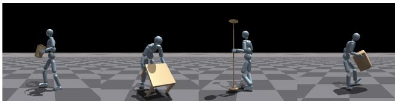

# InterAct: Advancing Large-Scale Versatile 3D Human-Object Interaction Generation

Sirui Xu† Dongting Li† Yucheng Zhang† Xiyan Xu† Qi Long† Ziyin Wang† Yunzhi Lu Shuchang Dong Hezi Jiang Akshat Gupta Yu-Xiong Wang‡ Liang-Yan Gui‡ University of Illinois Urbana-Champaign † Equal Contribution ‡ Equal Advising https://sirui-xu.github.io/InterAct

  
Figure 1. An overview of InterAct, our large-scale 3D human-object interaction (HOI) benchmark, covering six HOI generation tasks.

## Abstract

While large-scale human motion capture datasets have advanced human motion generation, modeling and generating dynamic 3D human-object interactions (HOIs) remain challenging due to dataset limitations. Existing datasets often lack extensive, high-quality motion and annotation and exhibit artifacts such as contact penetration, floating, and incorrect hand motions. To address these issues, we introduce InterAct, a large-scale 3D HOI benchmark featuring dataset and methodological advancements. First, we consolidate and standardize 21.81 hours ofHOI datafrom diverse sources, enriching it with detailed textual annotations. Second, we propose a unified optimizationframework to enhance data quality by reducing artifacts and correcting hand motions. Leveraging the principle ofcontact invariance, we maintain human-object relationships while introducing motion variations, expanding the dataset to 30.70 hours. Third, we define six benchmarking tasks and develop a unified HOI generative modeling perspective, achieving state-of-the-art

performance. Extensive experiments validate the utility of our dataset as a foundational resource for advancing 3D human-object interaction generation. The dataset will be publicly accessible to supportfurther research in thefield.

## 1. Introduction

Recent advances in human motion modeling have significantly benefited from extensive motion capture (MoCap) datasets [22, 41, 50, 67, 69], enabling the creation of scalable generative models for diverse human movements. Building upon this foundation, researchers are increasingly turning to the more intricate challenge of generating human-object interactions (HOIs) [102–104]. This emerging area holds considerable promise for applications in robotics, animation, and computer vision.

However, high-quality HOI generation faces notable obstacles due to factors such as increased degrees of freedom introduced by objects, varied object geometries, dynamic interactions, and the necessity for physically accurate contact modeling. Current methods often struggle to achieve realism primarily because existing datasets lack scalability and comprehensive annotations, which are crucial for models to effectively understand interaction dynamics and link them to related domains such as natural language.

<table><tr><td>Dataset</td><td>Clip</td><td>Hour</td><td>Text</td><td>Hand</td><td>Object</td></tr><tr><td>GRAB [77]</td><td>1,335</td><td>3.76</td><td>x</td><td>√</td><td>51</td></tr><tr><td>BEHAVE [4]</td><td>299</td><td>4.13</td><td>x</td><td>x</td><td>18</td></tr><tr><td>InterCap [28]</td><td>233</td><td>0.62</td><td>x</td><td>√</td><td>10</td></tr><tr><td>Chairs [29]</td><td>1,041</td><td>2.37</td><td>x</td><td>√</td><td>92</td></tr><tr><td>HODome [115]</td><td>176</td><td>2.82</td><td>x</td><td>√</td><td>21</td></tr><tr><td>OMOMO [38]</td><td>4,838</td><td>8.27</td><td>4,838</td><td>x</td><td>15</td></tr><tr><td>IMHD [123]</td><td>164</td><td>0.97</td><td>x</td><td>√</td><td>10</td></tr><tr><td>InterAct (Ours)</td><td>11,350</td><td>21.81</td><td>34,050</td><td>√</td><td>217</td></tr><tr><td>InterAct-X (Ours)</td><td>16,201</td><td>30.70</td><td>48,630</td><td>√</td><td>217</td></tr></table>

Table 1. Comparison between InterAct, InterAct-X, and humanobject interaction datasets we collect. Beyond a substantially larger scale, our dataset introduces comprehensive textual annotations and enhances interaction quality, offering a more versatile foundation for large-scale HOI generation.

Specifically, these challenges underscore the need for comprehensive, high-quality HOI datasets: (1) Limited and Inconsistent Datasets: Existing methods typically depend on small datasets with limited hours of data, difficult to consolidate due to inconsistent human representations, object types, coordinate systems, and annotations. Available annotations [38, 63] are frequently coarse and incomplete, lacking detailed descriptions of human states, object interactions, and involved body parts. (2) Prevalent Artifacts: Current datasets often contain artifacts from MoCap limitations and occlusions, including unnatural penetrations, floating contacts, inaccurate hand poses [4, 38], and significant motion jitter [28]. These issues compromise the models’ capacity to learn realistic human-object dynamics.

To address these challenges, we present InterAct, a benchmark designed to systematically overcome current limitations and drive advancements in 3D HOI modeling. As shown in Table 1, InterAct offers a large-scale, standardized dataset of carefully curated interactions from existing resources1, enriched by detailed textual annotations.

To further enhance dataset quality and scope, we introduce a unified optimization approach, addressing major penetration and floating artifacts first in whole-body interactions, followed by refined corrections for nuanced hand-object interactions. Additionally, we propose the concept of contact invariance, inspired by motion mirroring techniques, to generate realistic synthetic data by varying human motions while maintaining consistent object contacts. This augmentation expands InterAct into InterAct-X, providing approximately 9 additional hours of data and substantially improving generative model performance.

  
(a) Data Annotation and Optimization  
(b) Data and Annotation Statistics  
Figure 2. (a) Our data processing pipeline consolidating data, annotations via foundation models, corrections, and interaction illustrations. (b) Statistics on motion and text annotations.

Leveraging this comprehensive, richly annotated dataset, we define benchmarks across six key HOI generation tasks, Text-to-Interaction, Action-to-Interaction, Object-to-Human, Human-to-Object, Interaction Prediction, and Interaction Imitation, as shown in Figure 1, and propose a unified modeling and representation for kinematic generative tasks. Our method utilizes multi-task learning to jointly model motion and contact, achieving state-of-the-art performance as validated by comprehensive evaluations.

In summary, our contributions are: (1) InterAct, the most extensive 3D HOI benchmark to date, facilitating largescale generative modeling. (2) A unified optimization-based framework to correct and augment MoCap data, addressing common artifacts and significantly enhancing dataset quality. We believe this will aid future research in overcoming data scarcity before capturing potentially imperfect data. (3) Comprehensive benchmarks across six HOI generation tasks, establishing standardized metrics and demonstrating superior performance over existing approaches. This benchmark lays a strong foundation for future research, encouraging advancements across multiple facets of 3D HOI generation.

## 2. Related Work

Dynamic 3D HOI Dataset. Many large-scale datasets with sequential human motion data have established benchmarks for the task of 3D human motion generation. However, human actions are influenced not only by individual intents but also by interactions with the surrounding environment. To address this complexity, new datasets have been developed to capture the dynamics between humans and their environments, including interactions with other humans [1, 40, 54, 101] and scenes [8, 24, 25]. Though there are fruitful hand-object interaction datasets [11, 23, 44, 48, 56, 58, 80, 91, 91, 112, 113, 121], our focus is specifically on whole-body interactions with dynamic objects, ranging from low-dynamic interactions such as approaching and manipulation [77] to highly dynamic interactions involving multiple body parts [4, 20, 28–30, 32, 38, 107, 115, 123].

We aim to address the limitations of these datasets and open new possibilities for future research. Our InterAct dataset maintains advantages in motion quality, fine-grained textual annotations, detailed hand gestures, and comprehensive annotation modalities. We provide quantitative comparisons of InterAct and existing datasets in Table 1, demonstrating the superiority of our dataset in these aspects.

Dynamic 3D HOI Generation. Existing human-object interaction (HOI) datasets have laid a robust foundation for generating dynamic, whole-body interactions. Extensive research has explored the generation of hand-object interactions [9, 13, 39, 43, 49, 84, 111, 114, 118, 126, 127] and static human-object interactions [27, 33, 64, 87, 96, 97, 106, 108, 119, 124]. Meanwhile, full-body dynamic interactions have also been studied extensively [14, 21, 34– 36, 38, 52, 53, 71, 75, 76, 78, 85, 94, 105, 120, 125], though these often face significant limitations, including narrow action repertoires and dependence on static objects. Recent advancements, such as InterDiff [102], have introduced diverse interactions involving dynamic objects and multiple body parts. Building upon this, subsequent approaches like InterDreamer [103] and other contemporary studies [18, 37, 63, 74, 93, 95, 103, 117] further demonstrate the feasibility of converting textual descriptions into realistic 3D human-object interaction sequences. Despite these ad vances, current methods remain constrained by a shortage of high-quality, large-scale datasets, often encountering issues related to physical inaccuracies, such as floating contacts or interpenetration. In parallel, physics-based methods leveraging deep reinforcement learning (RL) [3, 6, 10, 15, 26, 42, 55, 61, 81, 83, 86, 89, 90, 92, 98, 100, 109, 110] successfully generate physically accurate interactions, with applications in sports [47] like basketball [88, 89] and soccer [99]. Nonetheless, these methods typically produce rigid interaction patterns from limited datasets, while a recent work, InterMimic [104], illustrates that physics-based approaches can digest effectively across diverse and dynamic object interactions. Our work addresses these fundamental limi tations at the dataset level by providing enhanced diversity and comprehensive sequences of human-object interactions. This facilitates multiple generative tasks, supports better contact modeling, and improves the capability to synthesize realistic and generalized human-object interactions.

## 3. InterAct Dataset

Overview. We introduce InterAct, the first unified benchmark tailored explicitly for sequential 3D human-object interaction (HOI) generative modeling. Distinguished by its unprecedented scale and comprehensiveness, InterAct significantly surpasses existing datasets, as summarized in Table 1.

  
Figure 3. Marker-based representation for human.

InterAct is available in two versions: (1) A basic version consolidating seven existing datasets, providing 21.81 hours of annotated 3D whole-body interactions with corresponding semantic descriptions. (2) An advanced version, InterAct-X, extending the basic dataset through synthetic data generated via our unified optimization framework. Figure 2 presents examples of motion and text annotations. To ensure high-quality standards, we employ a multifaceted annotation strategy combining human expertise, automated foundation models, and advanced HOI modeling techniques, all validated through rigorous manual quality checks.

## 3.1. Data Collection, Annotation, and Unification

We compile data from seven datasets [4, 28, 29, 38, 77, 115, 123], featuring motion capture of a single human interacting with a single dynamic 3D object, where humans are annotated with SMPL [45, 62, 73]. We address their heterogeneity in two key aspects: annotations and representations.

Unifying Textual Annotations. Since most datasets either lack textual descriptions or provide only very coarse text descriptions [38], we implement a two-phase annotation procedure involving human annotators and GPT-4 [60] to generate consistent and detailed annotations across all subsets. In thefirst phase, human annotators provided detailed and precise descriptions of the interactions, adhering to the following guidelines: (i) Split motion sequences into clips averaging 300 frames (approximately 10 seconds) but no longer than 400 frames each; (ii) Clearly describe the actions and the body parts involved in the interactions. For example, a typical annotation is: “A person sits on a stool and touches the ground with their left hand, then their right hand.” For the subset derived from OMOMO [38], we skip this phase and directly utilize their annotations. In the second phase, we use GPT-4 to rephrase and simplify human annotations to enhance diversity and consistency. For example, the rephrased version is “A person perches on a stool, touching the ground with their left hand, then their right hand,” and the simplified version is “A person sits on a stool, touching the ground with each hand alternately.” Next, we employ GPT-4 to classify each description into one of our predefined 15 action labels with in-context learning [7]. The action label for the above sequence is “Sit.” We meticulously review all generated texts and action labels to ensure high quality and alignment across the dataset.

Unifying Human Representations. Different datasets employ varying human models $( e . g .$ ., SMPL-H [73], SMPL-X [62]) and diverse shapes. A straightforward solution can be to convert different humans from SMPL-H and SMPL-X to a consistent SMPL version and encode shape parameters into the generative modeling. However, although SMPL is widely used in various human-related tasks, it is fundamentally a rotation-based representation. In the context of human motion generation, Cartesian features like joint positions and velocities are more commonly used, as seen in the integration with the HumanML3D representation [22] and in most text-to-motion work [65, 82, 116]. This is still suboptimal because joints are located beneath the body’s surface and do not explicitly participate in interactions. To overcome the limitations, we use markers – specific sets of human vertices representing human motion and interactions – as a simple and unified representation capable of effectively inferring contact, evaluated in Table 5. Similar approaches are discussed in [94, 102]. Then we need to select a marker set that is consistent between SMPL-H and SMPL-X models.

Given two human body models, SMPL-H and SMPL-X, sharing the same shape, we establish marker correspondences in two steps. First, we index the markers on the SMPL-H surface as defined in prior work [94, 102]. Second, we locate the corresponding vertices on SMPL-X by selecting the closest points to these SMPL-H markers, leveraging the official SMPL conversion, which maps each SMPL-H vertex to the nearest point on the SMPL-X mesh. We extensively evaluated the approximation error of these marker correspondences across a broad range of poses. Our results show that the maximum error consistently remains below 1 cm, a deviation unlikely to affect the overall performance of HOI generation. This high consistency arises because the markers are rigidly attached to the body, and soft deformations are disabled. As a result, the identical rigid transformations in SMPL-H and SMPL-X preserve the correspondence of the markers. Additional details on such correspondence-preserving conditions can be found in [31]. Figure 3 illustrates the marker sets for SMPL-H and SMPL-X. We use this marker-based representation to train the generative models for the tasks outlined in Sec. 4, while still relying on the original SMPL-H or SMPL-X representations for the interaction correction and augmentation methods described in Sec. 3.2.

## 3.2. Interaction Correction and Augmentation

In this section, we present a unified optimization framework that addresses both the correction of MoCap artifacts and the augmentation of the dataset by introducing more synthetic data. The process takes as input the motions and geometries of humans and objects, then compares them against predefined standards to define loss functions. Using gradientbased optimization, we iteratively adjust human and object motions to minimize these losses, thereby refining the data to meet the desired quality criteria. The key challenge lies in formulating learning objectives that not only rectify existing data but also facilitate the generation of new synthetic data.

Our optimization is carried out in three sequential steps: (1) full-body correction; (2) hand correction; and (3) interaction augmentation. Hand correction is handled separately because, although hand poses occupy considerable space in the SMPL representation, they contribute relatively little to the overall scale of the learning objectives. By decoupling hand correction from full-body correction, we can better balance these two processes and define more targeted objectives. In what follows, we first introduce the hand correction stage. Hand Correction. Given that many existing datasets contain inaccurate hand poses [4, 38], our approach selectively promotes contact only in regions where ground-truth data indicates hand-object interaction, while ensuring the hand motion remains natural, in spirit to InterMimic [104] but relying on predefined optimization instead of RL. This approach is effective for the whole-body interaction datasets we utilize, which generally do not require high dexterity and typically only involve the hand conforming to the object for grasping, as a common assumption in existing work [79, 127], while we distinguish our approach from those that employ multi-stage, learning-based methods for the same purpose.

We divide our hand correction objectives into two categories: contact promotion and hand constraints. Contact promotion is guided by the following contact loss:

$$
E _ { \mathrm { c o n t } } = \sum _ { i = 1 } ^ { L } c _ { i } \sum _ { j } d _ { j } [ i ] ,
$$

where $d _ { j } [ i ]$ is the distance between the j-th hand vertex and its nearest point on the object’s surface at the i-th frame, and $c _ { i }$ indicates whether the object and the hand are in contact at frame i. The contact indicator $c _ { i } ,$ , inferred from ground truth data, is a function based on hand-object distance minj $; d _ { j } [ i ]$ which we provide details in supplementary. The hand constraint objectives are introduced to preserve naturalness and temporal smoothness in the hand motions. These constraints include: (1) penetration loss, which penalizes intersections between the hand and the object. (2) smoothness loss, which promotes consistent contact and reduces jittering. (3) prior loss, which constrains the range of motion (RoM) of the fingers to maintain realism. Without this constraint, contact promotion could inadvertently drive fingers into biologically impossible poses. Detailed formulations of these loss functions are provided in the supplementary.

Full-Body Correction. In this stage, all human and object poses can be updated via gradient descent. We add a reconstruction loss to ensure that the optimized interactions closely match the ground truth. Other losses mirror those used in hand correction, with two key differences: (1) Contact and penetration losses are computed for the entire body rather than just the hands. (2) Prior loss is omitted because the reconstruction loss alone suffices to maintain plausible human motion. Detailed formulations of these losses are provided in supplementary.

Interaction Augmentation. Synthetic data has become increasingly important in computer vision and generative modeling [5, 12, 19, 57], prompting a key question in the context of HOI animation: Can we scale up datasets without collecting additional MoCap data? Does existing interaction data offer information beyond its observable motions? Consider a scenario where a person grasps a box and walks, as illustrated in Figure 5. Even if their gait changes slightly, hand-box contact should remain consistent to preserve the semantics of the interaction. This illustrates the principle of interaction invariance: the core interaction persists despite minor variations in motion. Leveraging this principle, we can augment our dataset by injecting new human motions while preserving consistent object interactions. Training neural networks on such augmented data enables them to naturally learn this invariance, a common strategy in symmetric learning [17], and ultimately enhances model performance.

Our augmentation pipeline consists of three steps: (1) Object Displacement: We apply a random displacement to the object’s trajectory, uniformly across all timesteps. (2) Interaction Alignment: We optimize the human motion to maintain interaction with the displaced object, using both contact consistency and reconstruction objectives. (3) Interaction Filtering: We remove low-quality augmentations, those with unreasonable initial displacements, significant penetrations (human-object or self-penetration), or alignment failures indicated by high optimization losses (e.g., excessive jitter).

During the alignment phase, the primary objective is the contact consistency loss. We first compute a distance matrix D, where each element $\mathbf { D } _ { j k } = \| \mathbf { v } _ { h } ^ { j } - \mathbf { v } _ { o } ^ { k } \|$ denotes the Euclidean distance between the j-th human vertex and the k-th object vertex, before or after displacement. With a reference matrix Dˆ from the original (pre-displacement) setup, we optimize the human motion using:

$$
E _ { \mathrm { a l i g n } } = \sum _ { i = 1 } ^ { L } \sum _ { j , k } { \frac { 1 } { ( \hat { \mathbf { D } } _ { j k } + \epsilon ) ^ { 2 } } } \left| \hat { \mathbf { D } } _ { j k } - \mathbf { D } _ { j k } \right| ^ { 2 } ,
$$

where ω is a small constant to prevent division by zero. This formulation preserves distances between vertex pairs that were initially close, while de-emphasizing pairs that were farther apart. Additional terms in the objective enforce naturalness and stability in non-interactive regions of the human pose, as detailed in the supplementary material.

## 4. Tasks and Methods

In this section, we formally define six distinct tasks featured in our benchmark. We use unified representation across five kinematic generative tasks, where each human-object interaction sequence is represented as $\langle h , o \rangle$ , annotated with an action category a and a text description t. The human h includes marker coordinates, marker velocities, signed distance vectors from each marker to the object, and footground contact labels. The object o represents object motion, including object rotation angles, object translations. Object geometry is described by Basis Point Set (BPS) [68].

(1) Text-Conditioned Interaction Generation. Initially in [18, 63], the task learns a function to generate the interaction sequence based on text: $\mathcal { G } _ { \mathrm { t 2 i } } ( t ) \mapsto \langle h , o \rangle$

(2) Action-Conditioned Interaction Generation. The objective is to learn a function that maps an action label to the corresponding interaction sequence: $\mathcal { G } _ { \mathrm { a 2 i } } ( \pmb { a } ) \mapsto \langle \pmb { h } , \pmb { o } \rangle$

(3) Object-Conditioned Human Generation. Initially in [38], the task generates human motion based on object sequences through a function $\mathcal { G } _ { \mathrm { o 2 h } } ( o ) \mapsto h$

(4) Human-Conditioned Object Generation. Conversely, this task focuses on generating object motion sequences from human motion sequences via a function $\mathcal { G } _ { \mathrm { h 2 o } } ( h ) \mapsto o .$

(5) Interaction Prediction. Initially in [102], the task aims to predict future human-object interactions based on past. Let $\langle h _ { p } , o _ { p } \rangle$ denote the past interaction and $\langle h _ { f } , o _ { f } \rangle$ the future. The goal is to learn: $\mathcal G _ { \mathrm { p 2 f } } ( \langle h _ { p } , o _ { p } \rangle ) \mapsto \langle \dot { h _ { f } } , \dot { o _ { f } } \rangle$

(6) Interaction Imitation. Following [3, 88, 122], this task focuses on learning physics-based control policies to reproduce human-object interactions in a physics simulator. The output is an action sequence $f ,$ specified as joint Proportional-Derivative (PD) targets. The goal is to learn a function $\mathcal { G } _ { \mathrm { i 2 f } }$ that maps the reference interaction sequences to the PD actuation sequences: $\mathcal { G } _ { \mathrm { i 2 f } } ( \langle h , o \rangle ) \mapsto f .$

Unifying Multi-Task HOI Generation. We introduce an additional feature, ω, which encodes human-object relationships through vectors extending from each human marker to its nearest point on the object’s surface. The specific configuration of ω for each generative task is described in Sec. 5. Using this feature, we can unify first five kinematic generative tasks into a multi-task learning framework by treating ω as an additional output. For example, we redefine the textconditioned interaction task as $\mathcal { G } _ { \mathrm { t 2 i } } ( t ) \mapsto \langle h , o , \eta \rangle$ , where $\mathcal { G }$ is a transformer-based diffusion model. This formulation compels the model to learn spatial relationships inherent to the interactions. In our experiments, we observe that this simple strategy, enhanced by large-scale data, consistently outperforms existing methods. Similar ideas are explored in [18, 37, 38, 63, 74, 93, 102].

## 5. Experiments

We begin by evaluating the effectiveness of our data correction and augmentation methods. Following this, we benchmark existing work and our proposed method on the tasks using our dataset. We standardize the evaluation metrics and present extensive results, including ablation studies. We include additional implementation details, such as the train-test split, in supplementary.

  
Figure 4. Qualitative evaluation of interaction correction (bottom) on the OMOMO [38] dataset shows hand recovery compared to the ground truth interaction (top). Zoom in to see details of the hand recovery.

<table><tr><td>Dataset</td><td>Correction</td><td>Augmentation</td><td>Pene (m)↓</td><td>Cont Ratio</td><td>User Study (%)</td></tr><tr><td rowspan="3">BEHAVE [4]</td><td>X</td><td>X</td><td>0.017</td><td>0.048</td><td>22.3</td></tr><tr><td>√</td><td>×</td><td>0.016</td><td>0.071</td><td>39.7</td></tr><tr><td>√</td><td>√</td><td>0.016</td><td>0.069</td><td>38.0</td></tr><tr><td rowspan="3">OMOMO [38]</td><td>X</td><td>X</td><td>0.009</td><td>0.071</td><td>23.9</td></tr><tr><td>√</td><td>×</td><td>0.007</td><td>0.131</td><td>39.4</td></tr><tr><td>√</td><td>√</td><td>0.011</td><td>0.137</td><td>36.7</td></tr></table>

Table 2. Quantitative evaluation and user study on the quality of data from interaction correction and augmentation.

## 5.1. Correction and Augmentation

Metrics. We use the following two metrics: Penetration refers to the intersection depth – maximum of negative sign distances from human vertices to the object’s surface – average across the sequence. Contact Ratio represents the average ratio of human vertices where their distances to object are under a threshold.

Quantitative Evaluations. Table 2 shows that our correction process significantly improves the quality of the original Mo-Cap data by enhancing human-object contact and reducing penetration artifacts. Moreover, the quality of the augmented data is comparable to that of the corrected data and exceeds the quality of the original dataset.

Qualitative Evaluations. Recognizing that quantitative metrics may not fully capture data quality, we conducted a double-blind user study. We randomly selected sequences from each of the raw, corrected, and augmented data for the subset from BEHAVE [4] and OMOMO [38] datasets. Human judges were presented with 30 tuple of interactions and asked to rank the quality of three sequences. According to Table 2, over 39% of judges select the corrected data as having the highest quality, significantly outperforming the original data. This confirms that our correction process effectively enhances data realism. Moreover, the augmented data receive ratings comparable to the corrected data, indicating that our synthetic data is of high quality. In Figure 4, we visualize our correction results. Despite the original data lacking detailed hand information, we successfully recover vivid and accurate hand interactions. Figure 5 showcases our augmentation, which introduces new high-quality synthetic data while maintaining consistent contact in interactions.

## 5.2. Language Conditioned HOI Generation

Metrics. Following the literature on text-to-motion generation [22], we develop five metrics for evaluation. The Frechet´ Inception Distance (FID) quantifies the similarity between generated HOI features and the ground truth. The Multimodality and Diversity metrics assess the variety within the generated HOI. R-Precision measures the alignment between the textual descriptions and the generated HOI. The Multimodal Distance (MM Dist) evaluates the disparity between HOI features and corresponding text features. To obtain human-object interaction (HOI) and text features for calculating these metrics, existing methods often train their feature extractors on very limited data [18, 63, 74, 93], which can degrade the quality of the evaluation. We address this limitation by incorporating our larger-scale data with marker and BPS representations. Instead of formulating a classification task to train the feature extractor [22], we follow [46, 66] and employ sequence-level contrastive learning with an InfoNCE loss [59] to train a text encoder and an HOI encoder, integrating Sentence-BERT [72] into the text encoder.

Baselines and Implementation Details. We adopt HOI-Diff [63] as our base model because it is the only publicly available option compatible with our requirements. For example, CHOIS [37] requires additional conditions beyond text input. HOI-Diff utilizes a transformer-based diffusion model [82] as the backbone, and integrates an affordable model as the classifier guidance [16]. We develop several baseline variants towards our final method by implementing three key modifications: (i) Text Encoder: We replace HOI-Diff’s CLIP-based text encoder, where the latent space is not structured for human-object interactions, with our pretrained interaction-aware text encoder. (ii) Object Shape Encoding: We substitute the original PointNet++ [70], also not pretrained for capturing interaction, with BPS [68] representations for encoding object shapes. (iii) Instead of using affordance as guidance, we regress the contact representation ω through a multi-task learning. (iv) We further incorporate the contact prediction as classifier guidance [16] within the denoising process, which we detail in supplementary.

Figure 5. Qualitative evaluation of interaction augmentation (bottom) shows high-quality synthetic data varied from original (top).
<table><tr><td rowspan="2">HOI-Aware Object Enc.</td><td rowspan="2">HOI-Aware Text Enc.</td><td rowspan="2">Contact Generation</td><td rowspan="2">Contact Guidance</td><td colspan="3">R-Precision↑</td><td rowspan="2"> $\mathrm { F I D ^ { \downarrow } }$ </td><td rowspan="2">MM Dist↓</td><td rowspan="2">Multimodality↑</td><td rowspan="2">Diversity→</td></tr><tr><td> $\mathrm { T o p } 1$ </td><td> $\mathrm { T o p } 2$ </td><td> $\mathrm { T o p } 3$ </td></tr><tr><td></td><td>Ground Truth</td><td></td><td></td><td>0.852±0.000</td><td> $0 . 9 6 6 ^ { \pm 0 . 0 0 1 }$ </td><td> $0 . 9 8 9 ^ { \pm 0 . 0 0 1 }$ </td><td>0.000±0.000</td><td> $2 . 8 1 0 ^ { \pm 0 . 0 0 2 }$ </td><td></td><td>11.489±0.011</td></tr><tr><td>x</td><td>x</td><td>x</td><td>x</td><td>0.733±0.007</td><td>0.909±0.002</td><td>0.957±0.002</td><td>3.192±0.191</td><td>4.950±0.023</td><td>3.149±0.452</td><td>11.192±0.019</td></tr><tr><td>x</td><td>x</td><td>√</td><td>x</td><td> $0 . 7 3 0 ^ { \pm 0 . 0 0 7 }$ </td><td> $0 . 9 1 3 ^ { \pm 0 . 0 0 4 }$ </td><td>0.958±0.005</td><td>1.997±0.092</td><td> $4 . 7 5 2 ^ { \pm 0 . 0 6 5 }$ </td><td>4.171±0.027</td><td>11.501±0.037</td></tr><tr><td>√</td><td>x</td><td>√</td><td>x</td><td> $0 . 7 3 7 ^ { \pm 0 . 0 1 1 }$ </td><td> $0 . 9 1 2 ^ { \pm 0 . 0 0 2 }$ </td><td>0.963±0.008</td><td>1.837±0.126</td><td>4.631±0.078</td><td>2.836±0.583</td><td>11.369±0.096</td></tr><tr><td>√</td><td>√</td><td>√</td><td>x</td><td> $\mathbf { 0 . 7 8 4 ^ { \pm 0 . 0 0 4 } }$ </td><td>0.940±0.002</td><td> $\mathbf { 0 . 9 8 0 ^ { \pm 0 . 0 0 3 } }$ </td><td>1.570±0.139</td><td> $4 . 4 1 4 ^ { \pm 0 . 0 6 4 }$ </td><td>2.677±0.562</td><td>11.409±0.005</td></tr><tr><td></td><td>√</td><td>√</td><td>√</td><td> $\mathbf { 0 . 7 8 4 ^ { \pm 0 . 0 0 4 } }$ </td><td>0.940±0.000</td><td> $0 . 9 7 7 ^ { \pm 0 . 0 0 2 }$ </td><td> $1 . 5 6 7 ^ { \pm 0 . 1 4 4 }$ </td><td> $\pm . 4 1 2 ^ { \pm 0 . 0 6 5 }$ </td><td>3.842±0.005</td><td>11.518±0.178</td></tr></table>

Table 3. Quantitative evaluation on the task of text-conditioned interaction generation. A batch size of 64 is used for R-Precision.

<table><tr><td>Method</td><td>FID↓</td><td>Multimodality↑</td><td> $\mathrm { D i v e r s i t y } ^ {  }$ </td></tr><tr><td>Ground Truth</td><td> $0 . 0 0 0 ^ { \pm 0 . 0 0 0 }$ </td><td>1</td><td> $1 1 . 4 8 9 ^ { \pm 0 . 0 1 1 }$ </td></tr><tr><td>HOI-Diff [63]</td><td> $3 . 5 6 6 ^ { \pm 0 . 0 9 8 }$ </td><td> $\overline { { 5 . 3 2 1 ^ { \pm 0 . 1 4 3 } } }$ </td><td> $1 0 . 9 8 9 ^ { \pm 0 . 1 1 2 }$ </td></tr><tr><td>Ours</td><td> $\mathbf { 2 . 1 6 1 ^ { \pm 0 . 0 3 7 } }$ </td><td> ${ \bf 5 . 7 9 2 ^ { \pm 0 . 0 5 9 } }$ </td><td> $1 1 . 2 9 1 ^ { \pm 0 . 2 6 1 }$ </td></tr></table>

Table 4. Quantitative evaluation on the task of action-conditioned interaction generation on the entire InterAct testset.

<table><tr><td>Representation</td><td>Pene (m)↓</td><td>Cont Ratio</td></tr><tr><td>SMPL</td><td>0.030</td><td>0.025</td></tr><tr><td>Joint</td><td>0.027</td><td>0.032</td></tr><tr><td>Marker</td><td>0.025</td><td>0.028</td></tr></table>

Quantitative Results. Table 3 presents the evaluation results for the text-conditioned interaction generation task. We assess the impact of four design choices introduced above. Notably, incorporating contact modeling and BPS encoding significantly improves the quality of generated HOI, substantially enhancing the FID score. Furthermore, using our interaction-aware text and HOI encoder enhances the quality of the generated interactions and improves the alignment between the generated results and the text input. Lastly, classifier guidance provides a slight overall performance improvement. Table 4 benchmarks the performance improvements of these design choices similarly for the action-conditioned interaction generation task.

Table 5. Ablation study on different representation for text-tointeraction task, evaluated under BEHAVE [4] subset.
<table><tr><td>Model</td><td>MPMPE↓</td><td>FS↓</td><td> $C _ { \mathrm { p r e c } } $  t</td><td> $C _ { \mathrm { r e c } } \uparrow$ </td><td> $C _ { \mathrm { a c c } } \uparrow$ </td><td>F1  $\mathrm { S c o r e } ^ { \uparrow }$ </td></tr><tr><td>2-stage [38]</td><td>36.50</td><td>0.27</td><td>0.81</td><td>0.85</td><td>0.77</td><td>0.80</td></tr><tr><td>1-stage</td><td>36.94</td><td>0.29</td><td>0.84</td><td>0.82</td><td>0.80</td><td>0.81</td></tr><tr><td>Ours (Disc.)</td><td>36.95</td><td>0.28</td><td>0.85</td><td>0.84</td><td>0.83</td><td>0.82</td></tr><tr><td>Ours (Cont.)</td><td>35.69</td><td>0.28</td><td>0.85</td><td>0.89</td><td>0.85</td><td>0.85</td></tr></table>

Table 6. Quantitative evaluation on object-conditioned human motion generation, with novel objects unseen from training.

Effectiveness of Marker-Based Representation. As shown in Table 5, we compare different human representations on text-to-interaction generation. Without altering contact modeling, marker-based representation produces interactions with fewer artifacts compared to other representations.

## 5.3. HOI Inpainting

Metrics. Following OMOMO [38], we develop six metrics tailored for evaluating our marker-based representation. The Mean Per-Marker Position Error (MPMPE) are used to measure the similarity between the generated marker motion and the ground truth. Foot Sliding (FS) is employed to assess the skating effect, reflecting the plausibility of the motion. Additionally, we use a set of contact metrics, including precision $( C _ { \mathrm { p r e c } } )$ , recall $( C _ { \mathrm { r e c } } )$ , accuracy $( C _ { \mathrm { a c c } } )$ , and the F1 Score, to evaluate the quality of human-object contact compared to the ground truth. For the human-conditioned object generation task, we include $T _ { \mathrm { e r r } }$ and $O _ { \mathrm { e r r } } ,$ which measure discrepancies in object translation and orientation between the generated and the ground truth.

Baselines and Implementation Details. We adopt OMOMO [38] as our base model since it is the only publicly available option. OMOMO employs a two-stage generation process: it first generates hand motions and then uses these to guide full-body generations. This strategy is particularly effective for the OMOMO dataset, where interactions primarily involve hand contact. However, it is less effective when applied to our InterAct data, which features more versatile whole-body engagement. Motivated by this, we use a single-stage pipeline with multi-task learning, as introduced in Sec. 4. We investigate two different choices for contact regression: $\pmb { \eta } _ { \mathrm { C o n t } }$ , which encodes the nearest vector and distance between human markers and the object. $\eta _ { \mathrm { D i s c . } }$ , which encodes the contact labels for each marker.

Quantitative Results. Tables 6 and 7 illustrate the effectiveness of our single-stage pipeline, with notable performance improvements when incorporating multi-task modeling. These results provide additional evidence, complementing the evaluation of text-conditioned generation, that multitask learning significantly enhances model performance.

## 5.4. Interaction Prediction

Evaluation Metrics. We compare the generated poses to the ground truth motion data using MPMPE (mean permarker errors), measured in meters. Second, we assess object motion accuracy using Trans. Err., the average $l _ { 2 }$ distance between the predicted and ground truth object translations, and Rot.Err., the average $l _ { 1 }$ distance between the predicted and ground truth object quaternions, following [102].

Implementation Details. We adapt InterDiff [102] to utilize a marker-based representation and evaluate it at various scales to assess whether it benefits from scaling laws.

## 5.5. Interaction Imitation

Implementation Details. We use PhysHOI [88] to imitate sequences from our InterAct dataset, selecting four sequences shown in Figure 6. The IsaacGym [51] simulator is used, following the same architecture, reward, and representation design as PhysHOI. Training for each sequence, with separate evaluations for both raw and corrected data, is performed on a single NVIDIA A40 GPU over the course of one day.

  
Figure 6. Qualitative results demonstrate the successful imitation of our corrected data using PhysHOI [88].

<table><tr><td>Model</td><td> $T _ { \mathrm { e r r } } \downarrow$ </td><td> $O _ { \mathrm { e r r } } \downarrow$ </td><td> $C _ { \mathrm { p r e c } } \uparrow$ </td><td> $C _ { \mathrm { r e c } } \uparrow$ </td><td> $C _ { \mathrm { a c c } } \uparrow$ </td><td>F1 Score ↑</td></tr><tr><td>1-stage</td><td>25.92</td><td>0.91</td><td>0.83</td><td>0.66</td><td>0.72</td><td>0.69</td></tr><tr><td>Ours (multi-task)</td><td>23.98</td><td>0.83</td><td>0.84</td><td>0.68</td><td>0.74</td><td>0.72</td></tr></table>

Table 7. Quantitative evaluation on human-to-object.
<table><tr><td>Training data</td><td>Model size</td><td>Global MPMPE↓</td><td>Local MPMPE↓</td><td>Trans. Err.↓</td><td>Rot.Err.↓</td></tr><tr><td rowspan="3">BEHAVE</td><td>x1</td><td>0.120</td><td>0.103</td><td>0.133</td><td>0.352</td></tr><tr><td>x2</td><td>0.105</td><td>0.092</td><td>0.109</td><td>0.312</td></tr><tr><td>×3</td><td>0.113</td><td>0.100</td><td>0.118</td><td>0.343</td></tr><tr><td rowspan="3">InterAct (Ours)</td><td>×1</td><td>0.106</td><td>0.095</td><td>0.106</td><td>0.297</td></tr><tr><td>x2</td><td>0.094</td><td>0.083</td><td>0.103</td><td>0.286</td></tr><tr><td>×3</td><td>0.091</td><td>0.079</td><td>0.094</td><td>0.264</td></tr></table>

Table 8. Quantitative evaluation on interaction prediction.

Quantitative Evaluation. In addition to Figure 6, which presents the qualitative results, we evaluate the imitation policy by training on both corrected and raw data, reporting the success rate as defined in [88]. Evaluating four examples from Figure 6 and averaging the success rates over 2048 environments, training on the corrected data achieves a success rate of 90.7%, surpassing the 84.4% achieved with raw data. This demonstrates that our interaction correction provides better data for the motion imitation task.

Quantitative Results. Table 8 demonstrates that our dataset, with its larger volume of data, supports the improved performance of the trained model with larger scale. In contrast, training the model on limited data leads to overfitting.

## 6. Conclusion

We introduce InterAct, a large-scale 3D whole-body humanobject interaction benchmark. We employ a unified optimization framework that performs interaction correction and augmentation, enhancing data quality and augment the dataset with synthetic data, scaling to 30.70 hours of interactions and 48,630 textual descriptions. We introduce a simple yet effective multi-task learning approach for unified HOI modeling, enabling models to be trained more effectively across multiple tasks. Our comprehensive experiments highlight the significant advantages of InterAct and our methodologies, resulting in more expressive interaction generation.

Acknowledgments. This work was supported in part by NSF Grant 2106825, NIFA Award 2020-67021-32799, the Amazon-Illinois Center on AI for Interactive Conversational Experiences, the Toyota Research Institute, the IBM-Illinois Discovery Accelerator Institute, and Snap Inc. This work used computational resources, including the NCSA Delta and DeltaAI and the PTI Jetstream2 supercomputers through allocations CIS230012, CIS230013, and CIS240311 from the Advanced Cyberinfrastructure Coordination Ecosystem: Services & Support (ACCESS) program, as well as the TACC Frontera supercomputer, Amazon Web Services (AWS), and OpenAI API through the National Artificial Intelligence Research Resource (NAIRR) Pilot.

## References

[1] CMU graphics lab motion capture database. http:// mocap.cs.cmu.edu/. 2

[2] Easymocap - make human motion capture easier. Github, 2021. 2

[3] Jinseok Bae, Jungdam Won, Donggeun Lim, Cheol-Hui Min, and Young Min Kim. Pmp: Learning to physically interact with environments using part-wise motion priors. In SIGGRAPH, 2023. 3, 5

[4] Bharat Lal Bhatnagar, Xianghui Xie, Ilya Petrov, Cristian Sminchisescu, Christian Theobalt, and Gerard Pons-Moll. BEHAVE: Dataset and method for tracking human object interactions. In CVPR, 2022. 2, 3, 4, 6, 7, 5

[5] Michael J Black, Priyanka Patel, Joachim Tesch, and Jinlong Yang. Bedlam: A synthetic dataset of bodies exhibiting detailed lifelike animated motion. In CVPR, 2023. 5

[6] Jona Braun, Sammy Christen, Muhammed Kocabas, Emre Aksan, and Otmar Hilliges. Physically plausible fullbody hand-object interaction synthesis. arXiv preprint arXiv:2309.07907, 2023. 3

[7] Tom Brown, Benjamin Mann, Nick Ryder, Melanie Subbiah, Jared D Kaplan, Prafulla Dhariwal, Arvind Neelakantan, Pranav Shyam, Girish Sastry, Amanda Askell, et al. Language models are few-shot learners. In NeurIPS, 2020. 3

[8] Zhe Cao, Hang Gao, Karttikeya Mangalam, Qi-Zhi Cai, Minh Vo, and Jitendra Malik. Long-term human motion prediction with scene context. In ECCV, 2020. 2

[9] Junuk Cha, Jihyeon Kim, Jae Shin Yoon, and Seungryul Baek. Text2hoi: Text-guided 3d motion generation for handobject interaction. In CVPR, 2024. 3

[10] Yu-Wei Chao, Jimei Yang, Weifeng Chen, and Jia Deng. Learning to sit: Synthesizing human-chair interactions via hierarchical control. In AAAI, 2021. 3

[11] Yu-Wei Chao, Wei Yang, Yu Xiang, Pavlo Molchanov, Ankur Handa, Jonathan Tremblay, Yashraj S Narang, Karl Van Wyk, Umar Iqbal, Stan Birchfield, et al. Dexycb: A benchmark for capturing hand grasping of objects. In CVPR, 2021. 2

[12] Guiming Hardy Chen, Shunian Chen, Ruifei Zhang, Junying Chen, Xiangbo Wu, Zhiyi Zhang, Zhihong Chen, Jianquan Li, Xiang Wan, and Benyou Wang. Allava: Harnessing

gpt4v-synthesized data for a lite vision-language model. arXiv preprint arXiv:2402.11684, 2024. 5

[13] Sammy Christen, Shreyas Hampali, Fadime Sener, Edoardo Remelli, Tomas Hodan, Eric Sauser, Shugao Ma, and Bugra Tekin. Diffh2o: Diffusion-based synthesis of handobject interactions from textual descriptions. arXiv preprint arXiv:2403.17827, 2024. 3

[14] Enric Corona, Albert Pumarola, Guillem Alenya, and Francesc Moreno-Noguer. Context-aware human motion prediction. In CVPR, 2020. 3

[15] Jieming Cui, Tengyu Liu, Nian Liu, Yaodong Yang, Yixin Zhu, and Siyuan Huang. AnySkill: Learning openvocabulary physical skill for interactive agents. In CVPR, 2024. 3

[16] Prafulla Dhariwal and Alexander Nichol. Diffusion models beat gans on image synthesis. In NeurIPS, 2021. 6, 7

[17] Sander Dieleman, Jeffrey De Fauw, and Koray Kavukcuoglu. Exploiting cyclic symmetry in convolutional neural networks. In ICML, 2016. 5

[18] Christian Diller and Angela Dai. CG-HOI: Contact-guided 3d human-object interaction generation. In CVPR, 2024. 3, 5, 6

[19] Lijie Fan, Kaifeng Chen, Dilip Krishnan, Dina Katabi, Phillip Isola, and Yonglong Tian. Scaling laws of synthetic images for model training... for now. In CVPR, 2024. 5

[20] Zicong Fan, Omid Taheri, Dimitrios Tzionas, Muhammed Kocabas, Manuel Kaufmann, Michael J. Black, and Otmar Hilliges. ARCTIC: A dataset for dexterous bimanual handobject manipulation. In CVPR, 2023. 3

[21] Anindita Ghosh, Rishabh Dabral, Vladislav Golyanik, Christian Theobalt, and Philipp Slusallek. IMoS: Intent-driven full-body motion synthesis for human-object interactions. arXiv preprint arXiv:2212.07555, 2022. 3

[22] Chuan Guo, Shihao Zou, Xinxin Zuo, Sen Wang, Wei Ji, Xingyu Li, and Li Cheng. Generating diverse and natural 3d human motions from text. In CVPR, 2022. 1, 4, 6

[23] Shreyas Hampali, Mahdi Rad, Markus Oberweger, and Vincent Lepetit. Honnotate: A method for 3d annotation of hand and object poses. In CVPR, 2020. 2

[24] Mohamed Hassan, Vasileios Choutas, Dimitrios Tzionas, and Michael J Black. Resolving 3d human pose ambiguities with 3d scene constraints. In ICCV, 2019. 2

[25] Mohamed Hassan, Duygu Ceylan, Ruben Villegas, Jun Saito, Jimei Yang, Yi Zhou, and Michael Black. Stochastic sceneaware motion prediction. In ICCV, 2021. 2

[26] Mohamed Hassan, Yunrong Guo, Tingwu Wang, Michael Black, Sanja Fidler, and Xue Bin Peng. Synthesizing physical character-scene interactions. In SIGGRAPH, 2023. 3

[27] Zhi Hou, Baosheng Yu, and Dacheng Tao. Compositional 3d human-object neural animation. arXiv preprint arXiv:2304.14070, 2023. 3

[28] Yinghao Huang, Omid Taheri, Michael J. Black, and Dimitrios Tzionas. InterCap: Joint markerless 3D tracking of humans and objects in interaction. In GCPR, 2022. 2, 3, 5

[29] Nan Jiang, Tengyu Liu, Zhexuan Cao, Jieming Cui, Yixin Chen, He Wang, Yixin Zhu, and Siyuan Huang. CHAIRS: Towards full-body articulated human-object interaction. In ICCV, 2023. 2, 3, 5

[30] Nan Jiang, Zhiyuan Zhang, Hongjie Li, Xiaoxuan Ma, Zan Wang, Yixin Chen, Tengyu Liu, Yixin Zhu, and Siyuan Huang. Scaling up dynamic human-scene interaction modeling. In CVPR, 2024. 3

[31] Marilyn Keller, Keenon Werling, Soyong Shin, Scott Delp, Sergi Pujades, C Karen Liu, and Michael J Black. From skin to skeleton: Towards biomechanically accurate 3d digital humans. ACM Transactions on Graphics (TOG), 42(6):1–12, 2023. 4

[32] Jeonghwan Kim, Jisoo Kim, Jeonghyeon Na, and Hanbyul Joo. ParaHome: Parameterizing everyday home activities towards 3d generative modeling of human-object interactions. arXiv preprint arXiv:2401.10232, 2024. 3

[33] Taeksoo Kim, Shunsuke Saito, and Hanbyul Joo. NCHO: Unsupervised learning for neural 3d composition of humans and objects. In ICCV, 2023. 3

[34] Franziska Krebs, Andre Meixner, Isabel Patzer, and Tamim Asfour. The kit bimanual manipulation dataset. In Humanoids, 2021. 3

[35] Nilesh Kulkarni, Davis Rempe, Kyle Genova, Abhijit Kundu, Justin Johnson, David Fouhey, and Leonidas Guibas. NIFTY: Neural object interaction fields for guided human motion synthesis. arXiv preprint arXiv:2307.07511, 2023.

[36] Jiye Lee and Hanbyul Joo. Locomotion-Action-Manipulation: Synthesizing human-scene interactions in complex 3d environments. In ICCV, 2023. 3

[37] Jiaman Li, Alexander Clegg, Roozbeh Mottaghi, Jiajun Wu, Xavier Puig, and C Karen Liu. Controllable human-object interaction synthesis. arXiv preprint arXiv:2312.03913, 2023. 3, 5, 6

[38] Jiaman Li, Jiajun Wu, and C Karen Liu. Object motion guided human motion synthesis. ACM Transactions on Graphics (TOG), 42(6):1–11, 2023. 2, 3, 4, 5, 6, 7, 8

[39] Quanzhou Li, Jingbo Wang, Chen Change Loy, and Bo Dai. Task-oriented human-object interactions generation with implicit neural representations. arXiv preprint arXiv:2303.13129, 2023. 3

[40] Han Liang, Wenqian Zhang, Wenxuan Li, Jingyi Yu, and Lan Xu. InterGen: Diffusion-based multi-human motion generation under complex interactions. arXiv preprint arXiv:2304.05684, 2023. 2

[41] Jing Lin, Ailing Zeng, Shunlin Lu, Yuanhao Cai, Ruimao Zhang, Haoqian Wang, and Lei Zhang. Motion-X: A largescale 3d expressive whole-body human motion dataset. In NeurIPS, 2023. 1

[42] Libin Liu and Jessica Hodgins. Learning basketball dribbling skills using trajectory optimization and deep reinforcement learning. ACM Transactions on Graphics (TOG), 37 (4):1–14, 2018. 3

[43] Shaowei Liu, Yang Zhou, Jimei Yang, Saurabh Gupta, and Shenlong Wang. Contactgen: Generative contact modeling for grasp generation. In ICCV, 2023. 3

[44] Yunze Liu, Yun Liu, Che Jiang, Kangbo Lyu, Weikang Wan, Hao Shen, Boqiang Liang, Zhoujie Fu, He Wang, and Li Yi. Hoi4d: A 4d egocentric dataset for category-level humanobject interaction. In CVPR, 2022. 2

[45] Matthew Loper, Naureen Mahmood, Javier Romero, Gerard Pons-Moll, and Michael J Black. SMPL: A skinned multiperson linear model. ACM transactions on graphics, 2015. 3, 5

[46] Shunlin Lu, Ling-Hao Chen, Ailing Zeng, Jing Lin, Ruimao Zhang, Lei Zhang, and Heung-Yeung Shum. Humantomato: Text-aligned whole-body motion generation. arxiv:2310.12978, 2023. 6

[47] Zhengyi Luo, Jiashun Wang, Kangni Liu, Haotian Zhang, Chen Tessler, Jingbo Wang, Ye Yuan, Jinkun Cao, Zihui Lin, Fengyi Wang, et al. Smplolympics: Sports environments for physically simulated humanoids. arXiv preprint arXiv:2407.00187, 2024. 3

[48] Xintao Lv, Liang Xu, Yichao Yan, Xin Jin, Congsheng Xu, Shuwen Wu, Yifan Liu, Lincheng Li, Mengxiao Bi, Wenjun Zeng, et al. Himo: A new benchmark for full-body human interacting with multiple objects. In ECCV. Springer, 2025. 2

[49] Junyi Ma, Jingyi Xu, Xieyuanli Chen, and Hesheng Wang. Diff-ip2d: Diffusion-based hand-object interaction prediction on egocentric videos. arXiv preprint arXiv:2405.04370, 2024. 3

[50] Naureen Mahmood, Nima Ghorbani, Nikolaus F Troje, Gerard Pons-Moll, and Michael J Black. AMASS: Archive of motion capture as surface shapes. In ICCV, 2019. 1

[51] Viktor Makoviychuk, Lukasz Wawrzyniak, Yunrong Guo, Michelle Lu, Kier Storey, Miles Macklin, David Hoeller, Nikita Rudin, Arthur Allshire, Ankur Handa, et al. Isaac gym: High performance gpu-based physics simulation for robot learning. arXiv preprint arXiv:2108.10470, 2021. 8

[52] Christian Mandery, Omer Terlemez, Martin Do, Nikolaus¨ Vahrenkamp, and Tamim Asfour. The kit whole-body human motion database. In ICAR, 2015. 3

[53] Christian Mandery, Omer Terlemez, Martin Do, Nikolaus¨ Vahrenkamp, and Tamim Asfour. Unifying representations and large-scale whole-body motion databases for studying human motion. IEEE Transactions on Robotics, 32(4):796– 809, 2016. 3

[54] Dushyant Mehta, Oleksandr Sotnychenko, Franziska Mueller, Weipeng Xu, Srinath Sridhar, Gerard Pons-Moll, and Christian Theobalt. Single-shot multi-person 3D pose estimation from monocular RGB. In 3DV, 2018. 2

[55] Josh Merel, Saran Tunyasuvunakool, Arun Ahuja, Yuval Tassa, Leonard Hasenclever, Vu Pham, Tom Erez, Greg Wayne, and Nicolas Heess. Catch & carry: reusable neural controllers for vision-guided whole-body tasks. ACM Transactions on Graphics (TOG), 39(4):39–1, 2020. 3

[56] Gyeongsik Moon, Shoou-I Yu, He Wen, Takaaki Shiratori, and Kyoung Mu Lee. Interhand2. 6m: A dataset and baseline for 3d interacting hand pose estimation from a single rgb image. In ECCV, 2020. 2

[57] Quang Nguyen, Truong Vu, Anh Tran, and Khoi Nguyen. Dataset diffusion: Diffusion-based synthetic data generation for pixel-level semantic segmentation. In NeurIPS, 2024. 5

[58] Takehiko Ohkawa, Kun He, Fadime Sener, Tomas Hodan, Luan Tran, and Cem Keskin. Assemblyhands: Towards egocentric activity understanding via 3d hand pose estimation. In CVPR, 2023. 2

[59] Aaron van den Oord, Yazhe Li, and Oriol Vinyals. Representation learning with contrastive predictive coding. arXiv preprint arXiv:1807.03748, 2018. 6

[60] OpenAI. ChatGPT. https://chat.openai.com/, 2023. 3, 1

[61] Liang Pan, Jingbo Wang, Buzhen Huang, Junyu Zhang, Haofan Wang, Xu Tang, and Yangang Wang. Synthesizing physically plausible human motions in 3d scenes. arXiv preprint arXiv:2308.09036, 2023. 3

[62] Georgios Pavlakos, Vasileios Choutas, Nima Ghorbani, Timo Bolkart, Ahmed A. A. Osman, Dimitrios Tzionas, and Michael J. Black. Expressive body capture: 3D hands, face, and body from a single image. In CVPR, 2019. 3, 4, 1, 2

[63] Xiaogang Peng, Yiming Xie, Zizhao Wu, Varun Jampani, Deqing Sun, and Huaizu Jiang. HOI-Diff: Text-driven synthesis of 3d human-object interactions using diffusion models. arXiv preprint arXiv:2312.06553, 2023. 2, 3, 5, 6, 7

[64] Ilya A Petrov, Riccardo Marin, Julian Chibane, and Gerard Pons-Moll. Object pop-up: Can we infer 3d objects and their poses from human interactions alone? In CVPR, 2023. 3

[65] Mathis Petrovich, Michael J. Black, and Gul Varol. TEMOS:¨ Generating diverse human motions from textual descriptions. In ECCV, 2022. 4

[66] Mathis Petrovich, Michael J Black, and Gul Varol. TMR:¨ Text-to-motion retrieval using contrastive 3d human motion synthesis. In ICCV, 2023. 6

[67] Matthias Plappert, Christian Mandery, and Tamim Asfour. The kit motion-language dataset. Big data, 4(4):236–252, 2016. 1

[68] Sergey Prokudin, Christoph Lassner, and Javier Romero. Efficient learning on point clouds with basis point sets. In ICCV, 2019. 5, 7, 1

[69] Abhinanda R. Punnakkal, Arjun Chandrasekaran, Nikos Athanasiou, Alejandra Quiros-Ramirez, and Michael J. Black. BABEL: Bodies, action and behavior with english labels. In CVPR, 2021. 1

[70] Charles Ruizhongtai Qi, Li Yi, Hao Su, and Leonidas J Guibas. Pointnet++: Deep hierarchical feature learning on point sets in a metric space. In NeurIPS, 2017. 7

[71] Haziq Razali and Yiannis Demiris. Action-conditioned generation of bimanual object manipulation sequences. In AAAI, 2023. 3

[72] Nils Reimers and Iryna Gurevych. Sentence-bert: Sentence embeddings using siamese bert-networks. arXiv preprint arXiv:1908.10084, 2019. 6

[73] Javier Romero, Dimitrios Tzionas, and Michael J. Black. Embodied hands: Modeling and capturing hands and bodies together. ACM Transactions on Graphics, 36(6), 2017. 3, 4, 1, 2

[74] Wenfeng Song, Xinyu Zhang, Shuai Li, Yang Gao, Aimin Hao, Xia Hou, Chenglizhao Chen, Ning Li, and Hong Qin. Hoianimator: Generating text-prompt human-object animations using novel perceptive diffusion models. In CVPR, 2024. 3, 5, 6

[75] Sebastian Starke, He Zhang, Taku Komura, and Jun Saito. Neural state machine for character-scene interactions. ACM Trans. Graph., 38(6):209–1, 2019. 3

[76] Sebastian Starke, Yiwei Zhao, Taku Komura, and Kazi Zaman. Local motion phases for learning multi-contact character movements. ACM Transactions on Graphics (TOG), 39(4):54–1, 2020. 3

[77] Omid Taheri, Nima Ghorbani, Michael J Black, and Dimitrios Tzionas. GRAB: A dataset of whole-body human grasping of objects. In ECCV, 2020. 2, 3, 1, 5

[78] Omid Taheri, Vasileios Choutas, Michael J Black, and Dimitrios Tzionas. GOAL: Generating 4d whole-body motion for hand-object grasping. In CVPR, 2022. 3

[79] Omid Taheri, Yi Zhou, Dimitrios Tzionas, Yang Zhou, Duygu Ceylan, Soren Pirk, and Michael J Black. Grip: Generating interaction poses using spatial cues and latent consistency. In 3DV, 2024. 4

[80] Purva Tendulkar, D´ıdac Sur´ıs, and Carl Vondrick. Flex: Full-body grasping without full-body grasps. In ICCV, 2023. 2

[81] Chen Tessler, Yunrong Guo, Ofir Nabati, Gal Chechik, and Xue Bin Peng. Maskedmimic: Unified physics-based character control through masked motion inpainting. arXiv preprint arXiv:2409.14393, 2024. 3

[82] Guy Tevet, Sigal Raab, Brian Gordon, Yonatan Shafir, Daniel Cohen-Or, and Amit H Bermano. Human motion diffusion model. arXiv preprint arXiv:2209.14916, 2022. 4, 6

[83] Guy Tevet, Sigal Raab, Setareh Cohan, Daniele Reda, Zhengyi Luo, Xue Bin Peng, Amit H Bermano, and Michiel van de Panne. Closd: Closing the loop between simulation and diffusion for multi-task character control. arXiv preprint arXiv:2410.03441, 2024. 3

[84] Jie Tian, Lingxiao Yang, Ran Ji, Yuexin Ma, Lan Xu, Jingyi Yu, Ye Shi, and Jingya Wang. Gaze-guided hand-object interaction synthesis: Benchmark and method. arXiv preprint arXiv:2403.16169, 2024. 3

[85] Weilin Wan, Lei Yang, Lingjie Liu, Zhuoying Zhang, Ruixing Jia, Yi-King Choi, Jia Pan, Christian Theobalt, Taku Komura, and Wenping Wang. Learn to predict how humans manipulate large-sized objects from interactive motions. IEEE Robotics and Automation Letters, 2022. 3

[86] Jiashun Wang, Jessica Hodgins, and Jungdam Won. Strategy and skill learning for physics-based table tennis animation. In SIGGRAPH, 2024. 3

[87] Xi Wang, Gen Li, Yen-Ling Kuo, Muhammed Kocabas, Emre Aksan, and Otmar Hilliges. Reconstructing actionconditioned human-object interactions using commonsense knowledge priors. In 3DV, 2022. 3

[88] Yinhuai Wang, Jing Lin, Ailing Zeng, Zhengyi Luo, Jian Zhang, and Lei Zhang. PhysHOI: Physics-based imitation of dynamic human-object interaction. arXiv preprint arXiv:2312.04393, 2023. 3, 5, 8

[89] Yinhuai Wang, Qihan Zhao, Runyi Yu, Ailing Zeng, Jing Lin, Zhengyi Luo, Hok Wai Tsui, Jiwen Yu, Xiu Li, Qifeng Chen, et al. Skillmimic: Learning reusable basketball skills from demonstrations. arXiv preprint arXiv:2408.15270, 2024. 3

[90] Zhenzhi Wang, Jingbo Wang, Dahua Lin, and Bo Dai. Inter-Control: Generate human motion interactions by controlling every joint. arXiv preprint arXiv:2311.15864, 2023. 3

[91] Noah Wiederhold, Ava Megyeri, DiMaggio Paris, Sean Banerjee, and Natasha Banerjee. Hoh: Markerless multimodal human-object-human handover dataset with large object count. Advances in Neural Information Processing Systems, 36, 2024. 2

[92] Philipp Wu, Alejandro Escontrela, Danijar Hafner, Pieter Abbeel, and Ken Goldberg. Daydreamer: World models for physical robot learning. In CoRL, 2023. 3

[93] Qianyang Wu, Ye Shi, Xiaoshui Huang, Jingyi Yu, Lan Xu, and Jingya Wang. THOR: Text to human-object interaction diffusion via relation intervention. arXiv preprint arXiv:2403.11208, 2024. 3, 5, 6

[94] Yan Wu, Jiahao Wang, Yan Zhang, Siwei Zhang, Otmar Hilliges, Fisher Yu, and Siyu Tang. SAGA: Stochastic wholebody grasping with contact. In ECCV, 2022. 3, 4

[95] Zhen Wu, Jiaman Li, and C Karen Liu. Human-object interaction from human-level instructions. arXiv preprint arXiv:2406.17840, 2024. 3

[96] Xianghui Xie, Bharat Lal Bhatnagar, and Gerard Pons-Moll. Chore: Contact, human and object reconstruction from a single rgb image. In ECCV, 2022. 3

[97] Xianghui Xie, Jan Eric Lenssen, and Gerard Pons-Moll. InterTrack: Tracking human object interaction without object templates. arXiv preprint arXiv:2408.13953, 2024. 3

[98] Yiming Xie, Varun Jampani, Lei Zhong, Deqing Sun, and Huaizu Jiang. OmniControl: Control any joint at any time for human motion generation. arXiv preprint arXiv:2310.08580, 2023. 3

[99] Zhaoming Xie, Sebastian Starke, Hung Yu Ling, and Michiel van de Panne. Learning soccer juggling skills with layerwise mixture-of-experts. In SIGGRAPH, 2022. 3

[100] Zhaoming Xie, Jonathan Tseng, Sebastian Starke, Michiel van de Panne, and C Karen Liu. Hierarchical planning and control for box loco-manipulation. arXiv preprint arXiv:2306.09532, 2023. 3

[101] Liang Xu, Xintao Lv, Yichao Yan, Xin Jin, Shuwen Wu, Congsheng Xu, Yifan Liu, Yizhou Zhou, Fengyun Rao, Xingdong Sheng, et al. Inter-x: Towards versatile human-human interaction analysis. arXiv preprint arXiv:2312.16051, 2023. 2

[102] Sirui Xu, Zhengyuan Li, Yu-Xiong Wang, and Liang-Yan Gui. InterDiff: Generating 3d human-object interactions with physics-informed diffusion. In ICCV, 2023. 1, 3, 4, 5, 8

[103] Sirui Xu, Ziyin Wang, Yu-Xiong Wang, and Liang-Yan Gui. Interdreamer: Zero-shot text to 3d dynamic human-object interaction. arXiv preprint arXiv:2403.19652, 2024. 3

[104] Sirui Xu, Hung Yu Ling, Yu-Xiong Wang, and Liang-Yan Gui. InterMimic: Towards universal whole-body control for physics-based human-object interactions. In CVPR, 2025. 1, 3, 4

[105] Xiang Xu, Hanbyul Joo, Greg Mori, and Manolis Savva. D3D-HOI: Dynamic 3d human-object interactions from videos. arXiv preprint arXiv:2108.08420, 2021. 3

[106] ChangHee Yang, ChanHee Kang, Kyeongbo Kong, Hanni Oh, and Suk-Ju Kang. Person in place: Generating associative skeleton-guidance maps for human-object interaction image editing. In CVPR, 2024. 3

[107] Jie Yang, Xuesong Niu, Nan Jiang, Ruimao Zhang, and Siyuan Huang. F-HOI: Toward fine-grained semanticaligned 3d human-object interactions. In ECCV, 2024. 3

[108] Yuhang Yang, Wei Zhai, Hongchen Luo, Yang Cao, and Zheng-Jun Zha. Lemon: Learning 3d human-object interaction relation from 2d images. In CVPR, 2024. 3

[109] Zeshi Yang, Kangkang Yin, and Libin Liu. Learning to use chopsticks in diverse gripping styles. ACM Transactions on Graphics (TOG), 41(4):1–17, 2022. 3

[110] Heyuan Yao, Zhenhua Song, Yuyang Zhou, Tenglong Ao, Baoquan Chen, and Libin Liu. Moconvq: Unified physicsbased motion control via scalable discrete representations. ACM Transactions on Graphics (TOG), 43(4):1–21, 2024. 3

[111] Yufei Ye, Xueting Li, Abhinav Gupta, Shalini De Mello, Stan Birchfield, Jiaming Song, Shubham Tulsiani, and Sifei Liu. Affordance diffusion: Synthesizing hand-object interactions. In CVPR, 2023. 3

[112] Xinyu Zhan, Lixin Yang, Yifei Zhao, Kangrui Mao, Hanlin Xu, Zenan Lin, Kailin Li, and Cewu Lu. Oakink2: A dataset of bimanual hands-object manipulation in complex task completion. arXiv preprint arXiv:2403.19417, 2024. 2

[113] Chengwen Zhang, Yun Liu, Ruofan Xing, Bingda Tang, and Li Yi. Core4d: A 4d human-object-human interaction dataset for collaborative object rearrangement. arXiv preprint arXiv:2406.19353, 2024. 2

[114] Hui Zhang, Sammy Christen, Zicong Fan, Luocheng Zheng, Jemin Hwangbo, Jie Song, and Otmar Hilliges. ArtiGrasp: Physically plausible synthesis of bi-manual dexterous grasping and articulation. arXiv preprint arXiv:2309.03891, 2023. 3

[115] Juze Zhang, Haimin Luo, Hongdi Yang, Xinru Xu, Qianyang Wu, Ye Shi, Jingyi Yu, Lan Xu, and Jingya Wang. Neural-Dome: A neural modeling pipeline on multi-view humanobject interactions. In CVPR, 2023. 2, 3, 5

[116] Jianrong Zhang, Yangsong Zhang, Xiaodong Cun, Shaoli Huang, Yong Zhang, Hongwei Zhao, Hongtao Lu, and Xi Shen. T2M-GPT: Generating human motion from textual descriptions with discrete representations. In CVPR, 2023. 4

[117] Juze Zhang, Jingyan Zhang, Zining Song, Zhanhe Shi, Chengfeng Zhao, Ye Shi, Jingyi Yu, Lan Xu, and Jingya Wang. Hoi-mˆ 3: Capture multiple humans and objects interaction within contextual environment. In CVPR, 2024. 3

[118] Jiajun Zhang, Yuxiang Zhang, Liang An, Mengcheng Li, Hongwen Zhang, Zonghai Hu, and Yebin Liu. Manidext: Hand-object manipulation synthesis via continuous correspondence embeddings and residual-guided diffusion. arXiv preprint arXiv:2409.09300, 2024. 3

[119] Jason Y Zhang, Sam Pepose, Hanbyul Joo, Deva Ramanan, Jitendra Malik, and Angjoo Kanazawa. Perceiving 3d human-object spatial arrangements from a single image in the wild. In ECCV, 2020. 3

[120] Xiaohan Zhang, Bharat Lal Bhatnagar, Sebastian Starke, Vladimir Guzov, and Gerard Pons-Moll. COUCH: Towards controllable human-chair interactions. In ECCV, 2022. 3

[121] Xiaohan Zhang, Bharat Lal Bhatnagar, Sebastian Starke, Ilya Petrov, Vladimir Guzov, Helisa Dhamo, Eduardo Perez-´ Pellitero, and Gerard Pons-Moll. FORCE: Dataset and method for intuitive physics guided human-object interaction. arXiv preprint arXiv:2403.11237, 2024. 2

[122] Yunbo Zhang, Deepak Gopinath, Yuting Ye, Jessica Hodgins, Greg Turk, and Jungdam Won. Simulation and retargeting of complex multi-character interactions. In SIGGRAPH, 2023. 5

[123] Chengfeng Zhao, Juze Zhang, Jiashen Du, Ziwei Shan, Junye Wang, Jingyi Yu, Jingya Wang, and Lan Xu. I’M HOI: Inertia-aware monocular capture of 3d human-object interactions. In CVPR, 2024. 2, 3, 5

[124] Kaifeng Zhao, Shaofei Wang, Yan Zhang, Thabo Beeler, and Siyu Tang. Compositional human-scene interaction synthesis with semantic control. In ECCV, 2022. 3

[125] Kaifeng Zhao, Yan Zhang, Shaofei Wang, Thabo Beeler, and Siyu Tang. Synthesizing diverse human motions in 3d indoor scenes. In ICCV, 2023. 3

[126] Juntian Zheng, Qingyuan Zheng, Lixing Fang, Yun Liu, and Li Yi. CAMS: Canonicalized manipulation spaces for category-level functional hand-object manipulation synthesis. In CVPR, 2023. 3

[127] Keyang Zhou, Bharat Lal Bhatnagar, Jan Eric Lenssen, and Gerard Pons-Moll. Toch: Spatio-temporal object-to-hand correspondence for motion refinement. In ECCV. Springer, 2022. 3, 4