# LookingGlass: Generative Anamorphoses via Laplacian Pyramid Warping

Pascal Chang1,2 Sergio Sancho1,2 Jingwei Tang2 Markus Gross1,2 Vinicius Azevedo2

1ETH Zurich¨ 2DisneyResearch|Studios

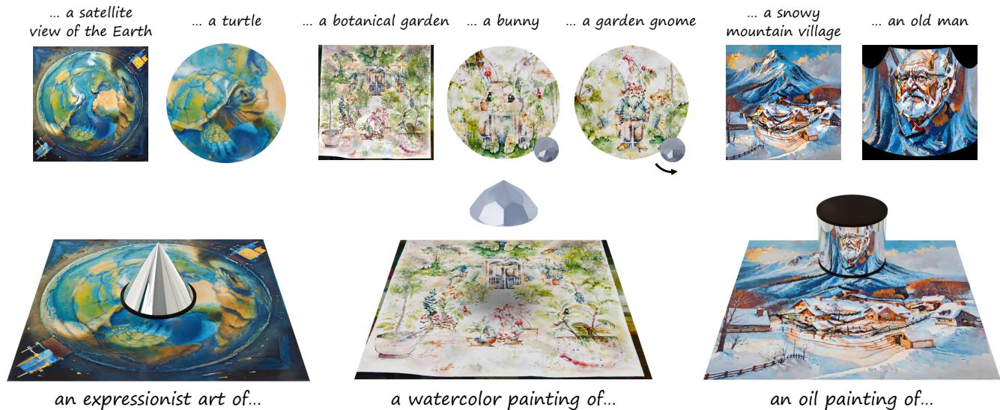  
Figure 1. We propose a method to generate ambiguous anamorphoses—images that reveal a hidden image when viewed through a mirro or lens. In the examples above, a conic mirror viewed from the top reveals a turtle hidden in an Earth image; a garden, seen through a lens, shows a bunny, and rotating the lens slightly reveals a gnome; a cylindrical mirror reflects a village painting into the face of an old man.

## Abstract

Anamorphosis refers to a category of images that are intentionally distorted, making them unrecognizable when viewed directly. Their true form only reveals itself when seen from a specific viewpoint, which can be through some catadioptric device like a mirror or a lens. While the construction of these mathematical devices can be traced back to as early as the 17th century [28], they are only interpretable when viewed from a specific vantage point and tend to lose meaning when seen normally. In this paper, we revisit these famous optical illusions with a generative twist. With the help of latent rectified flow models, we propose a method to create anamorphic images that still retain a valid interpretation when viewed directly. To this end, we introduce Laplacian Pyramid Warping, a frequency-aware image warping technique key to generating high-quality visuals. Our work extends Visual Anagrams [17] to latent space models and to a wider range ofspatial transforms, enabling the creation ofnovel generative perceptual illusions.

## 1. Introduction

Anamorphosis, derived from the Greek ana (“back” or “again”) and morphe (“form”), refers to a category of images that are deliberately distorted, rendering them unrecognizable when viewed directly. These optical illusions reveal their true form only when observed from a precise vantage point or through reflective or refractive surfaces, such as mirrors or lenses—objects collectively known as anamorphoscopes [23]. These mathematical curiosities became more popular since the 17th century, when the pioneering treatise by the French mathematician J.-F. Niceron,´ La Perspective Curieuse, laid the foundation for their rigorous construction [28]. However, these images are typically interpretable only from specific angles, losing their meaning when viewed normally.

In this paper, we propose a method for creating anamorphic images using latent text-to-image models. We focus on setups in which the image has a valid interpretation when viewed as-is without distortions. Our work is similar to the recent framework of Visual Anagrams proposed by Geng et al. [17], which generates ambiguous images by synchronizing diffusion paths across multiple views. However, their method is constrained to pixel-space diffusion models and limited to orthogonal transformations of image pixels. We address these two limitations in this paper. First, we enable the use of latent diffusion and flow models in an artifactfree manner, improving the generation quality. We believe this will render the generation of these illusions more accessible. Second, we introduce Laplacian Pyramid Warping, a robust image-warping technique that handles complex image transformations while preserving high-frequency details. This enables the generation of intricate anamorphoses involving complex reflective and refractive surfaces, with minimal sacrifice to image quality. Compared to previous work, our method demonstrates a significant boost in both the quality and expressiveness of the generated results.

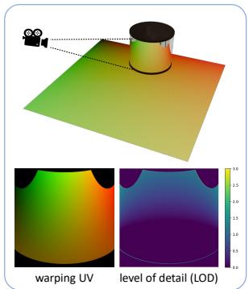  
(a)	View	generation

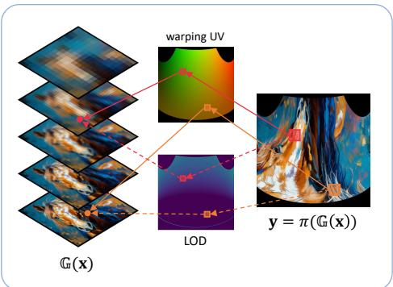  
(b)	Laplacian	Pyramid	Warping

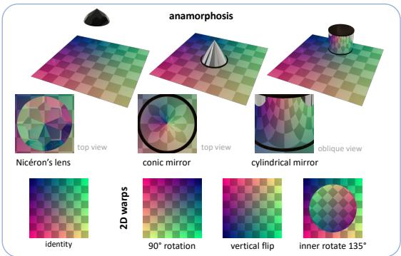  
(c)	Views	considered  
Figure 2. Laplacian Pyramid Warping. (a) The view mappings are generated using a ray tracer and the Level of Detail (LOD) map is computed. (b) For each pixel, our forward warping algorithm looks up in the warping UV mapping and LOD to fetch the corresponding value. (c) We consider different views, from 2D transformations like vertical flip and arbitrary angle rotation to complex 3D projections.

## 2. Related Work

Computational optical illusions. Anamorphosis can be dated back to around the 16th century [21, 28, 38], when artists either hand drew the illusions on paper or used grids to create them systematically. Since then, the generation of optical illusions has seen significant progress, especially with the advent of computational methods in recent years. Earlier work focuses on creating illusion with 2D images, such as revealing an image by stacking transparent sheets of images [27], achieving appearance change of images at different viewing distances [29], creating static images that appear to move [10], and designing a refractive lens for revealing a hidden image from dots [30]. Beyond image manipulation, several works explored 3D illusions. Hsiao et al. [20] introduced multi-view wire art, where a single 3D wireframe produces different projected images from various perspectives. Perroni-Scharf and Rusinkiewicz [31] extended this idea to 3D-printed view-dependent surfaces.

Apart from illusion based on 3D geometries, Chu et al. [11] explored camouflaging objects by retexturing them, while Chandra et al. [7] developed models that shift in perception based on lighting changes. In contrast, we focus on 2D illusions that require 3D objects to reveal the hidden views.

Illusions with diffusion models. Recent work has revealed the potential of diffusion models in creating optical illusions. Burgert et al. [3] employ score distillation sampling (SDS) to generate images that align with multiple prompts from different viewpoints. Although their optimization-based method can theoretically produce anamorphoses, it suffers from lower image quality and long inference times. Visual Anagrams [17] introduces a forma framework for illusion generation in a single diffusion pass. However, their approach is limited to orthogonal transformations, making it unsuitable for generating the complex deformations needed for anamorphoses. Subsequent studies have also explored various types of illusions, such as visually meaningful spectrograms [9] and generative hybrid images [16]. Our proposed method is most similar to Visual Anagrams. Key differences, however, are that we extend to latent space models and a broader range of transformations. A concurrent work, Illusion3D [15], builds on [3] to generate 3D anamorphic illusions, but appears constrained in quality and artistic flexibility. We outline the key differences with our method in the supplementary material.

Beyond academic research, the artistic community has also explored diffusion models for optical illusions. Notably, an anonymous artist known as MrUgleh [37] repurposed a model fine-tuned for generating QR codes [24, 43] to create images that subtly mimic the global structure of a specified template image. Our focus is on generating ambiguous images and anamorphoses based on text prompts, which does not require an image template.

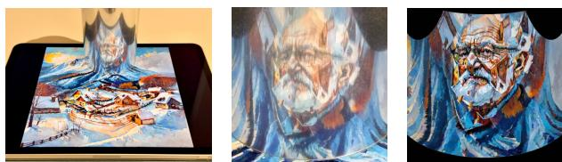  
Figure 3. A real life demo of the cylindrical mirror illusion.

Synchronized diffusion. In Visual Anagrams [17], diffusion paths from different viewpoints are synchronized by averaging the predicted noise at each timestep. Numerous studies have explored merging diffusion paths, often in the context of controlled image generation. MultiDiffusion [2] proposes a least-squares formulation for merging views, which simplifies to averaging in the special case of equalsize crops—a setup they apply to panorama generation. DiffCollage [44] synthesizes large-scale content by merging outputs from diffusion models trained on segments of the larger composition. SyncTweedies [22] thoroughly examines synchronization techniques, finding that averaging the predicted clean images yields the best quality. Closer to our approach, Generative Powers of Ten [39] creates infinite zoom videos by merging concentric views at different resolutions using Laplacian pyramids. But their method is tailored to the specific use case of zooming. One of our contributions, Laplacian Pyramid Warping, generalizes this approach to arbitrary views.

Image pyramids in vision and graphics. Image pyramids, particularly Gaussian and Laplacian pyramids, are widely used in computer vision for their multi-scale representation capabilities [4, 12, 41]. By decomposing images hierarchically, pyramids enable efficient compression, progressive image reconstruction, and seamless blending—essential in applications like panorama stitching and HDR imaging [5]. Beyond blending, Gaussian pyramids are central to scale-invariant object detection and recognition, where they assist in feature detection for algorithms like SIFT [25]. They are also valuable in texture analysis and synthesis [18], and optical flow estimation [33], where multi-scale representations enhance accuracy and reduce artifacts.

In computer graphics, pyramids relate closely to techniques like texture MIP-mapping [14] and antialiasing, which address the challenges of rendering textures at varying distances and viewing angles. MIP-maps, essentially a Gaussian pyramid form, allow graphics engines to select the appropriate level of detail (LOD) based on screen space, minimizing artifacts like flickering and enhancing both quality and efficiency. We repurpose these texture MIPmapping techniques in our proposed method for frequencyaware image warping.

## 3. Preliminaries

## 3.1. Text-conditioned Rectified Flows

In Rectified Flows (RFs), a noise sample ${ \bf z } _ { 0 } \sim \mathcal { N } ( { \bf 0 } , { \bf I } )$ is mapped to an image $\mathbf { z } _ { 1 } \sim p _ { 1 }$ through the ODE:

$$
d \mathbf { z } _ { t } = { \pmb { u } } _ { t } ( \mathbf { z } _ { t } , y ) d t ,\tag{1}
$$

where $t \in [ 0 , 1 ] ,$ , y is an optional text prompt conditioning, and the velocity field is typically parameterized with a neural network, $i . e . \ { \pmb u } _ { t } ( { \bf z } _ { t } , y ) = { \pmb u } _ { \theta } ( { \bf z } _ { t } ; t , y )$ . At inference, the ODE is discretized, and solved with classical integration schemes such as forward Euler:

$$
\begin{array} { r } { { \bf z } _ { t + \Delta t } = { \bf z } _ { t } + { \pmb u } _ { \theta } ( { \bf z } _ { t } ; t , y ) \Delta t , } \end{array}\tag{2}
$$

Classifier-free guidance (CFG). As in diffusion models, classifier-free guidance [19] can be used to improve sample quality in RFs. The final velocity interpolates between a text-conditioned and an unconditional prediction:

$$
\begin{array} { r } { \hat { \mathbf { u } } _ { t } = ( 1 + \omega ) \mathbf { u } _ { \theta } ( \mathbf { z } _ { t } ; t , y ) - \omega \mathbf { u } _ { \theta } ( \mathbf { z } _ { t } ; t , \mathcal { D } ) , } \end{array}\tag{3}
$$

where $\omega$ is the classifier-free guidance scale. Higher guidance scales typically improve sample quality at the expense of diversity, but also tend to produce over-saturated images.

Predicted clean image. At any intermediate timestep t, an estimate of the clean image, denoted $\mathbf { z } _ { 1 \mid t } ,$ can be obtained by a single Euler step to $t \ = \ 1$ using the current velocity estimate:

$$
\begin{array} { r } { \mathbf { z } _ { 1 | t } = \mathbf { z } _ { t } + { \mathbf { u } } _ { \theta } ( \mathbf { z } _ { t } ; t , y ) ( 1 - t ) . } \end{array}\tag{4}
$$

Equation (4) can be seen as the flow matching equivalent of the Tweedie’s formula [34] in diffusion models.

## 3.2. Gaussian & Laplacian Pyramid

A Gaussian pyramid is a multi-scale representation of an image obtained by iteratively applying a Gaussian blur kernel κ and downsampling $\mathbf { D } ( \cdot )$ . Given an image x, the image $\mathbb { G } _ { l }$ at level l is computed from the previous level as

$$
\mathbb { G } _ { l } ( \mathbf { x } ) = \mathbf { D } ( \kappa ( \mathbb { G } _ { l - 1 } ( \mathbf { x } ) ) ) ,
$$

where $\mathbb { G } _ { 0 } ( \mathbf { x } ) = \mathbf { x }$ is the original image.

A Laplacian pyramid stores the high-frequency details between each level of a Gaussian pyramid. Each Laplacian level \mathb L\_l is defined as the difference between a Gaussian level and the upsampled version of the next level

$$
\mathbb { L } _ { l } ( \mathbf { x } ) = \mathbb { G } _ { l } ( \mathbf { x } ) - \mathbf { U } \big ( \mathbb { G } _ { l + 1 } ( \mathbf { x } ) \big ) ,
$$

with $\mathbb { L } _ { L - 1 } ( \mathbf { x } ) = \mathbb { G } _ { L - 1 } ( \mathbf { x } )$ for a pyramid of depth L and $\mathbf { U } ( \cdot )$ being the upsample operator. To reconstruct the image, we recursively add each Laplacian level back to the upsampled version of the next level.

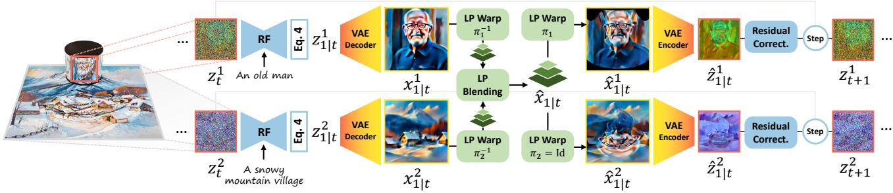  
Figure 4. Our Proposed Pipeline. At each denoising step, the estimated final image is computed from the network velocity estimate and decoded into image space. Image warping and view aggregation is performed in image space using Laplacian pyramids, before encoding back into latent space for the diffusion step.

## 3.3. Visual Anagrams

The work of Geng et al. [17] proposes creating multi-view images by using a text-to-image generative model to simultaneously denoise multiple views of an image. The original paper utilizes diffusion models. We summarize the method here through the terminologies of RFs for simplicity.

A canonical space C is defined for an image. A set of prompts y are associated with different view functions $\pi _ { i } ,$ which transform the image from the canonical space to the target space T where rectified flow models are applied. At each timestep of the inference, $ { \mathbf { z } } _ { t } ^ { i }$ of each view is transformed into the canonical space, and averaged together with the other views. After averaging, the noisy images in the canonical space are transformed back to the target space as $\hat { \mathbf { z } } _ { t } ^ { i } .$ , replacing the original $ { \mathbf { z } } _ { t } ^ { i }$ as

$$
\hat { \mathbf { z } } _ { t } ^ { i } = \pi _ { i } \left( \frac { 1 } { N } \sum _ { j } \pi _ { j } ^ { - 1 } \left( \mathbf { z } _ { t } ^ { j } \right) \right) .\tag{5}
$$

Transforming noisy samples, as in Geng et al. [17], limits possible mappings between the canonical and target spaces to be orthogonal transformations such as flipping, rotation and permutation of pixels. This happens since arbitrarily warping a noise sample is generally more difficult than warping images, as bilinear and bicubic interpolations can destroy the Gaussian noise properties [8]. Moreover, SyncTweedies [22] showed that averaging the predicted clean image $\mathbf { z } _ { 1 \mid t } ^ { i } ,$ instead of noisy samples, produces higher quality results. Thus, to allow more general transformations and improve generation quality, we modify Equation (5) to average predicted clean image using Tweedie’s formula as

$$
\hat { \mathbf { z } } _ { 1 | t } ^ { i } = \pi _ { i } \left( \frac { 1 } { N } \sum _ { j } \pi _ { j } ^ { - 1 } \left( \mathbf { z } _ { 1 | t } ^ { j } \right) \right) .\tag{6}
$$

## 4. Generative Anamorphosis

Our goal is to generate high-quality anamorphoses from text prompts. Anamorphoses involve view functions beyond simple transformations such as rotation, flipping and pixel permutations where no analytical transformations can be defined. We opt for a more general representation: π is now a 2-channel image of UV coordinates indicating where to fetch values in the canonical view for each pixe $\pi ( x , y ) = ( u , v )$ . We implement the transformation with a simple raytracer by placing a UV coordinate texture on the main image plane, and rendering the result when viewing through mirrors or lenses (see Figure 2).

Simply adopting SyncTweedies [22], however, is not enough when considering latent diffusion models. Thus, in Section 4.1, we present a generalization of previous approaches to latent diffusion models. Naively averaging arbitrary transformations with highly distorted regions, typical when looking through curved mirrors or lenses, results in visual artifacts. We introduce a novel Laplacian Image Warping method that utilizes a multi-level texture structure inspired by classic works in computer graphics [12, 41] in Section 4.2 to alleviate this problem. Additional design choices are then discussed in Section 4.3. Figure 4 and Algorithm 1 show an overview of our method.

## 4.1. Latent Visual Anagrams

Tancik [36] generates multi-view illusions with Stable Diffusion 1.5 [35] using a similar pipeline to Geng et al. [17]. Images are transformed to canonical space through views in the latent space, and decoded to the clean image after the denoising process is finished. The results contain visual artifacts due to the fact that VAEs for latent diffusion and flow models are generally not trained to be equivariant. When the latent images are deformed, the corresponding decoded image does not necessarily share the same transformation. While these artifacts are less pronounced in recent models with larger latent spaces (e.g. Stable Diffusion 3 [13]), they still persist and create undesirable strokes (see Figure 5).

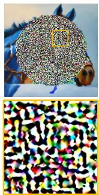  
Geng et al.

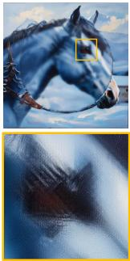

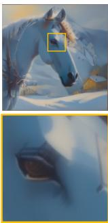  
+ Final Estimate

+ VAE  
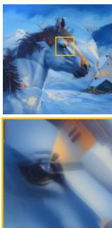  
+ Residual Corr.

Figure 5. Latent Visual Anagrams. In this $1 3 5 ^ { \circ }$ rotation example, we demonstrate that contributions from Sec. 4.1 improve the generation of visual anagrams with latent models. While the final estimate from SyncTweedies [22] partially addresses noise issues, artifacts from the VAE persist. Our VAE encoding/decoding process and residual correction further enhance image quality.

VAE encoding/decoding. To tackle this issue, we propose to keep all image transformations in image space. This is done by decoding the estimated clean image latent to pixel space, applying the transformation, and re-encoding it to latent space. Denoting E, D the encoder and decoder of the VAE respectively, our estimated clean latent at timestep t, in view i, becomes

$$
\hat { \mathbf { z } } _ { 1 | t } ^ { i } = \mathcal { E } \circ \pi _ { i } \left( \frac { 1 } { N } \sum _ { j } \pi _ { j } ^ { - 1 } \circ \mathcal { D } \left( \mathbf { z } _ { 1 | t } ^ { j } \right) \right) .\tag{7}
$$

Residual correction. While Eq. (7) proved to be effective in removing the artifacts, we observed that it can be sensitive to the VAE reconstruction quality. In particular, when the input latent is far from the training distribution of the VAE (e.g. predicted clean image from early steps of denoising), the reconstruction typically fails to match the value range of the input. This creates washed-out colors in the final image. We correct the reconstruction failure through a first-order term $\Delta \hat { \mathbf { z } } _ { 1 \mid t } ^ { i }$ . This is done by first computing the residual between the latent and the decoded-encoded latent. This residual is then transformed to a target view as

$$
\Delta \hat { \mathbf { z } } _ { 1 \mid t } ^ { i } = \pi _ { i } \left( \frac { 1 } { N } \sum _ { j } \pi _ { j } ^ { - 1 } \left( \mathbf { z } _ { 1 \mid t } ^ { j } - \mathcal { E } \circ \mathcal { D } \left( \mathbf { z } _ { 1 \mid t } ^ { j } \right) \right) \right)\tag{8}
$$

This correction term is then added to Eq. (7) as the $\mathrm { f i - }$ nal estimated clean latent. The correction has two nice properties. First, if the VAE reconstruction is perfect, then $\mathcal { E } ( \mathcal { D } ( { \mathbf { z } } ) ) = { \mathbf { z } } .$ and $\Delta \mathbf { z } = 0$ . Therefore, no correction is done. Second, when there is only one single identity view $( N = 1 )$ , we recover $\hat { \mathbf { z } } _ { 1 \mid t } ^ { j } = \mathbf { z } _ { 1 \mid t } ^ { j } .$ , the original predicted clean latent, as expected. Figure 5 compares different steps presented in this section, and shows the effectiveness of the residual correction in maintaining the vibrant colors.

## 4.2. Laplacian Pyramid Warping (LPW)

While the above modifications enable using latent diffusion and flow models for creating ambiguous images with arbitrary 2D transformations, applying it to the generation of anamorphoses still presents a few challenges. First, a view in anamorphosis rarely covers the entirety of the main image. As such, boundaries can create visible artifacts and seams that are undesirable. Second, having views that have varying degrees of stretching can lead to degraded high frequency details (see Figure 6).

We identify the key problem being using the averaging operation as aggregation of views. When images of different views are transformed to the canonical view, they can have different frequency components. One view may map to a small pixel subset in the canonical view or undergo large stretching. Averaging pixels of these views with another view not stretched so much ignores the frequency mismatching problem. To solve this problem, we propose to use Laplacian pyramid [6] for blending the views.

After decoding the predicted clean latent, Inverse Laplacian Warping $\pi ^ { - 1 }$ is used to map the image to a Laplacian pyramid in the canonical view. The canonical views are then aggregated through Laplacian Pyramid Blending. Afterwards, the canonical views are transformed back to images through Forward Laplacian Warping π.

Forward Laplacian Warping. Given an image x and a view projection π, we propose a Level-of-Detail-Aware (LOD-aware) method to compute $\begin{array} { r l r } { { \bf y } } & { { } = } & { \pi ( { \bf x } ) } \end{array}$ First, we build a Gaussian pyramid from our image $\mathbb { G } ( \mathbf { x } ) \ =$ $\{ \mathbb { G } _ { 0 } ( \mathbf { x } ) , . . . , \mathbb { G } _ { L - 1 } ( \mathbf { x } ) \}$ . Then, we compute a LOD level map using π and image-space derivatives. For a given pixel $( x , y )$ , the LOD level is given by:

$$
\begin{array} { r } { l = \log _ { 2 } \left( \operatorname* { m a x } \left( \sqrt { \left( \frac { \partial u } { \partial x } \right) ^ { 2 } + \left( \frac { \partial u } { \partial y } \right) ^ { 2 } } , \sqrt { \left( \frac { \partial v } { \partial x } \right) ^ { 2 } + \left( \frac { \partial v } { \partial y } \right) ^ { 2 } } \right) \right) . } \end{array}\tag{9}
$$

The transformed image is obtained by sampling the pyramid $\mathbb { G } ( \mathbf { x } )$ with the LOD map using nearest or trilinear interpolation. This approach is commonly used in computer graphics when rendering textures to avoid aliasing. Our contribution lies in connecting the method to our problem and repurposing the idea for image warping. For clarity, we simplify the equation as $\mathbf { y } = \pi ( \mathbb { G } ( \mathbf { x } ) )$ ).

Inverse Laplacian Warping. To transform an image y, into a Laplacian pyramid in the canonical view $\mathbb { G } ( \mathbf { x } ) \mathbf { \Psi } =$ $\pi ^ { - 1 } ( \mathbf { y } )$ , we define the inverse Laplacian warping operation. $\mathbf { A } \mathbf { s }$ inverting an arbitrarily complex image transformation is infeasible, we make use of the gradient of Forward Laplacian Warping. Consider a dummy zero image $\mathbf { x } ^ { 0 } = \mathbf { 0 }$ , our inverted image pyramid is given by:

$$
\mathbb { G } ( \mathbf { x } ) = - \nabla _ { \mathbf { x } ^ { 0 } } \left[ \frac { 1 } { 2 } \| \boldsymbol { \pi } ( \mathbf { x } ^ { 0 } ) - \mathbf { y } \| ^ { 2 } \right] .\tag{10}
$$

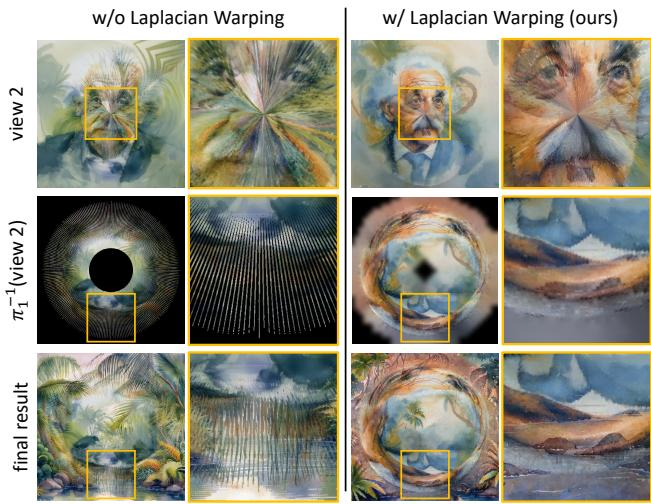  
Figure 6. Inverse Laplacian Warping. In this conic mirror example, we use a challenging pair of prompts to demonstrate our inverse warping. The main view shows “a jungle,” while the mirror view reveals ${ } ^ { * } a$ portrait of Einstein.” Without inverse Laplacian warping, gaps from the inverse transformation cause striped artifacts and distortions. Our Inverse Laplacian Warping (Sec. 4.2) correctly assigns values at the right frequencies, eliminating artifacts and making the mirror view more recognizable.

This effectively transports the pixels in y to the corresponding location and level in the pyramid. We then propagate the changes of lower levels to higher ones, and extract a Laplacian pyramid out of the resulting pyramid. More details can be found in the supplementary material.

Laplacian Pyramid Blending is used for aggregating different canonical views to obtain a synchronized image for the given denoising step. Each level is averaged and the final image is reconstructed from the resulting Laplacian pyramid. In the case of anamorphic illusions, most views will only cover the identity space partially, so the blending is weighted by a set of masks at each level. Special care need to be taken at the boundary of the masks, as well as during averaging, which we further discuss in the supplementary material.

## 4.3. Design Choices & Further Improvements

Model choice. Our method is designed to work with latent rectified flow and diffusion models. However, we observed that different models behave differently to our synchronization scheme, which we discuss in the supplementary. For the majority of our experiments, we use Stable Diffusion 3.5 because of their higher visual quality.

Improved consistency with time travel. Similar to DDNM [40], RePaint [26] and Bansal et al. [1], we found repeating segments of the denoising process allows the model to blend different views better. To keep the inference efficient, similar to FreeDoM [42], we only apply time traveling at intermediate timesteps between 20% and 80% of the denoising process and use segments of size 1.

Algorithm 1: LookingGlass   
Input: $\overline { { \forall i \in 0 , . . . , N - 1 } } \mathrm { : }$ view transformations $\pi _ { i }$   
and text prompts yi, with N being the   
number of views. Pretrained RF model uθ.   
Output: Final images in each view $\mathbf { x } _ { 1 } ^ { 0 } , . . . , \mathbf { x } _ { 1 } ^ { N - 1 }$   
1 $\mathbf { z } _ { 0 } ^ { 0 } , . . . , \mathbf { z } _ { 0 } ^ { N - 1 } \sim \mathcal { N } ( 0 , I )$   
2 for $t \gets 0 : T$ do   
3 for $i \gets 0 : N - 1$ do   
4 $\mathbf { z } _ { 1 | t } ^ { i }  \mathbf { z } _ { t } ^ { i } + { \mathbf { \delta } } u _ { \theta } ( \mathbf { z } _ { t } ^ { i } ; t , y ) ( 1 - t )$ \triangleright Eq. (4)   
5 $\mathbf { x } _ { 1 \mid t } ^ { i } \gets \mathbf { V } \mathbf { A } \mathbf { E }$ DECODE $( \mathbf { z } _ { 1 \mid t } ^ { i } )$   
6 $\Delta \mathbf { \dot { z } } _ { 1 | t } ^ { i } \gets \mathbf { z } _ { 1 | t } ^ { i } - \mathbf { V } \mathrm { A E . E N C O D E } \left( \mathbf { x } _ { 1 | t } ^ { i } \right)$   
7 end   
8 $\hat { \mathbf { x } } _ { 1 | t } \gets \mathrm { L A }$ PLACIAN BLENDING   
$( \dot { \pi } _ { 0 } ^ { - 1 } ( \mathbf { x } _ { 1 | t } ^ { 0 } ) , . . . , \pi _ { N - 1 } ^ { - 1 } ( \mathbf { x } _ { 1 | t } ^ { N - 1 } ) )$   
9 $\Delta \hat { \mathbf { z } } _ { 1 \mid t } \gets \mathrm { I }$ APLACIAN BLENDING   
$( \pi _ { 0 } ^ { - 1 } ( \Delta \mathbf { z } _ { 1 | t } ^ { 0 } ) , . . . , \pi _ { N - 1 } ^ { - 1 } ( \Delta \mathbf { z } _ { 1 | t } ^ { N - 1 } ) )$   
10 for $i \gets 0 : N - 1$ do   
11 $\hat { \mathbf { x } } _ { 1 | t } ^ { i }  \pi _ { i } ( \hat { \mathbf { x } } _ { 1 | t } )$   
12 $\hat { \mathbf { z } } _ { 1 | t } ^ { i } \gets \mathrm { V A E }$ ENCODE $( \hat { \mathbf { x } } _ { 1 \mid t } ^ { i } )$ \triangleright Eq. (7)   
13 $\Delta \hat { { \mathbf z } } _ { 1 \mid t } ^ { i } \gets \pi _ { i } \left( \Delta \hat { { \mathbf z } } _ { 1 \mid t } \right)$ \triangleright Eq. (8)   
14 $\hat { \mathbf { z } } _ { 1 | t } ^ { i } \gets \hat { \mathbf { z } } _ { 1 | t } ^ { i } + \Delta \hat { \mathbf { z } } _ { 1 | t } ^ { i }$   
15 $\left( \hat { \mathbf { z } } _ { 1 \mid t } ^ { i } , \mathbf { z } _ { t } ^ { i } \right)$   
16 end   
17 end   
18 $\{ \mathbf { x } _ { 1 } ^ { i } \} _ { i } \gets \mathbf { V } \mathrm { A E }$ DECODE $\left( \{ { \bf z } _ { T } ^ { i } \} _ { i } \right)$   
return $\mathbf { x } _ { 1 } ^ { 0 } , . . . , \mathbf { x } _ { 1 } ^ { N - 1 }$

Prioritizing a single view. We observed that a key component to the success of previous works [3, 17, 36] lies in the fact that generated images generally lack detail. This makes it easier for human imagination to interpret image features differently based on different prompts. With latent flow models, our method generates highly detailed images at 1K resolution. This poses a new challenge, as highfrequency details are rarely compatible between the views and easily give away hidden views. As this is an inherent problem with high resolution images, we propose to prioritize one of the views, which is defined by the user. We set a portion of the last timesteps of the denoising process to be solely denoising for the chosen view. This encourages the model to create coherent details towards the end, while hiding the remaining views better.

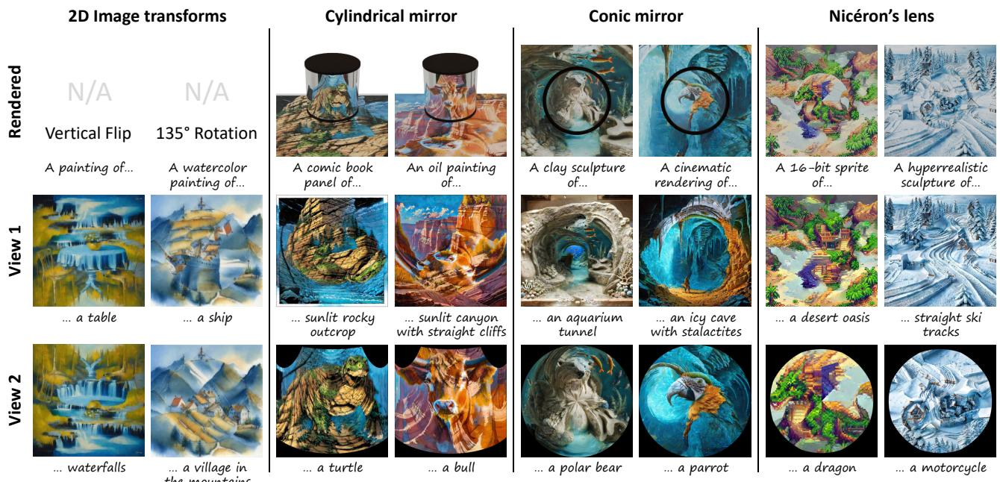  
Figure 7. Generative Anamorphoses. Generated results with our approach for 2D transformations, and the three types of anamorphoses: a cylindrical mirror, a conic mirror, and Niceron’s lens. A rendering of the physical setup is shown in the top row when applicable.´

## 5. Experiments

## 5.1. Views Considered

In this section we briefly describe the views considered for generating illusions, which are shown in Figure 2 (c).

• 2D transforms. As in Visual Anagrams [17], we generate vertical flip and 90◦ rotation illusions. Since our method can handle arbitrary view projections, we also create optical illusions involving 135◦ rotations.

• Mirror cone. A conic mirror placed at the center of an image reveals a hidden picture when viewed from the top.

• Mirror cylinder. A cylindrical mirror located over an image shows a hidden picture when viewed from an angle.

• Niceron’s lens. ´ We replicate the setting described by Niceron [ ´ 28]. Given an image, and looking at it through a lens sculpted with polygonal faces, the irregular refraction will generate novel images.

Note that in our examples, we always set one view as the identity view (i.e. the canonical view), but this is not required. Transforms πi can be defined relative to a canonical space C without explicitly specifying the latter.

## 5.2. Quantitative Results

We compare our method quantitatively with Visual Anagrams [17], Diffusion Illusions [3], SyncTweedies [22], and Tancik [36]. Following Geng et al., CLIP is used [32] to measure the alignment score A and the concealment score C. We generate 50 pairs of prompts and create images for these prompts using standard denoising (no optical illusion), as well as with our method. The results are reported in Table 1 for three tasks: simple vertical flip, a more complex 135◦ rotation, and the cylindrical mirror anamorphosis. Our results are generated with Stable Diffusion 3.5 Medium on a Nvidia GeForce RTX 4090 GPU. Using 30 inference steps, with time-traveling between 20% and 80% of the diffusion process repeated twice, we generate an image pair in approximately 80 seconds.

<table><tr><td></td><td>Method</td><td>A↑</td><td>A0.9 ↑</td><td>C↑</td><td>C0.9 ↑</td><td>FID↓</td><td>KID↓</td></tr><tr><td rowspan="5">Vertical Flip</td><td>Geng et al. [17]</td><td>0.306</td><td>0.340</td><td>0.695</td><td>0.786</td><td>149.24</td><td>0.057</td></tr><tr><td>Tancik SD 3.5 [36]</td><td>0.306</td><td>0.349</td><td>0.693</td><td>0.806</td><td>132.52</td><td>0.049</td></tr><tr><td>Burgert et al. [3]</td><td>0.281</td><td>0.324</td><td>0.679</td><td>0.778</td><td>219.84</td><td>0.115</td></tr><tr><td>SyncTweedies [22]</td><td>0.302</td><td>0.341</td><td>0.707</td><td>0.801</td><td>132.62</td><td>0.054</td></tr><tr><td>LookingGlass (ours)</td><td>0.297</td><td>0.338</td><td>0.680</td><td>0.779</td><td>124.67</td><td>0.049</td></tr><tr><td rowspan="5">135° Rotation</td><td>Geng et al. [17]</td><td>0.262</td><td>0.308</td><td>0.563</td><td>0.652</td><td>293.00</td><td>0.254</td></tr><tr><td>Tancik SD 3.5 [36]</td><td>0.194</td><td>0.216</td><td>0.498</td><td>0.509</td><td>439.35</td><td>0.545</td></tr><tr><td>Burgert et al. [3]</td><td>0.280</td><td>0.326</td><td>0.654</td><td>0.760</td><td>223.21</td><td>0.120</td></tr><tr><td>SyncTweedies [22]</td><td>0.283</td><td>0.335</td><td>0.647</td><td>0.753</td><td>166.03</td><td>0.083</td></tr><tr><td>LookingGlass (ours)</td><td>0.295</td><td>0.338</td><td>0.666</td><td>0.767</td><td>129.74</td><td>0.055</td></tr><tr><td rowspan="5">Cylindrical Mirror</td><td>Geng et al. [17]</td><td>0.171</td><td>0.198</td><td>0.506</td><td>0.546</td><td>285.23</td><td>0.216</td></tr><tr><td>Tancik SD 3.5 [36]</td><td>0.171</td><td>0.198</td><td>0.505</td><td>0.547</td><td>284.97</td><td>0.215</td></tr><tr><td>Burgert et al. [3]</td><td>0.261</td><td>0.304</td><td>0.706</td><td>0.795</td><td>229.65</td><td>0.138</td></tr><tr><td>SyncTweedies [22]</td><td>0.241</td><td>0.284</td><td>0.673</td><td>0.763</td><td>138.69</td><td>0.082</td></tr><tr><td>LookingGlass (ours)</td><td>0.272</td><td>0.318</td><td>0.698</td><td>0.810</td><td>130.27</td><td>0.070</td></tr></table>

Table 1. Quantitative Comparison. Sample quality is assessed with FID/KID against a reference dataset of 3.2k images generated from the same set of prompts. Image-prompt alignment is assessed using CLIP alignment score A, and concealment score C introduced in [17]. While all methods achieve comparable results for the vertical flip, LookingGlass surpasses previous approaches on more complex transformations, including anamorphoses. Please see the supplementary material for more quantitative evaluations.

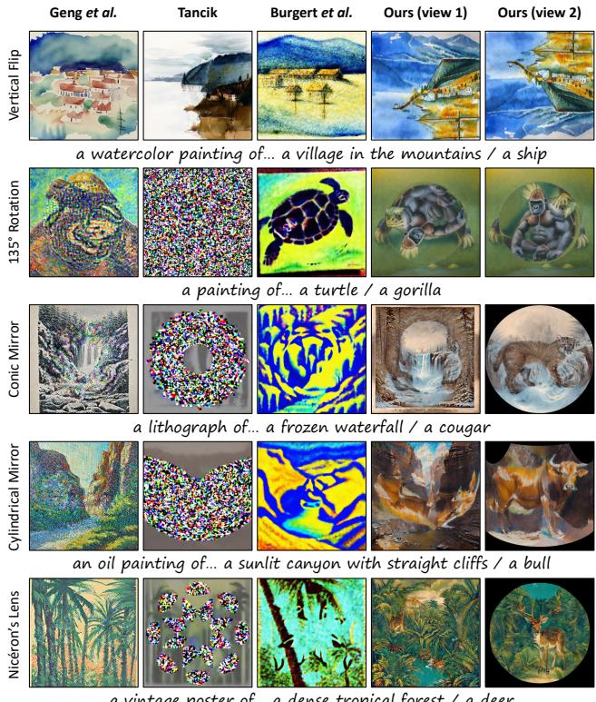  
Figure 8. Qualitative Comparison. We compare our method against prior work for the considered views (Sec. 5.1). Note that all transformations except the vertical flip are not supported by Geng et al. [17] and Tancik [36] due to their inherent limitations.

## 5.3. Ablations

We perform an ablation of the proposed approach. Figure 5 shows that warping the clean image estimate significantly improves image quality compared to warping the predicted noise. Additionally, the proposed VAE encoding/decoding and latent residual correction enhance detail preservation and reduce reconstruction errors. Table 2 suggests that time traveling improves visual quality, as reflected by the FID metric, but may lead to reduced prompt alignment. Further qualitative ablations on time traveling and the effects of prioritizing a single view can be found in the Appendix.

<table><tr><td></td><td>A↑</td><td>A0.9 ↑</td><td>C↑</td><td>C0.9 ↑</td><td>FID↓</td><td>KID↓</td></tr><tr><td>Geng et al. SD 3 [17]</td><td>0.219</td><td>0.249</td><td>0.516</td><td>0.571</td><td>335.24</td><td>0.297</td></tr><tr><td>+ Final Estimate (Eq. 4)</td><td>0.273</td><td>0.320</td><td>0.657</td><td>0.757</td><td>171.61</td><td>0.106</td></tr><tr><td>+ VAE (Sec. 4.1)</td><td>0.293</td><td>0.333</td><td>0.717</td><td>0.814</td><td>160.17</td><td>0.083</td></tr><tr><td>+ LPW (Sec. 4.2)</td><td>0.300</td><td>0.336</td><td>0.723</td><td>0.814</td><td>153.27</td><td>0.074</td></tr><tr><td>+ Time Travel (Sec. 4.3)</td><td>0.295</td><td>0.331</td><td>0.716</td><td>0.816</td><td>150.01</td><td>0.074</td></tr></table>

Table 2. Ablation Study. Starting from the baseline of Geng et al. [17], we ablate the contributions introduced by our approach. We also show the 90th-percentile of the CLIP-based metrics, as we are interested in the best case performance.

## 5.4. Qualitative Results

Figures 8 and 7 show example images generated using our method in combination with Stable Diffusion 3.5. Figure 3 features a real-life demonstration of the cylindrical example, confirming that the generated results function as intended in practice. Additional results for all three types of anamorphoses are provided in the Appendix. These results are selected from a set of curated prompts that worked best, as not all prompt combinations are expected to work well.

## 5.5. User Study

We conducted a user study with 27 participants. A total of 10 prompt pairs, the same for all three types of illusions, were selected to generate results using different methods, with the same random seed (no hand-picked samples). Participants ranked the samples from 1 (best) to 5 (worst) based on prompt fidelity, style adherence and overall visual quality. The results are reported in Figure 9.

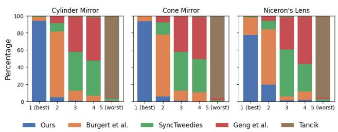  
Figure 9. User Study. A survey of 27 participants shows that our method (blue) is consistently preferred to prior works.

## 6. Conclusion and Discussion

We presented LookingGlass, a method for generating highquality, ambiguous anamorphic illusions with latent RF models. Our contributions are twofold. First, we extended Geng et al. [17] to latent space models without introducing artifacts, enabling the first feed-forward generation of highquality illusions with common models. This makes illusion generation more accessible and allows for possible integration with modern generative techniques like ControlNet and DreamBooth. Second, we introduced Laplacian Pyramid Warping (LPW), a warping method that preserves fine details while handling extreme distortions. While essential for illusion generation, LPW is also compatible with pixel diffusion models and has potential applications in generative mesh texturing and panorama synthesis.

Despite these advances, selecting effective prompts remains a challenge, as not all prompts lead to high-quality illusions. Additionally, while our method is significantly more efficient than optimization-based approaches like Burgert et al. [3], it is computationally more expensive than Geng et al. [17] due to the VAE intermediate steps. We leave this to future work.

## References

[1] Arpit Bansal, Hong-Min Chu, Avi Schwarzschild, Soumyadip Sengupta, Micah Goldblum, Jonas Geiping, and Tom Goldstein. Universal guidance for diffusion models. In Proceedings of the IEEE/CVF Conference on Computer Vision and Pattern Recognition, pages 843–852, 2023. 6

[2] Omer Bar-Tal, Lior Yariv, Yaron Lipman, and Tali Dekel. Multidiffusion: Fusing diffusion paths for controlled image generation. arXiv preprint arXiv:2302.08113, 2023. 3

[3] Ryan Burgert, Xiang Li, Abe Leite, Kanchana Ranasinghe, and Michael Ryoo. Diffusion illusions: Hiding images in plain sight. In ACM SIGGRAPH 2024 Conference Papers, New York, NY, USA, 2024. Association for Computing Machinery. 2, 6, 7, 8

[4] P. Burt and E. Adelson. The laplacian pyramid as a compact image code. IEEE Transactions on Communications, 31(4): 532–540, 1983. 3

[5] Peter J. Burt and Edward H. Adelson. A multiresolution spline with application to image mosaics. ACM Trans. Graph., 2(4):217–236, 1983. 3

[6] Peter J Burt and Edward H Adelson. The laplacian pyramid as a compact image code. In Readings in computer vision, pages 671–679. Elsevier, 1987. 5

[7] Kartik Chandra, Tzu-Mao Li, Joshua Tenenbaum, and Jonathan Ragan-Kelley. Designing perceptual puzzles by differentiating probabilistic programs. In Special Interest Group on Computer Graphics and Interactive Techniques Conference Proceedings (SIGGRAPH ’22 Conference Proceedings), 2022. 2

[8] Pascal Chang, Jingwei Tang, Markus Gross, and Vinicius C. Azevedo. How i warped your noise: a temporally-correlated noise prior for diffusion models. In The Twelfth International Conference on Learning Representations, 2024. 4

[9] Ziyang Chen, Daniel Geng, and Andrew Owens. Images that sound: Composing images and sounds on a single canvas. Neural Information Processing Systems (NeurIPS), 2024. 2

[10] Ming-Te Chi, Tong-Yee Lee, Yingge Qu, and Tien-Tsin Wong. Self-animating images: Illusory motion using repeated asymmetric patterns. ACM Transactions on Graphics (SIGGRAPH 2008 issue), 27(3):62:1–62:8, 2008. 2

[11] Hung-Kuo Chu, Wei-Hsin Hsu, Niloy J. Mitra, Daniel Cohen-Or, Tien-Tsin Wong, and Tong-Yee Lee. Camouflage images. ACM Trans. Graph., 29(4), 2010. 2

[12] James H. Clark. Hierarchical geometric models for visible surface algorithms. Commun. ACM, 19(10):547–554, 1976. 3, 4

[13] Patrick Esser, Sumith Kulal, Andreas Blattmann, Rahim Entezari, Jonas Muller, Harry Saini, Yam Levi, Dominik¨ Lorenz, Axel Sauer, Frederic Boesel, et al. Scaling rectified flow transformers for high-resolution image synthesis. In Forty-first International Conference on Machine Learning, 2024. 4

[14] Jon P Ewins, Marcus D Waller, Martin White, and Paul F Lister. Mip-map level selection for texture mapping. IEEE Transactions on Visualization and Computer Graphics, 4(4): 317–329, 1998. 3

[15] Yue Feng, Vaibhav Sanjay, Spencer Lutz, Badour AlBahar, Songwei Ge, and Jia-Bin Huang. Illusion3d: 3d multiview illusion with 2d diffusion priors. 2024. 2

[16] Daniel Geng, Inbum Park, and Andrew Owens. Factorized diffusion: Perceptual illusions by noise decomposition. In European Conference on Computer Vision (ECCV), 2024. 2

[17] Daniel Geng, Inbum Park, and Andrew Owens. Visual anagrams: Generating multi-view optical illusions with diffusion models. In Conference on Computer Vision and Pattern Recognition (CVPR), 2024. 1, 2, 3, 4, 6, 7, 8

[18] David J. Heeger and James R. Bergen. Pyramid-based texture analysis/synthesis. In Proceedings of the 22nd Annual Conference on Computer Graphics and Interactive Techniques, page 229–238, New York, NY, USA, 1995. Association for Computing Machinery. 3

[19] Jonathan Ho and Tim Salimans. Classifier-free diffusion guidance. arXiv preprint arXiv:2207.12598, 2022. 3

[20] Kai-Wen Hsiao, Jia-Bin Huang, and Hung-Kuo Chu. Multi view wire art. ACM Trans. Graph., 37(6), 2018. 2

[21] Baltrusaitis Jurgis and WJ Strachan. Anamorphic Art. Abrams, New York, 1977. 2

[22] Jaihoon Kim, Juil Koo, Kyeongmin Yeo, and Minhyuk Sung. Synctweedies: A general generative framework based on synchronized diffusions. arXiv:2403.14370, 2024. 3, 4, 5, 7

[23] Philip Kuchel. Anamorphoscopes: A visual aid for circle inversion. The Mathematical Gazette, 63:82, 1979. 1

[24] Monster Laabs. Controlnet qr code monster v2 for sd-1.5, 2023. 2

[25] David G Lowe. Distinctive image features from scaleinvariant keypoints. International journal of computer vision, 60:91–110, 2004. 3

[26] Andreas Lugmayr, Martin Danelljan, Andres Romero, Fisher Yu, Radu Timofte, and Luc Van Gool. Repaint: Inpainting using denoising diffusion probabilistic models. In Proceedings of the IEEE/CVF conference on computer vision and pattern recognition, pages 11461–11471, 2022. 6

[27] Mizuho Nakajima and Yasushi Yamaguchi. Picture illusion by overlap. In ACM SIGGRAPH 2004 Posters, page 56. 2004. 2

[28] Jean Franc¸ois Niceron. La perspective curieuse. P. Billaine, Paris, 1638. 1, 2, 7

[29] Aude Oliva, Antonio Torralba, and Philippe G. Schyns. Hybrid images. In ACM SIGGRAPH 2006 Papers, page 527–532, New York, NY, USA, 2006. Association for Com puting Machinery. 2

[30] Marios Papas, Thomas Houit, Derek Nowrouzezahrai, Markus Gross, and Wojciech Jarosz. The magic lens: Refractive steganography. ACM Transactions on Graphics (Proceedings ofSIGGRAPH Asia), 31(6), 2012. 2

[31] Maxine Perroni-Scharf and Szymon Rusinkiewicz. Con structing printable surfaces with view-dependent appearance. In ACM SIGGRAPH 2023 Conference Proceedings, New York, NY, USA, 2023. Association for Computing Ma chinery. 2

[32] Alec Radford, Jong Wook Kim, Chris Hallacy, Aditya Ramesh, Gabriel Goh, Sandhini Agarwal, Girish Sastry, Amanda Askell, Pamela Mishkin, Jack Clark, et al. Learning

transferable visual models from natural language supervision. In International conference on machine learning, pages 8748–8763. PMLR, 2021. 7

[33] Anurag Ranjan and Michael J Black. Optical flow estimation using a spatial pyramid network. In Proceedings of the IEEE conference on computer vision and pattern recognition, pages 4161–4170, 2017. 3

[34] Herbert E Robbins. An empirical bayes approach to statistics. In Breakthroughs in Statistics: Foundations and basic theory, pages 388–394. Springer, 1992. 3

[35] Robin Rombach, Andreas Blattmann, Dominik Lorenz, Patrick Esser, and Bjorn Ommer. High-resolution image¨ synthesis with latent diffusion models. In Proceedings of the IEEE/CVF conference on computer vision and pattern recognition, pages 10684–10695, 2022. 4

[36] Matthew Tancik. Illusion diffusion: optical illusions using stable diffusion. https://github.com/tancik/ Illusion-Diffusion, 2023. 4, 6, 7, 8

[37] Ugleh. https : / / www . reddit . com / r / StableDiffusion/comments/16ew9fz/spiral\_ town\_different\_approach\_to\_qr\_monster/, 2023. 2

[38] Jean-Louis Vaulezard. Perspective cilindrique et conique, concave et convexe ou traite des apparences vueus par le´ moyen des miroirs. J. Jacquin, Paris, 1630. 2

[39] Xiaojuan Wang, Janne Kontkanen, Brian Curless, Steve Seitz, Ira Kemelmacher, Ben Mildenhall, Pratul Srinivasan, Dor Verbin, and Aleksander Holynski. Generative powers of ten. arXiv preprint arXiv:2312.02149, 2023. 3

[40] Yinhuai Wang, Jiwen Yu, and Jian Zhang. Zero-shot image restoration using denoising diffusion null-space model. The Eleventh International Conference on Learning Representations, 2023. 6

[41] Lance Williams. Pyramidal parametrics. SIGGRAPH Comput. Graph., 17(3):1–11, 1983. 3, 4

[42] Jiwen Yu, Yinhuai Wang, Chen Zhao, Bernard Ghanem, and Jian Zhang. Freedom: Training-free energy-guided conditional diffusion model. In Proceedings of the IEEE/CVF International Conference on Computer Vision, pages 23174– 23184, 2023. 6

[43] Lvmin Zhang, Anyi Rao, and Maneesh Agrawala. Adding conditional control to text-to-image diffusion models, 2023. 2

[44] Qinsheng Zhang, Jiaming Song, Xun Huang, Yongxin Chen, and Ming yu Liu. Diffcollage: Parallel generation of large content with diffusion models. In CVPR, 2023. 3