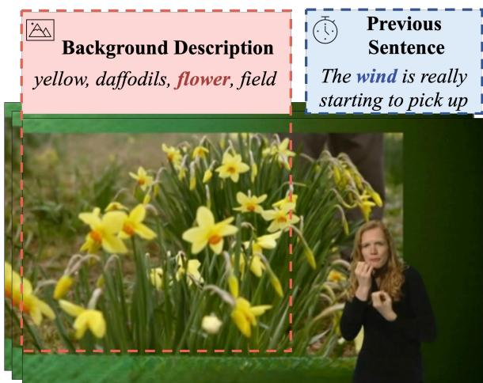
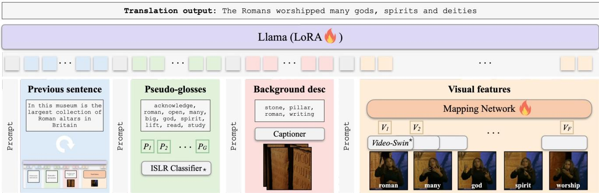
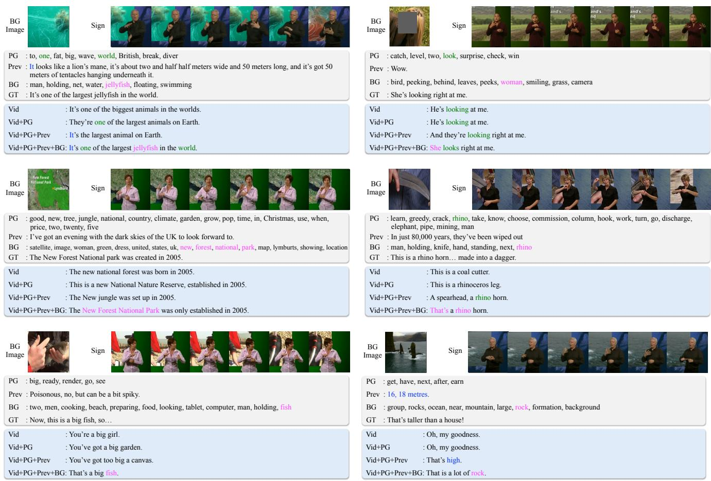

# Lost in Translation, Found in Context: Sign Language Translation with Contextual Cues

Youngjoon Jang∗1,2 Haran Raajesh∗3,4 Liliane Momeni1 Gul Varol¨ 1,3 Andrew Zisserman1

1Visual Geometry Group, University of Oxford, UK 2KAIST, Daejeon, Republic of Korea 3LIGM, Ecole des Ponts, IP Paris, Univ Gustave Eiffel, CNRS, France ´ 4CVIT, IIIT Hyderabad, India

https://www.robots.ox.ac.uk/˜vgg/research/litfic/ ∗ denotes equal contribution

## Abstract

Our objective is to translate continuous sign language into spoken language text. Inspired by the way human interpreters rely on context for accurate translation, we incorporate additional contextual cues together with the signing video, into a new translationframework. Specifically, besides visual sign recognitionfeatures that encode the input video, we integrate complementary textual informationfrom (i) captions describing the background show, (ii) translation of previous sentences, as well as (iii) pseudo-glosses transcribing the signing. These are automatically extracted and inputted along with the visual features to a pre-trained large language model (LLM), which wefine-tune to generate spoken language translations in text form. Through extensive ablation studies, we show the positive contribution ofeach input cue to the translation performance. We train and evaluate our approach on BOBSL – the largest British Sign Language dataset currently available. We show that our contextual approach significantly enhances the quality ofthe translations compared to previously reported results on BOBSL, and also to state-of-the-art methods that we implement as baselines. Furthermore, we demonstrate the generality of our approach by applying it also to How2Sign, an American Sign Language dataset, and achieve competitive results.

## 1. Introduction

Sign languages are the natural means of communication for deaf communities [66]. They are visual-spatial languages and lack standardised written forms [3, 26]. Sign languages exist independently of spoken languages, with their own unique lexicons, ordering, and grammatical structures. Furthermore, sign languages are expressed through both manual and non-manual components, e.g. mouthings, which can be conveyed simultaneously [19, 74].

The focus of this work is sign language translation (SLT), the

  
GT Translation: Beautiful petals that wave about in the wind. Prediction: They're beautiful flowers and they're wafting in the wind.

Figure 1. Contextual cues in SLT: In addition to information extracted from the signing content (at the bottom right corner), we give the sign language translation model two contextual cues: the background description that identifies keywords describing the scene behind the signer, and the previous sentence translations. In this example, the ground truth (GT) translation has common words or semantics with the background context (e.g., flower), and the previous sentence (e.g., wind).

process of transforming sign language into spoken language, in the open-vocabulary setting. Achieving SLT could significantly improve accessibility and inclusion for the deaf and hard-ofhearing communities by reducing communication barriers.

A key challenge in SLT is the fact that sign languages rely heavily on contextual discourse and spatial awareness due to their visual-spatial nature [42, 48, 52, 67]. Indeed, a study by [67] with fluent deaf signers found that a third of their sentence-level signing clips could only be fully translated when provided with additional discourse-level context. We next describe three examples of contextual dependencies in sign language: (a) Signers use spatial indexing to identify referents introduced earlier in the discourse (e.g. pointing to identify a particular person, object or any previously defined concept placed in signing space) [4, 25, 43]; (b) Sign languages typically follow a topic-comment structure [66]. For instance, the topic can refer to setting the temporal framework (e.g. if ‘yesterday’ is signed, all verbs in the translation should be in the past tense until a new time is mentioned). Once a topic is setup, it is usually not mentioned at every sentence but only re-established when changed, making a sentence-level translation often ill-defined; (c) Finally, sign language exhibits homonyms [66], where two signs with similar hand movements can have different meanings (e.g. ‘battery’ and ‘uncle’ in British Sign Language (BSL)).

Another major obstacle to automatic SLT is the scarcity of large-scale training data. Sign languages are low resource languages, with limited availability of signing videos online, and manually translating signing content is extremely time-consuming, requiring expert annotators.

In this paper, we turn to the underexplored and large-scale BOBSL dataset [2], which consists of over 1,400 hours of BSL interpreted TV broadcasts with accompanying English subtitles, as our source of training data. In comparison to datasets with sentence-level translations [11, 29, 85], interpreters in BOBSL translate spoken language subtitles to signing using context, both from the video playing in the background as well as the previous discourse that has been signed (see Fig. 1). We leverage this setting to explore the benefit of context for SLT performance. Specifically, we use background descriptions from a captioning model and predicted translations ofprevious sentences, along with sign-level pseudo-glosses1 and strong signing visual features as inputs to a pre-trained LLM, which we fine-tune to generate spoken language translations in text form. As signers may use pointing to identify an object or person on the screen, the background descriptions can help with identifying the corresponding referents (e.g. there are 4,179 pointing occurrences in the BOBSL-CSLR test set annotations [59], which spans only 6 hours). Furthermore, ambiguities of homonyms and tenses/co-references due to a topic-comment structure may be resolved thanks to the context provided from previous sentences, as well as the background.

However, this task remains challenging due to the weak and noisy nature of the TV subtitle supervision. The supervision is weak because the subtitles are temporally aligned with the speech, and not perfectly with the signing. Although we employ existing automatic signing-subtitle alignment methods [7], subti tles may appear a few seconds before or after the corresponding signing sequence. Additionally, the supervision is noisy because words in the subtitle are not necessarily signed, and vice versa. Indeed, sign language interpretation corresponds to a translation – as opposed to a transcription – of the speech content, and can often lead to simplification in vocabulary [6]. Furthermore, during TV broadcasts, where time pressure is a factor, interpreters may occasionally omit content to keep up with the spoken audio.

In this work, we make the following contributions: (i) we propose a new LLM-based model that integrates visual signing and text features with contextual information, including video back ground descriptions and previous sentence translations; (ii) we conduct a thorough analysis to examine the impact of each input cue on the translation quality, and introduce an LLM-based scoring mechanism that provides a more nuanced translation assessment than traditional metrics such as BLEU [55]; (iii) we evaluate previous state-of-the-art models [75, 84] on the BOBSL dataset to establish a performance benchmark and find our proposed model surpasses them significantly; (iv) we show our contextual method generalises to How2Sign, an American Sign Language (ASL) dataset, demonstrating its effectiveness.

## 2. Related Work

We discuss relevant works on isolated and continuous sign language recognition, as well as sign language translation.

Isolated Sign Language Recognition (ISLR), which involves classifying a short single-sign video clip into a sign category, has been extensively researched over many years. In the past decade, ISLR has made significant strides, largely due to the emergence of deep spatiotemporal neural networks and the availability of larger-scale datasets [1, 8, 9, 33, 36, 39, 40, 49]. In particular, the I3D model [13] has demonstrated its effectiveness in providing robust features for recognition [1, 36, 39]. More recently, the Video Swin Transformer [47] has shown strong ISLR results, and been employed as a backbone for various sign language tasks involving continuous video streams [56, 59]. In this work, we leverage the sign video encoder from [59] both to obtain visual features and pseudo-glosses.

Continuous Sign Language Recognition (CSLR) typically involves recognising gloss sequences – spoken language words corresponding to semantic labels for individual signs – from a continuous signing video clip. It is crucial to distinguish CSLR from translation due to the significant grammatical differences between signed and spoken languages [66]. Benchmarks such as PHOENIX14 [38] and CSL-Daily [85], which have manually glossed training data, are widely used for CSLR. Due to a lack of temporal alignment between signs and video frames, many studies [10, 18, 20, 30, 34, 50, 57, 73, 83, 87] utilise the Connectionist Temporal Classification (CTC) loss [28]. More recently, [59] demonstrates the advantages of using video-to-text retrieval on the challenging BOBSL dataset [2].

Automatic Sign Language Translation (SLT) involves converting sign language videos into spoken language. Given that glosses act as a mid-level representation that bridge the visual signing and spoken language modalities, CSLR has been employed as an intermediate step for sign language translation (known as Sign2Gloss2Text), or for pre/joint training to enhance visual representations [11, 12, 15, 16, 77, 78, 80, 81, 85, 86]. In our work, we only use sign-level pseudo-glosses as an additional input – rather than as auxiliary supervision – for translation.

  
Figure 2. Method overview: The input prompt combines contextual cues, the background descriptions and previous sentences, with the information from the current video sequence, specifically visual features and pseudo-glosses. Visual features corresponding to the signer {V } are extracted using a pre-trained Video-Swin model, which are projected to text space with a learnable mapping network. We obtain pseudo-glosses {P} by passing the Video-Swin features through the pre-trained ISLR Classifier (\*Video-Swin here denotes the layers except the last one of the ISLR model). The background captions, obtained from an off-the-shelf image captioner, are summarised into a list of keywords, which we refer to as background descriptions. During training, we randomly sample previous GT sentences and previous predictions, while during inference, the model uses its previous prediction in an auto-regressive manner. In practice, we include prompts that instruct the model on sign language translation and describe each input. We supervise the predicted translation output by comparing it against the ground truth, e.g., ‘As pagans, the Romans worshipped many gods and spirits’ in this example. Note that we do not use ground-truth glosses – they are displayed on the bottom right (e.g. roman, many...) only for illustration

Given the restricted scalability of manual glosses, recent research explores the gloss-free SLT setting [52, 76], utilising larger datasets and enhanced pre-training techniques. For instance, [2] and [68] train SLT systems from scratch using largescale signing data and robust visual features from a pre-trained ISLR I3D backbone. [63] employs a similar approach, but further pre-trains the visual encoder for sign spotting. [45] trains an SLT system jointly with the visual backbone, leveraging conceptual anchor words. GFSLT [84] pre-trains their visual encoder and text decoder through a CLIP-style contrastive loss [58] and a masked self-supervised loss. [79] introduces a frame-wise contrastive loss during visual pre-training to enhance feature discrimination. VAP [35] pre-trains for more fine-grained visual and textual token alignment. [82] collects large-scale noisy multilingual YouTube SL data and jointly pre-trains for various tasks such as SLT, subtitle-signing alignment, and text-to-text translation. Similarly to these works, we turn to large-scale data and extract strong visual features from an ISLR model.

Recent works also incorporate large-scale language foundation models. For example, [65] inputs pseudo-glosses directly into ChatGPT. SignLLM [27] transforms sign language videos into discrete tokens, which are then fed into a frozen language model (LLaMA-7B-16bit [69]). [35, 60, 61, 70, 82] all fine-tune a pre-trained T5 model for SLT. [70] feeds in 3D landmark embeddings, while [61] and [60] use visual features from a BEVT-pre-trained [72] ISLR model and a MAE pretained video encoder, respectively. Sign2GPT [75] leverages large-scale pre-trained vision (DINOv2 [54]) and language (XGLM [46]) models, incorporating adapters (LoRA [32]) for transfer to sign language. Similarly to these works, we make use of a pre-trained LLM (Llama3 [24]) and fine-tune it for SLT.

The most closely related to our work is [64], that also makes use of context. Specifically, their approach encodes the ground truth previous subtitle, and spottings (automatic localised sign level annotations obtained by querying words from the ground truth subtitle), as well as the signing video before passing them to a transformer decoder to generate translations. Our work differs on multiple fronts. Firstly, our method is fully automatic, employing the predicted translation of the previous sentence and pseudo-glosses from an ISLR model without access to any ground truth. Second, we additionally incorporate context from the background video. Lastly, we leverage a pre-trained LLM as opposed to training a language decoder from scratch.

## 3. Sign Language Translation with Context

We begin this section by outlining our framework for SLT using multifarious cues (Sec. 3.1). Next, we describe the representation of each of the inputs including visual features, pseudo-glosses, the background description, and the previous sentence (Sec. 3.2). We then present the training strategy that leverages a pre-trained LLM on this set of inputs (Sec. 3.3).

## 3.1. Framework overview

We introduce a new framework to perform SLT in an openvocabulary setting, basing our model on a pre-trained LLM. As illustrated in Fig. 2, the proposed framework takes various cues as input: (i) visual features representing the signing video, (ii) pseudo-glosses as a (noisy) automatic transcription of signs, (iii) background description as a contextual cue from the TV show displayed behind the signer, and (iv) predicted translation of the previous sentence as another contextual cue, obtained auto-regressively at inference. All modalities except the visual features are in text form, which allows us to leverage the powerful language generation capabilities of an LLM, trained on diverse text corpora. To map the visual features into the space of the LLM input tokens, we train a simple MLP-based mapping network. Besides the above inputs, we provide the LLM with an instruction describing the SLT task: “You are an AI assistant designed to interpret a video of a sign language signing sequence and translate it into English.” Finally, we add single-sentence prompts in between the inputs by describing each input type, while serving as a separator (see Appendix A.2 for the exact prompts). All the inputs are appended into a single sequence and fed to the LLM.

## 3.2. Model inputs

In the following, we describe how we obtain each of the inputs. Visual features. Following [56, 59], we employ a Video-Swin model [47] pre-trained for ISLR (classification of isolated signs) to obtain our visual features. Specifically, we utilise the recent and strong model provided by [59], which is trained on the BOBSL videos [2] for a vocabulary of 8,697 signs using the automatic sign spottings from [51]. This ISLR model processes short video clips of 16 frames (i.e. less than 1 second in 25 fps videos) to produce a single 768-dimensional embedding vector. Specifically, this vector comes from spatio-temporal averaging of the penultimate layer output of Video-Swin. To capture fine-grained temporal details, we feed 16 consecutive frames into the sign video encoder and apply a sliding window with a stride of s to obtain features $V _ { 1 : F } .$ , where F represents the number of visual features per sentence. For example, when $s { = } 2 ,$ , we have on average 56 features (i.e. 4.5 seconds) in BOBSL sentences. Note that for experiments conducted on the How2Sign dataset [22], we further fine-tune the Video-Swin model using the spotting annotations provided by [23] for a vocabulary of 1,887 signs (see Appendix A.5 for further details). Pseudo-glosses. To represent sign sequences in text form, we apply the ISLR model mentioned above in a sliding window manner to record the classification predictions, and obtain G pseudo-glosses $P _ { 1 : G } ,$ representing a sequence of words (or phrases) from the vocabulary of the classifier (e.g. 8k signs). Note that these sign category predictions are noisy, often including more labels than the number of signs occurring in the sentence video, and many false positives, which we wish to suppress via our LLM tuning. For example, Fig. 2 shows an example of a homonym confusion between the manually similar signs ‘study’ and ‘worship’. Our pseudo-glosses are similar to [59], except we only apply repetition grouping, but do not filter out low-confidence annotations with a threshold – this allows the LLM to learn which ones are relevant. In contrast to [59] that uses pseudo-glosses for supervision, we simply employ them as additional inputs to our SLT model. Typically, there are around 22 glosses per BOBSL sentence (which is less than the number of visual features – 56 features on average).

Background description. To incorporate context from the background footage, we crop out the signer from the full frame and apply an image captioning model (BLIP2 [41]) to extract textual descriptions of the scene behind the signer. Due to the repetitive nature of captions across consecutive frames and to reduce computational complexity, we extract captions at frames sampled at 1 fps, leaving us with 5 captions per signing sentence on average. Since similar scenes may persist even over several seconds, resulting in nearly identical captions, we collect all captions per sentence and keep only the list of unique words (e.g. 14 words per signing sentence). We further remove stopwords (as defined by [5]) to primarily feed keywords that may provide context, and consequently help disambiguate similar signs or identify pointings to the background screen. This process is illustrated in Appendix A.3.

Previous sentence. We incorporate the previous sentence text as an additional contextual cue. This refers to the sentence that the signer signed leading up to the current one. During training, we use either (i) the ground truth previous sentence or (ii) predictions precomputed from a model trained without the previous sentence cue (i.e. only visual features, pseudo-glosses, and background descriptions). At test time the model uses its own previous predictions as the previous sentence in an auto-regressive manner.

## 3.3. Tuning the LLM with multifarious cues

Given the inputs described above, we design and train an LLM-based model presented in the following.

Mapping network for visual features. All our inputs are already in text form except the visual features, which need a projection to map them into the text space, so that they can be fed into the pre-trained LLM. To this end, we train a simple mapping network, a 2-layer MLP with GELU [31] activation in between, projecting the visual features (of dimensionality 768) to the dimensionality of the LLM input embeddings (i.e. 4,096). We note that we add 1D temporal convolution layer to the mapping network when experimenting with the How2Sign dataset [22] (see Appendix A.5).

Training. The trainable parameters of our framework are in the mapping network and in the LLM. We randomly initialise the weights of the mapping network. For the LLM, we employ the open-source Llama3 model [24], specifically opting for the Llama3-8B variant to balance performance and efficiency. We tune the pre-trained LLM weights to adapt to our SLT task and to our input structure. Specifically, we adopt LoRA [32] fine-tuning (similarly to [75]) both to maintain computational efficiency, and not to degrade the powerful language decoding capability of the original model. We employ the standard cross-entropy loss across the original LLM vocabulary of 128k text tokens, using masked self-attention to predict the next tokens. At inference, the model auto-regressively decodes a sentence until an end-of-sentence token is reached.

Augmentations for textual modalities. During training, we apply several augmentations to our textual inputs to enhance model robustness. First, we perform word dropping on three textual cues (pseudo-glosses, the previous ground-truth sentence, and the background description) by randomly omitting between 0% and 50% of the words in each cue. Second, we randomly omit entire cues during training, each cue with 50% probability, allowing the model to flexibly handle inference when some modalities are missing, but also to make the model pay attention to each cue. Third, as previously mentioned, for previous sentences we make use of both ground-truth and predicted translations during training. Again, we randomly sample with a 50% probability between the two options. This strategy not only serves as an augmentation, but also reduces the domain gap between training and test time (where we do not have access to ground-truth previous sentences). In practice, we precompute the predicted previous sentences from a variant of our model trained with all cues except the previous sentence.

Implementation details. We train on 4 H100 GPUs with a batch size of 2 per GPU, utilising the Adam optimizer [37]. Training is performed in bfloat16 precision, with FlashAttention-2 [21] adapted to optimise memory usage. The LLM decoder (Llama3-8B model [24]) has a dimensionality 4,096 for its text embeddings. The LLM is fine-tuned using LoRA with a configuration of rank 4, alpha 16, and dropout 0.05. We fine-tune only the query and value projectors in all attention layers of the LLM. Since the text embedding layer has already been pre-trained on a large corpus, we freeze it during training. The training spans 10 epochs for BOBSL [2] and 15 epochs for How2Sign [22] datasets, including a warmup phase for the first 5 epochs with gradient clipping set to 1.0. The learning rate is set to 0.0001. We use the HuggingFace library for the pre-trained Llama3 models [24].

## 4. Experiments

In this section, we first present the datasets and a suite of evaluation protocols used in our experiments (Sec. 4.1), as well as baseline descriptions (Sec. 4.2). Next, we ablate various components of our framework (Sec. 4.3). We then show our improved translation performance compared to the state of the art on two challenging open-vocabulary benchmarks (Sec. 4.4). Finally, we illustrate qualitative results and discuss limitations (Sec. 4.5). Further experiments can be found in Appendix B.

## 4.1. Data and evaluation protocols

BOBSL [2] comprises 1,500 hours of BSL-interpreted TV broadcast footage across a wide range of genres, accompanied by English subtitle sentences for the audio content. During training, to achieve better signing-sentence alignments, we use automatically signing-aligned sentences from [7] as described in [2]. We filter sentences to those lasting 1-20 seconds as in [59], resulting in 689k video-sentence training pairs, corresponding to a vocabulary of 86K words. For evaluation, we utilise the existing validation and test splits, SENT-VAL and SENT-TEST from [2], where English sentences have been manually aligned temporally to the continuous signing video. SENT-VAL and SENT-TEST consist of 1,973 and 20,870 aligned sentences, respectively, covering vocabularies of 3,528 and 13,641 English words. We report ablation studies on the validation set and present our final model results on the test set.

How2Sign [22] comprises 80 hours of ASL instructional videos from 10 different topics, with temporally aligned sentence language translations. There are 31,128 training, 1,741 validation and 2,322 test sentences, covering vocabularies of 15.7k, 3.2k, and 3.7k English words, respectively. We use the validation set to tune hyperparameters, and report our final model results on the test set.

Evaluation metrics. To evaluate translation performance effectively, we use five standard evaluation metrics: (i) BLEU-4 (B4) [55], which corresponds to the geometric mean of the precision scores of 4-grams, multiplied by a brevity penalty; (ii) BLEURT (B-RT) [62], which is a trained metric (using a regression model trained on ratings data) that can better capture non-trivial semantic similarities between sentences; (iii) ROUGE-L (R-L) [44], which measures the longest common subsequence between the prediction and ground truth sequence; (iv) CIDEr [71], a captioning metric that captures consensus of the prediction compared to ground truth by calculating the weighted cosine similarity of TD-IDF scores for various n-grams; and finally, (v) the Intersection over Union (IoU) of prediction and ground truth token sets (using the Penn Treebank tokenizer [5]). Similar to [51, 59], when computing IoU, we lemmatise all the words, and do not penalise translated words if they are synoyms to those in ground truth.

LLM Evaluation. Besides these standard metrics, we introduce an LLM-based evaluation metric adapted from the CLAIR framework [14] to assess sign language translations. We use the publicly available API of GPT-4o-mini from OpenAI [53], prompting the model to generate a score from 0 to 5 for each pair of translation and ground truth, where 5 indicates the best match and 0 is the worst, along with a detailed reasoning for the score. To calibrate the LLM, we provide 12 manually annotated in-context examples. We instruct the LLM to focus on key nouns and verbs and give less importance to pronouns. Further details are provided in Appendix A.1.

## 4.2. Baselines

Here, we review baselines that we compare against, including a common translation baseline (Albanie [2], Sincan [64]), as well as two state-of-the-art SLT methods (GFSLT [84], Sign2GPT [75]) according to PHOENIX14T [11, 38] and CSL-Daily [85] benchmarks.

Albanie [2] and Sincan [64]. These approaches build on the original SLT transformer work of Camgoz et al. [12], consisting of a standard transformer encoder-decoder architecture trained from scratch on pre-extracted video frame features. We compare against the first SLT baseline on BOBSL established by Albanie et al. [2] using this framework. Specifically, they train the I3D model for 2,281 sign vocabulary on BOBSL spottings, and supervise the translation with automatically-aligned English sentences filtered to a vocabulary of 9k common words. We also compare with the baseline of Sincan et al. [64], which similarly trains an encoder-decoder model and uses the same I3D features.

GFSLT [84]. This recent work introduces a pre-training phase featuring two components: (i) a CLIP-style contrastive loss, which directs the visual encoder to learn language-aligned visual representations, and (ii) a masked self-supervised loss, which promotes the ability of the text decoder to grasp sentence semantics. In the subsequent stage, the pre-trained visual encoder and text decoder are jointly fine-tuned within an encoder-decoder translation framework, enabling the direct conversion of visual representations into spoken sentences. We first reproduce this method using the public codebase on PHOENIX14T (see Appendix B.7), before adapting to the BOBSL dataset.

Sign2GPT [75]. This state-of-the-art work proposes an encoderdecoder translation framework that leverages large-scale pretrained vision (DINOv2 [54]) and language (XGLM [46]) models, incorporating adapters (LoRA [32]) for transfer to sign language. Additionally, a prototype-driven pre-training strategy is introduced, which guides the visual encoder to learn sign representations from spoken language sentences by filtering specific parts of speech. We again use the public codebase for reproducing and applying on the BOBSL dataset. We report results both without and with pre-training (denoted as w/PGP) as in [75].

Oracle: Sincan [64] (Vid+PrevGT).This oracle baseline is a multi-modal variant of Sincan [64], where the previous ground truth sentence is also fed as additional context to the decoder at both training and inference times.

Oracle: Sincan [64] (Vid+PrevGT +Spot). This baseline is another oracle variant, where Spottings are also fed into the decoder at both training and inference times. Spottings are automatic sign annotations [51], obtained using ground truth knowledge of the nearby English subtitles, i.e. given words from the subtitle, by temporally localising them in video. We note that our pseudo-glosses are different to Spottings as they are predicted directly from the video, without access to the corresponding English sentence translation.

## 4.3. Ablation study

In this section, we analyse our different design choices. We present our results on the BOBSL validation set, SENT-VAL, using BLEURT (B-RT), IoU and LLM evaluation metrics.

Combining different cues. In Tab. 1, we measure the contribution of each input cue. With only visual features, the model achieves baseline scores of 41.0 for B-RT, 16.6 for IoU, and 1.29 for LLM score. Adding pseudo-glosses (i.e. textual cues derived from the current sign video) improves all metrics, highlighting the benefit of text directly related to the signs. Incorporating previous sentences as a contextual cue further boosts performance, and finally, adding background descriptions achieves the best results across all metrics. Overall, the final model, with all cues combined, yields a significant improvement of +2.5 in B-RT, +2.2 in IoU, and +0.27 in LLM score compared to the baseline, confirming that there is additional relevant information found in context, beyond the signing video, to help with the translation. In Appendix A.1, we provide further statistics analysing the distribution of the LLM evaluation scores, which align well with other metrics in most cases, while being interpretable.

<table><tr><td>Vid</td><td>PG</td><td> $\mathrm { P r e v } ^ { \mathrm { P r e d } }$ </td><td>BG</td><td>B-RT</td><td>IoU</td><td>LLM</td></tr><tr><td>√</td><td></td><td></td><td></td><td>41.0</td><td>16.6</td><td>1.29</td></tr><tr><td>√</td><td>√</td><td></td><td></td><td>41.8</td><td>17.5</td><td>1.40</td></tr><tr><td>√</td><td>√</td><td>√</td><td></td><td>42.5</td><td>18.1</td><td>1.45</td></tr><tr><td>√</td><td>√</td><td>√</td><td>√</td><td>43.5</td><td>18.8</td><td>1.56</td></tr></table>

Table 1. Combining different cues. We analyse on BOBSL SENT-VAL, how different cues contribute to translation performance, when added to the vanilla model inputting only the visual signing features (Vid). We observe that pseudo-glosses (PG), background description (BG), and predicted translation of the previous sentence $( P r e \nu ^ { P r e \dot { d } } )$ are all complementary, as combining them achieves the best performance.

<table><tr><td>LLM fine-tuning</td><td>Drop words</td><td>Drop cue</td><td> $\mathrm { P r e v } ^ { \mathrm { P r e d } } /$   $\mathrm { P r e v } ^ { \mathrm { G T } }$ </td><td>B-RT</td><td>IoU</td><td>LLM</td></tr><tr><td>√</td><td></td><td></td><td></td><td>41.2</td><td>17.0</td><td>1.40</td></tr><tr><td>√</td><td>√</td><td></td><td></td><td>41.4</td><td>17.4</td><td>1.41</td></tr><tr><td>√</td><td>√</td><td>V</td><td></td><td>42.7</td><td>18.1</td><td>1.53</td></tr><tr><td></td><td>√</td><td>√</td><td>V</td><td>43.5</td><td>18.8</td><td>1.56</td></tr><tr><td></td><td>√</td><td>√</td><td></td><td>40.6</td><td>16.7</td><td>1.27</td></tr></table>

Table 2. Augmentations and LLM fine-tuning. We ablate, on BOBSL SENT-VAL, how different input augmentations and fine-tuning the LLM decoder with LoRA [32] impact the performance. As explained in Sec. 3.3, we randomly drop words within each cue, or entirely drop a cue. $P r e \nu ^ { P r e d } / P r e \nu ^ { G T }$ refers to randomly sampling either the predicted or ground-truth translation for the previous sentence. We observe that the combination of all input augmentations leads to the best performance, and also show the benefits of LoRA fine-tuning.

Effect of augmentations. We perform a series of ablations in Tab. 2 regarding the input augmentations at training time: (i) Drop words: randomly removing up to 50% of the words in textual cues, (ii) Drop cue: randomly removing an entire cue with a probability of 50%, and (iii) $P r e \nu ^ { P r e d } / P r e \nu ^ { \zeta T } ;$ : sampling either predicted or ground truth (GT) previous sentence with equal probability. When Drop words augmentation is applied, we observe a slight performance increase. Adding Drop cue augmentation provides an additional improvement (42.7 vs 41.4). We hypothesise that these augmentations make the model less sensitive to noise and less reliant on any particular textual cue. Finally, combining $P r e \nu ^ { P r e d } / P r e \nu ^ { G T }$ augmentation further boosts translation performance (43.5 vs 42.7), as it reduces the reliance on previous GT sentences and better matches the inference setting.

LLM fine-tuning. In Tab. 2, we also examine a model variant without fine-tuning the LLM, but only training the mapping network with a frozen LLM. Comparing the last two rows, we observe that LoRA fine-tuning the decoder yields improvements across all metrics (B-RT: +2.9, IoU: +2.1, and LLM score: +0.29). We hypothesise that the improvement may partially be due to distinct linguistic characteristics of signed and spoken languages, but also due to adapting the LLM to our specific input structure.

<table><tr><td>Model</td><td>B4 B-RT</td><td>R-L</td><td>CIDEr</td><td>IoU</td><td>LLM</td></tr><tr><td colspan="6">VIDEO ONLY</td></tr><tr><td>Albanie [2]</td><td>1.0</td><td>10.2</td><td></td><td></td><td></td></tr><tr><td>Sincan [64]</td><td>1.3</td><td>8.9</td><td></td><td></td><td></td></tr><tr><td>GFSLT [84] †</td><td>0.6 27.7</td><td>7.4</td><td>4.3</td><td>5.2</td><td>0.05</td></tr><tr><td>Sign2GPT [75] †</td><td>0.7 34.3</td><td>10.6</td><td>12.8</td><td>8.2</td><td>0.37</td></tr><tr><td>Sign2GPT (w/PGP) [75] †</td><td>0.9 35.2</td><td>11.4</td><td>16.1</td><td>8.7</td><td>0.49</td></tr><tr><td>Ours (Vid)</td><td>2.6 37.8</td><td>15.6</td><td>37.5</td><td></td><td>13.6 0.95</td></tr><tr><td colspan="6">EXTRA CUES</td></tr><tr><td>Ours  $( { \mathrm { V i d } } { + } { \mathrm { P r e v } } ^ { \mathrm { P r e d } } )$ </td><td>2.8 38.9</td><td>16.0</td><td>37.8</td><td>13.8</td><td>1.02</td></tr><tr><td>Ours  $\mathrm { ( V i d \mathrm { + } P r e v ^ { P r e d } \mathrm { + } P G ) }$ </td><td>2.9 39.2</td><td>16.1</td><td>38.9</td><td>14.1</td><td>1.15</td></tr><tr><td>Ours  $( \mathrm { V i d } { + } \mathrm { P r e v } ^ { \mathrm { P r e d } } { + } \mathrm { P G } { + } \mathrm { B G } )$ </td><td>3.3 40.3</td><td>16.9</td><td>41.9</td><td>14.8</td><td>1.20</td></tr><tr><td colspan="6"></td></tr><tr><td>Sincan  $[ 6 4 ] ( \mathrm { V i d } \substack { + } \mathrm { P r e v } ^ { \mathrm { G T } } )$ </td><td>ORACLE 1.5 35.8</td><td>9.7</td><td>23.9</td><td>10.4</td><td>0.56</td></tr><tr><td> $\mathrm { O u r s } \ : ( \mathrm { V i d } { + } \mathrm { P r e v } ^ { \mathrm { G T } } )$ </td><td>3.3 40.5</td><td>17.3</td><td>42.8</td><td>14.8</td><td>1.23</td></tr><tr><td>Sincan  $[ 6 4 ] \mathrm { ( V i d \mathrm { + P r e v } ^ { G T } \mathrm { + S p o t ) } }$ </td><td>2.9 37.0</td><td>12.4</td><td>41.0</td><td>12.5</td><td>0.80</td></tr><tr><td>Ours  $\mathrm { ( V i d \mathrm { + } P r e v ^ { G T } { + } S p o t ) }$ </td><td>6.5 45.9</td><td>24.0</td><td>82.5</td><td>25.5</td><td>1.69</td></tr><tr><td>Ours  $( \mathrm { V i d } { + } \mathrm { P r e v } ^ { \mathrm { G T } } { + } \mathrm { S p o t } { + } \mathrm { B G } )$ </td><td>7.3 47.1</td><td>25.1</td><td>88.9</td><td>26.5</td><td>1.85</td></tr><tr><td></td><td></td><td></td><td></td><td></td><td></td></tr></table>

Table 3. Comparison to the state of the art on BOBSL SENT-TEST. We compare our method to previous state-of-the-art works and surpass their performance on a range of translation metrics. In the ORACLE setting (bottom block), we compare fairly to approaches which use (i) the previous ground truth sentence as context $( \mathrm { P r e v } ^ { \mathrm { G T } } )$ , as opposed to the predicted previous sentence $( \mathrm { P r e v } ^ { \mathrm { P r e d } } )$ , and (ii) Spottings (Spot) that are derived from the current ground truth sentence, as opposed to sign-level pseudo-glosses (PG). For example, in ‘Ours (Vid+PrevGT+Spot+BG)’ we replace our pseudo-glosses with the spottings that have access to ground truth sentence, to show a more similar setting to [64]. † denotes scores that we obtained by training methods of [75, 84] on BOBSL. Note that unlike previous experiments on the validation set, this table reports on the test set.

## 4.4. Comparison to the state of the art

BOBSL. We evaluate our model on the BOBSL test set, SENT-TEST, using our full suite of evaluation metrics. As shown in Tab. 3, our approach achieves a significant improvement across all metrics compared to previous works. Notably, even with only video input, our model surpasses state-of-the-art methods such as GFSLT [84] and Sign2GPT [75]. Moreover, incorporating additional cues leads to a steady performance gain, with the full set of cues yielding a considerable boost (40.3 vs 37.8 B-RT). This highlights both the effectiveness of our method, which leverages context and the increased challenge posed by the BOBSL dataset (as opposed to PHOENIX14T where [75, 84] were originally evaluated).

In the ORACLE setup (the bottom block of Tab. 3), we compare to the setting of [64], where models have access to ground truth previous sentence and spottings extracted from the ground truth current sentence. When using the ground truth previous sentence at inference, our model outperforms [64] by a large margin (40.5 vs 35.8 B-RT). When using both the ground truth previous sentence and spottings (which are obtained with access to current ground truth), we further increase the margin, substantially outperforming their method (45.9 vs 37.0 B-RT). Additionally, when integrating background descriptions (last row), we observe a further performance gain.

<table><tr><td>Model</td><td>B4 B-RT</td><td></td><td>R-L</td><td>CIDEr</td><td>IoU LLM</td></tr><tr><td>SSLT [82] † SSVP-SLT [60] †</td><td>15.5</td><td>55.7 49.6</td><td>38.4</td><td></td><td></td></tr><tr><td>SSLT [82]</td><td></td><td></td><td></td><td></td><td></td></tr><tr><td>SSVP-SLT [60]</td><td>一 7.0</td><td>34.0 39.3</td><td>25.7</td><td></td><td></td></tr><tr><td>Fla-LLM [17]</td><td>9.7</td><td></td><td>27.8</td><td></td><td></td></tr><tr><td>VAP [35]</td><td>12.9</td><td></td><td>27.8</td><td></td><td></td></tr><tr><td></td><td></td><td></td><td></td><td>一</td><td></td></tr><tr><td>Ours (Vid)</td><td>11.8</td><td>44.1</td><td>31.1</td><td>93.3</td><td>26.1 1.39</td></tr><tr><td>Ours (Vid+PG)</td><td>12.3</td><td>44.7</td><td>31.9</td><td>97.8 27.4</td><td>1.55</td></tr><tr><td>Ours  $\mathrm { ( V i d \mathrm { + } P G \mathrm { + } P r e v ^ { P r e d } ) }$ </td><td>12.7</td><td>45.3</td><td>32.5</td><td>100.8 27.9</td><td>1.59</td></tr></table>

Table 4. Comparison to the state of the art on How2Sign. We compare our method to previous works that report on the How2Sign test set, and obtain competitive performance. We also observe advantages of incorporating additional cues from pseudo-glosses (PG) and previous predicted sentence $( { \mathrm { P r e v } } ^ { \mathrm { P r e d } } )$ . † denotes methods that pre-train the SLT model on a larger ASL dataset (YouTube-ASL [70] which covers 984 hours).

How2Sign. Here, we demonstrate the generality of our method by training on the How2Sign dataset (see Appendix A.5 for details). In Tab. 4, we compare against the state of the art on the test set, and also report variants of our model by gradually adding more cues. We observe that adding the pseudo-glosses, as well as the contextual cue of the previous translated sentence boosts performance. We note that in this case, we do not use background descriptions since How2Sign does not consist of interpreted TV with an accompanying show. We find our best model (Vid+PG+PrevPred) achieves comparable performance with the state-of-the-art method VAP [35] in terms of B4 and attains a higher R-L score by nearly 5 points (32.5 vs 27.8). We note that we include the numbers from [82] and [60] (denoted with †), however, we do not compare to these as they train SLT additionally on a large ASL corpus of 984 hours [70].

## 4.5. Qualitative analysis and limitations

We visually analyse how different input cues impact the translation outputs by providing relevant information beyond the signing video. In Fig. 3 (top left), a key focus of the sentence – the word jellyfish – is not signed. In Fig. 3 (top right), the sign for pronouns he and she is ambiguous. In such cases, the model needs to utilise available context – much like a human interpreter would – to accurately translate the sentence. By effectively leveraging the background context in both cases, the model is able to produce stronger translations. In other cases, context can be used to further augment information obtained from the video. This can be seen in Fig. 3 (middle left), where using only the video, the model gains a general theme about national forest but by leveraging the context, can precisely generate New Forest National Park. Fig. 3 (middle right) shows an example where the signer points to the background where the rhino horn appears on screen, and the similar sign for elephant that appears in pseudo-glosses is effectively suppressed.

  
Figure 3. Qualitative analysis: We present visual examples to show how different cues affect the translation results. Starting with visual features, we incrementally add pseudo-glosses (PG), the predicted previous sentence (Prev), and the background description (BG). We observe that the previous sentence helps translation performance by providing further context (top left, bottom right). The background description also helps for pronoun referencing (top right), place names (middle left), pointing gestures (middle right), and object referencing (bottom left). However, the background can also in some cases hinder translation (bottom right). We refer to Sec. 4.5 for detailed comments.

However, we do observe several challenges as well: (i) different cues may present conflicting information, and while the model often learns to implicitly resolve such conflicts, there are cases where it struggles (see Fig. 3, bottom right); (ii) our model can struggle to discern the grammatical context of a sentence, e.g. it sometimes cannot distinguish whether a given sentence is a question or a statement; (iii) similarly the model makes frequent mistakes by missing negations; (iv) our model still faces difficulties with certain sign types, such as pointing and fingerspelling, which are essential components of sign language. These limitations highlight the complexity of sign language translation and underscore the need for continued research and development in the field. Additional qualitative results are provided in Appendix C.

## 5. Conclusion

In this work, we show that leveraging contextual information significantly enhances SLT performance in an open-vocabulary setting. Specifically, our framework utilises background descriptions from a captioning model and predictions of previous sentences, combined with pseudo-glosses and visual features. Through an extensive ablation study, we analyse the individual impact of each cue on sign language translation, and benchmark our method against previous state-of-the-art approaches on the BOBSL dataset to demonstrate its effectiveness. Despite the improvements of our approach, several challenges remain. Background descriptions may not always complement the translation, potentially introducing noise. Relying on previous sentence predictions can lead to error accumulation, where early mistakes propagate through subsequent sentences. Additionally, pseudo-glosses are prone to false positives due to homonyms, resulting in incorrect word choices. Addressing these limitations would potentially improve the robustness and real-world applicability of sign language translation systems.

Acknowledgments. The images in this paper are used with kind permission of the BBC. This work was granted access to the HPC resources of IDRIS under the allocation 2024-AD011013395 made by GENCI. The authors would like to acknowledge the ANR project CorVis ANR-21-CE23-0003- 01, a Google Research Scholar Award, and a Royal Society Research Professorship RP\R1\191132. The authors also thank Charles Raude, Prajwal KR, Prasanna Sridhar, Joon Son Chung, Makarand Tapaswi, Syrine Kalleli, and David Picard for their feedback, and further thank Ryan Wong for guiding the Sign2GPT [75] implementation and Ozge Mercanoglu Sincan for providing the outputs for the Sincan [64] model on the BOBSL test set.

## References

[1] Samuel Albanie, Gul Varol, Liliane Momeni, Triantafyllos¨ Afouras, Joon Son Chung, Neil Fox, and Andrew Zisserman. BSL-1K: Scaling up co-articulated sign language recognition using mouthing cues. In Proc. ECCV, 2020. 2

[2] Samuel Albanie, Gul Varol, Liliane Momeni, Hannah Bull,¨ Triantafyllos Afouras, Himel Chowdhury, Neil Fox, Bencie Woll, Rob Cooper, Andrew McParland, and Andrew Zisserman. BOBSL: BBC-Oxford British Sign Language Dataset. arXiv, 2021. 2, 3, 4, 5, 6, 7

[3] Elena Antinoro Pizzuto and Paola Pietrandrea. The Notation of Signed Texts: Open Questions and Indications for Further Research. Journal of Sign Language and Linguistics, 2001. 1

[4] Brita Bergam. Elisabeth engberg-pedersen, space in Danish Sign Language. the semantics and morphosyntax of the use of space in a visual language. international studies on sign language research and communication of the deaf, vol. 19. hamburg: Signum verlag, 1993. 406 pp. Nordic Journal ofLinguistics, 1995. 2

[5] Steven Bird and Edward Loper. NLTK: The natural language toolkit. In Proceedings of the ACL Interactive Poster and Demonstration Sessions. ACL, 2004. 4, 5

[6] Danielle Bragg, Oscar Koller, Mary Bellard, Larwan Berke, Patrick Boudreault, Annelies Braffort, Naomi Caselli, Matt Huenerfauth, Hernisa Kacorri, Tessa Verhoef, Christian Vogler, and Meredith Ringel Morris. Sign language recognition, generation, and translation: An interdisciplinary perspective. In Proc. ACM SIGACCESSS, 2019. 2

[7] Hannah Bull, Triantafyllos Afouras, Gul Varol, Samuel Albanie,¨ Liliane Momeni, and Andrew Zisserman. Aligning subtitles in sign language videos. In Proc. ICCV, 2021. 2, 5

[8] Necati Cihan Camgoz, Simon Hadfield, Oscar Koller, and Richard Bowden. Using convolutional 3D neural networks for user-independent continuous gesture recognition. In IEEE International Conference of Pattern Recognition, ChaLearn Workshop, 2016. 2

[9] Necati Cihan Camgoz, Ahmet Alp Kındıroglu, Serpil Karab¨ ukl¨ u,¨ Meltem Kelepir, A. Sumru Ozsoy, and Lale Akarun. Bospho-¨ russign: A turkish sign language recognition corpus in health and finance domains. In International Conference on Language Resources and Evaluation, 2016. 2

[10] Necati Cihan Camgoz, Simon Hadfield, Oscar Koller, and Richard Bowden. SubUNets: End-to-end hand shape and continuous sign language recognition. In Proc. ICCV, 2017. 2

[11] Necati Cihan Camgoz, Simon Hadfield, Oscar Koller, Hermann Ney, and Richard Bowden. Neural sign language translation. In Proc. CVPR, 2018. 2, 5

[12] Necati Cihan Camgoz, Oscar Koller, Simon Hadfield, and Richard Bowden. Sign language transformers: Joint end-to-end sign language recognition and translation. In Proc. CVPR, 2020. 2, 5

[13] Joao Carreira and Andrew Zisserman. Quo vadis, action˜ recognition? A new model and the Kinetics dataset. In Proc. CVPR, 2017. 2

[14] David Chan, Suzanne Petryk, Joseph Gonzalez, Trevor Darrell, and John Canny. CLAIR: Evaluating image captions with large language models. In Proc. EMNLP, 2023. 5

[15] Yutong Chen, Fangyun Wei, Xiao Sun, Zhirong Wu, and Stephen Lin. A simple multi-modality transfer learning baseline for sign language translation. In Proc. CVPR, 2022. 2

[16] Yutong Chen, Ronglai Zuo, Fangyun Wei, Yu Wu, Shujie Liu, and Brian Mak. Two-stream network for sign language recognition and translation. In NeurIPS, 2022. 2

[17] Zhigang Chen, Benjia Zhou, Jun Li, Jun Wan, Zhen Lei, Ning Jiang, Quan Lu, and Guoqing Zhao. Factorized learning assisted with large language model for gloss-free sign language translation. arXiv, 2024. 7

[18] Ka Leong Cheng, Zhaoyang Yang, Qifeng Chen, and Yu-Wing Tai. Fully convolutional networks for continuous sign language recognition. In Proc. ECCV, 2020. 2

[19] Onno Crasborn. Nonmanual structures in sign language. Encyclopedia ofLanguage and Linguistics, 2006. 1

[20] Runpeng Cui, Hu Liu, and Changshui Zhang. A deep neural framework for continuous sign language recognition by iterative training. IEEE Transactions on Multimedia, 2019. 2

[21] Tri Dao. Flashattention-2: Faster attention with better parallelism and work partitioning. arXiv, 2023. 5

[22] Amanda Duarte, Shruti Palaskar, Lucas Ventura, Deepti Ghadi yaram, Kenneth DeHaan, Florian Metze, Jordi Torres, and Xavier Giro-i Nieto. How2Sign: A large-scale multimodal dataset for continuous American Sign Language. In Proc. CVPR, 2021. 4, 5

[23] Amanda Duarte, Samuel Albanie, Xavier Giro-i Nieto, and´ Gul Varol. Sign language video retrieval with free-form textual¨ queries. In Proc. CVPR, 2022. 4

[24] Abhimanyu Dubey, Abhinav Jauhri, Abhinav Pandey, Abhishek Kadian, Ahmad Al-Dahle, Aiesha Letman, Akhil Mathur, Alan Schelten, Amy Yang, Angela Fan, et al. The llama 3 herd of models. arXiv, 2024. 3, 4, 5

[25] Karen Emmorey. The confluence of space and language in signed languages. The MIT Press, 1996. 2

[26] Michael Filhol. Elicitation and corpus of spontaneous sign language discourse representation diagrams. In Proceedings of the LREC2020 9th Workshop on the Representation and Processing ofSign Languages: Sign Language Resources in the Service of the Language Community, Technological Challenges and Application Perspectives, 2020. 1

[27] Jia Gong, Lin Geng Foo, Yixuan He, Hossein Rahmani, and Jun Liu. Llms are good sign language translators. In Proc. CVPR, 2024. 3

[28] Alex Graves, Santiago Fernandez, Faustino Gomez, and J´ urgen¨ Schmidhuber. Connectionist temporal classification: Labelling unsegmented sequence data with recurrent neural ’networks. In Proc. ICML, 2006. 2

[29] Soomin Ham, Kibaek Park, YeongJun Jang, Youngtaek Oh, Seokmin Yun, Sukwon Yoon, Chang Jo Kim, Han-Mu Park, and In So Kweon. Ksl-guide: A large-scale korean sign language dataset including interrogative sentences for guiding the deaf and hard-of-hearing. In Proc. FG, 2021. 2

[30] Aiming Hao, Yuecong Min, and Xilin Chen. Self-mutual distillation learning for continuous sign language recognition. In Proc. ICCV, 2021. 2

[31] Dan Hendrycks and Kevin Gimpel. Gaussian error linear units (gelus). arXiv, 2016. 4

[32] Edward J Hu, Yelong Shen, Phillip Wallis, Zeyuan Allen-Zhu, Yuanzhi Li, Shean Wang, Lu Wang, and Weizhu Chen. LoRA: Low-rank adaptation of large language models. In Proc. ICLR, 2022. 3, 4, 6

[33] Jie Huang, Wengang Zhou, Houqiang Li, and Weiping Li. Sign language recognition using 3D convolutional neural networks. In Proc. International Conference on Multimedia and Expo (ICME), 2015. 2

[34] Peiqi Jiao, Yuecong Min, Yanan Li, Xiaotao Wang, Lei Lei, and Xilin Chen. CoSign: Exploring co-occurrence signals in skeleton-based continuous sign language recognition. In Proc. ICCV, 2023. 2

[35] Peiqi Jiao, Yuecong Min, and Xilin Chen. Visual alignment pretraining for sign language translation. In Proc. ECCV, 2024. 3, 7

[36] Hamid Reza Vaezi Joze and Oscar Koller. MS-ASL: A large-scale data set and benchmark for understanding american sign language. In BMVC, 2019. 2

[37] Diederik P. Kingma and Jimmy Ba. Adam: A method for stochastic optimization. In Proc. ICLR, 2015. 5

[38] Oscar Koller, Jens Forster, and Hermann Ney. Continuous sign language recognition: Towards large vocabulary statistical recognition systems handling multiple signers. Computer Vision and Image Understanding, 2015. 2, 5

[39] Dongxu Li, Cristian Rodriguez Opazo, Xin Yu, and Hongdong Li. Word-level deep sign language recognition from video: A new large-scale dataset and methods comparison. In Proc. WACV, 2019. 2

[40] Dongxu Li, Xin Yu, Chenchen Xu, Lars Petersson, and Hongdong Li. Transferring cross-domain knowledge for video sign language recognition. In Proc. CVPR, 2020. 2

[41] Junnan Li, Dongxu Li, Silvio Savarese, and Steven Hoi. BLIP-2: bootstrapping language-image pre-training with frozen image encoders and large language models. In Proc. ICML, 2023. 4

[42] Scott Liddell. Four functions of a locus: Reexamining the structure of space in ASL. Sign Language Research: Theoretical Issues, 1990. 1

[43] Scott K. Liddell. Grammar, Gesture, and Meaning in American Sign Language. Cambridge University Press, 2003. 2

[44] Chin-Yew Lin. ROUGE: A package for automatic evaluation of summaries. In Proc. ACL, 2004. 5

[45] Kezhou Lin, Xiaohan Wang, Linchao Zhu, Ke Sun, Bang Zhang, and Yi Yang. Gloss-free end-to-end sign language translation. In Proc. ACL, 2023. 3

[46] Xi Victoria Lin, Todor Mihaylov, Mikel Artetxe, Tianlu Wang, Shuohui Chen, Daniel Simig, Myle Ott, Naman Goyal, Shruti Bhosale, Jingfei Du, Ramakanth Pasunuru, Sam Shleifer, Punit Singh Koura, Vishrav Chaudhary, Brian O’Horo, Jeff Wang, Luke Zettlemoyer, Zornitsa Kozareva, Mona T. Diab, Veselin

Stoyanov, and Xian Li. Few-shot learning with multilingual language models. CoRR, 2021. 3, 6

[47] Ze Liu, Jia Ning, Yue Cao, Yixuan Wei, Zheng Zhang, Stephen Lin, and Han Hu. Video swin transformer. In Proc. CVPR, 2022. 2, 4

[48] Richard P. Meier, Kearsy Cormier, and David Quinto-Pozos, editors. Modality and Structure in Signed and Spoken Languages. Cambridge University Press, 2002. 1

[49] Ozge Mercanoglu and Hacer Keles. Autsl: A large scale multi-modal turkish sign language dataset and baseline methods. IEEE Access, 8:181340–181355, 2020. 2

[50] Yuecong Min, Aiming Hao, Xiujuan Chai, and Xilin Chen. Visual alignment constraint for continuous sign language recognition. In Proc. ICCV, 2021. 2

[51] Liliane Momeni, Hannah Bull, K R Prajwal, Samuel Albanie, Gul Varol, and Andrew Zisserman. Automatic dense annotation¨ of large-vocabulary sign language videosa. In Proc. ECCV, 2022. 4, 5, 6

[52] Mathias Muller, Malihe Alikhani, Eleftherios Avramidis, Richard¨ Bowden, Annelies Braffort, Necati Cihan Camgoz, Sarah Ebling,¨ Cristina Espana-Bonet, Anne G˜ ohring, Roman Grundkiewicz,¨ Mert Inan, Zifan Jiang, Oscar Koller, Amit Moryossef, Annette Rios, Dimitar Shterionov, Sandra Sidler-Miserez, Katja Tissi, and Davy Van Landuyt. Findings of the second WMT shared task on sign language translation (WMT-SLT23). In Proc. Conference on Machine Translation. Association for Computational Linguistics, 2023. 1, 3

[53] OpenAI. GPT-4 technical report. arXiv:2303.08774, 2024. 5

[54] Maxime Oquab, Timothee Darcet, Th´ eo Moutakanni, Huy V.´ Vo, Marc Szafraniec, Vasil Khalidov, Pierre Fernandez, Daniel HAZIZA, Francisco Massa, Alaaeldin El-Nouby, Mido Assran, Nicolas Ballas, Wojciech Galuba, Russell Howes, Po-Yao Huang, Shang-Wen Li, Ishan Misra, Michael Rabbat, Vasu Sharma, Gabriel Synnaeve, Hu Xu, Herve Jegou, Julien Mairal, Patrick Labatut, Armand Joulin, and Piotr Bojanowski. DINOv2: Learning robust visual features without supervision. Transactions on Machine Learning Research, 2024. 3, 6

[55] Kishore Papineni, Salim Roukos, Todd Ward, and Wei-Jing Zhu. BLEU: a method for automatic evaluation of machine translation. In Proc. ACL, 2002. 2, 5

[56] K R Prajwal, Hannah Bull, Liliane Momeni, Samuel Albanie, Gul Varol, and Andrew Zisserman. Weakly-supervised¨ fingerspelling recognition in british sign language videos. In Proc. BMVC, 2022. 2, 4

[57] Junfu Pu, Wen gang Zhou, and Houqiang Li. Iterative alignment network for continuous sign language recognition. In Proc. CVPR, 2019. 2

[58] Alec Radford, Jong Wook Kim, Chris Hallacy, Aditya Ramesh, Gabriel Goh, Sandhini Agarwal, Girish Sastry, Amanda Askell, Pamela Mishkin, Jack Clark, Gretchen Krueger, and Ilya Sutskever. Learning transferable visual models from natural language supervision. In Proc. ICML, 2021. 3

[59] Charles Raude, K R Prajwal, Liliane Momeni, Hannah Bull, Samuel Albanie, Andrew Zisserman, and Gul Varol. A tale of¨ two languages: Large-vocabulary continuous sign language recognition from spoken language supervision. arXiv, 2024. 2, 4, 5

[60] Phillip Rust, Bowen Shi, Skyler Wang, Necati Cihan Camgoz, and Jean Maillard. Towards privacy-aware sign language translation at scale. In Proc. ACL, 2024. 3, 7

[61] Marcelo Sandoval-Castaneda, Yanhong Li, Bowen Shi, Diane Brentari, Karen Livescu, and Gregory Shakhnarovich. TTIC’s submission to WMT-SLT 23. In Proceedings of the Eighth Conference on Machine Translation, 2023. 3

[62] Thibault Sellam, Dipanjan Das, and Ankur P Parikh. BLEURT: Learning robust metrics for text generation. In Proc. ACL, 2020. 5

[63] Bowen Shi, Diane Brentari, Gregory Shakhnarovich, and Karen Livescu. Open-domain sign language translation learned from online video. In Proc. EMNLP, 2022. 3

[64] Ozge Mercanoglu Sincan, Necati Cihan Camgoz, and Richard Bowden. Is context all you need? scaling neural sign language translation to large domains of discourse. In Proc. ICCV, 2023. 3, 5, 6, 7, 9

[65] Ozge Mercanoglu Sincan, Necati Cihan Camgoz, and Richard Bowden. Using an LLM to turn sign spottings into spoken language sentences. arXiv, 2024. 3

[66] Rachel Sutton-Spence and Bencie Woll. The linguistics of British Sign Language: An introduction. Cambridge University Press, 1999. 1, 2

[67] Garrett Tanzer, Maximus Shengelia, Ken Harrenstien, and David Uthus. Reconsidering Sentence-Level Sign Language Translation. arXiv, 2024. 1

[68] Laia Tarres, Gerard I. G´ allego, Amanda Duarte, Jordi Torres, and´ Xavier Giro i Nieto. Sign language translation from instructional´ videos. In Proc. CVPRW, 2023. 3

[69] Hugo Touvron, Thibaut Lavril, Gautier Izacard, Xavier Martinet, Marie-Anne Lachaux, Timothee Lacroix, Baptiste Rozi´ ere,\` Naman Goyal, Eric Hambro, Faisal Azhar, et al. Llama: Open and efficient foundation language models. arXiv, 2023. 3

[70] David Uthus, Garrett Tanzer, and Manfred Georg. YouTube-ASL: A large-scale, open-domain american sign language-english parallel corpus. In Proc. NeurIPS Datasets and Benchmarks Track, 2023. 3, 7

[71] Ramakrishna Vedantam, C. Lawrence Zitnick, and Devi Parikh. CIDEr: Consensus-based image description evaluation. In Proc. CVPR, 2015. 5

[72] Rui Wang, Dongdong Chen, Zuxuan Wu, Yinpeng Chen, Xiyang Dai, Mengchen Liu, Yu-Gang Jiang, Luowei Zhou, and Lu Yuan. BEVT: BERT pretraining of video transformers. In Proc. CVPR, 2022. 3

[73] Fangyun Wei and Yutong Chen. Improving continuous sign language recognition with cross-lingual signs. In Proc. ICCV, 2023. 2

[74] Ronnie Wilbur. Phonological and prosodic layering of nonmanuals in american sign language. The signs oflanguage revisited: An anthology to honor Ursula Bellugi and Edward Klima, 2000. 1

[75] Ryan Wong, Necati Cihan Camgoz, and Richard Bowden. Sign2GPT: Leveraging Large Language Models for Gloss-Free Sign Language Translation. In Proc. ICLR, 2024. 2, 3, 4, 5, 6, 7, 9

[76] Baixuan Xu, Haochen Shi, Tianshi Zheng, Qing Zong, Weiqi Wang, Zhaowei Wang, and Yangqiu Song. Knowcomp submission for wmt23 sign language translation task. In Proceedings of the Eighth Conference on Machine Translation (WMT), 2023. 3

[77] Huijie Yao, Wengang Zhou, Hao Feng, Hezhen Hu, Hao Zhou, and Houqiang Li. Sign language translation with iterative prototype. In Proc. ICCV, 2023. 2

[78] Jinhui Ye, Wenxiang Jiao, Xing Wang, Zhaopeng Tu, and Hui Xiong. Cross-modality data augmentation for end-to-end sign language translation. In Proc. EMNLP, 2023. 2

[79] Jinhui Ye, Xing Wang, Wenxiang Jiao, Junwei Liang, and Hui Xiong. Improving gloss-free sign language translation by reducing representation density. arXiv, 2024. 3

[80] Kayo Yin and Jesse Read. Better sign language translation with STMC-transformer. In Proc. COLING, 2020. 2

[81] Biao Zhang, Mathias Muller, and Rico Sennrich. SLTUNET:¨ A simple unified model for sign language translation. In Proc. ICLR, 2023. 2

[82] Biao Zhang, Garrett Tanzer, and Orhan Firat. Scaling sign language translation. arXiv, 2024. 3, 7

[83] Jiangbin Zheng, Yile Wang, Cheng Tan, Siyuan Li, Ge Wang, Jun Xia, Yidong Chen, and Stan Z Li. CVT-SLR: Contrastive visual-textual transformation for sign language recognition with variational alignment. In Proc. CVPR, 2023. 2

[84] Benjia Zhou, Zhigang Chen, Albert Clapes, Jun Wan, Yanyan´ Liang, Sergio Escalera, Zhen Lei, and Du Zhang. Gloss-free sign language translation: Improving from visual-language pretraining. In Proc. ICCV, 2023. 2, 3, 5, 6, 7

[85] Hao Zhou, Wengang Zhou, Weizhen Qi, Junfu Pu, and Houqiang Li. Improving sign language translation with monolingual data by sign back-translation. In Proc. CVPR, 2021. 2, 5

[86] Hao Zhou, Wengang Zhou, Yun Zhou, and Houqiang Li. Spatial-temporal multi-cue network for sign language recognition and translation. IEEE Transactions on Multimedia, 2021. 2

[87] Ronglai Zuo and Brian Mak. C2SLR: Consistency-enhanced continuous sign language recognition. In Proc. CVPR, 2022. 2