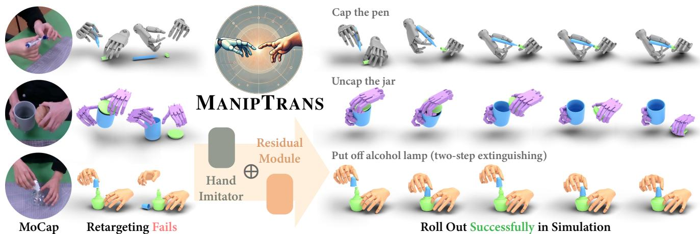
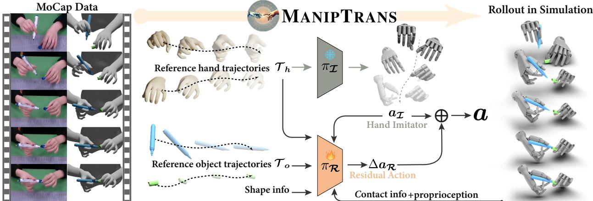
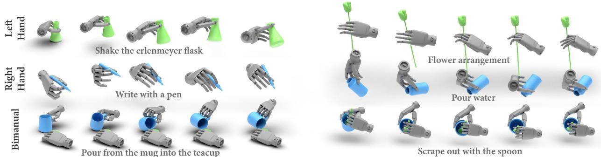
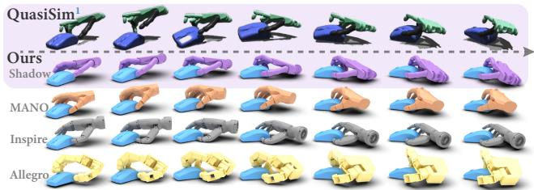
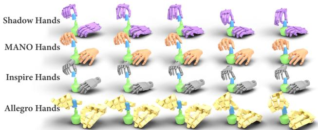
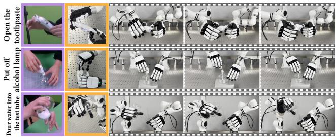
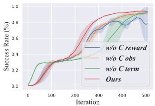
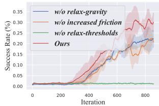

# MANIPTRANS: Efficient Dexterous Bimanual Manipulation Transfer via Residual Learning

Kailin Li1 Puhao Li1,2 Tengyu Liu1 Yuyang Li1,3 Siyuan Huang1

1State Key Laboratory of General Artificial Intelligence, BIGAI

2Department of Automation, Tsinghua University 3Institute for Artificial Intelligence, Peking University

  
Figure 1. MANIPTRANS for Bimanual Dexterous Manipulations. Retargeting methods often struggle with transferring MoCap data to physically plausible motions, while our MANIPTRANS efficiently produces task-compliant, physically accurate motions. It also general izes across embodiments like Inspire hands [3], Shadow hands [1], and articulated MANO hands [27, 94].

## Abstract

Human hands play a central role in interacting, motivating increasing research in dexterous robotic manipulation. Data-driven embodied AI algorithms demand precise, large-scale, human-like manipulation sequences, which are challenging to obtain with conventional reinforcement learning or real-world teleoperation. To ad dress this, we introduce MANIPTRANS, a novel two-stage methodfor efficiently transferring human bimanual skills to dexterous robotic hands in simulation. MANIPTRANS first pre-trains a generalist trajectory imitator to mimic hand motion, then fine-tunes a specific residual module under interaction constraints, enabling efficient learning and accurate execution of complex bimanual tasks. Experiments show that MANIPTRANS surpasses state-of-the-art methods in success rate, fidelity, and efficiency. Leveraging MANIPTRANS, we transfer multiple hand-object datasets to robotic hands, creating DEXMANIPNET, a large-scale dataset featuring previously unexplored tasks like pen capping and bottle unscrewing. DEXMANIPNET comprises 3.3K episodes ofrobotic manipulation and is easily extensible, facilitating further policy training for dexterous hands

and enabling real-world deployments.

## 1. Introduction

Embodied AI (EAI) has advanced rapidly in recent years, with increasing efforts to enable AI-driven embodiments to interact with physical or virtual environments. Just as human hands are pivotal for interaction, much research in EAI focuses on dexterous robotic hand manipulation [4, 16– 22, 41, 46, 50, 56, 57, 61, 63, 64, 66, 68, 70, 73, 75, 79, 80, 102, 111, 113, 116, 127, 128]. Achieving human-like proficiency in complex bimanual tasks holds significant research value and is crucial for progress toward general AI.

Thus, the rapid acquisition of precise, large-scale, and human-like dexterous manipulation sequences for datadriven embodied agents training [11, 12, 25, 81, 130] becomes increasingly urgent. Some studies use reinforcement learning (RL) [52, 97] to explore and generate dexterous hand actions [27, 67, 75, 109, 119, 132, 133], while others collect human-robot paired data through teleoperation [26, 44, 45, 80, 101, 111, 125]. Both methods are limited: traditional RL requires carefully designed, taskspecific reward functions [76, 132], restricting scalability and task complexity, while teleoperation is labor-intensive and costly, yielding only embodiment-specific datasets.

A promising solution is to transfer human manipulation actions to dexterous robotic hands in simulated environments via imitation learning [69, 78, 91, 110, 136]. This approach offers several advantages. First, imitating human manipulation trajectories creates naturalistic hand-object interactions, enabling more fluid and human-like motions. Second, abundant motion-capture (MoCap) datasets [10, 14, 32, 37, 39, 55, 60, 71, 72, 105, 117, 123, 131] and hand pose estimation techniques [13, 43, 65, 85, 106, 118, 120– 122, 124] makes extracting operational knowledge from human demonstrations easily accessible [91, 100]. Third, simulations provide a cost-effective validation, offering a shortcut to real-world robot deployment [41, 44, 49].

Yet, achieving precise and efficient transfer is non-trivial. As shown in Fig. 1, morphological differences between human and robotic hands lead to direct pose retargeting suboptimal. Additionally, although MoCap data is relatively accurate, error accumulation can still lead to critical failures during high-precision tasks. Moreover, bimanual manipulation introduces a high-dimensional action space, significantly increasing the difficulty of efficient policy learning. Consequently, most pioneering work generally stops at single-hand grasping and lifting tasks [27, 109, 119, 132], leaving complex bimanual activities—such as unscrewing a bottle or capping a pen—largely unexplored.

In this paper, we propose a simple but efficient method, MANIPTRANS, which facilitates the transfer of hand manipulation skills—especially bimanual actions—to dexterous robotic hands in simulation, enabling accurate tracking of reference motions. Our key insight is to treat the transfer as a two-stage process: a pre-training trajectory imitation stage focusing on hand motion alone, followed by a specific action fine-tuning stage that meets interaction constraints. Specifically, we design a robust generalist model that learns to accurately mimic human finger motions with resilience to noise. Based on this initial imitation, we then introduce a residual learning module [47, 49, 51, 104] that incrementally refines the robot’s actions, focusing on two key aspects: 1) ensuring stable contact with object surfaces under physical constraints, enabling effective object manipulation, and 2) coordinating both hands to ensure precise, high-fidelity execution of complex bimanual operations.

The advantages of this design are threefold: 1) In the first stage, focusing on dynamic hand mimicry with largescale pretraining effectively mitigates morphological differences. 2) Building on this advantage, the second stage concentrates on tracking bimanual object interactions, enabling precise capture of subtle movements and facilitating natural, high-fidelity manipulation. 3) It significantly reduces action space complexity by decoupling human hand motion imitation from physics-based object interaction constraints, thus improving training efficiency.

Building on this framework, MANIPTRANS corrects arbitrary, noisy hand MoCap data into physically plausible motion without predefined stages (e.g., “approachinggrasping-manipulation”) or task-specific reward engineering. We, therefore, validate its effectiveness and efficiency across a range of complex single- and bimanual manipulations, including articulated object handling [32, 34, 60, 105, 131]. Using MANIPTRANS, we transfer several representative hand-object manipulation datasets [60, 131] to dexterous robotic hands in the Isaac Gym simulation [77], constructing the DEXMANIPNET dataset, which achieves marked improvements in motion fidelity and compliance. Currently, DEXMANIPNET comprises 3.3K episodes and 1.34 million frames of robotic hand manipulation, covering previously unexplored tasks such as pen capping, bottle cap unscrewing, and chemical experimentation.

We experimentally demonstrate that MANIPTRANS outperforms baseline methods in both motion precision and transfer success rate. Notably, it surpasses prior state-ofthe-art (SOTA) approaches in transfer efficiency, even on a personal computer. To evaluate its extensibility, we conducted cross-embodiment experiments applying MANIP-TRANS to dexterous hands with varying degrees of freedom (DoFs) and morphologies, achieving consistent performance with minimal additional effort. Furthermore, we replay DEXMANIPNET’s bimanual trajectories on realworld devices, demonstrating agile and natural dexterous manipulation that, to the best of our knowledge, has not been achieved by previous RL- or teleoperation-based methods. Finally, we benchmark DEXMANIPNET using several imitation learning frameworks, underscoring its value to the research community.

In summary, our contributions are as follows:

• We introduce MANIPTRANS, a simple yet effective twostage transfer framework that enables precise transfer of human bimanual manipulation to dexterous robotic hands in simulation, ensuring accurate tracking of both hand and object reference motions.

• Using this framework, we construct DEXMANIPNET, a large-scale, high-quality dataset featuring a wide array of novel bimanual manipulation tasks with high precision and compliance. DEXMANIPNET is extensible and serves as a valuable resource for future policy training.

• Our experiments show that MANIPTRANS outperforms previous SOTA methods. We further demonstrate its generalizability across various dexterous hand configurations and its feasibility for real-world deployment.

## 2. Related Works

Dexterous Manipulation via Human Demonstration Learning manipulation skills from human demonstrations offers an intuitive and effective approach to transferring human abilities to robots [6, 31, 126, 129]. Imitation learning has shown considerable promise in achieving this transfer [7, 23, 62, 69, 78, 87, 88, 107, 110, 136, 139]. Recent studies focus on learning RL policies guided by object trajectories [21, 22, 70, 75, 139]. QuasiSim [70] advances this approach by directly transferring reference hand motions to robotic hands via parameterized quasiphysical simulators. However, these methods are limited to simpler tasks and are computationally intensive. More recently, tailored solutions using task-specific reward functions have been developed for challenging tasks like bimanual lip-twisting [66, 68]. In contrast, our method enables efficient learning of complex manipulation tasks without task-specific reward engineering.

Dexterous Hand Datasets Object manipulation is fundamental for embodied agents. Numerous MANO-based [94] hand-object interaction datasets exist [9, 10, 14, 28, 32, 36, 37, 39, 40, 42, 53, 55, 58–60, 71, 72, 91, 98, 105, 117, 123, 131, 138, 140]. However, these datasets often prioritize pose alignment with 2D images while neglecting physical constraints, limiting their applicability for robotic training. Teleoperation methods [26, 44, 45, 90, 111, 115, 125, 137] collect human-to-robot hand matching data online using AR/VR systems [15, 24, 30, 50, 84] or vision-based Mo-Cap [92, 111, 112] for real-time data acquisition and correction with humans in the loop. However, teleoperation is labor-intensive and time-consuming, and the absence of tactile feedback often yields stiff, unnatural actions, hindering fine-grained manipulation. In contrast, our method enables offline transfer of human demonstrations to robots. Our DEXMANIPNET offers a large, easily expandable collection of human demonstration episodes.

Residual Learning Due to the sample inefficiency and time-consuming nature of RL training, residual policy learning [51, 96, 104], which incrementally refines action control, is widely adopted to enhance efficiency and stability. In dexterous hand manipulation, various studies explore residual strategies tailored to specific tasks [5, 21, 29, 38, 96, 116, 135, 136]. For instance, [38] integrates user input during residual policy training, while [49] learns corrective actions from human demonstrations. GraspGF [116] employs a pre-trained score-based generative model as a base, and [21] decomposes the imitation task into wrist following and finger motion control, integrating a residual wrist control policy. Additionally, [47] constructs a mixture-of-experts system [48] using residual learning, and DexH2R [136] applies residual learning directly to retargeted robotic hand actions. Our method differs from these approaches by pre-training a finger motion imitation model that incorporates additional dynamic information, followed by fine-tuning a residual policy to adapt to task-specific physical constraints. This approach is more efficient and generalizable across various manipulation tasks.

## 3. Method

We provide an overview of our method in Fig. 2. Given reference human hand–object interaction trajectories, our goal is to learn a policy that enables dexterous robotic hands to accurately replicate these trajectories in simulation while satisfying the task’s semantic manipulation constraints. To this end, we propose a two-stage framework: the first stage trains a general hand trajectory imitation model, and the second stage employs a residual model to refine the initial coarse motion into task-compliant actions.

## 3.1. Preliminaries

Without loss of generality, we formulate the manipulation transfer problem in a complex bimanual setting, where the left and right dexterous hands, $d = \{ d _ { l } , d _ { r } \}$ , aim to replicate the behavior of human hands, $\pmb { h } \ = \ \{ h _ { l } , h _ { r } \}$ , which interact with two objects, $\textbf { \em o } = \left\{ { \boldsymbol o } _ { l } , { \boldsymbol o } _ { r } \right\}$ , in a cooperative manner (e.g., in a pen-capping task where one hand holds the cap while the other grips the pen body). The reference trajectories from human demonstrations are defined as $\mathcal { T } _ { h } = \{ \tau _ { h } ^ { t } \} _ { t = 1 } ^ { T }$ and $\mathscr { T } _ { o } = \{ \tau _ { o } ^ { t } \} _ { t = 1 } ^ { T }$ , where T represents the total number of frames. The trajectory $\tau _ { h }$ for each hand includes the wrist’s 6-DoF pose $\boldsymbol { w } _ { h } \in \mathbb { S E } ( 3 )$ , the linear and angular velocities $\dot { \boldsymbol { w } } _ { h } = \{ \boldsymbol { v } _ { h } , \boldsymbol { u } _ { h } \}$ , and the finger joint positions ${ \boldsymbol { j } } _ { h } \in \mathbb { R } ^ { F \times 3 }$ defined by MANO [94], along with their respective velocities $\dot { \boldsymbol j } _ { h } = \{ \boldsymbol v _ { j } , \boldsymbol u _ { j } \}$ ; here, F denotes the number of hand keypoints, including the fingertips. Similarly, the object trajectory $\tau _ { o }$ for each object includes its 6-DoF pose $\pmb { p _ { o } } \in \mathbb { S E } ( 3 )$ and the corresponding linear and angular velocities $\dot { \boldsymbol { p } } _ { o } = \{ \boldsymbol { v } _ { o } , \boldsymbol { u } _ { o } \}$ . To reduce spatial complexity, we normalize all translations relative to the dexterous hand’s wrist position while preserving the original rotations to maintain the correct gravity direction.

We model this problem as an implicit Markov Decision Process (MDP) $\mathcal { M } = \langle \pmb { S } , \pmb { A } , \pmb { \mathsf { T } } , \pmb { \mathsf { R } } , \gamma \rangle$ , where S represents the state space, A the action space, T the transition dynamics, R the reward function, and $\gamma$ the discount factor. The action for each dexterous hand at time t, denoted as ${ \mathbf { } } { \mathbf { } } { \mathbf { } } { \mathbf { } } ^ { t } \in { \mathcal { A } } ,$ comprises the target positions of each dexterous hand’s joint ${ \pmb a } _ { { \pmb q } } ^ { t } \in \mathbb { R } ^ { K }$ for proportional-derivative (PD) control, and the 6-DoF force $\boldsymbol { a } _ { w } ^ { t } \in \mathbb { R } ^ { 6 }$ applied to the robotic wrist, similar to prior work [47, 109, 119], where K denotes the total number of robotic hand revolute joints (i.e. the DoF).

Our approach divides the transfer process into two stages: 1) a pre-trained hand-only trajectory imitation model I, and 2) a residual module R that fine-tunes the coarse actions to ensure task compliance. The state at time t is defined separately for each stage as $s _ { \tau } ^ { t } \ \in \ S _ { \tau }$ and $s _ { \mathcal { R } } ^ { t } ~ \in ~ \pmb { S } _ { \mathcal { R } }$ , with corresponding reward functions $r _ { \mathcal { Z } } ^ { t } ~ =$ $\mathsf { R } ( s _ { \mathbb { Z } } ^ { t } , a _ { \mathbb { Z } } ^ { t } )$ and $\boldsymbol { r } _ { \mathcal { R } } ^ { t } = \mathsf { R } ( \boldsymbol { s } _ { \mathcal { R } } ^ { t } , \boldsymbol { a } _ { \mathcal { R } } ^ { t } )$ as described in Sec. 3.2 and Sec. 3.3. For both stages, we employ proximal policy optimization (PPO) [97] to maximize the discounted reward $\begin{array} { r } { \mathbb E \left[ \sum _ { t = 1 } ^ { T } \gamma ^ { t - 1 } r _ { \mathrm { s t a g e } } ^ { t } \right] } \end{array}$ , following previous methods [19, 87].

  
Figure 2. Our MANIPTRANS Pipeline. We first pre-train a hand motion imitation model with large-scale human demonstrations, then fine-tune a residual policy to adapt to task-specific physical constraints.

## 3.2. Hand Trajectory Imitating

In this stage, our objective is to learn a general hand trajectory imitation model, I, capable of accurately replicating detailed human finger motions. The state for each dexterous hand at time t is defined as $s _ { \mathcal { T } } ^ { t } = \{ \tau _ { h } ^ { t } , s _ { \mathrm { p r o p } } ^ { t } \}$ , which includes the target hand trajectory $\tau _ { h } ^ { t }$ and the current proprioception $\boldsymbol { s } _ { \mathrm { p r o p } } ^ { t } = \{ \boldsymbol { q } _ { d } ^ { t } , { \dot { \boldsymbol { q } } _ { d } ^ { t } } , \boldsymbol { w } _ { d } ^ { t } , { \dot { \boldsymbol { w } } _ { d } ^ { t } } \}$ . Here, $\pmb { q } _ { d } ^ { t }$ and ${ \boldsymbol { w } _ { d } ^ { t } }$ denote the joint angles and wrist poses, respectively, along with their corresponding velocities. We aim to train the policy $\pi \underline { { \tau } } ( { \bf { a } } ^ { t } | { s } _ { \mathbb { Z } } ^ { t } , { a } ^ { \hat { t } - 1 } )$ using RL to determine the actions $\mathbf { } a _ { \mathcal { Z } } ^ { t } .$ Reward Functions. The reward function $r _ { \mathcal { Z } } ^ { t }$ is designed to encourage the dexterous hands to track the reference hand trajectory $\tau _ { h } ^ { t }$ while ensuring stability and smoothness. It comprises three components: 1) Wrist tracking reward $r _ { \mathrm { w r i s t } } ^ { t } \colon$ This reward minimizes the difference: ${ \boldsymbol { w } _ { d } ^ { t } } \textcircled { = } { \boldsymbol { w } _ { h } ^ { t } }$ and $\dot { \pmb w } _ { d } ^ { t } - \dot { \pmb w } _ { h } ^ { t } , \in$ denotes the difference in SE(3) space. 2) Finger imitation reward $r _ { \mathrm { f i n g e r } } ^ { t }$ : This component encourages the dexterous hand to closely follow the reference finger joint positions. We manually select F finger keypoints on the dexterous hand corresponding to the MANO model, denoted as $j _ { d } .$ The weights $w _ { f }$ and decay rates $\lambda _ { f }$ are empirically set to emphasize the fingertips, particularly those of the thumb, index, and middle fingers. The parameters are in the Appx. This design helps mitigate the impact of morphological differences between human and robotic hands:

$$
\begin{array} { r } { r _ { \mathrm { f i n g e r } } ^ { t } = \sum _ { f = 1 } ^ { F } w _ { f } \cdot \exp { ( - \lambda _ { f } \Vert \pmb { j } _ { d _ { f } } ^ { t } - \pmb { j } _ { h _ { f } } ^ { t } \Vert _ { 2 } ^ { 2 } ) } } \end{array}\tag{1}
$$

3) Smoothness Reward $r _ { \mathrm { s m o o t h } } ^ { t } \mathrm { . }$ To alleviate jerky motions, we introduce a smoothness reward that penalizes the power exerted on each joint, defined as the element-wise product of joint velocities and torques, similar to the approach in [74]. The total reward is defined as: $r _ { \pm } ^ { t } = w _ { \mathrm { w r i s t } } \cdot r _ { \mathrm { w r i s t } } ^ { t } +$ $w _ { \mathrm { f i n g e r } } \cdot r _ { \mathrm { f i n g e r } } ^ { t } + w _ { \mathrm { s m o o t h } } \cdot r _ { \mathrm { s m o o t h } } ^ { t } .$

Training Strategy. Decoupling hand imitation from object interaction offers additional benefits; specifically, $\pi \pmb { \tau }$ does not require challenging-to-acquire manipulation data. We train the policy using hand-only datasets, including existing hand motion collections [14, 36, 60, 105, 131, 134, 141] and synthetic data generated via interpolation [103]. To balance training data between the left and right hands, we mirror these datasets; training time and additional details are provided in the Appx. For efficiency, we employ reference state initialization (RSI) and early termination [86, 87]. If the dexterous hand keypoints $j _ { d }$ deviate beyond a threshold $\epsilon _ { \mathrm { { f i n g e r } } } .$ , the episode terminates early and resets to a randomly sampled MoCap state. We also utilize curriculum learning [8], gradually reducing $\epsilon _ { \mathrm { f i n g e r } }$ to encourage broad exploration initially, then focusing on fine-grained finger control.

## 3.3. Residual Learning for Interaction

Building on the pre-trained $\pi \underline { { \tau } } .$ , we use a residual module R to refine coarse actions and satisfy task-specific constraints. State Space Expansion for Interaction. To account for interactions between the dexterous hands and objects, we expand the state space beyond the hand-related states $s _ { \mathcal { Z } } ^ { t }$ by incorporating additional interaction-related information. First, we compute the convex hull [114] of the object meshes o from MoCap data to generate the collidable object oˆ in the simulation environment. To manipulate the object along the reference $\scriptstyle { \mathcal { T } } _ { o } ,$ we include the object’s position $\pmb { p _ { \hat { o } } }$ (relative to the wrist position $\pmb { w } _ { d } )$ and velocities $\dot { p } _ { \hat { o } } ,$ , center of mass $\mathbf { \nabla } m _ { \hat { o } } .$ , and gravitational force vector $G _ { \hat { o } } .$ To better encode the object’s shape, we utilize the BPS representation [89]. Additionally, for enhancing perception, we encode the spatial relationship between the hands and the object using the distance metric: $D ( j _ { d } ^ { t } , \boldsymbol { p } _ { \hat { o } } ^ { t } ) = \| j _ { d } ^ { t } - \boldsymbol { p } _ { \hat { o } } ^ { t } \| _ { 2 } ^ { 2 }$ , measuring the squared Euclidean distance between the dexterous hand keypoints and the object’s position. Furthermore, we explicitly include the contact force C obtained from the simulation, capturing the interaction between the fingertips and the object’s surface. This tactile feedback is critical for stable grasping and manipulation, ensuring precise control during complex tasks. In summary, the expanded interaction state for the residual module is defined as: $s _ { \mathrm { i n t e r a c t } } ^ { t } =$ $\{ \tau _ { o } ^ { t } , p _ { \hat { o } } ^ { t } , \dot { p } _ { \hat { o } } ^ { t } , m _ { \hat { o } } ^ { t } , G _ { \hat { o } } ^ { t } , \mathrm { B P S } ( \hat { o } ) , D ( j _ { d } ^ { t } , p _ { \hat { o } } ^ { t } ) , C ^ { t } \}$ Residual Actions Combining Strategy. Given the combined state $s _ { \mathcal { R } } ^ { t } = s _ { \mathcal { T } } ^ { t } \cup s _ { \mathrm { i n t e r a c t } } ^ { t } ,$ our goal is to learn residual actions $\Delta \boldsymbol { a } _ { \mathcal { R } } ^ { t }$ that refine the initial imitation actions $\mathbf { } \mathbf { } \mathbf { } \mathbf { } \mathbf { } \mathbf { } \mathbf { } \mathbf { } \mathbf { } \mathbf { } \mathbf { } \mathbf { } \mathbf { } \mathbf { } \mathbf { } \mathbf { } \mathbf { } \mathbf { } \mathbf { } \mathbf { } \mathbf { } \mathbf { } \mathbf { } \mathbf { } \mathbf { } \mathbf { } \mathbf { } \mathbf { } \mathbf { } \mathbf { } \mathbf { } \mathbf { } \mathbf { } \mathbf { } \mathbf { } \mathbf { } \mathbf { } \mathbf { } \mathbf { } \mathbf { } \mathbf { } \mathbf { } \mathbf { } \mathbf { } \mathbf { } \mathbf { } \mathbf { } \mathbf { } \mathbf { } \mathbf { } \mathbf { } \mathbf { } \mathbf { } \mathbf { } \mathbf { } \mathbf { } \mathbf { } \mathbf { } \mathbf { } \mathbf { } \mathbf { } \mathbf { } \mathbf { } \mathbf { } \mathbf { } \mathbf { } \mathbf { } \mathbf { } \mathbf { } \mathbf { } \mathbf { } \mathbf { } \mathbf { } \mathbf { } \mathbf { } \mathbf { } \mathbf { } \mathbf { } \mathbf { } \mathbf { } \mathbf { } \mathbf { } \mathbf { } \mathbf { } \mathbf { } \mathbf { } \mathbf { } \mathbf { } \mathbf { } \mathbf { } \mathbf { } \Xi \mathbf { } \mathbf { } \mathbf { } \mathbf { } \mathbf { } \mathbf { } \mathbf { } \mathbf { } \Xi \mathbf { } \mathbf { } \mathbf \Xi \mathbf { } \mathbf { } \mathbf { } \mathbf \Xi \Xi \mathbf { } \mathbf { } \mathbf \Xi \mathbf { } \mathbf \Xi \Xi \mathbf { } \mathbf \Xi \Xi \mathbf { } \mathbf \Xi \Xi \mathbf { } \mathbf \Xi \Xi \mathbf \Xi \Xi \Xi \mathbf \Xi \Xi \Xi \mathbf \Xi \Xi \Xi \mathbf \Xi \Xi \Xi \mathbf \Xi \Xi \Xi \mathbf \Xi \Xi \Xi \mathbf \Xi \Xi \Xi \mathbf \Xi \Xi \Xi \mathbf \Xi \Xi \Xi \mathbf \Xi \Xi \mathbf \Xi \Xi \Xi \mathbf \Xi \Xi \mathbf \Xi \Xi \Xi \mathbf \Xi \Xi \Xi \mathbf \Xi \Xi \mathbf \Xi \Xi \mathbf \Xi \Xi \mathbf \Xi \Xi \mathbf \Xi \Xi \mathbf \Xi \Xi \mathbf \Xi \mathbf \Xi \Xi \mathbf \Xi \Xi \mathbf \Xi \mathbf \Xi \mathbf \Xi \Xi \mathbf \Xi \mathbf \Xi \mathbf \Xi \mathbf \Xi \mathbf \Xi \mathbf \Xi \mathbf \Xi \mathbf \Xi \mathbf \Xi \mathbf $ to ensure task compliance. During each step of the manipulation episode, we first sample the imitation action $\bar { \mathbf { a } } _ { \mathcal { T } } ^ { t } \sim \pi \underline { { \tau } } ( \bar { \mathbf { a } } ^ { t } | s _ { \mathcal { T } } ^ { t } , \mathbf { a } ^ { t - 1 } )$ . Conditioned on this action, we then sample the residual correction $\Delta \boldsymbol { a } _ { \mathcal { R } } ^ { t }$ ∼ $\pi _ { \mathcal { R } } ( \Delta \boldsymbol { \mathbf { \mathit { a } } } ^ { t } | \boldsymbol { \mathbf { \mathit { s } } } _ { \mathcal { R } } ^ { t } , \boldsymbol { \mathbf { \mathit { a } } } _ { \mathcal { T } } ^ { t } , \boldsymbol { \mathbf { \mathit { a } } } ^ { t - 1 } )$ . The final action is computed as: $\begin{array} { r } { \textbf { \em a } ^ { t } \ = \ \textbf { \em a } _ { \tt T } ^ { t } + \Delta \textbf { \em a } _ { \mathcal { R } } ^ { t } } \end{array}$ , where the residual action is added element-wise. The resulting action $\mathbf { \Omega } _  \mathbf { \Omega } \mathbf { \Omega } \mathbf { \Omega } \mathbf { \Omega } \mathbf { \Omega } \mathbf { \Omega } \mathbf { \Omega } \mathbf { \Omega } \mathbf { a } ^ { t } \mathbf { \Omega } \mathrm { \Omega }$ is then clipped to adhere to the dexterous hand’s joint limits. At the start of training, since the dexterous hand movements already approximate the reference hand trajectory, the residual actions are expected to be close to zero. This initialization helps prevent model collapse and accelerates convergence. We achieve this by initializing the residual module with a zeromean Gaussian distribution and employing a warm-up strategy to gradually activate its training.

Reward Functions. Our objective is to efficiently transfer human bimanual manipulation skills to dexterous robotic hands in a task-agnostic manner. To this end, we avoid taskspecific reward engineering, which, although beneficial for individual tasks, can limit generalization. Therefore, our reward design remains simple and general. In addition to the hand imitation reward $r _ { \mathcal { Z } } ^ { t }$ discussed in Sec. 3.2, we introduce two additional components: 1) Object following reward $r _ { \mathrm { o b j e c t } } ^ { t } \mathrm { : }$ Minimizes positional and velocity differences between the simulated object and its reference trajectory, specifically $p _ { \hat { o } } ^ { t } \ominus p _ { o } ^ { t }$ and $\dot { p } _ { \hat { o } } ^ { t } - \dot { p } _ { o } ^ { t } , 2 )$ Contact force reward $r _ { \mathrm { c o n t a c t } } ^ { t } { \mathrm { : } }$ Encourages appropriate contact force when the hand-object distance in the MoCap dataset is below a specified threshold $\xi _ { \mathrm { c } }$ . The reward is defined as:

$$
r _ { \mathrm { c o n t a c t } } ^ { t } = w _ { \mathrm { c } } \cdot \exp \big ( \frac { - \lambda _ { \mathrm { c } } } { \sum _ { f = 1 } ^ { F } C _ { d _ { f } } ^ { t } \cdot \mathbb { 1 } \left( D ( j _ { h _ { f } } ^ { t } , p _ { o } ^ { t } \cdot o ) < \xi _ { \mathrm { c } } \right) } \big )\tag{2}
$$

where $D ( j _ { h _ { f } } ^ { t } , \boldsymbol { p } _ { o } ^ { t } \cdot o )$ represents the minimum distance between the fingertip $h _ { f }$ and the transformed object surface, 1(·) is the indicator function, and $C _ { d _ { f } } ^ { t }$ denotes the contact force at the fingertip. The weight $w _ { \mathrm { c } }$ and decay rate $\lambda _ { \mathrm { c } }$ are empirically set to balance the reward function. The total reward for the residual stage is defined as $r _ { \mathcal { R } } ^ { t } = r _ { \frac { \tau } { 2 } } ^ { t } + w _ { \mathrm { o b j e c t } } \cdot r _ { \mathrm { o b j e c t } } ^ { t } + w _ { \mathrm { c o n t a c t } } \cdot r _ { \mathrm { c o n t a c t } } ^ { t } .$

Training Strategy. Inspired by prior work [70, 82, 83] that utilizes quasi-physical simulators to relax constraints during training and avoid local minima, we introduce a relaxation mechanism in the residual learning stage. Unlike [70], which employs custom simulations, we adjust the physical constraints directly within the Isaac Gym environment [77] to enhance training efficiency. Specifically, we initially set the gravitational constant $\mathcal { G }$ to zero and the friction coefficient $\mathcal { F }$ to a high value. This setup allows the robotic hands to, early in training, grip objects firmly and efficiently align with reference trajectories. As training progresses, we gradually restore $\mathcal { G }$ to its true value and reduce $\mathcal { F }$ to a suitable value to approximate real interactions. Similar to the imitation stage, we adopt RSI, early termination, and curriculum learning strategies. Each episode initializes the robotic hands by randomly selecting a non-colliding nearobject state from the preprocessed trajectory. During training, if the object’s pose $p _ { \hat { o } } ^ { t }$ deviates beyond a predefined threshold $\boldsymbol { \epsilon } _ { \mathrm { o b j e c t } }$ , the episode is terminated early. We progressively reduce $\boldsymbol { \epsilon } _ { \mathrm { o b j e c t } }$ to encourage more precise object manipulation. Additionally, we introduce a contact termination condition: if MoCap data indicates a firm grasp by the human hands (i.e., $D ( j _ { h _ { f } } ^ { t } , p _ { o } ^ { t } \cdot o ) < \xi _ { \mathrm { t } }$ , where $\xi _ { \mathrm { t } }$ is the termination threshold), the contact force $C _ { d _ { f } } ^ { t }$ must be nonzero. Failure to meet this condition results in early termination. This mechanism ensures the agent learns to control contact forces, promoting stable object manipulation.

## 3.4. DEXMANIPNET Dataset

Using MANIPTRANS, we generate DEXMANIPNET, derived from two representative large-scale hand-object interaction datasets: FAVOR [60] and OakInk-V2 [131]. FA-VOR employs VR-based teleoperation with human-in-theloop corrections, focusing on foundational tasks like object rearrangement. In contrast, OakInk-V2 utilizes optical tracking-based motion capture, targeting more complex interactions such as pen capping and bottle unscrewing.

Due to the lack of standardization in dexterous robotic hands, we adopt the Inspire Hand [3] as our primary platform for its high dexterity, stability, cost-effectiveness, and extensive prior use [24, 35, 50]. To address the complexity of bimanual tasks, we employ a simulated 12-DoF configuration of the Inspire Hand, enhancing flexibility compared to its real-world 6-DoF mechanism. We demonstrate MA-NIPTRANS’s adaptability to other robotic hands and realworld deployment in Sec. 4.4 and Sec. 4.5.

Our DEXMANIPNET encompasses 61 diverse and challenging tasks as defined in [131], comprising 3.3K episodes of robotic hand manipulation over 1.2K objects, totaling 1.34 million frames, including ∼ 600 sequences involving complex bimanual tasks. Each episode executes precisely in the Isaac Gym simulation [77]. In comparison, a recent dataset generated via automated augmentation [50] includes only 60 source human demonstrations across 9 tasks.

## 4. Experiments

In experiments, we describe the dataset setup and metrics (Sec. 4.1), followed by implementation details (Sec. 4.2). We then compare MANIPTRANS with SOTA methods (Sec. 4.3), demonstrate cross-embodiment generalization (Sec. 4.4), validate real-world deployment (Sec. 4.5), conduct ablation studies (Sec. 4.6), and benchmark DEXMA-NIPNET for learning manipulation policies (Sec. 4.7).

## 4.1. Datasets and Metrics

Datasets For quantitative evaluation, we use the official validation dataset of OakInk-V2 [131], approximately half of which consists of bimanual tasks. To assess transfer capabilities, we manually select MoCap sequences that meet task completeness and semantic relevance, filtering them to durations of 4–20 seconds and downsampling to 60 fps. We exclude sequences involving deformable or oversized ob jects, resulting in ∼ 80 episodes. For qualitative evalua tion, we also incorporate the GRAB [105], FAOVR [60], and ARCTIC [32] datasets to demonstrate our advantages. Metrics To evaluate MANIPTRANS in terms of manipulation precision, task compliance, and transfer efficiency, we introduce the following metrics. These are adapted from [70] but are more stringent due to the complexity of our bimanual tasks: 1) Per-frame Average Object Rotation and Translation Error: $\begin{array} { r } { E _ { r } = \frac { 1 } { T } \sum _ { t = 1 } ^ { T } ( { \pmb { p } } _ { \mathrm { r o t } \hat { \pmb { o } } } ^ { \ { } t } \cdot \left( { \pmb { p } } _ { \mathrm { r o t } { \pmb { o } } } ^ { \ { } t } \right) ^ { - 1 } ) } \end{array}$ and $\begin{array} { r } { E _ { t } \ = \ \frac 1 T \sum _ { t = 1 } ^ { T } \| \pmb { p } _ { \mathrm { t s l } } _ { \hat { \pmb { o } } } ^ { t } - \pmb { p } _ { \mathrm { t s l } _ { o } } ^ { t } \| _ { 2 } ^ { 2 } } \end{array}$ . Here, ${ \pmb p } _ { \mathrm { r o t } }$ and $\scriptstyle { p _ { \mathrm { t s l } } }$ are the rotation and translation components of the 6-DoF pose p, respectively. Errors $E _ { r }$ and $E _ { t }$ are reported in degrees and centimeters. 2) Mean Per-Joint Position Error (in cm): $\begin{array} { r } { E _ { j } = \frac { 1 } { T \cdot F } \sum _ { t = 1 } ^ { T } \sum _ { f = 1 } ^ { F } \| j _ { d _ { f } } ^ { t } - j _ { h _ { f } } ^ { t } \| _ { 2 } ^ { 2 } } \end{array}$ . This metric measures the average error in the positions of the hand joints. 3) Mean Per-Fingertip Position Error (in cm): $\begin{array} { r } { E _ { f t } \stackrel {  } { = } \frac { 1 } { T \cdot M } \sum _ { t = 1 } ^ { T } \sum _ { f t = 1 } ^ { M } \| t _ { d _ { f t } } ^ {  } - \dot { \pmb { t } } _ { h _ { f t } } ^ { t } \| _ { 2 } ^ { 2 } } \end{array}$ . This metric evaluates the mimicry quality of fingertip t motions, accounting for morphological differences between human and robotic hands. Here, M equals 5 for single-hand tasks and 10 for bimanual tasks. 4) Success Rate (SR): A tracking attempt is deemed successful if $E _ { r } , E _ { t } , E _ { j }$ , and $E _ { f t }$ are all below the specified thresholds: 30◦, 3 cm, 8 cm, and 6 cm, respectively. For bimanual tasks, the trajectory is considered failed if either hand fails to meet these conditions, making the success criterion stricter compared to single-hand tasks.

## 4.2. Implementation Details

In MANIPTRANS, we manually selected F = 21 keypoints on each dexterous robotic hand, corresponding to the fingertips, palm, and phalangeal positions on the human hand, to mitigate the morphological differences. Details on keypoint selection and weight coefficients w for reward terms are provided in Appx. For training, we use a curriculum learning strategy. The initial threshold $\epsilon _ { \mathrm { f i n g e r } }$ is set to 6 cm and decays to 4 cm. Object alignment thresholds $\boldsymbol { \epsilon } _ { \mathrm { o b j e c t } }$ start at $9 0 ^ { \circ }$ and 6 cm for rotation and translation, gradually decreasing to $3 0 ^ { \circ }$ and $2 \ : c m$ . We train both the imitation module I and residual module R using the Actor-Critic PPO algorithm [97], with a training horizon of 32 frames, a minibatch size of 1024, and a discount factor $\gamma = 0 . 9 9$ . Optimization employs Adam [54] with an initial learning rate of $5 \times 1 0 ^ { - 4 }$ and a decay scheduler. All experiments are run in Isaac Gym [77], simulating 4096 environments at a time step of 1/60 s on a personal computer equipped with an NVIDIA RTX 4090 GPU and an Intel i9-13900KF CPU.

## 4.3. Evaluations

As discussed in Sec. 2, dexterous hand manipulation advances rapidly, with previous approaches differing in problem formulations and task definitions. To offer a comprehensive and fair comparison, we evaluate two categories of methods—RL-combined and optimization-based—to demonstrate MANIPTRANS’s accuracy and efficiency.

Comparison with RL-Combined Methods Due to the lack of publicly available code for prior RL-combined methods, we reimplement representative approaches: 1) RL-Only exploration using only trajectory-following rewards, employing the PPO algorithm to train the robotic hand from scratch based on [27]; 2) Retarget + Residual learning, applying residual action to retargeted robotic hand poses obtained via alignment between human and robot keypoints [92]. As a naive baseline, we also include the Retarget-Only method—retargeting without any learning.

As shown in Tab. 1, our method outperforms all baselines across multiple metrics, demonstrating superior precision in both single- and bimanual tasks. These results confirm that our two-stage transfer framework effectively captures subtle finger motions and object interactions, leading to high task success rates and motion fidelity.

We find that the Retarget-Only baseline is nearly infeasible due to the complexity of the dexterous hand action space and error accumulation. The $R L  – O n l y$ baseline performs suboptimally since exploration from scratch is timeconsuming and reduces motion precision. Compared to the Retarget + Residual baseline, our method—leveraging a pre-trained hand imitation model—demonstrates improved control capabilities, enabling more accurate manipulation aligned with the reference trajectory. Notably, the Retargeting method often causes collisions in contact-rich scenarios, resulting in instability during residual policy training. We further study MANIPTRANS’s robustness and time cost in Appx. Fig. 3 shows the qualitative results on seldom-explored tasks, highlighting the natural and precision of MANIPTRANS transferring human manipulation skills. Additional details and more qualitative results applying our method to articulated objects are provided in Appx. Comparison with Optimization-Based Method QuasiSim [70] optimizes over customized simulations to track human motions. Currently, their full pipeline has not yet been released, and their “randomly” selected validation set is not available. Thus, a direct quantitative comparison is not feasible. Therefore, we provide a qualitative comparison in Fig. 4, demonstrating MANIPTRANS’s ability to transfer human motions to the Shadow Hand in a setting similar to QuasiSim’s, but with more stable contacts and smoother motions. Notably, due to our two-stage design, for an unseen single-hand manipulation trajectory of 60 frames (“rotating a mouse”), our method requires ∼ 15 minutes of training to achieve robust results, compared to QuasiSim’s ∼ 40 hours of optimization1, highlighting MANIPTRANS’s significant efficiency.

<table><tr><td>Methods</td><td>Er ↓</td><td>Et↓</td><td> $E _ { j } \downarrow$ </td><td> $E _ { f t } \downarrow$ </td><td>SR↑</td></tr><tr><td>Retarget-Only</td><td>N/A</td><td>N/A</td><td>N/A</td><td>N/A</td><td>4.6 / 0.0</td></tr><tr><td>RL-Only</td><td>9.72</td><td>1.23</td><td>2.96</td><td>2.38</td><td>34.3 / 12.1</td></tr><tr><td>Retarget + Residual</td><td>11.58</td><td>0.79</td><td>2.54</td><td>1.74</td><td>47.8 / 13.9</td></tr><tr><td>MANIPTRANS</td><td>8.60</td><td>0.49</td><td>2.15</td><td>1.36</td><td>58.1 / 39.5</td></tr></table>

Table 1. Quantitative Comparisons with RL-Combined Baselines. The first four metrics are computed only on successfully rolled-out sequences. The SR includes the separated transfer success rates for single/bimanual tasks. The error scores on Retarget-Only are not available since it hardly works.

  
Figure 3. Qualitative Results of MANIPTRANS. We showcase the transfer results using the Inspire left and right hands on both single hand tasks (top two rows) and bimanual tasks (bottom row) from the OakInk-V2 [131] dataset. Notably, the dexterous hands successfully manipulate delicate and slim objects, such as a pen and a flower stem.

  
Figure 4. Qualitative Comparison with QuasiSim [70]. MA-NIPTRANS produces more natural motion of the Shadow hand (purple region) and is applicable to other dexterous hands.

## 4.4. Cross-Embodiments Validation

We demonstrate MANIPTRANS’s extensibility across various dexterous hand embodiments. As described in Sec. 3, the imitation module I addresses hand keypoint tracking, while the residual module R captures physical interactions between fingertips and objects. Our framework is embodiment-agnostic since it relies solely on the correspondence between human fingers and robotic joints, allowing adaptation to different dexterous hands with minimal effort. We evaluate MANIPTRANS on the Shadow Hand [1], articulated MANO hand [27, 94], Inspire Hand [3], and Allegro Hand [2], which have varying DoFs: K = 22, 22, 12, and 16, respectively. Without altering network hyperparameters or reward weights, MANIPTRANS achieves consistent, fluid, and precise performance across all embodiments in both single-hand tasks (Fig. 4) and bimanual tasks (Fig. 5). Additional details on the Allegro Hand—a robotic hand with only four fingers—are provided in Appx.

  
Figure 5. Cross Embodiments Results: Putting off Alcohol lamp.

## 4.5. Real-World Deployment

As illustrated in Fig. 6, we conduct experiments using two 7-DoF Realman arms [93] and a pair of upgraded Inspire Hands (same configuration yet adding tactile sensors). To bridge the gap between the simulated 12-DoF robotic hands and the 6-DoF real hardware, we employ a fittingbased method that optimizes the joint angles $\pmb q _ { \tilde { d } } \in \mathbb { R } ^ { 6 }$ of the real robots (denoted as ˜·) for fingertip alignment, formulated as: argmin $\begin{array} { r } { \mathsf { i } _ { \pmb { q } _ { \tilde { d } } } \frac { 1 } { T \cdot M } \sum _ { t = 1 } ^ { T } \sum _ { f t = 1 } ^ { M } \| \pmb { t } _ { { d } _ { f t } } ^ { t } - \pmb { t } _ { { \tilde { d } } _ { f t } } ^ { t } } \end{array}$ ∥22 with an additional temporal smoothness loss: $L _ { \mathrm { s m o o t h } } ~ =$ $\begin{array} { r } { \frac { 1 } { T - 1 } \sum _ { t = 1 } ^ { T - 1 } \| \pmb { q } _ { \tilde { \pmb { d } } } ^ { t + 1 } - \pmb { q } _ { \tilde { \pmb { d } } } ^ { t } \| _ { 2 } ^ { 2 } } \end{array}$ . We control the arms by solving inverse kinematics to align the arms’ flanges with the dexterous hands’ wrists ${ \pmb w } _ { d } .$ . During replay, we do not enforce strict temporal alignment, as the real robots cannot always operate as quickly as human hands.

Fig. 6 showcases dexterous manipulation that, to the best of our knowledge, has not previously been achieved. For example, in “opening the toothpaste”, the left hand stably holds the tube while the right hand’s thumb and index finger flexibly pop open the tiny cap—motions challenging to capture via teleoperation. This underscores the potential of our method for future real-world policy learning.

  
Figure 6. Real-world bimanual manipulation deployment. Purple box: human hand motion; orange box: close-up of dexterous hands. More results are on the website. (Zoom in for details. ß)

  
(a) Tactile ablations training curve.

  
(b) Curve on training strategies.

Figure 7. Training Curve of Ablation Studies. We assess tactile feedback in contact-rich tasks (e.g., turning off a lamp) and curriculum learning in complex ones (e.g., capping a pen).
<table><tr><td>Methods</td><td>IBC [33]</td><td>BET [99]</td><td>DP-UNet [25]</td><td>DP-Trans [25]</td></tr><tr><td>SR</td><td>4.69%</td><td>9.69%</td><td>18.44%</td><td>14.69%</td></tr></table>

Table 2. Imitating Learning on Bottle Rearrangement Task.

## 4.6. Abalation Studies

Tactile Information as Auxiliary Input In Sec. 3.3, we integrate tactile information, specifically the contact force C, into the pipeline in three ways: (1) as an observation input, (2) as a reward component to encourage contact, and (3) as a condition for early termination. Ablation studies (Fig. 7a) labeled w/o C obs, w/o C reward, and w/o C term demonstrate that including C in the reward function improves task success rates, and treating C as an observation accelerates convergence. We also find that omitting C as a termination condition seems to enhance initial training performance but lowers overall convergence speed, highlighting the importance of stable contact in task completion.

Training Strategy We begin training with a curriculum learning strategy that includes (1) relaxing gravity effects, (2) increasing friction influence, and (3) relaxing thresholds $\epsilon _ { \mathrm { { f i n g e r } } }$ and $\boldsymbol { \epsilon } _ { \mathrm { o b j e c t } }$ . Ablation studies (Fig. 7b), labeled w/o relax-gravity, w/o increased friction, and w/o relaxthresholds, show that for precise, complex bimanual motions, ignoring gravity and using high friction coefficients in the early stages accelerate convergence and achieve higher overall SR. Without initial relaxation of the threshold constraints, the network may fail to converge entirely.

## 4.7. DEXMANIPNET for Policy Learning

To benchmark DEXMANIPNET’s potential, we evaluate representative imitation learning methods on a fundamental policy learning task: rearrangement. Specifically, we focus on moving a bottle to a goal position. Given the bottle’s current and goal 6D poses, the environment state (including obstacles on the table), and the dexterous hand’s proprioception, the policy generates a sequence of robotic hand actions to pick up the bottle and place it at the target.

We evaluate four representative imitation learning methods: two regression-based behavior cloning approaches—IBC [33] and BET [99]—and two diffusion policy methods [25] with UNet [95] and Transformer [108] backbones. Each policy is trained on 85% of the 140 sequences involving the bottle rearrangement task in DEX-MANIPNET and evaluated on the remaining 15%. We perform 20 rollouts per sequence. A rollout is considered successful if the object’s final position is within 10 cm of the goal. Further details are provided in Appx.

As shown in Tab. 2, all methods perform suboptimally due to the task’s difficulty and the complexity of the dexterous hand action space. Regression-based behavior cloning approaches, in particular, suffer from error accumulation. These results highlight the inherent challenges of dexterous manipulation tasks, which require precise finger control and effective object manipulation. We hope that DEXMANIP-NET will facilitate advancements in this domain.

## 5. Conclusion and Discussion

MANIPTRANS is a two-stage framework that efficiently transfers human manipulation skills to dexterous robotic hands. By decoupling hand motion imitation from object interaction via residual learning, MANIPTRANS overcomes morphological differences and complex task challenges, ensuring high-fidelity motions and efficient training. Experiments demonstrate that MANIPTRANS surpasses SOTA methods in motion precision and computational efficiency, while also exhibiting cross-embodiment adaptability and feasibility for real-world deployment. Furthermore, the extensible DEXMANIPNET establishes a new benchmark to advance progress in embodied AI.

Discussion and Limitations Although MANIPTRANS successfully handles most MoCap data, some sequences cannot be transferred effectively. We attribute this to two main reasons: 1) excessive noise in interaction poses and 2) insufficiently accurate object models for simulation, particularly for articulated objects. Enhancing MANIP-TRANS’s robustness and generating physically plausible object models are valuable directions for future research.

## References

[1] ShadowRobot. https://www.shadowrobot.com/ dexterous-hand-series, 2005. 1, 7

[2] Allegro Hands. https://www.allegrohand.com, 2013. 7

[3] Inspire Hands. https : / / en . inspire - robots . com / product - category / the - dexterous-hands, 2019. 1, 5, 7

[4] Ananye Agarwal, Shagun Uppal, Kenneth Shaw, and Deepak Pathak. Dexterous functional grasping. In CoRL, 2023. 1

[5] Minttu Alakuijala, Gabriel Dulac-Arnold, Julien Mairal, Jean Ponce, and Cordelia Schmid. Residual reinforcement learning from demonstrations. arXiv preprint arXiv:2106.08050, 2021. 3

[6] Brenna D Argall, Sonia Chernova, Manuela Veloso, and Brett Browning. A survey of robot learning from demonstration. Robotics and autonomous systems, 2009. 3

[7] Sridhar Pandian Arunachalam, Sneha Silwal, Ben Evans, and Lerrel Pinto. Dexterous imitation made easy: A learning-based framework for efficient dexterous manipulation. In ICRA, 2023. 3

[8] Yoshua Bengio, Jer´ ome Louradour, Ronan Collobert, andˆ Jason Weston. Curriculum learning. In Proceedings of the 26th annual international conference on machine learning, 2009. 4

[9] Samarth Brahmbhatt, Cusuh Ham, Charles C. Kemp, and James Hays. ContactDB: Analyzing and predicting grasp contact via thermal imaging. In CVPR, 2019. 3

[10] Samarth Brahmbhatt, Chengcheng Tang, Christopher D. Twigg, Charles C. Kemp, and James Hays. ContactPose: A dataset of grasps with object contact and hand pose. In ECCV, 2020. 2, 3

[11] Anthony Brohan, Noah Brown, Justice Carbajal, Yevgen Chebotar, Joseph Dabis, Chelsea Finn, Keerthana Gopalakrishnan, Karol Hausman, Alex Herzog, Jasmine Hsu, et al. Rt-1: Robotics transformer for real-world control at scale. arXiv preprint arXiv:2212.06817, 2022. 1

[12] Anthony Brohan, Noah Brown, Justice Carbajal, Yevgen Chebotar, Xi Chen, Krzysztof Choromanski, Tianli Ding, Danny Driess, Avinava Dubey, Chelsea Finn, et al. Rt-2: Vision-language-action models transfer web knowledge to robotic control. arXiv preprint arXiv:2307.15818, 2023. 1

[13] Zhe Cao, Ilija Radosavovic, Angjoo Kanazawa, and Jitendra Malik. Reconstructing hand-object interactions in the wild. In ICCV, 2021. 2

[14] Yu-Wei Chao, Wei Yang, Yu Xiang, Pavlo Molchanov, Ankur Handa, Jonathan Tremblay, Yashraj S Narang, Karl Van Wyk, Umar Iqbal, Stan Birchfield, et al. Dexycb: A benchmark for capturing hand grasping of objects. In CVPR, 2021. 2, 3, 4

[15] Sirui Chen, Chen Wang, Kaden Nguyen, Li Fei-Fei, and C Karen Liu. Arcap: Collecting high-quality human demonstrations for robot learning with augmented reality feedback. arXiv preprint arXiv:2410.08464, 2024. 3

[16] Tao Chen, Jie Xu, and Pulkit Agrawal. A system for general in-hand object re-orientation. In CoRL, 2022. 1

[17] Tao Chen, Megha Tippur, Siyang Wu, Vikash Kumar, Edward Adelson, and Pulkit Agrawal. Visual dexterity: In hand reorientation of novel and complex object shapes. Sci ence Robotics, 2023.

[18] Tao Chen, Eric Cousineau, Naveen Kuppuswamy, and Pulkit Agrawal. Vegetable peeling: A case study in constrained dexterous manipulation. arXiv preprint arXiv:2407.07884, 2024.

[19] Yuanpei Chen, Tianhao Wu, Shengjie Wang, Xidong Feng, Jiechuan Jiang, Zongqing Lu, Stephen McAleer, Hao Dong, Song-Chun Zhu, and Yaodong Yang. Towards human-level bimanual dexterous manipulation with reinforcement learning. NeurIPS, 2022. 3

[20] Yuanpei Chen, Chen Wang, Li Fei-Fei, and C Karen Liu. Sequential dexterity: Chaining dexterous policies for long horizon manipulation. arXiv preprint arXiv:2309.00987, 2023.

[21] Yuanpei Chen, Chen Wang, Yaodong Yang, and Karen Liu. Object-centric dexterous manipulation from human motion data. In CoRL, 2024. 3

[22] Zerui Chen, Shizhe Chen, Cordelia Schmid, and Ivan Laptev. Vividex: Learning vision-based dexterous manipulation from human videos. arXiv preprint arXiv:2404.15709, 2024. 1, 3

[23] Zoey Qiuyu Chen, Karl Van Wyk, Yu-Wei Chao, Wei Yang, Arsalan Mousavian, Abhishek Gupta, and Dieter Fox. Dextransfer: Real world multi-fingered dexterous grasping with minimal human demonstrations. arXiv preprint arXiv:2209.14284, 2022. 3

[24] Xuxin Cheng, Jialong Li, Shiqi Yang, Ge Yang, and Xiaolong Wang. Open-television: Teleoperation with immersive active visual feedback. arXiv preprint arXiv:2407.01512, 2024. 3, 5

[25] Cheng Chi, Zhenjia Xu, Siyuan Feng, Eric Cousineau, Yilun Du, Benjamin Burchfiel, Russ Tedrake, and Shuran Song. Diffusion policy: Visuomotor policy learning via action diffusion. IJRR, 2023. 1, 8

[26] Cheng Chi, Zhenjia Xu, Chuer Pan, Eric Cousineau, Benjamin Burchfiel, Siyuan Feng, Russ Tedrake, and Shuran Song. Universal manipulation interface: In-the-wild robot teaching without in-the-wild robots. arXiv preprint arXiv:2402.10329, 2024. 1, 3

[27] Sammy Christen, Muhammed Kocabas, Emre Aksan, Jemin Hwangbo, Jie Song, and Otmar Hilliges. D-grasp: Physically plausible dynamic grasp synthesis for hand object interactions. In CVPR, 2022. 1, 2, 6, 7

[28] Enric Corona, Albert Pumarola, Guillem Alenya, Francesc Moreno-Noguer, and Gregory Rogez. Ganhand: Predicting´ human grasp affordances in multi-object scenes. In CVPR, 2020. 3

[29] Todor Davchev, Kevin Sebastian Luck, Michael Burke, Franziska Meier, Stefan Schaal, and Subramanian Ramamoorthy. Residual learning from demonstration: Adapting dmps for contact-rich manipulation. RA-L, 2022. 3

[30] Runyu Ding, Yuzhe Qin, Jiyue Zhu, Chengzhe Jia, Shiqi Yang, Ruihan Yang, Xiaojuan Qi, and Xiaolong

Wang. Bunny-visionpro: Real-time bimanual dexterous teleoperation for imitation learning. arXiv preprint arXiv:2407.03162, 2024. 3

[31] Peter Englert and Marc Toussaint. Learning manipulation skills from a single demonstration. IJRR, 2018. 3

[32] Zicong Fan, Omid Taheri, Dimitrios Tzionas, Muhammed Kocabas, Manuel Kaufmann, Michael J Black, and Otmar Hilliges. Arctic: A dataset for dexterous bimanual handobject manipulation. In CVPR, 2023. 2, 3, 6

[33] Pete Florence, Corey Lynch, Andy Zeng, Oscar A Ramirez, Ayzaan Wahid, Laura Downs, Adrian Wong, Johnny Lee, Igor Mordatch, and Jonathan Tompson. Implicit behavioral cloning. In CoRL, 2022. 8

[34] Rao Fu, Dingxi Zhang, Alex Jiang, Wanjia Fu, Austin Funk, Daniel Ritchie, and Srinath Sridhar. Gigahands: A massive annotated dataset of bimanual hand activities. arXiv preprint arXiv:2412.04244, 2024. 2

[35] Zipeng Fu, Qingqing Zhao, Qi Wu, Gordon Wetzstein, and Chelsea Finn. Humanplus: Humanoid shadowing and imitation from humans. arXiv preprint arXiv:2406.10454, 2024. 5

[36] Daiheng Gao, Yuliang Xiu, Kailin Li, Lixin Yang, Feng Wang, Peng Zhang, Bang Zhang, Cewu Lu, and Ping Tan. Dart: Articulated hand model with diverse accessories and rich textures. NeurIPS, 2022. 3, 4

[37] Guillermo Garcia-Hernando, Shanxin Yuan, Seungryul Baek, and Tae-Kyun Kim. First-person hand action benchmark with rgb-d videos and 3d hand pose annotations. In CVPR, 2018. 2, 3

[38] Guillermo Garcia-Hernando, Edward Johns, and Tae-Kyun Kim. Physics-based dexterous manipulations with estimated hand poses and residual reinforcement learning. In IROS, 2020. 3

[39] Shreyas Hampali, Mahdi Rad, Markus Oberweger, and Vincent Lepetit. Honnotate: A method for 3d annotation of hand and object poses. In CVPR, 2020. 2, 3

[40] Shreyas Hampali, Sayan Deb Sarkar, Mahdi Rad, and Vincent Lepetit. Keypoint transformer: Solving joint identification in challenging hands and object interactions for accurate 3d pose estimation. In CVPR, 2022. 3

[41] Ankur Handa, Arthur Allshire, Viktor Makoviychuk, Aleksei Petrenko, Ritvik Singh, Jingzhou Liu, Denys Makoviichuk, Karl Van Wyk, Alexander Zhurkevich, Balakumar Sundaralingam, et al. Dextreme: Transfer of agile in-hand manipulation from simulation to reality. In ICRA. IEEE, 2023. 1, 2

[42] Yana Hasson, Gul Varol, Dimitrios Tzionas, Igor Kalevatykh, Michael J Black, Ivan Laptev, and Cordelia Schmid. Learning joint reconstruction of hands and manipulated objects. In CVPR, 2019. 3

[43] Yana Hasson, Bugra Tekin, Federica Bogo, Ivan Laptev, Marc Pollefeys, and Cordelia Schmid. Leveraging photometric consistency over time for sparsely supervised handobject reconstruction. In CVPR, 2020. 2

[44] Tairan He, Zhengyi Luo, Xialin He, Wenli Xiao, Chong Zhang, Weinan Zhang, Kris Kitani, Changliu Liu, and

Guanya Shi. Omnih2o: Universal and dexterous humanto-humanoid whole-body teleoperation and learning. arXiv preprint arXiv:2406.08858, 2024. 1, 2, 3

[45] Tairan He, Zhengyi Luo, Wenli Xiao, Chong Zhang, Kris Kitani, Changliu Liu, and Guanya Shi. Learning human to-humanoid real-time whole-body teleoperation. arXiv preprint arXiv:2403.04436, 2024. 1, 3

[46] Binghao Huang, Yuanpei Chen, Tianyu Wang, Yuzhe Qin, Yaodong Yang, Nikolay Atanasov, and Xiaolong Wang. Dynamic handover: Throw and catch with bimanual hands. CoRL, 2023. 1

[47] Ziye Huang, Haoqi Yuan, Yuhui Fu, and Zongqing Lu. Efficient residual learning with mixture-of-experts for universal dexterous grasping. arXiv preprint arXiv:2410.02475, 2024. 2, 3

[48] Robert A Jacobs, Michael I Jordan, Steven J Nowlan, and Geoffrey E Hinton. Adaptive mixtures of local experts. Neural computation, 1991. 3

[49] Yunfan Jiang, Chen Wang, Ruohan Zhang, Jiajun Wu, and Li Fei-Fei. Transic: Sim-to-real policy transfer by learning from online correction. In CoRL, 2024. 2, 3

[50] Zhenyu Jiang, Yuqi Xie, Kevin Lin, Zhenjia Xu, Weikang Wan, Ajay Mandlekar, Linxi Fan, and Yuke Zhu. Dexmim icgen: Automated data generation for bimanual dexterous manipulation via imitation learning. arXiv preprint arXiv:2410.24185, 2024. 1, 3, 5

[51] Tobias Johannink, Shikhar Bahl, Ashvin Nair, Jianlan Luo, Avinash Kumar, Matthias Loskyll, Juan Aparicio Ojea, Eugen Solowjow, and Sergey Levine. Residual reinforcement learning for robot control. In ICRA, 2019. 2, 3

[52] Leslie Pack Kaelbling, Michael L Littman, and Andrew W Moore. Reinforcement learning: A survey. Journal ofarti ficial intelligence research, 1996. 1

[53] Jeonghwan Kim, Jisoo Kim, Jeonghyeon Na, and Hanbyul Joo. Parahome: Parameterizing everyday home activities towards 3d generative modeling of human-object interactions. arXiv preprint arXiv:2401.10232, 2024. 3

[54] Diederik Kingma and Jimmy Ba. Adam: A method for stochastic optimization. In ICLR, 2015. 6

[55] Taein Kwon, Bugra Tekin, Jan Stuhmer, Federica Bogo,¨ and Marc Pollefeys. H2o: Two hands manipulating objects for first person interaction recognition. In ICCV, 2021. 2, 3

[56] Haoming Li, Qi Ye, Yuchi Huo, Qingtao Liu, Shijian Jiang, Tao Zhou, Xiang Li, Yang Zhou, and Jiming Chen. Tpgp: Temporal-parametric optimization with deep grasp prior for dexterous motion planning. In ICRA, 2024. 1

[57] Jinhan Li, Yifeng Zhu, Yuqi Xie, Zhenyu Jiang, Mingyo Seo, Georgios Pavlakos, and Yuke Zhu. Okami: Teaching humanoid robots manipulation skills through single video imitation. arXiv preprint arXiv:2410.11792, 2024. 1

[58] Kailin Li, Lixin Yang, Haoyu Zhen, Zenan Lin, Xinyu Zhan, Licheng Zhong, Jian Xu, Kejian Wu, and Cewu Lu. Chord: Category-level hand-held object reconstruction via shape deformation. In ICCV, 2023. 3

[59] Kailin Li, Jingbo Wang, Lixin Yang, Cewu Lu, and Bo Dai. Semgrasp: Semantic grasp generation via language aligned discretization. In ECCV, 2024.

[60] Kailin Li, Lixin Yang, Zenan Lin, Jian Xu, Xinyu Zhan, Yifei Zhao, Pengxiang Zhu, Wenxiong Kang, Kejian Wu, and Cewu Lu. Favor: Full-body ar-driven virtual object rearrangement guided by instruction text. AAAI, 2024. 2, 3, 4, 5, 6

[61] Puhao Li, Tengyu Liu, Yuyang Li, Yiran Geng, Yixin Zhu, Yaodong Yang, and Siyuan Huang. Gendexgrasp: Generalizable dexterous grasping. In ICRA, 2023. 1

[62] Sizhe Li, Zhiao Huang, Tao Chen, Tao Du, Hao Su, Joshua B Tenenbaum, and Chuang Gan. Dexdeform: Dexterous deformable object manipulation with human demonstrations and differentiable physics. ICLR, 2023. 3

[63] Yuyang Li, Bo Liu, Yiran Geng, Puhao Li, Yaodong Yang, Yixin Zhu, Tengyu Liu, and Siyuan Huang. Grasp multiple objects with one hand. RA-L, 2024. 1

[64] Davide Liconti, Yasunori Toshimitsu, and Robert Katzschmann. Leveraging pretrained latent representations for few-shot imitation learning on a dexterous robotic hand. arXiv preprint arXiv:2404.16483, 2024. 1

[65] Kevin Lin, Lijuan Wang, and Zicheng Liu. End-to-end human pose and mesh reconstruction with transformers. In CVPR, 2021. 2

[66] Toru Lin, Zhao-Heng Yin, Haozhi Qi, Pieter Abbeel, and Jitendra Malik. Twisting lids off with two hands. arXiv preprint arXiv:2403.02338, 2024. 1, 3

[67] Qingtao Liu, Yu Cui, Qi Ye, Zhengnan Sun, Haoming Li, Gaofeng Li, Lin Shao, and Jiming Chen. Dexrepnet: Learning dexterous robotic grasping network with geometric and spatial hand-object representations. In IROS, 2023. 1

[68] Qingtao Liu, Qi Ye, Zhengnan Sun, Yu Cui, Gaofeng Li, and Jiming Chen. Masked visual-tactile pre-training for robot manipulation. In ICRA, 2024. 1, 3

[69] Wenhai Liu, Junbo Wang, Yiming Wang, Weiming Wang, and Cewu Lu. Force-centric imitation learning with forcemotion capture system for contact-rich manipulation. arXiv preprint arXiv:2410.07554, 2024. 2, 3

[70] Xueyi Liu, Kangbo Lyu, Jieqiong Zhang, Tao Du, and Li Yi. Parameterized quasi-physical simulators for dexterous manipulations transfer. In ECCV, 2024. 1, 3, 5, 6, 7

[71] Yunze Liu, Yun Liu, Che Jiang, Kangbo Lyu, Weikang Wan, Hao Shen, Boqiang Liang, Zhoujie Fu, He Wang, and Li Yi. Hoi4d: A 4d egocentric dataset for category-level human-object interaction. In CVPR, 2022. 2, 3

[72] Yun Liu, Haolin Yang, Xu Si, Ling Liu, Zipeng Li, Yuxiang Zhang, Yebin Liu, and Li Yi. Taco: Benchmarking generalizable bimanual tool-action-object understanding. arXiv preprint arXiv:2401.08399, 2024. 2, 3

[73] Haoran Lu, Ruihai Wu, Yitong Li, Sijie Li, Ziyu Zhu, Chuanruo Ning, Yan Shen, Longzan Luo, Yuanpei Chen, and Hao Dong. Garmentlab: A unified simulation and benchmark for garment manipulation. In NeurIPS, 2024. 1

[74] Zhengyi Luo, Jinkun Cao, Kris Kitani, Weipeng Xu, et al. Perpetual humanoid control for real-time simulated avatars. In ICCV, 2023. 4

[75] Zhengyi Luo, Jinkun Cao, Sammy Christen, Alexander Winkler, Kris Kitani, and Weipeng Xu. Grasping diverse objects with simulated humanoids. arXiv preprint arXiv:2407.11385, 2024. 1, 3

[76] Zhengyi Luo, Jiashun Wang, Kangni Liu, Haotian Zhang, Chen Tessler, Jingbo Wang, Ye Yuan, Jinkun Cao, Zihui Lin, Fengyi Wang, et al. Smplolympics: Sports environments for physically simulated humanoids. arXiv preprint arXiv:2407.00187, 2024. 1

[77] Viktor Makoviychuk, Lukasz Wawrzyniak, Yunrong Guo, Michelle Lu, Kier Storey, Miles Macklin, David Hoeller, Nikita Rudin, Arthur Allshire, Ankur Handa, et al. Isaac gym: High performance gpu-based physics simulation for robot learning. arXiv preprint arXiv:2108.10470, 2021. 2, 5, 6

[78] Ajay Mandlekar, Yuke Zhu, Animesh Garg, Jonathan Booher, Max Spero, Albert Tung, Julian Gao, John Emmons, Anchit Gupta, Emre Orbay, et al. Roboturk: A crowdsourcing platform for robotic skill learning through imitation. In Conference on Robot Learning, 2018. 2, 3

[79] Xiaofeng Mao, Gabriele Giudici, Claudio Coppola, Kaspar Althoefer, Ildar Farkhatdinov, Zhibin Li, and Lorenzo Jamone. Dexskills: Skill segmentation using haptic data for learning autonomous long-horizon robotic manipulation tasks. arXiv preprint arXiv:2405.03476, 2024. 1

[80] Ji-Heon Oh, Ismael Espinoza, Danbi Jung, and Tae-Seong Kim. Bimanual long-horizon manipulation via temporalcontext transformer rl. RA-L, 2024. 1

[81] Abby O’Neill, Abdul Rehman, Abhinav Gupta, Abhiram Maddukuri, Abhishek Gupta, Abhishek Padalkar, Abraham Lee, Acorn Pooley, Agrim Gupta, Ajay Mandlekar, et al. Open x-embodiment: Robotic learning datasets and rt-x models. arXiv preprint arXiv:2310.08864, 2023. 1

[82] Tao Pang and Russ Tedrake. A convex quasistatic time stepping scheme for rigid multibody systems with contact and friction. In ICRA, 2021. 5

[83] Tao Pang, HJ Terry Suh, Lujie Yang, and Russ Tedrake. Global planning for contact-rich manipulation via local smoothing of quasi-dynamic contact models. IEEE Transactions on Robotics, 2023. 5

[84] Younghyo Park, Jagdeep Singh Bhatia, Lars Ankile, and Pulkit Agrawal. Dexhub and dart: Towards internet scale robot data collection. arXiv preprint arXiv:2411.02214, 2024. 3

[85] Georgios Pavlakos, Dandan Shan, Ilija Radosavovic, Angjoo Kanazawa, David Fouhey, and Jitendra Malik. Reconstructing hands in 3d with transformers. In CVPR, 2024. 2

[86] Xue Bin Peng, Pieter Abbeel, Sergey Levine, and Michie Van de Panne. Deepmimic: Example-guided deep reinforcement learning of physics-based character skills. ACM TOG, 2018. 4

[87] Xue Bin Peng, Ze Ma, Pieter Abbeel, Sergey Levine, and Angjoo Kanazawa. Amp: Adversarial motion priors for stylized physics-based character control. ACM TOG, 2021. 3, 4

[88] Xue Bin Peng, Yunrong Guo, Lina Halper, Sergey Levine, and Sanja Fidler. Ase: Large-scale reusable adversarial skill embeddings for physically simulated characters. ACM TOG, 2022. 3

[89] Sergey Prokudin, Christoph Lassner, and Javier Romero. Efficient learning on point clouds with basis point sets. In ICCV, 2019. 4

[90] Yuzhe Qin, Hao Su, and Xiaolong Wang. From one hand to multiple hands: Imitation learning for dexterous manipulation from single-camera teleoperation. RA-L, 2022. 3

[91] Yuzhe Qin, Yueh-Hua Wu, Shaowei Liu, Hanwen Jiang, Ruihan Yang, Yang Fu, and Xiaolong Wang. Dexmv: Imitation learning for dexterous manipulation from human videos. In ECCV, 2022. 2, 3

[92] Yuzhe Qin, Wei Yang, Binghao Huang, Karl Van Wyk, Hao Su, Xiaolong Wang, Yu-Wei Chao, and Dieter Fox. Anyteleop: A general vision-based dexterous robot armhand teleoperation system. In RSS, 2023. 3, 6

[93] Realman Robotics. RM Series. https : / / www . realman-robotics.com/rm-series123, 2010. 7

[94] Javier Romero, Dimitrios Tzionas, and Michael J. Black. Embodied hands: Modeling and capturing hands and bodies together. ACM TOG, 2017. 1, 3, 7

[95] Olaf Ronneberger, Philipp Fischer, and Thomas Brox. Unet: Convolutional networks for biomedical image segmentation. In MICCAI, 2015. 8

[96] Gerrit Schoettler, Ashvin Nair, Jianlan Luo, Shikhar Bahl, Juan Aparicio Ojea, Eugen Solowjow, and Sergey Levine. Deep reinforcement learning for industrial insertion tasks with visual inputs and natural rewards. In IROS, 2020. 3

[97] John Schulman, Filip Wolski, Prafulla Dhariwal, Alec Radford, and Oleg Klimov. Proximal policy optimization algorithms. arXiv preprint arXiv:1707.06347, 2017. 1, 3, 6

[98] Fadime Sener, Dibyadip Chatterjee, Daniel Shelepov, Kun He, Dipika Singhania, Robert Wang, and Angela Yao. Assembly101: A large-scale multi-view video dataset for understanding procedural activities. In CVPR, 2022. 3

[99] Nur Muhammad Shafiullah, Zichen Cui, Ariuntuya Arty Altanzaya, and Lerrel Pinto. Behavior transformers: Cloning k modes with one stone. NeurIPS, 2022. 8

[100] Kenneth Shaw, Shikhar Bahl, and Deepak Pathak. Videodex: Learning dexterity from internet videos. In CoRL, 2023. 2

[101] Kenneth Shaw, Yulong Li, Jiahui Yang, Mohan Kumar Srirama, Ray Liu, Haoyu Xiong, Russell Mendonca, and Deepak Pathak. Bimanual dexterity for complex tasks. arXiv preprint arXiv:2411.13677, 2024. 1

[102] Qijin She, Shishun Zhang, Yunfan Ye, Min Liu, Ruizhen Hu, and Kai Xu. Learning cross-hand policies for high-dof reaching and grasping. ECCV, 2024. 1

[103] Ken Shoemake. Animating rotation with quaternion curves. In Proceedings ofthe 12th annual conference on Computer graphics and interactive techniques, 1985. 4

[104] Tom Silver, Kelsey Allen, Josh Tenenbaum, and Leslie Kaelbling. Residual policy learning. arXiv preprint arXiv:1812.06298, 2018. 2, 3

[105] Omid Taheri, Nima Ghorbani, Michael J Black, and Dimitrios Tzionas. Grab: A dataset of whole-body human grasping of objects. In ECCV, 2020. 2, 3, 4, 6

[106] Bugra Tekin, Federica Bogo, and Marc Pollefeys. H+ o: Unified egocentric recognition of 3d hand-object poses and interactions. In CVPR, 2019. 2

[107] Chen Tessler, Yunrong Guo, Ofir Nabati, Gal Chechik, and Xue Bin Peng. Maskedmimic: Unified physics-based character control through masked motion inpainting. SIG-GRAPH ASIA, 2024. 3

[108] A Vaswani. Attention is all you need. NeurIPS, 2017. 8

[109] Weikang Wan, Haoran Geng, Yun Liu, Zikang Shan, Yaodong Yang, Li Yi, and He Wang. Unidexgrasp++: Im proving dexterous grasping policy learning via geometryaware curriculum and iterative generalist-specialist learn ing. In ICCV, 2023. 1, 2, 3

[110] Chen Wang, Linxi Fan, Jiankai Sun, Ruohan Zhang, Li Fei-Fei, Danfei Xu, Yuke Zhu, and Anima Anandkumar. Mimicplay: Long-horizon imitation learning by watching human play. arXiv preprint arXiv:2302.12422, 2023. 2, 3

[111] Chen Wang, Haochen Shi, Weizhuo Wang, Ruohan Zhang, Li Fei-Fei, and C Karen Liu. Dexcap: Scalable and portable mocap data collection system for dexterous manipulation. arXiv preprint arXiv:2403.07788, 2024. 1, 3

[112] Jun Wang, Yuzhe Qin, Kaiming Kuang, Yigit Korkmaz, Akhilan Gurumoorthy, Hao Su, and Xiaolong Wang. Cyberdemo: Augmenting simulated human demonstration for real-world dexterous manipulation. In CVPR, 2024. 3

[113] Ruicheng Wang, Jialiang Zhang, Jiayi Chen, Yinzhen Xu, Puhao Li, Tengyu Liu, and He Wang. Dexgraspnet: A large-scale robotic dexterous grasp dataset for general objects based on simulation. In ICRA, 2023. 1

[114] Xinyue Wei, Minghua Liu, Zhan Ling, and Hao Su. Approximate convex decomposition for 3d meshes with collision-aware concavity and tree search. ACM TOG, 2022. 4

[115] Philipp Wu, Yide Shentu, Zhongke Yi, Xingyu Lin, and Pieter Abbeel. Gello: A general, low-cost, and intuitive teleoperation framework for robot manipulators. arXiv preprint arXiv:2309.13037, 2023. 3

[116] Tianhao Wu, Mingdong Wu, Jiyao Zhang, Yunchong Gan, and Hao Dong. Learning score-based grasping primitive for human-assisting dexterous grasping. NeurIPS, 2024. 1, 3

[117] Wei Xie, Zhipeng Yu, Zimeng Zhao, Binghui Zuo, and Yangang Wang. Hmdo: Markerless multi-view hand manipu lation capture with deformable objects. Graphical Models, 2023. 2, 3

[118] Yufei Xu, Jing Zhang, Qiming Zhang, and Dacheng Tao. Vitpose: Simple vision transformer baselines for human pose estimation. NeurIPS, 2022. 2

[119] Yinzhen Xu, Weikang Wan, Jialiang Zhang, Haoran Liu, Zikang Shan, Hao Shen, Ruicheng Wang, Haoran Geng, Yijia Weng, Jiayi Chen, et al. Unidexgrasp: Universal robotic dexterous grasping via learning diverse proposal generation and goal-conditioned policy. In CVPR, 2023. 1, 2, 3

[120] Yufei Xu, Jing Zhang, Qiming Zhang, and Dacheng Tao. Vitpose++: Vision transformer for generic body pose esti mation. IEEE TPAMI, 2023. 2

[121] Lixin Yang, Xinyu Zhan, Kailin Li, Wenqiang Xu, Jiefeng Li, and Cewu Lu. Cpf: Learning a contact potential field to model the hand-object interaction. In ICCV, 2021.

[122] Lixin Yang, Kailin Li, Xinyu Zhan, Jun Lv, Wenqiang Xu, Jiefeng Li, and Cewu Lu. Artiboost: Boosting articulated 3d hand-object pose estimation via online exploration and synthesis. In CVPR, 2022. 2

[123] Lixin Yang, Kailin Li, Xinyu Zhan, Fei Wu, Anran Xu, Liu Liu, and Cewu Lu. Oakink: A large-scale knowledge repository for understanding hand-object interaction. In CVPR, 2022. 2, 3

[124] Lixin Yang, Jian Xu, Licheng Zhong, Xinyu Zhan, Zhicheng Wang, Kejian Wu, and Cewu Lu. Poem: reconstructing hand in a point embedded multi-view stereo. In CVPR, 2023. 2

[125] Shiqi Yang, Minghuan Liu, Yuzhe Qin, Runyu Ding, Jialong Li, Xuxin Cheng, Ruihan Yang, Sha Yi, and Xiaolong Wang. Ace: A cross-platform visual-exoskeletons system for low-cost dexterous teleoperation. arXiv preprint arXiv:2408.11805, 2024. 1, 3

[126] Jianglong Ye, Jiashun Wang, Binghao Huang, Yuzhe Qin, and Xiaolong Wang. Learning continuous grasping function with a dexterous hand from human demonstrations. RA-L, 2023. 3

[127] Zhao-Heng Yin, Binghao Huang, Yuzhe Qin, Qifeng Chen, and Xiaolong Wang. Rotating without seeing: Towards inhand dexterity through touch. RSS, 2023. 1

[128] Haoqi Yuan, Bohan Zhou, Yuhui Fu, and Zongqing Lu. Cross-embodiment dexterous grasping with reinforcement learning. arXiv preprint arXiv:2410.02479, 2024. 1

[129] Kevin Zakka, Philipp Wu, Laura Smith, Nimrod Gileadi, Taylor Howell, Xue Bin Peng, Sumeet Singh, Yuval Tassa, Pete Florence, Andy Zeng, et al. Robopianist: Dexterous piano playing with deep reinforcement learning. CoRL, 2023. 3

[130] Yanjie Ze, Gu Zhang, Kangning Zhang, Chenyuan Hu, Muhan Wang, and Huazhe Xu. 3d diffusion policy: Generalizable visuomotor policy learning via simple 3d represen tations. In RSS, 2024. 1

[131] Xinyu Zhan, Lixin Yang, Yifei Zhao, Kangrui Mao, Hanlin Xu, Zenan Lin, Kailin Li, and Cewu Lu. Oakink2: A dataset of bimanual hands-object manipulation in complex task completion. In CVPR, 2024. 2, 3, 4, 5, 6, 7

[132] Hui Zhang, Sammy Christen, Zicong Fan, Otmar Hilliges, and Jie Song. Graspxl: Generating grasping motions for diverse objects at scale. ECCV, 2024. 1, 2

[133] Hui Zhang, Sammy Christen, Zicong Fan, Luocheng Zheng, Jemin Hwangbo, Jie Song, and Otmar Hilliges. Artigrasp: Physically plausible synthesis of bi-manual dexterous grasping and articulation. In 3DV, 2024. 1

[134] Jiawei Zhang, Jianbo Jiao, Mingliang Chen, Liangqiong Qu, Xiaobin Xu, and Qingxiong Yang. A hand pose track ing benchmark from stereo matching. In ICIP, 2017. 4

[135] Xiang Zhang, Changhao Wang, Lingfeng Sun, Zheng Wu, Xinghao Zhu, and Masayoshi Tomizuka. Efficient sim-toreal transfer of contact-rich manipulation skills with online admittance residual learning. In CoRL, 2023. 3

[136] Shuqi Zhao, Xinghao Zhu, Yuxin Chen, Chenran Li, Xiang Zhang, Mingyu Ding, and Masayoshi Tomizuka. Dexh2r: Task-oriented dexterous manipulation from human to robots. arXiv preprint arXiv:2411.04428, 2024. 2, 3

[137] Tony Z Zhao, Vikash Kumar, Sergey Levine, and Chelsea Finn. Learning fine-grained bimanual manipulation with low-cost hardware. arXiv preprint arXiv:2304.13705, 2023. 3

[138] Licheng Zhong, Lixin Yang, Kailin Li, Haoyu Zhen, Mei Han, and Cewu Lu. Color-neus: Reconstructing neural im plicit surfaces with color. In 3DV, 2024. 3

[139] Bohan Zhou, Haoqi Yuan, Yuhui Fu, and Zongqing Lu. Learning diverse bimanual dexterous manipulation skills from human demonstrations. arXiv preprint arXiv:2410.02477, 2024. 3

[140] Zehao Zhu, Jiashun Wang, Yuzhe Qin, Deqing Sun, Varun Jampani, and Xiaolong Wang. Contactart: Learning 3d interaction priors for category-level articulated object and hand poses estimation. arXiv preprint arXiv:2305.01618, 2023. 3

[141] Christian Zimmermann, Duygu Ceylan, Jimei Yang, Bryan Russell, Max Argus, and Thomas Brox. Freihand: A dataset for markerless capture of hand pose and shape from single rgb images. In ICCV, 2019. 4