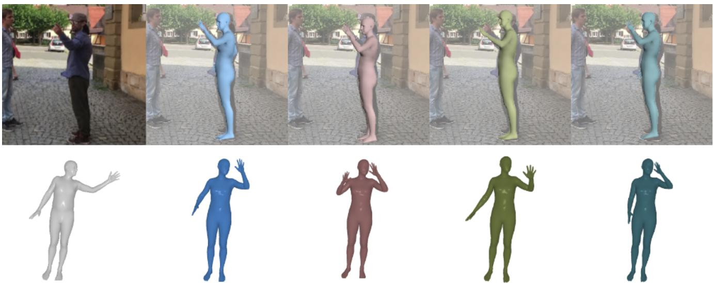
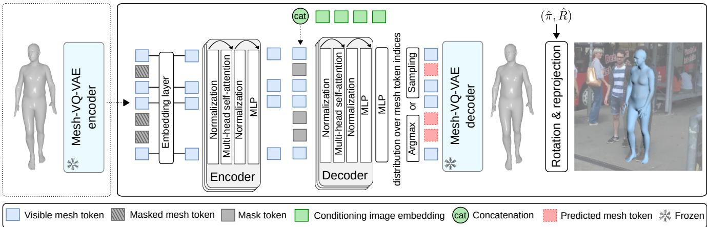
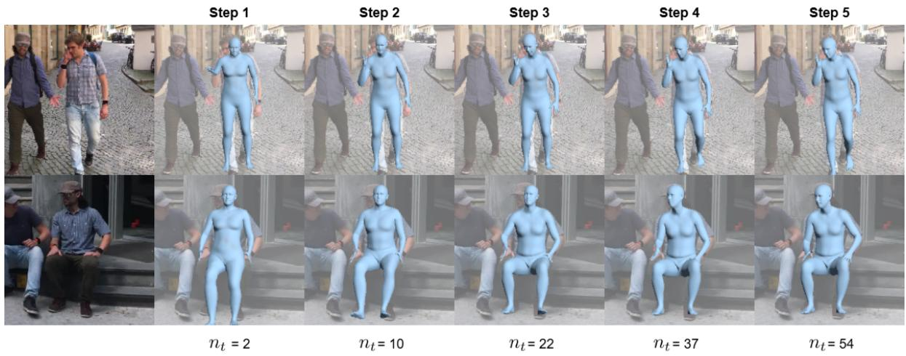
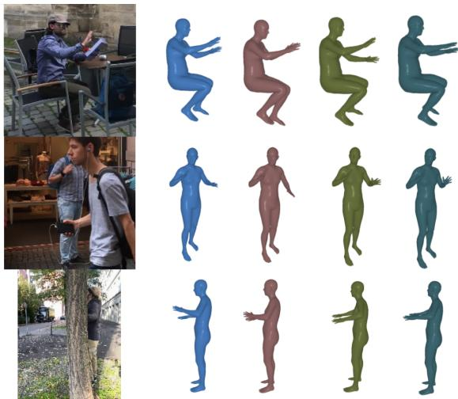

# MEGA: Masked Generative Autoencoder for Human Mesh Recovery

Guenol´ e Fiche´ 1,2∗ Simon Leglaive1 Xavier Alameda-Pineda3 Francesc Moreno-Noguer4†

1CentraleSupelec (IETR UMR CNRS 6164) ´ 2Naver Labs Europe 3Inria, Univ. Grenoble Alpes, CNRS, LJK 4Amazon

## Abstract

Human Mesh Recovery (HMR) from a single RGB image is a highly ambiguous problem, as an infinite set of 3D interpretations can explain the 2D observation equally well. Nevertheless, most HMR methods overlook this issue and make a single prediction without accounting for this ambiguity. A few approaches generate a distribution of human meshes, enabling the sampling ofmultiple predictions; however, none of them is competitive with the latest singleoutput model when making a single prediction. This work proposes a new approach based on masked generative modeling. By tokenizing the human pose and shape, we formulate the HMR task as generating a sequence of discrete tokens conditioned on an input image. We introduce MEGA, a MaskEd Generative Autoencoder trained to recover human meshes from images and partial human mesh token sequences. Given an image, our flexible generation scheme allows us to predict a single human mesh in deterministic mode or to generate multiple human meshes in stochastic mode. Experiments on in-the-wild benchmarks show that MEGA achieves state-of-the-art performance in deterministic and stochastic modes, outperforming single-output and multi-output approaches. See the project page at https://gfiche.github.io/research-pages/mega/.

## 1. Introduction

Perceiving humans from images is a long-standing problem in computer vision, with applications in diverse fields such as sports [23, 86] or e-commerce [58, 96]. Many approaches rely on statistical body models like SMPL [59] for representing humans. Earlier human mesh recovery (HMR) methods recovered the SMPL pose and shape parameters from 2D cues using optimization-based techniques [8, 47]. However, these optimization procedures require good initialization, are time-consuming, and often converge to suboptimal minima. With the advancement of deep learning and the availability of datasets of images with 3D human pose and shape annotations, most approaches have shifted to a regression-based paradigm. Early approaches used neural architectures based on convolutional neural networks (CNNs) and multilayer perceptrons (MLPs) [37, 52]. Recent works have adopted Transformers [83] for extracting image features or making predictions [13, 27]. Despite achieving unprecedented accuracy, state-of-the-art HMR models still have some weaknesses, such as producing unrealistic predictions, especially when dealing with occlusions. To address these issues, recent works have proposed tokenizing the human pose using vector quantized-variational autoencoders (VQ-VAEs) [22, 24]. This approach uses a discrete representation of the human mesh, learned from large-scale motion capture datasets, to confine predictions to the space of anthropomorphic meshes using a dictionary of valid mesh tokens. This tokenization aligns well with Transformer-based architectures, which were initially designed for processing discrete data in natural language processing. Notably, VQ-HPS [24] reframed HMR as a classification task and achieved state-of-the-art results with large and small training datasets, demonstrating the great potential of human mesh tokenized representations in HMR.

While significant progress has been made in HMR, a major issue remains unaddressed in most prior works: a 2D image, especially with occlusions, cannot provide sufficient information to estimate a 3D human mesh with certainty [64, 78] (see Fig. 1). This limitation causes singleoutput models to be biased toward most common poses and body shapes [17]. To mitigate this problem, several works have proposed probabilistic approaches that generate multiple predictions from a single image [45, 75]. These approaches have used various families of generative models, ranging from conditional variational autoencoders (CVAEs) [77] to diffusion models [12, 90]. However, this increase in diversity typically comes at the cost of accuracy [76], and none of these multi-output methods are competitive with the latest single-output HMR models when making a single prediction.

  
Figure 1. Human mesh recovery from a single image is an ill-posed problem due to depth ambiguity. Probabilistic approaches have aimed to address this by generating multiple predictions, but diversity often sacrifices accuracy. Introducing MEGA, our HMR mode based on masked generative modeling achieves state-of-the-art performance on in-the-wild benchmarks in single- and multi-output settings. Given a single image, MEGA can make predictions that all look accurate given the 2D cues but correspond to diverse 3D interpretations.

In this work, we introduce MEGA, a multi-output HMR approach based on self-supervised learning and masked generative modeling of tokenized human meshes. MEGA relies on the Mesh-VQ-VAE of [24] to encode/decode a 3D human mesh to/from a set of discrete tokens. Our training process unfolds in two steps: (1) Firstly, akin to (vector quantized) masked autoencoders [4, 31, 71, 72], we pretrain MEGA in a self-supervised manner to reconstruct human mesh tokens from partially visible inputs. This leverages an extensive motion capture dataset without needing paired image data, allowing MEGA to learn prior knowledge about 3D humans. (2) Subsequently, for HMR from RGB images, we train MEGA to predict randomly masked human mesh tokens conditioned on image feature embeddings. During inference, we begin with a fully masked sequence of tokens and generate a human mesh conditioned on an input image. We propose two distinct generation modes: (2.a) In deterministic mode, MEGA predicts all tokens in a single forward pass, ensuring speed and accuracy; (2.b) In stochastic mode, the generation process involves iteratively sampling human mesh tokens, enabling MEGA to produce multiple predictions from a single image.

We evaluate MEGA on in-the-wild HMR benchmarks, comparing it to single-output and probabilistic HMR methods. MEGA achieves state-of-the-art (SOTA) performance when predicting a human mesh in a single forward pass in deterministic mode. In stochastic mode, MEGA outperforms both deterministic and probabilistic methods with a single prediction and significantly enhances its performance with an increased number of samples. This mode generates diverse, realistic human meshes, allowing for the proposal of multiple plausible outputs given an image. This allows the user to choose the best-suited solution depending on the use case. For instance, animation designers may want to select the most visually appealing human mesh, while medical practitioners would require high precision and choose the solution that minimizes a reprojection error.

In summary, we make the following key contributions:

• We introduce MEGA, a masked generative autoencoder for human mesh recovery, pre-trained in a selfsupervised manner on motion capture data.

• Our flexible inference procedure can operate in deterministic or stochastic modes, with or without image conditioning, achieving state-of-the-art results in all tested scenarios.

## 2. Related work

## 2.1. Human mesh recovery

Single output HMR. Since the release of the HMR [37] model, most approaches for recovering human meshes from images have been regression-based, using neural networks to make predictions directly from the image. These regression-based HMR methods can be categorized into parametric and non-parametric approaches. Parametric methods aim to recover the parameters of the SMPL model [22, 27, 36, 39, 42, 43, 50–52, 79, 94]. They typically produce realistic predictions; however, some works have argued that the SMPL model parameter space is not the most suitable for predicting human meshes [14, 17, 44], leading to the development of non-parametric approaches.

Non-parametric methods predict the coordinates of 3D vertices without relying on a parametric model. While earlier approaches used graph convolutional neural network architectures inspired by the mesh topology [44, 53], recent non-parametric models predominantly employ Transformers [13, 21, 24, 40, 54, 61]. Although non-parametric methods yield accurate results, they can sometimes produce nonanthropomorphic meshes, particularly when training data is scarce [24].

In this work, instead of predicting SMPL model parameters or 3D coordinates, we aim to recover sequences of token indices that can be decoded into a human mesh using the Mesh-VQ-VAE from [24]. Thus, the closest HMR method to ours is VQ-HPS [24], which also works with the token representation of the Mesh-VQ-VAE. However, there are also important differences between MEGA and VQ HPS. First, VQ-HPS follows a deterministic classificationbased mapping between images and mesh tokens. This contrasts with MEGA’s masked generative modeling approach, which allows multi-output predictions and unconditional human mesh generation (see Appendix C). Second, the architecture of MEGA differs from that of VQ-HPS. The two models’ encoders take different inputs: image patches for VQ-HPS and visible mesh tokens for MEGA. This key difference allows us to pre-train MEGA only with motion capture before conditioning the generation with images and to discard the encoder in the deterministic mode for faster inference. Ablation studies (see Tab. 1) show that this pretraining without any image conditioning significantly enhances the performance of MEGA. Another related HMR method is TokenHMR [22], which is a regression method that uses human pose tokens as an intermediate representation.

Multi-output HMR. Estimating a 3D human mesh from a single image is challenging due to the depth ambiguity, especially when the person is partially occluded. Several works have proposed making multiple predictions to account for the ill-posed nature of the problem. Earlier works employed compositional models [35] or mixture density networks [49]. More recent approaches rely on sophisticated probabilistic distributions [74, 75] and generative models, such as CVAE [77], normalizing flows [6, 45, 76], and diffusion models [12, 90]. While these methods can predict diverse plausible solutions, they often face a tradeoff between accuracy and diversity [76, 90] and need to make a large number of predictions to be competitive with single-output methods.

MEGA is based on masked generative modeling to produce multiple predictions. Our experiments demonstrate that, while generating diverse samples, MEGA outperforms SOTA approaches even with a single prediction in stochastic mode and significantly improves as the number of samples increases.

## 2.2. Self-supervised learning for HMR

Self-supervised learning (SSL) approaches can be categorized into two families: discriminative and generative [57, 66, 93]. Many prior works used discriminative SSL approaches to train 3D human pose estimation models. Most of these methods exploit multi-view consistency constraints for supervision [11, 41, 70, 85], while others use temporal consistency in videos [46, 73, 81] or images with different resolutions [89]. [16] explored the use of discriminative SSL for pre-training human mesh estimator backbones, demonstrating that 2D annotation-based pre-training leads to faster convergence and improved results. However, [2] surpassed traditional feature extractors by employing generative SSL, using cross-view and cross-pose completion to train a Vision Transformer (ViT) [20].

While prior works have demonstrated the importance of pre-training for the backbone of HMR models [7, 67], we propose pre-training the generative model on human meshes to leverage extensive motion capture data. Different from prior works in this area [5, 55], our approach based on human mesh tokens does not need any rendering or reprojection, the masking happens in 3D. This pre-training provides us with an unconditional human mesh generative model (see Appendix C), and ablation studies in Tab. 1 show its important contribution to training the HMR model.

## 2.3. Masked generative modeling

Masked modeling was introduced in BERT [19] for language modeling and extended to images with the masked autoencoder [31]. This technique trains a model to predict randomly masked tokens in a sequence based on visible tokens. Masked generative modeling builds on this by training a model to generate new samples, starting from a fully masked sequence and iteratively predicting a fixed number of tokens at each step [9, 10, 28].

In this work, we develop the first masked generative modeling approach for HMR. Using a tokenized representation of the human mesh is particularly well-suited for this task, as it allows for straightforward masking and replacement of mesh parts with mask tokens.

## 3. MEGA

## 3.1. Preliminary: Human mesh tokenization

MEGA relies on a tokenized representation of the human mesh. Specifically, we use the Mesh-VQ-VAE introduced in [24], which is a VQ-VAE [82] with a fully convolutional mesh autoencoder architecture [97]. The Mesh-VQ-VAE tokenizes canonical human meshes following the SMPL topology, with zero translation and facing the camera. The input canonical mesh with vertices $V _ { c } ~ \in ~ \mathbb { R } ^ { 6 8 9 0 \times 3 }$ is encoded into a sequence of $N = 5 4$ latent vectors, each of dimension L = 9. As the architecture is fully convolutional, each latent vector encodes a specific part of the human body. Through vector quantization, each latent vector is replaced by a human mesh token index corresponding to an embedding vector of dimension L in a codebook of size S = 512. Thus, a human mesh is represented by a sequence of N token indices in $\{ 1 , . . . , S \}$ , which can be decoded with the Mesh-VQ-VAE decoder to reconstruct the vertices Vˆ . The Mesh-VQ-VAE is pre-trained on motion capture data and remains frozen during MEGA’s training. In this paper, we formulate HMR as the task of generating human mesh tokens conditioned on an input image.

  
Figure 2. MEGA is a masked generative model based on an encoder-decoder Transformer architecture. During the self-supervised pre training stage, MEGA is trained to predict human mesh tokens from partially visible inputs using motion capture data without paired image data. During the supervised training stage for HMR, the model is trained to predict randomly masked human mesh tokens conditioned on image embeddings. For both training stages, only the cross-entropy loss is used on the predicted mesh tokens. At test time, in stochastic inference mode, we start from a fully masked sequence of tokens and iteratively sample human mesh tokens conditioned on input image embeddings. In deterministic inference mode, we predict all tokens in a single forward pass.

## 3.2. Model

Overall pipeline. MEGA is a masked generative model based on an encoder-decoder Transformer architecture, illustrated in Fig. 2. During training, the Mesh-VQ-VAE encoder converts a 3D human mesh into a sequence of N tokens. These human mesh tokens are then randomly masked, leaving only M < N visible tokens. An embedding layer converts the visible token indices into learned token embeddings, which are subsequently passed to an encoder with multi-head self-attention. The sequence of encoded token embeddings is completed with mask tokens and, during supervised training and inference stages only, it is also concatenated with a sequence of image embeddings (see next paragraph). The complete sequence of tokens is then processed by a decoder with multi-head selfattention, followed by an MLP that outputs a distribution over the N human mesh token indices (in practice, it outputs the logits, which can be normalized using a softmax function). During training and in deterministic inference mode, the N − M human mesh tokens that were originally masked are predicted by taking the argmax, and the Mesh-VQ-VAE decoder is used to reconstruct the canonical mesh Vˆc. The cross-entropy loss is computed from the predicted mesh tokens for both the self-supervised and supervised training stages. At test time, the input sequence of mesh tokens is entirely masked $( \mathrm { i . e . , } M = 0 )$ such that the decoder is provided with N mask tokens along with the conditioning image embeddings. In deterministic inference mode, the N mesh tokens are predicted in a single forward pass. In stochastic inference mode, the human mesh tokens are predicted iteratively by sampling the predicted distribution over the mesh token indices and reintroducing a proportion of unmasked tokens at the encoder’s input. Finally, an MLP (not represented in Fig. 2) is trained to predict a global 6D rotation $\hat { R } \in \mathbb { R } ^ { 6 }$ and the perspective camera parameters $\hat { \pi } \in \mathbb { R } ^ { 3 }$ from image features. These can be used to orient the predicted canonical mesh and to reproject it on the input image.

Image embeddings extractor. An image features extractor computes image features $X \in \mathbb { R } ^ { W H \times \bar { C } }$ . For fair comparisons with SOTA methods, we rely on an HRNet [87] backbone (W = H = 7 and C = 720) pre-trained on a 2D pose estimation task [56]. Additionally, we provide results using a more powerful ViT [20] backbone (W = 12, H = 16, C = 1280). For the multi-output HMR experiment, we adhere to the common practice in the literature [6, 12, 45] and use a ResNet-50 [30] backbone (W = H = 7, C = 2048). Prior to being fed to the MEGA decoder, the image features are linearly projected to the Transformer dimension, resulting in WH image embeddings of dimension D = 1024.

Encoder. The encoder of MEGA consists of $B _ { e } ~ = ~ 1 2$ blocks, akin to the Vision Transformer [20]. Each block contains a multi-head self-attention and an MLP module, with layer normalization preceding and residual connections following every module (see Fig. 2). To preserve positional information at the input of the encoder, learned position embeddings [25] are added to the human mesh token embeddings, and a cls token [19] is concatenated with the input sequence.

  
Figure 3. Prediction process iterations. We visualize the predictions for intermediate steps in stochastic mode. All masked tokens are replaced by the first token of the codebook, corresponding to index 0.

Decoder. The decoder of MEGA consists of $B _ { d } = 4 ~ \mathrm { b l o c k s }$ identical to the encoder blocks. During the self-supervised pre-training on human meshes (see Sec. 3.3), the decoder receives only the sequence of encoded human mesh token embeddings, completed with mask tokens (a single trainable embedding vector repeated at each masked token position), in line with the masked autoencoder strategy [31]. During the supervised training stage and at inference, this input sequence is concatenated with the sequence of image embeddings. Position embeddings [25, 83] are added at the input of the decoder.

Rotation and camera prediction. We use the previously mentioned image features $X ~ \in ~ \mathbb { R } ^ { W H \times C }$ to predict the global 6D rotation $\hat { R } \in \mathbb { R } ^ { 6 }$ and the perspective camera parameters πˆ $\mathbf { \epsilon } \in \mathbb { R } ^ { 3 }$ . The WH image features are averaged to yield a single vector of dimension C, which is subsequently passed through an MLP with 2 hidden layers. The output of this MLP is then linearly mapped to the rotation and camera parameters.

## 3.3. Training strategy

Self-supervised pre-training. MEGA is pre-trained in a self-supervised manner on tokenized human meshes using a strategy similar to vector quantized masked autoencoders [4, 31, 71, 72]. The pre-training task involves reconstructing randomly masked human mesh tokens from a set of visible tokens. A variable masking rate is used such that $\begin{array} { r } { M = \lfloor N \cos ( \frac { \pi \tau } { 2 } ) \rfloor } \end{array}$ with τ uniformly sampled from [0, 1[. The variable masking rate is critical for allowing MEGA to generate meshes iteratively in stochastic mode, as each step of the generation process involves predicting all tokens given a variable number of visible tokens (see Sec. 3.4). The sole loss used for pre-training is a cross-entropy loss computed from the reconstruction of the masked tokens. At this stage of training, MEGA can be used for the unconditioned generation of random human meshes, as shown in Appendix C

Masked generative modeling for HMR. To train MEGA to predict tokenized canonical meshes from images, we extend the pre-training strategy by conditioning the decoder with the image embeddings (see Sec. 3.2 and Fig. 2). The human mesh tokens follow the same masking rate schedule, while the image embeddings remain fully visible. The only supervision for predicting canonical meshes is a crossentropy loss, as in the pre-training stage. Compared to prior works in HMR that rely on multiple losses (on 3D keypoints, the 2D reprojection, and the SMPL parameters), this approach is straightforward and does not require hyperparameters tuning. Note that the performance of Mesh-VQ-VAE [24] is crucial because it provides the tokens we use as training targets. Hence, the reconstruction error is transferred to the ground truth used to train MEGA. Fortunately, the reconstruction error of Mesh-VQ-VAE is about one order of magnitude smaller than the estimation error of SOTA HMR models. For predicting the rotation and camera parameters, we use the Euclidean distance on the rotation matrix corresponding to the predicted 6D representation and the L1 loss on the reprojection of 2D joints extracted from the predicted oriented mesh, using the predicted perspective camera parameters.

<table><tr><td rowspan="2">Method</td><td rowspan="2">Backbone</td><td colspan="3">3DPW</td><td colspan="3">EMDB</td></tr><tr><td>PVE↓</td><td>MPJPE↓</td><td>PA-MPJPE↓</td><td>PVE↓</td><td>MPJPE↓</td><td>PA-MPJPE↓</td></tr><tr><td>FastMETRO [13]</td><td>HRNet-w64</td><td>121.6</td><td>109.0</td><td>65.7</td><td>119.2</td><td>108.1</td><td>72.7</td></tr><tr><td>PARE [42]</td><td>HRNet-w32</td><td>97.9</td><td>82.0</td><td>50.9</td><td>133.2</td><td>113.9</td><td>72.2</td></tr><tr><td>Virtual Marker [61]</td><td>HRNet-w48</td><td>93.8</td><td>80.5</td><td>48.9</td><td></td><td></td><td></td></tr><tr><td>CLIFF [52]</td><td>HRNet-w48</td><td>87.6</td><td>73.9</td><td>46.4</td><td>122.9</td><td>103.1</td><td>68.8</td></tr><tr><td>VQ-HPS [24]</td><td>HRNet-w48</td><td>84.8</td><td>71.1</td><td>45.2</td><td>112.9</td><td>99.9</td><td>65.2</td></tr><tr><td>MEGA (ours)</td><td>HRNet-w48</td><td>81.6</td><td>68.5</td><td>44.1</td><td>107.9</td><td>90.5</td><td>58.7</td></tr><tr><td>linear masking</td><td>HRNet-w48</td><td>86.5</td><td>72.6</td><td>45.9</td><td>118.7</td><td>100.1</td><td>63.3</td></tr><tr><td>full mask</td><td>HRNet-w48</td><td>81.8</td><td>68.5</td><td>44.4</td><td>110.3</td><td>92.7</td><td>59.2</td></tr><tr><td>w/o pre-training + full mask</td><td>HRNet-w48</td><td>84.1</td><td>70.5</td><td>46.2</td><td>113.9</td><td>95.9</td><td>62.0</td></tr><tr><td>HMR2.0 [27]</td><td>ViT-H</td><td>84.1</td><td>70.0</td><td>44.5</td><td>120.1</td><td>97.8</td><td>61.5</td></tr><tr><td>TokenHMR† [22]</td><td>ViT-H</td><td>88.1</td><td>76.2</td><td>49.3</td><td>124.4</td><td>102.4</td><td>67.5</td></tr><tr><td>TokenHMR [22]</td><td>ViT-H</td><td>84.6</td><td>71.0</td><td>44.3</td><td>109.4</td><td>91.7</td><td>55.6</td></tr><tr><td>MEGA (ours)</td><td>ViT-H</td><td>80.0</td><td>67.5</td><td>41.0</td><td>108.6</td><td>92.4</td><td>52.5</td></tr></table>

Table 1. Evaluation in deterministic mode. We evaluate MEGA on the 3DPW and EMDB datasets and compare it to the SOTA methods using metrics defined in Sec. 4.1 given in mm. † stands for additionally using 2D training data, and ∓ for additionally using 2D data and BEDLAM [7]. Methods in italic below the row ”MEGA” indicate the results of the ablation study.

## 3.4. Generation strategy

We propose two generation modes for inference: deterministic and stochastic. Both modes start from a fully masked sequence of human mesh tokens, aiming to generate a complete sequence that can be decoded into a canonical mesh. Regardless of the generation mode, the camera and rotation are predicted deterministically from the image.

Deterministic mode. In deterministic inference mode, we predict all tokens in a single forward pass by taking the argmax of the predicted distribution over the human mesh token indices. In this mode, MEGA’s encoder is not used; instead, the decoder is fed with a sequence of N mask tokens, relying entirely on the image representation information. Consequently, the encoder can be discarded, significantly reducing the model size as $B _ { e } > B _ { d }$ . To our knowledge, this is the first work that discards the encoder of an MAE, whereas previous works [31] typically discard the decoder and use the encoder to obtain representations for downstream tasks.

Stochastic mode. MEGA addresses the ambiguity of the HMR from a single image by operating in a stochastic inference mode and generating diverse plausible human meshes. We follow a strategy similar to [9, 10, 28], employing an iterative generation process in T steps. At each step $t \in \{ 1 , . . . , T \}$ , we predict $n _ { t } \mathrm { ~ - ~ } n _ { t - 1 }$ tokens, where $\begin{array} { r } { n _ { t } \ = \ \lfloor N \times \left( 1 - \cos ( \frac { \pi t } { 2 T } ) \right) \rfloor } \end{array}$ denotes the number of predicted tokens up to step t. The tokens predicted at a given step remain visible for the subsequent steps. By the end of this iterative process, we generate nT = N tokens that represent a complete human mesh. The prediction at step $t \in \{ 1 , . . . , T \}$ proceeds as follows:

• The currently visible $n _ { t - 1 }$ tokens are fed to the model.

• For each of the $P _ { t } = N - n _ { t - 1 }$ tokens that are still masked, the model outputs unnormalized probabilities over the indices of the Mesh-VQ-VAE codebook. The corresponding categorical distributions are sampled using the Gumble-max trick [33] to obtain $P _ { t }$ candidate tokens to be set visible in the next step. Each candidate token is identified by an index between 1 and S (the codebook size) along with its unnormalized probability.

• Using the Gumble-max trick again, we finally sample $n _ { t } - n _ { t - 1 }$ tokens among the set of $P _ { t }$ candidate tokens, which will be visible in the next step.

Given the stochastic nature of this generation mode, we can obtain Q different human mesh predictions for a single image by repeating the above generation process several times. A visualization of the iterative generation process is shown in Fig. 3.

## 4. Experiments

## 4.1. Experimental setup

Datasets. MEGA is initially pre-trained in a self-supervised manner on an extensive subset of the AMASS dataset [62], focusing on samples with high pose and body shape variety, as detailed in [7]. MEGA is then trained for HMR using a mix of standard image datasets labeled with pseudogroundtruth human meshes [52], including MSCOCO [56], Human3.6M [34], MPI-INF-3DHP [63] and MPII [1]. We evaluate MEGA and compare it to the SOTA methods on the in-the-wild 3DPW [84] and EMDB [38] datasets. Following recent works [22, 24, 27], we do not finetune MEGA on the 3DPW training set before evaluation. This approach better validates the model’s generalization capacity and allows us to use the same model for all experiments. Unless specified otherwise, other models in the comparison tables use the same training datasets and the same image feature extractor as ours for fair comparisons.

Implementation details. All experiments are conducted using PyTorch [68]. MEGA is pre-trained on human meshes for 500 epochs. For the HMR task, MEGA is first trained on MSCOCO [56] for 100 epochs, followed by training on the mix of datasets described above for 10 epochs. Using 4 NVIDIA A100 GPUs, the entire pretraining and training process takes about 2.5 days.

Metrics. To evaluate HMR methods, we use the widely adopted metrics: per-vertex-error (PVE), mean-per-jointerror (MPJPE), and the Procrustes-aligned MPJPE (PA-MPJPE). PVE measures the Euclidean distance between the vertices of the predicted mesh and the ground truth. MPJPE assesses the accuracy of body joints extracted from the mesh. PA-MPJPE is similar to MPJPE but includes a Procrustes-alignment, a rigid transformation that minimizes the distance between the predicted and ground truth joints. All three metrics are reported in mm.

## 4.2. Deterministic inference mode

Quantitative evaluation. In Tab. 1, we evaluate MEGA on the HMR task using the deterministic inference mode defined in Sec. 3.4, and compare its performance to SOTA methods on 3DPW [84] and EMDB [38]. Results for SOTA methods are taken from the corresponding papers when available or computed using official implementations and model weights. To ensure fairness, we only compare methods trained on standard datasets (see Sec. 4.1), with the exception of TokenHMR [22], which uses additional data but is included in the comparison because it also tokenized human pose. Note that the results for FastMETRO [13] and Virtual Marker [61] differ from those in their original papers because we present results without finetuning on the 3DPW dataset. Similar to [22, 24, 27], we chose not to use the 3DPW training set in order to measure generalization. Furthermore, it allows us to use the same model to evaluate MEGA on the occlusion dataset 3DPW-OCC [95] (see below) that contains sequences from the 3DPW training set. Qualitative results of MEGA in the deterministic inference mode on in-the-wild datasets [38, 84] are shown in Appendix E.

MEGA outperforms all other methods on in-the-wild datasets. Using an HRNet [87] backbone, MEGA significantly surpasses both parametric [42, 52] and nonparametric [13, 24, 61] methods, especially on the EMDB [38] dataset. With a ViT [20] backbone, MEGA also achieves SOTA performance. However, comparisons with TokenHMR [22] are not completely fair, as this method is trained with additional 2D data and BEDLAM [7].

Ablation study. Tab. 1 also provides the results of an ablation study. We tried a different distribution for the variable masking rate, such that $M = \lfloor N \tau \rfloor$ with τ uniformly sampled in [0, 1[ (“MEGA linear masking” in Tab. 1). Similar to [9], we find that the mask scheduling function improves the performance. This is also consistent with the findings of [31], which showed that a masking rate higher than 50% is beneficial for learning. We then tried masking 100% of the human mesh tokens during the supervised training phase (“MEGAfull mask” in Tab. 1). We could expect this ablation to perform better as the training procedure corresponds to the deterministic inference mode. However, the results are slightly degraded, suggesting that sharing the same procedure between the self-supervised and supervised training stages is important. Additionally discarding the self-supervised pre-training of MEGA (“MEGA w/o pretraining + full mask” in Tab. 1) leads to a 2.5/6.0 mm increase in PVE on 3DPW/EMDB.

<table><tr><td rowspan="2">Method</td><td colspan="3">3DPW-OCC</td></tr><tr><td>PVE↓</td><td>MPJPE↓</td><td>PA-MPJPE↓</td></tr><tr><td>ROMP [79]</td><td></td><td></td><td>65.9</td></tr><tr><td>SPIN [43]</td><td>121.6</td><td>95.6</td><td>60.8</td></tr><tr><td>VisDB [92]</td><td>110.5</td><td>87.3</td><td>56.0</td></tr><tr><td>3DCrowdNet [15]</td><td>103.2</td><td>88.6</td><td>56.8</td></tr><tr><td>SEFD [91]</td><td>97.1</td><td>83.5</td><td>55.0</td></tr><tr><td>MEGA (ours)</td><td>93.8</td><td>79.8</td><td>51.5</td></tr><tr><td>PARE [42]</td><td>107.9</td><td>90.5</td><td>57.1</td></tr><tr><td>ScoreHypo [90]</td><td>89.8</td><td>73.9</td><td>48.7</td></tr><tr><td>MEGA (ours)</td><td>78.9</td><td>66.3</td><td>43.7</td></tr></table>

Table 2. Evaluation on 3DPW-OCC. We evaluate MEGA on an occlusion dataset and compare it to SOTA HMR methods designed to handle occlusions using standard metrics (see Sec. 4.1) in mm. Methods in the top part use a ResNet-50 backbone, while others use HRNet.

Results on an occlusion dataset We quantitatively evaluate MEGA on the occlusion dataset 3DPW-OCC [95] in Tab. 2 to evaluate the robustness of our approach to occlusions. Despite not being tailored for HMR on occluded images, MEGA surpasses all other methods trained on the same data (see Sec. 4.1). This performance could stem from MEGA’s self-attention mechanism among mesh tokens. While visible parts can be predicted by leveraging image embeddings, occluded parts heavily rely on visible body parts for accurate inference.

## 4.3. Stochastic inference mode

Quantitative evaluation. We evaluate MEGA in stochastic inference mode (see Sec. 3.4) for the HMR task on the 3DPW [84] dataset, comparing our performance with SOTA multi-output approaches. Results from other methods are obtained from their respective papers. We exclusively compare methods trained on standard datasets (see Sec. 4.1), providing a version of MEGA using a ResNet-50 [30] backbone for fair comparisons. Following prior works [6, 12, 45], we assess accuracy using standard metrics computed with the minimum error sample out of Q predictions, with Q ranging from 1 to 25. We also calculate the relative improvement between 1 and 25 samples. Quantitative results are presented in Tab. 3 and qualitative samples are shown in Fig. 4.

<table><tr><td rowspan="2">Method Q</td><td colspan="4">PVE↓</td><td rowspan="2">Imp ↑</td><td colspan="4">MPJPE↓ 1</td><td colspan="2">Imp ↑</td><td colspan="4">PA-MPJPE↓</td><td rowspan="2">Imp ↑</td></tr><tr><td>1</td><td>5</td><td>10</td><td>25</td><td></td><td></td><td>5</td><td>10</td><td>25</td><td></td><td>1</td><td>10</td><td></td><td>25</td></tr><tr><td>Diff-HMR [12]</td><td>114.6</td><td>111.8</td><td>110.9</td><td>109.8</td><td>4.2</td><td>98.9</td><td>96.3</td><td>95.5</td><td>94.5</td><td>4.5</td><td></td><td>58.5</td><td>57.0</td><td>56.5</td><td>55.9</td><td>4.4</td></tr><tr><td>3D Multibodies [6]</td><td></td><td>-</td><td>–</td><td></td><td></td><td>93.8</td><td>82.2</td><td></td><td>79.4</td><td>75.8</td><td>19.2</td><td>59.9</td><td>57.1</td><td>56.6</td><td>55.6</td><td>7.2</td></tr><tr><td>ProHMR [45]</td><td></td><td></td><td>1</td><td></td><td></td><td>97.0</td><td>93.1</td><td></td><td>89.8</td><td>84.0</td><td>13.4</td><td>59.8</td><td>56.5</td><td>54.6</td><td>52.4</td><td>12.4</td></tr><tr><td>MEGA (ours)</td><td>101.6</td><td>92.8</td><td>90.4</td><td>87.5</td><td>13.9</td><td>86.2</td><td>78.0</td><td>76.4</td><td></td><td>73.9</td><td>14.3</td><td>58.6</td><td>51.6</td><td>49.7</td><td>47.6</td><td>18.7</td></tr><tr><td>MEGA det (ours)</td><td>90.6</td><td></td><td></td><td></td><td></td><td>76.3</td><td></td><td></td><td></td><td></td><td></td><td>48.3</td><td></td><td></td><td></td><td></td></tr><tr><td>ScoreHypo [90]</td><td></td><td></td><td></td><td></td><td></td><td></td><td>75.3</td><td></td><td>71.7</td><td>67.8</td><td></td><td></td><td>47.4</td><td>45.2</td><td>42.5</td><td></td></tr><tr><td>MEGA (ours)</td><td>83.4</td><td>78.4</td><td>76.9</td><td>75.1</td><td>10.0</td><td>69.9</td><td>66.1</td><td>64.9</td><td></td><td>63.6</td><td>9.0</td><td>45.5</td><td>42.6</td><td>41.7</td><td>40.4</td><td>11.2</td></tr><tr><td>MEGA det‡ (ours)</td><td></td><td></td><td></td><td></td><td></td><td></td><td></td><td></td><td></td><td></td><td></td><td></td><td></td><td></td><td></td><td></td></tr><tr><td></td><td>81.6</td><td></td><td></td><td></td><td></td><td>68.5</td><td></td><td></td><td></td><td></td><td></td><td>44.1</td><td></td><td></td><td></td><td></td></tr></table>

Table 3. Evaluation in stochastic mode. We compare MEGA to the SOTA probabilistic methods on the multi-output HMR task using standard metrics (see Sec. 4.1) given in mm and the relative improvement (Imp) in %. ‡ uses an HRNet backbone; all other methods use a ResNet-50 backbone.

  
Figure 4. Qualitative samples. Given a single image with occlusions, MEGA makes diverse plausible predictions.

MEGA achieves SOTA performance across all metrics and sample sizes. Notably, MEGA exhibits significantly higher accuracy than other methods when generating a single sample, and consistently demonstrates the best or second-best relative improvement among methods using a ResNet-50 backbone. With an HRNet [87] backbone, MEGA outperforms all probabilistic methods and surpasses SOTA single-output methods, even with a single stochastic generation. It is worth noting that it takes around 10 stochastic samples to outperform the deterministic generation (MEGA det), highlighting the utility of deterministic mode for quick and accurate predictions and the advantage of multiple predictions for enhanced accuracy. For a detailed comparison between deterministic and stochastic modes and a discussion on interpreting diverse predictions, please refer to Appendix A and Sec. D.

Generation process. We provide visualizations of the prediction process in stochastic mode. Specifically, using the model with an HRNet backbone that generates meshes in 5 steps (see Appendix B), given an image, we visualize all intermediate steps. Results are shown in Fig. 3. Importantly, our model does not predict unrealistic meshes in the first steps (all masked tokens were replaced by the index 0 for visualization purposes). We observe that a rough estimate of the mesh is provided even in the initial steps, where only a few indices are predicted (2 during the first iteration and 8 during the second as shown in Fig. 3). This outcome is expected because the tokens set to be visible after each step are the most likely. Consequently, the indices with the highest confidence are selected first, enabling the construction of a preliminary mesh estimate. Subsequent steps refine these predictions, enhancing their realism.

## 5. Conclusion

In this work, we explored self-supervised learning and masked generative modeling on human meshes for HMR. We introduced MEGA, a masked generative autoencoder designed to generate human meshes as discrete token sequences. MEGA’s flexible architecture and generation scheme enables the generation of diverse and realistic meshes and supports both single and multi-output HMR. An extensive evaluation demonstrates significant improvement over SOTA in both these domains. Further discussions on the limitations and future works are available in Sec. F.

## Acknowledgment

This study is part of the EUR DIGISPORT project supported by the ANR within the framework of the PIA France 2030 (ANR-18-EURE-0022). This work was performed using HPC resources from the “Mesocentre” computing cen-´ ter of CentraleSupelec, ENS Paris-Saclay, and Universit´ e´ Paris-Saclay supported by CNRS and Region ´ ˆIle-de-France. We would like to thank Samir Sadok for his valuable help with the implementation of the masked autoencoder.

## References

[1] Mykhaylo Andriluka, Leonid Pishchulin, Peter Gehler, and Bernt Schiele. 2D human pose estimation: New benchmark and state of the art analysis. In IEEE/CVF Conference on Computer Vision and Pattern Recognition (CVPR), pages 3686–3693, 2014. 6

[2] Matthieu Armando, Salma Galaaoui, Fabien Baradel, Thomas Lucas, Vincent Leroy, Romain Bregier, Philippe´ Weinzaepfel, and Gregory Rogez. Cross-view and cross-´ pose completion for 3d human understanding. In IEEE/CVF Conference on Computer Vision and Pattern Recognition (CVPR), pages 1512–1523, 2024. 3

[3] Jacob Austin, Daniel D Johnson, Jonathan Ho, Daniel Tarlow, and Rianne Van Den Berg. Structured denoising diffusion models in discrete state-spaces. Advances in Neural Information Processing Systems (NeurIPS), 34:17981–17993, 2021. 4

[4] Hangbo Bao, Li Dong, Songhao Piao, and Furu Wei. BEit: BERT pre-training of image transformers. In International Conference on Learning Representations (ICLR), 2022. 2, 5

[5] Fabien Baradel, Thibault Groueix, Philippe Weinzaepfel, Romain Bregier, Yannis Kalantidis, and Gr ´ egory Rogez.´ Leveraging mocap data for human mesh recovery. In International Conference on 3D Vision (3DV), pages 586–595. IEEE, 2021. 3

[6] Benjamin Biggs, David Novotny, Sebastien Ehrhardt, Hanbyul Joo, Ben Graham, and Andrea Vedaldi. 3D Multibodies: Fitting sets of plausible 3D human models to ambiguous image data. In Advances in Neural Information Processing Systems (NeurIPS), pages 20496–20507, 2020. 3, 4, 8

[7] Michael J Black, Priyanka Patel, Joachim Tesch, and Jinlong Yang. BEDLAM: A synthetic dataset of bodies exhibiting detailed lifelike animated motion. In IEEE/CVF Conference on Computer Vision and Pattern Recognition (CVPR), pages 8726–8737, 2023. 3, 6, 7, 1, 2

[8] Federica Bogo, Angjoo Kanazawa, Christoph Lassner, Peter Gehler, Javier Romero, and Michael J Black. Keep it SMPL: Automatic estimation of 3D human pose and shape from a single image. In European Conference on Computer Vision (ECCV), pages 561–578. Springer, 2016. 1

[9] Huiwen Chang, Han Zhang, Lu Jiang, Ce Liu, and William T Freeman. MaskGIT: Masked generative image transformer. In IEEE/CVF Conference on Computer Vision and Pattern Recognition (CVPR), pages 11315–11325, 2022. 3, 6, 7, 2

[10] Huiwen Chang, Han Zhang, Jarred Barber, Aaron Maschinot, Jose Lezama, Lu Jiang, Ming-Hsuan Yang, Kevin Patrick Murphy, William T. Freeman, Michael Ru binstein, Yuanzhen Li, and Dilip Krishnan. Muse: Text-toimage generation via masked generative transformers. In International Conference on Machine Learning (ICML), pages 4055–4075. PMLR, 2023. 3, 6, 2

[11] Ching-Hang Chen, Ambrish Tyagi, Amit Agrawal, Dylan Drover, Rohith Mv, Stefan Stojanov, and James M Rehg. Unsupervised 3D pose estimation with geometric selfsupervision. In IEEE/CVF Conference on Computer Vision and Pattern Recognition (CVPR), pages 5714–5724, 2019. 3

[12] Hanbyel Cho and Junmo Kim. Generative approach for probabilistic human mesh recovery using diffusion models. In IEEE/CVF International Conference on Computer Vision (ICCV), pages 4183–4188, 2023. 1, 3, 4, 8

[13] Junhyeong Cho, Kim Youwang, and Tae-Hyun Oh. Crossattention of disentangled modalities for 3D human mesh recovery with transformers. In European Conference on Com puter Vision (ECCV), pages 342–359. Springer, 2022. 1, 3, 6, 7

[14] Hongsuk Choi, Gyeongsik Moon, and Kyoung Mu Lee. Pose2Mesh: Graph convolutional network for 3D human pose and mesh recovery from a 2D human pose. In European Conference on Computer Vision (ECCV), pages 769– 787. Springer, 2020. 2

[15] Hongsuk Choi, Gyeongsik Moon, JoonKyu Park, and Kyoung Mu Lee. Learning to estimate robust 3D human mesh from in-the-wild crowded scenes. In IEEE/CVF Conference on Computer Vision and Pattern Recognition (CVPR), pages 1475–1484, 2022. 7

[16] Hongsuk Choi, Hyeongjin Nam, Taeryung Lee, Gyeongsik Moon, and Kyoung Mu Lee. Rethinking self-supervised visual representation learning in pre-training for 3D human pose and shape estimation. In International Conference on Learning Representations (ICLR), 2022. 3

[17] Enric Corona, Gerard Pons-Moll, Guillem Alenya, and\` Francesc Moreno-Noguer. Learned vertex descent: a new direction for 3D human model fitting. In European Confer ence on Computer Vision (ECCV), pages 146–165. Springer, 2022. 1, 2

[18] Ginger Delmas, Philippe Weinzaepfel, Thomas Lucas, Francesc Moreno-Noguer, and Gregory Rogez. PoseScript:´ 3D human poses from natural language. In European Conference on Computer Vision (ECCV), pages 346–362. Springer, 2022. 4

[19] Jacob Devlin, Ming-Wei Chang, Kenton Lee, and Kristina Toutanova. BERT: Pre-training of deep bidirectional transformers for language understanding. In Conference of the North American Chapter of the Association for Computational Linguistics: Human Language Technologies, pages 4171–4186. Association for Computational Linguistics, 2019. 3, 5

[20] Alexey Dosovitskiy, Lucas Beyer, Alexander Kolesnikov, Dirk Weissenborn, Xiaohua Zhai, Thomas Unterthiner, Mostafa Dehghani, Matthias Minderer, Georg Heigold, Sylvain Gelly, Jakob Uszkoreit, and Neil Houlsby. An image is

worth 16x16 words: Transformers for image recognition at scale. In International Conference on Learning Representations (ICLR), 2021. 3, 4, 7

[21] Zhiyang Dou, Qingxuan Wu, Cheng Lin, Zeyu Cao, Qiangqiang Wu, Weilin Wan, Taku Komura, and Wenping Wang. TORE: Token reduction for efficient human mesh recovery with transformer. In IEEE/CVF International Conference on Computer Vision (ICCV), pages 15143–15155, 2023. 3

[22] Sai Kumar Dwivedi, Yu Sun, Priyanka Patel, Yao Feng, and Michael J Black. Tokenhmr: Advancing human mesh recovery with a tokenized pose representation. In IEEE/CVF Conference on Computer Vision and Pattern Recognition (CVPR), pages 1323–1333, 2024. 1, 2, 3, 6, 7

[23] Moritz Einfalt, Dan Zecha, and Rainer Lienhart. Activityconditioned continuous human pose estimation for performance analysis of athletes using the example of swimming. In IEEE/CVF Winter conference on Applications of Computer Vision (WACV), pages 446–455. IEEE, 2018. 1

[24] Guenol ´ e Fiche, Simon Leglaive, Xavier Alameda-Pineda,´ Antonio Agudo, and Francesc Moreno-Noguer. VQ-HPS: Human pose and shape estimation in a vector-quantized latent space. In European Conference on Computer Vision (ECCV). Springer, 2024. 1, 2, 3, 5, 6, 7

[25] Jonas Gehring, Michael Auli, David Grangier, Denis Yarats, and Yann N Dauphin. Convolutional sequence to sequence learning. In International conference on machine learning (ICML), pages 1243–1252. PMLR, 2017. 5

[26] Zigang Geng, Chunyu Wang, Yixuan Wei, Ze Liu, Houqiang Li, and Han Hu. Human pose as compositional tokens. In IEEE/CVF Conference on Computer Vision and Pattern Recognition (CVPR), pages 660–671, 2023. 4

[27] Shubham Goel, Georgios Pavlakos, Jathushan Rajasegaran, Angjoo Kanazawa, and Jitendra Malik. Humans in 4D: Reconstructing and tracking humans with transformers. In IEEE/CVF International Conference on Computer Vision (ICCV), pages 14783–14794, 2023. 1, 2, 6, 7

[28] Chuan Guo, Yuxuan Mu, Muhammad Gohar Javed, Sen Wang, and Li Cheng. Momask: Generative masked modeling of 3d human motions. In IEEE/CVF Conference on Computer Vision and Pattern Recognition (CVPR), pages 1900– 1910, 2024. 3, 6

[29] Wen Guo, Xiaoyu Bie, Xavier Alameda-Pineda, and Francesc Moreno-Noguer. Multi-person extreme motion prediction. In IEEE/CVF Conference on Computer Vision and Pattern Recognition (CVPR), pages 13053–13064, 2022. 4

[30] Kaiming He, Xiangyu Zhang, Shaoqing Ren, and Jian Sun. Deep residual learning for image recognition. In IEEE/CVF Conference on Computer Vision and Pattern Recognition (CVPR), pages 770–778, 2016. 4, 8

[31] Kaiming He, Xinlei Chen, Saining Xie, Yanghao Li, Piotr Dollar, and Ross Girshick. Masked autoencoders are scalable´ vision learners. In IEEE/CVF Conference on Computer Vision and Pattern Recognition (CVPR), pages 16000–16009, 2022. 2, 3, 5, 6, 7

[32] Yannan He, Garvita Tiwari, Tolga Birdal, Jan Eric Lenssen, and Gerard Pons-Moll. NRDF: Neural riemannian distance

fields for learning articulated pose priors. In IEEE/CVF Conference on Computer Vision and Pattern Recognition (CVPR), pages 1661–1671, 2024. 2

[33] Iris AM Huijben, Wouter Kool, Max B Paulus, and Ruud JG Van Sloun. A review of the Gumbel-max trick and its ex tensions for discrete stochasticity in machine learning. IEEE Transactions on Pattern Analysis and Machine Intelligence (PAMI), 45(2):1353–1371, 2022. 6

[34] Catalin Ionescu, Dragos Papava, Vlad Olaru, and Cristian Sminchisescu. Human3.6M: Large scale datasets and predictive methods for 3d human sensing in natural environments. IEEE Transactions on Pattern Analysis and Machine Intelligence (PAMI), 36(7):1325–1339, 2013. 6

[35] Ehsan Jahangiri and Alan L Yuille. Generating multiple diverse hypotheses for human 3D pose consistent with 2D joint detections. In IEEE/CVF International Conference on Computer Vision Workshops (ICCVW), pages 805–814, 2017. 3

[36] Hanbyul Joo, Natalia Neverova, and Andrea Vedaldi. Exemplar fine-tuning for 3D human model fitting towards in-thewild 3d human pose estimation. In International Conference on 3D Vision (3DV), pages 42–52. IEEE, 2021. 2

[37] Angjoo Kanazawa, Michael J. Black, David W. Jacobs, and Jitendra Malik. End-to-end recovery of human shape and pose. In IEEE/CVF Conference on Computer Vision and Pattern Recognition (CVPR), pages 7122–7131, 2018. 1, 2

[38] Manuel Kaufmann, Jie Song, Chen Guo, Kaiyue Shen, Tianjian Jiang, Chengcheng Tang, Juan Jose Z´ arate, and Otmar´ Hilliges. EMDB: The electromagnetic database of global 3D human pose and shape in the wild. In IEEE/CVF International Conference on Computer Vision (ICCV), pages 14632–14643, 2023. 6, 7

[39] Rawal Khirodkar, Shashank Tripathi, and Kris Kitani. Occluded human mesh recovery. In IEEE/CVF Conference on Computer Vision and Pattern Recognition (CVPR), pages 1715–1725, 2022. 2

[40] Jeonghwan Kim, Mi-Gyeong Gwon, Hyunwoo Park, Hyuk min Kwon, Gi-Mun Um, and Wonjun Kim. Sampling is matter: Point-guided 3d human mesh reconstruction. In IEEE/CVF Conference on Computer Vision and Pattern Recognition (CVPR), pages 12880–12889, 2023. 3

[41] Muhammed Kocabas, Salih Karagoz, and Emre Akbas. Selfsupervised learning of 3D human pose using multi-view geometry. In IEEE/CVF Conference on Computer Vision and Pattern Recognition (CVPR), pages 1077–1086, 2019. 3

[42] Muhammed Kocabas, Chun-Hao P. Huang, Otmar Hilliges, and Michael J. Black. PARE: Part attention regressor for 3D human body estimation. In IEEE/CVF International Conference on Computer Vision (ICCV), pages 11127–11137, 2021. 2, 6, 7

[43] Nikos Kolotouros, Georgios Pavlakos, Michael J Black, and Kostas Daniilidis. Learning to reconstruct 3D human pose and shape via model-fitting in the loop. In IEEE/CVF International Conference on Computer Vision (ICCV), pages 2252–2261, 2019. 2, 7

[44] Nikos Kolotouros, Georgios Pavlakos, and Kostas Dani ilidis. Convolutional mesh regression for single-image human shape reconstruction. In IEEE/CVF Conference on

Computer Vision and Pattern Recognition (CVPR), pages 4501–4510, 2019. 2, 3

[45] Nikos Kolotouros, Georgios Pavlakos, Dinesh Jayaraman, and Kostas Daniilidis. Probabilistic modeling for human mesh recovery. In IEEE/CVF Conference on Computer Vision and Pattern Recognition (CVPR), pages 11605–11614, 2021. 1, 3, 4, 8

[46] Jogendra Nath Kundu, Siddharth Seth, Varun Jampani, Mugalodi Rakesh, R Venkatesh Babu, and Anirban Chakraborty. Self-supervised 3D human pose estimation via part guided novel image synthesis. In IEEE/CVF Conference on Computer Vision and Pattern Recognition (CVPR), pages 6152– 6162, 2020. 3

[47] Christoph Lassner, Javier Romero, Martin Kiefel, Federica Bogo, Michael J Black, and Peter V Gehler. Unite the people: Closing the loop between 3D and 2D human representations. In IEEE/CVF Conference on Computer Vision and Pattern Recognition (CVPR), pages 6050–6059, 2017. 1

[48] Eric-Tuan Le, Antonis Kakolyris, Petros Koutras, Himmyˆ Tam, Efstratios Skordos, George Papandreou, Riza Alp Guler, and Iasonas Kokkinos. Meshpose: Unifying dense-¨ pose and 3d body mesh reconstruction. In IEEE/CVF Conference on Computer Vision and Pattern Recognition (CVPR), pages 2405–2414, 2024. 4

[49] Chen Li and Gim Hee Lee. Generating multiple hypotheses for 3D human pose estimation with mixture density network. In IEEE/CVF Conference on Computer Vision and Pattern Recognition (CVPR), pages 9887–9895, 2019. 3

[50] Jiefeng Li, Chao Xu, Zhicun Chen, Siyuan Bian, Lixin Yang, and Cewu Lu. HybrIK: A hybrid analytical-neural inverse kinematics solution for 3D human pose and shape estimation. In IEEE/CVF Conference on Computer Vision and Pattern Recognition (CVPR), pages 3383–3393, 2021. 2

[51] Jiefeng Li, Siyuan Bian, Qi Liu, Jiasheng Tang, Fan Wang, and Cewu Lu. Niki: Neural inverse kinematics with invertible neural networks for 3d human pose and shape estimation. In IEEE/CVF Conference on Computer Vision and Pattern Recognition (CVPR), pages 12933–12942, 2023.

[52] Zhihao Li, Jianzhuang Liu, Zhensong Zhang, Songcen Xu, and Youliang Yan. CLIFF: Carrying location information in full frames into human pose and shape estimation. In European Conference on Computer Vision (ECCV), pages 590– 606. Springer, 2022. 1, 2, 6, 7

[53] Kevin Lin, Lijuan Wang, and Zicheng Liu. Mesh Graphormer. In IEEE/CVF International Conference on Computer Vision (ICCV), pages 12939–12948, 2021. 3

[54] Kevin Lin, Lijuan Wang, and Zicheng Liu. End-to-end human pose and mesh reconstruction with transformers. In IEEE/CVF Conference on Computer Vision and Pattern Recognition (CVPR), pages 1954–1963, 2021. 3

[55] Kevin Lin, Chung-Ching Lin, Lin Liang, Zicheng Liu, and Lijuan Wang. Mpt: Mesh pre-training with transformers for human pose and mesh reconstruction. In IEEE/CVF Winter Conference on Applications ofComputer Vision (WACV), pages 3415–3425. IEEE, 2024. 3

[56] Tsung-Yi Lin, Michael Maire, Serge Belongie, James Hays, Pietro Perona, Deva Ramanan, Piotr Dollar, and C Lawrence´

Zitnick. Microsoft COCO: Common objects in context. In European Conference on Computer Vision (ECCV), pages 740–755. Springer, 2014. 4, 6, 7, 1

[57] Xiao Liu, Fanjin Zhang, Zhenyu Hou, Li Mian, Zhaoyu Wang, Jing Zhang, and Jie Tang. Self-supervised learning: Generative or contrastive. IEEE transactions on knowledge and data engineering, 35(1):857–876, 2021. 3

[58] Yuzhao Liu, Yuhan Liu, Shihui Xu, Kelvin Cheng, Soh Masuko, and Jiro Tanaka. Comparing vr-and ar-based try-on systems using personalized avatars. Electronics, 9(11):1814, 2020. 1

[59] Matthew Loper, Naureen Mahmood, Javier Romero, Gerard Pons-Moll, and Michael J Black. SMPL: a skinned multiperson linear model. ACM Transactions on Graphics (TOG), 34(6):1–16, 2015. 1, 3

[60] Ilya Loshchilov and Frank Hutter. Decoupled weight decay regularization. In International Conference on Learning Representations (ICLR), 2019. 1

[61] Xiaoxuan Ma, Jiajun Su, Chunyu Wang, Wentao Zhu, and Yizhou Wang. 3D human mesh estimation from virtual markers. In IEEE/CVF Conference on Computer Vision and Pattern Recognition (CVPR), pages 534–543, 2023. 3, 6, 7

[62] Naureen Mahmood, Nima Ghorbani, Nikolaus F Troje, Gerard Pons-Moll, and Michael J Black. AMASS: Archive of motion capture as surface shapes. In IEEE/CVF International Conference on Computer Vision (ICCV), pages 5442– 5451, 2019. 6, 1, 2

[63] Dushyant Mehta, Helge Rhodin, Dan Casas, Pascal Fua, Oleksandr Sotnychenko, Weipeng Xu, and Christian Theobalt. Monocular 3D human pose estimation in the wild using improved CNN supervision. In International Conference on 3D Vision (3DV), pages 506–516. IEEE, 2017. 6

[64] Francesc Moreno-Noguer and Pascal Fua. Stochastic exploration of ambiguities for nonrigid shape recovery. IEEE Transactions on Pattern Analysis and Machine Intelligence (PAMI), 35(2):463–475, 2012. 1

[65] Lea Muller, Vickie Ye, Georgios Pavlakos, Michael Black,¨ and Angjoo Kanazawa. Generative proxemics: A prior for 3d social interaction from images. In IEEE/CVF Conference on Computer Vision and Pattern Recognition (CVPR), pages 9687–9697, 2024. 4

[66] Utku Ozbulak, Hyun Jung Lee, Beril Boga, Esla Timothy Anzaku, Ho-min Park, Arnout Van Messem, Wesley De Neve, and Joris Vankerschaver. Know your self-supervised learning: A survey on image-based generative and discriminative training. Transaction on Machine Learning Research (TMLR), 2023. 3

[67] Hui En Pang, Zhongang Cai, Lei Yang, Tianwei Zhang, and Ziwei Liu. Benchmarking and analyzing 3D human pose and shape estimation beyond algorithms. Advances in Neural In formation Processing Systems (NeurIPS), 35:26034–26051, 2022. 3

[68] Adam Paszke, Sam Gross, Francisco Massa, Adam Lerer, James Bradbury, Gregory Chanan, Trevor Killeen, Zeming Lin, Natalia Gimelshein, Luca Antiga, et al. Pytorch: An im perative style, high-performance deep learning library. Advances in Neural Information Processing Systems (NeurIPS), 32, 2019. 7

[69] Georgios Pavlakos, Vasileios Choutas, Nima Ghorbani, Timo Bolkart, Ahmed AA Osman, Dimitrios Tzionas, and Michael J Black. Expressive body capture: 3D hands, face, and body from a single image. In IEEE/CVF Conference on Computer Vision and Pattern Recognition (CVPR), pages 10975–10985, 2019. 2

[70] Soumava Kumar Roy, Leonardo Citraro, Sina Honari, and Pascal Fua. On triangulation as a form of self-supervision for 3D human pose estimation. In International Conference on 3D Vision (3DV), pages 1–10. IEEE, 2022. 3

[71] Samir Sadok, Simon Leglaive, and Renaud Seguier. A vector´ quantized masked autoencoder for audiovisual speech emotion recognition. arXiv preprint arXiv:2305.03568, 2023. 2, 5, 4

[72] Samir Sadok, Simon Leglaive, and Renaud Seguier. A vector´ quantized masked autoencoder for speech emotion recognition. In 2023 IEEE International conference on acoustics, speech, and signal processing workshops (ICASSPW), pages 1–5. IEEE, 2023. 2, 5, 4

[73] Luca Schmidtke, Benjamin Hou, Athanasios Vlontzos, and Bernhard Kainz. Self-supervised 3D human pose estimation in static video via neural rendering. In European Conference on Computer Vision (ECCV), pages 704–713. Springer, 2022. 3

[74] Akash Sengupta, Ignas Budvytis, and Roberto Cipolla. Hierarchical kinematic probability distributions for 3D human shape and pose estimation from images in the wild. In IEEE/CVF International Conference on Computer Vision (ICCV), pages 11219–11229, 2021. 3

[75] Akash Sengupta, Ignas Budvytis, and Roberto Cipolla. Probabilistic 3D human shape and pose estimation from multiple unconstrained images in the wild. In IEEE/CVF Conference on Computer Vision and Pattern Recognition (CVPR), pages 16094–16104, 2021. 1, 3

[76] Akash Sengupta, Ignas Budvytis, and Roberto Cipolla. HuManiFlow: Ancestor-conditioned normalising flows on SO(3) manifolds for human pose and shape distribution estimation. In IEEE/CVF Conference on Computer Vision and Pattern Recognition (CVPR), pages 4779–4789, 2023. 1, 3

[77] Saurabh Sharma, Pavan Teja Varigonda, Prashast Bindal, Abhishek Sharma, and Arjun Jain. Monocular 3D human pose estimation by generation and ordinal ranking. In IEEE/CVF International Conference on Computer Vision (ICCV), pages 2325–2334, 2019. 1, 3

[78] Edgar Simo-Serra, Arnau Ramisa, Guillem Alenya, Carme Torras, and Francesc Moreno-Noguer. Single image 3d human pose estimation from noisy observations. In IEEE/CVF Conference on Computer Vision and Pattern Recognition (CVPR), pages 2673–2680, 2012. 1

[79] Yu Sun, Qian Bao, Wu Liu, Yili Fu, Michael J Black, and Tao Mei. Monocular, one-stage, regression of multiple 3D people. In IEEE/CVF International Conference on Computer Vision (ICCV), pages 11179–11188, 2021. 2, 7

[80] Shashank Tripathi, Lea Muller, Chun-Hao P Huang, Omid¨ Taheri, Michael J Black, and Dimitrios Tzionas. 3D human pose estimation via intuitive physics. In IEEE/CVF Conference on Computer Vision and Pattern Recognition (CVPR), pages 4713–4725, 2023. 4

[81] Hsiao-Yu Tung, Hsiao-Wei Tung, Ersin Yumer, and Katerina Fragkiadaki. Self-supervised learning of motion capture. Advances in Neural Information Processing Systems (NeurIPS), 30:5236–5246, 2017. 3

[82] Aaron Van Den Oord, Oriol Vinyals, et al. Neural discrete representation learning. Advances in Neural Information Processing Systems (NeurIPS), 30:6306–6315, 2017. 3

[83] Ashish Vaswani, Noam Shazeer, Niki Parmar, Jakob Uszkoreit, Llion Jones, Aidan N Gomez, Łukasz Kaiser, and Illia Polosukhin. Attention is all you need. Advances in Neural Information Processing Systems (NeurIPS), 30:5998–6008, 2017. 1, 5

[84] Timo von Marcard, Roberto Henschel, Michael Black, Bodo Rosenhahn, and Gerard Pons-Moll. Recovering accurate 3D human pose in the wild using IMUs and a moving camera. In European Conference on Computer Vision (ECCV), pages 601–617. Springer, 2018. 6, 7, 1

[85] Bastian Wandt, Marco Rudolph, Petrissa Zell, Helge Rhodin, and Bodo Rosenhahn. CanonPose: Self-supervised monocular 3D human pose estimation in the wild. In IEEE/CVF Conference on Computer Vision and Pattern Recognition (CVPR), pages 13294–13304, 2021. 3

[86] Jianbo Wang, Kai Qiu, Houwen Peng, Jianlong Fu, and Jianke Zhu. AI Coach: Deep human pose estimation and analysis for personalized athletic training assistance. In ACM International Conference on Multimedia (ACM MM), pages 374–382, 2019. 1

[87] Jingdong Wang, Ke Sun, Tianheng Cheng, Borui Jiang, Chaorui Deng, Yang Zhao, Dong Liu, Yadong Mu, Mingkui Tan, Xinggang Wang, et al. Deep high-resolution representation learning for visual recognition. IEEE transactions on Pattern Analysis and Machine Intelligence (PAMI), 43(10): 3349–3364, 2020. 4, 7, 8

[88] Yiheng Xie, Towaki Takikawa, Shunsuke Saito, Or Litany, Shiqin Yan, Numair Khan, Federico Tombari, James Tomp kin, Vincent Sitzmann, and Srinath Sridhar. Neural fields in visual computing and beyond. In Computer Graphics Forum, pages 641–676. Wiley Online Library, 2022. 2

[89] Xiangyu Xu, Hao Chen, Francesc Moreno-Noguer, Laszl´ o A´ Jeni, and Fernando De la Torre. 3D human shape and pose from a single low-resolution image with self-supervised learning. In European Conference on Computer Vision (ECCV), pages 284–300. Springer, 2020. 3

[90] Yuan Xu, Xiaoxuan Ma, Jiajun Su, Wentao Zhu, Yu Qiao, and Yizhou Wang. Scorehypo: Probabilistic human mesh estimation with hypothesis scoring. In IEEE/CVF Conference on Computer Vision and Pattern Recognition (CVPR), pages 979–989, 2024. 1, 3, 7, 8

[91] ChangHee Yang, Kyeongbo Kong, SungJun Min, Dongyoon Wee, Ho-Deok Jang, Geonho Cha, and SukJu Kang. SEFD: learning to distill complex pose and occlusion. In IEEE/CVF International Conference on Computer Vision (ICCV), pages 14941–14952, 2023. 7

[92] Chun-Han Yao, Jimei Yang, Duygu Ceylan, Yi Zhou, Yang Zhou, and Ming-Hsuan Yang. Learning visibility for robust dense human body estimation. In European Conference on Computer Vision (ECCV), pages 412–428. Springer, 2022. 7

[93] Chaoning Zhang, Chenshuang Zhang, Junha Song, John Seon Keun Yi, and In So Kweon. A survey on masked autoencoder for visual self-supervised learning. In International Joint Conference on Artificial Intelligence (IJCAI), pages 6805–6813, 2023. 3

[94] Hongwen Zhang, Yating Tian, Xinchi Zhou, Wanli Ouyang, Yebin Liu, Limin Wang, and Zhenan Sun. PyMAF: 3D human pose and shape regression with pyramidal mesh alignment feedback loop. In IEEE/CVF International Conference on Computer Vision (ICCV), pages 11446–11456, 2021. 2

[95] Tianshu Zhang, Buzhen Huang, and Yangang Wang. Objectoccluded human shape and pose estimation from a single color image. In IEEE/CVF Conference on Computer Vision and Pattern Recognition (CVPR), pages 7376–7385, 2020. 7

[96] Na Zheng, Xuemeng Song, Zhaozheng Chen, Linmei Hu, Da Cao, and Liqiang Nie. Virtually trying on new clothing with arbitrary poses. In ACM International Conference on Multimedia (ACM MM), pages 266–274, 2019. 1

[97] Yi Zhou, Chenglei Wu, Zimo Li, Chen Cao, Yuting Ye, Jason Saragih, Hao Li, and Yaser Sheikh. Fully convolutional mesh autoencoder using efficient spatially varying kernels. Advances in Neural Information Processing Systems (NeurIPS), 33:9251–9262, 2020. 3, 2