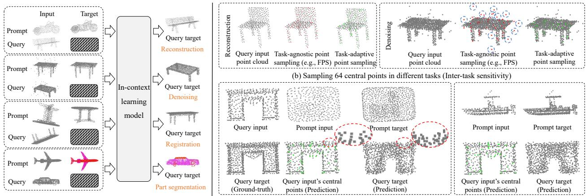
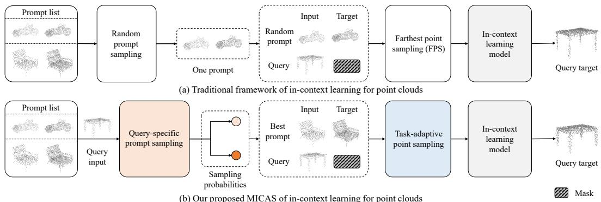
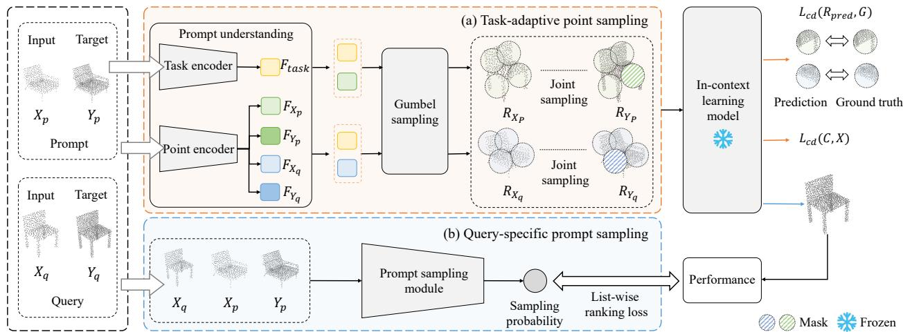
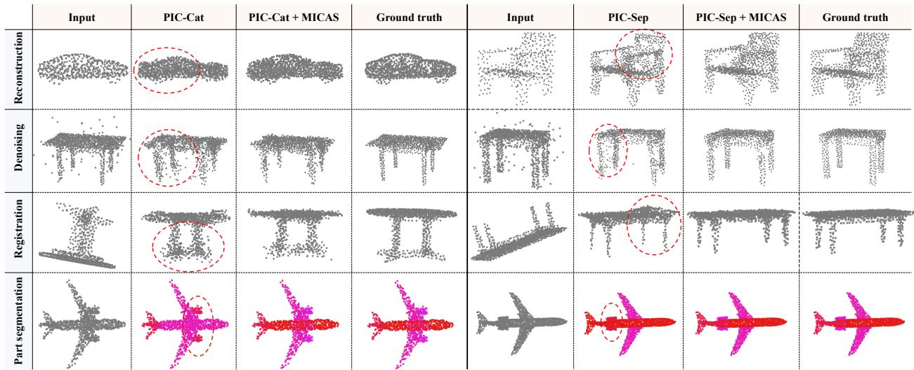

# MICAS: Multi-grained In-Context Adaptive Sampling for 3D Point Cloud Processing

Feifei Shao1\*, Ping Liu2\*, Zhao Wang3, Yawei Luo4†, Hongwei Wang1, Jun Xiao5

1 Zhejiang University-University of Illinois Urbana-Champaign Institute, Zhejiang University, China 2 Computer Science and Engineering, University of Nevada, Reno, USA

3 Ningbo Innovation Center, Zhejiang University, China 4 School of Software Technology, Zhejiang University, China

College of Computer Science and Technology, Zhejiang University, China

{sff, zhao wang, yaweiluo}@zju.edu.cn, pino.pingliu@gmail.com,

hongweiwang@intl.zju.edu.cn, junx@cs.zju.edu.cn

## Abstract

Point cloudprocessing (PCP) encompasses tasks like reconstruction, denoising, registration, and segmentation, each often requiring specialized models to address unique task characteristics. While in-context learning (ICL) has shown promise across tasks by using a single model with taskspecific demonstration prompts, its application to PCP reveals significant limitations. We identify inter-task and intra-task sensitivity issues in current ICL methods for PCP, which we attribute to inflexible sampling strategies lacking context adaptation at the point and prompt levels. To address these challenges, we propose MICAS, an advanced ICL framework featuring a multi-grained adaptive sampling mechanism tailored for PCP. MICAS introduces two core components: task-adaptive point sampling, which leverages inter-task cues for point-level sampling, and query-specific prompt sampling, which selects optimal prompts per query to mitigate intra-task sensitivity. To our knowledge, this is the first approach to introduce adaptive sampling tailored to the unique requirements ofpoint clouds within an ICLframework. Extensive experiments show that MICAS not only efficiently handles various PCP tasks but also significantly outperforms existing methods. Notably, it achieves a remarkable 4.1% improvement in the part segmentation task and delivers consistent gains across various PCP applications.

## 1. Introduction

Deep learning has greatly advanced 3D point cloud processing, tackling tasks like semantic segmentation [24, 55, 80], registration [72, 82], reconstruction [18, 32, 40, 61], and denoising [37, 65]. However, achieving high performance often requires separate models for each task, increasing complexity and resource demands. Multi-task Learning (MTL) [34, 54, 81, 84] attempts to reduce this burden by training models to handle multiple tasks simultaneously, but it struggles with performance trade-offs and complex parameter tuning. In contrast, In-context Learning (ICL) [11, 22, 70] offers a simpler approach, using only a few prompts to guide a single model in performing multiple tasks without changing its parameters [1, 3, 60, 62, 63].

Despite these advancements, recent efforts to extend ICL to 3D point cloud processing [11, 35] reveal significant limitations. Specifically, these studies have not fully addressed critical challenges associated with conventional point cloud sampling techniques used in the ICL framework. Taking Figure 1 for example, the ICL framework manages multiple point cloud tasks, each with distinct preferences for point cloud sampling. More concretely, ICL models (e.g., PIC [11]) use Masked Point Modeling for multiple point cloud tasks, reconstructing masked patches from unmasked ones (cf. Figure 3), with point patches obtained via KNN on the sampling center points. However, conventional sampling methods struggle to adapt equally well to these diverse tasks simultaneously. These gaps, particularly in adapting sampling techniques to task-specific and prompt-specific contexts, hinder overall performance and reliability.

To overcome these limitations, our work tackles two critical issues: 1) Inter-task Sensitivity: As illustrated in Figure 1 (b), task-agnostic sampling strategies, e.g., Farthest Point Sampling (FPS), may perform differently across different tasks, such as reconstruction and denoising. This difference arises because FPS tends to prioritize outliers, often leading to the selection of noisy points. This issue underscores the urgent need for a methodology that effec-

  
(a) Illustration of in-context learning for different task  
(c) Sampling different prompts to predict the target point cloud in the reconstruction task (Intra-task sensitivity)

Figure 1. Inter-task and intra-task sensitivities in in-context learning. The red and green points are sampled using Farthest Point Sampling and task-adaptive point sampling, respectively. The blue circles indicate erroneous sampling points, while the red ovals highlight missing points in the predicted point cloud, caused by the absence of a central point within the region. (Zoom in for more details)

tively integrates task information into the sampling process. cti ing2) Intra-task Sensitivity: Depicted in Figure 1 (c), varianst entions in prompts for the same task can yield divergent sam-Repling outcomes, resulting in inconsistent experimental repoint samplingsampling (e.g., FPS) samppoint cloud point cloudsults. This highlights the need to replace generic prompts (a) Sampling 64 central points in different tasks with carefully curated, query-specific prompts.

To effectively address the inter-task and intra-task sensitivity issues, we introduce a novel Multi-grained In-Context Query input Prompt input Prompt inAdaptive Sampling mechanism, dubbed MICAS, for 3D point cloud in-context learning. As shown in Figure 2 (b), MICAS comprises two integral components: task-adaptive point sampling and query-specific prompt sampling.

Ground-truth) points (Predpoints (Prediction) (Prediction)For inter-task sensitivity, task-adaptive point sampling (b) Sampling different prompts to predict the target point cloud in the reconstruction task (Inenables adaptive sampling by interpreting various prompts, operating in two stages: prompt understanding and Gumbel sampling. First, the prompt understanding phase extracts essential task features from the prompt and corresponding point features from point clouds, providing a basis for informed sampling. However, traditional discrete sampling methods fail to support gradient-based optimization, jeopardizing both the efficiency and effectiveness of the learning process. To address this, the Gumbel sampling phase leverages the Gumbel-softmax [19], transforming discrete sampling into a differentiable operation and enabling a fully learnable and efficient sampling process [66].

To mitigate the intra-task sensitivity caused by prompt variability, we integrate a query-specific prompt sampling module. This module selects the most effective prompt by ranking the sampling scores, which are aligned to the inference performance. Specifically, we first predict sampling score for each prompt by analyzing queries and prompts, followed by aligning these scores with the incontext learning model’s performance. During inference, the “best-performing” prompt is selected based on these scores among strategically chosen candidate prompts.

We evaluate our design on a benchmark [11] comprising multiple existing datasets [5, 74], covering four distinct point cloud tasks with five levels of difficulty each. Our comprehensive evaluation demonstrates the efficacy of MIpoint samplingFPS)CAS in addressing both inter-task and intra-task sensitivity issues. In addition, these results highlight the practical advantages of MICAS, including enhanced adaptability to diverse 3D point cloud tasks and improved robustness across various ICL model variants. The contributions of this paper are summarized as follows:

• We propose a novel multi-grained in-context adaptive sampling mechanism, MICAS, that effectively ad-Query targetdresses inter-task and intra-task sensitivity issues in 3D ity)point cloud in-context learning.

• MICAS integrates two key components: task-adaptive point sampling and query-specific prompt sampling. The former dynamically adjusts to task-specific needs at the point level, while the latter refines prompt selection to minimize intra-task variability. Together, these components enable adaptive and efficient sampling across diverse 3D point cloud tasks.

• Extensive experiments demonstrate that MICAS not only simplifies training and efficiently handles multiple tasks but also achieves substantial performance gains over previous state-of-the-art methods, including a notable 4.1% increase in the part segmentation task.

## 2. Related Work

## 2.1. Sampling Methods for Point Cloud

Point cloud sampling is essential for representing object shape and topology efficiently, enabling large-scale point cloud analysis [30, 36, 39, 66]. Existing methods can be categorized into mathematical statistics-based and learnable task-based approaches. First, mathematical statistics-based methods [6, 13, 17, 30, 50, 57] are task-agnostic, leveraging structural and geometric properties. Techniques include random sampling [17], grid sampling [57], farthest point sampling [30, 50], and Inverse Density Importance Sampling (IDIS) [13]. While effective, these methods overlook task-specific information. Second, learnable task-based methods [9, 26, 66, 71] design sampling networks tailored to specific tasks and guided by task losses. Dovrat et al. [9] propose S-Net, a learnable network that generates point subsets and enhances them with ProgressiveNet, which prioritizes task-relevant points. SampleNet [26] introduces differentiable sampling using weighted averages of nearest neighbors, while IndexSample [68] improves results with a confidence layer. SkeletonNet [66] uses Gumbel-softmax for discrete sampling, and CP-Net [45] performs adaptive down-sampling. PAT [73] employs group shuffle attention, PointASNL [71] adaptively adjusts point features and local normalization, Pra-net [7] integrates intra-region structure learning for local adaptation, and APES [67] utilizes edge detection for adaptive sampling. Matsuzaki [41] proposed a learnable sampling method with probabilistic loss adjustments to enhance neural field scalability for 3D surface representation. LTA-PCS [33] is a task-agnostic method that uses geometric and semantic information, guided by a pretrained 2D feature extractor, to select semantically meaningful points without task-specific labels.

However, existing mathematical statistics-based sampling overlooks information from both the point cloud and the task. Meanwhile, existing learnable task-based sampling focuses on inter-point cloud adaptation within the same task, neglecting inter-task adaptation within the same point cloud. To handle this issue, we propose task-adaptive point sampling to leverage task-specific information from prompts for customized, efficient sampling across tasks.

## 2.2. Demonstration Retrieval for ICL

The sensitivity of in-context learning to demonstration selection [70] has led to the development of various retrieval techniques, categorized into similarity-based and diversitybased methods. First, similarity-based retrieval assumes that demonstrations resembling the query provide valuable guidance [31]. Methods like KATE [31] retrieve semantically similar examples to construct prompts, while EPR [53] uses similarity scores based on inner products. PARC [47] enriches contexts with semantically similar sentences, and UDR [29] introduces a multi-task list-wise ranking framework to mine high-quality demonstrations. Second, diversity-based retrieval focuses on reducing redundancy, providing varied perspectives, and ensuring query coverage [27, 75, 83]. Auto-CoT [83] diversifies sampled questions to construct reasoning chains, GENREAD [75] uses clustering to synthesize prompts from diverse clusters, and Cover-LS [27] selects demonstrations that ensure structural coverage for better generalization.

Drawing inspiration from existing demonstration retrieval methods, we implement a simple yet effective scorebased retrieval approach of 3D point cloud, introducing a novel query-specific prompt sampling module.

## 2.3. Point Cloud in Large Language Model Era

With the rapid advancements in Large Language Models (LLMs) [28, 38, 42, 43, 52, 58], various point cloud methods integrating LLMs have emerged. For example, Point-CLIP [78] and CLIP2 [77] align 3D data with language representations, leveraging multi-view depth maps and few-shot fine-tuning, triplet proxies collection scheme and cross-modal pretraining, respectively. MiniGPT-3D [56] efficiently aligns 3D data with LLMs using 2D priors. Point-E [46] generates 3D point clouds from prompts, and PointBind [15] offers a unified framework for 3D multimodal tasks. PointLLM [69] and SegPoint [16] utilize LLaMA [58] for understanding point clouds, while PIC [11] and DG-PIC [22] apply ICL for multi-task and multidomain point cloud processing.

## 3. Methodology

## 3.1. Preliminaries

Problem Settings. We formally define the problem settings for in-context learning with 3D point clouds. As illustrated in Figure 2 (a), each input sample comprises two pairs of “input-target” point clouds, similar to the setup used in 2Dcontext learning [11]. One pair serves as a prompt, and the other pair serves as a query. Each pair consists of an input point cloud and its corresponding output point cloud for the given task [11, 70]. The prompts represent four typical PCP tasks: reconstruction [21, 40], denoising [20, 37], registration [49, 72], and part segmentation [25, 55]. Following established protocols [11, 35], the network is trained to reconstruct randomly masked parts of the “target” point cloud in both the prompt and the query. During inference, the model reconstructs the “target” point cloud of the query. Revisiting Point Cloud In-Context Learning Model. Before presenting our method, we formally introduce the framework of in-context learning for point clouds. Using the pioneering work PIC [11] as an example, which introduces a new benchmark, the framework comprises data processing, model design, and model training.

Regarding data processing, PIC [11] begins by considering two pairs of “input-target” point clouds, denoted as query $Q = ( X _ { q } , Y _ { q } )$ and prompt $P = ( X _ { p } , Y _ { p } )$ . It first applies FPS [50] to select N central points $C _ { X _ { q } }$ and $C _ { X _ { \varepsilon } }$ from $X _ { q }$ and $X _ { p } ,$ , respectively. To ensure alignment between the sampled central points derived from the “input” and “target” point clouds, a Joint Sampling (JS) module is employed. This module uses the point indexes of central points $C _ { X _ { q } }$ and $C _ { X _ { F } }$ to locate the corresponding position points in the “target” point clouds $Y _ { q }$ and $Y _ { p }$ as their center points $C _ { Y _ { q } }$ and $C _ { Y _ { p } ; \ l }$ , respectively. Subsequently, the K-Nearest Neighbors (KNN) [12] technique transforms $( X _ { q } , Y _ { q } , X _ { p } , Y _ { p } )$ into N point patches $( R _ { X _ { q } } , R _ { Y _ { q } } , R _ { X _ { p } } , R _ { Y _ { p } } )$ based on these central points, which are then encoded into tokens. Finally, these point patches are encoded into tokens.

  
Figure 2. Comparison between the proposed MICAS and the traditional in-context learning framework.

In model design, PIC [11] adopts a mask-point modeling (MPM) strategy with a transformer-based encoder-decoder architecture. $\mathbf { A } 1 \times 1$ convolutional layer serves as the task head for reconstructing the point clouds.

During model training, PIC [11] utilizes two pairs of point patches, the query point patches $( R _ { X _ { q } } , R _ { Y _ { q } } )$ and the prompt point patches $( R _ { X _ { p } } , R _ { Y _ { p } } )$ , to perform a masked point reconstruction task. It first randomly masks the point patches within $R _ { Y _ { q } }$ and $R _ { Y _ { \tau } }$ and then trains the model using the Chamfer Distance [10] loss $\mathcal { L } _ { c d } .$ , defined as:

$$
\begin{array} { r l } & { \mathcal { L } _ { c d } ( R _ { p r e d } , G ) = \frac { 1 } { | R _ { p r e d } | } \underset { r \in R _ { p r e d } } { \sum } \underset { g \in G } { \operatorname* { m i n } } | | r - g | | _ { 2 } ^ { 2 } } \\ & { \quad \quad \quad + \frac { 1 } { | G | } \underset { g \in G } { \sum } \underset { r \in R _ { p r e d } } { \operatorname* { m i n } } | | g - r | | _ { 2 } ^ { 2 } , } \end{array}\tag{1}
$$

where $\mathcal { L } _ { c d }$ measures the discrepancy between each predicted patch $R _ { p r e d }$ and its corresponding ground truth patch $G , | R _ { p r e d } |$ and |G| represent the number of points in patch $R _ { p r e d }$ and patch G, respectively. During inference, the model predicts the entire masked “target” point cloud $Y _ { q }$ for the query, which is shown in Figure 2 (a).

However, PIC [11] employs FPS, which lacks context adaptation at both the point and prompt levels, leading to sensitivity issues across and within tasks. As shown in Figure 1 and Table 2, FPS often selects noisy points as center points in the denoising task, causing the model’s CD loss to remain high. To overcome these critical limitations, we propose a novel Multi-grained In-Context Adaptive Sampling mechanism, dubbed MICAS, which fundamentally rethinks point cloud in-context learning by incorporating taskadaptive point sampling and query-specific prompt sampling. This new approach significantly enhances the adaptability and robustness of point cloud processing tasks shown in Figure 4 and Table 2, addressing the inter-task and intratask sensitivity issues that previous methods, such as PIC, fail to resolve.

## 3.2. Task-adaptive Point Sampling

As illustrated in Figure 3 (a), we introduce a task-adaptive point sampling module to address the inter-task sensitivity (cf. Figure 1 (b)) by focusing on understanding and applying task information from prompts during the sampling stage. This module comprises two key components: prompt understanding, which extracts relevant task features and point features, and Gumbel sampling, which achieves differentiable sampling via the Gumbel-softmax [19, 73] leveraging these extracted dual-level features.

1) Prompt Understanding. To accurately understand the point cloud information in the “input-target” point clouds of query $Q = ( X _ { q } , Y _ { q } )$ and prompt $P = ( X _ { p } , Y _ { p } )$ we adopt PointNet [49] as our task encoder and point encoder, as shown in Figure 3 (a). First, we employ a task encoder that incorporates the max pooling layer and previous from the PointNet classification branch [49], enabling it to extract task-relevant information from prompts. Its objective is to process the prompt $P = ( X _ { p } , Y _ { p } )$ and generate the corresponding task feature $F _ { t a s k }$ . Specifically, we concatenate the prompt $P = ( X _ { p } , Y _ { p } )$ , and feed this concatenation into the task encoder $\Phi _ { t a s k }$ to yield the task feature $F _ { t a s k }$

$$
F _ { t a s k } = \Phi _ { t a s k } ( X _ { p } \oplus Y _ { p } ) ,\tag{2}
$$

where ⊕ denotes concatenation operation.

Second, to extract point feature information from each point cloud, we employ a point encoder based on the Point-Net segmentation branch [49]. Its purpose is to process any given point cloud X∗ and produce the associated point features $F _ { X _ { * } }$

$$
F _ { X _ { * } } = \Phi _ { p o i n t } ( X _ { * } ) ,\tag{3}
$$

where $X _ { * }$ refers to any of the point clouds $X _ { q } , Y _ { q } , X _ { p } ,$ and $Y _ { p } .$ . Accordingly, $F _ { X }$ represents the features of point clouds, namely $F _ { X _ { q } } , F _ { Y _ { q } } , F _ { X _ { p } }$ , and $F _ { Y _ { p } }$ , respectively.

  
Figure 3. Overview of the proposed MICAS. (a) Task-adaptive point sampling is designed to achieve better point-level sampling. (b) Query-specific prompt sampling aims to infer the most effective prompt-level sampling.

2) Gumbel Sampling. We utilize the task feature $F _ { t a s k }$ and the point features $F _ { X _ { q } }$ and $F _ { X _ { p } }$ to achieve differentiable sampling by integrating the Gumbel-softmax approach [19, 73]. This method performs a “soft” selection that mimics one-hot encoding by blending probabilities rather than making a hard selection of a single point.

As illustrated in Figure 3 (a), we initially merge the task feature $F _ { t a s k } \in \mathbb { R } ^ { d 1 }$ with the point feature $\boldsymbol { F _ { X _ { q } } } ^ { - } \in \mathbb { R } ^ { S \times d 2 }$ to create enhanced point features $\hat { F } _ { X _ { q } } \in \mathbb { R } ^ { S \times ( d \overset { . } { 1 } + d 2 ) }$ :

$$
\hat { F } _ { X _ { q } } = F _ { t a s k } \oplus F _ { X _ { q } } ,\tag{4}
$$

where d1 and d2 represent the feature dimensions, and S denotes the number of points in the point cloud. Then, the enhanced point features $\hat { F } _ { X _ { q } }$ are passed through a fully connected layer with weight parameter $W \in \mathbb { R } ^ { ( d 1 + d 2 ) \times N }$ to yield sampling weights $\bar { M _ { \mathbf { \lambda } } } \in \mathbb { R } ^ { S \times N }$

$$
M = \hat { F } _ { X _ { q } } \times W ,\tag{5}
$$

where N indicates the number of selected points.

Subsequently, the sampling weight M is normalized using the Gumbel-softmax [19, 73], which employs a discrete reparameterization technique to obtain smooth gradients by continuously relaxing the categorical variable [66]. Given the Gumbel noise $g = ( g _ { 1 } , \dotsc , g _ { k } )$ , where each gi is independently drawn from a Gumbel distribution within 0 and 1, the soft sampling weight $M _ { g s }$ is calculated as:

$$
M _ { g s } = s o f t m a x \left( ( \log ( M ) + g ) / \tau \right) ,\tag{6}
$$

where $\tau > 0$ is the annealing temperature, and the softmax function operates along the dimension of points. The Gumbel-softmax mechanism ensures that the newly generated points remain within the three-dimensional space of the original point cloud. Ultimately, the selected central points $C _ { X _ { q } } \in \mathbb { R } ^ { N \times 3 }$ are generated by projecting the sampling weight $M _ { g s }$ onto the original point cloud $\boldsymbol { X } _ { q } \in R ^ { S \times 3 } ;$

$$
C _ { X _ { q } } = M _ { g s } ^ { T } \times X _ { q } .\tag{7}
$$

The same process is applied to derive the sampling points $C _ { X _ { \mathcal { F } } }$ for the point cloud $X _ { p } .$ . Following the methodology of Fang et al. [11], we employ Joint Sampling and KNN techniques to produce N point patches $( R _ { X _ { q } } , R _ { Y _ { q } } , R _ { X _ { p } } , R _ { Y _ { p } } )$ which are then input into the in-context learning model (e.g., PIC [11]) for masked point modeling.

3) Loss Function. To enhance the training of the taskadaptive point sampling module, we implement an additional $\mathcal { L } _ { c d } ( C , X )$ loss function based on Equation 1. This new loss function quantifies the discrepancy between the sampled central points C and the original point cloud X, as shown in Figure 3. Finally, the training loss of the taskadaptive point sampling module, denoted as $\mathcal { L } _ { s a m p l i n g } ,$ , is defined as follows:

$$
\mathcal { L } _ { s a m p l i n g } = \mathcal { L } _ { c d } ( R _ { p r e d } , G ) + \alpha \cdot \mathcal { L } _ { c d } ( C , X ) ,\tag{8}
$$

where $R _ { p r e d }$ and G respectively represent the predicted patch and its ground-truth patch, as introduced in Equation 1. The α is to modulate the influence of the CD loss between the sampled points and the original point cloud.

## 3.3. Query-specific Prompt Sampling

To address the intra-task sensitivity issue depicted in Figure 1 (c), we introduce a query-specific prompt sampling module designed to select the most suitable prompt, as depicted in Figure 3 (b).

1) Pseudo Label. Inspired by UDR [29], which addresses prompt retrieval in natural language processing, we collect training examples for our prompt sampling module by utilizing the output signals from the in-context learning model $\Phi _ { I C L }$ (e.g., PIC [11]). Specifically, given a query “input” point cloud $X _ { q }$ and a prompt $P = ( X _ { p } , Y _ { p } ) , \Phi _ { I C L }$ processes these inputs to generate a predicted query “target” point cloud $\tilde { Y } _ { q }$ . We then evaluate the performance by comparing $\tilde { Y } _ { q }$ with the ground-truth query “target” point cloud $Y _ { q }$ , using metrics such as CD loss or mIOU. The resulting performance serves as the pseudo label B for the training of the prompt sampling module, as illustrated in Figure 3:

$$
B = \varphi ( \Phi _ { I C L } ( X _ { q } , X _ { p } , Y _ { p } ) ) ,\tag{9}
$$

where $\varphi ( )$ is the performance comparing predictions to Ground truth. To ensure consistency across different tasks, we employ max-min normalization [23, 59]. This normalization maintains the maximum and minimum performance values for each task, allowing us to normalize performance indicators across different tasks to the range [0, 1].

2) Sampling Score. Our goal is to utilize the query “input” point cloud to generate a sampling score for each candidate prompt. Specifically, we first combine the query “input” point cloud $X _ { q }$ with the prompt $P = ( X _ { p } , Y _ { p } )$ to form a fused point cloud $\tilde { X } \in \mathbb { R } ^ { 3 S \times 3 }$

$$
{ \tilde { X } } = ( X _ { q } \oplus X _ { p } \oplus Y _ { p } ) ,\tag{10}
$$

where $\oplus$ denotes the concatenation along the point dimen sion, and S represents the number of points in the point cloud. We randomly select K prompts for each query “input” point cloud, generating K new point clouds ${ \tilde { X } } _ { i } .$ These ${ \tilde { X } } _ { i }$ are then passed through the prompt sampling module $\Phi _ { p r o m p t } ~ ^ { 1 }$ to produce K sampling scores Score = $\{ s c o r e _ { 1 } , s c o r e _ { 2 } , \ldots , s c o r e _ { K } \}$ , where each score is defined as:

$$
s c o r e _ { i } = \Phi _ { p r o m p t } ( \tilde { X } _ { i } ) .\tag{11}
$$

3) Loss Function. Given a query “input” point cloud and K randomly selected prompts, we first generate K pseudo labels $B = \{ b _ { 1 } , b _ { 2 } , . . . , b _ { K } \}$ using Equation 9. Then, we compute $K$ sampling scores by employing Equation 11. Finally, we utilize the list-wise ranking loss $\mathcal { L } _ { l i s t w i s e \_ r a n k }$ to evaluate and optimize ranking orders [4, 29, 70], as shown in Figure 3 (b).

$$
\begin{array} { r } { \mathcal { L } _ { l i s t w i s e . r a n k } = \displaystyle \sum _ { i , j } ^ { K } m a x ( 0 , \frac { 1 } { r ( b _ { i } ) } - \frac { 1 } { r ( b _ { j } ) } ) } \\ { \times l o g ( 1 + e ^ { ( s c o r e _ { j } - s c o r e _ { i } ) } ) , } \end{array}\tag{12}
$$

where $r ( b _ { i } )$ indicates the ranking order of $b _ { i }$ among these candidate prompts.

During inference, given a query “input” $X _ { q }$ , we first use the prompt sampling module to select the best prompt with the highest score among K candidates, as shown in Figure 2 (b). Then, we input $X _ { q }$ and selected prompt into PIC [11] to predict the “target” point cloud for the query.

## 3.4. Model Training

Task-adaptive point sampling learns each prompt individually, whereas query-specific prompt sampling evaluates multiple prompts simultaneously. Jointly training these two modules could increase the learning complexity of taskadaptive point sampling, slow convergence, and create unnecessary entanglement between the modules. Adopting a step-wise training strategy, as suggested in previous studies [2, 44], can simplify the problem, improve robustness, and make the learning process more manageable. Therefore, we employ this strategy for our proposed MICAS.

First, we train the task-adaptive point sampling module, replacing the central points typically selected by FPS with those produced by our sampling method. This phase focuses on optimizing point sampling and uses the Chamfer Distance (CD) loss (cf. Equation 8), while the queryspecific prompt sampling module remains inactive.

Once the task-adaptive point sampling module is trained and its parameters are fixed, we proceed to train the queryspecific prompt sampling module. This module analyzes each query and its candidate prompts to predict sampling scores, rank them, and optimize using the list-wise ranking loss (cf. Equation 12).

## 4. Experiments

## 4.1. Experimental Settings

Dataset. The proposed MICAS is rigorously evaluated using the ShapeNet In-Context Dataset, introduced in the PIC [11]. This dataset comprises “input-target” point cloud pairs, each derived from well-known repositories such as ShapeNet [5] and ShapeNetPart [74]. The “input” point cloud serves the task query, while the “target” represents the expected outcome. The dataset is extensive, featuring 174, 404 samples for training and 43, 050 for testing, across four distinct tasks: registration, reconstruction, denoising, and part segmentation. Each task is divided into five levels of difficulty to assess model performance comprehensively. Evaluation Metrics. We employ the Chamfer Distance (CD) [10] and Mean Intersection over Union (mIOU) as the primary evaluation metrics for different tasks. For registration, reconstruction, and denoising tasks, CD is used to measure the structural discrepancy between the predicted and ground-truth point clouds. For part segmentation, mIOU is utilized to appraise segmentation performance.2

## 4.2. Comparisons with State-of-The-Art Methods

We compare our MICAS with various models on the ShapeNet In-Context dataset [11] in Table 1 and Figure 4.

Comparison to Task-Specific Models. As shown in Table 1, task-specific models set a high benchmark, delivering peak performance in reconstruction and denoising tasks due to their specialized design. However, these models require a dedicated network for each task, leading to significant complexity and resource demands. In contrast, MICAS uses only a prompt to guide a single model across multiple tasks and shows remarkable versatility, particularly excelling in registration and part segmentation. It outperforms ACT [8] by 2.2 points in registration and an impressive 6.7 points in part segmentation, showcasing its effectiveness while offering a more streamlined and efficient solution.

Table 1. Comparison with state-of-the-art models on the ShapeNet In-Context [11]. For reconstruction, denoising, and registration, we report Chamfer Distance (CD) [10] loss (x1000). For part segmentation, we report mIOU. Copy: uses the prompt’s “target” point cloud as its prediction. The blue and underline values indicate the best and second-best results.
<table><tr><td rowspan="2">Models</td><td rowspan="2">Venues</td><td rowspan="2">L1 L2</td><td colspan="4">Reconstruction CD ↓</td><td colspan="6">Denoising CD ↓</td><td colspan="6">Registration CD ↓</td><td rowspan="2">Part Seg.</td></tr><tr><td>L3</td><td>L4</td><td>L5</td><td>Avg.</td><td>L1</td><td>L2</td><td>L3</td><td>L4</td><td>L5</td><td>Avg. L1</td><td>L2</td><td>L3</td><td>L4</td><td>L5</td><td>Avg.</td><td></td></tr><tr><td></td><td></td><td></td><td></td><td>Task-specific models (trained separately)</td><td></td><td></td><td></td><td></td><td></td><td></td><td></td><td></td><td></td><td></td><td></td><td></td><td></td><td></td><td>mIOU↑</td></tr><tr><td>PointNet [49] CVPR&#x27;17</td><td></td><td>3.7</td><td>3.7</td><td>3.8</td><td>3.9</td><td>4.1</td><td>3.9 4.1</td><td>4.0</td><td>4.1</td><td>4.0</td><td>4.2</td><td>4.1</td><td>5.3</td><td>5.9</td><td>6.9</td><td>7.7</td><td>8.5</td><td>6.9</td><td>77.5</td></tr><tr><td>DGCNN [64]</td><td>TOG&#x27;19</td><td>3.9</td><td>3.9</td><td>4.0 4.1</td><td>4.3</td><td>4.0</td><td>4.7</td><td>4.5</td><td>4.6</td><td>4.5</td><td>4.7</td><td>4.6</td><td>6.2</td><td>6.7</td><td>7.3</td><td>7.4</td><td>7.7</td><td>7.1</td><td>76.1</td></tr><tr><td>PCT [14]</td><td>CVM&#x27;21</td><td>2.4</td><td>2.4</td><td>2.5 2.6</td><td>3.0</td><td>2.6</td><td>2.3</td><td>2.2</td><td>2.2</td><td>2.2</td><td>2.3</td><td>2.2</td><td>5.3</td><td>5.7</td><td>6.3</td><td>6.9</td><td>7.2</td><td>6.3</td><td>79.5</td></tr><tr><td>ACT [8]</td><td>ICLR’23</td><td>2.4</td><td>2.5</td><td>2.3 2.5</td><td>2.8</td><td>2.5</td><td>2.2</td><td>2.3</td><td>2.2</td><td>2.3</td><td>2.5</td><td>2.3</td><td>5.1</td><td>5.6</td><td>5.9</td><td>6.0</td><td>7.0</td><td>5.9</td><td>81.2</td></tr><tr><td colspan="14">Multi-task models: share backbone + multi-task heads</td></tr><tr><td>PointNet [49]</td><td>CVPR&#x27;17</td><td>87.2</td><td>86.6</td><td>87.3 90.8</td><td>92.2</td><td>88.8</td><td>17.8</td><td>22.0</td><td>25.6</td><td>30.4</td><td>33.2</td><td>25.8</td><td>25.4</td><td>22.6</td><td>24.9</td><td>25.7</td><td>26.9</td><td>25.1</td><td>15.3</td></tr><tr><td>DGCNN [64]</td><td>TOG&#x27;19</td><td>38.8</td><td>36.6</td><td>37.5</td><td>37.9</td><td>42.9</td><td>37.7</td><td>6.5 6.3</td><td>6.5</td><td>6.4</td><td>7.1</td><td>6.5</td><td>12.5</td><td>14.9</td><td>17.9</td><td>19.7</td><td>20.7</td><td>17.1</td><td>17.0</td></tr><tr><td>PCT [14]</td><td>CVM&#x27;21</td><td>34.7</td><td>44.1</td><td>49.9 50.0</td><td>52.3</td><td>46.2</td><td>11.2</td><td>10.3</td><td>10.7</td><td>10.2</td><td>10.5</td><td>10.6</td><td>24.4</td><td>26.0</td><td>29.6</td><td>32.8</td><td>34.7</td><td>29.5</td><td>16.7</td></tr><tr><td>Point-MAE [48]</td><td>ECCV’22</td><td>5.5</td><td>5.5</td><td>6.1 6.4</td><td>6.4</td><td>6.0</td><td>5.6</td><td>5.4</td><td>5.6</td><td>5.5</td><td>5.8</td><td>5.6</td><td>11.4</td><td>12.8</td><td>14.8</td><td>16.0</td><td>16.9</td><td>14.5</td><td>5.4</td></tr><tr><td>ACT [8]</td><td>ICLR’23</td><td>7.4</td><td>6.6</td><td>6.5 6.6</td><td>7.0</td><td>6.8</td><td>7.3</td><td>6.8</td><td>7.0</td><td>6.8</td><td>7.2</td><td>7.0</td><td>12.2</td><td>14.4</td><td>19.4</td><td>25.5</td><td>29.0</td><td>20.1</td><td>12.1</td></tr><tr><td>I2P-MAE [79]</td><td>CVPR’23</td><td>17.0</td><td>16.0</td><td>16.7 17.2</td><td>18.5</td><td>17.2</td><td>20.6</td><td>20.4</td><td>20.1</td><td>18.3</td><td>18.8</td><td>19.6</td><td>32.5</td><td>31.3</td><td>31.1</td><td>31.6</td><td>31.2</td><td>31.5</td><td>22.6</td></tr><tr><td>ReCon [51]</td><td>ICML&#x27;23</td><td>12.4</td><td>12.1</td><td>12.4 12.5</td><td>13.1</td><td>12.5</td><td>20.4</td><td>24.5</td><td>27.2</td><td>29.2</td><td>32.5</td><td>26.9</td><td>14.7</td><td>16.3</td><td>19.2</td><td>21.5</td><td>22.5</td><td>18.8</td><td>7.7</td></tr><tr><td colspan="14">In-context learning models</td><td></td><td></td><td></td><td></td><td></td><td></td><td></td></tr><tr><td>Copy Point-BERT [76]</td><td></td><td>155</td><td>153</td><td>152</td><td>156</td><td>155</td><td>154</td><td>149 155</td><td>157</td><td>155</td><td>155</td><td>154</td><td>155</td><td>157</td><td>156</td><td>148</td><td>154</td><td>154</td><td>24.2</td></tr><tr><td></td><td>CVPR&#x27;22</td><td>288</td><td>285</td><td>292</td><td>286</td><td>308 292</td><td>292</td><td>293</td><td>298</td><td>296</td><td>299</td><td>296</td><td>291</td><td>295</td><td>294</td><td>295</td><td>298</td><td>294</td><td>0.7</td></tr><tr><td>PIC-Cat [11]</td><td>NeurIPS’23</td><td>3.2</td><td>3.6</td><td>4.6</td><td>4.9</td><td>5.5 4.3</td><td>3.9</td><td>4.6</td><td>5.3</td><td>6.0</td><td>6.8</td><td>5.3</td><td>10.0</td><td>11.4</td><td>13.8</td><td>16.9</td><td>18.6</td><td>14.1</td><td>79.0</td></tr><tr><td>PIC-Sep [11]</td><td>NeurIPS’23</td><td>4.7</td><td>4.3</td><td>4.3</td><td>4.4</td><td>5.7 4.7</td><td>6.3</td><td>7.2</td><td>7.9</td><td>8.2</td><td>8.6</td><td>7.6</td><td>8.6</td><td>9.2</td><td>10.2</td><td>11.3</td><td>12.4</td><td>10.3</td><td>75.0</td></tr><tr><td>PIC-S-Cat [35] PIC-S-Sep [35]</td><td>Arxiv&#x27;24</td><td>9.3</td><td>5.1</td><td>4.8</td><td>5.0 10.3</td><td>6.9</td><td>4.7</td><td>5.7</td><td>6.5</td><td>7.4</td><td>8.2</td><td>6.5</td><td>12.8</td><td>15.8</td><td>23.9</td><td>31.2</td><td>36.9</td><td>24.1</td><td>83.8</td></tr><tr><td></td><td>Arxiv&#x27;24</td><td>4.6 4.6</td><td>4.5 4.2</td><td>4.5 4.8</td><td>7.1</td><td>5.1</td><td>9.4</td><td>11.7</td><td>12.5</td><td>13.1</td><td>13.4</td><td>12.0</td><td>6.0</td><td>6.1</td><td>7.6</td><td>6.7</td><td>7.3</td><td>6.7</td><td>83.7</td></tr><tr><td>PIC-Cat [11] + MICAS</td><td>Ours</td><td></td><td>3.9</td><td>4.5</td><td>4.8</td><td>5.7 4.7</td><td>4.2</td><td>4.4</td><td>4.6</td><td>4.9</td><td>5.1</td><td>4.6</td><td>5.7</td><td>6.5 3.6</td><td>9.1 3.7</td><td>12.5 3.8</td><td>15.4 4.0</td><td>9.8 3.7</td><td>87.9 86.8</td></tr><tr><td>PIC-Sep [11] + MICAS</td><td>Ours</td><td>3.8</td><td></td><td>4.0</td><td>4.4</td><td>5.6 4.3</td><td>4.4</td><td>4.9</td><td>5.2</td><td>5.5</td><td>5.7</td><td>5.1</td><td>3.4</td></table>

Table 2. Ablation studies on the ShapeNet In-Context Dataset [11]. FPS: farthest point sampling. Point: task-adaptive point sampling. Prompt: query-specific prompt sampling. Inference time represents the average time required to process a query on three 1080ti GPUs.
<table><tr><td rowspan="2">ICL Model</td><td rowspan="2">FPS</td><td rowspan="2">Point</td><td rowspan="2">Prompt</td><td rowspan="2"></td><td colspan="5">Reconstruction CD ↓</td><td colspan="5">Denoising CD ↓</td><td colspan="5">Registration CD ↓</td><td rowspan="2"></td><td rowspan="2">Part Seg. mIOU↑</td><td rowspan="2">Inference time (ms)</td></tr><tr><td>L1</td><td>L2</td><td>L3</td><td>L4</td><td>L5</td><td>Avg.</td><td>L1 L2</td><td>L3</td><td>L4</td><td>L5  $\operatorname { A v g } .$ </td><td>L1</td><td>L2 L3</td><td>L4</td><td>L5</td><td>Avg.</td></tr><tr><td rowspan="4">PIC-Cat [11]</td><td> $\overline { { \surd } }$ </td><td></td><td></td><td>4.9</td><td>4.1</td><td>4.5</td><td>4.7</td><td>6.3</td><td>4.9</td><td>4.2 5.1</td><td>5.9</td><td>6.8</td><td>7.8</td><td>6.0</td><td>6.5</td><td>7.8 13.6</td><td>20.4</td><td>24.5</td><td>14.5</td><td>79.9</td><td>15.6</td></tr><tr><td></td><td> $\surd$ </td><td></td><td>4.8</td><td>4.2</td><td>4.5</td><td>4.8</td><td>5.8</td><td>4.8 4.3</td><td>4.5</td><td>4.7</td><td>4.9</td><td>5.2</td><td>4.7</td><td>6.5 7.5</td><td>11.1</td><td>16.2</td><td>20.2</td><td>12.3</td><td>87.6</td><td>21.4</td></tr><tr><td> $\surd$ </td><td></td><td> $\surd$ </td><td>4.8</td><td>4.1</td><td>4.4</td><td>4.6</td><td>6.2</td><td>4.8</td><td>4.2</td><td>5.0 5.7</td><td>6.5</td><td>7.3</td><td>5.7</td><td>5.5</td><td>6.5 10.0</td><td>14.5</td><td>17.7</td><td>10.8</td><td>80.2</td><td>44.3</td></tr><tr><td></td><td> $\surd$ </td><td> $\surd$ </td><td>4.6</td><td>4.2</td><td>4.5</td><td>4.8</td><td>5.7</td><td>4.7</td><td>4.2 4.4</td><td>4.6</td><td>4.9</td><td>5.1</td><td>4.6</td><td>5.7</td><td>6.5 9.1</td><td>12.5</td><td>15.4</td><td>9.8</td><td>87.9</td><td>47.1</td></tr><tr><td rowspan="4">PIC-Sep [11]</td><td> $\surd$ </td><td></td><td></td><td>3.9</td><td>3.9</td><td>3.9</td><td>4.3</td><td>6.2</td><td>4.4 6.2</td><td>7.2</td><td>7.7</td><td>8.2</td><td>8.3</td><td>7.5</td><td>7.6 7.8</td><td>8.4</td><td>9.0</td><td>10.0</td><td>8.6</td><td>78.7</td><td>15.0</td></tr><tr><td></td><td> $\surd$ </td><td></td><td>4.2</td><td>4.1</td><td>4.2</td><td>4.6 6.1</td><td>4.6</td><td>4.9</td><td>5.4</td><td>5.6</td><td>6.0</td><td>6.3</td><td>5.6</td><td>7.6 7.4</td><td>7.8</td><td>9.2</td><td>10.7</td><td>8.5</td><td>86.6</td><td>20.9</td></tr><tr><td> $\surd$ </td><td></td><td> $\surd$ </td><td>3.6</td><td>3.7</td><td>3.8</td><td>4.1 5.8</td><td>4.2</td><td>5.4</td><td>6.2</td><td>6.6</td><td>7.0</td><td>7.1</td><td>6.5</td><td>3.3 3.4</td><td>3.5</td><td>3.6</td><td>3.8</td><td>3.5</td><td>79.1</td><td>44.1</td></tr><tr><td></td><td> $\surd$ </td><td> $\surd$ </td><td>3.8</td><td>3.9</td><td>4.0</td><td>4.4</td><td>5.6</td><td>4.3</td><td>4.4 4.9</td><td>5.2</td><td>5.5</td><td>5.7</td><td>5.1</td><td>3.4 3.6</td><td>3.7</td><td>3.8</td><td>4.0</td><td>3.7</td><td>86.8</td><td>45.9</td></tr></table>

Comparison to Multi-task Models. Our proposed MI-CAS significantly outperforms state-of-the-art multi-task models across four tasks. Compared to Point-MAE [48], MICAS achieves better results across all five levels of datasets in the reconstruction, denoising, and registration tasks, thanks to its adaptive sampling mechanisms for taskspecific feature extraction. In the part segmentation task, MICAS achieves a remarkable mIOU of 65.3 higher than I2P-MAE [79], demonstrating its effectiveness in handling complex segmentation challenges.

Comparison to In-context learning Models. Within the realm of in-context learning for point clouds, two main approaches have emerged: Point-BERT [76] and PIC [11]. Therein, PIC includes two variants: ∗-Cat and ∗-Sep. For ∗-Cat methods, although MICAS shows a minor shortfall in the reconstruction compared to PIC-Cat [48], it significantly outperforms in the denoising, registration, and part segmentation tasks. Specifically, MICAS surpasses PIC-Cat [48] by 4.3 in the registration and 8.9 in the part segmentation. Moreover, MICAS consistently outperforms PIC-S-

  
Figure 4. Qualitative experimental results compared with the PIC-Cat [11] and PIC-Sep [11]. The red ovals represent the difference between the two methods. Additional visualization results can be found in the supplementary material. (Zoom in for more details)

Cat [35] across all evaluation metrics and tasks. For ∗-Sep methods, MICAS achieves superior performance compared to both PIC-Sep [48] and PIC-S-Sep [35] across all metrics and tasks. In addition, qualitative results in Figure 4 further highlight the effectiveness of our proposed method.

## 4.3. Ablation Study

To demonstrate the effectiveness of MICAS, we perform an ablation study in Table 2. The results show that taskadaptive point sampling enhances denoising and part segmentation, while query-specific prompt sampling improves reconstruction and registration. They complement each other in both sampling granularity and overall performance.

Task-adaptive Point Sampling. We replace the FPS used in PIC-Cat [11] and PIC-Sep [11] with task-adaptive point sampling. While task-adaptive point sampling shows both strengths and limitations compared to FPS in the reconstruction task, it shows clear superiority in the denoising, registration, and part segmentation tasks. Specifically, although task-adaptive point sampling yields an average CD loss that is 0.2 higher in reconstruction compared to FPS when using PIC-Sep [11] as the ICL model, it significantly outperforms FPS across all other metrics and tasks. In addition, our proposed task-adaptive point sampling considerably enhances model performance without noticeably impacting inference speed.

Query-specific Prompt Sampling. We conduct two types of experiments, employing query-specific prompt sampling on FPS and task-adaptive point sampling, respectively. Our experimental results indicate that queryspecific prompt sampling enhances overall performance. More importantly, the benefits of query-specific prompt sampling and task-adaptive point sampling are complementary. Specifically, task-adaptive sampling excels in enhancing denoising and part segmentation tasks, while queryspecific prompt sampling boosts performance in reconstruction and registration tasks. As shown in Table 2, combining task-adaptive point sampling with query-specific prompt sampling yields the best overall results, achieving significant performance improvements across all tasks. In addition, we find that these enhancements are achievable with only a threefold increase in inference time.

## 5. Conclusion

We undertake an early effort to address the inter-task and intra-task sensitivity issues arising from lacking context adaptation, spanning both point and prompt levels. Specifically, we propose a Multi-grained In-Context Adaptive Sampling, dubbed MICAS, which includes task-adaptive point sampling and query-specific prompt sampling. The former is engineered to interpret task information from diverse prompts and amalgamate it with the original point cloud, enabling a sampling approach that is tailored to each prompt. The latter involves identifying the most relevant prompt for each query, which provides more effective task guidance. To our knowledge, this represents the inaugural exploration into point cloud sampling within an in-context learning framework at both point and prompt levels.

Acknowledgements. This work was supported by the National Key Research & Development Project of China (2024YFB3312900, SQ2023AAA01005), Zhejiang Provincial Natural Science Foundation of China (LD25F020001, LDT23F02023F02, LZ24F020002), Key R&D Program of Zhejiang (2025C01128), National Natural Science Foundation of China (62276230, 62293554, U2336212), Ningbo Innovation “Yongjiang 2035” Key Research and Development Programme (2024Z292), and Young Elite Scientists Sponsorship Program by CAST (2023QNRC001).

## References

[1] Amir Bar, Yossi Gandelsman, Trevor Darrell, Amir Globerson, and Alexei Efros. Visual prompting via image inpainting. In NeurIPS, 2022. 1

[2] Tolga Bolukbasi, Joseph Wang, Ofer Dekel, and Venkatesh Saligrama. Adaptive neural networks for efficient inference. In ICML, 2017. 6

[3] Tom Brown, Benjamin Mann, Nick Ryder, Melanie Subbiah, Jared D Kaplan, Prafulla Dhariwal, Arvind Neelakantan, Pranav Shyam, Girish Sastry, Amanda Askell, et al. Language models are few-shot learners. In NeurIPS, 2020. 1

[4] Christopher JC Burges. From ranknet to lambdarank to lambdamart: An overview. Learning, 2010. 6

[5] Angel X Chang, Thomas Funkhouser, Leonidas Guibas, Pat Hanrahan, Qixing Huang, Zimo Li, Silvio Savarese, Manolis Savva, Shuran Song, Hao Su, et al. Shapenet: An information-rich 3d model repository. arXiv, 2015. 2, 6

[6] Haolan Chen, Shitong Luo, Xiang Gao, and Wei Hu. Unsupervised learning of geometric sampling invariant representations for 3d point clouds. In ICCV, 2021. 3

[7] Silin Cheng, Xiwu Chen, Xinwei He, Zhe Liu, and Xiang Bai. Pra-net: Point relation-aware network for 3d point cloud analysis. TIP, 2021. 3

[8] Runpei Dong, Zekun Qi, Linfeng Zhang, Junbo Zhang, Jianjian Sun, Zheng Ge, Li Yi, and Kaisheng Ma. Autoencoders as cross-modal teachers: Can pretrained 2d image transformers help 3d representation learning? In ICLR, 2023. 7

[9] Oren Dovrat, Itai Lang, and Shai Avidan. Learning to sample. In CVPR, 2019. 3

[10] Haoqiang Fan, Hao Su, and Leonidas J Guibas. A point set generation network for 3d object reconstruction from a single image. In CVPR, 2017. 4, 6, 7

[11] Zhongbin Fang, Xiangtai Li, Xia Li, Joachim M Buhmann, Chen Change Loy, and Mengyuan Liu. Explore in-context learning for 3d point cloud understanding. In NeurIPS, 2024. 1, 2, 3, 4, 5, 6, 7, 8

[12] Evelyn Fix. Discriminatory analysis: nonparametric discrimination, consistency properties. USAF school of Aviation Medicine, 1985. 4

[13] Fabian Groh, Patrick Wieschollek, and Hendrik PA Lensch. Flex-convolution: Million-scale point-cloud learning beyond grid-worlds. In ACCV, 2018. 3

[14] Meng-Hao Guo, Jun-Xiong Cai, Zheng-Ning Liu, Tai-Jiang Mu, Ralph R Martin, and Shi-Min Hu. Pct: Point cloud transformer. Computational Visual Media, 2021. 7

[15] Ziyu Guo, Renrui Zhang, Xiangyang Zhu, Yiwen Tang, Xianzheng Ma, Jiaming Han, Kexin Chen, Peng Gao, Xianzhi Li, Hongsheng Li, et al. Point-bind & point-llm: Aligning point cloud with multi-modality for 3d understanding, generation, and instruction following. arXiv, 2023. 3

[16] Shuting He, Henghui Ding, Xudong Jiang, and Bihan Wen. Segpoint: Segment any point cloud via large language model. In ECCV, 2025. 3

[17] Qingyong Hu, Bo Yang, Linhai Xie, Stefano Rosa, Yulan Guo, Zhihua Wang, Niki Trigoni, and Andrew Markham. Randla-net: Efficient semantic segmentation of large-scale point clouds. In CVPR, 2020. 3

[18] Zhangjin Huang, Yuxin Wen, Zihao Wang, Jinjuan Ren, and Kui Jia. Surface reconstruction from point clouds: A survey and a benchmark. TPAMI, 2024. 1

[19] Eric Jang, Shixiang Gu, and Ben Poole. Categorical repa rameterization with gumbel-softmax. In ICLR, 2016. 2, 4, 5

[20] Alireza Javaheri, Catarina Brites, Fernando Pereira, and Joao˜ Ascenso. Subjective and objective quality evaluation of 3d point cloud denoising algorithms. In ICMEW, 2017. 3

[21] Philipp Jenke, Michael Wand, Martin Bokeloh, Andreas Schilling, and Wolfgang Straßer. Bayesian point cloud reconstruction. In Computer graphicsforum, 2006. 3

[22] Jincen Jiang, Qianyu Zhou, Yuhang Li, Xuequan Lu, Meili Wang, Lizhuang Ma, Jian Chang, and Jian Jun Zhang. Dgpic: Domain generalized point-in-context learning for point cloud understanding. In ECCV, 2025. 1, 3

[23] Jeesoo Kim, Junsuk Choe, Sangdoo Yun, and Nojun Kwak. Normalization matters in weakly supervised object localiza tion. In ICCV, 2021. 6

[24] Maxim Kolodiazhnyi, Anna Vorontsova, Anton Konushin, and Danila Rukhovich. Oneformer3d: One transformer for unified point cloud segmentation. In CVPR, 2024. 1

[25] Loic Landrieu and Martin Simonovsky. Large-scale point cloud semantic segmentation with superpoint graphs. In CVPR, 2018. 3

[26] Itai Lang, Asaf Manor, and Shai Avidan. Samplenet: Differ entiable point cloud sampling. In CVPR, 2020. 3

[27] Itay Levy, Ben Bogin, and Jonathan Berant. Diverse demonstrations improve in-context compositional generalization. In ACL, 2023. 3

[28] Lin Li, Jun Xiao, Guikun Chen, Jian Shao, Yueting Zhuang, and Long Chen. Zero-shot visual relation detection via com posite visual cues from large language models. NeurIPS, 2023. 3

[29] Xiaonan Li, Kai Lv, Hang Yan, Tianyang Lin, Wei Zhu, Yuan Ni, Guotong Xie, Xiaoling Wang, and Xipeng Qiu. Unified demonstration retriever for in-context learning. In ACL, 2023. 3, 5, 6

[30] Yangyan Li, Rui Bu, Mingchao Sun, Wei Wu, Xinhan Di, and Baoquan Chen. Pointcnn: Convolution on x-transformed points. In NeurIPS, 2018. 2, 3

[31] Jiachang Liu, Dinghan Shen, Yizhe Zhang, Bill Dolan, Lawrence Carin, and Weizhu Chen. What makes good in context examples for gpt-3? In DeeLIO, 2022. 3

[32] Jiaxiang Liu, Jin Hao, Hangzheng Lin, Wei Pan, Jianfei Yang, Yang Feng, Gaoang Wang, Jin Li, Zuolin Jin, Zhihe Zhao, et al. Deep learning-enabled 3d multimodal fusion of cone-beam ct and intraoral mesh scans for clinically applica ble tooth-bone reconstruction. Patterns, 2023. 1

[33] Jiaheng Liu, Jianhao Li, Kaisiyuan Wang, Hongcheng Guo, Jian Yang, Junran Peng, Ke Xu, Xianglong Liu, and Jinyang Guo. Lta-pcs: learnable task-agnostic point cloud sampling. In CVPR, 2024. 3

[34] Jiaxiang Liu, Yuan Wang, Jiawei Du, Joey Zhou, and Zuozhu Liu. Medcot: Medical chain of thought via hierarchical expert. In EMNLP, 2024. 1

[35] Mengyuan Liu, Zhongbin Fang, Xia Li, Joachim M Buhmann, Xiangtai Li, and Chen Change Loy. Point-in-context: Understanding point cloud via in-context learning. arXiv, 2024. 1, 3, 7, 8

[36] Yongcheng Liu, Bin Fan, Shiming Xiang, and Chunhong Pan. Relation-shape convolutional neural network for point cloud analysis. In CVPR, 2019. 2

[37] Shitong Luo and Wei Hu. Score-based point cloud denoising. In ICCV, 2021. 1, 3

[38] Yawei Luo and Yi Yang. Large language model and domainspecific model collaboration for smart education. FITEE, 2024. 3

[39] Xu Ma, Can Qin, Haoxuan You, Haoxi Ran, and Yun Fu. Rethinking network design and local geometry in point cloud: A simple residual mlp framework. In ICLR, 2022. 2

[40] Priyanka Mandikal and Venkatesh Babu Radhakrishnan. Dense 3d point cloud reconstruction using a deep pyramid network. In WACV, 2019. 1, 3

[41] Kohei Matsuzaki and Keisuke Nonaka. Learnable point cloud sampling considering seed point for neural surface reconstruction. IEEE Access, 2024. 3

[42] Siwei Meng, Yawei Luo, and Ping Liu. Grounding creativity in physics: A brief survey of physical priors in aigc. arXiv, 2025. 3

[43] Qiaowei Miao, Kehan Li, Jinsheng Quan, Zhiyuan Min, Shaojie Ma, Yichao Xu, Yi Yang, and Yawei Luo. Advances in 4d generation: A survey. arXiv, 2025. 3

[44] Amit Moryossef, Yoav Goldberg, and Ido Dagan. Step-bystep: Separating planning from realization in neural data-totext generation. arXiv, 2019. 6

[45] Ehsan Nezhadarya, Ehsan Taghavi, Ryan Razani, Bingbing Liu, and Jun Luo. Adaptive hierarchical down-sampling for point cloud classification. In CVPR, 2020. 3

[46] Alex Nichol, Heewoo Jun, Prafulla Dhariwal, Pamela Mishkin, and Mark Chen. Point-e: A system for generating 3d point clouds from complex prompts. arXiv, 2022. 3

[47] Ercong Nie, Sheng Liang, Helmut Schmid, and Hinrich Schutze. Cross-lingual retrieval augmented prompt for low-¨ resource languages. In ACL, 2023. 3

[48] Yatian Pang, Wenxiao Wang, Francis EH Tay, Wei Liu, Yonghong Tian, and Li Yuan. Masked autoencoders for point cloud self-supervised learning. In ECCV, 2022. 7, 8

[49] Charles R Qi, Hao Su, Kaichun Mo, and Leonidas J Guibas. Pointnet: Deep learning on point sets for 3d classification and segmentation. In CVPR, 2017. 3, 4, 6, 7

[50] Charles Ruizhongtai Qi, Li Yi, Hao Su, and Leonidas J Guibas. Pointnet++: Deep hierarchical feature learning on point sets in a metric space. In NeurIPS, 2017. 3

[51] Zekun Qi, Runpei Dong, Guofan Fan, Zheng Ge, Xiangyu Zhang, Kaisheng Ma, and Li Yi. Contrast with reconstruct: Contrastive 3d representation learning guided by generative pretraining. In ICML, 2023. 7

[52] Alec Radford, Jong Wook Kim, Chris Hallacy, Aditya Ramesh, Gabriel Goh, Sandhini Agarwal, Girish Sastry, Amanda Askell, Pamela Mishkin, Jack Clark, et al. Learning transferable visual models from natural language supervision. In ICML, 2021. 3

[53] Ohad Rubin, Jonathan Herzig, and Jonathan Berant. Learning to retrieve prompts for in-context learning. In NAACL, 2022. 3

[54] Ziyu Shan, Qi Yang, Rui Ye, Yujie Zhang, Yiling Xu, Xiaozhong Xu, and Shan Liu. Gpa-net: No-reference point cloud quality assessment with multi-task graph convolu tional network. TVCG, 2023. 1

[55] Feifei Shao, Yawei Luo, Ping Liu, Jie Chen, Yi Yang, Yulei Lu, and Jun Xiao. Active learning for point cloud semantic segmentation via spatial-structural diversity reasoning. In ACM MM, 2022. 1, 3

[56] Yuan Tang, Xu Han, Xianzhi Li, Qiao Yu, Yixue Hao, Long Hu, and Min Chen. Minigpt-3d: Efficiently aligning 3d point clouds with large language models using 2d priors. In ACM MM, 2024. 3

[57] Hugues Thomas, Charles R Qi, Jean-Emmanuel Deschaud, Beatriz Marcotegui, Franc¸ois Goulette, and Leonidas J Guibas. Kpconv: Flexible and deformable convolution for point clouds. In ICCV, 2019. 3

[58] Hugo Touvron, Thibaut Lavril, Gautier Izacard, Xavier Martinet, Marie-Anne Lachaux, Timothee Lacroix, Baptiste´ Roziere, Naman Goyal, Eric Hambro, Faisal Azhar, et al.\` Llama: Open and efficient foundation language models. arXiv, 2023. 3

[59] Nazanin Vafaei, Rita A Ribeiro, and Luis M Camarinha-Matos. Assessing normalization techniques for simple additive weighting method. Procedia Computer Science, 2022. 6

[60] Jiacheng Wang, Ping Liu, Jingen Liu, and Wei Xu. Text guided eyeglasses manipulation with spatial constraints. IEEE Transactions on Multimedia, 26:4375–4388, 2023. 1

[61] Jiacheng Wang, Zhedong Zheng, Wei Xu, and Ping Liu. Rigi: Rectifying image-to-3d generation inconsistency via uncertainty-aware learning. arXiv, 2024. 1

[62] Xinlong Wang, Wen Wang, Yue Cao, Chunhua Shen, and Tiejun Huang. Images speak in images: A generalist painter for in-context visual learning. In CVPR, 2023. 1

[63] Xinlong Wang, Xiaosong Zhang, Yue Cao, Wen Wang, Chunhua Shen, and Tiejun Huang. Seggpt: Segmenting everything in context. In ICCV, 2023. 1

[64] Yue Wang, Yongbin Sun, Ziwei Liu, Sanjay E Sarma, Michael M Bronstein, and Justin M Solomon. Dynamic graph cnn for learning on point clouds. ToG, 2019. 7

[65] Zeyong Wei, Honghua Chen, Liangliang Nan, Jun Wang, Jing Qin, and Mingqiang Wei. Pathnet: Path-selective point cloud denoising. TPAMI, 2024. 1

[66] Cheng Wen, Baosheng Yu, and Dacheng Tao. Learnable skeleton-aware 3d point cloud sampling. In CVPR, 2023. 2, 3, 5

[67] Chengzhi Wu, Junwei Zheng, Julius Pfrommer, and Jurgen¨ Beyerer. Attention-based point cloud edge sampling. In CVPR, 2023. 3

[68] Zhenyu Wu, Kun Li, Yuhu Wu, Xin Zhang, and Shengming Li. Indexsample: A learnable sampling network in point cloud classification. In SICE, 2021. 3

[69] Runsen Xu, Xiaolong Wang, Tai Wang, Yilun Chen, Jiang miao Pang, and Dahua Lin. Pointllm: Empowering large lan guage models to understand point clouds. In ECCV, 2025. 3

[70] Xin Xu, Yue Liu, Panupong Pasupat, Mehran Kazemi, et al. In-context learning with retrieved demonstrations for language models: A survey. arXiv, 2024. 1, 3, 6

[71] Xu Yan, Chaoda Zheng, Zhen Li, Sheng Wang, and Shuguang Cui. Pointasnl: Robust point clouds processing using nonlocal neural networks with adaptive sampling. In CVPR, 2020. 3

[72] Heng Yang, Jingnan Shi, and Luca Carlone. Teaser: Fast and certifiable point cloud registration. IEEE Transactions on Robotics, 2020. 1, 3

[73] Jiancheng Yang, Qiang Zhang, Bingbing Ni, Linguo Li, Jinxian Liu, Mengdie Zhou, and Qi Tian. Modeling point clouds with self-attention and gumbel subset sampling. In CVPR, 2019. 3, 4, 5

[74] Li Yi, Vladimir G Kim, Duygu Ceylan, I-Chao Shen, Mengyan Yan, Hao Su, Cewu Lu, Qixing Huang, Alla Sheffer, and Leonidas Guibas. A scalable active framework for region annotation in 3d shape collections. ToG, 2016. 2, 6

[75] Wenhao Yu, Dan Iter, Shuohang Wang, Yichong Xu, Mingxuan Ju, Soumya Sanyal, Chenguang Zhu, Michael Zeng, and Meng Jiang. Generate rather than retrieve: Large language models are strong context generators. In ICLR, 2023. 3

[76] Xumin Yu, Lulu Tang, Yongming Rao, Tiejun Huang, Jie Zhou, and Jiwen Lu. Point-bert: Pre-training 3d point cloud transformers with masked point modeling. In CVPR, 2022. 7

[77] Yihan Zeng, Chenhan Jiang, Jiageng Mao, Jianhua Han, Chaoqiang Ye, Qingqiu Huang, Dit-Yan Yeung, Zhen Yang, Xiaodan Liang, and Hang Xu. Clip2: Contrastive languageimage-point pretraining from real-world point cloud data. In CVPR, 2023. 3

[78] Renrui Zhang, Ziyu Guo, Wei Zhang, Kunchang Li, Xupeng Miao, Bin Cui, Yu Qiao, Peng Gao, and Hongsheng Li. Pointclip: Point cloud understanding by clip. In CVPR, 2022. 3

[79] Renrui Zhang, Liuhui Wang, Yu Qiao, Peng Gao, and Hongsheng Li. Learning 3d representations from 2d pre-trained models via image-to-point masked autoencoders. In CVPR, 2023. 7

[80] Ruiyuan Zhang, Jiaxiang Liu, Zexi Li, Hao Dong, Jie Fu, and Chao Wu. Scalable geometric fracture assembly via cocreation space among assemblers. In AAAI, 2024. 1

[81] Yu Zhang and Qiang Yang. A survey on multi-task learning. TKDE, 2021. 1

[82] Yaojie Zhang, Weijun Wang, Tianlun Huang, Zhiyong Wang, and Wei Feng. Svc: Sight view constraint for robust point cloud registration. Image and Vision Computing, 2024. 1

[83] Zhuosheng Zhang, Aston Zhang, Mu Li, and Alex Smola. Automatic chain of thought prompting in large language models. In ICLR, 2023. 3

[84] Luda Zhao, Yihua Hu, Xing Yang, Zhenglei Dou, and Linshuang Kang. Robust multi-task learning network for complex lidar point cloud data preprocessing. Expert Systems with Applications, 2024. 1