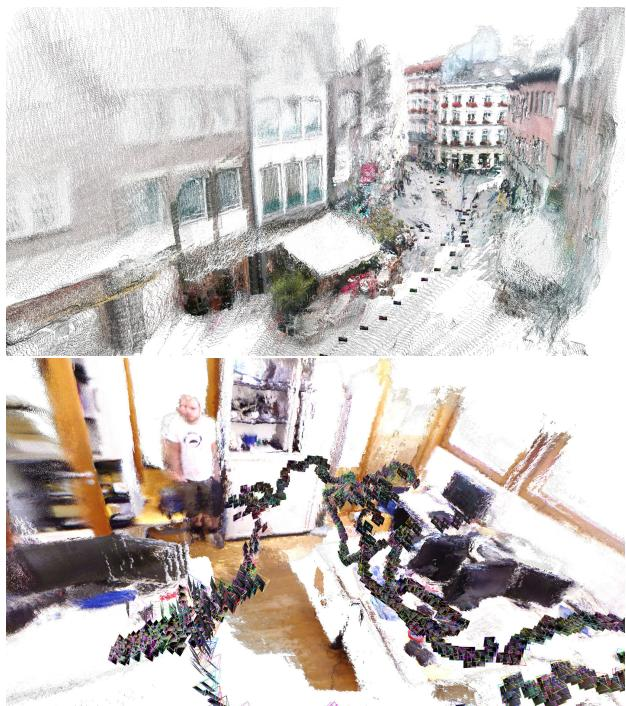
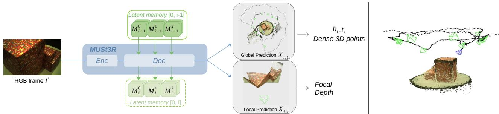
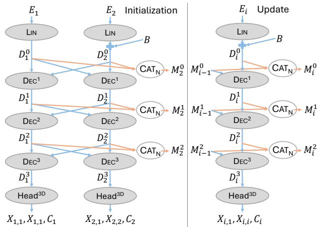
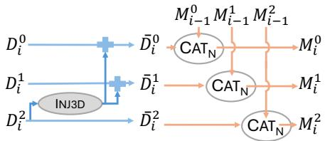

# MUSt3R: Multi-view Network for Stereo 3D Reconstruction

Yohann Cabon∗ Lucas Stoffl† Leonid Boris Chidlovskii∗ Jerome Revaud∗ Jerome Revaud\* ∗Naver Labs Europe firstname.lastname@naverlabs.com

Antsfeld∗ Antsfeld\*

Gabriela Csurka∗ Vincent Leroy∗ †EPFL lucas.stoffl@epfl.ch

## Abstract

DUSt3R introduced a novel paradigm in geometric computer vision by proposing a model that can provide dense and unconstrained Stereo 3D Reconstruction of arbitrary image collections with no prior information about camera calibration nor viewpoint poses. Under the hood, however, DUSt3R processes image pairs, regressing local 3D reconstructions that need to be aligned in a global coordinate system. The number ofpairs, growing quadratically, is an inherent limitation that becomes especially concerning for robust and fast optimization in the case of large image collections. In this paper, we propose an extension ofDUSt3R from pairs to multiple views, that addresses all aforementioned concerns. Indeed, we propose a Multi-view Network for Stereo 3D Reconstruction, or MUSt3R, that modifies the DUSt3R architecture by making it symmetric and extending it to directly predict 3D structure for all views in a common coordinate frame. Second, we entail the model with a multi-layer memory mechanism which allows to reduce the computational complexity and to scale the reconstruction to large collections, inferring thousands of 3D pointmaps at highframe-rates with limited added complexity. Theframework is designed to perform 3D reconstruction both offline and online, and hence can be seamlessly applied to SfM and visual SLAM scenarios showing state-of-the-art performance on various 3D downstream tasks, including uncalibrated Visual Odometry, relative camera pose, scale and focal estimation, 3D reconstruction and multi-view depth estimation.

## 1. Introduction

Recently, DUSt3R [69] introduced a novel paradigm in geometric computer vision. In a nutshell, it can provide dense and unconstrained Stereo 3D Reconstruction of arbitrary image collections, i.e. without any prior information about camera calibration nor viewpoint poses. By casting the pairwise reconstruction problem as a regression of pairs of pointmaps, where a pointmap is defined as a dense mapping between pixels and 3D points, it effectively relaxes the hard constraints of usual projective camera models. The pointmap representation, now used in subsequent works [18, 30], encompasses both 3D geometry and the camera parameters, and allows to unify and jointly solve various 3D vision tasks such as depth, camera pose and focal length estimation, dense 3D reconstruction and pixel correspondences. Trained from millions of image pairs with ground-truth annotations for depth and camera parameters, DUSt3R shows unprecedented performance and generalization across various real-world scenarios with different camera sensors in zero-shot settings.

  
Figure 1. Qualitative example of MUSt3R reconstructions of Aachen Day-Night [82] nexus4 sequence 5 (offline, top) and TUM-RGBD [56] Freiburg1-room sequence (online, bottom). More qualitative examples can be found in the Supplementary.

Such architecture works seamlessly in monocular and binocular cases, yet when feeding many images, the pairwise nature of the approach becomes a drawback rather than a strength. Since the predicted pointmaps are expressed in a local coordinate system defined by the first image of each pair, all predictions live in different coordinate systems. This design hence requires a global postprocessing step to align all predictions into one global coordinate frame, which quickly becomes intractable for large collections when done naively. This raises the following questions: How to tackle the quadratic complexity of a pairwise approach? How can we robustly and quickly optimize such problem? What ifwe need real-time predictions? While these legitimate concerns are partially addressed in Mast3R-SfM [18], we take here a different stance and design a new architecture that is scalable to large image collections of arbitrary scale, and that can infer the corresponding pointmaps in the same coordinate system at high framerates. To achieve these, our Multi-view network for Stereo 3D Reconstruction (MUSt3R), extends the DUSt3R architecture through several crucial modifications – i.e. making it symmetric and adding a working memory mechanism – with limited added complexity. The model, beyond handling offline reconstruction of unordered image collections in a Structure-from-Motion (SfM) scenario, can also tackle the task of dense Visual Odometry (VO) and SLAM, which aims to predict online the camera pose and 3D structure of a video stream recorded by a moving camera. We present the first approach, to the best of our knowledge, that can seamlessly leverage the memory mechanism to cover both scenarios such that no architecture change is required and the same network can operate either task in an agnostic manner.

  
Figure 2. (Left) Overview of our uncalibrated reconstruction framework: an input RGB, MUSt3R architecture and the memory state. The network predicts both local ${ \bf X } _ { i , i }$ and global $\mathbf { X } _ { i , \cdot }$ 1 pointmaps, from which camera focal, depth map, pose and dense 3D can efficiently be recovered, as seen in the global reconstruction. The memory is optionally updated according to simple heuristics depending on the scenario. (Right) Qualitative example of uncalibrated Visual Odometry on the ETH3D “boxes” sequence in the online setting.

Our contributions are threefold:

• we revisit the DUSt3R architecture by making it symmetric and enabling N-view predictions in metric space,

• we entail it with a memory mechanism that allows to decrease the computational complexity for both offline and online reconstructions, and

• we achieve state-of-the-art performance in both unconstrained reconstruction scenarios in terms of estimating field-of-view, camera pose, 3D reconstruction and absolute scale without sacrificing any inference speed.

## 2. Related work

Direct RGB-to-3D. In contrast to traditional handcrafted approaches for Structure-from-Motion (SfM) [10, 11, 23, 25, 48], recent learning approaches aim at directly predicting 3D and cameras from one or several RGB images. These methods leverage neural networks to learn strong 3D priors from large datasets such as object-centric priors [35, 39–41] or arbitrary scenes [54, 58, 64, 68, 83] via differentiable SfM trained end-to-end. DUSt3R [69] takes a different stance by casting the pairwise reconstruction task as a regression of a pair of pointmaps. This model was extended in [30] to improve its pairwise matching capabilities and by [79] adapting it to dynamic scenes. In both cases however, the network only handles pairs, meaning that a Global Alignment (GA) needs to be introduced when more images are available. This comes with an additional complexity, a computational burden and technical challenges.

To avoid global alignment and increase inference speed, Spann3R [65], a concurrent work in the DUSt3R framework proposes to use a spatial memory to keep track of previous observations. This allows to directly predict per-image pointmaps expressed in a global coordinate system, alleviating the need for GA. Spann3R retains the pairwise architecture of DUSt3R processing pairs sequentially. Apart from the first and last one, all images go through the model twice successively. For each image, position-augmented features are obtained in the first pass, then enhanced by querying the spatial memory through an attention operation that involves an additional encoder. The second pass updates the memory and predicts the pointmap. In this work, we divert from the pairwise paradigm and evolve DUSt3R from pairwise to N-view by integrating the memory as an essential element of the architecture. Interestingly, other works like ACE-0 [6] also explored incremental pointmaps prediction in the form of scene coordinate reconstruction. The idea is to track image-to-scene correspondences and represents the scene implicitly as a neural network. Instead, our method represents scenes explicitly as pointmaps and deploys attention operations on memory for image-to-images correspondences.

Calibrated Visual Odometry (VO). SLAM methods using only RGB cameras are less explored than their RGB-D counterparts, since the lack of geometric priors can cause scale and depth ambiguities. We refer the interested reader to a recent survey on SLAM in general [63] and we restrict ourselves to the VO framework in the following. The common denominator of all VO methods [38, 59, 77] is a heavy reliance on handcrafted heuristics and projective camera geometry for joint camera pose and scene optimization, even when leveraging the most recent neural advancements [9, 31, 46, 87]. Most interesting to us are the works in the direction of prior-driven VO by including priors in the form of monocular depth [84, 87], monocular regularization [15] or learned optical flow [60]. Likewise, our method leverages fully data-driven priors to operate online or offline indifferently. However, and in contrast to all existing VO methods, it can handle uncalibrated VO and can also seamlessly estimate a dense 3D scene, the camera parameters and scene scale at high inference speed.

Uncalibrated Regime. Dense VO without camera calibration is appealing for its scalability, versatility and ease of deployment. The problem has often been tackled in combination with other sensors, e.g. multi-camera setups with IMU sensors [24], or camera with LiDARs [43] and provably allows for efficient self-calibration. RGB-only calibration [21, 33], however, typically relies on CNNs trained with large amounts of synthetic data [88] and they are not often used in practice. An exciting option has been proposed with a fully uncalibrated solution to the navigation problem [27] but require a tedious preliminary exploration of a static environment. MUSt3R, akin to DUSt3R operates regardless of the camera parameters as long as it respects the camera models used for training. Interestingly, our dual pointmap prediction head enables efficient recovery of focal length to achieve high frame rates.

## 3. Method

We first briefly recall the main components of the DUSt3R framework in Sec. 3.1. Then, we describe the proposed MUSt3R in Sec. 3.2 and how it simplifies DUSt3R to make it applicable to the N-view scenario. Our formulation enables the introduction of a memory mechanism, described in Sec. 3.3, that can be iteratively updated to handle an unlimited number of views. A major novelty of this approach lies in its ability to seamlessly tackle both offline reconstruction and sequential causal applications, such as dense Visual Odometry, at a high framerate. We describe how a single network can solve both scenarios in Sec. 3.4.

## 3.1. DUSt3R: a binocular architecture

DUSt3R [69] is designed to jointly infer dense 3D reconstruction and camera parameters from pairs of images, by mapping a pair of images to 3D pointmaps that live in a common coordinate system. A transformer-based network predicts a 3D reconstruction given two input images, in the form of two dense 3D pointmaps $\{ \mathbf { X } _ { i , 1 } \} ^ { - } \in \mathbb { R } ^ { H \times W \times 3 } , i \in$ {1, 2} i.e. a 2D-to-3D mapping between each pixel p of the images $\{ I _ { i } \}$ and the 3D point it observes $\mathbf { X } _ { i , 1 } [ p ] \in \mathbb { R } ^ { 3 }$ expressed in the coordinate system of the first camera.

Formally, given a pair of images $\{ I _ { i } \}$ , they are first split into regular patches, or tokens, that are encoded by a Siamese ViT [17] encoder, yielding two latent representations $\mathbf { E } _ { i }$ . These are projected linearly to ${ \bf D } _ { i } ^ { 0 } = \mathrm { L I N } ( { \bf E } _ { i } )$ which is the input to a set of L intertwined layers of decoders blocks $\{ \mathrm { \bar { D } E C _ { 1 } ^ { \it l } , D E C _ { 2 } ^ { \it l } } \} _ { { l = 1 } } ^ { \it L }$ similar to the [71] architecture. These blocks process the two images jointly, exchanging information via cross-attention at each layer to ‘understand’ the spatial relationship between viewpoints and the global 3D geometry of the scene. Finally, two prediction heads $\{ \mathrm { H E A D } _ { i } ^ { 3 \mathrm { D } } \}$ regress the final pointmaps ${ \bf X } _ { i , 1 }$ and their associated confidences $\mathbf { C } _ { i }$ from the output of the last layers $\mathbf { D } _ { i } ^ { L }$ , and optionally $\mathbf { E } _ { i } ,$ , typically leveraged in combination with DPT prediction heads [44]:

$$
\mathbf { X } _ { i , 1 } , \mathbf { C } _ { i } = \mathbf { H } \mathbf { E } \mathbf { A } \mathbf { D } _ { i } ^ { 3 \mathrm { D } } ( \mathbf { E } _ { i } , \mathbf { D } _ { i } ^ { L } )\tag{1}
$$

DUSt3R is trained in a fully-supervised manner using a simple pixel-wise regression loss

$$
\ell _ { \mathrm { r e g r } } ( i , j ) = \sum _ { p \in I _ { i } } \left\| \frac { 1 } { z } { \mathbf { X } } _ { i , j } [ p ] - \frac { 1 } { \hat { z } } \widehat { { \mathbf { X } } } _ { i , j } [ p ] \right\| ,\tag{2}
$$

where j=1 represent the reference view and p is a pixel for which the ground-truth 3D point $\widehat { \mathbf { X } } _ { i , j } [ p ] \in \mathrm { ~ \mathbb { R } ^ { 3 } ~ }$ is defined. In the original formulation [69], normalizing factors $z , \hat { z }$ are introduced to make the reconstruction scale-invariant. They are defined as the mean distance of all valid 3D points to the origin. In this work we instead follow MASt3R [30] and regress metric predictions when possible i.e. we set $z : = \hat { z }$ whenever ground-truth is metric. Following DUSt3R [69], we also wrap this loss with a confidence aware loss $\mathcal { L } _ { c o n f }$

## 3.2. MUSt3R: a Multi-view Architecture

Our first contribution is to extend DUSt3R to an arbitrary number N of views. As detailed before, its binocular architecture features 2 distinct decoders. Naively extending to N views would not scale, as it would practically require a set of N distinct decoders. We propose instead to reformulate and simplify the previous framework by making the architecture symmetric with a single Siamese decoder that shares weights between views. This architecture naturally scales to N views while halving the number of trainable parameters in the decoder compared to that of DUSt3R. Finally, we extend DUSt3R to predict an additional pointmap that will be leveraged for efficient camera parameters estimation. We now detail each modification below.

Simplifying the DUSt3R architecture. First, we make the DUSt3R architecture symmetric. Our hypothesis is that the duplicated decoders and heads are highly redundant. We thus replace them by a Siamese decoder and a Siamese head with shared weights, denoted as DEC and HEAD3D respectively, dropping the subscript notation. To identify the reference image $I _ { 1 }$ , which defines the common coordinate system, we add a learnable embedding B to ${ \bf D } _ { 2 } ^ { 0 }$ at the beginning of the shared decoder,

$$
\begin{array} { r } { { \bf D } _ { 2 } ^ { 0 } = \mathrm { L I N } ( { \bf E } _ { 2 } ) + { \bf B } . } \end{array}\tag{3}
$$

We also note that using Rotary Position Embedding (RoPE) [57] in the cross attention is not necessary and can be safely removed. Please refer to the Supplementary for detailed ablations on these changes.

Scaling-up to multi-view. Our framework naturally extends to handle three or more images. This can be simply done by changing the behavior of the cross-attention in each decoder block $\mathrm { D E C } ^ { l }$ . They are all residual and include selfattention (intra-view), followed by cross-attention (interview), and a final MLP. Therefore, we can trivially let the cross-attention operate between tokens of image $I _ { i }$ and tokens of all other $j \neq i$ images. In more details, let $\mathrm { C A T _ { N } }$ denote the concatenation of image tokens in the sequence dimension and $\mathbf { M } _ { n } ^ { l } = { \mathbf { C } } _ { \mathrm { A T _ { N } } } ( \mathbf { D } _ { 1 } ^ { \bar { l } } , \ldots , \mathbf { D } _ { n } ^ { l } )$ the concatenation of tokens from n images at each layer l. Similarly, $\mathbf { M } _ { n , - i } ^ { l } \ = \ \mathbf { C } \mathbf { A } \mathrm { T } _ { \mathrm { N } } \big ( \mathbf { D } _ { 1 } ^ { l } , \ldots , \mathbf { \bar { D } } _ { i - 1 } ^ { l } , \mathbf { D } _ { i + 1 } ^ { l } , \ldots , \mathbf { D } _ { n } ^ { l } \big )$ denotes the concatenation of tokens for all but the $i ^ { \mathrm { { t h } } }$ image. In this notation, our model applies, at each layer l, cross-attention between tokens of image $I _ { i }$ and tokens of all other images:

$$
\mathbf { D } _ { i } ^ { l } = \mathbf { D } \mathrm { E C } ^ { l } ( \mathbf { D } _ { i } ^ { l - 1 } , \mathbf { M } _ { n , - i } ^ { l - 1 } ) .\tag{4}
$$

Fast relative pose regression. In DUSt3R, $\mathbf { X } _ { 1 , 1 }$ is used to estimate the intrinsics of $I _ { 1 }$ , and a second forward with the symmetric pair $( I _ { 2 } , I _ { 1 } )$ allows to predict $\mathbf { X } _ { 2 , 2 }$ in order to estimate the intrinsics of $I _ { 2 }$ . We want to build a multi-view model that preserves this ability with a low computational cost. For this purpose we change the prediction head to output an additional $\mathbf { X } _ { i , i }$ pointmap:

$$
( \mathbf { X } _ { i , 1 } , \mathbf { X } _ { i , i } , \mathbf { C } _ { i } ) = \mathbf { H } \mathbf { E } \mathbf { A } \mathbf { D } ^ { 3 \mathrm { D } } ( \mathbf { D } _ { i } ^ { L } ) , i \in \{ 1 . . . n \} .\tag{5}
$$

With such a change, we can easily recover the relative pose between $I _ { 1 }$ and $I _ { i }$ by estimating the transformation between $\mathbf { X } _ { i , i }$ and ${ \bf X } _ { i , 1 }$ via Procrustes analysis, which is simpler and faster than PnP, as demonstrated empirically. Interestingly, we do so regardless of the focal length, in contrast to a more traditional PnP [23] approach.

  
Figure 3. Overview of the proposed architecture for a decoder of depth $L = 3 ,$ a Linear $\mathrm { H E A D } ^ { \mathrm { 3 D } }$ and without the $\mathrm { I N J } ^ { \mathrm { 3 D } }$ module. The left side shows initialization with two images. The right side shows how the memory is used and updated given a new image/frame.

  
Figure 4. The 3D feedback module for a decoder of depth $L = 3 .$

## 3.3. Introducing Causality in MUSt3R

Our second contribution is to make MUSt3R iterative. Based on the architecture described in Sec. 3.2, we i) endow the model with an iteratively updated memory which allows to efficiently process any number of images, offline or online, ii) inject 3D feedback to earlier layers through an extra MLP. The overall decoder architecture is shown in Fig. 3, the injection schema is shown in Fig. 4.

Iterative memory update. In Sec. 3.2, we described how to extend DUSt3R to process multiple images. Yet in practice N may be very large, making cross-attention on very large token sequences computationally intractable. Furthermore, in some scenarios the images might arrive sequentially, for instance in visual odometry. In order to handle a large number of images we propose to leverage our model in an iterative manner, with the usage of a memory, reminiscent of Spann3R [65]. Contrary to Spann3R, however, this memory simply contains in our case the previously computed $\mathbf { M } _ { n } ^ { l }$ of every layer. As shown in Fig. 3, when a new image $I _ { n + 1 }$ comes, it cross-attends with these saved tokens, i.e. for each layer we have:

$$
\mathbf D _ { n + 1 } ^ { l } = \mathrm { D E C } ^ { l } ( \mathbf D _ { n + 1 } ^ { l - 1 } , \mathbf M _ { n } ^ { l - 1 } ) .\tag{6}
$$

Features $\mathbf { D } _ { n + 1 } ^ { l }$ of the new image can simply be added to the memory by concatenating them to the current memory $\mathbf { M } _ { n } ^ { l } .$ , thus expanding the memory to $\mathbf { M } _ { n + 1 } ^ { l }$ . Interestingly, we can draw a parallel with KV cache in causal transformer inference [42]. By caching the previously computed $\mathbf { D } _ { i } ^ { l }$ at every layer, we make MUSt3R causal: every new image attends to previously seen images, but these are not updated.

With this architecture, it is possible to process an image without appending new tokens to the memory. We call this process rendering. It can be used to break the causality of the model, i.e. by re-computing pointmaps given tokens of future frames. We typically perform rendering at the end of a video sequence, when all images are in the memory. We can process frames one by one (denoted as sequentially) or n by $n \ ( n \textgreater 1 )$ , although sequential predictions usually perform better as shown in Supplementary.

Global 3D Feedback. So far, the proposed method lacks any feedback mechanism between the memory tokens $\mathbf { M } _ { n } ^ { l }$ of terminal layers towards those of earlier layers $\mathbf { M } _ { n } ^ { k } , k < l .$ In particular, $\mathbf { \dot { M } } _ { i } ^ { 0 }$ is just the concatenation of projected encoder features $\bar { \mathbf { D } _ { i } ^ { 0 } }$ and naturally lacks any knowledge of the other frames. One reasonable assumption is that the token representations at the terminal layer contain more global 3D information than those at earlier layers. We thus propose to simply augment all memory tokens with information from the last layer $l = L - 1$ in order to propagate global 3D knowledge to every layer. This is feasible in the iterative framework described above since the last layers of the past frames already contain this information. Formally, let us denote the set of previous and new images by $\mathcal { P }$ and ${ \mathcal { N } } ,$ respectively. To inject such information from the terminal layer into the earlier layers, we augment $\mathbf { M } _ { n } ^ { l }$ with $\mathbf M _ { n } ^ { l } = \dot { \mathbf C } \mathbf { A } \mathrm { T } _ { \mathrm { N } } ( \bar { \mathbf D } _ { 0 } ^ { l } , \dots , \bar { \mathbf D } _ { n } ^ { l } )$ where

$$
\bar { \mathbf { D } } _ { i } ^ { l } = \left\{ \mathbf { D } _ { i } ^ { l } + \mathrm { I N J } ^ { \mathrm { 3 D } } ( \mathbf { D } _ { i } ^ { L - 1 } ) , \forall l < L - 1 \mathrm { a n d } i \in \mathcal { P } \right.\tag{7}
$$

where $\mathrm { I N J } ^ { \mathrm { 3 D } }$ consists of a Layer Norm followed by a twolayer MLP (see Fig. 4). We refer to empirical evidence in the Supplementary that show the significant impact of this feedback mechanism.

## 3.4. Memory Management

As the memory grows linearly with the number of images, this can become an computational issue for large image collections. To mitigate this, we resort to a heuristic selection of memory tokens. In fact, carefully selecting which images are added to the memory is crucial. We distinguish between two scenarios: online, where frames of a video stream come one by one, and offline, where we want to reconstruct an unordered collection of images. In all cases, we use the same network at test time without bells-and-whistles.

Online. In the video case, we leverage a running memory and 3D scene of current observations which are updated on-the-fly. The memory and the scene are initialized from the predictions of the first image. Then, we forward every incoming frame through MUSt3R, attending to the current memory. This leads to a prediction of both dense visible geometry and camera parameters. We decide whether to keep the current prediction based on the spatial discovery rate between the predicted pointmap $X _ { i , 1 }$ and the current scene, keeping only a frame when it observes a significantly new part of the scene, or from a different enough viewpoint.

To this aim, we store the scene as a set of KDTrees [5]. When building or querying the trees, each 3D point is associated to a tree by index based on the viewing direction of the observation. This is done by splitting the sphere of viewing directions into regular octants. We discretize the view direction of each pixel in spherical coordinates, to map it to the index of the relevant octant. Each pixel is thus mapped to a specific tree, then used to recover the nearest distance to the current scene. This distance is normalized by the depth at this pixel. The discovery rate of a frame is simply the $p \textmd { - }$ $^ { t h }$ percentile of the normalized distances. We decide to add the frame to the memory and the 3D points and view directions to the current 3D scene if the discovery rate is above a given threshold $\tau _ { d } ,$ i.e. the incoming frame observes enough new regions of the scene.

An example of kept memory frames are shown in green in Fig. 2 (right). We refer to the Supplementary for the detailed algorithm. Note that this approach is purely causal since each view only sees the past frames, still we can break the causality by rendering again all images, as described in Sec. 3.3.

Offline. Inspired by MASt3R-SfM [18], we use the ASMK (Aggregated Selective Match Kernels) image retrieval method [61] using the encoder features $\mathbf { E } _ { i }$ of all images $\mathbf { I } _ { i } .$ Our key insight is to leverage the encoded images with minimal computational overhead. We follow their farthest point sampling [19] method to select a fixed number of keyframes. The problem is then to find a good ordering of the images such as to observe the ones that maximize the overlap first, for more stability in the predictions. Therefore, we reorder them with the following strategy: we start with the keyframe which is the most connected to the others, then a greedy loop iteratively adds the other images by order of highest similarity to the current view set. These keyframes are sequentially passed through the network to build a latent representation of the whole scene. We then render all the images from this memory. Note that it is possible to forward all images in an iterative manner like in ACE-0 [6], but this would dramatically increase the number of decoder passes needed, thus adding computational burden.

## 4. Training

Pre-training MUSt3R with pairs. Similar to DUSt3R, we train MUSt3R in multiple steps. First, we start by training the simplified architecture described in Sec. 3.2 for metric predictions. In our scenario, we aim to predict points that could be far apart in a large scene. For a better convergence and performance on distant points, we compute it in log space (see the ablation study of the loss choices in the Supplementary) :

$$
f : x \to \frac { x } { \| x \| } l o g ( 1 + \| x \| ) ,\tag{8}
$$

$$
\mathbf { X } _ { i , j } ^ { \prime } [ p ] = f ( \frac { 1 } { z } \mathbf { X } _ { i , j } [ p ] ) , \widehat { \mathbf { X } } _ { i , j } ^ { \prime } [ p ] = f ( \frac { 1 } { \widehat { z } } \widehat { \mathbf { X } } _ { i , j } [ p ] ) ,\tag{9}
$$

$$
\ell _ { \mathrm { r e g r } } ( i , j ) = \sum _ { p \in I _ { i } } \left\| \mathbf { X } _ { i , j } ^ { \prime } [ p ] - \widehat { \mathbf { X } } _ { i , j } ^ { \prime } [ p ] \right\| .\tag{10}
$$

We start training the model with a linear head initialized from CroCo v2 [72] (decoder depth $L = 1 2 )$ on 224 resolution images. Then, we finetune for 512 resolution (with varying aspect ratios). The model is trained on a mixture of 14 datasets: Habitat [47], ARKitScenes [14], Blended MVS [75], MegaDepth [32], Static Scenes 3D [37], Scan-Net++ [76], CO3D-v2 [45], Map-free [3], WildRGB-D [73], Virtual KITTI [7], Unreal4K [62], DL3DV [34], TartanAir [70] and an internal dataset.

Training MUSt3R. Then, we train MUSt3R with multiple views, starting from the above trained symmetric DUSt3R as initialization. In our experiments we use a total number of $N = 1 0$ images per scene1. To be able to handle such sequences of images, we freeze the encoder and use xformers [29] to compute attention efficiently. We train this model on 12 datasets, that are mentioned above, but removing Virtual KITTI and Static Scenes 3D as they are unsuitable to our setup. During training, the memory is initialized from two images, then updated from individual images, as shown in Fig. 3. We split the training loss in two steps: 1) we predict the pointmaps of a randomly chosen number $n , 2 \leq n \leq N$ of views, and use the latent embeddings to populate the memory, and 2) we render all views, including the n memory frames from this memory, meaning we obtain in the end $n + N$ predictions that correspond to the concatenation of the n and N views. The loss to minimize is thus :

$$
\mathcal { L } = \sum _ { i \in 1 } ^ { n + N } \ell _ { \mathrm { r e g r } } ( i , 1 ) + \ell _ { \mathrm { r e g r } } ( i , i ) .\tag{11}
$$

To increase robustness and favor redundancy, we augment the training with a token dropout. The memory tokens from the first image $I _ { 1 }$ are protected as it plays a particular role for the 3D points are represented in the coordinates of the first camera, similar to DUSt3R. Token dropping is made for each incoming frame on the current memory and is consistent across layers, such that if a token is removed, it should not appear in any layer. We use a dropout probability of 0.05 (0.15) for 224 (512) resolutions respectively.

<table><tr><td></td><td colspan="8">desk desk2</td><td colspan="2">fr2</td><td colspan="2">fr3 long</td><td colspan="2">|Speed (FPS)</td></tr><tr><td>ORB-SLAM3 [8]</td><td>360 X</td><td>2.0</td><td></td><td></td><td></td><td>plant room X</td><td>rpy</td><td>teddy xyz</td><td></td><td>xyz</td><td>desk</td><td></td><td>Avg</td><td></td></tr><tr><td>S DSO [20]</td><td>X</td><td>27.2</td><td>X 66.0</td><td>11.8 6.0</td><td>58.6</td><td>5.6 X</td><td>X X</td><td></td><td>1.0 3.8 0.3</td><td>0.5</td><td>1.3</td><td>1.7</td><td>X X</td><td></td></tr><tr><td>DPVO [60]</td><td>13.1</td><td>9.4</td><td>6.5</td><td>3.0</td><td></td><td>39.8 3.5</td><td></td><td>6.2</td><td>1.3</td><td>0.5</td><td>2.2 3.5</td><td>9.9 5.5</td><td>8.4</td><td></td></tr><tr><td>TANDEM [28]</td><td>X</td><td>4.3</td><td>33.7</td><td>X</td><td></td><td></td><td></td><td></td><td>2.4</td><td></td><td></td><td></td><td>X</td><td></td></tr><tr><td>MonoGS [36]</td><td>14.2</td><td>6.3</td><td>74.0</td><td>9.3</td><td></td><td>X 64.9</td><td>4.9 3.4</td><td>43.1 35.6</td><td>1.6</td><td>0.3 4.5</td><td>2.0 133.1</td><td>8.3 3.3</td><td>31.8</td><td></td></tr><tr><td>DeepFactors [12]</td><td>17.9</td><td>15.9</td><td>20.2</td><td>31.9</td><td></td><td>38.3</td><td>3.8</td><td>56.0</td><td>5.9</td><td>8.4</td><td>26.3</td><td>49.0</td><td>24.9</td><td></td></tr><tr><td>D DepthCov [16]</td><td>12.8</td><td>5.6</td><td>4.8</td><td>26.1</td><td></td><td>25.7</td><td>5.2</td><td>47.5</td><td>5.6</td><td>1.2</td><td>15.9</td><td>68.8</td><td>19.9</td><td></td></tr><tr><td>DROID-VO [59]</td><td>15.7</td><td>5.2</td><td>11.1</td><td>6.0</td><td></td><td>33.4</td><td>3.2</td><td>19.1</td><td>5.6 10.7</td><td></td><td>7.9</td><td>7.3</td><td>11.4</td><td></td></tr><tr><td>COMO-NC [15]</td><td>16.1</td><td>4.2</td><td>10.9</td><td>19.3</td><td></td><td>28.6</td><td>5.2</td><td>68.7</td><td>4.1</td><td>0.7</td><td>8.8</td><td>46.8</td><td>19.4</td><td></td></tr><tr><td>COMO [15]</td><td>12.9</td><td>4.9</td><td>9.5</td><td>13.8</td><td></td><td>27.0</td><td>4.8</td><td>24.5</td><td>4.0</td><td>0.7</td><td>6.3</td><td>10.5</td><td>10.8</td><td></td></tr><tr><td>GIORIE-VO* [78]</td><td>13.1</td><td>4.0</td><td>8.6</td><td>4.1</td><td>32.7</td><td></td><td>2.9</td><td>14.5</td><td>1.2</td><td>0.2</td><td>13.4</td><td>4.8</td><td>9.3</td><td>1</td></tr><tr><td>Spann3R [65]</td><td>20.7</td><td>16.1</td><td>28.3</td><td>57.4</td><td></td><td>84.8</td><td></td><td>92.4</td><td>2.1</td><td>4.4</td><td>15.3</td><td>193.9</td><td>47.4</td><td>4.8</td></tr><tr><td>U MUSt3R-C</td><td>8.9</td><td>5.1</td><td>7.1</td><td>5.4</td><td></td><td>13.4</td><td>6.1 5.2</td><td>6.9</td><td>2.7</td><td>1.7</td><td></td><td></td><td>6.0</td><td>11.1</td></tr><tr><td>MUSt3R</td><td></td><td></td><td></td><td></td><td></td><td></td><td></td><td></td><td></td><td></td><td>4.1</td><td>5.9</td><td></td><td></td></tr><tr><td></td><td>7.8</td><td>4.0</td><td>4.6</td><td>4.0</td><td></td><td>9.9</td><td>4.3</td><td>4.2</td><td>1.3</td><td>1.2</td><td>3.4</td><td>4.3</td><td>4.5</td><td>8.4</td></tr></table>

Table 1. VO: ATE RMSE [cm] on TUM RGB. Sparse (S) versus dense (D) versus dense unconstrained (U) methods on TUM-RGB SLAM benchmark. (\*) model re-run without Loop Closure and global bundle adjustment.

## 5. Experimental validation

We demonstrate the usability and performance of the presented system in many unconstrained scenarios, namely uncalibrated Visual Odometry (VO), relative pose estimation, 3D reconstruction and multi-view depth estimation. In all scenarios we achieve state-of-the-art performance without access to the camera calibration, yet with a pipeline of a striking versatility and simplicity. Our evaluations are comparing MUSt3R to the existing state of the art on many downstream tasks (Sec. 5.2, Sec. 5.3, Sec. 5.4, but we put a particular focus on DUSt3R and Spann3R, which are the closest to our work. We ablate the components and design choices of the MUSt3R architecture in the Supplementary.

## 5.1. Uncalibrated Visual Odometry

We evaluate our online MUSt3R model on the real images datasets TUM RGBD [56] and ETH3D SLAM [50, 51]. We cannot compare on Replica [55] since it is contained in our training set. Note that contrary to the entirety of the compared methods, MUSt3R and Spann3R operate in the unconstrained scenario, meaning the calibration of the camera system is considered unknown. Our results are obtained with the same hyperparameters for all datasets $\tau _ { d } ~ = ~ 5 \%$ and $p _ { d } = 8 5 \%$ (see Sec. 3.4). We denote MUSt3R-C the causal variant, without rendering, while MUSt3R with rendering is followed by a minimal Laplacian smoothing. We compare to Spann3R by running their code on the SLAM benchmarks, with minimal modification to recover camera poses via PnP on the predictions, leveraging the focal length

<table><tr><td></td><td>Test</td><td>Handheld</td><td>Robot</td><td>Structure</td><td>Dynamic</td><td>3D Objects</td><td>Avg</td></tr><tr><td>Spann3R [65]</td><td>4.1(4.0)</td><td>60.1(28.3)</td><td>122.8(115.6)</td><td>32.7(6.8)</td><td>88.3(76.6)</td><td>80.9(61.2)</td><td>|64.8(48.7)</td></tr><tr><td>MUSt3R-C</td><td>3.9(3.8)</td><td>7.2(7.1)</td><td>37.4(32.6)</td><td>5.2(5.0)</td><td>39.1(12.7)</td><td>32.0(7.1)</td><td>20.8(11.4)</td></tr><tr><td>MUSt3R</td><td>3.8(3.8)</td><td>6.2(5.8)</td><td>20.6(14.6)</td><td>3.9(3.6)</td><td>29.1(10.8)</td><td>22.7(5.6)</td><td>14.4(7.4)</td></tr></table>

Table 2. TUM RGBD [56] Tracking Accuracy ATE RMSE [cm]. Dense unconstrained methods on the whole TUM RGBD dataset split into six categories: mean (median) RMSE values are reported per category.
<table><tr><td></td><td colspan="8"></td><td colspan="2">freiburg2</td><td colspan="2">freiburg3</td></tr><tr><td></td><td>360</td><td>desk</td><td>desk2</td><td>plant</td><td>room</td><td>rpy</td><td>teddy</td><td>xyz</td><td>xyz</td><td>desk</td><td>long-office</td><td>Mean Median</td></tr><tr><td>Spann3R</td><td>12.13</td><td>12.77</td><td>12.16</td><td>12.68</td><td>12.12</td><td>11.64</td><td>12.81</td><td>12.36</td><td>11.79</td><td>12.74</td><td>9.49</td><td>12.06 12.16</td></tr><tr><td>MUSt3R</td><td>6.42</td><td>2.64</td><td>3.36</td><td>6.56</td><td>4.32</td><td>4.04</td><td>5.65</td><td>0.11</td><td>5.06</td><td>6.28</td><td>3.04</td><td>4.32 4.32</td></tr></table>

Table 3. Comparison of diagonal FoV errors in degrees for Spann3R and MUSt3R across TUM RGBD scenes.

estimated by the first view.

We are interested in the RMSE Average Trajectory Error (ATE) after alignment to the ground-truth (GT) as a measurement of camera trajectory quality. For unconstrained methods, we also look at the frame-rate, absolute vertical Field-of-View (FoV) error in degrees, as well as metric scale estimation quality in % of the ground-truth scale. Following prior art [15, 60], for fair comparison, all SLAM methods run in visual odometry (VO) mode, i.e. without global bundle adjustment. Qualitative results of the trajectory and reconstructions for both datasets are showed in Figs. 1 and 2 and in Supplementary.

TUM RGBD [56] is a well established benchmark that presents challenges for monocular VO and SLAM due to significant motion blur, exposure changes, large rotations and trajectories, dynamic scenes and rolling shutter artifacts. We compare our method against state-of-the-art methods on 11 RGB-only sequences (Tab. 1) and we report all sequences in the Supplementary.

MUSt3R and Spann3R [65] form a new group of dense unconstrained methods (U). As the table shows, Spann3R is penalized by high error on four long sequences. Instead, MUSt3R-C performs well on both short and long sequences. Adding rendering further reduces the error and achieves the best performance on average at the cost of a slightly decreased frame rate (8.4 FPS). For these three methods, table reports the average speed (FPS) on NVIDIA V100 GPU. For the (U) category, we can evaluate the accuracy of the focal estimates in terms of absolute FoV error. Tab. 3 compares these values for MUSt3R and Spann3R on the same subset of 8 trajectories, with a clear advantage of the former, achieving an average error of 4◦ only. Tab. 4 shows that MUSt3R-C and MUSt3R estimate scale with a comparable accuracy, with a median scale error of 5.5% and 4.6% respectively.

Tab. 1 contains the 11 sequences commonly used for evaluating in the VO setting [15, 59, 78]. We complete the evaluation by running both Spann3R and MUSt3R on the full set of 46 test scenes. We point out that many of these scenes represent a real challenge for current state-ofthe-art methods. We find that MUSt3R compares favorably (Tab. 2) on all six categories as defined by the challenge: Testing, Handheld, Robotic, Structure vs Texture, Dynamic Objects and 3D Objects Recognition.

<table><tr><td></td><td colspan="7">360 desk desk2 plant room</td><td colspan="2">|freiburg2|</td><td colspan="2">freiburg3 long_office</td><td colspan="2">Mean Median</td></tr><tr><td></td><td></td><td></td><td></td><td></td><td></td><td>rpy</td><td></td><td>teddy xyz</td><td></td><td>xyz desk</td><td></td><td></td><td></td></tr><tr><td>MUSt3R-C</td><td></td><td>26.9 3.3</td><td>9.8</td><td>1.0</td><td>7.9</td><td>85.9</td><td></td><td>14.1</td><td>3.7</td><td>1.2 2.4</td><td>5.5</td><td>14.7</td><td>5.5</td></tr><tr><td>MUSt3R</td><td></td><td>21.1 2.1</td><td>9.3</td><td>2.9</td><td>7.7</td><td>86.3</td><td></td><td>15.2</td><td>0.2</td><td>1.7 1.7</td><td>4.6</td><td>13.9</td><td>4.6</td></tr></table>

Table 4. Scale estimation error (in % of the ground-truth scale) across TUM-RGBD scenes.

<table><tr><td></td><td>cables1 camshake1 einstein1 plant1 plant2</td><td></td><td></td><td></td><td></td><td></td><td>sofa1 table3 table7|</td><td></td><td>Avg|</td><td>FPS</td></tr><tr><td>Spann3R [65]</td><td>33.2</td><td>5.1</td><td>30.9</td><td>4.1</td><td>5.7</td><td>17.1</td><td>19.3</td><td>18.9</td><td>16.8</td><td>6.1</td></tr><tr><td>MUSt3R-C</td><td>20.7</td><td>5.6</td><td>15.4</td><td>2.3</td><td>2.7</td><td>15.8</td><td>17.6</td><td>9.5</td><td>11.2</td><td>11.8</td></tr><tr><td>MUSt3R</td><td>20.7</td><td>5.3</td><td>11.2</td><td>1.8</td><td>2.7</td><td>15.5</td><td>17.3</td><td>5.5</td><td>10.0</td><td>8.7</td></tr></table>

Table 5. ETH3D SLAM [51] Tracking Accuracy ATE RMSE [cm] on ETH3D benchmark. Dense unconstrained methods for 8 selected trajectories.

ETH3D SLAM [50] includes a large number of trajectories recorded in a motion capturing system. MUSt3R is 50% more accurate on average than Spann3R (Tab. 5; see Supplementary for the full set of results) with again an average RMSE of 10.0 cm, obtained at around 10 FPS.

## 5.2. Relative pose estimation

We tested MUSt3R and Spann3R on the CO3D [45] and RealEstate10k [85] datasets, which are indoor/outdoor datasets where camera poses were obtained via COLMAP or SLAM with bundle adjustment on the full image sequences. As [67], we evaluate the methods on the 1.8K video clips from the test set. Each sequence is 10 frames long and we evaluate relative camera poses between all possible 45 pairs. As defined in [2, 80, 81], reported metrics are Relative Rotation Accuracy below 15◦ (RRA@15), Relative Translation direction Accuracy below 15◦ (RTA@15) and mean Average Accuracy below 30◦ (mAA@30) defined as the area under the curve min(RRA@τ, RTA@τ) at a threshold τ, integrated over [1, 30].

In Tab. 7, we compare MUSt3R to previous works based on pointmap regression. If not specified otherwise, the focal length is estimated from the predictions, and later used with PnP [23] to recover the camera poses. In the case of DUSt3R, all pairs have to be processed twice through the decoder. The Global Alignment (GA) adds another layer of computational complexity to align all pairwise predictions in the same reference frame. In contrast, Spann3R leverages a memory mechanism similar in spirit to ours, decreasing the computational complexity and increasing the FPS at the cost of accuracy. MUSt3R, which also leverages a working memory expressing all views in the same coordinate system, yields better performance than all baselines. For fairness, Spann3R needs to be compared to the 224 resolution where DUSt3R is competing against the 512 one. The (Pro) variant is the one that leverages Procrustes alignment for pose estimation. It provides almost the same accuracy than PnP but is almost an order of magnitude faster, which is of critical importance for real-time applications, like Sec. 5.1.

<table><tr><td rowspan="2">Methods</td><td colspan="2">7-Scenes</td><td>NRGBD</td><td>DTU Acc ↓</td><td rowspan="2">FPS</td><td rowspan="2">Mem</td></tr><tr><td>Acc ↓ Comp ↓ Mean Med. Mean Med.</td><td>NC↑ Mean Med. Mean Med.</td><td>Comp ↓ NC↑ Mean Med. Mean Med.</td><td>Comp ↓ NC↑ Mean Med. Mean Med. Mean Med.</td></tr><tr><td>F-Recon [74]</td><td>0.124 0.076 0.055 0.023 0.619 0.688</td><td>0.285 0.206 0.151 0.063</td><td>0.655 0.758</td><td></td><td>(≤ 1)</td><td></td></tr><tr><td>DUSt3R-224 [69]</td><td>0.029 0.012 0.028 0.009</td><td>0.668 0.768 0.054 0.025</td><td>0.032 0.010 0.802 0.953</td><td>2.296 1.297 2.158 1.002 0.747 0.848</td><td>0.74 (0.78)</td><td>38.1G</td></tr><tr><td>Spann3R [65]</td><td>0.034 0.015 0.024 0.009 0.664 0.763</td><td>0.069 0.032</td><td>0.029 0.011 0.778 0.937</td><td>4.785 2.268 2.743 1.295 0.721 0.823</td><td>27.38 (65.49)</td><td>5.0G</td></tr><tr><td>MUSt3R-224</td><td>0.028 0.012 0.027 0.010 0.665 0.758</td><td>0.062 0.025 0.031</td><td>0.012 0.788 0.930</td><td>3.256 1.863 2.193 0.995 0.715 0.815</td><td>40.41</td><td>4.1G</td></tr><tr><td>MUSt3R-512</td><td>0.026 0.0090.027 0.009 0.617 0.682</td><td></td><td>0.048 0.022 0.020 0.008 0.768 0.911</td><td>3.2611.681 1.965 0.765 0.661 0.741</td><td>12.10</td><td>8.1G</td></tr></table>

Table 6. Comparison with Spann3R. FPS numbers in parenthesis are from [65]. Ours were obtained on a A100 GPU. We limit the maximum batch size when rendering to 10 for MUSt3R-224 and 5 for MUSt3R-512. For DUSt3R-224, our FPS and GPU memory numbers were obtained with a complete graph.

<table><tr><td rowspan="2">Method</td><td>Co3Dv2↑</td><td></td><td rowspan="2">RealEstate10K↑ mAA(30)</td><td rowspan="2">|Speed (FPS)</td></tr><tr><td>RRA@15 RTA@15 mAA(30)</td><td></td></tr><tr><td>DUSt3R-512 [69]</td><td>94.3</td><td>88.4 77.2</td><td>61.2</td><td>3.2</td></tr><tr><td>DUSt3R-512-GA [69]</td><td>96.2</td><td>86.8 76.7</td><td>67.7</td><td>0.1</td></tr><tr><td>Spann3R [65]</td><td>89.1</td><td>83.6 70.4</td><td>60.8</td><td>7.4</td></tr><tr><td>MUSt3R-224</td><td>95.1</td><td>90.8 80.7</td><td>74.7</td><td>11.7</td></tr><tr><td>MUSt3R-512</td><td>97.0</td><td>92.7 84.1</td><td>75.1</td><td>4.1</td></tr><tr><td>MUSt3R-512 (Pro)</td><td>95.5</td><td>88.9</td><td>78.3 65.5</td><td>32.9</td></tr></table>

Table 7. Multi-view pose regression on CO3Dv2 [45] and RealEstate10K [85] with 10 random frames. All methods resort to PnP to estimate camera pose except for (Pro) that uses Procrustes alignment. FPS include both inference and pose estimation, on a A100 GPU.

## 5.3. 3D Reconstruction

We evaluate pointmaps on 7Scenes [53], Neural RGBD [4] and DTU [1] using the same protocol as Spann3R [65]. In more details, Following prior works [65, 66, 86], we report in Tab. 6 accuracy (Acc), completeness (Comp) and normal consistency (NC) such that the predicted dense pointmap is directly compared with the back-projected per point depth, excluding invalid and background points if applicable. For MUSt3R, we update the memory with all images, and then render the final pointmaps.

Quantitatively, MUSt3R almost always outperforms Spann3R with better FPS. It also achieves a performance similar to DUSt3R, while being 5 times lighter and an order of magnitude faster. We note that the GPU memory usage between Spann3R and MUSt3R is in the same range, the small improvement of MUSt3R could be attributed to the difference in implementations, esp. in the attention. MUSt3R-224 uses 4.1G with xformers and 5.2G with the naive implementation, close to the 5.0G of Spann3R. Detailed studies on the impact of the memory size and the number of images passed at once are available in Supple-

<table><tr><td>Methods</td><td>KITTI ScanNet rel ↓ τ ↑ rel ↓</td><td>ETH3D τ ↑ rel ↓ τ ↑ rel ↓ τ ↑</td><td></td><td>DTU</td><td>T&amp;T rel.↓ τ↑</td><td></td><td>Avg</td></tr><tr><td>DUSt3R-512 [69]</td><td>5.4 49.5 (3.1) (71.8)</td><td></td><td>3.0 76.0</td><td>3.9 68.6</td><td>(3.3) (75.1)</td><td>rel↓ 3.7</td><td>τ ↑ time (s)↓ 68.2</td><td>0.19</td></tr><tr><td>MUSt3R-512</td><td>4.5 55.0 (4.0)</td><td>(59.8)</td><td>2.5 80.3</td><td>4.6</td><td>55.4 (2.6)</td><td>(80.4)</td><td>3.7 66.2</td><td>0.29</td></tr><tr><td>DUSt3R-224 [69]</td><td>9.2 32.9 (4.2) (58.2)</td><td></td><td>4.7 61.9</td><td>2.8 77.3</td><td>(5.5)</td><td>(56.5)</td><td>5.3 57.4</td><td>0.10</td></tr><tr><td>Spann3R [65]</td><td>7.9 36.2 (3.3)</td><td>(67.1)</td><td>5.7 58.6</td><td>3.5</td><td>65.2 (4.7) (58.5)</td><td></td><td>5.0 57.1</td><td>0.32</td></tr><tr><td>MUSt3R-224</td><td>6.1 46.8 (4.5) (56.7)</td><td></td><td>3.6 68.0</td><td>4.6</td><td>63.1 1 (4.7) (64.5)</td><td></td><td>4.7 59.8</td><td>0.19</td></tr><tr><td>MUSt3R-224 v6</td><td>6.1 47.6 (4.5) (56.6)</td><td></td><td>3.6 67.3</td><td>4.7</td><td>62.8 (4.4) (65.2)</td><td></td><td></td><td></td></tr></table>

Table 8. Multi-view depth evaluation with no poses nor intrinsics. Results are for the quasi-optimal number of compared views n ∈ [1, 10] for each method. (Parentheses) denote training on data from the same domain. Best results (per resolution) in bold.

mentary.

## 5.4. Multi-view depth evaluation

Finally, we compare MUSt3R to pointmap regression methods on multi-view stereo depth estimation in Tab. 8. In our case, depthmaps are simply the z-coordinate of the local pointmaps $X _ { i , i } . ~ \mathrm { A s }$ [52], we evaluate it on the KITTI [22], ScanNet [13], ETH3D [49], DTU [1] and Tanks and Temples (T&T) [26] datasets, reporting Absolute Relative Error (rel) and Inlier Ratio (τ) with a threshold of 1.03 on each test set, and the averages across all test sets. Because none of the methods leverage ground-truth camera parameters and poses, the predictions have to be aligned to groundtruth via median normalization as advocated in [52]. On average MUSt3R-224 performs better than other baselines and the 512 version performs similarly to DUSt3R.

## 5.5. Limitations

Despite very strong results on multiple downstream tasks, MUSt3R shows signs of limitations for sequences where the views drift too far from the 1st view.

## 6. Conclusion

We proposed MUSt3R, a new multi-view network for 3D reconstruction of large image collections which operates in offline and online scenarios at high speed. Our evaluations shows the state-of-the-art performance of MUSt3R on multiple 3D downstream tasks, such as depth and relative pose estimation, 3D reconstruction and uncalibrated VO.

## References

[1] Henrik Aanæs, Rasmus Ramsbøl Jensen, George Vogiatzis, Engin Tola, and Anders Bjorholm Dahl. Large-Scale Data for Multiple-View Stereopsis. International Journal ofComputer Vision, 120(2):153–168, 2016. 8

[2] Howard Addison, Trulls Eduard, etru1927, Yi Kwang Moo, old ufo, Dane Sohier, and Jin Yuhe. Image matching challenge. https://kaggle.com/competitions/ image-matching-challenge-2022, 2022. 7

[3] Eduardo Arnold, Jamie Wynn, Sara Vicente, Guillermo Garcia-Hernando, Aron Monszpart, Victor Adrian´ Prisacariu, Daniyar Turmukhambetov, and Eric Brachmann. Map-free Visual Relocalization: Metric Pose Relative to a Single Image. In ECCV, 2022. 6

[4] Dejan Azinovic, Ricardo Martin-Brualla, Dan B. Goldman, Matthias Nießner, and Justus Thies. Neural RGB-D Surface Reconstruction. In CVPR, 2022. 8

[5] Jon Louis Bentley. Multidimensional Binary Search Trees Used for Associative Searching. Communications of the ACM, 18(9):509–517, 1975. 5

[6] Eric Brachmann, Jamie Wynn, Shuai Chen, Tommaso Cavallari, Aron Monszpart, Daniyar Turmukhambetov, and Vic-´ tor Adrian Prisacariu. Scene Coordinate Reconstruction: Posing of Image Collections via Incremental Learning of a Relocalizer. In ECCV, 2024. 2, 5

[7] Yohann Cabon, Naila Murray, and Martin Humenberger. Virtual KITTI 2. arXiv:2001.10773, 2020. 6

[8] Carlos Campos, Richard Elvira, Juan J. Gomez Rodr ´ ´ıguez, Jose M. M. Montiel, and Juan D. Tard´ os. ORB-SLAM3:´ An Accurate Open-Source Library for Visual, VisualInertial, and Multimap SLAM. IEEE Transactions on Robotics , 38 (3):1894–1914, 2021. 6

[9] Chi-Ming Chung, Yang-Che Tseng, Ya-Ching Hsu, Xiang-Qian Shi, Yun-Hung Hua, Jia-Fong Yeh, Wen-Chin Chen, Yi-Ting Chen, and Winston H Hsu. Orbeez-SLAM: A Real-time Monocular Visual SLAM with ORB Features and NeRF-realized Mapping. arXiv:2209.13274, 2022. 3

[10] David Crandall, Andrew Owens, Noah Snavely, and Dan Huttenlocher. SfM with MRFs: Discrete-Continuous Optimization for Large-Scale Structure from Motion. IEEE Transactions on Pattern Analysis and Machine Intelligence, 35(12):2841–2853, 2013. 2

[11] Hainan Cui, Xiang Gao, Shuhan Shen, and Zhanyi Hu. HSfM: Hybrid structure-from-motion. In CVPR, 2017. 2

[12] Jan Czarnowski, Tristan Laidlow, Ronald Clark, and Andrew J. Davison. DeepFactors: Real-Time Probabilistic Dense Monocular SLAM. IEEE Robotics and Automation Letters , 5(2):721–728, 2020. 6

[13] Angela Dai, Angel X. Chang, Manolis Savva, Maciej Halber, Thomas Funkhouser, and Matthias Nießner. ScanNet: Richly-annotated 3D Reconstructions of Indoor Scenes. In CVPR, 2017. 8

[14] Afshin Dehghan, Gilad Baruch, Zhuoyuan Chen, Yuri Feigin, Peter Fu, Thomas Gebauer, Daniel Kurz, Tal Dimry, Brandon Joffe, Arik Schwartz, and Elad Shulman. ARKitScenes: A Diverse Real-World Dataset For 3D Indoor

Scene Understanding Using Mobile RGB-D Data. NeurIPS Datasets and Benchmarks, 2021. 6

[15] Eric Dexheimer and Andrew J. Davison. COMO: Compac Mapping and Odometry. In CVPR, 2023. 3, 6, 7

[16] Eric Dexheimer and Andrew J. Davison. Learning a Depth Covariance Function. In CVPR, 2023. 6

[17] Alexey Dosovitskiy, Lucas Beyer, Alexander Kolesnikov, Dirk Weissenborn, Xiaohua Zhai, Thomas Unterthiner, Mostafa Dehghani, Matthias Minderer, Georg Heigold, Sylvain Gelly, Jakob Uszkoreit, and Neil Houlsby. An Image is Worth 16x16 Words: Transformers for Image Recognition at Scale. In ICLR, 2021. 3

[18] Bardenius Duisterhof, Lojze Zust, Philippe Weinzaepfel, Vincent Leroy, Yohann Cabon, and Jerome Revaud. MASt3R-SfM: a Fully-Integrated Solution for Unconstrained Structure-from-Motion. arXiv:2409.19152, 2024. 1, 2, 5

[19] Yuval Eldar, Michael Lindenbaum, Moshe Porat, and Yehoshua Y Zeevi. The farthest point strategy for progressive image sampling. In ICPR, 1994. 5

[20] Jakob Engel, Vladlen Koltun, and Daniel Cremers. Direct Sparse Odometry. IEEE Transactions on Pattern Analysis and Machine Intelligence, 40(3):611–625, 2017. 6

[21] Jiading Fang, Igor Vasiljevic, Vitor Guizilini, Rares Ambrus, Greg Shakhnarovich, Adrien Gaidon, and Matthew R. Walter. Self-Supervised Camera Self-Calibration from Video. In ICRA, 2022. 3

[22] Andreas Geiger, Philip Lenz, and Raquel Urtasun. Are we ready for Autonomous Driving? The KITTI Vision Bench mark Suite. In CVPR, 2012. 8

[23] Richard Hartley and Andrew Zisserman. Multiple View Geometry in Computer Vision. Cambridge University Press, 2004. 2, 4, 7

[24] Lionel Heng, Gim Hee Lee, and Marc Pollefeys. Selfcalibration and Visual SLAM with a Multi-camera System on a Micro Aerial Vehicle. Autonomous Robots, 39(3):259– 277, 2015. 3

[25] Nianjuan Jiang, Zhaopeng Cui, and Ping Tan. A Global Linear Method for Camera Pose Registration. In ICCV, 2013. 2

[26] Arno Knapitsch, Jaesik Park, Qian-Yi Zhou, and Vladlen Koltun. Tanks and temples: Benchmarking large-scale scene reconstruction. ACM Transactions on Graphics , 36(4):1–13, 2017. 8

[27] Olivier Koch, Matthew R. Walter, Albert S. Huang, and Seth Teller. Ground Robot Navigation using Uncalibrated Cam eras. In IROS, 2010. 3

[28] Lukas Koestler, Nan Yang, Niclas Zeller, and Daniel Cremers. TANDEM: Tracking and Dense Mapping in Real-time using Deep Multi-view Stereo. In CoRL, 2022. 6

[29] Benjamin Lefaudeux, Francisco Massa, Diana Liskovich, Wenhan Xiong, Vittorio Caggiano, Sean Naren, Min Xu, Jieru Hu, Marta Tintore, Susan Zhang, Patrick Labatut, Daniel Haziza, Luca Wehrstedt, Jeremy Reizenstein, and Grigory Sizov. xFormers: A Modular and Hackable Transformer Modelling Library. https://github.com/ facebookresearch/xformers, 2022. 6

[30] Vincent Leroy, Yohann Cabon, and Jer´ ome Revaud. Ground-ˆ ing Image Matching in 3D with MASt3R. In ECCV, 2024. 1, 2, 3

[31] Heng Li, Xiaodong Gu, Weihao Yuan, Luwei Yang, Zilong Dong, and Ping Tan. Dense RGB SLAM With Neural Implicit Maps. In ICLR, 2023. 3

[32] Zhengqi Li and Noah Snavely. MegaDepth: Learning Single-View Depth Prediction From Internet Photos. In CVPR, 2018. 6

[33] Kang Liao, Lang Nie, Shujuan Huang, Chunyu Lin, Jing Zhang, Yao Zhao, Moncef Gabbouj, and Dacheng Tao. Deep Learning for Camera Calibration and Beyond: A Survey. arXiv:2303.10559, 2023. 3

[34] Lu Ling, Yichen Sheng, Zhi Tu, Wentian Zhao, Cheng Xin, Kun Wan, Lantao Yu, Qianyu Guo, Zixun Yu, Yawen Lu, Xuanmao Li, Xingpeng Sun, Rohan Ashok, Aniruddha Mukherjee, Hao Kang, Xiangrui Kong, Gang Hua, Tianyi Zhang, Bedrich Benes, and Aniket Bera. DL3DV-10K: A Large-Scale Scene Dataset for Deep Learning-based 3D Vision. In CVPR, 2024. 6

[35] Ruoshi Liu, Rundi Wu, Basile Van Hoorick, Pavel Tokmakov, Sergey Zakharov, and Carl Vondrick. Zero-1-to-3: Zero-shot One Image to 3D Object. In CVPR, 2023. 2

[36] Hidenobu Matsuki, Riku Murai, Paul H. J. Kelly, and Andrew J. Davison. Gaussian Splatting SLAM. In CVPR, 2024. 6

[37] Nikolaus Mayer, Eddy Ilg, Philip Hausser, Philipp Fischer,¨ Daniel Cremers, Alexey Dosovitskiy, and Thomas Brox. A Large Dataset to Train Convolutional Networks for Disparity, Optical Flow, and Scene Flow Estimation. In CVPR, 2016. 6

[38] Raul Mur-Artal and Juan D Tardos. ORB-SLAM2: An´ Open-Source SLAM System for Monocular, Stereo, and RGB-D Cameras. IEEE Transactions on Robotics, 33(5): 1255–1262, 2017. 3

[39] Dario Pavllo, Graham Spinks, Thomas Hofmann, Marie-Francine Moens, and Aurelien Lucchi. Convolutional Gen-´ eration of Textured 3D Meshes. In NeurIPS, 2020. 2

[40] Dario Pavllo, Jonas Kohler, Thomas Hofmann, and Aurelien´ Lucchi. Learning Generative Models of Textured 3D Meshes from Real-World Images. In ICCV, 2021.

[41] Dario Pavllo, David Joseph Tan, Marie-Julie Rakotosaona, and Federico Tombari. Shape, Pose, and Appearance from a Single Image via Bootstrapped Radiance Field Inversion. In CVPR, 2023. 2

[42] Reiner Pope, Sholto Douglas, Aakanksha Chowdhery, Jacob Devlin, James Bradbury, Anselm Levskaya, Jonathan Heek, Kefan Xiao, Shivani Agrawal, and Jeff Dean. Efficiently Scaling Transformer Inference. In MLSys, 2023. 5

[43] Arya Rachman, Jurgen Seiler, and Andr¨ e Kaup. End-to-End´ Lidar-Camera Self-Calibration for Autonomous Vehicles. In IEEE Intelligent Vehicles Symposium, 2023. 3

[44] Rene Ranftl, Alexey Bochkovskiy, and Vladlen Koltun. Vi-´ sion Transformers for Dense Prediction. In ICCV, 2021. 3

[45] Jeremy Reizenstein, Roman Shapovalov, Philipp Henzler, Luca Sbordone, Patrick Labatut, and David Novotny. Com-´ mon Objects in 3D: Large-Scale Learning and Evaluation of

Real-life 3D Category Reconstruction. In ICCV, 2021. 6, 7, 8

[46] Antoni Rosinol, John J. Leonard, and Luca Carlone. NeRF-SLAM: Real-Time Dense Monocular SLAM with Neural Radiance Fields . In IROS, 2023. 3

[47] Manolis Savva, Abhishek Kadian, Oleksandr Maksymets, Yili Zhao, Erik Wijmans, Bhavana Jain, Julian Straub, Jia Liu, Vladlen Koltun, Jitendra Malik, Devi Parikh, and Dhruv Batra. Habitat: A Platform for Embodied AI Research. In ICCV, 2019. 6

[48] Johannes Lutz Schonberger and Jan-Michael Frahm.¨ Structure-from-motion revisited. In CVPR, 2016. 2

[49] Thomas Schops, Johannes L. Sch¨ onberger, Silvano Galliani,¨ Torsten Sattler, Konrad Schindler, Marc Pollefeys, and Andreas Geiger. A Multi-View Stereo Benchmark with High Resolution Images and Multi-Camera Videos. In CVPR, 2017. 8

[50] Thomas Schops, Johannes L. Sch¨ onberger, Silvano Galliani,¨ Torsten Sattler, Konrad Schindler, Marc Pollefeys, and An dreas Geiger. ETH3D Online Benchmark. https://www. eth3d.net/slam\_benchmark, 2017. 6, 7

[51] Thomas Schops, Torsten Sattler, and Marc Pollefeys. BAD¨ SLAM: Bundle Adjusted Direct RGB-D SLAM. In CVPR, 2019. 6, 7

[52] Philipp Schroppel, Jan Bechtold, Artemij Amiranashvili, and¨ Thomas Brox. A Benchmark and a Baseline for Robust Multi-view Depth Estimation. In 3DV, 2022. 8

[53] Jamie Shotton, Ben Glocker, Christopher Zach, Shahram Izadi, Antonio Criminisi, and Andrew W. Fitzgibbon. Scene Coordinate Regression Forests for Camera Relocalization in RGB-D Images. In CVPR, 2013. 8

[54] Cameron Smith, David Charatan, Ayush Tewari, and Vincent Sitzmann. FlowMap: High-Quality Camera Poses, Intrin sics, and Depth via Gradient Descent. In 3DV, 2025. 2

[55] Julian Straub, Thomas Whelan, Lingni Ma, Yufan Chen, Erik Wijmans, Simon Green, Jakob J. Engel, Raul Mur Artal, Carl Ren, Shobhit Verma, Anton Clarkson, Mingfe Yan, Brian Budge, Yajie Yan, Xiaqing Pan, June Yon, Yuyang Zou, Kimberly Leon, Nigel Carter, Jesus Briales, Tyler Gillingham, Elias Mueggler, Luis Pesqueira, Manolis Savva, Dhruv Batra, Hauke M. Strasdat, Renzo De Nardi, Michael Goesele, Steven Lovegrove, and Richard Newcombe. The Replica Dataset: A Digital Replica of Indoor Spaces. arXiv:1906.05797, 2019. 6

[56] Jurgen Sturm, Nikolas Engelhard, Felix Endres, Wolfram¨ Burgard, and Daniel Cremers. A benchmark for the evaluation of RGB-D SLAM systems. In IROS, 2012. 1, 6, 7

[57] Jianlin Su, Yu Lu, Shengfeng Pan, Bo Wen, and Yunfeng Liu. RoFormer: Enhanced Transformer with Rotary Position Embeddin. arXiv:2104.09864, 2021. 4

[58] Zachary Teed and Jia Deng. DeepV2D: Video to Depth with Differentiable Structure from Motion. In ICLR, 2020. 2

[59] Zachary Teed and Jia Deng. DROID-SLAM: Deep Visual SLAM for Monocular, Stereo, and RGB-D Cameras. In NeurIPS, 2021. 3, 6, 7

[60] Zachary Teed, Lahav Lipson, and Jia Deng. Deep Patch Vi sual Odometry. In NeurIPS, 2023. 3, 6, 7

[61] Giorgos Tolias, Yannis Avrithis, and Herve J´ egou. Image´ Search with Selective Match Kernels: Aggregation Across Single and Multiple Images. International Journal of Computer Vision, 116:247–261, 2016. 5

[62] Fabio Tosi, Yiyi Liao, Carolin Schmitt, and Andreas Geiger. SMD-Nets: Stereo Mixture Density Networks. In CVPR, 2021. 6

[63] Fabio Tosi, Youmin Zhang, Ziren Gong, Erik Sandstrom,¨ Stefano Mattoccia, Martin R. Oswald, and Matteo Poggi. How NeRFs and 3D Gaussian Splatting are Reshaping SLAM: a Survey. arXiv:2402.1325, 2024. 3

[64] Benjamin Ummenhofer, Huizhong Zhou, Jonas Uhrig, Nikolaus Mayer, Eddy Ilg, Alexey Dosovitskiy, and Thomas Brox. DeMoN: Depth and Motion Network for Learning Monocular Stereo. In CVPR, 2017. 2

[65] Hengyi Wang and Lourdes Agapito. 3D Reconstruction with Spatial Memory. arXiv:2408.16061, 2024. 2, 4, 6, 7, 8

[66] Hengyi Wang, Jingwen Wang, and Lourdes Agapito. Co-SLAM: Joint Coordinate and Sparse Parametric Encodings for Neural Real-Time SLAM. In CVPR, 2023. 8

[67] Jianyuan Wang, Christian Rupprecht, and David Novotny.´ PoseDiffusion: Solving Pose Estimation via Diffusion-aided Bundle Adjustment. In ICCV, 2023. 7

[68] Jianyuan Wang, Nikita Karaev, Christian Rupprecht, and David Novotny. Visual Geometry Grounded Deep Structure From Motion. In CVPR, 2024. 2

[69] Shuzhe Wang, Vincent Leroy, Yohann Cabon, Boris Chidlovskii, and Jer´ ome Revaud. DUSt3R: Geometric 3Dˆ Vision Made Easy. In CVPR, 2024. 1, 2, 3, 8

[70] Wenshan Wang, Delong Zhu, Xiangwei Wang, Yaoyu Hu, Yuheng Qiu, Chen Wang, Yafei Hu, Ashish Kapoor, and Sebastian Scherer. TartanAir: A Dataset to Push the Limits of Visual SLAM. In IROS, 2020. 6

[71] Philippe Weinzaepfel, Vincent Leroy, Thomas Lucas, Romain Bregier, Yohann Cabon, Vaibhav Arora, Leonid Ants-´ feld, Boris Chidlovskii, Gabriela Csurka, and Revaud Jer´ ome. CroCo: Self-Supervised Pre-training for 3D Visionˆ Tasks by Cross-View Completion. In NeurIPS, 2022. 3

[72] Philippe Weinzaepfel, Thomas Lucas, Vincent Leroy, Yohann Cabon, Vaibhav Arora, Romain Bregier, Gabriela´ Csurka, Leonid Antsfeld, Boris Chidlovskii, and Jer´ ome Re-ˆ vaud. CroCo v2: Improved Cross-view Completion Pretraining for Stereo Matching and Optical Flow. In ICCV, 2023. 6

[73] Hongchi Xia, Yang Fu, Sifei Liu, and Xiaolong Wang. RGBD Objects in the Wild: Scaling Real-World 3D Object Learning from RGB-D Videos. In CVPR, 2024. 6

[74] Guangkai Xu, Wei Yin, Hao Chen, Chunhua Shen, Kai Cheng, and Feng Zhao. FrozenRecon: Pose-free 3D Scene Reconstruction with Frozen Depth Models. In ICCV, 2023. 8

[75] Yao Yao, Zixin Luo, Shiwei Li, Jingyang Zhang, Yufan Ren, Lei Zhou, Tian Fang, and Long Quan. BlendedMVS: A Large-Scale Dataset for Generalized Multi-View Stereo Networks. In CVPR, 2020. 6

[76] Chandan Yeshwanth, Yueh-Cheng Liu, Matthias Nießner, and Angela Dai. ScanNet++: A High-Fidelity Dataset of 3D Indoor Scenes. In ICCV, 2023. 6

[77] Ganlin Zhang, Erik Sandstrom, Youmin Zhang, Manthan ¨ Patel, Luc Van Gool, and Martin R. Oswald. GlORIE-SLAM: Globally Optimized RGB-only Implicit Encoding Point Cloud SLAM. arXiv:2403.19549, 2024. 3

[78] Ganlin Zhang, Erik Sandstrom, Youmin Zhang, Manthan¨ Patel, Luc Van Gool, and Martin R Oswald. GLORIE-SLAM: Globally Optimized RGB-only Implicit Encoding Point Cloud SLAM. arXiv:2403.19549, 2024. 6, 7

[79] Junyi Zhang, Charles Herrmann, Junhwa Hur, Varun Jam pani, Trevor Darrell, Forrester Cole, Deqing Sun, and Ming Hsuan Yang. MonST3R: A Simple Approach for Estimat ing Geometry in the Presence of Motion. arXiv:2410.03825, 2024. 2

[80] Jason Y. Zhang, Deva Ramanan, and Shubham Tulsiani. Rel-Pose: Predicting Probabilistic Relative Rotation for Single Objects in the Wild. In ECCV, 2022. 7

[81] Jason Y. Zhang, Amy Lin, Moneish Kumar, Tzu-Hsuan Yang, Deva Ramanan, and Shubham Tulsiani. Cameras as Rays: Pose Estimation via Ray Diffusion. In ICLR, 2024. 7

[82] Zichao Zhang, Torsten Sattler, and Davide Scaramuzza. Reference Pose Generation for Long-term Visual Localization via Learned Features and View Synthesis. International Journal ofComputer Vision, 129:821–844, 2021. 1

[83] Huizhong Zhou, Benjamin Ummenhofer, and Thomas Brox. DeepTAM: Deep Tracking and Mapping with Convolutional Neural Networks. International Journal ofComputer Vision, 128(3):756–769, 2020. 2

[84] Heng Zhou, Zhetao Guo, Shuhong Liu, Lechen Zhang, Qihao Wang, Yuxiang Ren, and Mingrui Li. MoD-SLAM: Monocular Dense Mapping for Unbounded 3D Scene Reconstruction. arXiv:2402.03762, 2024. 3

[85] Tinghui Zhou, Richard Tucker, John Flynn, Graham Fyffe, and Noah Snavel. Stereo Magnification: Learning View Synthesis using Multiplane Images. ACM Transactions on Graphics , 37(4):1–12, 2018. 7, 8

[86] Zihan Zhu, Songyou Peng, Viktor Larsson, Weiwei Xu, Hujun Bao, Zhaopeng Cui, Martin R. Oswald, and Marc Pollefeys. NICE-SLAM: Neural Implicit Scalable Encoding for SLAM. In CVPR, 2022. 8

[87] Zihan Zhu, Songyou Peng, Viktor Larsson, Zhaopeng Cui, Martin R. Oswald, Andreas Geiger, and Marc Pollefeys. NICER-SLAM: Neural Implicit Scene Encoding for RGB SLAM. In 3DV, 2024. 3

[88] Bingbing Zhuang, Quoc-Huy Tran, Pan Ji, Gim Hee Lee, Loong Fah Cheong, and Manmohan Chandraker. Degener acy in Self-Calibration Revisited and a Deep Learning Solu tion for Uncalibrated SLAM. In IROS, 2019. 3