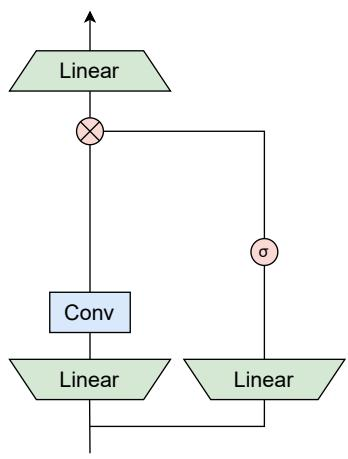
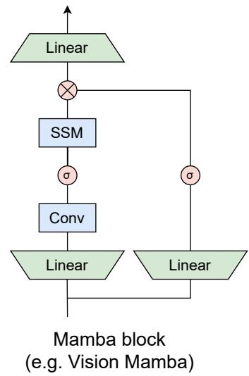
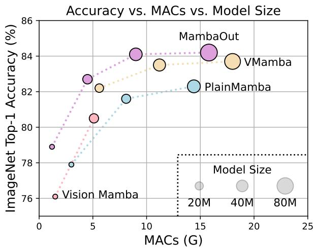
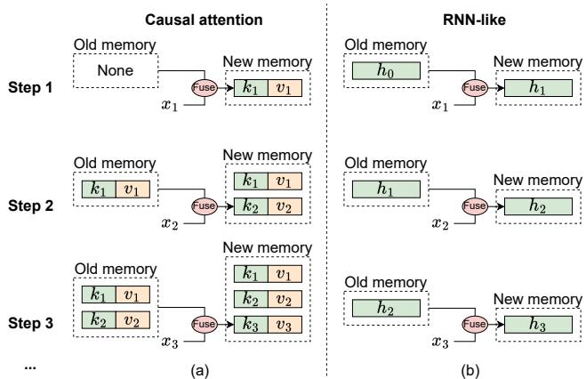
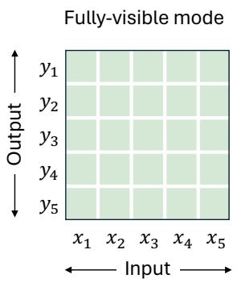
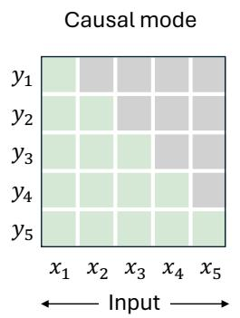
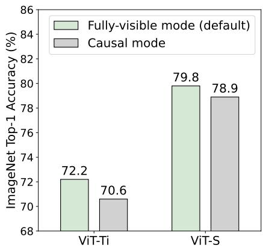

# MambaOut: Do We Really Need Mamba for Vision?\*

Weihao Yu Xinchao Wang National University of Singapore   
weihaoyu@u.nus.edu xinchao@nus.edu.sg   
Code: https://github.com/yuweihao/MambaOut

  
(a)

  
(b)  
Figure 1. (a) Architecture of Gated CNN [20] and Mamba [28] blocks (omitting Normalization and shortcut). The Mamba block extends the Gated CNN with an additional state space model (SSM). As will be conceptually discussed in Section 3, SSM is not necessary for image classification on ImageNet [21, 72]. To empirically verify this claim, we stack Gated CNN blocks to build a series of models named MambaOut. (b) MambaOut outperforms visual Mamba models, e.g., Vision Mamhba [112], VMamba [56] and PlainMamba [96], on ImageNet image classification

## Abstract

Mamba, an architecture with RNN-like token mixer of state space model (SSM), was recently introduced to address the quadratic complexity of the attention mechanism and subsequently applied to vision tasks. Nevertheless, the performance ofMambafor vision is often underwhelming when compared with convolutional and attention-based models. In this paper, we delve into the essence of Mamba, and conceptually conclude that Mamba is ideally suited for tasks with long-sequence and autoregressive characteristics. For vision tasks, as image classification on ImageNet does not align with either characteristic, we hypothesize that Mamba is not necessary for this task; Detection and segmentation tasks on COCO or ADE20K are also not autoregressive, yet they adhere to the long-sequence characteristic, so we believe it is still worthwhile to explore Mamba’s potential for these tasks. To empirically verify our hypotheses, we construct a series of models named MambaOut through stacking Mamba blocks while removing their core token mixer, SSM. Experimental results strongly support our hypotheses. Specifically, our MambaOut model surpasses all visual Mamba models on ImageNet image classification, indicating that Mamba is indeed unnecessaryfor this task. Asfor detection and segmentation, MambaOut cannot match the performance of state-of-the-art visual Mamba models, demonstrating the potential ofMamba for long-sequence visual tasks.

## 1. Introduction

In recent years, Transformer [82] has become the mainstream backbone for various tasks, underpinning numerous prominent models such as BERT [22], GPT series [1, 8, 66, 67] and ViT [26]. However, the token mixer of Transformer, attention [3], incurs a quadratic complexity with respect to sequence length, posing major challenges for long sequences. To address this issue, a variety of token mixers with linear complexity to token length have been introduced [78], such as dynamic convolution [44, 90, 92], Linformer [84], Longformer [7], Big Bird [105], and Performer [14]. More recently, a new wave of RNN-like models has emerged [28, 29, 45, 65, 106], drawing significant interest from the community for their capability of parallelizable training and performing efficient inference on long sequences. Notably, models like RWKV [65] and Mamba [28] are proven to be effective as the backbone for large language models (LLMs) [52, 65].

Motivated by the promising capabilities of RNN-like models, various research endeavors have attempted to introduce Mamba [28] into visual recognition tasks [5], exemplified by the pioneering works of Vision Mamba [112], VMamba [56], LocalMamba [41], and PlainMamba [96], etc. The token mixer of Mamba is the structured state space models (SSM) [28–30], under the spirit of RNN. Nevertheless, their experiments show that the SSM based models for vision, in reality, lead to underwhelming performance compared with state-of-the-art convolutional [23, 31, 39, 54, 58, 70, 86, 98, 100, 101] and attention-based models [19, 24, 51, 76, 80, 81, 100, 103]. This gives rise to a compelling research question: Do we really need Mamba for Vision?

In this paper, we investigate the nature of Mamba, and conceptually summarize that Mamba is ideally suited for tasks with two key characteristics: long-sequence and autoregressive, because of the inherent RNN mechanism of SSM [28–30] (see explanation of Figure 2 and Figure 3). Unfortunately, not many vision tasks possess both characteristics. Image classification on ImageNet, for example, conforms to neither, while object detection & instance segmentation on COCO and semantic segmentation on ADE20K conform only to the long-sequence. Autoregressive characteristic, on the other hand, demands that each token aggregate information solely from preceding and current tokens, a concept denoted as causal mode for token mixing [69] (see Figure 3(a)). In fact, all visual recognition tasks fall within the understanding domain rather than the generative one, meaning that the model can see the entire image at once. As such, imposing additional causal constraints on token mixing in visual recognition models could lead to a performance drop (see Figure 3(b)). Although this issue can be mitigated via bidirectional branches [74], it is inevitable that the issue persists within each branch.

Based on the conceptual discussion above, we propose the two hypotheses as follows:

• Hypothesis 1: SSM is not necessary for ImageNet image classification, since this task conforms to neither the longsequence or autoregressive characteristic.

• Hypothesis 2: SSM may be potentially beneficial for object detection & instance segmentation on COCO and semantic segmentation on ADE20K, since they follow the long-sequence characteristic, though they are not autoregressive.

To experimentally validate our hypotheses, we developed a series of models termed MambaOut through stacking Gated CNN [20] blocks. The key distinction between Gated CNN and Mamba blocks lies in the existence of SSM, as illustrated in Figure 1(a). Experimental results demonstrate that the simpler MambaOut model, in reality, already surpasses the performance of visual Mamba models [41, 56, 96, 112], which in turn verifies our Hypothesis 1. We also show empirical results that MambaOut falls short of matching the performance of state-of-the-art visual Mamba models [41, 56] in detection and segmentation tasks (see Tables 2 and 3), which underscores the potential of SSM on these tasks and effectively validates our Hypothesis 2.

The contributions of our paper are threefold. Firstly, we analyze the RNN-like mechanism of SSM and conceptually conclude that Mamba is suited for tasks with long-sequence and autoregressive characteristics. Secondly, we examine the characteristics of visual tasks and hypothesize that SSM is unnecessary for image classification on ImageNet since this task does not meet either characteristic, yet exploring the potential of SSM for detection and segmentation tasks remains valuable since these tasks conform to longsequence characteristic, though they are not autoregressive. Thirdly, we develop a series of models named MambaOut based on Gated CNN blocks but without SSM. Experiments show that MambaOut effectively surpasses visual Mamba models in ImageNet image classification but does not reach the performance of state-of-the-art visual Mamba models in detection and segmentation tasks. These observations, in turn, validate our hypotheses. As such, MambaOut, because of its Occam’s razor nature, may readily serve as a natural baseline for future research on visual Mamba models.

## 2. Related work

Transformer has been widely utilized across various domains, including BERT [22] and GPT series [1, 8, 66, 67] in NLP and ViT [26] in computer vision. However, the attention module in Transformers scales quadratically with sequence length, presenting a significant computational challenge. Numerous studies [78] have explored various strategies to mitigate this issue, including low-rank approaches [84], kernelization [14, 45], token mixing range limitation [7, 33, 57, 105], and history memory compression [68].

More recently, RNN-like methods [18, 45, 106], particularly RWKV [65] and Mamba [28], have garnered attention for their promising results in large language models [52, 65].

Eager exploratory researchers have quickly moved to incorporate SSM and Mamba [28] into visual recognition tasks [41, 49, 56, 63, 64, 94, 96, 108, 112]. For instance, Vision Mamba [112] integrates Mamba [28] to develop isotropic vision models akin to ViT [26], demonstrating its long-range modeling capability; VMamba [56] employs Mamba to construct hierarchical vision models similar to AlexNet [47] and ResNet [34]; LocalMamba [41] enhances visual Mamba models [56, 112] by incorporating local inductive biases; PlainMamba [96] aims to further enhance the performance of isotropic Mamba models; EfficientV-Mamba [64] focuses on efficiency through the introduction of atrous selective scan for lightweight visual Mamba models. MambaMixer [6] also utilizes SSM for channel mixing besides token mixing. One concurrent work, MILA [32], offers an alternative design by demystifying Mamba from a linear attention perspective.

Unlike these initiatives, our work does not aim to design new visual Mamba models. Instead, we explore a pertinent research question about the necessity of Mamba [28] in visual recognition contexts [21, 53, 72, 111]. We hope this paper can provide insights for future research on visual Mamba models.

## 3. Conceptual discussion

In this section, we first discuss what characteristics of tasks the Mamba model is suited for. Next, we examine whether visual recognition tasks conform to these characteristics. Based on the examination results, we propose hypotheses regarding the necessity of Mamba for vision.

## 3.1. What tasks is Mamba suitable for?

The token mixer of Mamba is selective SSM [28, 29] which defines four parameters (∆, A, B, C) and transforms them to (A, B, C) by

$$
{ \bf \overline { { A } } } = \exp ( \Delta A ) , ~ { \bf \overline { { B } } } = ( \Delta { \bf A } ) ^ { - 1 } ( \exp ( \Delta { \bf A } ) - { \bf I } ) \cdot \Delta { \bf B } .\tag{1}
$$

Then the sequence-to-sequence transformation of SSM can be expressed by

$$
h _ { t } = \overline { { \mathbf { A } } } h _ { t - 1 } + \overline { { \mathbf { B } } } x _ { t } ,\tag{2}
$$

$$
y _ { t } = \mathbf { C } h _ { t } ,\tag{3}
$$

where t denotes the timestep, $x _ { t }$ represents the input, $h _ { t }$ signifies the hidden state, and $y _ { t }$ indicates the output. The recurrent property [38] of Equation 2 distinguishes RNNlike SSM from causal attention. The hidden state h can be seen as a fixed-size memory that stores all historical information. Through Equation 2, this memory is updated while its size remains constant. The fixed size means the memory is inevitably lossy, but it ensures that the computational complexity of integrating the memory with the current input remains constant. Conversely, causal attention stores all keys and values from previous tokens as its memory, which expands by adding the current token’s key and value with each new input. This memory is theoretically lossless. However, as more tokens are inputted, the memory size grows, thereby increasing the complexity of integrating the memory with the current input. The differences in memory mechanisms between RNN-like models and causal attention are further illustrated in Figure 2.

  
Figure 2. The mechanism illustration of causal attention and RNNlike models from memory perspective, where $x _ { i }$ denotes the input token of i-th step. (a) Causal attention stores all previous tokens keys k and values v as memory. The memory is updated by con tinuously adding the current token’s key and value, so the memory is lossless, but the downside is that the computational complexity of integrating old memory and current tokens increases as the sequence lengthens. Therefore, attention can effectively manage short sequences but may encounter difficulties with longer ones. (b) In contrast, RNN-like models compress previous tokens into fixed-size hidden state h, which serves as the memory. This fixed size means that RNN memory is inherently lossy, which cannot directly compete with the lossless memory capacity of attention models. Nonetheless, RNN-like models can demonstrate distinct advantages in processing long sequences, as the complexity of merging old memory with current input remains constant, regardless of sequence length.

Because SSM’s memory is inherently lossy, it logically falls short of the lossless memory of attention. Consequently, Mamba cannot showcase its strengths in handling short sequences, an area where attention performs well with ease. However, in scenarios involving long sequences, attention will falter due to its quadratic complexity. In this case, Mamba can distinctly highlight its efficiency in merging memory with the current input, thus managing long sequences smoothly. Therefore, Mamba is particularly wellsuited for processing long sequences.

Although the recurrent nature of SSM (Equation 2) allows Mamba to handle long sequences efficiently, it introduces a significant limitation: $h _ { t }$ can only access information from the previous and current timesteps. As illustrated in Figure 3, this type of token mixing is termed causal mode, which can be formulated as:

  
e.g., BERT and ViT’s attention

  
(a)  
e.g., GPT’s attention and Mamba’s SSM

  
(b)  
Figure 3. (a) Two modes of token mixing [69]. For a total of T tokens, the fully-visible mode allows token t to aggregate inputs from all tokens, i.e., $\{ x i \} _ { i = 1 } ^ { T }$ , to compute its output $y _ { t }$ . In contrast, the causal mode restricts token t to only aggregate inputs from preceding and current tokens $\{ x _ { i } \} _ { i = 1 } ^ { t }$ . By default, attention operates in fully-visible mode but can be adjusted to causal mode with causal attention masks. RNN-like models, such as Mamba’s SSM [28, 29], inherently operate in causal mode due to their recurrent nature. (b) We modify the ViT’s attention [26, 79] from fully-visible to causal mode and observe performance drop on ImageNet, which indicates causal mixing is unnecessary for understanding tasks.

$$
y _ { t } = f ( x _ { 1 } , x _ { 2 } , . . . , x _ { t } ) ,\tag{4}
$$

where $x _ { t }$ and $y _ { t }$ represent the input and output of the t-th token, respectively. Due to its causal nature, this mode is well-suited for autoregressive generation tasks.

Another mode is called fully-visible mode, where each token can aggregate information from all preceding and subsequent tokens. This means the output of each token depends on the inputs from all tokens:

$$
y _ { t } = f ( x _ { 1 } , x _ { 2 } , . . . , x _ { t } , . . . , x _ { T } ) ,\tag{5}
$$

where T represents the total number of tokens. The fullyvisible mode is suitable for understanding tasks, where all inputs can be accessed by the model at once.

Attention is in fully-visible mode by default, but it can easily turn into causal mode by applying causal masks to the attention maps. RNN-like models inherently operate in causal mode due to their recurrent properties, as illustrated by Mamba’s Equation 2. Due to this inherent characteristic, RNN-like models cannot be transformed into fullyvisible mode. Although RNNs can approximate a fullyvisible mode using bidirectional branches, each branch still individually remains in causal mode. Therefore, Mamba is well-suited for tasks that require causal token mixing, due to the inherent limitations of its recurrent properties.

In summary, Mamba is ideally suited for tasks that display the following characteristics:

• Characteristic 1: The task involves processing long sequences for global modeling.

• Characteristic 2: The task requires causal token mixing mode.

Next, we will discuss whether visual recognition tasks exhibit these two characteristics.

## 3.2. Do visual recognition tasks have very long sequences?

In this subsection, we explore whether visual recognition tasks necessitate long sequence modeling. We use the Transformer model [82] as a case study to facilitate our analysis, because SSMs [28, 29] are proposed to address the Transformers’ computational inefficiency on long sequence. Consider a Transformer block with a common MLP ratio of $4 ;$ assuming its input $\boldsymbol { X } \in \mathbb { R } ^ { L \times D }$ has a token length of L and channel (embedding) dimensions of $D _ { : }$ the FLOPs for the block can be calculated as:

$$
\mathrm { F L O P s } = 2 4 D ^ { 2 } L + 4 D L ^ { 2 } .\tag{6}
$$

From this, we derive the ratio of the quadratic term to the linear term in L as:

$$
r _ { L } = { \frac { 4 D L ^ { 2 } } { 2 4 D ^ { 2 } L } } = { \frac { L } { 6 D } } .\tag{7}
$$

If $L > 6 D$ , the computational load of the quadratic term in L surpasses that of the linear term. This provides a simple metric to determine if the task involves long sequences.2

<table><tr><td rowspan=2 colspan=2>Model</td><td rowspan=2 colspan=1>TokenMixing $\mathrm { T y p e }$ </td><td rowspan=2 colspan=1>Param(M)</td><td rowspan=1 colspan=2>Test@2242</td></tr><tr><td rowspan=1 colspan=2>MAC   Acc(G)    (%)</td></tr><tr><td rowspan=1 colspan=2>VAN-B0 [31]</td><td rowspan=1 colspan=1>Conv</td><td rowspan=1 colspan=1>4</td><td rowspan=1 colspan=2>0.9    75.4</td></tr><tr><td rowspan=1 colspan=2>MogaNet-T [50]</td><td rowspan=1 colspan=1>Conv</td><td rowspan=1 colspan=1>5</td><td rowspan=1 colspan=2>1.1    79.0</td></tr><tr><td rowspan=1 colspan=2>FasterNet-T1 [9]</td><td rowspan=1 colspan=1>Conv</td><td rowspan=1 colspan=1>8</td><td rowspan=1 colspan=2>0.9    76.2</td></tr><tr><td rowspan=1 colspan=2>InceptionNeXt-A [101]</td><td rowspan=1 colspan=1>Conv</td><td rowspan=1 colspan=1>4</td><td rowspan=1 colspan=2>0.5    75.3</td></tr><tr><td rowspan=1 colspan=2>DeiT-Ti [79]</td><td rowspan=1 colspan=1>Attn</td><td rowspan=1 colspan=1>6</td><td rowspan=1 colspan=2>1.3    72.2</td></tr><tr><td rowspan=1 colspan=2>T2T-ViT-7 [102]</td><td rowspan=1 colspan=1>Attn</td><td rowspan=1 colspan=1>4</td><td rowspan=1 colspan=2>1.1    71.7</td></tr><tr><td rowspan=1 colspan=2>PVTv2-B0 [85]</td><td rowspan=1 colspan=1> $\mathrm { C o n v + A t t n }$ </td><td rowspan=1 colspan=1>3</td><td rowspan=1 colspan=2>0.6    70.5</td></tr><tr><td></td><td rowspan=1 colspan=1>MobileViTv3-XS [83]</td><td rowspan=1 colspan=1> $\mathrm { C o n v + A t t n }$ </td><td rowspan=1 colspan=1>3</td><td rowspan=1 colspan=2>0.9    76.7</td></tr><tr><td></td><td rowspan=1 colspan=1>EMO-6M [109]</td><td rowspan=1 colspan=1> $\mathrm { C o n v + A t t n }$ </td><td rowspan=1 colspan=1>6</td><td rowspan=1 colspan=2>1.0    79.0</td></tr><tr><td></td><td rowspan=1 colspan=1>Vim-Ti [112]</td><td rowspan=1 colspan=1> $\mathbf { C o n v } + \mathbf { S S M }$ </td><td rowspan=1 colspan=1>7</td><td rowspan=1 colspan=2>1.5    76.1</td></tr><tr><td></td><td rowspan=1 colspan=1>LocalVim-T [41]</td><td rowspan=1 colspan=1> $\mathbf { C o n v } + \mathbf { S S M }$ </td><td rowspan=1 colspan=1>8</td><td rowspan=1 colspan=2>1.5    76.2</td></tr><tr><td></td><td rowspan=1 colspan=1>EfficientVMamba-T [64]</td><td rowspan=1 colspan=1> $\mathbf { C o n v } + \mathbf { S S M }$ </td><td rowspan=1 colspan=1>6</td><td rowspan=1 colspan=2>0.8    76.5</td></tr><tr><td></td><td rowspan=1 colspan=1>EfficientVMamba-S [64]</td><td rowspan=1 colspan=1> $\mathbf { C o n v } + \mathbf { S S M }$ </td><td rowspan=1 colspan=1>11</td><td rowspan=1 colspan=2>1.3    78.7</td></tr><tr><td></td><td rowspan=1 colspan=1>MambaOut-Femto</td><td rowspan=1 colspan=1>Conv</td><td rowspan=1 colspan=1>7</td><td rowspan=1 colspan=2>1.2    78.9</td></tr><tr><td></td><td rowspan=1 colspan=1>PoolFormer-S24 [99]</td><td rowspan=1 colspan=1>Pool</td><td rowspan=1 colspan=1>21</td><td rowspan=1 colspan=2>3.4    80.3</td></tr><tr><td></td><td rowspan=1 colspan=1>ConvNeXt-T [58]</td><td rowspan=1 colspan=1>Conv</td><td rowspan=1 colspan=1>29</td><td rowspan=1 colspan=2>4.5    82.1</td></tr><tr><td></td><td rowspan=1 colspan=1>VAN-B2 [31]</td><td rowspan=1 colspan=1>Conv</td><td rowspan=1 colspan=1>27</td><td rowspan=1 colspan=2>5.0    82.8</td></tr><tr><td></td><td rowspan=1 colspan=1>ConvFormer-S18 [100]</td><td rowspan=1 colspan=1>Conv</td><td rowspan=1 colspan=1>27</td><td rowspan=1 colspan=2>3.9    83.0</td></tr><tr><td></td><td rowspan=1 colspan=1>MogaNet-S [50]</td><td rowspan=1 colspan=1>Conv</td><td rowspan=1 colspan=1>25</td><td rowspan=1 colspan=1>5.0</td><td rowspan=1 colspan=1>83.4</td></tr><tr><td></td><td rowspan=1 colspan=1>InternImage-T [86]</td><td rowspan=1 colspan=1>Conv</td><td rowspan=1 colspan=1>30</td><td rowspan=1 colspan=1>5</td><td rowspan=1 colspan=1>83.5</td></tr><tr><td></td><td rowspan=1 colspan=1>InceptionNeXt-T [101]</td><td rowspan=1 colspan=1>Conv</td><td rowspan=1 colspan=1>28</td><td rowspan=1 colspan=1>4.2</td><td rowspan=1 colspan=1>82.3</td></tr><tr><td></td><td rowspan=1 colspan=1>DeiT-S [79]</td><td rowspan=1 colspan=1>Attn</td><td rowspan=1 colspan=1>22</td><td rowspan=1 colspan=1>4.6</td><td rowspan=1 colspan=1>79.8</td></tr><tr><td></td><td rowspan=1 colspan=1>T2T-ViT-14 [102]</td><td rowspan=1 colspan=1>Attn</td><td rowspan=1 colspan=1>22</td><td rowspan=1 colspan=1>4.8</td><td rowspan=1 colspan=1>81.5</td></tr><tr><td></td><td rowspan=1 colspan=1>Swin-T [57]</td><td rowspan=1 colspan=1>Attn</td><td rowspan=1 colspan=1>29</td><td rowspan=1 colspan=1>4.5</td><td rowspan=1 colspan=1>81.3</td></tr><tr><td></td><td rowspan=1 colspan=1>Focal-Tiny [97]</td><td rowspan=1 colspan=1>Attn</td><td rowspan=1 colspan=1>29</td><td rowspan=1 colspan=1>4.9</td><td rowspan=1 colspan=1>82.2</td></tr><tr><td rowspan=1 colspan=1></td><td rowspan=1 colspan=1>CSWin-T [24]</td><td rowspan=1 colspan=1>Attn</td><td rowspan=1 colspan=1>23</td><td rowspan=1 colspan=1>4.3</td><td rowspan=1 colspan=1>82.7</td></tr><tr><td rowspan=1 colspan=1></td><td rowspan=1 colspan=1>CoAtNet-0 [19]</td><td rowspan=1 colspan=1> $\mathrm { C o n v + A t t n }$ </td><td rowspan=1 colspan=1>25</td><td rowspan=1 colspan=1>4.2</td><td rowspan=1 colspan=1>81.6</td></tr><tr><td rowspan=1 colspan=1></td><td rowspan=1 colspan=1>iFormer-S [76]</td><td rowspan=1 colspan=1> $\mathrm { C o n v + A t t n }$ </td><td rowspan=1 colspan=1>20</td><td rowspan=1 colspan=1>4.8</td><td rowspan=1 colspan=1>83.4</td></tr><tr><td rowspan=1 colspan=1></td><td rowspan=1 colspan=1>MOAT-0 [95]</td><td rowspan=1 colspan=1> $\mathrm { C o n v + A t t n }$ </td><td rowspan=1 colspan=1>28</td><td rowspan=1 colspan=1>5.7</td><td rowspan=1 colspan=1>83.3</td></tr><tr><td rowspan=1 colspan=1></td><td rowspan=1 colspan=1>CAFormer-S18 [100]</td><td rowspan=1 colspan=1> $\mathrm { C o n v + A t t n }$ </td><td rowspan=1 colspan=1>26</td><td rowspan=1 colspan=1>4.1</td><td rowspan=1 colspan=1>83.6</td></tr><tr><td rowspan=1 colspan=1></td><td rowspan=1 colspan=1>SG-Former-S [71]</td><td rowspan=1 colspan=1> $\mathrm { C o n v + A t t n }$ </td><td rowspan=1 colspan=1>23</td><td rowspan=1 colspan=1>4.8</td><td rowspan=1 colspan=1>83.2</td></tr><tr><td rowspan=1 colspan=1></td><td rowspan=1 colspan=1>TransNeXt-Tiny [75]</td><td rowspan=1 colspan=1> $\mathrm { C o n v + A t t n }$ </td><td rowspan=1 colspan=1>28</td><td rowspan=1 colspan=1>5.7</td><td rowspan=1 colspan=1>84.0</td></tr><tr><td rowspan=1 colspan=1></td><td rowspan=1 colspan=1>Vim-S [112]</td><td rowspan=1 colspan=1> $\mathbf { C o n v } + \mathbf { S S M }$ </td><td rowspan=1 colspan=1>26</td><td rowspan=1 colspan=1>5.1</td><td rowspan=1 colspan=1>80.5</td></tr><tr><td rowspan=1 colspan=1></td><td rowspan=1 colspan=1>VMamba-T [56]</td><td rowspan=1 colspan=1> $\mathbf { C o n v } + \mathbf { S S M }$ </td><td rowspan=1 colspan=1>22</td><td rowspan=1 colspan=1>5.6</td><td rowspan=1 colspan=1>82.2</td></tr><tr><td rowspan=1 colspan=1></td><td rowspan=1 colspan=1>Mamba-2D-S [49]</td><td rowspan=1 colspan=1> $\mathbf { C o n v } + \mathbf { S S M }$ </td><td rowspan=1 colspan=1>24</td><td rowspan=1 colspan=1>一</td><td rowspan=1 colspan=1>81.7</td></tr><tr><td rowspan=1 colspan=1></td><td rowspan=1 colspan=1>LocalVim-S [41]</td><td rowspan=1 colspan=1> $\mathbf { C o n v } + \mathbf { S S M }$ </td><td rowspan=1 colspan=1>28</td><td rowspan=1 colspan=2>4.8    81.2</td></tr><tr><td rowspan=1 colspan=1></td><td rowspan=1 colspan=1>LocalVMamba-T [41]</td><td rowspan=1 colspan=1> $\mathbf { C o n v } + \mathbf { S S M }$ </td><td rowspan=1 colspan=1>26</td><td rowspan=1 colspan=2>5.7    82.7</td></tr><tr><td rowspan=1 colspan=1></td><td rowspan=1 colspan=1>EfficientVMamba-B [64]</td><td rowspan=1 colspan=1> $\mathbf { C o n v } + \mathbf { S S M }$ </td><td rowspan=1 colspan=1>33</td><td rowspan=1 colspan=2>4.0    81.8</td></tr><tr><td rowspan=1 colspan=1></td><td rowspan=1 colspan=1>PlainMamba-L1 [96]</td><td rowspan=1 colspan=1> $\mathbf { C o n v } + \mathbf { S S M }$ </td><td rowspan=1 colspan=1>7</td><td rowspan=1 colspan=2>3.0    77.9</td></tr><tr><td rowspan=1 colspan=1></td><td rowspan=1 colspan=1>VMambaV3-T* [55]</td><td rowspan=1 colspan=1> $\mathbf { C o n v } + \mathbf { S S M }$ </td><td rowspan=1 colspan=1>31</td><td rowspan=1 colspan=2>4.9    82.6</td></tr><tr><td rowspan=1 colspan=2>MambaOut-Tiny</td><td rowspan=1 colspan=1>Conv</td><td rowspan=1 colspan=1>27</td><td rowspan=1 colspan=2>4.5    82.7</td></tr></table>

<table><tr><td rowspan="2">Model</td><td rowspan="2">Token Mixing Type</td><td rowspan="2">Param (M)</td><td colspan="2">Test@2242</td></tr><tr><td>MAC (G)</td><td>Acc (%)</td></tr><tr><td>ConvNeXt-S [58]</td><td>Conv</td><td>50</td><td>8.7</td><td>83.1</td></tr><tr><td>VAN-B3 [31]</td><td>Conv</td><td>45</td><td>9.0</td><td>83.9</td></tr><tr><td>ConvFormer-S36 [100]</td><td>Conv</td><td>40</td><td>7.6</td><td>84.1</td></tr><tr><td>InternImage-S [86]</td><td>Conv</td><td>50</td><td>8</td><td>84.2</td></tr><tr><td>MogaNet-B [50]</td><td>Conv</td><td>44</td><td>9.9</td><td>84.3</td></tr><tr><td>T2T-ViT-19 [102]</td><td>Attn</td><td>39</td><td>8.5</td><td>81.9</td></tr><tr><td>Swin-S [57]</td><td>Attn</td><td>50</td><td>8.7</td><td>83.0</td></tr><tr><td>Focal-Small [97]</td><td>Attn</td><td>51</td><td>9.1</td><td>83.5</td></tr><tr><td>CSWin-S [24]</td><td>Attn</td><td>35</td><td>6.9</td><td>83.6</td></tr><tr><td>MViTv2-S [51]</td><td>Attn</td><td>35</td><td>7.0</td><td>83.6</td></tr><tr><td>CoAtNet-1 [19]</td><td> $\mathrm { C o n v + A t t n }$ </td><td>42</td><td>8.4</td><td>83.3</td></tr><tr><td>UniFormer-B [48]</td><td> $\mathrm { C o n v + A t t n }$ </td><td>50</td><td>8.3</td><td>83.9</td></tr><tr><td>CAFormer-S36 [100]</td><td> $\mathrm { C o n v + A t t n }$ </td><td>39</td><td>8.0</td><td>84.5</td></tr><tr><td>SG-Former-M [71]</td><td> $\mathrm { C o n v + A t t n }$ </td><td>39</td><td>7.5</td><td>84.1</td></tr><tr><td>TransNeXt-Small [75]</td><td> $\mathrm { C o n v + A t t n }$ </td><td>50</td><td>10.3</td><td>84.7</td></tr><tr><td>VMamba-S [56]</td><td> $\mathbf { C o n v + S S M }$ </td><td>44</td><td>11.2</td><td>83.5</td></tr><tr><td>LocalVMamba-S [41]</td><td> $\mathbf { C o n v + S S M }$ </td><td>50</td><td>11.4</td><td>83.7</td></tr><tr><td>PlainMamba-L2 [96]</td><td> $\mathbf { C o n v + S S M }$ </td><td>25</td><td>8.1</td><td>81.6</td></tr><tr><td>VMambaV3-S* [55]</td><td> $\mathbf { C o n v + S S M }$ </td><td>50</td><td>8.7</td><td>83.6</td></tr><tr><td>MambaOut-Small</td><td>Conv</td><td>48</td><td>9.0</td><td>84.1</td></tr><tr><td>ConvNeXt-B [58]</td><td>Conv</td><td>89</td><td>15.4</td><td>83.8</td></tr><tr><td>RepLKNet-31B [23]</td><td>Conv</td><td>79</td><td>15.3</td><td>83.5</td></tr><tr><td>ConvFormer-M36 [100]</td><td>Conv</td><td>57</td><td>12.8</td><td>84.5</td></tr><tr><td>HorNet-B [70]</td><td>Conv</td><td>88</td><td>15.5</td><td>84.3</td></tr><tr><td>MogaNet-L [50]</td><td>Conv</td><td>83</td><td>15.9</td><td>84.7</td></tr><tr><td>InternImage-B [86]</td><td>Conv</td><td>97</td><td>16</td><td>84.9</td></tr><tr><td>DeiT-B [79]</td><td>Attn</td><td>86</td><td>17.5</td><td>81.8</td></tr><tr><td>T2T-ViT-24 [102]</td><td>Attn</td><td>64</td><td>13.8</td><td>82.3</td></tr><tr><td>Swin-B [57]</td><td>Attn</td><td>88</td><td>15.4</td><td>83.5</td></tr><tr><td>CSwin-B [24]</td><td>Attn</td><td>78</td><td>15.0</td><td>84.2</td></tr><tr><td>MViTv2-B [51]</td><td>Attn</td><td>52</td><td>10.2</td><td>84.4</td></tr><tr><td>CoAtNet-2 [19]</td><td> $\mathrm { C o n v + A t t n }$ </td><td>75</td><td>15.7</td><td>84.1</td></tr><tr><td>iFormer-L [76]</td><td> $\mathrm { C o n v + A t t n }$ </td><td>87</td><td>14.0</td><td>84.8</td></tr><tr><td>MOAT-2 [95]</td><td> $\mathrm { C o n v + A t t n }$ </td><td>73</td><td>17.2</td><td>84.7</td></tr><tr><td>CAFormer-M36 [100]</td><td> $\mathrm { C o n v + A t t n }$ </td><td>56</td><td>13.2</td><td>85.2</td></tr><tr><td>TransNeXt-Base [75]</td><td> $\mathrm { C o n v + A t t n }$ </td><td>90</td><td>18.4</td><td>84.8</td></tr><tr><td>VMamba-B [56]</td><td>1  $\mathbf { \bar { C } o n v + \bar { S } S M }$ </td><td>75</td><td>18.0</td><td>83.7</td></tr><tr><td>Mamba-2D-B [49]</td><td> $\mathbf { C o n v + S S M }$ </td><td>92</td><td></td><td>83.0</td></tr><tr><td>PlainMamba-L3 [96]</td><td> $\mathbf { C o n v + S S M }$ </td><td>50</td><td>14.4</td><td>82.3</td></tr><tr><td>VMambaV3-B* [55]</td><td> $\mathbf { C o n v + S S M }$ </td><td>89</td><td>15.4</td><td>83.9</td></tr><tr><td>MambaOut-Base</td><td>Conv</td><td>85</td><td>15.8</td><td>84.2</td></tr></table>

Table 1. Performance of models on ImageNet at the resolution of $2 2 4 ^ { 2 } .$ . Our MambaOut model employs the Gated CNN block [20]. The Mamba block [28], derived from the Gated CNN block, incorporates an additional SSM (state space model). It is evident that visua Mamba models fall short of MambaOut’s performance, let alone surpassing state-of-the-art convolutional or convolution-attention-hybrid models. \* Note that VMambaV3 modifies the meta-architecture of the Mamba block to MetaFormer [100], different from other visua Mamba models and MambaOut.

For instance, with 384 channels in ViT-S, the threshold $\tau _ { \mathrm { s m a l l } } = 6 \times 3 8 4 = 2 3 0 4$ , and for 768 channels in ViT-$B , \tau _ { \mathrm { b a s e } } = 6 \times 7 6 8 = 4 6 0 8 .$

For image classification on ImageNet, the typical input image size is $2 2 4 ^ { 2 }$ , resulting in $1 4 ^ { 2 } =$ 196 tokens with patch size of $1 6 ^ { 2 } . ^ { 3 }$ Clearly, 196 is much less than both $\tau _ { \mathrm { s m a l l } }$ and $\tau _ { \mathrm { b a s e } } ,$ indicating that image classification on ImageNet does not qualify as a long-sequence task.

For object detection & instance segmentation on COCO, with an inference image size of $8 0 0 \times 1 2 8 0$ , and for semantic segmentation on ADE20K, with an inference image size of $5 1 2 \times 2 0 4 8 .$ , the number of tokens is approximately 4K, given patch size of $1 6 ^ { 2 }$ . Since $4 K > \tau _ { \mathrm { s m a l l } }$ and

4K ≈ $\tau _ { \mathrm { b a s e } }$ , both detection on COCO and segmentation on ADE20K can be considered long-sequence tasks.

## 3.3. Do visual recognition tasks need causal token mixing mode?

As discussed in Section 3.1 and illustrated in Figure 3, the fully-visible token mixing mode allows unrestricted range of mixing, whereas the causal mode limits the current token to only access information from preceding tokens. Visual recognition is categorized as an understanding task, wherein the model can see the entire image at once, eliminating the need for restrictions on token mixing. Imposing additional constraints on token mixing can potentially degrade model performance. As demonstrated in Figure 3(b), when causal restrictions are applied to Vision Transformers (ViT) [26, 79], a noticeable decline in performance is observed. Generally, the fully-visible mode is appropriate for understanding tasks, while the causal mode is better suited for autoregressive tasks. This claim can also be substantiated by the observation that BERT [22] and ViT [26] (BEiT [4] and MAE [36]) are used more for understanding tasks than GPT-1/2 [66, 67] and image GPT [11]. Therefore, visual recognition tasks do not need causal token mixing mode.

## 3.4. Hypotheses regarding the necessity of Mamba for vision

Based on our preceding discussion, we summarize our hypotheses regarding the necessity of introducing Mamba for visual recognition tasks as follows:

• Hypothesis $\mathit { l } \colon$ It is not necessary to introduce SSM for image classification on ImageNet, as this task does not meet Characteristic 1 or Characteristic 2.

• Hypothesis 2: It is still worthwhile to further explore the potential of SSM for visual detection and segmentation on COCO or ADE20K since these tasks align with Characteristic 1, despite not fulfilling Characteristic 2.

## 4. Experimental verification

## 4.1. Gated CNN and MambaOut

Next, we aim to validate our hypotheses empirically. As depicted in Figure 1(a), Mamba block [28] is based on the Gated CNN block [20]. The meta-architecture of Gated CNN and Mamba can be considered as a simplified integration of the MetaFormer’s [99] token mixer and an MLP, akin to MetaNeXt [101]. Formally, given the input $\boldsymbol { X } \in \mathbb { R } ^ { N \times D }$ the meta-architecture is formulated as:

$$
X ^ { \prime } = \operatorname { N o r m } ( X ) ,
$$

$$
Y = ( { \mathrm { T o k e n M i x e r } } ( X ^ { \prime } W _ { 1 } ) \odot \sigma ( X ^ { \prime } W _ { 2 } ) ) W _ { 3 } + X ,\tag{8}
$$

(9)

where Norm(·) represents normalization [2, 42, 91]; TokenMixer(·) refers to the module to conduct token mixing $[ 1 0 0 ] ; W _ { 1 } \in \mathbb { R } ^ { D \times r D } , W _ { 2 } \in \mathbb { R } ^ { D \times r D }$ and $W _ { 3 } \in \mathbb { R } ^ { r D \times D }$

are learnable parameters with MLP expansion $r ; \sigma$ is activation function [27, 37]. Token mixers of Gated CNN and Mamba are:

$$
\operatorname { T o k e n M i x e r _ { G a t e d C N N } } ( Z ) = \operatorname { C o n v } ( Z )\tag{10}
$$

$$
\operatorname { T o k e n M i x e r _ { M a m b a } } ( Z ) = \operatorname { S S M } ( \sigma ( \operatorname { C o n v } ( Z ) ) )\tag{11}
$$

Comparing Equations 10 and 11, and referencing Figure 1(a), the primary distinction between the Gated CNN [20] and the Mamba block [28] lies in the presence of SSM. This prompts us to develop a series of models, termed MambaOut, which are based on the Gated CNN block without SSM. MambaOut will help us assess the necessity of Mamba for visual recognition tasks.

Specifically, we specify the token mixer of Gated CNN as depthwise convolution [13] of $7 \times 7$ kernel size, following ConvNeXt [58, 61]. The ablation study of kernel size is shown in the appendix. Besides, to improve the practical speed, we only conduct depthwise convolution on partial channels [9, 60, 101], following InceptionNeXt [101]. Similar to ResNet, we adopt 4-stage framework to build MambaOut by stacking Gated CNN blocks at each stage and the configuration details of each model size are shown in the appendix. We also show isotropic MambaOut in the appendix.

## 4.2. Image classification on ImageNet

Setup. ImageNet [21, 72] serves as the gold standard benchmark for image classification, encompassing a wide array of 1,000 common classes. It comprises approximately 1.3 million training images and 50,000 validation images. The training scheme follows DeiT [79] without distillation. Specifically, the used data augmentation contains random resized crop (input image size of $2 2 4 ^ { 2 } )$ , horizontal flip, RandAugment [17], Mixup [107], CutMix [104], Random Erasing [110] and color jitter; Regularization techniques include weight decay, stochastic depth [40] and label smoothing [77]. All our models are trained by AdamW [46, 59]. The learning rate scaling rule is $\textstyle { \mathrm { l r } } = { \frac { \mathrm { b a t c h s i z e } } { 1 0 2 4 } } \times 1 0 ^ { - 3 }$ . In this paper, we set the batch size to 4096, so the learning rate is 0.004. Our MambaOut models are implemented with Py-Torch [62] and timm [88] libraries and trained on TPU v3. More training hyper-parameters are shown in the appendix.

Results. The performance of our MambaOut models, visual Mamba models, and other various convolution and attention-based models on ImageNet [21, 72] is presented in Table 1. Notably, our MambaOut models, which do not incorporate SSM, consistently outperform visual Mamba models [41, 56, 64, 96, 112] that include SSM across all model sizes. For instance, the MambaOut-Small model achieves top-1 accuracy of 84.1%, 0.4% higher than that of LocalVMamba-S [41], while requiring only 79% of the MACs. These results strongly support our Hypothesis $^ { l , }$ which posits that introducing SSM for image classification on ImageNet is unnecessary, aligning with the principle of Occam’s razor.

<table><tr><td rowspan="2">Backbone</td><td rowspan="2">Token Mixing Type</td><td rowspan="2">Param (M)</td><td rowspan="2">MAC (G)</td><td colspan="6">Mask R-CNN 1 × schedule</td></tr><tr><td> $\overline { { \mathbf { A P } ^ { \mathrm { b } } } }$ </td><td> $\overline { { \mathbf { A P _ { 5 0 } ^ { b } } } }$ </td><td> $\overline { { \mathbf { A P } _ { 7 5 } ^ { \mathrm { b } } } }$ </td><td>APm</td><td>AP50</td><td> $\overline { { \mathbf { A P } _ { 7 5 } ^ { \mathrm { m } } } }$ </td></tr><tr><td>ConvNeXt-T [54]</td><td>Conv</td><td>48</td><td>262</td><td>44.2</td><td>66.6</td><td>48.3</td><td>40.1</td><td>63.3</td><td>42.8</td></tr><tr><td>FocalNet-T [98]</td><td>Conv</td><td>49</td><td>268</td><td>46.1</td><td>68.2</td><td>50.6</td><td>41.5</td><td>65.1</td><td>44.5</td></tr><tr><td>Swin-T [57]</td><td>Attn</td><td>48</td><td>267</td><td>42.7</td><td>65.2</td><td>46.8</td><td>39.3</td><td>62.2</td><td>42.2</td></tr><tr><td>ViT-Adapter-S [12]</td><td>Attn</td><td>48</td><td>403</td><td>44.7</td><td>65.8</td><td>48.3</td><td>39.9</td><td>62.5</td><td>42.8</td></tr><tr><td>CSWin-T [24]</td><td>Attn</td><td>42</td><td>279</td><td>46.7</td><td>68.6</td><td>51.3</td><td>42.2</td><td>65.6</td><td>45.4</td></tr><tr><td>PVTv2-B2 [85]</td><td>Conv + Attn</td><td>45</td><td>309</td><td>45.3</td><td>67.1</td><td>49.6</td><td>41.2</td><td>64.2</td><td>44.4</td></tr><tr><td>SG-Former-S [71]</td><td>Conv + Attn</td><td>41</td><td>一</td><td>47.4</td><td>69.0</td><td>52.0</td><td>42.6</td><td>65.9</td><td>46.0</td></tr><tr><td>TransNeXt-Tiny [75]</td><td>Conv + Attn</td><td>48</td><td>356</td><td>49.9</td><td>71.5</td><td>54.9</td><td>44.6</td><td>68.6</td><td>48.1</td></tr><tr><td>VMamba-T [56]]</td><td>Conv + SSM</td><td>42</td><td>286</td><td>46.5</td><td>68.5</td><td>50.7</td><td>42.1</td><td>65.5</td><td>45.3</td></tr><tr><td>LocalVMamba-T [41]</td><td>Conv + SSM</td><td>45</td><td>291</td><td>46.7</td><td>68.7</td><td>50.8</td><td>42.2</td><td>65.7</td><td>45.5</td></tr><tr><td>EfficientVMamba-B [64]</td><td>Conv + SSM</td><td>53</td><td>252</td><td>43.7</td><td>66.2</td><td>47.9</td><td>40.2</td><td>63.3</td><td>42.9</td></tr><tr><td>VMambaV3-T [55]</td><td>Conv + SSM</td><td>50</td><td>270</td><td>47.4</td><td>69.5</td><td>52.0</td><td>42.7</td><td>66.3</td><td>46.0</td></tr><tr><td>PlainMamba-L1 [96]</td><td>Conv + SSM</td><td>31</td><td>388</td><td>44.1</td><td>64.8</td><td>47.9</td><td>39.1</td><td>61.6</td><td>41.9</td></tr><tr><td>MambaOut-Tiny</td><td>Conv</td><td>43</td><td>262</td><td>45.1</td><td>67.3</td><td>49.6</td><td>41.0</td><td>64.1</td><td>44.1</td></tr><tr><td>ConvNeXt-S [54]</td><td>Conv</td><td>70</td><td>348</td><td>45.4</td><td>67.9</td><td>50.0</td><td>41.8</td><td>65.2</td><td>45.1</td></tr><tr><td>FocalNet-S [98]</td><td>Conv</td><td>72</td><td>365</td><td>48.3</td><td>70.5</td><td>53.1</td><td>43.1</td><td>67.4</td><td>46.2</td></tr><tr><td>Swin-S [57]</td><td>Attn</td><td>69</td><td>354</td><td>44.8</td><td>66.6</td><td>48.9</td><td>40.9</td><td>63.2</td><td>44.2</td></tr><tr><td>CSWin-S [24]</td><td>Attn</td><td>54</td><td>342</td><td>47.9</td><td>70.1</td><td>52.6</td><td>43.2</td><td>67.1</td><td>46.2</td></tr><tr><td>PVTv2-B3 [85]</td><td>Conv + Attn</td><td>65</td><td>397</td><td>47.0</td><td>68.1</td><td>51.7</td><td>42.5</td><td>65.7</td><td>45.7</td></tr><tr><td>SG-Former-M [71]</td><td>Conv + Attn</td><td>51</td><td>一</td><td>48.2</td><td>70.3</td><td>53.1</td><td>43.6</td><td>66.9</td><td>47.0</td></tr><tr><td>TransNeXt-Small [75]</td><td>Conv + Attn</td><td>69</td><td>516</td><td>51.1</td><td>72.6</td><td>56.2</td><td>45.5</td><td>69.8</td><td>49.1</td></tr><tr><td>VMamba-S [56]</td><td>Conv + SSM</td><td>64</td><td>400</td><td>48.2</td><td>69.7</td><td>52.5</td><td>43.0</td><td>66.6</td><td>46.4</td></tr><tr><td>LocalVMamba-S [41]</td><td> $\mathbf { C o n v + S S M }$ </td><td>69</td><td>414</td><td>48.4</td><td>69.9</td><td>52.7</td><td>43.2</td><td>66.7</td><td>46.5</td></tr><tr><td>VMambaV3-S [55]</td><td> $\mathbf { C o n v + S S M }$ </td><td>64</td><td>357</td><td>48.7</td><td>70.0</td><td>53.4</td><td>43.7</td><td>67.3</td><td>47.0</td></tr><tr><td>MambaOut-Small</td><td>Conv</td><td>65</td><td>354</td><td>47.4</td><td>69.1</td><td>52.4</td><td>42.7</td><td>66.1</td><td>46.2</td></tr><tr><td>ConvNeXt-B [54]</td><td>Conv</td><td>108</td><td>486</td><td>47.0</td><td>69.4</td><td>51.7</td><td>42.7</td><td>66.3</td><td>46.0</td></tr><tr><td>FocalNet-B [98]</td><td>Conv</td><td>111</td><td>507</td><td>49.0</td><td>70.9</td><td>53.9</td><td>43.5</td><td>67.9</td><td>46.7</td></tr><tr><td>Swin-B [57]</td><td>Attn</td><td>107</td><td>496</td><td>46.9</td><td></td><td></td><td>42.3</td><td></td><td></td></tr><tr><td>ViT-Adapter-B [12]</td><td>Attn</td><td>102</td><td>557</td><td>47.0</td><td>68.2</td><td>51.4</td><td>41.8</td><td>65.1</td><td>44.9</td></tr><tr><td>CSWin-B [24]</td><td>Attn</td><td>97</td><td>526</td><td>48.7</td><td>70.4</td><td>53.9</td><td>43.9</td><td>67.8</td><td>47.3</td></tr><tr><td>PVTv2-B5 [85]</td><td>Conv + Attn</td><td>102</td><td>557</td><td>47.4</td><td>68.6</td><td>51.9</td><td>42.5</td><td>65.7</td><td>46.0</td></tr><tr><td>TransNeXt-Base [75]</td><td>Conv + Attn</td><td>109</td><td>728</td><td>51.7</td><td>73.2</td><td>56.9</td><td>45.9</td><td>70.5</td><td>49.7</td></tr><tr><td>VMamba-B [56]</td><td> $\bar { \mathrm { C o n v } } + \bar { \mathrm { S S M } }$ </td><td>96</td><td>540</td><td>48.5</td><td>69.6</td><td>53.0</td><td>43.1</td><td>67.0</td><td>46.4</td></tr><tr><td>PlainMamba-L2 [96]</td><td> $\mathbf { C o n v + S S M }$ </td><td>53</td><td>542</td><td>46.0</td><td>66.9</td><td>50.1</td><td>40.6</td><td>63.8</td><td>43.6</td></tr><tr><td>VMambaV3-B [55]</td><td> $\mathbf { C o n v + S S M }$ </td><td>108</td><td>485</td><td>49.2</td><td>70.9</td><td>53.9</td><td>43.9</td><td>67.7</td><td>47.6</td></tr><tr><td>MambaOut-Base</td><td>Conv</td><td>100</td><td>495</td><td>47.4</td><td>69.3</td><td>52.2</td><td>43.0</td><td>66.4</td><td>46.3</td></tr></table>

Table 2. Performance of object detection and instance segmentation on COCO with Mask R-CNN. The MACs are measured with input size of 800 × 1280.

Additionally, visual Mamba models currently exhibit a significant performance gap when compared to state-ofthe-art convolution and attention models. For instance, the CAFormer-M36 [100], which employs old-fashioned token mixers of simple separable convolutions from MobileNetV2 [73] and vanilla attention from Transformer [82] invented more than 7 years ago, outperforms all visual Mamba models of comparable size by more than 1% accuracy. Should future research aim to challenge our Hypothesis 1, it will be necessary to develop visual Mamba models with token mixers of convolution and SSM to achieve stateof-the-art performance on ImageNet.

## 4.3. Object detection & instance segmentation on COCO

Setup. COCO 2017 [53] serves as a widely recognized benchmark for object detection and instance segmentation. In our experiments, MambaOut is employed as the backbone within Mask R-CNN [35], initialized with weights pre-trained on ImageNet. We adhere to the standard 1× training schedule of 12 epochs. The training images are resized such that the shorter side measures 800 pixels, while the longer side does not exceed 1333 pixels. The AdamW optimizer [46, 59] is used with a learning rate of 0.0001 and a total batch size of 16. Our implementation leverages the PyTorch [62] and mmdetection [10] libraries. We utilize FP16 precision to save training costs. The experiments are conducted on 4 GPUs of NVIDIA 4090.

Results. Although MambaOut can surpass some visual Mamba models [64, 96] in object detection and instance segmentation on COCO [53], it still lags behind the state-ofthe-art visual Mambas, such as VMamba [56] and LocalV-Mamba [56]. For instance, the performance of MambaOut-Tiny as the backbone for Mask R-CNN trails VMamba-T [56] by $1 . 4 ~ \mathrm { A P ^ { b } }$ and 1.1 $\mathrm { A P ^ { m } }$ . This performance disparity underscores the benefits of integrating Mamba in longsequence visual tasks, reinforcing our Hypothesis 2. However, visual Mamba still exhibits a significant performance gap when compared to the state-of-the-art convolutionattention-hybrid models, TransNeXt [75]. Visual Mamba needs to further validate its effectiveness by outperforming state-of-the-art models in the visual detection task.

## 4.4. Semantic segmentation on ADE20K

Setup. ADE20K [111], a widely-used benchmark for the semantic segmentation task, encompasses 150 semantic categories. It includes 20,000 images in the training set and 2,000 images in the validation set. In our experiments, Mamba is employed as the backbone for UperNet [93], with initialization from ImageNet pre-trained weights. The training is conducted using the AdamW optimizer [46, 59] with learning rate of 0.0001 and batch size of 16 for 160,000 iterations. Our implementation utilizes the PyTorch [62] and mmsegmentation [16] libraries. Experiments are performed on four GPUs of NVIDIA 4090, with FP16 precision to enhance the training speed.

<table><tr><td rowspan="2">Backbone</td><td rowspan="2">Token Mixing Type</td><td colspan="4">UperNet</td></tr><tr><td>Param (M)</td><td>MAC (G)</td><td>mloU (SS)</td><td>mloU (MS)</td></tr><tr><td>ConvNeXt-T [54]</td><td>Conv</td><td>60</td><td>939</td><td>46.0</td><td>46.7</td></tr><tr><td>HorNet-T [70]</td><td>Conv</td><td>55</td><td>924</td><td>49.2</td><td>49.3</td></tr><tr><td>ConvFormer-S18 [100]</td><td>Conv</td><td>54</td><td>925</td><td>47.5</td><td>48.6</td></tr><tr><td>InternImage-T [86]</td><td>Conv</td><td>59</td><td>944</td><td>47.9</td><td>48.1</td></tr><tr><td>Swin-T [57]</td><td>Attn</td><td>60</td><td>945</td><td>44.4</td><td>45.8</td></tr><tr><td>Twins-S [15]</td><td>Attn</td><td>54</td><td>901</td><td>46.2</td><td>47.1</td></tr><tr><td>Focal-T [97]</td><td>Attn</td><td>62</td><td>998</td><td>45.8</td><td>47.0</td></tr><tr><td>CSWin-T [24]</td><td>Attn</td><td>60</td><td>959</td><td>49.3</td><td>50.7</td></tr><tr><td>UniFormer-S [48]</td><td>Conv + Attn</td><td>52</td><td>955</td><td>47.0</td><td>48.5</td></tr><tr><td>CAFormer-S18 [100]</td><td>Conv + Attn</td><td>54</td><td>1024</td><td>48.1</td><td>48.9</td></tr><tr><td>SG-Former-S [71]</td><td>Conv + Attn</td><td>53</td><td>989</td><td>49.9</td><td>51.5</td></tr><tr><td>TransNeXt-Tiny [75]</td><td>Conv + Attn</td><td>59</td><td>978</td><td>51.1</td><td>51.2</td></tr><tr><td>VMamba-T[56]</td><td>Conv + SSM</td><td>55</td><td>964</td><td>47.3</td><td>48.3</td></tr><tr><td>LocalVMamba-T [41]</td><td>Conv + SSM</td><td>57</td><td>970</td><td>47.9</td><td>49.1</td></tr><tr><td>EfficientVMamba-B [64]</td><td> $\mathbf { C o n v } + \mathbf { S S M }$ </td><td>65</td><td>930</td><td>46.5</td><td>47.3</td></tr><tr><td>PlainMamba-L2 [96]</td><td> $\mathbf { \Xi } _ { \mathrm { - } } ^ { \mathrm { C o n v + S S M } }$ </td><td>55</td><td>285</td><td>一</td><td>46.8</td></tr><tr><td>PlainMamba-L3 [96]</td><td> $\mathbf { C o n v } + \mathbf { S S M }$ </td><td>81</td><td>419</td><td>1</td><td>49.1</td></tr><tr><td>VMambaV3-T [56]</td><td>Conv + SSM</td><td>62</td><td>949</td><td>47.9</td><td>48.8</td></tr><tr><td>MambaOut-Tiny</td><td>Conv</td><td>54</td><td>938</td><td>47.4</td><td>48.6</td></tr><tr><td>ConvNeXt-S [54]</td><td>Conv</td><td>82</td><td>1027</td><td>48.7</td><td>49.6</td></tr><tr><td>HorNet-S [70]</td><td>Conv</td><td>85</td><td>1027</td><td>50.0</td><td>50.5</td></tr><tr><td>ConvFormer-S36 [100]</td><td>Conv</td><td>67</td><td>1003</td><td>49.6</td><td>50.7</td></tr><tr><td>InternImage-S [86]</td><td>Conv</td><td>80</td><td>1017</td><td>50.1</td><td>50.9</td></tr><tr><td>Swin-S [57]</td><td>Attn</td><td>81</td><td>1038</td><td>47.6</td><td>49.5</td></tr><tr><td>Twins-B [15]</td><td>Attn</td><td>89</td><td>1020</td><td>47.7</td><td>48.9</td></tr><tr><td colspan="6">to be continued to the right</td></tr></table>

<table><tr><td rowspan="2">Backbone</td><td rowspan="2">Token Mixing Type</td><td colspan="4">UperNet</td></tr><tr><td>Param (M)</td><td>MAC (G)</td><td>mIoU (SS)</td><td>mIoU (MS)</td></tr><tr><td></td><td>continued from the left</td><td></td><td></td><td></td><td></td></tr><tr><td>Focal-S [97]</td><td>Attn</td><td>85</td><td>1130</td><td>48.0</td><td>50.0</td></tr><tr><td>CSWin-S [24]</td><td>Attn</td><td>65</td><td>1027</td><td>50.4</td><td>51.5</td></tr><tr><td>CAFormer-S36 [100]</td><td>Conv + Attn</td><td>67</td><td>1197</td><td>50.6</td><td>50.8</td></tr><tr><td>SG-Former-M [71]</td><td>Conv + Attn</td><td>68</td><td>1114</td><td>51.2</td><td>52.1</td></tr><tr><td>TransNeXt-Small [75]</td><td>Conv + Attn</td><td>80</td><td>1089</td><td>52.2</td><td>52.3</td></tr><tr><td>VMamba-S [56]</td><td>Conv + SSM</td><td>76</td><td>1081</td><td>49.5</td><td>50.5</td></tr><tr><td>LocalVMamba-S [41]</td><td> $\mathbf { C o n v + S S M }$ </td><td>81</td><td>1095</td><td>50.0</td><td>51.0</td></tr><tr><td>VMambaV3-S [55]</td><td>Conv + SSM</td><td>82</td><td>1028</td><td>50.6</td><td>51.2</td></tr><tr><td>MambaOut-Small</td><td>Conv</td><td>76</td><td>1032</td><td>49.5</td><td>50.6</td></tr><tr><td>ConvNeXt-B [54]</td><td>Conv</td><td>122</td><td>1170</td><td>49.1</td><td>49.9</td></tr><tr><td>FocalNet-B [98]</td><td>Conv</td><td>126</td><td>1192</td><td>50.5</td><td>51.4</td></tr><tr><td>HorNet-B [70]</td><td>Conv</td><td>126</td><td>1171</td><td>50.5</td><td>50.9</td></tr><tr><td>ConvFormer-M36 [100]</td><td>Conv</td><td>85</td><td>1113</td><td>50.4</td><td>51.3</td></tr><tr><td>InternImage-B [86]</td><td>Conv</td><td>128</td><td>1185</td><td>50.8</td><td>51.3</td></tr><tr><td>Swin-B [57]</td><td>Attn</td><td>121</td><td>1188</td><td>48.1</td><td>49.7</td></tr><tr><td>Twins-L [15]</td><td>Attn</td><td>133</td><td>1164</td><td>48.8</td><td>50.2</td></tr><tr><td>Focal-B [97]</td><td>Attn</td><td>126</td><td>1354</td><td>49.0</td><td>50.5</td></tr><tr><td>CSWin-B [24]</td><td>Attn</td><td>110</td><td>1222</td><td>51.1</td><td>52.2</td></tr><tr><td>UniFormer-B [48]</td><td>Conv + Attn</td><td>80</td><td>1106</td><td>49.5</td><td>50.7</td></tr><tr><td>CAFormer-M36 [100]</td><td> $\mathrm { C o n v + A t t n }$ </td><td>84</td><td>1346</td><td>51.7</td><td>51.7</td></tr><tr><td>SG-Former-B [71]</td><td> $\mathrm { C o n v + A t t n }$ </td><td>109</td><td>1304</td><td>52.0</td><td>52.7</td></tr><tr><td>TransNeXt-Base [75]</td><td> $\mathrm { C o n v + A t t n }$ </td><td>121</td><td>1268</td><td>53.0</td><td>53.4</td></tr><tr><td>VMamba-B [56]</td><td> $\mathbf { \bar { C } 0 n v } + \mathbf { \overline { { S } } S \bar { M } }$ </td><td>110</td><td>1226</td><td>50.0</td><td>51.3</td></tr><tr><td>VMambaV3-B [55]</td><td> $\mathbf { C o n v + S S M }$ </td><td>122</td><td>1170</td><td>51.0</td><td>51.6</td></tr><tr><td></td><td></td><td></td><td>1178</td><td></td><td></td></tr><tr><td>MambaOut-Base</td><td>Conv</td><td>112</td><td></td><td>49.6</td><td>51.0</td></tr></table>

Table 3. Performance of Semantic segmentation with UperNet [93] on ADE20K [111] validation set. The MACs are measured with input size of 512 × 2048.

Results. The performance trend for semantic segmentation on ADE20K is similar to object detection on COCO. MambaOut can outperform some visual Mamba models but cannot match the results of state-of-the-art Mamba models. For instance, LocalVMamba-T [41] surpasses MambaOut-Tiny by 0.5 mIoU in both single scale (SS) and multi-scale (MS) evaluations, further corroborating our Hypothesis 2 empirically. Additionally, visual Mamba models continue to exhibit notable performance deficits when compared to the more advanced hybrid models that integrate convolution and attention mechanisms, such as SG-Former [71] and TransNeXt [75]. Visual Mamba needs to further showcase its long-sequence modeling strengths by delivering stronger performance in visual segmentation task.

## 5. Conclusion and discussion

In this paper, we discuss the Mamba mechanism conceptually and conclude that it is ideally suited for tasks with long-sequence and autoregressive characteristics. We analyze common visual tasks against these criteria and argue that introducing Mamba for ImageNet image classification is unnecessary, as it meets neither characteristic. However, the potential of Mamba for visual detection and segmentation tasks, which align with at least the long-sequence characteristic, merits further exploration. To substantiate our claims empirically, we develop MambaOut models that employ Mamba blocks without their core token mixer, SSM. MambaOut surpasses all visual Mamba models on ImageNet, yet it exhibits a notable performance gap compared to state-of-the-art visual Mamba models, thereby validating our assertions.

Limitation. Due to computational resource limitations, this paper only verifies the Mamba concept for common visual tasks, not including visual tasks in specific domains (e.g.medical or remote sensing image analysis) and language tasks. We also do not explore further scaling up MmabaOut in this paper while [89] finds that it performs very well.

Impact statement. The influence of MambaOut on our research community will be highly positive. The strength of our research community lies in its embrace of diverse perspectives, which foster the exchange and collision of ideas. It is noteworthy that papers such as “Attention is All You Need” [82], “Attention is NOT All You Need” [25], “Attention is NOT Explanation” [43], and “Attention is NOT NOT Explanation” [87] have all been accepted to top-tier AI conferences, despite their differing claims. Currently, numerous papers apply Mamba to various vision tasks. Our paper serves as a gentle reminder for researchers to carefully analyze the inherent properties of models when applying them. We also frame our claims as “hypotheses” and limit the scope of our study to three commonly used vision tasks, with the intention of encouraging further hypotheses and discussions in our research community. Additionally, our MambaOut models can serve as a natural baseline for future research on visual Mamba.

## Acknowledgment

This project is supported by the Ministry of Education, Singapore, under its Academic Research Fund Tier 2 (Award Number: MOE-T2EP20122-0006). We sincerely thank all reviewers for their constructive and insightful feedback. Weihao Yu was partly supported by Snap Research Fellowship, Google TPU Research Cloud (TRC), and Google Cloud Research Credits program. We thank Dongze Lian, Qiuhong Shen, Xingyi Yang, and Gongfan Fang for their valuable discussions. Xinchao Wang and Weihao Yu are the corresponding authors.

## References

[1] Josh Achiam, Steven Adler, Sandhini Agarwal, Lama Ahmad, Ilge Akkaya, Florencia Leoni Aleman, Diogo Almeida, Janko Altenschmidt, Sam Altman, Shyamal Anadkat, et al. Gpt-4 technical report. arXiv preprint arXiv:2303.08774, 2023. 2

[2] Jimmy Lei Ba, Jamie Ryan Kiros, and Geoffrey E Hinton. Layer normalization. arXiv preprint arXiv:1607.06450, 2016. 6

[3] Dzmitry Bahdanau, Kyunghyun Cho, and Yoshua Bengio. Neural machine translation by jointly learning to align and translate. arXiv preprint arXiv:1409.0473, 2014. 2

[4] Hangbo Bao, Li Dong, Songhao Piao, and Furu Wei. Beit: Bert pre-training of image transformers. In International Conference on Learning Representations, 2021. 6

[5] Ethan Baron, Itamar Zimerman, and Lior Wolf. A 2- dimensional state space layer for spatial inductive bias. In The Twelfth International Conference on Learning Representations, 2024. 2

[6] Ali Behrouz, Michele Santacatterina, and Ramin Zabih. Mambamixer: Efficient selective state space models with dual token and channel selection. arXiv preprint arXiv:2403.19888, 2024. 3

[7] Iz Beltagy, Matthew E Peters, and Arman Cohan. Longformer: The long-document transformer. arXiv preprint arXiv:2004.05150, 2020. 2

[8] Tom Brown, Benjamin Mann, Nick Ryder, Melanie Subbiah, Jared D Kaplan, Prafulla Dhariwal, Arvind Neelakantan, Pranav Shyam, Girish Sastry, Amanda Askell, et al. Language models are few-shot learners. Advances in neural information processing systems, 33:1877–1901, 2020. 2

[9] Jierun Chen, Shiu-hong Kao, Hao He, Weipeng Zhuo, Song Wen, Chul-Ho Lee, and S-H Gary Chan. Run, don’t walk: Chasing higher flops for faster neural networks. In Proceedings of the IEEE/CVF Conference on Computer Vision and Pattern Recognition, pages 12021–12031, 2023. 5, 6

[10] Kai Chen, Jiaqi Wang, Jiangmiao Pang, Yuhang Cao, Yu Xiong, Xiaoxiao Li, Shuyang Sun, Wansen Feng, Ziwei Liu, Jiarui Xu, Zheng Zhang, Dazhi Cheng, Chenchen Zhu, Tianheng Cheng, Qijie Zhao, Buyu Li, Xin Lu, Rui Zhu, Yue Wu, Jifeng Dai, Jingdong Wang, Jianping Shi, Wanli Ouyang, Chen Change Loy, and Dahua Lin. MMDetec-

tion: Open mmlab detection toolbox and benchmark. arXiv preprint arXiv:1906.07155, 2019. 7

[11] Mark Chen, Alec Radford, Rewon Child, Jeffrey Wu, Heewoo Jun, David Luan, and Ilya Sutskever. Generative pretraining from pixels. In International conference on machine learning, pages 1691–1703. PMLR, 2020. 6

[12] Zhe Chen, Yuchen Duan, Wenhai Wang, Junjun He, Tong Lu, Jifeng Dai, and Yu Qiao. Vision transformer adapter for dense predictions. In The Eleventh International Conference on Learning Representations, 2022. 7

[13] Franc¸ois Chollet. Xception: Deep learning with depthwise separable convolutions. In Proceedings of the IEEE conference on computer vision and pattern recognition, pages 1251–1258, 2017. 6

[14] Krzysztof Choromanski, Valerii Likhosherstov, David Dohan, Xingyou Song, Andreea Gane, Tamas Sarlos, Peter Hawkins, Jared Davis, David Belanger, Lucy Colwell, et al. Masked language modeling for proteins via linearly scalable long-context transformers. arXiv preprint arXiv:2006.03555, 2020. 2

[15] Xiangxiang Chu, Zhi Tian, Yuqing Wang, Bo Zhang, Haibing Ren, Xiaolin Wei, Huaxia Xia, and Chunhua Shen. Twins: Revisiting the design of spatial attention in vision transformers. Advances in neural information processing systems, 34:9355–9366, 2021. 8

[16] MMSegmentation Contributors. MMSegmentation: Openmmlab semantic segmentation toolbox and benchmark. https : / / github . com / open - mmlab/mmsegmentation, 2020. 8

[17] Ekin D Cubuk, Barret Zoph, Jonathon Shlens, and Quoc V Le. Randaugment: Practical automated data augmentation with a reduced search space. In Proceedings of the IEEE/CVF conference on computer vision and pattern recognition workshops, pages 702–703, 2020. 6

[18] Zihang Dai, Zhilin Yang, Yiming Yang, Jaime G Carbonell, Quoc Le, and Ruslan Salakhutdinov. Transformer-xl: Attentive language models beyond a fixed-length context. In Proceedings of the 57th Annual Meeting of the Association for Computational Linguistics, pages 2978–2988, 2019. 3

[19] Zihang Dai, Hanxiao Liu, Quoc V Le, and Mingxing Tan. Coatnet: Marrying convolution and attention for all data sizes. Advances in neural information processing systems, 34:3965–3977, 2021. 2, 5

[20] Yann N Dauphin, Angela Fan, Michael Auli, and David Grangier. Language modeling with gated convolutional networks. In International conference on machine learning, pages 933–941. PMLR, 2017. 1, 2, 5, 6

[21] Jia Deng, Wei Dong, Richard Socher, Li-Jia Li, Kai Li, and Li Fei-Fei. Imagenet: A large-scale hierarchical image database. In 2009 IEEE conference on computer vision and pattern recognition, pages 248–255. Ieee, 2009. 1, 3, 6

[22] Jacob Devlin, Ming-Wei Chang, Kenton Lee, and Kristina Toutanova. Bert: Pre-training of deep bidirectional transformers for language understanding. arXiv preprint arXiv:1810.04805, 2018. 2, 6

[23] Xiaohan Ding, Xiangyu Zhang, Jungong Han, and Guiguang Ding. Scaling up your kernels to 31x31: Revisiting large kernel design in cnns. In Proceedings of

the IEEE/CVF conference on computer vision and pattern recognition, pages 11963–11975, 2022. 2, 5

[24] Xiaoyi Dong, Jianmin Bao, Dongdong Chen, Weiming Zhang, Nenghai Yu, Lu Yuan, Dong Chen, and Baining Guo. Cswin transformer: A general vision transformer backbone with cross-shaped windows. In Proceedings of the IEEE/CVF conference on computer vision and pattern recognition, pages 12124–12134, 2022. 2, 5, 7, 8

[25] Yihe Dong, Jean-Baptiste Cordonnier, and Andreas Loukas. Attention is not all you need: Pure attention loses rank doubly exponentially with depth. In International Conference on Machine Learning, pages 2793–2803. PMLR, 2021. 8

[26] Alexey Dosovitskiy, Lucas Beyer, Alexander Kolesnikov, Dirk Weissenborn, Xiaohua Zhai, Thomas Unterthiner, Mostafa Dehghani, Matthias Minderer, Georg Heigold, Sylvain Gelly, et al. An image is worth 16x16 words: Transformers for image recognition at scale. arXiv preprint arXiv:2010.11929, 2020. 2, 3, 4, 6

[27] Kunihiko Fukushima. Visual feature extraction by a multilayered network of analog threshold elements. IEEE Transactions on Systems Science and Cybernetics, 5(4):322–333, 1969. 6

[28] Albert Gu and Tri Dao. Mamba: Linear-time sequence modeling with selective state spaces. arXiv preprint arXiv:2312.00752, 2023. 1, 2, 3, 4, 5, 6

[29] Albert Gu, Karan Goel, and Christopher Re. Efficiently´ modeling long sequences with structured state spaces. arXiv preprint arXiv:2111.00396, 2021. 2, 3, 4

[30] Albert Gu, Isys Johnson, Karan Goel, Khaled Saab, Tri Dao, Atri Rudra, and Christopher Re. Combining recur-´ rent, convolutional, and continuous-time models with linear state space layers. Advances in neural information processing systems, 34:572–585, 2021. 2

[31] Meng-Hao Guo, Cheng-Ze Lu, Zheng-Ning Liu, Ming-Ming Cheng, and Shi-Min Hu. Visual attention network. Computational Visual Media, 9(4):733–752, 2023. 2, 5

[32] Dongchen Han, Ziyi Wang, Zhuofan Xia, Yizeng Han, Yifan Pu, Chunjiang Ge, Jun Song, Shiji Song, Bo Zheng, and Gao Huang. Demystify mamba in vision: A linear attention perspective. Advances in Neural Information Processing Systems, 37:127181–127203, 2025. 3

[33] Ali Hassani, Steven Walton, Jiachen Li, Shen Li, and Humphrey Shi. Neighborhood attention transformer. In Proceedings ofthe IEEE/CVF Conference on Computer Vision and Pattern Recognition, pages 6185–6194, 2023. 2

[34] Kaiming He, Xiangyu Zhang, Shaoqing Ren, and Jian Sun. Deep residual learning for image recognition. In Proceedings ofthe IEEE conference on computer vision andpattern recognition, pages 770–778, 2016. 3

[35] Kaiming He, Georgia Gkioxari, Piotr Dollar, and Ross Gir-´ shick. Mask r-cnn. In Proceedings of the IEEE international conference on computer vision, pages 2961–2969, 2017. 7

[36] Kaiming He, Xinlei Chen, Saining Xie, Yanghao Li, Piotr Dollar, and Ross Girshick. Masked autoencoders are scal-´ able vision learners. In Proceedings of the IEEE/CVF con-

ference on computer vision and pattern recognition, pages 16000–16009, 2022. 6

[37] Dan Hendrycks and Kevin Gimpel. Gaussian error linear units (gelus). arXiv preprint arXiv:1606.08415, 2016. 6

[38] Sepp Hochreiter and Jurgen Schmidhuber. Long short-term¨ memory. Neural computation, 9(8):1735–1780, 1997. 3

[39] Qibin Hou, Cheng-Ze Lu, Ming-Ming Cheng, and Jiashi Feng. Conv2former: A simple transformer-style convnet for visual recognition. arXiv preprint arXiv:2211.11943, 2022. 2

[40] Gao Huang, Yu Sun, Zhuang Liu, Daniel Sedra, and Kilian Q Weinberger. Deep networks with stochastic depth. In Computer Vision–ECCV 2016: 14th European Confer ence, Amsterdam, The Netherlands, October 11–14, 2016, Proceedings, Part IV 14, pages 646–661. Springer, 2016. 6

[41] Tao Huang, Xiaohuan Pei, Shan You, Fei Wang, Chen Qian, and Chang Xu. Localmamba: Visual state space model with windowed selective scan. arXiv preprint arXiv:2403.09338, 2024. 2, 3, 5, 6, 7, 8

[42] Sergey Ioffe and Christian Szegedy. Batch normalization: Accelerating deep network training by reducing internal covariate shift. In International conference on machine learn ing, pages 448–456. pmlr, 2015. 6

[43] Sarthak Jain and Byron C. Wallace. Attention is not Ex planation. In Proceedings of the 2019 Conference of the North American Chapter of the Association for Computational Linguistics: Human Language Technologies, Volume 1 (Long and Short Papers), pages 3543–3556, Minneapolis, Minnesota, 2019. Association for Computational Linguistics. 8

[44] Zi-Hang Jiang, Weihao Yu, Daquan Zhou, Yunpeng Chen, Jiashi Feng, and Shuicheng Yan. Convbert: Improving bert with span-based dynamic convolution. Advances in Neural Information Processing Systems, 33:12837–12848, 2020. 2

[45] Angelos Katharopoulos, Apoorv Vyas, Nikolaos Pappas, and Franc¸ois Fleuret. Transformers are rnns: Fast autoregressive transformers with linear attention. In International conference on machine learning, pages 5156–5165. PMLR, 2020. 2, 3

[46] Diederik P Kingma and Jimmy Ba. Adam: A method for stochastic optimization. arXiv preprint arXiv:1412.6980, 2014. 6, 7, 8

[47] Alex Krizhevsky, Ilya Sutskever, and Geoffrey E Hinton. Imagenet classification with deep convolutional neural networks. Advances in neural information processing systems, 25, 2012. 3

[48] Kunchang Li, Yali Wang, Junhao Zhang, Peng Gao, Guan glu Song, Yu Liu, Hongsheng Li, and Yu Qiao. Uniformer: Unifying convolution and self-attention for visual recognition. IEEE Transactions on Pattern Analysis and Machine Intelligence, 2023. 5, 8

[49] Shufan Li, Harkanwar Singh, and Aditya Grover. Mamband: Selective state space modeling for multi-dimensional data. arXiv preprint arXiv:2402.05892, 2024. 3, 5

[50] Siyuan Li, Zedong Wang, Zicheng Liu, Cheng Tan, Haitao Lin, Di Wu, Zhiyuan Chen, Jiangbin Zheng, and Stan Z. Li. Moganet: Multi-order gated aggregation network. In The

Twelfth International Conference on Learning Representations, 2024. 5

[51] Yanghao Li, Chao-Yuan Wu, Haoqi Fan, Karttikeya Mangalam, Bo Xiong, Jitendra Malik, and Christoph Feichtenhofer. Mvitv2: Improved multiscale vision transformers for classification and detection. In Proceedings of the IEEE/CVF Conference on Computer Vision and Pattern Recognition, pages 4804–4814, 2022. 2, 5

[52] Opher Lieber, Barak Lenz, Hofit Bata, Gal Cohen, Jhonathan Osin, Itay Dalmedigos, Erez Safahi, Shaked Meirom, Yonatan Belinkov, Shai Shalev-Shwartz, et al. Jamba: A hybrid transformer-mamba language model. arXiv preprint arXiv:2403.19887, 2024. 2, 3

[53] Tsung-Yi Lin, Michael Maire, Serge Belongie, James Hays, Pietro Perona, Deva Ramanan, Piotr Dollar, and´ C Lawrence Zitnick. Microsoft coco: Common objects in context. In Computer Vision–ECCV 2014: 13th European Conference, Zurich, Switzerland, September 6-12, 2014, Proceedings, Part V 13, pages 740–755. Springer, 2014. 1, 3, 7

[54] Shiwei Liu, Tianlong Chen, Xiaohan Chen, Xuxi Chen, Qiao Xiao, Boqian Wu, Tommi Karkk ¨ ainen, Mykola Pech-¨ enizkiy, Decebal Mocanu, and Zhangyang Wang. More convnets in the 2020s: Scaling up kernels beyond 51x51 using sparsity. arXiv preprint arXiv:2207.03620, 2022. 2, 7, 8

[55] Yue Liu, Yunjie Tian, Yuzhong Zhao, Hongtian Yu, Lingxi Xie, Yaowei Wang, Qixiang Ye, Jianbin Jiao, and Yunfan Liu. Vmamba: Visual state space model. Advances in neural information processing systems, 37:103031–103063, 2024. 5, 7, 8

[56] Yue Liu, Yunjie Tian, Yuzhong Zhao, Hongtian Yu, Lingxi Xie, Yaowei Wang, Qixiang Ye, and Yunfan Liu. Vmamba: Visual state space model. arXiv preprint arXiv:2401.10166v1, 2024. 1, 2, 3, 5, 6, 7, 8

[57] Ze Liu, Yutong Lin, Yue Cao, Han Hu, Yixuan Wei, Zheng Zhang, Stephen Lin, and Baining Guo. Swin transformer: Hierarchical vision transformer using shifted windows. In Proceedings of the IEEE/CVF international conference on computer vision, pages 10012–10022, 2021. 2, 5, 7, 8

[58] Zhuang Liu, Hanzi Mao, Chao-Yuan Wu, Christoph Feichtenhofer, Trevor Darrell, and Saining Xie. A convnet for the 2020s. In Proceedings ofthe IEEE/CVF conference on computer vision and pattern recognition, pages 11976– 11986, 2022. 2, 5, 6

[59] Ilya Loshchilov and Frank Hutter. Decoupled weight decay regularization. arXiv preprint arXiv:1711.05101, 2017. 6, 7, 8

[60] Ningning Ma, Xiangyu Zhang, Hai-Tao Zheng, and Jian Sun. Shufflenet v2: Practical guidelines for efficient cnn architecture design. In Proceedings of the European conference on computer vision (ECCV), pages 116–131, 2018. 6

[61] Franck Mamalet and Christophe Garcia. Simplifying convnets for fast learning. In International Conference on Artificial Neural Networks, pages 58–65. Springer, 2012. 6

[62] Adam Paszke, Sam Gross, Francisco Massa, Adam Lerer, James Bradbury, Gregory Chanan, Trevor Killeen, Zeming

Lin, Natalia Gimelshein, Luca Antiga, et al. Pytorch: An imperative style, high-performance deep learning library. Advances in neural information processing systems, 32, 2019. 6, 7, 8

[63] Badri N Patro and Vijay S Agneeswaran. Simba: Simplified mamba-based architecture for vision and multivariate time series. arXiv preprint arXiv:2403.15360, 2024. 3

[64] Xiaohuan Pei, Tao Huang, and Chang Xu. Efficientvmamba: Atrous selective scan for light weight visual mamba. arXiv preprint arXiv:2403.09977, 2024. 3, 5, 6, 7, 8

[65] Bo Peng, Eric Alcaide, Quentin Anthony, Alon Albalak, Samuel Arcadinho, Huanqi Cao, Xin Cheng, Michael Chung, Matteo Grella, Kranthi Kiran GV, et al. Rwkv: Reinventing rnns for the transformer era. arXiv preprint arXiv:2305.13048, 2023. 2, 3

[66] Alec Radford, Karthik Narasimhan, Tim Salimans, Ilya Sutskever, et al. Improving language understanding by gen erative pre-training. 2018. 2, 6

[67] Alec Radford, Jeffrey Wu, Rewon Child, David Luan, Dario Amodei, Ilya Sutskever, et al. Language models are unsupervised multitask learners. OpenAI blog, 1(8):9, 2019. 2, 6

[68] Jack W Rae, Anna Potapenko, Siddhant M Jayaku mar, and Timothy P Lillicrap. Compressive transform ers for long-range sequence modelling. arXiv preprint arXiv:1911.05507, 2019. 2

[69] Colin Raffel, Noam Shazeer, Adam Roberts, Katherine Lee, Sharan Narang, Michael Matena, Yanqi Zhou, Wei Li, and Peter J Liu. Exploring the limits of transfer learning with a unified text-to-text transformer. Journal of machine learning research, 21(140):1–67, 2020. 2, 4

[70] Yongming Rao, Wenliang Zhao, Yansong Tang, Jie Zhou, Ser Nam Lim, and Jiwen Lu. Hornet: Efficient high order spatial interactions with recursive gated convolutions. Advances in Neural Information Processing Systems, 35: 10353–10366, 2022. 2, 5, 8

[71] Sucheng Ren, Xingyi Yang, Songhua Liu, and Xinchao Wang. Sg-former: Self-guided transformer with evolving token reallocation. In Proceedings of the IEEE/CVF International Conference on Computer Vision, pages 6003– 6014, 2023. 5, 7, 8

[72] Olga Russakovsky, Jia Deng, Hao Su, Jonathan Krause, Sanjeev Satheesh, Sean Ma, Zhiheng Huang, Andrej Karpathy, Aditya Khosla, Michael Bernstein, et al. Imagenet large scale visual recognition challenge. Interna tionaljournal ofcomputer vision, 115:211–252, 2015. 1, 3, 6

[73] Mark Sandler, Andrew Howard, Menglong Zhu, Andrey Zhmoginov, and Liang-Chieh Chen. Mobilenetv2: Inverted residuals and linear bottlenecks. In Proceedings of the IEEE conference on computer vision and pattern recognition, pages 4510–4520, 2018. 7

[74] Mike Schuster and Kuldip K Paliwal. Bidirectional recurrent neural networks. IEEE transactions on Signal Processing, 45(11):2673–2681, 1997. 2

[75] Dai Shi. Transnext: Robust foveal visual perception for vision transformers. In Proceedings of the IEEE/CVF conference on computer vision and pattern recognition, pages 17773–17783, 2024. 5, 7, 8

[76] Chenyang Si, Weihao Yu, Pan Zhou, Yichen Zhou, Xinchao Wang, and Shuicheng Yan. Inception transformer. Advances in Neural Information Processing Systems, 35: 23495–23509, 2022. 2, 5

[77] Christian Szegedy, Vincent Vanhoucke, Sergey Ioffe, Jon Shlens, and Zbigniew Wojna. Rethinking the inception architecture for computer vision. In Proceedings of the IEEE conference on computer vision and pattern recognition, pages 2818–2826, 2016. 6

[78] Yi Tay, Mostafa Dehghani, Dara Bahri, and Donald Metzler. Efficient transformers: A survey. ACM Computing Surveys, 55(6):1–28, 2022. 2

[79] Hugo Touvron, Matthieu Cord, Matthijs Douze, Francisco Massa, Alexandre Sablayrolles, and Herve J´ egou. Training´ data-efficient image transformers & distillation through attention. In International conference on machine learning, pages 10347–10357. PMLR, 2021. 4, 5, 6

[80] Hugo Touvron, Matthieu Cord, Alexandre Sablayrolles, Gabriel Synnaeve, and Herve J ´ egou. Going deeper with´ image transformers. In Proceedings of the IEEE/CVF international conference on computer vision, pages 32–42, 2021. 2

[81] Zhengzhong Tu, Hossein Talebi, Han Zhang, Feng Yang, Peyman Milanfar, Alan Bovik, and Yinxiao Li. Maxvit: Multi-axis vision transformer. In European conference on computer vision, pages 459–479. Springer, 2022. 2

[82] Ashish Vaswani, Noam Shazeer, Niki Parmar, Jakob Uszkoreit, Llion Jones, Aidan N Gomez, Łukasz Kaiser, and Illia Polosukhin. Attention is all you need. Advances in neural information processing systems, 30, 2017. 2, 4, 7, 8

[83] Shakti N Wadekar and Abhishek Chaurasia. Mobilevitv3: Mobile-friendly vision transformer with simple and effective fusion of local, global and input features. arXiv preprint arXiv:2209.15159, 2022. 5

[84] Sinong Wang, Belinda Z Li, Madian Khabsa, Han Fang, and Hao Ma. Linformer: Self-attention with linear complexity. arXiv preprint arXiv:2006.04768, 2020. 2

[85] Wenhai Wang, Enze Xie, Xiang Li, Deng-Ping Fan, Kaitao Song, Ding Liang, Tong Lu, Ping Luo, and Ling Shao. Pvt v2: Improved baselines with pyramid vision transformer. Computational Visual Media, 8(3):415–424, 2022. 5, 7

[86] Wenhai Wang, Jifeng Dai, Zhe Chen, Zhenhang Huang, Zhiqi Li, Xizhou Zhu, Xiaowei Hu, Tong Lu, Lewei Lu, Hongsheng Li, et al. Internimage: Exploring large-scale vision foundation models with deformable convolutions. In Proceedings ofthe IEEE/CVF Conference on Computer Vision and Pattern Recognition, pages 14408–14419, 2023. 2, 5, 8

[87] Sarah Wiegreffe and Yuval Pinter. Attention is not not explanation. In Proceedings of the 2019 Conference on Empirical Methods in Natural Language Processing and the 9th International Joint Conference on Natural Language

Processing (EMNLP-IJCNLP), pages 11–20, Hong Kong, China, 2019. Association for Computational Linguistics. 8

[88] Ross Wightman. Pytorch image models. https : //github.com/rwightman/pytorch- imagemodels, 2019. 6

[89] Ross Wightman. Mamba out. https : / / huggingface.co/blog/rwightman/mambaout, 2024. 8

[90] Felix Wu, Angela Fan, Alexei Baevski, Yann N Dauphin, and Michael Auli. Pay less attention with lightweight and dynamic convolutions. arXiv preprint arXiv:1901.10430, 2019. 2

[91] Yuxin Wu and Kaiming He. Group normalization. In Pro ceedings of the European conference on computer vision (ECCV), pages 3–19, 2018. 6

[92] Zhanghao Wu, Zhijian Liu, Ji Lin, Yujun Lin, and Song Han. Lite transformer with long-short range attention. arXiv preprint arXiv:2004.11886, 2020. 2

[93] Tete Xiao, Yingcheng Liu, Bolei Zhou, Yuning Jiang, and Jian Sun. Unified perceptual parsing for scene understand ing. In Proceedings of the European conference on computer vision (ECCV), pages 418–434, 2018. 8

[94] Rui Xu, Shu Yang, Yihui Wang, Bo Du, and Hao Chen. A survey on vision mamba: Models, applications and chal lenges. arXiv preprint arXiv:2404.18861, 2024. 3

[95] Chenglin Yang, Siyuan Qiao, Qihang Yu, Xiaoding Yuan, Yukun Zhu, Alan Yuille, Hartwig Adam, and Liang-Chieh Chen. MOAT: Alternating mobile convolution and attention brings strong vision models. In The Eleventh International Conference on Learning Representations, 2023. 5

[96] Chenhongyi Yang, Zehui Chen, Miguel Espinosa, Linus Ericsson, Zhenyu Wang, Jiaming Liu, and Elliot J Crowley. Plainmamba: Improving non-hierarchical mamba in visual recognition. arXiv preprint arXiv:2403.17695, 2024. 1, 2, 3, 5, 6, 7, 8

[97] Jianwei Yang, Chunyuan Li, Pengchuan Zhang, Xiyang Dai, Bin Xiao, Lu Yuan, and Jianfeng Gao. Focal attention for long-range interactions in vision transformers. Advances in Neural Information Processing Systems, 34: 30008–30022, 2021. 5, 8

[98] Jianwei Yang, Chunyuan Li, Xiyang Dai, and Jianfeng Gao. Focal modulation networks. Advances in Neural Informa tion Processing Systems, 35:4203–4217, 2022. 2, 7, 8

[99] Weihao Yu, Mi Luo, Pan Zhou, Chenyang Si, Yichen Zhou, Xinchao Wang, Jiashi Feng, and Shuicheng Yan. Metaformer is actually what you need for vision. In Proceedings of the IEEE/CVF conference on computer vision and pattern recognition, pages 10819–10829, 2022. 5, 6

[100] Weihao Yu, Chenyang Si, Pan Zhou, Mi Luo, Yichen Zhou, Jiashi Feng, Shuicheng Yan, and Xinchao Wang. Metaformer baselines for vision. IEEE Transactions on Pattern Analysis and Machine Intelligence, 2024. 2, 5, 6, 7, 8

[101] Weihao Yu, Pan Zhou, Shuicheng Yan, and Xinchao Wang. Inceptionnext: When inception meets convnext. In Proceedings of the IEEE/CVF conference on computer vision and pattern recognition, 2024. 2, 5, 6

[102] Li Yuan, Yunpeng Chen, Tao Wang, Weihao Yu, Yujun Shi, Zi-Hang Jiang, Francis EH Tay, Jiashi Feng, and Shuicheng Yan. Tokens-to-token vit: Training vision transformers from scratch on imagenet. In Proceedings ofthe IEEE/CVF international conference on computer vision, pages 558– 567, 2021. 5

[103] Li Yuan, Qibin Hou, Zihang Jiang, Jiashi Feng, and Shuicheng Yan. Volo: Vision outlooker for visual recognition. IEEE transactions on pattern analysis and machine intelligence, 45(5):6575–6586, 2022. 2

[104] Sangdoo Yun, Dongyoon Han, Seong Joon Oh, Sanghyuk Chun, Junsuk Choe, and Youngjoon Yoo. Cutmix: Regularization strategy to train strong classifiers with localizable features. In Proceedings of the IEEE/CVF international conference on computer vision, pages 6023–6032, 2019. 6

[105] Manzil Zaheer, Guru Guruganesh, Kumar Avinava Dubey, Joshua Ainslie, Chris Alberti, Santiago Ontanon, Philip Pham, Anirudh Ravula, Qifan Wang, Li Yang, et al. Big bird: Transformers for longer sequences. Advances in neural information processing systems, 33:17283–17297, 2020. 2

[106] Shuangfei Zhai, Walter Talbott, Nitish Srivastava, Chen Huang, Hanlin Goh, Ruixiang Zhang, and Josh Susskind. An attention free transformer. arXiv preprint arXiv:2105.14103, 2021. 2, 3

[107] Hongyi Zhang, Moustapha Cisse, Yann N Dauphin, and David Lopez-Paz. mixup: Beyond empirical risk minimization. In International Conference on Learning Representations, 2018. 6

[108] Hanwei Zhang, Ying Zhu, Dan Wang, Lijun Zhang, Tianxiang Chen, and Zi Ye. A survey on visual mamba. arXiv preprint arXiv:2404.15956, 2024. 3

[109] Jiangning Zhang, Xiangtai Li, Jian Li, Liang Liu, Zhucun Xue, Boshen Zhang, Zhengkai Jiang, Tianxin Huang, Yabiao Wang, and Chengjie Wang. Rethinking mobile block for efficient attention-based models. In 2023 IEEE/CVF International Conference on Computer Vision (ICCV), pages 1389–1400. IEEE Computer Society, 2023. 5

[110] Zhun Zhong, Liang Zheng, Guoliang Kang, Shaozi Li, and Yi Yang. Random erasing data augmentation. In Proceedings of the AAAI conference on artificial intelligence, pages 13001–13008, 2020. 6

[111] Bolei Zhou, Hang Zhao, Xavier Puig, Sanja Fidler, Adela Barriuso, and Antonio Torralba. Scene parsing through ade20k dataset. In Proceedings of the IEEE conference on computer vision and pattern recognition, pages 633–641, 2017. 1, 3, 7, 8

[112] Lianghui Zhu, Bencheng Liao, Qian Zhang, Xinlong Wang, Wenyu Liu, and Xinggang Wang. Vision mamba: Efficient visual representation learning with bidirectional state space model. In Proceedings ofthe 41st International Conference on Machine Learning, pages 62429–62442. PMLR, 2024. 1, 2, 3, 5, 6