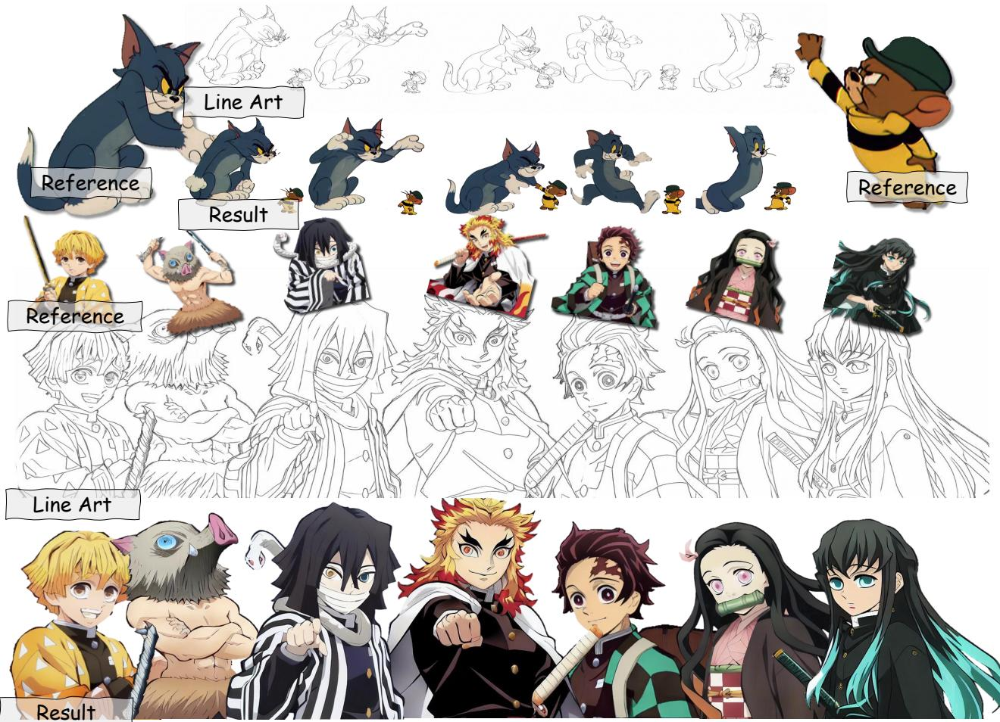
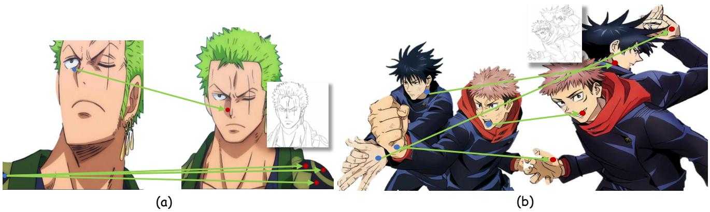
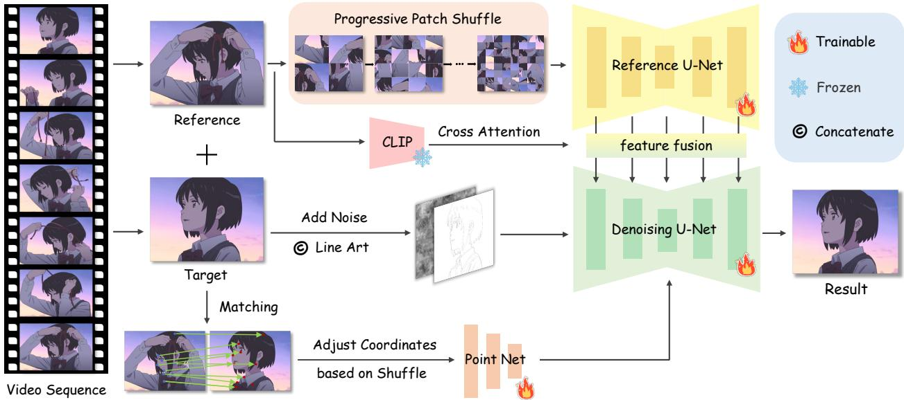
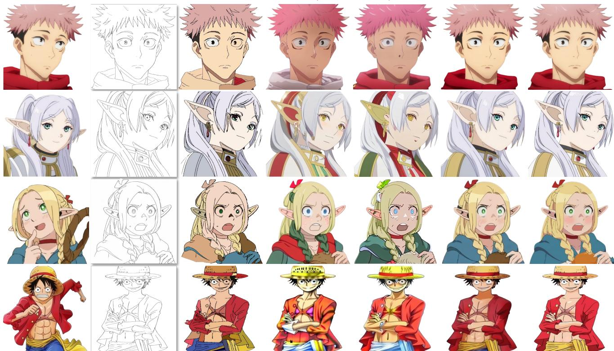
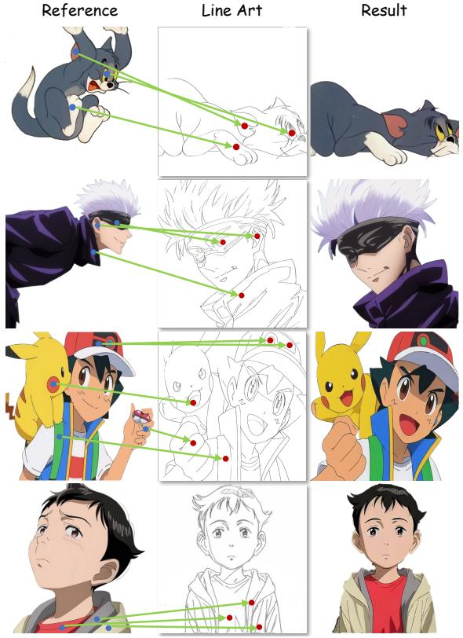
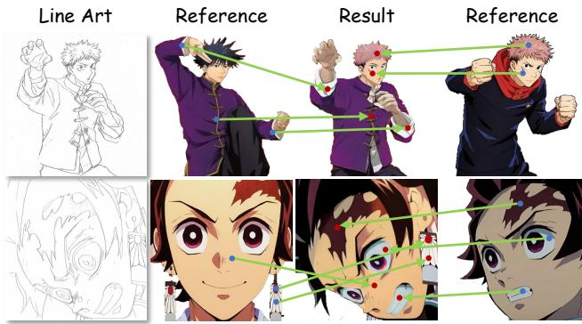
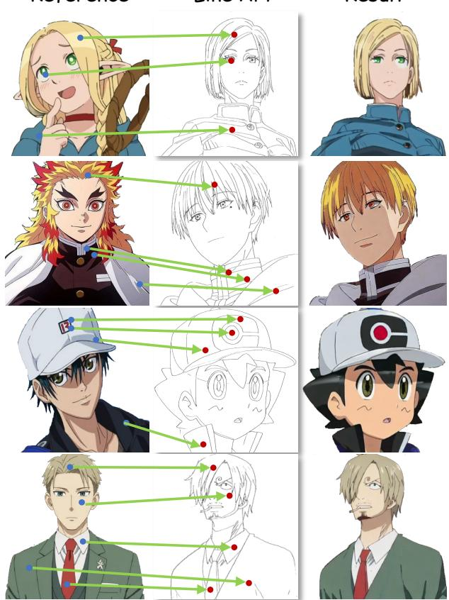

# MangaNinja: Line Art Colorization with Precise Reference Following

Zhiheng Liu1,3∗, Ka Leong Cheng2,4∗, Xi Chen1,3, Jie Xiao3, Hao Ouyang4, Kai Zhu3, Yu Liu3, Yujun Shen4, Qifeng Chen2, Ping Luo1,5†

1HKU, 2HKUST, 3Tongyi Lab,4Ant Group, 5HKU Shanghai Intelligent Computing Research Center

  
Figure 1. Line art colorization results. We propose MangaNinja, a reference-based line art colorization method. MangaNinja automatically aligns the reference with the line art for colorization, demonstrating remarkable consistency. Additionally, users can achieve more complex tasks using point control. We hope that MangaNinja can accelerate the colorization process in the anime industry.

## Abstract

Derived from diffusion models, MangaNinja specializes in the task of reference-guided line art colorization. We incorporate two thoughtful designs to ensure precise character detail transcription, including a patch shuffling module to facilitate correspondence learning between the reference color image and the target line art, and a pointdriven control scheme to enable fine-grained color match-

ing. Experiments on a self-collected benchmark demonstrate the superiority ofour model over current solutions in terms of precise colorization. We further showcase the potential of the proposed interactive point control in handling challenging cases (e.g., extreme poses and shadows), crosscharacter colorization, multi-reference harmonization, etc., beyond the reach of existing algorithms. Our code and model could befound here.

## 1. Introduction

Reference-based line art colorization aims to transform a line art image into a color image, maintaining consistency with the reference image [9, 10, 34, 44, 86]. This technique is in high demand for comics, animation, and various other content creation applications [11, 24, 35, 85, 87]. Unlike methods that rely solely on strokes, palettes, or text conditions [27, 66, 79], reference-based line art colorization excels in preserving both identity and semantic meaning as shown in Fig. 1, which is crucial for comics and manga.

Existing approaches [9, 34] have explored referencebased colorization with fused attention mechanisms. However, these methods exhibit two main limitations. First, substantial variations between the line art and reference image often lead to semantic mismatches or confusion of colorization. Hence, these approaches typically demand a high standard for the reference image, requiring it to closely resemble the line art, which is impractical for real-world applications. Second, existing methods lack precise control, resulting in the loss of crucial details from the reference image during the colorization process.

In this paper, we introduce MangaNinja, consisting of a dual-branch structure for correspondences finding between the reference and line art images by leveraging the rich diffusion priors through cross attention. Observing that the basic dual-branch design tends to transfer global style rather than matching local semantics, we propose a patch shuffling module, which divides the reference image into patches to encourage local matching capabilities of the model. The patch shuffling pushes our model out of its “comfort zone” during optimization, facilitating it to learn an implicit matching capability that effectively handles disparities between the input line art and reference image.

However, such semantic correspondence can still suffer from ambiguity, especially when color images include details that are hard to capture in line art (e.g., nose shading in Fig. 2a), when some elements in the line art occupy only a small area of the reference image (e.g., shoulder garment pattern in Fig. 2a), or when significant variations and complex compositions create semantic confusion (e.g., multiple characters in Fig. 2b). To further support finergrained coloring matching, we introduce a point-driven control scheme powered by PointNet, which offers detailed control using user-defined cues in an interactive manner. During experiments, we find that point control only works when the model is aware of local semantics, highlighting the importance and effectiveness of patch shuffling.

We take advantage of the inherently natural semantic correspondences and visual variances presented in anime videos to construct training data pairs. Specifically, we randomly select two frames from a video: one serves as the reference for the Reference U-Net, while the other, along with its line art version, acts as the target and input for the

Denoising U-Net. As for the explicit correspondence, we employ an off-the-shelf model to label matching points in the training image pairs, encode these points with PointNet, and integrate them into the main branch via attention.

With our carefully designed patch shuffling strategy and point-driven control scheme, MangaNinja effectively manages challenging scenarios, such as varying poses or details missing between reference and line art, multi-reference inputs, and colorization with discrepant references, as shown in Sec. 4.3. It excels in complex colorization tasks, producing high-quality results from line art while accurately preserving character identity, as demonstrated in Fig. 1. For a fair and systematic evaluation, we construct a comprehensive benchmark for line art colorization. Our extensive quantitative and qualitative experiments demonstrate that our approach outperforms existing baselines, achieving state-of-the-art results in visual fidelity and identity preservation, making it beneficial for comics, animation, and various content creation applications.

## 2. Related Work

## 2.1. Line Art Colorization

Line art colorization aims to fill the blank regions of line art with appropriate colors. Currently, several user-guided colorization techniques exist, including text prompts [8, 29, 84], scribble [8, 15, 39, 57, 82, 83], and reference image [14, 25, 33, 34, 46, 70, 71, 85]. However, text-based and scribble methods have limitations in achieving precise color filling for the overall line art. Existing reference-based colorization approaches often have limited performance due to inaccurate structural and semantic matching, particularly when there are substantial differences between the reference image and the line art. Moreover, in practical applications, more complex scenarios arise, such as requiring multiple reference images to handle the colorization of various elements in the line art. Consequently, it is challenging to seamlessly integrate the existing line art colorization methods into the animation industry workflow. Our approach leverages priors from pretrained diffusion models and enhances the model’s matching capabilities by learning from video data, allowing users to accomplish complex colorization tasks with simple point guidance.

## 2.2. Visual Correspondence

In computer vision, correspondence [80] involves identify ing and matching related features or points across different images, often used for tasks such as stereo vision [1, 49, 58, 59], motion tracking [17, 75]. Traditional methods use hand-crafted features [5, 43] to find correspondences, whereas recent deep learning approaches [13, 23, 30, 32] leverage supervised learning with labeled data to learn matching capabilities. However, due to the requirement

  
Figure 2. Visualization of point guidance. By introducing points as guidance, MangaNinja can tackle many challenging tasks, such as when there are significant variations between reference images and line art while preserving details. See more in Sec. 4.3.

## 3. Method

for precise pixel-level annotations, these methods struggle to scale up, as such detailed labeling is challenging and expensive. Later, researchers begin exploring the establishment of weakly supervised [67] or self-supervised [26, 68] visual correspondence models. Recent studies [20, 52, 63] show that the rich priors inherent in the latent representations of generative pretrained models like GAN [18] and Diffusion [61] models can be utilized to identify visual correspondence. Leveraging the inherent rich priors of correspondences in pre-trained diffusion models, our method achieves reference-based colorization by learning to match between line art and reference images.

## 2.3. Diffusion-based Consistent Generation

Consistent generation based on pretrained diffusion models can be categorized into three main directions. The first direction leverages a training-free or rapid fine-tuning strategy for image editing [3, 4, 6, 7, 21, 28, 36, 38, 42, 45, 47, 60, 65], where they conduct global or local editing by modifying text prompts or introducing new guidance to adjust the attention layers. However, they generally struggle with robustness in challenging scenarios and rely heavily on the input guidance signals. The second direction is customized generation [2, 16, 19, 31, 40, 41, 55, 56, 64], which generally involves fine-tuning on 3 to 5 example images per concept, where some methods may take about half an hour for a single concept. The third direction involves further training the pretrained diffusion model with extensive domain-specific data, learning to incorporate encoded image features into the main denoising network [50, 72, 78, 81]. For instance, Paint-by-Example [76] and ObjectStitch [62] utilize CLIP [53] to encode images for extracting object representations, while AnyDoor [12] collects training samples from videos and employs the DINOv2 [48] as the image encoder. However, these methods primarily focus on general objects in images, lacking fine-grained matching capabilities.

## 3.1. Overall Pipeline

The overall framework of MangaNinja is presented in Fig. 3. Our goal is to match and colorize, producing a vibrant anime image $I _ { \mathrm { t a r g e t } }$ from a line art $I _ { \mathrm { l i n e } }$ and a reference image $I _ { \mathrm { r e f } }$ of the same character. Additionally, users can pre-define specific points $P _ { \mathrm { r e f } }$ on the reference image and their corresponding points $P _ { \mathrm { l i n e } }$ on the line art. Guided by the matching points, the model ensures color consistency during the colorization process, thereby achieving fine-grained control and excellent performance even in challenging scenarios.

Anime video sequences inherently present identity consistency across frames while simultaneously exhibiting various spatial and temporal transformations. These transformations include, but are not limited to, scale variations (e.g., zooming effects), changes in object orientation, and alterations in pose. Thanks to such property, we construct training image pairs by randomly sampling two distinct frames from a video clip. The first frame serves as the reference, and we employ an off-the-shelf line art extraction model [84] to derive the line art from the second frame, which serves as the target image. During training, we use LightGlue [37], a state-of-the-art point-matching algorithm, to extract corresponding point pairs between two frames.

## 3.2. Architecture Design

Reference U-Net. Given the stringent detail requirements in line art colorization, the main challenge is how to effectively encode the reference image for finer-grained feature extraction. Recent studies [22, 74] demonstrate the effectiveness of leveraging an additional U-Net architecture to address this issue, and we are inspired to introduce a Reference U-Net using a similar design. After encoding the reference image into a 4-channel latent representation using VAE, it is fed into the Reference U-Net to extract multi-level features for fusion with the main Denoising U-Net. Specifically, we concatenate the key and value from the self-attention layers of both the reference and denoising branches, as described in Eq. (1), injecting the multi-level reference features into the corresponding layers of the Denoising U-Net.

  
Figure 3. The training process of MangaNinja. We randomly select two frames from video data, using one frame as a reference image and extracting the line art from the other. Both frames are input into the Reference U-Net and the Denoising U-Net, respectively. To enhance the model’s automatic matching and fine-grained control capabilities, we propose a series of training strategies, including progressive patch shuffling. Additionally, we employ an off-the-shelf model to extract matching points from the two frames, and these point maps are fed into the main branch through PointNet.

$$
\mathrm { A t t n } = \mathrm { s o f t m a x } ( \frac { Q _ { \mathrm { t a r } } \left[ K _ { \mathrm { t a r } } , K _ { \mathrm { r e f } } \right] ^ { \top } } { \sqrt { d } } ) [ V _ { \mathrm { t a r } } , V _ { \mathrm { r e f } } ] .\tag{1}
$$

Denoising U-Net. The main branch utilizes the Reference U-Net and PointNet as conditions for image colorization. We extract the line art from the images using LineartAnimeDetector [84], then replicate the single-channel line art three times to input into the variational autoencoder (VAE) for compression into the latent space. Next, we concatenate this with the noisy image latent, resulting in a total of 8 channels. Additionally, we experiment with sending the line art through ControlNet [84] and find that both approaches yield comparable performance. For resource efficiency, we opt for the first method. Furthermore, we replace the original text embeddings with image embeddings extracted from the CLIP encoder.

Condition dropping. To enhance the model’s generative capacity, we use the common condition dropping strategy that randomly drops the line art condition during training. Without the structural guidance of the line art, we prompt the model to reconstruct the target image $I _ { \mathrm { t a r g e t } }$ from the reference image $I _ { \mathrm { r e f } }$

Progressive patch shuffle for local matching. Although we inject the reference image features layer by layer into the Denoising U-Net, we observe that the strong structural cues provided by the line art enable easy coarse global matching, which hinders the learning of detailed matching ability. To address this, we propose a progressive patch shuffle strategy. Specifically, we divide the reference image into multiple small patches and randomly shuffle them to disrupt the overall structural coherence, as shown in Fig. 3. The idea behind this technique is to encourage the model to focus more on smaller patches (even at the pixel level) within the reference image to achieve finer-grained, local matching abilities rather than global ones. Moreover, we adopt a coarse-to-fine learning scheme by progressively increasing the number of randomly shuffled patches from 2×2 to 32×32. Apart from the shuffling technique, we also employ some common data augmentation techniques, such as random flipping and rotation, to increase the variation between the reference and target image.

## 3.3. Fine-grained Point Control

However, such semantic correspondence can still suffer from ambiguity, especially when color images contain details that are difficult to capture in line art. Moreover, users often require a simple interactive method to handle complex tasks. To address this, we design a point-based fine-grained control mechanism and propose a series of strategies to enhance the effectiveness of point control. User-specified matching point Point embedding injection.

pairs are represented as two single-channel point maps matching the input image resolution. For each matching point pair, we assign the same unique integer values to their respective coordinates on both point maps, with all other positions set to 0. During training, we randomly select up to 24 matching point pairs, with the option to select zero points as well. Hence, users can opt not to indicate matching points for control during inference, instead fully relying on the autonomous matching capability of the model.

We propose a PointNet composed of multiple convolutional layers and SiLU activation functions to encode the point maps as multi-scale embeddings. Similarly, the point embeddings $E _ { \mathrm { t a r } }$ and $E _ { \mathrm { r e f } }$ are integrated into the main branch via a cross-attention mechanism by adding them to the query and key, as described in Eq. (2):

$$
\mathrm { A t t n } = \mathrm { s o f t m a x } ( \frac { Q _ { \mathrm { t a r } } ^ { \prime } [ K _ { \mathrm { t a r } } ^ { \prime } , K _ { \mathrm { r e f } } ^ { \prime } ] ^ { \top } } { \sqrt { d } } ) [ V _ { \mathrm { t a r } } , V _ { \mathrm { r e f } } ] ,\tag{2}
$$

$$
\begin{array} { r l } & { \mathrm { w h e r e } Q _ { \mathrm { t a r } } ^ { \prime } = Q _ { \mathrm { t a r } } + E _ { \mathrm { t a r } } , K _ { \mathrm { t a r } } ^ { \prime } = K _ { \mathrm { t a r } } + E _ { \mathrm { t a r } } , \mathrm { a n d } K _ { \mathrm { r e f } } ^ { \prime } = } \\ & { K _ { \mathrm { r e f } } + E _ { \mathrm { r e f } } . } \end{array}
$$

Condition dropping. The condition dropping strategy also enhances fine-grained point control. In particular, the precise yet sparse matching offered by the point pairs $P _ { \mathrm { r e f } }$ and $P _ { \mathrm { l i n e } }$ further reinforces the model’s reliance on sparse point-based control signals in condition dropping scenarios. Progressive patch shuffle. To adapt the shuffling strategy for point guidance, the coordinates of the point map needs to be adjusted to align with the shuffling order.

Multi classifier-free guidance. To individually control the guiding strength of the reference image and the points during the generation inference process, we employ multiple classifier-free guidance:

$$
\begin{array} { r l } & { \epsilon _ { \theta } ( z _ { \mathrm { t } } , c _ { \mathrm { r e f } } , c _ { \mathrm { p o i n t s } } ) = \epsilon _ { \theta } ( z _ { \mathrm { t } } , \emptyset , \emptyset ) } \\ & { \qquad + \omega _ { r e f } \big ( \epsilon _ { \theta } ( z _ { \mathrm { t } } , c _ { \mathrm { r e f } } , \emptyset ) - \epsilon _ { \theta } ( z _ { \mathrm { t } } , \emptyset , \emptyset ) \big ) } \\ & { \qquad + \omega _ { \mathrm { p o i n t s } } \big ( \epsilon _ { \theta } ( z _ { \mathrm { t } } , c _ { \mathrm { r e f } } , c _ { \mathrm { p o i n t s } } ) - \epsilon _ { \theta } ( z _ { \mathrm { t } } , c _ { \mathrm { r e f } } , \emptyset ) \big ) , } \end{array}\tag{3}
$$

where $c _ { \mathrm { r e f } }$ denotes the condition input from the reference image via the Reference U-Net, while $c _ { \mathrm { p o i n t s } }$ denotes the condition input from the user-specified points through the PointNet. Increasing $\omega _ { \mathrm { r e f } }$ makes the model rely more on its automatic matching capabilities. However, when we want to use points as guidance to accomplish more complex tasks (see Sec. 4.3), we should increase $w _ { \mathrm { p o i n t s } }$ to amplify the influence of the points.

Two-stage training. To further amplify the effects of precise point-based control, we design a two-stage training strategy. In the first stage, we adopt condition dropping for both the reference image and point signals for unconditional generation, where the model concurrently learns the abilities to extract corresponding reference features and leverage the specified point correspondences for colorization. In the second stage, we only train the PointNet module, thereby enhancing the ability of PointNet to encode point maps, leading to stronger point control.

## 3.4. Evaluation Benchmark

Existing works such as BasicPBC [14] and Animediffusion [9] design test sets that focus only on specific domains, involve minimal discrepancy between the reference and target images, and evaluate using inconsistent metrics. Therefore, we see the crucial need to establish a comprehensive and consistent evaluation benchmark. We construct a benchmark to systematically evaluate the performance of line art colorization. Specifically, we collect 200 image pairs of the same character from various anime, encompassing both human and non-human characters with diverse facial expressions and appearances, including attire. Each evaluation sample consists of a target image with its line art estimated using an off-the-shell LineartAnimeDetector model [84] and a reference image as colorization guidance. In the colorization process, the focus is typically on the foreground character portions, so we segment all images to extract the foreground subjects. Moreover, we follow the methodology outlined in DreamBooth [55] to calculate the CLIP [53] and DINO [48] semantic image similarities between the generated images and the ground truth. Furthermore, to assess the quality of the generated images, we compute the Peak Signal-to-Noise Ratio (PSNR) and the Multi-Scale Structural Similarity Index (MS-SSIM) [69]. Meanwhile, to evaluate coloring accuracy in complex tasks—such as those involving multiple references or colorization with differing reference points mentioned in Sec. 4.3—we require a more granular evaluation at the pixel level. Specifically, we annotate 50 predefined pairs of matching points for each image pair; for evaluation we employ the mean squared error (MSE) for the $3 \times 3$ patches centered around each pair of matching points.

## 4. Experiments

## 4.1. Implementation Details

Training details. For training MangaNinja, we utilize a dataset, sakuga-42m [51], which comprises 42 million keyframes covering a wide range of artistic styles, geographical regions, and historical periods. We eliminate excessively similar duplicate frames by calculating the Structural Similarity Index (SSIM). Furthermore, we set the frame interval between the reference and target frames to 36, excluding videos that are too short. Ultimately, we retain 300,000 video clips. We initialize both the Reference and Denoising U-Net with pre-trained weights sourced from Stable Diffusion 1.5 [54] The training spans 200k steps (180k for stage one, 20k for stage two) with an initial learning rate of $1 0 ^ { - 3 }$ , decaying every 30k steps. The entire training process is completed within one day using

Reference

Line Art

BasicPBC

IP-Adapter

Anydoor

Ours

GT

  
Figure 4. Qualitative comparisons. We compare our method with the state-of-the-art non-generative colorization method BasicPBC, the consistency generation method IP-Adapter, and AnyDoor. The results demonstrate that our method significantly outperforms them in terms of colorization accuracy and generated image quality. Notably, our method does not use points for guidance in the generated results.

eight A100-80G GPUs.

## 4.2. Comparisons

In this section, we compare with the current state-of-the-art line art colorization method, BasicPBC [14]. Additionally, we also conduct comparisons with several generative methods that can achieve similar functions. These include IP-Adapter [77], which serves as an adapter to enhance the image prompting capabilities of pretrained text-to-image diffusion models, and Anydoor [12], a zero-shot objectlevel image customization method. In addition, we will discuss the cartoon interpolation method ToonCrafter [73] in the supplementary materials, as the official repository has not yet released its colorization function and exhibits poor performance when there are significant discrepancies.

Qualitative comparison. We visualize the comparison results in Fig. 4. BasicPBC samples colors in the vicinity of the corresponding area in the line art; hence, the generated results can be unsatisfactory when there is a large discrepancy between the reference and the line art. Moreover, as the model itself does not have a generative capability, it does not perform well in handling light and shadow. For generative methods, we introduce a controlnet for the IP-

Adapter and AnyDoor, and carefully annotate the masks of the reference region, then feed them to AnyDoor. Leveraging the strong prior knowledge of pre-trained models, the generated results become more natural. Compared to the IP-Adapter, AnyDoor better retains the color details of the reference image. However, neither method possesses finegrained matching capability and can only achieve coarse colorization results, leading to serious color confusion. Notably, our method does not use points for guidance in the generated results. This is because, during the training process, our method learns from image pairs in video data and gradually shuffles the reference image at the patch level from simple to complex, which endows the model with excellent matching capability. Benefiting from the design of the point, as shown in Sec. 4.3, our method also excels in some more complex scenarios.

Quantitative comparison. We conduct a quantitative comparison using our constructed benchmark. It is worth noting that this benchmark contains 200 pairs of images, which means we perform a total of 400 inferences (interchanging the reference image and ground truth). The results are presented in Tab. 1. The results indicate that the BasicPBC outperforms generative methods in pixel-level evaluation metrics. However, it is noteworthy that BasicPBC performs weaker in terms of image feature similarity metrics compared to these methods. Additionally, Anydoor requires manual labeling of masks in reference images to achieve better performance. In contrast, our approach demonstrates a significant advantage over previous methods in both pixellevel and image feature similarity metrics.

Table 1. Quantitative comparison. MangaNinja demonstrates superior performance across both objective and perceptual metrics. AnyDoor: without mask; AnyDoor\*: with mask. Ours: no point guidance; Ours (full): with point guidance.
<table><tr><td>Method</td><td>DINO ↑ CLIP ↑ PSNR ↑ MS-SSIM ↑ LPIPS ↓</td><td></td><td></td><td></td></tr><tr><td>BasicPBC [14] IP-Adapter [77] Anydoor [12]</td><td>42.64 55.42 51.36</td><td>79.64 17.58 82.39 16.19 80.73 15.12</td><td>0.894 0.845</td><td>0.33 0.30</td></tr><tr><td>AnyDoor* [12]</td><td>63.79</td><td>83.91 16.24</td><td>0.827 0.874</td><td>0.32 0.27</td></tr><tr><td>Ours Ours (full)</td><td>68.23 69.91</td><td>88.34 20.37 90.02 21.34</td><td>0.962 0.972</td><td>0.22 0.21</td></tr></table>

## 4.3. Challenging Cases with Point Guidance

Varying poses or missing details. As shown in Fig. 5, we present some more challenging examples of line art colorization. As shown in the first two rows, despite significant differences between the line art and the reference image, points provide effective guidance for achieving outstanding colorization. Additionally, guided by points, MangaNinja excels at simultaneously colorizing multiple interacting subjects with high quality, as illustrated in row three. Furthermore, MangaNinja handles cases where the line art includes elements missing from the reference image. As shown in the last row, users can color the lower half of the garment with point-based guidance, using the upper half from the reference image.

Multi-ref colorization. As demonstrated in Fig. 6, in practical applications, a single reference image may not always encompass all the elements in line art that require colorization. Benefiting from the point-guided design, our method allows for the simultaneous use of multiple reference images for colorization. Specifically, users can combine multiple images and input them into Reference U-Net, which then employs points to match different regions from the reference images with corresponding elements in the line art. This approach facilitates many-to-one colorization and effectively resolves content conflicts among the various reference images.

Colorization with references of different characters. MangaNinja is trained on a large number of image pairs from video data, which provides it with semantic matching capability and excellent generalization properties. Moreover, by utilizing point guidance, we can achieve precise colorization. Consequently, even when the reference image and the line art are different characters, the model can still perform colorization effectively. As shown in Fig. 7, users can leverage this feature to engage in an interactive process, exploring and discovering inspiration for colorization.

Figure 5. Visualization of varying poses or missing details. With point guidance, MangaNinja can tackle many challenging cases. For instance, in the first two rows, there are significant variations between the reference image and line art. Furthermore, users can employ point guidance to colorize regions or elements with no matches in the reference; for example, the lower parts of the clothing are missing in the reference image of the third sample. When dealing with multiple objects, point guidance effectively prevents color confusion, as demonstrated in the last row.  
  
Figure 6. Visualization of multi-ref colorization. MangaNinja enables users to select specific areas from multiple reference images through points, providing guidance for all elements in the line art. Additionally, it effectively resolves conflicts between similar visual elements across the reference images.

Table 2. Ablation study on the effect of various training strategies. The first five evaluation metrics assess the overall quality of the coloring results, while the MSE metric evaluates the coloring accuracy at the specified matching pixels. The upper half of the table examines the impact of training strategies associated with the model’s automatic matching capabilities, while the lower half focuses on strategies related to the model’s ability to respond to point guidance.
<table><tr><td>Point</td><td>Cond. Drop</td><td>Shuffle</td><td>Multi. CFG</td><td>Two-stage</td><td>DINO Sim↑</td><td>CLIP Sim↑</td><td>PSNR↑</td><td>MS-SSIM↑</td><td>LPIPS↓</td><td>MSE↓</td></tr><tr><td>x</td><td>x</td><td>x</td><td>x</td><td>x</td><td>63.91</td><td>84.75</td><td>18.02</td><td>0.912</td><td>0.27</td><td>-</td></tr><tr><td>x</td><td>√</td><td>x</td><td>x</td><td>x</td><td>64.79</td><td>85.22</td><td>18.61</td><td>0.929</td><td>0.25</td><td>-</td></tr><tr><td>x</td><td>x</td><td>√</td><td>x</td><td>x</td><td>67.12</td><td>86.93</td><td>19.72</td><td>0.952</td><td>0.23</td><td>-</td></tr><tr><td>x</td><td>√</td><td>√</td><td>x</td><td>x</td><td>68.23</td><td>88.34</td><td>20.37</td><td>0.962</td><td>0.22</td><td>-</td></tr><tr><td>V</td><td>x</td><td>x</td><td>x</td><td>x</td><td>64.13</td><td>85.05</td><td>18.12</td><td>0.914</td><td>0.26</td><td>0.0151</td></tr><tr><td>√</td><td>√</td><td>x</td><td>x</td><td>x</td><td>64.92</td><td>85.44</td><td>19.02</td><td>0.941</td><td>0.25</td><td>0.0125</td></tr><tr><td>√</td><td>x</td><td>√</td><td>x</td><td>x</td><td>67.78</td><td>87.42</td><td>20.18</td><td>0.956</td><td>0.23</td><td>0.0091</td></tr><tr><td>√</td><td>x</td><td>x</td><td>√</td><td>x</td><td>64.63</td><td>86.02</td><td>18.74</td><td>0.943</td><td>0.24</td><td>0.0133</td></tr><tr><td>√</td><td>x</td><td>x</td><td>x</td><td>√</td><td>64.32</td><td>86.34</td><td>19.36</td><td>0.939</td><td>0.24</td><td>0.0113</td></tr><tr><td>√</td><td>√</td><td>√</td><td>√</td><td>√</td><td>69.91</td><td>90.02</td><td>21.34</td><td>0.972</td><td>0.21</td><td>0.0072</td></tr></table>

Line Art  
Result  
  
Figure 7. Visualization of colorization with discrepant reference (i.e. different characters). Our method uses points as guidance to achieve semantic color matching with fine control. We believe this effectively assists users in their colorization attempts and inspire new ideas.

## 4.4. Ablation Studies

Ablation of training strategies. We conduct a series of ablation studies in Tab. 2 to investigate how different training strategies impact the colorization performance and matching capability of our model. The first five metrics assess the overall quality of the colorization, while the MSE measures the accuracy of the color predictions at the pixel locations of the guiding points.

The ablation experiments demonstrate that all strategies contribute to improving point-guided generation, enabling our method to address a broader range of complex tasks. Notably, even without using points as guidance, both condition dropping and progressive patch shuffle enhance the model’s automatic matching capability, with the latter yielding the most notable improvement. Specifically, it disrupts the reference image’s inherent structural patterns during training, enabling the model to learn local matching capabilities. Only after learning this local matching ability does the effect of point guidance become clearly evident. Meanwhile, we provide a further analysis of the progressive patch shuffle in the supplementary materials.

## 5. Conclusion

We present MangaNinja, a novel reference-guided line art colorization method. Through a series of training strategies, our method utilizes a dual-branch structure and Point-Net to achieve precise automatic matching while also allowing users to exert fine-grained control by defining matching points. MangaNinja exhibits impressive performance in complex scenarios, including discrepant reference colorization, significant variations between reference images and line art, and multi-subject colorization. Additionally, we propose a benchmark for the standardized evaluation of reference-based colorization. Our work serves as a practical tool to accelerate the coloring process in the anime industry while inspiring future research in colorization.

## Acknowledgment

This research was funded by the Research Grant Council of the Hong Kong Special Administrative Region under grant number 16203122. Additionally, this work received support from the Alibaba Tongyi Research Intern Program and the Ant Group Research Intern Program.

## References

[1] Sameer Agarwal, Yasutaka Furukawa, Noah Snavely, Ian Simon, Brian Curless, Steven M Seitz, and Richard Szeliski. Building rome in a day. Communications ofthe ACM, 54(10):105–112, 2011. 2

[2] Omri Avrahami, Kfir Aberman, Ohad Fried, Daniel Cohen-Or, and Dani Lischinski. Break-a-scene: Extracting multiple concepts from a single image. In SIGGRAPH Asia 2023 Conference Papers, pages 1– 12, 2023. 3

[3] Qingyan Bai, Hao Ouyang, Yinghao Xu, Qiuyu Wang, Ceyuan Yang, Ka Leong Cheng, Yujun Shen, and Qifeng Chen. Edicho: Consistent image editing in the wild. arXiv preprint arXiv:2412.21079, 2024. 3

[4] Omer Bar-Tal, Dolev Ofri-Amar, Rafail Fridman, Yoni Kasten, and Tali Dekel. Text2live: Text-driven layered image and video editing. In European Conference on Computer Vision, pages 707–723. Springer, 2022. 3

[5] Herbert Bay, Tinne Tuytelaars, and Luc Van Gool. Surf: Speeded up robust features. In European Conference on Computer Vision, pages 404–417. Springer, 2006. 2

[6] Tim Brooks, Aleksander Holynski, and Alexei A Efros. Instructpix2pix: Learning to follow image editing instructions. In Computer Vision and Pattern Recognition, pages 18392–18402, 2023. 3

[7] Mingdeng Cao, Xintao Wang, Zhongang Qi, Ying Shan, Xiaohu Qie, and Yinqiang Zheng. Masactrl: Tuning-free mutual self-attention control for consistent image synthesis and editing. In International Conference on Computer Vision, pages 22560–22570, 2023. 3

[8] Ruizhi Cao, Haoran Mo, and Chengying Gao. Line art colorization based on explicit region segmentation. In Computer Graphics Forum, pages 1–10, 2021. 2

[9] Yu Cao, Xiangqiao Meng, PY Mok, Xueting Liu, Tong-Yee Lee, and Ping Li. Animediffusion: Anime face line drawing colorization via diffusion models. arXiv preprint arXiv:2303.11137, 2023. 2, 5

[10] Hernan Carrillo, Michael Cl¨ ement, Aur´ elie Bugeau,´ and Edgar Simo-Serra. Diffusart: Enhancing line art colorization with conditional diffusion models. In Computer Vision and Pattern Recognition, pages 3486–3490, 2023. 2

[11] Evan Casey, V´ıctor Perez, and Zhuoru Li. The´ animation transformer: Visual correspondence via segment matching. In International Conference on Computer Vision, pages 11323–11332, 2021. 2

[12] Xi Chen, Lianghua Huang, Yu Liu, Yujun Shen, Deli Zhao, and Hengshuang Zhao. Anydoor: Zero-shot object-level image customization. In Computer Vision and Pattern Recognition, pages 6593–6602, 2024. 3, 6, 7

[13] Seokju Cho, Sunghwan Hong, Sangryul Jeon, Yunsung Lee, Kwanghoon Sohn, and Seungryong Kim. Cats: Cost aggregation transformers for visual correspondence. Advances in Neural Information Processing Systems, 34:9011–9023, 2021. 2

[14] Yuekun Dai, Shangchen Zhou, Qinyue Li, Chongyi Li, and Chen Change Loy. Learning inclusion matching for animation paint bucket colorization. Computer Vision and Pattern Recognition, 2024. 2, 5, 6, 7

[15] Zhi Dou, Ning Wang, Baopu Li, Zhihui Wang, Haojie Li, and Bin Liu. Dual color space guided sketch colorization. IEEE Transactions on Image Processing, 30:7292–7304, 2021. 2

[16] Rinon Gal, Yuval Alaluf, Yuval Atzmon, Or Patashnik, Amit H Bermano, Gal Chechik, and Daniel Cohen-Or. An image is worth one word: Personalizing text-to-image generation using textual inversion. arXiv preprint arXiv:2208.01618, 2022. 3

[17] Shenyuan Gao, Chunluan Zhou, Chao Ma, Xinggang Wang, and Junsong Yuan. Aiatrack: Attention in attention for transformer visual tracking. In European Conference on Computer Vision, pages 146–164. Springer, 2022. 2

[18] Ian Goodfellow, Jean Pouget-Abadie, Mehdi Mirza, Bing Xu, David Warde-Farley, Sherjil Ozair, Aaron Courville, and Yoshua Bengio. Generative adversarial networks. Communications of the ACM, 63(11):139– 144, 2020. 3

[19] Yuchao Gu, Xintao Wang, Jay Zhangjie Wu, Yujun Shi, Yunpeng Chen, Zihan Fan, Wuyou Xiao, Rui Zhao, Shuning Chang, Weijia Wu, et al. Mix-ofshow: Decentralized low-rank adaptation for multiconcept customization of diffusion models. Advances in Neural Information Processing Systems, 36, 2024. 3

[20] Eric Hedlin, Gopal Sharma, Shweta Mahajan, Hossam Isack, Abhishek Kar, Andrea Tagliasacchi, and Kwang Moo Yi. Unsupervised semantic correspondence using stable diffusion. Advances in Neural Information Processing Systems, 36, 2024. 3

[21] Amir Hertz, Ron Mokady, Jay Tenenbaum, Kfir Aberman, Yael Pritch, and Daniel Cohen-Or. Promptto-prompt image editing with cross attention control. arXiv preprint arXiv:2208.01626, 2022. 3

[22] Li Hu, Xin Gao, Peng Zhang, Ke Sun, Bang Zhang, and Liefeng Bo. Animate anyone: Consistent and controllable image-to-video synthesis for character animation. arXiv preprint arXiv:2311.17117, 2023. 3

[23] Shuaiyi Huang, Luyu Yang, Bo He, Songyang Zhang, Xuming He, and Abhinav Shrivastava. Learning semantic correspondence with sparse annotations. In European Conference on Computer Vision, pages 267–284. Springer, 2022. 2

[24] Zhitong Huang, Nanxuan Zhao, and Jing Liao. Unicolor: A unified framework for multi-modal colorization with transformer. ACM Trans. Graph., 41(6):1– 16, 2022. 2

[25] Zhitong Huang, Mohan Zhang, and Jing Liao. Lvcd: Reference-based lineart video colorization with diffusion models. arXiv preprint arXiv:2409.12960, 2024. 2

[26] Allan Jabri, Andrew Owens, and Alexei Efros. Spacetime correspondence as a contrastive random walk. Advances in Neural Information Processing Systems, 33:19545–19560, 2020. 3

[27] Xiaozhong Ji, Boyuan Jiang, Donghao Luo, Guangpin Tao, Wenqing Chu, Zhifeng Xie, Chengjie Wang, and Ying Tai. Colorformer: Image colorization via color memory assisted hybrid-attention transformer. In European Conference on Computer Vision, pages 20–36. Springer, 2022. 2

[28] Bahjat Kawar, Shiran Zada, Oran Lang, Omer Tov, Huiwen Chang, Tali Dekel, Inbar Mosseri, and Michal Irani. Imagic: Text-based real image editing with diffusion models. In Computer Vision and Pattern Recognition, pages 6007–6017, 2023. 3

[29] Hyunsu Kim, Ho Young Jhoo, Eunhyeok Park, and Sungjoo Yoo. Tag2pix: Line art colorization using text tag with secat and changing loss. In International Conference on Computer Vision, pages 9056–9065, 2019. 2

[30] Seungwook Kim, Juhong Min, and Minsu Cho. Transformatcher: Match-to-match attention for semantic correspondence. In Computer Vision and Pattern Recognition, pages 8697–8707, 2022. 2

[31] Nupur Kumari, Bingliang Zhang, Richard Zhang, Eli Shechtman, and Jun-Yan Zhu. Multi-concept customization of text-to-image diffusion. In Computer Vision and Pattern Recognition, pages 1931–1941, 2023. 3

[32] Jae Yong Lee, Joseph DeGol, Victor Fragoso, and Sudipta N Sinha. Patchmatch-based neighborhood consensus for semantic correspondence. In Computer Vision and Pattern Recognition, pages 13153–13163, 2021. 2

[33] Yuan-kui Li, Yun-Hsuan Lien, and Yu-Shuen Wang. Style-structure disentangled features and normalizing flows for diverse icon colorization. In Computer Vision and Pattern Recognition, pages 11244–11253, 2022. 2

[34] Zekun Li, Zhengyang Geng, Zhao Kang, Wenyu Chen, and Yibo Yang. Eliminating gradient conflict in reference-based line-art colorization. In European Conference on Computer Vision, pages 579–596. Springer, 2022. 2

[35] Zhexin Liang, Zhaochen Li, Shangchen Zhou, Chongyi Li, and Chen Change Loy. Control color: Multimodal diffusion-based interactive image colorization. arXiv preprint arXiv:2402.10855, 2024. 2

[36] Jun Hao Liew, Hanshu Yan, Daquan Zhou, and Jiashi Feng. Magicmix: Semantic mixing with diffusion models. arXiv preprint arXiv:2210.16056, 2022. 3

[37] Philipp Lindenberger, Paul-Edouard Sarlin, and Marc Pollefeys. LightGlue: Local Feature Matching at Light Speed. In International Conference on Computer Vision, 2023. 3

[38] Pengyang Ling, Lin Chen, Pan Zhang, Huaian Chen, and Yi Jin. Freedrag: Point tracking is not you need for interactive point-based image editing. arXiv preprint arXiv:2307.04684, 2023. 3

[39] Yifan Liu, Zengchang Qin, Tao Wan, and Zhenbo Luo. Auto-painter: Cartoon image generation from sketch by using conditional wasserstein generative adversarial networks. Neurocomputing, 311:78–87, 2018. 2

[40] Zhiheng Liu, Ruili Feng, Kai Zhu, Yifei Zhang, Kecheng Zheng, Yu Liu, Deli Zhao, Jingren Zhou, and Yang Cao. Cones: Concept neurons in diffusion models for customized generation. arXiv preprint arXiv:2303.05125, 2023. 3

[41] Zhiheng Liu, Yifei Zhang, Yujun Shen, Kecheng Zheng, Kai Zhu, Ruili Feng, Yu Liu, Deli Zhao, Jingren Zhou, and Yang Cao. Cones 2: Customizable image synthesis with multiple subjects. In Advances in Neural Information Processing Systems, pages 57500–57519, 2023. 3

[42] Zichen Liu, Yue Yu, Hao Ouyang, Qiuyu Wang, Ka Leong Cheng, Wen Wang, Zhiheng Liu, Qifeng Chen, and Yujun Shen. Magicquill: An intelligent interactive image editing system. arXiv preprint arXiv:2411.09703, 2024. 3

[43] David G Lowe. Distinctive image features from scaleinvariant keypoints. Int. J. Comput. Vis., 60:91–110, 2004. 2

[44] Akinobu Maejima, Hiroyuki Kubo, Takuya Funatomi, Tatsuo Yotsukura, Satoshi Nakamura, and Yasuhiro Mukaigawa. Graph matching based anime coloriza-

tion with multiple references. In SIGGRAPH, pages 1–2, 2019. 2

[45] Jiafeng Mao, Xueting Wang, and Kiyoharu Aizawa. Guided image synthesis via initial image editing in diffusion model. In ACM Int. Conf. Multimedia, pages 5321–5329, 2023. 3

[46] Yihao Meng, Hao Ouyang, Hanlin Wang, Qiuyu Wang, Wen Wang, Ka Leong Cheng, Zhiheng Liu, Yujun Shen, and Huamin Qu. Anidoc: Animation creation made easier. arXiv preprint arXiv:2412.14173, 2024. 2

[47] Chong Mou, Xintao Wang, Jiechong Song, Ying Shan, and Jian Zhang. Dragondiffusion: Enabling dragstyle manipulation on diffusion models. arXiv preprint arXiv:2307.02421, 2023. 3

[48] Maxime Oquab, Timothee Darcet, Theo Moutakanni,´ Huy V. Vo, Marc Szafraniec, Vasil Khalidov, Pierre Fernandez, Daniel Haziza, Francisco Massa, Alaaeldin El-Nouby, Russell Howes, Po-Yao Huang, Hu Xu, Vasu Sharma, Shang-Wen Li, Wojciech Galuba, Mike Rabbat, Mido Assran, Nicolas Ballas, Gabriel Synnaeve, Ishan Misra, Herve Jegou, Julien Mairal, Patrick Labatut, Armand Joulin, and Piotr Bojanowski. Dinov2: Learning robust visual features without supervision, 2023. 3, 5

[49] Onur Ozyes¸il, Vladislav Voroninski, Ronen Basri, and¨ Amit Singer. A survey of structure from motion\*. Acta Numerica, 26:305–364, 2017. 2

[50] Yulin Pan, Chaojie Mao, Zeyinzi Jiang, Zhen Han, and Jingfeng Zhang. Locate, assign, refine: Taming customized image inpainting with text-subject guidance. arXiv preprint arXiv:2403.19534, 2024. 3

[51] Zhenglin Pan, Yu Zhu, and Yuxuan Mu. Sakuga-42m dataset: Scaling up cartoon research. arXiv preprint arXiv:2405.07425, 2024. 5

[52] William Peebles, Jun-Yan Zhu, Richard Zhang, Antonio Torralba, Alexei A Efros, and Eli Shechtman. Gan-supervised dense visual alignment. In Computer Vision and Pattern Recognition, pages 13470–13481, 2022. 3

[53] Alec Radford, Jong Wook Kim, Chris Hallacy, Aditya Ramesh, Gabriel Goh, Sandhini Agarwal, Girish Sastry, Amanda Askell, Pamela Mishkin, Jack Clark, et al. Learning transferable visual models from natural language supervision. In International Conference on Machine Learning, pages 8748–8763. PMLR, 2021. 3, 5

[54] Robin Rombach, Andreas Blattmann, Dominik Lorenz, Patrick Esser, and Bjorn Ommer. High-¨ resolution image synthesis with latent diffusion models. In Computer Vision and Pattern Recognition, 2022. 5

[55] Nataniel Ruiz, Yuanzhen Li, Varun Jampani, Yael Pritch, Michael Rubinstein, and Kfir Aberman. Dreambooth: Fine tuning text-to-image diffusion models for subject-driven generation. In Computer Vision and Pattern Recognition, 2023. 3, 5

[56] Mehdi Safaee, Aryan Mikaeili, Or Patashnik, Daniel Cohen-Or, and Ali Mahdavi-Amiri. Clic: Concept learning in context. In Computer Vision and Pattern Recognition, pages 6924–6933, 2024. 3

[57] Patsorn Sangkloy, Jingwan Lu, Chen Fang, Fisher Yu, and James Hays. Scribbler: Controlling deep image synthesis with sketch and color. In Computer Vision and Pattern Recognition, pages 5400–5409, 2017. 2

[58] Johannes L Schonberger and Jan-Michael Frahm. Structure-from-motion revisited. In Computer Vision and Pattern Recognition, pages 4104–4113, 2016. 2

[59] Johannes L Schonberger, Enliang Zheng, Jan-Michael¨ Frahm, and Marc Pollefeys. Pixelwise view selection for unstructured multi-view stereo. In European Conference on Computer Vision, pages 501–518. Springer, 2016. 2

[60] Yujun Shi, Chuhui Xue, Jun Hao Liew, Jiachun Pan, Hanshu Yan, Wenqing Zhang, Vincent YF Tan, and Song Bai. Dragdiffusion: Harnessing diffusion models for interactive point-based image editing. In Computer Vision and Pattern Recognition, pages 8839– 8849, 2024. 3

[61] Jascha Sohl-Dickstein, Eric Weiss, Niru Maheswaranathan, and Surya Ganguli. Deep unsupervised learning using nonequilibrium thermodynamics. In International Conference on Machine Learning, pages 2256–2265. PMLR, 2015. 3

[62] Yizhi Song, Zhifei Zhang, Zhe Lin, Scott Cohen, Brian Price, Jianming Zhang, Soo Ye Kim, and Daniel Aliaga. Objectstitch: Object compositing with diffusion model. In Computer Vision and Pattern Recognition, pages 18310–18319, 2023. 3

[63] Luming Tang, Menglin Jia, Qianqian Wang, Cheng Perng Phoo, and Bharath Hariharan. Emergent correspondence from image diffusion. Advances in Neural Information Processing Systems, 36: 1363–1389, 2023. 3

[64] Luming Tang, Nataniel Ruiz, Qinghao Chu, Yuanzhen Li, Aleksander Holynski, David E Jacobs, Bharath Hariharan, Yael Pritch, Neal Wadhwa, Kfir Aberman, et al. Realfill: Reference-driven generation for authentic image completion. ACM Trans. Graph., 43(4):1– 12, 2024. 3

[65] Narek Tumanyan, Michal Geyer, Shai Bagon, and Tali Dekel. Plug-and-play diffusion features for text-driven image-to-image translation. In Computer Vision and Pattern Recognition, pages 1921–1930, 2023. 3

[66] Chaitat Utintu, Pinaki Nath Chowdhury, Aneeshan Sain, Subhadeep Koley, Ayan Kumar Bhunia, and Yi-Zhe Song. Sketchdeco: Decorating b&w sketches with colour. arXiv preprint arXiv:2405.18716, 2024. 2

[67] Qianqian Wang, Xiaowei Zhou, Bharath Hariharan, and Noah Snavely. Learning feature descriptors using camera pose supervision. In European Conference on Computer Vision, pages 757–774. Springer, 2020. 3

[68] Xiaolong Wang, Allan Jabri, and Alexei A Efros. Learning correspondence from the cycle-consistency of time. In Computer Vision and Pattern Recognition, pages 2566–2576, 2019. 3

[69] Zhou Wang, Alan C Bovik, Hamid R Sheikh, and Eero P Simoncelli. Image quality assessment: from error visibility to structural similarity. IEEE Transactions on Image Processing, 13(4):600–612, 2004. 5

[70] Shukai Wu, Xiao Yan, Weiming Liu, Shuchang Xu, and Sanyuan Zhang. Self-driven dual-path learning for reference-based line art colorization under limited data. IEEE Trans. Circuit Syst. Video Technol., 2023. 2

[71] Shukai Wu, Yuhang Yang, Shuchang Xu, Weiming Liu, Xiao Yan, and Sanyuan Zhang. Flexicon: Flexible icon colorization via guided images and palettes. In ACM Int. Conf. Multimedia, pages 8662–8673, 2023. 2

[72] Shaoan Xie, Yang Zhao, Zhisheng Xiao, Kelvin CK Chan, Yandong Li, Yanwu Xu, Kun Zhang, and Tingbo Hou. Dreaminpainter: Text-guided subjectdriven image inpainting with diffusion models. arXiv preprint arXiv:2312.03771, 2023. 3

[73] Jinbo Xing, Hanyuan Liu, Menghan Xia, Yong Zhang, Xintao Wang, Ying Shan, and Tien-Tsin Wong. Tooncrafter: Generative cartoon interpolation. arXiv preprint arXiv:2405.17933, 2024. 6

[74] Zhongcong Xu, Jianfeng Zhang, Jun Hao Liew, Hanshu Yan, Jia-Wei Liu, Chenxu Zhang, Jiashi Feng, and Mike Zheng Shou. Magicanimate: Temporally consistent human image animation using diffusion model. In arXiv, 2023. 3

[75] Bin Yan, Yi Jiang, Peize Sun, Dong Wang, Zehuan Yuan, Ping Luo, and Huchuan Lu. Towards grand unification of object tracking. In European Conference on Computer Vision, pages 733–751. Springer, 2022. 2

[76] Binxin Yang, Shuyang Gu, Bo Zhang, Ting Zhang, Xuejin Chen, Xiaoyan Sun, Dong Chen, and Fang Wen. Paint by example: Exemplar-based image editing with diffusion models. arXiv preprint arXiv:2211.13227, 2022. 3

[77] Hu Ye, Jun Zhang, Sibo Liu, Xiao Han, and Wei Yang. Ip-adapter: Text compatible image prompt adapter

for text-to-image diffusion models. arXiv preprint arxiv:2308.06721, 2023. 6, 7

[78] Ziyang Yuan, Mingdeng Cao, Xintao Wang, Zhongang Qi, Chun Yuan, and Ying Shan. Customnet: Zero-shot object customization with variableviewpoints in text-to-image diffusion models. arXiv preprint arXiv:2310.19784, 2023. 3

[79] Nir Zabari, Aharon Azulay, Alexey Gorkor, Tavi Halperin, and Ohad Fried. Diffusing colors: Image colorization with text guided diffusion. In SIGGRAPH Asia 2023 Conference Papers, pages 1–11, 2023. 2

[80] Ramin Zabih and John Woodfill. Non-parametric local transforms for computing visual correspondence. In European Conference on Computer Vision, pages 151–158. Springer, 1994. 2

[81] Bo Zhang, Yuxuan Duan, Jun Lan, Yan Hong, Huijia Zhu, Weiqiang Wang, and Li Niu. Controlcom: Controllable image composition using diffusion model. arXiv preprint arXiv:2308.10040, 2023. 3

[82] Lvmin Zhang, Chengze Li, Tien-Tsin Wong, Yi Ji, and Chunping Liu. Two-stage sketch colorization. ACM Trans. Graph., 37(6):1–14, 2018. 2

[83] Lvmin Zhang, Chengze Li, Edgar Simo-Serra, Yi Ji, Tien-Tsin Wong, and Chunping Liu. User-guided line art flat filling with split filling mechanism. In Computer Vision and Pattern Recognition, pages 9889– 9898, 2021. 2

[84] Lvmin Zhang, Anyi Rao, and Maneesh Agrawala. Adding conditional control to text-to-image diffusion models. In International Conference on Computer Vision, pages 3836–3847, 2023. 2, 3, 4, 5

[85] Qian Zhang, Bo Wang, Wei Wen, Hai Li, and Junhui Liu. Line art correlation matching feature transfer network for automatic animation colorization. In Proceedings of the IEEE/CVF Winter Conference on Applications of Computer Vision, pages 3872–3881, 2021. 2

[86] Xingran Zhou, Bo Zhang, Ting Zhang, Pan Zhang, Jianmin Bao, Dong Chen, Zhongfei Zhang, and Fang Wen. Cocosnet v2: Full-resolution correspondence learning for image translation. In Computer Vision and Pattern Recognition, pages 11465–11475, 2021. 2

[87] Chengyi Zou, Shuai Wan, Marc Gorriz Blanch, Luka Murn, Marta Mrak, Juil Sock, Fei Yang, and Luis Herranz. Lightweight deep exemplar colorization via semantic attention-guided laplacian pyramid. IEEE Trans. Vis. Comput. Graph., 2024. 2