# MatAnyone: Stable Video Matting with Consistent Memory Propagation

Peiqing Yang1 Shangchen Zhou1 Jixin Zhao1 Qingyi Tao2 Chen Change Loy1 1S-Lab, Nanyang Technological University 2SenseTime Research, Singapore https://pq-yang.github.io/projects/MatAnyone

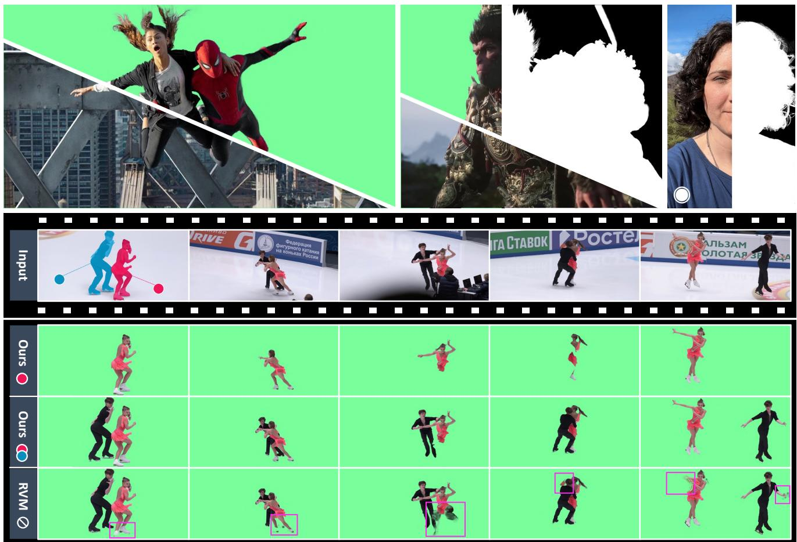  
Figure 1. Our MatAnyone is capable of producing highly detailed and temporally consistent alpha mattes throughout a video. (a) It adapts to a variety of frame sizes and media types (e.g., films, games, smartphone videos), achieving fine-grained details at the image-matting level. (b) RVM [30], an auxiliary-free video matting method, struggles with complex or ambiguous backgrounds. In contrast, our method effectively isolates the target object from such distractors, preserving a clean background and complete foreground parts. (c) Our method also excels at consistently tracking the target (i.e., the lady in pink) even in scenes containing multiple salient objects (i.e., the man and the lady). It accurately distinguishes between them even during their interactions. (Zoom-in for best view)

## Abstract

Auxiliary-free human video matting methods, which rely solely on input frames, often struggle with complex or ambiguous backgrounds. To address this, we propose MatAnyone, a robust framework tailored for target-assigned video matting. Specifically, building on a memory-based paradigm, we introduce a consistent memory propagation

module via region-adaptive memory fusion, which adaptively integrates memory from the previous frame. This ensures semantic stability in core regions while preserving fine-grained details along object boundaries. For robust training, we present a larger, high-quality, and diverse dataset for video matting. Additionally, we incorporate a novel training strategy that efficiently leverages large-scale segmentation data, boosting matting stability. With this new network design, dataset, and training strategy, MatAnyone delivers robust and accurate video matting results in diverse real-world scenarios, outperforming existing methods.

## 1. Introduction

Auxiliary-free human video matting (VM) is widely recognized for its convenience [21, 24, 30], as it only requires input frames without additional annotations. However, its performance often deteriorates in complex or ambiguous backgrounds, especially when similar objects, i.e., other humans, appear in the background (Fig. 2(b)). We consider auxiliary-free video matting to be under-defined, as their results can be uncertain without a clear target object.

In this work, we focus on a problem that is more applicable to real-world video applications: video matting focused on pre-assigned target object(s), with the target segmentation mask provided in the first frame. This enables the model to perform stable matting via consistent object tracking throughout the entire video, while offering better interactivity. The setting is well-studied in Video Object Segmentation (VOS), where it is referred to as “semisupervised” [10, 17, 34]. A common strategy is to use a memory-based paradigm [8, 12, 34, 46], encoding past frames and corresponding segmentation results into memory, from which a new frame retrieves relevant information for its mask prediction. This allows a lightweight network to achieve consistent and accurate tracking of the target object. Inspired by this, we adapt the memory-based paradigm for video matting, leveraging its stability across frames.

Video matting poses additional challenges compared to VOS, as it requires not only accurate semantic detection in core regions but also high-quality detail extraction along the boundary (e.g., hair), as defined in Fig. 2(a). A straightforward approach is to fine-tune matting details using matting data, based on segmentation priors from VOS. Recent ap proaches attempt to achieve both goals, either in a coupled or decoupled manner. For instance, AdaM [28] and FTP-VM [19] refine the memory-based segmentation mask for each frame via a decoder to produce alpha mattes, while MaGGIe [20] devises a separate refiner network to process segmentation masks across all frames from an off-the-shelf VOS model. However, these methods often lead to suboptimal results due to limitations in the available video matting data: (i) the quality of VideoMatte240K [29], the most widely used human video matting dataset, is suboptimal. Its ground-truth alpha mattes exhibit problematic semantic accuracy in core areas (e.g., interior holes) and lack fine details along the boundaries (e.g., blurry hair); (ii) video matting datasets are much smaller in scale compared to VOS datasets; and (iii) video matting data are synthetic due to the extreme difficulty of human annotations, limiting their generalizability to real-world cases [30]. Consequently, finetuning a strong VOS prior for video matting with existing video matting data usually disrupts this prior. While boundary details may show improvement compared to segmentation results, the matting quality in terms of semantic stability in core areas and details in boundary areas remain unsatisfactory, as shown by the results of MaGGIe in Fig. 2(b).

Producing matting-level details while maintaining semantic stability of a memory-based approach is challenging, especially training with suboptimal video matting data. To tackle this, we focus on several key aspects:

Network - we introduce a consistent memory propagation mechanism in the memory space. For each current frame, the alpha value change relative to the previous frame is estimated for every token. This estimation guides the adaptive integration of information from the previous frame. The “large-change” regions rely more on the current frame’s information queried from the memory bank, while “smallchange” regions tend to retain the memory from the previous frame. This region-adaptive memory fusion inherently stabilizes memory propagation throughout the video, improving matting quality with fine details and temporal consistency. Specifically, it encourages the network to focus on boundary regions during training to capture fine details, while “small-change” tokens in the core regions preserve internally complete foreground and clean background (see our results in Fig. 2(b)).

Data - we collect a new training dataset, named VM800, which is twice as large, more diverse, and of higher quality in both core and boundary regions compared to the Video-Matte240K dataset [29], greatly enhancing robust training for video matting. In addition, we introduce a more challenging test dataset, named YoutubeMatte, featuring more diverse foreground videos and improved detail quality. These new datasets offer a solid foundation for robust training and reliable evaluation in video matting.

Training Strategy - the lack of real video matting data remains a significant limitation, affecting both stability and generalizability. We address this problem by leveraging large-scale real segmentation data via a novel training strategy. Unlike common practices [19, 20, 30] that train with segmentation data on a separate prediction head parallel to the matting head, we propose using segmentation data within the same head as matting for more effective supervision. This is achieved by applying region-specific losses – for core regions, we apply a pixel-wise loss to ensure stability and generalization in semantics; for boundary regions, where segmentation data lacks alpha labels, we employ an improved DDC loss [32], scaled to make edges resemble matting rather than segmentation.

In summary, our main contributions are as follows:

• We propose MatAnyone, a practical human video matting framework supporting target assignment, with stable performance in both semantics of core regions and fine-grained boundary details. Target object(s) can be easily assigned using off-the-shelf segmentation methods, and reliable tracking is achieved even in long videos with complex and ambiguous backgrounds.

(b) Issues: MaGGIe  
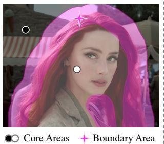  
(a) Definitions for Matting

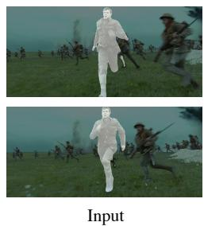

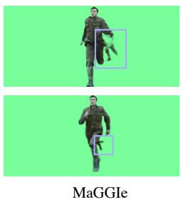  
Segmentation prior broken

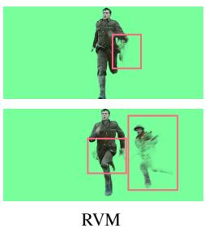

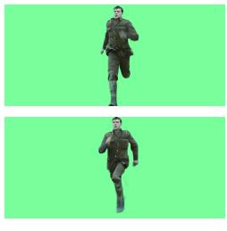  
RVM Confused by ambiguous background  
Figure 2. Definitions and motivations for MatAnyone. (a) In a matting frame, the image can be broadly divided into two areas based on the alpha value: the core (semantic) and the boundary (fine-details). The core includes the background (alpha values of 0) and the solid foreground (alpha values of 1), while the boundary (highlighted in pink) encompasses areas with alpha values between 0 and 1. (b) Due to the under-defined setting, auxiliary-free methods like RVM [30] are easily confused by ambiguous background. Meanwhile, mask-guided methods like MaGGIe [20] tend to break the segmentation prior they aim to leverage, due to the deficiency in video matting data.

• We introduce a consistent memory propagation mechanism via region-adaptive memory fusion, improving stability in core regions and quality in boundary details.

• We contribute larger and higher-quality datasets for training and testing, offering a solid foundation for robust training and reliable evaluation in video matting.

• To overcome the scarcity of real video matting data, we leverage real segmentation data for core-area supervision, largely improving semantic stability over prior methods.

## 2. Related Work

Video Matting. Due to the intrinsic ambiguity in the auxiliary-free setting [21, 24, 30, 35, 51, 56], such tasks generally are object-specific. Among them, human video matting [21, 24, 39, 56] without auxiliary inputs is popular due to its wide applications. Challenging as the auxiliaryfree setting, being in the video domain brings in additional difficulties in temporal coherency. MODNet [21] extends its portrait matting setting to video domain with a flickering reduction trick (non-learning) within a local sequence. RVM [30] steps further to design for videos specifically with ConvGRU [1] as its recurrent architecture. Robust as RVM, it is still easy to be confused by humans in the background. With the success of promptable segmentation [22, 36, 52, 57], obtaining segmentation mask for a target human object only requires minimal human efforts. Recent mask-guided image [3, 26, 49, 50] and video matting [19, 20, 25, 28] thus leverages this convenience for a more robust performance. Adam [28] propagates the first-frame segmentation mask across all frames while FTP-VM [19] propagates the first-frame trimap. Taking the propagated mask as a rough result, their decoder serves for matting details refinement. MaGGIe [20] enjoys a stronger prior by taking the segmentation mask across all frames instead of the first one. Taking all the segmentation masks at a time, the network is able to perform bidirectional temporal fusion for coherency. To mitigate the poor generalizability of synthetic video matting data, a common practice is to simultaneously train with real segmentation data for semantics supervision [19, 28, 30].

Memory-based VOS. Semi-supervised VOS segments the target object with a first-frame annotation across frames [8– 12, 16, 27, 33, 38]. The memory matching paradigm by Space-Time Correspondence Network (STCN) [10] is widely followed by current VOS methods [8, 12, 41, 46], and achieves good performance. We thus take the memorybased paradigm as our framework since it is similar to our setting except that our outputs are alpha mattes.

Video Consistency in Low-level Vision. To enhance temporal consistency across adjacent frames, the recurrent frame fusion [42, 53] and optical flow-guided propagation [4–6, 54] are commonly utilized in the video restoration networks. Recent methods also employ temporal layers such as 3D convolution [2, 43] and temporal attention [2, 7, 44, 55] during training, while other training-free methods resorts to cross-frame attention [45, 48] and flowguided attention [13, 15] in the pretrained models. In this work, we find that the memory-based paradigm is effective enough to maintain video consistency for video matting.

## 3. Methodology

Overview. Achieving matting-level details while preserving the semantic stability of a memory-based approach poses challenges, especially when training with suboptimal video matting data. To tackle this, we propose our MatAnyone, as illustrated in Fig. 3. Similar to semi-supervised VOS, MatAnyone only requires the segmentation mask for the first frame as a target assignment (e.g., the yellow mask in Fig. 3(a)). The alpha matte for the assigned object is then generated frame by frame in a sequential manner. Specifically, for an incoming frame t, it is first encoded into Ft as 16 downsampled feature representation, which is then transformed into key and query for consistent memory propagation (Sec. 3.1), and output the pixel memory readout Pt. We employ the object transformer proposed by Cutie [12] to group the pixel memory by object-level semantics for robustness against noise brought by low-level pixel matching.

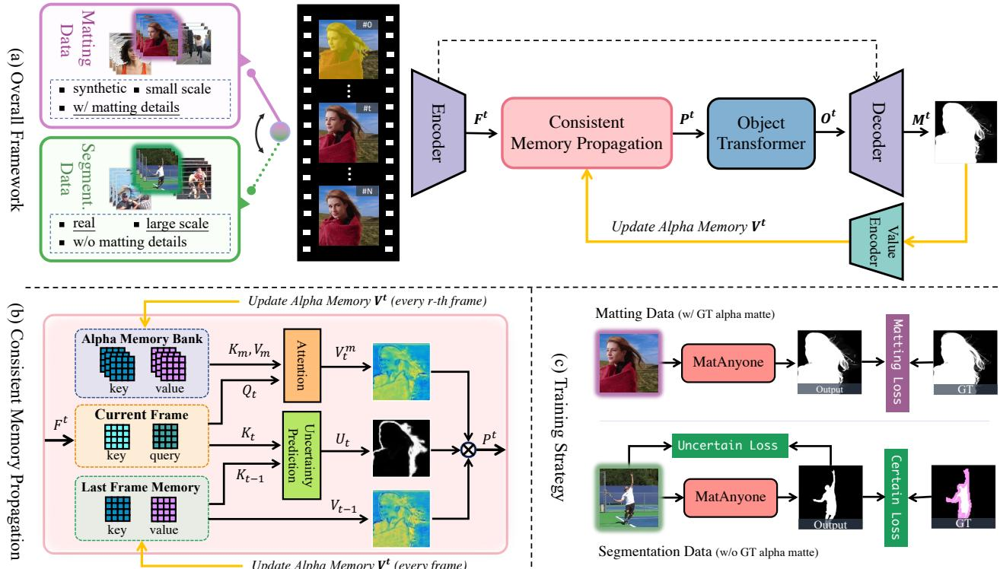  
Figure 3. An overview of MatAnyone. MatAnyone is a memory-based framework for video matting. Given a target segmentation map in the first frame, our model achieves stable and high-quality matting through consistent memory propagation, with a region-adaptive memory fusion module to combine information from the previous and current frame. To overcome the scarcity of real video matting data, we incorporate a new training strategy that effectively leverages matting data for fine-grained matting details and segmentation data for semantic stability, with designed losses separately.

The refined memory readout $O ^ { t }$ acts as the final feature to be sent into the decoder for alpha matte prediction. The predicted alpha matte $M ^ { t }$ is then encoded to memory value $V ^ { t }$ which is used to update the alpha memory bank.

Due to limitations in the quality and quantity of video matting data, training with such data makes it difficult to achieve satisfactory stability in core regions. To mitigate this, RVM [30] proposes a parallel head for real segmentation data alongside the matting head, guiding the network to be robust in real-world cases. However, this is not sufficient, as the matting head itself cannot receive supervision from real data. Inspired by the DDC loss [32] designed for alpha-free image matting, we devise a training strategy for core regions, which provides direct supervision to the matting head with segmentation data (Sec. 3.2), leading to substantial improvements in semantic stability.

We also propose a practical inference strategy that allow for flexible application: a recurrent refinement approach applied to the first frame, based on the memory-driven paradigm, enhancing robustness to the given mask and refining matting details (Sec. 3.3).

## 3.1. Consistent Memory Propagation

Alpha Memory Bank. In this study, we introduce a consistent memory propagation (CMP) module specifically designed for video matting, as illustrated in Fig.3(b). Existing memory-based VM methods store either segmentation masks [28] or trimaps [19] in memory and use a decoder to refine the matting details. Such approaches do not fully leverage the stability provided by the memory paradigm in boundary regions, leading to instability such as flickering. To address this, building on the memory-based framework [10], our MatAnyone stores the alpha matte in an alpha memory bank to enhance stability in boundary regions.

Region-Adaptive Memory Fusion. Given the inherent difference between the segmentation map (values of 0 or 1) and the matting map (values between 0 and 1), the memorymatching approach needs to be adjusted. Specifically, in STCN [10], memory values for the query frame are based on the similarity between query and memory key, assuming equal importance for all query tokens. However, this assumption does not hold for video matting. As shown in Fig. 2(a), a query frame can be divided into core and boundary regions. When compared with frame t 1, only a small fraction of tokens in frame t change significantly in alpha values, with these “large-change” tokens mainly located in object boundaries, while the “small-change” tokens reside in the core regions. This highlights the need to treat core and boundary regions separately to enforce stability.

Specifically, we introduce a boundary-area prediction module to estimate the change probability $U _ { t }$ of each query token for adaptive memory fusion, where higher $U _ { t }$ indicates “large-change” regions and lower $U _ { t }$ indicates “smallchange” regions. The prediction module is lightweight, consisting of three convolution layers. We formulate the prediction as a binary segmentation problem with loss $\mathcal { L } _ { b i n \_ s e g }$ and use the actual alpha change between frame $t - 1$ and t as supervision. Specifically, we define $U _ { t } ^ { G T }$ $| M _ { t - 1 } ^ { G T } - M _ { t } ^ { G T } | \stackrel { . } { > } = \delta .$ , where $\delta$ is a threshold. Using the output of the module $\hat { U } _ { t }$ , we compute the binary cross entropy loss against $U _ { t } ^ { G T }$ . During the region-adaptive memory fusion process, we apply the sigmoid function on $\hat { U } _ { t }$ to transform it as a probability. The final pixel memory readout is a soft merge:

$$
P _ { t } = V _ { t } ^ { m } * U _ { t } + V _ { t - 1 } * ( 1 - U _ { t } ) ,\tag{1}
$$

where $U _ { t } ~ \in ~ [ 0 , 1 ] , ~ V _ { t } ^ { m }$ are current values queried from memory bank, and $V _ { t - 1 }$ are values propagated from the last frame. This approach significantly improves stability in core regions by maintaining internal completeness and a clean background (Fig. 2(b) and Fig. 4). It also enhances stability in boundary regions, as it directs the network to focus on object boundaries with soft alpha values, while the memory-based paradigm inherently stabilizes the matched values (see Table 3(c)). A detailed analysis is provided in the ablation study of Sec. 5.2 and Sec. D.2 (supplementary).

## 3.2. Core-area Supervision via Segmentation

New Training Scheme. Most recent video matting methods follow RVM’s approach of using real segmentation data to address the limitations of video matting data. In these methods, segmentation and matting data are fed to the main shared network, but are directed to produce outputs at separate heads. Although segmentation data do supervise the main network to empower generalizability and robustness to the matting model, the stability they provide falls short of what a VOS model could achieve. As shown in Fig. 2, both RVM and MaGGIe perform significantly worse than the VOS outputs (white masks on inputs) by XMem [8] in core areas, where semantic information is key. We believe the parallel head training scheme may not fully exploit the rich segmentation prior in the data. To address this, we propose to supervise the matting head directly with segmentation data. Specifically, we predict the alpha matte for segmentation inputs and optimize the matting outputs accordingly, as illustrated in Fig. 3(c).

Scaled DDC Loss. A natural challenge arises with the aforementioned approach: how can we compute the loss on matting outputs for segmentation data when there is no ground truth (GT) alpha matte? For core areas, the GT labels are readily available in the segmentation data, where an l1 loss suffices, and we denote it as $\mathcal { L } _ { c o r e }$ . The real difficulty lies in the boundary region. A recent paper proposes DDC loss [32], which supervises boundary areas using the input image without requiring a GT alpha matte.

$$
\begin{array} { r } { \mathcal { L } _ { D D C } = \frac { 1 } { N } \displaystyle \sum _ { i } ^ { N } \sum _ { j } | \alpha _ { i } - \alpha _ { j } - \| I _ { i } - I _ { j } \| _ { 2 } | , } \\ { j \in \mathrm { a r g t o p k } \{ - \| I _ { i } - I _ { j } \| _ { 2 } \} . } \end{array}\tag{2}
$$

However, we find that the underlying assumption of this design, that $\lVert \alpha _ { i } - \alpha _ { j } \rVert _ { 2 } = \lVert \mathbf { I } _ { i } - \mathbf { I } _ { j } \rVert _ { 2 }$ for $\alpha _ { i } ~ > ~ \alpha _ { j }$ , does not always hold true. For two image pixels $\pmb { I } _ { i }$ and $I _ { j }$ , their difference is given by:

$$
\begin{array} { r } { I _ { i } - I _ { j } = [ \alpha _ { i } F _ { i } + ( 1 - \alpha _ { i } ) B _ { i } ] - [ \alpha _ { j } F _ { j } + ( 1 - \alpha _ { j } ) B _ { j } ] , } \end{array}\tag{3}
$$

where $F _ { i } , B _ { i }$ represent the foreground and background values at pixel i, and similarly for $F _ { j }$ and $B _ { j }$ at pixel $j .$ Since we impose the constraint $j \in \mathrm { a r g t o p k } \{ - \| I _ { i } - I _ { j } \| _ { 2 } \}$ , we can assume $F _ { i } = F _ { j } = F , B _ { i } = B _ { j } = B$ within a small window. This simplifies Eq. (3) to:

$$
\begin{array} { r } { I _ { i } - I _ { j } = ( \alpha _ { i } - \alpha _ { j } ) ( F - B ) . } \end{array}\tag{4}
$$

This shows that the assumptions for DDC loss hold only when $| F - B | = 1$ . To account for this, we devise a scaled version as our boundary loss $L _ { b o u n d a r y } \mathrm { : }$

$$
\mathcal { L } _ { b o u n d a r y } = \frac { 1 } { N } \sum _ { i } ^ { N } \sum _ { j } | ( \alpha _ { i } - \alpha _ { j } ) ( \mathbf { F } - \mathbf { B } ) - \| I _ { i } - I _ { j } \| _ { 2 } | ,\tag{5}
$$

where F is approximated by the average of the top k largest pixel values in the small window, and B by the average of the top k smallest pixel values. In the ablation study (Sec. 5.2), we show that training with our scaled DDC loss (Eq. (5)) yields more natural matting results than training with the original version (Eq. (2)), which tends to produce segmentation-like jagged and stair-stepped edges.

## 3.3. Recurrent Refinement During Inference

The first-frame matte is predicted from the given first-frame segmentation mask, and its quality will affect the matte prediction for the subsequent frames. The sequential prediction in the memory-based paradigm enables recurrent refinement during inference. Leveraging this mechanism, we introduce an optional first-frame warm-up module for inference. Specifically, we repeat the first frame n times, treating each repetition as the initial frame, and use only the $n ^ { t h }$ alpha output as the first frame to initialize the alpha memory bank. This (1) enhances robustness against the given segmentation mask and (2) refines matting details in the first frame to achieve image-matting quality (see Fig. 6 and Fig. E in the supplementary).

## 4. Data

We briefly introduce our new training datasets and benchmarks for evaluation, including both synthetic and realworld. More details are provided in the appendix (Sec. C).

Table 1. Quantitative comparisons on different video matting benchmarks from diverse sources. The best and second-best performances are marked in red and orange , respectively. indicates that MaGGIe [20] requires the instance mask as guidance for each frame, while our method only requires it in the first frame.
<table><tr><td rowspan="2">Metrics</td><td colspan="3">Auxiliary-free (AF) Methods</td><td colspan="4">Mask-guided Methods</td></tr><tr><td>MODNet [21]</td><td>RVM [30]</td><td>RVM-Large [30]</td><td>AdaM [28]</td><td>FTP-VM [18]</td><td>MaGGIe† [20]</td><td>Ours</td></tr><tr><td colspan="2">VideoMatte (512 × 288)</td><td></td><td></td><td></td><td></td><td></td><td></td></tr><tr><td>MAD↓</td><td>9.41</td><td>6.08</td><td>5.32</td><td>5.30</td><td>6.13</td><td>5.49</td><td>5.15</td></tr><tr><td>MSE↓</td><td>4.30</td><td>1.47</td><td>0.62</td><td>0.78</td><td>1.31</td><td>0.60</td><td>0.93</td></tr><tr><td>Grad↓</td><td>1.89</td><td>0.88</td><td>0.59</td><td>0.72</td><td>1.14</td><td>0.57</td><td>0.67</td></tr><tr><td>dtSSD↓</td><td>2.23</td><td>1.36</td><td>1.24</td><td>1.33</td><td>1.60</td><td>1.39</td><td>1.18</td></tr><tr><td>Conn↓</td><td>0.81</td><td>0.41</td><td>0.30</td><td>0.30</td><td>0.41</td><td>0.31</td><td>0.26</td></tr><tr><td>VideoMatte (1920 × 1080)</td><td colspan="7"></td></tr><tr><td>MAD↓</td><td>11.13</td><td>6.57</td><td>5.81</td><td>4.42</td><td>8.00</td><td>4.42</td><td>4.24</td></tr><tr><td>MSE↓</td><td>5.54</td><td>1.93</td><td>0.97</td><td>0.39</td><td>3.24</td><td>0.40</td><td>0.33</td></tr><tr><td>Grad.↓</td><td>15.30</td><td>10.55</td><td>9.65</td><td>5.12</td><td>23.75</td><td>4.03</td><td>4.00</td></tr><tr><td>dtSSD↓</td><td>3.08</td><td>1.90</td><td>1.78</td><td>1.39</td><td>2.37</td><td>1.31</td><td>1.19</td></tr><tr><td colspan="3">YoutubeMatte (512 × 288)</td><td></td><td></td><td></td><td></td><td></td></tr><tr><td>MAD↓</td><td>19.37</td><td>4.08</td><td>3.36</td><td></td><td>3.08</td><td>3.54</td><td>2.72</td></tr><tr><td>MSE↓</td><td>16.21</td><td>1.97</td><td>1.04</td><td></td><td>1.29</td><td>1.23</td><td>1.01</td></tr><tr><td>Grad↓</td><td>2.05</td><td>1.34</td><td>1.03</td><td></td><td>1.16</td><td>1.10</td><td>0.97</td></tr><tr><td>dtSSD↓</td><td>2.79</td><td>1.81</td><td>1.62</td><td></td><td>1.83</td><td>1.88</td><td>1.60</td></tr><tr><td>Conn↓</td><td>2.68</td><td>0.60</td><td>0.50</td><td></td><td>0.41</td><td>0.49</td><td>0.39</td></tr><tr><td colspan="3">YoutubeMatte (1920 × 1080)</td><td></td><td></td><td></td><td></td><td></td></tr><tr><td>MAD↓</td><td>15.29</td><td>4.37</td><td>3.58</td><td></td><td>6.49</td><td>2.37</td><td>1.99</td></tr><tr><td>MSE↓</td><td>12.68</td><td>2.25</td><td>1.23</td><td></td><td>4.58</td><td>0.98</td><td>0.71</td></tr><tr><td>Grad↓</td><td>8.42</td><td>15.1</td><td>12.97</td><td></td><td>29.78</td><td>7.69</td><td>8.91</td></tr><tr><td>dtSSD↓</td><td>2.74</td><td>2.28</td><td>2.04</td><td></td><td>2.41</td><td>1.77</td><td>1.65</td></tr></table>

## 4.1. Training Datasets

To address limitations in video matting datasets in both quality and quantity, we collect abundant green screen videos, process them with Adobe After Effects, and conduct manual selection to remove common artifacts also found in VideoMatte240K [29] (see Fig. A). Compared to Video-Matte240K, our dataset, VM800, is (1) twice as large, (2) more diverse in terms of hairstyles, outfits, and motion, and (3) higher in quality. Ablation studies (Table 3(b) and Sec. D.1) further demonstrate the advantages of our dataset.

## 4.2. Synthetic Benchmark

The standard benchmark, VideoMatte [29], derived from VideoMatte240K, includes only 5 unique foreground videos, which is under representative. Additionally, their foregrounds lack sufficient boundary details, limiting their ability to discern matting precision in boundary regions. To create a more comprehensive benchmark, we compile 32 distinct 1920 1080 green-screen foreground videos from YouTube, and process them similarly to our training dataset. Our benchmark, YouTubeMatte, provides enhanced detail representation, as reflected by higher Grad [37] values.

## 4.3. Real-world Benchmark and Metric

Real-world benchmarks are essential to facilitate the practical use of video matting models. Although real-world videos lack ground truth (GT) alpha mattes, we can generate frame-wise segmentation masks as GT for core areas benefiting from the high capability of existing VOS methods. Specifically, we select a subset of 25 real-world videos [30] (100 frames each) with high-quality core GT masks verified manually. MAD, MSE, and dtSSD [14] are then calculated at the core region as core region metrics, representing semantic stability that is critical for visual perception.

## 5. Experiments

Training Schedule. Stage 1. Following the practice of RVM [30], we start by training the entire model on our VM800 for 80k iterations. The sequence length is initially set to 3 and extended to 8 with increasing sampling intervals for more complex scenarios. Stage 2. As the key stage, we apply the core supervision training strategy introduced in Section 3.2. Real segmentation data COCO [31], SPD [40] and YouTubeVIS [47] are added for supervising the matting head. The loss function applied are specified in Section 3.2. Stage 3. Finally, we fine-tune the model with image matting data D646 [35] and AIM [23] for finer matting details.

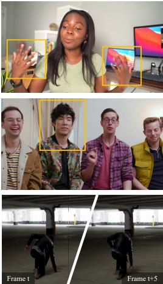  
Video Frame

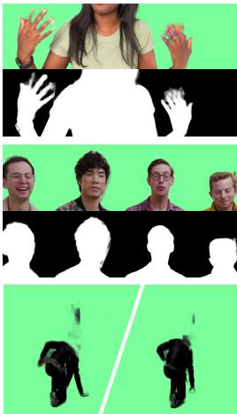  
RVM

  
FTP-VM

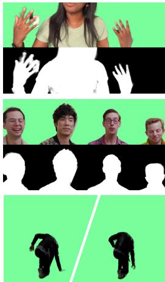  
MaGGIe

  
Ours

Figure 4. Qualitative comparisons on real-world videos. Our MatAnyone significantly outperforms existing auxiliary-free (RVM [30]) and mask-guided (FTP-VM [19] and MaGGIe [20]) approaches in both detail extraction and semantic accuracy. For the lowest row, while other methods all miss out on important body parts (i.e., head) and mistakenly take background pixels as foreground (due to similar colors), thus generating messy outputs, our method presents an accurate and visually clean output by even identifying the shadow near the boundary.

## 5.1. Comparisons

We compare MatAnyone with several state-of-the-art methods, including auxiliary-free (AF) methods: MODNet [21], RVM [30], and RVM-Large [30], and mask-guided methods: AdaM [28], FTP-VM [19], and MaGGIe [20].

Table 2. Quantitative comparisons on real-world benchmark [30]. The best and second performances are marked in red and orange , respectively.
<table><tr><td>Methods</td><td>MAD↓</td><td>MSE↓</td><td>dtSSD↓</td></tr><tr><td colspan="4">Auxiliary-free</td></tr><tr><td>MODNet [21]</td><td>11.67</td><td>10.12</td><td>3.37</td></tr><tr><td>RVM [30]</td><td>1.21</td><td>0.77</td><td>1.43</td></tr><tr><td>RVM-Large [30]</td><td>0.95</td><td>0.50</td><td>1.30</td></tr><tr><td colspan="4">Mask-guided</td></tr><tr><td>FTP-VM [19]</td><td>4.77</td><td>4.11</td><td>1.68</td></tr><tr><td>MaGGIe [20]</td><td>1.94</td><td>1.53</td><td>1.63</td></tr><tr><td>MatAnyone (Ours)</td><td>0.14</td><td>0.10</td><td>0.89</td></tr></table>

## 5.1.1 Quantitative Evaluations

Synthetic Benchmarks. For a comprehensive evaluation on synthetic benchmarks, we employ MAD (mean absolute difference) and MSE (mean squared error) for semantic accuracy, Grad (spatial gradient) [37] for detail extraction, Conn (connectivity) [37] for perceptual quality, and dtSSD [14] for temporal coherence. In Table 1, our method achieves the best MAD and dtSSD across all datasets at both high and low resolutions, demonstrating exceptional spatial accuracy for alpha mattes and remarkable temporal stability. Apart from accuracy and stability, our method achieves the best Conn on both benchmarks, indicating its superior visual quality (Fig. 4 and Sec. D.5 in the appendix).

Real Benchmark. For evaluation on real benchmarks, we use the core region metrics in Section 4.3. In Table 2, our method demonstrates superior generalizability on real cases, achieving the best metric values with a substantial margin over both auxiliary-free and mask-guided methods.

Table 3. Ablation study of the new training dataset (New Data), consistent memory propagation module (CMP), and new training scheme (New Training) on real benchmark (about 1080p).
<table><tr><td>Exp.</td><td>New Data</td><td>CMP</td><td>New Training</td><td>MAD↓</td><td>MSE↓</td><td>dtSSD↓</td></tr><tr><td>(a)</td><td></td><td></td><td></td><td>3.16</td><td>2.65</td><td>1.37</td></tr><tr><td>(b)</td><td>√</td><td></td><td></td><td>2.55</td><td>2.25</td><td>1.36</td></tr><tr><td>(c)</td><td>√</td><td>√</td><td></td><td>1.85</td><td>1.67</td><td>1.25</td></tr><tr><td>(d)</td><td>√</td><td>√</td><td>√</td><td>0.42</td><td>0.34</td><td>0.94</td></tr></table>

## 5.1.2 Qualitative Evaluations

Visual results on real-world videos are in Fig. 4 and Fig. 5. General Video Matting. MatAnyone outperforms existing auxiliary-free and mask-guided approaches in both detail extraction (boundary) and semantic accuracy (core). Fig. 4 shows that MatAnyone excels at fine-grained details (e.g., hair in the middle row) and differentiates full human body against complicated or ambiguous backgrounds when foreground and background colors are similar (e.g., last row).

Instance Video Matting. The assignment of target object at the first frame gives us flexibility for instance video matting. In Fig. 5, although MaGGIe [20] benefits from using instance masks as guidance for each frame, our method demonstrates superior performance in instance video matting, particularly in maintaining object tracking stability and preserving fine-grained details of alpha mattes.

## 5.2. Ablation Study

Enhancement from New Training Data. In Table 3, by comparing (a) and (b), it is observed that training with new data noticeably improves the semantic performance

!! = 1

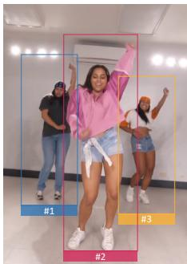  
Video Frame

  
Instance #1

  
Instance #2

  
Instance #3

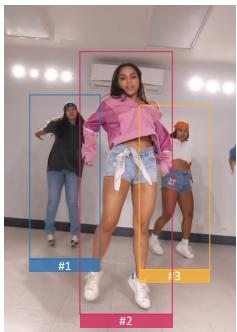  
Video Frame

  
Instance #1

  
Instance #2

  
Instance #3

Figure 5. Quantitative comparisons with MaGGIe [20] on instance video matting. Despite MaGGIe using instance mask as guidance for each frame, our method shows better performance, achieving better stability in object tracking and finer alpha matte details.  
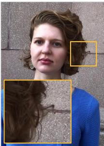  
Video Frame

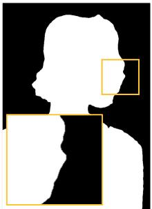  
Segmentation Mask

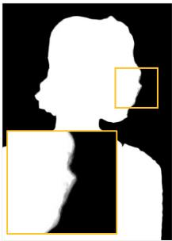

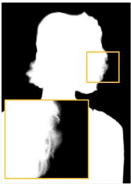

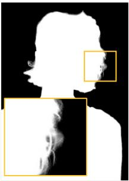  
!! = 5

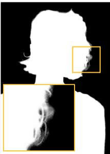  
Figure 6. Improvement with Recurrent refinement. (Zoom-in for best view)  
!! = 10

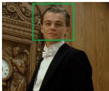

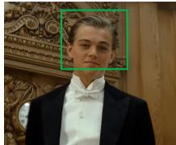  
Video Frames

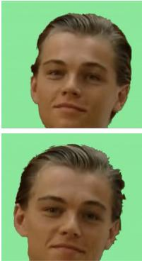  
DDC Loss

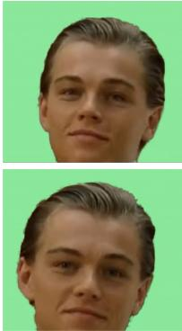  
Scaled DDC loss

Figure 7. Comparison of matting results training with original DDC loss [32] and with scaled DDC loss, where the latter gives more stable and natural matting results.

with decreased MAD and MSE, showing that our newlycollected VM800 indeed contributes to robust training with its upgraded quantity, quality, and diversity.

improvement in all metrics. It already outperforms all the other methods in Table 2 without further fine-tuning.

Scaled DDC Loss. We examine the merit of the scaled version of DDC loss by training with $\mathcal { L } _ { c o r e }$ and Lboundary only to maximize its effect. In Fig. 7, training with vanilla DDC loss produces segmentation-like jaggedness, especially among the boundary region. Our scaled DDC loss yields more stable and natural matting results.

Effectiveness of Recurrent Refinement. Fig. 6 shows the effectiveness of recurrent refinement in a progressive manner. Given a rough segmentation mask, our method can produce alpha matte with descent details within 10 iterations.

Effectiveness of Consistent Memory Propagation. We further investigate the effectiveness of the consistent memory propagation (CMP) module. From Table 3 (b) to (c), improvement can be seen across all metrics with CMP added, indicating its effectiveness in improving semantic stability and temporal coherency. In particular, dtSSD in (c) is already lower than all the other methods in Table 2, showing the superiority of CMP in terms of temporal consistency.

Effectiveness of New Training Scheme. Our new training scheme brings our model to the next level with a noticeable

## 6. Conclusion

We introduce MatAnyone, a practical framework for targetassigned human video matting that ensures stable and accurate results across diverse real-world scenarios. Our method leverages a region-adaptive memory fusion approach, which combines memory from previous frames to maintain semantic consistency in core areas while preserving fine details along object boundaries. With a new training dataset that is larger, high-quality, and diverse and a novel training strategy that effectively leverages segmentation data, MatAnyone achieves robust and stable matting performance, even with complex backgrounds. These advancements position MatAnyone a practical solution for real-world video matting, also setting a solid foundation for future research in memory-based video processing.

Acknowledgement. This study is supported under the RIE2020 Industry Alignment Fund – Industry Collaboration Projects (IAF-ICP) Funding Initiative, as well as cash and in-kind contribution from the industry partner(s).

## References

[1] Nicolas Ballas, Li Yao, Christopher J Pal, and Aaron Courville. Delving deeper into convolutional networks for learning video representations. In ICLR, 2016. 3

[2] Andreas Blattmann, Robin Rombach, Huan Ling, Tim Dockhorn, Seung Wook Kim, Sanja Fidler, and Karsten Kreis. Align your Latents: High-resolution video synthesis with latent diffusion models. In CVPR, 2023. 3

[3] Huanqia Cai, Fanglei Xue, Lele Xu, and Lili Guo. Trans-Matting: Enhancing transparent objects matting with transformers. In ECCV, 2022. 3

[4] Kelvin C.K. Chan, Xintao Wang, Ke Yu, Chao Dong, and Chen Change Loy. BasicVSR: The search for essential components in video super-resolution and beyond. In CVPR, 2021. 3

[5] Kelvin CK Chan, Shangchen Zhou, Xiangyu Xu, and Chen Change Loy. Improving video super-resolution with enhanced propagation and alignment. In CVPR, 2022.

[6] Kelvin CK Chan, Shangchen Zhou, Xiangyu Xu, and Chen Change Loy. Investigating tradeoffs in real-world video super-resolution. In CVPR, 2022. 3

[7] Haoxin Chen, Menghan Xia, Yingqing He, Yong Zhang, Xiaodong Cun, Shaoshu Yang, Jinbo Xing, Yaofang Liu, Qifeng Chen, Xintao Wang, et al. VideoCrafter1: Open diffusion models for high-quality video generation. arXiv preprint arXiv:2310.19512, 2023. 3

[8] Ho Kei Cheng and Alexander G. Schwing. XMem: Longterm video object segmentation with an atkinson-shiffrin memory model. In ECCV, 2022. 2, 3, 5

[9] Ho Kei Cheng, Yu-Wing Tai, and Chi-Keung Tang. Modular interactive video object segmentation: Interaction-to-mask, propagation and difference-aware fusion. In CVPR, 2021.

[10] Ho Kei Cheng, Yu-Wing Tai, and Chi-Keung Tang. Rethinking space-time networks with improved memory coverage for efficient video object segmentation. In NeurIPs, 2021. 2, 3, 4

[11] Ho Kei Cheng, Seoung Wug Oh, Brian Price, Alexander Schwing, and Joon-Young Lee. Tracking anything with decoupled video segmentation. In ICCV, 2023.

[12] Ho Kei Cheng, Seoung Wug Oh, Brian Price, Joon-Young Lee, and Alexander Schwing. Putting the object back into video object segmentation. In CVPR, 2024. 2, 3

[13] Yuren Cong, Mengmeng Xu, Christian Simon, Shoufa Chen, Jiawei Ren, Yanping Xie, Juan-Manuel Perez-Rua, Bodo Rosenhahn, Tao Xiang, and Sen He. FLATTEN: optical flow-guided attention for consistent text-to-video editing. In ICLR, 2024. 3

[14] Mikhail Erofeev, Yury Gitman, Dmitriy S Vatolin, Alexey Fedorov, and Jue Wang. Perceptually motivated benchmark for video matting. In BMVC, 2015. 6, 7

[15] Michal Geyer, Omer Bar-Tal, Shai Bagon, and Tali Dekel. TokenFlow: Consistent diffusion features for consistent video editing. In ICLR, 2024. 3

[16] Li Hu, Peng Zhang, Bang Zhang, Pan Pan, Yinghui Xu, and Rong Jin. Learning position and target consistency for memory-based video object segmentation. In CVPR, 2021. 3

[17] Yuan-Ting Hu, Jia-Bin Huang, and Alexander Schwing. MaskRNN: Instance level video object segmentation. In NeurIPS, 2017. 2

[18] Wei-Lun Huang and Ming-Sui Lee. End-to-end video mat ting with trimap propagation. In CVPR, 2023. 6

[19] Wei-Lun Huang and Ming-Sui Lee. End-to-end video mat ting with trimap propagation. In CVPR, 2023. 2, 3, 4, 7

[20] Chuong Huynh, Seoung Wug Oh, , Abhinav Shrivastava, and Joon-Young Lee. MaGGIe: Masked guided gradual human instance matting. In CVPR, 2024. 2, 3, 6, 7, 8

[21] Zhanghan Ke, Jiayu Sun, Kaican Li, Qiong Yan, and Ryn son W.H. Lau. MODNet: Real-time trimap-free portrait matting via objective decomposition. In AAAI, 2022. 2, 3, 6, 7

[22] Alexander Kirillov, Eric Mintun, Nikhila Ravi, Hanzi Mao, Chloe Rolland, Laura Gustafson, Tete Xiao, Spencer White head, Alexander C Berg, Wan-Yen Lo, et al. Segment anything. In ICCV, 2023. 3

[23] Jizhizi Li, Jing Zhang, and Dacheng Tao. Deep automatic natural image matting. In IJCAI, 2021. 6

[24] Jiachen Li, Vidit Goel, Marianna Ohanyan, Shant Navasardyan, Yunchao Wei, and Humphrey Shi. VMFormer: End-to-end video matting with transformer. In WACV, 2024. 2, 3

[25] Jiachen Li, Roberto Henschel, Vidit Goel, Marianna Ohanyan, Shant Navasardyan, and Humphrey Shi. Video instance matting. In WACV, 2024. 3

[26] Jiachen Li, Jitesh Jain, and Humphrey Shi. Matting Anything. In CVPR, 2024. 3

[27] Xiangtai Li, Haobo Yuan, Wenwei Zhang, Guangliang Cheng, Jiangmiao Pang, and Chen Change Loy. Tube-link: A flexible cross tube framework for universal video segmentation. In ICCV, 2023. 3

[28] Chung-Ching Lin, Jiang Wang, Kun Luo, Kevin Lin, Linjie Li, Lijuan Wang, and Zicheng Liu. Adaptive human matting for dynamic videos. In CVPR, 2023. 2, 3, 4, 6, 7

[29] Shanchuan Lin, Andrey Ryabtsev, Soumyadip Sengupta, Brian L Curless, Steven M Seitz, and Ira Kemelmacher-Shlizerman. Real-time high-resolution background matting. In CVPR, 2021. 2, 6

[30] Shanchuan Lin, Linjie Yang, Imran Saleemi, and Soumyadip Sengupta. Robust high-resolution video matting with tempo ral guidance. In WACV, 2022. 1, 2, 3, 4, 6, 7

[31] Tsung-Yi Lin, Michael Maire, Serge Belongie, James Hays, Pietro Perona, Deva Ramanan, Piotr Dollar, and C Lawrence´ Zitnick. Microsoft coco: Common objects in context. In ECCV, 2014. 6

[32] Wenze Liu, Zixuan Ye, Hao Lu, Zhiguo Cao, and Xiangyu Yue. Training matting models without alpha labels. arXiv preprint arXiv:2408.10539, 2024. 2, 4, 5, 8

[33] Seoung Wug Oh, Joon-Young Lee, Ning Xu, and Seon Joo Kim. Video object segmentation using space-time memory networks. In ICCV, 2019. 3

[34] Seoung Wug Oh, Joon-Young Lee, Ning Xu, and Seon Joo Kim. Video object segmentation using space-time memory networks. In ICCV, 2019. 2

[35] Yu Qiao, Yuhao Liu, Xin Yang, Dongsheng Zhou, Mingliang Xu, Qiang Zhang, and Xiaopeng Wei. Attention-guided hierarchical structure aggregation for image matting. In CVPR, 2020. 3, 6

[36] Nikhila Ravi, Valentin Gabeur, Yuan-Ting Hu, Ronghang Hu, Chaitanya Ryali, Tengyu Ma, Haitham Khedr, Roman Radle, Chloe Rolland, Laura Gustafson, Eric Mintun, Junt-¨ ing Pan, Kalyan Vasudev Alwala, Nicolas Carion, Chao-Yuan Wu, Ross Girshick, Piotr Dollar, and Christoph Feicht-´ enhofer. SAM 2: Segment anything in images and videos. arXiv preprint arXiv:2408.00714, 2024. 3

[37] Christoph Rhemann, Carsten Rother, Jue Wang, Margrit Gelautz, Pushmeet Kohli, and Pamela Rott. A perceptually motivated online benchmark for image matting. In CVPR, 2009. 6, 7

[38] Hongje Seong, Junhyuk Hyun, and Euntai Kim. Kernelized memory network for video object segmentation. In ECCV, 2020. 3

[39] Xiaoyong Shen, Xin Tao, Hongyun Gao, Chao Zhou, and Jiaya Jia. Deep automatic portrait matting. In ECCV, 2016. 3

[40] Pavel Tokmakov, Karteek Alahari, and Cordelia Schmid. Learning video object segmentation with visual memory. In ICCV, 2017. 6

[41] Haochen Wang, Xiaolong Jiang, Haibing Ren, Yao Hu, and Song Bai. Swiftnet: Real-time video object segmentation. In CVPR, 2021. 3

[42] Xintao Wang, Kelvin C.K. Chan, Ke Yu, Chao Dong, and Chen Change Loy. EDVR: Video restoration with enhanced deformable convolutional networks. In CVPRW, 2019. 3

[43] Xiang Wang, Hangjie Yuan, Shiwei Zhang, Dayou Chen, Jiuniu Wang, Yingya Zhang, Yujun Shen, Deli Zhao, and Jingren Zhou. VideoComposer: Compositional video synthesis with motion controllability. In NeurIPS, 2024. 3

[44] Yaohui Wang, Xinyuan Chen, Xin Ma, Shangchen Zhou, Ziqi Huang, Yi Wang, Ceyuan Yang, Yinan He, Jiashuo Yu, Peiqing Yang, Yuwei Guo, Tianxing Wu, Chenyang Si, Yuming Jiang, Cunjian Chen, Chen Change Loy, Bo Dai, Dahua Lin, Yu Qiao, and Ziwei Liu. LaVie: High-quality video generation with cascaded latent diffusion models. In IJCV, 2024. 3

[45] Jay Zhangjie Wu, Yixiao Ge, Xintao Wang, Stan Weixian Lei, Yuchao Gu, Yufei Shi, Wynne Hsu, Ying Shan, Xiaohu Qie, and Mike Zheng Shou. Tune-A-Video: One-shot tuning of image diffusion models for text-to-video generation. In ICCV, 2023. 3

[46] Haozhe Xie, Hongxun Yao, Shangchen Zhou, Shengping Zhang, and Wenxiu Sun. Efficient regional memory network for video object segmentation. In CVPR, 2021. 2, 3

[47] Linjie Yang, Yuchen Fan, and Ning Xu. Video instance segmentation. In ICCV, 2019. 6

[48] Shuai Yang, Yifan Zhou, Ziwei Liu, , and Chen Change Loy. Rerender A Video: Zero-shot text-guided video-tovideo translation. In SIGGRAPH Asia, 2023. 3

[49] Jingfeng Yao, Xinggang Wang, Shusheng Yang, and Baoyuan Wang. ViTMatte: Boosting image matting with pre-trained plain vision transformers. Information Fusion, 2024. 3

[50] Jingfeng Yao, Xinggang Wang, Lang Ye, and Wenyu Liu. Matte Anything: Interactive natural image matting with segment anything model. Image and Vision Computing, page 105067, 2024. 3

[51] Yunke Zhang, Lixue Gong, Lubin Fan, Peiran Ren, Qixing Huang, Hujun Bao, and Weiwei Xu. A late fusion cnn for digital matting. In CVPR, 2019. 3

[52] Chong Zhou, Xiangtai Li, Chen Change Loy, and Bo Dai. EdgeSAM: Prompt-in-the-loop distillation for on-device de ployment of sam. arXiv preprint, 2023. 3

[53] Shangchen Zhou, Jiawei Zhang, Jinshan Pan, Haozhe Xie, Wangmeng Zuo, and Jimmy Ren. Spatio-temporal filter adaptive network for video deblurring. In ICCV, 2019. 3

[54] Shangchen Zhou, Chongyi Li, Kelvin C. K. Chan, and Chen Change Loy. ProPainter: Improving propagation and transformer for video inpainting. In ICCV, 2023. 3

[55] Shangchen Zhou, Peiqing Yang, Jianyi Wang, Yihang Luo, and Chen Change Loy. Upscale-A-Video: Temporal consistent diffusion model for real-world video super resolution. In CVPR, 2024. 3

[56] Bingke Zhu, Yingying Chen, Jinqiao Wang, Si Liu, Bo Zhang, and Ming Tang. Fast deep matting for portrait ani mation on mobile phone. In ACMMM, 2017. 3

[57] Xueyan Zou, Jianwei Yang, Hao Zhang, Feng Li, Linjie Li, Jianfeng Wang, Lijuan Wang, Jianfeng Gao, and Yong Jae Lee. Segment everything everywhere all at once. In NeurIPS, 2024. 3