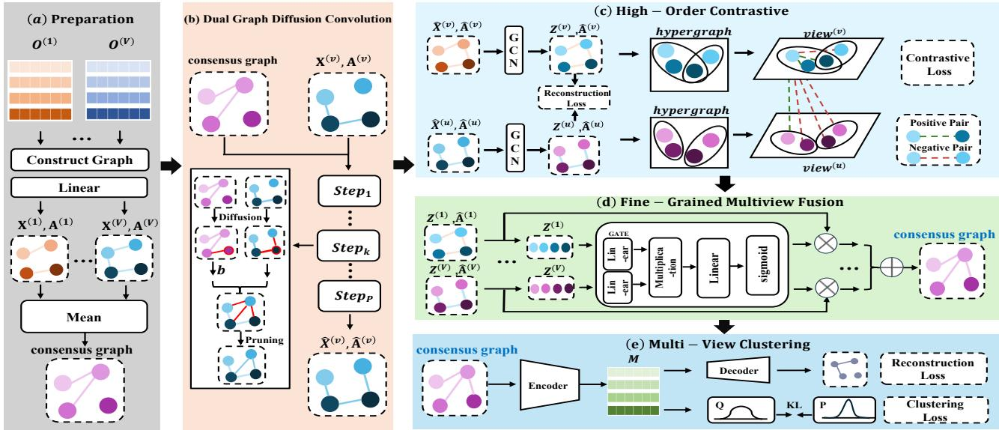
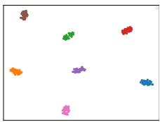
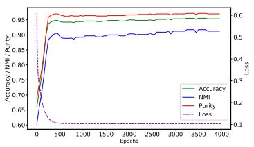
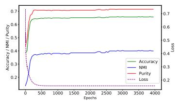
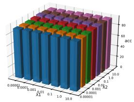
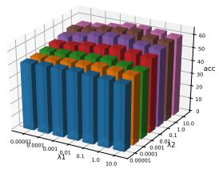
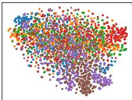
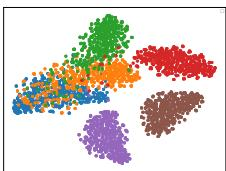
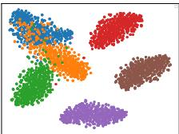

# Medusa: A Multi-Scale High-order Contrastive Dual-Diffusion Approach for Multi-View Clustering

Liang Chen1, Zhe Xue1\*, Yawen Li1, Meiyu Liang1, Yan Wang2, Anton van den Hengel3, Yuankai Qi2\*   
1Beijing University of Posts and Telecommunications, China 2Macquarie University, Australia 3The University of Adelaide, Australia

{bycl, xuezhe, meiyu1210}@bupt.edu.cn, warmly0716@126.com {yan.wang,yuankai.qi}@mq.edu.au, anton.vandenhengel@adelaide.edu.au

## Abstract

Deep multi-view clustering methods utilize information from multiple views to achieve enhanced clustering results and have gained increasing popularity in recent years. Most existing methods typically focus on either inter-view or intra-view relationships, aiming to align information across views or analyze structural patterns within individual views. However, they often incorporate inter-view complementary information in a simplistic manner, while overlooking the complex, high-order relationships within multiview data and the interactions among samples, resulting in an incomplete utilization of the rich information available. Instead, we propose a multi-scale approach that exploits all ofthe available information. Wefirst introduce a dual graph diffusion module guided by a consensus graph. This module leverages inter-view information to enhance the representation of both nodes and edges within each view. Secondly, we propose a novel contrastive loss function based on hypergraphs to more effectively model and leverage complex intra-view data relationships. Finally, we propose to adaptively learn fusion weights at the sample level, which enables a moreflexible and dynamic aggregation ofmulti-view information. Extensive experiments on eight datasets show favorable performance ofthe proposed method compared to state-of-the-art approaches, demonstrating its effectiveness across diverse scenarios.

## 1. Introduction

Multi-view clustering is more complex than its single-view equivalent because it requires leveraging the complementarity and consistency among data that describe the same entity from different perspectives. An example of this could be combining textual descriptions and images that depict the same sports event, enabling a more comprehensive understanding [16, 22].

The feature learning capabilities of deep learning methods have seen them successfully applied to the problem in a variety of forms. Graph neural networks (GNN), for instance, are adept at utilizing relationships between nodes to enhance representations [10, 12]. As a result, multi-view clustering methods based on GNN have garnered widespread attention and demonstrated promising results [11, 25, 34]. Several methods have been applied to refine and optimize the graph structure [8, 19], superseding potential constraints arising from local structures within the original graph, and leveraging global information to achieve a more stable and effective structure. Given the complementary nature of multi-view data, [24, 29] propose to start with constructing a consensus graph, which encapsulates global information and guides the learning process of individual view encoders by providing complementary information from different views.

Despite the progress made, there remain a number of issues with existing methods: 1) Although some existing methods use a consensus graph to enhance inter-view information by adding it to each view, this simple addition may lead to underutilization of the complementary information from the consensus graph and overlook distinctions between views. 2) The commonly used ordinary graph can only model low-order relationships between nodes, limiting its ability to capture complex intra-view relationships. This limitation arises because ordinary graphs cannot capture higher-order connections or multi-node interactions that often characterize intricate structures within each view. 3) Existing methods, when fusing views, assign equal weights to all samples within the same view, failing to consider the varying significance of individual samples. This approach overlooks sample-level differences, leading to suboptimal integration that dilutes important details.

To address the above issues, we propose a Multi-scale high-ordEr contrastive Dual-diffUSion Approach for multiview clustering, named Medusa. Our approach extracts and integrates information at three distinct scales: interview scale, intra-view scale, and sample scale. This multiscale strategy enables Medusa to leverage the diversified graph structures and complementary information available in multi-view data, thereby achieving superior clustering performance. For the inter-view scale, we propose a dual graph diffusion convolution module to enhance each view by incorporating inter-view complementary information through a consensus graph. Recognizing that the importance of this inter-view complementary information varies across different views, we design a weighting mechanism to adaptively learn how much complementary information is taken by different views. For the intra-view scale, we construct hypergraphs within each view and design a contrastive loss to capture richer intra-view relational structures. This approach enables the model to better represent complex relationships within views and provides high-order relational information to improve overall performance. For the sample scale, to capture the distinct characteristics of different samples, we propose a fine-grained multi-view fusion module that learns inter-sample correlations via selfattention. This enables the model to exploit the relationships among all samples, thereby improving fusion results. The main contributions of this paper are as follows:

• We propose a dual graph diffusion convolution module that effectively diffuses inter-view complementary information across multiple views. Our approach goes beyond traditional graph diffusion methods by adaptively propagating and diffusing both graph-structure and nodefeature.

• We propose a high-order contrastive learning module, which distinguishes itself from traditional contrastive learning methods by incorporating intra-view high-order information. This approach aids the model in gaining a more comprehensive understanding of data correlations.

• We introduce a fine-grained multi-view fusion module, which facilitates adaptive fusion weight learning at the sample scale. This approach leads to a marked improvement in fusion quality.

• Extensive experimental results on eight datasets demonstrate the favorable performance compared to several state-of-the-art methods.

## 2. Related Work

Multi-view clustering algorithms typically aim to learn representations for individual views and integrate this information to obtain a unified representation for clustering. Early methods commonly employed traditional machine learning methods [2, 4] to accomplish multi-view clustering tasks. Consequently, a set of subspace-based learning methods [3, 31] emerged, allowing multiple views to jointly learn a low-dimensional mapping by leveraging complementary information. Parallel approaches included methods based on graphs [6, 21, 23, 33] and multi-kernel learning [7, 9, 13]. Their shallow network structures had limited ability to learn more complex information, making further improvements in clustering results challenging.

As in much of machine learning [15], deep learningbased methods have prevailed in multi-view clustering [27]. The introduction of graph structures has aided networks in capturing and exploiting interactions between nodes [5]. As a result, a significant portion of recent work focuses on graph-based deep multi-view clustering. In [24], for example, multiple modules are devised to facilitate the extraction of improved hidden layer representations for each view, culminating in the synthesis of a consensus graph for clustering. Global cross-view feature aggregation was proposed in [29]. This model employs global structural guidance to fine-tune consensus and specific view representations, fostering a more cohesive collaboration between the various modules.

Graph diffusion convolution facilitates information propagation over graph structures. It thus distributes local and global information among the nodes, aiding the model exploit the relationships and structures within the data. Consequently, approaches have been proposed by researchers [19] to unify graphs across views for multi-view data clustering through cross-view graph diffusion learning, yielding promising results on multiple benchmark datasets. Some researchers [14] have integrated multiple views by employing weight learning schemes based on unsupervised graph smoothness and fusion and diffusion strategies, enhancing the final outcome with the incorporation of graph diffusion convolution techniques.

Contrastive learning effectively addresses data heterogeneity, facilitating cross-view sample matching for improved unsupervised embedding representation learning [28]. Consequently, contrastive learning has garnered widespread attention in the field of multi-view analysis. The authors of [30] proposed fusion mechanisms to acquire global cross-view features, followed by the utilization of dual contrastive calibration networks for optimization, demonstrating their efficacy through empirical validation. However, these graph-based deep learning methods have not comprehensively extracted and integrated information from multiple scales, thereby resulting in incomplete features of multi-view data.

  
Figure 1. The main architecture of our method Medusa. The data is preprocessed in module (a) and then sent to module (b) for dual diffusion to obtain complementary information. Subsequently, in module (c), contrastive learning is conducted using high-order informa tion from hypergraph, and module (d) performs fusion of different views. Finally, module (e) completes the clustering.

## 3. Methodology

## 3.1. Framework of Medusa

Overview As shown in Figure 1, our approach contains five key modules: First, the preparation module takes in the initial features of different views. It outputs an initial consensus graph and graphs of different views, which are sent to the dual graph diffusion convolution module, where complementary information is introduced to enhance each view. Then, the high-order contrastive learning module captures high-order information for better representation learning. Next, in the multi-view fine-grained fusion module, a weight matrix is derived based on the sample-level importance and the views are then fused accordingly. Finally, the fused features are clustered in the multi-view clustering module. Below we present details of each module.

## 3.1.1. Preparation Module (PM)

Graph structures are effective in representing the neighborhood relationships within multi-view data. Utilizing graph structures can effectively capture the common attributes between samples, thereby yielding superior clustering results. Given multi-view data with N samples and V views, we establish graph representations for each view. The multi-view data is denoted as $\{ \mathbf { O } ^ { v } \} _ { v = 1 } ^ { V }$ , where $\mathbf { O } ^ { v } \in \mathbb { R } ^ { N \times d _ { v } }$ and $d _ { v }$ denotes the dimension of data of view v. The graph structure matrix of each view is constructed by Euclidean distance and denoted as $\{ \mathbf { A } ^ { v } \} _ { v = 1 } ^ { V }$ , where $\mathbf { A } ^ { v } \in \mathbb { R } ^ { N \times N }$ . Additionally, to simplify subsequent processing and enhance the effectiveness of node representations, linear layers are used to project the features of each view to the same dimension. The obtained feature of the v-th view is denoted as $\mathbf { X } ^ { v } \in \mathbb { R } ^ { N \times d }$ , where d is the feature dimension. Last, we compute a consensus graph ${ \bf G } _ { g } = \{ { \bf H } , { \bf U } \}$ by averaging graphs of all views, where H $\in \mathbb { R } ^ { N \times d }$ and $\check { \mathbf { U } } \in \mathbb { R } ^ { \check { N } \times \check { N } }$ represent the node features and the structural information, respectively.

## 3.1.2. Dual Graph Diffusion Convolution Module (DGDC)

The consensus graph encapsulates the information from all views. Integrating this information into each individual view enhances the representation of each view’s graph. Graph diffusion convolution is an effective method for propagating information. However, existing graph diffusion convolution methods only focus on integrating graph structural (edge) information, neglecting the interaction between node features. Additionally, these methods have not adequately addressed the diversity between views as they use consistent graph diffusion convolutions applied to different views.

We propose a diffusion module that adaptively integrates complementary information of edges and nodes of the consensus graph into individual views:

$$
\hat { \mathbf { A } } ^ { v } = \sum _ { k = 0 } ^ { P } \theta _ { k } ( \mathbf { T } _ { v } ^ { k } + b \mathbf { T } _ { g } ^ { k } )\tag{1}
$$

$$
\hat { \mathbf { X } } ^ { v } = \sum _ { k = 0 } ^ { P } \theta _ { k } ( \mathbf { T } _ { v } ^ { k } \mathbf { X } ^ { v } + b \mathbf { T } _ { g } ^ { k } \mathbf { H } )\tag{2}
$$

where H is the node features of the consensus graph, $P$ denotes the maximum number of diffusion iterations; ${ \bf T } _ { v } \ =$ $\mathbf { D } _ { v } ^ { - 1 } \mathbf { A } ^ { v }$ , where $\mathbf { A } ^ { v }$ is the structural matrix of v-th view and $\mathbf { D } _ { v }$ is its corresponding degree matrix. Similarly, ${ \mathbf { T } } _ { g } \ =$ $\mathbf { D } _ { q } ^ { - 1 } \mathbf { U }$ , where U is the structural matrix of the consensus graph. Therefore, Eq. (1) is used for integrating the structural information, and Eq. (2) for nodes. $\theta _ { k } = \alpha ( 1 - \alpha ) ^ { k }$ is the personalized PageRank coefficient, the value of α lies between 0 and 1.

The following addresses the issue of varying importance of complementary information across different views in the common graph. We introduce a weighting coefficient $b$ to adjust the significance of complementary information in different views. Its specific calculation is as follows:

$$
b = \frac { \| \textbf { U } - \textbf { A } ^ { v } \| _ { F } ^ { 2 } + \| \textbf { H } - \textbf { X } ^ { v } \| _ { F } ^ { 2 } } { 1 + \| \textbf { U } - \textbf { A } ^ { v } \| _ { F } ^ { 2 } + \| \textbf { H } - \textbf { X } ^ { v } \| _ { F } ^ { 2 } } ,\tag{3}
$$

where $\mathbf { X } ^ { v }$ and $\mathbf { A } ^ { v }$ denote the node features and structural information of the v-th view. Through the coefficient b, views that are closer to the common graph receive less guidance from the common graph information, whereas views that are more distant can obtain more guidance. It assesses the diversity of individual views and thereby adjusts the proportion of the influence of the consensus graph during the diffusion process on each specific view graph.

## 3.1.3. High-Order Contrastive Learning Module (HOCL)

Hypergraph, of which one edge can connect multiple vertices, can capture rich relationships and patterns, thus more accurately modeling high-order relationships between samples. We propose a high-order contrastive learning module to help the model utilize high-order information and obtain better data representations. Specifically, the module first employs GCN to enhance node features:

$$
{ \bf Z } ^ { v , l + 1 } = \delta ( { \bf D } ^ { - \frac { 1 } { 2 } } \hat { \bf A } ^ { v } { \bf D } ^ { - \frac { 1 } { 2 } } { \bf Z } ^ { v , l } { \bf W } ^ { l } ) ,\tag{4}
$$

where $\hat { \mathbf { A } } ^ { v }$ is the matrix enhanced by dual-graph diffusion convolution, D is its corresponding degree matrix, l is the index of layers, and the initial ${ \bf Z } ^ { v , 1 }$ is $\hat { \mathbf { X } } ^ { v }$ $\mathbf { W } ^ { l }$ is the the learnable parameter matrix.

Next, we need to construct a hypergraph for each view based on the intra-view information. The hypergraph adjacency matrix for view v is constructed as follows:

$$
\mathbf { B } _ { i j } ^ { v } = \left\{ \begin{array} { l l } { 1 , \rho \le \hat { \mathbf { A } } _ { i j } ^ { v } } \\ { 0 , \rho > \hat { \mathbf { A } } _ { i j } ^ { v } } \end{array} \right.\tag{5}
$$

where $\rho$ denotes a threshold, $\mathbf { B } ^ { v }$ denotes hypergraph adjacency matrix derived from the ordinary graph $\hat { \mathbf { A } } ^ { v }$ , reflecting higher-order information. If $\mathbf { B } _ { i j } ^ { v } = 1$ it indicates that the i-th and j-th samples belong to the same hyperedge. In addition, $\hat { \mathbf { A } } ^ { v }$ is retained as a supplement, allowing the subsequent contrastive learning to capture more comprehensive information. Here, we regard matrix $\hat { \mathbf { A } } ^ { v }$ as the sub-edge weight matrix of $\mathbf { B } ^ { v }$

Then, we use contrastive learning to better harness highorder information. Traditional contrastive learning typically considers only samples of the same instance under different views as positive pairs. However, leveraging hyperedge information enables us to explore more information within the same view effectively. Therefore, we treat samples within the same hyperedge in the same view, as well as instances of the same sample across different views, as positive pairs. Specifically, for samples i and $j$ in v-th, if $\mathbf { B } _ { i j } ^ { v } = 1$ , then i and $j$ are considered a positive pair. Additionally, the same sample observed across different views is also treated as a positive pair. All other sample pairs are regarded as negative pairs. The formula for high-order contrastive learning is as follows:

$$
L ( v , u ) = - \frac { 1 } { N } \sum _ { i = 1 } ^ { N } \log \frac { \mathbf { Z } _ { j } \in N _ { p o s } } { \sum _ { \mathbf { Z } _ { j } \in N _ { n e g } \cup N _ { p o s } } \hat { \mathbf { A } } _ { i j } ^ { v u } e ^ { S ( \mathbf { Z } _ { i } ^ { v } , \mathbf { Z } _ { j } ) } } ,\tag{6}
$$

where $\mathbf { Z } ^ { v } \in \mathbb { R } ^ { N \times m }$ denotes the output of the final layer of GCN of v-th view, N denotes the number of samples, m denotes the dimensionality of the hidden layer. $N _ { p o s }$ is the set of positive samples, $N _ { n e g }$ is the set of negative samples, and $S ( \cdot , \cdot )$ denotes the inner product between samples. $\hat { \mathbf { A } } _ { i j } ^ { v u }$ is a matrix of elements which obtained from the sub-edge weight matrices of the two views, and its calculation formula is as follows:

$$
\hat { \mathbf { A } } _ { i j } ^ { v u } = \varphi ( \frac { \hat { \mathbf { A } } _ { i j } ^ { v } + \hat { \mathbf { A } } _ { i j } ^ { u } } { 2 } ) ,\tag{7}
$$

where $\varphi$ denotes the normalization operation, with its formula being: $\frac { \mathbf { X } _ { m a x } - \mathbf { X } _ { i j } } { \mathbf { X } _ { \operatorname* { m a x } } - \mathbf { X } _ { \operatorname* { m i n } } }$ , Here, $\mathbf { X } _ { i j }$ denotes the input to the normalization, while $\mathbf { \ddot { X } } _ { m a x }$ and $\mathbf { X } _ { m i n }$ respectively denote the maximum and minimum elements within matrix X.

Moreover, to enhance the robustness and generalization ability of the model, we adopt decoders to reconstruct the node feature and graph structures:

$$
\hat { \mathbf { X } } _ { r } ^ { v } = \psi ( \mathbf { Z } ^ { v } )\tag{8}
$$

$$
\hat { \mathbf { A } } _ { r } ^ { v } = \delta ( \mathbf { Z } ^ { v } ( \mathbf { Z } ^ { v } ) ^ { T } )\tag{9}
$$

where $\psi$ denotes MLP, $\hat { \mathbf { X } } _ { r } ^ { v }$ is the reconstructed node feature, $\hat { \mathbf { A } } _ { r } ^ { v }$ is the reconstructed graph structure. δ is the sigmoid activation function.

## 3.1.4. Fine-Grained Multi-View Fusion Module (FGMF)

When fusing multiple views, different weights are often assigned to each whole view, overlooking the different importance of individual samples, leading to a coarse-grained fusion. The attention mechanism allows the model to adaptively learn their importance based on relationships between samples, better capturing important patterns and correlations in the data. This enables a fine-grained consideration of the influence of each sample, which is formulated as

$$
\mathbf { S } ^ { v } = \sum _ { u = 1 , u \neq v } ^ { V } \vartheta ( ( \mathbf { Z } ^ { v } \mathbf { W } ^ { v } ) ( \mathbf { Z } ^ { u } \mathbf { W } ^ { u } ) ^ { T } ; \mathbf { W } _ { g } )\tag{10}
$$

where $\mathbf { Z } ^ { v }$ denotes the output of the final layer of GCN of v-th view, $\mathbf { W } ^ { v } \in \mathbb { R } ^ { m \times m }$ and $\mathbf { W } ^ { u } \in \mathbb { R } ^ { m \times m }$ are learnable parameters. ϑ denotes the gating unit: $\vartheta ( \mathbf { Y } ; \mathbf { W } _ { g } ) = $ $\mathbf { Y } \odot \delta ( \mathbf { Y } \mathbf { W } _ { g } )$ , where Y is the input to the gating unit, $\mathbf { W } _ { g } \in \mathbb { R } ^ { N \times N }$ is learnable parameter matrix. ⊙ denots the Hadamard product. Then, we fuse views as a new consensus graph for subsequent iterations:

$$
\mathbf { H } = \sum _ { v = 1 } ^ { V } \mathbf { S } ^ { v } \mathbf { Z } ^ { v } \mathbf { W } ^ { v * }\tag{11}
$$

$$
\mathbf { U } = \sum _ { v = 1 } ^ { V } \mathbf { S } ^ { v } \hat { \mathbf { A } } ^ { v }\tag{12}
$$

where $\mathbf { W } ^ { v ^ { * } } \in \mathbb { R } ^ { m \times d }$ is the learnable parameters, $\mathbf { S } ^ { v } \in$ $\mathbb { R } ^ { N \times N }$ denotes the fine-grained fusion weight matrix of the v-th view. The fused node representation, designated as H, and the fused structure information, referred to as U, are utilized to update the consensus graph for subsequent iterations.

## 3.1.5. Multi-View Clustering Module (MVC)

A self-trainable clustering layer [26] is adopted to obtain the multi-view clustering results based on the learned node features. An encoder and decoder network is adopted to achieve clustering. The encoder is used to project the consensus graph to obtain the hidden layer representation $\mathbf { M } \in \mathbb { R } ^ { N \times \widecheck { d } _ { u } }$ , where N is the number of samples and $d _ { u }$ is the dimension of the hidden layer. $\mathbf { Q } \in \mathbb { R } ^ { N \times \mathbf { \dot { K } } }$ denotes the the clustering results, and K is the total number of cluster centers. Then M is utilized to derive the clustering results Q:

$$
\mathbf { Q } _ { i j } = \frac { ( 1 + \| \mathbf { M } _ { i } - \pmb { \mu } _ { j } \| ^ { 2 } / \beta ) ^ { - \frac { \beta + 1 } { 2 } } } { \sum _ { k } ( 1 + \| \mathbf { M } _ { i } - \pmb { \mu } _ { k } \| ^ { 2 } / \beta ) ^ { - \frac { \beta + 1 } { 2 } } } ,\tag{13}
$$

where $\mathbf { M } _ { i }$ denotes the sample features from the i-th row of M, and $\mu _ { j } \ \in \ \mathbb { R } ^ { K \times d _ { u } }$ is the randomly initialized j-th cluster centroid. β is the degrees of freedom in the student t-distribution. $\mathbf { Q } _ { i j }$ denotes the similarity between samples and cluster centers. The clustering result for sample i can be obtained by:

$$
c _ { i } = \arg \operatorname* { m a x } _ { j } \mathbf { Q } _ { i j } .\tag{14}
$$

To facilitate unsupervised learning, an auxiliary distribution P is defined to aid in optimizing the clustering centroids. The choice of P has been subject to various discussions. For simplicity, the selection of the auxiliary distribution P is defined as follows:

$$
\mathbf { P } _ { i j } = \frac { \mathbf { Q } _ { i , j } ^ { 2 } / f _ { j } } { \sum _ { k } \mathbf { Q } _ { i , k } ^ { 2 } / f _ { k } }\tag{15}
$$

where $f _ { j } = \textstyle \sum _ { i } \mathbf { Q } _ { i j }$ denotes the frequency of the j-th cluster. Normalizing in this manner prevents biases in the auxiliary distribution due to the presence of larger clusters.

## 3.2. Training of Medusa

The training process of our method consists of two phases: pre-training and fine-tuning. In the pre-training phase, the focus is on optimizing the representation learning of different views using high-order contrastive learning, involving two losses: high-order contrastive learning loss and reconstruction loss. The fine-tuning phase aims to optimize the clustering loss and reconstruction loss within the multi-view clustering module. The following sections will explain each phase and its respective loss functions in detail.

## 3.2.1. Pre-training Phase

In the pre-training phase, the model receives the enhanced results from the dual diffusion module and performs subsequent representation learning. During this process, there are two optimization objectives. The first is the high-order contrastive learning loss using hypergraph information, which is calculated as follows:

$$
L _ { c l } = \sum _ { v = 1 } ^ { V } \sum _ { u = 1 , u \ne v } ^ { V } L ( v , u )\tag{16}
$$

where $L ( v , u )$ is constructed by Eq. (6). The second loss is the reconstruction loss obtained through mean square error:

$$
L _ { r } ( \hat { \mathbf { G } } ^ { v } , \hat { \mathbf { G } } _ { r } ^ { v } ) = \parallel \hat { \mathbf { X } } ^ { v } - \hat { \mathbf { X } } _ { r } ^ { v } \parallel _ { F } ^ { 2 } + \parallel \hat { \mathbf { A } } ^ { v } - \hat { \mathbf { A } } _ { r } ^ { v } \parallel _ { F } ^ { 2 }\tag{17}
$$

where $\hat { \mathbf { G } } ^ { v } = ( \hat { \mathbf { X } } ^ { v } , \hat { \mathbf { A } } ^ { v } )$ denotes the input to the encoder, and $\hat { \mathbf { G } } _ { r } ^ { v } = ( \hat { \mathbf { X } } _ { r } ^ { v } , \hat { \mathbf { A } } _ { r } ^ { v } )$ denotes the output of the decoder. The loss during the pre-training phase is their combination:

$$
L _ { p t } = \lambda _ { 1 } L _ { c l } + \sum _ { v = 1 } ^ { V } L _ { r } ( \hat { \mathbf { G } } ^ { v } , \hat { \mathbf { G } } _ { r } ^ { v } ) .\tag{18}
$$

where $\lambda _ { 1 }$ is a hyperparameter. Through training in the pretraining phase, the model acquires a set of effective parameters, which will be directly used in subsequent parts.

## 3.2.2. Fine-tuning Phase

In the fine-tuning phase, the model loads the weight information from the pre-training phase and shifts the optimization targets to the clustering loss and reconstruction loss within the multi-view clustering module. Specifically, the clustering loss is defined as follows:

$$
L _ { c } ( \mathbf { P } , \mathbf { Q } ) = K L ( \mathbf { P } \parallel \mathbf { Q } ) = \sum _ { i } \sum _ { j } \mathbf { P } _ { i j } \log { \frac { \mathbf { P } _ { i j } } { \mathbf { Q } _ { i j } } }\tag{19}
$$

where Q denotes the predicted distribution, and P is the auxiliary distribution. $\mathbf { P } _ { i j }$ and $\mathbf { Q } _ { i j }$ are elements of the distributions P and Q, respectively. The second loss is the reconstruction loss of the consensus graph, which is constructed similarly to the reconstruction loss in the pre-training phase. The specific formula is shown below:

$$
L _ { r } ( \mathbf { G } ^ { g } , \mathbf { G } _ { r } ^ { g } ) = \parallel \mathbf { H } - \mathbf { H } _ { r } \parallel _ { F } ^ { 2 } + \parallel \mathbf { U } - \mathbf { U } _ { r } \parallel _ { F } ^ { 2 }\tag{20}
$$

where $\mathbf { G } ^ { g } = ( \mathbf { H } , \mathbf { U } )$ denotes consensus graph, and ${ \bf G } _ { r } ^ { g } \mathrm { ~ = ~ }$ $\left( \mathbf { H } _ { r } , \mathbf { U } _ { r } \right)$ denotes the output of the decoder. Therefore, the final loss for this stage is:

$$
L _ { f t } = \lambda _ { 2 } L _ { c } ( \mathbf { P } , \mathbf { Q } ) + L _ { r } ( \mathbf { G } ^ { g } , \mathbf { G } _ { r } ^ { g } )\tag{21}
$$

where $\lambda _ { 2 }$ is a hyperparameter. Its impact, along with the previously mentioned hyperparameter $\lambda _ { 1 } .$ , will be further discussed in subsequent experiments.

## 4. Experiments

## 4.1. Experimental Setup

## 4.1.1. Datasets

We adopt 8 commonly used multi-view clustering datasets to evaluate the performance of the proposed model. The dataset Yale [34] comprises 165 images with 3 views. MSRC-v1 [17] includes 210 images from 7 classes. Citeseer [14] serves as a benchmark dataset for scientific documents with 3,312 samples. SUNRGBD [18] contains 10,335 indoor scene images. Caltech101 contains 9,144 samples with 6 views. Constructing graph structures for large datasets such as NUSWIDEOBJ, YoutubeFace and AWA is resource-intensive. Therefore, a random sampling method was employed to construct the datasets. The detailed information of the dataset is presented in Table 1.

## 4.1.2. Compared methods

To verify the performance of our proposed model, we select 7 state-of-the-art multi-view clustering methods for comparison: DSMVC [20], which use a deep learning-based framework to reduce the risk of performance degradation due to the addition of views. GCFAgg [29], which exploits the complementarity of similar samples and performs structural guided contrastive alignment learning. SCMVC [32], which builds hierarchical feature fusion framework, effectively segregating the consistency objective from the reconstruction objective. MVD [14], which integrates weight learning and graph learning within an alternating optimization framework. DFP-GNN [26], which is a dual fusion propagation graph neural network to capture inter-view information and designs a clustering layer for multi-view clustering. AONGR [34], which integrates spectral clustering and non-negative matrix factorization into a joint clustering framework. GDMVC [1], which integrates both feature information and graph information to better explore the information within the data.

<table><tr><td>Dataset</td><td>Samples</td><td>Views</td><td>Classes</td></tr><tr><td>Yale</td><td>165</td><td>3</td><td>15</td></tr><tr><td>MSRC-v1</td><td>210</td><td>5</td><td>7</td></tr><tr><td>Citeseer</td><td>3312</td><td>2</td><td>6</td></tr><tr><td>NUSWIDEOBJ</td><td>8050</td><td>5</td><td>15</td></tr><tr><td>Caltech</td><td>9144</td><td>6</td><td>101</td></tr><tr><td>YoutubeFace</td><td>10000</td><td>5</td><td>10</td></tr><tr><td>SUNRGBD</td><td>10355</td><td>2</td><td>45</td></tr><tr><td>AWA</td><td>10388</td><td>6</td><td>16</td></tr></table>

Table 1. Summary of eight evaluation datasets

## 4.1.3. Evaluation Metrics

In order to scientifically test the performance of the proposed model and compare it with other multi-view clustering methods. We adopt three widely used evaluation metrics to assess the performance, including clustering Accuracy (ACC), Normalized Mutual Information (NMI), and Purity. Higher values of these metrics denote better performance.

## 4.1.4. Implementation Details

In the comparative experiments, we configure the contrastive methods based on default settings from the literature, adjusting hyperparameters for optimal performance. For our method, the number of neighbors in graph construction is set to 2, and the personalized PageRank coefficient α is set to 0.4. In HOCL, the threshold $\rho$ is the mean of all edge weights. The GCN has 3 stacked layers, which is also applied to the clustering modules. The framework is optimized using RMSprop with a momentum of 0.9. In MVC, the degrees of freedom $\beta$ for the Student’s t-distribution is set to 1. During training, $\lambda _ { 1 }$ and $\lambda _ { 2 }$ control the loss function proportions, with further analysis in subsequent experiments. All methods are repeated ten times, and the averages are used as final results.

## 4.2. Results and Analysis

## 4.2.1. Comparison with SoTA Methods

Table 2 presents the results on eight datasets. It shows that the proposed method achieves the best performance on all evaluation metrics across all datasets, demonstrating its effectiveness and robustness. On the different datasets, our method shows an improvement of 1% ∼ 2% across all three metrics compared to the second-best method. This demonstrates the superiority of the approach proposed in this paper. Specifically, the proposed method involves utilizing dual graph diffusion convolution modules to access more comprehensive complementary information from the consensus graph. Moreover, in the high-order contrastive learning module, the introduction of high-order relational information facilitates the model in learning more discrimina tive representations. Simultaneously, the fine-grained adaptive module Calculating the interrelation of samples through self-attention aids the model in finely acquiring weights for fusion at the sample level. Consequently, Medusa demonstrates a notable improvement when compared to various types of multi-view clustering methods.

<table><tr><td colspan="2">Dataset\Methods</td><td>DSMVC[20]</td><td>GCFAgg[29]</td><td>SCMVC[32]</td><td>MVD[14]</td><td>DFPGNN[26]</td><td>Aongr[34]</td><td>GDMVC[1]</td><td>Medusa</td></tr><tr><td rowspan="4">Citeseer</td><td>ACC(%)</td><td> $\overline { { 6 0 . 7 5 \pm 1 . 2 1 } }$ </td><td> $\overline { { 6 3 . 2 4 \pm 1 . 0 4 } }$ </td><td> $\overline { { 6 2 . 4 8 \pm 1 . 0 5 } }$ </td><td> $\overline { { 6 1 . 7 4 \pm 0 . 4 8 } }$ </td><td>62.03 ± 0.51</td><td> $\overline { { 6 2 . 5 4 \pm 1 . 5 1 } }$ </td><td> $\overline { { 6 3 . 4 1 \pm 1 . 5 2 } }$ </td><td> $\overline { { 6 5 . 3 4 \pm 1 . 2 4 } }$ </td></tr><tr><td>NMI(%)</td><td> $3 5 . 6 1 \pm 0 . 8 6$ </td><td>37.28 ± 1.32</td><td>36.51 ± 1.72</td><td> $3 6 . 2 4 \pm 0 . 2 4$ </td><td>35.84 ± 0.23</td><td> $3 6 . 3 8 \pm 1 . 2 5$ </td><td> $\overline { { 3 7 . 9 6 \pm 1 . 3 5 } }$ </td><td> ${ \bf 3 8 . 7 4 \pm 1 . 4 3 }$ </td></tr><tr><td>Purity(%)</td><td> $6 5 . 2 9 \pm 0 . 3 1$ </td><td>69.89 ± 1.32</td><td> $6 8 . 3 4 \pm 1 . 6 1$ </td><td> $6 5 . 3 1 \pm 0 . 4 1$ </td><td> $6 7 . 8 4 \pm 0 . 7 6$ </td><td> $6 9 . 2 7 \pm 1 . 3 1$ </td><td> $\overline { { 6 9 . 9 4 \pm 1 . 6 3 } }$ </td><td> ${ \bf 7 1 . 4 5 \pm 1 . 5 8 }$ </td></tr><tr><td>ACC(%)</td><td> $\overline { { 9 1 . 0 2 \pm 0 . 1 3 } }$ </td><td> $\overline { { 9 1 . 4 7 \pm 0 . 3 5 } }$ </td><td> $\overline { { 9 1 . 8 5 \pm 0 . 6 4 } }$ </td><td> $\overline { { 9 0 . 4 6 \pm 0 . 2 3 } }$ </td><td> $\overline { { 9 2 . 1 7 \pm 0 . 8 6 } }$ </td><td> $\overline { { 9 2 . 7 6 \pm 0 . 5 1 } }$ </td><td> $\overline { { 9 3 . 2 1 \pm 0 . 4 6 } }$ </td><td> $\overline { { { \bf 9 4 . 2 6 \pm 0 . 6 4 } } }$ </td></tr><tr><td rowspan="3">MSRC-v1</td><td>NMI(%)</td><td> $8 4 . 7 8 \pm 0 . 0 5$ </td><td> $8 5 . 1 2 \pm 0 . 8 6$ </td><td> $8 5 . 0 1 \pm 0 . 5 3$ </td><td> $8 2 . 6 4 \pm 0 . 3 1$ </td><td>83.96 ± 0.32</td><td> $8 8 . 0 7 \pm 0 . 4 2$ </td><td> $\overline { { 8 6 . 3 4 \pm 0 . 5 8 } }$ </td><td> ${ \bf 8 9 . 3 1 \pm 0 . 7 2 }$ </td></tr><tr><td>Purity(%)</td><td> $9 2 . 6 7 \pm 0 . 2 3$ </td><td> $9 1 . 6 8 \pm 0 . 3 4$ </td><td> $9 0 . 4 7 \pm 0 . 8 7$ </td><td> $8 7 . 5 6 \pm 0 . 1 2$ </td><td>92.72 ± 0.79</td><td> $9 3 . 6 2 \pm 0 . 7 0$ </td><td> $9 2 . 5 8 \pm 0 . 7 1$ </td><td> ${ \bf 9 5 . 2 4 \pm 0 . 5 6 }$ </td></tr><tr><td>ACC(%)</td><td> $\overline { { 6 6 . 7 4 \pm 0 . 3 4 } }$ </td><td>71.15 ± 0.21</td><td> $\overline { { 7 5 . 6 2 \pm 0 . 7 5 } }$ </td><td> $7 6 . 0 6 \pm 0 . 1 7$ </td><td>67.32 ± 0.38</td><td> $7 6 . 1 3 \pm 0 . 4 8$ </td><td> $7 6 . 4 5 \pm 0 . 8 6$ </td><td>78.84 ± 0.61</td></tr><tr><td rowspan="3">Yale</td><td>NMI(%)</td><td> $6 8 . 1 2 \pm 0 . 5 6$ </td><td>64.32 ± 0.65</td><td> $7 4 . 1 5 \pm 0 . 6 2$ </td><td> $7 5 . 7 2 \pm 0 . 2 3$ </td><td>70.68 ± 0.51</td><td> $7 5 . 9 7 \pm 0 . 4 1$ </td><td> $\overline { { 7 5 . 8 4 \pm 0 . 7 4 } }$ </td><td> ${ \bf 7 8 . 4 1 \pm 0 . 5 3 }$ </td></tr><tr><td>Purity(%)</td><td> $7 1 . 3 4 \pm 1 . 3 8$ </td><td>74.02 ± 0.81</td><td> $7 5 . 3 4 \pm 0 . 8 2$ </td><td> $7 6 . 7 3 \pm 0 . 4 5$ </td><td>71.23 ± 0.58</td><td> $7 7 . 5 1 \pm 0 . 5 2$ </td><td>71.24 ± 1.07</td><td>78.89 ± 0.69</td></tr><tr><td>ACC(%)</td><td> $\overline { { 3 2 . 1 6 \pm 2 . 8 6 } }$ </td><td>37.48 ± 1.37</td><td> $\overline { { 3 6 . 4 4 \pm 1 . 7 4 } }$ </td><td> $\overline { { 3 7 . 8 4 \pm 1 . 4 1 } }$ </td><td>37.46 ± 2.44</td><td> $\overline { { 3 1 . 7 2 \pm 1 . 7 8 } }$ </td><td> $3 7 . 9 6 \pm 2 . 0 4$ </td><td> $\mathbf { 3 9 . 2 5 \pm 1 . 6 5 }$ </td></tr><tr><td rowspan="3">YoutubeFace</td><td>NMI(%)</td><td> $2 3 . 1 4 \pm 3 . 4 1$ </td><td> $2 4 . 1 5 \pm 1 . 2 9$ </td><td> $2 4 . 8 1 \pm 1 . 4 4$ </td><td> $2 4 . 7 3 \pm 1 . 1 7$ </td><td>25.87 ± 1.39</td><td> $2 3 . 4 1 \pm 1 . 5 4$ </td><td>25.41 ± 1.63</td><td> ${ \bf 2 6 . 4 7 \pm 1 . 2 1 }$ </td></tr><tr><td>Purity(%)</td><td> $4 1 . 2 1 \pm 2 . 2 4$ </td><td>44.83 ± 2.38</td><td> $4 4 . 8 9 \pm 1 . 9 2$ </td><td> $4 5 . 1 2 \pm 2 . 0 2$ </td><td>46.85 ± 1.65</td><td> $4 0 . 3 7 \pm 1 . 3 8$ </td><td> $4 5 . 3 4 \pm 2 . 1 6$ </td><td> ${ \pm 9 . 2 3 \pm 1 . 8 6 }$ </td></tr><tr><td>ACC(%)</td><td> $\overline { { 1 2 . 9 3 \pm 1 . 9 4 } }$ </td><td> $\overline { { 2 3 . 9 4 \pm 1 . 1 4 } }$ </td><td> $\overline { { 3 2 . 8 4 \pm 2 . 0 1 } }$ </td><td> $\overline { { 3 3 . 5 5 \pm 0 . 8 1 } }$ </td><td> $\overline { { 3 3 . 5 6 \pm 1 . 7 2 } }$ </td><td> $\overline { { 2 1 . 1 9 \pm 0 . 9 2 } }$ </td><td> $\overline { { 3 3 . 6 2 \pm 1 . 6 5 } }$ </td><td></td></tr><tr><td rowspan="3">AWA</td><td></td><td>11.48 ± 2.16</td><td> $1 5 . 8 3 \pm 1 . 3 1$ </td><td> $1 5 . 8 3 \pm 1 . 8 4$ </td><td> $1 6 . 2 2 \pm 0 . 6 3$ </td><td> $1 5 . 1 7 \pm 1 . 9 1$ </td><td> $1 3 . 6 7 \pm 1 . 0 8$ </td><td>17.31 ± 1.58</td><td> $3 5 . 2 4 \pm 1 . 5 4$   ${ \bf 1 8 . 8 4 } \ \pm { \bf 1 . 3 2 }$ </td></tr><tr><td>NMI(%)</td><td> $1 3 . 6 4 \pm 3 . 2 1$ </td><td> $2 5 . 0 2 \pm 2 . 0 4$ </td><td> $3 3 . 2 7 \pm 2 . 7 5$ </td><td> $3 7 . 5 0 \pm 0 . 4 6$ </td><td> $3 8 . 3 8 \pm 1 . 8 7$ </td><td> $3 4 . 5 9 \pm 1 . 1 2$ </td><td> $\overline { { 3 7 . 8 4 \pm 2 . 3 5 } }$ </td><td>41.64 ± 1.86</td></tr><tr><td>Purity(%) ACC(%)</td><td> $\overline { { 2 0 . 3 7 \pm 2 . 5 1 } }$ </td><td> $\overline { { 2 2 . 1 8 \pm 1 . 3 6 } }$ </td><td> $\overline { { 2 1 . 3 7 \pm 2 . 5 2 } }$ </td><td> $\overline { { 2 1 . 4 3 \pm 1 . 3 9 } }$ </td><td></td><td></td><td></td><td></td></tr><tr><td rowspan="3">NUSWIDEOBJ</td><td></td><td> $1 3 . 2 6 \pm 1 . 4 6$ </td><td>15.21 ± 1.09</td><td> $1 4 . 6 4 \pm 1 . 9 6$ </td><td> $1 1 . 9 0 \pm 0 . 7 4$ </td><td> $\overline { { 2 1 . 0 2 \pm 1 . 4 5 } }$ </td><td> $\overline { { 2 4 . 2 3 \pm 1 . 0 7 } }$ </td><td> $\overline { { 2 2 . 1 5 \pm 2 . 2 9 } }$ </td><td> $\overline { { { 2 5 . 8 9 \pm 1 . 8 5 } } }$ </td></tr><tr><td>NMI(%)</td><td></td><td></td><td></td><td></td><td> $1 4 . 1 6 \pm 1 . 3 7$ </td><td> $\overline { { 1 5 . 7 6 \pm 1 . 2 5 } }$ </td><td> $1 4 . 8 7 \pm 1 . 3 2$ </td><td>16.59 ± 1.20</td></tr><tr><td>Purity(%)</td><td> $2 2 . 7 8 \pm 2 . 6 6$ </td><td> $2 4 . 7 1 \pm 1 . 6 3$ </td><td> $2 3 . 7 1 \pm 2 . 4 1$ </td><td> $2 2 . 4 1 \pm 0 . 8 5$ </td><td> $2 3 . 3 6 \pm 1 . 6 1$ </td><td> $\overline { { 2 6 . 9 4 \pm 1 . 2 8 } }$ </td><td> $2 4 . 7 4 \pm 1 . 9 7$ </td><td> ${ \bf 2 8 . 4 1 \pm 1 . 5 3 }$ </td></tr><tr><td rowspan="3">SUNRGBD</td><td>ACC(%)</td><td> $\overline { { 1 8 . 2 7 \pm 1 . 0 4 } }$ </td><td>25.76 ± 0.86</td><td> $\overline { { 2 4 . 8 6 \pm 1 . 5 3 } }$ </td><td> $\overline { { 2 4 . 5 5 \pm 0 . 5 8 } }$ </td><td> $\overline { { 2 4 . 7 5 \pm 1 . 7 6 } }$ </td><td> $\overline { { 2 1 . 8 6 \pm 1 . 1 2 } }$ </td><td> $\overline { { 2 5 . 2 4 \pm 1 . 1 0 } }$ </td><td> $\overline { { 2 7 . 8 1 \pm 1 . 2 8 } }$ </td></tr><tr><td>NMI(%)</td><td> $2 1 . 3 4 \pm 0 . 6 8$ </td><td> $3 3 . 2 4 \pm 0 . 4 7$ </td><td> $3 2 . 1 3 \pm 2 . 4 1$ </td><td> $3 0 . 8 4 \pm 0 . 7 7$ </td><td> $3 1 . 2 5 \pm 1 . 0 3$ </td><td> $2 8 . 2 1 \pm 1 . 0 6$ </td><td> $3 3 . 5 1 \pm 1 . 7 2$ </td><td> ${ \bf 3 4 . 9 2 \pm 1 . 3 6 }$ </td></tr><tr><td>Purity(%)</td><td> $2 7 . 5 1 \pm 0 . 8 4$ </td><td> $4 0 . 6 5 \pm 0 . 6 2$ </td><td> $4 1 . 5 4 \pm 1 . 3 2$ </td><td> $2 5 . 6 5 \pm 0 . 7 2$ </td><td> $4 1 . 2 3 \pm 1 . 8 5$ </td><td> $2 9 . 9 8 \pm 1 . 0 5$ </td><td> $\overline { { 4 1 . 7 1 \pm 0 . 9 4 } }$ </td><td> ${ \bf 4 3 . 2 7 \pm 1 . 1 3 }$ </td></tr><tr><td rowspan="3">Caltech101</td><td>ACC(%)</td><td> $\overline { { 3 0 . 1 5 \pm 1 . 3 4 } }$ </td><td> $\overline { { 3 0 . 4 5 \pm 2 . 1 5 } }$   $4 3 . 3 7 \pm 1 . 7 4$ </td><td> $\overline { { 3 0 . 6 4 \pm 2 . 1 1 } }$ </td><td> $\overline { { 3 1 . 4 2 \pm 1 . 3 7 } }$ </td><td> $\overline { { 3 2 . 0 7 \pm 2 . 3 1 } }$ </td><td> $\overline { { 2 8 . 3 2 \pm 1 . 8 5 } }$ </td><td> $\overline { { 3 2 . 1 4 \pm 1 . 6 6 } }$ </td><td> $\overline { { 3 3 . 2 7 \pm 1 . 3 7 } }$ </td></tr><tr><td>NMI(%)</td><td> $4 1 . 8 5 \pm 2 . 0 8$ </td><td></td><td> $4 1 . 3 7 \pm 2 . 4 1$ </td><td> $5 0 . 2 7 \pm 3 . 1 4$ </td><td> $4 3 . 2 4 \pm 2 . 7 4$ </td><td> $4 8 . 1 0 \pm 2 . 0 3$ </td><td> $\overline { { 4 4 . 3 5 \pm 1 . 5 7 } }$ </td><td> ${ \bf 5 1 . 6 4 \ \pm 1 . 4 2 }$ </td></tr><tr><td>Purity(%)</td><td> $3 2 . 2 4 \pm 1 . 2 4$ </td><td>34.94 ± 2.38</td><td> $3 7 . 8 2 \pm 1 . 8 3$ </td><td> $\overline { { 3 8 . 6 4 \pm 2 . 3 4 } }$ </td><td>36.85 ± 2.03</td><td> $\underline { { 4 7 . 3 1 } } \pm 1 . 9 4$ </td><td> $4 1 . 5 4 \pm 1 . 8 9$ </td><td> ${ \bf 4 9 . 3 7 \pm 1 . 5 7 }$ </td></tr></table>

<table><tr><td>Datasets</td><td colspan="3">Citeseer</td><td colspan="3">MSRC-v1</td><td colspan="3">Yale</td></tr><tr><td></td><td>ACC(%)</td><td>NMI(%)</td><td> $\overline { { \mathrm { P u r i t y } ( \% ) } }$ </td><td>ACC(%)</td><td>NMI(%)</td><td> $\overline { { \mathrm { P u r i t y } ( \% ) } }$ </td><td>ACC(%)</td><td>NMI(%)</td><td>Purity(%)</td></tr><tr><td>DGDC1</td><td> $\overline { { 5 9 . 7 4 \pm 1 . 0 1 } }$ </td><td>34.35 ± 1.60</td><td> $6 5 . 4 8 \pm 1 . 4 2$ </td><td> $\overline { { 9 0 . 6 1 \pm 0 . 5 6 } }$ </td><td> $\overline { { 8 1 . 4 2 \pm 0 . 6 8 } }$ </td><td> $\overline { { 9 1 . 3 7 \pm 0 . 4 9 } }$ </td><td> $\overline { { 7 4 . 1 5 \pm 0 . 5 3 } }$ </td><td> $7 3 . 2 6 \pm 0 . 7 7$ </td><td> $\overline { { 7 4 . 9 8 \pm 0 . 8 1 } }$ </td></tr><tr><td>DGDC2</td><td> $6 1 . 7 9 \pm 0 . 9 6$ </td><td> $3 7 . 5 4 \pm 1 . 5 7$ </td><td> $6 8 . 4 9 \pm 1 . 3 7$ </td><td> $9 2 . 5 4 \pm 1 . 2 3$ </td><td>84.17 ± 0.97</td><td> $9 3 . 4 5 \pm 0 . 9 4$ </td><td> $7 5 . 6 9 \pm 0 . 8 2$ </td><td> $7 4 . 5 1 \pm 0 . 6 7$ </td><td> $7 4 . 8 7 \pm 0 . 8 4$ </td></tr><tr><td>DGDC3</td><td> $6 2 . 5 4 \pm 0 . 8 8$ </td><td> $3 7 . 8 3 \pm 1 . 4 1$ </td><td> $6 8 . 1 3 \pm 1 . 4 1$ </td><td> $9 2 . 8 7 \pm 0 . 9 6$ </td><td> $8 5 . 7 2 \pm 0 . 8 4$ </td><td> $9 4 . 0 5 \pm 0 . 8 1$ </td><td> $7 6 . 1 2 \pm 0 . 8 3$ </td><td> $7 3 . 9 4 \pm 0 . 6 1$ </td><td> $7 5 . 1 4 \pm 0 . 7 2$ </td></tr><tr><td>HOCL1</td><td> $5 8 . 3 4 \pm 0 . 7 8$ </td><td> $3 3 . 7 4 \pm 1 . 1 6$ </td><td> $6 4 . 9 8 \pm 1 . 4 9$ </td><td> $9 1 . 4 8 \pm 0 . 8 7$ </td><td> $8 5 . 3 6 \pm 0 . 7 4$ </td><td> $9 0 . 8 9 \pm 0 . 9 2$ </td><td> $7 3 . 8 6 \pm 0 . 7 6$ </td><td> $7 4 . 2 8 \pm 0 . 5 5$ </td><td> $7 3 . 6 8 \pm 0 . 6 8$ </td></tr><tr><td>HOCL2</td><td> $6 1 . 5 7 \pm 1 . 4 5$ </td><td> $3 5 . 3 5 \pm 1 . 3 3$ </td><td> $6 7 . 4 2 \pm 1 . 5 6$ </td><td> $9 2 . 3 2 \pm 0 . 7 4$ </td><td> $8 6 . 7 4 \pm 0 . 5 7$ </td><td> $9 1 . 3 3 \pm 0 . 6 8$ </td><td> $7 4 . 9 3 \pm 0 . 9 2$ </td><td> $7 5 . 1 6 \pm 0 . 6 9$ </td><td> $7 4 . 7 2 \pm 0 . 6 8$ </td></tr><tr><td>FGMF1</td><td>58.63 ± 0.87</td><td>33.86 ± 1.24</td><td>64.23 ± 1.49</td><td>91.78 ± 0.52</td><td> $8 4 . 6 9 \pm 0 . 6 7$ </td><td>91.89 ± 0.49</td><td>73.78 ± 0.77</td><td> $7 3 . 5 4 \pm 0 . 8 2$ </td><td>74.13 ± 0.69</td></tr><tr><td>FGMF2</td><td> $6 1 . 8 4 \pm 1 . 2 5$ </td><td> $3 6 . 8 7 \pm 1 . 2 2$ </td><td> $6 8 . 9 3 \pm 1 . 7 4$ </td><td> $9 2 . 4 1 \pm 0 . 7 5$ </td><td> $8 3 . 9 7 \pm 0 . 8 3$ </td><td> $9 2 . 7 5 \pm 0 . 7 3$ </td><td> $7 5 . 4 2 \pm 0 . 8 8$ </td><td> $7 4 . 2 9 \pm 0 . 7 3$ </td><td> $7 4 . 5 9 \pm 0 . 9 2$ </td></tr><tr><td>Medusa</td><td> $6 5 . 3 4 \pm 1 . 2 4$ </td><td> $3 8 . 7 4 \pm 1 . 4 3$ </td><td> $7 1 . 4 5 \pm 1 . 5 8$ </td><td> $9 4 . 2 6 \pm 0 . 6 4$ </td><td> $8 9 . 3 1 \pm 0 . 7 2$ </td><td> $9 5 . 2 4 \pm 0 . 5 6$ </td><td> $7 8 . 8 4 \pm 0 . 6 1$ </td><td> $7 8 . 4 1 \pm 0 . 5 3$ </td><td> $7 8 . 8 9 \pm 0 . 6 9$ </td></tr></table>

Table 2. Results on eight datasets compared to SoTA methods. The best and second-best results are highlighted in bold and underlined, respectively.  
Table 3. Ablation study of main components on three datasets.

consensus graph in the GDCM module; DGDC2: use single graph diffusion convolution; DGDC3: Remove weight coefficient b; HOCL1: remove contrastive learning in the HOCL module; HOCL2: remove the hypergraph sub-edge weights used in contrastive learning in the HOCL module; FGMF1: use the average to generate the consensus graph in FGMF module; FGMF2: remove gating mechanisms and only use self-attention mechanisms to obtain the consensus graph.

## 4.2.2. Ablation Study

From Table 3, it can be observed that utilizing dual graph diffusion convolution to acquire complementary information from the consensus graph is an effective approach and the adaptive coefficients can indeed aid in better guiding each view by the consensus graph. These conclusions are evident from the first two columns of the ablation experiments. Additionally, incorporating diffusion leads to an average improvement of about 4% across all three metrics. High-order contrastive learning, compared to standard contrastive learning, uses hypergraph information for better sample representation, and including sub-edge weight information enhances the model’s ability to learn more effective representations, improving performance by at least 3%. Moreover, compared to the proposed fine-grained fusion method, approaches that use averaging or do not em-

We conduct extensive ablation studies to verify the effectiveness of each main component of our method. The results are shown in Table 3. The abbreviations and their corresponding settings are as follows. DGDC1: Directly use concatenation methods to obtain information from the ploy gating mechanisms do not carefully consider the influence of sample-level factors during fusion. As a result, the final clustering performance is not as effective as the method proposed in this paper. By observing the table data, the improvement brought by this module is approximately 3% across all three metrics.

  
(a)

  
(b)

  
(c)

  
(d)

Figure 2. The convergence analysis and parameter sensitivity on MSRC-v1 and Citeseer datasets. Among them, (a) and (b) represent the convergence analysis, while (c) and (d) correspond to the parameter sensitivity experiments  
(b)  
(a)  
(c)  
  
(d)

  
(e)

  
(f)  
Figure 3. Visualizing the hidden layer features of Medusa during the fine-tuning phase using t-SNE on the MSRC-v1 and Citeseer. (a) to (c) represent the variations on the MSRC-v1 dataset, while (d) to (f) depict the changes on the Citeseer dataset.

## 4.2.3. Convergence Analysis

The convergence of the training process of Medusa is verified on MSRC-v1 and Citeseer datasets. The results are shown in Figure 2 (a) and (b). It is evident that as the number of iterations increases, the clustering performance of the proposed method gradually improves, and the loss function effectively decreases, demonstrating the effectiveness of the proposed training algorithm.

## 4.2.4. Parameter Sensitivity Analysis

To analyze the parameter sensitivity of Medusa, We tested the performance of hyperparameters $\lambda _ { 1 }$ and $\lambda _ { 2 }$ on MSRCv1 and Citeseer datasets, with specific details outlined in Figure 2 (c), (d). From the experimental results, it can be observed that within the specified broad range, the final outcome of our model does not undergo significant changes as the two parameters vary. This suggests that these two parameters act as relatively gentle coefficients in most cases. This facilitates our adjustments during tuning.

## 4.2.5. Feature Visualization

Finally, the learned hidden layer representation M during different iterations of the fine-tuning phase on the MSRCv1 dataset and Citeseer dataset are visualized using the t-SNE method in Figure 3. Figure 3 (b) and (e) show the fine-tuned initial features. Compared to the raw features, they demonstrate the model’s ability to enhance feature representation effectively during the pre-training phase. Meanwhile, Figure 3 (c) and (f) represent the fine-tuned late features, further highlighting that through model fine-tuning, the learned representations can be further improved to accomplish clustering objectives.

## 5. Conclusion

In this paper, a unified multi-scale multi-view clustering framework is proposed. Within the framework, our dualdiffusion module simultaneously enhances each view’s structure and node representations based on complementary information from a consensus graph. Moreover, we design a hypergraph-based contrastive loss to capture highorder relationships within views. Last but not least, our finegrained fusion module adaptively learns flexible individual weights for all samples. Extensive experimental results on eight datasets demonstrate the effectiveness of our method.

## 6. Acknowledgments

This work was supported by the National Natural Science Foundation of China (62422202, 62272058, U23A20319, 62192784, 62172056), and Beijing Natural Science Foundation (4242027). Yan Wang, Anton van den Hengel, and Yuankai Qi are not supported by the above mentioned funds.

## References

[1] Shunshun Bai, Xiaojin Ren, Qinghai Zheng, and Jihua Zhu. Graph-driven deep multi-view clustering with self-paced learning. KBS, 296:111871, 2024. 6, 7

[2] Matthew B Blaschko and Christoph H Lampert. Correlational spectral clustering. In CVPR, pages 1–8. IEEE, 2008. 2

[3] Xiaochun Cao, Changqing Zhang, Huazhu Fu, Si Liu, and Hua Zhang. Diversity-induced multi-view subspace clustering. In CVPR, pages 586–594, 2015. 2

[4] Kamalika Chaudhuri, Sham M Kakade, Karen Livescu, and Karthik Sridharan. Multi-view clustering via canonical correlation analysis. In ICML, pages 129–136, 2009. 2

[5] Tianlong Chen, Shuqiang Jiang, Lingyang Chu, and Qingming Huang. Detection and location of near-duplicate video sub-clips by finding dense subgraphs. In Proceedings of the 19th ACM international conference on Multimedia, pages 1173–1176, 2011. 2

[6] Beilei Cui, Hong Yu, Tiantian Zhang, and Siwen Li. Selfweighted multi-view clustering with deep matrix factorization. In ACML, pages 567–582. PMLR, 2019. 2

[7] Liang Du, Peng Zhou, Lei Shi, Hanmo Wang, Mingyu Fan, Wenjian Wang, and Yi-Dong Shen. Robust multiple kernel k-means using l21-norm. In IJCAI, 2015. 2

[8] Johannes Gasteiger, Stefan Weißenberger, and Stephan Gunnemann. Diffusion improves graph learning. ¨ NeurIPS, 32, 2019. 1

[9] Mehmet Gonen and Adam A Margolin. Localized data fu-¨ sion for kernel k-means clustering with application to cancer biology. NeurIPS, 27, 2014. 2

[10] Will Hamilton, Zhitao Ying, and Jure Leskovec. Inductive representation learning on large graphs. NeurIPS, 30, 2017. 1

[11] Zongmo Huang, Yazhou Ren, Xiaorong Pu, Shudong Huang, Zenglin Xu, and Lifang He. Self-supervised graph attention networks for deep weighted multi-view clustering. In AAAI, pages 7936–7943, 2023. 1

[12] Thomas N. Kipf and Max Welling. Semi-supervised classification with graph convolutional networks. In ICLR. Open-Review.net, 2017. 1

[13] Miaomiao Li, Xinwang Liu, Lei Wang, Yong Dou, Jianping Yin, and En Zhu. Multiple kernel clustering with local kernel alignment maximization. In Proceedings ofthe Twenty-Fifth International Joint Conference on Artificial Intelligence, IJ-CAI 2016, New York, NY, USA, 9-15 July 2016, pages 1704– 1710. IJCAI, 2016. 2

[14] Qilin Li, Senjian An, Ling Li, Wanquan Liu, and Yanda Shao. Multi-view diffusion process for spectral clustering and image retrieval. TIP, 2023. 2, 6, 7

[15] Changxin Liu, Zhenan Fan, Zirui Zhou, Yang Shi, Jian Pei, Lingyang Chu, and Yong Zhang. Achieving model fairness in vertical federated learning. arXiv preprint arXiv:2109.08344, 2021. 2

[16] Khanh Luong and Richi Nayak. A novel approach to learning consensus and complementary information for multiview data clustering. In ICDE, pages 865–876. IEEE, 2020. 1

[17] Jamie Shotton, Matthew Johnson, and Roberto Cipolla. Semantic texton forests for image categorization and segmen tation. In CVPR, pages 1–8. IEEE, 2008. 6

[18] Shuran Song, Samuel P Lichtenberg, and Jianxiong Xiao. Sun rgb-d: A rgb-d scene understanding benchmark suite. In CVPR, pages 567–576, 2015. 6

[19] Chang Tang, Xinwang Liu, Xinzhong Zhu, En Zhu, Zhigang Luo, Lizhe Wang, and Wen Gao. Cgd: Multi-view clustering via cross-view graph diffusion. In AAAI, pages 5924–5931, 2020. 1, 2

[20] Huayi Tang and Yong Liu. Deep safe multi-view clustering: Reducing the risk of clustering performance degradation caused by view increase. In CVPR, pages 202–211, 2022. 6, 7

[21] Zhiqiang Tao, Hongfu Liu, Sheng Li, Zhengming Ding, and Yun Fu. Marginalized multiview ensemble clustering. TNNLS, 31(2):600–611, 2019. 2

[22] Bo Wang, Aziz M Mezlini, Feyyaz Demir, Marc Fiume, Zhuowen Tu, Michael Brudno, Benjamin Haibe-Kains, and Anna Goldenberg. Similarity network fusion for aggregating data types on a genomic scale. Nat Methods, 11(3):333–337, 2014. 1

[23] Beilei Wang, Yun Xiao, Zhihui Li, Xuanhong Wang, Xiao jiang Chen, and Dingyi Fang. Robust self-weighted multiview projection clustering. In AAAI, pages 6110–6117, 2020. 2

[24] Yiming Wang, Dongxia Chang, Zhiqiang Fu, and Yao Zhao. Consistent multiple graph embedding for multi-view clustering. IEEE Trans. Multimedia, 2021. 1, 2

[25] Wei Xia, Qianqian Wang, Quanxue Gao, Xiangdong Zhang, and Xinbo Gao. Self-supervised graph convolutional network for multi-view clustering. IEEE Trans. Multimedia, 24:3182–3192, 2021. 1

[26] Shunxin Xiao, Shide Du, Zhaoliang Chen, Yunhe Zhang, and Shiping Wang. Dual fusion-propagation graph neural network for multi-view clustering. IEEE Trans. Multimedia, 2023. 5, 6, 7

[27] Zhe Xue, Junping Du, Changwei Zheng, Jie Song, Wenq Ren, and Meiyu Liang. Clustering-induced adaptive structure enhancing network for incomplete multi-view data. In IJCAI, pages 3235–3241, 2021. 2

[28] Zhe Xue, Junping Du, Hai Zhou, Zhongchao Guan, Yunfei Long, Yu Zang, and Meiyu Liang. Robust diversified graph contrastive network for incomplete multi-view clustering. In Proceedings of the 30th ACM international conference on multimedia, pages 3936–3944, 2022. 2

[29] Weiqing Yan, Yuanyang Zhang, Chenlei Lv, Chang Tang, Guanghui Yue, Liang Liao, and Weisi Lin. Gcfagg: Global and cross-view feature aggregation for multi-view clustering. In CVPR, pages 19863–19872, 2023. 1, 2, 6, 7

[30] Xihong Yang, Jin Jiaqi, Siwei Wang, Ke Liang, Yue Liu, Yi Wen, Suyuan Liu, Sihang Zhou, Xinwang Liu, and En Zhu. Dealmvc: Dual contrastive calibration for multi-view clustering. In MM, pages 337–346, 2023. 2

[31] Zhiyong Yang, Qianqian Xu, Weigang Zhang, Xiaochun Cao, and Qingming Huang. Split multiplicative multi-view subspace clustering. TIP, 28(10):5147–5160, 2019. 2

[32] Hui Yu, Hui-Xiang Bian, Zi-Ling Chong, Zun Liu, and Jian-Yu Shi. Multi-view clustering with semantic fusion and contrastive learning. IJON, page 128264, 2024. 6, 7

[33] Kun Zhan, Feiping Nie, Jing Wang, and Yi Yang. Multiview consensus graph clustering. TIP, 28(3):1261–1270, 2018. 2

[34] Mingyu Zhao, Weidong Yang, and Feiping Nie. Autoweighted orthogonal and nonnegative graph reconstruction for multi-view clustering. ISCI, 632:324–339, 2023. 1, 6, 7