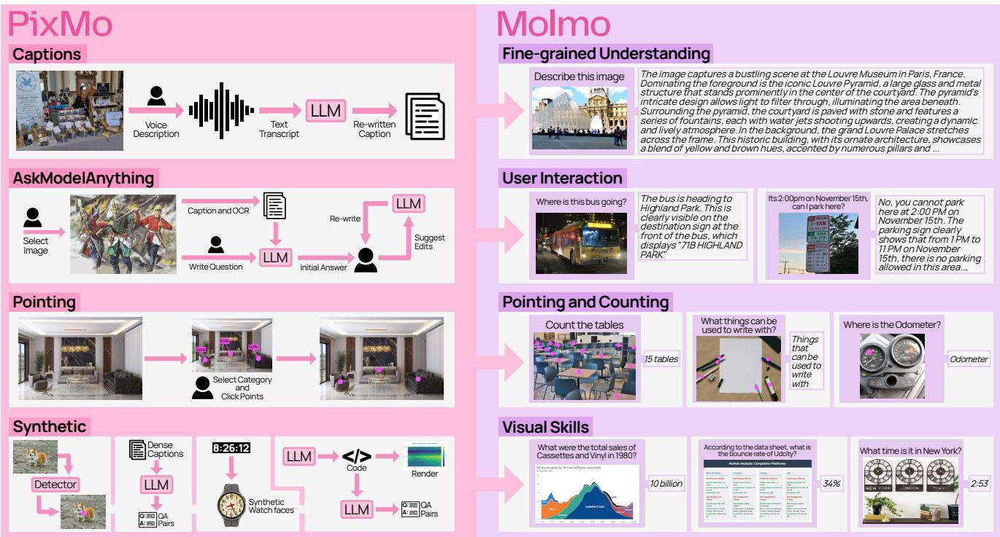
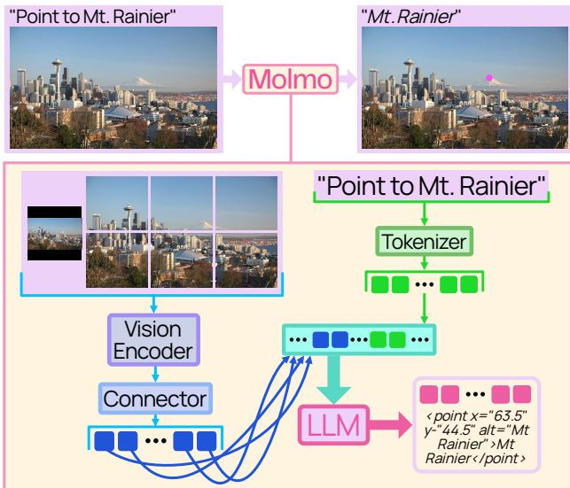
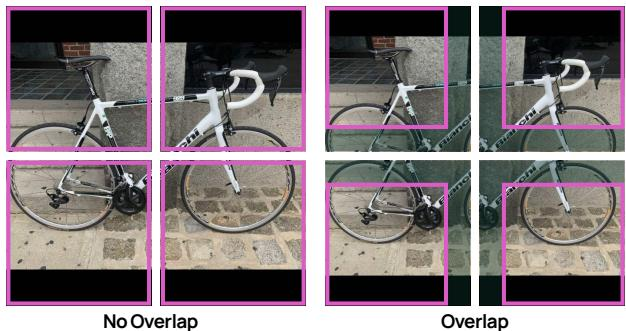
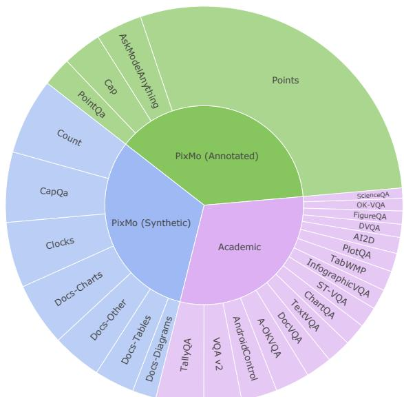

# Molmo and PixMo: Open Weights and Open Data for State-of-the-Art Vision-Language Models

Matt Deitke→†ω Christopher Clark→† Sangho Lee† Rohun Tripathi† Yue Yang†ε   
Jae Sung Parkω Mohammadreza Salehiω Niklas Muennighoff† Kyle Lo† Luca Soldaini† Jiasen Lu† Taira Anderson† Erin Bransom† Kiana Ehsani† Huong Ngo† YenSung Chen† Ajay Patelε Mark Yatskarε Chris Callison-Burchε Andrew Headε Rose Hendrix† Favyen Bastani† Eli VanderBilt† Nathan Lambert† Yvonne Chou† Arnavi Chheda† Jenna Sparks† Sam Skjonsberg† Michael Schmitz† Aaron Sarnat†   
Byron Bischoff† Pete Walsh† Chris Newell† Piper Wolters† Tanmay Gupta† Kuo-Hao Zeng† Jon Borchardt† Dirk Groeneveld† Crystal Nam† Sophie Lebrecht† Caitlin Wittlif† Carissa Schoenick† Oscar Michel† Ranjay Krishna†ω Luca Weihs†   
Noah A. Smith†ω Hannaneh Hajishirzi†ω Ross Girshick†ω Ali Farhadi†ω Aniruddha Kembhavi†ω

†Allen Institute for AI ωUniversity of Washington εUniversity of Pennsylvania

## Abstract

Today’s most advanced vision-language models (VLMs) remain proprietary. The strongest open-weight models rely heavily on synthetic datafrom proprietary VLMs to achieve good performance, effectively distilling these closed VLMs into open ones. As a result, the community has been missingfoundational knowledge about how to build performant VLMs from scratch. We present Molmo, a new family of VLMs that are state-of-the-art in their class of openness. Our key contribution is a collection of new datasets called PixMo, including a dataset of highly detailed image captions for pre-training, a free-form image Q&A dataset for fine-tuning, and an innovative 2D pointing dataset, all collected without the use of external VLMs. The success of our approach relies on careful modeling choices, a welltuned training pipeline, and, most critically, the quality of our newly collected datasets. Our best-in-class 72B model not only outperforms others in the class of open weight and data models, but also outperforms larger proprietary models including Claude 3.5 Sonnet, and Gemini 1.5 Pro and Flash, second only to GPT-4o based on both academic benchmarks and on a large human evaluation. Our model weights, new datasets, and source code are available at https://molmo.allenai.org/blog.

## 1. Introduction

Large multimodal models are used ubiquitously today. Proprietary models—GPT-4o, Gemini-1.5 Pro, Claude 3.5

Sonnet—produce comprehensive image descriptions and accurately answer complex visual questions. Unfortunately, the most performant of these vision-language models (VLMs) remain proprietary with neither model weights, data, nor code being publicly released.

To foster scientific exploration, numerous research efforts have attempted to reproduce similar capabilities in open models. Early works, exemplified by LLaVA [69], produced fully open weights and training data but now lag significantly behind the state-of-the-art. More recent, stronger open-weight models have trended towards less open data: the training data may either be proprietary (e.g., [10]) or, in cases where it is released, there is a heavy reliance on synthetic data generated by proprietary systems, e.g., models are trained on datasets like ShareGPT4V [15] which uses GPT-4V [88] to generate a large set of detailed image captions. The resulting VLMs, therefore, are effectively distillations of proprietary VLMs. As it stands, the scientific community is missing foundational knowledge about how to build performant VLMs from scratch (more discussion about this and related work are in the Appendix).

In this work, we present the Molmo (Multimodal Open Language Model) family of state-of-the-art open VLMs with released model weights and released vision-language training data without any reliance on synthetic data from other VLMs, including proprietary ones. The success of our approach relies on careful model design choices, a welltuned training pipeline, and most critically, the quality of our new datasets, collectively named PixMo (Pixels for Molmo), which are fully open.

High-quality multimodal data, both for pre-training and fine-tuning, is a key missing piece for training open VLMs that are competitive with closed ones. The academic community has struggled to collect such datasets due to high costs and the difficulty of obtaining high-quality annotations. To build PixMo, we introduce several data collection innovations that allow us to quickly collect high-quality data from untrained annotators, see Figure 1.

  
Figure 1. Datasets in PixMo (left) and the capabilities they enable in Molmo (right). PixMo consists of three annotated datasets and four synthetic datasets, all constructed without the use of VLMs. The annotated datasets include: dense captions (for pre-training), instruction following (for fine-tuning), and pointing (for fine-tuning, to support grounding and counting). The four synthetic datasets augment these datasets by targeting additional skills (e.g., clock reading, document understanding).

PixMo includes a dataset of 712k images with very long (200+ word) detailed captions. Collecting this data was difficult because directly asking annotators to write such captions produces poor results: they tend to focus on a few salient visual elements [17], typing long paragraphs is timeconsuming, and annotators can potentially copy-and-paste responses from proprietary VLMs, circumventing our goal of avoiding distillation. Instead, we ask annotators to describe images in speech for 60 to 90 seconds. Empirically, we found that with this modality switching “trick” annotators provide far more detailed descriptions in less time, and for each description we collect an audio receipt (i.e., the annotator’s recording) proving that a VLM was not used.

PixMo also includes an array of fine-tuning datasets. To collect instruction-following data, we have users interactively edit responses with a language-only LLM to obtain high-quality and accurate free-form responses. We gather 162k annotations on 73k images in this way. We also collect a unique new data source that grounds language in images with 2D points. Using points enables us to collect grounding data much faster than would be possible using bounding boxes or segmentation masks since it is much easier to annotate, and we take advantage of this by collecting over 2.3 million grounding annotations for a diverse range of objects, expressions, and scenes. This novel pointing data enables our models to answer some questions more naturally by pointing to the pixels that support the answer, improves counting accuracy (the model counts by pointing), and we believe it will open up an important future direction in which VLMs enable agents (e.g., robots, web agents) to act by pointing in their environments, e.g., to a navigation waypoint, to an object to pick up, or to a user interface button to press. Finally, we introduce several novel synthetic datasets (meaning with no or minimal human annotations, but still not using a VLM) with data targeting particular skills (clock reading, chart understanding, table understanding, etc.) that complements existing open-source datasets.

We train models on these datasets following a mostly standard design using a pre-trained LLM and vision encoder, but with some new improvements including a simplified two-stage training pipeline, a novel overlapping multicrop strategy, an efficient method of training on images with multiple annotations, and some new insights in how to set up the optimizer and vision/language connector. We evaluate the Molmo family of models on 11 academic benchmarks and with a human evaluation that allows us to rank models by user preference. Our most efficient model,

  
Figure 2. Molmo follows the simple and standard design of connecting a vision encoder and a language model.

MolmoE-1B, based on the OLMoE-1B-7B [87] mixtureof-experts LLM, nearly matches the performance of GPT-4V on both our academic benchmarks and user preference. Molmo-7B-O and Molmo-7B-D, based on OLMo-7B [37] and Qwen2 7B [120], respectively, perform comfortably between GPT-4V and GPT-4o [90] on both academic benchmarks and user preference. Our best-in-class Molmo-72B model, based on Qwen2 72B, achieves the highest academic benchmark score and ranks second by human preference, just behind GPT-4o. Our best model outperforms many state-of-the-art proprietary systems, including Gemini 1.5 Pro and Flash [103], and Claude 3.5 Sonnet [7]. We will also release a 100% fully open Molmo model, based on a MetaCLIP [118] vision encoder and OLMo LLM, for which every bit of training data is publicly available. In addition, we perform an expansive set of ablations to better inform the scientific community of how various model and data design choices affect VLMs.

## 2. Architecture

Our model architecture (Figure 2) follows a standard design, combining pre-trained language and vision models (e.g., [69]). It has four components: (1) a pre-processor that converts the input image into multiscale, multi-crop images, (2) a ViT image encoder [31] that computes per-patch features for each image independently, (3) a connector that pools and projects patch features into the LLM’s embedding space, and (4) a decoder-only LLM [95, 109].

From this template, we build a family of models by selecting a vision encoder and LLM, keeping the training data and recipe consistent across choices (except for learning rates). We primarily use OpenAI’s ViT-L/14 336px CLIP model [96] due to strong performance in initial experiments, but similar results are achievable with SigLIP [130] and the fully open MetaCLIP [118] (see Section 6). For the LLM, we experiment across scales and openness levels: fully open OLMo-7B-1024-preview, fully open OLMoE-1B-7B (our most efficient model), open-weight Qwen2 7B [120], and open-weight Qwen2 72B (our best-performing model).

  
Figure 3. An image cropped without (left) and with (right) overlap. Highlighted regions show areas used by the LLM. Overlapping crops ensure that central patches are encoded with neighboring context; for example, the patches containing the bike’s brand name are always part of a crop where the entire name is visible.

Cropping. Most ViTs only support square images at a fixed resolution that is generally too low for fine-grained tasks such as OCR or detailed captioning. To address this issue, we follow recent works [19, 30, 70, 85, 124] by dividing the image into multiple square crops that tile the image. Additionally, the full image, resized to the ViT’s resolution, provides a low-resolution overview. Each crop is processed independently by the ViT. See the Appendix for details.

One limitation of cropping is that border patches lack context from adjacent patches (see Figure 3). To mitigate this, we allow crops to overlap so each patch has context from at least some neighboring patches. Patch features from the overlap are not passed to the connector or LLM so that the passed patch features exactly tile the high-resolution image. Overlapping slightly reduces the tiled image resolution, but this can be offset by using more crops. Overlapping significantly improves results, as shown in Section 6.

Vision-language connector. Once crops are encoded by the vision encoder, we build patch features by concatenating features from the third-to-last and tenth-from-last ViT layers, which improves performance slightly over using a single layer. Each 2 2 patch window is then pooled into a single vector using a multi-headed attention layer, where the mean of the patches serves as the query. This attention pooling outperforms simple feature concatenation (see Section 6). Finally, pooled features are mapped to the LLM’s embedding space via an MLP.

Arranging vision tokens. Pooled patch features (vision tokens) are sequenced left-to-right, top-to-bottom, starting with patches from the low-resolution full image, followed by high-resolution crop patches arranged in row-major order. Special tokens are inserted to mark the start and end of both low- and high-resolution patch sequences, with rowend tokens added between rows to indicate row transitions.

Dropout. Residual dropout is applied to the LLM. During pre-training, dropout is applied only to text tokens to encourage reliance on the image rather than language priors. This is not used in fine-tuning, as shorter target responses result in too little dropout. Text-only dropout enhances captioning and downstream performance, as shown in Section 6.

Multi-annotated images. Our multimodal data often includes multiple annotations per image (e.g., VQA v2.0 has multiple question-answer pairs). To train efficiently, we arrange all of text annotation tokens for an image in one long sequence, masking attention so tokens for each annotation attend to the image tokens, each other, but not to tokens from different annotations. This setup is equivalent to training on individual image-text pairs but avoids redundant image encoding, reducing the number of processed images by two-thirds and shortening training time by over half, with only a 25% increase in sequence length for our data mix.

## 3. Data

PixMo contains seven datasets, three with human annotations and four created with synthetic data generation pipelines (see Figure 1). Below, we describe these datasets and data collection methods; additional details and examples are in the Appendix.

PixMo-Cap. We collected PixMo-Cap as a source of highquality pre-training data, featuring a diverse set of images paired with highly detailed dense captions. We began by sourcing web images across →70 diverse topics (e.g., street signs, memes, food, drawings, websites, blurry photos, etc.). For each image, three annotators initially provided detailed descriptions by speaking for at least 60 seconds. In later stages, we used one annotator per image with a 90- second minimum, which improved efficiency without sacrificing quality. We prompted the annotators with seven questions to answer, detailed in the Appendix.

The annotators’ audio was transcribed using a standard speech-to-text system, yielding raw transcripts. A final high-quality image caption was then created by prompting a language-only LLM to summarize multiple raw transcripts per image or, for single transcripts, to enhance its quality (e.g., removing spoken artifacts, normalizing style). In total, we collected 712k distinct images with 1.3M transcripts and captions. Our captions average 196 words, compared to 11 words in COCO captions [17] and 37 words in localized narratives [93], highlighting their greater detail.

PixMo-AskModelAnything. We collected this data to enable the model to answer diverse questions it might encounter in real-world use. To create image-question-answer triplets, annotators worked with a language-only LLM. An annotator selected an image from a large pool and wrote a question about it. Then, we ran a standard non-VLM OCR model and a PixMo-Cap-trained model on the image. The language-only LLM answered the question from the OCR data and dense caption. The annotator could accept or reject the answer and if rejected, they specified the issue and requested a revision until the answer was satisfactory. We collected 162k question-answer pairs in 73k images.

PixMo-Points. We collected pointing data to achieve three goals: (1) enable the model to point to items described by text, (2) enable the model to count by pointing, and (3) use pointing as a form of visual explanation when answering questions. For the first two goals, annotators were asked to point at something in an image, describe it, and then point to each instance of it in the image, ensuring exhaustive coverage. We also collected “not present” data so models can learn to handle cases where an item is not in the image. Pointing data also naturally supports answering counting questions with a chain-of-thought formed by the sequence of points. This resulted in 2.3M question-points pairs from 223k images. To enable points as explanations, we adapted the PixMo-AskModelAnything pipeline to let annotators pass the LLM a list of text-annotated points, prompting the LLM to use them in its answer when relevant. We collected 79k point-explanation annotations on 14k images.

PixMo-CapQA. We generated 214k question-answer pairs, covering diverse topics and styles, from 165k images by prompting a language-only LLM to ask and answer questions given only the ground-truth caption for an image.

PixMo-Docs. We used an extensive and carefully tuned prompting framework to prompt an LLM to generate code for 255k text and figure-heavy images, including charts, documents, tables, and diagrams. We then prompted the LLM to generate 2.3M question-answer pairs based on privileged access to the code (the images were not used).

PixMo-Clocks. We rendered synthetic clocks matched with a time-telling question-answer pair. The images use →50 different watch bodies and 160k realistic diverse watch faces set to random times. We collected 826k examples.

PixMo-Count. We used a standard non-VLM object detector [136] on web images to create image and counting QA pairs. For each image, we selected the class with the most detections after strict confidence thresholding. Following CountBenchQA [10], we manually verified 120 samples per count from 2 to 10, creating validation and test sets of 540 images each. These diverse images form a more challenging counting QA set than CountBenchQA, which has reported limitations [10]. The remaining samples with counts between 0 and 10 form a training set of 36k images, each annotated with points (object centers) and a QA pair.

  
Figure 4. Datasets used for fine-tuning, shown in proportion to their sampling rates. Green denotes human-annotated data we collected, blue denotes synthetic data we generated, and purple represents pre-existing academic datasets. PixMo-Docs has been subdivided into charts, tables, diagrams, and other.

## 4. Training

Pre-training. We pre-train all parameters on PixMo-Cap to generate either the caption or one of the audio transcripts for a given image. A prompt specifies which one to generate and, 90% of the time, includes a length hint to guide the model’s output length. This hint improves caption and pretraining quality, as shown in Section 6.

Previous work has often included a separate training stage to tune only the vision-language connector [10, 27, 59, 69, 106]. We find this step unnecessary when pre-training on PixMo-Cap (see Section 6), also explored in [48]. Instead, we apply a higher learning rate with a shorter warmup for the connector parameters, allowing them to adjust more quickly at the start of training. Skipping this stage reduces training time and complexity, and eliminates the need for the noisy web-scale data typically used in this phase. We train for four epochs using AdamW [50, 73]. Full hyperparameters are in the Appendix.

Fine-tuning. We fine-tune the model on a mix of PixMo datasets and open-source training datasets, including: VQA v2.0 (COCO 2014 subset) [36], TextVQA [100], OK-VQA [81], ChartQA (re-weighted to balance human and augmented examples) [82], DocVQA [83], InfographicVQA [84], AI2D (transparent and opaque label boxes) [49], A-OKVQA [99], AndroidControl [62], ScienceQA [76], TabMWP [77], ST-VQA [11], TallyQA [2], DVQA [46], FigureQA [47], and PlotQA [86].

We sample datasets at rates proportional to the square root of their size, with manual down weighting of some very large synthetic datasets (PlotQA, FigureQA, DVQA, and PixMo-Clocks). We observe that pointing tasks learn more slowly than QA tasks, so we significantly up-weight the pointing data. Final mixture rates are shown in Figure 4, with full details in the Appendix.

The academic datasets in this mixture teach specific skills and help the model perform well on corresponding benchmark test sets. However, these datasets often have answer styles that are not ideal for user interactions, as answers are usually very short and may reflect unique stylistic quirks from data collection (e.g., DocQA requires verbatim text from documents, while ChartQA specifies digits without commas). To prevent these styles from affecting userfacing responses, we prompt the model with a task-specific style tag (e.g., prefixing VQA v2.0 questions with “vqa2:”).

We use style tags for all datasets except PixMo-AskModelAnything, -CapQA, -Points, -Count and -Cap. For PixMo-Cap, we create →30 prompts for caption generation. For pointing data, we create →100 question templates that ask for the location or count of the target expression. The model then returns a list of points and, for counting questions, the total count. These prompts and templates are randomly sampled during training. We still use a style tag for pointing-as-an-explanation data since we find performance in this mode can be less reliable, so it should only be used when users request it.

The model outputs points as plain-text coordinates normalized between 0 and 100. When pointing to multiple items, points are ordered top-down, left-to-right, with each point numbered (see Figure 2 and details in the Appendix). Pointing enables a unique chain-of-thought approach to counting which improves performance (see Section 6).

## 5. Evaluation

We carefully evaluate on academic benchmarks because prompting, alignment with benchmark-specific answer styles, and use of benchmark training data can significantly affect performance. To complement this, we conduct a human evaluation to rank models based on user preference.

For academic benchmarking, we gather or compute results for all models on 10 common datasets and the PixMo-Count test set, which we include due to its higher difficulty compared to existing counting benchmarks. We prioritize author-published results but fill in missing results with the best previously reported values from technical reports or sources like the OpenVLM Leaderboard. If data is still missing, we compute it ourselves. Notably, computing results is challenging, as performance can vary significantly (e.g., by 10%) based on evaluation details. Additionally, critical information such as prompts or data processing steps is often unavailable, making it hard to reproduce results, highlighting the need for evaluation openness.

In our human evaluation, we collect 15k diverse imagetext prompt pairs and queried the VLMs for responses. We sample and present the resulting image-text-response triplets for all VLM pairings to a group of 870 human annotators, who provide pairwise preference rankings. Across all model pairs, we gather over 325k ratings (→450 per model pair). From this data, we calculate an Elo ranking using the Bradley-Terry model, following [21].

<table><tr><td></td><td colspan="7"></td><td colspan="7">testt tn78ı</td></tr><tr><td>model</td><td>t[est] 149] AID</td><td>ChartA test 82]</td><td>[est] td36] V°AV20</td><td>DOΛOA test] 83]</td><td>[est 841[ I</td><td>LeOA V[] 10]</td><td>RedA [1]</td><td>MMU V92] [12]</td><td>MahVsta</td><td>CuhA 0</td><td>Pio-Cunt 60</td><td>Average</td><td>Ela s core</td><td>Ela ank</td></tr><tr><td>API call only</td><td></td><td></td><td></td><td></td><td></td><td></td><td></td><td></td><td></td><td></td><td></td><td></td><td></td><td></td></tr><tr><td>GPT-4V [88]</td><td>89.4</td><td>78.1</td><td>77.2</td><td>87.2</td><td>75.1</td><td>78.0</td><td>61.4</td><td>63.1</td><td>58.1</td><td>69.9</td><td>45.0</td><td>71.1</td><td>1041</td><td>10</td></tr><tr><td>GPT-4o-0513 [90]</td><td>94.2</td><td>85.7</td><td>78.7</td><td>92.8</td><td>79.2</td><td>77.4</td><td>75.4</td><td>69.1</td><td>63.8</td><td>87.9</td><td>59.6</td><td>78.5</td><td>1079</td><td>1</td></tr><tr><td>Gemini 1.5 Flash [103]</td><td>91.7</td><td>85.4</td><td>80.1</td><td>89.9</td><td>75.3</td><td>78.7</td><td>67.5</td><td>56.1</td><td>58.4</td><td>81.6</td><td>61.1</td><td>75.1</td><td>1054</td><td>7</td></tr><tr><td>Gemini 1.5 Pro [103]</td><td>94.4</td><td>87.2</td><td>80.2</td><td>93.1</td><td>81.0</td><td>78.7</td><td>70.4</td><td>62.2</td><td>63.9</td><td>85.8</td><td>64.3</td><td>78.3</td><td>1074</td><td>3</td></tr><tr><td>Claude-3 Haiku [7]</td><td>86.7</td><td>81.7</td><td>68.4</td><td>88.8</td><td>56.1</td><td>67.3</td><td>45.5</td><td>50.2</td><td>46.4</td><td>83.0</td><td>43.9</td><td>65.3</td><td>999</td><td>18</td></tr><tr><td>Claude-3 Opus [7]</td><td>88.1</td><td>80.8</td><td>66.3</td><td>89.3</td><td>55.6</td><td>67.5</td><td>49.8</td><td>59.4</td><td>50.5</td><td>83.6</td><td>43.3</td><td>66.7</td><td>971</td><td>21</td></tr><tr><td>Claude-3.5 Sonnet [7]</td><td>94.7</td><td>90.8</td><td>70.7</td><td>95.2</td><td>74.3</td><td>74.1</td><td>60.1</td><td>68.3</td><td>67.7</td><td>89.7</td><td>58.3</td><td>76.7</td><td>1069</td><td>4</td></tr><tr><td>Open weights only</td><td></td><td></td><td></td><td></td><td></td><td></td><td></td><td></td><td></td><td></td><td></td><td></td><td></td><td></td></tr><tr><td>PaliGemma-mix-3B [10]</td><td>72.3</td><td>33.7</td><td>76.3</td><td>31.3</td><td>21.4</td><td>56.0</td><td>55.2</td><td>34.9</td><td>28.7</td><td>80.6</td><td>60.0</td><td>50.0</td><td>937</td><td>27</td></tr><tr><td>Phi3.5-Vision-4B [1]</td><td>78.1</td><td>81.8</td><td>75.7</td><td>69.3</td><td>36.6</td><td>72.0</td><td>53.6</td><td>43.0</td><td>43.9</td><td>64.6</td><td>38.3</td><td>59.7</td><td>982</td><td>19</td></tr><tr><td>Qwen2-VL-7B [111]</td><td>83.0</td><td>83.0</td><td>82.9</td><td>94.5</td><td>76.5</td><td>84.3</td><td>70.1</td><td>54.1</td><td>58.2</td><td>76.5</td><td>48.0</td><td>73.7</td><td>1025</td><td>14</td></tr><tr><td>Qwen2-VL-72B [111]</td><td>88.1</td><td>88.3</td><td>81.9</td><td>96.5</td><td>84.5</td><td>85.5</td><td>77.8</td><td>64.5</td><td>70.5</td><td>80.4</td><td>55.7</td><td>79.4</td><td>1037</td><td>12</td></tr><tr><td>InternVL2-8B [104]</td><td>83.8</td><td>83.3</td><td>76.7</td><td>91.6</td><td>74.8</td><td>77.4</td><td>64.2</td><td>51.2</td><td>58.3</td><td>57.8</td><td>43.9</td><td>69.4</td><td>953</td><td>23</td></tr><tr><td>InternVL2-Llama-3-76B [104]</td><td>87.6</td><td>88.4</td><td>85.6</td><td>94.1</td><td>82.0</td><td>84.4</td><td>72.7</td><td>58.2</td><td>65.5</td><td>74.7</td><td>54.6</td><td>77.1</td><td>1018</td><td>16</td></tr><tr><td>Pixtral-12B [3]</td><td>79.0</td><td>81.8</td><td>80.2</td><td>90.7</td><td>50.8</td><td>75.7</td><td>65.4</td><td>52.5</td><td>58.0</td><td>78.8</td><td>51.7</td><td>69.5</td><td>1016</td><td>17</td></tr><tr><td>Llama-3.2V-11B-Instruct [5]</td><td>91.1</td><td>83.4</td><td>75.2</td><td>88.4</td><td>63.6</td><td>79.7</td><td>64.1</td><td>50.7</td><td>51.5</td><td>73.1</td><td>47.4</td><td>69.8</td><td>1040</td><td>11</td></tr><tr><td>Llama-3.2V-90B-Instruct [5]</td><td>92.3</td><td>85.5</td><td>78.1</td><td>90.1</td><td>67.2</td><td>82.3</td><td>69.8</td><td>60.3</td><td>57.3</td><td>78.5</td><td>58.5</td><td>74.5</td><td>1063</td><td>5</td></tr><tr><td>Open weights + data († distilled)</td><td></td><td></td><td></td><td></td><td></td><td></td><td></td><td></td><td></td><td></td><td></td><td></td><td></td><td></td></tr><tr><td>LLaVA-1.5-7B [69]</td><td>55.5</td><td>17.8</td><td>78.5</td><td>28.1</td><td>25.8</td><td>58.2</td><td>54.8</td><td>35.7</td><td>25.6</td><td>40.1</td><td>27.6</td><td>40.7</td><td>951</td><td>26</td></tr><tr><td>LLaVA-1.5-13B [69]</td><td>61.1</td><td>18.2</td><td>80.0</td><td>30.3</td><td>29.4</td><td>61.3</td><td>55.3</td><td>37.0</td><td>27.7</td><td>47.1</td><td>35.2</td><td>43.9</td><td>960</td><td>22</td></tr><tr><td>xGen-MM-interleave-4B† [119]</td><td>74.2</td><td>60.0</td><td>81.5</td><td>61.4</td><td>31.5</td><td>71.0</td><td>61.2</td><td>41.1</td><td>40.5</td><td>81.9</td><td>50.2</td><td>59.5</td><td>979</td><td>20</td></tr><tr><td>Cambrian-1-8B† [106]</td><td>73.0</td><td>73.3</td><td>81.2</td><td>77.8</td><td>41.6</td><td>71.7</td><td>64.2</td><td>42.7</td><td>49.0</td><td>76.4</td><td>46.6</td><td>63.4</td><td>952</td><td>25</td></tr><tr><td>Cambrian-1-34B† [106]</td><td>79.7</td><td>75.6</td><td>83.8</td><td>75.5</td><td>46.0</td><td>76.7</td><td>67.8</td><td>49.7</td><td>53.2</td><td>75.6</td><td>50.7</td><td>66.8</td><td>953</td><td>24</td></tr><tr><td>LLaVA OneVision-7B† [59]</td><td>81.4</td><td>80.0</td><td>84.0</td><td>87.5</td><td>68.8</td><td>78.3</td><td>66.3</td><td>48.8</td><td>63.2</td><td>78.8</td><td>54.4</td><td>72.0</td><td>1024</td><td>15</td></tr><tr><td>LLaVA OneVision-72B† [59]</td><td>85.6</td><td>83.7</td><td>85.2</td><td>91.3</td><td>74.9</td><td>80.5</td><td>71.9</td><td>56.8</td><td>67.5</td><td>84.3</td><td>60.7</td><td>76.6</td><td>1051</td><td>8</td></tr><tr><td>The Molmo family: Open weights, Open data, Open training code, Open evaluations</td><td></td><td></td><td></td><td></td><td></td><td></td><td></td><td></td><td></td><td>87.2</td><td>79.6</td><td>68.6</td><td>1032</td><td>13</td></tr><tr><td>MolmoE-1B Molmo-7B-O</td><td>86.4 90.7</td><td>78.0 80.4</td><td>83.9 85.3</td><td>77.7 90.8</td><td>53.9 70.0</td><td>78.8 80.4</td><td>60.4 67.5</td><td>34.9 39.3</td><td>34.0 44.5</td></table>

Table 1. We present academic benchmark results for 10 common datasets, plus a new counting benchmark, PixMo-Count, which features more challenging natural images than CountBenchQA. We categorize models into four groups: (top) proprietary models accessible only via API calls, (upper middle) models with released weights but closed data, (lower middle) models with released weights and training data (noting some of these use distillation ( ) from proprietary VLMs via synthetic data), and (bottom) the Molmo family of models.

For Molmo, we evaluate all academic datasets with 36 crops (up from 12 used in training), except for counting tasks, as pointing capabilities do not generalize well with different numbers of test crops. A small amount of high-res post-training can resolve this issue, see the Appendix.

When possible, we use relevant style prompts1 (e.g., “vqa2:”). For evaluation-only datasets, we use the VQA v2.0 (for short answer) or A-OKVQA (for multiple choice)

style tags to elicit the often expected short answer style. For human evaluation, we omit style tags and use 12 crops, as some counting questions use pointing. Evaluators are only shown the output text, not the points.

Broadly speaking, the academic benchmark results and human evaluation agree, with the exception of Qwen2- VL [111], which performs strongly on the academic benchmarks and comparatively underperforms in the human evaluation. We highlight a few key results from Table 1:

• MolmoE-1B, our most efficient model based on the OLMoE-1B-7B mixture-of-experts LLM, nearly matches GPT-4V on academic benchmarks and Elo.

• Molmo models based on OLMo-7B-1024-preview and Qwen2 7B LLMs perform between GPT-4V and GPT-4o on academic benchmarks and Elo.

• Our best-in-class Qwen2 72B based model achieves the highest academic benchmark score and ranks second in Elo, just behind GPT-4o.

<table><tr><td>ViT-L/14</td><td>cap F1</td><td>11-avg</td></tr><tr><td>OpenAI CLIP 336px</td><td>54.1</td><td>76.9</td></tr><tr><td>MetaCLIP 336px</td><td>54.1</td><td>77.2</td></tr><tr><td>SigLIP-So400m 384px</td><td>54.4</td><td>77.1</td></tr><tr><td>DINOv2 336px</td><td>53.2</td><td>75.6</td></tr></table>

(a) Vision encoder. Encoders that were trained on noisy web-scale image-text pairs perform similarly (rows 1-3). Surprisingly, DINOv2, which is trained on images only (no text, no label supervision), is competitive on these tasks. MetaCLIP and DINOv2 arefully open.
<table><tr><td>cropping</td><td>cap F1</td><td>11-avg</td></tr><tr><td>single</td><td>46.7</td><td>62.8</td></tr><tr><td>multi, no overlap</td><td>53.4</td><td>75.7</td></tr><tr><td>multi, overlap</td><td>54.1</td><td>76.9</td></tr></table>

(d) Cropping. Using the entire image only (single crop) performs poorly. Our novel overlapping crop method (see Figure 3), which prevents loss of context, performs the best.

<table><tr><td># crops train, test</td><td>cap F1</td><td>11-avg</td></tr><tr><td>4,4</td><td>52.0</td><td>71.0</td></tr><tr><td>4,12</td><td>52.0</td><td>74.1</td></tr><tr><td>4,36</td><td>52.0</td><td>74.2</td></tr><tr><td>12, 12</td><td>54.1</td><td>74.9</td></tr><tr><td>12,36</td><td>54.1</td><td>76.9</td></tr><tr><td>36,36</td><td>54.0</td><td>77.2</td></tr></table>

(b) Image resolution. Using more crops at training and testing time generally improves performance. However, captioning and counting can perform poorly when # of crops are unequal, so for these tasks we always set the number of test crops equal to the training value.

<table><tr><td>pre-train, fine-tune</td><td>cap F1</td><td>11-avg</td></tr><tr><td>off, off</td><td>53.1</td><td>74.6</td></tr><tr><td>off, on</td><td>53.1</td><td>76.6</td></tr><tr><td>on, on</td><td>53.7</td><td>77.0</td></tr><tr><td>on (text only), on</td><td>54.1</td><td>76.9</td></tr></table>

(c) Dropout. Dropout in the LLM improves pre-training and fine-tuning results. In pretraining, applying dropout to captioning text tokens only further improves results. This design may encourage the model to rely more on vision tokens rather than past text tokens.

<table><tr><td>setting</td><td>cap F1 11-avg</td><td></td></tr><tr><td>off</td><td>53.0</td><td>76.2</td></tr><tr><td>on</td><td>54.1</td><td>76.9</td></tr></table>

<table><tr><td>2×2 pooling</td><td>cap F1 11-avg</td><td></td></tr><tr><td>stacking</td><td>53.7</td><td>76.1</td></tr><tr><td>attention</td><td>54.1</td><td>76.9</td></tr></table>

(e) Length conditioning. Captioning with length hints is a superior pre-training task compared to captioning alone as evident by the improved captioning and downstream results.  
(f) Pooling. Pooling 2 2 windows of vision tokens using mean-query attention performs better than simply stacking the four features as input to the vision-language connector MLP.  
Table 2. Model ablations. Default settings are marked in gray . See the Appendix for additional ablations.

• Our best model also outperforms many state-of-the-art proprietary systems, including Gemini 1.5 Pro and Flash and Claude 3.5 Sonnet.

Molmo-72B also underwent an independent Elo evaluation via Chatbot Arena, where it outperforms all open models but ranks lower than several proprietary models (e.g., GPT-4o and Claude 3.5 Sonnet).2 The full results table is in the Appendix. The difference likely stems from the types of questions evaluated. While we cannot perform a full analysis since the questions are not public, we do note our data includes many counting and image-description questions which are particular strengths of Molmo.

Molmo excels at answering questions about natural images, matching or outperforming all models on the zero-shot RealWorldQA benchmark and achieving stateof-the-art results on the highly competitive VQA v2.0. On OCR-centric benchmarks (ChartQA, DocQA, InfoQA, TextVQA), Molmo surpasses other open models and some proprietary ones but trails slightly behind Qwen2-VL. On counting tasks (CountBenchQA and PixMo-Count), Molmo leads all models due to our new pointing data and chain-ofthought point-and-count abilities. However, on reasoning tasks (MMMU, MathVista) Molmo lags, likely because its training mix lacks data focused on advanced reasoning.

We conduct several additional skill-specific evaluations, summarized here with details in the Appendix. On a clockreading benchmark [121], Molmo at all scales dramatically outperforms other VLMs including proprietary ones, but trails specialized non-VLM models [121]. To assess

Molmo’s potential for action, we tested Molmo-72B on AndroidControl [62], achieving 88.7% low-level and 69.0% high-level accuracy, comparable to the reported 83.2% and 70.8% in [62]. On NLP benchmarks, Molmo shows a slight performance drop versus its component LLM, which can be offset by additional text-only data. We also introduce a new pointing benchmark using SAM [51], where Molmo models at all scales demonstrate strong performance.

## 6. Ablations

We performed extensive ablations on model design (Table 2) and training data (Table 3), reporting two metrics: an $F _ { 1 }$ metric (“cap F ”) we developed to measure the precision and recall of captions generated by the model after pre-training (details in the Appendix), and the average accuracy on our 11 benchmark suite (“11-avg”), using validation sets when available. We report $F _ { 1 }$ because we believe it reflects broad-range image understanding learned during pre-training, and many of our modeling design choices were based on this evaluation since it does not require running the more costly fine-tuning stage. While performing these ablation we observed captioning improvements generally, but not always, correspond to benchmark suite improvements. Our ablations test modifications to the Molmo-7B-D model configuration with key findings summarized below and further details in Table 2 and 3 captions and the Appendix.

Model ablations. We vary several design choices, finding:

• Vision encoders trained on noisy web-scale data (CLIP, SigLIP, MetaCLIP) all work roughly the same, including the fully open MetaCLIP (Table 2a).

• Excluding pointing and captioning, increasing the image resolution by increasing the number of crops generally improves performance, and tuning at a high resolution yields a slight gain (Table 2b).

<table><tr><td># PixMo-Cap images</td><td>cap F1</td><td>11-avg</td></tr><tr><td>0 (0.0%)</td><td></td><td>74.9</td></tr><tr><td>89k (12.5%)</td><td>49.6</td><td>75.5</td></tr><tr><td>178k (25.0%)</td><td>51.6</td><td>76.3</td></tr><tr><td>356k (50.0%)</td><td>52.6</td><td>76.2</td></tr><tr><td>712k (100.0%)</td><td>54.1</td><td>76.9</td></tr></table>

<table><tr><td>data</td><td>cap F1</td><td>11-avg</td></tr><tr><td>stage 0.5 LAION</td><td>53.9</td><td>76.9</td></tr><tr><td>ShareGPT4V+o (158k images)</td><td>36.3</td><td>74.9</td></tr><tr><td>PixMo-Cap images: our raw transcripts only</td><td>45.2</td><td>76.4</td></tr><tr><td>our cleaned transcripts only</td><td>53.0</td><td>76.5</td></tr><tr><td>our raw &amp; cleaned transcripts</td><td>54.1</td><td>76.9</td></tr><tr><td>captioned by GPT-4o</td><td>52.9</td><td>77.5</td></tr></table>

(a) PixMo-Cap scaling. Increasing the quantity of PixMo-Cap captioning data in both pretraining and fine-tuning improves captioning and downstream tasks.  
(b) Pre-training data. Our human annotated data performs on par with distilling GPT-4o by using it to caption the same set of images, demonstrating the effectiveness of our data.

<table><tr><td>data</td><td>11-avg</td></tr><tr><td>academic only</td><td>72.5</td></tr><tr><td>plus PixMo-Docs</td><td>74.0</td></tr><tr><td>PixMo-* plus academic</td><td>76.9</td></tr><tr><td>remove PixMo-AMA</td><td>76.8</td></tr><tr><td>remove PixMo-CapQA</td><td>77.0</td></tr><tr><td>remove PixMo-Docs remove PixMo-Clocks</td><td>75.8</td></tr><tr><td></td><td>76.9</td></tr><tr><td>remove pointing task</td><td>76.2</td></tr></table>

(c) Supervised fine-tuning data. The PixMo-ϑ datasets not only give the model new capabilities (e.g., pointing), but also generally improve results on the 11 dataset benchmark.

Table 3. Data ablations. Default settings are marked in gray .
<table><tr><td>strategy</td><td>CBQA PCQA</td><td></td></tr><tr><td>count</td><td>87.9</td><td>80.2</td></tr><tr><td>point then count</td><td>89.4</td><td>86.3</td></tr><tr><td>count then point</td><td>81.5</td><td>77.6</td></tr><tr><td>pointing + regex</td><td>88.4</td><td>85.4</td></tr></table>

(a) Counting strategy. Pointing is the key ingredient in Molmo’s counting abilities.

<table><tr><td></td><td>order CBQA PCQA</td><td></td></tr><tr><td>on</td><td>89.4</td><td>86.3</td></tr><tr><td>off</td><td>85.4</td><td>74.1</td></tr></table>

(b) Point order. Training on ordered points (top-down, left-right) is better than unordered points.

<table><tr><td>points, length</td><td>CBQA PCQA</td><td></td></tr><tr><td>actual, correct</td><td>89.4</td><td>86.3</td></tr><tr><td>random, correct</td><td>85.9</td><td>76.3</td></tr><tr><td>random, random</td><td>76.3</td><td>75.7</td></tr></table>

<table><tr><td>tokens</td><td>CBQA PCQA</td><td></td></tr><tr><td>plain-text</td><td>89.4</td><td>86.3</td></tr><tr><td>special</td><td>85.8</td><td>80.9</td></tr></table>

(c) Inference compute. Simply increasing inference compute with extra tokens does not help.  
(d) Special point tokens. Encoding point coordinates as plain-text works best.

• Our novel text-only dropout used in pre-training improves captioning performance (Table 2c).

• Using multiple crops is critical, and our overlapping crop design yields significant improvements (Table 2d).

• Our novel length-conditioned captioning is a strong pretraining task, improving downstream results (Table 2e).

• Attention pooling yields improvements to both metrics over the baseline feature stacking approach (Table 2f).

## Data ablations. We train with various data choices, finding:

• Scaling PixMo-Cap from 0 to 712k images significantly improves captioning and benchmark metrics (Table 3a).

• Adding noisy web-scale data does not help. PixMo Cap does better than a similar amount of data from ShareGPT4v/o, and roughly as well as captions generated by GPT-4o on the PixMo-Cap images (Table 3b).

• The PixMo fine-tuning datasets improve benchmark task performance beyond the academic datasets, mainly by improving OCR and counting tasks (Table 3c).

Counting. We ablate several details of counting using models fine-tuned on just PixMo-Points and PixMo-Count data:

• Chain-of-thought point-then-count performs significantly better than generating a count only or generating a count followed by points. Pointing on its own, counted by regular expression, is only slightly worse (Table 4a).

• Training with points in a predicable spatial order (topdown, left-to-right) is important (Table 4b).

• Training with random locations and/or numbers of points (Table 4c) performs worse despite equalizing the amount of compute used during inference.

• Representing point coordinates in plain-text works bet-

Table 4. Counting ablations. Defaults are in gray . CBQA is the CountBenchQA test set and PCQA is the PixMo-Count validation set.
<table><tr><td>model</td><td>Elo score</td><td>win % vs. default</td></tr><tr><td>Claude-3.5 Sonnet</td><td>1047</td><td>65%</td></tr><tr><td>PixMo-Cap w/ GPT-4o captions (Table 3b)</td><td>1018</td><td>55%</td></tr><tr><td>PixMo-*, remove PixMo-CapQA (Table 3c)</td><td>1015</td><td>50%</td></tr><tr><td>Molmo-7B-D default</td><td>1014</td><td>n/a</td></tr><tr><td>PixMo-*, no academic datasets (Table 3c)</td><td>1013</td><td>42%</td></tr><tr><td>GPT-4V</td><td>1010</td><td>47%</td></tr><tr><td>DINOv2 vision encoder (Table2a)</td><td>999</td><td>45%</td></tr><tr><td>PixMo-*, remove PixMo-AMA (Table 3c)</td><td>995</td><td>40%</td></tr><tr><td>no PixMo-Cap data (Table 3a)</td><td>990</td><td>35%</td></tr><tr><td>academic only (Table 3c)</td><td>897</td><td>17%</td></tr></table>

Table 5. Elo scores and win rates (excluding ties) for select ablations of Molmo-7B-D and two API-only models for context.

ter than introducing special location tokens (Table 4d).

Human evaluation. A human evaluation of select ablation models in Table 5 shows that PixMo data, especially PixMo-Cap and PixMo-AskModelAnything, is important for generating responses that users like. Academic datasets help, but perform poorly in isolation. GPT-4o captions on our images also perform well, likely due to recent advances in GPT and the diversity of our image collection (e.g., the ShareGPT datasets significantly underperform our data even at the same scale, see Tables 3b and 3a). While distilling from proprietary models might be effective, we believe that it is critical for the scientific community to understand how to train competitive VLMs without doing so.

## 7. Conclusion

We have presented Molmo, a state-of-the-art VLM with fully open training code and open, non-distilled, training data. Molmo is a significant step towards closing the gap between proprietary and open VLMs.

## 8. Acknowledgements

We thank Prolific and MTurk annotators who helped generate the PixMo datasets and Winson Han for his help designing the figures. We also thank the TPU Research Cloud program for providing cloud TPUs that were used to build the initial prototypes of Molmo.

## References

[1] Marah Abdin, Jyoti Aneja, Hany Awadalla, Ahmed Awadallah, Ammar Ahmad Awan, Nguyen Bach, Amit Bahree, Arash Bakhtiari, Jianmin Bao, Harkirat Behl, et al. Phi-3 technical report: A highly capable language model locally on your phone. arXiv preprint arXiv:2404.14219, 2024. 6, 20, 25

[2] Manoj Acharya, Kushal Kafle, and Christopher Kanan. TallyQA: Answering complex counting questions. In AAAI, 2019. 5

[3] Pravesh Agrawal, Szymon Antoniak, Emma Bou Hanna, Devendra Chaplot, Jessica Chudnovsky, Saurabh Garg, Theophile Gervet, Soham Ghosh, Amelie H´ eliou, Paul Ja-´ cob, et al. Pixtral 12b. arXiv preprint arXiv:2410.07073, 2024. 6, 19, 20, 25

[4] 01. AI, :, Alex Young, Bei Chen, Chao Li, Chengen Huang, Ge Zhang, Guanwei Zhang, Heng Li, Jiangcheng Zhu, Jianqun Chen, Jing Chang, Kaidong Yu, Peng Liu, and more. Yi: Open foundation models by 01.ai. arXiv preprint arXiv:2403.04652, 2024. 19

[5] Meta AI. The llama 3 herd of models. arXiv preprint arXiv:2407.21783, 2024. 6, 18, 19, 20, 21, 23, 24, 25, 26

[6] Jean-Baptiste Alayrac, Jeff Donahue, Pauline Luc, Antoine Miech, Iain Barr, Yana Hasson, Karel Lenc, Arthur Mensch, Katherine Millican, Malcolm Reynolds, et al. Flamingo: a visual language model for few-shot learning. In NeurIPS, 2022. 24

[7] Anthropic. The claude 3 model family: Opus, sonnet, haiku, 2024. 3, 6, 19, 20, 24, 25

[8] Jimmy Lei Ba, Jamie Ryan Kiros, and Geoffrey E Hinton. Layer normalization. In NeurIPS Deep Learning Symposium, 2016. 16

[9] Rohan Bavishi, Erich Elsen, Curtis Hawthorne, Maxwell Nye, Augustus Odena, Arushi Somani, and Sagnak Tas¸ırlar.˘ Fuyu-8b: A multimodal architecture for ai agents, 2023. 24

[10] Lucas Beyer, Andreas Steiner, Andre Susano Pinto,´ Alexander Kolesnikov, Xiao Wang, Daniel Salz, Maxim Neumann, Ibrahim Alabdulmohsin, Michael Tschannen, Emanuele Bugliarello, Thomas Unterthiner, Daniel Keysers, Skanda Koppula, Fangyu Liu, Adam Grycner, Alexey Gritsenko, Neil Houlsby, Manoj Kumar, Keran Rong, Julian Eisenschlos, Rishabh Kabra, Matthias Bauer, Matko Bosnjak, Xi Chen, Matthias Minderer, Paul Voigtlaender,ˇ Ioana Bica, Ivana Balazevic, Joan Puigcerver, Pinelopi Papalampidi, Olivier Henaff, Xi Xiong, Radu Soricut, Jeremiah Harmsen, and Xiaohua Zhai. PaliGemma: A versatile 3B VLM for transfer. arXiv preprint arXiv:2407.07726, 2024. 1, 4, 5, 6, 18, 20, 23, 24, 25

[11] Ali Furkan Biten, Ruben Tito, Andres Mafla, Lluis Gomez, Marc¸al Rusinol, Ernest Valveny, CV Jawahar, and Dimosthenis Karatzas. Scene text visual question answering. In ICCV, 2019. 5

[12] Junbum Cha, Wooyoung Kang, Jonghwan Mun, and Byungseok Roh. Honeybee: Locality-enhanced projector for multimodal llm. In CVPR, 2024. 24

[13] Guiming Hardy Chen, Shunian Chen, Ruifei Zhang, Junying Chen, Xiangbo Wu, Zhiyi Zhang, Zhihong Chen, Jianquan Li, Xiang Wan, and Benyou Wang. Allava: Harnessing gpt4v-synthesized data for a lite vision-language model. arXiv preprint arXiv:2402.11684, 2024. 26

[14] Kaibing Chen, Dong Shen, Hanwen Zhong, Huasong Zhong, Kui Xia, Di Xu, Wei Yuan, Yifei Hu, Bin Wen, Tianke Zhang, Changyi Liu, Dewen Fan, Huihui Xiao, Jiahong Wu, Fan Yang, Size Li, and Di Zhang. Evlm: An efficient vision-language model for visual understanding. arXiv preprint arXiv:2407.14177, 2024. 25

[15] Lin Chen, Jisong Li, Xiaoyi Dong, Pan Zhang, Conghui He, Jiaqi Wang, Feng Zhao, and Dahua Lin. ShareGPT4V: Improving large multi-modal models with better captions. arXiv preprint arXiv:2311.12793, 2023. 1, 23, 25, 26

[16] Mark Chen, Jerry Tworek, Heewoo Jun, Qiming Yuan, Henrique Ponde de Oliveira Pinto, Jared Kaplan, Harri Edwards, Yuri Burda, Nicholas Joseph, Greg Brockman, Alex Ray, Raul Puri, Gretchen Krueger, Michael Petrov, Heidy Khlaaf, Girish Sastry, Pamela Mishkin, Brooke Chan, Scott Gray, Nick Ryder, Mikhail Pavlov, Alethea Power, Lukasz Kaiser, Mohammad Bavarian, Clemens Winter, Philippe Tillet, Felipe Petroski Such, Dave Cummings, Matthias Plappert, Fotios Chantzis, Elizabeth Barnes, Ariel Herbert Voss, William Hebgen Guss, Alex Nichol, Alex Paino, Nikolas Tezak, Jie Tang, Igor Babuschkin, Suchir Balaji, Shantanu Jain, William Saunders, Christopher Hesse, Andrew N. Carr, Jan Leike, Josh Achiam, Vedant Misra, Evan Morikawa, Alec Radford, Matthew Knight, Miles Brundage, Mira Murati, Katie Mayer, Peter Welinder, Bob McGrew, Dario Amodei, Sam McCandlish, Ilya Sutskever, and Wojciech Zaremba. Evaluating large language models trained on code. arXiv preprint arXiv:2107.03374, 2021. 22

[17] Xinlei Chen, Hao Fang, Tsung-Yi Lin, Ramakrishna Vedantam, Saurabh Gupta, Piotr Dollar, and C Lawrence´ Zitnick. Microsoft COCO captions: Data collection and evaluation server. arXiv preprint arXiv:1504.00325, 2015. 2, 4, 17

[18] Xi Chen, Xiao Wang, Lucas Beyer, Alexander Kolesnikov, Jialin Wu, Paul Voigtlaender, Basil Mustafa, Sebastian Goodman, Ibrahim Alabdulmohsin, Piotr Padlewski, et al. Pali-3 vision language models: Smaller, faster, stronger. arXiv preprint arXiv:2310.09199, 2023. 24

[19] Zhe Chen, Weiyun Wang, Hao Tian, Shenglong Ye, Zhang wei Gao, Erfei Cui, Wenwen Tong, Kongzhi Hu, Jiapeng Luo, Zheng Ma, Ji Ma, Jiaqi Wang, Xiaoyi Dong, Hang Yan, Hewei Guo, Conghui He, Botian Shi, Zhenjiang Jin, Chao Xu, Bin Wang, Xingjian Wei, Wei Li, Wenjian Zhang, Bo Zhang, Pinlong Cai, Licheng Wen, Xiangchao Yan, Min Dou, Lewei Lu, Xizhou Zhu, Tong Lu, Dahua Lin, Yu Qiao,

Jifeng Dai, and Wenhai Wang. How far are we to GPT-4V? closing the gap to commercial multimodal models with open-source suites. arXiv preprint arXiv:2404.16821, 2024. 3

[20] Mehdi Cherti, Romain Beaumont, Ross Wightman, Mitchell Wortsman, Gabriel Ilharco, Cade Gordon, Christoph Schuhmann, Ludwig Schmidt, and Jenia Jitsev. Reproducible scaling laws for contrastive language-image learning. In CVPR, 2023. 24

[21] Wei-Lin Chiang, Lianmin Zheng, Ying Sheng, Anastasios Nikolas Angelopoulos, Tianle Li, Dacheng Li, Hao Zhang, Banghua Zhu, Michael Jordan, Joseph E Gonzalez, and Ion Stoica. Chatbot arena: An open platform for eval uating LLMs by human preference. In ICML, 2024. 6, 19

[22] Xiangxiang Chu, Limeng Qiao, Xinyang Lin, Shuang Xu, Yang Yang, Yiming Hu, Fei Wei, Xinyu Zhang, Bo Zhang, Xiaolin Wei, and Chunhua Shen. Mobilevlm : A fast, strong and open vision language assistant for mobile devices. arXiv preprint arXiv:2312.16886, 2023. 25

[23] Peter Clark, Isaac Cowhey, Oren Etzioni, Tushar Khot, Ashish Sabharwal, Carissa Schoenick, and Oyvind Tafjord. Think you have solved question answering? try arc, the ai2 reasoning challenge. arXiv preprint arXiv:1803.05457, 2018. 22

[24] Karl Cobbe, Vineet Kosaraju, Mohammad Bavarian, Mark Chen, Heewoo Jun, Lukasz Kaiser, Matthias Plappert, Jerry Tworek, Jacob Hilton, Reiichiro Nakano, Christopher Hesse, and John Schulman. Training verifiers to solve math word problems. arXiv preprint arXiv:2110.14168, 2021. 22

[25] David F Crouse. On implementing 2d rectangular assignment algorithms. IEEE Transactions on Aerospace and Electronic Systems, 2016. 20

[26] Wenliang Dai, Junnan Li, Dongxu Li, Anthony Meng Huat Tiong, Junqi Zhao, Weisheng Wang, Boyang Albert Li, Pascale Fung, and Steven C. H. Hoi. Instructblip: Towards general-purpose vision-language models with instruction tuning. In NeurIPS, 2023. 24

[27] Wenliang Dai, Nayeon Lee, Boxin Wang, Zhuoling Yang, Zihan Liu, Jon Barker, Tuomas Rintamaki, Mohammad Shoeybi, Bryan Catanzaro, and Wei Ping. NVLM: Open frontier-class multimodal LLMs. arXiv preprint arXiv:2409.11402, 2024. 5

[28] Tri Dao. FlashAttention-2: Faster attention with better parallelism and work partitioning. In ICLR, 2024. 15

[29] Tri Dao, Daniel Y. Fu, Stefano Ermon, Atri Rudra, and Christopher Re. FlashAttention: Fast and memory-efficient´ exact attention with IO-awareness. In NeurIPS, 2022. 15

[30] Xiaoyi Dong, Pan Zhang, Yuhang Zang, Yuhang Cao, Bin Wang, Linke Ouyang, Songyang Zhang, Haodong Duan, Wenwei Zhang, Yining Li, Hang Yan, Yang Gao, Zhe Chen, Xinyue Zhang, Wei Li, Jingwen Li, Wenhai Wang, Kai Chen, Conghui He, Xingcheng Zhang, Jifeng Dai, Yu Qiao, Dahua Lin, and Jiaqi Wang. InternLM-XComposer2- 4KHD: A Pioneering Large Vision-Language Model Handling Resolutions from 336 Pixels to 4K HD. arXivpreprint arXiv:2404.06512, 2024. 3

[31] Alexey Dosovitskiy, Lucas Beyer, Alexander Kolesnikov, Dirk Weissenborn, Xiaohua Zhai, Thomas Unterthiner,

Mostafa Dehghani, Matthias Minderer, Georg Heigold, Sylvain Gelly, Jakob Uszkoreit, and Neil Houlsby. An image is worth 16x16 words: Transformers for image recognition at scale. In ICLR, 2021. 3

[32] Yunhao Fang, Ligeng Zhu, Yao Lu, Yan Wang, Pavlo Molchanov, Jan Kautz, Jang Hyun Cho, Marco Pavone, Song Han, and Hongxu Yin. Vila2: Vila augmented vila. arXiv preprint arXiv:2407.17453, 2024.

[33] Andrea Frome, Greg S Corrado, Jon Shlens, Samy Bengio, Jeff Dean, Marc’Aurelio Ranzato, and Tomas Mikolov. Devise: A deep visual-semantic embedding model. NeurIPS, 2013. 24

[34] Chaoyou Fu, Haojia Lin, Zuwei Long, Yunhang Shen, Meng Zhao, Yifan Zhang, Xiong Wang, Di Yin, Long Ma, Xiawu Zheng, et al. Vita: Towards open-source interactive omni multimodal llm. arXiv preprint arXiv:2408.05211, 2024. 24

[35] Tao Ge, Xin Chan, Xiaoyang Wang, Dian Yu, Haitao Mi, and Dong Yu. Scaling synthetic data creation with 1,000,000,000 personas. arXiv preprint arXiv:2406.20094, 2024. 24

[36] Yash Goyal, Tejas Khot, Douglas Summers-Stay, Dhruv Batra, and Devi Parikh. Making the V in VQA matter: Elevating the role of image understanding in visual question answering. In CVPR, 2017. 5, 6

[37] Dirk Groeneveld, Iz Beltagy, Pete Walsh, Akshita Bhagia, Rodney Kinney, Oyvind Tafjord, A. Jha, Hamish Ivison, Ian Magnusson, Yizhong Wang, Shane Arora, David Atkinson, Russell Authur, Khyathi Raghavi Chandu, Arman Cohan, Jennifer Dumas, Yanai Elazar, Yuling Gu, Jack Hessel, Tushar Khot, William Merrill, Jacob Daniel Mor rison, Niklas Muennighoff, Aakanksha Naik, Crystal Nam, Matthew E. Peters, Valentina Pyatkin, Abhilasha Ravichander, Dustin Schwenk, Saurabh Shah, Will Smith, Emma Strubell, Nishant Subramani, Mitchell Wortsman, Pradeep Dasigi, Nathan Lambert, Kyle Richardson, Luke Zettlemoyer, Jesse Dodge, Kyle Lo, Luca Soldaini, Noah A. Smith, and Hanna Hajishirzi. OLMo: Accelerating the science of language models. In ACL, 2024. 3, 15, 26

[38] Dan Hendrycks, Collin Burns, Steven Basart, Andy Zou, Mantas Mazeika, Dawn Song, and Jacob Steinhardt. Measuring massive multitask language understanding. In ICLR, 2021. 22

[39] Dan Hendrycks, Collin Burns, Saurav Kadavath, Akul Arora, Steven Basart, Eric Tang, Dawn Song, and Jacob Steinhardt. Measuring mathematical problem solving with the math dataset. In NeurIPS Track on Datasets and Bench marks, 2021. 22

[40] Joeri R Hermans, Gerasimos Spanakis, and Rico Mockel.¨ Accumulated gradient normalization. In Asian Conference on Machine Learning, pages 439–454. PMLR, 2017. 16

[41] Wenyi Hong, Weihan Wang, Ming Ding, Wenmeng Yu, Qingsong Lv, Yan Wang, Yean Cheng, Shiyu Huang, Jun hui Ji, Zhao Xue, et al. Cogvlm2: Visual language mod els for image and video understanding. arXiv preprint arXiv:2408.16500, 2024. 24

[42] Anwen Hu, Haiyang Xu, Jiabo Ye, Mingshi Yan, Liang Zhang, Bo Zhang, Chen Li, Ji Zhang, Qin Jin, Fei Huang,

and Jingren Zhou. mplug-docowl 1.5: Unified structure learning for ocr-free document understanding. In Findings ofEMNLP, 2024.

[43] Chao Jia, Yinfei Yang, Ye Xia, Yi-Ting Chen, Zarana Parekh, Hieu Pham, Quoc Le, Yun-Hsuan Sung, Zhen Li, and Tom Duerig. Scaling up visual and vision-language representation learning with noisy text supervision. In ICML, 2021. 24

[44] Dongfu Jiang, Xuan He, Huaye Zeng, Cong Wei, Max Ku, Qian Liu, and Wenhu Chen. Mantis: Interleaved multiimage instruction tuning. arXiv preprint arXiv:2405.01483, 2024. 26

[45] Roy Jonker and Ton Volgenant. A shortest augmenting path algorithm for dense and sparse linear assignment problems. Computing, 1987. 20

[46] Kushal Kafle, Brian Price, Scott Cohen, and Christopher Kanan. DVQA: Understanding data visualizations via question answering. In CVPR, 2018. 5, 16, 26

[47] Samira Ebrahimi Kahou, Vincent Michalski, Adam Atkinson, Akos K ´ ad´ ar, Adam Trischler, and Yoshua Bengio. Fig- ´ ureQA: An annotated figure dataset for visual reasoning. arXiv preprint arXiv:1710.07300, 2017. 5, 26

[48] Siddharth Karamcheti, Suraj Nair, Ashwin Balakrishna, Percy Liang, Thomas Kollar, and Dorsa Sadigh. Prismatic vlms: Investigating the design space of visually-conditioned language models. arXiv preprint arXiv:2402.07865, 2024. 5, 24

[49] Aniruddha Kembhavi, Mike Salvato, Eric Kolve, Minjoon Seo, Hannaneh Hajishirzi, and Ali Farhadi. A diagram is worth a dozen images. In ECCV, 2016. 5, 6

[50] Diederik P Kingma. Adam: A method for stochastic optimization. In ICLR, 2015. 5, 15

[51] Alexander Kirillov, Eric Mintun, Nikhila Ravi, Hanzi Mao, Chloe Rolland, Laura Gustafson, Tete Xiao, Spencer Whitehead, Alexander C. Berg, Wan-Yen Lo, Piotr Dollar,´ and Ross Girshick. Segment anything. In ICCV, 2023. 7, 20

[52] Ranjay Krishna, Yuke Zhu, Oliver Groth, Justin Johnson, Kenji Hata, Joshua Kravitz, Stephanie Chen, Yannis Kalantidis, Li-Jia Li, David A. Shamma, Michael S. Bernstein, and Li Fei-Fei. Visual genome: Connecting language and vision using crowdsourced dense image annotations. International Journal of Computer Vision, 123:32 – 73, 2016. 17, 26

[53] Alina Kuznetsova, Hassan Rom, Neil Alldrin, Jasper Uijlings, Ivan Krasin, Jordi Pont-Tuset, Shahab Kamali, Stefan Popov, Matteo Malloci, Alexander Kolesnikov, et al. The open images dataset v4: Unified image classification, object detection, and visual relationship detection at scale. IJCV, 2020. 20

[54] Hugo Laurenc¸on, Andres Marafioti, Victor Sanh, and´ Leo Tronchon. Building and better understanding vision-´ language models: insights and future directions. arXiv preprint arXiv:2408.12637, 2024. 25

[55] Hugo Laurenc¸on, Leo Tronchon, and Victor Sanh. Un- ´ locking the conversion of web screenshots into HTML code with the websight dataset. arXiv preprint arXiv:2403.09029, 2024. 26

[56] Bo Li, Peiyuan Zhang, Jingkang Yang, Yuanhan Zhang, Fanyi Pu, and Ziwei Liu. Otterhd: A high-resolution multi modality model. arXiv preprint arXiv:2311.04219, 2023. 24

[57] Bo Li, Yuanhan Zhang, Liangyu Chen, Jinghao Wang, Fanyi Pu, Jingkang Yang, C. Li, and Ziwei Liu. Mimic-it: Multi-modal in-context instruction tuning. arXiv preprint arXiv:2306.05425, 2023. 25, 26

[58] Bo Li, Yuanhan Zhang, Liangyu Chen, Jinghao Wang, Jingkang Yang, and Ziwei Liu. Otter: A multi-modal model with in-context instruction tuning. arXiv preprint arXiv:2305.03726, 2023. 24

[59] Bo Li, Yuanhan Zhang, Dong Guo, Renrui Zhang, Feng Li, Hao Zhang, Kaichen Zhang, Yanwei Li, Ziwei Liu, and Chunyuan Li. LLaVA-OneVision: Easy visual task transfer. arXiv preprint arXiv:2408.03326, 2024. 5, 6, 20, 24, 25

[60] Junnan Li, Dongxu Li, Caiming Xiong, and Steven Hoi. Blip: Bootstrapping language-image pre-training for unified vision-language understanding and generation. In ICML, 2022.

[61] Junyan Li, Delin Chen, Yining Hong, Zhenfang Chen, Pei hao Chen, Yikang Shen, and Chuang Gan. Covlm: Composing visual entities and relationships in large language models via communicative decoding. In ICLR, 2024. 26

[62] Wei Li, William Bishop, Alice Li, Chris Rawles, Folawiyo Campbell-Ajala, Divya Tyamagundlu, and Oriana Riva. On the effects of data scale on computer control agents. arXiv preprint arXiv:2406.03679, 2024. 5, 7

[63] Zhang Li, Biao Yang, Qiang Liu, Zhiyin Ma, Shuo Zhang, Jingxu Yang, Yabo Sun, Yuliang Liu, and Xiang Bai. Mon key: Image resolution and text label are important things for large multi-modal models. CVPR, 2024.

[64] Bin Lin, Zhenyu Tang, Yang Ye, Jiaxi Cui, Bin Zhu, Peng Jin, Junwu Zhang, Munan Ning, and Li Yuan. Moe-llava: Mixture of experts for large vision-language models. arXiv preprint arXiv:2401.15947, 2024. 25

[65] Tsung-Yi Lin, Michael Maire, Serge Belongie, James Hays, Pietro Perona, Deva Ramanan, Piotr Dollar, and´ C Lawrence Zitnick. Microsoft coco: Common objects in context. In ECCV, 2014. 20

[66] Chang Liu, Henghui Ding, and Xudong Jiang. GRES: Generalized referring expression segmentation. In CVPR, 2023. 23, 26

[67] Dongyang Liu, Renrui Zhang, Longtian Qiu, Siyuan Huang, Weifeng Lin, Shitian Zhao, Shijie Geng, Ziyi Lin, Peng Jin, Kaipeng Zhang, Wenqi Shao, Chao Xu, Conghui He, Junjun He, Hao Shao, Pan Lu, Yu Qiao, Hongsheng Li, and Peng Gao. SPHINX-x: Scaling data and parameters for a family of multi-modal large language models. In ICML, 2024. 24

[68] Fuxiao Liu, Xiaoyang Wang, Wenlin Yao, Jianshu Chen, Kaiqiang Song, Sangwoo Cho, Yaser Yacoob, and Dong Yu. Mmc: Advancing multimodal chart understanding with large-scale instruction tuning. arXiv preprint arXiv:2311.10774, 2023. 26

[69] Haotian Liu, Chunyuan Li, Qingyang Wu, and Yong Jae Lee. Visual instruction tuning. In NeurIPS, 2023. 1, 3, 5, 6, 20, 24, 25, 26

[70] Haotian Liu, Chunyuan Li, Yuheng Li, and Yong Jae Lee. Improved baselines with visual instruction tuning. In CVPR, 2024. 3

[71] Haotian Liu, Chunyuan Li, Yuheng Li, Bo Li, Yuanhan Zhang, Sheng Shen, and Yong Jae Lee. Llava-next: Improved reasoning, ocr, and world knowledge, 2024. 18, 24, 26

[72] Ilya Loshchilov and Frank Hutter. Sgdr: Stochastic gradient descent with warm restarts. arXiv preprint arXiv:1608.03983, 2016. 15

[73] Ilya Loshchilov and Frank Hutter. Decoupled weight decay regularization. In ICLR, 2019. 5, 15

[74] Haoyu Lu, Wen Liu, Bo Zhang, Bingxuan Wang, Kai Dong, Bo Liu, Jingxiang Sun, Tongzheng Ren, Zhuoshu Li, Hao Yang, et al. Deepseek-vl: towards real-world visionlanguage understanding. arXiv preprint arXiv:2403.05525, 2024. 24

[75] Jiasen Lu, Christopher Clark, Sangho Lee, Zichen Zhang, Savya Khosla, Ryan Marten, Derek Hoiem, and Aniruddha Kembhavi. Unified-io 2: Scaling autoregressive multimodal models with vision language audio and action. In CVPR, 2024. 26

[76] Pan Lu, Swaroop Mishra, Tanglin Xia, Liang Qiu, Kai-Wei Chang, Song-Chun Zhu, Oyvind Tafjord, Peter Clark, and Ashwin Kalyan. Learn to explain: Multimodal reasoning via thought chains for science question answering. In NeurIPS, 2022. 5

[77] Pan Lu, Liang Qiu, Kai-Wei Chang, Ying Nian Wu, Song-Chun Zhu, Tanmay Rajpurohit, Peter Clark, and Ashwin Kalyan. Dynamic prompt learning via policy gradient for semi-structured mathematical reasoning. In ICLR, 2023. 5

[78] Pan Lu, Hritik Bansal, Tony Xia, Jiacheng Liu, Chunyuan Li, Hannaneh Hajishirzi, Hao Cheng, Kai-Wei Chang, Michel Galley, and Jianfeng Gao. MathVista: Evaluating mathematical reasoning of foundation models in visual contexts. In ICLR, 2024. 6

[79] Gen Luo, Yiyi Zhou, Tianhe Ren, Shengxin Chen, Xiaoshuai Sun, and Rongrong Ji. Cheap and quick: Efficient vision-language instruction tuning for large language models. In NeurIPS, 2023. 25

[80] Chaitanya Malaviya, Subin Lee, Sihao Chen, Elizabeth Sieber, Mark Yatskar, and Dan Roth. ExpertQA: Expertcurated questions and attributed answers. arXiv preprint arXiv:2309.07852, 2023. 26

[81] Kenneth Marino, Mohammad Rastegari, Ali Farhadi, and Roozbeh Mottaghi. OK-VQA: A visual question answering benchmark requiring external knowledge. In CVPR, 2019. 5

[82] Ahmed Masry, Do Long, Jia Qing Tan, Shafiq Joty, and Enamul Hoque. ChartQA: A benchmark for question answering about charts with visual and logical reasoning. In ACL, 2022. 5, 6

[83] Minesh Mathew, Dimosthenis Karatzas, and CV Jawahar. DocVQA: A dataset for VQA on document images. In WACV, 2021. 5, 6

[84] Minesh Mathew, Viraj Bagal, Ruben Tito, Dimosthenis\` Karatzas, Ernest Valveny, and CV Jawahar. InfographicVQA. In WACV, 2022. 5, 6

[85] Brandon McKinzie, Zhe Gan, Jean-Philippe Fauconnier, Sam Dodge, Bowen Zhang, Philipp Dufter, Dhruti Shah, Xianzhi Du, Futang Peng, Floris Weers, Anton Belyi, Hao tian Zhang, Karanjeet Singh, Doug Kang, Ankur Jain, Hongyu He, Max Schwarzer, Tom Gunter, Xiang Kong, Aonan Zhang, Jianyu Wang, Chong Wang, Nan Du, Tao Lei, Sam Wiseman, Guoli Yin, Mark Lee, Zirui Wang, Ruoming Pang, Peter Grasch, Alexander Toshev, and Yin fei Yang. Mm1: Methods, analysis & insights from multimodal llm pre-training. arXiv preprint arXiv:2403.09611, 2024. 3, 24

[86] Nitesh Methani, Pritha Ganguly, Mitesh M Khapra, and Pratyush Kumar. PlotQA: Reasoning over scientific plots. In WACV, 2020. 5, 26

[87] Niklas Muennighoff, Luca Soldaini, Dirk Groeneveld, Kyle Lo, Jacob Morrison, Sewon Min, Weijia Shi, Pete Walsh, Oyvind Tafjord, Nathan Lambert, Yuling Gu, Shane Arora, Akshita Bhagia, Dustin Schwenk, David Wadden, Alexander Wettig, Binyuan Hui, Tim Dettmers, Douwe Kiela, Ali Farhadi, Noah A. Smith, Pang Wei Koh, Amanpreet Singh, and Hannaneh Hajishirzi. OLMoE: Open mixture-of-experts language models. arXiv preprint arXiv:2409.02060, 2024. 3

[88] OpenAI. GPT-4 technical report. arXiv preprint arXiv:2303.08774, 2023. 1, 6, 19

[89] OpenAI. GPT-4o mini system card, 2024. 18, 19, 24

[90] OpenAI. GPT-4o system card. arXiv preprint arXiv:2410.21276, 2024. 3, 6, 19, 20, 25

[91] Maxime Oquab, Timothee Darcet, Theo Moutakanni,´ Huy V. Vo, Marc Szafraniec, Vasil Khalidov, Pierre Fer nandez, Daniel Haziza, Francisco Massa, Alaaeldin El-Nouby, Russell Howes, Po-Yao Huang, Hu Xu, Vasu Sharma, Shang-Wen Li, Wojciech Galuba, Mike Rabbat, Mido Assran, Nicolas Ballas, Gabriel Synnaeve, Ishan Misra, Herve Jegou, Julien Mairal, Patrick Labatut, Armand Joulin, and Piotr Bojanowski. DINOv2: Learning robust visual features without supervision. arXiv preprint arXiv:2304.07193, 2023. 24

[92] Zhiliang Peng, Wenhui Wang, Li Dong, Yaru Hao, Shaohan Huang, Shuming Ma, and Furu Wei. Kosmos-2: Grounding multimodal large language models to the world. arXiv preprint arXiv:2306.14824, 2023. 24, 26

[93] Jordi Pont-Tuset, Jasper Uijlings, Soravit Changpinyo, Radu Soricut, and Vittorio Ferrari. Connecting vision and language with localized narratives. In ECCV, 2020. 4, 17

[94] Shraman Pramanick, Guangxing Han, Rui Hou, Sayan Nag, Ser-Nam Lim, Nicolas Ballas, Qifan Wang, Rama Chellappa, and Amjad Almahairi. Jack of all tasks, master of many: Designing general-purpose coarse-to-fine visionlanguage model. In CVPR, 2023. 26

[95] Alec Radford, Karthik Narasimhan, Tim Salimans, and Ilya Sutskever. Improving language understanding by generative pre-training. OpenAI Blog, 2018. 3

[96] Alec Radford, Jong Wook Kim, Chris Hallacy, Aditya Ramesh, Gabriel Goh, Sandhini Agarwal, Girish Sastry, Amanda Askell, Pamela Mishkin, Jack Clark, Gretchen Krueger, and Ilya Sutskever. Learning transferable visual

models from natural language supervision. In ICML, 2021. 3, 24

[97] Hanoona Rasheed, Muhammad Maaz, Sahal Shaji, Abdelrahman Shaker, Salman Khan, Hisham Cholakkal, Rao M Anwer, Eric Xing, Ming-Hsuan Yang, and Fahad S Khan. GLaMM: Pixel grounding large multimodal model. In CVPR, 2024. 26

[98] Christoph Schuhmann, Romain Beaumont, Richard Vencu, Cade Gordon, Ross Wightman, Mehdi Cherti, Theo Coombes, Aarush Katta, Clayton Mullis, Mitchell Wortsman, Patrick Schramowski, Srivatsa Kundurthy, Katherine Crowson, Ludwig Schmidt, Robert Kaczmarczyk, and Jenia Jitsev. LAION-5B: An open large-scale dataset for training next generation image-text models. arXiv preprint arXiv:2210.08402, 2022. 23

[99] Dustin Schwenk, Apoorv Khandelwal, Christopher Clark, Kenneth Marino, and Roozbeh Mottaghi. A-OKVQA: A benchmark for visual question answering using world knowledge. In ECCV, 2022. 5

[100] Amanpreet Singh, Vivek Natarjan, Meet Shah, Yu Jiang, Xinlei Chen, Devi Parikh, and Marcus Rohrbach. Towards VQA models that can read. In CVPR, 2019. 5, 6

[101] Jianlin Su, Murtadha Ahmed, Yu Lu, Shengfeng Pan, Wen Bo, and Yunfeng Liu. Roformer: Enhanced transformer with rotary position embedding. Neurocomputing, 2024. 16

[102] Quan Sun, Yufeng Cui, Xiaosong Zhang, Fan Zhang, Qiying Yu, Zhengxiong Luo, Yueze Wang, Yongming Rao, Jingjing Liu, Tiejun Huang, and Xinlong Wang. Generative multimodal models are in-context learners. In CVPR, 2024.

[103] Gemini Team. Gemini 1.5: Unlocking multimodal understanding across millions of tokens of context. arXiv preprint arXiv:2403.05530, 2024. 3, 6, 19, 20, 25

[104] OpenGVLab Team. Internvl2: Better than the best—expanding performance boundaries of open-source multimodal models with the progressive scaling strategy, 2024. 6, 19, 20

[105] Rahul Thapa, Kezhen Chen, Ian Covert, Rahul Chalamala, Ben Athiwaratkun, Shuaiwen Leon Song, and James Zou. Dragonfly: Multi-resolution zoom-in encoding enhances vision-language models. arXiv preprint arXiv:2406.00977, 2024. 24

[106] Shengbang Tong, Ellis Brown, Penghao Wu, Sanghyun Woo, Manoj Middepogu, Sai Charitha Akula, Jihan Yang, Shusheng Yang, Adithya Iyer, Xichen Pan, et al. Cambrian-1: A fully open, vision-centric exploration of multimodal LLMs. In NeurIPS, 2024. 5, 6, 18, 20, 24, 25

[107] Shengbang Tong, Zhuang Liu, Yuexiang Zhai, Yi Ma, Yann LeCun, and Saining Xie. Eyes wide shut? exploring the visual shortcomings of multimodal LLMs. In CVPR, 2024. 24

[108] Maria Tsimpoukelli, Jacob Menick, Serkan Cabi, S. M. Ali Eslami, Oriol Vinyals, Felix Hill, and Zacharias Janssen. Multimodal few-shot learning with frozen language models. In NeurIPS, 2021.

[109] Ashish Vaswani, Noam Shazeer, Niki Parmar, Jakob Uszkoreit, Llion Jones, Aidan N. Gomez, !ukasz Kaiser,

and Illia Polosukhin. Attention is all you need. In NeurIPS, 2017. 3, 24

[110] Junke Wang, Lingchen Meng, Zejia Weng, Bo He, Zuxuan Wu, and Yu-Gang Jiang. To see is to believe: Prompting gpt-4v for better visual instruction tuning. arXiv preprint arXiv:2311.07574, 2023. 26

[111] Peng Wang, Shuai Bai, Sinan Tan, Shijie Wang, Zhihao Fan, Jinze Bai, Keqin Chen, Xuejing Liu, Jialin Wang, Wenbin Ge, et al. Qwen2-vl: Enhancing vision-language model’s perception of the world at any resolution. arXiv preprint arXiv:2409.12191, 2024. 6, 19, 20, 25

[112] Weihan Wang, Qingsong Lv, Wenmeng Yu, Wenyi Hong, Ji Qi, Yan Wang, Junhui Ji, Zhuoyi Yang, Lei Zhao, Xixuan Song, Jiazheng Xu, Bin Xu, Juanzi Li, Yuxiao Dong, Ming Ding, and Jie Tang. Cogvlm: Visual expert for pretrained language models. In NeurIPS, 2024. 24

[113] Yizhong Wang, Hamish Ivison, Pradeep Dasigi, Jack Hessel, Tushar Khot, Khyathi Chandu, David Wadden, Kelsey MacMillan, Noah A Smith, Iz Beltagy, et al. How far can camels go? exploring the state of instruction tuning on open resources. In NeurIPS Track on Datasets and Benchmarks, 2023. 21

[114] Yubo Wang, Xueguang Ma, Ge Zhang, Yuansheng Ni, Abhranil Chandra, Shiguang Guo, Weiming Ren, Aaran Arulraj, Xuan He, Ziyan Jiang, Tianle Li, Max Ku, Kai Wang, Alex Zhuang, Rongqi Fan, Xiang Yue, and Wenhu Chen. MMLU-Pro: A more robust and challenging multi task language understanding benchmark. In NeurIPS Track on Datasets and Benchmarks, 2024. 22

[115] Jason Weston, Samy Bengio, and Nicolas Usunier. Wsabie: Scaling up to large vocabulary image annotation. In IJCAI, 2011. 24

[116] xAI. RealWorldQA. https://huggingface.co/ datasets/xai- org/RealworldQA, 2024. Accessed: 2024-09-24. 6

[117] Bin Xiao, Haiping Wu, Weijian Xu, Xiyang Dai, Houdong Hu, Yumao Lu, Michael Zeng, Ce Liu, and Lu Yuan. Florence-2: Advancing a unified representation for a va riety of vision tasks. In CVPR, 2024. 26

[118] Hu Xu, Saining Xie, Xiaoqing Tan, Po-Yao Huang, Russell Howes, Vasu Sharma, Shang-Wen Li, Gargi Ghosh, Luke Zettlemoyer, and Christoph Feichtenhofer. Demystifying CLIP data. In ICLR, 2024. 3, 24

[119] Le Xue, Manli Shu, Anas Awadalla, Jun Wang, An Yan, Senthil Purushwalkam, Honglu Zhou, Viraj Prabhu, Yutong Dai, Michael S Ryoo, et al. xGen-MM (BLIP-3): A family of open large multimodal models. arXiv preprint arXiv:2408.08872, 2024. 6, 20, 25

[120] An Yang, Baosong Yang, Binyuan Hui, Bo Zheng, Bowen Yu, Chang Zhou, Chengpeng Li, Chengyuan Li, Dayiheng Liu, Fei Huang, Guanting Dong, Haoran Wei, Huan Lin, Jialong Tang, Jialin Wang, Jian Yang, Jianhong Tu, Jian wei Zhang, Jianxin Ma, Jin Xu, Jingren Zhou, Jinze Bai, Jinzheng He, Junyang Lin, Kai Dang, Keming Lu, Keqin Chen, Kexin Yang, Mei Li, Mingfeng Xue, Na Ni, Pei Zhang, Peng Wang, Ru Peng, Rui Men, Ruize Gao, Runji Lin, Shijie Wang, Shuai Bai, Sinan Tan, Tianhang Zhu,

Tianhao Li, Tianyu Liu, Wenbin Ge, Xiaodong Deng, Xiaohuan Zhou, Xingzhang Ren, Xinyu Zhang, Xipin Wei, Xuancheng Ren, Yang Fan, Yang Yao, Yichang Zhang, Yu Wan, Yunfei Chu, Yuqiong Liu, Zeyu Cui, Zhenru Zhang, and Zhihao Fan. Qwen2 technical report. arXiv preprint arXiv:2407.10671, 2024. 3

[121] Charig Yang, Weidi Xie, and Andrew Zisserman. It’s about time: Analog clock reading in the wild. In CVPR, 2022. 7, 20, 26

[122] Huanjin Yao, Wenhao Wu, Taojiannan Yang, Yuxin Song, Mengxi Zhang, Haocheng Feng, Yifan Sun, Zhiheng Li, Wanli Ouyang, and Jingdong Wang. Dense connector for mllms. In NeurIPS, 2024.

[123] Yuan Yao, Tianyu Yu, Ao Zhang, Chongyi Wang, Junbo Cui, Hongji Zhu, Tianchi Cai, Haoyu Li, Weilin Zhao, Zhihui He, et al. Minicpm-v: A gpt-4v level mllm on your phone. arXiv preprint arXiv:2408.01800, 2024. 25

[124] Jiabo Ye, Anwen Hu, Haiyang Xu, Qinghao Ye, Ming Yan, Guohai Xu, Chenliang Li, Junfeng Tian, Qi Qian, Ji Zhang, et al. UReader: Universal OCR-free visuallysituated language understanding with multimodal large language model. In Findings ofEMNLP, 2023. 3

[125] Haoxuan You, Haotian Zhang, Zhe Gan, Xianzhi Du, Bowen Zhang, Zirui Wang, Liangliang Cao, Shih-Fu Chang, and Yinfei Yang. Ferret: Refer and ground anything anywhere at any granularity. arXiv preprint arXiv:2310.07704, 2023. 25

[126] Licheng Yu, Patrick Poirson, Shan Yang, Alexander C Berg, and Tamara L Berg. Modeling context in referring expressions. In ECCV, 2016. 23, 26

[127] Yuqian Yuan, Wentong Li, Jian Liu, Dongqi Tang, Xinjie Luo, Chi Qin, Lei Zhang, and Jianke Zhu. Osprey: Pixel understanding with visual instruction tuning. In CVPR, 2024. 26

[128] Zhengqing Yuan, Zhaoxu Li, Weiran Huang, Yanfang Ye, and Lichao Sun. Tinygpt-v: Efficient multimodal large language model via small backbones. In ICML Workshop on Advancing Neural Network Training, 2024. 25

[129] Xiang Yue, Yuansheng Ni, Kai Zhang, Tianyu Zheng, Ruoqi Liu, Ge Zhang, Samuel Stevens, Dongfu Jiang, Weiming Ren, Yuxuan Sun, Cong Wei, Botao Yu, Ruibin Yuan, Renliang Sun, Ming Yin, Boyuan Zheng, Zhenzhu Yang, Yibo Liu, Wenhao Huang, Huan Sun, Yu Su, and Wenhu Chen. MMMU: A massive multi-discipline multimodal understanding and reasoning benchmark for expert AGI. In CVPR, 2024. 6

[130] Xiaohua Zhai, Basil Mustafa, Alexander Kolesnikov, and Lucas Beyer. Sigmoid loss for language image pre-training. In ICCV, 2023. 3

[131] Haotian Zhang, Mingfei Gao, Zhe Gan, Philipp Dufter, Nina Wenzel, Forrest Huang, Dhruti Shah, Xianzhi Du, Bowen Zhang, Yanghao Li, Sam Dodge, Keen You, Zhen Yang, Aleksei Timofeev, Mingze Xu, Hong-You Chen, Jean-Philippe Fauconnier, Zhengfeng Lai, Haoxuan You, Zirui Wang, Afshin Dehghan, Peter Grasch, and Yinfei Yang. Mm1.5: Methods, analysis & insights from multimodal llm fine-tuning. arXiv preprint arXiv:2409.20566, 2024. 24

[132] Haotian Zhang, Haoxuan You, Philipp Dufter, Bowen Zhang, Chen Chen, Hong-You Chen, Tsu-Jui Fu, William Yang Wang, Shih-Fu Chang, Zhe Gan, and Yinfei Yang. Ferret-v2: An improved baseline for referring and grounding with large language models. In COLM, 2024. 26

[133] Pan Zhang, Xiaoyi Dong, Yuhang Zang, Yuhang Cao, Rui Qian, Lin Chen, Qipeng Guo, Haodong Duan, Bin Wang, Linke Ouyang, et al. Internlm-xcomposer-2.5: A versatile large vision language model supporting long-contextual input and output. arXiv preprint arXiv:2407.03320, 2024. 25

[134] Renrui Zhang, Jiaming Han, Aojun Zhou, Xiangfei Hu, Shilin Yan, Pan Lu, Hongsheng Li, Peng Gao, and Yu Jiao Qiao. Llama-adapter: Efficient fine-tuning of large lan guage models with zero-initialized attention. In ICLR, 2024. 24

[135] Yanli Zhao, Andrew Gu, Rohan Varma, Liang Luo, Chien-Chin Huang, Min Xu, Less Wright, Hamid Shojanazeri, Myle Ott, Sam Shleifer, et al. Pytorch fsdp: Experi ences on scaling fully sharded data parallel. arXiv preprint arXiv:2304.11277, 2023. 15

[136] Xingyi Zhou, Rohit Girdhar, Armand Joulin, Philipp Krahenb¨ uhl, and Ishan Misra. Detecting twenty-thousand¨ classes using image-level supervision. In ECCV, 2022. 4

[137] Deyao Zhu, Jun Chen, Xiaoqian Shen, Xiang Li, and Mohamed Elhoseiny. Minigpt-4: Enhancing vision-language understanding with advanced large language models. In ICLR, 2024. 25