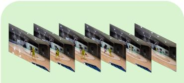
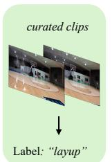
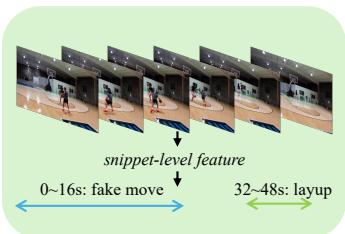
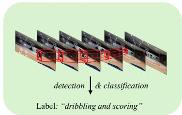
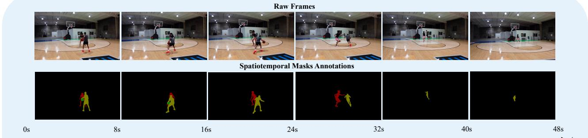
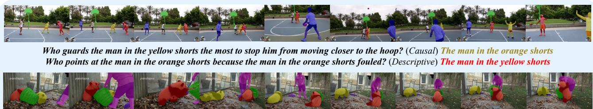
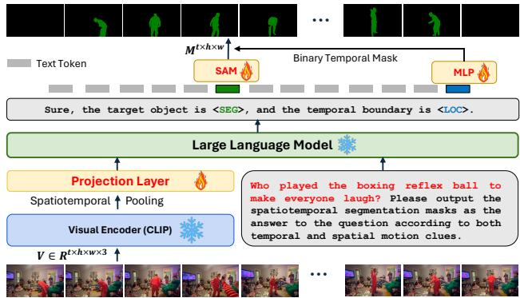

# Motion-Grounded Video Reasoning: Understanding and Perceiving Motion at Pixel Level

Andong Deng1, Tongjia Chen2, Shoubin Yu3, Taojiannan Yang4, Lincoln Spencer1, Yapeng Tian5, Ajmal Saeed Mian2, Mohit Bansal3, Chen Chen1

1CRCV, University of Central Florida, 2University of Western Australia, 3UNC, Chapel Hill, 4Amazon Web Services, 5 The University of Texas at Dallas

## Abstract

We introduce Motion-Grounded Video Reasoning, a new motion understanding task that requires generating visual answers (video segmentation masks) according to the input question, and hence needs implicit spatiotemporal reasoning and grounding. It extends existing spatiotemporal grounding work focusing on explicit action/motion grounding, to a more general format by enabling implicit reasoning via questions. Tofacilitate the development ofthe new task, we collect a large-scale dataset called GROUND-MORE, which comprises 1,715 video clips, 249K object masks that are deliberately designed with 4 question types for benchmarking deep and comprehensive motion reasoning abilities. GROUNDMORE uniquely requires models to generate visual answers, providing a more concrete and visually interpretable response than plain texts. It evaluates models on both spatiotemporal grounding and reasoning, fostering to address complex challenges in motion-related video reasoning, temporal perception, and pixel-level understanding. Furthermore, we introduce a novel baseline model named MORA, which achieves respectable performance on GROUNDMORE outperforming the best existing visual grounding baseline model by an average of 21.5% relatively. We hope this novel and challenging task will pave the way for future advancements in robust and general motion understanding via video reasoning segmentation. Project available at: https://groundmore.github.io/

## 1. Introduction

Understanding motions [1, 11, 64, 88] in dynamic video scenes has long been an important topic in the computer vision community. It plays a crucial role in many vital real-world applications, such as scene/video understanding [15, 49, 55, 61, 65], autonomous driving [8, 22, 35, 59], and human-computer interaction [2, 56, 69]. Existing motion understanding tasks (e.g., action recognition [7, 60], temporal action localization [6, 27], spatiotemporal action/object detection [16, 19, 28, 39, 66], video object segmentation [10, 13, 30, 57, 75]) are designed to comprehend spatial interactions or detect motions in temporal span.

However, motion is a complex spatiotemporal concept involving interactions between visual entities over time. Understanding motion-related attributes abstracted from dynamic scenes is crucial for comprehensive motion understanding. Table 1 highlights that existing tasks only address this challenge from specific aspects. As shown in Figure 1(a), action recognition focuses on identifying actions within a curated video clip, primarily using spatial features. The models are not required to distinguish fine-grained motion patterns over time but to recognize ”the motion” mostly based on spatial features in a temporal-agnostic [23] manner due to potential single-frame bias [34]. It leads to overlook fine-grained temporal motion patterns. Conversely, temporal action localization in Figure 1(b) emphasizes the temporal dimension but lacks detailed spatial analysis at the object level, relying on snippet-level features. Spatiotemporal action detection aims to localize actions in both dimensions but typically focuses only on humans in predefined actions (e.g., AVA [19], MultiSports [39]), neglecting other interacting objects. It impairs the integrity of the spatial perception of motion understanding. Previous compositional action recognition investigates subject-object interaction and examines whether the model could distinguish pretended actions, but the benchmark [18] only contains short clips, making the task fall short in analyzing the temporal context of motions. Thus, a crucial question arises: What will be a more comprehensive task for motion understanding? Inspired by the recent reasoning segmentation task in image domain [33], and considering the spatiotemporal nature of

Motion Expression: The man in grey passed the man in pink pants and performed layup.

  
(a) Action Recognition

  
(b) Temporal Action Localization  
(c) Motion Expression Video Segmentation

  
(d) Spatiotemporal Action Detection

  
Causal Question: What did the man in grey dibbles in a step-back move to perform a fake action fooling the man in pink pants? (0\~16s) Sequential Question: Who dribbled the ball before he accelerates passing the man in pink shorts? (0-24s) Counterfactual Question: Who needs to be passed or else the man in grey cannot easily score? (0\~32s) Descriptive Question: Who consumes more energy in this video? (0\~48s)  
(e) Motion-Grounded Video Reasoning and GroundMoRe Dataset  
Figure 1. The illustration of the comparison between our Motion-Grounded Video Reasoning and previous video motion understand ing tasks. Existing video motion understanding tasks (a)-(d) could at most address one or two key problems, either lacking fine-grained spatiotemporal perception or ignoring motion-related reasoning. (e) Our Motion-Grounded Video Reasoning considers both subject and object in motion as well as temporally adjacent events, performing challenging reasoning given four types of questions (Causal, Se quential, Counterfactual, and Descriptive) carefully designed in our GROUNDMORE dataset and output spatiotemporal masks to indi cate the answer visually at the pixel level. For instance, in the question ‘‘who needs to be passed or else the man in grey cannot easily score?’’, the motion ‘‘pass’’ and the subject ‘‘the man in grey’’ as well as an adjacent event ‘‘easily score’’ are provided in this question, the model needs reason about the object ‘‘the man in pink shorts’’, while output spatiotemporal masks (only between 0 to 32s where the motion ‘‘pass’’ happens). Such a paradigm fully grasps the spatiotemporal contexts of motion and provides an explainable response to evaluate the motion understanding ability. The colors of the questions are corresponded to the spatiotemporal masks.

the motion as mentioned above, a feasible answer is to design an implicit video reasoning segmentation task where all necessary spatial and temporal factors of the motion of interest are taken into account, and then the motion-related object, which could be viewed as the medium of the corresponding motion, will be masked out as the final response.

First, understanding specific motions requires analyzing their spatial contexts. For instance, in the interaction scenario ‘‘a boy kicked the ball for entertainment’’, the entities ‘‘a boy’’ and ‘‘the ball’’ constitute the spatial context for the motion ‘‘kicked’’. A comprehensive understanding of ‘‘kicked’’ involves grasping the interaction tuple <a boy, kick, the ball>. While spatiotemporal action localization tasks might address this problem, current benchmarks (e.g., AVA [19]) focus primarily on human-centric cases and overlook the bidirectional nature of interactions. A more effective approach would involve a question-answering format that leverages motionrelated objects to visualize and reason about the interaction, enhancing spatial understanding. Second, temporal context, which provides chronological order to distinguish different motions, is also crucial for motion understanding. Temporal information not only delineates temporal boundaries but also enables understanding of cause-and-effect relationships between actions. For example, in ‘‘the woman opened the refrigerator before taking out the milk’’, the two motions are connected, necessitating understanding of both for full comprehension. Thus, a question-answering paradigm can be designed, where a complete scene description with spatiotemporal context is converted into a motion-related question. However, merely answering the question cannot fully convey motion understanding, as language alone, if not visually grounded, is not the most direct explanation of visual concepts [17], and temporal information cannot be precisely represented by words [74]. Recent studies [3, 43, 76] have introduced a new task called video reasoning segmentation, which is closely related to our work. However, they primarily emphasize the spatial grounding of target objects through implicit reasoning, while neglecting temporal localization, a critical component for motion understanding.

<table><tr><td>Tasks</td><td>Datasets &amp; Benchmarks</td><td>Spatial Context</td><td>Temporal Context</td><td>Motion Abstraction</td><td>Pixel-level Output</td><td>Implicit Reasoning</td></tr><tr><td>Action Recognition</td><td>Kinetics400 [7], UCF101 [60]</td><td>X</td><td>X</td><td>X</td><td>X</td><td>X</td></tr><tr><td>Temporal Action Localization</td><td>ActivityNet [6], THUMOS14 [27]</td><td>X</td><td></td><td>X</td><td>X</td><td>X</td></tr><tr><td>Spatiotemporal Action Localization</td><td>AVA [19], MultiSports [39]</td><td></td><td></td><td>X</td><td>X</td><td>X</td></tr><tr><td>Motion Expression Video Segmentation</td><td>MeViS [13]</td><td></td><td>X</td><td>X</td><td></td><td>X</td></tr><tr><td>Video Reasoning Segmentation</td><td>ReVOS [76],VideoReasonSeg [86]</td><td></td><td>X</td><td>X</td><td></td><td></td></tr><tr><td>Motion-Grounded Video Reasoning</td><td>GROUNDMoRE (Ours)</td><td></td><td></td><td></td><td>1</td><td></td></tr></table>

Table 1. Comparison of different motion understanding tasks. Spatial Context means whether to consider object-level interaction, Temporal Context indicates the influence of temporally adjacent motions/events, Motion Abstraction means understanding of motion-related abstract attributes, Pixel-level Output means whether output object segmentation mask as the final response and Implicit Reasoning means the ability to understand textual input without explicit object information.

To address these issues and facilitate comprehensive motion understanding, we introduce a novel task: Motion-Grounded Video Reasoning as illustrated in Figure 1(e). This task requires models to take the motion-related question along with the video as input and output spatiotemporal segmentation masks of a specific object as a pixel-level visual answer. Such detailed spatiotemporal grounding allows for advanced motion comprehension. To further evaluate versatile spatiotemporal reasoning, we carefully design four types of questions in our newly collected dataset GROUNDMORE (Grounding via Motion Reasoning). As shown in Figure 1(e), Causal questions explore the motivations behind motions, Sequential questions probe the order of temporally adjacent motions, Counterfactual questions are designed for imagining and reasoning about false reality and Descriptive questions ask about the general dynamic scene or abstract motion-related attributes such as enregetic, naughty, excited, etc. GROUNDMORE consists of about 1,715 video clips, 7,577 questions and 249K object masks involving 3,942 different objects, ensuring a robust evaluation of motion understanding. Additionally, our task aligns with Video Object Segmentation (VOS) [13, 75] but introduces additional challenges: 1) the use of implicit question inputs versus explicit referring expressions, and 2) the requirement for spatiotemporal object masks rather than spatial-only (no temporal localization requirement in current RVOS datasets), emphasizing the need for accurate temporal perception. We emphasize the practical benefits of the new task in diverse real-world applications. For example, localizing potential threats in public transportation often involves ambiguous information about the suspects [62, 78]. A robust Motion-Grounded

Video Reasoning system can address this by processing queries like ‘‘Who is acting suspiciously in this airport?’’, effectively identifying unusual behaviors with implicit reasoning and grounding.

We conduct an extensive evaluation for various image/video grounding baselines on GROUNDMORE, though scoring competitive performances in other benchmarks [13, 29, 75], none of them performs satisfyingly on our new task as shown in Table 3. Considering the spatiotemporal reasoning and grounding nature of the task, we further propose a new baseline model called Motion-Grounded Video Reasoning Assistant (MORA). MORA integrates LLaVA [43], which is capable of complex multimodal reasoning, as the reasoning module, and a pretrained SAM [32] decoder as the mask head. To further empower the model of temporal awareness, we additionally introduce a novel [LOC] token for temporal information embedding and add a temporal localization head to decode a binary temporal mask; thus inhibiting false temporal activation during spatiotemporal mask decoding. Our MORA achieves overall SOTA performance on the proposed GROUNDMORE, but there still remains a large room for future improvement (e.g., HTR [48] could reach 67.1 with J&F metric on Ref-YouTubeVOS as its SoTA, while only 10.41 on GROUND-MORE), which also underscores the increased difficulty of GROUNDMORE.

Our contributions are as follows:

• We introduce a new task, Motion-Grounded Video Reasoning, designed to assess multimodal models’ reasoning and perception capabilities for motion understanding, filling the gap between referring VOS/action detection and motion-related video reasoning.

• We collect a large-scale and versatile video dataset, named GROUNDMORE for the proposed Motion-Grounded Video Reasoning task.

• We comprehensively evaluate existing image/video grounding baseline models on our GROUNDMORE, revealing their deficient motion understanding abilities. On the other hand, our proposed MORA method achieves SOTA performance on GROUNDMORE. The results also suggest substantial room for future improvement.

## 2. Related Work

Motion Understanding in Videos. Motion understanding is pivotal in video analysis, serving as the basis for interpreting dynamic scenes and activities. Action recognition [7, 60] identifies specific actions in videos, while temporal action localization [6, 27] pinpoints the exact time intervals of these actions, requiring a thorough grasp of motion patterns over time. Spatiotemporal action detection [16, 19, 39] and video object detection [28, 66] predict object bounding boxes in both spatial and temporal domains. Video object segmentation (VOS) [75] and video tracking [10] capture moving objects in videos relying on objects appearance. To fully understand motion, it is crucial to comprehend its spatiotemporal contexts, including the involved objects and temporally adjacent information. In this paper, we introduce Motion-Grounded Video Reasoning, a new task that aims to reason based on the spatiotemporal context of motion and respond with video object masks.

Spatiotemporal Video Grounding. Spatiotemporal video grounding involves leveraging temporal cues to localize, identify, and interpret objects based on natural language expressions. Existing pipelines either focus on enhancing visual/textual semantic understanding [4, 21, 30, 38, 42, 48] or strengthening cross-modal interaction [14, 20, 44, 47, 71–73]. Action grounding [54, 81] localizes actions indicated by the input descriptions, and referring VOS [30, 57] aims to ground objects at pixel level based on objectrelated expressions and recent work MeViS [13] introduces more challenging motion expressions, demanding advanced motion understanding to segment moving objects. These advanced frameworks achieve outstanding performance in grounding objects of interest in both spatial and temporal dimensions, however, these works primarily focus on context-level understanding and cannot perform complex reasoning and motion context perceiving. Recent works [24, 33, 50, 52, 83, 85] connects reasoning abilities of LLMs to the grounding task. PG-Video-LLaVA [50] is a video-LLM equipped with pixel-level grounding modules but struggles with implicit reasoning/referring. LITA [24] leverages LLM for 1-D video temporal span localization with text query. VISA [76] and ViLLa [86] are most related to our work, but they only focus on spatial grounding. In this paper, we present a novel baseline model, MORA, that handles both complex spatiotemporal reasoning and grounding for the proposed Motion-Grounded Video Reasoning task.

Video Reasoning. Video reasoning [26, 63, 67, 68, 70, 79, 80, 82] is an advanced domain in multimodal video understanding, enabling models to answer questions based on video by comprehensively interpreting both visual and textual semantics. Early works like MovieQA [63] use movies as visual sources and pose questions that require understanding long temporal correspondences and dialogue logic. TGIF-QA [26] introduces more challenging question types involving repeating actions, and state transitions, necessitating spatiotemporal reasoning. Causal-VidQA [36] explores commonsense and evidence reasoning. Recent NExT-GQA [74] emphasizes the visual evidence for answers, akin to our GROUNDMORE, but we additionally provide pixel-level annotations and focus specifically on motion. PerceptionTest [51] is a benchmark designed to evaluate multimodal video models’ perception and reasoning skills. It includes grounded video QA but lacks motion grounding at the pixel level. Our Motion-Grounded Video Reasoning is presented as a Video QA task where the answer is spatiotemporal masks, offering a more visually concrete assessment of motion understanding.

## 3. Our Benchmark: GROUNDMORE

## 3.1. Motion-Grounded Video Reasoning

Task Definition. We propose Motion-Grounded Video Reasoning as a comprehensive motion understanding task. Basically, the input is a video clip $V \in R ^ { t \times h \times w \times 3 } \left( t , w , h , \right.$ 3 represent video length, width, height, and channel numbers, respectively), and a corresponding question Q that is related to a specific motion, the direct answer is an object in this video clip. To let the model understand when/where the motion occurs and generate a grounded response at the pixel level, we require binary object segmentation masks $M \in R ^ { t ^ { \prime } \times h \times w } \left( t ^ { \prime } \leq t \right)$ related to the motion as the output. Task Challenges. The key challenges of the proposed Motion-Grounded Video Reasoning lie in the following: 1) motion-related reasoning ability towards questions and 2) pixel-level understanding ability of the target moving object in both spatial and temporal dimensions. Concretely, for the first point, the model needs to grasp the relationship between the target motion and its spatiotemporal context, for instance, in the video where ‘‘the girl fed the dog with a piece of dog food after taking the dog food out from the cabinet’’. For the motion ‘‘fed’’, to fully understand this concept, its spatial contexts ‘‘the girl’’ and ’’a piece of dog food’’ should also be well perceived; and the temporal context, which is the temporally adjacent motion ‘‘taking the dog food out from the cabinet’’ should be understood as well since it serves as the temporal constraint on the answer. Then, based on the question ‘‘Who fed the dog with a piece of dog food after taking the dog food out from the cabinet?’’,

only when all the spatiotemporal contexts are well grasped could the model know the answer. Second, once the model reasons about the answer, it is also required that a sequence of spatiotemporal masks represent the answer since only language output cannot avoid biased response [74] (e.g., in a common scenario of ball game video, when asking about the motion ’’play’’, existing QA models tend to answer ’’balls’’ even without visual clues). This is of vital importance in our task, since only in a way of visual response could we know whether the model is aware of when and with what/whom the motion takes place.

<table><tr><td>Datasets</td><td># Vid.</td><td># Exp.</td><td>R. # Masks</td><td># Obj.</td><td></td><td>Clip Len.</td></tr><tr><td colspan="7">Video Question-Answering</td></tr><tr><td>NExT-GQA [74]</td><td>5.4K</td><td>43K</td><td></td><td></td><td></td><td>43.60s</td></tr><tr><td>Causal-VidQA [36]</td><td>26.9K</td><td>10.7K</td><td></td><td></td><td></td><td>9.00s</td></tr><tr><td>Perception Test [51]</td><td>11.6K</td><td>380K</td><td></td><td></td><td>190K</td><td>23s</td></tr><tr><td colspan="7">Action Detection</td></tr><tr><td>UCF101-24 [60]</td><td>3.2K</td><td></td><td>x</td><td></td><td>4.4K</td><td>6.90s</td></tr><tr><td>AVA [19]</td><td>0.4K</td><td></td><td>x</td><td></td><td>56K</td><td>15m</td></tr><tr><td>FineGym [58]</td><td>4.8K</td><td>=</td><td>x</td><td></td><td>32.7K</td><td>10m</td></tr><tr><td>MultiSports [39]</td><td>3.2K</td><td></td><td>x</td><td></td><td>37.7K</td><td>20.9s</td></tr><tr><td colspan="7">Referring Video Segmentation / Video Grounding</td></tr><tr><td>Ref-YouTube-VOS [75]</td><td>3.9K</td><td>15K</td><td>X</td><td>131K</td><td>7.4K</td><td>5.45s</td></tr><tr><td>Ref-Davis17 [30]</td><td>0.1K</td><td>1.5K</td><td>x</td><td>13.5K</td><td>0.2K</td><td>2.87s</td></tr><tr><td>MeViS [13]</td><td>2K</td><td>28,570</td><td>x</td><td>443K</td><td>8.1K</td><td>13.16s</td></tr><tr><td>VidSTG [84]</td><td>6.9K</td><td>99.9K</td><td></td><td></td><td>50K</td><td>28.01s</td></tr><tr><td colspan="7">Motion-Grounded Video Reasoning (Ours)</td></tr><tr><td>GROUNDMORE</td><td>1.7K</td><td>7.6K</td><td></td><td>249.5K</td><td>3.9K</td><td>9.61s</td></tr></table>

Table 2. Comparison of different video datasets. # Vid.: number of videos. R.: requires reasoning skill. # Exp.: number of expressions. # Obj.: number of total object categories in the dataset and Clip Len.: average clip length.

## 3.2. Video Collection

Considering that pixel-level response is required in our Motion Grounded Video Reasoning, we carefully selected high-resolution videos (720p) from YouTube as our source videos. To ensure there are enough motion semantic and reasoning concepts in our dataset, we selected the videos from 4 scenarios: family, animal, ball game, and outdoor activity. Specifically, family videos usually include sufficient indoor human-human and human-object interaction, covering representative daily events such as cooking, parties, etc. Animal videos contain wild animal interactions and also a lot of human-pet interactions. Ball game videos include the most common ball-related sports such as basketball, soccer, etc. Such videos often consist of a series of intensive motions that bond with strong temporal correspondence in the players. Finally, outdoor activity videos contain general outdoor events such as hiking, and surfing as well as normal events like kids playing in the park. We designed our dataset in this way to guarantee that it could be a benchmark with diverse video types to evaluate the comprehensive motion-related reasoning in daily life. The details of video scenes can be found in Supplementary. Further, we selected short clips that contain abundant motion semantics, and most of them are between 5 and 15 seconds. To ensure sufficient temporal information will be included in GROUNDMORE, we intentionally exclude samples where the motion understanding could be easily addressed without temporal information. The comparison between GROUNDMORE and other related datasets is shown in Table 2. Note that the most similar datasets are MeViS [13] and VidSTG [84]. However, MeViS does not support implicit reasoning, where the input expression contains the identity of the answer; while VidSTG focuses more on general object relation, and pixel-level annotation is not provided. Besides, the most recent ReVOS [76] and VideoReasonSeg [86] did not consider temporal grounding and they are directly constructed based on existing video object segmentation datasets, which potentially limits their question design. More discussion on the necessity of GROUND-MORE and the statistic is provided in Supplementary.

## 3.3. Annotation Pipeline

We design a 2-stage annotation pipeline for our question annotation: 1) motion-related expression annotation; 2) LLM-assisted QA generation. The annotation details can be found in Supplementary.

Question Annotation Stage 1: Motion-related expression annotation. Formally, interaction-causal expressions are with the following format: <obj A, motion, obj B, to do something>. Such expression could reveal the motivation behind a specific motion. Interaction-temporal expressions enable the analysis between temporally adjacent motions, which follows the format: <obj A, motion, obj B, before/after another motion>. In this setting, we want the model to understand motion in a temporal context and the question generated from this expression could assess the temporal awareness of the models. Moreover, we also have descriptive expression, which includes general dynamic scene descriptions and motion-related attributes that are abstracted from specific motions. The second descriptive expression could be much more challenging since it did not mention any motions here but requires detailed crossmodal and commonsense reasoning.

Question Annotation Stage 2: LLM-assisted QA generation. We define 4 types of questions in our GROUNDMORE dataset: Causal questions are generated from interactioncausal expressions, which challenge models to understand the complex relationship within interactions based on some motivations behind them. Sequential and Counterfactua questions are both generated from interaction-temporal expressions. The former investigates the chronological relations between different motions and the latter requires outstanding reasoning ability to imagine situations where it conflicts with reality. Descriptive questions are converted from descriptive questions. It assesses the ability to understand general scenes and use visual commonsense reasoning. Several QA examples are shown in Figure 2 and the detailed question-type statistics can be found in Supplementary. Before question generation, we ask our annotators to additionally annotate an index for each object related to the potential answer in our expressions in order to point out what to target in each question for the LLM we use. Basically, we leverage the strong text generation ability of GPT-4 for our question generation. We carefully design a prompt in an in-context manner (details in Supplementary) that requires GPT-4 to generate a question and the corresponding answer based on the expression and the target objects. The annotators manually check all QAs to ensure the quality.

  
Who might not run towards the basket if the basket had not been moved? (Counterfactual) The panda close to the wall in the beginning Who drops the purple broom after seeing the panda would not leave the basket? (Sequential) The woman

Mask Annotation. We utilized the interactive tool of XMem++ [5] as our mask annotation tool. To begin with, we ask our annotators to annotate the motion timestamp for spatiotemporal mask annotation additionally. Concretely, given the video clips and the corresponding object ID information, the annotators are asked to annotate the masks for each of the objects within the motion time range. In Figure 2, we show several representative examples of our GROUNDMORE.

Quality Control. After completing the annotation process, the dataset is distributed to different annotators for quality validation. A question annotation is considered qualified if the annotator can derive the same answer as originally annotated based on the video clips. In the mask annotation, there are usually two common issues. The first is the correct mask-answer pair but poor mask quality; the second is the wrong mask-answer pair. For the first case, the annotator will improve the quality and the original annotator will check again, this process will end until the instance meets the required standard; for the second case, since it will take less effort to annotate a new instance, we just directly discard those defective annotations. In the end, all of the maskanswer pairs will meet the criteria.

## 4. Experiments

## 4.1. Baseline Models for Evaluation

We choose baselines including 1) Referring VOS Models: ReferFormer [72], SgMg [47], HTR [48], and LMPM [13], that are pure visual segmentation models and without LLMs. 2) Image Reasoning Segmentation Models: LISA [33] and PixelLM [87] that have strong LLM and are equipped with extra spatial grounding heads. We adapt them to videos in a frame-by-frame manner. 3) Video Reasoning Segmentation Models: PG-Video-LLaVA [50] that is build upon video-LLM [46] and strong grounding modules [9, 32, 45] and VISA [76] consisting of LLaMA-VID [40] and SAM [31]. Since our task could be solved in a non-end-to-end, two-stage manner (answering first, segmentation next), we also evaluate 4) Two-stage Baselines that are composed by strong general video-language model (ViLA [41] and VideoChat2 [37]) / video QA models (SeViLA [77]) and Referring VOS models.

Figure 2. Visualizations of GROUNDMORE, including videos, questions, and visual answers (masks). Answer colors correspond to the masks. More examples can be found in Supplementary.  
  
Figure 3. MORA adopts the spatiotemporal pooling strategy and inserts the extra special [SEG] token. To enable the temporal localization ability, MORA utilizes the extra [LOC] token to learn a binary temporal mask, which refines the direct SAM outputs.

## 4.2. Our Method: MoRA

Our Motion-Grounded Video Reasoning Assistant (MoRA) is built upon LISA [33], which is an image-based reasoning segmentation framework, equipping the strong LLaVA [43] and SAM [32]. To perform an efficient frame encoding, we take advantage of the spatiotemporal pooling mechanism in Video-ChatGPT [46]. We leverage the segmentation token [SEG] in LISA for spatial segmentation. However, one of the most challenging points in our task is that we need not only to segment the objects in the spatial dimension but also to localize them temporally. Therefore, as shown in Figure 3, to construct a unified LLM-based framework, we leverage extra [LOC] tokens to encode the temporal boundary information in the language space. The [LOC] embedding is decoded by an MLP layer into a temporal mask to prevent false activations during frame-wise mask decoding.

<table><tr><td rowspan="2">Methods</td><td colspan="3">Overall</td><td colspan="3">Causal</td><td colspan="3">Sequential</td><td colspan="3">Counterfactual</td><td colspan="3">Descriptive</td></tr><tr><td>J&amp;F</td><td>J</td><td>F</td><td>J&amp;F</td><td>J</td><td>J&amp;F</td><td>J</td><td></td><td>F</td><td>J&amp;F</td><td>J</td><td>F</td><td>J&amp;F</td><td>F</td></tr><tr><td></td><td></td><td></td><td></td><td></td><td>Random Baseline</td><td></td><td></td><td></td><td></td><td></td><td></td><td></td><td></td><td></td><td></td></tr><tr><td>Title+ReferFormer [72] 10.13</td><td>9.73 10.53 10.50</td><td></td><td></td><td>9.91</td><td></td><td>11.08</td><td>9.06</td><td>8.56</td><td>9.57</td><td>9.42</td><td>9.07</td><td>9.78</td><td>11.38</td><td>11.21</td><td>11.55</td></tr><tr><td></td><td></td><td></td><td></td><td></td><td>RVOS Baseline</td><td></td><td></td><td></td><td></td><td></td><td></td><td></td><td></td><td></td><td></td></tr><tr><td>ReferFormer [72]</td><td>12.72</td><td>11.15</td><td>14.29</td><td>12.67</td><td>10.95 14.38</td><td></td><td>10.73</td><td>9.35</td><td>12.10</td><td>12.36</td><td>11.12</td><td>13.61</td><td>15.15</td><td>13.26</td><td>17.04</td></tr><tr><td>SgMg [47] HTR [48]</td><td>17.49</td><td>15.81</td><td>19.16</td><td>18.94</td><td>17.04</td><td>20.85</td><td>15.46</td><td>13.97</td><td>16.96</td><td>16.35</td><td>15.24</td><td>17.45</td><td>18.77</td><td>16.69</td><td>20.86</td></tr><tr><td>LMPM [13]</td><td>14.48 13.34</td><td>12.71 12.71</td><td>16.24</td><td>15.66 13.71</td><td>13.82</td><td>17.51</td><td>12.46</td><td>10.78</td><td>14.14</td><td>13.51</td><td>12.16</td><td>14.86</td><td>15.94</td><td>13.80</td><td>18.08</td></tr><tr><td></td><td></td><td></td><td>13.97</td><td></td><td>13.13</td><td>14.30</td><td>11.30</td><td>10.60</td><td>12.01</td><td>13.16</td><td>12.64</td><td>13.68</td><td>14.33</td><td>13.60</td><td>15.05</td></tr><tr><td>Image Reasoning Segmentation Baseline</td><td></td><td></td><td></td><td></td><td></td><td></td><td></td><td></td><td></td><td></td><td></td><td></td><td></td><td></td><td></td></tr><tr><td>LISA-7B [33]</td><td>6.11</td><td>4.89</td><td>7.32</td><td>5.53</td><td>4.38</td><td>6.69</td><td>5.19</td><td>4.07</td><td>6.32</td><td>5.88</td><td>4.77</td><td>6.98</td><td>7.56</td><td>6.11</td><td>9.00</td></tr><tr><td>LISA-13B [33] PixelLM-7B [87]</td><td>6.47 9.96</td><td>6.30 9.93</td><td>6.65 9.99</td><td>7.60</td><td>7.55</td><td>7.64</td><td>5.21</td><td>4.96</td><td>5.46</td><td>4.96</td><td>4.83</td><td>5.10</td><td>7.77</td><td>7.47</td><td>8.06</td></tr><tr><td>PixelLM-13B [87]</td><td>11.54</td><td>11.08</td><td>12.00</td><td>9.52 12.34</td><td>9.39</td><td>9.65</td><td>9.21</td><td>9.15</td><td>9.27</td><td>9.82</td><td>9.76</td><td>9.87</td><td>10.94</td><td>11.02</td><td>10.85</td></tr><tr><td></td><td></td><td></td><td></td><td></td><td>12.02</td><td>12.67</td><td>10.39</td><td>9.63</td><td>11.14</td><td>10.86</td><td>10.32</td><td>11.40</td><td>12.58</td><td>12.37</td><td>12.79</td></tr><tr><td colspan="10">Video Reasoning Segmentation Baseline 10.33</td><td></td><td></td><td></td><td></td><td></td><td></td></tr><tr><td>PG-Video-LLaVA [50]</td><td>11.17</td><td>11.47</td><td>10.89</td><td>10.57</td><td>10.82</td><td></td><td>10.93</td><td>11.15</td><td>10.71</td><td>10.36</td><td>10.37</td><td>10.34</td><td>12.51</td><td>13.04</td><td>11.99</td></tr><tr><td>PG-Video-LLaVA+SAM2 [53] VISA [76]</td><td>11.85</td><td>11.15</td><td>12.55</td><td>13.35</td><td>12.84 13.85</td><td>3.85</td><td></td><td>2.49</td><td>5.22</td><td>15.52</td><td>15.16</td><td>15.89</td><td>12.11</td><td>11.37</td><td>12.85</td></tr><tr><td></td><td>5.31</td><td>4.72</td><td>5.90</td><td>6.07</td><td>5.50 6.64</td><td></td><td>4.48</td><td>3.80</td><td>5.15</td><td>5.10</td><td>4.34</td><td>5.86</td><td>5.39</td><td>5.02</td><td>5.77</td></tr><tr><td colspan="10">Two-Stage Baseline</td><td></td><td></td><td></td><td></td><td></td><td></td></tr><tr><td>ViLA [41]+ReferFormer</td><td>16.37</td><td>14.84</td><td>17.89</td><td>15.92</td><td>14.33 17.52</td><td>16.30</td><td></td><td>14.94</td><td>17.67</td><td>13.63</td><td>12.35</td><td>14.91</td><td>19.61</td><td>17.78</td><td>21.45</td></tr><tr><td>ViLA [41]+SgMg</td><td>17.07</td><td>15.25</td><td>18.89</td><td>17.34</td><td>15.43</td><td>19.26</td><td>16.30</td><td>14.57</td><td>18.04</td><td>15.31</td><td>13.96</td><td>16.67</td><td>19.18</td><td>16.96</td><td>21.40</td></tr><tr><td>ViLA [41]+HTR</td><td>15.72</td><td>13.90</td><td>17.53</td><td>16.46</td><td>14.60</td><td>18.31</td><td>15.11</td><td>13.39</td><td>16.83</td><td>12.61</td><td>11.22</td><td>13.99</td><td>18.37</td><td>16.10</td><td>20.63</td></tr><tr><td>VideoChat2 [37]+ReferFormer</td><td>15.38</td><td>13.84</td><td>16.93</td><td>14.74</td><td>13.10</td><td>16.37</td><td>13.95</td><td>12.69</td><td>15.21</td><td>13.12</td><td>11.80</td><td>14.43</td><td>19.82</td><td>17.89</td><td>21.74</td></tr><tr><td>VideoChat2 [37]+SgMg</td><td>16.65</td><td>14.83</td><td>18.48</td><td>16.64</td><td>14.75</td><td>18.54</td><td>14.70</td><td>13.02</td><td>16.38</td><td>15.22</td><td>13.87</td><td>16.58</td><td>20.01</td><td>17.68</td><td>22.34</td></tr><tr><td>VideoChat2 [37]+HTR</td><td>15.08</td><td>13.25</td><td>16.90</td><td>15.91</td><td>14.00</td><td>17.81</td><td>13.91</td><td>12.33</td><td>15.50</td><td>11.97</td><td>10.56</td><td>13.37</td><td>18.17</td><td>15.82</td><td>20.52</td></tr><tr><td>SeViLA [77]+ReferFormer</td><td>20.37</td><td>18.99</td><td>21.75</td><td>21.29</td><td>19.86</td><td>22.72</td><td>18.27</td><td>17.06</td><td>19.48</td><td>17.56</td><td>16.37</td><td>18.75</td><td>24.01</td><td>22.35</td><td>25.66</td></tr><tr><td>SeViLA [77]+SgMg SeViLA [77]+HTR</td><td>22.34 21.75</td><td>20.92</td><td>23.75</td><td>21.60</td><td>20.17</td><td>23.02</td><td>21.68</td><td>20.47</td><td>22.89</td><td>20.46</td><td>19.32</td><td>21.61</td><td>24.53</td><td>22.83</td><td>26.22</td></tr><tr><td>MoRA (Ours)</td><td>23.13</td><td>19.85 22.79</td><td>23.64 23.46</td><td>22.28 21.62</td><td>20.42</td><td>24.15</td><td>20.37 22.43</td><td>18.60 22.03</td><td>22.14 22.83</td><td>19.70 26.37</td><td>18.03 25.87</td><td>21.36 26.88</td><td>24.41 22.63</td><td>22.11 22.30</td><td>26.71 22.97</td></tr></table>

Table 3. Motion-Grounded Video Reasoning results on our benchmark. We compare all methods in a zero-shot setting. Darker orange indicates better performance. Best view in color.
<table><tr><td rowspan="2">Methods</td><td rowspan="2">Implict Reasoning</td><td rowspan="2">Temporal Context</td><td colspan="3">Overall</td></tr><tr><td>J&amp;F</td><td>J</td><td>F</td></tr><tr><td rowspan="3">ReferFormer</td><td></td><td></td><td>12.72</td><td>11.15</td><td>14.29</td></tr><tr><td>X</td><td></td><td>29.58</td><td>28.12</td><td>31.05</td></tr><tr><td>√</td><td>X</td><td>8.55</td><td>7.69</td><td>9.41</td></tr><tr><td rowspan="3">SgMg</td><td></td><td></td><td>17.49</td><td>15.81</td><td>19.16</td></tr><tr><td>X</td><td>V</td><td>30.16</td><td>27.86</td><td>32.45</td></tr><tr><td>√</td><td>X</td><td>12.08</td><td>11.14</td><td>13.01</td></tr><tr><td rowspan="3">HTR</td><td>√</td><td>V</td><td>14.48</td><td>12.71</td><td>16.24</td></tr><tr><td>X</td><td></td><td>27.83</td><td>25.63</td><td>30.03</td></tr><tr><td></td><td>x</td><td>10.02</td><td>8.95</td><td>11.10</td></tr></table>

Table 4. Dataset diagnostics w.r.t. implicit reasoning and temporal context.

In training, we directly initialize our MoRA with a pretrained LISA due to its well-leaned text-object alignment. Further, in order to adapt the model with vision-language alignment in the video domain, we first pre-train it with the Ref-YouTubeVOS [75] and MeViS [13] dataset (we convert the original text annotation into QA formats to force MORA to follow the instructions) for 20 epochs without the temporal localization module, which could be used for zeroshot evaluation. Further, we finetune MoRA, equipped with the localization module, with the training split of GROUND-MORE for another 20 epochs.

## 4.3. Evaluation and Analysis

Metrics. Following prior works [13, 30, 57], we use the popular metrics: Jaccard index (J ) [25] and F-measure (F) [12]. J estimates the IoU of the predicted and the GT masks, $\mathcal { F }$ indicates contour accuracy. We also report $\mathcal { T } \& \mathcal { F }$ to reflect overall performance. We evaluate models on GROUNDMORE across question types, revealing their grounding and reasoning ability from different aspects.

Baseline Comparisons. As shown in Table 3, we first replace the questions with the titles of the corresponding YouTube videos and run as an RVOS task with noisy text labels using ReferFormer [72] as the random baseline. Compared with the random baselines, RVOS models achieve reasonable improvements, especially LMPM [13], which is also trained by MeViS [13] data that contains more motion-related data than simple referring VOS datasets [30, 57]. Surprisingly, image reasoning segmentation baselines [33, 87], with strong LLM, are lower than RVOS models. The reason could be the lack of temporal modeling in those image-level models, which makes it hard to propagate target object information across frames. For PG-Video-LLaVA [50], though it is a video reasoning segmentation/- grounding model, the performance is not even higher than the best RVOS model. A potential reason could be that it tends to ground all salient objects given the scene description due to the redundant response of its video LLM [46], resulting in more false positives. Besides, VISA [76], the latest model for video reasoning segmentation, does not perform well on our benchmark. A likely reason for this is that its frame sampling strategy fails to effectively target keyframes, as the ground truth occupies only part of the temporal span, which results in terrible error accumulations in their mask propagation process. In contrast, twostage baselines [37, 41, 77] show generally stronger results on GROUNDMORE, particularly SeViLA [77], likely due to their enhanced reasoning capabilities, which yield more accurate object responses. More details on the video-LLMs used in two-stage baselines are in the Supplementary.

<table><tr><td rowspan="2">Methods</td><td colspan="3">Overall</td><td colspan="3">Causal</td><td colspan="3">Sequential</td><td colspan="3">Counterfactual</td><td colspan="3">Descriptive</td></tr><tr><td>J&amp;F</td><td>J</td><td>F</td><td>J&amp;F</td><td>J</td><td>F</td><td>J&amp;F</td><td>J</td><td>F</td><td>J&amp;F</td><td>J</td><td>F</td><td>J&amp;F</td><td>J</td><td>F</td></tr><tr><td>MoRA-zs</td><td>23.13</td><td>22.79</td><td>23.46</td><td>21.62</td><td>21.46</td><td>21.79</td><td>22.43</td><td>22.03</td><td>22.83</td><td>26.37</td><td>25.87</td><td>26.88</td><td>22.63</td><td>22.30</td><td>22.97</td></tr><tr><td>MoRA-ft w/o loc. MoRA-ft</td><td>25.62 27.15</td><td>25.72 27.40</td><td>25.57 26.90</td><td>26.25 27.42</td><td>25.73 26.89</td><td>26.77 27.95</td><td>24.66 26.07</td><td>25.38 27.24</td><td>23.93 24.91</td><td>24.34 25.56</td><td>24.34 25.28</td><td>24.34 25.85</td><td>28.44 29.55</td><td>28.68 30.18</td><td>28.20 28.91</td></tr></table>

Table 5. Ablation studies of the localization branch in MORA. zs: zero-shot, ft: fine-tuned.

For different question types, we can also observe that in Causal and Descriptive questions, two-stage baselines built upon ViLA and SeViLA perform better than MORA, we hypothesize that ViLA and SeViLA maintain their strong reasoning ability in these two types of questions when not trained with an additional grounding module; while in the temporal-related questions (i.e., Sequential and Counterfactual), the temporal head in our MORA makes a difference.

Conclusively, our MORA achieves new state-of-the-art, outperforming the best existing video reasoning grounding model (PG-Video-LLaVA) by an average of 11.28. The reasons could be two-fold: (1) the language model in PG-Video-LLaVA provides ambiguous response for its grounding modules while the [SEG] token in MORA is trained end-to-end, conveying more informative features of target objects; (2) PG-Video-LLaVA, as well as other baselines, does not include any temporal localization design while our MORA is supervised by motion timestamps via [LOC] tokens, leading to accurate temporal estimation.

However, the design of our MORA is still basic and there is substantial room for future improvements in both model training and model design. For instance, the LLaVA could be replaced with better LLMs which are trained with more motion-sensitive language corpus to enhance visuallanguage alignment in dynamic scenes; the spatiotemporal pooling, though efficient, could inevitably cause information loss; and better time-sensitive modeling could also replace the simple temporal localization head.

Dataset Diagnosis. In order to showcase that our GROUNDMORE indeed introduces challenges mentioned in Sec. 3.1, we diagnose GROUNDMORE from two aspects, implicit reasoning and temporal context. We examine implicit reasoning by comparing the evaluation metrics between the original setting and replacing questions with the ground truth answer, which could be viewed as referring spatiotemporal video segmentation. As shown in Table 4, providing GT answers could largely alleviate the difficulty of the task, resulting in an average of 14.29 improvement in J &F. For temporal context diagnosis, we simply leverage the temporal annotation of the spatiotemporal masks to segment the original clip and input these motion-heavy clips into the models. As shown in Table 4, comparing the first row and the third row for each model, we could observe a sharp degradation of 4.68 in J &F, which is solid evidence of the importance of the temporal context. More results of the data diagnostics can be found in Supplementary.

Temporal Localization Branch. For the ablation study, we further fine-tuned our MoRA model with and without the temporal localization branch, as shown in Table 5. Incorporating this branch leads to a 6.0% relative improvement, with consistent gains across all question types, underscoring the significance of the temporal localization module. Notably, even without the localization branch, fine-tuning yields substantial improvements, particularly for Causal and Descriptive questions, while the improvement for Sequential questions is modest. In the case of Counterfactual questions, however, there is a performance decline, suggesting that the lack of temporal awareness may limit the benefits of additional data for these specific question types.

## 5. Conclusion

In this paper, we propose a new video task called Motion-Grounded Video Reasoning for comprehensive motion understanding. We consider motion as a combination of its spatiotemporal contexts and design QA to force models to understand implicit textual input and thus reason about the motion-related objects. Further, we point out that due to the spatiotemporal nature of motion, solely output text answers could be vague, which cannot directly illustrate when and where a specific motion takes place. Considering this, we design to output spatiotemporal masks of motionrelated objects, which is a direct and explainable way to address the issue. To meet the evaluation requirement, we also collect a large-scale dataset called GROUNDMORE, which includes 4 types of questions that could evaluate different aspects of motion reasoning abilities. Finally, our simple baseline, MORA, achieved reasonable performance on the new dataset, but suggests there is still much to explore for motion reasoning and understanding.

## References

[1] Jake K Aggarwal and Quin Cai. Human motion analysis: A review. Computer vision and image understanding, 73(3): 428–440, 1999. 1

[2] Jake K Aggarwal and Sangho Park. Human motion: Modeling and recognition of actions and interactions. In Proceedings. 2nd International Symposium on 3D Data Processing, Visualization and Transmission, 2004. 3DPVT 2004., pages 640–647. IEEE, 2004. 1

[3] Zechen Bai, Tong He, Haiyang Mei, Pichao Wang, Ziteng Gao, Joya Chen, Lei Liu, Zheng Zhang, and Mike Zheng Shou. One token to seg them all: Language instructed reasoning segmentation in videos. arXiv preprint arXiv:2409.19603, 2024. 3

[4] Fabien Baradel, Natalia Neverova, Christian Wolf, Julien Mille, and Greg Mori. Object level visual reasoning in videos. In Proceedings of the European Conference on Computer Vision (ECCV), pages 105–121, 2018. 4

[5] Maksym Bekuzarov, Ariana Bermudez, Joon-Young Lee, and Hao Li. Xmem++: Production-level video segmentation from few annotated frames, 2023. 6

[6] Fabian Caba Heilbron, Victor Escorcia, Bernard Ghanem, and Juan Carlos Niebles. Activitynet: A large-scale video benchmark for human activity understanding. In Proceedings of the IEEE Conference on Computer Vision and Pattern Recognition (CVPR), 2015. 1, 3, 4

[7] Joao Carreira and Andrew Zisserman. Quo vadis, action recognition? a new model and the kinetics dataset. In proceedings of the IEEE Conference on Computer Vision and Pattern Recognition, pages 6299–6308, 2017. 1, 3, 4

[8] Chenyi Chen, Ari Seff, Alain Kornhauser, and Jianxiong Xiao. Deepdriving: Learning affordance for direct perception in autonomous driving. In Proceedings of the IEEE International Conference on Computer Vision (ICCV), 2015. 1

[9] Ho Kei Cheng, Seoung Wug Oh, Brian Price, Alexander Schwing, and Joon-Young Lee. Tracking anything with decoupled video segmentation. In Proceedings of the IEEE/CVF International Conference on Computer Vision, pages 1316–1326, 2023. 6

[10] Yangming Cheng, Liulei Li, Yuanyou Xu, Xiaodi Li, Zongxin Yang, Wenguan Wang, and Yi Yang. Segment and track anything. arXiv preprint arXiv:2305.06558, 2023. 1, 4

[11] Enric Corona, Albert Pumarola, Guillem Alenya, and Francesc Moreno-Noguer. Context-aware human motion prediction. In Proceedings of the IEEE/CVF Conference on Computer Vision and Pattern Recognition, pages 6992– 7001, 2020. 1

[12] Lee R Dice. Measures of the amount of ecologic association between species. Ecology, 26(3):297–302, 1945. 7

[13] Henghui Ding, Chang Liu, Shuting He, Xudong Jiang, and Chen Change Loy. Mevis: A large-scale benchmark for video segmentation with motion expressions. In Proceedings ofthe IEEE/CVF International Conference on Computer Vision, pages 2694–2703, 2023. 1, 3, 4, 5, 6, 7

[14] Zihan Ding, Tianrui Hui, Junshi Huang, Xiaoming Wei, Jizhong Han, and Si Liu. Language-bridged spatial-temporal

interaction for referring video object segmentation. In Pro ceedings of the IEEE/CVF Conference on Computer Vision and Pattern Recognition, pages 4964–4973, 2022. 4

[15] Lijie Fan, Wenbing Huang, Chuang Gan, Stefano Ermon, Boqing Gong, and Junzhou Huang. End-to-end learning of motion representation for video understanding. In Proceedings ofthe IEEE conference on computer vision and pattern recognition, pages 6016–6025, 2018. 1

[16] Georgia Gkioxari and Jitendra Malik. Finding action tubes. In Proceedings of the IEEE conference on computer vision and pattern recognition, pages 759–768, 2015. 1, 4

[17] Arthur M Glenberg and Michael P Kaschak. Grounding language in action. Psychonomic bulletin & review, 9(3):558– 565, 2002. 3

[18] Raghav Goyal, Samira Ebrahimi Kahou, Vincent Michalski, Joanna Materzynska, Susanne Westphal, Heuna Kim, Valentin Haenel, Ingo Fruend, Peter Yianilos, Moritz Mueller-Freitag, et al. The” something something” video database for learning and evaluating visual common sense. In Proceedings ofthe IEEE international conference on com puter vision, pages 5842–5850, 2017. 1

[19] Chunhui Gu, Chen Sun, David A Ross, Carl Vondrick, Car oline Pantofaru, Yeqing Li, Sudheendra Vijayanarasimhan, George Toderici, Susanna Ricco, Rahul Sukthankar, et al. Ava: A video dataset of spatio-temporally localized atomic visual actions. In Proceedings of the IEEE conference on computer vision and pattern recognition, pages 6047–6056, 2018. 1, 2, 3, 4, 5

[20] Xin Gu, Heng Fan, Yan Huang, Tiejian Luo, and Libo Zhang. Context-guided spatio-temporal video grounding. arXiv preprint arXiv:2401.01578, 2024. 4

[21] Shuting He and Henghui Ding. Decoupling static and hier archical motion perception for referring video segmentation. arXiv preprint arXiv:2404.03645, 2024. 4

[22] Yihan Hu, Jiazhi Yang, Li Chen, Keyu Li, Chonghao Sima, Xizhou Zhu, Siqi Chai, Senyao Du, Tianwei Lin, Wenhai Wang, Lewei Lu, Xiaosong Jia, Qiang Liu, Jifeng Dai, Yu Qiao, and Hongyang Li. Planning-oriented autonomous driving. In Proceedings of the IEEE/CVF Conference on Computer Vision and Pattern Recognition (CVPR), pages 17853– 17862, 2023. 1

[23] De-An Huang, Vignesh Ramanathan, Dhruv Mahajan, Lorenzo Torresani, Manohar Paluri, Li Fei-Fei, and Juan Carlos Niebles. What makes a video a video: Analyzing temporal information in video understanding models and datasets. In 2018 IEEE/CVF Conference on Computer Vision and Pattern Recognition, pages 7366–7375, 2018. 1

[24] De-An Huang, Shijia Liao, Subhashree Radhakrishnan, Hongxu Yin, Pavlo Molchanov, Zhiding Yu, and Jan Kautz. Lita: Language instructed temporal-localization assistant. arXiv preprint arXiv:2403.19046, 2024. 4

[25] Paul Jaccard. The distribution of the flora in the alpine zone. 1. New phytologist, 11(2):37–50, 1912. 7

[26] Yunseok Jang, Yale Song, Youngjae Yu, Youngjin Kim, and Gunhee Kim. Tgif-qa: Toward spatio-temporal reasoning in visual question answering. In Proceedings of the IEEE con ference on computer vision and pattern recognition, pages 2758–2766, 2017. 4

[27] Y.-G. Jiang, J. Liu, A. Roshan Zamir, G. Toderici, I. Laptev, M. Shah, and R. Sukthankar. THUMOS challenge: Action recognition with a large number of classes. http: //crcv.ucf.edu/THUMOS14/, 2014. 1, 3, 4

[28] Zhengkai Jiang, Yu Liu, Ceyuan Yang, Jihao Liu, Peng Gao, Qian Zhang, Shiming Xiang, and Chunhong Pan. Learning where to focus for efficient video object detection. In Computer Vision–ECCV 2020: 16th European Conference, Glasgow, UK, August 23–28, 2020, Proceedings, Part XVI 16, pages 18–34. Springer, 2020. 1, 4

[29] Sahar Kazemzadeh, Vicente Ordonez, Mark Matten, and Tamara Berg. ReferItGame: Referring to objects in photographs of natural scenes. In Proceedings of the 2014 Conference on Empirical Methods in Natural Language Processing (EMNLP), pages 787–798, Doha, Qatar, 2014. Association for Computational Linguistics. 3

[30] Anna Khoreva, Anna Rohrbach, and Bernt Schiele. Video object segmentation with language referring expressions. In Computer Vision–ACCV 2018: 14th Asian Conference on Computer Vision, Perth, Australia, December 2–6, 2018, Revised Selected Papers, Part IV 14, pages 123–141. Springer, 2019. 1, 4, 5, 7

[31] Alexander Kirillov, Eric Mintun, Nikhila Ravi, Hanzi Mao, Chloe Rolland, Laura Gustafson, Tete Xiao, Spencer Whitehead, Alexander C Berg, Wan-Yen Lo, et al. Segment anything. arXiv preprint arXiv:2304.02643, 2023. 6

[32] Alexander Kirillov, Eric Mintun, Nikhila Ravi, Hanzi Mao, Chloe Rolland, Laura Gustafson, Tete Xiao, Spencer Whitehead, Alexander C Berg, Wan-Yen Lo, et al. Segment anything. In Proceedings of the IEEE/CVF International Conference on Computer Vision, pages 4015–4026, 2023. 3, 6

[33] Xin Lai, Zhuotao Tian, Yukang Chen, Yanwei Li, Yuhui Yuan, Shu Liu, and Jiaya Jia. Lisa: Reasoning segmentation via large language model. arXiv preprint arXiv:2308.00692, 2023. 1, 4, 6, 7

[34] Jie Lei, Tamara L Berg, and Mohit Bansal. Revealing single frame bias for video-and-language learning. arXiv preprint arXiv:2206.03428, 2022. 1

[35] Florin Leon and Marius Gavrilescu. A review of tracking, prediction and decision making methods for autonomous driving. arXiv preprint arXiv:1909.07707, 2019. 1

[36] Jiangtong Li, Li Niu, and Liqing Zhang. From representation to reasoning: Towards both evidence and commonsense reasoning for video question-answering. In Proceedings of the IEEE/CVF conference on computer vision and pattern recognition, pages 21273–21282, 2022. 4, 5

[37] Kunchang Li, Yali Wang, Yinan He, Yizhuo Li, Yi Wang, Yi Liu, Zun Wang, Jilan Xu, Guo Chen, Ping Luo, et al. Mvbench: A comprehensive multi-modal video understanding benchmark. In Proceedings ofthe IEEE/CVF Conference on Computer Vision and Pattern Recognition, pages 22195– 22206, 2024. 6, 7, 8

[38] Xiang Li, Jinglu Wang, Xiaohao Xu, Xiao Li, Bhiksha Raj, and Yan Lu. Robust referring video object segmentation with cyclic structural consensus. In Proceedings of the IEEE/CVF International Conference on Computer Vision, pages 22236– 22245, 2023. 4

[39] Yixuan Li, Lei Chen, Runyu He, Zhenzhi Wang, Gangshan Wu, and Limin Wang. Multisports: A multi-person video dataset of spatio-temporally localized sports actions. In Proceedings of the IEEE/CVF International Conference on Computer Vision (ICCV), pages 13536–13545, 2021. 1, 3, 4, 5

[40] Yanwei Li, Chengyao Wang, and Jiaya Jia. Llama-vid: An image is worth 2 tokens in large language models. In European Conference on Computer Vision, pages 323–340. Springer, 2025. 6

[41] Ji Lin, Hongxu Yin, Wei Ping, Pavlo Molchanov, Mohammad Shoeybi, and Song Han. Vila: On pre-training for visual language models. In Proceedings of the IEEE/CVF Conference on Computer Vision and Pattern Recognition, pages 26689–26699, 2024. 6, 7, 8

[42] Zihang Lin, Chaolei Tan, Jian-Fang Hu, Zhi Jin, Tiancai Ye, and Wei-Shi Zheng. Collaborative static and dynamic visionlanguage streams for spatio-temporal video grounding. In Proceedings of the IEEE/CVF Conference on Computer Vision and Pattern Recognition (CVPR), pages 23100–23109, 2023. 4

[43] Haotian Liu, Chunyuan Li, Qingyang Wu, and Yong Jae Lee. Visual instruction tuning. arXiv preprint arXiv:2304.08485, 2023. 3, 6

[44] Si Liu, Tianrui Hui, Shaofei Huang, Yunchao Wei, Bo Li, and Guanbin Li. Cross-modal progressive comprehension for referring segmentation. IEEE Transactions on Pattern Analysis and Machine Intelligence, 44(9):4761–4775, 2021. 4

[45] Shilong Liu, Zhaoyang Zeng, Tianhe Ren, Feng Li, Hao Zhang, Jie Yang, Chunyuan Li, Jianwei Yang, Hang Su, Jun Zhu, et al. Grounding dino: Marrying dino with grounded pre-training for open-set object detection. arXiv preprint arXiv:2303.05499, 2023. 6

[46] Muhammad Maaz, Hanoona Rasheed, Salman Khan, and Fahad Shahbaz Khan. Video-chatgpt: Towards detailed video understanding via large vision and language models. arXiv:2306.05424, 2023. 6, 7

[47] Bo Miao, Mohammed Bennamoun, Yongsheng Gao, and Ajmal Mian. Spectrum-guided multi-granularity referring video object segmentation. In Proceedings of the IEEE/CVF International Conference on Computer Vision, pages 920– 930, 2023. 4, 6, 7

[48] Bo Miao, Mohammed Bennamoun, Yongsheng Gao, Mubarak Shah, and Ajmal Mian. Towards temporally consistent referring video object segmentation. https://arxiv.org/abs/2403.19407, 2024. 3, 4, 6, 7

[49] Roozbeh Mottaghi, Hessam Bagherinezhad, Mohammad Rastegari, and Ali Farhadi. Newtonian scene understanding: Unfolding the dynamics of objects in static images. In Proceedings of the IEEE Conference on Computer Vision and Pattern Recognition, pages 3521–3529, 2016. 1

[50] Shehan Munasinghe, Rusiru Thushara, Muhammad Maaz, Hanoona Abdul Rasheed, Salman Khan, Mubarak Shah, and Fahad Khan. Pg-video-llava: Pixel grounding large video language models. ArXiv 2311.13435, 2023. 4, 6, 7

[51] Viorica Patraucean, Lucas Smaira, Ankush Gupta, Adria Recasens, Larisa Markeeva, Dylan Banarse, Skanda Koppula,

Mateusz Malinowski, Yi Yang, Carl Doersch, et al. Perception test: A diagnostic benchmark for multimodal video models. Advances in Neural Information Processing Systems, 36, 2024. 4, 5

[52] Hanoona Rasheed, Muhammad Maaz, Sahal Shaji, Abdelrahman Shaker, Salman Khan, Hisham Cholakkal, Rao M. Anwer, Eric Xing, Ming-Hsuan Yang, and Fahad S. Khan. Glamm: Pixel grounding large multimodal model. The IEEE/CVF Conference on Computer Vision and Pattern Recognition, 2024. 4

[53] Nikhila Ravi, Valentin Gabeur, Yuan-Ting Hu, Ronghang Hu, Chaitanya Ryali, Tengyu Ma, Haitham Khedr, Roman Radle, Chloe Rolland, Laura Gustafson, Eric Mintun, Junt-¨ ing Pan, Kalyan Vasudev Alwala, Nicolas Carion, Chao-Yuan Wu, Ross Girshick, Piotr Dollar, and Christoph Feicht-´ enhofer. Sam 2: Segment anything in images and videos. arXiv preprint arXiv:2408.00714, 2024. 7

[54] Michaela Regneri, Marcus Rohrbach, Dominikus Wetzel, Stefan Thater, Bernt Schiele, and Manfred Pinkal. Grounding action descriptions in videos. Transactions of the Associationfor Computational Linguistics, 1:25–36, 2013. 4

[55] Imran Saleemi, Lance Hartung, and Mubarak Shah. Scene understanding by statistical modeling of motion patterns. In 2010 IEEE Computer Society Conference on Computer Vision and Pattern Recognition, pages 2069–2076. IEEE, 2010. 1

[56] Albrecht Schmidt. Implicit human computer interaction through context. Personal technologies, 4:191–199, 2000. 1

[57] Seonguk Seo, Joon-Young Lee, and Bohyung Han. Urvos: Unified referring video object segmentation network with a large-scale benchmark. In Computer Vision–ECCV 2020: 16th European Conference, Glasgow, UK, August 23–28, 2020, Proceedings, Part XV 16, pages 208–223. Springer, 2020. 1, 4, 7

[58] Dian Shao, Yue Zhao, Bo Dai, and Dahua Lin. Finegym: A hierarchical video dataset for fine-grained action understanding. In IEEE Conference on Computer Vision and Pattern Recognition (CVPR), 2020. 5

[59] Gurkirt Singh, Stephen Akrigg, Manuele Di Maio, Valentina Fontana, Reza Javanmard Alitappeh, Salman Khan, Suman Saha, Kossar Jeddisaravi, Farzad Yousefi, Jacob Culley, et al. Road: The road event awareness dataset for autonomous driving. IEEE transactions on pattern analysis and machine intelligence, 45(1):1036–1054, 2022. 1

[60] Khurram Soomro, Amir Roshan Zamir, and Mubarak Shah. Ucf101: A dataset of 101 human actions classes from videos in the wild. arXiv preprint arXiv:1212.0402, 2012. 1, 3, 4, 5

[61] Paul Sturgess, Karteek Alahari, Lubor Ladicky, and Philip HS Torr. Combining appearance and structure from motion features for road scene understanding. In BMVC-British Machine Vision Conference. BMVA, 2009. 1

[62] Waqas Sultani, Chen Chen, and Mubarak Shah. Real-world anomaly detection in surveillance videos. In Proceedings of the IEEE conference on computer vision and pattern recognition, pages 6479–6488, 2018. 3

[63] Makarand Tapaswi, Yukun Zhu, Rainer Stiefelhagen, Antonio Torralba, Raquel Urtasun, and Sanja Fidler.

Movieqa: Understanding stories in movies through question answering. In Proceedings of the IEEE conference on computer vision and pattern recognition, pages 4631–4640, 2016. 4

[64] Guy Tevet, Brian Gordon, Amir Hertz, Amit H Bermano, and Daniel Cohen-Or. Motionclip: Exposing human motion generation to clip space. In European Conference on Com puter Vision, pages 358–374. Springer, 2022. 1

[65] Grace Tsai, Changhai Xu, Jingen Liu, and Benjamin Kuipers. Real-time indoor scene understanding using bayesian filtering with motion cues. In 2011 International Conference on Computer Vision, pages 121–128. IEEE, 2011. 1

[66] Tuan-Hung Vu, Anton Osokin, and Ivan Laptev. Tube-cnn: Modeling temporal evolution of appearance for object detection in video. arXiv preprint arXiv:1812.02619, 2018. 1, 4

[67] Andong Wang, Bo Wu, Sunli Chen, Zhenfang Chen, Haotian Guan, Wei-Ning Lee, Li Erran Li, Joshua B Tenenbaum, and Chuang Gan. Sok-bench: A situated video reasoning bench mark with aligned open-world knowledge. arXiv preprint arXiv:2405.09713, 2024. 4

[68] Ziyang Wang, Shoubin Yu, Elias Stengel-Eskin, Jaehong Yoon, Feng Cheng, Gedas Bertasius, and Mohit Bansal. Videotree: Adaptive tree-based video representation for llm reasoning on long videos. arXiv preprint arXiv:2405.19209, 2024. 4

[69] Christopher Richard Wren and Alex P Pentland. Understanding purposeful human motion. In Proceedings IEEE International Workshop on Modelling People. MPeople’99, pages 19–25. IEEE, 1999. 1

[70] Bo Wu, Shoubin Yu, Zhenfang Chen, Joshua B Tenenbaum, and Chuang Gan. Star: A benchmark for situated reasoning in real-world videos. In Thirty-fifth conference on neural information processing systems datasets and benchmarks track (Round 2), 2021. 4

[71] Dongming Wu, Xingping Dong, Ling Shao, and Jianbing Shen. Multi-level representation learning with semantic alignment for referring video object segmentation. In Proceedings of the IEEE/CVF Conference on Computer Vision and Pattern Recognition, pages 4996–5005, 2022. 4

[72] Jiannan Wu, Yi Jiang, Peize Sun, Zehuan Yuan, and Ping Luo. Language as queries for referring video object segmen tation. arXiv preprint arXiv:2201.00487, 2022. 6, 7

[73] Jiannan Wu, Yi Jiang, Bin Yan, Huchuan Lu, Zehuan Yuan, and Ping Luo. Segment every reference object in spatial and temporal spaces. In Proceedings of the IEEE/CVF International Conference on Computer Vision, pages 2538–2550, 2023. 4

[74] Junbin Xiao, Angela Yao, Yicong Li, and Tat-Seng Chua. Can i trust your answer? visually grounded video question answering. In Proceedings of the IEEE/CVF Conference on Computer Vision and Pattern Recognition, pages 13204– 13214, 2024. 3, 4, 5

[75] Ning Xu, Linjie Yang, Yuchen Fan, Jianchao Yang, Dingcheng Yue, Yuchen Liang, Brian Price, Scott Cohen, and Thomas Huang. Youtube-vos: Sequence-to-sequence

video object segmentation. In Proceedings of the European conference on computer vision (ECCV), pages 585– 601, 2018. 1, 3, 4, 5, 7

[76] Cilin Yan, Haochen Wang, Shilin Yan, Xiaolong Jiang, Yao Hu, Guoliang Kang, Weidi Xie, and Efstratios Gavves. Visa: Reasoning video object segmentation via large language models. arXiv preprint arXiv:2407.11325, 2024. 3, 4, 5, 6, 7, 8

[77] Shoubin Yu, Jaemin Cho, Prateek Yadav, and Mohit Bansal. Self-chained image-language model for video localization and question answering. In NeurIPS, 2023. 6, 7, 8

[78] Shoubin Yu, Zhongyin Zhao, Haoshu Fang, Andong Deng, Haisheng Su, Dongliang Wang, Weihao Gan, Cewu Lu, and Wei Wu. Regularity learning via explicit distribution modeling for skeletal video anomaly detection. IEEE Transactions on Circuits and Systems for Video Technology, 2023. 3

[79] Shoubin Yu, Jaehong Yoon, and Mohit Bansal. Crema: Multimodal compositional video reasoning via efficient modular adaptation and fusion. arXiv preprint arXiv:2402.05889, 2024. 4

[80] Zhou Yu, Dejing Xu, Jun Yu, Ting Yu, Zhou Zhao, Yueting Zhuang, and Dacheng Tao. Activitynet-qa: A dataset for understanding complex web videos via question answering. In Proceedings of the AAAI Conference on Artificial Intelligence, pages 9127–9134, 2019. 4

[81] Runhao Zeng, Haoming Xu, Wenbing Huang, Peihao Chen, Mingkui Tan, and Chuang Gan. Dense regression network for video grounding. In Proceedings ofthe IEEE/CVF Conference on Computer Vision and Pattern Recognition, pages 10287–10296, 2020. 4

[82] Ce Zhang, Taixi Lu, Md Mohaiminul Islam, Ziyang Wang, Shoubin Yu, Mohit Bansal, and Gedas Bertasius. A simple llm framework for long-range video question-answering. arXiv preprint arXiv:2312.17235, 2023. 4

[83] Yichi Zhang, Ziqiao Ma, Xiaofeng Gao, Suhaila Shakiah, Qiaozi Gao, and Joyce Chai. Groundhog: Grounding large language models to holistic segmentation. arXiv preprint arXiv:2402.16846, 2024. 4

[84] Zhu Zhang, Zhou Zhao, Yang Zhao, Qi Wang, Huasheng Liu, and Lianli Gao. Where does it exist: Spatio-temporal video grounding for multi-form sentences. In CVPR, 2020. 5

[85] Zheng Zhang, Yeyao Ma, Enming Zhang, and Xiang Bai. Psalm: Pixelwise segmentation with large multi-modal model, 2024. 4

[86] Rongkun Zheng, Lu Qi, Xi Chen, Yi Wang, Kun Wang, Yu Qiao, and Hengshuang Zhao. Villa: Video reasoning segmentation with large language model. arXiv preprint arXiv:2407.14500, 2024. 3, 4, 5

[87] Ren Zhongwei, Huang Zhicheng, Wei Yunchao, Zhao Yao, Fu Dongmei, Feng Jiashi, and Jin Xiaojie. Pixellm: Pixel reasoning with large multimodal model. arXiv preprint arXiv:2312.02228, 2023. 6, 7

[88] Feng Zhou, Fernando De la Torre, and Jessica K Hodgins. Hierarchical aligned cluster analysis for temporal clustering of human motion. IEEE Transactions on Pattern Analysis and Machine Intelligence, 35(3):582–596, 2012. 1