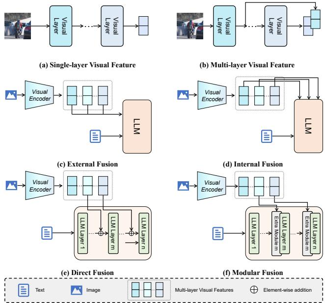
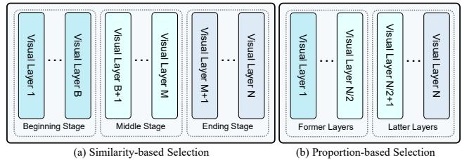
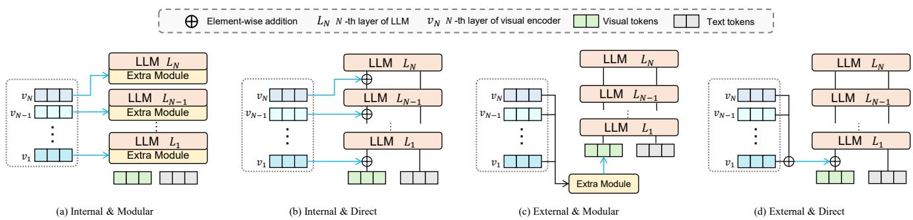
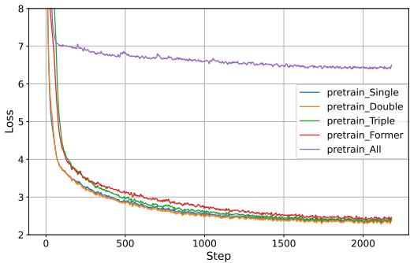
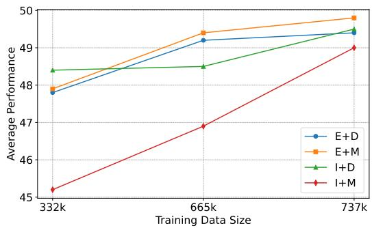
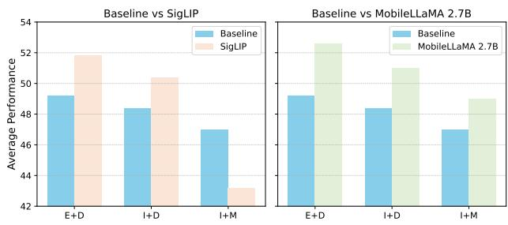

# Multi-Layer Visual Feature Fusion in Multimodal LLMs: Methods, Analysis, and Best Practices

Junyan Lin1,2∗ Haoran Chen1,3∗ Yue Fan4 Yingqi Fan1 Xin Jin1,† Hui Su5 Jinlan Fu7,† Xiaoyu Shen1,6

1Ningbo Key Laboratory of Spatial Intelligence and Digital Derivative, Institute of Digital Twin, EIT 2Ocean University of China 3Zhejiang Gongshang University 4Genmo.ai 5Meituan Inc. 6Engineering Research Center of Chiplet Design and Manufacturing of Zhejiang Province 7NUS

## Abstract

Multimodal Large Language Models (MLLMs) have made significant advancements in recent years, with visual features playing an increasingly critical role in enhancing model performance. However, the integration ofmulti-layer visual features in MLLMs remains underexplored, particularly with regard to optimal layer selection and fusion strategies. Existing methods often rely on arbitrary design choices, leading to suboptimal outcomes. In this paper, we systematically investigate two core aspects ofmulti-layer visual feature fusion: (1) selecting the most effective visual layers and (2) identifying the bestfusion approach with the language model. Our experiments reveal that while combining visualfeaturesfrom multiple stages improves generalization, incorporating additional features from the same stage typically leads to diminished performance. Furthermore, wefind that directfusion ofmulti-layer visualfeatures at the input stage consistently yields superior and more stable performance across various configurations. We make all our code publicly available: https://github.com/ EIT-NLP/Layer\_Select\_Fuse\_for\_MLLM.

## 1. Introduction

Multimodal Large Language Models (MLLMs) [30] have recently achieved impressive results across a range of multimodal tasks, such as image captioning [23] and visual question answering (VQA) [4], by combining pretrained visual encoders [36] with Large Language Models (LLMs) [15]. While substantial research has focused on LLMs in this framework, the visual components, despite their importance, remain relatively understudied. In particular, current approaches lack systematic methods for selecting the optimal visual layers and integrating visual features into LLMs.

  
Figure 1. Different Visual Features and Fusion Paradigms. (a) and (b) illustrate the acquisition methods for single-layer and multilayer visual features, respectively. (c), (d), (e), and (f) display four different fusion strategies: the first two categorize fusion strategies based on fusion position, while the latter two classify fusion strategies based on fusion pattern.

Regarding optimal visual selection, current works debate the use of single-layer (Fig. 1-(a)) versus multi-layer visual features (Fig. 1-(b)). On the one hand, models such as MiniCPM [19], LLaVA [31], and InternVL [11] achieve strong performance by relying on single-layer visual features. On the other hand, empirical studies [8, 9, 45] have shown that multi-layer visual features can enhance mode performance. However, they often select multi-layer visual features in an arbitrary manner. For instance, Dense Connector [45] selects layers proportionally based on the depth of the visual encoder, and EVLM [9] directly utilizes features from the latter half of the layers. Despite the promising results, there is no systematic method for selecting the optimal visual layers. This raises the research question: How can we select visual layers more effectively?

To address this question, we propose two criteria for dividing visual layers: Similarity-based and proportion-based selection. Similarity-based selection is inspired by [41], where visual layers are divided into three groups (beginning, middle, and ending) based on the cosine similarity of visual features from different layers, with each group sharing similar representations and information. Proportionbased selection, on the other hand, is based on the simple proportional selection of visual features, which aligns with many current works using multi-layer visual features. We divide the visual features into three groups (former, latter, and all). Guided by these two criteria, we conducted extensive experiments to explore the optimal layer selection set. Our experiments show that selecting a single representative visual feature from the beginning, middle, and ending stages yields the strongest generalization performance.

Regarding the fusion strategy—how visual features are integrated with LLMs, existing methods also vary widely: some integrate visual features into the intermediate layers of LLMs [3, 17, 35, 46], while others input them at the beginning alongside text features [30, 31, 48, 54]. Furthermore, approaches differ in whether they use additional modules to process visual features before fusion [6, 8, 9, 17] or directly incorporate visual information into the LLM without extra components [28, 29, 35, 45]. The lack of systematic study into fusion strategies leaves a significant gap in understanding how different fusion patterns and positions impact model performance. Consequently, another important question is: How can we select effective fusion strategies?

To address these gaps, we first categorize fusion approaches according to two criteria: fusion position and fusion pattern. Fusion position refers to where in the model visual features are integrated—either at the input (external fusion in Fig. 1-(c)) or within intermediate layers (internal fusion in Fig. 1-(d)). Fusion pattern, on the other hand, distinguishes between modular fusion (Fig. 1-(f)), which introduces additional modules for processing visual information, and direct fusion (Fig. 1-(e)), which does not require extra components. Guided by this categorization, we develop four fusion strategies and conduct extensive experiments to identify the most effective approach for integrating visual information in MLLMs. Our results reveal that external direct fusion consistently performs best, offering stable and superior results across various configurations. Additionally, we highlight the potential of internal direct fusion, particularly for models trained on large datasets.

In summary, we provide a comprehensive investigation into visual layer selection and fusion strategy design, offering valuable insights into the effective utilization of multi-layer visual features in MLLMs. Through extensive experiments, we uncover several key findings. Specifically, for visual layer selection, we examine two criteria—representational similarity and layer ratio—and discover that the best performance is achieved when visual features are drawn from distinct representational similarity stages. Moreover, using multiple features from the same stage leads to a performance decline. For fusion strategy selection, we develop four fusion approaches based on fusion position and pattern, and demonstrate that external direct fusion delivers the strongest generalization performance across a variety of configurations.

## 2. Related Work

## 2.1. Large Language Model

Large Language Models (LLMs) are typically trained using an autoregressive method, where the model predicts the next token in a sequence. These models can have billions or even hundreds of billions of parameters and are trained on datasets containing trillions of tokens. For example, LLaMA 3.1 [15] was trained on over 15 trillion tokens. Current LLMs [2, 5, 21, 43, 53] demonstrate exceptional performance, and find widespread application in various fields. However, many of these applications have an increasing demand for efficient large models capable of running on edge devices, driving the need for smaller, more efficient models. Several works [1, 13, 19, 42] have shown that models with parameter sizes as small as 7 billion can still achieve strong performance, meeting the growing need for compact and efficient solutions.

## 2.2. Multimodal Large Language Model

The impressive performance of LLMs has spurred the exploration of MLLMs, leading to the emergence of many outstanding works [25, 31, 54] in recent years. Although these models are highly effective, the information provided by image features from the last layer may be limited. As a result, many methods incorporate additional information in an attempt to better leverage the reasoning capabilities of LLMs. Some works [18, 27, 35, 52] incorporate multiple high-resolution image patches in addition to a lowresolution image. DeepStack [35] partitions high-resolution images into a fixed number of sub-images and adds their tokens to the visual tokens between LLM layers.

Some works [24, 38, 47, 48] incorporate additional object-level visual information based on the global image. GLAMM [38], based on global features extracted from a low-resolution image, adds a region encoder to achieve local feature extraction. Some works [22, 28, 51] utilize visual encoders pretrained with different methods to extract various visual features, combining these features as visual tokens to the LLM. SPHINX [28] uses multiple visual encoders to extract different visual information, enriching the details. Some works [8, 9, 17, 45] leverage multi-layer visual features. EVLM [9] utilizes hierarchical ViT features for enabling the model to perceive visual signals as comprehensively as possible.

Although there have been various attempts to integrate extra information into LLM, there is a lack of extensive exploration on how to effectively fuse this information. Moreover, many of these approaches rely on expanded datasets or more intricate architectures compared to baselines, making it unclear whether observed improvements result from advanced fusion strategies or simply from increased model capacity. To address these issues, we systematically investigate the optimal fusion paradigm by leveraging multi-layer visual features.

## 3. Methodology

While many works [6, 8, 9, 45] demonstrate that incorporating multi-layer visual features can significantly improve MLLM performance, they do not explore the deeper rationale behind effective layer selection, nor do they generalize across diversefusion strategies. Next, we provide a detailed illustration of visual layer selection (Sec. 3.1) and the two fusion strategies, namely internal fusion (Sec. 3.2) and external fusion (Sec. 3.3), to address Research Questions 1 and 2, as demonstrated in Sec. 1.

## 3.1. Visual Layer Selection

We categorize visual layers using two criteria: similaritybased selection and proportion-based selection. The similarity-based selection approach is motivated by findings from studies [37, 41], which show that features within the same stage (beginning, middle, or ending) often reside in a similar representation space and share comparable properties. This similarity allows us to divide the layers into meaningful stages, selecting representative layers from each to capture diverse types of visual information. As illustrated in Fig. 2-(a), the similarity-based selection approach divides the N layers of a visual encoder into three groups: layers 1 through B represent the beginning stage, layers B + 1 through M represent the middle stage, and layers M + 1 through N represent the ending stage.

On the other hand, the proportion-based selection strategy aligns with the previous works [6, 8, 9, 45], where layers are selected based on a proportional division of the encoder’s depth. To ensure consistency with prior research and facilitate a systematic comparison, we apply this method by dividing the N layers of the visual encoder into two groups: the former and latter stages. As shown in Fig. 2-(b), layers 1 through $N / 2$ constitute the former stage, while layers $N / 2 { + } 1$ through N form the latter stage.

  
Figure 2. Comparison of Similarity-Based and Proportion-Based Visual Layer Selection.

This approach thus separately examines the contributions of shallow and deep features across the encoder’s depth.

For similarity-based selection, we choose representative layers based on empirical findings1: the 3rd layer (beginning stage), 18th layer (middle stage), and 23rd layer (ending stage), resulting in three sets: {18}, {3, 18}, and {3, 18, 23}. For proportion-based selection, we define three sets as well: {former}, {latter}, and {all}. These sets allow for a systematic evaluation of how layer selection influences model performance across different aspects.

## 3.2. Internal Fusion

Internal fusion methods incorporate tokens containing additional information directly within the LLM. Given a visual feature set (multi-layer visual features) ${ \bf F } =$ $\{ v _ { 1 } , v _ { 2 } , \ldots , v _ { N } \} ^ { 2 } \in \mathbb { R } ^ { N _ { v } \times d }$ , where $N _ { v }$ represents number of visual patches and d represents the channel dimension, and hidden states $\mathbf { H } = \{ \bar { h _ { 1 } } , h _ { 2 } , \dots , h _ { N } \} \in \mathbb { R } ^ { N _ { l } \times D }$ in the LLM, where $N _ { l }$ denotes the number of tokens and D is the hidden size of the LLM, the operation for the internal fusion I at layer i within the LLM can be formulated as:

$$
\begin{array} { r } { h _ { i } ^ { ' } = \mathcal { I } ( h _ { i } , \mathbf { P } _ { i } ( v _ { i } ) ) + h _ { i } , } \end{array}\tag{1}
$$

where $h _ { i } ^ { ' } ~ \in ~ \mathbb { R } ^ { N _ { l } \times D }$ denotes the updated hidden state in layer i, and $\mathbf { P } _ { i }$ is a projector at layer i that aligns the visual feature $v _ { i }$ with the LLM’s embedding space.

As shown in Fig. 3-(a) and Fig. 3-(b), the distinction between Internal Modular fusion and Internal Direct fusion lies in the differences in using I. In internal modular fusion, cross-attention modules are the most commonly used modules for integrating multi-layer visual features. Depending on where the cross-attention is inserted, this method can be further divided into pre-cross attention, postcross attention, and parallel attention architectures [46]. Internal Direct fusion, on the other hand, simply integrates multi-layer visual information by directly adding the visual tokens at their respective positions.

  
Figure 3. Framework of the four fusion strategies studied in this work. Blue lines represent the path passing through the projector.

## 3.3. External Fusion

External fusion methods integrate multi-layer visual features at the input stage before feeding visual tokens into the LLMs. Given a visual feature set F, visual tokens $\mathbf { V } \in \mathbb { R } ^ { N _ { v } \times D }$ , and text tokens $\mathbf { T } \in \mathbb { R } ^ { N _ { t } \times D }$ , where $N _ { t }$ represents the number of text tokens, the operation for external fusion E can be formulated as:

$$
\mathbf { V } ^ { \prime } = \mathcal { E } ( \mathbf { V } , \mathbf { P } ( \mathbf { F } ) ) ,\tag{2}
$$

where $\mathbf { V } ^ { \prime } \in \mathbb { R } ^ { N _ { v } \times D }$ denotes the updated visual tokens after the external fusion operation. As shown in Fig. 3-(c) and Fig. 3-(d), similar to internal fusion, the distinction between External Modular Fusion and External Direct Fusion lies in how E is applied. In external modular fusion, using various modules, multi-layer visual features F are integrated into V to get updated visual tokens V′, or directly generate V′ by multi-layer visual features F. External direct fusion, on the other hand, combines F with V through simpler operations like element-wise addition, stacking along the N dimension, or stacking along the D dimension.

Notably, in internal fusion, each visual feature requires a new projector when introduced at different LLM layers, resulting in increased parameters as the number of layers grows. In contrast, external fusion only requires a single projector for every visual layer sets, making it more parameter-efficient when dealing with multiple layers.

This paper will provide a detailed analysis of existing fusion methods, explore their adaptability of handling extra multi-layer visual features, and experimentally validate the strengths and weaknesses of each method, offering valuable insights for future research and applications.

## 3.4. Base Model: Mini-LLaVA

To facilitate the deployment of our exploratory experiments, we developed a lightweight MLLM, namely Mini-LLaVA, based on modifications to LLaVA-1.5.

Structure Mini-LLaVA replaces the Vicuna 1.5 (7B) model [12] with a smaller mobileLLaMA (1.4B) model [13] while keeping the other components consistent with LLaVA-1.5. The main exploration experiments in this paper are conducted based on Mini-LLaVA. More specifically, like LLaVA-1.5, Mini-LLaVA uses the feature from the 23rd layer of the visual encoder, which is fed into the LLM. It employs the 24-layer MobileLLaMA 1.4B as the LLM and CLIP-ViT-L/14 [36] as the visual encoder. Since both the visual encoder and the LLM have 24 layers, we adopt a layer-wise alignment method for internal fusion, where each visual feature layer can fuse with the corresponding layer in the LLM (e.g., the visual features of the 18th layer are fused into the 18th layer of the LLM).

Training Consistent with LLaVA-1.5, we use a pre-training stage with a dataset comprising 558K image captions [7, 39, 49], and an instruction tuning stage with a dataset of 665K conversations [29, 31]. During the pre-training stage, only newly initialized components, such as the projector and any new modules within modular fusion, are trained. In the instruction tuning stage, all parameters except the visual encoder are unfrozen and optimized.

## 4. Experiment and Analysis

## 4.1. Experiment Settings

Comparing Models We design Mini-LLaVA, which utilizes visual features from layer 23. We then compare the performance of this model when fusing features from different individual visual layers or sets of layers. Specifically, the visual layer sets considered include Single:{18}, Double:{3, 18}, Triple:{3, 18, 23}, Former: {former}, Latter: {latter}, and All: {all}, as introduced in Sec. 3.1.

Benchmarks To conduct a comprehensive evaluation of performance, we evaluate different settings across four benchmark categories: General, OCR, CV-Centric, and Hallucination (Hallu). The General category includes GQA [20], MMBench (MMB) [33], and MME [16], which is further divided into MME Cognition (MMEC ) and MME Perception (MMEP ). The OCR category covers TextVQA [40] and OCRBench [32]. In the CV-Centric category, we include CV-Bench [44], which itself contains two subcategories: CV-Bench 2D and CV-Bench 3D. Finally, the Hallucination category is represented by POPE [26].

  
Figure 4. Pre-cross attention loss curves in pre-training stage under different layer sets.

## 4.2. Internal Fusion Ablation

Modular fusion in internal fusion can take several forms: pre-cross, post-cross, and parallel, which involve a higher level of complexity compared to direct fusion. Therefore, we start by investigating these configurations and then discuss direct fusion to explore the differences between them.

## 4.2.1 Modular Fusion

Layer Combination Exploration: We first conduct an extensive investigation into the pre-cross fusion because of its commonality. The performance of pre-cross attention fusion across six layer selection sets is summarized in Tab. 1. Due to convergence difficulties when applying All, we are unable to complete an evaluation for this configuration. Several key insights emerge from the results:

• Beginning-Stage Features Benefit Detail-Specific Tasks: The Double shows improved performance over Single alone in tasks requiring image details. This highlights the importance of beginning-stage features in enhancing detail-specific aspects, making it advantageous to incorporate both beginning and middle-stage layers for comprehensive feature representation.

• Limitations of Extensive Layer Selection: Inserting an excessive number of modules can lead to significant performance degradation, primarily due to the difficulty in optimizing numerous parameters. As shown in Fig. 4, which illustrates the loss curves of pre-training under different layer sets, configurations with more layers tend to encounter greater training challenges. In particular, the All displayed convergence issues, with the training loss plateauing around 6 after an initial drop from 11, suggesting instability in the training process.

• Performance Gap Between Former and Latter: Performance declines substantially when additional modules are inserted into latter layers compared to former layers, despite similar parameter counts. This suggests that inserting modules into latter layers may disrupt the model’s feature processing. When modules are added early, they allow subsequent layers to refine and correct features, which is less feasible with latter layer insertions. This is further illustrated by the performance gap between Double and Triple, with the former showing better results.

• Limited Improvement on Performance: Among the five sets, only Double and Triple show slight improvements over the baseline, outperforming it by just 0.09 and 0.23 points, respectively, while other configurations actually perform worse.

Different Modular Fusion Strategies: To explore the differences in performance across pre-cross attention, postcross attention, and parallel attention architectures, we utilize the layer selection set Double, which showed optimal results for pre-cross attention, and test it under post-cross attention and parallel attention architectures to evaluate their performance. The results are summarized in Tab. 2. Although the three fusion strategies each show specific advantages on different benchmarks, their overall performance remains close. This suggests that, for multi-layer visual feature fusion, the choice of modular fusion strategy has relatively low significance.

## 4.2.2 Direct Fusion

In the comparison of modular fusion, we conduct an indepth investigation into the choices of layers and modules, yielding several valuable conclusions. For instance, when an excessive number of layers is introduced, a significant performance drop is observed. However, this drop may be due to the additional parameters brought in by the numerous modules. To minimizing the influence of extra parameters, we conduct further experiments centered on direct fusion. Specifically, we employ the fusion strategy in DeepStack [34] to evaluate the performance differences across six layer selection sets compared to modular fusion. The detailed results, shown in Tab. 3, reveal several key properties:

• Stable Performance on Increased Visual Layer: As the number of visual layers increases, the model exhibits stable performance; in fact, it shows improvement on some benchmarks. This suggests that direct fusion can effectively adapt to additional visual information without requiring new modules or extensive training data.

• Resilience to Latter: Unlike modular fusion, which tends to perform better at Former, direct fusion demonstrates superior results at Latter, especially in GQA and TextVQA. This discrepancy may be due to the different weights of attention LLMs allocate to visual tokens in different layers [10]. In Former, attention to visual tokens is significantly stronger, potentially causing direct fusing multi-layer visual features into hidden states to create greater disruptions. In contrast, Latter, which receive less attention, can incorporate multi-layer visual features more smoothly. This is the opposite of the logic in modular fusion, where adding new modules in Former tends to be advantageous. The fact that Double outperforms Single in modular fusion but not in direct fusion further supports this hypothesis.

Table 1. Results on Pre-Cross Attention Fusion. Note: $\mathbf { M M E } ^ { C }$ represents MME Cognition, and ${ \bf M M E } ^ { P }$ represents MME Perception. The superscript numbers in the top right indicate the score difference compared to the baseline, Mini-LLaVA. Single ({18}), Double ({3, 18}), Triple ({3, 18, 24}), Former ([1, ..., 12]), Latter ([13, ..., 24]), and All ([1, ..., 24]) are the visual layer sets that the Mini-LLaVA adopted.
<table><tr><td rowspan="2">Model</td><td colspan="4">General</td><td colspan="2">OCR</td><td colspan="2">CV-Centric</td><td rowspan="2">Hallu POPE</td><td rowspan="2">Avg.</td></tr><tr><td>GQA</td><td>MMB</td><td>MMEC</td><td>MMEP</td><td>TextVQA</td><td></td><td>OCRBench CVBench2D CVBench3D</td><td></td></tr><tr><td>Mini-LLaVA 56.95</td><td></td><td>46.91</td><td>262</td><td>1200</td><td>35.47</td><td>239</td><td>39.74</td><td>55.00</td><td>85.83</td><td>48.51</td></tr><tr><td> $+ \ S i n g l e$ </td><td> $5 7 . 8 9 ^ { 0 . 9 4 \uparrow }$ </td><td> $5 0 . 7 7 ^ { 3 . 8 6 \uparrow }$ </td><td> $2 2 8 ^ { 3 4 \downarrow }$ </td><td> $1 1 5 3 ^ { 4 7 \downarrow }$ </td><td> $3 5 . 0 4 ^ { 0 . 4 3 \downarrow }$ </td><td> $2 5 3 ^ { 1 4 \uparrow }$ </td><td> $4 1 . 6 6 ^ { 1 . 9 2 \uparrow }$ </td><td> $5 4 . 5 8 ^ { 0 . 4 2 \downarrow }$ </td><td> $8 6 . 0 3 ^ { 0 . 2 0 \uparrow }$ </td><td> $4 8 . 6 0 ^ { 0 . 0 9 \uparrow }$ </td></tr><tr><td> $+ D o u b l e$ </td><td> $5 8 . 4 1 ^ { 1 . 4 6 \uparrow }$ </td><td> $5 0 . 9 3 ^ { 4 . 0 2 \uparrow }$ </td><td> $2 1 8 ^ { 4 4 \downarrow }$ </td><td> $1 1 8 2 ^ { 1 8 \downarrow }$ </td><td> $3 4 . 4 2 ^ { 1 . 0 5 \downarrow }$ </td><td> $2 6 1 ^ { 2 2 \uparrow }$ </td><td> $4 6 . 3 4 ^ { 6 . 6 0 \uparrow }$ </td><td> $5 1 . 0 8 ^ { 3 . 9 2 \downarrow }$ </td><td> $8 5 . 0 6 ^ { 0 . 7 7 \downarrow }$ </td><td> $4 8 . 7 4 ^ { 0 . 2 3 \uparrow }$ </td></tr><tr><td> $+ T r i p l e$ </td><td> $5 7 . 5 6 ^ { 0 . 6 1 \uparrow }$ </td><td> $4 9 . 6 6 ^ { 2 . 7 5 \uparrow }$ </td><td> $2 1 2 ^ { 5 0 \downarrow }$ </td><td> $1 1 6 3 ^ { 3 7 \downarrow }$ </td><td> $3 4 . 0 6 ^ { 1 . 4 1 \downarrow }$ </td><td> $2 5 5 ^ { 1 6 \uparrow }$ </td><td> $3 8 . 6 6 ^ { 1 . 0 8 \downarrow }$ </td><td> $4 7 . 4 2 ^ { 7 . 5 8 \downarrow }$ </td><td> $8 4 . 6 9 ^ { 1 . 1 4 \downarrow }$ </td><td> $4 6 . 9 1 ^ { 1 . 6 0 \downarrow }$ </td></tr><tr><td>+ Former</td><td> $5 5 . 9 1 ^ { 1 . 0 4 \downarrow }$ </td><td> $4 5 . 7 0 ^ { 1 . 2 1 \downarrow }$ </td><td> $2 2 7 ^ { 3 5 \downarrow }$ </td><td> $1 1 6 2 ^ { 3 8 \downarrow }$ </td><td> $3 0 . 7 1 ^ { 4 . 7 6 \downarrow }$ </td><td> $1 6 5 ^ { 7 4 \downarrow }$ </td><td> $3 8 . 6 8 ^ { 1 . 0 6 \downarrow }$ </td><td> $5 1 . 4 2 ^ { 3 . 5 8 \downarrow }$ </td><td> $8 5 . 0 3 ^ { 0 . 8 0 \downarrow }$ </td><td> $4 5 . 6 0 ^ { 2 . 9 1 \downarrow }$ </td></tr><tr><td> $+ L a t t e r$ </td><td> $4 9 . 9 2 ^ { 7 . 0 3 \downarrow }$ </td><td> $0 . 1 7 ^ { 4 6 . 7 4 \downarrow }$ </td><td> $2 5 0 ^ { 1 2 \downarrow }$ </td><td> $9 0 6 ^ { 2 9 4 \downarrow }$ </td><td> $1 8 . 9 6 ^ { 1 6 . 5 1 \downarrow }$ </td><td> $1 3 6 ^ { 1 0 3 \downarrow }$ </td><td> $4 4 . 5 1 ^ { 4 . 7 7 \uparrow }$ </td><td> $4 8 . 8 3 ^ { 6 . 1 7 \downarrow }$ </td><td> $8 2 . 1 3 ^ { 3 . 7 0 \downarrow }$ </td><td> $3 7 . 1 9 ^ { 1 1 . 3 2 \downarrow }$ </td></tr><tr><td> $+ A l l$ </td><td></td><td></td><td></td><td></td><td></td><td></td><td></td><td></td><td></td><td></td></tr></table>

Table 2. Comparison on Different Modular Fusion Architectures. The superscript numbers in the top right indicate the score difference compared to the Pre-Cross Fusion.
<table><tr><td rowspan="2">Architectures</td><td colspan="4">General</td><td colspan="2">OCR</td><td colspan="2">CV-Centric</td><td rowspan="2">Hallu</td><td rowspan="2">Avg.</td></tr><tr><td>GQA</td><td>MMB</td><td> $\mathbf { M } \mathbf { M } \mathbf { E } ^ { C }$ </td><td> ${ \bf M N E } ^ { P }$ </td><td>TextVQA OCRBench</td><td></td><td> $\mathbf { C V B e n c h } ^ { 2 D }$ </td><td>CVBench3D POPE</td></tr><tr><td>Pre-Cross</td><td>58.41</td><td>50.93</td><td>218</td><td>1182</td><td>34.42</td><td>261</td><td>46.34</td><td>51.08</td><td>85.06</td><td>48.74</td></tr><tr><td>Post-Cross</td><td> $5 7 . 8 7 ^ { 0 . 5 4 \downarrow }$ </td><td> $5 0 . 4 3 ^ { 0 . 5 0 \downarrow }$ </td><td> $2 5 4 ^ { 3 6 \uparrow }$ </td><td> $1 1 7 1 ^ { 1 1 \downarrow }$ </td><td> $3 4 . 6 8 ^ { 0 . 2 6 \uparrow } 2 4 4 ^ { 1 7 \downarrow }$ </td><td></td><td> $4 4 . 8 0 ^ { 1 . 5 4 \downarrow }$ </td><td> $5 4 . 9 2 ^ { 3 . 8 4 \uparrow }$ </td><td> $8 5 . 8 0 ^ { 0 . 7 4 \uparrow }$ </td><td> $4 9 . 2 4 ^ { 0 . 5 0 \uparrow }$ </td></tr><tr><td>Parallel</td><td> $5 8 . 0 5 ^ { 0 . 3 6 \downarrow }$ </td><td> $4 9 . 7 4 ^ { 1 . 1 9 \downarrow }$ </td><td> $2 1 8 ^ { \mathrm { 0 } }$ </td><td> $1 1 9 1 ^ { 9 \uparrow }$ </td><td> $3 4 . 7 0 ^ { 0 . 2 8 \uparrow } 2 3 9 ^ { 2 2 \downarrow }$ </td><td></td><td> $4 4 . 5 7 ^ { 1 . 7 7 \downarrow }$ </td><td> $5 2 . 9 2 ^ { 1 . 8 4 \uparrow }$ </td><td> $8 5 . 2 0 ^ { 0 . 1 4 \uparrow }$ </td><td> $4 8 . 4 3 ^ { 0 . 3 1 \downarrow }$ </td></tr></table>

Table 3. Results of Internal Direct Fusion. The superscript numbers in the top right indicate the metric difference compared to the Internal Modular Fusion.
<table><tr><td rowspan="2">Model</td><td colspan="4">General</td><td colspan="2">OCR</td><td colspan="2">CV-Centric</td><td rowspan="2">Hallu POPE</td><td rowspan="2">Avg.</td></tr><tr><td>GQA</td><td>MMB</td><td> $\mathbf { M } \mathbf { M } \mathbf { E } ^ { C }$ </td><td>MMEP</td><td>TextVQA</td><td></td><td>OCRBench CVBench2D</td><td>CVBench³D</td></tr><tr><td>Mini-LLaVA 56.95</td><td></td><td>46.91</td><td>262</td><td>1200</td><td>35.47</td><td>239</td><td> $3 9 . 7 4$ </td><td> $5 5 . 0 0$ </td><td>85.83</td><td>48.51</td></tr><tr><td>+ Single</td><td> $5 8 . 0 8 ^ { 0 . 1 9 \uparrow }$ </td><td> $5 2 . 4 1 ^ { 1 . 6 4 \uparrow }$ </td><td> $2 3 4 ^ { 6 \uparrow }$ </td><td> $1 1 5 4 ^ { 1 \uparrow }$ </td><td>36.030.99↑</td><td> $2 5 1 ^ { 2 \downarrow }$ </td><td> $4 1 . 1 5 ^ { 0 . 5 1 \downarrow }$ </td><td> $5 2 . 5 8 ^ { 2 . 0 0 \downarrow }$ </td><td> $8 5 . 6 6 ^ { 0 . 3 7 \downarrow }$ </td><td> $4 8 . 6 6 ^ { 0 . 0 6 \uparrow }$ </td></tr><tr><td> $+ D o u b l e$ </td><td> $5 8 . 0 8 ^ { 0 . 3 3 \downarrow }$ </td><td> $4 8 . 5 6 ^ { 2 . 3 7 \downarrow }$ </td><td> $2 2 9 ^ { 1 1 \uparrow }$ </td><td> $1 1 7 8 ^ { 4 \downarrow }$ </td><td> $3 4 . 9 5 ^ { 0 . 5 3 \uparrow }$ </td><td> $2 3 7 ^ { 2 4 \downarrow }$ </td><td> $4 0 . 6 2 ^ { 5 . 7 2 \downarrow }$ </td><td> $5 6 . 5 0 ^ { 5 . 4 2 \uparrow }$ </td><td> $8 5 . 7 7 ^ { 0 . 7 1 \uparrow }$ </td><td> $4 8 . 4 1 ^ { 0 . 3 3 \downarrow }$ </td></tr><tr><td> $+ T r i p l e$ </td><td> $5 8 . 5 9 ^ { 1 . 0 3 \uparrow }$ </td><td> $4 7 . 4 7 ^ { 2 . 1 9 \downarrow }$ </td><td> $2 2 3 ^ { 1 1 \uparrow }$ </td><td> $1 2 0 7 ^ { 4 4 \uparrow }$ </td><td> $3 6 . 2 4 ^ { 2 . 1 8 \uparrow }$ </td><td> $2 5 5 ^ { \mathrm { 0 } }$ </td><td> $4 1 . 8 7 ^ { 3 . 2 1 \uparrow }$ </td><td> $5 3 . 0 8 ^ { 5 . 6 6 \uparrow }$ </td><td> $8 5 . 8 7 ^ { 1 . 1 8 \uparrow }$ </td><td> $4 8 . 5 4 ^ { 1 . 6 3 \uparrow }$ </td></tr><tr><td>+ Former</td><td> $5 4 . 0 8 ^ { 1 . 8 3 \downarrow }$ </td><td> $4 3 . 1 4 ^ { 2 . 5 6 \downarrow }$ </td><td> $2 3 8 ^ { 1 1 \uparrow }$ </td><td> $1 1 2 0 ^ { 4 2 \downarrow }$ </td><td> $2 6 . 5 1 ^ { 4 . 2 0 \downarrow }$ </td><td> $2 0 0 ^ { 3 5 \uparrow }$ </td><td> $3 4 . 9 4 ^ { 3 . 7 4 \downarrow }$ </td><td> $5 1 . 3 3 ^ { 0 . 0 9 \downarrow }$ </td><td> $8 4 . 1 4 ^ { 0 . 8 9 \downarrow }$ </td><td> $4 4 . 4 3 ^ { 1 . 1 7 \downarrow }$ </td></tr><tr><td>+ Latter</td><td> $5 8 . 7 9 ^ { 8 . 8 7 \uparrow }$ </td><td> $4 7 . 0 2 ^ { 4 6 . 8 5 \uparrow }$ </td><td> $2 2 1 ^ { 2 9 \downarrow }$ </td><td> $1 1 7 9 ^ { 2 7 3 \uparrow }$ </td><td> $3 7 . 2 8 ^ { 1 8 . 3 2 \uparrow }$ </td><td> $2 4 1 ^ { 1 0 5 \uparrow }$ </td><td> $4 2 . 6 4 ^ { 1 . 8 7 \downarrow }$ </td><td> $5 1 . 9 2 ^ { 3 . 0 9 \uparrow }$ </td><td> $8 5 . 5 7 ^ { 3 . 4 4 \uparrow }$ </td><td> $4 8 . 2 1 ^ { 2 . 6 1 \uparrow }$ </td></tr><tr><td> $+ A l l$ </td><td>58.04</td><td>47.28</td><td>224</td><td>1215</td><td>34.66</td><td>243</td><td>42.86</td><td>51.46</td><td>85.19</td><td>48.06</td></tr></table>

## 4.3. External Fusion Ablation

For external fusion, we provide a combined discussion of modular fusion and direct fusion. As shown in Fig. 3, there are significant differences in modular fusion between internal and external fusion. In particular, internal fusion requires more parameters due to the inclusion of crossattention modules within the LLM and projectors for each visual layer. Given this distinction in architecture and parameter usage, we simplify our analysis by discussing both modular and direct fusion together for external fusion. The specific parameter sizes for these additional modules in our setup are detailed in the supplementary materials.

For modular fusion in external fusion methods, we employ the recently proposed MMFuser [6], with performance results shown in Tab. 4. Notably, in external fusion, the Double and Triple are identical due to the derivation of the global visual feature from the 23rd layer in the Mini-LLaVA baseline. For direct fusion in external fusion methods, we adopt a straightforward approach the same as Dense Connector [45]. Specifically, for the different layer sets mentioned above, when selecting fewer layers, we fuse information across layers through dimension concatenation. For the Former, Latter, and All, we apply summation followed by averaging to integrate information from different layers. The performance of direct fusion in external fusion method is shown in Tab. 5. We can conclude the following:

Table 4. Results of External Modular Fusion. The superscript numbers in the top right indicate the metric difference compared to the Internal Modular Fusion.
<table><tr><td rowspan="2">Model</td><td colspan="4">General</td><td colspan="2">OCR</td><td colspan="2">CV-Centric</td><td rowspan="2">Hallu POPE</td><td rowspan="2">Avg.</td></tr><tr><td>GQA</td><td>MMB</td><td>MMEC</td><td> ${ \bf M N } ^ { P }$ </td><td>TextVQA</td><td>OCRBench</td><td> $\mathbf { C V B e n c h } ^ { 2 D }$ </td><td> $\mathbf { C V B e n c h } ^ { 3 D }$ </td></tr><tr><td>Mini-LLaVA 56.95</td><td></td><td>46.91</td><td>262</td><td>1200</td><td>35.47</td><td>239</td><td>39.74</td><td>55.00</td><td>85.83</td><td>48.51</td></tr><tr><td> $+ \ S i n g l e$ </td><td> $5 8 . 5 5 ^ { 0 . 6 6 \uparrow }$ </td><td> $5 3 . 0 9 ^ { 2 . 3 2 \uparrow }$ </td><td> $2 2 8 ^ { 0 }$ </td><td> $1 1 7 2 ^ { 1 9 \uparrow }$ </td><td> $3 5 . 4 2 ^ { 0 . 3 8 \downarrow }$ </td><td> $2 3 8 ^ { 1 5 \downarrow }$ </td><td> $4 2 . 6 0 ^ { 0 . 9 4 \uparrow }$ </td><td> $5 1 . 9 2 ^ { 2 . 6 6 \downarrow }$ </td><td> $8 5 . 7 2 ^ { 0 . 3 1 \downarrow }$ </td><td> $4 8 . 6 9 ^ { 0 . 0 9 \uparrow }$ </td></tr><tr><td> $+ D o u b l e$ </td><td> $5 8 . 4 3 ^ { 0 . 0 2 \uparrow }$ </td><td> $5 2 . 6 6 ^ { 1 . 7 3 \uparrow }$ </td><td> $2 2 5 ^ { 7 \uparrow }$ </td><td> $1 1 7 3 ^ { 9 \downarrow }$ </td><td> $3 6 . 2 5 ^ { 1 . 8 3 \uparrow }$ </td><td> $2 6 2 ^ { 1 \uparrow }$ </td><td> $4 5 . 7 8 ^ { 0 . 5 6 \downarrow }$ </td><td> $5 2 . 8 3 ^ { 1 . 7 5 \uparrow }$ </td><td> $8 6 . 0 3 ^ { 0 . 9 7 \uparrow }$ </td><td> $4 9 . 4 4 ^ { 0 . 7 0 \uparrow }$ </td></tr><tr><td> $+ \ F o r m e r$ </td><td> $5 8 . 3 7 ^ { 2 . 4 6 \uparrow }$ </td><td> $5 4 . 3 0 ^ { 8 . 6 0 \uparrow }$ </td><td> $2 5 8 ^ { 3 1 \uparrow }$ </td><td> $1 1 8 1 ^ { 1 9 \uparrow }$ </td><td> $3 5 . 8 5 ^ { 5 . 1 4 \uparrow }$ </td><td> $2 4 4 ^ { 7 9 \uparrow }$ </td><td> $4 2 . 5 9 ^ { 3 . 9 1 \uparrow }$ </td><td> $5 4 . 9 2 ^ { 3 . 5 0 \uparrow }$ </td><td> $8 6 . 2 9 ^ { 1 . 2 6 \uparrow }$ </td><td> $4 9 . 7 8 ^ { 4 . 1 8 \uparrow }$ </td></tr><tr><td>+ Latter</td><td> $5 8 . 5 1 ^ { 8 . 5 9 \uparrow }$ </td><td> $5 1 . 2 0 ^ { 5 1 . 0 3 \uparrow }$ </td><td> $2 3 1 ^ { 1 9 \downarrow }$ </td><td> $1 2 1 2 ^ { 3 0 6 \uparrow }$ </td><td> $3 6 . 4 1 ^ { 1 7 . 4 5 \uparrow }$ </td><td> $2 5 5 ^ { 1 1 9 \uparrow }$ </td><td> $4 0 . 7 1 ^ { 3 . 8 0 \downarrow }$ </td><td> $5 2 . 4 2 ^ { 3 . 5 9 \uparrow }$ </td><td> $8 5 . 8 0 ^ { 3 . 6 7 \uparrow }$ </td><td> $4 8 . 8 9 ^ { 1 1 . 7 0 \uparrow }$ </td></tr><tr><td>+ All</td><td>58.57</td><td>51.46</td><td>233</td><td>1211</td><td>35.28</td><td>265</td><td>42.00</td><td>52.08</td><td>86.26</td><td>49.09</td></tr></table>

Table 5. Results of External Direct Fusion. The superscript numbers in the top right indicate the metric difference compared to the Internal Direct Fusion.
<table><tr><td rowspan="2">Model</td><td colspan="4">General</td><td colspan="2">OCR</td><td colspan="2">CV-Centric</td><td rowspan="2">Hallu POPE</td><td rowspan="2">Avg.</td></tr><tr><td>GQA</td><td>MMB</td><td> $\mathbf { M } \mathbf { M } \mathbf { E } ^ { C }$ </td><td> ${ \bf M N E } ^ { P }$ </td><td></td><td>TextVQA OCRBench</td><td> $\mathbf { C V B e n c h } ^ { 2 D }$ </td><td> $\mathbf { C V B e n c h } ^ { 3 D }$ </td></tr><tr><td>Mini-LLaVA 56.95</td><td></td><td> $4 6 . 9 1 $ </td><td>262</td><td>1200</td><td>35.47</td><td>239</td><td> $3 9 . 7 4$ </td><td>55.00</td><td>85.83</td><td>48.51</td></tr><tr><td> $+ \ S i n g l e$ </td><td> $5 9 . 1 4 ^ { 1 . 0 6 \uparrow }$ </td><td> $5 4 . 0 4 ^ { 1 . 6 3 \uparrow }$ </td><td> $2 3 7 ^ { 3 \uparrow }$ </td><td>1154</td><td> $3 7 . 8 4 ^ { 1 . 8 1 \uparrow }$ </td><td> $2 6 5 ^ { 1 4 \uparrow }$ </td><td> $4 1 . 3 6 ^ { 0 . 2 1 \uparrow }$ </td><td> $5 7 . 0 0 ^ { 4 . 4 2 \uparrow }$ </td><td> $8 5 . 6 4 ^ { 0 . 0 2 \downarrow }$ </td><td> $4 9 . 8 7 ^ { 1 . 2 1 \uparrow }$ </td></tr><tr><td> $+ D o u b l e$ </td><td> $5 9 . 1 9 ^ { 0 . 6 0 \uparrow }$ </td><td> $5 3 . 7 8 ^ { 4 . 8 2 \uparrow }$ </td><td> $2 3 8 ^ { 9 \uparrow }$ </td><td> $1 1 4 1 ^ { 6 6 \downarrow }$ </td><td> $3 8 . 3 5 ^ { 2 . 1 1 \uparrow }$ </td><td> $2 5 6 ^ { 1 \uparrow }$ </td><td> $4 2 . 0 5 ^ { 0 . 1 8 \uparrow }$ </td><td> $5 0 . 5 0 ^ { 6 . 0 0 \downarrow }$ </td><td> $8 6 . 3 3 ^ { 0 . 4 6 \uparrow }$ </td><td> $4 9 . 1 8 ^ { 0 . 6 4 \uparrow }$ </td></tr><tr><td> $+ ~ F o r m e r$ </td><td> $5 8 . 4 8 ^ { 4 . 4 0 \uparrow }$ </td><td> $5 1 . 8 9 ^ { 8 . 7 5 \uparrow }$ </td><td> $2 5 3 ^ { 1 5 \uparrow }$ </td><td> $1 1 8 0 ^ { 6 0 \uparrow }$ </td><td> $3 5 . 6 7 ^ { 9 . 1 6 \uparrow }$ </td><td> $2 6 1 ^ { 6 1 \uparrow }$ </td><td> $4 1 . 2 2 ^ { 6 . 2 8 \uparrow }$ </td><td> $5 0 . 9 2 ^ { 0 . 4 1 \downarrow }$ </td><td> $8 5 . 6 2 ^ { 1 . 4 8 \uparrow }$ </td><td> $4 8 . 9 5 ^ { 4 . 5 2 \uparrow }$ </td></tr><tr><td> $+ L a t t e r$ </td><td> $5 8 . 5 5 ^ { 0 . 2 4 \downarrow }$ </td><td> $5 4 . 4 7 ^ { 7 . 4 5 \uparrow }$ </td><td> $2 3 1 ^ { 1 0 \uparrow }$ </td><td> $1 1 4 4 ^ { 3 5 \downarrow }$ </td><td> $3 6 . 7 9 ^ { 0 . 4 9 \downarrow }$ </td><td> $2 5 4 ^ { 1 3 \uparrow }$ </td><td> $3 8 . 1 2 ^ { 4 . 5 2 \downarrow }$ </td><td> $5 1 . 3 3 ^ { 0 . 5 9 \downarrow }$ </td><td> $8 6 . 1 7 ^ { 0 . 6 0 \uparrow }$ </td><td> $4 8 . 5 4 ^ { 0 . 3 3 \uparrow }$ </td></tr><tr><td> $+ A l l$ </td><td> $5 9 . 5 4 ^ { 1 . 5 0 \uparrow }$ </td><td> $5 2 . 1 5 ^ { 4 . 8 7 \uparrow }$ </td><td> $2 3 6 ^ { 1 2 \uparrow }$ </td><td> $1 2 0 0 ^ { 1 5 \downarrow }$ </td><td> $3 8 . 0 1 ^ { 3 . 3 5 \uparrow }$ </td><td> $2 5 5 ^ { 1 2 \uparrow }$ </td><td> $4 4 . 7 8 ^ { 1 . 9 2 \uparrow }$ </td><td> $5 3 . 0 8 ^ { 1 . 6 2 \uparrow }$ </td><td> $8 6 . 4 0 ^ { 1 . 2 1 \uparrow }$ </td><td> $4 9 . 8 8 ^ { 1 . 8 2 \uparrow }$ </td></tr></table>

sion displays greater performance variance across different layer combinations, even though external fusion keeps the parameter count stable. This finding suggests that modular fusion remains more sensitive to layer selection compared to direct fusion, which shows consistent results regardless of the number of fused layers.

• Stronger Performance in External Fusion: Both modular and direct fusion strategies demonstrate superior performance in external fusion compared to internal fusion. Specifically, modular and direct fusion in external fusion achieve performance levels of 49.78 and 49.88 under the Former and All, respectively. In contrast, the highest internal fusion performance reaches only 48.74. Notably, internal fusion shows a limited advantage over external fusion in the OCR and CV-Centric categories but lags in General and Hallu benchmarks.

## 5. Further Analysis

To identify an effective approach for multi-layer visual features, we first analyze the generalization of fusion strategies across different configurations. Based on their adaptability, we propose a comprehensive recipe for implementation. Our experiments vary training data size, visual encoder, and LLM selection to assess the consistency of fusion strategies, verifying whether patterns from Section 3 hold across settings.

• Direct Fusion Suffices in External Fusion: In external fusion, direct fusion alone is effective for integrating multi-layer visual features, and adding additional modules does not lead to a notable performance gain. Moreover, adding layers may even lead to performance drops in modular fusion. For instance, All performs 0.69 points lower than Former. Conversely, the simple averaging approach used in direct fusion achieves optimal results under the All, highlighting its effectiveness.

## 5.1. Effect of Data Scale

• Higher Performance Variance in Modular Fusion: Similar to internal fusion, modular fusion in external fu-

Given that different fusion strategies involve varying parameter requirements, exploring the effect of data size on fusion performance is essential. Internal fusion methods [3, 9, 14, 46] often demand extensive training data. In contrast, other fusion methods [6, 35, 45] show good results even with smaller datasets. To investigate whether limited training data (558k + 665k) from LLaVA-1.5 constrained performance, we experiment with three different SFT (Supervised Fine-Tuning) training data sizes: 332k, 665k, and 737k. Here, 665k represents the SFT data from LLaVA-

  
Figure 5. The performance trend of different fusion strategies adopting the Triple visual layers as the training dataset increases. The abbreviations represent different fusion configurations: E denotes External fusion, I denotes Internal fusion, D stands for Direct fusion, and M indicates Modular fusion.

1.5, 332k is half of this, and 737k comes from Cambrian-1 [44]. We conduct detailed ablation experiments across four fusion strategies, with results shown in Fig. 5. It can be observed that while E+D and E+M maintain high performance with data sizes of 665k or more, a notable trend emerges: as data size increases, the performance improvement of I is more pronounced. This suggests that with larger datasets, internal fusion may become a viable option.

  
Figure 6. The performance comparison of different fusion strategies adopting the Triple visual layers when replacing model components. The abbreviations represent different fusion configurations: E denotes External fusion, I denotes Internal fusion, D stands for Direct fusion, and M indicates Modular fusion.

## 5.2. Effect of Model Components

Multimodal large language models offer various options for component selection. For the visual encoder, in addition to the classic CLIP ViT-L, the recently introduced SigLIP has garnered significant attention [50]. As for the LLM, we chose the 2.7B MobileLLM to explore the performance of larger LLMs. As shown in Fig. 6, both external and internal fusion strategies exhibit consistent performance improvements when scaling with more advanced model components, such as the SigLIP visual encoder or the 2.7B MobileLLaMA. Importantly, these results confirm the conclusions drawn from our baseline experiments: external fusion consistently outperforms internal fusion. For instance, in the “External + Direct Fusion” (E + D) configuration, the average score increases from 49.18 in the baseline to 51.76 with SigLIP and further to 52.63 with MobileLLaMA 2.7B, reinforcing the scalability advantage of external fusion in integrating multi-layer visual features.

Notably, the “Internal + Modular Fusion” (I + M) configuration underperforms significantly when paired with the SigLIP visual encoder, reaching an average score of only 43.27. This drop suggests that modular methods within internal fusion may struggle with parameter efficiency or may be prone to overfitting, especially when integrating more complex visual encoders.

## 6. Conclusion

This study provides an in-depth analysis of utilizing multilayer visual features, focusing on two main questions:

For the question 1 in Sec. 1: How can we select visual layers more effectively? We found that selecting representative layers from the beginning and middle stages can significantly improve all fusion strategies, especially for detailsensitive tasks such as OCR and CV-centric tasks. Notably, repeatedly fusing features from the ending stage, such as the 23rd layer, which has already been used as visual tokens, did not provide substantial improvements and may even lead to performance degradation when fused into the model. Similarly, compared to configurations that include early-layer features (e.g., Former or All), using only Latter resulted in weaker performance on specific detail tasks. In conclusion, the most effective way to select visual layers is to choose one representative visual feature from both the beginning and middle stages, along with the visual tokens generated from the ending stage, forming a comprehensive set of multi-layer visual features.

For the question 2 in Sec. 1: How can we select effective fusion strategies? We found that in most cases, external fusion consistently outperforms internal fusion. However, when trained on large datasets, internal fusion shows significant performance improvement, suggesting that it has the potential to approach the effectiveness of external fusion under optimal conditions. Additionally, through experiments with different model configurations and layer selection sets, we observe that direct fusion exhibited greater stability than modular fusion, which introduces more variance. In summary, the most effective fusion strategy is external direct fusion, as it consistently demonstrates strong performance and excellent generalization across various settings. When a large training dataset is available, internal direct fusion can also be considered as a potential alternative.

## Acknowledgement

This work is partly supported by NSFC 62302246, ZJNSFC under Grant LQ23F010008. This research is supported by A\*STAR, CISCO Systems (USA) Pte. Ltd and National University of Singapore under its Cisco-NUS Accelerated Digital Economy Corporate Laboratory (Award I21001E0002).

## References

[1] Marah Abdin, Sam Ade Jacobs, Ammar Ahmad Awan, Jyoti Aneja, Ahmed Awadallah, Hany Awadalla, Nguyen Bach, Amit Bahree, Arash Bakhtiari, Harkirat Behl, et al. Phi-3 technical report: A highly capable language model locally on your phone. arXiv preprint arXiv:2404.14219, 2024. 2

[2] Josh Achiam, Steven Adler, Sandhini Agarwal, Lama Ahmad, Ilge Akkaya, Florencia Leoni Aleman, Diogo Almeida, Janko Altenschmidt, Sam Altman, Shyamal Anadkat, et al. Gpt-4 technical report. arXiv preprint arXiv:2303.08774, 2023. 2

[3] Jean-Baptiste Alayrac, Jeff Donahue, Pauline Luc, Antoine Miech, Iain Barr, Yana Hasson, Karel Lenc, Arthur Mensch, Katherine Millican, Malcolm Reynolds, et al. Flamingo: a visual language model for few-shot learning. Advances in neural information processing systems, 35:23716–23736, 2022. 2, 7

[4] Stanislaw Antol, Aishwarya Agrawal, Jiasen Lu, Margaret Mitchell, Dhruv Batra, C Lawrence Zitnick, and Devi Parikh. Vqa: Visual question answering. In Proceedings of the IEEE international conference on computer vision, pages 2425– 2433, 2015. 1

[5] Jinze Bai, Shuai Bai, Shusheng Yang, Shijie Wang, Sinan Tan, Peng Wang, Junyang Lin, Chang Zhou, and Jingren Zhou. Qwen-vl: A versatile vision-language model for understanding, localization, text reading, and beyond. arXiv preprint arXiv:2308.12966, 1(2):3, 2023. 2

[6] Yue Cao, Yangzhou Liu, Zhe Chen, Guangchen Shi, Wenhai Wang, Danhuai Zhao, and Tong Lu. Mmfuser: Multimodal multi-layer feature fuser for fine-grained vision-language understanding. arXiv preprint arXiv:2410.11829, 2024. 2, 3, 6, 7

[7] Soravit Changpinyo, Piyush Sharma, Nan Ding, and Radu Soricut. Conceptual 12m: Pushing web-scale image-text pretraining to recognize long-tail visual concepts. In Proceedings of the IEEE/CVF conference on computer vision and pattern recognition, pages 3558–3568, 2021. 4

[8] Gongwei Chen, Leyang Shen, Rui Shao, Xiang Deng, and Liqiang Nie. Lion: Empowering multimodal large language model with dual-level visual knowledge. In Proceedings of the IEEE/CVF Conference on Computer Vision and Pattern Recognition, pages 26540–26550, 2024. 1, 2, 3

[9] Kaibing Chen, Dong Shen, Hanwen Zhong, Huasong Zhong, Kui Xia, Di Xu, Wei Yuan, Yifei Hu, Bin Wen, Tianke Zhang, et al. Evlm: An efficient vision-language model for visual understanding. arXiv preprint arXiv:2407.14177, 2024. 1, 2, 3, 7

[10] Liang Chen, Haozhe Zhao, Tianyu Liu, Shuai Bai, Junyang Lin, Chang Zhou, and Baobao Chang. An image is worth 1/2 tokens after layer 2: Plug-and-play inference acceleration for large vision-language models. arXiv preprint arXiv:2403.06764, 2024. 6

[11] Zhe Chen, Jiannan Wu, Wenhai Wang, Weijie Su, Guo Chen, Sen Xing, Muyan Zhong, Qinglong Zhang, Xizhou Zhu, Lewei Lu, et al. Internvl: Scaling up vision foundation mod els and aligning for generic visual-linguistic tasks. In Proceedings of the IEEE/CVF Conference on Computer Vision and Pattern Recognition, pages 24185–24198, 2024. 1

[12] Wei-Lin Chiang, Zhuohan Li, Zi Lin, Ying Sheng, Zhanghao Wu, Hao Zhang, Lianmin Zheng, Siyuan Zhuang, Yonghao Zhuang, Joseph E. Gonzalez, Ion Stoica, and Eric P. Xing. Vicuna: An open-source chatbot impressing gpt-4 with 90%\* chatgpt quality, 2023. 4

[13] Xiangxiang Chu, Limeng Qiao, Xinyang Lin, Shuang Xu, Yang Yang, Yiming Hu, Fei Wei, Xinyu Zhang, Bo Zhang, Xiaolin Wei, et al. Mobilevlm: A fast, strong and open vision language assistant for mobile devices. arXiv preprint arXiv:2312.16886, 2023. 2, 4

[14] Wenliang Dai, Nayeon Lee, Boxin Wang, Zhuoling Yang, Zihan Liu, Jon Barker, Tuomas Rintamaki, Moham mad Shoeybi, Bryan Catanzaro, and Wei Ping. Nvlm: Open frontier-class multimodal llms. arXiv preprint arXiv:2409.11402, 2024. 7

[15] Abhimanyu Dubey, Abhinav Jauhri, Abhinav Pandey, Ab hishek Kadian, Ahmad Al-Dahle, Aiesha Letman, Akhil Mathur, Alan Schelten, Amy Yang, Angela Fan, et al. The llama 3 herd of models. arXiv preprint arXiv:2407.21783, 2024. 1, 2

[16] Chaoyou Fu, Peixian Chen, Yunhang Shen, Yulei Qin, Mengdan Zhang, Xu Lin, Zhenyu Qiu, Wei Lin, Jinrui Yang, Xiawu Zheng, et al. Mme: A comprehensive evaluation benchmark for multimodal large language models. arXiv preprint arXiv:2306.13394, 2023. 4

[17] Wenyi Hong, Weihan Wang, Qingsong Lv, Jiazheng Xu, Wenmeng Yu, Junhui Ji, Yan Wang, Zihan Wang, Yuxiao Dong, Ming Ding, et al. Cogagent: A visual language model for gui agents. In Proceedings of the IEEE/CVF Conference on Computer Vision and Pattern Recognition, pages 14281– 14290, 2024. 2, 3

[18] Anwen Hu, Haiyang Xu, Jiabo Ye, Ming Yan, Liang Zhang, Bo Zhang, Chen Li, Ji Zhang, Qin Jin, Fei Huang, et al. mplug-docowl 1.5: Unified structure learning for ocr-free document understanding. arXiv preprint arXiv:2403.12895, 2024. 2

[19] Shengding Hu, Yuge Tu, Xu Han, Chaoqun He, Ganqu Cui, Xiang Long, Zhi Zheng, Yewei Fang, Yuxiang Huang, Weilin Zhao, et al. Minicpm: Unveiling the potential of small language models with scalable training strategies. arXiv preprint arXiv:2404.06395, 2024. 1, 2

[20] Drew A Hudson and Christopher D Manning. Gqa: A new dataset for real-world visual reasoning and compositional question answering. In Proceedings of the IEEE/CVF conference on computer vision and pattern recognition, pages 6700–6709, 2019. 4

[21] Albert Q Jiang, Alexandre Sablayrolles, Arthur Mensch, Chris Bamford, Devendra Singh Chaplot, Diego de las Casas, Florian Bressand, Gianna Lengyel, Guillaume Lample, Lucile Saulnier, et al. Mistral 7b. arXiv preprint arXiv:2310.06825, 2023. 2

[22] Dongsheng Jiang, Yuchen Liu, Songlin Liu, Jin’e Zhao, Hao Zhang, Zhen Gao, Xiaopeng Zhang, Jin Li, and Hongkai Xiong. From clip to dino: Visual encoders shout in multi-modal large language models. arXiv preprint arXiv:2310.08825, 2023. 2

[23] Lei Ke, Wenjie Pei, Ruiyu Li, Xiaoyong Shen, and Yu-Wing Tai. Reflective decoding network for image captioning. In Proceedings of the IEEE/CVF international conference on computer vision, pages 8888–8897, 2019. 1

[24] Xin Lai, Zhuotao Tian, Yukang Chen, Yanwei Li, Yuhui Yuan, Shu Liu, and Jiaya Jia. Lisa: Reasoning segmentation via large language model. In Proceedings of the IEEE/CVF Conference on Computer Vision and Pattern Recognition, pages 9579–9589, 2024. 2

[25] Junnan Li, Dongxu Li, Silvio Savarese, and Steven Hoi. Blip-2: Bootstrapping language-image pre-training with frozen image encoders and large language models. In International conference on machine learning, pages 19730– 19742. PMLR, 2023. 2

[26] Yifan Li, Yifan Du, Kun Zhou, Jinpeng Wang, Wayne Xin Zhao, and Ji-Rong Wen. Evaluating object hallucination in large vision-language models. arXiv preprint arXiv:2305.10355, 2023. 5

[27] Zhang Li, Biao Yang, Qiang Liu, Zhiyin Ma, Shuo Zhang, Jingxu Yang, Yabo Sun, Yuliang Liu, and Xiang Bai. Monkey: Image resolution and text label are important things for large multi-modal models. In Proceedings of the IEEE/CVF Conference on Computer Vision and Pattern Recognition, pages 26763–26773, 2024. 2

[28] Ziyi Lin, Chris Liu, Renrui Zhang, Peng Gao, Longtian Qiu, Han Xiao, Han Qiu, Chen Lin, Wenqi Shao, Keqin Chen, et al. Sphinx: The joint mixing of weights, tasks, and visual embeddings for multi-modal large language models. arXiv preprint arXiv:2311.07575, 2023. 2, 3

[29] Haotian Liu, Chunyuan Li, Yuheng Li, and Yong Jae Lee. Improved baselines with visual instruction tuning. In Proceedings of the IEEE/CVF Conference on Computer Vision and Pattern Recognition, pages 26296–26306, 2024. 2, 4

[30] Haotian Liu, Chunyuan Li, Yuheng Li, Bo Li, Yuanhan Zhang, Sheng Shen, and Yong Jae Lee. Llava-next: Improved reasoning, ocr, and world knowledge, 2024. 1, 2

[31] Haotian Liu, Chunyuan Li, Qingyang Wu, and Yong Jae Lee. Visual instruction tuning. Advances in neural information processing systems, 36, 2024. 1, 2, 4

[32] Yuliang Liu, Zhang Li, Biao Yang, Chunyuan Li, Xucheng Yin, Cheng-lin Liu, Lianwen Jin, and Xiang Bai. On the hidden mystery of ocr in large multimodal models. arXiv preprint arXiv:2305.07895, 2023. 4

[33] Yuan Liu, Haodong Duan, Yuanhan Zhang, Bo Li, Songyang Zhang, Wangbo Zhao, Yike Yuan, Jiaqi Wang, Conghui He, Ziwei Liu, et al. Mmbench: Is your multi-modal model an all-around player? In European Conference on Computer Vision, pages 216–233. Springer, 2025. 4

[34] Haoyu Lu, Wen Liu, Bo Zhang, Bingxuan Wang, Kai Dong, Bo Liu, Jingxiang Sun, Tongzheng Ren, Zhuoshu Li, Hao Yang, et al. Deepseek-vl: towards real-world vision language understanding. arXiv preprint arXiv:2403.05525, 2024. 5

[35] Lingchen Meng, Jianwei Yang, Rui Tian, Xiyang Dai, Zuxuan Wu, Jianfeng Gao, and Yu-Gang Jiang. Deepstack: Deeply stacking visual tokens is surprisingly simple and effective for lmms. arXiv preprint arXiv:2406.04334, 2024. 2, 7

[36] Alec Radford, Jong Wook Kim, Chris Hallacy, Aditya Ramesh, Gabriel Goh, Sandhini Agarwal, Girish Sastry, Amanda Askell, Pamela Mishkin, Jack Clark, et al. Learning transferable visual models from natural language supervision. In International conference on machine learning, pages 8748–8763. PMLR, 2021. 1, 4

[37] Maithra Raghu, Thomas Unterthiner, Simon Kornblith, Chiyuan Zhang, and Alexey Dosovitskiy. Do vision transformers see like convolutional neural networks? Advances in neural information processing systems, 34:12116–12128, 2021. 3

[38] Hanoona Rasheed, Muhammad Maaz, Sahal Shaji, Abdelrahman Shaker, Salman Khan, Hisham Cholakkal, Rao M Anwer, Eric Xing, Ming-Hsuan Yang, and Fahad S Khan. Glamm: Pixel grounding large multimodal model. In Pro ceedings of the IEEE/CVF Conference on Computer Vision and Pattern Recognition, pages 13009–13018, 2024. 2

[39] Christoph Schuhmann, Romain Beaumont, Richard Vencu, Cade Gordon, Ross Wightman, Mehdi Cherti, Theo Coombes, Aarush Katta, Clayton Mullis, Mitchell Worts man, et al. Laion-5b: An open large-scale dataset for training next generation image-text models. Advances in Neural In formation Processing Systems, 35:25278–25294, 2022. 4

[40] Amanpreet Singh, Vivek Natarajan, Meet Shah, Yu Jiang, Xinlei Chen, Dhruv Batra, Devi Parikh, and Marcus Rohrbach. Towards vqa models that can read. In Proceedings ofthe IEEE/CVF conference on computer vision and pattern recognition, pages 8317–8326, 2019. 4

[41] Qi Sun, Marc Pickett, Aakash Kumar Nain, and Llion Jones. Transformer layers as painters. arXiv preprint arXiv:2407.09298, 2024. 2, 3

[42] Gemma Team, Thomas Mesnard, Cassidy Hardin, Robert Dadashi, Surya Bhupatiraju, Shreya Pathak, Laurent Sifre, Morgane Riviere, Mihir Sanjay Kale, Juliette Love, et al.\` Gemma: Open models based on gemini research and tech nology. arXiv preprint arXiv:2403.08295, 2024. 2

[43] InternLM Team. Internlm: A multilingual language model with progressively enhanced capabilities, 2023. 2

[44] Shengbang Tong, Ellis Brown, Penghao Wu, Sanghyun Woo, Manoj Middepogu, Sai Charitha Akula, Jihan Yang, Shusheng Yang, Adithya Iyer, Xichen Pan, et al. Cambrian 1: A fully open, vision-centric exploration of multimodal llms. arXiv preprint arXiv:2406.16860, 2024. 5, 8

[45] Huanjin Yao, Wenhao Wu, Taojiannan Yang, YuXin Song, Mengxi Zhang, Haocheng Feng, Yifan Sun, Zhiheng Li, Wanli Ouyang, and Jingdong Wang. Dense connector for mllms. arXiv preprint arXiv:2405.13800, 2024. 1, 2, 3, 7

[46] Jiabo Ye, Haiyang Xu, Haowei Liu, Anwen Hu, Ming Yan, Qi Qian, Ji Zhang, Fei Huang, and Jingren Zhou. mplug-owl3: Towards long image-sequence understanding in multi-modal large language models. arXiv preprint arXiv:2408.04840, 2024. 2, 3, 7

[47] Haoxuan You, Haotian Zhang, Zhe Gan, Xianzhi Du, Bowen Zhang, Zirui Wang, Liangliang Cao, Shih-Fu Chang, and Yinfei Yang. Ferret: Refer and ground anything anywhere at any granularity. arXiv preprint arXiv:2310.07704, 2023. 2

[48] Yuqian Yuan, Wentong Li, Jian Liu, Dongqi Tang, Xinjie Luo, Chi Qin, Lei Zhang, and Jianke Zhu. Osprey: Pixel understanding with visual instruction tuning. In Proceedings of the IEEE/CVF Conference on Computer Vision and Pattern Recognition, pages 28202–28211, 2024. 2

[49] Kiwon Yun, Jean Honorio, Debaleena Chattopadhyay, Tamara L Berg, and Dimitris Samaras. Two-person interaction detection using body-pose features and multiple instance learning. In 2012 IEEE computer society conference on computer vision and pattern recognition workshops, pages 28– 35. IEEE, 2012. 4

[50] Xiaohua Zhai, Basil Mustafa, Alexander Kolesnikov, and Lucas Beyer. Sigmoid loss for language image pre-training. In Proceedings of the IEEE/CVF International Conference on Computer Vision, pages 11975–11986, 2023. 8

[51] Haotian Zhang, Haoxuan You, Philipp Dufter, Bowen Zhang, Chen Chen, Hong-You Chen, Tsu-Jui Fu, William Yang Wang, Shih-Fu Chang, Zhe Gan, et al. Ferretv2: An improved baseline for referring and grounding with large language models. arXiv preprint arXiv:2404.07973, 2024. 2

[52] Pan Zhang, Xiaoyi Dong, Yuhang Zang, Yuhang Cao, Rui Qian, Lin Chen, Qipeng Guo, Haodong Duan, Bin Wang, Linke Ouyang, et al. Internlm-xcomposer-2.5: A versatile large vision language model supporting long-contextual input and output. arXiv preprint arXiv:2407.03320, 2024. 2

[53] Susan Zhang, Stephen Roller, Naman Goyal, Mikel Artetxe, Moya Chen, Shuohui Chen, Christopher Dewan, Mona Diab, Xian Li, Xi Victoria Lin, et al. Opt: Open pre-trained transformer language models. arXiv preprint arXiv:2205.01068, 2022. 2

[54] Deyao Zhu, Jun Chen, Xiaoqian Shen, Xiang Li, and Mohamed Elhoseiny. Minigpt-4: Enhancing vision-language understanding with advanced large language models. arXiv preprint arXiv:2304.10592, 2023. 2