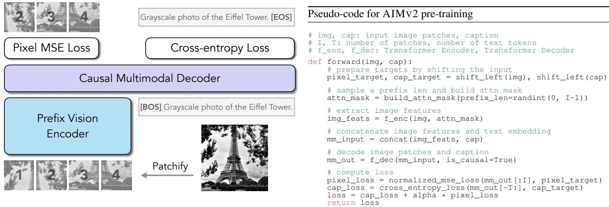
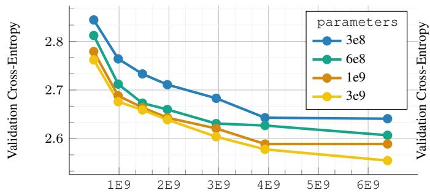
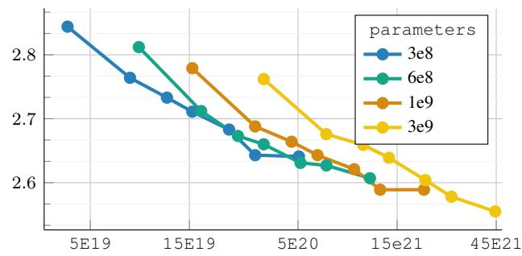
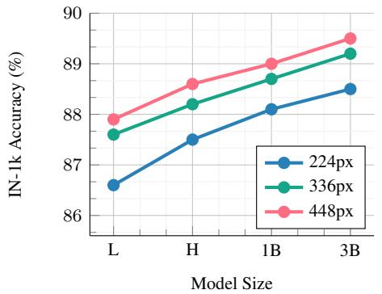
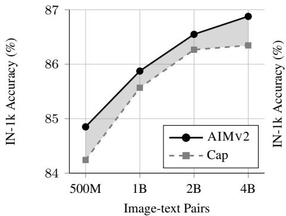
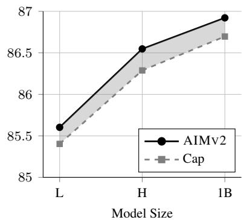
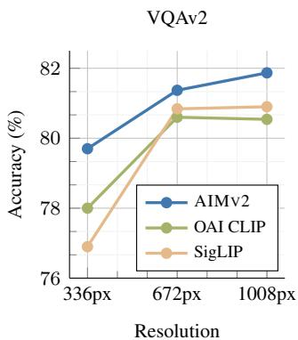
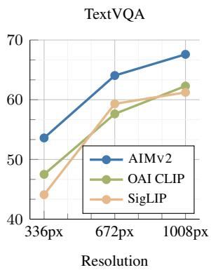
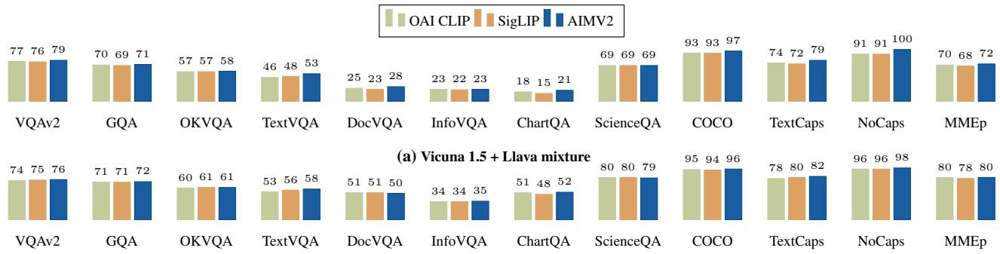

This CVPR paper is the Open Access version, provided by the Computer Vision Foundation. Except for this watermark, it is identical to the accepted version; the final published version of the proceedings is available on IEEE Xplore.

# Multimodal Autoregressive Pre-training of Large Vision Encoders

Enrico Finiω Mustafa Shukorω† Xiujun Li Philipp Dufter Michal Klein

David Haldimann Sai Aitharaju Victor G. Turrisi da Costa Louis Bethune´ Zhe Gan

Alexander Toshev Marcin Eichner Moin Nabi Yinfei Yang Joshua Susskind Alaaeldin El-Noubyω

Apple

https://github.com/apple/ml-aim

## Abstract

We introduce a novel methodfor pre-training oflarge-scale vision encoders. Building on recent advancements in autoregressive pre-training of vision models, we extend this framework to a multimodal setting, i.e., images and text. In this paper, we present AIMV2, a family of generalist vision encoders characterized by a straightforward pre-training process, scalability, and remarkable performance across a range of downstream tasks. This is achieved by pairing the vision encoder with a multimodal decoder that autoregressively generates raw image patches and text tokens. Our encoders excel not only in multimodal evaluations but also in vision benchmarks such as localization, grounding, and classification. Notably, our AIMV2-3B encoder achieves 89.5% accuracy on ImageNet-1k with a frozen trunk. Furthermore, AIMV2 consistently outperforms state-of-the-art contrastive models (e.g., CLIP, SigLIP) in multimodal image understanding across diverse settings.

## 1. Introduction

Research on pre-training of vision models has evolved significantly over time. Initially, specialist models were designed to maximize performance on specific tasks [14, 36, 45, 46, 56, 114]. Gradually, general-purpose models emerged that can be deployed for a number of predefined downstream tasks with minimal adaptation [54, 87, 94, 134]. However, the remarkable success of Large Language Models (LLMs) [1, 5, 96, 116] has introduced new paradigms for utilizing vision models [3, 73, 85, 115]. Unlike the rigid predefined settings where vision models were previously employed, LLMs enable more effective exploration of the pre-trained model capabilities. This shift demands rethinking pre-training methods for vision models.

Generative pre-training is the dominant paradigm for language modeling [23, 92, 93] and has shown remarkable performance and scalability [50, 55]. Generative pretraining has been extensively explored in computer vision [8, 29, 33, 48, 118], but its performance still lags behind that of discriminative methods [87, 94, 134, 138]. For instance, a formulation highly reminiscent of LLMs pretraining was proposed by El-Nouby et al. [33] and demonstrated encouraging scaling properties. However, it requires much higher capacity models to match the performance of its discriminative counterparts. In contrast, while contrastive techniques are often more parameter efficient, they are notably challenging to train and scale. Although significant progress has been made to mitigate these issues, there remains a gap in developing methods that combine the simplicity and scalability of generative pre-training with the parameter efficiency of discriminative approaches.

In this paper, we introduce AIMV2, a family of open vision models pre-trained to autoregressively generate both image patches and text tokens. During pre-training, AIMV2 uses a causal multimodal decoder that first regresses image patches and then decodes text tokens in an autoregressive manner, as illustrated in Figure 1. Such a simple approach offers several advantages. First, AIMV2 is straightforward to implement and train without requiring excessively large batch sizes [35, 94] or specialized interbatch communication methods [134]. Second, the architecture and pre-training objectives of AIMV2 align well with LLM-powered multimodal applications, enabling seamless integration. Finally, AIMV2 extracts a training signal from every image patch and text token, providing denser supervision compared to discriminative objectives.

Our AIMV2 models are strong generalists that exhibit remarkable performance across various vision and multimodal tasks. In particular, AIMV2 performs favorably on multimodal understanding benchmarks compared to stateof-the-art vision-language pre-trained methods [35, 134]. It outperforms DINOv2 [87] on open-vocabulary object detection and referring expression comprehension, and attains strong recognition performance with a frozen trunk, outperforming a number of strong baselines. Furthermore, AIMV2 enjoys strong scalability, similar to its languageonly and vision-only counterparts, improving consistently when scaling data or parameters. Moreover, we demonstrate the compatibility of AIMV2 with several modern tools, including support for native image resolution and adaptation to zero-shot recognition [133]. We discuss related works in more detail in Appendix A.

  
Figure 1. AIMV2 pre-training Overview. (Left) Image patches are processed by a vision encoder trained with prefix attention [33, 95]. The resulting visual representations are concatenated with the text embeddings of their corresponding captions. This combined multimoda sequence is then processed by a joint decoder. The model is pre-trained to autoregressively reconstruct the shifted input. (Right) Pseudocode for the forward pass during AIMV2 pre-training. The pre-training process of AIMV2 is straightforward to implement, resembling that of AIM and LLMs as it relies solely on a simple autoregressive objective.

## 2. Approach

## 2.1. Pre-training

Our model extends the standard unimodal autoregressive framework to multimodal settings that integrate both images and text into a unified sequence. Specifically, an image x is partitioned into I non-overlapping patches $x _ { i } ,$ $i \in [ 1 , I ]$ , forming a sequence of tokens. Similarly, a text sequence is broken down into subwords $x _ { t } , t \in [ I , I + T ]$ These sequences are then concatenated, allowing text tokens to attend to image tokens. While both concatenation directions (image text and text image) are possible, we focus on training a strong vision encoder by always prepending the image first, thereby enabling stronger conditioning on the visual features. This results in a unified multimodal autoregressive modeling process, where the sequence is factorized as follows:

$$
P ( S ) = \prod _ { j = 1 } ^ { I + T } P ( S _ { j } | S _ { < j } ) ,
$$

where $S _ { j }$ represents the j-th token in the concatenated sequence of image patches and text tokens, and $S _ { < j }$ includes all preceding tokens. This unified factorization allows the model to autoregressively predict the next token in the sequence, regardless of what modality it is currently processing. Our pre-training setup consists of a dedicated vision encoder that processes the raw image patches, which are then passed to a multimodal decoder alongside the embedded text tokens, as illustrated in Figure 1. The decoder subsequently performs next-token prediction on the combined sequence, following the factorization above. To support the autoregressive generation process, the vision encoder and multimodal decoder employ prefix and causal self-attention operations, respectively.

Objective function. We define separate loss functions for the image and text domains as follows:

$$
\begin{array} { r } { L _ { \mathrm { i m g } } = \displaystyle \frac { 1 } { I } \sum _ { i = 1 } ^ { I } \| \hat { x } _ { i } ( x _ { < i } ; \theta ) - x _ { i } \| _ { 2 } ^ { 2 } , } \\ { L _ { \mathrm { t e x t } } = - \displaystyle \frac { 1 } { T } \sum _ { t = I + 1 } ^ { I + T } \log P ( x _ { t } | x _ { < t } ; \theta ) . } \end{array}
$$

The overall objective is to minimize $L _ { \mathrm { t e x t } } + \alpha * L _ { \mathrm { i m g } }$ with respect to model parameters ω. For the text domain, $L _ { \mathrm { t e x t } }$ is a standard cross-entropy loss that measures the negative log-likelihood of the ground truth token at each step. For the image domain, $L _ { \mathrm { i m g } }$ is an $\ell _ { 2 }$ pixel-level regression loss, where the model’s predicted patch ${ \hat { x } } _ { i } ( \theta )$ is compared to the true patch $x _ { i }$ . We normalize the image patches following He et al. [48]. In practice, we use separate linear layers to map the final hidden state of the multimodal decoder to the appropriate output dimensions for image patches and vocabulary size for vision and language, respectively.

## 2.2. Architecture

For the vision encoder of AIMV2, we adopt the Vision Transformer (ViT) architecture [30]. We train a series of

  
Samples Seen

  
FLOPs (log scale)

Figure 2. Scaling properties of AIMV2. (Left) Given a fixed pre-training data size, increasing the number of parameters always leads to an improvement in the validation loss. (Right) The optimal model size varies based on the pre-training compute budget. Larger models perform worse than smaller ones when severely undertrained but improves consistently as the compute budget increases. This behavior is consistent with that reported by Hoffmann et al. [50] for text-only autoregressive models.
<table><tr><td>model</td><td>#params</td><td> $d _ { \mathrm { e n c } }$ </td><td> $L _ { \mathrm { e n c } }$ </td><td> $d _ { \mathrm { d e c } }$ </td><td> $L _ { \mathrm { d e c } }$ </td></tr><tr><td>AIMv2-L</td><td>0.3B</td><td>1024</td><td></td><td></td><td></td></tr><tr><td>AIMv2-H</td><td>0.6B</td><td>1536</td><td>24</td><td>12</td><td>1024</td></tr><tr><td>AIMv2-1B</td><td>1.2B</td><td>2048</td><td></td><td></td><td></td></tr><tr><td>AIMv2-3B</td><td>2.7B</td><td>3072</td><td></td><td></td><td></td></tr></table>

Table 1. AIMV2 family of models. We detail the architectural specifications of AIMV2 models including the embedding dimension d, number of layers L for the vision encoder and the mutlimodal decoder, and the total number of encoder parameters.

vision encoders ranging between 300M and 3B parameters.   
Detailed model specifications are provided in Table 1.

Prefix Attention. Following El-Nouby et al. [33], we constrain the self-attention mechanism within the vision encoder by applying a prefix attention mask [95]. This strategy facilitates the use of bidirectional attention during inference without additional tuning. Specifically, we randomly sample the prefix length as $M \sim \mathcal { U } \{ 1 , 2 , \dotsc , I - 1 \}$ . The pixel loss is computed exclusively for non-prefix patches, defined as $\{ x _ { i } \mid i > M \}$

SwiGLU and RMSNorm. Our vision encoder and multimodal decoder incorporate SwiGLU [102] as the feedforward network (FFN) and replace all normalization layers with RMSNorm [135]. These modifications leverage the recent successes of SwiGLU and RMSNorm in language modeling [116, 117].

Multimodal Decoder. We adopt a unified multimodal decoder that performs autoregressive generation for both image and text modalities concurrently. Image features and raw text tokens are each linearly projected and embedded into Rddec . The decoder receives concatenated sequences of image and text features as input and employs causal attention in the self-attention operations. The outputs of the decoder are processed through two separate linear heads—one for image tokens and another for text tokens—to predict the next token in each modality respectively. We use the same decoder capacity for all the AIMV2 variants.

The optimization hyperparameters used during pre-training of all AIMV2 models are outlined in Table B1.

<table><tr><td>dataset</td><td>public</td><td>caption</td><td>#images-text pairs</td><td>sampling prob.</td></tr><tr><td rowspan="2">DFN [35]</td><td>√</td><td>alt-text</td><td>1,901,228,573</td><td>30%</td></tr><tr><td>X</td><td>synthetic</td><td>3,802,457,146</td><td>30%</td></tr><tr><td rowspan="2">COYO [13]</td><td>√</td><td>alt-text</td><td>560,171,533</td><td>9%</td></tr><tr><td>X</td><td>alt-text</td><td>564,623,839</td><td>28%</td></tr><tr><td>HQITP</td><td>X</td><td>synthetic</td><td>431,506,953</td><td>3%</td></tr></table>

Table 2. Pre-training data mixture. AIMV2 is pre-trained using a large-scale collection of image and text pairs. For the paired captions, we utilize alt-text as well as synthetic text generated from a pre-trained captioner. In this table we list the datasets as well the sampling probabilities we used for each data source.

## 2.3. Data

We pre-train AIMV2 models using a combination of public and private datasets containing paired images and text. We use the publicly available DFN-2B [35] and COYO [13] datasets, along with a proprietary dataset of High Quality Image-Text Pairs (HQITP). In addition to alt-text, we use synthetic captions following the approach of Lai et al. [63]. Details regarding the datasets, including their sizes and the sampling probabilities used for each dataset, are provided in Table 2. Unless mentioned otherwise, all AIMV2 models were pre-trained using 12 billion image-text samples.

## 2.4. Post-Training

While the initial pre-training stage of AIMV2 yields highly performant models, we explore methods to further enhance the capabilities through various post-training strategies.

High-resolution Adaptation. In the initial pre-training stage, we use image data with a fixed resolution of 224px. However, many downstream task, such as detection, segmentation, and multimodal LLMs, benefit from models adapted to handle higher resolution images. Therefore, we finetune AIMV2 models for 336 and 448 pixel resolutions. The high-resolution adaptation stage utilizes 2 billion image-text pairs sampled from the same pool as the pretraining stage, except that we do not use synthetic captions at this stage. Consistent with the observations of Zhai et al. [134], we find that weight decay of zero is important for maintaining stable optimization.

  
Figure 3. Scaling capacity and resolution. AIMV2 shows strong scalability with respect to model parameters, measured in frozentrunk top-1 accuracy for IN-1k. This behavior is consistent when scaling image resolution.

  
Figure 4. AIMV2 vs. Captioning. We investigate the role of the image-level objective in comparison to a captioning-only baseline, particularly as we scale data and model size. Our findings indicate that AIMV2 consistently outperforms the captioning baseline across all dataset and model sizes. Notably, AIMV2 exhibits fewer signs of saturation when scaling data compared to the captioning-only approach.

Native Resolution Fine-tuning. Training models for a dedicated resolution and aspect ratio can be inflexible for many applications that require processing images in their original shapes. Prior works such as FlexiViT [9] and NaViT [26] have tackled these limitation. We adopt a different approach for training with variable aspect ratios and resolutions. Specifically, we define $B _ { i }$ as the number of images in a mini-batch, $A _ { i }$ as the number of patches per image, and C as the total number of image patches in the mini-batch. For a mini-batch i, we randomly sample an area A and resize the images to fit within this area while maintaining their aspect ratios.1 We then adjust the mini-batch size $B _ { i }$ such that $C = A _ { i } \times B _ { i }$ This strategy is analogous to the approach proposed by Pouransari et al. [91] for training LLMs with variable context lengths. Our implementation does not require heuristics for sequence packing, attention masking, or custom pooling operations. We choose $A = 2 ^ { n }$ , where n is sampled from a truncated normal distribution $\mathcal { N } ( 0 , 1 )$ within the range [ 1, 1] and linearly mapped to [7, 12].

## 3. Analysis

One of the main advantages of AIMV2 is its simplicity; it is easy to implement and scale. Therefore, we investigate the scaling properties of the AIMV2 family of models.

## 3.1. Scaling AIMv2

First, we investigate the impact of scaling data size and model capacity on the validation performance of AIMV2. We fix the model size and vary the number of samples seen during pre-training. This analysis is similar to “Approach 1” in the study of Hoffmann et al. [50]. The results of this study are illustrated in Figure 2.

Setup. We train four model capacities, ranging from 300 million to 3 billion parameters, and vary the number of samples seen between 500 million to 6.4 billion image-text pairs. All models are trained to convergence with no early stopping. To achieve this with minimal computational cost, we train a single model for each capacity using 5 billion images with a half-cosine learning rate schedule $( i . e .$ , the final learning rate is half the peak learning rate). We select seven intermediate checkpoints from this run and apply a linear cooldown to $1 \times 1 0 ^ { - 6 }$ . The length of the cooldown stage is 20% of the initial pre-training stage.

Results. We observe a consistent improvement in performance with scaling data or parameters. However, diminishing returns appear when scaling data for the lower-capacity models. Additionally, we find that the optimal model size changes as the compute budget varies. At smaller compute budgets, larger-capacity models are undertrained and underperform compared to their lower-capacity counterparts.

## 3.2. AIMv2 vs. Captioning

We study the role of the image-level autoregressive objective in the pre-training of AIMV2. We compare the performance of models trained with the multimodal autoregressive objective to ones trained only with language supervision. The results are illustrated in Figure 4.

Setup. Unless specified otherwise, this investigation uses a ViT-H backbone and 2 billion image-text pairs for pretraining. All models are trained to convergence with a cosine learning rate schedule. We measure the IN-1k top-1 accuracy after attentive probe with a frozen trunk.

Results. First, the image-level objective of AIMV2 consistently improves performance compared to the captioningonly baseline. This is true even when changing the model capacity and the size of the pre-training data. Moreover, we see both approaches improving consistently when increasing the data size or model capacity; however, we observe signs of plateauing for the captioning baselines with scaling data which we do not observe with AIMV2.

<table><tr><td></td><td></td><td></td><td></td><td>Ciar10</td><td>Ciarr10</td><td>F0od101</td><td></td><td></td><td></td><td>CAI7</td><td></td><td></td><td></td><td></td><td></td><td></td></tr><tr><td></td><td></td><td></td><td>NAT-18</td><td></td><td></td><td></td><td></td><td>Po</td><td></td><td>Cars</td><td></td><td>PCAM</td><td>RxxXI</td><td>ESAT</td><td>MW</td><td></td></tr><tr><td>model</td><td>architecture</td><td>IN-IK</td><td></td><td></td><td></td><td></td><td>DTD</td><td></td><td></td><td></td><td></td><td></td><td></td><td></td><td></td><td>Inuorhio</td></tr><tr><td>MAE [48]</td><td>ViT-2B/14 ViT-H/14</td><td>82.2 78.5</td><td>70.8</td><td>97.5 97.2</td><td>87.3</td><td>93.4 90.1</td><td>81.2 80.1</td><td>95.1 93.0</td><td>94.9</td><td></td><td>94.4</td><td>90.3</td><td>7.3</td><td>98.2</td><td>60.1</td><td>50.2</td></tr><tr><td>AIMv1 [33]</td><td>ViT-7B/14</td><td>84.0</td><td>64.0 75.5</td><td>98.9</td><td>86.8 91.8</td><td>94.1</td><td>85.6</td><td></td><td>95.4</td><td>93.0 95.0</td><td>94.3 94.2</td><td>90.0 90.5</td><td>7.8 8.4</td><td>98.4 98.5</td><td>58.3 63.5</td><td>45.2 57.7</td></tr><tr><td>DINOv2 [87]</td><td>ViT-g/14</td><td>87.2</td><td>83.0</td><td>99.7</td><td>95.6</td><td>96.0</td><td>86.9</td><td>96.8</td><td></td><td>94.9</td><td>95.8</td><td>90.1</td><td>9.0</td><td>98.8</td><td>65.5</td><td>59.4</td></tr><tr><td>OAI CLIP [94]</td><td>ViT-L/14</td><td>85.7</td><td>73.5</td><td>98.7</td><td>89.7</td><td>95.4</td><td>83.5</td><td>96.2</td><td></td><td>94.5</td><td>94.4</td><td>89.2</td><td>5.7</td><td>98.0</td><td>62.0</td><td>66.9</td></tr><tr><td rowspan="2">DFN-CLIP [35]</td><td>VIT-L/14</td><td>86.5</td><td>75.5</td><td>99.2</td><td>93.2</td><td>96.2</td><td>85.8</td><td>96.3</td><td></td><td>96.4</td><td></td><td></td><td></td><td>98.3</td><td>63.1</td><td>66.8</td></tr><tr><td>ViT-H/14</td><td>86.9</td><td>76.4</td><td>99.3</td><td>93.9</td><td>96.3</td><td>87.0</td><td></td><td>96.8</td><td>96.7</td><td>95.0 95.7</td><td>89.8 90.5</td><td>5.8 6.1</td><td>98.8</td><td>63.4</td><td>68.1</td></tr><tr><td rowspan="2">SigLIP [134]</td><td>ViT-L/16</td><td>86.5</td><td>75.1</td><td>98.5</td><td>90.4</td><td>96.1</td><td>86.7</td><td>96.7</td><td>96.5</td><td></td><td>93.1</td><td>89.5</td><td>4.5</td><td>98.3</td><td>61.7</td><td>71.0</td></tr><tr><td>ViT-So400m/14</td><td>87.3</td><td>77.4</td><td>98.8</td><td>91.2</td><td>96.5</td><td>87.7</td><td>96.7</td><td></td><td>96.6</td><td>93.3</td><td>90.0</td><td>4.6</td><td>98.6</td><td>64.4</td><td>72.3</td></tr><tr><td rowspan="5">AIMv2</td><td></td><td>86.6</td><td>76.0</td><td>99.1</td><td>92.2</td><td>95.7</td><td>87.9</td><td>96.3</td><td>96.3</td><td></td><td></td><td></td><td></td><td></td><td></td><td></td></tr><tr><td>ViT-L/14</td><td></td><td>77.9</td><td></td><td></td><td></td><td></td><td></td><td>96.6</td><td>96.4</td><td>93.7</td><td>89.3</td><td>5.6</td><td>98.4</td><td>60.7</td><td>69.0</td></tr><tr><td>ViT-H/14</td><td>87.5 88.1</td><td>79.7</td><td>99.3 99.4</td><td>93.5 94.1</td><td>96.3 96.7</td><td>88.2 88.4</td><td></td><td>96.8</td><td>96.5</td><td>93.3 94.2</td><td>89.3 89.0</td><td>5.8 6.7</td><td>98.5 98.8</td><td>62.2 63.2</td><td>70.4 71.7</td></tr><tr><td>ViT-1B/14</td><td>88.5</td><td>81.5</td><td>99.5</td><td>94.3</td><td>96.8</td><td>88.9</td><td></td><td>97.1</td><td>96.5</td><td>93.5</td><td>89.4</td><td>7.3</td><td>99.0</td><td>64.2</td><td>72.2</td></tr><tr><td>ViT-3B/14  $\mathrm { V i T } { - } 3 \mathrm { B } / 1 4 _ { 4 4 8 \mathrm { p x } }$ </td><td>89.5</td><td>85.9</td><td>99.5</td><td>94.5</td><td>97.4</td><td>89.0</td><td>97.4</td><td></td><td>96.7</td><td>93.4</td><td>89.9</td><td>9.5</td><td>98.9</td><td>66.1</td><td>74.8</td></tr></table>

Table 3. Frozen trunk evaluation for recognition benchmarks. We report the recognition performance of the AIMV2 family models when compared to a number of self-supervised and weakly-supervised state-of-the-art models. All models are evaluated using attentive probing with a frozen backbone. Unless otherwise specified, all AIMV2 models are trained at 224px resolution on 12B samples.

## 4. Results

AIMV2 is a generalist vision encoder that can be leveraged off-the-shelf for a wide range of downstream tasks. We evaluate the performance of the AIMV2 family across various tasks, including recognition, detection, captioning, and multiple multimodal benchmarks.

## 4.1. Image Recognition

Attentive probing. We assess the quality of the AIMV2 models as off-the-shelf backbones for recognition benchmarks which are outlined in Table C1. To this end, we adopt the attentive probing setting proposed by Yu et al. [130], where the vision encoder remains frozen, and only an attentive probe classifier is trained on top of the last layer features. The results are presented in Table 3. Detailed hyperparameters used for the probing experiments are provided in Table B2. First, we observe that AIMV2 significantly outperforms generative unsupervised methods such as MAE [48] and AIM [33], even with much smaller capacity models. Compared to DINOv2 [87], we find that both the similarly sized AIMV2-1B and the smaller AIMV2-H provide competitive performance, outperforming DINOv2 on several benchmarks including IN-1k, Food101, DTD, Cars, and with a particularly large margin on Infographic. However, DINOv2 offers exceptional performance for iNaturalist and fMoW. Furthermore, we find the performance of self-supervised models on medical imaging benchmarks (e.g., RxRx1 and CAM17) noteworthy, as they exhibit stronger performance compared to their weakly supervised counterparts. This affirms the importance of self-supervised learning methods, particularly in low-resource domains.

Second, when compared to other vision-language pretrained baselines, AIMV2 exhibits highly competitive performance. For instance, at the ViT-Large capacity, AIMV2 outperforms OAI CLIP on the majority of benchmarks and achieves stronger performance than DFN-CLIP and SigLIP on several key benchmarks, including IN-1k, iNaturalist,

<table><tr><td rowspan="2">model</td><td colspan="2">open-vocabulary</td><td colspan="3">referring expression</td></tr><tr><td>COCO</td><td>LVIS</td><td>RefC</td><td>RefC+</td><td>RefCg</td></tr><tr><td>OAI CLIP</td><td>59.1</td><td>31.0</td><td>92.2</td><td>86.2</td><td>88.3</td></tr><tr><td>DFN-CLIP</td><td>59.8</td><td>30.7</td><td>92.5</td><td>85.8</td><td>88.3</td></tr><tr><td>SigLIP</td><td>58.8</td><td>30.5</td><td>92.3</td><td>86.1</td><td>88.4</td></tr><tr><td>DINOv2</td><td>60.1</td><td>30.8</td><td>92.2</td><td>85.9</td><td>89.1</td></tr><tr><td>AIMv2</td><td>60.2</td><td>31.6</td><td>92.6</td><td>86.3</td><td>88.9</td></tr></table>

Table 4. Evaluation after finetuning on grounding dataset mixture. We report the performance on mean average precision (AP) for open-vocabulary detection and Precision @1 for referring expression comprehension tasks.

<table><tr><td>model →</td><td>Cap</td><td>AIMv2</td><td>[CapPa [118] AIMv2</td><td></td><td>OAI CLIP</td><td>SigLIP</td></tr><tr><td>Pre-train/LiT 2B/3B</td><td></td><td>2B/3B</td><td>9B/3B</td><td>12B/3B</td><td>13B/-</td><td>40B/-</td></tr><tr><td>IN-1k top-1</td><td>75.0</td><td>75.3</td><td>76.4</td><td>77.0</td><td>75.5</td><td>80.4</td></tr></table>

Table 5. Zero-shot performance. Comparison of different models with varying amounts of pre-training and LiT pairs, and their performance on IN1k. For CapPa, we compare to the number reported by Tschannen et al. [118].
<table><tr><td>test resolution →</td><td>224×224</td><td>448×448</td><td>native</td></tr><tr><td> $\overline { { \mathrm { \bf { A I M V } } 2 \mathrm { - } \mathrm { L } _ { 2 2 4 \mathrm { p x } } } }$ </td><td>86.6</td><td>84.8</td><td>-</td></tr><tr><td> $\mathrm { A I M V } 2 \mathrm { - } \mathrm { L } _ { 4 4 8 \mathrm { p x } }$ </td><td>78.9</td><td>87.9</td><td></td></tr><tr><td> $\mathbf { A I M V } 2  – \mathbf { L } _ { \mathrm { n a t i v e } }$ </td><td>86.1</td><td>87.1</td><td>87.3</td></tr></table>

Table 6. AIMV2 with native aspect ratio and resolution. We report the IN-1k top-1 performance of the native resolution AIMV2-L model as compared to AIMV2-L models that are pretrained/finetuned for single dedicated resolution.

DTD, and Infographic. These results are particularly impressive given that AIMV2 is trained using nearly a quarter of the data required for training DFN-CLIP and SigLIP (12B vs. 40B), while also being easier to train and scale. Finally, we find that scaling the capacity of AIMV2 models consistently lead to a stronger performance with AIMV2- 3B exhibiting the strongest result, in particular,its variant finetuned for 448px images which achieves 89.5% top-1 accuracy on IN-1k with a frozen trunk. Finally, in Figure 3 we observe a clear improvement in the performance of IN-1k when scaling the model capacity and the image resolution in conjunction. We provide more detailed results for the high-resolution finetuned backbones in Appendix C.

<table><tr><td>model</td><td>architecture</td><td># patches</td><td>VQAv2</td><td>GQA</td><td>OKVQA</td><td>TextVQA</td><td>DocVQA</td><td>InfoVQA</td><td>ChartQA</td><td>ScienceQA</td><td>COCO</td><td>TextCaps</td><td>NoCaps</td><td>SEED</td><td>MMEp</td></tr><tr><td>OpenAI CLIP</td><td>ViT-L/14</td><td>576</td><td>78.0</td><td>72.0</td><td>60.0</td><td>47.5</td><td>25.6</td><td>21.8</td><td>18.5</td><td>73.8</td><td>94.9</td><td>75.3</td><td>93.3</td><td>70.1</td><td>1481</td></tr><tr><td>SigLIP</td><td>ViT-L/14</td><td>576</td><td>76.9</td><td>70.3</td><td>59.3</td><td>44.1</td><td>16.9</td><td>20.7</td><td>14.4</td><td>74.7</td><td>93.0</td><td>69.9</td><td>92.7</td><td>66.8</td><td>1416</td></tr><tr><td>DINOv2</td><td>ViT-So400M/14</td><td>752</td><td>77.7</td><td>71.0</td><td>60.1</td><td>47.5</td><td>19.2</td><td>21.0</td><td>14.7</td><td>74.9</td><td>94.6</td><td>70.8</td><td>94.5</td><td>67.5</td><td>1433</td></tr><tr><td></td><td>VIT-g/14</td><td>1369</td><td>76.7</td><td>72.7</td><td>56.9</td><td>15.1</td><td>8.2</td><td>19.7</td><td>12.0</td><td>69.5</td><td>93.4</td><td>42.1</td><td>89.1</td><td>68.9</td><td>1423</td></tr><tr><td rowspan="4">AIMv2</td><td>ViT-L/14</td><td>576</td><td>79.7</td><td>72.5</td><td>60.8</td><td>53.6</td><td>26.6</td><td>22.8</td><td>19.2</td><td>74.1</td><td>96.9</td><td>81.1</td><td>99.9</td><td>71.8</td><td>1472</td></tr><tr><td>ViT-H/14</td><td>576</td><td>80.2</td><td>72.8</td><td>61.3</td><td>55.5</td><td>27.8</td><td>23.1</td><td>19.9</td><td>76.8</td><td>99.6</td><td>80.7</td><td>102.7</td><td>72.1</td><td>1545</td></tr><tr><td>ViT-1B/14</td><td>576</td><td>80.5</td><td>73.0</td><td>61.5</td><td>56.8</td><td>28.5</td><td>22.1</td><td>20.5</td><td>76.4</td><td>98.4</td><td>82.6</td><td>101.5</td><td>72.7</td><td>1508</td></tr><tr><td>ViT-3B/14</td><td>576</td><td>80.9</td><td>73.3</td><td>61.7</td><td>58.2</td><td>30.4</td><td>23.0</td><td>22.6</td><td>77.3</td><td>100.3</td><td>83.8</td><td>102.9</td><td>72.9</td><td>1545</td></tr></table>

Table 7. Mutlimodal Evaluations. We compare AIMV2 to state-of-the-art visual backbones for multimodal instruction tuning. Under comparable capacities, AIMV2-L outperforms its counterparts on the majority of benchmarks. Additionally, scaling to the larger AIMV2- 3B model results in clear improvements, achieving the highest scores on nearly all benchmarks. All AIMV2 models use 336px resolution.

  
Figure 5. Impact of Scaling Resolution. The performance boost achieved byAIMV2 persists after scaling input resolution via tiling Lin et al. [72], Liu et al. [73] compared to popular vision backbones for VLMs such as OAI CLIP and SigLIP.

Zero-shot via LiT Tuning. We investigate the compatibility of AIMV2 backbones with LiT [133], extending its application to zero-shot settings. We report the IN-1k zeroshot performance in Table 5. First, we observe that AIMV2, with the multimodal autoregressive objective, shows a modest improvement compared to the captioning-only baseline, even in this setting. Furthermore, an AIMV2-L model trained for a longer duration exhibits favorable performance compared to the results reported by Tschannen et al. [118] for CapPa. Overall, our model demonstrates strong zero-shot performance, outperforming OAI CLIP [94], yet still lagging behind dedicated models like SigLIP that are trained for a longer schedule with 40B image-text pairs.

Native resolution. We finetune AIMV2 to process images with a wide range of resolutions and aspect ratios as detailed in § 2.4. In order to assess the quality of this stage of post-training, we compare the performance of an AIMV2 encoder adapted for native resolution to models that are tuned for one specific resolution in Table 6. We observe that $\mathrm { A I M V } 2 { \cdot } \mathrm { L } _ { \mathrm { n a t i v e } }$ provides a strong performance across a wide range of resolutions off-the-shelf, experiencing only a minor degradation in performance to the dedicated models. Additionally, evaluating our model using the original native resolutions of the IN-1k validation set images yields a robust accuracy of 87.3%, confirming that AIMV2 maintains exceptional recognition performance while offering high flexibility in both aspect ratio and resolution.

<table><tr><td>model</td><td>architecture</td><td>0-shot</td><td>4-shot</td><td>8-shot</td></tr><tr><td>OAI CLIP [85]</td><td>ViT-L/14</td><td>39.3</td><td>62.2</td><td>66.1</td></tr><tr><td>DFN-CLIP [85]</td><td>ViT-H/14</td><td>40.9</td><td>62.5</td><td>66.4</td></tr><tr><td>AIMv2</td><td>ViT-L/14</td><td>39.6</td><td>63.8</td><td>67.2</td></tr></table>

Table 8. ICL few-shot performance. We report the in-context few-shot performance averaged across a wide range of bench marks as detailed in § 4.3.2. The results for DFN-CLIP and OAI CLIP are as reported by McKinzie et al. [85].

## 4.2. Object Detection and Grounding

To further demonstrate the capabilities of AIMV2, we evaluate its performance on tasks such as Open-Vocabulary Detection (OVD) and Referring Expression Comprehension (REC). We follow the model architecture introduced by MM-Grounding-DINO [74, 137] but adapt ViT-L through the ViTDet [68] formulation as the vision backbone. Our results are presented in Table 4. For OVD capabilities we evaluate on COCO [71] and LVIS [43], while for REC, we evaluate on RefCOCO (RefC) [57], RefCOCO+ (RefC+) [131], and RefCOCOg (RefCg) [79]. All models were trained on the following datasets: Objects365v1 [101], Flickr-30k Entities [90, 128], GQA [52], COCO17 [71], and RefCOCO [57, 79, 131]. During DINOv2 training we fix the window size to 16 [69] to ensure fixed compute cost across backbones. Our results indicate that AIMV2 outperforms DINOv2 as well as other vision-language pre-trained models on all benchmarks but one, showing particularly strong performance on LVIS. We present additional localization and grounding results including closed-vocabulary detection and instance segmentation as well as ablations on varying window sizes in Appendix E.

## 4.3. Multimodal Understanding

Vision encoders play a crucial role in advancing large multimodal models [6, 73, 85, 115, 139]. To quantify the performance of AIMV2 models in this setting, we perform a multimodal instruction tuning stage similar to Liu et al. [73]. Additionally, we explore the few-shot In-Context Learning (ICL) setting after large-scale multimodal pretraining similar to McKinzie et al. [85].

## 4.3.1. Multimodal Instruction Tuning

Setup. We place a 2-layer MLP connector between the vision encoder (e.g., AIMV2-L) and the LLM (e.g., Llama 3.0). The parameters of the vision encoder are frozen during this stage. Contrary to Liu et al. [73], we train the connector and the LLM jointly in a single stage. However, we scale up the learning rate for the connector by a factor of 8. We found this strategy to be simpler while leading to comparable results. We detail the evaluation datasets, task prompts, and hyperparameters used during this stage in Appendix D. Unless mentioned otherwise, we use the Llava SFT mixture [73] and Llama-3.0 8B LLM decoder [32]. We train all models for a single epoch.

  
(b) Llama 3.0 + Cambrian 7M  
Figure 6. Instruction tuning under different settings. We evaluate instruction-tuned models across combinations of LLM decoders and tuning data mixtures. In all settings, AIMV2 consistently outperforms or matches SigLIP and OAI CLIP on most benchmarks. All models use a ViT-L backbone with 336px images. For better readability, we present normalized MME scores by dividing the raw scores by 2000

Evaluation. We evaluate the instruction-tuned models across various question answering benchmarks covering general knowledge, text-rich images, scientific domains, and captioning. The results for AIMV2 and several baselines are presented in Table 7. Notably, our smallest model, AIMV2-L, outperforms OAI CLIP, SigLIP, and DINOv2 on most benchmarks, even when the baselines use larger capacities or higher input resolutions. Furthermore, performance consistently improves with increasing the AIMV2 backbone capacity, with the AIMV2-3B model achieving the best performance across all benchmarks except one.

Varying the LLM and Data Mixture. In addition to the canonical setting reported in Table 7, we evaluate whether AIMV2 can provide similar gains compared to popular vision encoders across various combinations of LLM decoders and instruction tuning data mixtures. Specifically, we perform the instruction tuning stage under the following settings: (1) Llama 3.0 with the Cambrian data mixture [115] and (2) Vicuna 1.5 [22] with the Llava SFT mixture. We present the results for AIMV2-L alongside similarly sized OAI CLIP and SigLIP backbones in Figure 6. Across all settings, AIMV2 provides a stronger, or at worst on par, performance compared the OAI CLIP and SigLIP. These findings further affirm the robustness and compatibility of AIMV2 within diverse multimodal pipelines.

High-Resolution via Tiling. One of the most popular strategies to enhance the performance of vision-language models is increasing the image resolution. This can be achieved through a tiling strategy [72, 73, 103], where a high-resolution image is divided into a number of equally sized crops that match the pre-training resolution of the available backbones (e.g., 224px or 336px). We investigate the compatibility of AIMV2 with this strategy. Specifically, we use a crop size of 336px and evaluate our pipeline on 672px and 1008px images corresponding to 2 2 and 3 3 grids respectively. The results for AIMV2, SigLIP, and OAI CLIP are presented in Figure 5. We observe tha the performance of all methods improves with higher resolutions, with a significant improvement for TextVQA. Notably, AIMV2 maintains its advantage over the baselines in high-resolution tiling settings, demonstrating its versatility.

## 4.3.2. Multimodal In-Context Learning

We also evaluate AIMV2 in a large-scale multimodal pre-training setting. Following the pre-training recipe as MM1 [85], we simply replace the vision encoder with AIMV2. Given that this model is pre-trained using interleaved image-text documents, it enables in-context evaluations [3]. We report the ICL performance in Table 8. Specifically, we report the average 0-shot, 4-shot, and 8-shot performance across the following benchmarks: COCO [21], NoCaps [2], TextCaps [105], VQAv2 [40], TextVQA [107], VizWiz [44], GQA [53], and OK-VQA [80]. Our results demonstrate that AIMV2 achieves the best performance in the 4-shot and 8-shot settings, surpassing the higher capacity DFN-CLIP adopted by the MM1 series. This highlights the compatibility and effectiveness of AIMV2 in leveraging ICL in a large-scale multimodal setup.

## 5. Ablation Study

In this section, we investigate various design choices and present the trade-offs associated with each. The results of our study are summarized in Table 9.

Setup. The default setting for this ablation study utilizes a ViT-Large vision encoder and 2 billion image-text pairs during pre-training. We measure the IN-1k top-1 accuracy after attentive probing, as well as the questionanswering accuracy on the validation sets of VQAv2 [40] and TextVQA [106] following instruction tuning, as described in § 2.4. All experiments reported in this ablation study employ images with 224 224 resolution. The metrics selected for this study provide a comprehensive view of the models’ capabilities, encompassing recognition, general question answering, and text-rich question answering.

<table><tr><td>model</td><td>pre-train attn.</td><td>IN-1k</td><td>VQAv2</td><td>TextVQA</td></tr><tr><td>AIMV1</td><td>prefix</td><td>72.0</td><td>65.4</td><td>12.7</td></tr><tr><td rowspan="2">Cap</td><td>bidir</td><td>85.1</td><td>76.2</td><td>34.4</td></tr><tr><td>prefix</td><td>85.4</td><td>76.8</td><td>36.5</td></tr><tr><td>AIMv2</td><td>prefix</td><td>85.6</td><td>76.9</td><td>37.5</td></tr></table>

(a) Objective.

<table><tr><td>model</td><td>bsz</td><td>IN-1k</td><td>VQAv2</td><td>TextVQA</td><td>α</td><td>IN-1k</td><td>VQAv2</td><td>TextVQA</td></tr><tr><td rowspan="2">CLIP</td><td>8k</td><td>84.6</td><td>74.1</td><td>24.6</td><td>0.2</td><td>85.6</td><td>76.7</td><td>37.4</td></tr><tr><td>16k</td><td>85.2</td><td>74.8</td><td>26.3</td><td>0.4</td><td>85.6</td><td>76.9</td><td>37.5</td></tr><tr><td>CapPa</td><td>8k</td><td>84.7</td><td>75.1</td><td>30.6</td><td>0.6</td><td>85.6</td><td>76.7</td><td>37.4</td></tr><tr><td>AIMv2</td><td>8k</td><td>85.6</td><td>76.9</td><td>37.5</td><td></td><td></td><td></td><td></td></tr></table>

(b) AIMV2 vs. CLIP..  
(c) Criteria Weights.

<table><tr><td></td><td>IN-1k</td><td>VQAv2</td><td>TextVQA</td></tr><tr><td>separate</td><td>85.6</td><td>77.1</td><td>37.2</td></tr><tr><td>joint</td><td>85.6</td><td>76.9</td><td>37.5</td></tr></table>

(d) Decoder Architecture.

<table><tr><td>width</td><td>IN-1k</td><td>VQAv2</td><td>TextVQA</td></tr><tr><td>512</td><td>85.3</td><td>76.2</td><td>35.9</td></tr><tr><td>1024</td><td>85.6</td><td>76.9</td><td>37.5</td></tr><tr><td>1536</td><td>85.1</td><td>76.9</td><td>36.9</td></tr></table>

(e) Decoder Width.

<table><tr><td>depth</td><td>IN-1k</td><td>VQAv2</td><td>TextVQA</td></tr><tr><td>8</td><td>85.5</td><td>76.7</td><td>37.0</td></tr><tr><td>12</td><td>85.6</td><td>76.9</td><td>37.5</td></tr><tr><td>16</td><td>85.6</td><td>76.9</td><td>36.6</td></tr></table>

(f) Decoder Depth.  
Table 9. Ablations. We ablate a number of design choices for AIMV2 and how they impact performance on key recognition and multimodal benchmarks. This includes (a) the contribution of the visual and textual objectives, (b) comparison to other popular objectives, (c) the optimal balancing between the losses, (d-f) the architecture of the multimodal decoder. All models are trained at 224px resolution.

Pre-training Objective. The pre-training objective of AIMV2 comprises a combination of image-level and textlevel autoregressive objectives. We evaluate the performance of each objective independently and assess the impact of combining them, as presented in Table 9a. First, we observe that utilizing only the image-level objective (i.e., AIMv1) results in weaker performance compared to models that incorporate the captioning objective. This is expected, given that AIMv1 operates in an unsupervised manner and demands higher-capacity models to achieve optimal performance, as highlighted by El-Nouby et al. [33]. Second, for the captioning-only model, using prefix attention within the vision encoder yields superior performance compared to fully bidirectional attention. We hypothesize that prefix attention facilitates the encoding of maximally informative contexts even from partial images, as such contexts are utilized by subsequent visual and textual tokens. However, this hypothesis warrants further investigation, which is beyond the scope of this work and is reserved for future research. Finally, we find that combining the image-level and text-level objectives in AIMV2 leads to an improved performance, particularly noticeable for TextVQA.

AIMV2 vs. CLIP vs. CapPa. In Table 9b, we evaluate the performance of models trained with the AIMV2 objective in comparison to other popular vision-language pretraining objectives, specifically CLIP [94] and CapPa [118]. All models are trained using identical architectures, incorporating SwiGLU and RMSNorm, and are pre-trained using the same dataset of image-text pairs. Notably, since CLIP pre-training benefits from larger batch sizes, we report CLIP results using both 8k and 16k batch sizes to ensure a fair comparison. Our findings indicate that, under comparable settings, AIMV2 consistently outperforms both CLIP and CapPA by a significant margin, particularly on the TextVQA benchmark. This performance is especially noteworthy given the simplicity and scalability AIMV2.

Multi-task balancing. We examine whether the pretraining of AIMV2 is sensitive to the balancing between the image-level and text-level objectives in Table 9c. We vary the hyperaparmeter ε, as described in § 2.1, and we observe only minor fluctuations in performance around the optimal value of 0.4 across the three benchmarks.

Joint vs. Separate Decoders. In the AIMV2 architecture, we opt for a multimodal joint decoder instead of employing dedicated decoders for each modality. In Table 9d, we examine the performance of an AIMV2 variant that utilizes two dedicated decoders. Using a single joint decoder achieves comparable results to using separate decoders while offering greater simplicity and efficiency during pre-training. This advantage proves valuable when scaling data and model capacity.

Decoder architecture. Finally, we examine the capacity of the multimodal decoder, as detailed in Table 9e and Table 9f. We find that performance is more sensitive to changes in decoder capacity when scaling the width compared to scaling the depth. Additionally, we observe that increasing the decoder capacity beyond a certain threshold, whether by scaling width or depth, leads to a decline in performance. This observation is consistent with the findings of Tschannen et al. [118] for captioning-only models.

## 6. Conclusion

This paper introduces AIMV2, a family of vision encoders pre-trained with a multimodal autoregressive objective that reconstructs image patches and text tokens. This unified objective enables AIMV2 to excel in diverse tasks, including image recognition, grounding, and multimodal understanding. The superior performance of AIMV2 is attributed to its ability to leverage signals from all input tokens and patches, facilitating efficient training with fewer samples compared to other methods. AIMV2 consistently outperforms or matches existing self-supervised and vision-language pretrained models, demonstrating its strength and versatility as a vision encoder. Additionally, the straightforward pretraining process of AIMV2 ensures easy scalability, paving the way for further advancements in vision model scaling.

## Acknowledgement

We thank Shuangfei Zhai, Miguel Bautista, Jason Ramapuram, Chun-Liang Li, Seyed Mohsen Moosavi Dezfooli, David Mizrahi, Roman Bachmann, and Jesse Allardice for many fruitful discussions. We thank Vaishaal Shankar, Peter Grasch, Vasileios Saveris, and Jeff Lai for their support with data collection and synthetic captioning. We thank Denise Hui, Dan Busbridge, and Samy Bengio for infra and compute support. Finally, we thank Marco Cuturi, James Thornton, Pierre Ablin, Eugene Ndiaye, and the MLR team at Apple for their support throughout the project.

## References

[1] Josh Achiam, Steven Adler, Sandhini Agarwal, Lama Ahmad, Ilge Akkaya, Florencia Leoni Aleman, Diogo Almeida, Janko Altenschmidt, Sam Altman, Shyamal Anadkat, et al. Gpt-4 technical report. arXiv preprint arXiv:2303.08774, 2023. 1

[2] Harsh Agrawal, Karan Desai, Yufei Wang, Xinlei Chen, Rishabh Jain, Mark Johnson, Dhruv Batra, Devi Parikh, Stefan Lee, and Peter Anderson. Nocaps: Novel object captioning at scale. In ICCV, 2019. 7, 17

[3] Jean-Baptiste Alayrac, Jeff Donahue, Pauline Luc, Antoine Miech, Iain Barr, Yana Hasson, Karel Lenc, Arthur Mensch, Katie Millican, Malcolm Reynolds, Roman Ring, Eliza Rutherford, Serkan Cabi, Tengda Han, Zhitao Gong, Sina Samangooei, Marianne Monteiro, Jacob Menick, Sebastian Borgeaud, Andrew Brock, Aida Nematzadeh, Sahand Sharifzadeh, Mikolaj Binkowski, Ricardo Barreira, Oriol Vinyals, Andrew Zisserman, and Karen Simonyan. Flamingo: a visual language model for few-shot learning. In NeurIPS, 2022. 1, 7

[4] Mahmoud Assran, Quentin Duval, Ishan Misra, Piotr Bojanowski, Pascal Vincent, Michael Rabbat, Yann LeCun, and Nicolas Ballas. Self-supervised learning from images with a joint-embedding predictive architecture. arXiv preprint arXiv:2301.08243, 2023. 15

[5] Jinze Bai, Shuai Bai, Yunfei Chu, Zeyu Cui, Kai Dang, Xiaodong Deng, Yang Fan, Wenbin Ge, Yu Han, Fei Huang, et al. Qwen technical report. arXiv preprint arXiv:2309.16609, 2023. 1

[6] Jinze Bai, Shuai Bai, Shusheng Yang, Shijie Wang, Sinan Tan, Peng Wang, Junyang Lin, Chang Zhou, and Jingren Zhou. Qwen-vl: A frontier large vision-language model with versatile abilities. arXiv preprint arXiv:2308.12966, 2023. 6

[7] Peter Bandi, Oscar Geessink, Quirine Manson, Marcory Van Dijk, Maschenka Balkenhol, Meyke Hermsen, Babak Ehteshami Bejnordi, Byungjae Lee, Kyunghyun Paeng, Aoxiao Zhong, et al. From detection of individual metastases to classification of lymph node status at the patient level: the camelyon17 challenge. IEEE Transactions on Medical Imaging, 2018. 16

[8] Hangbo Bao, Li Dong, and Furu Wei. BEiT: Bert pretraining of image transformers. In ICLR, 2022. 1, 15

[9] Lucas Beyer, Pavel Izmailov, Alexander Kolesnikov, Mathilde Caron, Simon Kornblith, Xiaohua Zhai, Matthias Minderer, Michael Tschannen, Ibrahim Alabdulmohsin, and Filip Pavetic. Flexivit: One model for all patch sizes. In CVPR, 2023. 4

[10] Lukas Bossard, Matthieu Guillaumin, and Luc Van Gool. Food-101 – mining discriminative components with ran dom forests. In ECCV, 2014. 16

[11] George EP Box, Gwilym M Jenkins, Gregory C Reinsel, and Greta M Ljung. Time series analysis: forecasting and control. John Wiley & Sons, 2015. 15

[12] Tom B Brown, Benjamin Mann, Nick Ryder, Melanie Subbiah, Jared Kaplan, Prafulla Dhariwal, Arvind Neelakantan, Pranav Shyam, Girish Sastry, Amanda Askell, et al. Language models are few-shot learners. preprint arXiv:2005.14165, 2020. 15

[13] Minwoo Byeon, Beomhee Park, Haecheon Kim, Sungjun Lee, Woonhyuk Baek, and Saehoon Kim. Coyo-700m: Image-text pair dataset, 2022. 3, 15

[14] Nicolas Carion, Francisco Massa, Gabriel Synnaeve, Nicolas Usunier, Alexander Kirillov, and Sergey Zagoruyko. End-to-end object detection with transformers. In ECCV, 2020. 1

[15] Mathilde Caron, Ishan Misra, Julien Mairal, Priya Goyal, Piotr Bojanowski, and Armand Joulin. Unsupervised learning of visual features by contrasting cluster assignments. In NeurIPS, 2020. 15

[16] Mathilde Caron, Hugo Touvron, Ishan Misra, Herve J´ egou,´ Julien Mairal, Piotr Bojanowski, and Armand Joulin. Emerging properties in self-supervised vision transformers. In ICCV, 2021. 15

[17] Mathilde Caron, Ahmet Iscen, Alireza Fathi, and Cordelia Schmid. A generative approach for wikipedia-scale visual entity recognition. In CVPR, 2024. 15

[18] Kai Chen, Jiaqi Wang, Jiangmiao Pang, Yuhang Cao, Yu Xiong, Xiaoxiao Li, Shuyang Sun, Wansen Feng, Ziwei Liu, Jiarui Xu, Zheng Zhang, Dazhi Cheng, Chenchen Zhu, Tianheng Cheng, Qijie Zhao, Buyu Li, Xin Lu, Rui Zhu, Yue Wu, Jifeng Dai, Jingdong Wang, Jianping Shi, Wanli Ouyang, Chen Change Loy, and Dahua Lin. Mmdetection: Open mmlab detection toolbox and benchmark. 2019. 19

[19] Mark Chen, Alec Radford, Rewon Child, Jeffrey Wu, Heewoo Jun, David Luan, and Ilya Sutskever. Generative pretraining from pixels. In ICML, 2020. 15

[20] Ting Chen, Simon Kornblith, Mohammad Norouzi, and Geoffrey Hinton. A simple framework for contrastive learning of visual representations. In ICML, 2020. 15

[21] Xinlei Chen, Hao Fang, Tsung-Yi Lin, Ramakrishna Vedantam, Saurabh Gupta, Piotr Dollar, and C Lawrence´ Zitnick. Microsoft coco captions: Data collection and evaluation server. arXiv preprint arXiv:1504.00325, 2015. 7

[22] Wei-Lin Chiang, Zhuohan Li, Zi Lin, Ying Sheng, Zhanghao Wu, Hao Zhang, Lianmin Zheng, Siyuan Zhuang, Yonghao Zhuang, Joseph E. Gonzalez, Ion Stoica, and Eric P. Xing. Vicuna: An open-source chatbot impressing gpt-4 with 90%\* chatgpt quality, 2023. 7

[23] Aakanksha Chowdhery, Sharan Narang, Jacob Devlin, Maarten Bosma, Gaurav Mishra, Adam Roberts, Paul

Barham, Hyung Won Chung, Charles Sutton, Sebastian Gehrmann, et al. Palm: Scaling language modeling with pathways. arxiv 2022. arXiv preprint arXiv:2204.02311, 2022. 1

[24] Gordon Christie, Neil Fendley, James Wilson, and Ryan Mukherjee. Functional map of the world. In Proceedings of the IEEE Conference on Computer Vision and Pattern Recognition, 2018. 16

[25] M. Cimpoi, S. Maji, I. Kokkinos, S. Mohamed, and A. Vedaldi. Describing textures in the wild. In CVPR, 2014. 16

[26] Mostafa Dehghani, Basil Mustafa, Josip Djolonga, Jonathan Heek, Matthias Minderer, Mathilde Caron, Andreas Steiner, Joan Puigcerver, Robert Geirhos, Ibrahim M Alabdulmohsin, et al. Patch n’pack: Navit, a vision transformer for any aspect ratio and resolution. Advances in Neural Information Processing Systems, 36, 2024. 4

[27] Jia Deng, Wei Dong, Richard Socher, Li-Jia Li, Kai Li, and Li Fei-Fei. Imagenet: A large-scale hierarchical image database. In 2009 IEEE conference on computer vision and pattern recognition, 2009. 16

[28] Karan Desai and Justin Johnson. Virtex: Learning visual representations from textual annotations. In Proceedings of the IEEE/CVF conference on computer vision and pattern recognition, 2021. 15

[29] Carl Doersch, Abhinav Gupta, and Alexei A Efros. Unsupervised visual representation learning by context prediction. In ICCV, 2015. 1

[30] Alexey Dosovitskiy, Lucas Beyer, Alexander Kolesnikov, Dirk Weissenborn, Xiaohua Zhai, Thomas Unterthiner, Mostafa Dehghani, Matthias Minderer, Georg Heigold, Sylvain Gelly, et al. An image is worth 16x16 words: Transformers for image recognition at scale. In ICLR, 2021. 2

[31] Abhimanyu Dubey, Abhinav Jauhri, Abhinav Pandey, Abhishek Kadian, Ahmad Al-Dahle, Aiesha Letman, Akhil Mathur, Alan Schelten, Amy Yang, Angela Fan, et al. The llama 3 herd of models. arXiv preprint arXiv:2407.21783, 2024. 15

[32] Abhimanyu Dubey, Abhinav Jauhri, Abhinav Pandey, Abhishek Kadian, Ahmad Al-Dahle, Aiesha Letman, Akhil Mathur, Alan Schelten, Amy Yang, Angela Fan, et al. The llama 3 herd of models. arXiv preprint arXiv:2407.21783, 2024. 7

[33] Alaaeldin El-Nouby, Michal Klein, Shuangfei Zhai, Miguel Angel Bautista, Alexander Toshev, Vaishaal Shankar, Joshua M Susskind, and Armand Joulin. Scalable pre-training of large autoregressive image models. arXiv preprint arXiv:2401.08541, 2024. 1, 2, 3, 5, 8, 15

[34] Patrick Esser, Robin Rombach, and Bjorn Ommer. Taming transformers for high-resolution image synthesis. In CVPR, 2021. 15

[35] Alex Fang, Albin Madappally Jose, Amit Jain, Ludwig Schmidt, Alexander Toshev, and Vaishaal Shankar. Data filtering networks. arXiv preprint arXiv:2309.17425, 2023. 1, 3, 5, 15

[36] Christoph Feichtenhofer, Haoqi Fan, Jitendra Malik, and Kaiming He. Slowfast networks for video recognition. 2019 ieee. In ICCV, 2018. 1

[37] Enrico Fini, Pietro Astolfi, Adriana Romero-Soriano, Jakob Verbeek, and Michal Drozdzal. Improved baselines for vision-language pre-training. arXiv preprint arXiv:2305.08675, 2023. 15

[38] Chaoyou Fu, Peixian Chen, Yunhang Shen, Yulei Qin, Mengdan Zhang, Xu Lin, Zhenyu Qiu, Wei Lin, Jinrui Yang, Xiawu Zheng, et al. Mme: A comprehensive evaluation benchmark for multimodal large language models. arXiv preprint arXiv:2306.13394, 2023. 17

[39] Spyros Gidaris, Praveer Singh, and Nikos Komodakis. Unsupervised representation learning by predicting image rotations. arXiv preprint arXiv:1803.07728, 2018. 15

[40] Yash Goyal, Tejas Khot, Douglas Summers-Stay, Dhruv Batra, and Devi Parikh. Making the v in vqa matter: Elevating the role of image understanding in visual question answering. In CVPR, 2017. 7

[41] Yash Goyal, Tejas Khot, Douglas Summers-Stay, Dhruv Batra, and Devi Parikh. Making the v in vqa matter: Elevating the role of image understanding in visual question answering. In Proceedings ofthe IEEE conference on computer vision and pattern recognition, 2017. 17

[42] Jean-Bastien Grill, Florian Strub, Florent Altche, Corentin´ Tallec, Pierre Richemond, Elena Buchatskaya, Carl Doersch, Bernardo Avila Pires, Zhaohan Guo, Mohammad Gheshlaghi Azar, et al. Bootstrap your own latent-a new approach to self-supervised learning. NeurIPS, 2020. 15

[43] Agrim Gupta, Piotr Dollar, and Ross Girshick. Lvis: A´ dataset for large vocabulary instance segmentation, 2019. 6

[44] Danna Gurari, Qing Li, Abigale J Stangl, Anhong Guo, Chi Lin, Kristen Grauman, Jiebo Luo, and Jeffrey P Bigham. Vizwiz grand challenge: Answering visual questions from blind people. In CVPR, 2018. 7

[45] Kaiming He, Xiangyu Zhang, Shaoqing Ren, and Jian Sun. Deep residual learning for image recognition. In CVPR, 2016. 1

[46] Kaiming He, Georgia Gkioxari, Piotr Dollar, and Ross Gir- ´ shick. Mask r-cnn. In ICCV, 2017. 1

[47] Kaiming He, Georgia Gkioxari, Piotr Dollar, and Ross Gir-´ shick. Mask r-cnn. 2018. 18

[48] Kaiming He, Xinlei Chen, Saining Xie, Yanghao Li, Piotr Dollar, and Ross Girshick. Masked autoencoders are scal-´ able vision learners. In CVPR, 2022. 1, 2, 5, 15

[49] Patrick Helber, Benjamin Bischke, Andreas Dengel, and Damian Borth. Eurosat: A novel dataset and deep learning benchmark for land use and land cover classification, 2017. 16

[50] Jordan Hoffmann, Sebastian Borgeaud, Arthur Mensch, Elena Buchatskaya, Trevor Cai, Eliza Rutherford, Diego de Las Casas, Lisa Anne Hendricks, Johannes Welbl, Aidan Clark, et al. Training compute-optimal large language models. arXiv preprint arXiv:2203.15556, 2022. 1, 3, 4

[51] Xiaowei Hu, Zhe Gan, Jianfeng Wang, Zhengyuan Yang, Zicheng Liu, Yumao Lu, and Lijuan Wang. Scaling up vision-language pre-training for image captioning. In CVPR, 2022. 15

[52] Drew A Hudson and Christopher D Manning. Gqa: A new dataset for real-world visual reasoning and compositional

question answering. In Proceedings ofthe IEEE/CVF conference on computer vision and pattern recognition, 2019. 6, 17

[53] Drew A Hudson and Christopher D Manning. Gqa: A new dataset for real-world visual reasoning and compositional question answering. In CVPR, 2019. 7

[54] Chao Jia, Yinfei Yang, Ye Xia, Yi-Ting Chen, Zarana Parekh, Hieu Pham, Quoc Le, Yun-Hsuan Sung, Zhen Li, and Tom Duerig. Scaling up visual and vision-language representation learning with noisy text supervision. In ICML, 2021. 1, 15

[55] Jared Kaplan, Sam McCandlish, Tom Henighan, Tom B Brown, Benjamin Chess, Rewon Child, Scott Gray, Alec Radford, Jeffrey Wu, and Dario Amodei. Scaling laws for neural language models. arXiv preprint arXiv:2001.08361, 2020. 1

[56] Andrej Karpathy and Li Fei-Fei. Deep visual-semantic alignments for generating image descriptions. In CVPR, 2015. 1, 15

[57] Sahar Kazemzadeh, Vicente Ordonez, Mark Matten, and Tamara Berg. Referitgame: Referring to objects in photographs of natural scenes. In Proceedings of the 2014 conference on empirical methods in natural language processing (EMNLP), 2014. 6

[58] Alexander Kolesnikov, Lucas Beyer, Xiaohua Zhai, Joan Puigcerver, Jessica Yung, Sylvain Gelly, and Neil Houlsby. Big transfer (bit): General visual representation learning. In ECCV, 2020. 15

[59] Jonathan Krause, Michael Stark, Jia Deng, and Li Fei-Fei. 3d object representations for fine-grained categorization. In 4th International IEEE Workshop on 3D Representation and Recognition (3dRR-13), 2013. 16

[60] Alex Krizhevsky, Geoffrey Hinton, et al. Learning multiple layers of features from tiny images. 2009. 16

[61] Alex Krizhevsky, Ilya Sutskever, and Geoffrey E Hinton. Imagenet classification with deep convolutional neural networks. NeurIPS, 2012. 15

[62] Weicheng Kuo, AJ Piergiovanni, Dahun Kim, Xiyang Luo, Ben Caine, Wei Li, Abhijit Ogale, Luowei Zhou, Andrew Dai, Zhifeng Chen, et al. Mammut: A simple architecture for joint learning for multimodal tasks. arXiv preprint arXiv:2303.16839, 2023. 15

[63] Zhengfeng Lai, Vasileios Saveris, Chen Chen, Hong-You Chen, Haotian Zhang, Bowen Zhang, Juan Lao Tebar, Wenze Hu, Zhe Gan, Peter Grasch, et al. Revisit large-scale image-caption data in pre-training multimodal foundation models. arXiv preprint arXiv:2410.02740, 2024. 3

[64] Bohao Li, Rui Wang, Guangzhi Wang, Yuying Ge, Yixiao Ge, and Ying Shan. Seed-bench: Benchmarking multimodal llms with generative comprehension. arXiv preprint arXiv:2307.16125, 2023. 17

[65] Junnan Li, Ramprasaath Selvaraju, Akhilesh Gotmare, Shafiq Joty, Caiming Xiong, and Steven Chu Hong Hoi. Align before fuse: Vision and language representation learning with momentum distillation. NeurIPS, 2021. 15

[66] Junnan Li, Dongxu Li, Caiming Xiong, and Steven Hoi. Blip: Bootstrapping language-image pre-training for uni-

fied vision-language understanding and generation. ICML, 2022. 15

[67] Junnan Li, Dongxu Li, Silvio Savarese, and Steven Hoi. Blip-2: Bootstrapping language-image pre-training with frozen image encoders and large language models. In ICML, 2023. 15

[68] Yanghao Li, Hanzi Mao, Ross Girshick, and Kaiming He. Exploring plain vision transformer backbones for object detection. In European conference on computer vision, 2022. 6, 18

[69] Yanghao Li, Hanzi Mao, Ross Girshick, and Kaiming He. Exploring plain vision transformer backbones for object detection, 2022. 6

[70] Yanwei Li, Yuechen Zhang, Chengyao Wang, Zhisheng Zhong, Yixin Chen, Ruihang Chu, Shaoteng Liu, and Jiaya Jia. Mini-gemini: Mining the potential of multi-modality vision language models. arXiv preprint arXiv:2403.18814, 2024. 15

[71] Tsung-Yi Lin, Michael Maire, Serge Belongie, James Hays, Pietro Perona, Deva Ramanan, Piotr Dollar, and´ C Lawrence Zitnick. Microsoft coco: Common objects in context. In Computer Vision–ECCV 2014: 13th European Conference, Zurich, Switzerland, September 6-12, 2014, Proceedings, Part V 13, 2014. 6, 17

[72] Ziyi Lin, Chris Liu, Renrui Zhang, Peng Gao, Longtian Qiu, Han Xiao, Han Qiu, Chen Lin, Wenqi Shao, Keqin Chen, et al. Sphinx: The joint mixing of weights, tasks, and visual embeddings for multi-modal large language models. arXiv preprint arXiv:2311.07575, 2023. 6, 7

[73] Haotian Liu, Chunyuan Li, Yuheng Li, and Yong Jae Lee. Improved baselines with visual instruction tuning. In CVPR, 2024. 1, 6, 7, 15, 17

[74] Shilong Liu, Zhaoyang Zeng, Tianhe Ren, Feng Li, Hao Zhang, Jie Yang, Qing Jiang, Chunyuan Li, Jianwei Yang, Hang Su, Jun Zhu, and Lei Zhang. Grounding dino: Marrying dino with grounded pre-training for open-set object detection. 2024. 6

[75] Ilya Loshchilov and Frank Hutter. Sgdr: Stochastic gradient descent with warm restarts. In ICLR, 2017. 16

[76] Ilya Loshchilov and Frank Hutter. Decoupled weight decay regularization. arXiv preprint arXiv:1711.05101, 2017. 16, 17

[77] Jiasen Lu, Christopher Clark, Sangho Lee, Zichen Zhang, Savya Khosla, Ryan Marten, Derek Hoiem, and Aniruddha Kembhavi. Unified-io 2: Scaling autoregressive multimodal models with vision language audio and action. In CVPR, 2024. 15

[78] Pan Lu, Swaroop Mishra, Tanglin Xia, Liang Qiu, Kai-Wei Chang, Song-Chun Zhu, Oyvind Tafjord, Peter Clark, and Ashwin Kalyan. Learn to explain: Multimodal reasoning via thought chains for science question answering. Advances in Neural Information Processing Systems, 2022. 17

[79] Junhua Mao, Jonathan Huang, Alexander Toshev, Oana Camburu, Alan L Yuille, and Kevin Murphy. Generation and comprehension of unambiguous object descriptions. In Proceedings of the IEEE conference on computer vision and pattern recognition, 2016. 6

[80] Kenneth Marino, Mohammad Rastegari, Ali Farhadi, and Roozbeh Mottaghi. Ok-vqa: A visual question answering benchmark requiring external knowledge. In CVPR, 2019. 7

[81] Kenneth Marino, Mohammad Rastegari, Ali Farhadi, and Roozbeh Mottaghi. Ok-vqa: A visual question answering benchmark requiring external knowledge. In Conference on Computer Vision and Pattern Recognition (CVPR), 2019. 17

[82] Ahmed Masry, Do Xuan Long, Jia Qing Tan, Shafiq Joty, and Enamul Hoque. Chartqa: A benchmark for question answering about charts with visual and logical reasoning. arXiv preprint arXiv:2203.10244, 2022. 17

[83] Minesh Mathew, Dimosthenis Karatzas, and CV Jawahar. Docvqa: A dataset for vqa on document images. In Proceedings of the IEEE/CVF winter conference on applications ofcomputer vision, 2021. 17

[84] Minesh Mathew, Viraj Bagal, Ruben Tito, Dimosthenis \` Karatzas, Ernest Valveny, and CV Jawahar. Infographicvqa. In Proceedings ofthe IEEE/CVF Winter Conference on Applications ofComputer Vision, 2022. 17

[85] Brandon McKinzie, Zhe Gan, Jean-Philippe Fauconnier, Sam Dodge, Bowen Zhang, Philipp Dufter, Dhruti Shah, Xianzhi Du, Futang Peng, Floris Weers, et al. Mm1: Methods, analysis & insights from multimodal llm pre-training. arXiv preprint arXiv:2403.09611, 2024. 1, 6, 7, 15

[86] Mehdi Noroozi and Paolo Favaro. Unsupervised learning of visual representations by solving jigsaw puzzles. In ECCV, 2016. 15

[87] Maxime Oquab, Timothee Darcet, Theo Moutakanni,´ Huy V. Vo, Marc Szafraniec, Vasil Khalidov, Pierre Fernandez, Daniel Haziza, Francisco Massa, Alaaeldin El-Nouby, Russell Howes, Po-Yao Huang, Hu Xu, Vasu Sharma, Shang-Wen Li, Wojciech Galuba, Mike Rabbat, Mido Assran, Nicolas Ballas, Gabriel Synnaeve, Ishan Misra, Herve Jegou, Julien Mairal, Patrick Labatut, Armand Joulin, and Piotr Bojanowski. Dinov2: Learning robust visual features without supervision, 2023. 1, 5, 15

[88] O. M. Parkhi, A. Vedaldi, A. Zisserman, and C. V. Jawahar. Cats and dogs. In CVPR, 2012. 16

[89] Xingchao Peng, Qinxun Bai, Xide Xia, Zijun Huang, Kate Saenko, and Bo Wang. Moment matching for multi-source domain adaptation. In ICCV, 2019. 16

[90] Bryan A. Plummer, Liwei Wang, Christopher M. Cervantes, Juan C. Caicedo, Julia Hockenmaier, and Svetlana Lazebnik. Flickr30k entities: Collecting region-to-phrase correspondences for richer image-to-sentence models. IJCV, 2017. 6

[91] Hadi Pouransari, Chun-Liang Li, Jen-Hao Rick Chang, Pavan Kumar Anasosalu Vasu, Cem Koc, Vaishaal Shankar, and Oncel Tuzel. Dataset decomposition: Faster llm training with variable sequence length curriculum. arXiv preprint arXiv:2405.13226, 2024. 4

[92] Alec Radford, Karthik Narasimhan, Tim Salimans, and Ilya Sutskever. Improving language understanding by generative pre-training. 2018. 1, 15

[93] Alec Radford, Jeffrey Wu, Rewon Child, David Luan, Dario Amodei, Ilya Sutskever, et al. Language models are unsupervised multitask learners. OpenAI blog, 2019. 1, 15

[94] Alec Radford, Jong Wook Kim, Chris Hallacy, Aditya Ramesh, Gabriel Goh, Sandhini Agarwal, Girish Sastry, Amanda Askell, Pamela Mishkin, Jack Clark, et al. Learning transferable visual models from natural language supervision. In ICML, 2021. 1, 5, 6, 8, 15, 17

[95] Colin Raffel, Noam Shazeer, Adam Roberts, Katherine Lee, Sharan Narang, Michael Matena, Yanqi Zhou, Wei Li, and Peter J Liu. Exploring the limits of transfer learning with a unified text-to-text transformer. The Journal ofMachine Learning Research, 21(1), 2020. 2, 3

[96] Machel Reid, Nikolay Savinov, Denis Teplyashin, Dmitry Lepikhin, Timothy Lillicrap, Jean-baptiste Alayrac, Radu Soricut, Angeliki Lazaridou, Orhan Firat, Julian Schrittwieser, et al. Gemini 1.5: Unlocking multimodal understanding across millions of tokens of context. arXiv preprint arXiv:2403.05530, 2024. 1

[97] Tal Ridnik, Emanuel Ben-Baruch, Asaf Noy, and Lihi Zelnik-Manor. Imagenet-21k pretraining for the masses. arXiv preprint arXiv:2104.10972, 2021. 15

[98] Robin Rombach, Andreas Blattmann, Dominik Lorenz, Patrick Esser, and Bjorn Ommer. High-resolution image¨ synthesis with latent diffusion models. In CVPR, 2022. 15

[99] Mert Bulent Sariyildiz, Julien Perez, and Diane Larlus. Learning visual representations with caption annotations. In Computer Vision–ECCV 2020: 16th European Conference, Glasgow, UK, August 23–28, 2020, Proceedings, Part VIII 16. Springer, 2020. 15

[100] Christoph Schuhmann, Richard Vencu, Romain Beaumont, Robert Kaczmarczyk, Clayton Mullis, Aarush Katta, Theo Coombes, Jenia Jitsev, and Aran Komatsuzaki. Laion-400m: Open dataset of clip-filtered 400 million image-text pairs. In NeurIPS Workshop, 2021. 15

[101] Shuai Shao, Zeming Li, Tianyuan Zhang, Chao Peng, Gang Yu, Xiangyu Zhang, Jing Li, and Jian Sun. Objects365: A large-scale, high-quality dataset for object detection. In ICCV, 2019. 6

[102] Noam Shazeer. Glu variants improve transformer. arXiv preprint arXiv:2002.05202, 2020. 3

[103] Baifeng Shi, Ziyang Wu, Maolin Mao, Xin Wang, and Trevor Darrell. When do we not need larger vision models? arXiv preprint arXiv:2403.13043, 2024. 7

[104] Mustafa Shukor, Corentin Dancette, Alexandre Rame, and Matthieu Cord. Unival: Unified model for image, video, audio and language tasks. Transactions on Machine Learning Research Journal, 2023. 15

[105] Oleksii Sidorov, Ronghang Hu, Marcus Rohrbach, and Amanpreet Singh. Textcaps: a dataset for image caption ing with reading comprehension. In ECCV, 2020. 7, 17

[106] Amanpreet Singh, Vivek Natarajan, Meet Shah, Yu Jiang, Xinlei Chen, Dhruv Batra, Devi Parikh, and Marcus Rohrbach. Towards vqa models that can read. In Proceedings of the IEEE/CVF conference on computer vision and pattern recognition, 2019. 7, 17

[107] Amanpreet Singh, Vivek Natarjan, Meet Shah, Yu Jiang, Xinlei Chen, Devi Parikh, and Marcus Rohrbach. Towards vqa models that can read. In CVPR, 2019. 7

[108] Chen Sun, Abhinav Shrivastava, Saurabh Singh, and Abhinav Gupta. Revisiting unreasonable effectiveness of data in deep learning era. In ICCV, 2017. 15

[109] Quan Sun, Yuxin Fang, Ledell Wu, Xinlong Wang, and Yue Cao. Eva-clip: Improved training techniques for clip at scale. arXiv preprint arXiv:2303.15389, 2023. 15

[110] Quan Sun, Qiying Yu, Yufeng Cui, Fan Zhang, Xiaosong Zhang, Yueze Wang, Hongcheng Gao, Jingjing Liu, Tiejun Huang, and Xinlong Wang. Generative pretraining in mul timodality. arXiv preprint arXiv:2307.05222, 2023. 15

[111] Quan Sun, Yufeng Cui, Xiaosong Zhang, Fan Zhang, Qiying Yu, Yueze Wang, Yongming Rao, Jingjing Liu, Tiejun Huang, and Xinlong Wang. Generative multimodal models are in-context learners. In CVPR, 2024. 15

[112] J. Taylor, B. Earnshaw, B. Mabey, M. Victors, and J. Yosinski. Rxrx1: An image set for cellular morphological variation across many experimental batches. In ICLR, 2019. 16

[113] Chameleon Team. Chameleon: Mixed-modal early-fusion foundation models. arXiv preprint arXiv:2405.09818, 2024. 15

[114] Giorgos Tolias, Ronan Sicre, and Herve J´ egou. Particu-´ lar object retrieval with integral max-pooling of cnn activations. arXiv preprint arXiv:1511.05879, 2015. 1

[115] Shengbang Tong, Ellis Brown, Penghao Wu, Sanghyun Woo, Manoj Middepogu, Sai Charitha Akula, Jihan Yang, Shusheng Yang, Adithya Iyer, Xichen Pan, et al. Cambrian-1: A fully open, vision-centric exploration of multimodal llms. arXiv:2406.16860, 2024. 1, 6, 7, 17, 18

[116] Hugo Touvron, Thibaut Lavril, Gautier Izacard, Xavier Martinet, Marie-Anne Lachaux, Timothee Lacroix, Bap-´ tiste Roziere, Naman Goyal, Eric Hambro, Faisal Azhar, \` et al. Llama: Open and efficient foundation language models. arXiv preprint arXiv:2302.13971, 2023. 1, 3, 15

[117] Hugo Touvron, Louis Martin, Kevin Stone, Peter Albert, Amjad Almahairi, Yasmine Babaei, Nikolay Bashlykov, Soumya Batra, Prajjwal Bhargava, Shruti Bhosale, et al. Llama 2: Open foundation and fine-tuned chat models. arXiv preprint arXiv:2307.09288, 2023. 3, 15

[118] Michael Tschannen, Manoj Kumar, Andreas Steiner, Xiaohua Zhai, Neil Houlsby, and Lucas Beyer. Image captioners are scalable vision learners too. NeurIPS, 2024. 1, 5, 6, 8, 15

[119] Grant Van Horn, Oisin Mac Aodha, Yang Song, Yin Cui, Chen Sun, Alex Shepard, Hartwig Adam, Pietro Perona, and Serge Belongie. The inaturalist species classification and detection dataset. In CVPR, 2018. 16

[120] Bastiaan S Veeling, Jasper Linmans, Jim Winkens, Taco Cohen, and Max Welling. Rotation equivariant cnns for digital pathology. In Medical Image Computing and Computer Assisted Intervention, 2018. 16

[121] Oriol Vinyals, Alexander Toshev, Samy Bengio, and Dumitru Erhan. Show and tell: A neural image caption generator. In Proceedings of the IEEE conference on computer vision and pattern recognition, 2015. 15

[122] Jianfeng Wang, Zhengyuan Yang, Xiaowei Hu, Linjie Li, Kevin Lin, Zhe Gan, Zicheng Liu, Ce Liu, and Lijuan Wang. Git: A generative image-to-text transformer for vision and language. arXiv:2205.14100, 2022. 15

[123] Peng Wang, An Yang, Rui Men, Junyang Lin, Shuai Bai, Zhikang Li, Jianxin Ma, Chang Zhou, Jingren Zhou, and Hongxia Yang. Ofa: Unifying architectures, tasks, and modalities through a simple sequence-to-sequence learning framework. In International conference on machine learn ing, pages 23318–23340. PMLR, 2022. 15

[124] Zirui Wang, Jiahui Yu, Adams Wei Yu, Zihang Dai, Yulia Tsvetkov, and Yuan Cao. Simvlm: Simple visual language model pretraining with weak supervision. arXiv preprint arXiv:2108.10904, 2021. 15

[125] Yecheng Wu, Zhuoyang Zhang, Junyu Chen, Haotian Tang, Dacheng Li, Yunhao Fang, Ligeng Zhu, Enze Xie, Hongxu Yin, Li Yi, et al. Vila-u: a unified foundation model integrating visual understanding and generation. arXiv preprint arXiv:2409.04429, 2024. 15

[126] Jinheng Xie, Weijia Mao, Zechen Bai, David Junhao Zhang, Weihao Wang, Kevin Qinghong Lin, Yuchao Gu, Zhijie Chen, Zhenheng Yang, and Mike Zheng Shou. Show-o: One single transformer to unify multimodal understanding and generation. arXiv preprint arXiv:2408.12528, 2024. 15

[127] Kelvin Xu. Show, attend and tell: Neural image caption generation with visual attention. arXiv preprint arXiv:1502.03044, 2015. 15

[128] Peter Young, Alice Lai, Micah Hodosh, and Julia Hockenmaier. From image descriptions to visual denotations: New similarity metrics for semantic inference over event descriptions. TACL, 2, 2014. 6

[129] Jiahui Yu, Xin Li, Jing Yu Koh, Han Zhang, Ruoming Pang, James Qin, Alexander Ku, Yuanzhong Xu, Jason Baldridge, and Yonghui Wu. Vector-quantized image modeling with improved vqgan. ArXiv, 2021. 15

[130] Jiahui Yu, Zirui Wang, Vijay Vasudevan, Legg Yeung, Mojtaba Seyedhosseini, and Yonghui Wu. Coca: Contrastive captioners are image-text foundation models. TMLR, 2022. 5, 15

[131] Licheng Yu, Patrick Poirson, Shan Yang, Alexander C. Berg, and Tamara L. Berg. Modeling context in referring expressions, 2016. 6

[132] Lili Yu, Bowen Shi, Ramakanth Pasunuru, Benjamin Muller, Olga Golovneva, Tianlu Wang, Arun Babu, Binh Tang, Brian Karrer, Shelly Sheynin, et al. Scaling autoregressive multi-modal models: Pretraining and instruction tuning. arXiv preprint arXiv:2309.02591, 2023. 15

[133] Xiaohua Zhai, Xiao Wang, Basil Mustafa, Andreas Steiner, Daniel Keysers, Alexander Kolesnikov, and Lucas Beyer. Lit: Zero-shot transfer with locked-image text tuning. In CVPR, 2022. 2, 6

[134] Xiaohua Zhai, Basil Mustafa, Alexander Kolesnikov, and Lucas Beyer. Sigmoid loss for language image pre-training. In ICCV, 2023. 1, 3, 5, 15, 17

[135] Biao Zhang and Rico Sennrich. Root mean square layer normalization. NeurIPS, 2019. 3

[136] Richard Zhang, Phillip Isola, and Alexei A Efros. Colorful image colorization. In ECCV, 2016. 15

[137] Xiangyu Zhao, Yicheng Chen, Shilin Xu, Xiangtai Li, Xinjiang Wang, Yining Li, and Haian Huang. An open and comprehensive pipeline for unified object grounding and detection, 2024. 6

[138] Jinghao Zhou, Chen Wei, Huiyu Wang, Wei Shen, Cihang Xie, Alan Yuille, and Tao Kong. ibot: Image bert pretraining with online tokenizer. In ICLR, 2022. 1, 15

[139] Deyao Zhu, Jun Chen, Xiaoqian Shen, Xiang Li, and Mohamed Elhoseiny. MiniGPT-4: Enhancing vision-language understanding with advanced large language models. In ICLR, 2024. 6