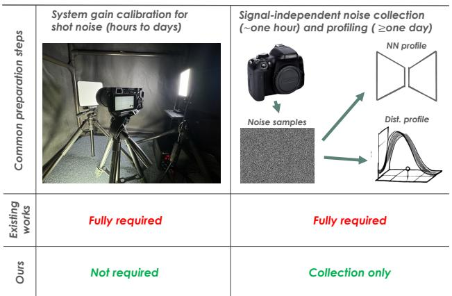
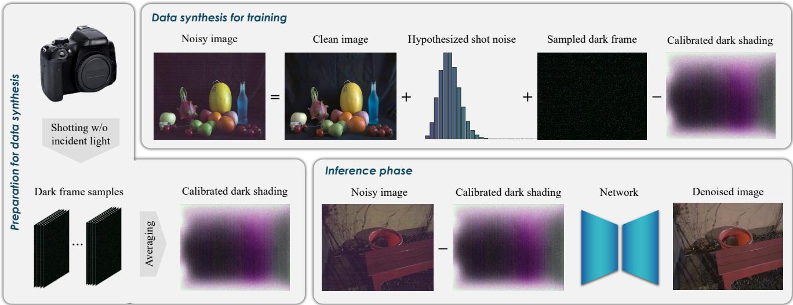
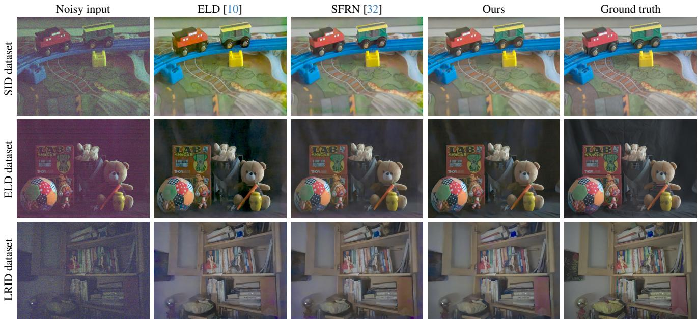
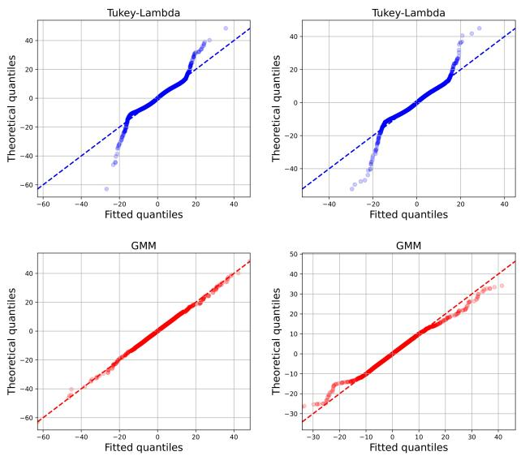

# Noise Modeling in One Hour: Minimizing Preparation Efforts for Self-supervised Low-Light RAW Image Denoising

Feiran Li Sony Research

Haiyang Jiang\* Tokyo University

Daisuke Iso Sony Research

## Abstract

Noise synthesis is a promising solution for addressing the data shortage problem in data-driven low-light RAW image denoising. However, accurate noise synthesis methods often necessitate labor-intensive calibration and profil ing procedures during preparation, preventing them from landing to practice at scale. This work introduces a practically simple noise synthesis pipeline based on detailed analyses of noise properties and extensive justification of widespread techniques. Compared to other approaches, our proposed pipeline eliminates the cumbersome system gain calibration and signal-independent noise profiling steps, reducing the preparation time for noise synthesis from days to hours. Meanwhile, our method exhibits strong denoising performance, showing an up to 0.54dB PSNR improvement over the current state-of-the-art noise synthesis technique. Code is released at https://github.com/ SonyResearch/raw\_image\_denoising

## 1. Introduction

Noise, as a key factor influencing image quality, becomes more pronounced in low-light conditions due to the reduced signal-to-noise ratio. Compared to standard RGB images [1– 3], denoising in the unprocessed RAW domain shows great potential as it retains the primitive noise characteristics and preserves more information owing to the higher bit-depth. Although learning-based approaches trained with real-world noisy-clean image pairs have made significant progress in RAW image denoising [4–7], their practicality is severely limited by the need for collecting paired data. As a result, self-supervised denoising methods based on noise synthesis have gained increasing attention recently [8–12].

Precise noise generation is typically achieved through sensor-specific modeling, encompassing two steps: signaldependent and signal-independent noise synthesis. However, these steps often require extensive human intervention and involve complex procedures. As illustrated in Fig. 1, synthesizing signal-dependent noise demands system gain calibration under controlled lighting conditions, costing up to days for hardware setup (e.g., protocol camera boards or irregularshaped devices like endoscopies may require customizing mounting modules). Meanwhile, signal-independent noise synthesis leads to noise profiling, necessitating careful justification of statistical distributions [10, 12], and even the training of intermediate profiling neural networks [9, 11, 13, 14]. Consequently, deploying self-supervised RAW image denoising at scale remains resource-intensive.

  
Figure 1. Comparing preparation efforts for noise synthesis. While existing methods typically spend hours to days on preparation, our pipeline requires collecting dark frames only, which is a fully automatic process and finishable within even one hour.

In this work, we seek to develop a noise synthesis pipeline that, while retaining effective denoising performance, is as simple as possible for practical deployment. To achieve this, we analyze in detail the properties of photon shot noise and demonstrate that it can be adequately synthesized via hypothesizing quantum efficiencies. We also carefully justify the typical efforts spent on signal-independent noise syn thesis and propose to omit any unnecessary steps therein, such as explicit noise profiling and bit-depth expansion. We summarize our key contributions as follows:

• We propose a novel hypothesizing-based shot noise synthesis method that bypasses the laborious system gain calibration process. We also provide a thorough analysis w.r.t. signal-independent noise synthesis, highlighting the inherent limitations of parametric noise profiling and the redundancy of bit-depth expansion on dark frames.

• Aggregating the above, we introduce a practically simple yet effective RAW image noise synthesis pipeline that requires dark frame collection only, reducing the preparation efforts from days to hours while delivering impressive denoising results.

• We conduct extensive experiments to show the validity of our proposed method, and comprehensive ablation studies for an in-depth understanding.

To the best of our knowledge, our proposal is the first approach that eliminates all the expensive calibration and profiling steps required for sensor-specific noise synthesis. The only necessary preparation effort lies in dark frame collection, which, for modern cameras, is a fully automated process finishable within even one hour.

## 2. Related works

This section briefly reviews general denoising algorithms that require no noisy-clean image pairs, and recent advances in RAW image denoising that leverage physical priors.

## 2.1. General image denoising without paired data

Conventional image denoising algorithms rely on manually designed image priors. For example, numerous methods [15– 18] have explored leveraging the inherent sparsity of image details to improve denoising performance. Total variation [19, 20], based on the observation that noise often results in high-frequency changes, is a popular regularization term for smoothing out noise. Gu et al. [21] propose exploiting the non-local self-similarity of image. Despite their long-standing use, these methods generally struggle to perform effectively on images with heavy noise, such as those captured in low-light conditions.

Learning-based methods have shown superior denoising performance. Lacking noisy-clean image pairs, most meth ods have focused on synthesizing photorealistic noisy images from the clean counterparts. For example, Zhu et al. [22] employ Gaussian mixture models for noise modeling. Zhang et al. [23] introduce a second-order degradation mixing strategy to robustify the denoising networks w.r.t. real-world noise. Many recent approaches incorporate neural networks for noise synthesis. For example, the flow-based and generative network-based algorithms [8, 24–26] aim to synthesize noise via transforming Gaussian random variables into samples that follow the underlying true noise distribution. Despite their relatively better performance, such methods are difficult to deploy in practice due to the complexity and instability introduced by training the intermediate noise synthesis networks. There also exist some works [27–29] that explore training denoising networks with noisy images only by assuming certain types of noise (e.g., white Gaussian). However, such methods face significant domain gaps in realworld applications due to their over-simplified assumption w.r.t. noise distribution.

## 2.2. RAW image denoising with physical priors

A popular trend of RAW image denoising focuses on integrating physical priors into learning-based approaches, offering better noise representation in challenging scenarios. Specifically, noise in camera sensors can be categorized into signal-dependent and signal-independent components [30]. Most approaches propose to model these noises with some parametric model. For example, ELD [10] identifies four key noise elements in RAW sensor data: shot noise, row noise, generalized read noise, and quantization noise, and proposes modeling them statistically. Based on it, LED [31] presents a sensor-agnostic pre-training and finetuning framework. PMN [4] highlights the effects of fixed-pattern noise and black-level errors in network training. Monakhova et al. [9] propose a temporal noise model with periodic and time-variant row noise for starlight video denoising. Cao et al. [11] develop a comprehensive model connecting noise components to camera ISO via a normalizing flow framework, addressing parameter estimation. Zhang et al. [14] introduce a generative network for signalindependent noise synthesis. PNNP [13] proposes to decouple signal-independent noise to independent components and profile the i.i.d one with a deep proxy network. On the other hand, there are some explorations toward noise synthesis without parametric modeling. For example, Zhang et al. [32] propose using dark frames directly sampled from the sensors as signal-independent noise. Mosleh et al. [33] leverage histograms to achieve non-parametric noise modeling.

Yet, since most of these approaches rely on precise system gain for signal-dependent shot noise synthesis, a laborious system gain calibration process is always required. Meanwhile, profiling signal-independent noise with statistical parametric models entails implicit assumptions about noise components based on empirical analyses that would vary among different sensor models, and network-based profiling increases the complexity significantly. Therefore, in this work, we systematically investigate the necessity of calibrating system gain and establish improved practices for characterizing signal-independent noise.

## 3. Toward practically simple noise synthesis

Given a clean RAW image, our goal lies in synthesizing a photorealistic low-light noisy counterpart that aligns with a specific sensor model. Here, we show how to achieve this while minimizing the commonly required preparation efforts. An overview of our proposal is illustrated in Fig. 2.

  
Figure 2. An overview of our denoising pipeline. During the preparation stage, we collect multiple dark frames for each analog gain and compute the corresponding dark shading. To synthesize a pair of training images, we hypothesize a system gain K to generate the Poisson shot noise map and add it, together with a sampled dark shading-corrected dark frame, to a clean image. In inference, given a noisy image, we subtract the dark shading from it to input to the network

## 3.1. Image formation model

We follow the established noisy image formation model [10, 12] in this work, where the conversion from incident photons to a digital pixel value can be expressed as:

$$
D = K _ { d } \left( K _ { a } \left( X + N _ { p } + N _ { 1 } \right) + N _ { 2 } \right) ,\tag{1}
$$

where the analog-to-digital conversion (ADC) step is omitted for simplicity, $K _ { d }$ is a digital gain applied for brightness adjustment, $K _ { a }$ is the system gain applied to the analog signal, X is the real number of photons proportional to the scene irradiance, $N _ { p }$ is the signal-dependent noise, and $N _ { 1 }$ and $N _ { 2 }$ are two types of signal-independent noise that occurs before and after the ADC, respectively. Without loss of generality, we here assume $K _ { d } = 1$ for simplicity, leading to a re-written image formation model of

$$
D = \underbrace { K _ { a } \left( X + N _ { p } \right) } _ { \mathrm { s i g n a l - d e p e n d e n t } } + \underbrace { K _ { a } N _ { 1 } + N _ { 2 } } _ { \mathrm { s i g n a l - i n d e p e n d e n t } } .\tag{2}
$$

Among the three types of noises in $\operatorname { E q . } \left( 2 \right) , N _ { p }$ is dominated by the photon-shot noise triggered by the quantum property and inherent uncertainty of light. $N _ { 1 }$ refers to noise that arises before the functioning of the real-out circuits, such as the dark-current noise and thermal noise, and $N _ { 2 }$ corresponds to noise that happens at the end of the image formatting process, such as banding noise triggered by non-uniformity of read-out circuits, and quantization noise resulted from bit-depth adjustment.

## 3.2. Hypothesizing signal-dependent noise

The signal-dependent noise is typically simplified as photonshot noise given its predominance, which imposes a Poisson

distribution $\mathcal { P } \left( \cdot \right)$ in the form of

$$
\left( X + N _ { p } \right) \sim { \mathcal { P } } \left( X \right) .\tag{3}
$$

Furthermore, we can augment Eq. (3) into the form of 1

$$
\left( X + N _ { p } \right) \sim \mathcal { P } \left( I / K _ { a } \right)\tag{4}
$$

$$
\begin{array} { r l } { \Rightarrow } & { { } K _ { a } \left( X + N _ { p } \right) \sim K _ { a } \mathcal { P } \left( I / K _ { a } \right) , } \end{array}\tag{5}
$$

where $I = K _ { a } X$ is the underlying clean image without any noise. Chiefly, Equation (5) illustrates the process of generating photon-shot noisy images from their clean counterparts: $i . e . ,$ , sampling from the Poisson distribution $\mathcal { P } \left( I / K _ { a } \right)$ and scaling it by $K _ { a }$

Although Eq. (5) appears straightforward, its practical implementation demands considerable effort. Specifically, calibrating the system gain K is often a laborious process involving collecting flat-field images or standard noise test charts (e.g., ISO-15739 [34]) under carefully regulated lighting conditions, as illustrated in Fig. 1. Therefore, we seek to bypass the calibration process to ease practical deployment. Our proposal is built upon two observations:

Observation 1: The possible system gain of a certain setup varies in a small range This observation arises from the fact that the system gain K is composed of the quantum efficiency (QE) and the analog gain (AG) [35], expressed as:

$$
\operatorname { S y s t e m } \operatorname { g a i n } K = \operatorname { Q E } \times \operatorname { A G } .\tag{6}
$$

Of these, AG is a user-designated (thus known) value functioning from pixel-level active transistors to the read-out circuits, and QE represents the overall full-spectral photonto-electron conversion efficiency, which typically ranges from 30% to 70% under the current advancements in material science (see the supplementary material for more details). Consequently, for a given AG, the maximum and minimum possible values of the corresponding K would only differ by approximately a factor of two.

Observation 2: K only affects noise severity without introducing any intensity bias This observation stems from a further derivation of Eq. (5). Specifically, for a noisy image sample $K \left( X + N _ { p } \right)$ with $( X + N _ { p } ) \sim \mathcal { P } \left( I / K \right)$ , its expectation E and variance V can be calculated as:

$$
\begin{array} { r l } & { \mathbb { E } \left( K \left( X + N _ { p } \right) \right) = K \cdot I / K = I , } \\ & { \mathbb { V } \left( K \left( X + N _ { p } \right) \right) = K ^ { 2 } \cdot I / K = K I . } \end{array}\tag{7}
$$

Chiefly, Equation (7) suggests that noisy images generated with distinct K values will only differ in noise severity (i.e., the variance is K-scaled), and they will not exhibit any relative biases in pixel intensities as the mean value is independent of K.

Based on the two observations mentioned above, we propose a hypothesizing-based method for shot noise synthesis. Specifically, for a given AG, we start by hypothesizing a QE value $\left( e . g . , \ : ( 3 0 \% + 7 0 \% ) / 2 = 5 0 \% \right)$ ), multiplying it with the AG to obtain the system gain K, and applying Eq. (5) to generate the shot-noisy image. Since the hypothesized K is physically constrained to remain close to the underlying ground truth, using it can be intuitively viewed as a form of data augmentation by perturbing AG. This is particularly well-suited for the practical scenario where a single network is trained to handle a broad range of AG values associated with the sensor. Moreover, since different K values only result in noise severity variation, a denoising network, even trained with imprecise K, is consistently free from learning any offsets to regress toward the statistical expectation (i.e., the clean image I), thereby preventing undesired color biases during inference.

## 3.3. Sampling signal-independent noise

The dominant approaches for signal-independent noise synthesis involve profiling the noise with statistical models [10– 13, 31]. However, we consider accurate profiling rarely possible given the complex noise distribution, and any attempts [8, 10, 12] to refine the modeling process would inevitably add further implementation complexity and concerns in bias-variance trade-off. For smooth text flow, we omit further details here and present a comprehensive justification of statistical noise profiling later in Section 4.4.

To address the aforementioned issues, in this work, we opt to sample signal-independent noise directly from the sensors. Specifically, following SFRN [32], we capture multiple dark frames with the target sensor and employ them as direct samples of the overall signal-independent noise, instantiating $k _ { a } N _ { 1 } + N _ { 2 }$ in Eq. (2). In practice, this capturing process can be completed in a few hours in a fully automatic manner.

To ease the training process, we further bypass the effects of temporally consistent noise via dark shading correction, as popularly conducted in professional photography [36, 37] and RAW image denoising works [4, 8, 11]. This process involves calibrating system gain-specific dark shadings by averaging multiple dark frames, and subtracting them from the noisy images before inputting to the network. In our case, such a calibration process can be straightforwardly achieved by reusing dark frames collected for noise synthesis, and thus requires no additional effort for preparation.

A key difference between our work and the existing ones [4, 13, 32] lies in the usage of high-bit-depth noise recovery (HBNR), a core process designed to mitigate the effects of quantization noise by expanding the bit-depth of dark frames. This technique operates by first profiling the signal-independent noise with several simple distributions (Gaussian, Uniform, etc.), selecting the best fit, and then perturbing the original low-bit dark frames based on the corresponding percent-point function. As a result, HBNR adds significant further complexity to noise synthesis by renecessitating statistical signal-independent noise profiling and sensor-specific justification. Moreover, based on two further considerations, we have chosen to omit HBNR from our pipeline: (1) We are concerned that HBNR may introduce additional errors due to discrepancies between the underlying true noise distribution and the fitted simple ones. (2) We consider the low-bit property of dark frames, rather than being a disadvantage, actually serves as a realistic depiction of the quantization noise. This is because all noisy images provided during inference would be in the low-bit format with the quantization noise implicitly encoded. An empirical study w.r.t. HBNR in the context of our noise synthesis pipeline can be found in Section 4.4.

## 4. Experiments

We extensively compare our proposal with state-of-the-art methods and present comprehensive ablation studies.

## 4.1. Experimental setup

Datasets We employ three popular datasets for low-light raw image denoising: SID [38], ELD [10], and LRID [4]. Among them, SID and ELD are captured with two different Sony-A7S2 full-frame DSLR cameras, and LRID is collected by a Redmi K30 smartphone with a 1/2.55 inch IMX686 sensor. Among them, SID and ELD provide test data with multiple ISO values ranging from 100 to 25600, and LRID specifies ISO 6400 for the test data. For noise synthesis, since neither SID nor ELD has released dark frames, we leverage the LLD [11] calibration data (approx. 400 dark frames per ISO, 24 ISO in total) to aid experiments on SID and LED. As for LRID, we employ the 360 (180 normal and 180 hot) dark frames provided as part of the dataset.

  
Figure 3. Qualitative comparison of distinct noise synthesis approaches. All images are processed to sRGB via a simple image signa processing pipeline for better visualization. ELD and SFRN exhibit noticeable color bias along image boundaries, whereas ours does not.

Comparison methods We involve most of the SoTA methods on low-light RAW image denoising into comparison, including supervised methods that solely rely on real-world noisy-clean image pairs, self-supervised methods that synthesize noise based on clean images, and the hybrid ones that use synthetic data for pre-training and real-world image pairs for finetuning. Specifically, we compare to

• Supervised: Vanilla paired data and PMN [4].

• Self-supervised: Poisson-Gaussian (P-G), SFRN [32], ELD [10], NoiseFlow [8], StarLight [9], and the PNNP [13] method developed concurrently with us.

• Hybrid: LED [31] and LLD [11].

All these approaches have employed the same U-Net specified in [38] as the denoising backbone, and we keep in line with them for fair comparisons.

Training and test specifications For training, we align with existing works [4, 11, 31] to randomly crop the images and dark frames to 512 × 512 patches, and minimize an L1- loss between the predictions and ground truths with an Adam optimizer [39] for 1000 epochs with 400 epochs for finetuning. Random vertical and horizontal flipping are employed for data augmentation. Regarding the selection of the overall system gain K, since we do not have any information about how the two devices used for data collection encapsulate analog gains to ISO values, we empirically investigate their characteristics and find that both cameras have their base ISOs (i.e., AG = 1) around 400. To this end, we employ an empirical approximation equation for the system gain K: K = ISO/100 ∗ 0.1, representing a hypothesized QE of 40%. For testing, we report the PSNR and SSIM scores in line with existing works. Throughout the training and testing phases, we consistently use the dark shadings provided by PMN [4] for a fair comparison.

## 4.2. Denoising performance

SID and ELD datasets Some qualitative results are illustrated in the first two rows of Fig. 3 and the quantitative ones are reported in Table 1. Our proposed noise synthesis pipeline achieves comparable results to the concurrent approach PNNP [13] while avoiding its tedious procedure of training an auxiliary noise synthesis network and system gain calibration, and outperforms the other methods by a large margin. Moreover, our self-supervised method can even outperform the state-of-the-art supervised method PMN [4] due to the imperfect pixel alignments of the SID noisy-clean training pairs. The above two phenomena emphasize the practical benefits of our proposal in achieving easy-to-land and high-accuracy RAW image denoising.

LRID dataset The quantitative results are reported in Table 2. Our noise synthesis pipeline helps to achieve

Table 1. Denoising results (PSNR/SSIM) on the SID [38] and ELD [10] Sony-A7S2 datasets. Red and blue refer to the best and second-best results, respectively.
<table><tr><td rowspan="2">Training setup</td><td rowspan="2">Method</td><td colspan="4">SID</td><td colspan="3">ELD</td></tr><tr><td>×100</td><td>×250</td><td>×300</td><td>Avg.</td><td>×100</td><td>×200</td><td>Avg.</td></tr><tr><td rowspan="2">Supervised</td><td>Paired</td><td>42.06 / 0.9548</td><td>39.60 / 0.9380</td><td>36.85 / 0.9227</td><td>39.32 / 0.9374</td><td>44.47 / 0.9676</td><td>41.97 / 0.9282</td><td>43.22 / 0.9479</td></tr><tr><td>PMN [4]</td><td>43.47 / 0.9606</td><td>41.04 / 0.9471</td><td>37.87 / 0.9344</td><td>40.59 / 0.9465</td><td>46.99 / 0.9840</td><td>44.85 / 0.9686</td><td>45.92 / 0.9763</td></tr><tr><td rowspan="2">Hybrid</td><td>LED [31]</td><td>41.98 / 0.9539</td><td>39.34 / 0.9317</td><td>36.67 / 0.9147</td><td>39.19 / 0.9321</td><td>45.36 / 0.9779</td><td>42.97 / 0.9577</td><td>44.17 / 0.9678</td></tr><tr><td>LLD [11]</td><td>43.36 / 0.9610</td><td>41.02 / 0.9480</td><td>37.80 / 0.9350</td><td>40.52 / 0.9471</td><td>46.74 / 0.9860</td><td>44.95 / 0.9770</td><td>45.85 / 0.9815</td></tr><tr><td rowspan="7">Self- supervised</td><td>P-G</td><td>39.44 / 0.8995</td><td>34.32 / 0.7681</td><td>30.66 / 0.6569</td><td>34.52 / 0.7666</td><td>42.05 / 0.8721</td><td>38.18 / 0.7827</td><td>40.12 / 0.8274</td></tr><tr><td>ELD [10]</td><td>41.95 / 0.9530</td><td>39.44 / 0.9307</td><td>36.36 / 0.9114</td><td>39.05 / 0.9303</td><td>45.45 / 0.9754</td><td>43.43 / 0.9544</td><td>44.44 / 0.9649</td></tr><tr><td>SFRN [32]</td><td>42.61 / 0.9580</td><td>40.73 / 0.9454</td><td>37.64 / 0.9309</td><td>40.14 / 0.9438</td><td>46.45 / 0.9843</td><td>44.58 / 0.9738</td><td>45.51 / 0.9790</td></tr><tr><td>NoiseFlow [8]</td><td>41.08 / 0.9394</td><td>37.45 / 0.8864</td><td>33.53 / 0.8132</td><td>37.09 / 0.8750</td><td>43.21 / 0.9210</td><td>40.60 / 0.8638</td><td>41.90 / 0.8924</td></tr><tr><td>StarLight [9]</td><td>40.47 / 0.9261</td><td>36.26 / 0.8575</td><td>33.00 / 0.7802</td><td>36.33 / 0.8494</td><td>43.80 / 0.9358</td><td>40.86 / 0.8837</td><td>42.33 / 0.9098</td></tr><tr><td>PNNP [13]</td><td>43.63 / 0.9614</td><td>41.49 / 0.9498</td><td>38.01 / 0.9353</td><td>40.83 / 0.9479</td><td>47.31 / 0.9877</td><td>45.47 / 0.9791</td><td>46.39 / 0.9834</td></tr><tr><td>Ours</td><td>43.69 / 0.9618</td><td>41.43 / 0.9486</td><td>38.06 / 0.9356</td><td>40.85 / 0.9478</td><td>47.34 /0.9874</td><td>45.51 / 0.9794</td><td>46.43 /0.9834</td></tr></table>

Table 2. Denoising results (PSNR/SSIM) on the LRID dataset [4]. Red and blue refer to the best and second-best results, respectively.
<table><tr><td rowspan="2">Training setup</td><td rowspan="2">Method</td><td colspan="6">Indoor</td><td colspan="4">Outdoor</td><td rowspan="2">Overall avg.</td></tr><tr><td>×64</td><td>×128</td><td>×256</td><td>×512</td><td>×1024</td><td>Avg.</td><td>×64</td><td>×128</td><td>×256</td><td>Avg.</td></tr><tr><td rowspan="3">Supervised</td><td>Paired</td><td>48.77 0.9906</td><td>47.00 0.9860</td><td>44.74 0.9786</td><td>42.40 0.9647</td><td>40.07 0.9437</td><td>44.60 0.9727</td><td>45.84 0.9876</td><td>44.50 0.9821</td><td>42.66 0.9709</td><td>44.33 0.9802</td><td>44.52 0.9748</td></tr><tr><td>PMN [4]</td><td>49.24</td><td>47.47</td><td>45.36</td><td>43.09</td><td>40.20</td><td>45.07</td><td>46.27</td><td>44.86</td><td>42.99</td><td>44.71</td><td>44.97</td></tr><tr><td></td><td>0.9916</td><td>0.9868</td><td>0.9804</td><td>0.9671</td><td>0.9453</td><td>0.9743</td><td>0.9884</td><td>0.9834</td><td>0.9703</td><td>0.9807</td><td>0.9761</td></tr><tr><td rowspan="7">Self- supervised</td><td>NoiseFlow [8]</td><td>48.16 0.9901</td><td>46.19 0.9828</td><td>43.91</td><td>41.09</td><td>37.76</td><td>43.42</td><td>45.34</td><td>43.82</td><td>41.92</td><td>43.69</td><td>43.72</td></tr><tr><td>P-G</td><td>46.14 0.9872</td><td>44.98 0.9809</td><td>0.9698 43.31</td><td>0.9442 40.80</td><td>0.8906 37.74</td><td>0.9555 42.59</td><td>0.9856 42.16</td><td>0.9757 41.48</td><td>0.9570 40.36</td><td>0.9728 41.33</td><td>0.9596 42.23</td></tr><tr><td>ELD [10]</td><td>48.19 0.9898</td><td>46.55 0.9836</td><td>0.9682 44.39</td><td>0.9429 41.56</td><td>0.8905 37.50</td><td>0.9539 43.64</td><td>0.9796 45.00</td><td>0.9709 43.48</td><td>0.9525 41.31</td><td>0.9677 43.26</td><td>0.9578 43.53</td></tr><tr><td>SFRN [32]</td><td>47.94 0.9899</td><td>46.52 0.9854</td><td>0.9730 44.74 0.9786</td><td>0.9452 42.46 0.9652</td><td>0.8915 40.10</td><td>0.9566 44.35 0.9729</td><td>0.9841 45.05 0.9850</td><td>0.9734 43.67</td><td>0.9450 41.89</td><td>0.9675 43.54</td><td>0.9597 44.12</td></tr><tr><td>PNNP [13]</td><td>48.50 0.9908</td><td>46.94 0.9863</td><td>45.06 0.9797</td><td>42.64 0.9662</td><td>0.9453 40.30</td><td>44.69</td><td>45.62</td><td>0.9766 44.27</td><td>0.9591 42.63</td><td>0.9736 44.17</td><td>0.9731 44.54</td></tr><tr><td>Ours</td><td>49.25</td><td>47.55</td><td>45.53</td><td>43.22</td><td>0.9460 40.85</td><td>0.9738 45.28</td><td>0.9873 46.10</td><td>0.9821 44.68</td><td>0.9724 42.93</td><td>0.9806 44.57</td><td>0.9757 45.08</td></tr><tr><td></td><td>0.9918</td><td>0.9876</td><td>0.9818</td><td>0.9695</td><td>0.9516</td><td>0.9765</td><td>0.9884</td><td>0.9835</td><td>0.9719</td><td>0.9813</td><td>0.9779</td></tr></table>

0.54dB improvement in PSNR over the state-of-the-art selfsupervised method PNNP [13], and leads to even slightly better performance compared to the fully supervised algorithm PMN [4]. We attribute this improvement to the fact that the noise patterns would vary among images due to sensor heating, and our employed direct sensor sampling effectively augments the training data to cover such a scenario yet profiling-based methods cannot. A qualitative comparison is presented in the bottom row of Fig. 3.

## 4.3. Ablation studies

We here present the robustness of denoising networks w.r.t. the system gain K in training, and the dark shading accuracy in inference. We also study the data efficiency of our proposed noise synthesis pipeline.

Robustness w.r.t. the precision of system gain K As mentioned in Section 3.2, the possible range of a system gain K is rather limited due to the physical constraints of the quantum efficiency, and thus K can be safely hypothesized rather than calibrated. To test the network robustness w.r.t. K, we conduct experiments with the following training setups on all three datasets for comprehensiveness:

## • SID and ELD datasets:

– Calibrated K: K values calibrated with the flat-field method [10], resulting a maximum $K \approx 2 4 . 4 8$ corresponding to ISO 25600.

– Narrow-range hypothesized K: We determine K via $K = \mathrm { { I S O } / \mathrm { { 1 0 0 } * 0 . 1 } }$ , resulting a maximum K of 25.6.   
– Broad-range hypothesized K: We determine K via $K = \mathrm { { I S O } / \mathrm { { 1 0 0 } * 0 . 2 } }$ resulting a maximum K of 51.2.

## • LRID dataset:

– Calibrated K: We randomly sample K from (8.7, 8.8) based on it calibrated value $K \approx 8 . 7 4$ for ISO 6400.

– Random K: We randomly sample K from (4, 17). The results are shown in Table 3. On all three datasets, the PSNR differences are always smaller than 0.1dB among different training setups. Such results strongly support our claim that denoising networks are robust w.r.t. the system gain K varying in a wide range, making a hypothesized K based on the quantum efficiency enough and a precise calibration process unnecessary.

Table 3. Denoising performance w.r.t. different system gain K.  
(a) SID and ELD datasets
<table><tr><td>System gain K</td><td>SID</td><td>ELD</td></tr><tr><td>Calibrated K</td><td>40.90 / 0.9487</td><td>46.37 / 0.9832</td></tr><tr><td>Narrow-range hypothesized K</td><td>40.85 / 0.9478</td><td>46.43 / 0.9834</td></tr><tr><td>Broad-range hypothesized K</td><td>40.85 / 0.9484</td><td>46.33 / 0.9826</td></tr></table>

(b) LRID dataset
<table><tr><td>System gain K</td><td>Indoor</td><td>Outdoor</td><td>Avg.</td></tr><tr><td>Calibrated K ∈ (8.7, 8.8)</td><td>45.20 / 0.9759</td><td>44.51 / 0.9809</td><td>45.00 / 0.9773</td></tr><tr><td>Random K ∈ (4, 17)</td><td>45.27 / 0.9764</td><td>44.64 / 0.9814</td><td>45.09 / 0.9778</td></tr></table>

Robustness w.r.t. inference-phase online dark shading recalibration Generally, dark shadings can be pre-calibrated using the vast amount of dark frames for model training, and fixed in the inference stage [4]. However, there also exist some scenarios where the working environment differs significantly from the calibration one, such as a heated sensor under high-speed continuous shooting or relatively long ex posure. In such cases, the actual dark shadings in inference may deviate from the pre-calibrated one obviously, and an online re-calibration is plausible. Given that the available time for re-calibration is often constrained, the denoising model needs to perform well even with dark shadings calibrated from a limited number of dark frames.

We employ the LRID dataset to study the aforementioned issue for its separated hot and non-hot dark frames, which perfectly echoes the discussed scenario of varying dark shadings. With the denoising model trained in Section 4.2, we test its performance w.r.t. dark shadings calibrated with varying numbers of dark frames. As reported in Table 4, our proposal is visibly robust to dark shading accuracy, evidenced by the fact that the overall PSNR value would only drop 0.1dB when using just 10 dark frames, which is a reasonable setup for inference-phase dark shading re-calibration. Moreover, a cross-comparison between Tables 2 and 4 shows that, even with only 2 dark frames for re-calibration, our method can still outperform all existing self-supervised approaches.

Data efficiency of our noise synthesis pipeline While dark frames can be easily collected, it would still be helpful to decrease its total required number for further cost reduction (e.g., storing dark frames of a high-resolution sensor may consume several terabytes of space). Therefore, we here examine the denoising performance when fewer dark frames are available for training.

Table 4. Denoising w.r.t. #dark frames used in inference-phase online dark shading calibration (PSNR/SSIM).
<table><tr><td>#Dark frame</td><td>1</td><td>2</td><td>5</td><td>10</td><td>20</td><td>50</td><td>100</td><td>180</td></tr><tr><td rowspan="2">Overall</td><td>44.34</td><td>44.67</td><td>44.88</td><td>44.98</td><td>45.04</td><td>45.06</td><td>45.07</td><td>45.08</td></tr><tr><td>0.9720</td><td>0.9746</td><td>0.9758</td><td>0.9767</td><td>0.9775</td><td>0.9778</td><td>0.9777</td><td>0.9779</td></tr></table>

Table 5. Data efficiency of our noise synthesis pipeline w.r.t. #dark frames per ISO used in training (PSNR/SSIM).
<table><tr><td>#Dark frames per ISO</td><td>400</td><td>280</td><td>160</td><td>40</td><td>10</td></tr><tr><td>SID</td><td>40.85 0.9478</td><td>40.93 0.9485</td><td>40.91 0.9481</td><td>40.83 0.9453</td><td>40.80 0.9445</td></tr><tr><td>ELD</td><td>46.43 0.9834</td><td>46.35 0.9829</td><td>46.42 0.9835</td><td>46.33 0.9827</td><td>46.31 0.9828</td></tr></table>

We use the SID and ELD datasets and train denoising networks with varying numbers of dark frames. The results are shown in Table 5. Our proposed noise synthesis pipeline exhibits strong data efficiency, with only ∼ 0.1dB PSNR decrease when just 10 dark frames are available for each ISO. We attribute this high data efficiency to the fact that the total number of synthesized noisy images is proportional to the number of dark frames. For example, pairing between 10 clean images and 10 dark frames leads to 100 distinct noisy-clean image pairs.

## 4.4. Analyses of signal-independent noise synthesis

We provide detailed analyses regarding explicit signalindependent noise profiling and the high-bit-depth noise recovery strategy, wishing to prompt practically simple yet realistic noise synthesis in future research.

Statistical signal-independent noise profiling Statistical signal-independent noise profiling and synthesis work by fitting a statistical model to (decomposed) dark frames, and resampling from it. Despite the continual emergence of new methods with increasingly accurate (and complex) models, there is a lack of comprehensive justification regarding the inherent limitations of statistical signal-independent noise profiling compared to direct sensor sampling, motivating our following discussion. Specifically, since the statistical models are fit on dark frames, noise resampled from them essentially resembles new dark frames, which can neither achieve the same level of realism nor characterize the realworld diversity compared to those captured directly by sensors. For a thorough demonstration, we experiment to profile signal-independent noise as follows:

  
Figure 4. Quantile-Quantile plots of different models on fitting the signal-independent noise. Left: Resampled data versus data used for model fitting (i.e., profiling accuracy). Right: Resampled data versus data from unseen dark frames (i.e., generalization accuracy).

Table 6. Denoising performance with different signal-independent noise profiling methods (PSNR/SSIM).
<table><tr><td>Dataset</td><td>Tukey-Lambda</td><td>GMM</td><td>Direct sampling</td></tr><tr><td>SID</td><td>40.56 / 0.9445</td><td>40.54 / 0.9454</td><td>40.85 / 0.9478</td></tr><tr><td>ELD</td><td>45.63 / 0.9753</td><td>45.92 / 0.9815</td><td>46.43 / 0.9834</td></tr></table>

• Tukey-Lambda distribution: As studied in ELD [10], signal-independent noise appears to be long-tailed, and hence can be reasonably characterized with the Tukey-Lambda distribution.

• Gaussian mixture model (GMM): While not employed in any existing methods to the best of our knowledge, we also explore GMM in noise profiling owing to its extensive modeling ability.

We conduct experiments on dark frames of the Sony-A7S2 camera. For GMM, we empirically set the number of Gaussian components to 100 while allowing nondiagonal covariance matrices. To ensure optimal performance, we randomly select 50 frames, center-crop them to 512 × 512 patches, and perform noise disentanglement similar to PNNP [13] (i.e., subtracting dark shadings and modeling banding noise separately) to extract the i.i.d. components for distribution fitting. With the fitted distributions, we perform quantile–quantile tests w.r.t. both the training data to assess modeling accuracy, and with unseen dark frames to evaluate generalizability. We also employ them as alternatives to direct sampling for training denoising networks to show their ability comprehensively.

Table 7. Effect of HBNR in the context of our proposed noise synthesis pipeline (PSNR/SSIM).
<table><tr><td colspan="2">SID</td><td colspan="2">ELD</td><td colspan="2">LRID</td></tr><tr><td>w/HBNR</td><td>w/0 HBNR</td><td>w/HBNR</td><td>w/o HBNR</td><td>w/HBNR</td><td>w/o HBNR</td></tr><tr><td>40.91</td><td>40.85</td><td>46.38</td><td>46.43</td><td>45.03</td><td>45.08</td></tr><tr><td>0.9485</td><td>0.9478</td><td>0.9833</td><td>0.9834</td><td>0.9776</td><td>0.9779</td></tr></table>

Figure 4 illustrates the quantile-quantile results. Tukey-Lambda distribution, as a simple model, fails to fully capture the true noise distribution during training, resulting in inaccurate noise samples. While GMM can perfectly fit the training data, its resampling results still exhibit deviations compared to unseen dark frames. We attribute this phenomenon to the complexity of the underlying noise distribution, which cannot be fully characterized by the dark points used in GMM fitting. Table 6 reports the denoising performance, which aligns with the quantile-quantile studies.

Effect of HBNR Given our exclusion of HBNR as mentioned in Section 3.3, and its demonstrated importance in terms of P-G, ELD, and SFRN-based signal-independent noise synthesis [32], we empirically study the denoising performance with and without HBNR in the context of our noise synthesis pipeline. For comprehensiveness, we employ all three aforementioned datasets for this ablation study. Table 7 records the results. Evidenced by the comparable quantitative performance (i.e., less than 0.1dB difference in PSNR) among all the datasets, we can conclude that the high-bit noise recovery strategy does not demonstrate any obvious benefits in our proposal.

## 5. Conclusion

This paper introduces a practically simple noise synthesis pipeline for self-supervised RAW image denoising. While delivering state-of-the-art denoising performance, our proposal eliminates the labor-intensive system gain calibration, the parametric signal-independent noise profiling, and the high-bit-depth noisy recovery processes, which are commonly required in existing methods.

A practical limitation of our approach lies in the need for known AG. While AG is typically accessible to direct sensor users such as camera manufacturers or end users of most industrial cameras, end users of consumer cameras and smartphones are often provided ISO values only with the AG hidden inside, making hypothesizing the system gain challenging. In such a case, the base ISO may provide helpful hints for linking ISO and AG.

For future work, we plan to incorporate dark frames from multiple sensor models to investigate sensor-agnostic denoising. Another potential direction lies in applying the current pipeline to other types of sensors, such as EMCCD.

## References

[1] K. Zhang, W. Zuo, Y. Chen, D. Meng, and L. Zhang, “Beyond a gaussian denoiser: Residual learning of deep cnn for image denoising,” IEEE TIP, vol. 26, no. 7, pp. 3142–3155, 2017. 1

[2] S. W. Zamir, A. Arora, S. Khan, M. Hayat, F. S. Khan, and M.-H. Yang, “Restormer: Efficient transformer for highresolution image restoration,” in CVPR, pp. 5728–5739, 2022.

[3] K. Zhang, W. Zuo, and L. Zhang, “Ffdnet: Toward a fast and flexible solution for cnn-based image denoising,” IEEE TIP, vol. 27, no. 9, pp. 4608–4622, 2018. 1

[4] H. Feng, L. Wang, Y. Wang, H. Fan, and H. Huang, “Learnability enhancement for low-light raw image denoising: A data perspective,” IEEE TPAMI, vol. 46, no. 1, pp. 370–387, 2024. 1, 2, 4, 5, 6, 7

[5] S. W. Zamir, A. Arora, S. Khan, M. Hayat, F. S. Khan, M.-H. Yang, and L. Shao, “Learning enriched features for fast image restoration and enhancement,” IEEE TPAMI, vol. 45, no. 2, pp. 1934–1948, 2022.

[6] S. Guo, Z. Yan, K. Zhang, W. Zuo, and L. Zhang, “Toward convolutional blind denoising of real photographs,” in CVPR, pp. 1712–1722, 2019.

[7] J. Liu, C.-H. Wu, Y. Wang, Q. Xu, Y. Zhou, H. Huang, C. Wang, S. Cai, Y. Ding, H. Fan, et al., “Learning raw image denoising with bayer pattern unification and bayer preserving augmentation,” in CVPRW, pp. 0–0, 2019. 1

[8] A. Abdelhamed, M. A. Brubaker, and M. S. Brown, “Noise flow: Noise modeling with conditional normalizing flows,” in ICCV, 2019. 1, 2, 4, 5, 6

[9] K. Monakhova, S. R. Richter, L. Waller, and V. Koltun, “Dancing under the stars: video denoising in starlight,” in CVPR, 2022. 1, 2, 5, 6

[10] K. Wei, Y. Fu, Y. Zheng, and J. Yang, “Physics-based noise modeling for extreme low-light photography,” IEEE TPAMI, vol. 44, no. 11, pp. 8520–8537, 2021. 1, 2, 3, 4, 5, 6, 8

[11] Y. Cao, M. Liu, S. Liu, X. Wang, L. Lei, and W. Zuo, “Physicsguided iso-dependent sensor noise modeling for extreme lowlight photography,” in CVPR, 2023. 1, 2, 4, 5, 6

[12] Y. Wang, H. Huang, Q. Xu, J. Liu, Y. Liu, and J. Wang, “Practical deep raw image denoising on mobile devices,” in ECCV, 2020. 1, 3, 4

[13] H. Feng, L. Wang, Y. Huang, Y. Wang, and H. Huang, “Physics-guided noise neural proxy for low-light raw image denoising,” arXiv preprint, 2023. 1, 2, 4, 5, 6, 8

[14] F. Zhang, B. Xu, Z. Li, X. Liu, Q. Lu, C. Gao, and N. Sang, “Towards general low-light raw noise synthesis and modeling,” in ICCV, pp. 10820–10830, 2023. 1, 2

[15] K. Dabov, A. Foi, V. Katkovnik, and K. Egiazarian, “Image denoising by sparse 3-d transform-domain collaborative filtering,” IEEE TIP, vol. 16, no. 8, pp. 2080–2095, 2007. 2

[16] M. Elad and M. Aharon, “Image denoising via sparse and redundant representations over learned dictionaries,” IEEE TIP, vol. 15, no. 12, pp. 3736–3745, 2006.

[17] W. Dong, X. Li, L. Zhang, and G. Shi, “Sparsity-based image denoising via dictionary learning and structural clustering,” in CVPR, pp. 457–464, 2011.

[18] J. Mairal, M. Elad, and G. Sapiro, “Sparse representation for color image restoration,” IEEE TIP, vol. 17, no. 1, pp. 53–69, 2008. 2

[19] L. I. Rudin, S. Osher, and E. Fatemi, “Nonlinear total variation based noise removal algorithms,” Physica D: Nonlinear Phenomena, vol. 60, no. 1, pp. 259–268, 1992. 2

[20] S. Osher, M. Burger, D. Goldfarb, J. Xu, and W. Yin, “An iterative regularization method for total variation-based image restoration,” Multiscale Modeling & Simulation, vol. 4, no. 2, pp. 460–489, 2005. 2

[21] S. Gu, L. Zhang, W. Zuo, and X. Feng, “Weighted nuclear norm minimization with application to image denoising,” in CVPR, pp. 2862–2869, 2014. 2

[22] F. Zhu, G. Chen, and P.-A. Heng, “From noise modeling to blind image denoising,” in CVPR, pp. 420–429, 2016. 2

[23] K. Zhang, Y. Li, J. Liang, J. Cao, Y. Zhang, H. Tang, D.- P. Fan, R. Timofte, and L. V. Gool, “Practical blind image denoising via swin-conv-unet and data synthesis,” Machine Intelligence Research, vol. 20, no. 6, pp. 822–836, 2023. 2

[24] S. Kousha, A. Maleky, M. S. Brown, and M. A. Brubaker, “Modeling srgb camera noise with normalizing flows,” in CVPR, pp. 17463–17471, 2022. 2

[25] L. D. Tran, S. M. Nguyen, and M. Arai, “Gan-based noise model for denoising real images,” in ACCV, 2020.

[26] K.-C. Chang, R. Wang, H.-J. Lin, Y.-L. Liu, C.-P. Chen, Y.- L. Chang, and H.-T. Chen, “Learning camera-aware noise models,” in ECCV, 2020. 2

[27] N. Moran, D. Schmidt, Y. Zhong, and P. Coady, “Noisier2noise: Learning to denoise from unpaired noisy data,” in CVPR, pp. 12064–12072, 2020. 2

[28] J. Batson and L. Royer, “Noise2self: Blind denoising by selfsupervision,” in Int. Conf. Machine Learning, pp. 524–533, 2019.

[29] J. Wang, S. Di, L. Chen, and C. W. W. Ng, “Noise2info: Noisy image to information of noise for self-supervised image denoising,” in ICCV, pp. 16034–16043, 2023. 2

[30] J. Nakamura, Image Sensors and Signal Processingfor Digital Still Cameras. USA: CRC Press, Inc., 2005. 2

[31] X. Jin, J.-W. Xiao, L.-H. Han, C. Guo, R. Zhang, X. Liu, and C. Li, “Lighting every darkness in two pairs: A calibrationfree pipeline for raw denoising,” in ICCV, 2023. 2, 3, 4, 5, 6

[32] Y. Zhang, H. Qin, X. Wang, and H. Li, “Rethinking noise synthesis and modeling in raw denoising,” in ICCV, 2021. 2, 3, 4, 5, 6, 8

[33] M. Ali, Z. Luxi, V. S. Atin, H. Jaeduk, P. Abhijith, A. B. Marcus, C. Jihwan, and S. B. Michael, “Non-parametric sensor noise modeling and synthesis,” in ECCV, 2024. 2

[34] Photography - Electronic still-picture imaging - Noise measurements. ISO 15739:2023. International Organization for Standardization, 2023. 3

[35] E. M. V. Association, “Standard for characterization of image sensors and cameras,” EMVA Standard, vol. 1288, 2010. 3

[36] R. K. Buchheim, The sky is your laboratory: advanced astronomy projectsfor amateurs. Springer, 2007. 4

[37] M. A. Covington, Astrophotography for the Amateur. Cambridge University Press, 1999. 4

[38] C. Chen, Q. Chen, J. Xu, and V. Koltun, “Learning to see in the dark,” in CVPR, 2018. 4, 5, 6

[39] D. P. Kingma, “Adam: A method for stochastic optimization,” arXiv preprint arXiv:1412.6980, 2014. 5