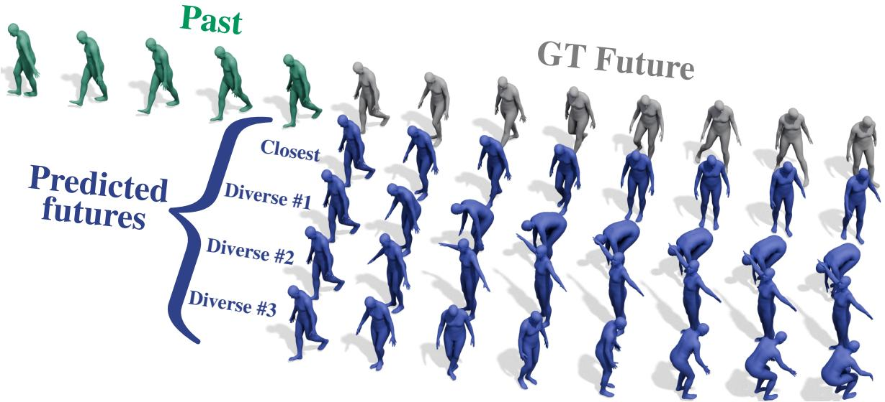
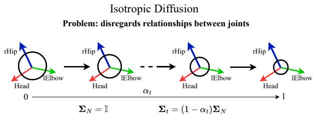
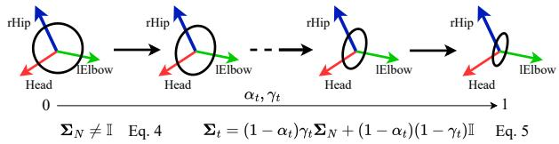
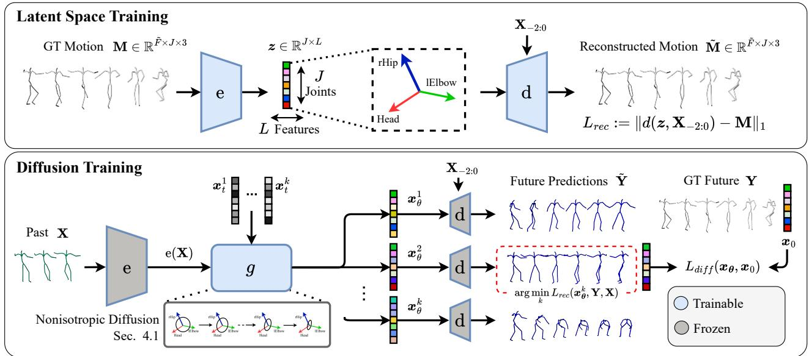
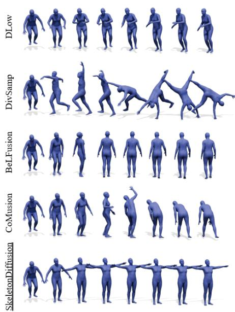
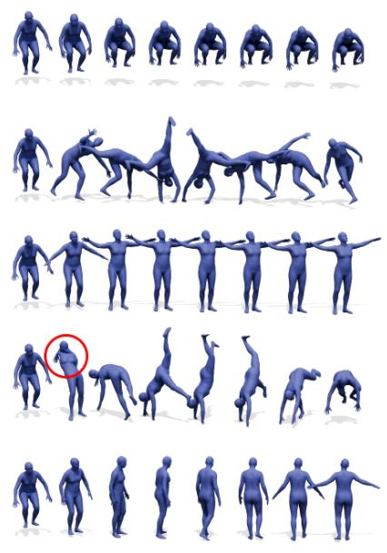
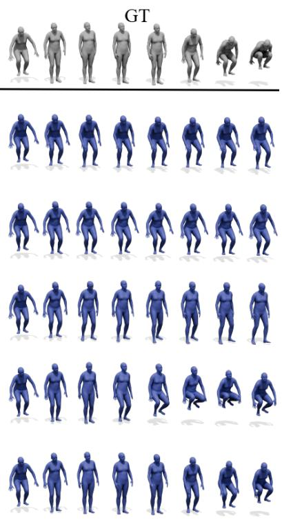
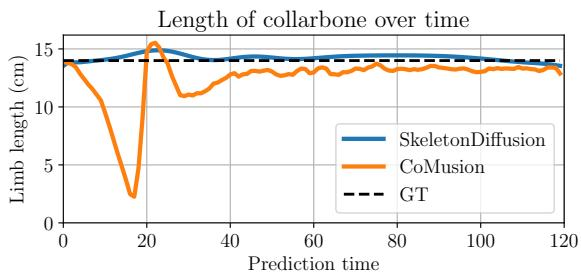
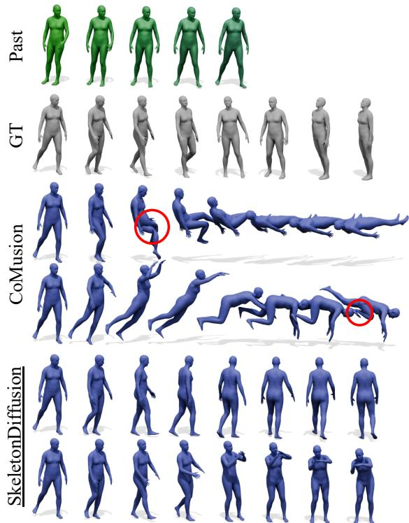
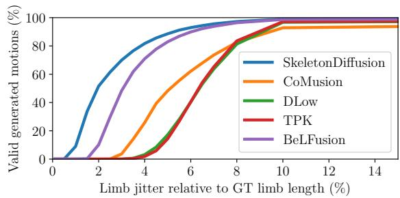

# Nonisotropic Gaussian Diffusion for Realistic 3D Human Motion Prediction

Cecilia Curreli1,2 Dominik Muhle1,2 Abhishek Saroha1,2 Zhenzhang Ye1 Riccardo Marin1,2 Daniel Cremers1,2 1Technical University of Munich 2Munich Center for Machine Learning

  
Figure 1. SkeletonDiffusion generates futures that are simultaneously diverse and realistic. With a nonisotropic diffusion formulation reflecting the skeleton structure, we predict motions that are plausible and semantically coherent with the input past while being highly diverse. Here, we show the most diverse ensemble of three motions including the prediction closest to the ground truth among 50 generated futures.

## Abstract

Probabilistic human motion prediction aims to forecast multiple possiblefuture movementsfrom past observations. While current approaches report high diversity and realism, they often generate motions with undetected limb stretching and jitter. To address this, we introduce SkeletonDiffusion, a latent diffusion model that embeds an explicit inductive bias on the human body within its architecture and training. We present a new nonisotropic Gaussian diffusion formulation that aligns with the natural kinematic structure of the human skeleton and models relationships between body parts. Results show that our approach outperforms isotropic alternatives, consistently generating realistic predictions while avoiding artifacts such as limb distortion. Additionally, we identify a limitation in commonly used diversity metrics, which mayfavor models thatproduce inconsistent limb lengths within the same sequence. SkeletonDiffusion sets a new benchmark on three real-world datasets, outperforming various baselines across multiple evaluation metrics. We release the code on our project page.

## 1. Introduction

In this work, we address the problem of predicting human motion based on observed past movements, known as Human Motion Prediction (HMP). Specifically, from a temporal sequence of human joint positions, we aim to forecast their evolution in subsequent frames. HMP is a relevant problem for various real-world applications [9, 37, 46, 72, 85, 86, 88, 90, 93] and the key enabler of various downstream tasks [3, 65]: autonomous driving [60], healthcare [70], assistive robotics [42, 71], human-robot interaction [11, 14, 27, 42], and virtual reality or animation creation [74]. The task can be formulated as a deterministic regression by predicting the most likely future motion [2, 12, 18, 23, 26, 28, 36, 43, 47, 52, 54, 56–58, 61]. However, many applications [11, 14, 27, 42, 60, 65] require considering the inherent uncertainty of future movements. Stochastic Human Motion Prediction (SHMP) methods aim to learn a probability distribution over possible future motions. Once models are capable of representing multiple futures, the challenge lies in generating diverse yet realistic predictions. In our study, we observed that often diversity in the results comes at the cost of favoring physically unfeasible movements [5], such as velocity irregularities between frames (e.g., jittering or shaking) or inconsistent joint positions (e.g., changing bone lengths between frames). We believe this phenomenon to be a direct consequence of the lack of a proper inductive bias on the human skeletal structure. We present SkeletonDiffusion, a latent diffusion model encoding this bias explicitly on both architecture and training.

First, we consider the skeleton structure and joint categories throughout the entire network, and build our architecture end-to-end on top of Graph Convolutional Networks (GCNs). In contrast, existing SHMP approaches either ignore the skeleton’s graph structure [5, 16, 91, 93] or only leverage it at intermediate stages [19, 55, 69, 82]. Second, we model the generative strategy to integrate the explicit bias. Similarly to the recent advances in SHMP based on diffusion models [5, 16, 69, 82], we opt for latent diffusion [64]. However, we replace the conventional isotropic Gaussian diffusion training [31] with a novel nonisotropic formulation that accounts for joint relations directly in the generation process: the HMP problem is defined by the skeleton kinematic graph, and we exploit this knowledge to define a fixed non-diagonal noise covariance for the diffusion process. To the best of our knowledge, this is the first nonisotropic diffusion process to support a non i.i.d. latent space and reflect the dependencies among components (joints) according to the given problem structure (skeleton kinematic). Despite demonstrating its usefulness in the skeletal domain, its applicability can be broader and touch all the domains where the conventional i.i.d. noise assumption may not hold.

We evaluate SkeletonDiffusion against the state-of-theart on a large MoCap dataset (AMASS [53]), noisy data obtained by external camera tracking (FreeMan [81]), and in a zero-shot setting (3DPW [78]). We showcase consistently improved performance by generating realistic and diverse predictions (Fig. 1) with the least amount of stretching and jittering of bone lengths (body realism). In summary, our contributions are:

• We derive the first nonisotropic Gaussian diffusion formulation for a structural problem, which comprehends a detailed mathematical derivation and the required equations for training and inference.

• We propose SkeletonDiffusion, a latent diffusion model for SHMP that explicitly incorporates end-to-end the skeleton structure through the adjacency matrix in the graph architecture and the diffusion training.

• We conduct extensive analyses and demonstrate SkeletonDiffusion’s state-of-the-art performance on multiple datasets. Our results demonstrate issues overlooked by previous methods (e.g., limbs’ stretching, jittering) and highlight the need for new realism and diversity metrics.

## 2. Related Work

## 2.1. Human Motion Prediction

Probabilistic HMP has been addressed via generative adversarial networks [7, 41, 48], variational autoencoders (VAE) [13, 19, 25, 55, 55, 79, 84, 87, 91], and more recently diffusion models [5, 16, 66, 69, 82]. Among these works, HumanMAC [16] and CoMusion [69] perform diffusion in input space, relying on a transformer backbone and representing the time dimension in Discrete Cosine Space (DCT), a temporal representation widely employed in SHMP [19, 55, 82, 93]. BeLFusion [5] performs latent diffusion [64] in a semantically meaningful latent space but by leveraging a U-Net [21]. We also wish to perform diffusion in latent space, due to its speed and generalization power [10]. Differently from deterministic HMP approaches [17, 44, 45], stochastic approaches leverage Graph Convolutional Networks (GCN) [40, 76] on the skeleton graph only at intermediate stages [19, 55, 69, 82]. We build on top of Typed-Graph Convolutions [67] and design a fully GCN autoencoder and denoising network, retaining the semantic meaning of body joints in latent space and thus embedding an explicit prior on the human skeletal structure in the model architecture.

## 2.2. Nonisotropic Probabilistic Diffusion Models

Diffusion models [31, 64] usually specify the noisification process through isotropic Gaussian random variables, sampling the noise for each diffusion step following the i.i.d. assumption. Also on manifolds [35, 49, 89], relationships between molecule components are modeled isotropically. According to recent studies [15, 24], the isotropic noise prior may not be the best choice for all tasks: optimizing the noise at inference may improve result quality [22] or solve related tasks [38]. In image generation, few explore non-Gaussian or learned alternatives, by addressing inverse problems [20, 68], or efficiency [51, 94]. When considering nonisotropic processes [32, 33, 39, 77], the generated images are qualitatively comparable but retain longer training and inference time and less scalability [32, 33, 39]. We present a novel nonisotropic training formulation by modifying the covariance matrix of the noise addition, making the noisification process aware of joint connections. Since we rely on the known skeleton graph, the covariance matrix is not learned [51, 94] but fixed regardless of the input motion. While covariance matrices that depend on the input might not scale well with the problem size [33], our formulation is efficient and comes at no additional computational expenses during both training and inference. To the best of our knowledge, we are the first to apply nonisotropic Gaussian diffusion to a structured problem, also showing that our formulation converges with fewer iterations and parameters than its isotropic alternative (see Appendix E.3).

  
Nonisotropic Diffusion with Scheduler

Solution: exploits a priori knowledge about skeleton structure  

Figure 2. Our nonisotropic diffusion formulation. By diffusing a random variable $\pmb { x } _ { 0 } \in \mathbb { R } ^ { J }$ where J is the number of body joints, instead of considering the joint dimensions i.i.d. as in isotropic diffusion, we take into account skeleton connections in $\Sigma _ { N }$ . With the scheduler $\gamma _ { t } ,$ we design a noise that transitions from isotropic to nonisotropic. Further dimensions can be diffused isotropically.

## 3. Preliminaries

Problem Formulation Human Motion Prediction (HMP) takes as input a past sequence of $P$ poses and predicts the corresponding future F poses. The input motion is defined as $\mathbf { X } = \left\lceil \mathbf { p } _ { - P + 1 } , \mathbf { p } _ { - P + 2 } , \dots , \mathbf { p } _ { 0 } \right\rceil \in \mathbb { R } ^ { P \times J \times 3 }$ , and the output as $\bar { \bf Y } = \bar { \bf p } _ { 1 } , . . . , \bar { \bf p } _ { F } ] \in \bar { \mathbb { R } } ^ { F \times J \times 3 }$ with J being the number of human body joints and ${ \bf p } _ { \tau }$ the 3D body pose at timestep $\tau \in \{ - P + 1 , - P + 2 , \ldots , 0 , \ldots , F \}$ . Probabilistic HMP considers a set of N possible future sequences as $\tilde { \mathbf { Y } } \in \mathbb { R } ^ { N \times F \times J \times 3 }$ for each observation rather than a single deterministic prediction.

Isotropic Gaussian Diffusion Diffusion generative models aim to learn the distribution $p ( \pmb { x } _ { 0 } )$ of true data samples $\scriptstyle { \mathbf { { \mathit { x } } } } _ { 0 }$ by utilizing T unseen hierarchical Markovian latent variables $\pmb { x } _ { 1 : T }$ of the same dimensions to define the prior $p ( { \pmb x } _ { T } )$ and the posterior $q ( \pmb { x } _ { 1 : T } | \pmb { x } _ { 0 } )$ distribution:

$$
p ( \pmb { x } _ { 0 } ) = \frac { p ( \pmb { x } _ { 0 : T } ) } { q ( \pmb { x } _ { 1 : T } | \pmb { x } _ { 0 } ) } = \frac { p ( \pmb { x } _ { T } ) \prod _ { t = 1 } ^ { T } p ( \pmb { x } _ { t - 1 } | \pmb { x } _ { t } ) } { \prod _ { t = 1 } ^ { T } q ( \pmb { x } _ { t } | \pmb { x } _ { t - 1 } ) } .\tag{1}
$$

Denoising diffusion probabilistic models [31] define the forward transitions $p ( \pmb { x } _ { t } | \pmb { x } _ { t - 1 } )$ as a linear Gaussian model $\mathcal { N } ( \pmb { x } _ { t } ; \sqrt { \alpha _ { t } } \pmb { x } _ { t - 1 } , \pmb { \Sigma } _ { t } )$ with noise scheduler $\alpha _ { t } .$ , and the random variables $\mathbf { \Delta } _ { \mathbf { \mathcal { X } } _ { t } }$ as i.i.d with isotropic, diagonal covariance

$$
\Sigma _ { t } = ( 1 - \alpha _ { t } ) \mathbb { I } .\tag{2}
$$

The forward process iteratively transforms the true variable $\scriptstyle { \mathbf { { \mathit { x } } } } _ { 0 }$ into isotropic Gaussian noise $p ( \pmb { x } _ { T } ) \ = \ \mathcal { N } ( \pmb { x } _ { T } ; \mathbf { 0 } , \mathbb { I } )$ The reverse diffusion samples $\mathbf { \ d } \mathbf { x } _ { T } \sim \mathcal { N } ( \mathbf { \ d } \mathbf { x } _ { T } ; \mathbf { 0 } , \mathbb { I } )$ and iteratively applies the denoising transitions $q _ { \theta } ( \pmb { x } _ { t - 1 } | \pmb { x } _ { t } )$ parametrized by a neural network θ to obtain samples from the real data distribution.

## 4. Method

We first present our nonisotropic diffusion formulation (Sec. 4.1), discuss its application in latent space (Sec. 4.2), and then introduce SkeletonDiffusion (Sec. 4.3).

## 4.1. Nonisotropic Gaussian Diffusion

Clearly, in HMP every joint position depends on those of its neighbors. Relying on the i.i.d. noise assumption of conventional diffusion models [31, 64] would overlook such relations. Contrary to isotropic Gaussian diffusion that denoises all dimensions of a random variable $\pmb { x } _ { 0 } ~ \in ~ \mathbb { R } ^ { J }$ equally, we propose a nonisotropic formulation where each j-th dimension is denoised depending on the kinematic relations of a body with J joints (Fig. 2).

Correlation Matrix $\Sigma _ { N }$ Since joint relationships do not dependend on the diffusion timestep t, we define our transition covariance matrix $\Sigma _ { t }$ in dependence of a correlation matrix $\Sigma _ { N } \in \mathbb { R } ^ { J \times J }$ encoding the skeleton structure:

$$
\Sigma _ { t } = ( 1 - \alpha _ { t } ) \Sigma _ { N } .\tag{3}
$$

A natural choice for $\Sigma _ { N }$ seems the adjacency matrix A of the simple undirected graph originating from the body skeleton. However, A is an arbitrary matrix not guaranteed to be positive-definite, which is a fundamental property for covariance matrices. Furthermore, to avoid imbalances and exploding values in the noise, the magnitude of $\Sigma _ { N }$ should align with I. To address these two constraints, we subtract the smallest eigenvalue $\lambda _ { \mathrm { m i n } } ( \mathbf { A } )$ from the diagonal elements and normalize the result to get the final $\Sigma _ { N } \colon$

$$
\Sigma _ { N } = \frac { \mathbf { A } - \lambda _ { \operatorname* { m i n } } ( \mathbf { A } ) \mathbb { I } } { \lambda _ { \operatorname* { m a x } } ( \mathbf { A } ) - \lambda _ { \operatorname* { m i n } } ( \mathbf { A } ) } .\tag{4}
$$

We ablate A against two more sophisticated, densely populated choices (Appendix E.2). Our formulation comes with negligible computational expenses and can be adapted to any problem that can be defined by an adjacency matrix A.

Nonisotropic Covariance Scheduler Although the simple solution in Eq. (3) is already superior to isotropic diffusion (see Sec. 5.2), we observe that different diffusion timesteps t relate to different aspects of the generation process. First, the network figures out high-level, global properties of the future motion, and later, fine-grained joints’ play a more significant role. With this motivation, we define a noise addition $\Sigma _ { t }$ that transitions from isotropic to nonisotropic noise:

$$
\Sigma _ { t } = ( 1 - \alpha _ { t } ) \gamma _ { t } \Sigma _ { N } + ( 1 - \alpha _ { t } ) ( 1 - \gamma _ { t } ) \mathbb { I } ,\tag{5}
$$

where $\gamma _ { t } ~ = ~ 1 - t / T$ defines a monotonically decreasing scheduler. Detailed derivation and alternative scheduler formulation explored in early stages are in Appendix A.

  
Figure 3. Overview of SkeletonDiffusion. We first learn a latent space $\boldsymbol { z } \in \mathbb { R } ^ { J \times L }$ where each of the J latent joint dimensions corresponds to a human body joint, by training encoder e and decoder d to reconstruct human motions sequences. Afterward, the latent joint dimension exhibits correlations similar to human body joints (Sec. 4.2). Here the denoiser network g conditioned on the past motion $\mathbf { X } \in \mathbb { R } ^ { P \times J \times 3 }$ is trained via nonisotropic diffusion (Fig. 2 and Sec. 4.1) to generate new latent codes $\scriptstyle { \mathbf { \mathcal { x } } } \theta$ . The generated codes are decoded into multiple diverse future motions Y˜ matching the past X and the motion closest to the GT is taken to backpropagate the training gradient.

Forward and Reverse Nonisotropic Diffusion We derive the closed-form $p ( \pmb { x } _ { t } | \pmb { x } _ { 0 } )$ of the forward process as

$$
\begin{array} { r } { \pmb { x } _ { t } = \sqrt { \bar { \alpha } _ { t } } \pmb { x } _ { 0 } + \pmb { U } \bar { \pmb { \Lambda } } _ { t } ^ { 1 / 2 } \pmb { \epsilon } , } \end{array}\tag{6}
$$

where the nonisotropic noise is obtained from isotropic noise $\epsilon \sim \mathcal { N } ( \mathbf { 0 } , \mathbf { I } )$ through the Eigendecomposition of the covariance matrix $\Sigma _ { t } = U \pmb { \Lambda } _ { t } \pmb { U } ^ { \top }$ , with $\bar { \mathbf { N } } _ { t } = \tilde { \gamma } _ { t } \mathbf { N } _ { t } + ( 1 - $ $\bar { \alpha } _ { t } ) \mathbb { I }$ , and $\tilde { \gamma } _ { t } = ( 1 - \alpha _ { t } ) \gamma _ { t } + \alpha _ { t } \tilde { \gamma } _ { t - 1 }$ . To perform inference, we derive the tractable form for the posterior $q ( \pmb { x } _ { t - 1 } | \pmb { x } _ { t } )$ as

$$
\begin{array} { r l } & { x _ { t - 1 } = \mu _ { q } + U \Lambda _ { q } \epsilon , } \\ & { \quad \quad \Lambda _ { q } = \Lambda _ { t } \bar { \Lambda } _ { t - 1 } \bar { \Lambda } _ { t } ^ { - 1 } , } \\ & { \quad \quad \mu _ { q } = \sqrt { \alpha _ { t } } U \bar { \Lambda } _ { t } ^ { - 1 } \bar { \Lambda } _ { t - 1 } U ^ { \top } x _ { t } } \\ & { \quad \quad \quad + \sqrt { \bar { \alpha } _ { t - 1 } } U \bar { \Lambda } _ { t } ^ { - 1 } \Lambda _ { t } U ^ { \top } x _ { 0 } . } \end{array}\tag{7}
$$

Training Objective The KL-divergence typically employed to train denoising diffusion models [31, 73] can be formulated as Mahalanobis distance. Exploiting the Eigendecomposition, we apply the spectral theorem obtaining

$$
L _ { \mathrm { d i f f } } ( \boldsymbol { x } _ { \theta } , \boldsymbol { x } _ { 0 } , t ) : = \bar { \alpha } _ { t } \| \bar { \boldsymbol { \Lambda } } _ { t } ^ { - 1 / 2 } \boldsymbol { U } ^ { \top } ( \boldsymbol { x } _ { \theta } - \boldsymbol { x } _ { 0 } ) \| ^ { 2 } .\tag{8}
$$

Detailed derivations are reported in Appendix A.3, together with the objective for regressing the noise [31] instead of the true variable [64]. Noticeably, as the eigenvalues $\pmb { \Lambda } _ { N }$ are fixed by the skeleton graph, all required matrices do not depend on the specific input and can be precomputed.

## 4.2. Correlated Latent Space

Extending with i.i.d Features While our nonisotropic diffusion has been defined in Sec. 4.1 to operate on $z \in \mathbb { R } ^ { J }$ here we extend the formulation to multiple dimensions and opt for a two-dimensional latent representation $\boldsymbol { z } \in \mathbb { R } ^ { J \times L }$ shown effective in other domains [64] but not applied to HMP before. Every j-th body joint is described by a feature vector of dimension L, dimension which does not explicitly encode information between joints. Thus we assume i.i.d noise over this dimension and diffuse it isotropically, allowing for a richer feature representation.

Correlations in Latent Space The foundation behind our nonisotropic diffusion formulation of Sec. 4.1 is the existing correlation between body joints, described in the adjacency matrix A and reflected in the noisification process by the correlation matrix $\Sigma _ { N }$ . In a space where no correlations exist, nonisotropic diffusion is meaningless. For this reason, in our latent space the semantic notion of body joint is intact and the correlations between each j-th dimension resembles human body joints motions (see Appendix E.1 and Fig. 9).

## 4.3. SkeletonDiffusion

SkeletonDiffusion implements our nonisotropic diffusion formulation (Sec. 4.1) in latent space (Sec. 4.2). To obtain an explicit prior on realistic motions, we embed the knowledge about skeletal connections also in the network architecture.

Joint-Attentive GCN Applying our nonisotropic diffusion in latent space requires retaining the semantic meaning of each body joint (Sec. 4.2). We choose a fully GCN architecture and perform graph attention on the skeleton joints via Typed-Graph Convolutions [67]. For each layer taking as input features $\pmb { x } \in \mathbb { R } ^ { J \times D _ { i n } }$ , we define a feature extraction matrix ${ \bf W } ^ { j } \in \mathbb { R } ^ { D _ { i n } \times D _ { o u t } }$ for each joint $j$ with shared weights depending on the specific joint, and a feature aggregation matrix $\mathbf { G } \in \mathbb { R } ^ { J \times J }$ . The features $\textbf { f } \in \mathbb { R } ^ { J \times D _ { o u t } }$ are first extracted for each joint j independently as ˆf and then aggregated through

<table><tr><td rowspan="3"></td><td rowspan="3"></td><td colspan="3">Precision</td><td colspan="3">Multimodal GT</td><td>Diversity</td><td>Realism</td><td colspan="3">Body Realism</td></tr><tr><td></td><td>FDE↓</td><td>MAE↓</td><td></td><td></td><td></td><td></td><td></td><td>mean↓</td><td></td><td>RMSE↓</td></tr><tr><td>ADE↓</td><td></td><td></td><td>MMADE↓</td><td>MMFDE↓</td><td>APDE↓</td><td>APD↑</td><td>CMD↓</td><td>str</td><td>jit</td><td>str</td><td>jit</td></tr><tr><td rowspan="4"> $\mathbf { A l g }$ </td><td>Zero-Velocity</td><td>0.755</td><td>0.992</td><td>7.779</td><td>0.814</td><td>1.015</td><td>9.292</td><td>0.000</td><td>39.262</td><td>0.00</td><td>0.00</td><td>0.00</td><td>0.00</td></tr><tr><td>TPK [79]</td><td>0.656</td><td>0.675</td><td>10.191</td><td>0.658</td><td>0.674</td><td>2.265</td><td>9.283</td><td>17.127</td><td>7.34</td><td>0.34</td><td>9.69</td><td>0.48</td></tr><tr><td>DLow [91]</td><td>0.590</td><td>0.612</td><td>8.510</td><td>0.618</td><td>0.617</td><td>4.243</td><td>13.170</td><td>15.185</td><td>8.41</td><td>0.40</td><td>11.06</td><td>0.58</td></tr><tr><td>GSPS [55] DivSamp [19]</td><td>0.563 0.564</td><td>0.613</td><td>9.045 8.027</td><td>0.609 0.623</td><td>0.633 0.667</td><td>4.678 15.837</td><td>12.465</td><td>18.404</td><td>6.65</td><td>0.29 0.82</td><td>8.98</td><td>0.37</td></tr><tr><td rowspan="3">DM</td><td></td><td></td><td>0.647</td><td></td><td></td><td></td><td></td><td>24.724</td><td>50.239</td><td>11.17</td><td></td><td>16.71</td><td>1.0</td></tr><tr><td>HumanMAC [16]</td><td>0.511</td><td>0.554</td><td></td><td>0.593</td><td>0.591</td><td></td><td>9.321</td><td></td><td></td><td></td><td></td><td></td></tr><tr><td>BeLFusion [5]</td><td>0.513</td><td>0.560</td><td>7.125</td><td>0.569</td><td>0.585</td><td>1.977</td><td>9.376</td><td>16.995</td><td>7.19</td><td>0.34</td><td>9.03</td><td>0.34</td></tr><tr><td>DM</td><td>CoMusion [69]</td><td>0.494</td><td>0.547</td><td>6.715</td><td>0.469</td><td>0.466</td><td>2.328</td><td>10.848</td><td>9.636</td><td>4.04</td><td>0.25</td><td>5.63</td><td>0.52</td></tr><tr><td></td><td>SkeletonDiffusion (Ours)</td><td>0.480</td><td>0.545</td><td>6.124</td><td>0.561</td><td>0.580</td><td>2.067</td><td>9.456</td><td>11.417</td><td>3.15</td><td>0.20</td><td>4.45</td><td>0.26</td></tr></table>

Table 1. Quantitative results on AMASS [53]. The best results are highlighted in bold, second-best are underlined. The symbol ‘- indicates that the results are not reported in the baseline work. We achieve state-of-the-art performance, while the VAE-based method with the highest diversity, DivSamp, displays the worst limb stretching and limb jitter.

$$
\mathbf { f } = \mathbf { G } \cdot \hat { \mathbf { f } } , \mathrm { w i t h } \hat { \mathbf { f } } ^ { j } = \mathbf { W } ^ { j } \cdot \boldsymbol { x } ^ { j } .\tag{9}
$$

We further define multi-head self-attention [75] on a joint level as Typed-Graph Attention and chose it as the architecture of the denoiser network. Both encoder and decoder are GRUs, exploiting the convenient inductive biases of recurrent neural networks for motion modeling [50] (Appendix B). With such architecture, the prior on the body joints is explicitly encoded in every layer.

Autoencoder and Latent Space Training Given an input motion $\mathbf { M } = \mathbf { Y } _ { 0 : \tilde { F } } \in \mathbb { R } ^ { \tilde { F } \times J \times 3 }$ of arbitrary length $\tilde { F } \sim$ $\mathcal { U } \{ 1 , F \}$ , the encoder e compresses the complex temporal information into latent space variables $\boldsymbol { z } = \operatorname { e } ( \mathbf { M } ) \in \mathbb { R } ^ { J \times L }$ where the joint dimension J is kept intact and the latent dimension L contains both temporal and spatial information. The decoder d learns to reconstruct the latent variable into a motion $\tilde { \mathbf { M } } = \mathrm { d } ( z , \mathbf { X } _ { - 2 : 0 } )$ . Here, conditioning the decoder on the previous two frames encourages smooth transitions between past and future [5]. The autoencoder is trained to reconstruct a motion according to the objective:

$$
L _ { \mathrm { a u t o e n c } } = L _ { \mathrm { r e c } } ( \mathrm { e } ( \mathbf { M } ) , \mathbf { M } , \mathbf { X } _ { - 2 : 0 } ) ,\tag{10}
$$

where the reconstruction loss is defined as

$$
L _ { \mathrm { r e c } } ( z , \mathbf { M } , \mathbf { X } _ { - 2 : 0 } ) : = \| \mathrm { d } ( z , \mathbf { X } _ { - 2 : 0 } ) - \mathbf { M } \| _ { 1 } .\tag{11}
$$

We aim for a strong temporal representation, and let the latent space learn a general motion distribution of arbitrary length, fitting both observation and future motions. To avoid collapse towards the motion mean of the training data [9, 80], we employ curricular learning [1, 8, 80].

Latent Nonisotropic Diffusion In latent space, the denoising network $\mathrm { g }$ learns via our nonisotropic diffusion formulation to denoise true latent variables z conditioned on past observations $\mathrm { e } ( \mathbf { X } )$ Instead of predicting the noise $\epsilon _ { t }$ [31, 64], we directly approximate the true latent code $\pmb { x } _ { 0 } : = \pmb { z } \left[ 5 , 6 3 \right]$ as ${ \pmb x } _ { \pmb \theta } = \mathrm { g } ( { \pmb x } _ { t } , \mathrm { e } ( { \bf X } ) , t )$ . To implicitly enforce diversity [5, 29, 69], we relax Eq. (8) by sampling k = 50 predictions at each iteration and backpropagating the gradient only through the sample closest to the GT:

$$
L _ { \mathrm { g e n } } = \mathbb { E } _ { { \mathbf { Y } } , { \mathbf { X } } , t } L _ { \mathrm { d i f f } } ( \arg \operatorname* { m i n } _ { k } L _ { \mathrm { r e c } } ( x _ { \theta } ^ { k } , { \mathbf { Y } } , { \mathbf { X } } ) , \mathrm { e } ( { \mathbf { Y } } ) , t )\tag{12}
$$

Instead of choosing the sample that minimizes the diffusion loss [5, 29, 69], we choose the prediction that minimizes the reconstruction loss Eq. (11), finding that this benefits diversity in the generated ensemble. At inference, we denoise multiple latent codes $\scriptstyle { \mathbf {  { x } } } _ { \theta }$ according to our reverse formulation Eq. (7). The generated latent codes are then decoded into future predictions Y˜ .

## 5. Experiments

## 5.1. Experimental Settings

Baselines We compare SkeletonDiffusion with state-ofthe-art approaches [5, 16, 19, 55, 69, 79, 91] and include the ZeroVelocity baseline, competitive in HMP [4, 56] by simply outputting the last seen pose for every future timestep.

Datasets We evaluate on the large-scale dataset AMASS [53] according to the cross-dataset evaluation protocol [5, 69]. We aim to test SHMP methods with real-world data obtained not from MoCap but from noise sources (e.g., RGB cameras, and sparse IMUs). To this end, we perform zeroshot experiments on 3D Poses in the Wild (3DPW) [78] for models trained on AMASS, and adapt the recent in-thewild, large-scale dataset FreeMan[81] to the motion prediction task and retrain on it various state-of-the-art methods. We deem the conventionally employed Human3.6M dataset [34] less representative (only 7 subjects) and discuss it di-

  
Most Diverse

  
Closest to GT

Figure 4. Qualitative Results on AMASS [53]. On the top, we report the input past observation and the ground truth future. The following rows display the corresponding predictions for each method: on the right, the closest to GT according to ADE, and on the two left–most columns, the two furthermost. Our closest competitors generate realistic motions but do not include a motion close to the GT (BeLFusion) or present evident unrealistic artifacts (CoMusion). Our method is the only one to produce realistic and diverse motions.

rectly in Appendix F.2. As in previous works, we predict the next 2s into the future from observations of 0.5s.

Metrics and Body Realism Recent SHMP works concentrate on four factors: precision, coverage of the ground truth test distribution (multimodal metrics), diversity, and realism. We employ conventional metrics [5, 91] and report their definition in Appendix D.1. While the CMD metric addresses realism, it is solely expressed in terms of joint velocities. The actual Body realism, e.g., bone lengths preservation along the motion, although crucial for meaningful predictions, is overlooked. Even worse, artifacts such as changes in limb lengths over time (limb stretching) and frequent inconsistencies between consecutive frames (limb jitter) impact other metrics, for example, by causing more diversity in the predictions, and so higher APD value (further experiments in Appendix F.1). This motivates us to investigate this aspect and propose new metrics. Given a future ground truth sequence Y with B limbs (or bones) and a predicted sequence Y˜ , for each frame τ of the prediction associated pose $\tilde { \mathbf { p } } _ { \tau }$ , we denote the length of the j-th limb as $\tilde { b } _ { \tau } ^ { j } \in \mathbb { R }$ . With $b ^ { j } \in \mathbb { R }$ being the ground truth length of the j-th limb, we define the normalized j-th limb length error $e _ { \tau } ^ { j }$ and limb jitter $v _ { \tau } ^ { j }$ at a time τ as:

$$
e _ { \tau } ^ { j } : = \frac { 1 } { b ^ { j } } \left| b ^ { j } - \tilde { b } _ { \tau } ^ { j } \right| , \quad v _ { \tau } ^ { j } : = \frac { 1 } { b ^ { j } } \left| \tilde { b } _ { \tau + 1 } ^ { j } - \tilde { b } _ { \tau } ^ { j } \right| .\tag{13}
$$

By calculating the mean and root mean square error (RMSE) of $e _ { \tau } ^ { j }$ and vj over the time dimension, we define four body realism metrics: mean for stretching str and jitter jit, and analogously RMSE. We also introduce the mean angle error (MAE) as complementary precision metric.

## 5.2. Results

Large-scale Evaluation on AMASS Following the cross-dataset evaluation protocol [5], we train on a subset of datasets belonging to AMASS and test on others (Tab. 1). Starting from the conventional metrics evaluation, our method already achieves state-of-the-art performance on the majority of the metrics, with a significant improvement on precision. Among other Diffusion-based methods (DM), SkeletonDiffusion and CoMusion contend with each other for first and second place according to diversity, realism, and multimodal metrics. Interestingly, the MAE values for DLow and GSPS do not reflect the performance ranking of the other precision metrics, while instead this holds for DM methods. Although VAE-methods tend to show higher diversity values such as of [84, 91], as already mentioned by previous works [5, 16], these values may often be the consequence of unrealistic motions with irregularities between past and future or inconsistent speed. From the qualitative example reported in Fig. 4, we notice that both the most diverse predictions of DivSamp represent a cartwheeling motion. While such motions may geometrically be diverse from each other and thus increase the APD, they are not only not semantically diverse but also not consistent with the past observation. Instead, our predictions are diverse at no expenses of realism (see also Fig. 1).

<table><tr><td></td><td colspan="3">Precision</td><td colspan="2">Multimodal GT</td><td>Diversity</td><td>Realism</td><td colspan="4">Body Realism</td></tr><tr><td>Method</td><td>ADE↓</td><td>FDE↓</td><td>MAE↓</td><td>MMADE↓</td><td>MMFDE↓</td><td>APD↑</td><td>CMD↓</td><td>mean ↓ str</td><td>jit</td><td>RMSE↓ str</td><td>jit</td></tr><tr><td>Zero-Velocity</td><td>0.603</td><td>0.835</td><td>9.841</td><td>0.687</td><td>0.865</td><td>0.000</td><td>14.734</td><td>6.37</td><td>0.00</td><td>6.37</td><td>0.00</td></tr><tr><td>HumanMAC [16]</td><td>0.415</td><td>0.511</td><td>8.630</td><td>0.537</td><td>0.600</td><td>5.426</td><td>2.025</td><td>7.91</td><td>1.49</td><td>11.89</td><td>1.84</td></tr><tr><td>BeLFusion [5]</td><td>0.420</td><td>0.495</td><td>8.494</td><td>0.496</td><td>0.516</td><td>5.209</td><td>6.306</td><td>10.46</td><td>0.41</td><td>11.93</td><td>0.54</td></tr><tr><td>CoMusion [69]</td><td>0.389</td><td>0.480</td><td>7.812</td><td>0.527</td><td>0.525</td><td>6.687</td><td>2.764</td><td>7.94</td><td>0.81</td><td>10.27</td><td>1.05</td></tr><tr><td>SkeletonDiffusion (Ours)</td><td>0.374</td><td>0.457</td><td>7.424</td><td>0.506</td><td>0.508</td><td>6.732</td><td>3.166</td><td>7.58</td><td>0.51</td><td>9.64</td><td>0.66</td></tr></table>

Table 2. Quantitative results on FreeMan [81]. The best results are highlighted in bold, second best are underlined. SkeletonDiffusion achieves the best precision and diversity on noisy real-world data while maintaining consistent body realism.

  
Figure 5. A qualitative example of collarbone bone length evolution for a single predicted motion from AMASS. SkeletonDiffusion keeps the bone length consistent over time and close to the GT, while CoMusion shows inconsistencies of large magnitude.

Body Realism and Diversity On the right-most part of Tab. 1, we analyze limb stretching and jittering in the methods’ predictions with our body realism metrics. First, this issue particularly affects VAE approaches, and the two methods with the highest APD are also the two with the largest errors on all four metrics. This supports our intuition that diversity may benefit from artifacts and inconsistencies. SkeletonDiffusion presents the best metrics by a large margin, highlighting the contribution of our prior on the skeleton structure. CoMusion displays much worse body realism and is the third worst in terms of RMSE error for the jittering. We qualitatively visualize the inconsistency of a limb (the collarbone) for a sequence in Fig. 5, reporting its length variation over time. Compared to the ground-truth length (the dashed line), CoMusion shows drastic changes already in the early frames. SkeletonDiffusion is much more consistent over time, remaining quite close to the real length. Finally, we stress the impact of such bone artifacts by considering the case in which an application has a hard requirement about the maximal admitted error for a sequence. Namely, if a sequence faces a bone stretching above a given threshold, it is considered unreliable and so discarded. In

  
Figure 6. Qualitative results of zero-shot on 3DPW [78] for models trained on AMASS [53]. CoMusion displays limb twisting, while our predictions are realistic and consistent.

Fig. 7, we report how the number of valid sequences evolves on AMASS in dependence of such threshold, showing that our method is the most robust while CoMusion performs worst among DM models.

Noisy Data and FreeMan Dataset We test for the first time SHMP methods on noisy data acquired from an external RGB camera from the FreeMan dataset [81]. In this case, GT poses reach a change in limb length up to 5.6cm, compared to close to zero of the AMASS MoCap setting. Our method achieves the best performance in precision and diversity and, at the same time, achieves the lowest limb stretching. This hints that SkeletonDiffusion has effectively learned basic properties of the human skeletal structure achieving robustness to unprecise data. We report the evaluation results in Tab. 2. On the contrary, BelFusion achieves the worst CMD and limb length variation, showing that their bones increase length consistently over the whole prediction. Our findings highlight the informativeness of our four body realism metrics and how our design choices make SkeletonDiffusion ready also for data sources not previously considered.

<table><tr><td></td><td></td><td colspan="3">Precision</td><td colspan="2">Multimodal GT</td><td>Diversity</td><td>Realism</td><td colspan="4">Body Realism</td></tr><tr><td>Type</td><td>Method</td><td>ADE↓</td><td>FDE↓</td><td>MAE↓</td><td>MMADE↓</td><td>MMFDE↓</td><td>APD↑</td><td>CMD↓</td><td>mean↓ str</td><td>jit</td><td>RMSE↓ str</td><td>jit</td></tr><tr><td>Alg</td><td>Zero-Velocity</td><td>0.755</td><td>1.011</td><td>7.294</td><td>0.777</td><td>1.013</td><td>0.000</td><td>40.695</td><td>0.00</td><td>0.00</td><td>0.00</td><td>0.00</td></tr><tr><td></td><td>TPK [79]</td><td>0.648</td><td>0.701</td><td>9.963</td><td>0.665</td><td>0.702</td><td>9.582</td><td>13.136</td><td>7.61</td><td>0.36</td><td>10.02</td><td>0.51</td></tr><tr><td>VAE</td><td>DLow [91]</td><td>0.581</td><td>0.649</td><td>8.820</td><td>0.602</td><td>0.651</td><td>13.772</td><td>11.977</td><td>8.53</td><td>0.42</td><td>11.28</td><td>0.61</td></tr><tr><td></td><td>GSPS [55]</td><td>0.552</td><td>0.650</td><td>8.469</td><td>0.578</td><td>0.653</td><td>11.809</td><td>12.722</td><td>6.38</td><td>0.29</td><td>8.65</td><td>0.35</td></tr><tr><td></td><td>DivSampling [19]</td><td>0.554</td><td>0.678</td><td>7.647</td><td>0.593</td><td>0.686</td><td>24.153</td><td>46.431</td><td>11.04</td><td>0.78</td><td>16.31</td><td>1.01</td></tr><tr><td>DM</td><td>BeLFusion [5]</td><td>0.493</td><td>0.590</td><td>6.727</td><td>0.531</td><td>0.599</td><td>7.740</td><td>17.725</td><td>6.47</td><td>0.22</td><td>7.96</td><td>0.29</td></tr><tr><td></td><td>CoMusion</td><td>0.477</td><td>0.570</td><td>6.830</td><td>0.540</td><td>0.587</td><td>11.404</td><td>7.093</td><td>4.01</td><td>0.38</td><td>5.54</td><td>0.50</td></tr><tr><td>DM</td><td>SkeletonDiffusion (Ours)</td><td>0.472</td><td>0.575</td><td>6.025</td><td>0.535</td><td>0.594</td><td>9.814</td><td>10.474</td><td>3.02</td><td>0.17</td><td>4.16</td><td>0.23</td></tr></table>

Table 3. Zero-Shot evaluation on 3DPW [78] for models trained on AMASS [53]. The best results are highlighted in bold, second best are underlined. While CoMusion’s limb jitter worsens, we present the highest body realism accompanied by solid performance.

  
Figure 7. Motions’ validity on different error tolerance on AMASS [53]. For every method, we show the evolution of valid motions quantity (y-axis) for which the maximal error is below a given threshold (x-axis). SkeletonDiffusion presents consistently the highest number of valid poses. CoMusion and VAE methods cannot generate predictions with an error lower than 2.5%.

Zero-Shot Generalization on 3DPW We are also interested in evaluating how SkeletonDiffusion generalizes to out-of-distribution motions. Hence, we test the methods trained on AMASS on unseen, real-life scenes from 3DPW [78] and report results in Tab. 3. We notice that, while CoMusion’s limb jitter between consecutive frames has worsened in the zero-shot setting, our method shows solid results and consistently the best body realism. We report a qualitative example in Fig. 6. CoMusion’s predictions appear diverse but present low semantic consistency with the input past. Furthermore, both predictions are humanly unfeasible as they present limb twisting or excessive bending.

Long Term Prediction and Challenging Scenario We autoregressively feed generated motions to obtain a forecasting of 5s out of models trained to predict 2s (Appendix

Tab. 11). We also design a challenging scenario testing on zero-shot generalization and noisy input data simultaneously (Appendix Tab. 10). In both settings we maintain the best realism with a significant gap and showcase stateof-the-art precision and diversity: the explicit inductive bias of SkeletonDiffusion on the human body structure allows our method to preserve the body realism over time and generalize robustingly to noise and actions unseen at train time.

Ablations In the Appendix Tab. 7, we report the ablations for the main components of SkeletonDiffusion on AMASS. Our TG-Attention layers improve the GCN architecture in the conventional isotropic diffusion paradigm. While the simple nonisotropic variant of Eq. (3) achieves state-of-theart performance, our formulation with the scheduler γt further improves the metrics and in particular, precision. Ablation results regarding the choice of connectivity matrix for ΣN and its normalization are reported in Appendix E.2. We also show (Appendix E.3) that our nonisotropic formulation requires fewer parameters and training epochs than the isotropic one.

## 6. Conclusion

We present SkeletonDiffusion, a latent diffusion model with an explicit inductive bias on the human skeleton trained with a novel nonisotropic Gaussian diffusion formulation. We achieve state-of-the-art performance on stochastic HMP by generating motions that are simultaneously realistic and diverse while being robust to limb stretching according to the evaluation metrics.

Limitations and Future Work Similar to previous methods, we restrict our experiments to standard human skeletons, without considering fine-grained joints (e.g., fingers, facial expression). Unfortunately, such data are scarce and difficult to capture. While our body realism metrics address previously disregarded aspects, evaluating stochastic HMP and particularly diversity remains an open challenge.

Acknowledgments This work was supported by the ERC Advanced Grant “SIMULACRON” (agreement #884679), GNI Project “AI4Twinning”, and DFG project CR 250/26- 1 “4D YouTube”. Thanks to Dr. Almut Sophia Koepke, Yuesong Shen and Shenhan Qian for the proofreading and feedback, Lu Sang for the discussion, Jialin Yang for the applications, Stefania Zunino and the whole CVG team for the support.

## References

[1] Vida Adeli, Mahsa Ehsanpour, Ian Reid, Juan Carlos Niebles, Silvio Savarese, Ehsan Adeli, and Hamid Rezatofighi. Tripod: Human trajectory and pose dynamics forecasting in the wild. In Proceedings ofthe IEEE/CVF International Conference on Computer Vision, pages 13390– 13400, 2021. 5, 17

[2] Emre Aksan, Manuel Kaufmann, Peng Cao, and Otmar Hilliges. A spatio-temporal transformer for 3d human motion prediction. In 2021 International Conference on 3D Vision (3DV), pages 565–574. IEEE, 2021. 1

[3] Sean Andrist, Bilge Mutlu, and Adriana Tapus. Look like me: matching robot personality via gaze to increase motivation. In Proceedings of the 33rd annual ACM conference on human factors in computing systems, pages 3603–3612, 2015. 1

[4] German Barquero, Johnny Nunez, Zhen Xu, Sergio Escalera,´ Wei-Wei Tu, Isabelle Guyon, and Cristina Palmero. Comparison of spatio-temporal models for human motion and pose forecasting in face-to-face interaction scenarios supplementary material. Proceedings of Machine Learning Research, 2022. 5

[5] German Barquero, Sergio Escalera, and Cristina Palmero. Belfusion: Latent diffusion for behavior-driven human motion prediction. In Proceedings of the IEEE/CVF International Conference on Computer Vision, pages 2317–2327, 2023. 2, 5, 6, 7, 8, 17, 19, 20, 21, 22

[6] Emad Barsoum, John Kender, and Zicheng Liu. Hpgan: Probabilistic 3d human motion prediction via gan. 2018 ieee. In CVF Conference on Computer Vision and Pattern Recognition Workshops (CVPRW), pages 1499–149909, 2017. 22

[7] Emad Barsoum, John Kender, and Zicheng Liu. Hp-gan: Probabilistic 3d human motion prediction via gan. In Proceedings of the IEEE conference on computer vision and pattern recognition workshops, pages 1418–1427, 2018. 2

[8] Yoshua Bengio, Jer´ ome Louradour, Ronan Collobert, and Ja-ˆ son Weston. Curriculum learning. In Proceedings ofthe 26th annual international conference on machine learning, pages 41–48, 2009. 5, 17

[9] Apratim Bhattacharyya, Bernt Schiele, and Mario Fritz. Accurate and diverse sampling of sequences based on a “best of many” sample objective. In Proceedings of the IEEE Conference on Computer Vision and Pattern Recognition, pages 8485–8493, 2018. 1, 5, 17

[10] Tim Brooks, Bill Peebles, Connor Holmes, Will DePue, Yufei Guo, Li Jing, David Schnurr, Joe Taylor, Troy Luhman, Eric Luhman, Clarence Ng, Ricky Wang, and Aditya

Ramesh. Video generation models as world simulators. Page Link, 2024. 2

[11] Judith Butepage, Hedvig Kjellstr ¨ om, and Danica Kragic.¨ Anticipating many futures: Online human motion prediction and synthesis for human-robot collaboration. arXiv preprint arXiv:1702.08212, 2017. 1

[12] Yujun Cai, Lin Huang, Yiwei Wang, Tat-Jen Cham, Jianfei Cai, Junsong Yuan, Jun Liu, Xu Yang, Yiheng Zhu, Xiaohui Shen, et al. Learning progressive joint propagation for human motion prediction. In Computer Vision–ECCV 2020: 16th European Conference, Glasgow, UK, August 23–28, 2020, Proceedings, Part VII 16, pages 226–242. Springer, 2020. 1

[13] Yujun Cai, Yiwei Wang, Yiheng Zhu, Tat-Jen Cham, Jian fei Cai, Junsong Yuan, Jun Liu, Chuanxia Zheng, Sijie Yan, Henghui Ding, et al. A unified 3d human motion synthesis model via conditional variational auto-encoder. In Proceed ings of the IEEE/CVF International Conference on Com puter Vision, pages 11645–11655, 2021. 2

[14] Zhe Cao, Hang Gao, Karttikeya Mangalam, Qi-Zhi Cai, Minh Vo, and Jitendra Malik. Long-term human motion prediction with scene context. In Computer Vision–ECCV 2020: 16th European Conference, Glasgow, UK, August 23– 28, 2020, Proceedings, Part I 16, pages 387–404. Springer, 2020. 1

[15] Pascal Chang, Jingwei Tang, Markus Gross, and Vinicius C Azevedo. How i warped your noise: a temporally-correlated noise prior for diffusion models. In The Twelfth International Conference on Learning Representations, 2023. 2

[16] Ling-Hao Chen, Jiawei Zhang, Yewen Li, Yiren Pang, Xiaobo Xia, and Tongliang Liu. Humanmac: Masked motion completion for human motion prediction. arXiv preprint arXiv:2302.03665, 2023. 2, 5, 6, 7, 19, 20, 21, 22

[17] Qiongjie Cui, Huaijiang Sun, and Fei Yang. Learning dynamic relationships for 3d human motion prediction. In Pro ceedings of the IEEE/CVF conference on computer vision and pattern recognition, pages 6519–6527, 2020. 2

[18] Lingwei Dang, Yongwei Nie, Chengjiang Long, Qing Zhang, and Guiqing Li. Msr-gcn: Multi-scale residual graph convolution networks for human motion prediction. In Proceedings of the IEEE/CVF International Conference on Computer Vision, pages 11467–11476, 2021. 1

[19] Lingwei Dang, Yongwei Nie, Chengjiang Long, Qing Zhang, and Guiqing Li. Diverse human motion prediction via gumbel-softmax sampling from an auxiliary space. In Proceedings of the 30th ACM International Conference on Multimedia, pages 5162–5171, 2022. 2, 5, 8, 19, 20, 21, 22

[20] Giannis Daras, Mauricio Delbracio, Hossein Talebi, Alexandros G Dimakis, and Peyman Milanfar. Soft diffusion: Score matching for general corruptions. arXiv preprint arXiv:2209.05442, 2022. 2

[21] Prafulla Dhariwal and Alexander Nichol. Diffusion models beat gans on image synthesis. Advances in neural informa tion processing systems, 34:8780–8794, 2021. 2

[22] Luca Eyring, Shyamgopal Karthik, Karsten Roth, Alexey Dosovitskiy, and Zeynep Akata. Reno: Enhancing one-step text-to-image models through reward-based noise optimiza tion. arXiv preprint arXiv:2406.04312, 2024. 2

[23] Katerina Fragkiadaki, Sergey Levine, Panna Felsen, and Jitendra Malik. Recurrent network models for human dynamics. In Proceedings of the IEEE international conference on computer vision, pages 4346–4354, 2015. 1

[24] Songwei Ge, Seungjun Nah, Guilin Liu, Tyler Poon, Andrew Tao, Bryan Catanzaro, David Jacobs, Jia-Bin Huang, Ming-Yu Liu, and Yogesh Balaji. Preserve your own correlation: A noise prior for video diffusion models. In Proceedings ofthe IEEE/CVF International Conference on Computer Vision, pages 22930–22941, 2023. 2

[25] Chunzhi Gu, Jun Yu, and Chao Zhang. Learning disentangled representations for controllable human motion prediction. Pattern Recognition, 146:109998, 2024. 2

[26] Liang-Yan Gui, Yu-Xiong Wang, Xiaodan Liang, and Jose MF Moura. Adversarial geometry-aware human mo-´ tion prediction. In Proceedings of the european conference on computer vision (ECCV), pages 786–803, 2018. 1

[27] Liang-Yan Gui, Kevin Zhang, Yu-Xiong Wang, Xiaodan Liang, Jose MF Moura, and Manuela Veloso. Teaching´ robots to predict human motion. In 2018 IEEE/RSJ International Conference on Intelligent Robots and Systems (IROS), pages 562–567. IEEE, 2018. 1

[28] Wen Guo, Yuming Du, Xi Shen, Vincent Lepetit, Xavier Alameda-Pineda, and Francesc Moreno-Noguer. Back to mlp: A simple baseline for human motion prediction. In Proceedings of the IEEE/CVF Winter Conference on Applications ofComputer Vision, pages 4809–4819, 2023. 1

[29] Agrim Gupta, Justin Johnson, Li Fei-Fei, Silvio Savarese, and Alexandre Alahi. Social gan: Socially acceptable trajectories with generative adversarial networks. In Proceedings of the IEEE conference on computer vision and pattern recognition, pages 2255–2264, 2018. 5

[30] Swaminathan Gurumurthy, Ravi Kiran Sarvadevabhatla, and R Venkatesh Babu. Deligan: Generative adversarial networks for diverse and limited data. In Proceedings of the IEEE conference on computer vision and pattern recognition, pages 166–174, 2017. 22

[31] Jonathan Ho, Ajay Jain, and Pieter Abbeel. Denoising diffusion probabilistic models. Advances in neural information processing systems, 33:6840–6851, 2020. 2, 3, 4, 5, 15, 17

[32] Emiel Hoogeboom and Tim Salimans. Blurring diffusion models. arXiv preprint arXiv:2209.05557, 2022. 2

[33] Xingchang Huang, Corentin Salaun, Cristina Vasconce-¨ los, Christian Theobalt, Cengiz Oztireli, and Gurprit¨ Singh. Blue noise for diffusion models. arXiv preprint arXiv:2402.04930, 2024. 2

[34] Catalin Ionescu, Dragos Papava, Vlad Olaru, and Cristian Sminchisescu. Human3.6m: Large scale datasets and predictive methods for 3d human sensing in natural environments, 2014. 5, 20, 22

[35] Yesukhei Jagvaral, Francois Lanusse, and Rachel Mandelbaum. Unified framework for diffusion generative models in so (3): applications in computer vision and astrophysics. In Proceedings of the AAAI Conference on Artificial Intelligence, pages 12754–12762, 2024. 2

[36] Ashesh Jain, Amir R Zamir, Silvio Savarese, and Ashutosh Saxena. Structural-rnn: Deep learning on spatio-temporal

graphs. In Proceedings of the ieee conference on computer vision and pattern recognition, pages 5308–5317, 2016. 1

[37] Xuan Ju, Ailing Zeng, Jianan Wang, Qiang Xu, and Lei Zhang. Human-art: A versatile human-centric dataset bridg ing natural and artificial scenes. In Proceedings of the IEEE/CVF Conference on Computer Vision and Pattern Recognition, pages 618–629, 2023. 1

[38] Korrawe Karunratanakul, Konpat Preechakul, Emre Aksan, Thabo Beeler, Supasorn Suwajanakorn, and Siyu Tang. Opti mizing diffusion noise can serve as universal motion priors. In Proceedings of the IEEE/CVF Conference on Computer Vision and Pattern Recognition, pages 1334–1345, 2024. 2

[39] Dongjun Kim, Byeonghu Na, Se Jung Kwon, Dongsoo Lee, Wanmo Kang, and Il-chul Moon. Maximum likelihood training of implicit nonlinear diffusion model. Advances in Neural Information Processing Systems, 35:32270–32284, 2022. 2

[40] Thomas N Kipf and Max Welling. Semi-supervised classification with graph convolutional networks. arXiv preprint arXiv:1609.02907, 2016. 2

[41] Jogendra Nath Kundu, Maharshi Gor, and R Venkatesh Babu. Bihmp-gan: Bidirectional 3d human motion prediction gan. In Proceedings ofthe AAAI conference on artificial intelligence, pages 8553–8560, 2019. 2

[42] Meng-Lun Lee, Wansong Liu, Sara Behdad, Xiao Liang, and Minghui Zheng. Robot-assisted disassembly sequence planning with real-time human motion prediction. IEEE Transactions on Systems, Man, and Cybernetics: Systems, 53(1): 438–450, 2022. 1

[43] Chen Li, Zhen Zhang, Wee Sun Lee, and Gim Hee Lee. Con volutional sequence to sequence model for human dynamics. In Proceedings of the IEEE conference on computer vision and pattern recognition, pages 5226–5234, 2018. 1

[44] Maosen Li, Siheng Chen, Xu Chen, Ya Zhang, Yanfeng Wang, and Qi Tian. Actional-structural graph convolutional networks for skeleton-based action recognition. In Proceedings of the IEEE/CVF conference on computer vision and pattern recognition, pages 3595–3603, 2019. 2

[45] Maosen Li, Siheng Chen, Yangheng Zhao, Ya Zhang, Yan feng Wang, and Qi Tian. Dynamic multiscale graph neural networks for 3d skeleton based human motion prediction. In Proceedings of the IEEE/CVF conference on computer vision and pattern recognition, pages 214–223, 2020. 2

[46] Shuijing Liu, Peixin Chang, Zhe Huang, Neeloy Chakraborty, Kaiwen Hong, Weihang Liang, D Livingston McPherson, Junyi Geng, and Katherine Driggs-Campbell. Intention aware robot crowd navigation with attention-based interaction graph. In 2023 IEEE International Conference on Robotics and Automation (ICRA), pages 12015–12021. IEEE, 2023. 1

[47] Zhenguang Liu, Shuang Wu, Shuyuan Jin, Qi Liu, Shijian Lu, Roger Zimmermann, and Li Cheng. Towards natural and accurate future motion prediction of humans and animals. In Proceedings of the IEEE/CVF Conference on Computer Vision and Pattern Recognition, pages 10004–10012, 2019. 1

[48] Zhenguang Liu, Kedi Lyu, Shuang Wu, Haipeng Chen, Yan bin Hao, and Shouling Ji. Aggregated multi-gans for con

trolled 3d human motion prediction. In Proceedings of the AAAI conference on artificial intelligence, pages 2225–2232, 2021. 2

[49] Shitong Luo, Yufeng Su, Xingang Peng, Sheng Wang, Jian Peng, and Jianzhu Ma. Antigen-specific antibody design and optimization with diffusion-based generative models for protein structures. Advances in Neural Information Processing Systems, 35:9754–9767, 2022. 2

[50] Kedi Lyu, Haipeng Chen, Zhenguang Liu, Beiqi Zhang, and Ruili Wang. 3d human motion prediction: A survey. Neuro computing, 489:345–365, 2022. 5

[51] Zhaoyang Lyu, Xudong Xu, Ceyuan Yang, Dahua Lin, and Bo Dai. Accelerating diffusion models via early stop of the diffusion process. arXiv preprint arXiv:2205.12524, 2022. 2

[52] Tiezheng Ma, Yongwei Nie, Chengjiang Long, Qing Zhang, and Guiqing Li. Progressively generating better initial guesses towards next stages for high-quality human motion prediction. In Proceedings of the IEEE/CVF Conference on Computer Vision and Pattern Recognition, pages 6437– 6446, 2022. 1

[53] Naureen Mahmood, Nima Ghorbani, Nikolaus F Troje, Gerard Pons-Moll, and Michael J Black. Amass: Archive of motion capture as surface shapes. In Proceedings of the IEEE/CVF international conference on computer vision, pages 5442–5451, 2019. 2, 5, 6, 7, 8, 21

[54] Wei Mao, Miaomiao Liu, and Mathieu Salzmann. History repeats itself: Human motion prediction via motion attention. In Computer Vision–ECCV 2020: 16th European Conference, Glasgow, UK, August 23–28, 2020, Proceedings, Part XIV 16, pages 474–489. Springer, 2020. 1

[55] Wei Mao, Miaomiao Liu, and Mathieu Salzmann. Generating smooth pose sequences for diverse human motion prediction. In Proceedings ofthe IEEE/CVF International Conference on Computer Vision, pages 13309–13318, 2021. 2, 5, 8, 19, 20, 21, 22

[56] Julieta Martinez, Michael J Black, and Javier Romero. On human motion prediction using recurrent neural networks. In Proceedings ofthe IEEE conference on computer vision and pattern recognition, pages 2891–2900, 2017. 1, 5

[57] Angel Mart´ınez-Gonzalez, Michael Villamizar, and Jean-´ Marc Odobez. Pose transformers (potr): Human motion prediction with non-autoregressive transformers. In Proceedings of the IEEE/CVF International Conference on Computer Vision, pages 2276–2284, 2021.

[58] Omar Medjaouri and Kevin Desai. Hr-stan: High-resolution spatio-temporal attention network for 3d human motion prediction. In Proceedings of the IEEE/CVF Conference on Computer Vision and Pattern Recognition, pages 2540– 2549, 2022. 1

[59] Alexander Quinn Nichol and Prafulla Dhariwal. Improved denoising diffusion probabilistic models. In International Conference on Machine Learning, pages 8162–8171. PMLR, 2021. 17

[60] Brian Paden, Michal Cˇ ap, Sze Zheng Yong, Dmitry Yershov, ´ and Emilio Frazzoli. A survey of motion planning and control techniques for self-driving urban vehicles. IEEE Transactions on intelligent vehicles, 1(1):33–55, 2016. 1

[61] Dario Pavllo, David Grangier, and Michael Auli. Quaternet: A quaternion-based recurrent model for human motion. arXiv preprint arXiv:1805.06485, 2018. 1

[62] Abhinanda R Punnakkal, Arjun Chandrasekaran, Nikos Athanasiou, Alejandra Quiros-Ramirez, and Michael J Black. Babel: Bodies, action and behavior with english labels. In Proceedings of the IEEE/CVF Conference on Computer Vision and Pattern Recognition, pages 722–731, 2021. 19

[63] Aditya Ramesh, Prafulla Dhariwal, Alex Nichol, Casey Chu, and Mark Chen. Hierarchical text-conditional image generation with clip latents. arXiv preprint arXiv:2204.06125, 1 (2):3, 2022. 5

[64] Robin Rombach, Andreas Blattmann, Dominik Lorenz, Patrick Esser, and Bjorn Ommer. High-resolution image syn-¨ thesis with latent diffusion models, 2022. 2, 3, 4, 5

[65] Andrey Rudenko, Luigi Palmieri, Michael Herman, Kris M Kitani, Dariu M Gavrila, and Kai O Arras. Human motion trajectory prediction: A survey. The International Journal of Robotics Research, 39(8):895–935, 2020. 1

[66] Saeed Saadatnejad, Ali Rasekh, Mohammadreza Mofayezi, Yasamin Medghalchi, Sara Rajabzadeh, Taylor Mordan, and Alexandre Alahi. A generic diffusion-based approach for 3d human pose prediction in the wild, 2023. 2

[67] Tim Salzmann, Marco Pavone, and Markus Ryll. Motron: Multimodal probabilistic human motion forecasting. In Proceedings of the IEEE/CVF Conference on Computer Vision and Pattern Recognition, pages 6457–6466, 2022. 2, 5, 16, 17, 20, 22

[68] Tristan SW Stevens, Hans van Gorp, Faik C Meral, Junseob Shin, Jason Yu, Jean-Luc Robert, and Ruud JG van Sloun. Removing structured noise with diffusion models. arXiv preprint arXiv:2302.05290, 2023. 2

[69] Jiarui Sun and Girish Chowdhary. Comusion: Towards consistent stochastic human motion prediction via motion diffusion–supplementary material–. European Conference on Computer Vision, 2024. 2, 5, 7, 19, 21, 22

[70] William Taylor, Syed Aziz Shah, Kia Dashtipour, Adnan Zahid, Qammer H Abbasi, and Muhammad Ali Imran. An in telligent non-invasive real-time human activity recognition system for next-generation healthcare. Sensors, 20(9):2653, 2020. 1

[71] Tatsuya Teramae, Tomoyuki Noda, and Jun Morimoto. Emgbased model predictive control for physical human–robot interaction: Application for assist-as-needed control. IEEE Robotics and Automation Letters, 3(1):210–217, 2017. 1

[72] Nikolaus F Troje. Decomposing biological motion: A framework for analysis and synthesis of human gait patterns. Jour nal ofvision, 2(5):2–2, 2002. 1

[73] Arash Vahdat, Karsten Kreis, and Jan Kautz. Score-based generative modeling in latent space. 2021. arXiv preprint arXiv:2106.05931, 2021. 4

[74] Herwin Van Welbergen, Ben JH Van Basten, Arjan Egges, Zs M Ruttkay, and Mark H Overmars. Real time animation of virtual humans: a trade-off between naturalness and control. In Computer Graphics Forum, pages 2530–2554. Wiley Online Library, 2010. 1

[75] Ashish Vaswani, Noam Shazeer, Niki Parmar, Jakob Uszkoreit, Llion Jones, Aidan N Gomez, Łukasz Kaiser, and Illia Polosukhin. Attention is all you need. Advances in neural information processing systems, 30, 2017. 5, 17

[76] Petar Velickoviˇ c, Guillem Cucurull, Arantxa Casanova,´ Adriana Romero, Pietro Lio, and Yoshua Bengio. Graph attention networks. arXiv preprint arXiv:1710.10903, 2017. 2

[77] Vikram Voleti, Christopher Pal, and Adam Oberman. Scorebased denoising diffusion with non-isotropic gaussian noise models. NeurIPS 2022 Workshop on Score-Based Methods, 2022. 2

[78] Timo von Marcard, Roberto Henschel, Michael Black, Bodo Rosenhahn, and Gerard Pons-Moll. Recovering accurate 3d human pose in the wild using imus and a moving camera. In European Conference on Computer Vision (ECCV), 2018. 2, 5, 7, 8

[79] Jacob Walker, Kenneth Marino, Abhinav Gupta, and Martial Hebert. The pose knows: Video forecasting by generating pose futures. In Proceedings of the IEEE international conference on computer vision, pages 3332–3341, 2017. 2, 5, 8, 19, 21, 22

[80] Chenxi Wang, Yunfeng Wang, Zixuan Huang, and Zhiwen Chen. Simple baseline for single human motion forecasting. In Proceedings of the IEEE/CVF International Conference on Computer Vision, pages 2260–2265, 2021. 5, 17

[81] Jiong Wang, Fengyu Yang, Wenbo Gou, Bingliang Li, Danqi Yan, Ailing Zeng, Yijun Gao, Junle Wang, and Ruimao Zhang. Freeman: Towards benchmarking 3d human pose estimation in the wild, 2023. 2, 5, 7, 21

[82] Dong Wei, Huaijiang Sun, Bin Li, Jianfeng Lu, Weiqing Li, Xiaoning Sun, and Shengxiang Hu. Human joint kinematics diffusion-refinement for stochastic motion prediction. In Proceedings of the AAAI Conference on Artificial Intelligence, pages 6110–6118, 2023. 2, 19, 22

[83] Guowei Xu, Jiale Tao, Wen Li, and Lixin Duan. Learning semantic latent directions for accurate and controllable human motion prediction. European Conference on Computer Vision, 2024. 22, 23

[84] Sirui Xu, Yu-Xiong Wang, and Liang-Yan Gui. Diverse human motion prediction guided by multi-level spatialtemporal anchors. In European Conference on Computer Vision, pages 251–269. Springer, 2022. 2, 6, 22, 23

[85] Sirui Xu, Zhengyuan Li, Yu-Xiong Wang, and Liang-Yan Gui. Interdiff: Generating 3d human-object interactions with physics-informed diffusion. In Proceedings of the IEEE/CVF International Conference on Computer Vision, pages 14928–14940, 2023. 1

[86] Sirui Xu, Yu-Xiong Wang, and Liangyan Gui. Stochastic multi-person 3d motion forecasting. In The Eleventh International Conference on Learning Representations, 2023. 1

[87] Xinchen Yan, Akash Rastogi, Ruben Villegas, Kalyan Sunkavalli, Eli Shechtman, Sunil Hadap, Ersin Yumer, and Honglak Lee. Mt-vae: Learning motion transformations to generate multimodal human dynamics. In Proceedings of the European conference on computer vision (ECCV), pages 265–281, 2018. 2

[88] Jie Yang, Ailing Zeng, Feng Li, Shilong Liu, Ruimao Zhang, and Lei Zhang. Neural interactive keypoint detection. In Proceedings of the IEEE/CVF International Conference on Computer Vision, pages 15122–15132, 2023. 1

[89] Jason Yim, Brian L Trippe, Valentin De Bortoli, Emile Math ieu, Arnaud Doucet, Regina Barzilay, and Tommi Jaakkola. Se (3) diffusion model with application to protein backbone generation. arXiv preprint arXiv:2302.02277, 2023. 2

[90] Ye Yuan and Kris Kitani. Diverse trajectory forecasting with determinantal point processes. arXiv preprint arXiv:1907.04967, 2019. 1

[91] Ye Yuan and Kris Kitani. Dlow: Diversifying latent flows for diverse human motion prediction. In Computer Vision– ECCV 2020: 16th European Conference, Glasgow, UK, Au gust 23–28, 2020, Proceedings, Part IX 16, pages 346–364. Springer, 2020. 2, 5, 6, 8, 17, 19, 20, 21, 22

[92] Biao Zhang and Rico Sennrich. Root mean square layer normalization. Advances in Neural Information Processing Sys tems, 32, 2019. 17

[93] Yan Zhang, Michael J Black, and Siyu Tang. We are more than our joints: Predicting how 3d bodies move. In Proceedings of the IEEE/CVF Conference on Computer Vision and Pattern Recognition, pages 3372–3382, 2021. 1, 2

[94] Huangjie Zheng, Pengcheng He, Weizhu Chen, and Mingyuan Zhou. Truncated diffusion probabilistic mod els and diffusion-based adversarial auto-encoders. arXiv preprint arXiv:2202.09671, 2022. 2