Factual-Only Images (5K Images)

# ORIDa: Object-centric Real-world Image Composition Dataset

Jinwoo Kim, Sangmin Han, Jinho Jeong, Jiwoo Choi, Dongyeong Kim, Seon Joo Kim Yonsei University

{jinwoo-kim, seonjookim}@yonsei.ac.kr https://hello-jinwoo.github.io/orida

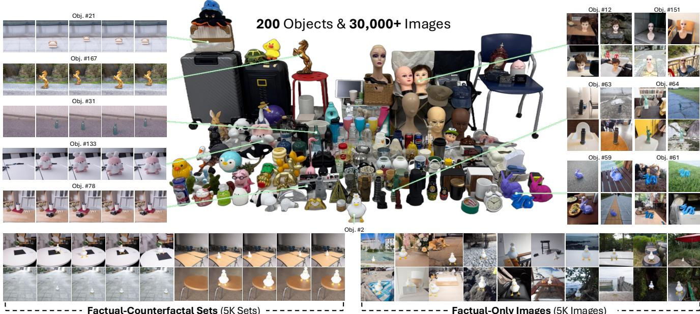  
Figure 1. Overview of ORIDa. ORIDa contains 200 unique objects and over 30,000 real-captured images, including factual-counterfactual (F-CF) sets and factual-only (F-Only) images. F-CF sets consist of five images: one background-only and four with the object in different positions. F-Only images capture objects in diverse scenes, enhancing the diversity of the dataset for object reposition tasks.

## Abstract

Object compositing, the task of placing and harmonizing objects in images of diverse visual scenes, has become an important task in computer vision with the rise of generative models. However, existing datasets lack the diversity and scale required to comprehensively explore real-world scenarios. We introduce ORIDa (Object-centric Realworld Image Composition Dataset), a large-scale, realcaptured dataset containing over 30,000 images featuring 200 unique objects, each ofwhich is presented across varied positions and scenes. ORIDa has two types of data: factualcounterfactual sets and factual-only scenes. The factualcounterfactual sets consist offour factual images showing an object in different positions within a scene and a single counterfactual (or background) image of the scene without the object, resulting in five images per scene. The factualonly scenes include a single image containing an object in a

specific context, expanding the variety of environments. To our knowledge, ORIDa is thefirst publicly available dataset with its scale and complexityfor real-world image composition. Extensive analysis and experiments highlight the value of ORIDa as a resource for advancing further research in object compositing.

## 1. Introduction

Object compositing, or image composition, refers to the task of placing objects into visual scenes in a manner that preserves realism and contextual consistency. This task is critical in many computer vision applications, including image editing, augmented reality, and scene understanding, where objects must seamlessly blend into complex environments. The difficulty lies in ensuring that objects not only fit naturally into a wide range of scenes but also retain their identity and appearance. Successfully addressing object compositing involves overcoming key challenges, such as maintaining the objects identity, harmonizing its appearance with the scene, and managing complex factors like lighting, shadows, and geometric alignment.

Table 1. Comparison of datasets for compositional image editing tasks. obj. and b.g. stand for object and background, respectively.
<table><tr><td rowspan="2">Dataset</td><td rowspan="2">Target task</td><td rowspan="2"># of data</td><td rowspan="2"># of objects</td><td rowspan="2"># of scenes per an obj.</td><td rowspan="2"># of pos. per a scene</td><td rowspan="2">Real</td><td rowspan="2">Factual (including obj.)</td><td rowspan="2">Counterfact. (b.g. only)</td><td rowspan="2">Train set</td><td rowspan="2">Test set</td><td rowspan="2">Public</td><td rowspan="2">DNG</td></tr><tr><td></td></tr><tr><td>COCOEE [42]</td><td>Examplar-based Image Editing</td><td>2.5K triplets</td><td>2.5K</td><td>1</td><td>1</td><td>0</td><td>0</td><td>X</td><td>X</td><td>0</td><td>0</td><td>X</td></tr><tr><td>DreamEdit [18]</td><td>Subject-driven Image Editing</td><td>440 images (source-only)</td><td>22</td><td>20</td><td>1</td><td>-</td><td>X</td><td>0</td><td>X</td><td>0</td><td>0</td><td>X</td></tr><tr><td>DreamBooth [29]</td><td>Subject-driven Image Generation Object</td><td>157 images</td><td>30</td><td>4~6</td><td>1</td><td>0</td><td>0</td><td>X</td><td>X</td><td>0</td><td>0</td><td>X</td></tr><tr><td>FOS-Com [44]</td><td>Compositing Object</td><td>640 triplets 5K images</td><td>640</td><td>1</td><td>1</td><td>X</td><td>0</td><td>X</td><td>X</td><td>0</td><td>0</td><td>X</td></tr><tr><td>ObjectDrop [39]</td><td>Compositing</td><td>(2.5K pairs)</td><td>2.5K</td><td>1</td><td>1</td><td>0</td><td>0</td><td>0</td><td>0</td><td>X</td><td>X</td><td>X</td></tr><tr><td>ORIDa (Ours)</td><td>Object Compositing</td><td>30K images (5K sets + 5K images)</td><td>200</td><td>≈50</td><td>1~4</td><td>0</td><td>0</td><td>0</td><td>0</td><td>0</td><td>0</td><td>0</td></tr></table>

Recent advancements in object compositing can be broadly categorized into two groups: training-free methods and training-based approaches. Training-free methods [3, 23] have delivered impressive results, generating object placements without the need for task-specific datasets. Despite their success, these methods often struggle with fine details, such as scene harmonization and preserving object identity. Training-based approaches [34, 39], in contrast, benefit from data-driven training and can be further divided into those using synthetic data and those using real-world data. While training with synthetic data [34, 42] has significantly advanced object compositing, the lack of real-world complexity limits the realism of the generated images. ObjectDrop [39] has successfully enhanced object compositing using real-captured data; however, its limited scale and scene variability per object necessitate the incorporation of large-scale synthetic datasets. Additionally, the ObjectDrop dataset is not publicly available.

To this end, we present ORIDa (Object-centric Realworld Image Composition Dataset), the first large-scale real-captured public dataset specifically designed for the object compositing. ORIDa contains over 30,000 images of 200 unique objects, each placed in an average of 50 diverse scenes, providing an extensive and varied dataset for studying object placement in real-world contexts. ORIDa offers both factual-counterfactual sets [17, 39] in which each object is captured in four different positions per scene, alongside a corresponding scene without the object, and factualonly images, enriching the dataset with a wide range of contextual possibilities. To ensure the dataset quality, particular attention was given during data collection process in order to minimize external factors beyond the objects presence.

Compared to existing datasets, ORIDA offers several key advantages as shown in Table 1. Datasets like COCOEE [42] and FOS-Com [44] are designed solely for benchmarking and consist of object compositing sets derived from existing datasets, not captured specifically for the task. While DreamEditBench [18] and DreamBooth Dataset [29] offer more variation with multiple image composition scenarios per object, they are also intended only for testing, making it less suited for advancing models. ObjectDrop [39] consists of real-captured data suitable for training, however, it includes only one image pair per object and is not publicly available. In contrast, ORIDA is a large-scale, real-captured and publicly available dataset that offers multiple images per object across varied scenes, making it a more versatile resource for both training and evaluation.

We provide a detailed analysis on ORIDa, demonstrating the wide range of object categories, visual attributes, and contextual variations captured in the dataset. In addition, we show experimental results on object removal and object insertion tasks using a fine-tuned model, trained on ORIDa without incorporating any synthetic datasets. The results validate the potential of our dataset to support realistic object compositing in diverse scenarios, enabling future exploration in compositional image generation and editing.

## 2. Related Work

## 2.1. Object Compositing

Key challenges in object compositing include identity preservation [1, 29, 35, 40], color harmonization [4, 5, 9, 13, 14, 41], shadow generation/removal [11, 12, 16, 20, 21, 37], and geometric correction [15, 30, 38, 43]. In contrast to earlier approaches that tend to address these challenges individually, recent methods [2, 18, 22, 23, 31, 34, 39, 42, 44] aim to handle them within unified frameworks with the advent of diffusion models [10, 25, 27, 32, 33]. For example, models like ObjectStitch [34] and Paint-by-Example [42] attempt to integrate geometric alignment, harmonization, and identity preservation, although issues such as object fidelity and accurate shadow modeling remain.

Factual-Counterfactual Sets  
Factual-Only Images  
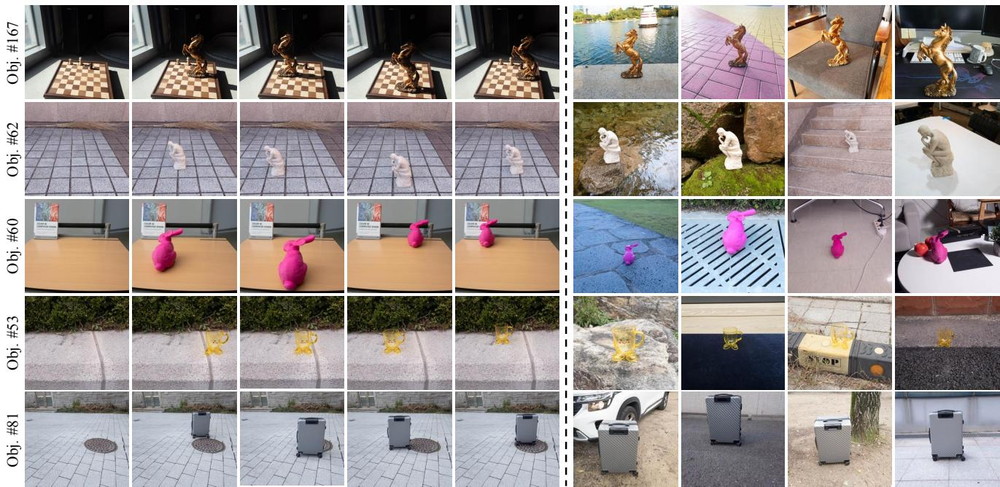  
Figure 2. Examples of Factual-Counterfactual (F-CF) Sets and Factual-Only (F-Only) Images. The left side shows F-CF sets, consisting of one background-only image and four object-inserted images captured with the object in different positions. The right side displays F-Only images, which feature objects in diverse scenes without corresponding background-only images.

Existing approaches to object compositing can be classified into training-free and training-based methods. Training-free methods [3, 23] leverage pre-trained models and do not require task-specific datasets. For example, FreeCompose [3] employs a mask-guided loss function during inference, which harmonizes the inserted object with the given background scene. However, they often struggle in maintaining realism and preserving object identity in complex environments. On the other hand, training-based methods [34, 35, 39, 42, 44], which depend on large datasets, have demonstrated considerable potential for enhancing object compositing performance. Due to the lack of real-world image composition datasets, many of these methods resort to generating synthetic data. This process involves masking an objects area and refilling the masked part with an augmented version of the target object to train their models. While synthetic data helps to overcome data scarcity, it often lacks the complexity and diversity of real-world scenes, which can restrict the models performance.

## 2.2. Datasets for Image Composition

Various datasets support the object compositing task. CO-COEE [42] and FOS-Com [44] are designed as benchmarking datasets. While useful for testing models, these datasets are not specifically captured for object compositing, which limits their effectiveness for model training and exploration of object placement variations. Furthermore, they offer only one compositing set per object.

DreamEditBench [18] provides around 20 compositing sets per object. Nevertheless, like COCOEE and FOS-Com, it is designed solely for benchmarking and includes only source objects and background images, lacking ground truth object-included images. Similarly, DreamBooth Dataset [29] includes 30 subjects, comprising both objects and live subjects/pets. Despite offering some variation, Dream-Booth Dataset is also intended solely for evaluation, and its relatively small scale, along with the absence of counterfactual (or background) images, limits its usefulness for training object compositing models.

The dataset most similar to ORIDa is ObjectDrop [39] which consists of 2,500 real-captured factual-counterfactual pairs, enabling the training of object compositing models. However, ObjectDrop also relies on synthetic datasets to train object insertion models. Furthermore, since the dataset is not publicly available, it is impossible to use it for developing broader models.

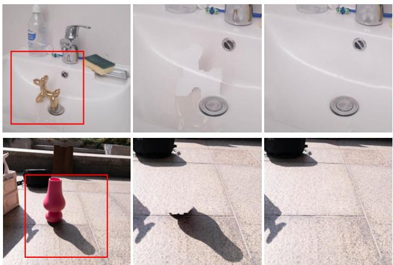  
Factual Image  
NaÔve Object Removal Counterfactual Image  
Figure 3. Visualization of factual-counterfactual concept. The first column shows factual images with objects present in the scene. The second column displays naïve object removal results, where background is synthetically stitched into the object region of the factual image. The third column presents the corresponding ground-truth counterfactual images, which consist solely of the background without the object. These examples demonstrate the object-to-scene effects, including shadows and reflections.

## 3. Dataset Collection

## 3.1. Objects

Our dataset includes a total of 200 unique objects. To ensure consistency and maintain the focus on the objects placement within and across scenes, we limit the variation in object poses during data capture. This allows for more controlled analysis and model training, centering on the objects interaction with its environment rather than pose dynamics. More detailed information about the objects and their characteristics will be elaborated in Section 4.

## 3.2. Image Capture

We used five different cameras to capture images: Galaxy S10, Galaxy S20, Galaxy S22, Galaxy S24, and Galaxy Note10+, all in PRO mode to obtain raw DNG files. Sam ples are provided in Figure 2.

Factual-Counterfactual (F-CF) Sets. The concept of F-CF sets is inspired by ObjectDrop [39]: “if the object did not exist, this reflection would not occur" (Figure 3). However, our dataset differs in two key aspects: (1) our dataset includes multiple scenes for each object, whereas Object-Drop provides only a single scene, and (2) covers multiple positions of an object within a given background, while ObjectDrop offers only one object position. As a result, each F-CF set in ORIDa consists of five images: one backgroundonly image and four images with the object in different positions while fixing the background. To collect F-CF sets, we carefully selected shooting locations by considering consistent lighting conditions, stable backgrounds, and diverse scenes. To ensure consistency within each set, we fixed key camera settings such as shutter speed, ISO, WB, and focus, during a single capture process, preserving the natural lighting and scene conditions across images in each set. Cameras were fixed on tripods and we captured a series of five consecutive images with remote controllers to maintain stability of the camera position.

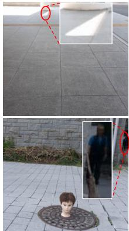

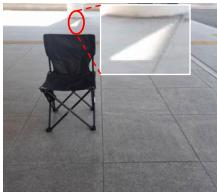

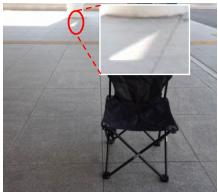

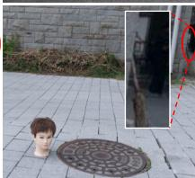

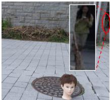  
(a) Undesired background changes

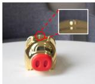

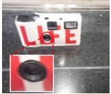  
(b) Out of focus

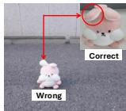

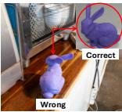  
(c) Wrong pose of objects  
Figure 4. Filtering criteria. Common issues include: (a) undesired background changes such as lighting shifts or pedestrians, (b) out-of-focus images, and (c) incorrect object poses.

Original Image  
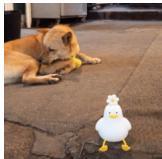

Annotations  
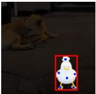

Original Image  
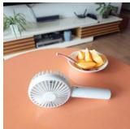

Annotations  
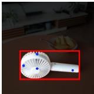  
Obj.#2: “White duck figurine with a yellow beak, legs, and a flower on its head.”  
Obj.#86: “Light grey handheld mini fan with a circular fan head and built-in handle.”  
Figure 5. Annotation examples. Each object includes detailed annotations such as captions, object points, bounding boxes, and segmentation masks.

Factual-Only (F-Only) Images. We also collected F-Only images to increase scene diversity. These images are comparatively easier to capture since they do not require separate background shots, allowing us to efficiently gather object-included images across a variety of backgrounds.

## 3.3. Data Filtering

To ensure that any variations in the scenes are solely due to the presence of objects and to uphold the overall image quality, we meticulously inspected all captured images. We identified several undesired cases, as illustrated in Figure 4: (1) unintended background changes, (2) out-of-focus images, and (3) incorrect object poses. In addition to these cases, we performed inspections to identify and filter out other inconsistencies or defects. We selected 5,699 F-CF sets from the initial 7,000 F-CF sets and retained 5,035 F-Only images from the original 5,500 F-Only images.

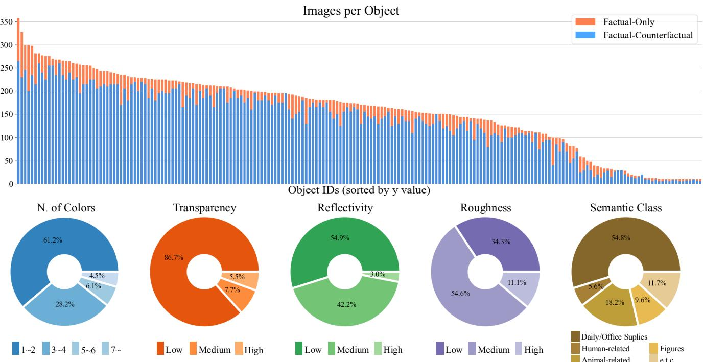  
Figure 6. Dataset statistics per object and attribute. The top chart displays the number of images per object, sorted by y-value, for both factual-only and factual-counterfactual sets. The bottom charts present the percentage distribution of objects based on key attributes: number of colors, transparency, reflectivity, roughness, and semantic class, illustrating the variety and diversity within the dataset.

## 3.4. Annotations

In addition to the filtered images, we provide comprehensive annotations for the dataset, including captions for 200 individual objects, object points, bounding boxes, and segmentation masks as shown in Figure 5.

For generating object captions, we captured objectcentric images with simple backgrounds where the objects are dominant. These images are then used as inputs for GPT-4o [24] and Gemini 1.5 Pro [6] to create object descriptions. For localization-related annotations, such as bounding boxes and segmentation masks, we manually annotated points for each target object in the images. These annotated points are subsequently fed into SAM2 [26] to generate precise segmentation masks and bounding boxes. All images in our dataset, excluding background-only images, include localization-related annotations.

Moreover,raw DNG files in ORIDa provide flexibility for additional ISP (Image Signal Processing) augmentations. This feature is crucial for effective harmonization in object compositing, allowing for exploration with different color and lighting conditions on the original raw files.

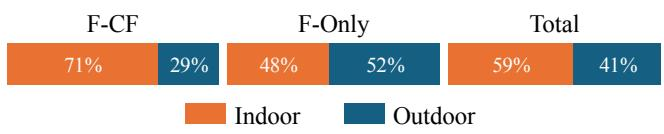  
Figure 7. Indoor/Outdoor ratio. Distribution of indoor and outdoor scenes for factual-counterfactual sets (F-CF), factual-only images (F-Only), and the entire dataset.

## 4. Dataset Statistics

We present several statistics and analyses of our dataset. Figure 6 (top) illustrates the distribution of image counts per object both for the F-CF and F-Only. Note that the y-axis represents the number of images, with F-CF counts calculated by multiplying the number of sets by five. Additionally, as shown in Figure 6 (bottom), we categorize objects based on five attributes: number of colors, transparency, reflectivity, roughness, and semantic classes. These attributes help to understand the variety of visual properties and textures in the dataset. The majority of objects have between one and four main colors, while attributes like transparency and reflectivity are distributed across low to medium levels, indicating a range of visual complexity. Objects are also classified into various semantic classes, such as daily/office supplies, human-related items, and animal-related objects.

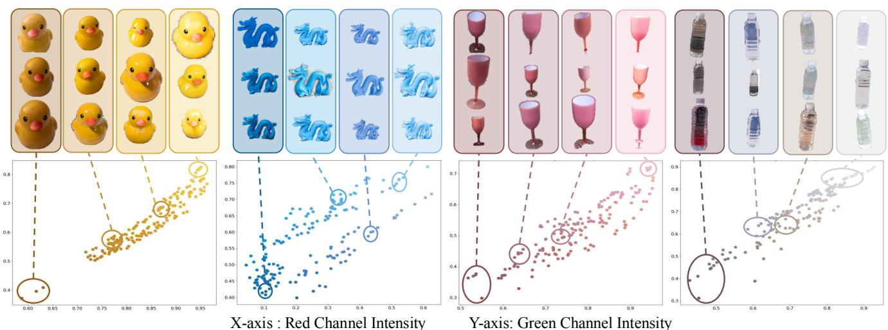  
Figure 8. Visualization of color variations across objects. Example objects are shown with their respective color distributions plotted based on red and green channel intensities. Each plot highlights how the appearance of objects varies under different lighting conditions and backgrounds, illustrating the datasets ability to capture diverse visual contexts.

Furthermore, our dataset includes scenes captured both indoors and outdoors, providing a mix of environments for object compositing. We calculated the ratio of indoor to outdoor scenes separately for F-CF sets, F-Only images, and the entire dataset. As shown in Figure 7, the dataset maintains a balanced distribution between indoor and outdoor settings, with 41% of images captured outdoors.

A unique characteristic of ORIDa is that it captures both the object-to-scene effects and scene-to-object effects. The former refers to how an object impacts its environment such as shadows and reflections as shown in Figure 3, while the latter considers how varying contexts affect an objects appearance. To explore the diversity in object appearances, we analyze the mean color values of some objects across varied scenes. Figure 8 plots the mean color distributions, showing how the appearance of objects shifts under varying lighting conditions and backgrounds. The plots demonstrate that while objects generally maintain their defining characteristics, there are noticeable changes in color intensities based on the context, illustrating the datasets ability to represent a wide range of appearances for the same object.

## 5. Experiments

## 5.1. Experimental Settings

Train datasets. To enhance the diversity of the training data, we utilize the raw files in ORIDa and apply ISP augmentations using Adobe Lightroom. Five different ISP settings are applied: (1) as-shot, (2) higher temperature, (3) lower temperature, (4) higher vibrance, and (5) lower vibrance. For the object insertion task, we use additional 60,000 images from the COCO dataset [19], paired with 250,000 object masks, to train the model to maintain the identity of source objects. Please note that we only utilize the original images from the COCO dataset without any synthetic data, freeing us from the hyper-parameters and complex recipes required for data synthesis [34, 39, 42, 44]. Model. We fine-tuned a public pretrained StableDiffusion (SD)-Inpaint [7, 27], for both object removal and insertion task without major modification of its architecture. The U-Net [28] in SD-Inpaint receives a 9-channel input: four channels for the input latent, four channels for the condition latent, and one channel for the target object mask.

Table 2. Object removal - user studies. Participants rated object removal results on a scale of 1 to 5 across five criteria: context preservation, effectiveness of object removal, elimination of object-related effects (e.g., shadows, reflections), minimization of artifacts, and overall image quality.
<table><tr><td></td><td>SD-Inpaint</td><td>LaMa</td><td>MGIE</td><td>SD-Oursr</td></tr><tr><td>Rating (Max: 5) ↑</td><td>2.78</td><td>2.63</td><td>1.96</td><td>4.23</td></tr></table>

Table 3. Object removal automatic metrics. Comparison with the inpainting baseline (SD-Inpaint) on ORIDa held-out test set.
<table><tr><td></td><td>PSNR↑</td><td>DINO↑</td><td>CLIP↑</td><td>LPIPS↓</td></tr><tr><td>SD-Inpaint</td><td>21.76</td><td>0.845</td><td>0.903</td><td>0.108</td></tr><tr><td>SD-Oursr</td><td>25.60</td><td>0.902</td><td>0.938</td><td>0.088</td></tr></table>

## 5.2. Object Removal

We compare our model (SD-Oursr) with SD-Inpaint [7, 27], LaMa [36], and MGIE [8]. We use images from COCO dataset for qualitative results (Figure 9) and user studies (Table 2), while an out-held test set from ORIDa is used to evaluate automatic quantitative metrics (Table 3).

Input Image  
Target Object  
SD-Inpaint  
LaMa  
MGIE  
SD-Oursr  
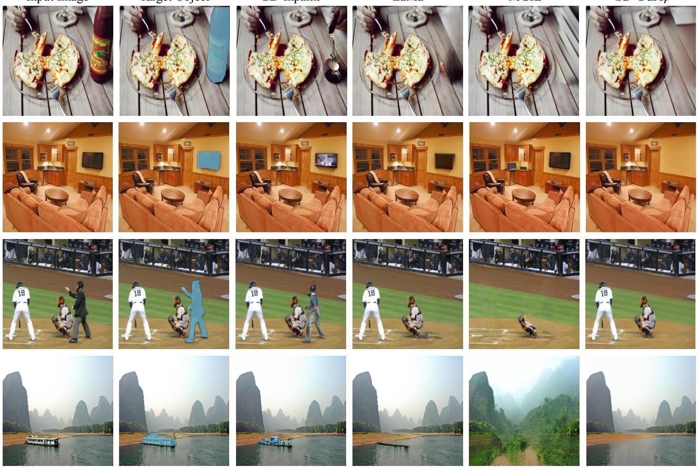  
Figure 9. Object removal - qualitative results across different methods. SD-Inpaint [27], LaMa [36], MGIE [8], and SD-Ours. Fo MGIE, a text prompt such as remove the hot sauce from the photo (for the first row) is used to instruct the model.

As shown in Figure 9, our approach demonstrates better object removal performance. While SD-Inpaint and LaMa perform reasonably well, they often struggle with erasing shadows and reflections. MGIE, which uses text prompts, offers flexibility but can introduce artifacts. In contrast, SD-Oursr effectively preserves the visual context by accurately erasing shadows, lighting, and object itself. This improved performance can be attributed to training exclusively on ORIDa, which provides diverse and high-quality real-world data to handle complex visual scenarios. Please note that some softness observed in both the inpainted regions and surrounding background likely results from the limitations inherent in the pretrained model.

In addition, we also provide quantitative results using both user study ratings from 76 randomly selected participants (Table 2) and automatic metrics (Table 3). These evaluations further validate the effectiveness of our dataset in training a model to achieve realistic object removal.

## 5.3. Object Insertion

For object insertion task, we compare our model (SD-Oursi) with Copy & Paste, Paint-by-Example [42], AnyDoor [2], and ObjectStitch [34]. As shown in Figure 10, SD-Oursi consistently demonstrates effective integration of objects into diverse scenes, showing strengths in identity preservation, shadow generation, and color harmonization.

The Copy & Paste method, while straightforward, encounters challenges with blending the object naturally into the scene and lacks the capability to generate object-toscene effects, such as realistic shadows. Paint-by-Example offers an enhanced level of generating natural images, however, struggles with maintaining object identity, which can be a critical limitation in object-centric image editing.

AnyDoor and ObjectStitch provide more coherent results overall. Nevertheless, they sometimes encounter difficulties in fully preserving the objects identity, adapting its colors seamlessly to the scene and and generating natural shadows. In contrast, SD-Oursi achieves high visual consistency, producing realistic shadows, and context-aware colors that align naturally with the lighting conditions in the target scenes, all without major model modifications.

User study results from 62 participants (Figure 11) further support our claim. SD-Oursi received the highest ratings across all four evaluation criteria: object identity preservation, shadow generation (object-to-scene effects), color harmonization (scene-to-object effects), and overall quality. It achieved preference scores of 66% for object identity, 79% for shadow/reflection generation, 71% for color harmonization, and 67% for overall quality, significantly outperforming other methods. These results highlight our dataset as a valid training resource for achieving realistic and contextually integrated object insertions.

Source Obejct  
Target Image  
Copy & Paste  
Paint-by-Example  
AnyDoor  
ObjectStitch  
SD-Ours i  
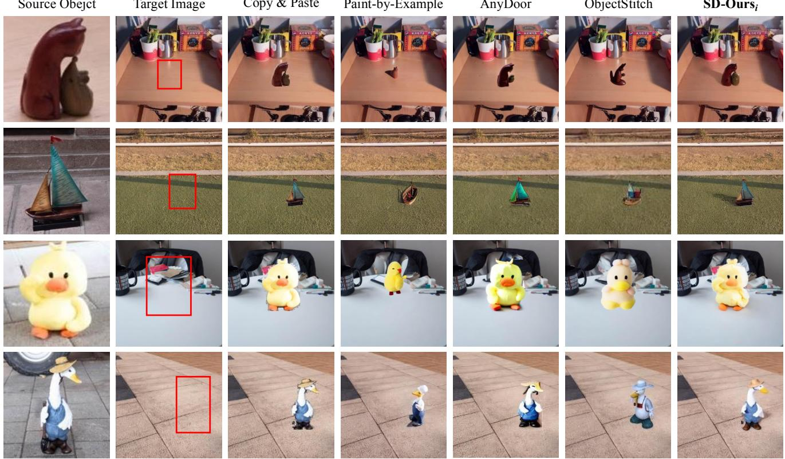  
Figure 10. Object insertion - qualitative results. For each row, the Source Object is inserted into the Target Image. Results illustrate differences in identity preservation, shadow generation, color harmonization, and overall realism.

“Which one is the best regarding [X]?”  
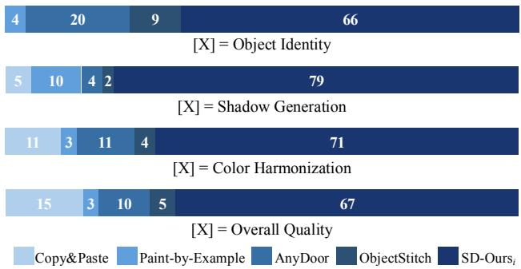  
Figure 11. Object insertion - user study. Participants evaluated different methods on four criteria: object identity preservation, shadow generation (object-to-scene effects), color harmonization (scene-to-object effects), and overall quality based on participants preference. Copy & Paste method is excluded for the object identity preservation test. Numbers are reported in %.

## 6. Conclusion

We introduce ORIDa, the first large-scale, real-captured public dataset for object compositing, with over 30,000 images featuring 200 unique objects. ORIDa is both extensive and carefully curated, with high-quality, richly annotated images that have undergone thorough data filtering. A unique feature of ORIDa is its capture of both object-toscene and scene-to-object effects, providing diverse object placements in real-world scenes.

Our analysis suggests that ORIDa can support advancements in object compositing by providing a valuable resource for developing more realistic, context-aware image editing techniques. Limitations, future research directions, broader impact, and details of our dataset and experiments are provided in the supplementary materials. We hope ORI-Das accessibility will inspire further exploration and constructive discussions on compositional image editing within the research community.

## Acknowledgement

This research was supported and funded by Artificial Intelligence Graduate School Program under Grant 2020-0- 01361, and Artificial Intelligence Innovation Hub under Grant 2021-0-02068.

## References

[1] Mu Cai, Hong Zhang, Huijuan Huang, Qichuan Geng, Yixuan Li, and Gao Huang. Frequency domain image translation: More photo-realistic, better identity-preserving. In Proceedings of the IEEE/CVF International Conference on Computer Vision, pages 13930–13940, 2021. 2

[2] Xi Chen, Lianghua Huang, Yu Liu, Yujun Shen, Deli Zhao, and Hengshuang Zhao. Anydoor: Zero-shot object-level image customization. In Proceedings of the IEEE/CVF Conference on Computer Vision and Pattern Recognition, pages 6593–6602, 2024. 2, 7

[3] Zhekai Chen, Wen Wang, Zhen Yang, Zeqing Yuan, Hao Chen, and Chunhua Shen. Freecompose: Generic zeroshot image composition with diffusion prior. arXiv preprint arXiv:2407.04947, 2024. 2, 3

[4] Wenyan Cong, Jianfu Zhang, Li Niu, Liu Liu, Zhixin Ling, Weiyuan Li, and Liqing Zhang. Dovenet: Deep image harmonization via domain verification. In Proceedings of the IEEE/CVF Conference on Computer Vision and Pattern Recognition, pages 8394–8403, 2020. 2

[5] Wenyan Cong, Li Niu, Jianfu Zhang, Jing Liang, and Liqing Zhang. Bargainnet: Background-guided domain translation for image harmonization. In 2021 IEEE International Conference on Multimedia and Expo (ICME), pages 1–6. IEEE, 2021. 2

[6] Google DeepMind. Gemini pro. https://deepmind. google/technologies/gemini/pro/, 2024. Accessed: 2024-10-24. 5

[7] Hugging Face. Inpainting with diffusers. https : //huggingface.co/docs/diffusers/usingdiffusers/inpaint, 2024. Accessed: 2024-11-13. 6

[8] Tsu-Jui Fu, Wenze Hu, Xianzhi Du, William Yang Wang, Yinfei Yang, and Zhe Gan. Guiding instruction-based im age editing via multimodal large language models. arXiv preprint arXiv:2309.17102, 2023. 6, 7

[9] Julian Jorge Andrade Guerreiro, Mitsuru Nakazawa, and Björn Stenger. Pct-net: Full resolution image harmonization using pixel-wise color transformations. In Proceedings of the IEEE/CVF Conference on Computer Vision and Pattern Recognition, pages 5917–5926, 2023. 2

[10] Jonathan Ho, Ajay Jain, and Pieter Abbeel. Denoising diffusion probabilistic models. Advances in Neural Information Processing Systems, 33:6840–6851, 2020. 3

[11] Yan Hong, Li Niu, and Jianfu Zhang. Shadow generation for composite image in real-world scenes. In Proceedings ofthe AAAI conference on Artificial Intelligence, pages 914–922, 2022. 2

[12] Xiaowei Hu, Yitong Jiang, Chi-Wing Fu, and Pheng-Ann Heng. Mask-shadowgan: Learning to remove shadows from

unpaired data. In Proceedings of the IEEE/CVF Interna tional Conference on Computer Vision, pages 2472–2481, 2019. 2

[13] Yifan Jiang, He Zhang, Jianming Zhang, Yilin Wang, Zhe Lin, Kalyan Sunkavalli, Simon Chen, Sohrab Amirghodsi, Sarah Kong, and Zhangyang Wang. Ssh: A self-supervised framework for image harmonization. In Proceedings of the IEEE/CVF International Conference on Computer Vision, pages 4832–4841, 2021. 2

[14] Zhanghan Ke, Chunyi Sun, Lei Zhu, Ke Xu, and Rynson WH Lau. Harmonizer: Learning to perform white-box image and video harmonization. In European Conference on Computer Vision, pages 690–706. Springer, 2022. 2

[15] Taeeun Kwon and Junseok Kwon. Geometry-preserved im age editing. Electronics Letters, 60(17):e70011, 2024. 2

[16] Hieu Le and Dimitris Samaras. From shadow segmentation to shadow removal. In European Conference on Computer Vision, pages 264–281. Springer, 2020. 2

[17] David Lewis. Counterfactuals. John Wiley & Sons, 2013. 2

[18] Tianle Li, Max Ku, Cong Wei, and Wenhu Chen. Dreamedit: Subject-driven image editing. arXiv preprint arXiv:2306.12624, 2023. 2, 3

[19] Tsung-Yi Lin, Michael Maire, Serge Belongie, James Hays, Pietro Perona, Deva Ramanan, Piotr Dollár, and C Lawrence Zitnick. Microsoft coco: Common objects in context. In European Conference on Computer Vision, pages 740–755. Springer, 2014. 6

[20] Daquan Liu, Chengjiang Long, Hongpan Zhang, Hanning Yu, Xinzhi Dong, and Chunxia Xiao. Arshadowgan: Shadow generative adversarial network for augmented reality in single light scenes. In Proceedings of the IEEE/CVF Confer ence on Computer Vision and Pattern Recognition, pages 8139–8148, 2020. 2

[21] Zhihao Liu, Hui Yin, Xinyi Wu, Zhenyao Wu, Yang Mi, and Song Wang. From shadow generation to shadow removal. In Proceedings of the IEEE/CVF Conference on Computer Vision and Pattern Recognition, pages 4927–4936, 2021. 2

[22] Lingxiao Lu, Jiangtong Li, Bo Zhang, and Li Niu. Dreamcom: Finetuning text-guided inpainting model for image composition. arXiv preprint arXiv:2309.15508, 2023. 2

[23] Shilin Lu, Yanzhu Liu, and Adams Wai-Kin Kong. Tf-icon: Diffusion-based training-free cross-domain image composition. In Proceedings of the IEEE/CVF International Confer ence on Computer Vision, pages 2294–2305, 2023. 2, 3

[24] OpenAI. Hello gpt-4o. https : / / openai . com / index/hello-gpt-4o/, 2024. Accessed: 2024-10-24. 5

[25] Dustin Podell, Zion English, Kyle Lacey, Andreas Blattmann, Tim Dockhorn, Jonas Müller, Joe Penna, and Robin Rombach. Sdxl: Improving latent diffusion models for high-resolution image synthesis. In International Con ference on Learning Representations, 2023. 3

[26] Nikhila Ravi, Valentin Gabeur, Yuan-Ting Hu, Ronghang Hu, Chaitanya Ryali, Tengyu Ma, Haitham Khedr, Roman Rädle, Chloe Rolland, Laura Gustafson, et al. Sam 2: Segment anything in images and videos. arXiv preprint arXiv:2408.00714, 2024. 5

[27] Robin Rombach, Andreas Blattmann, Dominik Lorenz, Patrick Esser, and Björn Ommer. High-resolution image synthesis with latent diffusion models. In Proceedings of the IEEE/CVF Conference on Computer Vision and Pattern Recognition, pages 10684–10695, 2022. 3, 6, 7

[28] Olaf Ronneberger, Philipp Fischer, and Thomas Brox. U-net: Convolutional networks for biomedical image segmentation. In Medical Image Computing and Computer-Assisted Intervention, pages 234–241. Springer, 2015. 6

[29] Nataniel Ruiz, Yuanzhen Li, Varun Jampani, Yael Pritch, Michael Rubinstein, and Kfir Aberman. Dreambooth: Fine tuning text-to-image diffusion models for subject-driven generation. In Proceedings of the IEEE/CVF Conference on Computer Vision and Pattern Recognition, pages 22500– 22510, 2023. 2, 3

[30] Rahul Sajnani, Jeroen Vanbaar, Jie Min, Kapil Katyal, and Srinath Sridhar. Geodiffuser: Geometry-based image editing with diffusion models. arXiv preprint arXiv:2404.14403, 2024. 2

[31] Vishnu Sarukkai, Linden Li, Arden Ma, Christopher Ré, and Kayvon Fatahalian. Collage diffusion. In Proceedings ofthe IEEE/CVF Winter conference on Applications of Computer Vision, pages 4208–4217, 2024. 2

[32] Jiaming Song, Chenlin Meng, and Stefano Ermon. Denoising diffusion implicit models. In International Conference on Learning Representations, 2021. 3

[33] Yang Song, Jascha Sohl-Dickstein, Diederik P Kingma, Abhishek Kumar, Stefano Ermon, and Ben Poole. Score-based generative modeling through stochastic differential equations. In International Conference on Learning Representations, 2021. 3

[34] Yizhi Song, Zhifei Zhang, Zhe Lin, Scott Cohen, Brian Price, Jianming Zhang, Soo Ye Kim, and Daniel Aliaga. Objectstitch: Object compositing with diffusion model. In Proceedings of the IEEE/CVF Conference on Computer Vision and Pattern Recognition, pages 18310–18319, 2023. 2, 3, 6, 7

[35] Yizhi Song, Zhifei Zhang, Zhe Lin, Scott Cohen, Brian Price, Jianming Zhang, Soo Ye Kim, He Zhang, Wei Xiong, and Daniel Aliaga. Imprint: Generative object compositing by learning identity-preserving representation. In Proceedings of the IEEE/CVF Conference on Computer Vision and Pattern Recognition, pages 8048–8058, 2024. 2, 3

[36] Roman Suvorov, Elizaveta Logacheva, Anton Mashikhin, Anastasia Remizova, Arsenii Ashukha, Aleksei Silvestrov, Naejin Kong, Harshith Goka, Kiwoong Park, and Victor Lempitsky. Resolution-robust large mask inpainting with fourier convolutions. In Proceedings ofthe IEEE/CVF Winter conference on Applications of Computer Vision, pages 2149–2159, 2022. 6, 7

[37] Jifeng Wang, Xiang Li, and Jian Yang. Stacked conditional generative adversarial networks for jointly learning shadow detection and shadow removal. In Proceedings of the IEEE/CVF Conference on Computer Vision and Pattern Recognition, pages 1788–1797, 2018. 2

[38] Ruicheng Wang, Jianfeng Xiang, Jiaolong Yang, and Xin Tong. Diffusion models are geometry critics: Single image

3d editing using pre-trained diffusion priors. arXiv preprint arXiv:2403.11503, 2024. 2

[39] Daniel Winter, Matan Cohen, Shlomi Fruchter, Yael Pritch, Alex Rav-Acha, and Yedid Hoshen. Objectdrop: Bootstrap ping counterfactuals for photorealistic object removal and in sertion. arXiv preprint arXiv:2403.18818, 2024. 2, 3, 4, 6

[40] Yi Wu, Ziqiang Li, Heliang Zheng, Chaoyue Wang, and Bin Li. Infinite-id: Identity-preserved personalization via id-semantics decoupling paradigm. arXiv preprint arXiv:2403.11781, 2024. 2

[41] Ben Xue, Shenghui Ran, Quan Chen, Rongfei Jia, Binqiang Zhao, and Xing Tang. Dccf: Deep comprehensible color filter learning framework for high-resolution image harmoniza tion. In European Conference on Computer Vision, pages 300–316. Springer, 2022. 2

[42] Binxin Yang, Shuyang Gu, Bo Zhang, Ting Zhang, Xuejin Chen, Xiaoyan Sun, Dong Chen, and Fang Wen. Paint by example: Exemplar-based image editing with diffusion mod els. In Proceedings of the IEEE/CVF Conference on Com puter Vision and Pattern Recognition, pages 18381–18391, 2023. 2, 3, 6, 7

[43] Jiraphon Yenphraphai, Xichen Pan, Sainan Liu, Daniele Panozzo, and Saining Xie. Image sculpting: Precise object editing with 3d geometry control. In Proceedings of the IEEE/CVF Conference on Computer Vision and Pattern Recognition, pages 4241–4251, 2024. 2

[44] Bo Zhang, Yuxuan Duan, Jun Lan, Yan Hong, Huijia Zhu, Weiqiang Wang, and Li Niu. Controlcom: Controllable image composition using diffusion model. arXiv preprint arXiv:2308.10040, 2023. 2, 3, 6