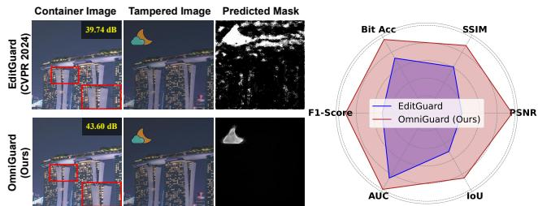
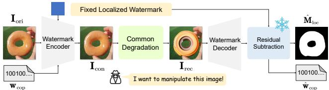
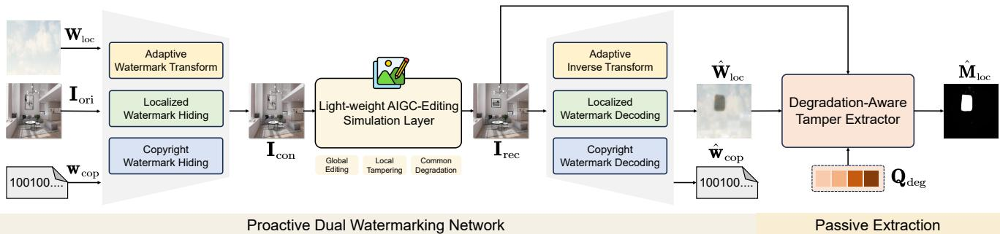
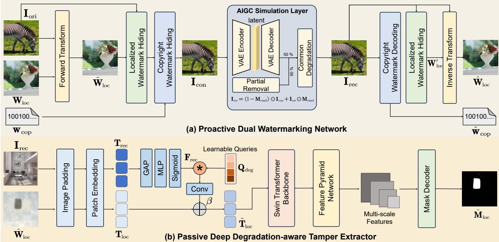
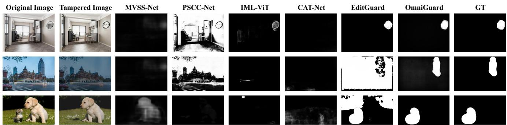
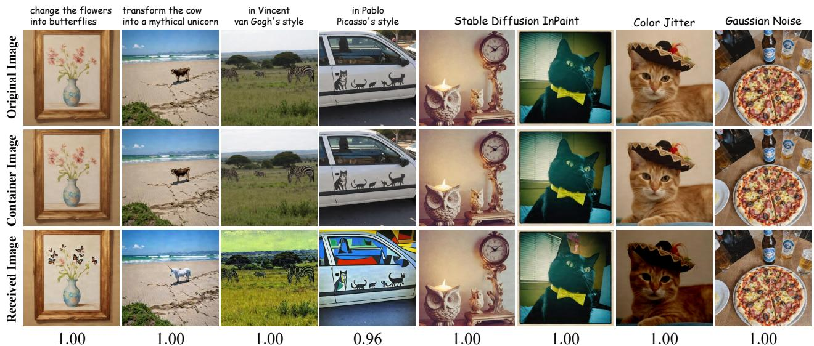
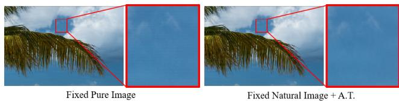

# OmniGuard: Hybrid Manipulation Localization via Augmented Versatile Deep Image Watermarking

Xuanyu Zhang1,2 \*, Zecheng Tang1 \*, Zhipei Xu1 \*, Runyi Li1, Youmin Xu1, Bin Chen1, Feng Gao3 B, Jian Zhang1,2,4 B

1 School of Electronic and Computer Engineering, Peking University

2 Peking University Shenzhen Graduate School-Rabbitpre AIGC Joint Research Laboratory 3 School of Arts, Peking University

4 Guangdong Provincial Key Laboratory of Ultra High Definition Immersive Media Technology, Shenzhen Graduate School, Peking University

## Abstract

With the rapid growth of generative AI and its widespread application in image editing, new risks have emerged regarding the authenticity and integrity ofdigital content. Existing versatile watermarking approaches sufferfrom tradeoffs between tamper localization precision and visual quality. Constrained by the limited flexibility of previous framework, their localized watermark must remain fixed across all images. Under AIGC-editing, their copyright extraction accuracy is also unsatisfactory. To address these challenges, we propose OmniGuard, a novel augmented versatile watermarking approach that integrates proactive embedding with passive, blind extraction for robust copyright protection and tamper localization. OmniGuard employs a hybrid forensic framework that enables flexible localization watermark selection and introduces a degradationaware tamper extraction network for precise localization under challenging conditions. Additionally, a lightweight AIGC-editing simulation layer is designed to enhance robustness across global and local editing. Extensive experiments show that OmniGuard achieves superior fidelity, robustness, and flexibility. Compared to the recent state-ofthe-art approach EditGuard, our method outperforms it by 4.25dB in PSNR ofthe container image, 20.7% in F1-Score under noisy conditions, and 14.8% in average bit accuracy.

## 1. Introduction

With the support of massive datasets and the advancement of large-scale model technologies, generative AI has empowered many industries, creating numerous text-to-image models [16, 45, 46] and image-editing algorithms [7, 32,

  
Figure 1. Comparison between OmniGuard and typical versatile watermarking method [66]. We paste a moon onto the container image (tampering) and reduce the overall brightness (degradation). Under AIGC-Editing or simple tampering, our method significantly outperforms EditGuard [66] across multiple metrics.

40, 65]. This powerful generative and editing capability is a double-edged sword and has introduced significant risks to the authenticity and integrity of information. For instance, illegal infringers may steal images generated by others and claim ownership, making it increasingly challenging to protect intellectual copyrights. Additionally, fraudsters might use AI tools to alter online images to generate misleading content, presenting new challenges for court forensics.

As a classic and widely adopted technique, watermarking has drawn growing attention due to its critical role in protecting image copyrights, detecting unauthorized usage, and tracking tampering. Robust watermarking, for instance, focuses on resilience, aiming to keep the embedded watermark intact and detectable even after significant distortions, such as JPEG compression [25] or screen shooting [12]. In contrast, fragile watermarking prioritizes sensitivity, ensuring that the embedded watermark responds to even minor or specific alterations [27, 34, 35, 44]. Recently, with the development of deep learning, deep watermarking has shown significant advantages in terms of capacity [54], robustness [20], and fidelity [26]. It holds great potential to withstand numerous AIGC editing methods while enabling pixel-wise tamper localization. Notably, some watermarking methods address tamper localization and copyright protection tasks simultaneously [23, 27, 49]. For instance, AudioSeal [48] employed a zero-bit watermarking strategy to achieve sample-level audio tamper localization with robust bit embedding. SepMark [52] introduced the first deep separable watermark for robust copyright protection and deepfake detection. EditGuard [66, 68] leverages the locality of image-in-image steganography [60] to design a serial encoding and parallel decoding watermarking framework.

However, existing versatile deep image watermarking methods still face several challenges. 1) Fidelity: Versatile image watermarking faces an inevitable trade-off between the accuracy of tamper localization and the fidelity of the watermarked image. This is because current methods like [66, 68, 71] rely on residual subtraction between predefined localization watermarks and reconstructed ones to generate the mask. Therefore, to ensure satisfactory localization accuracy, the fidelity of the watermarked image has to be sacrificed. 2) Flexibility: Since the pre-defined localization watermark must be known at the decoding stage to extract the mask, the localized watermark tends to remain fixed across all images, significantly limiting the flexibility of information embedding. 3) Robustness: Existing versatile watermarking methods exhibit clear weaknesses in robustness. The localized watermark recovery often fails under severe degradations, and the copyright watermark can be erased by global AIGC editing algorithms.

To solve the above-mentioned issues, we propose a comprehensively enhanced versatile watermarking approach, dubbed OmniGuard. Firstly, we propose a hybrid forensic approach that combines proactive watermark embedding with passive network-based blind extraction. It can output a tampered mask from the reconstructed localized watermark without prior knowledge of the pre-added one, decoupling the encoding and decoding end. Meanwhile, we train this mask extractor to achieve precise extraction even under inaccurate reconstruction, allowing the watermarking network to focus on enhancing the fidelity of the watermarked image. Furthermore, we explore the selection patterns for localized watermarks and design an adaptive watermark transform, enabling the network to embed localized information in a content-aware manner. Finally, we propose a lightweight AIGC editing simulation layer that enhances the network’s copyright extraction accuracy, ensuring robust performance under global editing such as Instructpix2pix [7] and local inpainting like Stable Diffusion Inpaint [46]. Fig. 1 presents our significant improvement on the SOTA versatile watermarking [66]. In a nutshell, our contributions are summarized as follows.

❑ We propose a hybrid manipulation localization and robust copyright protection framework OmniGuard, which includes a proactive dual watermark network and a passive extractor, improving existing versatile watermarking.

❑ To integrate proactive watermark with passive extraction into a unified framework, a deep degradation-aware tamper extractor is proposed, which fuses the artifacts from the reconstructed localized watermark with the tampered image, achieving higher accuracy under severe degradations.

❑ To enhance the proactive dual watermark network, an adaptive watermark transform and a lightweight AIGC-edit simulator are designed to respectively enhance the container image fidelity and copyright extraction precision.

❑ Experiments verify that our OmniGuard improves fidelity, flexibility, and robustness compared to existing versatile watermarking. It also surpasses passive localization methods and robust watermarking comprehensively.

## 2. Related Works

## 2.1. Image Tamper Detection and Localization

Passive Methods: Passive image tamper detection and localization networks primarily focus on identifying anomalous regions, such as artifacts, noise, and resolution inconsistencies [21, 24, 28, 29, 47, 51, 53, 55–58]. For instance, MVSS-Net [11] used multi-scale supervision and multiview feature learning to capture noise and boundary discrepancies. TruFor [17] employed a noise-sensitive fingerprint and combined high-level and low-level trace extraction via a transformer-driven fusion mechanism. HiFi-Net [18] combined multi-branch feature extraction with specialized localization modules, effectively detecting modifications from CNN-generated or edited images. Meanwhile, IML-ViT [43] incorporated Swin-ViT into its framework with an FPN structure and edge loss constraints to enhance accuracy. Inspired by diffusion models, DiffForensics [64] adopted diffusion denoising pre-training to improve the detection of fine-grained details in tampered images.

Proactive Schemes: Proactive tamper detection and localization [3, 5, 6, 62, 71] involves embedding information into the original image before any alterations, which aids the network in detecting manipulations or performing attributions. Although traditional fragile watermarking methods [10, 23, 27, 34, 35, 44] can perform block-wise tamper localization, but their precision and flexibility remain limited. Recently, MaLP [4] learned the template by leveraging local and global-level features estimated by a two-branch architecture and detect the tampered region from the recovered template. Imuge [61, 63] adopted the self-embedding mechanism and an efficient attack layer to realize tamper localization and self-recovery. Draw [21] embedded watermarks in RAW images to enhance passive tamper localization networks’ resilience to lossy operations like JPEG compression, blurring, and re-scaling. EditGuard [66] and V2AMark [68] used invertible networks to embed dual watermarks, achieving pixel-wise localization and copyright protection. While these proactive mechanisms have shown good results, achieving a balance between fidelity, robustness, and localization accuracy remains an open challenge.

  
Figure 2. Review of prior deep versatile watermarking [66, 71]. They used a fixed localized watermark and produced masks via residual subtraction between the recovered and added ones.

## 2.2. Deep Image Watermarking

Watermarking is a widely accepted and classic technique for copyright protection [30, 39, 59, 67–69]. Traditional methods embedded secret messages in spatial or adaptive domains [9], typically placing the data in less significant bits [15] or inconspicuous regions, which restricts the capacity for hidden information. Recently, deep image watermarking has gained attention. For example, HiD-DeN [72] introduced a deep encoder-decoder network to conceal and retrieve bitstream data. Furthermore, flowbased models [13, 42] were introduced benefited from its inherent information-hiding capability, further enhancing the fidelity of watermarked images. Additionally, various distortion layers like differentiable JPEG and screenshooting [2, 12, 38, 52] have been created to boost the robustness. SSL [14] watermarked images within selfsupervised latent spaces, enabling enhanced security and resilience via the learned image representations. Trust-Mark [8] presented a universal watermarking technique designed for arbitrary-resolution images. However, these methods cannot effectively support AIGC editing. Recently, Robust-wide [20] proposed a partial instructiondriven denoising sampling guidance module to encourage robust watermarking against instruction-driven image editing. VINE [41] introduced SDXL-Turbo [50] and a decoder, achieving great bit accuracy. However, these methods require adding the multi-step iterative diffusion process into network training, significantly reducing training speed.

## 3. Methodology

## 3.1. Review of Versatile Deep Image Watermarking

We first review existing approaches in deep versatile watermarking [6, 52, 66, 68, 71]. Represented by EditGuard [66], current versatile watermarks use a serial encoding and parallel decoding framework, allowing localized and copyright watermarks to coexist within a single image without interfering. Specifically, as shown in Fig. 2, given a 2D localized watermark $\mathbf { W } _ { \mathrm { l o c } } \in \mathbb { R } ^ { H \times W \times 3 }$ and a 1D copyright watermark $\mathbf { w } _ { \mathrm { c o p } } \in \{ 0 , 1 \} ^ { L }$ , the original image $\mathbf { I } _ { \mathrm { o r i } } \in \mathbf { \mathbb { R } } ^ { \tilde { H } \times W \times 3 }$ is fed to an image-bit united embedding network to produce the container image $\mathbf { I } _ { \mathrm { c o n } } .$ Subsequently, if the received image $\mathbf { I } _ { \mathrm { r e c } }$ has undergone local editing and channel degradation, we can input $\mathbf { I } _ { \mathrm { r e c } }$ into the image-bit decoding network to retrieve the dual watermarks $\hat { \mathbf { W } } _ { \mathrm { l o c } } , \hat { \mathbf { w } } _ { \mathrm { c o p } }$ . The AIGC editing and degraded pipeline can be modeled as follows.

<table><tr><td>Method</td><td>EditGuard</td><td>OmniGuard</td></tr><tr><td>Localized Watermark</td><td>Fixed</td><td>Adaptive</td></tr><tr><td>Supported Degradation</td><td>Common</td><td>Common &amp; AIGC-Edit</td></tr><tr><td>Mask Extraction</td><td>Fragile</td><td>Robust</td></tr></table>

Table 1. High-level comparison between two approaches.

$$
\begin{array} { r } { \mathbf { I } _ { \mathrm { r e c } } = \mathcal { D } _ { \mathrm { d e g } } ( \mathbf { I } _ { \mathrm { c o n } } \odot ( \mathbf { 1 } - \mathbf { M } _ { \mathrm { g t } } ) + \mathcal { E } _ { \mathrm { e d i t } } ( \mathbf { I } _ { \mathrm { c o n } } ) \odot \mathbf { M } _ { \mathrm { g t } } ) , } \end{array}\tag{1}
$$

where $\mathcal { E } _ { \mathrm { e d i t } } ( \cdot ) , ~ \mathcal { D } _ { \mathrm { d e g } } ( \cdot )$ and $\mathbf { M } _ { \mathrm { g t } }$ respectively denote the editing function, degradation function and tampered mask. Note that these versatile methods [66, 68, 71] only consider local edits, i.e., $\mathbf { M } _ { \mathrm { g t } } \neq \mathbf { 0 }$ . The recovered copyright $\hat { \mathbf { w } } _ { \mathrm { c o p } }$ is expected to be generally consistent with $\mathbf { w } _ { \mathrm { c o p } }$ . Finally, we compare $\hat { \mathbf { W } } _ { \mathrm { l o c } }$ and $\mathbf { W } _ { \mathrm { l o c } }$ via the residual subtraction to compute the tampered area $\hat { \mathbf { M } } _ { \mathrm { l o c } } \in \mathbb { R } ^ { H \times W }$

$$
\hat { \mathbf { M } } _ { \mathrm { l o c } } = \Theta _ { \tau } \big ( | \hat { \mathbf { W } } _ { \mathrm { l o c } } - \mathbf { W } _ { \mathrm { l o c } } | \big ) ,\tag{2}
$$

where $\Theta _ { \tau } ( z ) { = } 1 \ ( z \ \ge \ \tau ) . \ | \ \cdot \ |$ is an absolute value operation. However, we summarize that this pixel-wise residual subtraction has three major drawbacks.

❑ The recovery of $\hat { \mathbf { W } } _ { \mathrm { l o c } }$ and the generation of $\mathbf { I } _ { \mathrm { c o n } }$ are mutually constraining. Considering that detection accuracy is highly dependent on the restoration precision of $\hat { \mathbf { W } } _ { \mathrm { l o c } } ,$ the quality of $\mathbf { I } _ { \mathrm { c o n } }$ has to be significantly compromised.

❑ The extraction of $\hat { \mathbf { M } } _ { \mathrm { l o c } }$ requires knowledge of $\mathbf { W } _ { \mathrm { l o c } } .$ , making it non-blind. Therefore, to facilitate collaboration between the decoding and encoding end, a simple approach is to select a fixed $\mathbf { W } _ { \mathrm { l o c } } .$ . However, a fixed localized watermark cannot achieve optimal fidelity for all images.

❑ If the unaltered regions of $\hat { \mathbf { W } } _ { \mathrm { l o c } }$ contain artifacts due to severe degradation, these areas may also be incorrectly treated as tampered, posing a threat to detection robustness.

## 3.2. Overall Framework of OmniGuard

To address the above issues, we propose a hybrid forensic framework, OmniGuard, which combines a proactive dual watermarking network with a passive, deep, degradationaware tamper extractor (Fig. 3). This framework leverages the strong generalization capabilities of proactive watermarking to overcome the accuracy limitations of passive extraction networks while using the passive network to further enhance localization robustness. Additionally, Omni-Guard improves container image fidelity through a carefully designed localization watermark and strengthens copyright extraction robustness by effectively simulating AIGC global and local edits within the degradation layer.

Specifically, as shown in Fig. 3 and Fig. 4(a), we first use an adaptive forward transform (Sec. 3.4) to embed the original image $\mathbf { I } _ { \mathrm { o r i } }$ into the localized watermark $\mathbf { W } _ { \mathrm { l o c } } .$ , allowing the transformed watermark $\tilde { \mathbf { W } } _ { \mathrm { l o c } }$ to acquire some contentaware and reasonable texture, which has been shown to facilitate effective hiding. Then, the localized tag $\tilde { \mathbf { W } } _ { \mathrm { l o c } }$ and a copyright watermark $\mathbf { w } _ { \mathrm { c o p } }$ are embedded into $\mathbf { I } _ { \mathrm { o r i } }$ to create the container image $\mathbf { I } _ { \mathrm { c o n } }$ . Similarly, we extract $\hat { \mathbf { w } } _ { \mathrm { c o p } }$ from $\mathbf { I } _ { \mathrm { r e c } }$ and obtain the artifact map $\hat { \mathbf { W } } _ { \mathrm { l o c } }$ via the localized watermark decoding module and an inverse transform (Sec. 3.4). Here the localized watermark hiding and decoding networks follow the structure of invertible networks in [66]. The structure of copyright watermark hiding and decoding network are inspired by [8]. Finally, both the artifact map $\hat { \mathbf { W } } _ { \mathrm { l o c } }$ and the tampered image $\mathbf { I } _ { \mathrm { r e c } }$ are fed to the deep tamper extractor to produce the tampered mask $\hat { \mathbf { M } } _ { \mathrm { l o c } }$

  
Figure 3. High-Level Framework of the proposed OmniGuard. Based on the existing versatile watermarking framework, we can more flexibly select and embed localized watermarks to improve container image fidelity. Additionally, a deep tamper extractor is introduced to robustly extract tamper masks. The copyright watermark extraction can also resist interference from AIGC-Editing.

The major improvements of OmniGuard focus on two key points. First, we introduce a deep tamper extractor that takes both $\mathbf { I } _ { \mathrm { r e c } }$ and $\hat { \mathbf { W } } _ { \mathrm { l o c } }$ to analyze tampering clues. By reframing the reconstruction of $\hat { \mathbf { W } } _ { \mathrm { l o c } }$ as a classification task, the extractor only needs to distinguish tampering artifacts from other regions, greatly simplifying training. Second, we expand the range of degradations that EditGuard supports. In copyright decoding, we design a lightweight AIGC simulation layer, enabling OmniGuard to support both global edits and local tampering. For localized watermark decoding, our detection can withstand conditions such as JPEG (Q=50), color jitter, and severe noise. We list the comparison with EditGuard on Tab. 1.

## 3.3. Passive Degradation-Aware Tamper Extractor

Movtivation: The core design of our deep passive extraction network lies in the introduction of $\mathbf { I } _ { \mathrm { r e c } }$ and a learnable degradation query $\mathbf { Q } _ { \mathrm { d e g } }$ . Considering that the artifact map $\hat { \mathbf { W } } _ { \mathrm { l o c } }$ often does not reconstruct well under some severe degradations, we also include the original tampered image $\mathbf { I } _ { \mathrm { r e c } }$ as an auxiliary input to help the network distinguish between artifacts caused by tampering or insufficient reconstruction. Meanwhile, inspired by Q-Former [31], we learn a degradation representation space $\mathbf { Q } _ { \mathrm { d e g } }$ via the supervision of the $\{ \hat { \mathbf { W } } _ { \mathrm { l o c } } , \mathbf { I } _ { \mathrm { r e c } } , \mathbf { M } _ { \mathrm { g t } } \}$ pairs and adaptively select the degradation type based on the content of $\mathbf { I } _ { \mathrm { r e c } }$

As shown in Fig. 4(b), motivated by [43], we use a window-based transformer to better capture long-range dependencies and extract tampering traces, enabling precise mask extraction. Specifically, $\hat { \mathbf { W } } _ { \mathrm { l o c } }$ and $\mathbf { I } _ { \mathrm { r e c } }$ will be padded in a fixed resolution and perform patch embedding to transform the two images into two groups of image tokens $\mathbf { T } _ { \mathrm { l o c } } .$ $\mathbf { T } _ { \mathrm { r e c } }$ . To adaptively query the degradation type in $\mathbf { Q } _ { \mathrm { d e g } }$ that corresponds to the content of the input tampered image $\mathbf { I } _ { \mathrm { r e c } }$ $\mathbf { I } _ { \mathrm { r e c } }$ is passed to a global average pooling (GAP) layer, an MLP layer, and a sigmoid operator to align with the degradation query $\mathbf { Q } _ { \mathrm { d e g } } .$ , extracting the feature $\mathbf { F } _ { \mathrm { r e c } }$ . Instead of using cross-attention, we use a simple element-wise multiplication and a convolution layer to fuse the feature $\mathbf { F } _ { \mathrm { r e c } }$ and degradation query $\mathbf { Q } _ { \mathrm { d e g } } ,$ , forming the enhanced artifact map token $\tilde { \mathbf { T } } _ { \mathrm { l o c } }$ . The process is formulated as follows.

$$
\begin{array} { r l } & { \tilde { \mathbf { T } } _ { \mathrm { l o c } } = \mathbf { T } _ { \mathrm { l o c } } + \boldsymbol { \beta } \cdot \mathbf { \mathrm { C o n v } } ( \mathbf { F } _ { \mathrm { r e c } } \circledast \mathbf { Q } _ { \mathrm { d e g } } ) , } \\ & { \mathrm { \cdot } h \mathbf { F } _ { \mathrm { r e c } } = \mathrm { S i g m o i d } \left( \mathrm { M L P } \left( \mathrm { G A P } \left( \mathbf { T } _ { \mathrm { r e c } } \right) \right) \right) , } \end{array}\tag{3}
$$

where $\beta$ is a learnable trade-off parameter, ⊛ denotes element-wise multiplication. Furthermore, we feed the enhanced token $\tilde { \mathbf { T } } _ { \mathrm { r e c } }$ into a Swin-ViT backbone [33] for visual feature extraction and use a feature pyramid network to obtain multi-scale features. These multi-scale features are then processed by a mask decoder, composed of several linear layers, to generate the final mask $\hat { \mathbf { M } } _ { \mathrm { l o c } }$ . The entire process of our mask extraction is expressed as follows.

$$
\hat { \bf M } _ { \mathrm { l o c } } = \mathrm { T a m p e r E x t r a c o r } ( \hat { \bf W } _ { \mathrm { l o c } } \mid { \bf I } _ { \mathrm { r e c } } , { \bf Q } _ { \mathrm { d e g } } )\tag{4}
$$

## 3.4. Adaptive Localized Watermark Transform

Motivation: Previous methods, limited by the need for residual subtraction to generate the mask, often rely on fixed, simple-textured localized watermarks (i.e. a plain blue image) to ensure sufficient precision in the reconstructed watermark. However, we observe that embedding a natural image (i.e. a sky with white clouds image in Fig. 3) is often less noticeable, resulting in a more natural pattern of artifacts. Adopting our robust passive extraction method, we can use a more complex localized image that better complements the original content. Additionally, onestep steganographic embedding can produce content-aware noise while filtering out high-frequency details from the watermark, making it more suitable for information hiding.

  
Figure 4. Detail of our proposed OmniGuard. Our proactive dual watermarking network utilizes forward and backward transform to filter high-frequency information from the localized watermark. The passive degradation-aware tamper extractor employs a window-based transformer and degradation querying techniques to predict the mask $\hat { \mathbf { M } } _ { \mathrm { l o c } }$ from $\hat { \mathbf { W } } _ { \mathrm { l o c } }$ predicted by the trained watermarking network and $\mathbf { I } _ { \mathrm { r e c } } .$ The AIGC-Editing simulator uses partial removal and VAE compression as surrogate attacks for global edits and local tampering.

Specifically, as plotted in Fig. 4(a), our forward transform and inverse transform form a pair of reversible additive affine transformations. We first hide the $\mathbf { I } _ { \mathrm { o r i } }$ into $\mathbf { W } _ { \mathrm { l o c } }$ to produce an more adaptive localized watermark $\tilde { \mathbf { W } } _ { \mathrm { l o c } }$

$$
\begin{array} { r l } & { \tilde { \mathbf { W } } _ { \mathrm { l o c } } = \mathbf { W } _ { \mathrm { l o c } } + \phi _ { 1 } ( \mathbf { I } _ { \mathrm { o r i } } ) , } \\ & { \mathbf { H } _ { \mathrm { m e d } } = \mathbf { I } _ { \mathrm { o r i } } \otimes \mathrm { E x p } ( \phi _ { 2 } ( \tilde { \mathbf { W } } _ { \mathrm { l o c } } ) ) + \phi _ { 3 } ( \tilde { \mathbf { W } } _ { \mathrm { l o c } } ) , } \end{array}\tag{5}
$$

where $\{ \phi _ { i } \} _ { i = 1 } ^ { 3 }$ respectively denote a simple convolution layer to perform affine transformation. $\mathbf { H } _ { \mathrm { m e d } }$ denotes the intermediate dismissed high-frequency information. Similarly, in the inverse transform, we use $\mathbf { I } _ { \mathrm { r e c } }$ to approximate $\mathbf { I } _ { \mathrm { o r i } }$ , and perform further computation based on the result of the localized watermark decoding $\mathbf { W } _ { \mathrm { l o c } } ^ { \prime }$ as follows.

$$
\begin{array} { r l } & { \hat { \mathbf { H } } _ { \mathrm { m e d } } = ( \mathbf { I } _ { \mathrm { r e c } } - \phi _ { 3 } ( \mathbf { W } _ { \mathrm { l o c } } ^ { \prime } ) ) \otimes \mathrm { E x p } ( - \phi _ { 2 } ( \mathbf { W } _ { \mathrm { l o c } } ^ { \prime } ) ) , } \\ & { \hat { \mathbf { W } } _ { \mathrm { l o c } } = \mathbf { W } _ { \mathrm { l o c } } ^ { \prime } - \phi _ { 1 } ( \mathbf { I } _ { \mathrm { r e c } } ) . } \end{array}\tag{6}
$$

Through a one-step forward and inverse transform, the preselected watermark $\mathbf { W } _ { \mathrm { l o c } }$ will undergo slight adaptive adjustments and be conducive to the container’s fidelity.

## 3.5. Light-Weight AIGC-Editing Simulator

Motivation: To enhance the copyright watermark’s resilience to AIGC edits, we introduce a lightweight AIGCediting simulation layer. For global edits, prior methods [20] often incorporate the iterative diffusion denoising process into training, which significantly increases memory consumption and requires substantial image-text pairs to support text-driven edits. However, we observe that the primary source of watermark disruption after editing stems from VAE compression rather than the denoising process itself. Therefore, integrating VAE into the degradation layer can replicate the effects of actual AIGC editing while reducing training time to 1/24 of Robust-wide [20]. Additionally, previous methods [66] typically overlooked local edits during training, relying on the watermark’s global hiding capabilities to mitigate local tampering. However, new content added to local regions introduces interference with watermark decoding. Thus, we incorporate a simple partial watermark removal operator to address it more precisely.

As plotted in Fig. 4(a), the container image $\mathbf { I } _ { \mathrm { c o n } }$ has a 50% chance of being fed to the Stable Diffusion VAE for encoding and decoding to simulate global editing and a 50% chance of undergoing a partial removal operation as surrogate attacks. Instead of a straight-through estimator, all the gradients of these operators can be propagated back. Then, we also introduce some common degradations after the AIGC editing. The processes are as follows.

$$
\mathbf { I } _ { \mathrm { r e c } } = \left\{ \begin{array} { l l } { \mathcal { D } _ { \mathrm { c o m } } \big ( \mathrm { V A E } \big ( \mathbf { I } _ { \mathrm { c o n } } \big ) \big ) , } & { \mathrm { i f ~ } p > 0 , } \\ { \mathcal { D } _ { \mathrm { c o m } } \big ( \big ( 1 - \mathbf { M } _ { \mathrm { r a n d } } \big ) \odot \mathbf { I } _ { \mathrm { c o n } } + \mathbf { I } _ { \mathrm { o r i } } \odot \mathbf { M } _ { \mathrm { r a n d } } \big ) , } & { \mathrm { e l s e } } \end{array} \right.\tag{7}
$$

where VAE denotes the variational encoder-decoder of SD-

<table><tr><td rowspan="3">Method</td><td colspan="4">Stable Diffusion Inpaint</td><td colspan="4">Controlnet Inpaint</td><td colspan="4">Splicing</td></tr><tr><td colspan="2">Clean</td><td colspan="2">Degraded</td><td colspan="2">Clean</td><td colspan="2">Degraded</td><td colspan="2">Clean</td><td colspan="2">Degraded</td></tr><tr><td>F1</td><td>AUC</td><td>F1</td><td>AUC</td><td>F1</td><td>AUC</td><td>F1</td><td>AUC</td><td>F1</td><td>AUC</td><td>F1</td><td>AUC</td></tr><tr><td>MVSS-Net [11]</td><td>0.183</td><td>0.735</td><td>0.181</td><td>0.741</td><td>0.226</td><td>0.765</td><td>0.208</td><td>0.750</td><td>0.355</td><td>0.825</td><td>0.352</td><td>0.823</td></tr><tr><td>CAT-Net [29]</td><td>0.153</td><td>0.714</td><td>0.119</td><td>0.706</td><td>0.172</td><td>0.728</td><td>0.130</td><td>0.710</td><td>0.198</td><td>0.735</td><td>0.196</td><td>0.734</td></tr><tr><td>PSCC-Net [37]</td><td>0.098</td><td>0.630</td><td>0.041</td><td>0.554</td><td>0.086</td><td>0.624</td><td>0.086</td><td>0.627</td><td>0.083</td><td>0.618</td><td>0.082</td><td>0.602</td></tr><tr><td>HiFi-Net [18]</td><td>0.188</td><td>0.534</td><td>0.193</td><td>0.549</td><td>0.190</td><td>0.546</td><td>0.190</td><td>0.547</td><td>0.189</td><td>0.553</td><td>0.189</td><td>0.553</td></tr><tr><td>IML-ViT [43]</td><td>0.099</td><td>0.636</td><td>0.107</td><td>0.643</td><td>0.111</td><td>0.643</td><td>0.111</td><td>0.650</td><td>0.352</td><td>0.775</td><td>0.348</td><td>0.751</td></tr><tr><td>EditGuard [66]</td><td>0.951</td><td>0.971</td><td>0.740</td><td>0.925</td><td>0.958</td><td>0.987</td><td>0.752</td><td>0.921</td><td>0.928</td><td>0.990</td><td>0.758</td><td>0.933</td></tr><tr><td>OmniGuard (Ours)</td><td>0.961</td><td>0.999</td><td>0.947</td><td>0.998</td><td>0.953</td><td>0.998</td><td>0.952</td><td>0.999</td><td>0.913</td><td>0.993</td><td>0.895</td><td>0.991</td></tr></table>

Table 2. Localization performance of the proposed OmniGuard and other SOTA proactive or passive manipulation localization methods. “Clean” and “Degraded” denote detection under the clean condition, and under the condition of randomly selecting JPEG, colo jitter, Gaussian noise, and salt-pepper noise. The best results are highlighted in red, and the second one is blue.

1.5 [46] with frozen parameters, $\mathcal { D } _ { \mathrm { c o m } }$ denotes the common degradation function, and $p \sim \mathcal { N } ( 0 , 1 )$ denotes the selection probability. $\mathbf { M } _ { \mathrm { r a n d } }$ denotes the randomly generated mask. Note that we only introduce our lightweight AIGC-Editing simulator in the training of copyright watermark encoding and decoding. When training the dual watermarking network, we only introduce differentiable JPEG [54] to ensure sufficient quality of the container image.

## 3.6. Training Details

Our training process consists of three stages. First, given the original image and the copyright watermark $\left\{ \mathbf { I } _ { \mathrm { o r i } } , \mathbf { w } _ { \mathrm { c o p } } \right\}$ , we train the copyright watermark hiding and decoding network via the binary cross-entropy loss $\ell _ { \mathrm { b c e } }$ and mean squared error loss $\ell _ { 2 } .$ . The loss function is:

$$
\ell _ { \mathrm { c o p } } = \ell _ { \mathrm { b c e } } \big ( \hat { \mathbf { w } } _ { \mathrm { c o p } } , \mathbf { w } _ { \mathrm { c o p } } \big ) + \lambda \cdot \ell _ { 2 } ( \mathbf { I } _ { \mathrm { c o n } } , \mathbf { I } _ { \mathrm { o r i } } ) ,\tag{8}
$$

where λ is firstly set to 0.05, and gradually increase to 27.5. After 150 epochs, we introduce surrogate attacks like VAE and partial removal. Then, we freeze their weights and jointly train the whole proactive dual watermark network via the image-localized watermark pair $\left\{ \mathbf { I } _ { \mathrm { o r i } } , \mathbf { W } _ { \mathrm { l o c } } \right\}$

$$
\begin{array} { r l } & { \ell _ { \mathrm { l o c } } = \ell _ { 2 } ( \hat { \mathbf { W } } _ { \mathrm { l o c } } , \mathbf { W } _ { \mathrm { l o c } } ) + \alpha _ { 1 } \cdot \ell _ { 2 } ( \mathbf { I } _ { \mathrm { c o n } } , \mathbf { I } _ { \mathrm { o r i } } ) } \\ & { \qquad + \alpha _ { 2 } \cdot \ell _ { \mathrm { G A N } } ( \mathbf { I } _ { \mathrm { c o n } } , \mathbf { I } _ { \mathrm { o r i } } ) + \alpha _ { 3 } \cdot \ell _ { \mathrm { L P I P S } } ( \mathbf { I } _ { \mathrm { c o n } } , \mathbf { I } _ { \mathrm { o r i } } ) , } \end{array}\tag{9}
$$

where $\alpha _ { 1 } , \alpha _ { 2 } .$ , and $\alpha _ { 3 }$ are respectively set to 10, 10, and 100. Since passive extraction has relatively low precision requirements for $\hat { \mathbf { W } } _ { \mathrm { l o c } }$ , we make the network focus more on optimizing the quality of the container image and assign them a higher weight. Additionally, we introduce GAN loss [12] $\ell _ { \mathrm { G A N } }$ and VGG loss ℓ to enhance perceptual quality. After training the watermarking part, we train the tamper extractor via the triplet $\{ \hat { \mathbf { W } } _ { \mathrm { l o c } } , \mathbf { I } _ { \mathrm { r e c } } , \mathbf { M } _ { \mathrm { g t } } \}$

$$
\ell _ { \mathrm { e x t } } = \ell _ { \mathrm { b c e } } ( \hat { \mathbf { M } } _ { \mathrm { l o c } } , \mathbf { M } _ { \mathrm { g t } } ) + \gamma \cdot \ell _ { \mathrm { e d g e } } ( \mathbf { M } _ { \mathrm { l o c } } , \mathbf { M } _ { \mathrm { g t } } ) ,\tag{10}
$$

where $\gamma$ is set to 20. The edge loss $\ell _ { \mathrm { e d g e } }$ is used to guide the model to focus on important regions [8].

## 4. Experimental Results

## 4.1. Experimental Setup

We train the copyright watermark network on the MIR-FlickR dataset [22] with AdamW optimizer at an initial learning rate of $4 \times 1 0 ^ { - 6 }$ in a batch of 32 and cosine annealing schedule. Then, we optimize the entire proactive dual watermarking network on the DIV2K [1] dataset with Adam optimizer at a learning rate of $1 \times 1 0 ^ { - 5 }$ and a batch size of 8. The window-based transformer backbone is ViT-B which is pretrained on ImageNet-1k via MAE [19]. The window size and padding size are relatively set to 14 and 1024. The tamper extractor is trained on 20000 constructed pairs $\{ \hat { \mathbf { W } } _ { \mathrm { l o c } } , \mathbf { I } _ { \mathrm { r e c } } , \mathbf { M } _ { \mathrm { g t } } \}$ . Here, the tampering type during training is Stable Diffusion Inpaint, but our method can generalize to almost any type of local modification. We conduct all our experiments on an NVIDIA GTX 3090Ti Server.

## 4.2. Comparision with Localization Methods

To evaluate the tamper localization precision of our OmniGuard, we compare it with some state-of-the-art passive methods, including PSCC-Net [37], MVSS-Net [11], CAT-Net [29], HiFi-Net [18], and IML-ViT [43], as well as the proactive method EditGuard [66]. F1-Score and AUC are used as our evaluation metrics. We compare our methods and other competitive methods on 1000 samples from the testing set of COCO [36]. We select three distinctive local editing methods, namely Stable Diffusion Inpaint, Control-Net Inpaint, and image splicing, to realize $\mathcal { E } _ { e d i t }$ in Eq. 1. The degradation function $\mathcal { D } _ { d e g }$ is randomly selected from Gaussian noise (σ=1-10), JPEG (Q=70-85), color jitter in brightness, contrast, and saturation, and salt-and-pepper noise to verify the robustness.

As reported on Tab. 2, our method achieves the best localization performance on both AIGC and simple tampering, with an F1 score greater than 0.95 and an AUC close to 1. Although EditGuard performs similarly to ours under clean conditions, we observe a significant drop in Edit-Guard’s localization accuracy under noisy conditions, with F1 decreasing by about 0.2. This is because EditGuard relies on pixel-level comparison, making its localization results highly dependent on watermark recovery performance. In contrast, OmniGuard experiences almost no performance reduction under common degradations. Fig. 5 further illustrates the advantages of our method. On some in-thewild tampered samples, passive methods such as PSCC-Net and IML-ViT, struggle to effectively detect tampering traces. Proactive methods like EditGuard produce inaccurate masks and are sensitive to threshold settings when the tampered images undergo global degradations. In contrast, our OmniGuard can robustly and accurately identify tampered regions. Note that for global edits like Instructp2p, OmniGuard can still robustly retrieve the copyright and detect tampering; however, it tends to locate the entire image as tampering. This aligns with our intended functionality, as our watermarking focuses more on addressing pixel-level tampering rather than semantic modifications.

  
Figure 5. Visualized Comparison between our OmniGuard and other methods on the in-the-wild tampered samples. The tampered image has undergone JPEG compression (1st row), brightness adjustment (2nd row) and contrast adjustment (3rd row).

<table><tr><td rowspan="3">Method</td><td rowspan="3">Capacity</td><td rowspan="3">PSNR</td><td rowspan="3">SSIM</td><td colspan="6">Bit Accuracy (%)</td></tr><tr><td colspan="2">Global Edit</td><td colspan="2">Local Edit</td><td colspan="3">Common Degradation</td></tr><tr><td>Instructp2p</td><td>SD Inpaint*</td><td>SD Inpaint</td><td>Random Dropout</td><td>JPEG</td><td>ColorJitter</td><td>Gaussian Noise</td></tr><tr><td>PIMoG [12]</td><td>30 bits</td><td>36.68</td><td>0.926</td><td>0.695</td><td>0.641</td><td>0.945</td><td>0.947</td><td>0.961</td><td>0.965</td><td>0.756</td></tr><tr><td>SepMark [52]</td><td>30 bits</td><td>34.71</td><td>0.890</td><td>0.921</td><td>0.928</td><td>0.978</td><td>0.980</td><td>0.999</td><td>0.964</td><td>0.952</td></tr><tr><td>TrustMark [8]</td><td>100 bits</td><td>43.17</td><td>0.994</td><td>0.928</td><td>0.939</td><td>0.980</td><td>0.982</td><td>0.998</td><td>0.962</td><td>0.921</td></tr><tr><td>EditGuard [66]</td><td>64 bits</td><td>42.15</td><td>0.986</td><td>0.582</td><td>0.623</td><td>0.982</td><td>0.982</td><td>0.975</td><td>0.978</td><td>0.778</td></tr><tr><td>Robust-Wide [20]</td><td>64 bits</td><td>42.72</td><td>0.992</td><td>0.990</td><td>0.974</td><td>0.984</td><td>0.986</td><td>0.999</td><td>0.964</td><td>0.732</td></tr><tr><td>OmniGuard</td><td>100 bits</td><td>42.33</td><td>0.992</td><td>0.981</td><td>0.989</td><td>0.996</td><td>0.996</td><td>1.000</td><td>0.980</td><td>0.959</td></tr><tr><td>EditGuard† [66]</td><td> $6 4 \mathrm { b i t s } + \mathbf { W } _ { \mathrm { l o c } }$ </td><td>37.53</td><td>0.936</td><td>0.556</td><td>0.617</td><td>0.981</td><td>0.982</td><td>0.971</td><td>0.977</td><td>0.776</td></tr><tr><td>OmniGuard†</td><td> $1 0 0 \mathrm { b i t s } + \mathbf { W } _ { \mathrm { l o c } }$ </td><td>41.78</td><td>0.989</td><td>0.979</td><td>0.988</td><td>0.995</td><td>0.994</td><td>1.000</td><td>0.979</td><td>0.959</td></tr></table>

Table 3. Fidelity and bit recovery accuracy comparison between the proposed OmniGuard and other SOTA watermarking methods. Note that “SD Inpaint\*” denotes the regeneration from the image via an inpainting model, while “SD Inpaint” ensures that the non-edited regions remain entirely consistent with the original image. † denotes hiding both a localized watermark and copyright watermark.

## 4.3. Comparison with Deep Watermarking

To validate the fidelity and copyright recovery robustness of our method, we compare it with SOTA deep watermarking approaches PIMoG [12], SepMark [52], TrustMark [8], EditGuard [66] and Robust-Wide [20]. Tab. 3 presents the fidelity of different methods and their bit recovery metrics on three tampering types. Notably, “SD inpaint\*” denotes regenerating a new image conditioned on a mask. In contrast, local edit strictly follows the operations in Eq. 1, ensuring that unedited areas remain consistent with the original image. We test all the results on 1000 512 × 512 images with paired prompt in the dataset of UltraEdit [70]. σ in Gaussian noise and Q in JPEG are respectively set to 25 and 70. Color jitter denotes reducing or increasing the brightness by 30%. More results are shown in supplementary materials.

As reported in Tab. 3, our method achieves the best bit recovery performance across most degradation with satisfactory visual fidelity (PSNR > 42dB). With both the copyright and localized watermark, our method outperforms EditGuard by 4.25 dB in PSNR and presents a substantial improvement in bit accuracy. On Instructp2p, our bit accuracy is only 0.009 lower than Robust-Wide, which is specifically trained for AIGC Editing. Furthermore, benefiting from our AIGC simulator, the iteration time per sample during training is 0.16s, compared to 3.675s for Robust-Wide. Moreover, since we do not need to incorporate the diffusion denoising process, we can even train our model on an 11GB single NVIDIA 1080Ti. As plotted in Fig. 6, even when the overall style of the image is modified, our OmniGuard can still accurately retrieve the copyright. It effectively manages global and local edits, as well as conventional degradations.

  
Figure 6. Visualization of the original images, container images, and received images (Edited or Degraded) of our OmniGuard. The recovered bit accuracy is listed below. The first four column is edited via the Instructp2p [7].

<table><tr><td>Case</td><td>Localized Watermark</td><td>PSNR (dB)</td><td>F1</td><td>AUC</td></tr><tr><td>(a)</td><td>Fixed Pure Image</td><td>39.64</td><td>0.975</td><td>0.999</td></tr><tr><td>(b)</td><td>Fixed Natural Image</td><td>41.09</td><td>0.957</td><td>0.993</td></tr><tr><td>(c)</td><td>Adaptive Natural Image</td><td>40.28</td><td>0.885</td><td>0.975</td></tr><tr><td>(d)</td><td>Fixed Natural Image + A.T. (Ours)</td><td>41.78</td><td>0.961</td><td>0.999</td></tr></table>

Table 4. Ablation on the selection of localized watermark, where A.T. denotes adaptive watermark transform.

  
Figure 7. Visual comparison of different localized watermarks. Using a fixed pure localized watermark will cause stripe-like artifacts, but our watermark adaptive transform can alleviate it.

## 4.4. Ablation Study

Exploration on the localized watermark: Thanks to our hybrid forensic mechanism, we can flexibly choose the localized watermark without compromising localization performance, as reported on Tab. 4. We find that using a pure color image as a watermark achieves the best localization performance but fails to ensure the watermark’s imperceptibility. Specifically, as shown in Fig. 7, hiding a fixed pure image easily produces stripe-like regular artifacts, which greatly compromise watermark security. In contrast, using a fixed natural image significantly alleviates this issue. In case (c), we directly use the original image as the localized watermark, but it does not lead to improvements in either localization performance or fidelity. Based on the natural image, applying our adaptive watermark transformation from Sec. 3.4 further enhances PSNR by 0.69 dB.

Ablation on the design of deep tamper extractor: To validate the contribution of our network design, we conducted ablation studies on the degradation query and the tampered image. When the tampered image was removed, leaving only the artifact map as input, the F1-score drops significantly by 0.056. This is because artifacts from degradation can sometimes interfere with those caused by tampering, making the auxiliary input from $\mathbf { I } _ { \mathrm { r e c } }$ essential for accurate correction. Furthermore, removing $\mathbf { Q } _ { \mathrm { d e g } }$ also reduces the localization precision of the tamper extractor, as it lacked an effective mechanism for fusing $\mathbf { I } _ { \mathrm { r e c } }$ and $\hat { \mathbf { W } } _ { \mathrm { l o c } }$

<table><tr><td>Case</td><td>Tampered image</td><td>Degradation query</td><td>F1</td><td>AUC</td></tr><tr><td>(a)</td><td>X</td><td>√</td><td>0.905</td><td>0.962</td></tr><tr><td>(b)</td><td>√</td><td>X</td><td>0.935</td><td>0.998</td></tr><tr><td>(c)</td><td>√</td><td>√</td><td>0.961</td><td>0.999</td></tr></table>

Table 5. Ablation on two key network designs, namely the tam pered image $\mathbf { I } _ { \mathrm { r e c } }$ and degradation query $\mathbf { Q } _ { \mathrm { d e g } }$

## 5. Conclusion

OmniGuard proposes an innovative hybrid forensic framework that combines proactive watermark embedding with passive extraction. This approach incorporates a deep degradation-aware tamper extractor, adaptive localized watermark transform, and a lightweight AIGC-editing simulator, enabling OmniGuard to achieve superior fidelity, flexibility, and robustness. Experiments show that OmniGuard outperforms state-of-the-art methods by producing higherfidelity images with fewer artifacts and achieving superior tamper localization and copyright extraction accuracy, even under severe degradations and generative AI edits. As a robust defense against AIGC manipulation, OmniGuard represents a critical advancement for the community, contributing to future developments in copyright protection and digital content authenticity.

## References

[1] Eirikur Agustsson and Radu Timofte. Ntire 2017 challenge on single image super-resolution: Dataset and study. In Proceedings of the IEEE/CVF Conference on Computer Vision and Pattern Recognition Workshops (CVPRW), 2017. 6

[2] Mahdi Ahmadi, Alireza Norouzi, Nader Karimi, Shadrokh Samavi, and Ali Emami. Redmark: Framework for residual diffusion watermarking based on deep networks. Expert Systems with Applications, 146:113157, 2020. 3

[3] Vishal Asnani, Xi Yin, Tal Hassner, Sijia Liu, and Xiaoming Liu. Proactive image manipulation detection. In Proceedings of the IEEE/CVF Conference on Computer Vision and Pattern Recognition (CVPR), pages 15386–15395, 2022. 2

[4] Vishal Asnani, Xi Yin, Tal Hassner, and Xiaoming Liu. Malp: Manipulation localization using a proactive scheme. In Proceedings of the IEEE/CVF Conference on Computer Vision and Pattern Recognition (CVPR), 2023. 2

[5] Vishal Asnani, John Collomosse, Tu Bui, Xiaoming Liu, and Shruti Agarwal. Promark: Proactive diffusion watermarking for causal attribution. In Proceedings of the IEEE/CVF Conference on Computer Vision and Pattern Recognition (CVPR), pages 10802–10811, 2024. 2

[6] Vishal Asnani, Xi Yin, and Xiaoming Liu. Proactive schemes: A survey of adversarial attacks for social good. arXiv preprint arXiv:2409.16491, 2024. 2, 3

[7] Tim Brooks, Aleksander Holynski, and Alexei A Efros. Instructpix2pix: Learning to follow image editing instructions. In Proceedings of the IEEE/CVF Conference on Computer Vision and Pattern Recognition, pages 18392–18402, 2023. 1, 2, 8

[8] Tu Bui, Shruti Agarwal, and John Collomosse. Trustmark: Universal watermarking for arbitrary resolution images. arXiv preprint arXiv:2311.18297, 2023. 3, 4, 6, 7

[9] Chi-Kwong Chan and Lee-Ming Cheng. Hiding data in images by simple lsb substitution. Pattern Recognition, 37(3): 469–474, 2004. 3

[10] Baotian Cheng, Rongrong Ni, and Yao Zhao. A refining localization watermarking for image tamper detection and recovery. In 2012 IEEE 11th International Conference on Signal Processing, pages 984–988, 2012. 2

[11] Chengbo Dong, Xinru Chen, Ruohan Hu, Juan Cao, and Xirong Li. Mvss-net: Multi-view multi-scale supervised networks for image manipulation detection. IEEE Transactions on Pattern Analysis and Machine Intelligence, 45(3):3539– 3553, 2022. 2, 6

[12] Han Fang, Zhaoyang Jia, Zehua Ma, Ee-Chien Chang, and Weiming Zhang. Pimog: An effective screen-shooting noiselayer simulation for deep-learning-based watermarking network. In Proceedings of the 30th ACM International Conference on Multimedia (MM), 2022. 1, 3, 6, 7

[13] Han Fang, Yupeng Qiu, Kejiang Chen, Jiyi Zhang, Weiming Zhang, and Ee-Chien Chang. Flow-based robust watermarking with invertible noise layer for black-box distortions. In Proceedings of the AAAI Conference on Artificial Intelligence (AAAI), 2023. 3

[14] Pierre Fernandez, Alexandre Sablayrolles, Teddy Furon, Herve J ´ egou, and Matthijs Douze. Watermarking images in´

self-supervised latent spaces. In ICASSP 2022-2022 IEEE International Conference on Acoustics, Speech and Signal Processing (ICASSP), pages 3054–3058, 2022. 3

[15] Toma´s Filler, Jan Judas, and Jessica Fridrich. Minimizingˇ additive distortion in steganography using syndrome-trellis codes. IEEE Transactions on Information Forensics and Security, 6(3):920–935, 2011. 3

[16] Gabriel Goh, James Betker, Li Jing, Aditya Ramesh, et al. Improving image generation with better captions. https: / / cdn . openai . com / papers / dall - e - 3 . pdf, 2023. 1

[17] Fabrizio Guillaro, Davide Cozzolino, Avneesh Sud, Nicholas Dufour, and Luisa Verdoliva. Trufor: Leveraging all-round clues for trustworthy image forgery detection and localization. In Proceedings of the IEEE/CVF Conference on Com puter Vision and Pattern Recognition (CVPR), 2023. 2

[18] Xiao Guo, Xiaohong Liu, Zhiyuan Ren, Steven Grosz, Iacopo Masi, and Xiaoming Liu. Hierarchical fine-grained image forgery detection and localization. In Proceedings of the IEEE/CVF Conference on Computer Vision and Pattern Recognition (CVPR), 2023. 2, 6

[19] Kaiming He, Xinlei Chen, Saining Xie, Yanghao Li, Piotr Dollar, and Ross Girshick. Masked autoencoders are scalable´ vision learners. In Proceedings of the IEEE/CVF conference on computer vision and pattern recognition, pages 16000– 16009, 2022. 6

[20] Runyi Hu, Jie Zhang, Ting Xu, Jiwei Li, and Tianwei Zhang. Robust-wide: Robust watermarking against instructiondriven image editing. In European Conference on Computer Vision, pages 20–37. Springer, 2025. 1, 3, 5, 7

[21] Xiaoxiao Hu, Qichao Ying, Zhenxing Qian, Sheng Li, and Xinpeng Zhang. Draw: Defending camera-shooted raw against image manipulation. In Proceedings of the IEEE/CVF International Conference on Computer Vision (ICCV), 2023. 2

[22] Mark J Huiskes and Michael S Lew. The mir flickr retrieval evaluation. In Proceedings ofthe 1st ACM international conference on Multimedia information retrieval, pages 39–43, 2008. 6

[23] Nasir N Hurrah, Shabir A Parah, Nazir A Loan, Javaid A Sheikh, Mohammad Elhoseny, and Khan Muhammad. Dual watermarking framework for privacy protection and content authentication of multimedia. Future generation computer Systems, 94:654–673, 2019. 2

[24] Ashraful Islam, Chengjiang Long, Arslan Basharat, and Anthony Hoogs. Doa-gan: Dual-order attentive generative ad versarial network for image copy-move forgery detection and localization. In Proceedings of the IEEE/CVF Confer ence on Computer Vision and Pattern Recognition (CVPR), 2020. 2

[25] Zhaoyang Jia, Han Fang, and Weiming Zhang. Mbrs: Enhancing robustness of dnn-based watermarking by minibatch of real and simulated jpeg compression. In Proceedings ofthe 29th ACM International Conference on Multimedia (MM), 2021. 1

[26] Junpeng Jing, Xin Deng, Mai Xu, Jianyi Wang, and Zhenyu Guan. Hinet: Deep image hiding by invertible network. In

Proceedings of the IEEE/CVF International Conference on Computer Vision (ICCV), 2021. 1

[27] Asra Kamili, Nasir N Hurrah, Shabir A Parah, Ghulam Mohiuddin Bhat, and Khan Muhammad. Dwfcat: Dual watermarking framework for industrial image authentication and tamper localization. IEEE Transactions on Industrial Informatics, 17(7):5108–5117, 2020. 1, 2

[28] Chenqi Kong, Baoliang Chen, Haoliang Li, Shiqi Wang, Anderson Rocha, and Sam Kwong. Detect and locate: Exposing face manipulation by semantic-and noise-level telltales. IEEE Transactions on Information Forensics and Security, 17:1741–1756, 2022. 2

[29] Myung-Joon Kwon, In-Jae Yu, Seung-Hun Nam, and Heung-Kyu Lee. Cat-net: Compression artifact tracing network for detection and localization of image splicing. In Proceedings of the IEEE/CVF Winter Conference on Applications ofComputer Vision (WACV), 2021. 2, 6

[30] Chenxin Li, Hengyu Liu, Zhiwen Fan, Wuyang Li, Yifan Liu, Panwang Pan, and Yixuan Yuan. Instantsplamp: Fast and generalizable stenography framework for generative gaussian splatting. In The Thirteenth International Conference on Learning Representations. 3

[31] Junnan Li, Dongxu Li, Silvio Savarese, and Steven Hoi. Blip-2: Bootstrapping language-image pre-training with frozen image encoders and large language models. In International conference on machine learning, pages 19730– 19742, 2023. 4

[32] Weiqi Li, Shijie Zhao, Chong Mou, Xuhan Sheng, Zhenyu Zhang, Qian Wang, Junlin Li, Li Zhang, and Jian Zhang. Omnidrag: Enabling motion control for omnidirectional image-to-video generation. arXiv preprint arXiv:2412.09623, 2024. 1

[33] Yanghao Li, Chao-Yuan Wu, Haoqi Fan, Karttikeya Mangalam, Bo Xiong, Jitendra Malik, and Christoph Feichtenhofer. Mvitv2: Improved multiscale vision transformers for classification and detection. In Proceedings of the IEEE/CVF conference on computer vision and pattern recognition, pages 4804–4814, 2022. 4

[34] Siau-Chuin Liew, Siau-Way Liew, and Jasni Mohd Zain. Tamper localization and lossless recovery watermarking scheme with roi segmentation and multilevel authentication. Journal of digital imaging, 26:316–325, 2013. 1, 2

[35] Chia-Chen Lin, Ting-Lin Lee, Ya-Fen Chang, Pei-Feng Shiu, and Bohan Zhang. Fragile watermarking for tamper localization and self-recovery based on ambtc and vq. Electronics, 12(2):415, 2023. 1, 2

[36] Tsung-Yi Lin, Michael Maire, Serge Belongie, James Hays, Pietro Perona, Deva Ramanan, Piotr Dollar, and C Lawrence´ Zitnick. Microsoft coco: Common objects in context. In Proceedings of the European Conference on Computer Vision (ECCV), 2014. 6

[37] Xiaohong Liu, Yaojie Liu, Jun Chen, and Xiaoming Liu. Pscc-net: Progressive spatio-channel correlation network for image manipulation detection and localization. IEEE Transactions on Circuits and Systems for Video Technology, 32 (11):7505–7517, 2022. 6

[38] Yang Liu, Mengxi Guo, Jian Zhang, Yuesheng Zhu, and Xiaodong Xie. A novel two-stage separable deep learning

framework for practical blind watermarking. In Proceedings of the ACM International Conference on Multimedia (MM), 2019. 3

[39] Zhihang Liu, Jun Li, Hongtao Xie, Pandeng Li, Jiannan Ge, Sun-Ao Liu, and Guoqing Jin. Towards balanced alignment: Modal-enhanced semantic modeling for video moment retrieval. In Proceedings of the AAAI conference on artificial intelligence, pages 3855–3863, 2024. 3

[40] Zichen Liu, Yue Yu, Hao Ouyang, Qiuyu Wang, Ka Leong Cheng, Wen Wang, Zhiheng Liu, Qifeng Chen, and Yujun Shen. Magicquill: An intelligent interactive image editing system. arXiv preprint arXiv:2411.09703, 2024. 1

[41] Shilin Lu, Zihan Zhou, Jiayou Lu, Yuanzhi Zhu, and Adams Wai-Kin Kong. Robust watermarking using generative pri ors against image editing: From benchmarking to advances. arXiv preprint arXiv:2410.18775, 2024. 3

[42] Rui Ma, Mengxi Guo, Yi Hou, Fan Yang, Yuan Li, Huizhu Jia, and Xiaodong Xie. Towards blind watermarking: Combining invertible and non-invertible mechanisms. In Proceedings of the ACM International Conference on Multimedia (MM), 2022. 3

[43] Xiaochen Ma, Bo Du, Xianggen Liu, Ahmed Y Al Hammadi, and Jizhe Zhou. Iml-vit: Image manipulation localiza tion by vision transformer. arXiv preprint arXiv:2307.14863, 2023. 2, 4, 6

[44] Neena Raj NR and R Shreelekshmi. Fragile watermarking scheme for tamper localization in images using logistic map and singular value decomposition. Journal of Visual Com munication and Image Representation, 85:103500, 2022. 1, 2

[45] Dustin Podell, Zion English, Kyle Lacey, Andreas Blattmann, Tim Dockhorn, Jonas Muller, Joe Penna, and¨ Robin Rombach. Sdxl: Improving latent diffusion models for high-resolution image synthesis. In The Twelfth International Conference on Learning Representations, 2024. 1

[46] Robin Rombach, Andreas Blattmann, Dominik Lorenz, Patrick Esser, and Bjorn Ommer. High-resolution image¨ synthesis with latent diffusion models. In Proceedings of the IEEE/CVF Conference on Computer Vision and Pattern Recognition (CVPR), 2022. 1, 2, 6

[47] Ronald Salloum, Yuzhuo Ren, and C-C Jay Kuo. Image splicing localization using a multi-task fully convolutional network (mfcn). Journal of Visual Communication and Image Representation, 51:201–209, 2018. 2

[48] Robin San Roman, Pierre Fernandez, Hady Elsahar, Alexandre Defossez, Teddy Furon, and Tuan Tran. Proactive detec-´ tion of voice cloning with localized watermarking. In International Conference on Machine Learning, 2024. 2

[49] Tom Sander, Pierre Fernandez, Alain Durmus, Teddy Furon, and Matthijs Douze. Watermark anything with localized messages, 2024. 2

[50] Axel Sauer, Dominik Lorenz, Andreas Blattmann, and Robin Rombach. Adversarial diffusion distillation. In European Conference on Computer Vision, pages 87–103, 2025. 3

[51] Haiwei Wu, Jiantao Zhou, Jinyu Tian, and Jun Liu. Robust image forgery detection over online social network shared images. In Proceedings of the IEEE/CVF Conference on Computer Vision and Pattern Recognition (CVPR), 2022. 2

[52] Xiaoshuai Wu, Xin Liao, and Bo Ou. Sepmark: Deep separable watermarking for unified source tracing and deepfake detection. In Proceedings of the ACM international conference on Multimedia (MM), 2023. 2, 3, 7

[53] Yue Wu, Wael AbdAlmageed, and Premkumar Natarajan. Mantra-net: Manipulation tracing network for detection and localization of image forgeries with anomalous features. In Proceedings of the IEEE/CVF Conference on Computer Vision and Pattern Recognition (CVPR), 2019. 2

[54] Youmin Xu, Chong Mou, Yujie Hu, Jingfen Xie, and Jian Zhang. Robust invertible image steganography. In Proceedings of the IEEE/CVF Conference on Computer Vision and Pattern Recognition (CVPR), 2022. 1, 6

[55] Zhipei Xu, Xuanyu Zhang, Runyi Li, Zecheng Tang, Qing Huang, and Jian Zhang. Fakeshield: Explainable image forgery detection and localization via multi-modal large language models. arXiv preprint arXiv:2410.02761, 2024. 2

[56] Zhiyuan Yan, Yong Zhang, Yanbo Fan, and Baoyuan Wu. Ucf: Uncovering common features for generalizable deepfake detection. In Proceedings of the IEEE/CVF Interna tional Conference on Computer Vision, pages 22412–22423, 2023.

[57] Zhiyuan Yan, Yong Zhang, Xinhang Yuan, Siwei Lyu, and Baoyuan Wu. Deepfakebench: A comprehensive benchmark of deepfake detection. Advances in Neural Information Processing Systems, 36:4534–4565, 2023.

[58] Zhiyuan Yan, Taiping Yao, Shen Chen, Yandan Zhao, Xinghe Fu, Junwei Zhu, Donghao Luo, Chengjie Wang, Shouhong Ding, Yunsheng Wu, et al. Df40: Toward next-generation deepfake detection. arXiv preprint arXiv:2406.13495, 2024. 2

[59] Yifeng Yang, Hengyu Liu, Chenxin Li, Yining Sun, Wuyang Li, Yifan Liu, Yiyang Lin, Yixuan Yuan, and Nanyang Ye. Concealgs: Concealing invisible copyright information in 3d gaussian splatting. In ICASSP 2025-2025 IEEE International Conference on Acoustics, Speech and Signal Processing (ICASSP), 2025. 3

[60] Huayuan Ye, Shenzhuo Zhang, Shiqi Jiang, Jing Liao, Shuhang Gu, Changbo Wang, and Chenhui Li. Pprsteg: Printing and photography robust qr code steganography via attention flow-based model. arXiv preprint arXiv:2405.16414, 2024. 2

[61] Qichao Ying, Zhenxing Qian, Hang Zhou, Haisheng Xu, Xinpeng Zhang, and Siyi Li. From image to imuge: Immunized image generation. In Proceedings of the ACM in ternational conference on Multimedia (MM), 2021. 2

[62] Qichao Ying, Xiaoxiao Hu, Xiangyu Zhang, Zhenxing Qian, Sheng Li, and Xinpeng Zhang. Rwn: Robust watermarking network for image cropping localization. In Proceedings of the IEEE International Conference on Image Processing (ICIP), 2022. 2

[63] Qichao Ying, Hang Zhou, Zhenxing Qian, Sheng Li, and Xinpeng Zhang. Learning to immunize images for tamper localization and self-recovery. IEEE Transactions on Pattern Analysis and Machine Intelligence, 2023. 2

[64] Zeqin Yu, Jiangqun Ni, Yuzhen Lin, Haoyi Deng, and Bin Li. Diffforensics: Leveraging diffusion prior to image forgery

detection and localization. In Proceedings of the IEEE/CVF Conference on Computer Vision and Pattern Recognition, pages 12765–12774, 2024. 2

[65] Kai Zhang, Lingbo Mo, Wenhu Chen, Huan Sun, and Yu Su. Magicbrush: A manually annotated dataset for instruction guided image editing. Advances in Neural Information Pro cessing Systems, 36, 2024. 1

[66] Xuanyu Zhang, Runyi Li, Jiwen Yu, Youmin Xu, Weiqi Li, and Jian Zhang. Editguard: Versatile image watermarking for tamper localization and copyright protection. In Proceed ings of the IEEE/CVF Conference on Computer Vision and Pattern Recognition, pages 11964–11974, 2024. 1, 2, 3, 4, 5, 6, 7

[67] Xuanyu Zhang, Jiarui Meng, Runyi Li, Zhipei Xu, Yongbing Zhang, and Jian Zhang. Gs-hider: Hiding messages into 3d gaussian splatting. Advances in Neural Information Processing Systems, 37:49780–49805, 2024. 3

[68] Xuanyu Zhang, Youmin Xu, Runyi Li, Jiwen Yu, Weiqi Li, Zhipei Xu, and Jian Zhang. V2a-mark: Versatile deep visualaudio watermarking for manipulation localization and copyright protection. In Proceedings of the 32nd ACM International Conference on Multimedia, page 9818–9827, 2024. 2, 3

[69] Xuanyu Zhang, Jiarui Meng, Zhipei Xu, Shuzhou Yang, Yanmin Wu, Ronggang Wang, and Jian Zhang. Securegs: Boosting the security and fidelity of 3d gaussian splatting steganography. In International Conference on Learning Representations (ICLR), 2025. 3

[70] Haozhe Zhao, Xiaojian Ma, Liang Chen, Shuzheng Si, Ru jie Wu, Kaikai An, Peiyu Yu, Minjia Zhang, Qing Li, and Baobao Chang. Ultraedit: Instruction-based fine-grained im age editing at scale, 2024. 7

[71] Yuan Zhao, Bo Liu, Tianqing Zhu, Ming Ding, Xin Yu, and Wanlei Zhou. Proactive image manipulation detection via deep semi-fragile watermark. Neurocomputing, 585:127593, 2024. 2, 3

[72] Jiren Zhu, Russell Kaplan, Justin Johnson, and Li Fei-Fei. Hidden: Hiding data with deep networks. In European Con ference on Computer Vision (ECCV), 2018. 3