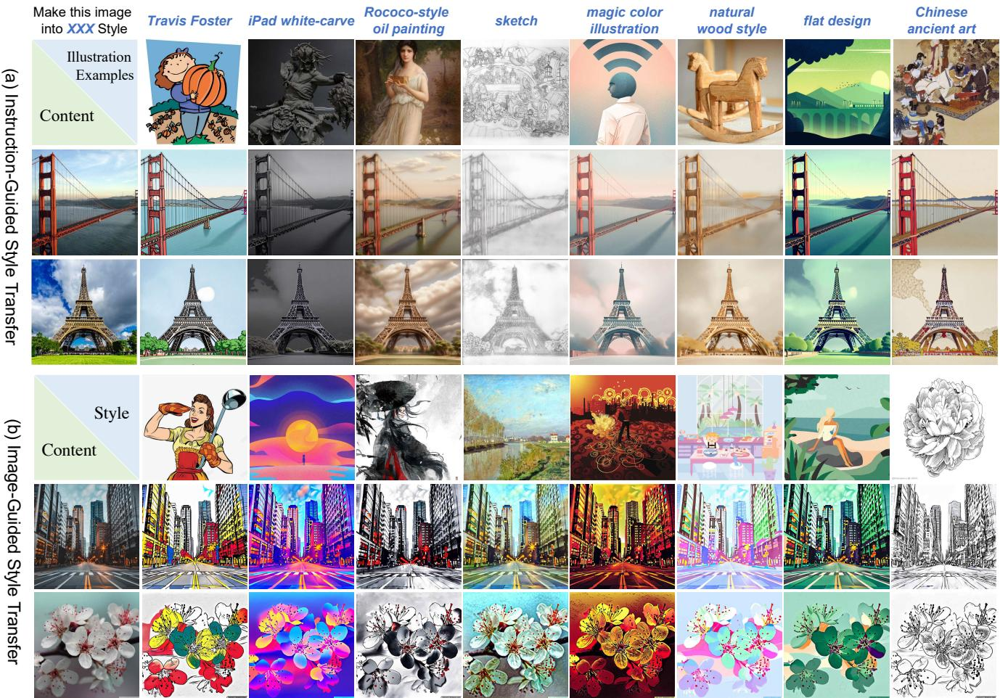
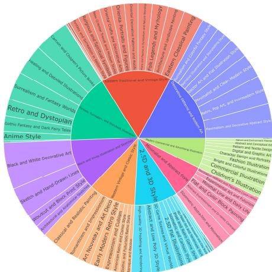
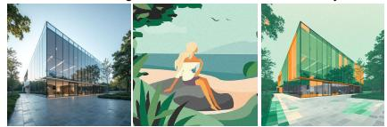
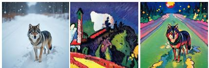
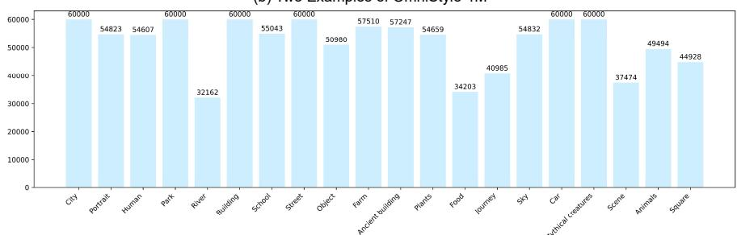
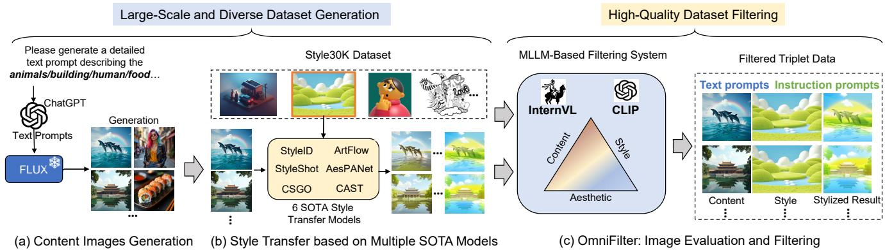
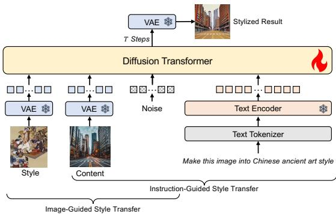
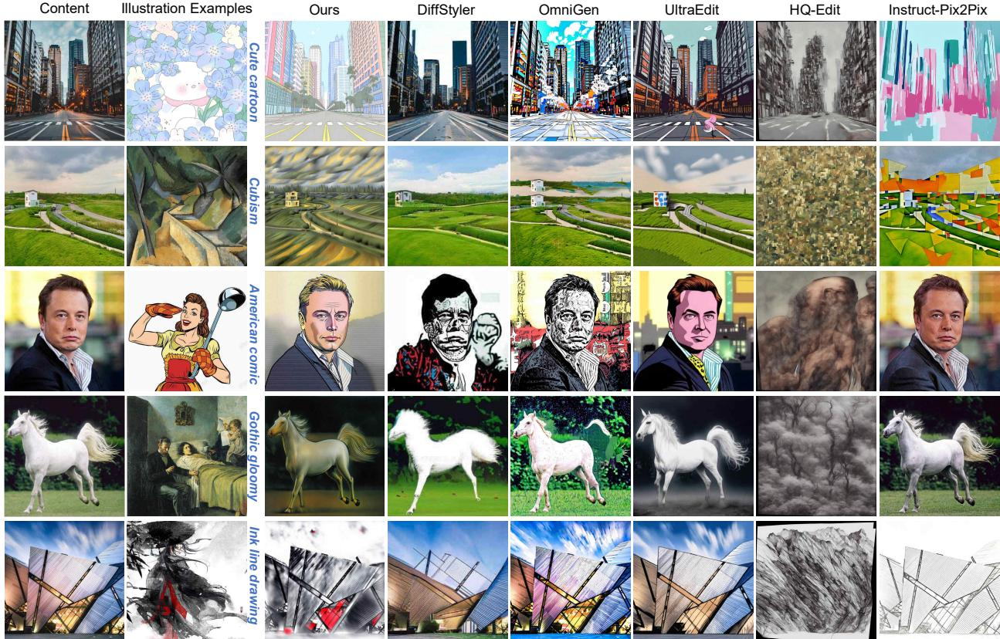
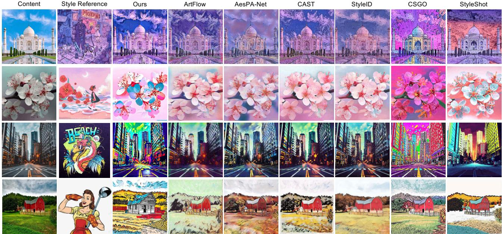

# OmniStyle: Filtering High Quality Style Transfer Data at Scale

Ye Wang1 Ruiqi Liu1 Jiang Lin2 Fei Liu3 Zili Yi2 Yilin Wang4\* Rui Ma1,5\* 1Jilin University 2Nanjing University 3ByteDance 4Adobe 5Engineering Research Center of Knowledge-Driven Human-Machine Intelligence, MOE, China

  
Figure 1. OmniStyle enables high-quality (a) instruction-guided style transfer and (b) reference image-guided style transfer, covering a diverse range of styles, including but not limited to comics, vector art, oil painting, sketch, and Chinese ancient art. Note that in (a), a style image of the style descriptions is provided for illustration, and our method only takes a text instruction and a content image as input. In (b), results are generated in a traditional manner of style transfer, in which the model takes both the content and style images as input.

## Abstract

In this paper, we introduce OmniStyle-1M, a large-scale paired style transfer dataset comprising over one million content-style-stylized image triplets across 1,000 diverse style categories, each enhanced with textual descriptions and instruction prompts. We show that OmniStyle-1M can not only enable efficient and scalable of style transfer models through supervised training but also facilitate precise control over target stylization. Especially, to ensure the quality of the dataset, we introduce OmniFilter, a comprehensive style transfer quality assessment framework, which filters high-quality triplets based on content preservation, style consistency, and aesthetic appeal. Building upon this foundation, we propose OmniStyle, a framework based on the Diffusion Transformer (DiT) architecture designed for high-quality and efficient style transfer. This framework supports both instruction-guided and imageguided style transfer, generating high resolution outputs with exceptional detail. Extensive qualitative and quantitative evaluations demonstrate OmniStyle’s superior performance compared to existing approaches, highlighting its efficiency and versatility. OmniStyle-1M and its accompanying methodologies provide a significant contribution to advancing high-quality style transfer, offering a valuable resource for the research community.

## 1. Introduction

Style transfer [9], the process of altering the artistic style of an image while preserving its content, has gained significant attention due to its creative potential across various domains, including digital art, advertising and fashion design. This technique has evolved rapidly, progressing from early optimization-based methods [9, 10, 18] to recent diffusionbased approaches [17, 32, 34, 35, 39].

While existing methods have shown promising results in transferring styles from reference images to content images, limitations remain in handling truly arbitrary styles. For instance, methods such as [9, 13, 16, 18, 20] focus on styles found in traditional artworks, such as oil painting, watercolor and sketches, while more recent methods [23, 29, 32, 46, 47] expand style transfer to include diverse styles like photography, cartoons, and illustrations. However, these methods still lack the generalization capability to handle truly arbitrary styles. Additionally, since many of these approaches rely on unsupervised training, they often lack control over the stylization process, e.g., unpredictable artifacts and distortion in stylized images. Moreover, due to the lack of large-scale, high-quality paired datasets, many methods are forced to adopt non-end-to-end architectures, such as optimization-based approaches [9, 10, 18] and recent inversion-based techniques [29, 32, 46, 47]. These methods are computationally intensive, often requiring hundreds or even thousands of iterations to capture a specific style, or relying on inverting the content image and transferring style features within intermediate diffusion U-net blocks. These challenges substantially limit the efficiency and practicality of current methods for real-world applications.

To address these challenges, we first introduce OmniStyle-1M, a large scale and high quality dataset which contains one million content-style-stylized image triplets across 1,000 distinct style categories, each enriched with detailed textual descriptions and instructional prompts. Specifically, we first generate content images in 20 categories using FLUX [1] and then select 1,000 style images from diverse categories within the Style30K dataset [19]. Then, we employ six state-of-the-art (SOTA) style transfer models to produce stylized results, ensuring a broad range of data sources and stylized results. Further details on the dataset are provided in Section 3.

A paired dataset provides well-defined target styles for each content image, enabling models to generate stylized images with greater consistency and predictability. To control style transfer outputs, we introduce OmniFilter, a multi-dimensional quality assessment and filtering framework based on CLIP [28] and a Multimodal Large Language Model (MLLM) [5], tailored for customizing the OmniStyle-1M dataset. OmniFilter comprehensively evaluates image quality across three key dimensions: content preservation, ensuring that the original structure and semantics of the content image are retained; style consistency, guaranteeing alignment between the transferred and reference styles; and aesthetic appeal, ensuring that the output is visually engaging.

Leveraging the high-quality, diverse data filtered by OmniFilter, we present OmniStyle, an end-to-end framework for high-quality and efficient style transfer based on the Diffusion Transformer (DiT) architecture [1, 26, 38, 50]. OmniStyle supports both instruction-guided and image-guided style transfer tasks, generating rich, detailed results at high resolution. Experimental results demonstrate that our model achieves superior performance compared to existing style transfer methods. Our contributions are follows:

• We propose OmniStyle-1M, the first million-level paired style transfer dataset, containing 1,000 style categories, along with a rich collection of textual and instruction prompt data. Such data paves a way for research community on enhancing supervised model training, controlling predictable stylized results and handling more diverse style references.

• We propose OmniFilter, a specialized stylization-driven framework for assessing and filtering high-quality stylized images. OmniFilter evaluates images based on content preservation, style consistency, and aesthetic appeal, allowing models to learn from explicitly filtered highquality examples for effective style transfer.

• We propose OmniStyle, an efficient, flexible, simple feed-forward style transfer framework, which can serve as a strong baseline for future style transfer research and is adaptable for real-world applications through further model distillation.

## 2. Related Work

Style Transfer. Style transfer has evolved from early handcrafted feature-based methods [33, 43] to optimizationdriven approaches [9, 10, 18], followed by arbitrary style transfer models [7, 13, 20, 21, 44], and more recently, diffusion-based methods [6, 15, 17, 32, 34, 35, 39, 40, 47], which achieve superior performance through tuning-based [37, 46, 47] and tuning-free [17, 27, 34, 35, 39] strategies. However, these methods are often computationally expensive and time-consuming due to the need for extensive iterative optimization or the introduction of additional DDIM inversion, making them impractical for large-scale or real-time use. Additionally, many models lack flexibility, as they are typically designed for either image-guided or text-guided transfer, restricting their versatility in multitask scenarios. In this paper, we address these limitations by introducing OmniStyle-1M, a high-quality, large-scale dataset that supports the training of an end-to-end, efficient style transfer framework capable of handling diverse style transfer tasks with improved flexibility.

Table 1. Comparison of style-related datasets. X denotes ‘not included’, ✓ denotes ‘few included’ and ✓ denotes ‘included’.
<table><tr><td rowspan="2">Datasets</td><td rowspan="2">Main Task</td><td rowspan="2">Triplet Components</td><td colspan="2">style</td><td rowspan="2">Style Category Number</td><td rowspan="2">Prompt Category</td><td rowspan="2">Triplet Number</td></tr><tr><td>content</td><td>stylized</td></tr><tr><td>EditBench [36]</td><td>Image Editing</td><td>√</td><td>X</td><td>√</td><td></td><td>Instruction</td><td></td></tr><tr><td>MagicBrush [42]</td><td>Image Editing</td><td>√</td><td>X</td><td>√</td><td></td><td>Instruction</td><td></td></tr><tr><td>HQ-Edit [14]</td><td>Image Editing</td><td>√</td><td>X</td><td>√</td><td></td><td>Instruction</td><td></td></tr><tr><td>UltraEdit [49]</td><td>Image Editing</td><td>√</td><td>X</td><td>√</td><td></td><td>Instruction</td><td></td></tr><tr><td>InstructPix2Pix [4]</td><td>Image Editing</td><td>√</td><td>X</td><td>√</td><td></td><td>Instruction</td><td></td></tr><tr><td>Style30K [19]</td><td>Style-Related</td><td>X</td><td>√</td><td>X</td><td>1,120</td><td>Style Category</td><td>30K (Only Style Images)</td></tr><tr><td>WikiArt [30]</td><td>Style-Related</td><td>X</td><td>√</td><td>X</td><td>27</td><td>Style Category</td><td>57K (Only Style Images)</td></tr><tr><td>ArtBench [22]</td><td>Style-Related</td><td>X</td><td>√</td><td>X</td><td>10</td><td>Style Category</td><td>60K (Only Style Images)</td></tr><tr><td>IMAGStyle [39]</td><td>Style-Related</td><td>√</td><td>√</td><td>√</td><td>14</td><td>Text, Image</td><td>210K</td></tr><tr><td>OmniStyle-1M</td><td>Style-Related</td><td>√</td><td>√</td><td>√</td><td>1000</td><td>Text, Image, Instruction</td><td>1M</td></tr></table>

Style-Related Datasets. Table 1 compares various stylerelated image editing datasets. The first category represents image editing task datasets, such as UltraEdit [49], which only include a small number of content-stylized pairings and limited textual instructions, making it inadequate for handling a wide variety of style categories. The second category refers to datasets that only include style images, such as Style30K [19], which covers 1,120 fine-grained style categories. However, due to the lack of paired data, this dataset can only facilitate style-guided text-to-image generation and cannot support style transfer tasks. IMAGStyle [39] and our OmniStyle-1M are the only two datasets that contain triplet data. Compared to IMAGStyle, OmniStyle-1M has several advantages: 1) OmniStyle-1M contains 1,000 fine-grained style categories, far surpassing the 14 categories in IMAGStyle; 2) OmniStyle-1M is derived from six SOTA models, ensuring diverse data sources, whereas IMAGStyle relies solely on B-LoRA [8] for data generation, limiting its diversity; 3) Our dataset consists of over 1 million triplet data points, five times the size of IMAGStyle. In summary, OmniStyle-1M offers a more comprehensive and diverse dataset compared to existing ones, making it more suitable for advancing style transfer research and applications.

## 3. OmniStyle-1M

We start with an overview of OmniStyle-1M in Section 3.1, followed by a detailed explanation of the data curation process in Section 3.2. Next, we introduce OmniFilter, our MLLM-based data evaluation and filtering framework, in Section 3.3.

## 3.1. Dataset Overview

OmniStyle-1M represents the first large-scale content-stylestylized image triplets dataset created specifically for style transfer tasks. As depicted in Figure 2.a, it features 1,000 distinct and fine-grained style categories, e.g., American comics, Eastern art, vector art, line drawings, sketches, cartoons, and intricate paintings. Additionally, as shown in Figure 2.c, OmniStyle-1M spans 20 different content image categories, covering cityscapes, parks, humans, animals, plants, scenes, objects, food, and more. The dataset maintains a balanced distribution of stylized images across these content categories, effectively avoiding severe longtail distribution issues. Figure 2.b further illustrates two triplet examples, each comprising a content image, a style image, and a stylized result image, alongside two unique prompt texts and instructions. The following section details the dataset’s curation process.

## 3.2. Dataset Curation

Our dataset curation pipeline is illustrated on the left side of Figure 3. It consists of two main stages: generation of content images and style transfer using multiple state-ofthe-art models to obtain stylized images.

Content Image Generation. As shown in Figure 3.a, we utilize FLUX [1] and ChatGPT [2] to generate a diverse set of content images. We begin by defining 20 common content categories (see Figure 2.c) and then use ChatGPT to automatically generate extensive textual prompts for each category. The template for querying follows the format “Please generate a detailed text prompt describing [category],” where “category” is replaced by specific topics such as animals, architecture, humans, and so forth. We generate 100 prompts per category, resulting in a dataset of

A high-tech research center in the style of modern retro illustration. Make this image into modern retro illustration style.  
  
A lone wolf leaves deep footprints in the snow in Expressionism Transform this image into Expressionism style.

(b) Two Examples of OmniStyle-1M  
(a) Distribution of Style Category in OmniStyle-1M  
  
(c) Distribution of Stylized Images by Content Category

Figure 2. Overview of OmniStyle-1M. (a) The inner ring represents the eight primary categories, while the outer ring corresponds to specific fine-grained classifications, illustrating the extensive diversity of style categories within our dataset. (b) Two examples of triplets are shown, each includes a content image, a style image, a stylized output, a corresponding textual description, and an instructional prompt. (c) Distribution of stylized results across different content categories.

2,000 prompts in total. These prompts are then input into FLUX [1] to produce high-quality content images with rich details without copyright issues. Ultimately, this process yields 2,000 unique and detailed images, each corresponding to its specific category. To ensure diversity and realism, prompts are designed to encompass a wide range of subtopics within each category. For example, the “animals” category includes various animal types in different environments and poses, while the “architecture” category covers modern, classical, and abstract structures. This approach ensures that the generated dataset is comprehensive and unbiased.

Stylized Image Generation. Building on the generated high-quality content images, we move to the stylization phase, as illustrated in Figure 3.b. Unlike IMAGStyle [39], which solely relies on B-LoRA [8] for data generation, our pipeline integrates six advanced style transfer models: StyleID [6], ArtFlow [3], StyleShot [17], AesPANet [11], CSGO [39], and CAST [45]. This diverse selection enhances the variety and richness of the generated data. We curate a set of 1,000 style images from various categories within the Style30K [19] dataset, ensuring coverage of a broad range of styles. For each content image, we randomly select 100 style images from this set and apply style transfer using each of the six models individually. This approach ensures that every content image undergoes six unique stylizations, spanning a wide variety of styles and addressing the limitations of single-source data generation. As a result, we produce OmniStyle-1M, a dataset containing one million stylized image triplets.

## 3.3. OmniFilter

To further control the style transfer output, we design OmniFilter to identify and extract high-quality stylized triplets from the OmniStyle-1M dataset. As shown in Figure 3.c, by assessing each triplet based on three key criteria: content preservation, style consistency, and aesthetic appeal. OmniFilter ensures that only the highest-quality triplets are selected. This process enhances the dataset’s quality for downstream style transfer tasks.

Content Preservation Evaluation. We evaluate content preservation between the stylized and content images from two main perspectives: semantic consistency and structural integrity. Semantic consistency measures the alignment of high-level semantic content between the stylized image and the content image, ensuring that key subjects and important objects remain identifiable after stylization. Structural integrity assesses the preservation of spatial layout and geometric features, determining whether the stylization maintains the essential structure of the image, thereby preserving the overall visual composition.

For semantic consistency, we use the CLIP [28] imagetext similarity score, which compares the stylized image to the content image’s caption. The caption provides a detailed description of key semantic elements, and the similarity score is treated as the measure of semantic consistency. Since CLIP [28] is not suitable for evaluating structural preservation, we instead use the self-supervised model DI-NOv2 [25]. By extracting embeddings from both the stylized and content images using DINOv2 [25], we compute the similarity between these embeddings to obtain the structural preservation score. Finally, we combine the semantic consistency score, $S _ { \mathrm { s e m a n t i c } }$ , and the structural preservation score, $S _ { \mathrm { s t r u c t u r a l } } .$ , to calculate the overall content preservation score $C _ { \mathrm { s c o r e } } { \mathrm { : } }$

  
Figure 3. Overview of our dataset creation and filtering pipeline. (a) Content Image Generation: We utilize ChatGPT to automatically generate textual descriptions across 20 categories (e.g., animals, architecture, humans, food) and generate corresponding images using the FLUX model. (b) Style Transfer: Style images are randomly sampled from the Style30K dataset, and six SOTA style transfer models are applied to generate a large and diverse dataset of one million triplets. (c) OmniFilter: Stylized images are filtered based on content consistency, style preservation, and aesthetic appeal to ensure high-quality, visually cohesive results.

$$
C _ { \mathrm { s c o r e } } = \alpha \cdot S _ { \mathrm { s e m a n t i c } } + ( 1 - \alpha ) \cdot S _ { \mathrm { s t r u c t u r a l } } ,\tag{1}
$$

where α is a weighting factor that controls the balance between the two scores, and α is set to 0.5.

Style Consistency Evaluation. Evaluating style consistency is inherently challenging due to its subjective and abstract nature. Different individuals may perceive the same style in varying ways, and styles often comprise multiple visual components that are difficult to quantify, making objective assessments more complex. While existing metrics like style loss can measure style similarity in specific scenarios, they often lack the robustness required to capture the full range and intricacies of different styles. To address this challenge, we employ a self-supervised learning approach to assess style consistency scores. Specifically, we use the publicly available Style30K [19] dataset, where images from the same style are treated as positive sample pairs and those from different styles as negative pairs. Through contrastive learning, we fine-tune the CLIP [28] image encoder, which allows images of the same style to group together in the feature space, while images from different styles are effectively separated. This fine-tuned CLIP [28] encoder can then compute a style consistency score $S _ { s c o r e }$ by evaluating the similarity between the embeddings of two styles.

Aesthetic Appeal Evaluation. Aesthetic appeal is a vital aspect in the evaluation of stylized images, as it directly influences users’ visual experience and emotional response. However, many existing evaluation methods [17, 39] fail to adequately address this dimension. Recent work by ViPer [31] emphasizes the significant role of visual attributes in shaping individual aesthetic preferences. Builing upon it, we introduce a novel approach for aesthetic evaluation that leverages the InternVL2 [5] model based on multimodal visual attribute features.

We first define 40 key visual attributes essential for assessing aesthetic quality, such as composition, balance, color harmony, lighting, contrast, and saturation, etc. Using these attributes, we design query prompts to enable InternVL2 [5] to describe the visual attributes of each image, generating attribute-based textual captions. We use two key datasets for training and evaluation: the AVA dataset [24], which contains natural images with aesthetic scores, and the BAID dataset [41], which focuses on artistic images rated for aesthetic appeal. After extracting the visual attribute descriptions for each image, we train the model to predict aesthetic scores based on both the image features and their corresponding visual attribute captions, utilizing ground-truth aesthetic scores to minimize MSE loss.

Specifically, we employ InternVL-G [5] to extract the image features and their associated attribute textual description features. These features are then concatenated and passed through an MLP projection layer to perform the aesthetic appeal scoring $A _ { s c o r e }$ The training process begins with the AVA dataset [24], followed by fine-tuning on the BAID dataset [41]. This fine-tuning step bridges the domain gap between natural and stylized images, enabling the model to better assess aesthetic appeal in stylized images.

Data Filtering. For each content-style image pair, we generated six stylized outputs using six different state-of-the-art style transfer models. For each output, we calculated scores across content, style, and aesthetic dimensions, and combined these scores to get a total score for each output. The combined score is calculated as follows:

$$
S c o r e = a \cdot C _ { \mathrm { s c o r e } } + b \cdot S _ { \mathrm { s c o r e } } + c \cdot A _ { \mathrm { s c o r e } } ,\tag{2}
$$

where $a ~ = ~ 0 . 2 , ~ b ~ = ~ 0 . 6 .$ , and $c \ = \ 0 . 2 .$ . The output with the highest total score among the six was selected as the final sample. This filtering yielded a high-quality subsets: OmniStyle-150K with 150K triplets across 1,000 categories. These high-quality data subsets provide robust support for our model training.

  
Figure 4. The architecture of OmniStyle.

## 4. OmniStyle

## 4.1. Architecture

As shown in Figure 4, OmniStyle is a style transfer framework based on the FLUX-dev [1] model, capable of supporting high-quality style transfer tasks guided by either instructions or reference images. Specifically, for referenceguided style transfer, we employ VAE to extract continuous visual features from both the style and content images. These features are then spatially concatenated with noisy latents and text tokens before being fed into MM-DiT. Additionally, different positional encodings are applied separately to the style and content features. For instructionguided style transfer, the content feature sequence is treated as text tokens and spatially concatenated with the extracted text tokens and noisy latents. To distinguish content features, special tags [img] and [/img] are assigned within the sequence. Similarly, for reference-based style transfer, the image sequences are marked with [img1][/img1] and [img2][/img2] to distinguishes style and content images.

## 4.2. Implementation Details

Our model is trained on 8 × NVIDIA H100 GPUs, with a batch size of 1 per GPU and a learning rate of 1e-4. As shown in Figure 4, only the diffusion transformer is finetuned with style transfer dataset while all other components are kept as frozen. We apply random cropping and horizontal flipping to the input style image to improve the robustness for style learning.

## 5. Experiments

Evaluation Benchmark. For a comprehensive evaluation, we develop a unified benchmark for image-guided and instruction-guided style transfer tasks, which includes 20 content images and 100 style images, resulting in a total of 2000 stylized images. For the image-guided task, the 100 style images were directly applied to generate stylized results. In the instruction-guided style transfer task, the style images were replaced with corresponding instruction prompts to guide the model to perform stylization. We hope this benchmark will serve as a standard for evaluating future style transfer methods and advancing the field.

Table 2. Quantitative comparison with respect to the SOTA meth ods on instruction-guided style transfer.
<table><tr><td>Method</td><td>Content</td><td>Style Preservation ↑ Consistency ↑</td><td>Aesthetic Appeal ↑</td><td>Style Loss ↓</td></tr><tr><td>InstructPix2Pix [4]</td><td>0.4848</td><td>0.4965</td><td>5.7446</td><td>0.3829</td></tr><tr><td>HQ-Edit [14]</td><td>0.4508</td><td>0.2254</td><td>5.7777</td><td>0.3108</td></tr><tr><td>UltraEdit [49]</td><td>0.4906</td><td>0.5087</td><td>5.6351</td><td>0.3432</td></tr><tr><td>OmniGen [49]</td><td>0.4918</td><td>0.5487</td><td>5.6717</td><td>0.6272</td></tr><tr><td>DiffStyler [12]</td><td>0.4816</td><td>0.5127</td><td>5.4551</td><td>0.4256</td></tr><tr><td>OmniStyle</td><td>0.5128</td><td>0.6441</td><td>5.7512</td><td>0.2873</td></tr></table>

Evaluation Metrics. We use OmniFilter as a evaluation tool to assess the quality of stylization produced by different methods. Specifically, we employ three key metrics: content preservation score, style consistency score, and aesthetic appeal score, to evaluate the results. Additionally, style loss is utilized to help assess style consistency.

## Comparison Methods.

• Instruction-guided style transfer: we evaluated our approach against four instruction-based image editing methods, including InstructPix2Pix [4], HQ-Edit [14], UltraEdit [49], and OmniGen [38], as well as a text-guided style transfer method, DiffStyler [12].

• Image-guided style transfer: we compared our approach with seven SOTA methods, including ArtBank[48], StyleID [6], ArtFlow [3], StyleShot [17], AesPANet [11], CSGO [39], and CAST [45].

## 5.1. Quantitative Experiments

Instruction-Guided Style Transfer. As shown in Table 2, when compared to SOTA instruction-guided image editing methods, such as InstructPix2Pix, HQ-Edit, UltraEdit, and OmniGen, OmniStyle achieves the highest content preservation score (0.5128) and style consistency (0.6441), indicating its stronger ability to maintain content and style consistently. It also outperforms these methods in style loss (0.2873), demonstrating better style fidelity. In terms of aesthetic appeal, OmniStyle (5.7512) is competitive with HQ-Edit (5.7777), showcasing its ability to generate highquality, visually appealing results. In comparison with Diff-Styler, a leading text-guided style transfer method, OmniStyle excels in content preservation (0.5128 vs. 0.4816), style consistency (0.6441 vs. 0.5127), and style loss (0.2873 vs. 0.4256), while also achieving a higher aesthetic appeal (5.7512 vs. 5.4551). These results highlight OmniStyle’s effectiveness in the instruction-guided style transfer task, surpassing existing methods.

  
Figure 5. Qualitative comparison with other state-of-the-art methods for the instruction-guided style transfer task. For clarity, the style images and style categories are placed on the right side of the content images for reference.

Table 3. Quantitative comparison with respect to the SOTA methods for the image-guided style transfer.
<table><tr><td rowspan="2">Method</td><td>Content</td><td>Style</td><td>Aesthetic</td><td>Style</td></tr><tr><td></td><td>Preservation ↑ Consistency ↑ Appeal ↑</td><td></td><td>Loss ↓</td></tr><tr><td>ArtFlow [3]</td><td>0.5184</td><td>0.6904</td><td>5.1220</td><td>0.1289</td></tr><tr><td>AesPANet [11]</td><td>0.5665</td><td>0.6818</td><td>5.2117</td><td>0.1128</td></tr><tr><td>CAST [45]</td><td>0.6165</td><td>0.6770</td><td>5.4561</td><td>0.1428</td></tr><tr><td>StyleID [6]</td><td>0.5121</td><td>0.6564</td><td>5.3531</td><td>0.1315</td></tr><tr><td>CSGO [39]</td><td>0.5067</td><td>0.7251</td><td>5.7712</td><td>0.3727</td></tr><tr><td>StyleShot [17]</td><td>0.5410</td><td>0.7347</td><td>5.7818</td><td>0.1500</td></tr><tr><td>ArtBank [48] OmniStyle</td><td>0.3490 0.5450</td><td>0.7163 0.7483</td><td>5.4980 5.7913</td><td>0.1208 0.1086</td></tr></table>

Image-Guided Style Transfer. As shown in Table 3, OmniStyle outperforms existing SOTA methods for the imageguided style transfer task, particularly in terms of style consistency, aesthetic appeal, and style loss. It achieves the highest style consistency score (0.7483) and aesthetic appeal score (5.7913), surpassing methods such as StyleShot (0.7347, 5.7818) and CSGO (0.7251, 5.7712). Furthermore, OmniStyle leads in style loss with the lowest score (0.1086), demonstrating superior style fidelity.

## 5.2. Qualitative Experiments

Instruction-Guided Style Transfer. As shown in Figure 5, we conducted a comprehensive comparison with five

SOTA methods across multiple style categories. Current text-guided style transfer methods, such as DiffStyler, are limited in their ability to handle diverse style categories. For instance, DiffStyler struggles with fine-grained styles, such as American comic, and may fail to preserve the original content, as seen with images like Elon Musk. On the other hand, instruction-guided image editing methods, represented by OmniGen and UltraEdit, are also constrained in style transfer tasks. These methods cannot fully understand fine-grained style information, which can lead to significant content alterations (e.g., HQ-Edit) or insufficient stylization (e.g., OmniGen, UltraEdit). In contrast, OmniStyle benefits from training on a large-scale, high-quality dataset of stylized triplets, allowing it to learn rich, fine-grained style information. As a result, OmniStyle is better equipped to handle a broader range of style categories and produce more accurate and consistent results.

Image-Guided Style Transfer. As shown in Figure 6, we performed a comprehensive comparison with six SOTA image-guided style transfer methods. In comparison, OmniStyle demonstrates superior style preservation (see row 3), enhanced aesthetic appeal (see row 4), and better content preservation (see row 1). More results are provided in supplementary materials.

<table><tr><td>Methods/Metrics OmniStyle DiffStyler HQ-Edit UltraEdit Instruct-Pix2Pix OmniGen</td><td></td><td></td><td></td><td></td><td></td><td></td></tr><tr><td>Rank 1</td><td>86.90%</td><td>1.19%</td><td>0.40%</td><td>5.16%</td><td>1.19%</td><td>5.16%</td></tr><tr><td>Table 5. The user study for image-guided style transfer tasks.</td><td></td><td></td><td></td><td></td><td></td><td></td></tr><tr><td>Methods/Metrics OmniStyle ArtFlow AesPA-Net</td><td></td><td></td><td></td><td>CAST</td><td>StyleID</td><td>CSGO StyleShot</td></tr><tr><td>Rank 1</td><td>41.22%</td><td>2.87%</td><td>3.94%</td><td></td><td>10.75% 7.89% 14.70% 18.63%</td><td></td></tr></table>

  
Figure 6. Qualitative comparison with other state-of-the-art methods for the image-guided style transfer task.  
Table 4. The user study for instruction-guided style transfer tasks.

## 5.3. User Study

We conducted a user study to evaluate the effectiveness of our method in instruction-guided and image-guided style transfer tasks. Participants were asked to rank their top three preferred results based on the following criteria: (1) Style Preservation, the degree to which the generated image retains the stylistic characteristics of the given style image; (2) Content Preservation, how well the structural details of the content image are maintained; (3) Aesthetic Appeal, the overall visual quality of the generated image. To reduce bias, options were presented in a randomized order, and participants were allowed to zoom in for closer inspection. A total of 1,800 votes were collected from 30 participants. As demonstrated in Table 4 and Table 5, we computed the proportion of first-place rankings (Rank 1). These results highlight that the stylized images generated by our method were preferred by users, showcasing its superior performance in style transfer. More detailed results and analyses are provided in the supplementary material.

## 6. Conclusion

In this paper, we addressed key limitations in style transfer by introducing OmniStyle-1M, a large-scale, high-quality dataset of one million content-style-stylized image triplets across 1,000 style categories. This paired dataset, enriched with detailed prompts and descriptions, enables models to achieve more controlled, consistent, and diverse style transfer outcomes, moving beyond the limitations of arbitrary style transfer. To ensure the quality of stylized outputs, we proposed OmniFilter, which is designed to assess and filter images based on content preservation, style consistency, and aesthetic appeal. This filtering process ensures that OmniStyle-1M serves as a robust basis for training high-quality style transfer models. Last, we introduced OmniStyle, an end-to-end style transfer framework based on the DiT architecture. OmniStyle supports both instruction-guided and image-guided tasks, achieving highresolution and detailed stylizations. Through extensive experiments, we demonstrated that OmniStyle outperforms existing methods in both quality and efficiency, establishing it as a strong baseline for future research and real-world applications. Together, OmniStyle-1M, OmniFilter, and OmniStyle lay a comprehensive foundation for advancing style transfer, contributing valuable resources and methodologies for the research community.

In the future, a potential direction is to collaborate with professional artist to annotate perfect paired dataset within OmniStyle-1M dataset. Such perfect paired datasets provide a reference “ground truth” stylized image for each content-style pair, which allows for more objective evaluation of a model’s performance. With paired data, metrics like perceptual similarity or content preservation can be accurately measured by comparing generated images to the target, helping to assess style accuracy and consistency more rigorously.

## Acknowledgments

This work was supported in part by the National Natural Science Foundation of China (No. 62202199, 62406134), the Suzhou Key Technologies Project (No. SYG2024136) and the Fundamental Research Funds for the Central Universities.

## References

[1] Flux. https : / / github . com / black - forest - labs/flux. 2, 3, 4, 6

[2] chatgpt. https://openai.com/chatgpt. 3

[3] Jie An, Siyu Huang, Yibing Song, Dejing Dou, Wei Liu, and Jiebo Luo. Artflow: Unbiased image style transfer via reversible neural flows. In CVPR, 2021. 4, 6, 7

[4] Tim Brooks, Aleksander Holynski, and Alexei A Efros. Instructpix2pix: Learning to follow image editing instructions. arXiv:2211.09800, 2022. 3, 6

[5] Zhe Chen, Jiannan Wu, Wenhai Wang, Weijie Su, Guo Chen, Sen Xing, Muyan Zhong, Qinglong Zhang, Xizhou Zhu, Lewei Lu, Bin Li, Ping Luo, Tong Lu, Yu Qiao, and Jifeng Dai. Internvl: Scaling up vision foundation models and aligning for generic visual-linguistic tasks. arXiv:2312.14238, 2023. 2, 5

[6] Jiwoo Chung, Sangeek Hyun, and Jae-Pil Heo. Style injection in diffusion: A training-free approach for adapting largescale diffusion models for style transfer. In CVPR, pages 8795–8805, 2024. 3, 4, 6, 7

[7] Yingying Deng, Fan Tang, Weiming Dong, Wen Sun, Feiyue Huang, and Changsheng Xu. Arbitrary style transfer via multi-adaptation network. In ACM MM, pages 2719–2727, 2020. 2

[8] Yarden Frenkel, Yael Vinker, Ariel Shamir, and Daniel Cohen-Or. Implicit style-content separation using b-lora. arXiv:2403.14572, 2024. 3, 4

[9] Leon A Gatys, Alexander S Ecker, and Matthias Bethge. Image style transfer using convolutional neural networks. In ECCV, pages 2414–2423, 2016. 2

[10] Leon A Gatys, Alexander S Ecker, Matthias Bethge, Aaron Hertzmann, and Eli Shechtman. Controlling perceptual factors in neural style transfer. In CVPR, pages 3985–3993, 2017. 2

[11] Kibeom Hong, Seogkyu Jeon, Junsoo Lee, Namhyuk Ahn, Kunhee Kim, Pilhyeon Lee, Daesik Kim, Youngjung Uh, and Hyeran Byun. Aespa-net: Aesthetic pattern-aware style transfer networks. In ICCV, pages 22758–22767, 2023. 4, 6, 7

[12] Nisha Huang, Yuxin Zhang, Fan Tang, Chongyang Ma, Haibin Huang, Weiming Dong, and Changsheng Xu. Diffstyler: Controllable dual diffusion for text-driven image stylization. TNNLS, 2024. 6

[13] Xun Huang and Serge Belongie. Arbitrary style transfer in real-time with adaptive instance normalization. In ICCV, pages 1501–1510, 2017. 2

[14] Mude Hui, Siwei Yang, Bingchen Zhao, Yichun Shi, Heng Wang, Peng Wang, Yuyin Zhou, and Cihang Xie. Hq-edit:

A high-quality dataset for instruction-based image editing. arXiv:2404.09990, 2024. 3, 6

[15] Jaeseok Jeong, Mingi Kwon, and Youngjung Uh. Training free style transfer emerges from h-space in diffusion models. arXiv:2303.15403, 3, 2023. 3

[16] Justin Johnson, Alexandre Alahi, and Li Fei-Fei. Perceptual losses for real-time style transfer and super-resolution. In ECCV, pages 694–711. Springer, 2016. 2

[17] Gao Junyao, Liu Yanchen, Sun Yanan, Tang Yinhao, Zeng Yanhong, Chen Kai, and Zhao Cairong. Styleshot: A snapshot on any style. arxiv:2407.01414, 2024. 2, 3, 4, 5, 6, 7

[18] Nicholas Kolkin, Jason Salavon, and Gregory Shakhnarovich. Style transfer by relaxed optimal transport and self-similarity. In CVPR, pages 10051–10060, 2019. 2

[19] Wen Li, Muyuan Fang, Cheng Zou, Biao Gong, Ruobing Zheng, Meng Wang, Jingdong Chen, and Ming Yang. Styletokenizer: Defining image style by a single instance for controlling diffusion models. arXiv:2409.02543, 2024. 2, 3, 4, 5

[20] Yijun Li, Chen Fang, Jimei Yang, Zhaowen Wang, Xin Lu, and Ming-Hsuan Yang. Universal style transfer via feature transforms. In NeurIPS, 2017. 2

[21] Jing Liao, Yuan Yao, Lu Yuan, Gang Hua, and Sing Bing Kang. Visual attribute transfer through deep image analogy. arXiv:1705.01088, 2017. 2

[22] Peiyuan Liao, Xiuyu Li, Xihui Liu, and Kurt Keutzer. The artbench dataset: Benchmarking generative models with artworks. arXiv:2206.11404, 2022. 3

[23] Fujun Luan, Sylvain Paris, Eli Shechtman, and Kavita Bala. Deep photo style transfer. In CVPR, pages 4990–4998, 2017. 2

[24] Naila Murray, Luca Marchesotti, and Florent Perronnin. Ava: A large-scale database for aesthetic visual analysis. In CVPR, pages 2408–2415. IEEE, 2012. 5

[25] Maxime Oquab, Timothee Darcet, Theo Moutakanni, Huy V.´ Vo, Marc Szafraniec, Vasil Khalidov, Pierre Fernandez, Daniel Haziza, Francisco Massa, Alaaeldin El-Nouby, Russell Howes, Po-Yao Huang, Hu Xu, Vasu Sharma, Shang-Wen Li, Wojciech Galuba, Mike Rabbat, Mido Assran, Nico las Ballas, Gabriel Synnaeve, Ishan Misra, Herve Jegou, Julien Mairal, Patrick Labatut, Armand Joulin, and Piotr Bojanowski. Dinov2: Learning robust visual features without supervision. arXiv:2304.07193, 2023. 4

[26] William Peebles and Saining Xie. Scalable diffusion models with transformers. In ICCV, pages 4195–4205, 2023. 2

[27] Tianhao Qi, Shancheng Fang, Yanze Wu, Hongtao Xie, Ji awei Liu, Lang Chen, Qian He, and Yongdong Zhang. Deadiff: An efficient stylization diffusion model with disentan gled representations. In CVPR, pages 8693–8702, 2024. 3

[28] Alec Radford, Jong Wook Kim, Chris Hallacy, Aditya Ramesh, Gabriel Goh, Sandhini Agarwal, Girish Sastry, Amanda Askell, Pamela Mishkin, Jack Clark, et al. Learning transferable visual models from natural language supervision. In International conference on machine learning, pages 8748–8763. PMLR, 2021. 2, 4, 5

[29] Nataniel Ruiz, Yuanzhen Li, Varun Jampani, Yael Pritch, Michael Rubinstein, and Kfir Aberman. Dreambooth: Fine tuning text-to-image diffusion models for subject-driven generation. In CVPR, pages 22500–22510, 2023. 2

[30] Babak Saleh and Ahmed Elgammal. Large-scale classification of fine-art paintings: Learning the right metric on the right feature. arXiv:1505.00855, 2015. 3

[31] Sogand Salehi, Mahdi Shafiei, Teresa Yeo, Roman Bachmann, and Amir Zamir. Viper: Visual personalization of generative models via individual preference learning. arXiv:2407.17365, 2024. 5

[32] Kihyuk Sohn, Nataniel Ruiz, Kimin Lee, Daniel Castro Chin, Irina Blok, Huiwen Chang, Jarred Barber, Lu Jiang, Glenn Entis, Yuanzhen Li, et al. Styledrop: Text-to-image generation in any style. arXiv:2306.00983, 2023. 2, 3

[33] Bin Wang, Wenping Wang, Huaiping Yang, and Jiaguang Sun. Efficient example-based painting and synthesis of 2d directional texture. IEEE TVCG, 10(3):266–277, 2004. 2

[34] Haofan Wang, Qixun Wang, Xu Bai, Zekui Qin, and Anthony Chen. Instantstyle: Free lunch towards stylepreserving in text-to-image generation. arXiv:2404.02733, 2024. 2, 3

[35] Haofan Wang, Peng Xing, Renyuan Huang, Hao Ai, Qixun Wang, and Xu Bai. Instantstyle-plus: Style transfer with content-preserving in text-to-image generation. arXiv:2407.00788, 2024. 2, 3

[36] Su Wang, Chitwan Saharia, Ceslee Montgomery, Jordi Pont-Tuset, Shai Noy, Stefano Pellegrini, Yasumasa Onoe, Sarah Laszlo, David J Fleet, Radu Soricut, et al. Imagen editor and editbench: Advancing and evaluating text-guided image inpainting. In CVPR, pages 18359–18369, 2023. 3

[37] Zhizhong Wang, Lei Zhao, and Wei Xing. Stylediffusion: Controllable disentangled style transfer via diffusion models. In ICCV, pages 7677–7689, 2023. 3

[38] Shitao Xiao, Yueze Wang, Junjie Zhou, Huaying Yuan, Xingrun Xing, Ruiran Yan, Shuting Wang, Tiejun Huang, and Zheng Liu. Omnigen: Unified image generation. arXiv:2409.11340, 2024. 2, 6

[39] Peng Xing, Haofan Wang, Yanpeng Sun, Qixun Wang, Xu Bai, Hao Ai, Renyuan Huang, and Zechao Li. Csgo: Content-style composition in text-to-image generation. arXiv 2408.16766, 2024. 2, 3, 4, 5, 6, 7

[40] Youcan Xu, Zhen Wang, Jun Xiao, Wei Liu, and Long Chen. Freetuner: Any subject in any style with training-free diffusion. arXiv:2405.14201, 2024. 3

[41] Ran Yi, Haoyuan Tian, Zhihao Gu, Yu-Kun Lai, and Paul L. Rosin. Towards artistic image aesthetics assessment: A large-scale dataset and a new method. In CVPR, pages 22388–22397, 2023. 5

[42] Kai Zhang, Lingbo Mo, Wenhu Chen, Huan Sun, and Yu Su. Magicbrush: A manually annotated dataset for instructionguided image editing. In NeurIPS, 2023. 3

[43] Wei Zhang, Chen Cao, Shifeng Chen, Jianzhuang Liu, and Xiaoou Tang. Style transfer via image component analysis. IEEE TMM, 15(7):1594–1601, 2013. 2

[44] Yabin Zhang, Minghan Li, Ruihuang Li, Kui Jia, and Lei Zhang. Exact feature distribution matching for arbitrary style

transfer and domain generalization. In CVPR, pages 8035– 8045, 2022. 2

[45] Yuxin Zhang, Fan Tang, Weiming Dong, Haibin Huang, Chongyang Ma, Tong-Yee Lee, and Changsheng Xu. Domain enhanced arbitrary image style transfer via contrastive learning. In SIGGRAPH, 2022. 4, 6, 7

[46] Yuxin Zhang, Weiming Dong, Fan Tang, Nisha Huang, Haibin Huang, Chongyang Ma, Tong-Yee Lee, Oliver Deussen, and Changsheng Xu. Prospect: Expanded condi tioning for the personalization of attribute-aware image gen eration. arXiv:2305.16225, 2023. 2, 3

[47] Yuxin Zhang, Nisha Huang, Fan Tang, Haibin Huang, Chongyang Ma, Weiming Dong, and Changsheng Xu. Inversion-based style transfer with diffusion models. In CVPR, pages 10146–10156, 2023. 2, 3

[48] Zhanjie Zhang, Quanwei Zhang, Wei Xing, Guangyuan Li, Lei Zhao, Jiakai Sun, Zehua Lan, Junsheng Luan, Yiling Huang, and Huaizhong Lin. Artbank: Artistic style transfer with pre-trained diffusion model and implicit style prompt bank. In AAAI, pages 7396–7404, 2024. 6, 7

[49] Haozhe Zhao, Xiaojian Ma, Liang Chen, Shuzheng Si, Ru jie Wu, Kaikai An, Peiyu Yu, Minjia Zhang, Qing Li, and Baobao Chang. Ultraedit: Instruction-based fine-grained im age editing at scale. arXiv:2407.05282, 2024. 3, 6

[50] Chunting Zhou, Lili Yu, Arun Babu, Kushal Tirumala, Michihiro Yasunaga, Leonid Shamis, Jacob Kahn, Xuezhe Ma, Luke Zettlemoyer, and Omer Levy. Transfusion: Predict the next token and diffuse images with one multi-modal model. arXiv:2408.11039, 2024. 2