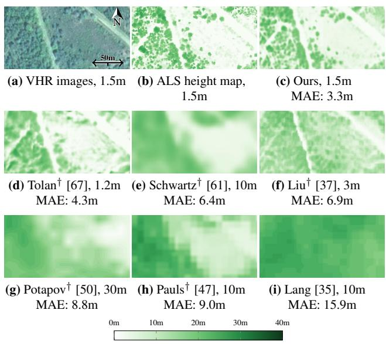

# Open-Canopy: Towards Very High Resolution Forest Monitoring

Fajwel Fogel4 Yohann Perron3,5 Nikola Besic2 Laurent Saint-André7 Agnès Pellissier-Tanon1 Martin Schwartz1 Thomas Boudras1 Ibrahim Fayad1,6 Alexandre d’Aspremont4,6 Loic Landrieu3 Philippe Ciais1 1 LSCE/IPSL, CEA-CNRS-UVSQ 2 LIF, IGN, ENSG 3 LIGM, Ecole des Ponts, IP Paris, CNRS, UGE 4 CNRS & École Normale Supérieure 5 EFEO 6 Kayrros INRAE, BEF

## Abstract

Estimating canopy height and its changes at meter resolution from satellite imagery remains a challenging computer vision task with critical environmental applications. However, the lack of open-access datasets at this resolution hinders the reproducibility and evaluation of models. We introduce Open-Canopy, thefirst open-access, countryscale benchmark for very high-resolution (1.5 m) canopy height estimation, covering over 87,000 km² across France with 1.5 m panchromatic resolution satellite imagery and aerial LiDAR data. Additionally, we present Open-Canopy-∆, a benchmarkfor canopy height reduction detection between images from different years at tree level—a difficult taskfor current computer vision models. We evaluate state-of-the-art architectures on these benchmarks, highlighting significant challenges and opportunities for improvement. Our datasets and code are publicly available at https://github.com/fajwel/Open-Canopy.

## 1. Introduction

Frequent, high-resolution monitoring of canopy height plays a pivotal role in guiding forest management [42, 68], supporting conservation efforts, and informing climate policies in the face of climate change [19, 32, 41]. Meter-level spatial resolutions enable the detection of small vegetation structures, including individual trees and understory vegetation [31], and help identify local disturbances such as selective logging [4, 30]. At the same time, frequent temporal updates allow for the monitoring of rapid changes in forest ecosystems [11, 51] caused by activities such as harvesting [74], illegal logging [34, 65], or wildfires, storms, and pest outbreaks [26]. This fine-grained information is also essential for accurate biomass estimation [63], biodiversity assessments [22], and understanding ecological processes at local scales [36].

Aerial Laser Scanning (ALS) is often described as the gold standard for precise canopy height measurements [3, 21],

Figure 1. Canopy Height Estimation. We represent a VHR image from the Open-Canopy test set (a), alongside its corresponding ALS-derived canopy height (b). We include the height map estimated by a PVPTv2 [71] model trained on the Open-Canopy train set (c), compared against other canopy height products (d)-(i). For each image, we provide the spatial resolution of the evaluated map and its Mean Absolute Error. † the data or model used to generate these maps is not open-access.

but its high cost and logistic requirements make frequent data acquisition impractical. In contrast, satellite images are abundant. A cost-effective alternative to yearly ALS acquisition would be to use existing ALS data to train a machine learning model to estimate canopy height from a single Very High Resolution (VHR) satellite image. Although recent studies have used VHR satellite images to predict canopy height [37, 67, 70] and published global height maps, their data and models are typically not openly accessible. They rely on commercial or closed data sources, require substantial pre-processing, and do not always disclose the location of their training sets (see Tab. 1).

Table 1. Canopy Height Prediction Datasets. We summarize existing forestry datasets by specifying the satellite imagery used, the canopy height ground truth or supervision for training and evaluation, and the number of ground truth (GT) data points (GEDI samples or ALS pixels). We group the datasets by resolution into two categories: Medium-to-High (≥HR) and Very High Resolution (VHR).
<table><tr><td rowspan="2">Dataset</td><td rowspan="2"></td><td colspan="3">access</td><td colspan="2">extent</td><td colspan="2">images</td><td colspan="3">height ground truth</td><td rowspan="2">direct download</td></tr><tr><td>code</td><td>img</td><td>GT</td><td>scope</td><td>surface sensor ×10³ km²</td><td></td><td>res. sensor in m</td><td>res. in m</td><td>samples ×10⁶</td><td>S commercial</td></tr><tr><td rowspan="5">R</td><td>Schwartz [61]</td><td>X</td><td>à ?</td><td></td><td>France</td><td>588</td><td>S1/S2</td><td>10</td><td>GEDI</td><td>25</td><td>90</td><td>complex pre.</td></tr><tr><td>Lang [35]</td><td></td><td></td><td></td><td>Global</td><td>14k S2</td><td></td><td>10 GEDI</td><td>25</td><td>600</td><td>à</td><td>processing</td></tr><tr><td>∧I Potapov [50]</td><td>X</td><td></td><td></td><td>Global</td><td>150k</td><td>Landsat</td><td>30</td><td>GEDI</td><td>25</td><td>372</td><td>special</td></tr><tr><td>Pauls [47]</td><td></td><td>3 à</td><td></td><td>Global</td><td>2621 S1/S2</td><td></td><td>10</td><td>GEDI</td><td>25</td><td>0</td><td>access</td></tr><tr><td>Tolan [67]</td><td>X</td><td>$</td><td></td><td>US</td><td>5.8</td><td>MAXAR</td><td>1.2</td><td>ALS+GEDI 1</td><td></td><td>5800</td><td>no train test split</td></tr><tr><td rowspan="4">VHR</td><td>Wagner [70]</td><td>X</td><td></td><td>US</td><td></td><td>3.8 NAIP</td><td>0.6</td><td>ALS</td><td>1</td><td>3784</td><td></td><td></td></tr><tr><td>Liu [37]</td><td>X</td><td></td><td></td><td>Europe</td><td>700 Planet</td><td></td><td>3 ALS</td><td></td><td>3 77,777</td><td></td><td>S1 Sentinel-1</td></tr><tr><td>Open-Canopy</td><td>V</td><td></td><td></td><td>France</td><td>87</td><td>SPOT 6-7</td><td>1.5 ALS</td><td></td><td>1.5</td><td>38,876</td><td>S2 Sentinel-2</td></tr><tr><td></td><td></td><td></td><td></td><td></td><td></td><td></td><td></td><td></td><td></td><td></td><td></td></tr></table>

Open-Canopy. To enable fair and reproducible evaluation of canopy height prediction, we introduce Open-Canopy, the first entirely open-access benchmark for VHR canopy height estimation. Spanning over 87,000 km2 across France, Open-Canopy combines SPOT 6-7 satellite imagery at 1.5m panchromatic resolution with aerial LiDAR data at densities superior to 10 points/m2, providing a rich dataset for training and evaluating machine learning models. Compared to datasets with similar accessibility [35], Open-Canopy improves the resolution by a factor of 6 for the input images and a factor of 16 for the height supervision. Our dataset is directly downloadable and comes with ready-to-use training splits and data loaders, making forestry research more accessible than ever to computer vision researchers.

Open-Canopy-∆. In contrast to costly ALS measurements, satellite imagery can be obtained annually or more often, enabling the dynamic estimation of canopy height. This capability is especially important for both forest managers and policymakers, illustrated by recent European regulations [10] that restrict the import of products linked to deforestation. To address this need, we introduce Open-Canopy-∆, a subset of Open-Canopy containing two consecutive ALS acquisitions. This dataset allows us to formulate and benchmark the challenging task of detecting dense forest height reductions, i.e. segmenting areas with significant canopy height loss between two VHR satellite images.

Benchmarking Forest Analysis. Although existing studies [35, 37, 47, 50, 61, 70] predominantly evaluate UNettype architectures [57], predicting canopy height from a single image presents a particularly challenging computer vision task that differs from typical natural image analysis settings. The satellite viewpoint deviates from conventional depth estimation scenarios, the inclusion of the crucial near-infrared band complicates the adaptation of RGB-based foundation models, and capturing the intricate relationships between tree radiometry, phylogeny, and allometry is difficult. In this paper, we evaluate a wide range of modern architectures and models, identify their current limitations, and present this task as a newly accessible, high-impact challenge for the computer vision community. Our contributions are as follows:

• Open-Canopy: An open-access dataset for canopy height estimation from VHR images with ALS annotations.

• Open-Canopy-∆: An open-access dataset for segmenting canopy height reduction between two images.

• Benchmark: An evaluation of recent computer vision architectures, foundation models, and forest products for these two tasks.

## 2. Related Work

This section details existing datasets and methods for the problem of canopy height estimation, grouped by annotation type: GEDI or ALS. See Tab. 1 for an exhaustive comparison of Open-Canopy with these datasets.

GEDI-Based Datasets. The Global Ecosystem Dynamics Investigation (GEDI) mission consists of a LiDAR mounted on the ISS and provides global canopy height measurements with a footprint diameter of 25m [16]. GEDI captures a set of spatially discrete full waveform echoes along paths approximately 4km wide. Models trained with GEDI data use it as a sparse and coarse supervisory signal to predict canopy height from medium to high resolution imagery such as Landsat images at 30m resolution (Potapov et al. [50]) or Sentinel-2 at 10m resolution (Schwartz et al. [61], Pauls et al. [47] and Lang et al. [35]). However, GEDI’s full waveform LiDAR can exhibit registration errors of up to 10m [59].

ALS-Based Datasets. Aerial Laser Scanning (ALS) uses low-flying aircraft equipped with LiDAR to create dense 3D point clouds of the Earth’s surface. These systems typically capture data at resolutions ranging from 10 to 60 points per square meter. This data is then rasterized along a high resolution grid, and used to estimate canopy height by subtracting the lowest quantiles height (ground surface) from the height of the highest quantiles (top of canopy). This allows the computation of “true” height maps which are then used to train models to predict canopy height from VHR images, at scales such as 1.2m for Tolan et al. [67] and Wagner et al. [70], and 3m for Liu et al. [37]. Open-Canopy uses ALS data from the LiDAR-HD [28] program rasterized at 1.5m.

Canopy Height Estimation Models. Most canopy height prediction models employ fully supervised UNets [57] for their ease of use. The recent work by Tolan et al. [67] uses a Vision Transformer (ViT) [15] pretrained in a self-supervised fashion [46] on 18 million images without ALS height data. In this paper, we benchmark a variety of modern deep learning architectures for dense prediction of VHR canopy height from SPOT images, including Unet [57], Vision Transformers (ViT) [15], and their hierarchical variants [9, 38, 71]. We also explore how their pretraining impacts their ability to adapt from vision-related problems to the completely different task of canopy height estimation.

Canopy Height Change Estimation. As forests experience rapid losses [24, 39], better understanding and monitoring of forest dynamics is critical [40]. Although existing studies have explored the long-term evolution of forests [49, 52, 73], they focus on environmental or phenological variables and low-resolution (500m) images [55]. Models aiming to detect forest changes from images generally operate at medium or high resolution images(10-30m) [13, 17, 69]. Some work have explored the use of ALS [75] or drones [76], but typically operate over small areas and do not provide open-access data or code. To the best of our knowledge, Open-Canopy-∆ is the first open-access VHR benchmark for canopy height reduction detection with LiDAR-derived ground truth.

Data Access Policies. The seven studies in Tab. 1 all provide open-access predicted canopy height maps and often their trained models. However, only the work of Lang et al. provides its code and direct download links for their processed datasets. In contrast, the datasets used by Tolan et al., Wagner et al., and Liu et al. involve commercial satellite imagery or data that requires special access and cannot be redistributed. Although GEDI, Sentinel, and Landsat data are open-access, their preprocessing necessitates substantial expertise [64, 66]. Except for the studies of Tolan et al. and Lang et al., these works also do not specify their training and testing splits, complicating their evaluation on external datasets due to potential overlap. Like the study of Lang et al., our data, code, splits, and models are freely available. This transparency is crucial for advancing canopy height estimation as a mainstream application of vision models.

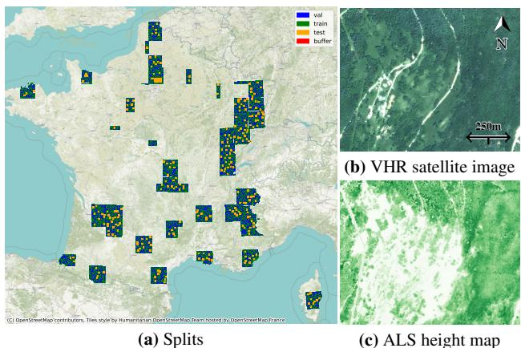  
Figure 2. Open-Canopy. Our training, validation, and test sets span the French territory and use a 1km buffer (a). We provide VHR images at a 1.5 m resolution (b) and associated LiDAR-derived canopy height maps (c).

## 3. The Open-Canopy Benchmark

We introduce Open-Canopy, an open-access country-scale benchmark for estimating canopy height at very high resolution. We first present our dataset (Sec. 3.1), then the models evaluated (Sec. 3.2), and finally the results (Sec. 3.2) and limitations (Sec. 3.4) of the benchmark.

## 3.1. Dataset Characteristics

We explain here the main characteristics of the dataset of the Open-Canopy benchmark. We report a detailed description of the dataset construction in the supplementary material.

Why Just France? France offers a unique opportunity for developing an open-access, very high-resolution canopy height benchmark due to recent national initiatives that have made critical data sources publicly available under the open EtaLab2.0 license [18]: (i) DINAMIS [14] provides SPOT 6-7 very high-resolution (VHR) satellite imagery covering the entire French territory at a native panchromatic resolution of 1.5 m; and (ii) the LiDAR-HD project [28] offers extensive airborne 3D point clouds with densities exceeding 10 points per square meter. While other countries provide open-access ALS data [20, 45] and associated VHR images [43, 44], they are local solutions. SPOT 6-7 images provide consistent global coverage and make an excellent test bed for estimating the relevance of meter-scale satellite imagery. Moreover, the French metropolitan territory exhibits a wide range of climates—12 of the 18 Köppen-Geiger climate types found in continental Europe [48], including temperate, Mediterranean, and Alpine environments. The French forest inventory lists 190 distinct tree species [27]. While models trained on the Open-Canopy dataset may not generalize globally, their performance within Europe is likely to be robust given this environmental diversity.

Preprocessing. We have compiled over 100,000 km2 of data from different providers. Despite advancements in geo libraries and government APIs, downloading, processing, and curating data required manual intervention, the development of custom functions, and significant computation. Deriving the canopy height from the ALS 3D point clouds alone took over 100 hours of continuous computation on a dedicated cluster with 70 CPUs.

Extent and Splits. We selected 87,383 tiles across France, each measuring $1 \times 1 ~ \mathrm { k m ^ { 2 } }$ We divided the dataset into training (66 339km2 ), validation $( 7 3 6 9 \mathrm { k m } ^ { 2 } )$ , and test sets (13 675km2). We added a 1 km buffer (8 046km2) between the test split and other splits to avoid data contamination, and ensured a representative distribution of each split among all bioclimatic regions of France [1].

VHR Satellite Images. As illustrated in Fig. 2(b), we use orthorectified SPOT 6-7 images [62, 72] from DINAMIS [14] with four spectral bands: red, green, blue, and nearinfrared at a resolution of 6m, and a panchromatic band at a resolution of 1.5m. We apply pansharpening with the weighted Brovey algorithm [23] to upsample all four spectral bands to a resolution of 1.5m. We select images from the same year as the corresponding ALS acquisition campaign, in 2021, 2022 and 2023.

ALS-Based Canopy Height. As depicted in Fig. 2(c), we use ALS data from the LiDAR-HD project [28] between 2021 and 2023, which provides a minimum density of 10 points per m2. The canopy height maps are calculated at the same resolution as the VHR images by taking the maximum height difference between each point and its nearest ground point within each pixel. We interpolate ground height when necessary to be robust to very dense canopies. As described in the supplementary material, we validated the obtained canopy height maps by comparing them at both plot and tree-level with extensive in-situ measurements.

Vegetation Mask. As illustrated in Fig. 3, we construct a comprehensive vegetation mask by taking the union of the ALS-derived mask indicating vegetation over 1.5m in height, with official forest plots outlines, both provided by IGN [28, 29]. The resulting vegetation mask, covering 49% of the dataset, contains trees and shrubs both within forest plots and in other areas such as hedges and urban environments. This offers a more comprehensive evaluation area than the traditionally used forest boundaries [61].

## 3.2. Evaluated Models

We evaluate different state-of-the-art computer vision approaches for canopy height estimation from a single VHR satellite image with 4 spectral bands. We list below the selected models and how we adapted them to our task.

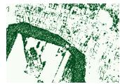  
(a) ALS Mask

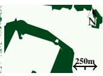  
(b) Forest Outline

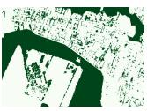  
(c) Our Mask

(d) VHR image  
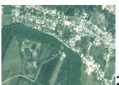  
Figure 3. Vegetation Mask. We combine an ALS-derived vegetation mask (a) with official forest outlines (b) to build a pixel-precise mask (c) covering a wide range of vegetation types, as seen in the VHR image (d).

Selected Models. Given the ubiquity of convolutional models for canopy height estimation, we evaluate the UNet [57] and DeepLabv3 [7] architectures. We select Vision Transformers (ViT) and their convolutional-hybrid variant (HViT) [15], as they recently became standard in computer vision. We also explore hierarchical ViT architectures such as SWIN [38], PCPVT [9], and PVTv2 [71].

To assess the impact of pretraining, we include models pretrained on ImageNet [56, 56], but also large external datasets such as DinoV2 [46] and CLIP-OPENAI [53]. We also consider the ScaleMAE [54] model, pretrained on satellite imagery of various resolutions, and Tolan et al.’s model [67] for canopy height estimation from RGB images.

Adaptating Models. We adapt the architecture of the considered models, originally designed for the semantic segmentation of RGB images, to our setting. To handle the near-infrared channel, we change their input size from 3 to 4. We retain the pretrained weights related to RGB, and initialize the near-infrared channel weights with small random values drawn from a normal distribution $\mathcal { N } ( 0 , 0 . 0 1 )$ ). We use a transposed convolution as a decoder to predict continuous canopy heights and use the $L _ { 1 }$ norm as a loss function.

Dataloader and Evaluation. During training, we sample random tiles of size 224×224 pixels with data augmentation: random scaling from 0.5 to 2, and rotations 0, 90, 180, or 270◦). For inference, we sample tiles on a regular grid of 112 pixels, and only keep the center half of each prediction of size 224×224. We train our model to predict the canopy height for all pixels, which may not correspond to vegetation. However, we only compute the evaluation metrics for pixels within the vegetation mask described in Sec. 3.1.

Parameters and Resources. We use a batch size of 64 and the ADAM optimizer [33] with a learning rate of 10−3, a linear warm-up of 1 epoch, and a ReduceLROnPlateau scheduler [2] with a patience of 1 and a decay of 0.5. We perform early stopping with a patience of 3. These hyperparameters were selected by considering their impact on the UNet and ViT models. Reproducing all our experiments requires 1400 GPU-h with A100 GPUs. We estimate our hyperparameters search and initial experiments to 2000 GPU-h.

Table 2. Canopy Height Prediction Models. We benchmark several backbone models for the task of predicting the canopy height of each pixel from a single satellite image. All models are pretrained on vision datasets and fine-tuned on our training set.
<table><tr><td>Model</td><td>pretraining</td><td>MAE in m</td><td>nMAE in %</td><td>RMSE in m</td><td>Bias in m</td><td>Tree cov. IoU in %</td></tr><tr><td>UNet⁴ [57]</td><td>ImageNet1k [58]</td><td>2.67</td><td>23.8</td><td>4.18</td><td>-0.30</td><td>90.4</td></tr><tr><td>DeepLabv3¹[7]</td><td>ImageNet1k [58]</td><td>3.18</td><td>28.4</td><td>4.83</td><td>-0.26</td><td>88.0</td></tr><tr><td>ViT-B3 [15]</td><td>ImageNet21k [7]</td><td>4.26</td><td>37.8</td><td>6.06</td><td>-0.84</td><td>86.0</td></tr><tr><td>HVIT³ [15]</td><td>ImageNet21k [7]</td><td>2.65</td><td>24.0</td><td>4.18</td><td>-0.13</td><td>90.2</td></tr><tr><td>PCPVT3 [9]</td><td>ImageNet1k [7]</td><td>2.57</td><td>23.1</td><td>4.06</td><td>-0.17</td><td>90.4</td></tr><tr><td>SWIN3 [38]</td><td>ImageNet21k [7]</td><td>2.54</td><td>22.8</td><td>4.00</td><td>-0.11</td><td>90.5</td></tr><tr><td>PVTv23 [71]</td><td>ImageNet1k [7]</td><td>2.52</td><td>22.9</td><td>4.02</td><td>0.00</td><td>90.5</td></tr><tr><td>ScaleMAE⁵ [54]</td><td>FotM [8]</td><td>3.45</td><td>31.2</td><td>5.13</td><td>-0,48</td><td>88,2</td></tr><tr><td>ViT-B³ [15]</td><td>DINOv2[46]</td><td>4.84</td><td>43.2</td><td>6.68</td><td>-0.48</td><td>84.8</td></tr><tr><td>ViT-B2 [15]</td><td>CLIP_OPENAI [53]</td><td>2.87</td><td>25.9</td><td>4.43</td><td>-0.07</td><td>89.7</td></tr><tr><td>ViT-L6 [15]</td><td>Tolan[67]</td><td>4.46</td><td>38.9</td><td>6.27</td><td>-1.03</td><td>85.6</td></tr><tr><td>SWIN³[38]</td><td>Satlas-pretrained [5]</td><td>2.56</td><td>23.1</td><td>4.09</td><td>0.02</td><td>90.6</td></tr></table>

1pytorch.org/vision 2huggingface.co/laion 3timm.fast.ai/ 4github.com/qubvel/segmentation\_models.pytorch 5github.com/bair-climate-initiative/scale-mae 6github.com/facebookresearch/HighResCanopyHeight

## 3.3. Results and Analysis

We evaluate recent vision models in Tab. 2, as well as the accuracy of existing canopy height maps in Tab. 3.

Metrics. We evaluate the performance of canopy height estimation models with five metrics: Root Mean Square Error (RMSE), Mean Absolute Error (MAE), normalized MAE (nMAE)—which normalizes the absolute error by the target height, Bias—the error averaged across the test set, and Intersection over Union (IoU) for Tree Cover predictions. The tree cover IoU is calculated by comparing binary maps generated by thresholding both ground truth and predicted height maps at a 2m threshold. All metrics are computed only on pixels within the vegetation mask and with ground truth height below 60m. The nMAE is calculated only for pixels with ground truth heights above 2m.

Analysis. We report the quantitative performance of all evaluated backbones in Tab. 2, and selected illustrations in Fig. 4. We make the following observations:

• Impact of Backbones. Contrary to trends in natural image analysis, convolution-based approaches (UNet, HVIT) outperform ViTs, indicating that convolutions can more efficiently extract relevant local features than linear projections. However, hierarchical ViTs (SWIN, PCPVT, PVTv2) achieve the highest precision, underscoring the multi-scale structure of the task.

• Impact of Pretraining. Interestingly, models pre-trained on ImageNet (UNet, PVTv2) perform better than foundation models trained on extensive databases of natural images (CLIP, DINO). These models do not generalize well to canopy height estimation, likely due to differences in viewpoint, task specificity, data type, and available spectral bands. Pre-training on satellite images does not either improve performance: a SWIN model pre-trained on the SATLAS dataset achieves similar performance as when pre-trained on ImageNet, while ScaleMAE, and Tolan et al.’s ViT [67] do not adapt well to our task. We hypothesize that this is due to the spatial domain shift and the fact that they are trained without the near-infrared channel. See the ablation experiments in the supplementary material for additional analysis.

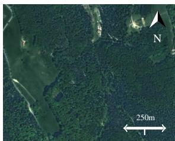  
(a) VHR image

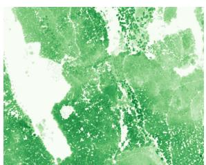  
(b) ALS-derived height

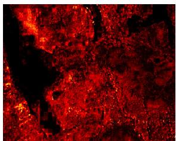  
(c) Vit-B Error, MAE= 8.0

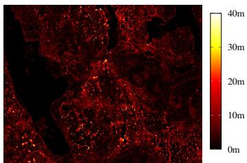  
(d) PVTv2 Error, MAE= 3.9  
Figure 4. Difference Maps: Per-pixel absolute (top row) and relative (bottom row) errors for ViT-B and PVTv2. PVT2 predictions are more precise with errors mostly under 10m while Unet mispredict a lot of tree by more than 20m

Table 3. Canopy Height Maps Evaluation. We evaluate several available canopy height map products on our test set.
<table><tr><td>Map</td><td>Backbone</td><td>res. in m</td><td>MAE in m</td><td>nMAE in %</td><td>RMSE in m</td><td>Bias in m</td><td>Tree cov. IoU in %</td></tr><tr><td>Potapov [50]</td><td>UNet</td><td>30</td><td>6.27</td><td>58.1</td><td>8.68</td><td>1.79</td><td>78.0</td></tr><tr><td>Schwartz [60, 61]</td><td>UNet</td><td>10</td><td>5.17</td><td>42.7</td><td>7.20</td><td>3.37</td><td>76.8</td></tr><tr><td>Lang [35]</td><td>CNN</td><td>10</td><td>9.22</td><td>89.5</td><td>17.14</td><td>8.40</td><td>77.4</td></tr><tr><td>Pauls [47]</td><td>UNet</td><td>10</td><td>6.70</td><td>58.3</td><td>8.65</td><td>5.22</td><td>76.8</td></tr><tr><td>Liu [37]</td><td>UNet</td><td>3.0</td><td>4.83</td><td>46.6</td><td>6.90</td><td>1.56</td><td>84.1</td></tr><tr><td>Tolan [67]</td><td>ViT-L</td><td>1.0</td><td>5.07</td><td>43.7</td><td>7.15</td><td>-2.95</td><td>78.8</td></tr><tr><td>Open-Canopy</td><td>UNet</td><td>1.5</td><td>2.67</td><td>23.8</td><td>4.18</td><td>-0.30</td><td>90.4</td></tr><tr><td>Open-Canopy</td><td>PVTv2</td><td>1.5</td><td>2.52</td><td>22.9</td><td>4.02</td><td>0.00</td><td>90.5</td></tr></table>

• Overall Performance. The methods assessed in this benchmark exhibit commendable results, achieving tree cover detection with over 90% IoU and an nMAE of around 20% for the best-performing models. However, we argue that there exists a significant margin of improvement, in particular for transferring foundation models to our setting.

Impact of Initialization. We report in Tab. 4 the performance of PVTv2 trained on ImageNet1k, our best performing model, when fine-tuned with different initialization strategies to accommodate the fourth near-infrared channel. Fully random initialization leads to poor performance, which shows that Open-Canopy is not large enough to train a ViT from scratch. LoRA [25] adaptation adapts better to the new channel, but fine-tuning all weights with a random first layer leads to significantly better results. Our proposed initialization scheme further improves the results by allowing the network to gradually accommodate the new channel.

Comparison with Existing Maps. In Tab. 3, we evaluate the precision of canopy height maps generated by UNet and PVTv2 networks trained on the Open-Canopy dataset against those from other research that we interpolate to a resolution of 1.5m per pixel. With the caveats on the fairness of the comparison mentioned in Sec. 3.4, our maps achieve significantly better precision. The low performance of models derived from low-resolution imagery is expected, as they are trained to estimate tree height at a different resolution. Among the ALS-based methods, Liu et al.’s model performs best, likely due to its training data from Europe, which differs from Tolan et al.’s training in the continental US. Moreover, the Tolan et al. model relies solely on RGB data, while the inclusion of near-infrared is proven to be highly discriminative for vegetation analysis [6]. In Fig. 5, we report error plots across various vegetation height bins, highlighting that the PVTv2 model trained on Open-Canopy exhibits significantly lower bias and superior performance, especially in areas with tall trees.

Table 4. Initialisation Strategy. We evaluate different training strategy for a PVTv2 model trained on ImageNet1k.
<table><tr><td>Initialization</td><td>MAE in m</td><td>nMAE in %</td><td>RMSE in m</td><td>Bias in m</td></tr><tr><td>Fully random</td><td>11.17</td><td>85.77</td><td>14.38</td><td>-10.94</td></tr><tr><td>LoRA (rank 4)</td><td>4.54</td><td>40.79</td><td>6.42</td><td>-0.37</td></tr><tr><td>Rand. 1st layer</td><td>2.87</td><td>24.3</td><td>4.24</td><td>-0.04</td></tr><tr><td>Proposed</td><td>2.52</td><td>22.9</td><td>4.02</td><td>0.00</td></tr></table>

Out-of-domain Evaluation. To assess the spatial generalization of models trained on Open-Canopy, we collected SPOT 6-7 satellite imagery (with DINAMIS [14]) and aerial VHR images (through NAIP [43]) for a 30km2 area in Utah, United States. We used as ground truth the ALS-based canopy height map provided by NEON on site REDB [20]. As detailed in Tab. 5, a PVTv2 model trained on Open-Canopy and applied to the SPOT image achieves performance comparable to Tolan et al.’s height map derived from MAXAR 0.6m imagery [67], despite their model being predominantly trained on data from the continental US. This demonstrates the robustness of models trained on Open-Canopy to evaluation outside of France.

We resampled NAIP aerial images to 1.5m resolution and normalized them with histogram matching to the global spectral distribution of the entire Open-Canopy dataset. Evaluated on these images, the performance of the PVTv2 model decreases starkly, highlighting its dependency on SPOT data.

## 3.4. Limitations

While Open-Canopy represents a significant advancement in providing an open-access VHR benchmark for canopy height estimation, it has several limitations.

• Constraints of Open-Access: Only using freely distributable sources limits the extent as well as the spatial and temporal resolution of available data. Acquiring and distributing ALS and VHR satellite images at large scale is cost-prohibitive: Open-Canopy would cost millions of dollars to reproduce with commercial data.

Table 5. Out-of-Domain Evaluation. We evaluate different models on a 30km2 area in Utah, US. We compare the height map of Tolan et al. [67] to a PVTv2 model trained on Open Canopy with SPOT6-7 data or NAIP images.
<table><tr><td></td><td>Input data</td><td>Training area</td><td>MAE in m</td><td>nMAE in %</td><td>RMSE in m</td><td>Bias in m</td><td>Tree cov. IoU in %</td></tr><tr><td>Tolan Map [67]</td><td>MAXAR</td><td>US</td><td>2.02</td><td>47.4</td><td>3.58</td><td>0.57</td><td>70.5</td></tr><tr><td>PVTv2</td><td>NAIP</td><td>OpenCanopy</td><td>4.38</td><td>71.0</td><td>6.42</td><td>2.78</td><td>49.6</td></tr><tr><td>PVTv2</td><td>SPOT 6-7</td><td>OpenCanopy</td><td>2.08</td><td>33.9</td><td>3.20</td><td>0.90</td><td>61.8</td></tr></table>

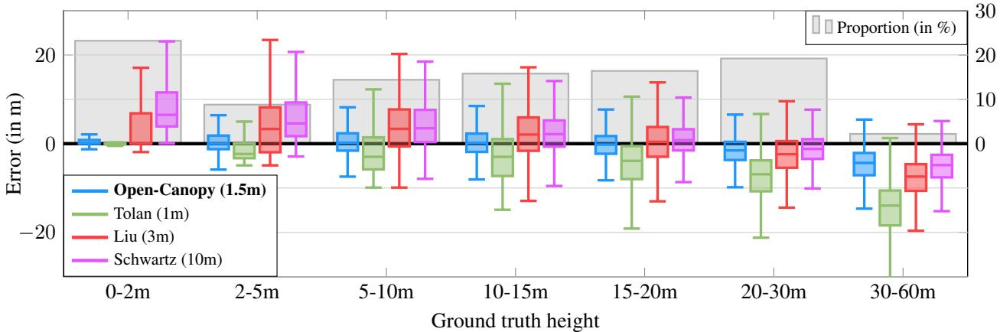  
Figure 5. Distribution of Error According to Ground Truth Canopy Height. We evaluate a PVTv2 model trained on Open-Canopy and different canopy height map products.

• Geographic Scope: Although metropolitan France offers a unique combination of open-access data and diverse landscapes, it lacks critical forest types such as rainforests. This absence may affect the generalizability of models trained on Open-Canopy.

• Limits of ALS: Our ground-truth canopy heights are derived from aerial LiDAR measurements, which can contain errors due to factors like multiple echoes. Although we estimate these errors with in-situ measurements (see the supplementary material), they cannot be entirely eliminated. Additionally, while the freely distributable SPOT 6-7 images are captured during spring and summer, the LiDAR measurements span all seasons.

• Comparison with Other Products. Our evaluation of other canopy height maps is subject to limitations: (i) unknown training sets for some models might lead to data contamination, (ii) interpolation might distort results, (iii) forest losses and gains happening between the images and ALS acquisitions can affect performance, (iv) maps derived at lower resolution are trained to predict the maximum canopy height in larger pixels, which bias them to higher values. To address these issues, we provide additional experiments in the supplementary material.

## 4. Open-Canopy-∆

We present Open-Canopy-∆, a benchmark for canopy height reduction detection between consecutive VHR images. We describe the dataset in Sec. 4.1 and our results in Sec. 4.2.

## 4.1. Dataset Characteristics

Extent and Context. Open-Canopy-∆ focuses on the Forêt de Chantilly, a declining forest due to climate change and of high concern for conservationists [12]. We consider two ALS acquisitions in February 2022 [28] and September 2023 [12], allowing us to build two consecutive canopy height maps and collect corresponding SPOT 6-7 satellite images. The studied area spans 16, 634 hectares and is strictly comprised in the test set of Open-Canopy, not overlaping with the training set.

Processing. We generated a rasterized canopy change map by subtracting the ALS-based height map of 2022 from the map of 2023. Significant decreases in canopy height can result from various forest disturbance events such as fires, logging, diebacks, or maintenance activities. However, minor changes due to seasonal growth cycles, wind, or sensor errors can introduce noise. To create robust binary loss masks, we focused on areas with substantial, localized, and consistent decreases in canopy height. The processing steps involve: (i) selecting pixels with a height loss exceeding 15m, (ii) applying erosion and dilation operators using a 3-pixel kernel to regularize the binary masks, and (iii) removing connected components smaller than 200m2. Each of the resulting 73 change areas was manually validated by a forest expert, ensuring the quality and accuracy of the benchmark. We assigned zero values to false positive in the ALS change map. Illustrations, detailed explanations of hyperparameter choices and verification processes are provided in Fig. 6 and the supplementary material.

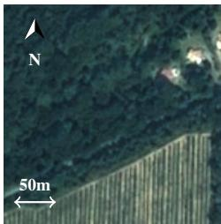  
(a) VHR year 2022

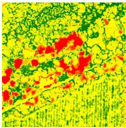  
(b) ALS change map

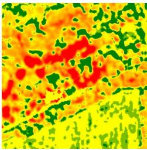

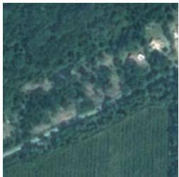

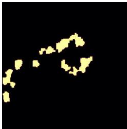  
(f) VHR year 2023  
(g) ALS loss mask

(c) Our change map  
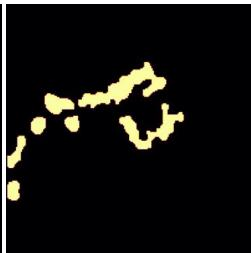

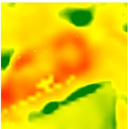

(h) Our loss mask  
(d) Sentinel change map  
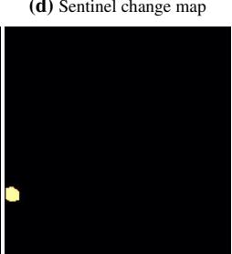  
(i) Sentinel loss mask

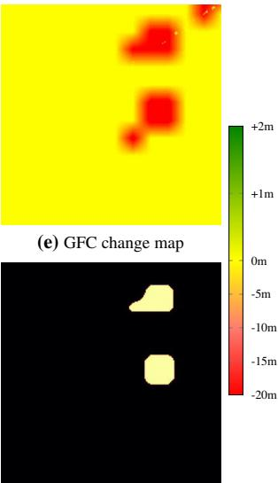  
(j) GFC loss mask  
Figure 6. Canopy Height Reduction. We consider VHR images taken in the Chantilly Forest taken in 2022 (a) and 2023 (f), and use ALS observations of the same years to derive a canopy height change map (b). We represent the change map predicted by a PVTv2 model (c) and two competing approaches: Sentinel-derived maps from Schwartz et al. [61] (d) and Global Forest Change [24] (c). Finally, we compare the binary loss masks derived from ALS measurements (g) and the predicted change maps (i),(h),(j).

## 4.2. Results and Analysis

We evaluate different approaches for detecting significant canopy height reductions between two VHR images, a task which holds significant applications in forestry management and deforestation monitoring.

Setting. We provide each model images from 2022 and 2023 and generate two canopy height maps. We obtain a change map by taking the difference. We do not directly compare the ALS-derived and predicted change maps, as the estimation error of canopy height can be larger than normal tree growth. Instead, we apply the preprocessing described in Sec. 4.1 to produce a binary mask of predicted canopy height change. We evaluate the predicted canopy height loss masks by computing the pixel-wise Precision, Recall, F1 score, and IoU with respect to the ALS-derived masks.

Results. We compare height loss masks obtained with a PVTv2 model trained on Open-Canopy with those derived from height maps provided by [61] and Global Forest Change [24]. As detailed in Tab. 6, our model achieves significantly better performance than other methods. Fig. 6 illustrates that while our predicted loss masks do not perfectly align with the ground truth maps, the consistency of our predictions suggests their potential utility in detecting significant year-to-year changes.

Table 6. Forest Loss Mask Evaluation. We evaluate our best model (PVTv2) for the task of canopy height reduction detection.
<table><tr><td></td><td>Precision (%)</td><td>Recall (%)</td><td>F1 score (%)</td><td>IoU (%)</td></tr><tr><td>Schwartz [61]</td><td>63.5</td><td>3.2</td><td>6.0</td><td>3.1</td></tr><tr><td>GFC [24]</td><td>0.9</td><td>11.1</td><td>1.7</td><td>0.8</td></tr><tr><td>PVTv2 (ours)</td><td>53.8</td><td>54.3</td><td>54.1</td><td>37.0</td></tr></table>

## 5. Conclusion

We introduced Open-Canopy, an open-access country-scale benchmark combining VHR satellite imagery with ALSderived canopy height measurements. We evaluated multiple state-of-the-art computer vision models for canopy height estimation. Despite the dominance of convolutional networks in prior works, our findings suggest that transformerbased architectures exhibit superior performance. We also proposed Open-Canopy-∆, a benchmark for canopy height reduction detection in consecutive observations, a difficult task, even for the best-performing models. We hope that our open-access benchmarks will encourage the computer vision community to further explore canopy height estimation as a standard task for evaluating new architectures and inspire forestry experts to design bespoke architectures.

## References

[1] Fiches descriptives des grandes régions écologiques (GRECO) et des sylvoécorégions (SER). https: //inventaire- forestier.ign.fr/spip. php?article773. Accessed: 2024-04-29.

[2] PyTorch: ReduceLROnPlateau. org / docs / stable / generated / torch . optim . lr \_ scheduler . ReduceLROnPlateau html # torch . optim . lr \_ scheduler . ReduceLROnPlateau. Accessed: 2024-02- 29.

[3] Danilo Roberti Alves de Almeida, Scott C Stark, R Chazdon, Bruce Walker Nelson, Ricardo Gomes César, Paula Meli, EB Gorgens, Marina Melo Duarte, Rubén Valbuena, Vanessa Sousa Moreno, et al. The effectiveness of LiDAR remote sensing for monitoring forest cover attributes and landscape restoration. Forest Ecology and Management, 2019.

[4] Gregory P Asner, Michael Keller, Rodrigo Pereira, Jr, Johan C Zweede, and Jose NM Silva. Canopy damage and recovery after selective logging in Amazonia: Field and satellite studies. Ecological Applications, 2004.

[5] Favyen Bastani, Piper Wolters, Ritwik Gupta, Joe Ferdinando, and Aniruddha Kembhavi. Satlaspretrain: A large-scale dataset for remote sensing image understanding. In ICCV, pages 16726–16736, 2023.

[6] Toby N Carlson and David A Ripley. On the relation between NDVI, fractional vegetation cover, and leaf area index. Remote sensing ofEnvironment, 1997.

[7] Liang-Chieh Chen, George Papandreou, Florian Schroff, and Hartwig Adam. Rethinking atrous convolution for semantic image segmentation. arXiv preprint arXiv:1706.05587, 2017.

[8] Gordon Christie, Neil Fendley, James Wilson, and Ryan Mukherjee. Functional map of the world. In CVPR, 2018.

[9] Xiangxiang Chu, Zhi Tian, Yuqing Wang, Bo Zhang, Haibing Ren, Xiaolin Wei, Huaxia Xia, and Chunhua Shen. Twins: Revisiting the design of spatial attention in vision transformers. NeurIPS, 2021.

[10] European Commission. Regulation on deforestation-free products. https : / / environment . ec . europa . eu / topics / forests / deforestation / regulation - deforestation-free-products\_en, 2024. [Online; accessed 12-Sep-2024].

[11] Adrian J Das and Nathan L Stephenson. Improving estimates of tree mortality probability using potential growth rate. Canadian Journal of Forest Research, 2015.

[12] Institut de France. Collectif sauvons la foret de chantilly. https://chateaudechantilly.fr/la-

foret/ensemble-sauvons-la-foret-dechantilly/, 2024. [Online; accessed 12-May-2024].

[13] Mathieu Decuyper, Roberto O Chávez, Madelon Lohbeck, José A Lastra, Nandika Tsendbazar, Julia Hackländer, Martin Herold, and Tor-G Vågen. Continuous monitoring of forest change dynamics with satellite time series. Remote Sensing ofEnvironment, 2022.

[14] DINAMIS. French national facility for institutional procurement of vhr satellite imagery. https:// openspot-dinamis.data-terra.org, 2024. [Online; accessed 12-May-2024].

[15] Alexey Dosovitskiy, Lucas Beyer, Alexander Kolesnikov, Dirk Weissenborn, Xiaohua Zhai, Thomas Unterthiner, Mostafa Dehghani, Matthias Minderer, Georg Heigold, Sylvain Gelly, et al. An image is worth 16x16 words: Transformers for image recognition at scale. In ICLR, 2020.

[16] Ralph Dubayah, James Bryan Blair, Scott Goetz, Lola Fatoyinbo, Matthew Hansen, Sean Healey, Michelle Hofton, George Hurtt, James Kellner, Scott Luthcke, et al. The global ecosystem dynamics investigation: High-resolution laser ranging of the Earth’s forests and topography. Science ofremote sensing, 2020.

[17] Yousef Erfanifard, Mohsen Lotfi Nasirabad, and Krzysztof Sterenczak. Assessment of Iran’s mangrove´ forest dynamics (1990–2020) using Landsat time series. Remote Sensing, 2022.

[18] Etalab. Open licence 2.0. https://www.etalab. gouv.fr/wp-content/uploads/2018/11/ open-licence.pdf, 2024. [Online; accessed 12- May-2024].

[19] Fabian Ewald Fassnacht, Christoph Mager, Lars T Waser, Urša Kanjir, Jannika Schäfer, Ana Potocnikˇ Buhvald, Elham Shafeian, Felix Schiefer, Liza Stanciˇ c,ˇ Markus Immitzer, et al. Forest practitioners’ requirements for remote sensing-based canopy height, wood-volume, tree species, and disturbance products. Forestry: An International Journal ofForest Research, 2024.

[20] US National Science Foundation. Neon (national ecological observatory network). ecosystem structure (dp3.30015.001)). https : //data.neonscience.org/, 2024. Dataset accessed from https://data.neonscience.org/dataproducts/DP3.30015.001 on October 11, 2024.

[21] David LA Gaveau and Ross A Hill. Quantifying canopy height underestimation by laser pulse penetration in small-footprint airborne laser scanning data. Canadian Journal of Remote Sensing, 2003.

[22] Stephan Getzin, Kerstin Wiegand, and Ingo Schöning. Assessing biodiversity in forests using very high-

resolution images and unmanned aerial vehicles. Methods in ecology and evolution, 2012.

[23] Alan R Gillespie, Anne B Kahle, and Richard E Walker. Color enhancement of highly correlated images. ii. channel ratio and “chromaticity” transformation techniques. Remote Sensing of Environment, 1987.

[24] Matthew C Hansen, Peter V Potapov, Rebecca Moore, Matt Hancher, Svetlana A Turubanova, Alexandra Tyukavina, David Thau, Stephen V Stehman, Scott J Goetz, Thomas R Loveland, and others. Highresolution global maps of 21st-century forest cover change. 2013.

[25] Edward J Hu, Yelong Shen, Phillip Wallis, Zeyuan Allen-Zhu, Yuanzhi Li, Shean Wang, Lu Wang, and Weizhu Chen. LoRa: Low-rank adaptation of large language models. ICLR, 2022.

[26] Claudia Huertas, Daniel Sabatier, Géraldine Derroire, Bruno Ferry, Toby D Jackson, Raphaël Pélissier, and Grégoire Vincent. Mapping tree mortality rate in a tropical moist forest using multi-temporal LiDAR. International Journal ofApplied Earth Observation and Geoinformation, 2022.

[27] IGN. More than 190 tree species inventoried in france. https://inventaire-forestier.ign.fr/ spip.php?article175, 2024. [Online; accessed 12-May-2024].

[28] IGN. LiDAR HD : Vers une nouvelle cartographie 3d du territoire. https : / / www . ign . fr / institut / lidar - hd - vers- une- nouvelle- cartographie- 3ddu - territoire, 2024. [Online; accessed 12-May-2024].

[29] IGN. Forest data base. https://geoservices. ign.fr/bdforet, 2024. [Online; accessed 12- May-2024].

[30] Colbert M Jackson and Elhadi Adam. Remote sensing of selective logging in tropical forests: Current state and future directions. iForest-Biogeosciences and Forestry, 2020.

[31] Ekaterina Kalinicheva, Loic Landrieu, Clément Mallet, and Nesrine Chehata. Multi-layer modeling of dense vegetation from aerial LiDAR scans. In CVPR Workshop Earth Vision, 2022.

[32] Rodney J Keenan. Climate change impacts and adaptation in forest management: A review. Annals of forest science, 2015.

[33] Diederik P Kingma and Jimmy Ba. Adam: A method for stochastic optimization. ICLR, 2015.

[34] Tobias Kuemmerle, Oleh Chaskovskyy, Jan Knorn, Volker C Radeloff, Ivan Kruhlov, William S Keeton, and Patrick Hostert. Forest cover change and illegal logging in the Ukrainian Carpathians in the transition

period from 1988 to 2007. Remote Sensing of Environment, 2009.

[35] Nico Lang, Walter Jetz, Konrad Schindler, and Jan Dirk Wegner. A high-resolution canopy height model of the Earth. Nature Ecology & Evolution, 2023.

[36] Stéphane Lecq, Anne Loisel, Francois Brischoux, Stephen J Mullin, and Xavier Bonnet. Importance of ground refuges for the biodiversity in agricultural hedgerows. Ecological Indicators, 2017.

[37] Siyu Liu, Martin Brandt, Thomas Nord-Larsen, Jerome Chave, Florian Reiner, Nico Lang, Xiaoye Tong, Philippe Ciais, Christian Igel, Adrian Pascual, et al. The overlooked contribution of trees outside forests to tree cover and woody biomass across Europe. Science Advances, 2023.

[38] Ze Liu, Yutong Lin, Yue Cao, Han Hu, Yixuan Wei, Zheng Zhang, Stephen Lin, and Baining Guo. SWIN transformer: Hierarchical vision transformer using shifted windows. In ICCV, 2021.

[39] Kenneth G MacDicken. Global forest resources assessment 2015: What, why and how? Forest Ecology and Management, 2015.

[40] Kenneth G MacDicken, Phosiso Sola, John E Hall, Cesar Sabogal, Martin Tadoum, and Carlos de Wasseige. Global progress toward sustainable forest management. Forest Ecology and Management, 2015.

[41] Ronald E McRoberts and Erkki O Tomppo. Remote sensing support for national forest inventories. Remote sensing ofenvironment, 2007.

[42] French Ministry of Agriculture. The national forest and wood programme (PNFB). https://inis. iaea.org/search/search.aspx?orig\_q= RN:51010336, 2024. [Online; accessed 12-May-2024].

[43] United States Department of Agriculture. National agriculture imagery program (NAIP). https : / / www . fsa . usda . gov / Assets / USDA - FSA - Public / usdafiles / APFO / support - documents/pdfs/naip\_infosheet\_2016. pdf, 2024. [Online; accessed 12-May-2024].

[44] Federal Office of Topography Swisstopo. Swisstopo orthophotos. https://www.swisstopo.admin. ch/fr/orthophotos, 2024. [Online; accessed 12- May-2024].

[45] Federal Office of Topography Swisstopo. Swisstopo LiDAR data acquisition. https://www. swisstopo . admin . ch / en / lidar - data - swisstopo, 2024. [Online; accessed 12-May-2024].

[46] Maxime Oquab, Timothée Darcet, Théo Moutakanni, Huy V Vo, Marc Szafraniec, Vasil Khalidov, Pierre Fernandez, Daniel HAZIZA, Francisco Massa, Alaaeldin El-Nouby, et al. DINOv2: Learning robust visual features without supervision. TMLR, 2023.

[47] Jan Pauls, Max Zimmer, Una M Kelly, Martin Schwartz, Sassan Saatchi, Philippe Ciais, Sebastian Pokutta, Martin Brandt, and Fabian Gieseke. Estimating canopy height at scale. In ICML, 2024.

[48] Murray C Peel, Brian L Finlayson, and Thomas A McMahon. Updated world map of the Köppen-Geiger climate classification. Hydrology and earth system sciences, 2007.

[49] Guan Peng and ZHENG Yili. Research on forest phenology prediction based on LSTM and GRU model. Journal of Resources and Ecology, 2022.

[50] Peter Potapov, Xinyuan Li, Andres Hernandez-Serna, Alexandra Tyukavina, Matthew C Hansen, Anil Kommareddy, Amy Pickens, Svetlana Turubanova, Hao Tang, Carlos Edibaldo Silva, et al. Mapping global forest canopy height through integration of GEDI and Landsat data. Remote Sensing of Environment, 2021.

[51] Hans Pretzsch, Miren Del Río, Catia Arcangeli, Kamil Bielak, Malgorzata Dudzinska, David Ian Forrester, Joachim Klädtke, Ulrich Kohnle, Thomas Ledermann, Robert Matthews, et al. Forest growth in Europe shows diverging large regional trends. Scientific Reports, 2023.

[52] Jushuang Qin, Menglu Ma, Yutong Zhu, Baoguo Wu, and Xiaohui Su. 3PG-MT-LSTM: A hybrid model under biomass compatibility constraints for the prediction of long-term forest growth to support sustainable management. Forests, 2023.

[53] Alec Radford, Jong Wook Kim, Chris Hallacy, Aditya Ramesh, Gabriel Goh, Sandhini Agarwal, Girish Sastry, Amanda Askell, Pamela Mishkin, Jack Clark, et al. Learning transferable visual models from natural language supervision. In ICML, 2021.

[54] Colorado J Reed, Ritwik Gupta, Shufan Li, Sarah Brockman, Christopher Funk, Brian Clipp, Kurt Keutzer, Salvatore Candido, Matt Uyttendaele, and Trevor Darrell. Scale-MAE: A scale-aware masked autoencoder for multiscale geospatial representation learning. In ICCV, 2023.

[55] Christopher PO Reyer, Ramiro Silveyra Gonzalez, Klara Dolos, Florian Hartig, Ylva Hauf, Matthias Noack, Petra Lasch-Born, Thomas Rötzer, Hans Pretzsch, Henning Meesenburg, et al. The PROFOUND database for evaluating vegetation models and simulating climate impacts on European forests. Earth System Science Data, 2020.

[56] Tal Ridnik, Emanuel Ben-Baruch, Asaf Noy, and Lihi Zelnik-Manor. ImageNet-21K pretraining for the masses. In NeurIPS Datasets and Benchmarks Track, 2021.

[57] Olaf Ronneberger, Philipp Fischer, and Thomas Brox. UNet: Convolutional networks for biomedical image segmentation. In MICCAI. Springer, 2015.

[58] Olga Russakovsky, Jia Deng, Hao Su, Jonathan Krause, Sanjeev Satheesh, Sean Ma, Zhiheng Huang, Andrej Karpathy, Aditya Khosla, Michael Bernstein, et al. ImageNet large scale visual recognition challenge. IJCV, 2015.

[59] Anouk Schleich, Sylvie Durrieu, and Cédric Vega. Improving gedi footprint geolocation using a high resolution digital elevation model. IEEE Journal of Selected Topics in Applied Earth Observations and Remote Sensing, 2023.

[60] Martin Schwartz. Mapping forest height and biomass at high resolution in France with satellite remote sensing and deep learning. PhD thesis, Université Paris-Saclay, 2023.

[61] Martin Schwartz, Philippe Ciais, Aurélien De Truchis, Jérôme Chave, Catherine Ottlé, Cedric Vega, Jean-Pierre Wigneron, Manuel Nicolas, Sami Jouaber, Siyu Liu, Martin Brandt, and Ibrahim Fayad. FORMS: Forest multiple source height, wood volume, and biomass maps in France at 10 to 30m resolution based on Sentinel-1, Sentinel-2, and GEDI data with a deep learning approach. Earth System Science Data, 2023.

[62] Gary S Smith. Digital orthophotography and GIS. In Proceedings of the 1995 ESRI user conference, 1995.

[63] Nathan L Stephenson, AJ Das, R Condit, SE Russo, PJ Baker, Noelle G Beckman, DA Coomes, ER Lines, WK Morris, Nadja Rüger, et al. Rate of tree carbon accumulation increases continuously with tree size. Nature, 2014.

[64] Hao Tang, Jason Stoker, Scott Luthcke, John Armston, Kyungtae Lee, Bryan Blair, and Michelle Hofton. Evaluating and mitigating the impact of systematic geolocation error on canopy height measurement performance of GEDI. Remote Sensing ofEnvironment, 2023.

[65] Sara T Thompson and William B Magrath. Preventing illegal logging. Forest Policy and Economics, 2021.

[66] Feng Tian, Zhanzhang Cai, Hongxiao Jin, Koen Hufkens, Helfried Scheifinger, Torbern Tagesson, Bruno Smets, Roel Van Hoolst, Kasper Bonte, Eva Ivits, et al. Calibrating vegetation phenology from Sentinel-2 using eddy covariance, PhenoCam, and PEP725 networks across Europe. Remote Sensing of Environment, 2021.

[67] Jamie Tolan, Hung-I Yang, Benjamin Nosarzewski, Guillaume Couairon, Huy V Vo, John Brandt, Justine Spore, Sayantan Majumdar, Daniel Haziza, Janaki Vamaraju, et al. Very high resolution canopy height maps from RGB imagery using self-supervised vision transformer and convolutional decoder trained on aerial LiDAR. Remote Sensing ofEnvironment, 2024.

[68] Erkki Tomppo, Thomas Gschwantner, Mark Lawrence, Ronald E McRoberts, Karl Gabler, K Schadauer, Claude Vidal, A Lanz, Göran Ståhl, Emil Cienciala,

et al. National forest inventories. Pathwaysfor Common Reporting. European Science Foundation, 2010.

[69] Svetlana Turubanova, Peter Potapov, Matthew C Hansen, Xinyuan Li, Alexandra Tyukavina, Amy H Pickens, Andres Hernandez-Serna, Adrian Pascual Arranz, Juan Guerra-Hernandez, Cornelius Senf, et al. Tree canopy extent and height change in Europe, 2001– 2021, quantified using Landsat data archive. Remote Sensing ofEnvironment, 2023.

[70] FH Wagner, S Roberts, AL Ritz, G Carter, R Dalagnol, S Favrichon, M Hirye, M Brandt, P Ciais, and S Saatchi. Sub-meter tree height mapping of California using aerial images and LiDAR-informed U-Net model. Remote Sensing ofEnvironment, 2024.

[71] Wenhai Wang, Enze Xie, Xiang Li, Deng-Ping Fan, Kaitao Song, Ding Liang, Tong Lu, Ping Luo, and Ling Shao. PVTv2: Improved baselines with pyramid vision transformer. Computational Visual Media, 2022.

[72] Guo Dong Yang and Xiang Zhu. Ortho-rectification of SPOT 6 satellite images based on RPC models. Applied Mechanics and Materials, 2013.

[73] Long Ye, Lei Gao, Raymundo Marcos-Martinez, Dirk Mallants, and Brett A Bryan. Projecting Australia’s forest cover dynamics and exploring influential factors using deep learning. Environmental Modelling & Software, 2019.

[74] Xiaowei Yu, Juha Hyyppä, Harri Kaartinen, and Matti Maltamo. Automatic detection of harvested trees and determination of forest growth using airborne laser scanning. Remote sensing ofEnvironment, 2004.

[75] Xiaowei Yu, Juha Hyyppä, Antero Kukko, Matti Maltamo, and Harri Kaartinen. Change detection techniques for canopy height growth measurements using airborne laser scanner data. Photogrammetric Engineering & Remote Sensing, 2006.

[76] Yanchao Zhang, Hanxuan Wu, and Wen Yang. Forests growth monitoring based on tree canopy 3D reconstruction using UAV aerial photogrammetry. Forests, 2019.