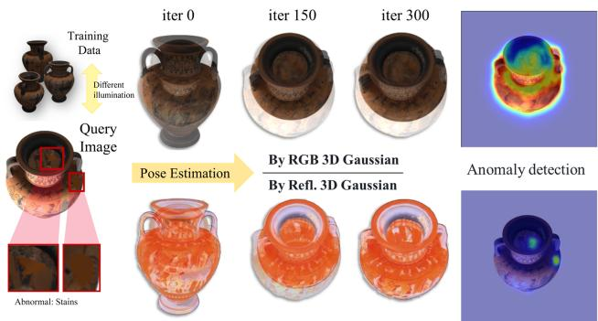
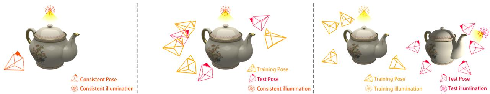
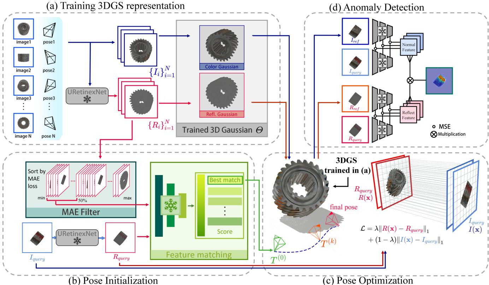
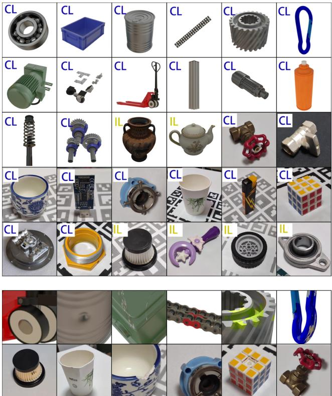
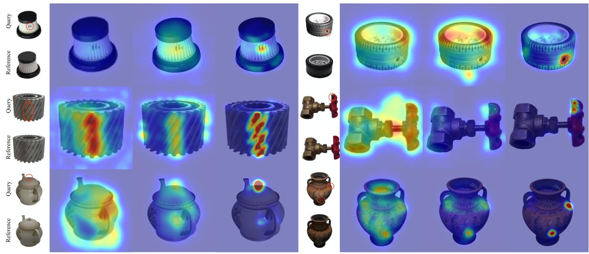
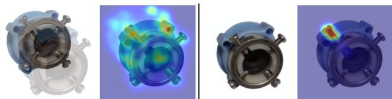
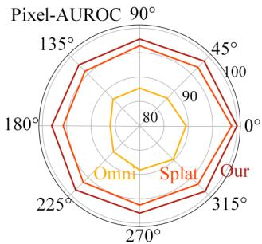
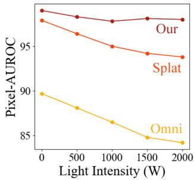

# PIAD: Pose and Illumination agnostic Anomaly Detection

Kaichen Yang1,2 Junjie Cao1,2 Zeyu Bai1,2 Zhixun Su1,2 Andrea Tagliasacchi3

1Dalian University of Technology

2Key Laboratory for Computational Mathematics and Data Intelligence of Liaoning Province 3Simon Fraser University

## Abstract

We introduce the Pose and Illumination agnostic Anomaly Detection (PIAD) problem, a generalization of poseagnostic anomaly detection (PAD). Being illumination agnostic is critical, as it relaxes the assumption that training datafor an object has to be acquired in the same light configuration of the query images that we want to test. Moreover, even if the object is placed within the same capture environment, being illumination agnostic implies that we can relax the assumption that the relative pose between environment light and query object has to match the one in the training data. We introduce a new dataset to study this problem, containing both synthetic and real-world examples, propose a new baseline for PIAD, and demonstrate how our baseline provides state-of-the-art results in both PAD and PIAD, not only in the new proposed dataset, but also in existing datasets that were designed for the simpler PAD problem. Project page: https://kaichenyang.github.io/piad/.

## 1. Introduction

Anomaly detection is an important problem in numerous industries including manufacturing [18], medical image analysis [13], surveillance [28], and autonomous driving [7, 31]. In recent years, a variety of methods have been proposed [12, 22, 23, 25, 38], but they all assume that training and query images are pose-aligned; see Figure 2 (left).

When this assumption is relaxed, the performance of anomaly detection drops sharply. To overcome this shortcoming, Zhou et al. [41] recently introduced the problem of Pose-agnostic Anomaly Detection (PAD), and a technique named OmniposeAD to address it. At training time, OmniposeAD assumes that multiple posed anomaly-free images of an object are available, from which a Neural Radiance Field (NeRF) is computed in a pre-processing stage. At test time, this NeRF model is registered to the query image by minimizing a photometric loss, therefore restoring the posealigned configuration typically assumed by anomaly detection; see Figure 2 (middle).

  
Figure 1. Teaser – Inconsistent illumination between training images and the query challenges PAD methods [16, 41]. They struggle to estimate the query camera pose, and fail to conduct anomaly detection robustly. In our method, we resolve this by jointly operating in the reflectance and color domains.

However, this recent line of work still suffers a significant shortcoming due to the representation they use. In particular, radiance fields store point-wise outgoing radiance: the result of the interaction between the incoming light and the surface material. Therefore, this representation is not illumination agnostic, as global illumination gets “baked” within it. Therefore, OmniposeAD can only perform anomaly detection under the assumption that the relationship between objects and lights is more or less unchanged (i.e. place the test object in a controlled lighting room, and in the same pose as the training object). Without these precautions, variations in illumination can cause appearance discrepancies between training and query images, impacting both the accuracy of camera pose estimation, as well as the localization of anomalies; see Figure 1.

Therefore, in this paper we introduce the more challenging problem of Pose and Illumination agnostic Anomaly Detection (PIAD). We develop a technique that is not only agnostic to pose variations, but also to illumination configurations; see Figure 2 (right). As this is a new problem, we introduce a new dataset to benchmark this task, which extends the MAD dataset by Zhou et al. [41] significantly: while MAD consists of LEGO toys only, our dataset includes both synthetic and real industrial products of various materials, and captured in a variety of illumination conditions.

  
Figure 2. Anomaly detection settings – (left) In classical anomaly detection, we assume that both normal and abnormal objects have been observed by a camera at the same position. (middle) In pose agnostic anomaly detection (PAD), the cameras can change, but one generally assumes the illumination configuration is constant. (right) In our pose and illumination agnostic anomaly detection (PIAD), we also remove the requirement of illuminating the object with the same light configuration.

Leveraging this new dataset, we design a PIAD technique that employs a 3D Gaussian Splatting [15] representation to encode a neural field and augment it with the ability to perform camera pose optimization in a way that is robust to changes in illumination. In particular, we modify the 3DGS representation to not only store radiance but also predicted reflectance [35]. This allows us to perform pose optimization even in situations when train and test light configurations differ. Finally, anomaly detection and localization are performed by jointly comparing photometric values and multi-scale deep features of the query to the 3DGS rendered reference images.

In summary, our main contributions are as follows: (1) we introduce the pose and illumination agnostic anomaly detection (PIAD) problem, a more challenging and realistic setting for anomaly detection; (2) we build a new dataset to benchmark PIAD performance; (3) and we develop the first baseline for this task, which outperforms the state-of-the-art in both the PAD and PIAD setting.

## 2. Related works

Many anomaly detection methods [12, 22, 23, 25, 38] are image-based and therefore assume that training and query images share the same camera pose. Their performance drops when this assumption is not strictly met; see [41] for more details. There are anomaly detection methods for point clouds, which circumvent challenges associated with camera poses [24, 33, 42]. However, collecting point cloud data requires specialized hardware, which can be expensive if high precision data is needed. Therefore, Zhou et al. [41] introduced the new problem of pose agnostic anomaly detection, and the OmniposeAD method to address it. But this method is severely limited, as not only training a NeRF, but also optimizing the pose of a NeRF model so to match an observation is computationally inefficient [37]. To address these issues, SplatPose [16] employs 3D Gaussian Splatting as the underlying representation, significantly reducing the computational complexity of the task. Nonetheless, to the best of our knowledge, no pose-agnostic method exists in the literature that also accounts for variations in illumination configuration between training data and query images, which is the objective of our research.

## 2.1. Pose estimation in 3DGS

Both SplatPose [16] and our method employ 3DGS as the underlying representation, and can optimize camera pose given a query image. Nonetheless, the way in which this is implemented is completely different. In particular, while Kruse et al. [16] keeps the camera fixed, and rototranslate the 3DGS, we keep the 3D representation fixed, and let the camera parameters be optimized. 1 Beyond this implementation difference, our method is also tailored to accelerate pose estimation and effectively handle illumination inconsistencies. Rather than relying solely on photometric comparisons, Sun et al. [29] also employs keypoint matching to more effectively guide pose optimization towards a better solution. Nonetheless, this method again does not consider the problem of illumination inconsistency between train and test images. Finally, there are 3DGS techniques that optimize for camera poses in the SLAM setting [14, 20, 36], but these methods typically operate on video sequences, where the new frame’s position is initialized from the previous frame. These methods are also not designed to cope with significant changes in illumination.

## 2.2. Anomaly detection datasets

The development of anomaly detection methods is closely tied to the availability of datasets [1, 3, 4]. However, the datasets above are relatively limited in terms of the number of categories and images they contain. Addressing this problem, Real-IAD [32] introduced a large-scale dataset, containing approximately 150k images across 30 categories. Rather than consisting of a single image and fixed viewpoints, this dataset captures five images for each object, captured from different angles, enabling multi-view anomaly detection. Other datasets approach the problem from a 3D perspective [5, 9, 17], but the high cost of 3D sensors limits their widespread use in real-world applications. Zhou et al. [41] introduced the new problem of pose-agnostic anomaly detection, and their MAD dataset included dense views (≈200) captured for each product so to build a 3D representation of the object. However, their data consists of LEGO structures (20 animals), so the material in the dataset is completely uniform (plastic), and the light configuration is fixed between training and test/query sets. Bonfiglioli et al. [9] introduces a dataset with somewhat orthogonal issues. Their dataset consists of synthetically rendered candies captured under diverse light conditions, and their dataset lacks the diversity in pose of MAD, rendering it unsuitable for pose-agnostic anomaly detection. To overcome the limitations of the datasets above, our dataset addresses the requirements for PIAD by providing a comprehensive collection of industry products. It features dense camera poses and includes anomalous test images captured under different poses and lighting conditions than those in the training set.

  
Figure 3. Pipeline of our method – (a) We learn a 3DGS representation Θ with training images and their reflectance maps to represent an “anomaly-free” object. (b) The training reflectance maps are ranked based on their Mean Absolute Error (MAE) to the reflectance map $R _ { \mathrm { q u e r y } }$ of the query image $I _ { \mathrm { q u e r y } } ,$ , and the half with smaller errors are kept. By comparing $R _ { \mathrm { q u e r y } }$ with the filtered candidates using a pre-trained local feature matching network, the pose of a best-matched candidate is chosen as the initial pose $T ^ { ( 0 ) }$ . (c) The pose $T ^ { ( 0 ) }$ is then iteratively refined by the MAE loss L of $I _ { \mathrm { q u e r y } }$ and the rendered image $I ( \mathbf { x } ^ { ( k ) } )$ of current pose $T ^ { ( k ) }$ and their reflectance maps. Finally, a reference image $I _ { \mathrm { r e f } }$ and its reflectance map $R _ { \mathrm { r e f } }$ with the estimated pose are synthesized. (d) A pre-trained CNN network is used to compare $I _ { \mathrm { r e f } }$ and $R _ { \mathrm { r e f } }$ with $I _ { \mathrm { q u e r y } }$ and $R _ { \mathrm { q u e r y } }$ for anomaly detection and localization.

## 3. Method

Problem Definition. For each object, we define a training set of N posed images $\mathcal { T } { = } \{ ( I _ { n } , T _ { n } , L _ { \mathrm { t r a i n } } ) \}$ , where $I _ { n }$ denotes the n-th anomaly-free color image, $T _ { n }$ is the corresponding camera pose, and $L _ { \mathrm { t r a i n } }$ indicates the illumination condition of the capture session. A query image $I _ { \mathrm { q u e r y } }$ for anomaly detection is captured in a similar environment. We denote the test data as $\mathcal { Q } { = } \{ I _ { \mathrm { q u e r y } } , T _ { \mathrm { q u e r y } } , L _ { \mathrm { q u e r y } } \}$ , where $T _ { \mathrm { { q u e r y } } }$ and $L _ { \mathrm { q u e r y } }$ represent the unknown camera pose and illumination. However, the relative position and orientation between the object and camera as well as the illumination, may differ from those in the training set. Given T and $\mathcal { Q } ,$ our objective is to determine whether $I _ { \mathrm { q u e r y } }$ contains anomalies and, if so, localize their positions.

  
Figure 4. Invariance to illumination – Renderings of an object from the same viewpoint but under different illuminations, along with their corresponding reflectance images. Note that reflectance images remain largely invariant to changes in illumination, allowing us to train illumination-invariant 3DGS representations.

Outline. Our method consists of four stages. We first train a 3DGS representation from T, which allows us to synthesize both view-dependent RGB images and illuminationindependent reflectance images (Sec. 3.1). Next, the pose initialization module predicts an initial pose by matching the reflectance of the query image with those of the training images (Sec. 3.2). The pose optimization module then refines this initial pose using back-propagation of the view matrix gradient, as detailed in the supplementary material (Sec. 3.3). With the refined pose, a reference image and its reflectance are rendered from the 3DGS. Finally, the RGB and reflectance of the query and reference images are compared to detect and localize anomalies (Sec. 3.4). A visual outline of our method can also be found in Figure 3.

## 3.1. Training 3DGS representation

Given all train and query images I, we employ a pre-trained URetinexNet’s [35] initialization module to compute the reflectance map R, through intrinsic decomposition grounded in Retinex theory. While various methods [10, 35, 40] can achieve intrinsic decomposition, we select Wu et al. [35]’s approach for its superior performance. According to the Retinex theory, the reflectance image from this network is agnostic to illumination changes; see Figure 4 for an example. We then train a 3DGS [15] representation Θ capable of rendering both (view-dependent) RGB images, as well as (illumination-independent) reflectance images:

$$
\begin{array} { r } { \Theta = \operatorname { T r a i n 3 D G S } ( \{ ( I _ { n } , R _ { n } , T _ { n } ) \} ) . } \end{array}\tag{1}
$$

## 3.2. Pose initialization

To bootstrap our non-convex optimization process, we need an initial pose $T ^ { ( 0 ) }$ We obtain this by finding the reflectance image in the set $\{ R _ { n } \}$ that is closest to $R _ { \mathrm { q u e r y } }$ . We first quickly filter out all candidates where $\| R _ { n } - { \bar { R } } _ { \mathrm { q u e r y } } \| _ { 1 }$ is above the 50-th percentile (MAE filter). On the remaining set, we employ a pre-trained EfficientLoFTR [34] model, and find the index k of the closest image via deep image features matching.2 The pose init is set to $\overset { \cdot } { T } ^ { ( 0 ) } = T _ { k } \overset { \cdot } { }$

## 3.3. Pose optimization

Given our initial pose, we iteratively optimize the camera pose to accurately align the trained 3DGS model to our query image as much as possible. To represent a differentiable roto-translation we employ exponential coordinates [19], so that the optimizer is constrained to walk the SE(3) manifold. Given a screw axis $\boldsymbol { S } = \left[ \omega , v \right] ^ { T } \in \mathbb { R } ^ { 6 }$ and a rotation angle $\theta \in \mathbb { R }$ , a roto-translation is defined by:

$$
e ^ { \left[ S \right] \theta } = \left[ \begin{array} { c c } { R ( \omega , \theta ) } & { K \left( S , \theta \right) } \\ { O } & { 1 } \end{array} \right] ,\tag{2}
$$

where the matrix blocks are defined as:

$$
R ( \omega , \theta ) = \mathbf { I } + \sin \theta \left[ \omega \right] + \left( 1 - \cos \theta \right) \left[ \omega \right] ^ { 2 }
$$

$$
K ( S , \theta ) = ( \mathbf { I } \theta + ( 1 - \cos \theta ) [ \boldsymbol { \omega } ] + ( \theta - \sin \theta ) [ \boldsymbol { \omega } ] ^ { 2 } ) \boldsymbol { v }\tag{3}
$$

(4)

By grouping optimization parameters in $\mathbf { x } { = } [ \theta , S ]$ , we can render color and reflectance images as:

$$
I ( \mathbf { x } ) , R ( \mathbf { x } ) = \mathrm { R a s t e r } ( V ( \mathbf { x } ) ; \Theta ) , V ( \mathbf { x } ) = \left( e ^ { [ S ] \theta } T ^ { ( 0 ) } \right) ^ { - 1 } ,
$$

where Raster $( V ; \Theta )$ indicates that the 3DGS model with parameters Θ is rasterized with camera matrix V. We then register our 3DGS model by iteratively minimizing the following loss w.r.t. x:

$$
\mathcal { L } ( \mathbf { x } ) = \lambda \| R ( \mathbf { x } ) - R _ { \mathrm { q u e r y } } \| _ { 1 } + ( 1 - \lambda ) \| I ( \mathbf { x } ) - I _ { \mathrm { q u e r y } } \| _ { 1 } ,\tag{5}
$$

where $\lambda { = } 0 . 6 .$ , as reflectance maps are more robust to variations in illuminations, while color maps preserve more finegrained details. After the optimization is converged to $\mathbf { x } ^ { * }$ our reference images for anomaly detection can be rendered as $I _ { \mathrm { r e f } } { = } I ( \mathbf { x } ^ { * } )$ and $R _ { \mathrm { r e f } } { = } R ( \mathbf { x } ^ { * } )$ .

## 3.4. Anomaly detection

As differences in camera pose are factored out, we can proceed to evaluate anomaly by comparing reference images to query images. We extract multi-scale features (4 different scales) of a pre-trained EfficientNet-B4 [30] backbone $\mathcal { F }$ that was pre-trained on ImageNet [11], and compute feature scores:

$$
\mathcal { S } _ { I } ^ { \mathcal { F } } = \Vert \mathcal { F } ( I _ { \mathrm { r e f } } ) - \mathcal { F } ( I _ { \mathrm { q u e r y } } ) \Vert _ { 2 } ^ { 2 }\tag{6}
$$

$$
\mathcal { S } _ { R } ^ { \mathcal { F } } = \| \mathcal { F } ( R _ { \mathrm { r e f } } ) - \mathcal { F } ( R _ { \mathrm { q u e r y } } ) \| _ { 2 } ^ { 2 } ,\tag{7}
$$

where $\mathcal { S } _ { I } ^ { \mathcal { F } }$ and $\mathcal { S } _ { R } ^ { \mathcal { F } }$ are of size $4 0 0 \times 4 0 0 \times 4$ , with 4 channels. Finally, we define our overall score as:

$$
\begin{array} { r } { S = S _ { I } ^ { \mathcal { F } } \odot S _ { R } ^ { \mathcal { F } } , } \end{array}\tag{8}
$$

where $\odot$ denotes element-wise multiplication followed by summation along the channel dimension.

<table><tr><td>Datasets</td><td>Years</td><td>Type</td><td>Represent.</td><td># classes</td><td># normal images</td><td># abnormal images</td><td>Material</td><td>Pose Diversity</td><td>Illumination Diversity</td></tr><tr><td>AITEX [26]</td><td>2019</td><td>Real</td><td>Gray</td><td>7</td><td>140</td><td>105</td><td>fabric</td><td>X</td><td>×</td></tr><tr><td>MVTec LOCO-AD [4]</td><td>2022</td><td>Real</td><td>RGB</td><td>5</td><td>2347</td><td>993</td><td>industrial parts</td><td>X</td><td>X</td></tr><tr><td>VisA [1]</td><td>2022</td><td>Real</td><td>RGB</td><td>12</td><td>9621</td><td>1200</td><td>diverse objects</td><td>X</td><td>X</td></tr><tr><td>MIAD [2]</td><td>2022</td><td>Sim</td><td>RGB</td><td>7</td><td>87500</td><td>17500</td><td>outdoor scene</td><td>×</td><td>X</td></tr><tr><td>Eyecandies [8]</td><td>2022</td><td>Sim</td><td>RGB/D/N</td><td>10</td><td>13250</td><td>2250</td><td>candy</td><td>X</td><td>√</td></tr><tr><td>MVTec AD [3]</td><td>2019</td><td>Real</td><td>RGB</td><td>15</td><td>4096</td><td>1258</td><td>industrial parts</td><td>X</td><td>√</td></tr><tr><td>MAD [41]</td><td>2023</td><td>Sim/Real</td><td>RGB</td><td>20</td><td>5231</td><td>4902</td><td>LEGO</td><td>√</td><td>X</td></tr><tr><td>Real-IAD [32]</td><td>2024</td><td>Real</td><td>RGB</td><td>30</td><td>99721</td><td>51329</td><td>industrial parts</td><td>√</td><td>X</td></tr><tr><td>Our dataset (full)</td><td>2024</td><td>Sim/Real</td><td>RGB</td><td>30</td><td>7102</td><td>4166</td><td>industrial parts</td><td>√</td><td>√</td></tr><tr><td>Our dataset (synt)</td><td>2024</td><td>Sim</td><td>RGB</td><td>16</td><td>3650</td><td>2999</td><td>industrial parts</td><td>√</td><td>√</td></tr><tr><td>Our dataset (real)</td><td>2024</td><td>Real</td><td>RGB</td><td>14</td><td>3452</td><td>1167</td><td>industrial parts</td><td>√</td><td>√</td></tr></table>

Table 1. Datasets – A taxonomy of popular anomaly detection datasets. Note Eyecandies is the only one that includes diversity in illumination (but no pose diversity), while MAD and Real-IAD are the only ones that include diversity in pose (but no illumination diversity). Our dataset is therefore the first to properly evaluate PIAD. Eyecandies also include depth (D) and normal maps (N) annotations.

<table><tr><td></td><td>MAD-real</td><td>Real-IAD</td><td>Our dataset (real)</td></tr><tr><td>Avg. # training poses</td><td>49</td><td>5</td><td>217</td></tr><tr><td>Avg. # test poses</td><td>32</td><td>5</td><td>109</td></tr><tr><td>Camera Calibration</td><td>no</td><td>no</td><td>yes</td></tr><tr><td>Foreground Masks</td><td>no</td><td>no</td><td>yes</td></tr></table>

Table 2. Datasets (real) – Our real dataset consists of denser captures with pre-computed camera poses, and high-quality foreground masks. This will allow researchers in the future to investigate the problem from a variety of new angles (e.g. perturb poses away from ground truth, measure ability to deal with background, or reduce the number of training images).

## 4. Our dataset

To illustrate the uniqueness of our dataset, we summarize the key properties of popular anomaly detection datasets in Table 1. Note that there are only two publicly available datasets with pose diversity: MAD and Real-IAD. The MAD dataset is specially prepared for the PAD task and has relatively rich poses but a single material. The Real-IAD only contains five views per object, and so the diversity of poses is rather limited. Given these shortcomings, we introduce a new dataset for PIAD evaluation, as it contains enough variability in both pose and illumination. It comprises a total of 11268 multi-view images of 30 distinct industry products, including 16 synthetic and 14 real-world products; see Figure 5. Note that other datasets typically do not provide a sufficient number of training images, which results in inaccurate camera pose estimates or floater artifacts in the NeRF/3DGS reconstructions. Our dataset does not suffer from these shortcomings. Differently from other datasets, we also include foreground segmentation masks, as well as pre-computed camera calibration (COLMAP); see Table 2. In what follows, we describe in more detail how we constructed the synthetic (Sec. 4.1) and real (Sec. 4.2) portions of our dataset.

## 4.1. Our dataset (synt)

We selected 16 models from BlendSwap [21] and Sketchfab [27], so they possess distinct shapes, materials, and colors. We design several types of defects: stains, missing parts, rust, paint peeling, scratches, and dents. We photorealistically render 200 anomaly-free images, along with 150−300 query images at an image resolution of 800×800. Some query image poses are selected to be different from poses in the training set. To create data with inconsistent illumination, we adjust the position and intensity of point and area lights. We ensure that the lighting configuration used to capture training images differs from the one used to capture query images.

## 4.2. Our dataset (real)

To assess the performance of methods in real-world environments, we capture 14 real-world objects. For each real-world object, we created various anomalies, including stains, damage, and broken parts. We capture real-world objects by recording videos around the objects with a smartphone (Redmi K40) mounted on a gimbal. We discard lowquality images affected by motion blur and manually verify the generated 3DGS to ensure accurate camera calibration from COLMAP. To create data with different illumination configurations, we use a 9W LED light source, and adjust its position and distance to vary the light intensity. Some query images are captured under natural light conditions without the LED light to further enrich the diversity of lighting. As algorithms often misidentify under-reconstructed backgrounds as anomalies, we also provide masks to remove backgrounds from both training and query images. These masks are computed by BiRefNet [39], and manually inspected for correctness.

  
Figure 5. Our dataset (synt+real) – A summary of the objects and anomalies in our dataset. We first show synthetic data with consistent (CL) and inconsistent (IL) lighting, followed by real data (images with background). The bottom two rows display typical examples of anomalies in synthetic and real data respectively.

## 5. Results

We evaluate our method for anomaly detection (Sec. 5.1), pose estimation accuracy (Sec. 5.2), and robustness to variations in illumination (Sec. 5.3). We conclude by performing several ablation experiments (Sec. 5.4).

Baselines. We compare our method against OmniposeAD by Zhou et al. [41] and SplatPose by Kruse et al. [16]. We employ the settings specified in the original articles. To assess the performance of anomaly detection, we rely on the common AUROC metric; see Zhou et al. [41] for details. Following Zhou et al. [41], all training and query images are downsampled to 400×400 resolution. All experiments are executed on a single NVIDIA 4090.

Datasets. We conducted experiments with synthetic and real data. Due to copyright constraints, MAD-Real [41] did not release sufficient images for training. Hence three datasets are used: MAD-Sim [41], our synthetic dataset, and our real dataset.

<table><tr><td rowspan="2">Dataset</td><td colspan="3">Pixels AUROC↑</td><td colspan="3">Images AUROC↑</td></tr><tr><td></td><td>OmniAD SplatPose</td><td>Our</td><td></td><td>OmniAD SplatPose Our</td><td></td></tr><tr><td>MAD [41]</td><td>98.4</td><td>99.0</td><td>99.5</td><td>91.9</td><td>94.9</td><td>97.4</td></tr><tr><td>Our (synt)</td><td>96.9</td><td>97.4</td><td>99.0</td><td>84.9</td><td>85.9</td><td>96.7</td></tr></table>

Table 3. Anomaly detection; synthetic datasets – Comparisons of pixel and image-level AUROC on MAD and our dataset (synt).

<table><tr><td rowspan="2">Objects</td><td colspan="3">Pixels AUROC↑</td><td colspan="3">Images AUROC↑</td></tr><tr><td>OmniAD</td><td>SplatPose</td><td>Our</td><td>OmniAD</td><td>SplatPose</td><td>Our</td></tr><tr><td>Valve</td><td>97.3</td><td>92.9</td><td>99.3</td><td>91.7</td><td>74.1</td><td>98.8</td></tr><tr><td>Tube</td><td>97.2</td><td>99.5</td><td>99.6</td><td>95.7</td><td>81.5</td><td>94.7</td></tr><tr><td>Cup</td><td>92.5</td><td>98.8</td><td>99.5</td><td>63.6</td><td>83.1</td><td>92.5</td></tr><tr><td>USB</td><td>96.1</td><td>99.1</td><td>99.4</td><td>51.8</td><td>41.9</td><td>55.8</td></tr><tr><td>Joint</td><td>94.0</td><td>99.6</td><td>99.7</td><td>57.6</td><td>100.0</td><td>100.0</td></tr><tr><td>PaperCup</td><td>91.5</td><td>98.7</td><td>99.1</td><td>62.1</td><td>71.4</td><td>91.1</td></tr><tr><td>Lighter</td><td>98.5</td><td>99.5</td><td>99.8</td><td>88.0</td><td>90.9</td><td>99.9</td></tr><tr><td>Cube</td><td>97.3</td><td>99.0</td><td>99.3</td><td>89.7</td><td>93.5</td><td>87.7</td></tr><tr><td>Lamp</td><td>85.5</td><td>94.6</td><td>95.8</td><td>95.6</td><td>73.8</td><td>95.4</td></tr><tr><td>Bolt</td><td>95.6</td><td>98.0</td><td>98.9</td><td>90.3</td><td>83.5</td><td>99.1</td></tr><tr><td>Filter</td><td>96.6</td><td>99.7</td><td>99.9</td><td>78.7</td><td>81.9</td><td>97.0</td></tr><tr><td>Wand</td><td>92.7</td><td>98.1</td><td>99.6</td><td>39.1</td><td>76.0</td><td>94.4</td></tr><tr><td>Wheel</td><td>95.6</td><td>96.5</td><td>97.1</td><td>48.1</td><td>77.3</td><td>94.8</td></tr><tr><td>Bearing</td><td>97.6</td><td>98.1</td><td>99.7</td><td>90.8</td><td>88.5</td><td>95.6</td></tr><tr><td>MEAN</td><td>94.86</td><td>98.01</td><td>99.05</td><td>73.20</td><td>79.82</td><td>92.63</td></tr></table>

Table 4. Anomaly detection; our dataset (real) – Quantitative comparison in terms of pixels/images AUROC. The best results are color-coded.

<table><tr><td rowspan="2">Method</td><td colspan="2">Pose Estimation</td><td rowspan="2">Anomaly Detection</td><td rowspan="2">Total</td></tr><tr><td>Coarse</td><td>Fine</td></tr><tr><td>OmniposeAD</td><td>4.22</td><td>47.31</td><td>0.17</td><td>51.70</td></tr><tr><td>SplatPose</td><td>3.78</td><td>4.45</td><td>0.17</td><td>8.40</td></tr><tr><td>Our method</td><td>3.34</td><td>3.87</td><td>0.21</td><td>7.42</td></tr></table>

Table 5. Computational performance – Quantitative comparison between three methods in terms of average time (seconds).

## 5.1. Anomaly detection

Quantitative results – Tables 3 and 4. The average performance of the baselines and our method is reported in Table 3, while the detailed performance of each object is provided in the supplemental material. Table 4 provides a detailed comparison of the three methods on our real dataset. Experiments on synthetic and real data show that our method significantly outperforms the other two methods in pixel-level and image-level AUROC.

Qualitative results – Figure 6. We present qualitative results on a selection of objects. Our method still accurately detects anomalies even when the lighting conditions of the query images differ from those of the training images. This is thanks to the use of reflectance maps, which find application in both the recovery of camera poses (Eq. 5), as well as for computing more robust anomaly scores (Eq. 8).

Computational performance – Table 5. We also evaluate the computational performance of our method against the baseline methods across three main stages. Splat-Pose and our method are significantly faster than OmniposeAD, thanks to the performance of 3DGS. Furthermore, our method is slightly faster than SplatPose, thanks to our MAE filter, and to loss-based early-stopping in the registration phase (vs. fixed number of iterations).

  
OmniposeAD  
SplatPose  
Our  
OmniposeAD  
SplatPose  
Our

Figure 6. Qualitative comparisons (anomaly detection) – On the left we visualize the reference image (rendered by 3DGS), as well as the query image with the highlighted anomaly. On the right, we visualize the anomaly detection heat map of the three methods we consider. The six selected objects include Filter, Wheel, and Valve from our real dataset, as well as Gear, Teapot, and Amphora from our synthetic dataset.  
  
Figure 7. Importance of pose optimization – Unless images are accurately registered to each other by our pose refinement strategy, the localization of anomalies becomes ineffective. From left to right, the images show the registration result with the initial pose, the corresponding anomaly heatmap, the registration result with the optimized pose, and its associated anomaly heatmap.

## 5.2. Pose estimation – Figure 7 and Table 6

We first demonstrated the importance of pose estimation in Figure 7. Poor registration adversely affects the anomaly detection, making pose optimization essential, especially when the pose of the query image deviates significantly from those of the training images. We evaluated the performance of pose estimation in isolation in Table 6. Sprockets and Amphora are selected from our synthetic dataset for testing under PAD and PIAD settings respectively. We recorded the ground truth camera poses for all the 190 query images and compared the estimated camera poses to them. The area under the curve (AUC) metric from the previous study [29] is employed to measure the performance of pose estimation. We examine the results of pose estimation from two aspects: the angular difference in the camera’s principal axis θ and the distance difference from the camera’s optical center d. The average AUC reported in Table 6 indicates that our method improves the accuracy of pose estimation, and the improvements are more obvious for the setting of PIAD.

## 5.3. Controlled illumination experiments

We investigate the robustness of our method to changes in illumination. To do so, we selected Amphora and Teapot from our synthetic dataset, and investigated pixel AUROC scores under different illumination setups. In more detail, we focus on illumination direction and intensity.

Illumination direction – Figure 8 (left). When rendering query images in Blender [6], we varied the position of the light source by placing it around the object at uniform angles from 0° to 270° (with 0° corresponding to the lighting condition used in the training set). Our results show that under different lighting angles, the pixel AUROC of our method is lower than the one of baseline methods.

Illumination intensity – Figure 8 (right). We changed illumination intensity by adding a new spotlight with intensities ranging from 0W to 2000W to render the query images, where 0W represents the same lighting as in the training set. As the lighting intensity increased, the pixel AUROC curve of our method consistently remained stable at around 0.98, while that of OmniposeAD and SplatPose decreased significantly.

<table><tr><td rowspan="2">Setting</td><td rowspan="2">Method</td><td colspan="3"> $\overline { { \theta } }$ </td><td colspan="3"> $d$ </td></tr><tr><td>AUC@5°</td><td>AUC@10°</td><td>AUC@20°</td><td>AUC@0.05</td><td>AUC@0.1</td><td>AUC@0.2</td></tr><tr><td rowspan="3">PAD</td><td>OmniposeAD</td><td>98.65</td><td>99.32</td><td>99.66</td><td>92.98</td><td>96.49</td><td>98.25</td></tr><tr><td>SplatPose</td><td>99.29</td><td>99.65</td><td>99.82</td><td>92.34</td><td>96.17</td><td>98.08</td></tr><tr><td>Our method</td><td>99.48</td><td>99.74</td><td>99.87</td><td>95.06</td><td>97.53</td><td>98.76</td></tr><tr><td rowspan="3">PIAD</td><td>OmniposeAD</td><td>27.36</td><td>33.14</td><td>47.24</td><td>32.96</td><td>38.65</td><td>43.59</td></tr><tr><td>SplatPose</td><td>64.11</td><td>67.28</td><td>71.72</td><td>53.18</td><td>59.42</td><td>64.24</td></tr><tr><td>Our method</td><td>65.22</td><td>68.09</td><td>71.82</td><td>58.87</td><td>73.64</td><td>84.20</td></tr></table>

Table 6. Pose estimation – Pose estimation results, detailing the average AUC for angular errors at thresholds of $5 ^ { \circ }$ , $1 0 ^ { \circ }$ , and $2 0 ^ { \circ }$ , as well as that for translational errors at distances of 0.05m, 0.10m, and 0.20m.

  
Figure 8. Controlled illumination – We compare the robustness of OmniposeAD [41], SplatPose [16], and Ours under different lighting conditions. We show the impact on AUROC score a we change lighting direction (left) and intensity (right).

## 5.4. Ablation studies

We perform our ablation studies on Teapot from our synthetic split, and Wand from our real split. Both objects have inconsistent illumination between training and testing.

Pose initialization and optimization – Table 7. Our method utilizes reflectance images for pose initialization and combines them with color images for pose estimation. To validate the effectiveness of this strategy, we evaluate various configurations. Our experimental results confirm that our chosen setup is optimal.

Weights of pose optimization loss – Table 8. We analyze the impact of λ in (Eq. 5). The best average performance was obtained when λ=0.6. This reveals that for fine-grained registration the high-frequency gradients of the color channel is still beneficial.

Loss components for anomaly detection – Table 9. We conducted three ablation experiments on different combinations of color and reflectance features, as shown in Table 9. The results demonstrate that the color feature may be more accurate at detecting differences at a pixel level, while reflectance features offer better detection performance. We will extend our ablation to the whole dataset to investigate this further in our supplementary materials.

<table><tr><td>Pose Initialization Pose Optimization Pixel AUROC Image AUROC</td><td></td><td></td><td></td></tr><tr><td>I</td><td>I</td><td>97.55</td><td>87.75</td></tr><tr><td>R</td><td>R</td><td>97.55</td><td>86.35</td></tr><tr><td>I</td><td>I, R</td><td>98.45</td><td>88.15</td></tr><tr><td>R</td><td>I, R</td><td>98.60</td><td>91.10</td></tr></table>

Table 7. Ablation – on pose initialization and optimization. We denote the use of color (I) and reflectance (R) images in a module.

<table><tr><td>λ</td><td>0</td><td>0.3</td><td>0.6</td><td>0.9</td><td>1.0</td></tr><tr><td>Pixel AUROC</td><td>98.5</td><td>98.6</td><td>98.6</td><td>98.4</td><td>98.4</td></tr><tr><td>Image AUROC</td><td>88.0</td><td>91.0</td><td>91.1</td><td>87.1</td><td>88.4</td></tr></table>

Table 8. Ablation – balance between color and reflectance losses.

<table><tr><td>Reflectance feature  $\mathcal { S } _ { I } ^ { \mathcal { F } }$ </td><td>Color feature  $\mathcal { S } _ { R } ^ { \mathcal { F } }$ </td><td></td><td>Pixel AUROC Image AUROC</td></tr><tr><td> $\surd$ </td><td></td><td>98.45</td><td>88.45</td></tr><tr><td></td><td></td><td>98.75</td><td>89.80</td></tr><tr><td> $\surd$ </td><td> $\surd$ </td><td>98.60</td><td>91.10</td></tr></table>

Table 9. Ablation – on loss components for anomaly detection.

## 6. Conclusions

We introduced the Pose and Illumination agnostic Anomaly Detection (PIAD) problem, establishing a more challenging and realistic setting for anomaly detection. To support this, we construct the first dataset specifically designed for PIAD evaluation, and propose the first baseline to tackle this problem. Its performance surpasses the current state-of-the-art methods in both PAD and PIAD scenarios.

There are many incremental research avenues for future work, like improving accuracy and performance of our method, or extending the dataset to a much larger scale. However, one exciting avenue for future work would be to extend PIAD from the passive to the active setting, where an autonomous system can “search” the joint configuration space of light and observation in order to more effectively identify anomalies.

## References

[1] Samet Akcay, Dick Ameln, Ashwin Vaidya, Barath Lakshmanan, Nilesh Ahuja, and Utku Genc. Anomalib: A deep learning library for anomaly detection. In ICIP, pages 1706– 1710. IEEE, 2022. 2, 5

[2] Tianpeng Bao, Jiadong Chen, Wei Li, Xiang Wang, Jingjing Fei, Liwei Wu, Rui Zhao, and Ye Zheng. Miad: A maintenance inspection dataset for unsupervised anomaly detection. In ICCV, pages 993–1002, 2023. 5

[3] Paul Bergmann, Michael Fauser, David Sattlegger, and Carsten Steger. Mvtec ad — a comprehensive real-world dataset for unsupervised anomaly detection. In CVPR, pages 9584–9592, 2019. 2, 5

[4] Paul Bergmann, Kilian Batzner, Michael Fauser, David Sattlegger, and Carsten Steger. Beyond dents and scratches: Logical constraints in unsupervised anomaly detection and localization. IJCV, 130:947 – 969, 2022. 2, 5

[5] Paul Bergmann., Xin Jin., David Sattlegger., and Carsten Steger. The mvtec 3d-ad dataset for unsupervised 3d anomaly detection and localization. In Proceedings of the 17th International Joint Conference on Computer Vision, Imaging and Computer Graphics Theory and Applications (VISIGRAPP 2022) - Volume 5: VISAPP, pages 202–213. INSTICC, SciTePress, 2022. 3

[6] Blender. [Online]. https://www.blender.org/. 7

[7] Daniel Bogdoll, Maximilian Nitsche, and J. Marius Zollner.¨ Anomaly detection in autonomous driving: A survey. In CVPRW, pages 4488–4499, 2022. 1

[8] Luca Bonfiglioli, Marco Toschi, Davide Silvestri, Nicola Fioraio, and Daniele De Gregorio. The eyecandies dataset for unsupervised multimodal anomaly detection and localization. In ACCV, pages 3586–3602, 2022. 5

[9] Luca Bonfiglioli, Marco Toschi, Davide Silvestri, Nicola Fioraio, and Daniele De Gregorio. The eyecandies dataset for unsupervised multimodal anomaly detection and localization. In ACCV, 2022. 3

[10] Xiaoxue Chen, Yuhang Zheng, Yupeng Zheng, Qiang Zhou, Hao Zhao, Guyue Zhou, and Ya-Qin Zhang. Dpf: Learning dense prediction fields with weak supervision. In CVPR, pages 15347–15357, 2023. 4

[11] Jia Deng, Wei Dong, Richard Socher, Li-Jia Li, Kai Li, and Li Fei-Fei. Imagenet: A large-scale hierarchical image database. In CVPR, pages 248–255, 2009. 4

[12] Denis Gudovskiy, Shun Ishizaka, and Kazuki Kozuka. Cflow-ad: Real-time unsupervised anomaly detection with localization via conditional normalizing flows. In WACV, pages 98–107, 2022. 1, 2

[13] Chaoqin Huang, Aofan Jiang, Jinghao Feng, Ya Zhang, Xinchao Wang, and Yanfeng Wang. Adapting visual-language models for generalizable anomaly detection in medical images. In CVPR, 2024. 1

[14] Nikhil Keetha, Jay Karhade, Krishna Murthy Jatavallabhula, Gengshan Yang, Sebastian Scherer, Deva Ramanan, and Jonathon Luiten. Splatam: Splat, track & map 3d gaussians for dense rgb-d slam. In CVPR, 2024. 2

[15] Bernhard Kerbl, Georgios Kopanas, Thomas Leimkuehler,

and George Drettakis. 3d gaussian splatting for real-time radiance field rendering. ACM TOG, 42(4), 2023. 2, 4

[16] Mathis Kruse, Marco Rudolph, Dominik Woiwode, and Bodo Rosenhahn. Splatpose & detect: Pose-agnostic 3d anomaly detection. In CVPRW, pages 3950–3960, 2024. 1, 2, 6, 8

[17] Jiaqi Liu, Guoyang Xie, Ruitao Chen, Xinpeng Li, Jinbao Wang, Yong Liu, Chengjie Wang, and Feng Zheng. Real3d ad: A dataset of point cloud anomaly detection. In NeurIPS, pages 30402–30415. Curran Associates, Inc., 2023. 3

[18] Jiaqi Liu, Guoyang Xie, Jinbao Wang, Shangnian Li, Chengjie Wang, Feng Zheng, and Yaochu Jin. Deep indus trial image anomaly detection: A survey. Machine Intelli gence Research, 21(1):104–135, 2024. 1

[19] Kevin M Lynch and Frank C Park. Modern robotics. Cam bridge University Press, 2017. 4

[20] Hidenobu Matsuki, Riku Murai, Paul H. J. Kelly, and Andrew J. Davison. Gaussian Splatting SLAM. In CVPR, 2024. 2

[21] John Roper Matthew Muldoon. [Online]. https:// blendswap.com/. 5

[22] Tal Reiss, Niv Cohen, Liron Bergman, and Yedid Hoshen. Panda: Adapting pretrained features for anomaly detection and segmentation. In CVPR, pages 2806–2814, 2021. 1, 2

[23] Karsten Roth, Latha Pemula, Joaquin Zepeda, Bernhard Scholkopf, Thomas Brox, and Peter Gehler. Towards to-¨ tal recall in industrial anomaly detection. In CVPR, pages 14318–14328, 2022. 1, 2

[24] Karsten Roth, Latha Pemula, Joaquin Zepeda, Bernhard Scholkopf, Thomas Brox, and Peter Gehler. Towards to-¨ tal recall in industrial anomaly detection. In CVPR, pages 14298–14308, 2022. 2

[25] Marco Rudolph, Tom Wehrbein, Bodo Rosenhahn, and Bastian Wandt. Asymmetric student-teacher networks for industrial anomaly detection. In WACV, pages 2592–2602, 2023. 1, 2

[26] Javier Silvestre-Blanes, Teresa Albero-Albero, Ignacio Miralles, Ruben P´ erez-Llorens, and Jorge Moreno. A public´ fabric database for defect detection methods and results. Autex Research Journal, 19(4):363–374, 2019. 5

[27] Sketchfab. [Online]. https://sketchfab.com/. 5

[28] Waqas Sultani, Chen Chen, and Mubarak Shah. Real-world anomaly detection in surveillance videos. In CVPR, 2018. 1

[29] Yuan Sun, Xuan Wang, Yunfan Zhang, Jie Zhang, Caigui Jiang, Yu Guo, and Fei Wang. icomma: Inverting 3d gaussians splatting for camera pose estimation via comparing and matching. arXiv preprint arXiv:2312.09031, 2023. 2, 7

[30] Mingxing Tan and Quoc Le. Efficientnet: Rethinking model scaling for convolutional neural networks. In ICML, pages 6105–6114. PMLR, 2019. 4

[31] Beiwen Tian, Mingdao Liu, Huan-ang Gao, Pengfei Li, Hao Zhao, and Guyue Zhou. Unsupervised road anomaly detection with language anchors. In IEEE ICRA, pages 7778– 7785, 2023. 1

[32] Chengjie Wang, Wenbing Zhu, Bin-Bin Gao, Zhenye Gan, Jiangning Zhang, Zhihao Gu, Shuguang Qian, Mingang Chen, and Lizhuang Ma. Real-iad: A real-world multi-view

dataset for benchmarking versatile industrial anomaly detection. In CVPR, pages 22883–22892, 2024. 2, 5

[33] Yue Wang, Jinlong Peng, Jiangning Zhang, Ran Yi, Yabiao Wang, and Chengjie Wang. Multimodal industrial anomaly detection via hybrid fusion. In CVPR, pages 8032–8041, 2023. 2

[34] Yifan Wang, Xingyi He, Sida Peng, Dongli Tan, and Xiaowei Zhou. Efficient loftr: Semi-dense local feature matching with sparse-like speed. In CVPR, pages 21666–21675, 2024. 4

[35] Wenhui Wu, Jian Weng, Pingping Zhang, Xu Wang, Wenhan Yang, and Jianmin Jiang. Uretinex-net: Retinex-based deep unfolding network for low-light image enhancement. In CVPR, pages 5901–5910, 2022. 2, 4

[36] Chi Yan, Delin Qu, Dan Xu, Bin Zhao, Zhigang Wang, Dong Wang, and Xuelong Li. Gs-slam: Dense visual slam with 3d gaussian splatting. In CVPR, pages 19595–19604, 2024. 2

[37] Lin Yen-Chen, Pete Florence, Jonathan T. Barron, Alberto Rodriguez, Phillip Isola, and Tsung-Yi Lin. inerf: Inverting neural radiance fields for pose estimation. In IROS, pages 1323–1330, 2021. 2

[38] Vitjan Zavrtanik, Matej Kristan, and Danijel Skocaj. Draem -ˇ a discriminatively trained reconstruction embedding for surface anomaly detection. In ICCV, pages 8330–8339, 2021. 1, 2

[39] Peng Zheng, Dehong Gao, Deng-Ping Fan, Li Liu, Jorma Laaksonen, Wanli Ouyang, and Nicu Sebe. Bilateral reference for high-resolution dichotomous image segmentation. CAAI Artificial Intelligence Research, 3:9150038, 2024. 5

[40] Yupeng Zheng, Chengliang Zhong, Pengfei Li, Huan Gao, Yuhang Zheng, Bu Jin, Ling Wang, Hao Zhao, Guyue Zhou, Qichao Zhang, and Dong Zhao. Steps: Joint self-supervised nighttime image enhancement and depth estimation. IEEE ICRA, pages 4916–4923, 2023. 4

[41] Qiang Zhou, Weize Li, Lihan Jiang, Guoliang Wang, Guyue Zhou, Shanghang Zhang, and Hao Zhao. Pad: A dataset and benchmark for pose-agnostic anomaly detection. In NeurIPS, pages 44558–44571. Curran Associates, Inc., 2023. 1, 2, 3, 5, 6, 8

[42] Hongze Zhu, Guoyang Xie, Chengbin Hou, Tao Dai, Can Gao, Jinbao Wang, and Linlin Shen. Towards high-resolution 3d anomaly detection via group-level feature contrastive learning. In Proceedings of the 32nd ACM International Conference on Multimedia, page 4680–4689, New York, NY, USA, 2024. Association for Computing Machinery. 2

## 7. Acknowledgements

We would like to thank Dr. Yue Ziyu, Dr. Zhang Junran, and Dr. Yang Cheng from Dalian University of Technology for their suggestions. This study was supported in part by the Natural Science Foundation of China (No. 62362051 and 62476041), China Scholarship Council, the Natural Sciences and Engineering Research Council of Canada (NSERC) Discovery Grant, NSERC Collaborative Research and Development Grant, Google DeepMind, Digital Research Alliance of Canada, and the SFU Visual Computing Research Chair program.