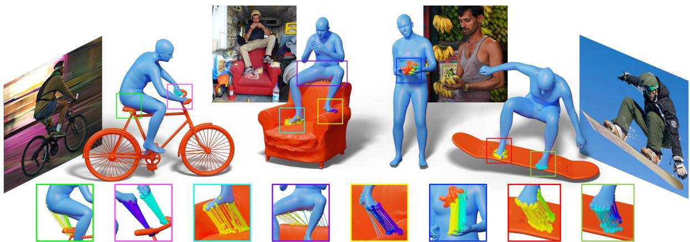
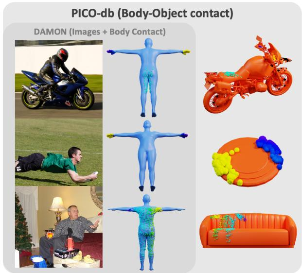
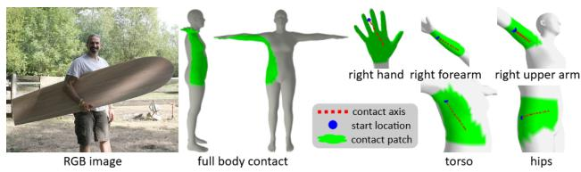
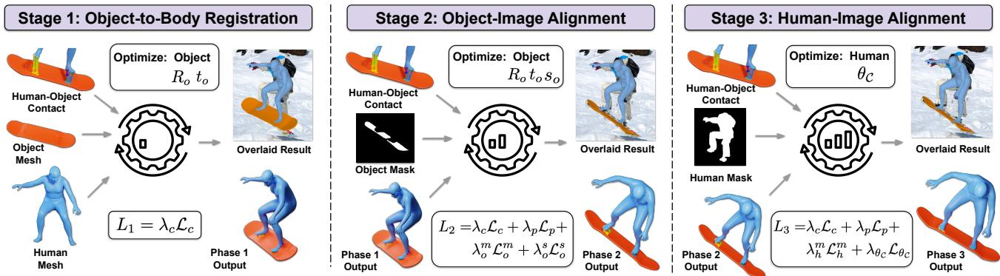
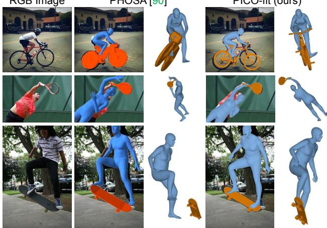
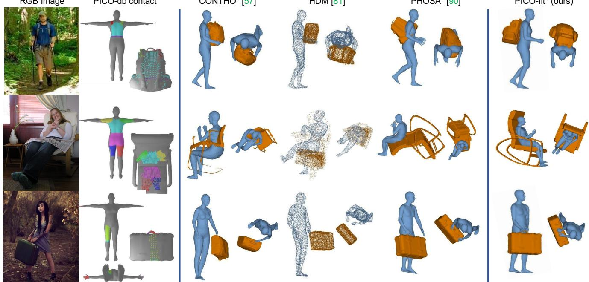
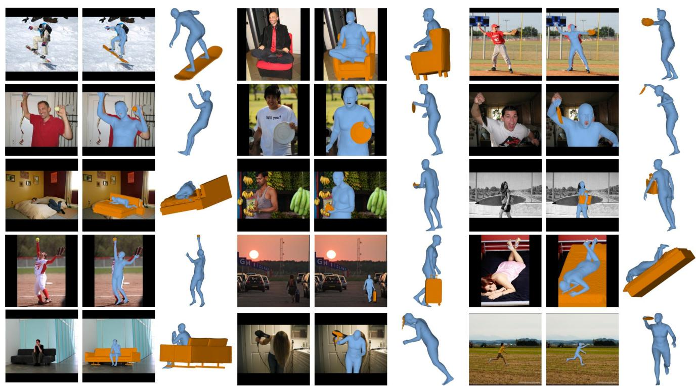

# PICO: Reconstructing 3D People In Contact with Objects

Alpar Cseke ´ 1,2∗‡ Shashank Tripathi1∗† Sai Kumar Dwivedi1 Arjun S. Lakshmipathy3 Agniv Chatterjee4 Michael J. Black1 Dimitrios Tzionas5

1Max Planck Institute for Intelligent Systems, Tubingen, Germany¨ 2Meshcapade 3Carnegie Mellon University, USA 4UT Austin, USA 5University of Amsterdam, the Netherlands

  
Figure 1. We present PICO, a novel framework for joint human-object reconstruction in 3D. PICO includes PICO-db, a unique dataset that pairs natural images with dense vertex-level 3D contact correspondences on both the human and the object. We leverage this dataset for building PICO-fit, an optimization-based method that fits 3D body and object meshes to an image guided by rich contact constraints. Here, we show reconstruction results of PICO-fit: 3D human pose and shape (shown with blue color), 3D object pose and shape (shown with orange color), and contact correspondences (shown with various colors in inset). Note that PICO-fit works for in-the-wild images, as wel as for many previously untackled object classes.

## Abstract

Recovering 3D Human-Object Interaction (HOI) from single images is challenging due to depth ambiguities, occlusions, and the huge variation in object shape and appearance. Thus, past work requires controlled settings such as known object shapes and contacts, and tackles only limited object classes. Instead, we need methods that generalize to natural images and novel object classes. We tackle this in two main ways: (1) We collect PICO-db, a new dataset of natural images uniquely paired with dense 3D contact correspondences on both body and object meshes. To this end, we use images from the recent DAMON dataset that are paired with annotated contacts, but only on a canonical 3D body. In contrast, we seek contact labels on both the body and the object. To infer these, given an image, we retrieve an appropriate 3D object mesh from a database by leveraging vision foundation models. Then, we project DAMON’s body contact patches onto the object via a novel method needing only 2 clicks per patch.

This minimal human input establishes rich contact correspondences between bodies and objects. (2) We exploit our new dataset in a novel render-and-compare fitting method, called PICO-fit, to recover 3D body and object meshes in interaction. PICO-fit infers contact for the SMPL-X body, retrieves a likely 3D object mesh and contactfrom PICO-db for that object, and uses the contact to iteratively fit the 3D body and object meshes to image evidence via optimization. Uniquely, PICO-fit works well for many object classes that no existing method can tackle. This is crucial for scaling HOI understanding in the wild. Our data and code are available at https://pico.is.tue.mpg.de.

## 1. Introduction

Humans routinely interact with objects. Thus, recovering Human-Object Interaction (HOI) in 3D from natural images is important for human-centric applications such as smart homes, mixed reality, or assistive robots. At its core, this entails inferring human pose and shape, object pose and shape, and their spatial arrangement and contacts, all in 3D.

Despite progress, the field lies at its infancy due to strong challenges; humans and objects come in a huge variety of shapes, they mutually occlude each other, and contact is often ambiguous in 2D images. Thus, most work focuses on controlled settings, with known object shapes or contacts. To be practical, however, we need to infer 3D HOI from unconstrained 2D images taken in the wild.

For this task, current methods struggle for two reasons. First, no method robustly recovers 3D object shape from single images because, unlike for human bodies, there exists no single statistical model for object shape. And while we might hope that foundation models would provide a solution, their 3D reasoning skills are still limited. Second, given 3D body and object shapes in an image, no method robustly recovers their 3D pose and arrangement. Knowing the contact between the body and the object would facilitate pose estimation of both. Unfortunately, current methods that regress contact information from images either (i) infer contact only in 2D [11], (ii) infer 3D contacts only on the body [70] ignoring objects, or (iii) train on synthetic data [68] so they struggle generalizing to real images.

We tackle these key limitations with a novel framework called PICO (“People In Contact with Objects”) which has three key properties: (1) It facilitates 3D HOI reasoning in natural images with widely varying viewpoints, occlusions, body poses, and objects. (2) It supports human interaction with arbitrary object classes, without requiring an a-priori known object type or shape. (3) It enables the detection of dense contacts on both the human and the object that establish rich point correspondences between them.

Specifically, our PICO approach introduces two novelties: (1) PICO-db, a dataset of natural images uniquely paired with dense body-object 3D contact annotations, and (2) PICO-fit, a novel method for reconstructing accurate 3D HOI from natural color images by exploiting rich contacts. We collect PICO-db and develop PICO-fit as follows.

PICO-db: 3D HOI contacts. To train models that infer 3D contacts from in-the-wild images, we need data. The only such dataset is DAMON [70], which pairs images with 3D contacts on the body. These annotations are crowdsourced via an online tool where people “paint” on a Tposed 3D body the contact points present in an image; see Fig. 2 (dark-gray box). However, DAMON ignores objects. This is a key limitation. Moreover, it is non-trivial to extend this painting tool to include annotating contact on objects. In particular, one needs to ensure that the contacts “painted” on an object agree with those “painted” on the body.

Therefore, to build PICO-db, we repurpose DAMON’s body contacts for objects, inspired by the ContactEdit [43] method. To this end, we observe that body contacts form “patches” of neighboring vertices. ContactEdit defines a finite-length “axis” per contact patch as a fine-grained control for translating, rotating, and deforming it. Crucially, it lets us transfer the patch onto another mesh by just redrawing the axis onto the latter. However, this is intuitive only for experts. Instead, we need to democratize this for non-experts to collect data at scale. To this end, we automatically generate an axis per patch via PCA; the first principal component of contact point locations provides the axis direction, and along this we sample its start-/end-ing points. Crucially, this means that projecting a contact patch onto a new mesh requires just two clicks to define the (autocreated) axis. Since this is an easy task, we integrate it into an online tool and use AMT [2] to crowd-source 3D object annotations for DAMON’s images and 3D body contacts.

  
Figure 2. PICO-db dataset annotations. Left to right: Color image. Contacts (shown in various colors) annotated on the body and object. Contact annotations establish bijective body-object correspondences, denoted with color-coding.

A key problem remains, however. This annotation process requires a 3D object mesh that is both detailed and manifold. To automate the estimation of 3D object shape, we exploit a large-scale database (we curate Objaverse [14]) and the recent OpenShape [52] foundation model. The latter embeds both images and point clouds (or meshes by extension) in a single latent space. At test time, we embed an image in the latent space, find the nearest-neighbor latent code, and retrieve the respective mesh that likely matches the image. This is a simple-yet-efficient, scalable solution.

Using this approach, we collect PICO-db, which contains natural images with 3D contact annotations for both humans and objects; see Fig. 2. Note that our contact transfer is almost-isometry preserving, i.e., PICO-db has bijective body-object correspondences (color-coded in Fig. 2).

PICO-fit: 3D HOI from a 2D image. We develop a new method, called PICO-fit, that takes in a natural image and recovers 3D human pose and shape, object pose and shape, and their spatial arrangement. To this end, we employ an optimization-based render-and-compare fitting method. Specifically, we first initialize 3D body shape and pose via the OSX [49] model. Then, we initialize 3D object shape via OpenShape-based database retrieval (see PICO-db paragraph above), which scales to novel classes. However, initializing object pose in 3D w.r.t. the body is challenging. We solve for 3D object pose by exploiting PICO-db’s bodyobject contact point correspondences as follows.

When operating on PICO-db images we simply exploit its annotations. But when operating on unlabeled images, there exist no contact correspondences, so past work handcrafts these [90]. Instead, we automatically infer these. To this end, given an image, we first infer 3D body contacts using DECO [70], and the object class using SAM [37]. Based on these, we then retrieve from PICO-db the nearestneighbor body contacts, and the respective object shape, object contacts, and body-object contact correspondences. We find this simple approach to be surprisingly effective and we demonstrate how contact correspondences aid in 3D recovery of humans interacting with objects (see Fig. 1).

Evaluation. We extensively compare PICO-fit, both quantitatively and qualitatively, with state-of-the-art methods (PHOSA [90], HDM [81], CONTHO [57]). A perceptual study shows that PICO-fit reconstructions are perceived as much more realistic. Applying PICO-fit on unlabeled images shows that it performs well for many previously untackled object classes, e.g., couches, bananas, and frisbees, demonstrating its ability to scale.

In summary, we make the following main contributions: 1. We collect PICO-db, the first dataset of natural images paired with 3D contact on both humans and objects, with dense bijective contact correspondences between them.

2. To build PICO-db we develop a new method that projects existing body contacts onto objects with minimal effort.

3. We build PICO-fit, a method that recovers 3D HOI from an image, scaling to previously untackled object classes. Data and code are available at https://pico.is.tue.mpg.de.

## 2. Related Work

## 2.1. 3D Humans from single images

Estimating 3D human pose and shape from single images has evolved from optimization- to learning-based methods. Optimization-based methods fit a parametric model [54, 59, 83] to image cues such as keypoints [7, 59, 83], silhouettes [15, 58], or body-part segmentation masks [44]. Learning-based methods directly infer body-model parameters from images [16, 39, 45, 47, 64, 71] or videos [35, 38]. However, some methods infer bodies in model-free fashion as vertices [40, 50, 51] or via implicit functions [55, 66, 82]. Recent work [17, 23, 49] uses transformers for robust inference; here we use the OSX [49] model.

## 2.2. 3D Objects from single images

The field has extensively studied estimating 3D objects from images. To this end, it has used explicit 3D representations such as voxels [12, 21], point clouds [19] or meshes [72], but recently also implicit representations to represent objects of varied topologies [1, 3, 87]. Here, we focus on recent learning-based methods made possible by 3D object-shape datasets [77, 78], as a detailed review is beyond our scope. However, such methods can only tackle limited object categories present in training datasets.

Recent work goes beyond limited categories by using text-to-image diffusion models [63, 65] and large-scale 3D datasets [13, 14]. Zero-1-to-3 [53] re-trains a 2D diffusion model to build a viewpoint-conditioned 3D diffusion model. Others combine 2D and 3D diffusion models [61]. Despite promising results, all these methods require objects to be unoccluded in images, which is unrealistic for HOI. While text-to-3D models [48, 60] do not have this problem, accurately describing objects in text is often difficult.

To address these issues, we harness recent foundation models [22] that build a joint latent space for several modalities. We exploit this space for efficient retrieval via nearestneighbor search. PointBind [25] and OpenShape [52] do this for text, 3D point clouds (and by extension meshes), and images. Here we use OpenShape to efficiently retrieve a likely 3D object mesh [14] given an image crop around an object; this works even with some occlusion.

## 2.3. 3D Humans and objects from single images

Compared to inferring only humans or only objects, jointly inferring them is less explored. To support this direction several datasets have been captured either outdoors [30] or indoors [6, 28, 31] or have been created through synthesis [81]; but these all consider only constrained settings. Learned methods [57, 68, 75, 79–81] trained on such data either directly regress humans and objects jointly [57, 81] or first infer contact as a proxy and then exploit this proxy for optimization-based fitting [68, 79, 80].

There has been significantly less work addressing inthe-wild settings. For example, PHOSA [90] infers a human mesh with an off-the-shelf model, retrieves an object mesh via mask-based database search, and refines its pose via hand-crafted category-wise contact constraints. Wang et al. [73] follow a similar strategy, but replace PHOSA’s hand-crafted constraints with coarse contact information automatically inferred through an LLM. Both category-wise and LLM-based contacts, however, lack image-grounding, resulting in inaccurate HOI reconstruction. In contrast, PICO-fit’s inferred contacts consider the input image and generalize to significantly more diverse objects than previous methods. Moreover, while PHOSA uses a single scale per class, we use instance-specific scale inferred directly from pixels.

## 2.4. 3D Contact estimation

Studying contact has a long history [5, 34]. For example, ObMan [29] generates synthetic grasps [56] and uses these to learn likely contacts. In contrast, ContactDB [8] captures contact regions of real hands grasping 3Dprinted objects via thermal imaging, while other work uses alternative means [41, 88, 89], such as markerbased Motion Capture [20, 69] or multi-view RGB-D [10]. Such work creates datasets for training methods to predict, refine, and associate contacts for pose optimization [9, 24, 32, 42, 74, 84, 91]. But these datasets are captured in the lab, so methods trained on them do not generalize.

COMA [36] and CHORUS [27] train on synthetic data to predict separate human and object contact distributions, and get rough correspondences via heuristic thresholds on proximity/orientation. Instead, PICO-db uses fine manually-set contact correspondences on real, natural images.

More recently, DECO [70], EgoChoir [86] and LEMON [85] crowd-source contact areas in natural images through online “vertex painting” tools. DECO annotators “paint” contact only on the body, while LEMON and EgoChoir annotate on both the human and the object in separate processes; that is, the body and object contacts do not need to correspond. We avoid painting contacts on objects by developing a novel method that projects DECO’s body contacts onto objects with minimal human effort. Crucially, this also establishes bijective body-object contact correspondences. This goes beyond lab [6, 30, 31] or synthetic [68, 81] data, or part-level contacts [90], and serves 3D reconstruction.

## 3. PICO-db Dataset

Training robust 3D HOI methods requires natural images paired with both 3D human and object contacts. The DAMON dataset [70] pairs natural images [26, 46] with vertex-level contacts on the SMPL [54] body, but it lacks 3D object shapes and object contact.

To address this, we build a novel method that retrieves matching 3D object meshes given in-the-wild images (Sec. 3.1), and projects DAMON’s body-only contacts onto the retrieved mesh (Sec. 3.2). We scale this for crowdsourcing contact annotations on the internet (Sec. 3.3). This results in PICO-db, the first dataset that pairs in-the-wild images with 3D object shapes and contacts on both bodies and objects, as well as correspondences between them.

## 3.1. 3D Object shape retrieval

We use OpenShape [52], a model with a joint latent space for images and 3D shapes. Offline, we embed the meshes of the Objaverse-LVIS [14] database into this space. Online, we embed each test image into this space and find the 3 closest object latent codes via cosine-similarity. Out of 3 options, an annotator picks the one best matching the image.

  
Figure 3. Example contact patches with their contact axis.

## 3.2. Contact representation & projection

DAMON’s body contacts form neighboring-vertex patches. We follow “ContactEdit” [43] and represent such patches with a contact “axis” (see Fig. 3), i.e. an open curve on the patch surface. Since every patch vertex can be parameterized with its contact axis, transferring patches to another surface boils down to transferring only the axis. Thus, the axis lets us completely unpack body contact patches onto an object with just two clicks, which define the axis start location and direction, respectively. Crucially, this also defines bijective point correspondences. For details, see Sup. Mat.

However, this approach has two key drawbacks. First, although ContactEdit infers a default axis, it is originally designed for 3D professionals [43], who can “redraw” the default axis when it is non-intuitive. This is challenging and time-consuming for non-experts. We tackle this by automatically computing a high-quality default axis per patch. To this end, for each body patch, we perform Principal Component Analysis on its vertex locations. Then, starting from the mean, we take positive and negative steps in the direction of the most significant component, and project the resulting two points onto the body surface via closest point queries [67]. An axis is generated by tracing a geodesic between the two points, while all intermediate triangle edgecrossings serve as axis way-points.

Second, this approach struggles for contact patches on fine and highly non-convex body areas, such as fingers. Specifically, when synthesizing a patch axis, tracing a “straight” geodesic is hard due to surface concavities. Thus, the axis seems stretched out when transferred to more planar object regions, which confuses annotators and also distorts patches. To tackle this, we create a proxy SMPL mesh with webbed fingers by computing convex hulls for hands; see image in Sup. Mat. This is a simple, yet effective solution.

## 3.3. Collecting PICO-db annotations

The contact transfer method of Sec. 3.2 runs in real time and is user-friendly. Thus, we embed this into an interactive web-browser tool. For each DAMON image, we automatically parameterize its 3D body contacts (via contact axes) and also retrieve a 3D object shape (see Sec. 3.1). Then, we crowd-source annotations for transferring body contacts onto retrieved objects via Amazon Mechanical Turk.

Specifically, for each body-contact patch, annotators click two points on the object mesh – the first click specifies the start of the contact axis and the second click specifies its orientation. Then, the tool instantly displays the transferred contact on the object for visual feedback. Annotators can correct errors by repeating the two clicks (overwriting past efforts). The tool has features such as mesh rotation, zoom in/out, view reset, and a menu for modifying a previouslyannotated contact patch. For a detailed visualization and discussion, see Sup. Mat. and the video on our website.

PICO-db statistics. We annotate 4123 images, spanning 44 object categories and 627 object instances. To ensure high quality, we select proficient annotators via a qualification process and continuously review their work. For detailed statistics and quality checks, see Sup. Mat.

## 4. PICO-fit Method

We develop PICO-fit, a novel method that, given an image $I ,$ recovers a 3D human and object mesh realistically registered w.r.t. each other. Learning this is intractable due to the lack of 3D HOI datasets. Thus, we leverage contact correspondences between the body and the object to fit 3D meshes to images. But this is hard due to strong occlusions and depth ambiguities. We tackle these via a careful initialization and three-stage fitting (see Fig. 4) as follows.

## 4.1. Initialization

Body shape & pose initialization. We apply the OSX [49] regressor on image I to infer a SMPL-X [59] body mesh, H, with initial pose $\theta ^ { * }$ , that has articulated hands.

Object shape initialization. We apply the method of Sec. 3.1, i.e., we use the OpenShape [52] model that embeds images and 3D shapes into a single latent space, G. Offline, we embed into G the Objaverse-LVIS [14] meshes; for each object mesh $\mathcal { O } _ { i }$ , we get a latent code $g _ { i }$ . Then, we embed image I to get the latent code $g _ { i n }$ and find the closest code to it, $\begin{array} { r } { g _ { j } = \operatorname { a r g m a x } _ { j } { \frac { g _ { j } \cdot g _ { i n } } { \| g _ { j } \| \| g _ { i n } \| } } } \end{array}$ , encoding the object mesh ${ \mathcal { O } } _ { j }$ that best matches the image. This is automatic, fast, robust to some occlusions, preserves 3D details, scales well, and easily handles new object classes as databases get richer. We initialize scale, $s _ { o } ^ { * } ,$ , via GPT-4V; see details in Sup. Mat.

Contact initialization. For PICO-db images, we use the associated annotations. For unlabeled images, we need to infer contact correspondences. However, no method can infer contact correspondences on the object w.r.t. the body, due to the huge object shape variance. Our key insight is to exploit 3D contact on bodies, which is easier to infer, as key to “query” the respective object contact from PICO-db.

To this end, we infer vertex-level body contact via DECO [70]. But this is often noisy, as this problem is unsolved. Thus, we further ask GPT-4V “which ⟨body part⟩ is in contact with the ⟨object⟩” to reduce false negatives (in general), and false positives on feet (DECO’s bias); for details see

Sup. Mat. The estimated contact helps “query” PICO-db to retrieve the closest body-contact annotation that maximizes the intersection-over-union (IoU) between these. This is inspired by seminal work [76] showing that nearest-neighbor retrieval from a rich database can be better than regression.

Since PICO-db body contact is paired with 3D object shape, object contact, and body-object contact correspondences, we also retrieve these for free to initialize PICO-fit.

## 4.2. Stage 1: Registering object to body via contact

At this point, we have initialized 3D body shape and pose, 3D object shape, and body-object contacts. However, the object pose remains unknown. To tackle this, we keep the human fixed and use contact correspondences to solve for object pose, i.e., rotation, $R _ { o } ~ \in ~ \mathbb { R } ^ { 3 }$ , and translation, $t _ { o } \in \mathbb { R } ^ { 3 }$ . In detail, we use body-to-object (vertex-to-point) correspondences $\mathbb { S } : = \{ ( v _ { i } , p _ { i } ) \}$ where $v _ { i } \in \mathcal { H }$ are humanmesh vertices, while $p _ { i } \in \mathcal { O }$ are points (that might lie inside triangles) on the object surface. Then, we estimate $R _ { o }$ and $t _ { o }$ and register the object to the body by minimizing a contact loss: $\begin{array} { r } { \mathcal { L } _ { 1 } = \mathcal { L } _ { c } = \frac { 1 } { | \mathbb { S } | } \sum _ { ( v _ { i } , p _ { i } ) \in \mathbb { S } } \| v _ { i } \ - \ p _ { i } \| _ { 2 } } \end{array}$ .

However, all regressors are imperfect, so OSX-inferred bodies can be noisy, especially for challenging images. This also affects object pose. So, after stage 1, human and object meshes might be image-misaligned and need refinement. To avoid chicken-and-egg problems in joint refinement, we first refine the object (stage 2) and then the body (stage 3). Empirically, an extra joint-refinement stage does not help.

## 4.3. Stage 2: Aligning the object to the image

Here we refine the object to align with the image. First, we render the object mesh, O, into a 2D object mask, $\bar { M } _ { o } ,$ via an OSX-inferred camera and the PyTorch3D renderer. Then, we detect in image I an object mask, $M _ { o } .$ , via SAM [62]. Last, with IoU(·) denoting Intersection-over-Union, we define the object mask loss: $\mathcal { L } _ { o } ^ { m } = 1 - \mathrm { I o U } ( M _ { o } , \bar { M } _ { o } )$

However, this might cause human-object penetrations, as it ignores the relative 3D human-object arrangement. We tackle this here. Let $\Omega _ { h }$ be a Signed Distance Field (SDF) [28] around the human mesh, H. For a 3D point, $\Omega _ { h }$ has values proportional to the distance from H, with a positive sign for points inside H and negative outside $\mathcal { H } .$ Then, the penetration loss [33], $\begin{array} { r } { \mathscr { L } _ { p } = \sum _ { v _ { i } \in \mathcal { O } } \Omega _ { h } ( v _ { i } ) } \end{array}$ , runs over all object vertices, vi, paying a penalty, $\begin{array} { r } { \Omega _ { h } ( x , y , z ) = } \end{array}$ $- \mathrm { m i n } ( \mathrm { S D F } ( x , y , z ) , 0 )$ , when $v _ { i }$ penetrates the body. Note that related work [59, 79, 90] penalizes only shallow [4] penetrations and misses extreme ones, in contrast to our $\mathcal { L } _ { p } .$

We also define an object scale loss, $\begin{array} { r } { \mathcal { L } _ { o } ^ { s } = \| s _ { o } ~ - ~ s _ { o } ^ { * } \| _ { 2 } , } \end{array}$ to refine the scale based on image evidence (see $\mathcal { L } _ { o } ^ { m }$ above) while not deviating much from the initial estimate, $s _ { o } ^ { * }$

We optimize over object rotation, $R _ { o } ,$ translation, $t _ { o } ,$ and scale, $s _ { o } \in \mathbb { R }$ . With λ denoting steering weights tuned empirically, we minimize: $L _ { 2 } = \lambda _ { c } \mathcal { L } _ { c } + \lambda _ { p } \mathcal { L } _ { p } + \lambda _ { o } ^ { m } \mathcal { L } _ { o } ^ { m } + \lambda _ { o } ^ { s } \mathcal { L } _ { o } ^ { s }$

  
Figure 4. Overview of PICO-fit, a novel method for fitting interacting 3D body and object meshes to an image. It initializes (Sec. 4.1) 3D body shape and pose via OSX [49], 3D object shape via OpenShape [52], and body-object contacts via retrieval from PICO-db (Sec. 3). Then, it takes three steps: (1) It exploits contacts to solve for object pose, to register the object to the body (Sec. 4.2). (2) It refines objec pose (Sec. 4.3) and (3) body pose (Sec. 4.4) to align these to an object and human mask, respectively, detected in the image while satisfying contacts and avoiding penetrations. For every stage we show inputs, outputs, losses, and optimizable variables. ü Zoom in to see details.

## 4.4. Stage 3: Refining the human pose

The goal is to refine the contact between the human and the pixel-aligned object from Stage 2. To this end, we employ the contact loss $\mathcal { L } _ { c }$ to optimize the human pose. However, this loss alone does not provide enough constraints and may lead to implausible poses. Thus, we add two regularizers.

First, we define a human mask loss, like the object one in Stage 2. Using the same camera as for objects, we render the human mesh, H, as a 2D mask, $\bar { M _ { h } }$ . We also detect in image I a human mask, $M _ { h }$ , via SAM [62]. Then, with IoU(·) denoting Intersection-over-Union, the mask loss is $\mathcal { L } _ { h } ^ { m } = 1 - \mathrm { I o U } ( M _ { h } , \bar { M } _ { h } )$ . But minimizing $\mathcal { L } _ { h } ^ { m }$ by optimizing over θ produces distorted bodies due to depth ambiguity. To tackle this we need another regularizer, $\mathcal { L } _ { r } = \| \theta - \theta ^ { * } \| _ { 2 }$ so that pose θ does not deviate much from the initial $\theta ^ { * }$

Interestingly, we observe that the initial body has a good torso pose, but errors increase towards end effectors. Thus, we optimize only the pose parameters for the limbs after the torso until the ones contacting the object. Assuming just one contacting limb for notational simplicity, let ${ \mathcal { C } } =$ $\{ J _ { r } , J _ { r + 1 } , \ldots , J _ { c } \}$ be the joints from the closest torso joint, $J _ { r }$ , to the contacting joint, $J _ { c } ,$ along the kinematic chain. Then, we only optimize over $\theta _ { \mathcal { C } } = \{ \theta _ { r } , \theta _ { r + 1 } , \dots , \theta _ { c } \}$ . With λ denoting steering weights tuned empirically, we minimize: $L _ { 3 } = \lambda _ { c } \mathcal { L } _ { c } + \lambda _ { p } \mathcal { L } _ { p } + \lambda _ { h } ^ { m } \mathcal { L } _ { h } ^ { m } + \lambda _ { \theta _ { c } } \mathcal { L } _ { \theta _ { c } }$

## 5. Experiments

Existing 3D HOI recovery methods [57, 79, 81] perform well on datasets they train on. However, they fail for outof-domain (OOD) scenarios, i.e.: (1) unseen in-lab datasets, and (2) unseen in-the-wild images; the latter is the main focus of our work. Thus, we compare our PICO-fit method with both regression-based HOI reconstruction methods, i.e., CONTHO [57] and HDM [81], and an optimizationbased one, i.e., PHOSA [90], on these tasks.

<table><tr><td rowspan="2">Methods</td><td rowspan="2">Ref.</td><td rowspan="2">Type</td><td rowspan="2">GT con- tact</td><td colspan="3">InterCap [31]</td><td>DAMON [70]</td></tr><tr><td>PA-CDh (cm) ↓</td><td>PA-CD (cm)↓</td><td>PA-CDh+o (cm)↓</td><td>X vs PICO-fit* Pref. Rate (%)</td></tr><tr><td>HDM</td><td>[81]</td><td>Reg.</td><td>x</td><td>17.34</td><td>14.12</td><td>13.6</td><td>20.1 vs 79.9</td></tr><tr><td>CONTHO</td><td>[57]</td><td>Reg.</td><td>x</td><td>8.36</td><td>24.30</td><td>13.14</td><td></td></tr><tr><td>PHOSA</td><td>[90]</td><td>Opt.</td><td>x</td><td>10.07</td><td>23.36</td><td>13.38</td><td></td></tr><tr><td>CONTHO*</td><td>[57]</td><td>Reg.</td><td>√</td><td>8.16</td><td>23.26</td><td>12.81</td><td>24.7 vs 75.3</td></tr><tr><td>PHOSA*</td><td>[90]</td><td>Opt.</td><td>√</td><td>10.12</td><td>20.91</td><td>13.28</td><td>32.0 vs 68.0</td></tr><tr><td>PICO-fit</td><td>Ours</td><td>Opt.</td><td>X</td><td>7.43</td><td>21.85</td><td>10.33</td><td>37.3 vs 62.7</td></tr><tr><td>PICO-fit*</td><td>Ours</td><td>Opt.</td><td>√</td><td>6.66</td><td>13.34</td><td>8.36</td><td>∅</td></tr></table>

Table 1. Evaluation on 3D HOI reconstruction. Middle column: Evaluation on InterCap [31] (Sec. 5.1). Since no method trains on InterCap, this evaluates generalization. Right column: Evaluation on in-the-wild images via a perceptual study (Sec. 5.2). We report the preference rate of results from the competing method (denoted as “X”) over our PICO-fit∗. Left column: “Type” denotes regression or optimization. Using GT contact is highlighted with ∗.

Datasets. To evaluate 3D HOI reconstruction, two in-lab datasets are widely used, InterCap [31] and BEHAVE [6]. These provide multi-view RGB-D images paired with 3D ground-truth (GT) bodies and objects in interaction, with 10 and 20 objects, respectively. Most methods train on BEHAVE. So, we use BEHAVE-trained checkpoints for existing methods, and evaluate generalization to InterCap.

Metrics. Following past work [57, 79, 80], we report the Procrustes-Aligned (PA) Chamfer Distance (CD). We compute this separately on the SMPL-X body $( \mathrm { P A } \ – \mathbf { C D } _ { h } )$ and object mesh $( \mathrm { P A - C D } _ { o } ) _ { : }$ , after first performing PA to align the combined human+object mesh with the GT meshes.

## 5.1. 3D HOI reconstruction – OOD in-lab datasets

We evaluate PICO-fit and SotA methods on InterCap [31] and report results in Tab. 1. The CONTHO model trains on BEHAVE, while HDM trains on ProciGen [81], a synthetic dataset building on BEHAVE and InterCap. So, with the exception of HDM, InterCap is unseen for all models. Thus, we evaluate generalizability for OOD in-lab images.

RGB Image  
PHOSA [90]  
PICO-fit (ours)  
  
Figure 5. Qualitative comparison of PICO-fit vs PHOSA on internet images used for evaluation in the PHOSA paper [90].

Further, we ablate the impact of using ground-truth (GT) 3D contacts extracted from GT human and object InterCap meshes with a distance threshold of 5 cm. This simulates perfect contact “detection” to provide an upper bound on accuracy. Methods that use GT contact are highlighted with a star (∗); see details for each method in Sup. Mat.

When GT contact is available, PICO-fit∗ significantly outperforms all baselines. However, even PICO-fit, which does not use GT contact, performs on par with PHOSA∗ and CONTHO∗, demonstrating its robustness.

## 5.2. 3D HOI reconstruction – In-the-wild images

We evaluate PICO-fit∗ against SotA methods on in-the-wild images through a perceptual study conducted on Amazon Mechanical Turk. We randomly select 75 images from 42 object categories in the DAMON dataset, and evaluate each method on these samples.

Participants are shown an image at the center, along with reconstructions from PICO-fit∗ and baselines, randomly shuffled to the left and right side. The participants mark which of the two reconstructions best reflects the image, while focusing on the 3D human-object contact and spatial alignment. For details about the study, see Sup. Mat.

Note that CONTHO∗ is only trained on 9 object classes. To ensure fair comparison, we evaluate CONTHO∗ on 30 images that span only these specific 9 objects. Note also that HDM outputs a point cloud, while our PICO-fit∗ produces meshes. To avoid introducing any visualization bias, we convert PICO-fit∗ meshes to point clouds.

We report results in Tab. 1 (right), in the form of “X vs PICO-fit∗”, indicating the percentage of times a competing method (“X”) was preferred over our method. On average, participants deemed reconstructions produced by PICO-fit∗ to be more realistic over baselines 74.4% of the time.

<table><tr><td rowspan="2">Stage IDs</td><td colspan="3">Losses</td><td rowspan="2">Optimized Variables</td><td colspan="3">Procrustes-Aligned (PA) CDh ↓</td></tr><tr><td>Lc  $\underline { { \mathcal { L } _ { o , m } } }$ </td><td>Lp</td><td> $\underline { { \boldsymbol { \mathcal { L } } _ { h , m } } }$ </td><td></td><td>CD0↓</td><td>CDh+0 ↓</td></tr><tr><td>1</td><td>√ X</td><td>x</td><td>X</td><td> $\overline { { R _ { o } , t _ { o } } }$ </td><td>7.25</td><td>24.51</td><td>11.47</td></tr><tr><td>1+2</td><td>√ √</td><td>√</td><td>X</td><td> $\underline { { R _ { o } , t _ { o } , s _ { o } } }$ </td><td>6.65</td><td>13.67</td><td>8.40</td></tr><tr><td>1+2+3 (PICO-fit)</td><td>√ √</td><td>√</td><td>√</td><td> $\overline { { R _ { o } , t _ { o } , s _ { o } , \theta _ { C } } }$ </td><td>6.66</td><td>13.34</td><td>8.36</td></tr></table>

Table 2. Ablation study for PICO-fit’s three fitting stages. We evaluate on the InterCap [31] dataset, and report the Procrustes-Aligned Chamfer Distance (PA-CD) for the human (h), object (o), and their combination (h+o). The middle columns show the losses and optimized variables. For qualitative ablation, see Sup. Mat.

Qualitative evaluation. In Fig. 6 we qualitatively compare PICO-fit∗ with SotA methods on DAMON images, only for object categories handled by all baselines. In Fig. 7 we show PICO-fit∗ reconstructions on object categories that no previous method can handle. Finally, in Fig. 5, we qualitatively compare PICO-fit with PHOSA, namely the most related SotA method to ours, on the same internet images used in the PHOSA paper [90]. We show qualitative comparisons of PICO-fit with other baselines in Sup. Mat.

These results show that PICO-fit is more robust and generalizes to challenging natural images better than existing methods. Note that PICO-fit handles several object classes for the first time, due to efficient retrieval from PICO-db.

## 5.3. Ablation study

We evaluate the contribution of PICO-fit’s stages in Tab. 2. This shows that each stage contributes meaningfully, as the accuracy significantly improves for the optimized elements, while non-optimized ones either improve or, in the worstcase, remain practically unchanged. For quantitative ablations on alternate optimization strategies and qualitative ablations on the effect of each PICO-fit stage, see Sup. Mat.

## 6. Conclusions and Future Work

Our work emphasizes how contact, on both the human body and the objects it interacts with, is a foundation for reasoning about 3D HOI. Specifically, we build a new dataset that uniquely pairs natural images with 3D contacts on both the body and the object. Using this, we develop a novel method that exploits contacts to reconstruct 3D HOI from a single image. Our method handles object classes that no existing method handles, via efficient retrieval from our rich dataset.

The next step is to make 3D contact estimation more general, efficient, and robust. To that end, we plan to expand and leverage our dataset of in-the-wild contact labels to train a direct contact regressor. Specifically, we will leverage PICO-fit to automate the creation of pseudo ground truth training labels. With sufficient training data we should be able to replace our nearest-neighbor lookup from PICO-db with a feed-forward model. Last, we will explore vision-language models [18] to go beyond finite datasets.

RGB Image

PICO-db contact

CONTHO\* [57]

HDM [81]

PHOSA\* [90]

PICO-fit\* (ours)

  
Figure 6. Qualitative evaluation of CONTHO∗, HDM and PHOSA∗ alongside PICO-fit∗ on object categories handled by all baselines From left to right: input image, pseudo-GT contact annotations in PICO-db, and 3D reconstructions (a side and top-down view per method) Reconstructions from PICO-fit∗ have better 3D human-object contact and spatial alignment. For more comparisons, see Sup. Mat.

  
Figure 7. HOI reconstructions from PICO-fit∗ on new, previously untackled object categories. Each row (left to right) shows, for three input RGB images, PICO-fit ’s estimated meshes overlaid on the image (camera view) and a side view. For more results, see Sup. Mat.

Acknowledgements: We thank Felix Gruniger for advice on mesh preprocessing, Jean-claude Passy and Valkyrie Felso for advice on the data collection, and Xianghui Xie for advice on HDM evaluation. We also thank Tsvetelina Alexiadis, Taylor Obersat, Claudia Gallatz, Asuka Bertler, Arina Kuznetcova, Suraj Bhor, Tithi Rakshit, Tomasz Niewiadomski, Valerian Fourel and Florentin Doll for their immense help in the data collection and verification process, Benjamin Pellkofer for IT support, and Nikos Athanasiou for the helpful discussions. This work was funded in part by the International Max Planck Research School for Intelligent Systems (IMPRS-IS). D. Tzionas is supported by the ERC Starting Grant (project STRIPES, 101165317)

Disclosure: DT has received a research gift fund from Google. For MJB see https://files.is.tue.mpg.de/black/CoI CVPR 2025.txt

## References

[1] Kalyan Vasudev Alwala, Abhinav Gupta, and Shubham Tulsiani. Pre-train, self-train, distill: A simple recipe for supersizing 3D reconstruction. In Computer Vision and Pattern Recognition (CVPR), pages 3763–3772, 2022. 3

[2] Amazon Mechanical Turk. Amazon Mechanical Turk. https://www.mturk.com, 2024. 2

[3] Dimitrije Antic, Georgios Paschalidis, Shashank Tripathi,´ Theo Gevers, Sai Kumar Dwivedi, and Dimitrios Tzionas. SDFit: 3D object pose and shape by fitting a morphable SDF to a single image. arXiv:2409.16178, 2025. 3

[4] Luca Ballan, Aparna Taneja, Jurgen Gall, Luc Van Gool, and¨ Marc Pollefeys. Motion capture of hands in action using discriminative salient points. In European Conference on Computer Vision (ECCV), pages 640–653, 2012. 5

[5] Keni Bernardin, Koichi Ogawara, Katsushi Ikeuchi, and Ruediger Dillmann. A sensor fusion approach for recognizing continuous human grasping sequences using hidden markov models. Transactions on Robotics (T-RO), 21(1): 47–57, 2005. 4

[6] Bharat Lal Bhatnagar, Xianghui Xie, Ilya A Petrov, Cristian Sminchisescu, Christian Theobalt, and Gerard Pons-Moll. BEHAVE: Dataset and method for tracking human object interactions. In Computer Vision and Pattern Recognition (CVPR), pages 15935–15946, 2022. 3, 4, 6

[7] Federica Bogo, Angjoo Kanazawa, Christoph Lassner, Peter Gehler, Javier Romero, and Michael J. Black. Keep it SMPL: Automatic estimation of 3D human pose and shape from a single image. In European Conference on Computer Vision (ECCV), pages 561–578, 2016. 3

[8] Samarth Brahmbhatt, Cusuh Ham, Charles C. Kemp, and James Hays. ContactDB: Analyzing and predicting grasp contact via thermal imaging. In Computer Vision and Pattern Recognition (CVPR), pages 8709–8719, 2019. 4

[9] Samarth Brahmbhatt, Ankur Handa, James Hays, and Dieter Fox. ContactGrasp: Functional multi-finger grasp synthesis from contact. In International Conference on Intelligent Robots and Systems (IROS), pages 2386–2393, 2019. 4

[10] Samarth Brahmbhatt, Chengcheng Tang, Christopher D. Twigg, Charles C. Kemp, and James Hays. ContactPose: A dataset of grasps with object contact and hand pose. In Eu-

ropean Conference on Computer Vision (ECCV), pages 361– 378, 2020. 4

[11] Yixin Chen, Sai Kumar Dwivedi, Michael J. Black, and Dim itrios Tzionas. Detecting human-object contact in images. In Computer Vision and Pattern Recognition (CVPR), pages 17100–17110, 2023. 2

[12] Christopher B. Choy, Danfei Xu, JunYoung Gwak, Kevin Chen, and Silvio Savarese. 3D-R2N2: A unified approach for single and multi-view 3D object reconstruction. European Conference on Computer Vision (ECCV), 9912:628– 644, 2016. 3

[13] Matt Deitke, Ruoshi Liu, Matthew Wallingford, Huong Ngo, Oscar Michel, Aditya Kusupati, Alan Fan, Christian Laforte, Vikram Voleti, Samir Yitzhak Gadre, Eli VanderBilt, Aniruddha Kembhavi, Carl Vondrick, Georgia Gkioxari, Kiana Ehsani, Ludwig Schmidt, and Ali Farhadi. Objaverse-XL: A universe of 10m+ 3D objects. arXiv:2307.05663, 2023. 3

[14] Matt Deitke, Dustin Schwenk, Jordi Salvador, Luca Weihs, Oscar Michel, Eli VanderBilt, Ludwig Schmidt, Kiana Ehsani, Aniruddha Kembhavi, and Ali Farhadi. Objaverse: A universe of annotated 3D objects. In Computer Vision and Pattern Recognition (CVPR), pages 13142–13153, 2023. 2, 3, 4, 5

[15] Sai Kumar Dwivedi, Nikos Athanasiou, Muhammed Ko cabas, and Michael J. Black. Learning to regress bodies from images using differentiable semantic rendering. In International Conference on Computer Vision (ICCV), pages 11230–11239, 2021. 3

[16] Sai Kumar Dwivedi, Cordelia Schmid, Hongwei Yi, Michael J. Black, and Dimitrios Tzionas. POCO: 3D pose and shape estimation using confidence. In International Con ference on 3D Vision (3DV), pages 85–95, 2024. 3

[17] Sai Kumar Dwivedi, Yu Sun, Priyanka Patel, Yao Feng, and Michael J. Black. TokenHMR: Advancing human mesh recovery with a tokenized pose representation. In Computer Vision and Pattern Recognition (CVPR), pages 1323–1333, 2024. 3

[18] Sai Kumar Dwivedi, Dimitrije Antic, Shashank Tripathi,´ Omid Taheri, Cordelia Schmid, Michael J. Black, and Dimitrios Tzionas. InteractVLM: 3D interaction reasoning from 2D foundational models. In Computer Vision and Pattern Recognition (CVPR), 2025. 7

[19] Haoqiang Fan, Hao Su, and Leonidas J. Guibas. A point set generation network for 3D object reconstruction from a single image. In Computer Vision and Pattern Recognition (CVPR), pages 2463–2471, 2017. 3

[20] Zicong Fan, Omid Taheri, Dimitrios Tzionas, Muhammed Kocabas, Manuel Kaufmann, Michael J. Black, and Otmar Hilliges. ARCTIC: A dataset for dexterous bimanual handobject manipulation. In Computer Vision and Pattern Recog nition (CVPR), pages 12943–12954, 2023. 4

[21] Rohit Girdhar, D. Fouhey, Mikel D. Rodriguez, and A. Gupta. Learning a predictable and generative vector repre sentation for objects. In European Conference on Computer Vision (ECCV), pages 484–499, 2016. 3

[22] Rohit Girdhar, Alaaeldin El-Nouby, Zhuang Liu, Mannat Singh, Kalyan Vasudev Alwala, Armand Joulin, and Ishan

Misra. ImageBind: One embedding space to bind them all. In Computer Vision and Pattern Recognition (CVPR), pages 15180–15190, 2023. 3

[23] Shubham Goel, Georgios Pavlakos, Jathushan Rajasegaran, Angjoo Kanazawa\*, and Jitendra Malik\*. Humans in 4D: Reconstructing and tracking humans with transformers. In International Conference on Computer Vision (ICCV), pages 14737–14748, 2023. 3

[24] Patrick Grady, Chengcheng Tang, Christopher D. Twigg, Minh Vo, Samarth Brahmbhatt, and Charles C. Kemp. ContactOpt: Optimizing contact to improve grasps. In Computer Vision and Pattern Recognition (CVPR), 2021. 4

[25] Ziyu Guo, Renrui Zhang, Xiangyang Zhu, Yiwen Tang, Xianzheng Ma, Jiaming Han, Kexin Chen, Peng Gao, Xianzhi Li, Hongsheng Li, and Pheng-Ann Heng. Point-Bind & Point-LLM: Aligning point cloud with multi-modality for 3D understanding, generation, and instruction following. arXiv:2309.00615, 2023. 3

[26] Saurabh Gupta and Jitendra Malik. Visual semantic role labeling. arXiv:1505.04474, 2015. 4

[27] Sookwan Han and Hanbyul Joo. CHORUS: Learning canonicalized 3D human-object spatial relations from unbounded synthesized images. In International Conference on Computer Vision (ICCV), pages 15835–15846, 2023. 4

[28] Mohamed Hassan, Vasileios Choutas, Dimitrios Tzionas, and Michael J. Black. Resolving 3D human pose ambiguities with 3D scene constraints. In International Conference on Computer Vision (ICCV), pages 2282–2292, 2019. 3, 5

[29] Yana Hasson, Gul Varol, Dimitrios Tzionas, Igor Kale-¨ vatykh, Michael J. Black, Ivan Laptev, and Cordelia Schmid. Learning joint reconstruction of hands and manipulated objects. In Computer Vision and Pattern Recognition (CVPR), pages 11807–11816, 2019. 4

[30] Chun-Hao Huang, Hongwei Yi, Markus Hoschle, Matvey¨ Safroshkin, Tsvetelina Alexiadis, Senya Polikovsky, Daniel Scharstein, and Michael J. Black. Capturing and inferring dense full-body human-scene contact. In Computer Vision and Pattern Recognition (CVPR), pages 13264–13275, 2022. 3, 4

[31] Yinghao Huang, Omid Taheri, Michael J. Black, and Dimitrios Tzionas. InterCap: Joint markerless 3D tracking of humans and objects in interaction. In German Conference on Pattern Recognition (GCPR), pages 281–299, 2022. 3, 4, 6, 7

[32] Hanwen Jiang, Shaowei Liu, Jiashun Wang, and Xiaolong Wang. Hand-object contact consistency reasoning for human grasps generation. In International Conference on Computer Vision (ICCV), 2021. 4

[33] Wen Jiang, Nikos Kolotouros, Georgios Pavlakos, Xiaowei Zhou, and Kostas Daniilidis. Coherent reconstruction of multiple humans from a single image. In Computer Vision and Pattern Recognition (CVPR), pages 5578–5587, 2020. 5

[34] Noriko Kamakura, Michiko Matsuo, Harumi Ishii, Fumiko Mitsuboshi, and Yoriko Miura. Patterns of static prehension in normal hands. American Journal of Occupational Therapy, 34(7):437–445, 1980. 4

[35] Angjoo Kanazawa, Jason Y. Zhang, Panna Felsen, and Jitendra Malik. Learning 3D human dynamics from video. Com-

puter Vision and Pattern Recognition (CVPR), pages 5607– 5616, 2019. 3

[36] Hyeonwoo Kim, Sookwan Han, Patrick Kwon, and Hanbyul Joo. Beyond the contact: discovering comprehensive affordance for 3D objects from pre-trained 2D diffusion models. In European Conference on Computer Vision (ECCV), pages 400–419, 2024. 4

[37] Alexander Kirillov, Eric Mintun, Nikhila Ravi, Hanzi Mao, Chloe Rolland, Laura Gustafson, Tete Xiao, Spencer Whitehead, Alexander C. Berg, Wan-Yen Lo, Piotr Dollar, and´ Ross Girshick. Segment anything. In International Conference on Computer Vision (ICCV), 2023. 3

[38] Muhammed Kocabas, Nikos Athanasiou, and Michael J. Black. VIBE: Video inference for human body pose and shape estimation. In Computer Vision and Pattern Recognition (CVPR), pages 5252–5262, 2020. 3

[39] Muhammed Kocabas, Chun-Hao P. Huang, Otmar Hilliges, and Michael J. Black. PARE: Part attention regressor for 3D human body estimation. In International Conference on Computer Vision (ICCV), pages 11127–11137, 2021. 3

[40] Nikos Kolotouros, Georgios Pavlakos, and Kostas Daniilidis. Convolutional mesh regression for single-image hu man shape reconstruction. In Computer Vision and Pattern Recognition (CVPR), 2019. 3

[41] Arjun S. Lakshmipathy, Dominik Bauer, and Nancy S. Pollard. Contact tracing: A low cost reconstruction framework for surface contact interpolation. In International Conference on Intelligent Robots and Systems (IROS), 2021. 4

[42] Arjun S. Lakshmipathy, Dominik Bauer, Cornelia Bauer, and Nancy S. Pollard. Contact transfer: A direct, user-driven method for human to robot transfer of grasps and manipulations. In International Conference on Robotics and Automation (ICRA), 2022. 4

[43] Arjun S. Lakshmipathy, Nicole Feng, Yu Xi Lee, Moshe Mahler, and Nancy S. Pollard. Contact Edit: Artist tools for intuitive modeling of hand-object interactions. Transactions on Graphics (TOG), 42(4), 2023. 2, 4

[44] Christoph Lassner, Javier Romero, Martin Kiefel, Federica Bogo, Michael J. Black, and Peter Gehler. Unite the people: Closing the loop between 3D and 2D human representations. In Computer Vision and Pattern Recognition (CVPR), 2017. 3

[45] Jiefeng Li, Chao Xu, Zhicun Chen, Siyuan Bian, Lixin Yang, and Cewu Lu. HybrIK: A hybrid analytical-neural inverse kinematics solution for 3D human pose and shape estimation. In Computer Vision and Pattern Recognition (CVPR), pages 3383–3393, 2021. 3

[46] Yong-Lu Li, Liang Xu, Xinpeng Liu, Xijie Huang, Yue Xu, Shiyi Wang, Hao-Shu Fang, Ze Ma, Mingyang Chen, and Cewu Lu. PaStaNet: Toward human activity knowledge en gine. In Computer Vision and Pattern Recognition (CVPR), pages 382–391, 2020. 4

[47] Zhihao Li, Jianzhuang Liu, Zhensong Zhang, Songcen Xu, and Youliang Yan. CLIFF: Carrying location information in full frames into human pose and shape estimation. In European Conference on Computer Vision (ECCV), pages 590– 606, 2022. 3

[48] Chen-Hsuan Lin, Jun Gao, Luming Tang, Towaki Takikawa, Xiaohui Zeng, Xun Huang, Karsten Kreis, Sanja Fidler, Ming-Yu Liu, and Tsung-Yi Lin. Magic3D: High-resolution text-to-3D content creation. Computer Vision and Pattern Recognition (CVPR), 2023. 3

[49] Jing Lin, Ailing Zeng, Haoqian Wang, Lei Zhang, and Yu Li. One-stage 3D whole-body mesh recovery with component aware transformer. In Computer Vision and Pattern Recognition (CVPR), pages 21159–21168, 2023. 3, 5, 6

[50] Kevin Lin, Lijuan Wang, and Zicheng Liu. Mesh graphormer. In International Conference on Computer Vision (ICCV), 2021. 3

[51] Kevin Lin, Lijuan Wang, and Zicheng Liu. End-to-end human pose and mesh reconstruction with transformers. In Computer Vision and Pattern Recognition (CVPR), 2021. 3

[52] Minghua Liu, Ruoxi Shi, Kaiming Kuang, Yinhao Zhu, Xuanlin Li, Shizhong Han, Hong Cai, Fatih Porikli, and Hao Su. OpenShape: Scaling up 3D shape representation towards open-world understanding. In Conference on Neural Information Processing Systems (NeurIPS), 2023. 2, 3, 4, 5, 6

[53] Ruoshi Liu, Rundi Wu, Basile Van Hoorick, Pavel Tokmakov, Sergey Zakharov, and Carl Vondrick. Zero-1-to-3: Zero-shot one image to 3D object. International Conference on Computer Vision (ICCV), 2023. 3

[54] Matthew Loper, Naureen Mahmood, Javier Romero, Gerard Pons-Moll, and Michael J. Black. SMPL: A skinned multiperson linear model. Transactions on Graphics (TOG), 34 (6):248:1–248:16, 2015. 3, 4

[55] Marko Mihajlovic, Shunsuke Saito, Aayush Bansal, Michael Zollhoefer, and Siyu Tang. COAP: Compositional articulated occupancy of people. In Computer Vision and Pattern Recognition (CVPR), 2022. 3

[56] Andrew T. Miller and Peter K. Allen. GraspIt! A versatile simulator for robotic grasping. Robotics & Automation Magazine (RAM), 11:110 – 122, 2004. 4

[57] Hyeongjin Nam, Daniel Sungho Jung, Gyeongsik Moon, and Kyoung Mu Lee. Joint reconstruction of 3D human and object via contact-based refinement transformer. In Computer Vision and Pattern Recognition (CVPR), 2024. 3, 6

[58] Mohamed Omran, Christoph Lassner, Gerard Pons-Moll, Peter Gehler, and Bernt Schiele. Neural body fitting: Unifying deep learning and model based human pose and shape estimation. In International Conference on 3D Vision (3DV), 2018. 3

[59] Georgios Pavlakos, Vasileios Choutas, Nima Ghorbani, Timo Bolkart, Ahmed A. A. Osman, Dimitrios Tzionas, and Michael J. Black. Expressive body capture: 3D hands, face, and body from a single image. In Computer Vision and Pattern Recognition (CVPR), pages 10975–10985, 2019. 3, 5

[60] Ben Poole, Ajay Jain, J. Barron, and B. Mildenhall. Dream-Fusion: Text-to-3D using 2D diffusion. International Conference on Learning Representations (ICLR), 2022. 3

[61] Guocheng Qian, Jinjie Mai, Abdullah Hamdi, Jian Ren, Aliaksandr Siarohin, Bing Li, Hsin-Ying Lee, Ivan Skorokhodov, Peter Wonka, Sergey Tulyakov, and Bernard Ghanem. Magic123: One image to high-quality 3D object generation using both 2D and 3D diffusion priors. In International Conference on Learning Representations (ICLR), 2024. 3

[62] Tianhe Ren, Shilong Liu, Ailing Zeng, Jing Lin, Kunchang Li, He Cao, Jiayu Chen, Xinyu Huang, Yukang Chen, Feng Yan, et al. Grounded SAM: Assembling open-world models for diverse visual tasks. arXiv:2401.14159, 2024. 5, 6

[63] Robin Rombach, Andreas Blattmann, Dominik Lorenz, Patrick Esser, and Bjorn Ommer. High-resolution image syn-¨ thesis with latent diffusion models. Computer Vision and Pattern Recognition (CVPR), 2022. 3

[64] Yu Rong, Takaaki Shiratori, and Hanbyul Joo. FrankMocap: A monocular 3D whole-body pose estimation system via regression and integration. In International Conference on Computer Vision Workshops (ICCVw), pages 1749–1759, 2021. 3

[65] Chitwan Saharia, William Chan, Saurabh Saxena, Lala Li, Jay Whang, Emily L. Denton, Seyed Kamyar Seyed Ghasemipour, Raphael Gontijo Lopes, Burcu Karagol Ayan, Tim Salimans, Jonathan Ho, David J. Fleet, and Mohammad Norouzi. Photorealistic text-to-image diffusion models with deep language understanding. In Conference on Neural Information Processing Systems (NeurIPS), 2022. 3

[66] Shunsuke Saito, Tomas Simon, Jason Saragih, and Hanbyul Joo. PIFuHD: Multi-level pixel-aligned implicit function for high-resolution 3D human digitization. In Computer Vision and Pattern Recognition (CVPR), 2020. 3

[67] R. Sawhney. FCPW: Fastest closest points in the west. https://github.com/rohan- sawhney/fcpw, 2021. 4

[68] Soshi Shimada, Vladislav Golyanik, Zhi Li, Patrick Perez,´ Weipeng Xu, and Christian Theobalt. HULC: 3D human motion capture with pose manifold sampling and dense con tact guidance. In European Conference on Computer Vision (ECCV), pages 516–533, 2022. 2, 3, 4

[69] Omid Taheri, Nima Ghorbani, Michael J. Black, and Dimitrios Tzionas. GRAB: A dataset of whole-body human grasping of objects. In European Conference on Computer Vision (ECCV), 2020. 4

[70] Shashank Tripathi, Agniv Chatterjee, Jean-Claude Passy, Hongwei Yi, Dimitrios Tzionas, and Michael J. Black. DECO: Dense estimation of 3D human-scene contact in the wild. In International Conference on Computer Vision (ICCV), pages 8001–8013, 2023. 2, 3, 4, 5, 6

[71] Shashank Tripathi, Lea Muller, Chun-Hao P. Huang, Taheri ¨ Omid, Michael J. Black, and Dimitrios Tzionas. 3D human pose estimation via intuitive physics. In CVPR, pages 4713– 4725, 2023. 3

[72] Nanyang Wang, Yinda Zhang, Zhuwen Li, Yanwei Fu, W. Liu, and Yu-Gang Jiang. Pixel2mesh: Generating 3D mesh models from single rgb images. European Conference on Computer Vision (ECCV), 2018. 3

[73] Xi Wang, Gen Li, Yen-Ling Kuo, Muhammed Kocabas, Emre Aksan, and Otmar Hilliges. Reconstructing action conditioned human-object interactions using commonsense knowledge priors. In International Conference on 3D Vision (3DV), pages 353–362, 2022. 3

[74] Wei Wei, Peng Wang, and Sizhe Wang. Generalized anthropomorphic functional grasping with minimal demonstra tions. arXiv:2303.17808, 2023. 4

[75] Zhenzhen Weng and Serena Yeung. Holistic 3D human and scene mesh estimation from single view images. In Computer Vision and Pattern Recognition (CVPR), pages 334– 343, 2021. 3

[76] Tobias Weyand, Ilya Kostrikov, and James Philbin. PlaNet - Photo geolocation with convolutional neural networks. In European Conference on Computer Vision (ECCV), pages 37–55, 2016. 5

[77] Zhirong Wu, Shuran Song, Aditya Khosla, Fisher Yu, Linguang Zhang, Xiaoou Tang, and Jianxiong Xiao. 3D ShapeNets: A deep representation for volumetric shapes. In Computer Vision and Pattern Recognition (CVPR), pages 1912–1920, 2015. 3

[78] Yu Xiang, Roozbeh Mottaghi, and Silvio Savarese. Beyond PASCAL: A benchmark for 3D object detection in the wild. In Winter Conference on Applications of Computer Vision (WACV), pages 75–82, 2014. 3

[79] Xianghui Xie, Bharat Lal Bhatnagar, and Gerard Pons-Moll. CHORE: contact, human and object reconstruction from a single RGB image. In European Conference on Computer Vision (ECCV), pages 125–145, 2022. 3, 5, 6

[80] Xianghui Xie, Bharat Lal Bhatnagar, and Gerard Pons-Moll. Visibility aware human-object interaction tracking from single RGB camera. In Computer Vision and Pattern Recognition (CVPR), pages 4757–4768, 2023. 3, 6

[81] Xianghui Xie, Bharat Lal Bhatnagar, Jan Eric Lenssen, and Gerard Pons-Moll. Template free reconstruction of humanobject interaction with procedural interaction generation. In Computer Vision and Pattern Recognition (CVPR), 2024. 3, 4, 6

[82] Yuliang Xiu, Jinlong Yang, Xu Cao, Dimitrios Tzionas, and Michael J. Black. ECON: Explicit clothed humans optimized via normal integration. In Computer Vision and Pattern Recognition (CVPR), 2023. 3

[83] Hongyi Xu, Eduard Gabriel Bazavan, Andrei Zanfir, William T. Freeman, Rahul Sukthankar, and Cristian Sminchisescu. GHUM & GHUML: Generative 3D human shape

and articulated pose models. In Computer Vision and Pattern Recognition (CVPR), pages 6183–6192, 2020. 3

[84] Lixin Yang, Xinyu Zhan, Kailin Li, Wenqiang Xu, Jiefeng Li, and Cewu Lu. CPF: Learning a contact potential field to model the hand-object interaction. In International Confer ence on Computer Vision (ICCV), 2021. 4

[85] Yuhang Yang, Wei Zhai, Hongchen Luo, Yang Cao, and Zheng-Jun Zha. LEMON: Learning 3D human-object interaction relation from 2D images. In Computer Vision and Pattern Recognition (CVPR), 2024. 4

[86] Yuhang Yang, Wei Zhai, Chengfeng Wang, Chengjun Yu, Yang Cao, and Zheng-Jun Zha. EgoChoir: Capturing 3D human-object interaction regions from egocentric views. In Conference on Neural Information Processing Systems (NeurIPS), 2024. 4

[87] Yufei Ye, Shubham Tulsiani, and Abhinav Gupta. Shelfsupervised mesh prediction in the wild. In Computer Vision and Pattern Recognition (CVPR), 2021. 3

[88] Jessica Yin, Gregory M. Campbell, James Pikul, and Mark Yim. Multimodal proximity and visuotactile sensing with a selectively transmissive soft membrane. In International Conference on Soft Robotics (RoboSoft), 2022. 4

[89] Jessica Yin, Paarth Sharh, Naveen Kuppuswamy, Andrew Beaulieu, Avinash Uttamchandani, Alejandro Castro, James Pikul, and Russ Tedrake. Proximity and visuotactile point cloud fusion for contact patches in extreme deformation. arXiv:2307.03839, 2023. 4

[90] Jason Y. Zhang, Sam Pepose, Hanbyul Joo, Deva Ramanan, Jitendra Malik, and Angjoo Kanazawa. Perceiving 3D human-object spatial arrangements from a single image in the wild. In European Conference on Computer Vision (ECCV), pages 34–51, 2020. 3, 4, 5, 6, 7

[91] Zhongqun Zhang, Hengfei Wang, Ziwei Yu, Yihua Cheng, Angela Yao, and Hyung Jin Chang. NL2Contact: Natural language guided 3D hand-object contact modeling with dif fusion model. arXiv2:407.12727, 2024. 4