# PROMPT-CAM: Making Vision Transformers Interpretable for Fine-Grained Analysis

Arpita Chowdhury1, Dipanjyoti Paul2, Zheda Mai1, Jianyang Gu1, Ziheng Zhang1, Kazi Sajeed Mehrab3, Elizabeth G. Campolongo1, Daniel Rubenstein4, Charles V. Stewart5, Anuj Karpatne3, Tanya Berger-Wolf1, Yu Su1, Wei-Lun Chao1

1The Ohio State University, 2University of Tsukuba, 3Virginia Tech, 4Princeton University, 5Rensselaer Polytechnic Institute

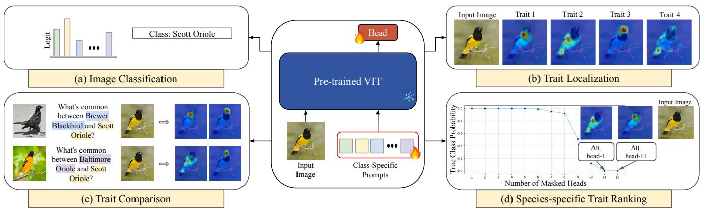

Figure 1. Illustration of PROMPT-CAM. By learning class-specific prompts for a pre-trained Vision Transformer (ViT), PROMPT-CAM enables multiple functionalities. (a) PROMPT-CAM achieves fine-grained image classification using the output logits from the class specific prompts. (b) P -CAM enables trait localization by visualizing the multi-head attention maps queried by the true-class prompt. (c) PROMPT-CAM identifies common traits shared between species by visualizing the attention maps queried by another-class prompt. (d) PROMPT-CAM can identify the most discriminative traits per species (e.g., distinctive yellow chest and black neck for “Scott Oriole”) by systematically masking out the least important attention heads. See subsection 2.3 for details.

## Abstract

We present a simple approach to make pre-trained Vision Transformers (ViTs) interpretable for fine-grained analysis, aiming to identify and localize the traits that distinguish visually similar categories, such as bird species. Pretrained ViTs, such as DINO, have demonstrated remarkable capabilities in extracting localized, discriminativefeatures. However, saliency maps like Grad-CAM often fail to identify these traits, producing blurred, coarse heatmaps that highlight entire objects instead. We propose a novel approach, Prompt Class Attention Map (PROMPT-CAM), to address this limitation. PROMPT-CAM learns classspecific prompts for a pre-trained ViT and uses the corresponding outputs for classification. To correctly classify an image, the true-class prompt must attend to unique image patches not present in other classes’ images (i.e., traits). As

a result, the true class’s multi-head attention maps reveal traits and their locations. Implementation-wise, PROMPT-CAM is almost a “free lunch,” requiring only a modification to the prediction head of Visual Prompt Tuning (VPT). This makes PROMPT-CAM easy to train and apply, in stark contrast to other interpretable methods that require designing specific models and training processes. Extensive empirical studies on a dozen datasets from various domains (e.g., birds, fishes, insects, fungi, flowers, food, and cars) validate the superior interpretation capability of PROMPT-CAM. The source code and demo are available at https: //github.com/Imageomics/Prompt\_CAM.

## 1. Introduction

Vision Transformers (ViT) [9] pre-trained on huge datasets have greatly improved vision recognition, even for finegrained objects [10, 40, 48, 54]. DINO [4] and DINOv2 [29] further showed remarkable abilities to extract features that are localized and informative, precisely representing the corresponding coordinates in the input image. These advancements open up the possibility of using pre-trained ViTs to discover “traits” that highlight each category’s identity and distinguish it from other visually close ones.

One popular approach to this is saliency maps, for example, Class Activation Map (CAM) [13, 25, 37, 52]. After extracting the feature maps from an image, CAM highlights the spatial grids whose feature vectors align with the target class’s fully connected weight. While easy to implement and efficient, the reported CAM saliency on ViTs is often far from expectation. It frequently locates the whole object with a blurred, coarse heatmap, instead of focusing on subtle traits that tell visually similar objects (e.g., birds) apart. One may argue that CAM was not originally developed for ViTs, but even with dedicated variants like attention rollout [1, 5, 14], the issue is only mildly attenuated.

What if we look at the attention maps? ViTs rely on selfattention to relate image patches; the [CLS] token aggregates image features by attending to informative patches. As shown in [7, 27, 39], the attention maps of the [CLS] token do highlight local regions inside the object. However, these regions are not “class-specific.” Instead, they often focus on the same object regions across different categories, such as body parts like heads, wings, and tails of bird species. While these are where traits usually reside, they are not traits. For example, the distinction between “Red-winged Blackbird” and other bird species is the red spot on the wing, having little to do with other body parts.

## How can we leverage pre-trained ViTs, particularly their localized and informative patchfeatures, to identify traits that are so specialfor each category?

Our proposal is to prompt ViTs with learnable “classspecific” tokens, one for each class, inspired by [17, 20, 31, 50]. These “class-specific” tokens, once inputted into ViTs, attend to image patches via self-attention, similar to the [CLS] token. However, unlike the [CLS] token, which is “class-agnostic,” these “class-specific” tokens can attend to the same image differently, with the potential to highlight regions specific to the corresponding classes, i.e., traits.

We implement our approach, named Prompt Class Attention Map (PROMPT-CAM), as follows. Given a pretrained ViT and a fine-grained classification dataset with C classes, we add C learnable tokens as additional inputs alongside the input image. To make these tokens “classspecific,” we collect their corresponding output vectors after the final Transformer layer and perform inner products with a shared vector (also learnable) to obtain C “classspecific” scores, following [31]. One may interpret each class-specific score as how clearly the corresponding class’s traits are visible in the input image. Intuitively, the input image’s ground-truth class should possess the highest score, and we encourage this by minimizing a cross-entropy loss, treating the scores as logits. We keep the whole pre-trained ViT frozen and only optimize the C tokens and the shared scoring vector. See section 2 for details and variants.

For interpretation during inference, we input the image and the C tokens simultaneously to the ViT to obtain the C scores. One can then select a specific class (e.g., the highestscore class) and visualize its multi-head attention maps over the image patches. See Figure 1 for an illustration and section 2 for how to rank these maps to highlight the most discriminative traits. When the highest-score class is the ground-truth class, the attention maps reveal its traits. Otherwise, comparing the attention maps of the highest-score class with those of the ground-truth class helps explain why the image is misclassified. Possible reasons include the object being partially occluded or in an unusual pose, making its traits invisible, or the appearance being too similar to a wrong class, possibly due to lighting conditions (Figure 5).

PROMPT-CAM is fairly easy to implement and train. It requires no change to pre-trained ViTs and no specially designed loss function or training strategy—just the standard cross-entropy loss and SGD. Indeed, building upon Visual Prompt Tuning (VPT) [12], one merely needs to adjust a few lines of code and can enjoy fine-grained interpretation. This simplicity sharply contrasts other interpretable methods like ProtoPNet [6] and ProtoTree [26]. Compared to INterpretable TRansformer (INTR) [31], which also featured simplicity, PROMPT-CAM has three notable advantages. First, PROMPT-CAM is encoder-only and can potentially utilize any ViT encoder. In contrast, INTR is built upon an encoder-decoder model pre-trained on object detection datasets. As a result, PROMPT-CAM can more easily leverage up-to-date pre-trained models. Second, PROMPT-CAM can be trained much faster—only the prompts and the shared vector need to be learned. In contrast, INTR typically requires full fine-tuning. Third, PROMPT-CAM produces cleaner and sharper attention maps than INTR, which we attribute to the use of state-of-the-art ViTs like DINO [4] or DINOv2 [29]. Taken together, we view PROMPT-CAM as a simpler yet more powerful interpretable Transformer.

We validate PROMPT-CAM on over a dozen datasets: CUB-200-2011 [45], Birds-525 [33], Oxford Pet [30], Stanford Dogs [15], Stanford Cars [16], iNaturalist-2021- Moths [43], Fish Vista [24], Rare Species [41], Insects-2 [49], iNaturalist-2021-Fungi [43], Oxford Flowers [28], Medicinal Leaf [36], Stanford Cars [16], and Food 101 [2]. PROMPT-CAM can identify different traits of a category through multi-head attention and consistently localize them in images. To our knowledge, PROMPT-CAM is the only explainable or interpretable method for vision that has been evaluated on such a broad range of domains. We further show PROMPT-CAM’s extendability by applying it to discovering taxonomy keys. Our contributions are two-fold.

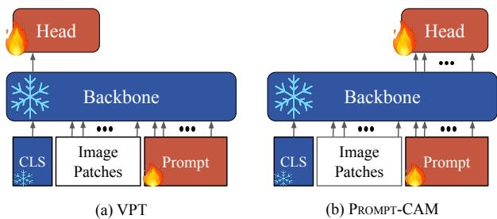  
Figure 2. PROMPT-CAM vs. Visual Prompt Tuning (VPT). (a) VPT [12] adds the prediction head on top of the [CLS] token’s output, a default design to use ViTs for classification. (b) PROMPT-CAM adds the prediction head on top of the injected prompts outputs, making them class-specific to identify and localize traits.

• We present PROMPT-CAM, an easily implementable, trainable, and reproducible interpretable method that leverages the representations of pre-trained ViTs to identify and localize traits for fine-grained analysis.

• We conduct extensive experiments on more than a dozen datasets to validate PROMPT-CAM’s interpretation quality, wide applicability, and extendability.

Comparison to closely related work. Besides INTR [31], our class-specific attentions are inspired by two other works in different contexts, MCTformer for weakly supervised semantic segmentation [50] and Query2Label for multi-label classification [20]. Both of them learned class-specific tokens but aimed to localize visually distinct common objects (e.g., people, horses, and flights). In contrast, we focus on fine-grained analysis: supervised by class labels of visually similar objects $( e . g .$ , bird species), we aim to localize their traits (e.g., red spots on wings). One particular feature of PROMPT-CAM is its simplicity, in both implementation and compatibility with pre-trained backbones, without extra modules, loss terms, and changes to the backbones, making it an almost plug-and-pay approach to interpretation.

Due to space constraints, we provide a detailed related work section in the Supplementary Material (Suppl.).

## 2. Approach

We propose Prompt Class Attention Map (PROMPT-CAM) to leverage pre-trained Vision Transformers (ViTs) [9] for fine-grained analysis. The goal is to identify and localize traits that highlight an object category’s identity. PROMPT-CAM adds learnable class-specific tokens to prompt ViTs, producing class-specific attention maps that reveal traits. The overall framework is presented in Figure 3. We deliberately follow the notation and naming of Visual Prompt Tuning (VPT) [12] for ease of reference.

## 2.1. Preliminaries

A ViT typically contains N Transformer layers [44]. Each consists of a Multi-head Self-Attention (MSA) block, a Multi-Layer Perceptron (MLP) block, and several other operations like layer normalization and residual connections.

The input image I to ViTs is first divided into M fixedsized patches. Each is then projected into a D-dimensional feature space with positional encoding, denoted by $\boldsymbol { e } _ { \mathrm { 0 } } ^ { j } ,$ , with $1 \leq j \leq M$ . We use ${ \pmb { { E } } } _ { 0 } = [ { \pmb { e } } _ { 0 } ^ { 1 } , \bar { \bf \Xi } \cdot \bar { \bf \Xi } , { \pmb { e } } _ { 0 } ^ { M } ] \in \bar { \mathbb { R } } ^ { D \times M }$ to denote their column-wise concatenation.

Together with a learnable [CLS] token $\pmb { x } _ { 0 } ~ \in ~ \mathbb { R } ^ { D }$ , the whole ViT is formulated as:

$$
[ \pmb { E } _ { i } , \pmb { x } _ { i } ] = L _ { i } ( [ \pmb { E } _ { i - 1 } , \pmb { x } _ { i - 1 } ] ) , \quad i = 1 , \cdots , N ,
$$

where $L _ { i }$ denotes the i-th Transformer layer. The final $\mathbf { \mathcal { x } } _ { N }$ is typically used to represent the whole image and fed into a prediction head for classification.

## 2.2. Prompt Class Attention Map (PROMPT-CAM)

Given a pre-trained ViT and a downstream classification dataset with C classes, we introduce a set of C learnable D-dimensional vectors to prompt the ViT. These vectors are learned to be “class-specific” by minimizing the crossentropy loss, during which the ViT backbone is frozen. In the following, we first introduce the baseline version.

PROMPT-CAM-SHALLOW. The C class-specific prompts are injected into the first Transformer layer $L _ { 1 }$ . We denote each prompt by $\pmb { p } ^ { c } \in \mathbb { R } ^ { D }$ , where $1 \leq c \leq C$ , and use $P = [ p ^ { 1 } , \therefore , \bar { p ^ { C } } ] \in \mathbb { R } ^ { D \times C }$ to indicate their column-wise concatenation. The prompted ViT is:

$$
\begin{array} { r l } & { [ Z _ { 1 } , E _ { 1 } , \pmb { x } _ { 1 } ] = L _ { 1 } ( [ \pmb { P } , \pmb { E } _ { 0 } , \pmb { x } _ { 0 } ] ) } \\ & { [ Z _ { i } , E _ { i } , \pmb { x } _ { i } ] = L _ { i } ( [ Z _ { i - 1 } , E _ { i - 1 } , \pmb { x } _ { i - 1 } ] ) , \quad i = 2 , \cdots , N , } \end{array}
$$

where $\boldsymbol { Z } _ { i }$ represents the features corresponding to $P ,$ computed by the i-th Transformer layer $L _ { i }$ . The order among $\scriptstyle { \mathbf { x } _ { 0 } , E _ { 0 } } ,$ , and P does not matter since the positional encoding of patch locations has already been inserted into $\scriptstyle { E _ { 0 } }$

To make $\pmb { P } = [ \pmb { p } ^ { 1 } , \cdots , \pmb { p } ^ { C } ]$ class-specific, we employ a cross-entropy loss on top of the corresponding ViT’s output, $i . e . , Z _ { N } = [ \dot { z } _ { N } ^ { 1 } , \cdot \cdot \cdot , z _ { N } ^ { \dot { C } } ]$ . Given a labeled training example $( I , y \in \{ 1 , \cdots , C \} )$ , we calculate the logit of each class by:

$$
\begin{array} { r } { s [ c ] = { \pmb w } ^ { \top } z _ { N } ^ { c } , \quad 1 \leq c \leq C , } \end{array}\tag{1}
$$

where ${ \pmb w } \in \mathbb { R } ^ { D }$ is a learnable vector. P can then be updated by minimizing the loss:

$$
- \log \left( \frac { \exp \left( s [ y ] \right) } { \sum _ { c } \exp \left( s [ c ] \right) } \right) .\tag{2}
$$

PROMPT-CAM-DEEP. While straightforward, PROMPT-

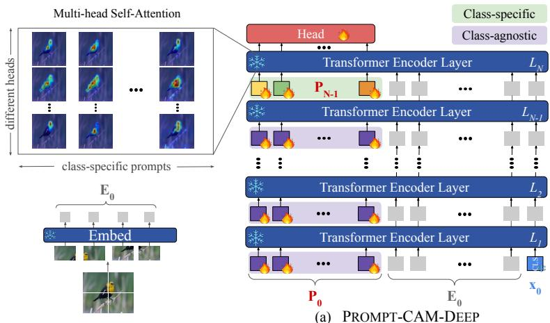

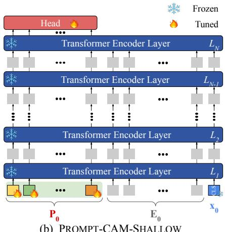  
Figure 3. Overview of Prompt Class Attention Map (PROMPT-CAM). We explore two variants, given a pre-trained ViT with N layers and a downstream task with C classes: (a) PROMPT-CAM-DEEP: insert C learnable “class-specific” tokens to the last layer’s input and C learnable “class-agnostic” tokens to each of the other N − 1 layers’ input; (b) PROMPT-CAM-SHALLOW: insert C learnable “class specific” tokens to thefirst layer’s input. During training, only the prompts and the prediction head are updated; the whole ViT is frozen.

PROMPT-CAM-SHALLOW.

CAM-SHALLOW has two potential drawbacks. First, the class-specific prompts attend to every layer’s patch features, $i . e . , E _ { i } , i = 0 , \cdot \cdot \cdot , N - 1$ . However, features of the early layers are often not informative enough but noisy for differentiating classes. Second, the prompts $\mathbf { \omega } _ { p } \mathbf { 1 } , \cdots , \mathbf { \omega } _ { p } \mathbf { \overset { C } { \partial } }$ have a “double duty.” Individually, each needs to highlight classspecific traits. Collectively, they need to adapt pre-trained ViTs to downstream tasks, which is the original purpose of VPT [12]. In our case, the downstream task is a new usage ofViTs on a specificfine-grained dataset.

To address these issues, we resort to the VPT-Deep’s design while deliberately decoupling injected prompts’ roles. VPT-Deep adds learnable prompts to every layer’s input. Denote by $P _ { i - 1 } = [ \pmb { p } _ { i - 1 } ^ { 1 } , \cdots , \pmb { p } _ { i - 1 } ^ { C } ]$ the prompts to the i-th Transformer layer, the deep-prompted ViT is formulated as:

$$
[ \boldsymbol { Z } _ { i } , \boldsymbol { E } _ { i } , \boldsymbol { x } _ { i } ] = L _ { i } ( [ P _ { i - 1 } , \boldsymbol { E } _ { i - 1 } , \boldsymbol { x } _ { i - 1 } ] ) , \quad i = 1 , \cdots , N ,\tag{3}
$$

It is worth noting that the features $\boldsymbol { Z } _ { i }$ after the i-th layer are not inputted to the next layer, and are typically disregarded.

In PROMPT-CAM-DEEP, we repurpose $Z _ { N }$ for classification, following Equation 1. As such, after minimizing the cross entropy loss in Equation 2, the corresponding prompts $P _ { N - 1 } = [ \pmb { p } _ { N - 1 } ^ { 1 } , \cdot \cdot \cdot , \pmb { p } _ { N - 1 } ^ { C } ]$ will be class-specific. Prompts to the other layers’ inputs, i.e., $P _ { i } = [ p _ { i } ^ { 1 } , \cdots , p _ { i } ^ { C } ]$ for $i = 0 , \cdots , N - 2$ , remain class-agnostic, because $\mathbf { \Delta } _ { \pmb { p } _ { i } ^ { c } }$ does not particularly serve for the c-th class, unlike $\pmb { p } _ { N - 1 } ^ { c } .$ In other words, PROMPT-CAM-DEEP learns both classspecific prompts for trait localization and class-agnostic prompts for adaptation. The class-specific prompts $P _ { N - 1 }$ only attend to the patch features $\pmb { { \cal E } } _ { N - 1 }$ inputted to the last Transformer layer $L _ { N }$ , further addressing the other issue in

In thefollowing, wefocus on PROMPT-CAM-DEEP.

## 2.3. Trait Identification and Localization

During inference, given an image I, PROMPT-CAM-DEEP extracts patch embeddings $\pmb { { \cal E } } _ { 0 } \overset { - } { = } [ e _ { 0 } ^ { 1 } , \cdots , e _ { 0 } ^ { M } ]$ and follows Equation 3 to obtain $Z _ { N }$ and Equation 1 to obtain s[c] for $c \in \{ 1 , \cdots , C \}$ . The predicted label yˆ is:

$$
\hat { y } = \arg \operatorname* { m a x } _ { c \in \{ 1 , \cdots , C \} } s [ c ] .\tag{4}
$$

What are the traits of class c? To answer this question, one could collect images whose true and predicted classes are both class $\textit { c } ( i . e . ,$ , correctly classified) and visualize the multi-head attention maps queried by $\pmb { p } _ { N - 1 } ^ { c }$ in layer $L _ { N }$

Specifically, in layer $L _ { N }$ with R attention heads, the patch features ${ \bf E } _ { N - 1 } \ : \in \ : \mathbb { R } ^ { D \times M }$ are projected into R key matrices, denoted by $\pmb { K } _ { N - 1 } ^ { r } \in \mathbb { R } ^ { D ^ { \prime } \times \bar { M } } , r = 1 , \cdots , \bar { R }$ The j-th column corresponds to the j-th patch in I. Meanwhile, the prompt $\pmb { p } _ { N - 1 } ^ { c }$ is projected into R query vectors $\pmb q _ { N - 1 } ^ { c , r } \in \mathbb { R } ^ { D ^ { \prime } } , r = 1 , \cdots , R$ . Queried by $\pmb { p } _ { N - 1 } ^ { c }$ , the r-th head’s attention map $\pmb { \alpha } _ { N - 1 } ^ { c , r } \in \mathbb { R } ^ { M }$ is computed by:

$$
\alpha _ { N - 1 } ^ { c , r } = \mathrm { s o f t m a x } \left( \frac { K _ { N - 1 } ^ { r } { } ^ { \top } { \pmb q } _ { N - 1 } ^ { c , r } } { D ^ { \prime } } \right) \in \mathbb { R } ^ { M } .\tag{5}
$$

Conceptually, from the r-th head’s perspective, the weight $\alpha _ { N - 1 } ^ { c , r } [ j ]$ indicates how important the j-th patch is for classifying class c, hence localizing traits in the image. Ideally, each head should attend to different (sets of) patches to look for multiple traits that together highlight class $c \mathbf { \hat { s } }$ identity. By visualizing each attention map $\alpha _ { N - 1 } ^ { c , r } , r = 1 , \cdot \cdot \cdot , R ,$ instead of pooling them averagely, PROMPT-CAM can potentially identify up to R different traits for class c.

Which traits are more discriminative? For categories that are so distinctive, like “Red-winged Blackbird,” a few traits are sufficient to distinguish them from others. To automatically identify these most discriminative traits, we take a greedy approach, progressively blurring the least important attention maps until the image is misclassified. The remaining ones highlight traits that are sufficient for classification.

Suppose class c is the true class and the image is correctly classified. In each greedy step, for each of the unblurred heads indexed by $r ^ { \prime } .$ , we iteratively replace ${ \pmb { \alpha } } _ { N - 1 } ^ { c , r ^ { \prime } }$ with $\textstyle { \frac { 1 } { M } } \mathbf { 1 }$ and recalculate $s [ c ]$ in Equation 1, where 1 $\in \mathbb { R } ^ { M }$ is an all-one vector. Doing so essentially blurs the $r ^ { \prime } .$ -th head for class $c ,$ preventing it from focusing. The head with the highest blurred s[c] is thus the least important, as blurring it degrades classification the least. See Suppl. for details.

Why is an image wrongly classified? When $\hat { y } \ne y$ for a labeled image $( I , y )$ , one could visualize both $\{ \alpha _ { N - 1 } ^ { y , r } \} _ { r = 1 } ^ { R }$ and $\{ \alpha _ { N - 1 } ^ { \hat { y } , r } \} _ { r = 1 } ^ { R }$ to understand why the classifier made such a prediction. For example, some traits of class y may be invisible or unclear in I; the object in I may possess class $\hat { y } ^ { \mathrm { ~ s ~ } }$ visual traits, for example, due to light conditions.

## 2.4. Variants and Extensions

Other PROMPT-CAM designs. Besides injecting classspecific prompts to the first layer (i.e., PROMPT-CAM-SHALLOW) or the last (i.e., PROMPT-CAM-DEEP), we also explore their interpolation. We introduce class-specific prompts like PROMPT-CAM-SHALLOW to the i-th layer and class-agnostic prompts like PROMPT-CAM-DEEP to the first i − 1 layers. See the Suppl. for a comparison.

PROMPT-CAM for discovering taxonomy keys. So far, we have focused on $\mathrm { ~ a ~ } ^ { 6 6 } \mathrm { { f l a t } ^ { \prime 3 } }$ comparison over all the categories. In domains like biology that are full of fine-grained categories, researchers often have built hierarchical decision trees to ease manual categorization, such as taxonomy. The role of each intermediate “tree node” is to dichotomize a subset of categories into multiple groups, each possessing certain group-level characteristics (i.e., taxonomy keys).

The simplicity of PROMPT-CAM allows us to efficiently train multiple sets of prompts, one for each intermediate tree node, potentially (re-)discovering the taxonomy keys. One just needs to relabel categories of the same group by a single label, before training. In expectation, along the path from the root to a leaf node, each of the intermediate tree nodes should look at different group-level traits on the same image of that leaf node. See Figure 9 for a preliminary result.

## 2.5. What is PROMPT-CAM suited for?

As our paper is titled, PROMPT-CAM is dedicated to finegrained analysis, aiming to identify and, more importantly, localize traits useful for differentiating categories. This, however, does not mean that PROMPT-CAM would excel in fine-grained classification accuracy. Modern neural networks easily have millions if not billions of parameters. How a model predicts is thus still an unanswered question, at least, not fully. It is known if a model is trained mainly to chase accuracies with no constraints, it will inevitably discover “shortcuts” in the collected data that are useful for classification but not analysis [8, 11]. We thus argue:

To make a model suitable for fine-grained analysis, one must constrain its capacity, while knowing that doing so would unavoidably hurt its classification accuracy.

PROMPT-CAM is designed with this mindset. Unlike conventional classifiers that employ a fully connected layer on top, PROMPT-CAM follows [31] and learns a shared vector w in Equation 1. The goal of w is NOT to capture class-specific information BUT to answer a “binary” question: Based on where a class-specific prompt attends, does the class recognize itself in the input image?

To elucidate the difference, let us consider a simplified single-head-attention Transformer layer with no layer normalization, residual connection, MLP block, and other nonlinear operations. Let $V = \{ \pmb { v } ^ { 1 } , \pmb { \cdot } \cdot \cdot , \pmb { v } ^ { M } \} \in \mathbb { R } ^ { D \times M }$ be the M input patches’ value features, $\pmb { \alpha } ^ { c } \in \mathbb { R } ^ { M }$ be the attention weights of class $c ,$ and $\pmb { \alpha } ^ { \star } \in \mathbb { R } ^ { M }$ be the attention weights of the [CLS] token. Conventional models predict classes by:

$$
\begin{array} { r } { \hat { y } = \underset { - } { \arg \operatorname* { m a x } } _ { c } \pmb { w } _ { c } ^ { \top } ( \underset { j } { \sum } \alpha ^ { \star } [ j ] \times \pmb { v } ^ { j } ) } \\ { = \underset { - } { \arg \operatorname* { m a x } } _ { c } \sum _ { j } \alpha ^ { \star } [ j ] \times ( \pmb { w } _ { c } ^ { \top } \pmb { v } ^ { j } ) , } \end{array}\tag{6}
$$

where ${ \pmb w } _ { c }$ stores the fully connected weights for class c. We argue that this formulation allows for a potential “detour,” enabling the model to correctly classify an image I of class y even without meaningful attention weights. In essence, the model can choose to produce holistically discriminative value features from I without preserving spatial resolution, such that $v ^ { j }$ aligns with ${ \pmb w } _ { y }$ but $\pmb { v } ^ { j } = \bar { \pmb { v } ^ { j ^ { \prime } } } , \forall j \neq j ^ { \prime }$ . In this case, regardless of the specific values of $\alpha ^ { \star }$ , as long as they sum to one—as is default in the softmax formulation—the prediction remains unaffected.

In contrast, PROMPT-CAM predicts classes by:

$$
\begin{array} { r } { \hat { y } = \underset { ^ c } { \arg \operatorname* { m a x } } _ { c } \pmb { w } ^ { \top } ( \underset { ^ j } { \sum } \alpha ^ { c } [ j ] \times \pmb { v } ^ { j } ) } \\ { = \underset { ^ j } { \arg \operatorname* { m a x } } _ { c } \sum _ { j } \alpha ^ { c } [ j ] \times ( \pmb { w } ^ { \top } \pmb { v } ^ { j } ) , } \end{array}\tag{7}
$$

where w is the shared binary classifier. (For brevity, we assume no self-attention among the prompts.) While the difference between Equation 7 and Equation 6 is subtle at first glance, it fundamentally changes the model’s behavior. In essence, it becomes less effective to store class discriminative information in the channels of vj, because there is no ${ \pmb w } _ { c }$ to align with. Moreover, the model can no longer produce holistic features with no spatial resolution; otherwise, it cannot distinguish among classes since all of their scores s[c] will be exactly the same, no matter what $\pmb { \alpha } ^ { c }$ is.

In response, the model must be equipped with two capabilities to minimize the cross-entropy error:

• Generate localized features $v ^ { j }$ that highlight discriminative patches (e.g., the red spot on the wing) of an image.

• Generate distinctive attention weights $\pmb { \alpha } ^ { c }$ across classes, each focusing on traits frequently seen in class c.

These properties are what fine-grained analysis needs.

In sum, PROMPT-CAM discourages patch features from encoding class-discriminative holistic information (e.g., the whole object shapes or mysterious long-distance pixel correlations), even if such information can be “beneficial” to a conventional classifier. To this end, PROMPT-CAM needs to distill localized, trait-specific information from the pretrained ViT’s patch features, which is achieved through the injected class-agnostic prompts in PROMPT-CAM-DEEP.

## 3. Experiments

## 3.1. Experimental Setup

Dataset. We comprehensively evaluate the performance of PROMPT-CAM on 13 diverse fine-grained image classification datasets across three domains: (1) animal-based: CUB-200-2011 (CUB) [45], Birds-525 (Bird) [33], Stanford Dogs (Dog) [15], Oxford Pet (Pet) [30], iNaturalist-2021-Moths (Moth) [43], Fish Vista (Fish) [24], Rare Species (RareS.) [41] and Insects-2 (Insects) [49]; (2) plant and fungi-based: iNaturalist-2021- Fungi (Fungi) [43], Oxford Flowers (Flower) [28] and Medicinal Leaf (MedLeaf) [36]; (3) object-based: Stanford Cars (Car) [16] and Food 101 (Food) [2]. We provide details about data processing and statistics in Suppl.

Model. We consider three pre-trained ViT backbones, DINO [4], DINOv2 [29], and BioCLIP [38] across different scales including ViT-B (the main one we use) and ViT-S. The backbones are kept completely frozen when applying PROMPT-CAM. We mainly used DINO, unless stated otherwise. More details can be found in Suppl.

Baseline Methods. We compared PROMPT-CAM with explainable methods like Grad-CAM [37], Layer-CAM [13] and Eigen-CAM [25] as well as with interpretable methods like ProtoPFormer [51], TesNet [47], ProtoConcepts [21] and INTR [31]. More details are in Suppl.

Table 1. Faithfulness evaluation based on insertion and deletion scores. A higher insertion score and a lower deletion score indicate better results. The results are obtained from the validation images of CUB using the DINO backbone.
<table><tr><td>Method</td><td>Insertion↑</td><td>Deletion↓</td></tr><tr><td>Grad-CAM [37]</td><td>0.52</td><td>0.17</td></tr><tr><td>Layer-CAM[13]</td><td>0.54</td><td>0.13</td></tr><tr><td>Eigen-CAM [25]</td><td>0.56</td><td>0.22</td></tr><tr><td>Attention roll-out [14]</td><td>0.55</td><td>0.27</td></tr><tr><td>PROMPT-CAM</td><td>0.61</td><td>0.09</td></tr></table>

Table 2. Accuracy (%) comparison using the DINO backbone.
<table><tr><td></td><td>Bird</td><td>CUB</td><td>Dog</td><td>Pet</td></tr><tr><td>Linear Probing</td><td>99.2</td><td>78.6</td><td>82.4</td><td>92.4</td></tr><tr><td>PROMPT-CAM</td><td>98.8</td><td>73.2</td><td>81.1</td><td>91.3</td></tr></table>

## 3.2. Experiment Results

Is PROMPT-CAM faithful? We first investigate whether PROMPT-CAM highlights the image regions that the corresponding classifier focuses on when making predictions. We use PROMPT-CAM to rank pixels based on the aggregated attention maps over the top heads. We then employ the insertion and deletion metrics [32], manipulating highly ranked pixels to measure confidence increase and drop.

For comparison, we consider post-hoc explainable methods like Grad-CAM [37], Eigen-CAM [25], Layer-CAM [13], and attention roll-out [14], based on the same ViT backbone with Linear Probing. As summarized in Table 1, PROMPT-CAM yields higher insertion scores and lower deletion scores, indicating a stronger focus on discriminative image traits and highlighting PROMPT-CAM’s enhanced interpretability over standard post-hoc algorithms.

PROMPT-CAM excels in trait identification (human assessment). We then conduct a quantitative human study to evaluate trait identification quality for PROMPT-CAM, Tes-Net [47], and ProtoConcepts [21]. Participants with no prior knowledge about the algorithms were instructed to compare the expert-identified traits (in text, such as orange belly) and the top heatmaps generated by each method. If an expertidentified trait is seen in the heatmaps, it is considered identified by the algorithm. On average, participants recognized 60.49% of traits for PROMPT-CAM, significantly outperforming TesNet and ProtoConcepts whose recognition rates are 39.14% and 30.39%, respectively. The results highlight PROMPT-CAM’s superiority in emphasizing and conveying relevant traits effectively. More details are in Suppl.

Classification accuracy comparison. We observe that PROMPT-CAM shows a slight accuracy drop compared to Linear Probing (see Table 2). However, the images misclassified by PROMPT-CAM but correctly classified by Linear Probing align with our design philosophy: PROMPT-CAM classifies images based on the presence of class-specific, localized traits and would fail if they are invisible. As shown in Figure 5, discriminative traits—such as the red breast of the Red-breasted Grosbeak—are barely visible in images misclassified by PROMPT-CAM due to occlusion, unusual poses, or lighting conditions. Linear Probing correctly classifies them by leveraging global information such as body shapes and backgrounds. Please see more analysis in Suppl.

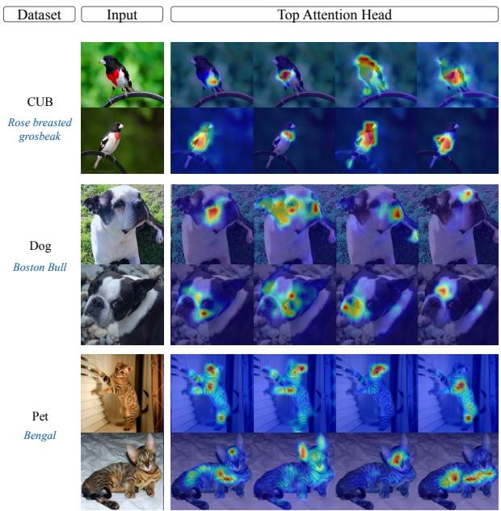

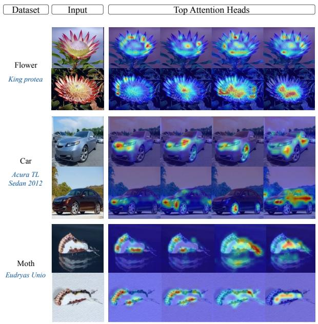  
Figure 4. Visualization of PROMPT-CAM on different datasets. We show the top four attention maps (from left to right) per correctly classified test example triggered by the ground-truth classes.

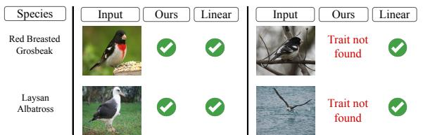  
Figure 5. Images misclassified by PROMPT-CAM but correctly classified by Linear Probing. Species-specific traits—such as the red breast of “Red-breasted Grosbeak”—are barely visible in misclassified images while Linear Probing uses global features such as body shapes, poses, and backgrounds for correct predictions.

Comparison to interpretable models. We conduct a qualitative analysis to compare PROMPT-CAM with other interpretable methods—ProtoPFormer, INTR, TesNet, and ProtoConcepts. Figure 6 shows the top-ranked attention maps or prototypes generated by each method. PROMPT-CAM can capture a more extensive range of distinct, fine-grained traits, in contrast to other methods that often focus on a narrower or repetitive set of attributes (for example, ProtoConcepts in the first three ranks of the fifth row). This highlights PROMPT-CAM’s ability to identify and localize different traits that collectively define a category’s identity.

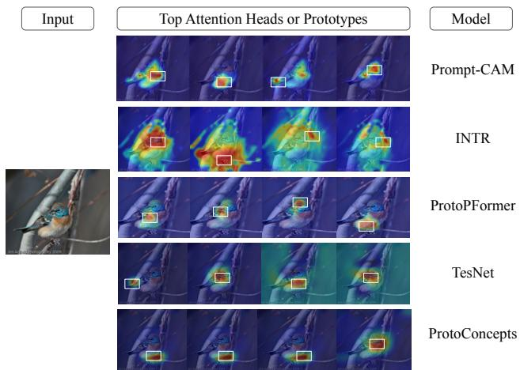  
Figure 6. Comparison of interpretable models. Visual demonstration (heatmaps and bounding boxes) of the four most activated responses of attention heads (PROMPT-CAM and INTR) or prototypes of each method on a “Lazuli Bunting” example image.

## 3.3. Further Analysis and Discussion

PROMPT-CAM on different backbones. Figure 7 illustrates that PROMPT-CAM is compatible with different ViT backbones. We show the top three attention maps generated by PROMPT-CAM using different ViT backbones on an image of Scott Oriole, highlighting consistent identification of traits for species recognition, irrespective of the backbones. Please see the caption and Suppl. for details.

PROMPT-CAM on different datasets. Figure 4 presents the top four attention maps generated by PROMPT-CAM across various datasets spanning diverse domains, including animals, plants, and objects. PROMPT-CAM effectively captures the most important traits in each case to accurately identify species, demonstrating its remarkable generalizability and wide applicability.

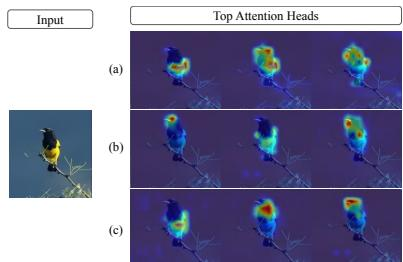

Figure 7. PROMPT-CAM on different backbones. Here we show the top attention maps for PROMPT-CAM on (a) DINO, (b) DINOv2, and (c) BioCLIP backbone. All three sets of attention heads point to consistent key traits of the species “Scott Oriole”— yellow belly, black head, and black chest.  
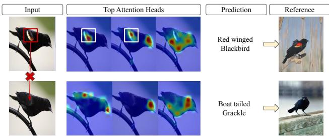  
Figure 8. Trait manipulation. The top row shows attention maps for a correctly classified “Red-winged Blackbird” image. In the second row, the red spot on the bird’s wings was removed, and PROMPT-CAM subsequently classified it as a “Boat-tailed Grackle,” as depicted in the reference column.

PROMPT-CAM can detect biologically meaningful traits. As shown in Figure 4, PROMPT-CAM consistently identifies traits from images of the same species (e.g., the red breast and white belly for Rose-breasted Grosbeak). This is further demonstrated in Figure 1 (d), where we progressively mask attention heads (detailed in subsection 2.3) until the model can no longer generate high-confidence predictions for correctly classifying images of Scott Oriole. The remaining heads 1 and 11 highlight the essential traits, i.e., the black head and yellow belly. PROMPT-CAM also enables identifying common traits between species. This is achieved by visualizing the image of one class (e.g., Scott Oriole) using other classes’ prompts (e.g., Brewer Blackbird or Baltimore Oriole). As shown in Figure 1 (c), Brewer Blackbird shares the head and neck color with Scott Oriole. These results demonstrate PROMPT-CAM ability to recognize species in a biologically meaningful way.

PROMPT-CAM can identify and interpret trait manipulation. We conduct a counterfactual-style analysis to investigate whether PROMPT-CAM truly relies on the identified traits for making predictions. For instance, to correctly classify the Red-winged Blackbird, it highlights the red-wing patch (the first row of Figure 8), consistent with the field guide provided by the Cornell Lab of Ornithology. When we remove this red spot from the image to resemble a Boattailed Grackle, the model no longer highlights the original position of the red patch. As such, it does not predict the image as a Red-winged Blackbird but a Boat-tailed Grackle (the second row of Figure 8). This shows PROMPT-CAM’s sensitivity to trait differences, showcasing its interpretability in fine-grained recognition.

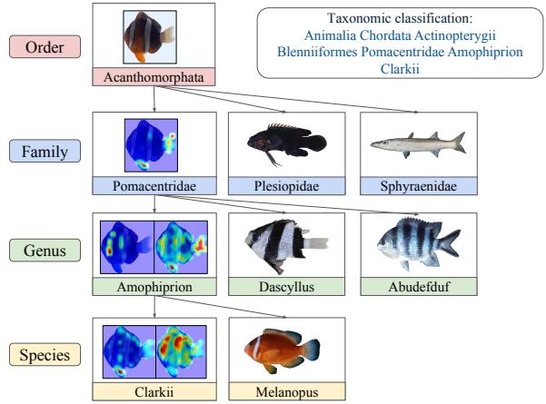  
Figure 9. PROMPT-CAM can detect taxonomically meaningful traits. Give an image of the species “Amophiprion Clarkii,” PROMPT-CAM highlights the pelvic fin and double stripe to distinguish it from “Amophiprion Melanopus” at the species level. When it goes to the genus level, PROMPT-CAM looks at the pattern in the body and tail to classify the image as the “Amophiprion” genus. As we go up, fishes at the family level become visually dissimilar. PROMPT-CAM only needs to look at the tail and pelvic fin to classify the image as the “Pomacentridae” family.

PROMPT-CAM can detect taxonomically meaningful traits. We train PROMPT-CAM based on a hierarchical framework, considering four levels of taxonomic hierarchy: Order → Family → Genus → Species of Fish Dataset. In this setup, PROMPT-CAM progressively shifts its focus from coarse-grained traits at the Family level to fine-grained traits at the Species level to distinguish categories (shown in Figure 9). This progression suggests PROMPT-CAM’s potential to automatically identify and localize taxonomy keys to aid in biological and ecological research domains. We provide more details in Suppl.

## 4. Conclusion

We present Prompt Class Attention Map (PROMPT-CAM), a simple yet effective interpretable approach that leverages pre-trained ViTs to identify and localize discriminative traits for fine-grained classification. PROMPT-CAM is easy to implement and train. Extensive empirical studies highlight both the strong performance of PROMPT-CAM and the promise of repurposing standard models for interpretability.

## Acknowledgment

This research is supported in part by grants from the National Science Foundation (OAC-2118240, HDR Institute:Imageomics). The authors are grateful for the generous support of the computational resources from the Ohio Supercomputer Center.

## References

[1] Samira Abnar and Willem Zuidema. Quantifying attention flow in transformers. arXiv preprint arXiv:2005.00928, 2020. 2

[2] Lukas Bossard, Matthieu Guillaumin, and Luc Van Gool. Food-101–mining discriminative components with random forests. In Computer vision–ECCV 2014: 13th European conference, zurich, Switzerland, September 6-12, 2014, proceedings, part VI 13, pages 446–461. Springer, 2014. 2, 6

[3] Tom B. Brown, Benjamin Mann, Nick Ryder, Melanie Subbiah, Jared Kaplan, Prafulla Dhariwal, Arvind Neelakantan, Pranav Shyam, Girish Sastry, Amanda Askell, Sandhini Agarwal, Ariel Herbert-Voss, Gretchen Krueger, Tom Henighan, Rewon Child, Aditya Ramesh, Daniel M. Ziegler, Jeffrey Wu, Clemens Winter, Christopher Hesse, Mark Chen, Eric Sigler, Mateusz Litwin, Scott Gray, Benjamin Chess, Jack Clark, Christopher Berner, Sam McCandlish, Alec Radford, Ilya Sutskever, and Dario Amodei. Language models are few-shot learners. In Proceedings of the 34th International Conference on Neural Information Processing Systems, 2020. 1

[4] Mathilde Caron, Hugo Touvron, Ishan Misra, Herve J´ egou,´ Julien Mairal, Piotr Bojanowski, and Armand Joulin. Emerging properties in self-supervised vision transformers. In Proceedings of the International Conference on Computer Vision (ICCV), 2021. 2, 6, 1

[5] Hila Chefer, Shir Gur, and Lior Wolf. Transformer interpretability beyond attention visualization. In Proceedings of the IEEE/CVF conference on computer vision and pattern recognition, pages 782–791, 2021. 2

[6] Chaofan Chen, Oscar Li, Daniel Tao, Alina Barnett, Cynthia Rudin, and Jonathan K Su. This looks like that: deep learning for interpretable image recognition. Advances in neural information processing systems, 32, 2019. 2, 1

[7] Timothee Darcet, Maxime Oquab, Julien Mairal, and Piotr´ Bojanowski. Vision transformers need registers. In ICLR, 2024. 2

[8] Yihe Deng, Yu Yang, Baharan Mirzasoleiman, and Quanquan Gu. Robust learning with progressive data expansion against spurious correlation. Advances in neural information processing systems, 36, 2024. 5

[9] Alexey Dosovitskiy, Lucas Beyer, Alexander Kolesnikov, Dirk Weissenborn, Xiaohua Zhai, Thomas Unterthiner, Mostafa Dehghani, Matthias Minderer, Georg Heigold, Sylvain Gelly, Jakob Uszkoreit, and Neil Houlsby. An image is worth 16x16 words: Transformers for image recognition at scale. In International Conference on Learning Representations, 2021. 1, 3

[10] Ju He, Jie-Neng Chen, Shuai Liu, Adam Kortylewski, Cheng Yang, Yutong Bai, and Changhu Wang. Transfg: A transformer architecture for fine-grained recognition. In Proceed ings of the AAAI conference on artificial intelligence, pages 852–860, 2022. 2

[11] Darneisha A Jackson and Keith M Somers. The spectre of ‘spurious’ correlations. Oecologia, 86:147–151, 1991. 5

[12] Menglin Jia, Luming Tang, Bor-Chun Chen, Claire Cardie, Serge Belongie, Bharath Hariharan, and Ser-Nam Lim. Visual prompt tuning. In European Conference on Computer Vision, pages 709–727. Springer, 2022. 2, 3, 4, 1

[13] Peng-Tao Jiang, Chang-Bin Zhang, Qibin Hou, Ming-Ming Cheng, and Yunchao Wei. Layercam: Exploring hierarchical class activation maps for localization. IEEE Transactions on Image Processing, 30:5875–5888, 2021. 2, 6

[14] Rojina Kashefi, Leili Barekatain, Mohammad Sabokrou, and Fatemeh Aghaeipoor. Explainability of vision transformers: A comprehensive review and new perspectives. arXiv preprint arXiv:2311.06786, 2023. 2, 6

[15] Aditya Khosla, Nityananda Jayadevaprakash, Bangpeng Yao, and Fei-Fei Li. Novel dataset for fine-grained image categorization: Stanford dogs. In Proceedings CVPR work shop onfine-grained visual categorization (FGVC), 2011. 2, 6

[16] Jonathan Krause, Michael Stark, Jia Deng, and Li Fei-Fei. 3d object representations for fine-grained categorization. In Proceedings of the IEEE international conference on com puter vision workshops, pages 554–561, 2013. 2, 6

[17] Ruiwen Li, Zheda Mai, Zhibo Zhang, Jongseong Jang, and Scott Sanner. Transcam: Transformer attention-based cam refinement for weakly supervised semantic segmentation. Journal ofVisual Communication and Image Representation, 92:103800, 2023. 2

[18] Fan Liu, Delong Chen, Zhangqingyun Guan, Xiaocong Zhou, Jiale Zhu, Qiaolin Ye, Liyong Fu, and Jun Zhou. Remoteclip: A vision language foundation model for remote sensing. IEEE Transactions on Geoscience and Remote Sensing, 2024. 1

[19] Haotian Liu, Chunyuan Li, Qingyang Wu, and Yong Jae Lee. Visual instruction tuning. In Advances in neural information processing systems, 2024. 1

[20] Shilong Liu, Lei Zhang, Xiao Yang, Hang Su, and Jun Zhu. Query2label: A simple transformer way to multi-label clas sification. arXiv preprint arXiv:2107.10834, 2021. 2, 3

[21] Chiyu Ma, Brandon Zhao, Chaofan Chen, and Cynthia Rudin. This looks like those: Illuminating prototypical con cepts using multiple visualizations. Advances in Neural In formation Processing Systems, 36, 2024. 6, 1, 8

[22] Zheda Mai, Arpita Chowdhury, Ping Zhang, Cheng-Hao Tu, Hong-You Chen, Vardaan Pahuja, Tanya Berger-Wolf, Song Gao, Charles Stewart, Yu Su, et al. Fine-tuning is fine, if calibrated. In The Thirty-eighth Annual Conference on Neural Information Processing Systems, 2024. 1

[23] Zheda Mai, Ping Zhang, Cheng-Hao Tu, Hong-You Chen, Li Zhang, and Wei-Lun Chao. Lessons learned from a unifying empirical study of parameter-efficient transfer learning (petl) in visual recognition. arXiv preprint arXiv:2409.16434, 2024. 1

[24] Kazi Sajeed Mehrab, M Maruf, Arka Daw, Harish Babu Manogaran, Abhilash Neog, Mridul Khurana, Bahadir Altintas, Yasin Bakis, Elizabeth G Campolongo, Matthew J Thompson, et al. Fish-vista: A multi-purpose dataset for understanding & identification of traits from images. arXiv preprint arXiv:2407.08027, 2024. 2, 6

[25] Mohammed Bany Muhammad and Mohammed Yeasin. Eigen-cam: Class activation map using principal components. In 2020 international joint conference on neural networks (IJCNN), pages 1–7. IEEE, 2020. 2, 6, 1

[26] Meike Nauta, Ron Van Bree, and Christin Seifert. Neural prototype trees for interpretable fine-grained image recognition. In Proceedings of the IEEE/CVF conference on computer vision and pattern recognition, pages 14933–14943, 2021. 2

[27] Kam Woh Ng, Xiatian Zhu, Yi-Zhe Song, and Tao Xiang. Dreamcreature: Crafting photorealistic virtual creatures from imagination. arXiv preprint arXiv:2311.15477, 2023. 2

[28] Maria-Elena Nilsback and Andrew Zisserman. Automated flower classification over a large number of classes. In 2008 Sixth Indian conference on computer vision, graphics & image processing, pages 722–729. IEEE, 2008. 2, 6

[29] Maxime Oquab, Timothee Darcet, Theo Moutakanni, Huy V.´ Vo, Marc Szafraniec, Vasil Khalidov, Pierre Fernandez, Daniel Haziza, Francisco Massa, Alaaeldin El-Nouby, Russell Howes, Po-Yao Huang, Hu Xu, Vasu Sharma, Shang-Wen Li, Wojciech Galuba, Mike Rabbat, Mido Assran, Nicolas Ballas, Gabriel Synnaeve, Ishan Misra, Herve Jegou, Julien Mairal, Patrick Labatut, Armand Joulin, and Piotr Bojanowski. Dinov2: Learning robust visual features without supervision, 2023. 2, 6, 1

[30] Omkar M Parkhi, Andrea Vedaldi, Andrew Zisserman, and CV Jawahar. Cats and dogs. In 2012 IEEE conference on computer vision and pattern recognition, pages 3498–3505, 2012. 2, 6

[31] Dipanjyoti Paul, Arpita Chowdhury, Xinqi Xiong, Feng-Ju Chang, David Carlyn, Samuel Stevens, Kaiya Provost, Anuj Karpatne, Bryan Carstens, Daniel Rubenstein, Charles Stewart, Tanya Berger-Wolf, Yu Su, and Wei-Lun Chao. A simple interpretable transformer for fine-grained image classification and analysis. In International Conference on Learning Representations, 2024. 2, 3, 5, 6, 1

[32] V Petsiuk, A Das, and K Saenko. Rise: Randomized input sampling for explanation of black-box models. arxiv 2018. arXiv preprint arXiv:1806.07421, 1806. 6

[33] Gerald Piosenka. Birds 525 species - image classification. 2023. 2, 6

[34] Mattia Rigotti, Christoph Miksovic, Ioana Giurgiu, Thomas Gschwind, and Paolo Scotton. Attention-based interpretability with concept transformers. In International conference on learning representations, 2021. 1

[35] Robin Rombach, Andreas Blattmann, Dominik Lorenz, Patrick Esser, and Bjorn Ommer. High-resolution image¨ synthesis with latent diffusion models. In Proceedings of the IEEE/CVF conference on computer vision and pattern recognition, pages 10684–10695, 2022. 1

[36] Roopashree S and Anitha J. Medicinal Leaf Dataset, 2020. Mendeley Data, V1. 2, 6

[37] Ramprasaath R Selvaraju, Michael Cogswell, Abhishek Das, Ramakrishna Vedantam, Devi Parikh, and Dhruv Batra. Grad-cam: Visual explanations from deep networks via gradient-based localization. In Proceedings of the IEEE international conference on computer vision, pages 618–626, 2017. 2, 6, 1

[38] Samuel Stevens, Jiaman Wu, Matthew J Thompson, Elizabeth G Campolongo, Chan Hee Song, David Edward Carlyn, Li Dong, Wasila M Dahdul, Charles Stewart, Tanya Berger-Wolf, et al. Bioclip: A vision foundation model for the tree of life. In Proceedings of the IEEE/CVF Conference on Computer Vision and Pattern Recognition, pages 19412–19424, 2024. 6, 1

[39] Luming Tang, Menglin Jia, Qianqian Wang, Cheng Perng Phoo, and Bharath Hariharan. Emergent correspondence from image diffusion. Advances in Neural Information Pro cessing Systems, 36:1363–1389, 2023. 2

[40] Zhenchao Tang, Hualin Yang, and Calvin Yu-Chian Chen. Weakly supervised posture mining for fine-grained classification. In Proceedings of the IEEE/CVF Conference on Computer Vision and Pattern Recognition, pages 23735– 23744, 2023. 2

[41] Imageomics Team. Rare Species Dataset, 2023. Dataset with 400 classes of rare species images and descriptions sourced from the Encyclopedia of Life and the IUCN Red List. 2, 6

[42] Cheng-Hao Tu, Zheda Mai, and Wei-Lun Chao. Visual query tuning: Towards effective usage of intermediate representa tions for parameter and memory efficient transfer learning. In Proceedings of the IEEE/CVF Conference on Computer Vision and Pattern Recognition, pages 7725–7735, 2023. 1

[43] Grant Van Horn, Elijah Cole, Sara Beery, Kimberly Wilber, Serge Belongie, and Oisin Mac Aodha. Benchmarking rep resentation learning for natural world image collections. In Proceedings of the IEEE/CVF conference on computer vision and pattern recognition, pages 12884–12893, 2021. 2, 6

[44] Ashish Vaswani, Noam Shazeer, Niki Parmar, Jakob Uszkoreit, Llion Jones, Aidan N. Gomez, Łukasz Kaiser, and Illia Polosukhin. Attention is all you need. In Proceedings ofthe 31st International Conference on Neural Information Processing Systems, page 6000–6010, 2017. 3

[45] Catherine Wah, Steve Branson, Peter Welinder, Pietro Perona, and Serge Belongie. The caltech-ucsd birds-200-2011 dataset. 2011. 2, 6

[46] Haofan Wang, Zifan Wang, Mengnan Du, Fan Yang, Zijian Zhang, Sirui Ding, Piotr Mardziel, and Xia Hu. Score-cam: Score-weighted visual explanations for convolutional neural networks. In Proceedings of the IEEE/CVF conference on computer vision and pattern recognition workshops, pages 24–25, 2020. 1

[47] Jiaqi Wang, Huafeng Liu, Xinyue Wang, and Liping Jing. Interpretable image recognition by constructing transparent embedding space. In Proceedings ofthe IEEE/CVF international conference on computer vision, pages 895–904, 2021. 6, 1, 8

[48] Shijie Wang, Jianlong Chang, Haojie Li, Zhihui Wang, Wanli Ouyang, and Qi Tian. Open-set fine-grained retrieval via prompting vision-language evaluator. In Proceedings of the IEEE/CVF Conference on Computer Vision and Pattern Recognition, pages 19381–19391, 2023. 2

[49] Xiaoping Wu, Chi Zhan, Yu-Kun Lai, Ming-Ming Cheng, and Jufeng Yang. Ip102: A large-scale benchmark dataset for insect pest recognition. In Proceedings ofthe IEEE/CVF conference on computer vision and pattern recognition, pages 8787–8796, 2019. 2, 6

[50] Lian Xu, Wanli Ouyang, Mohammed Bennamoun, Farid Boussaid, and Dan Xu. Multi-class token transformer for weakly supervised semantic segmentation. In Proceedings of the IEEE/CVF conference on computer vision and pattern recognition, pages 4310–4319, 2022. 2, 3

[51] Mengqi Xue, Qihan Huang, Haofei Zhang, Lechao Cheng, Jie Song, Minghui Wu, and Mingli Song. Protopformer: Concentrating on prototypical parts in vision transformers for interpretable image recognition. arXiv preprint arXiv:2208.10431, 2022. 6, 1

[52] Bolei Zhou, Aditya Khosla, Agata Lapedriza, Aude Oliva, and Antonio Torralba. Learning deep features for discriminative localization. In Proceedings of the IEEE conference on computer vision and pattern recognition, pages 2921–2929, 2016. 2, 1

[53] Kaiyang Zhou, Jingkang Yang, Chen Change Loy, and Ziwei Liu. Learning to prompt for vision-language models. International Journal of Computer Vision, 130(9):2337–2348, 2022. 1

[54] Haowei Zhu, Wenjing Ke, Dong Li, Ji Liu, Lu Tian, and Yi Shan. Dual cross-attention learning for fine-grained visual categorization and object re-identification. In Proceedings of the IEEE/CVF conference on computer vision and pattern recognition, pages 4692–4702, 2022. 2