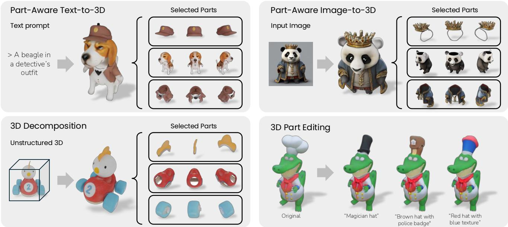
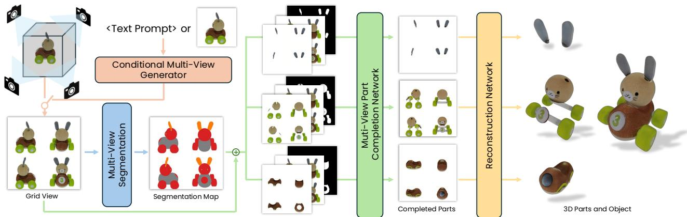
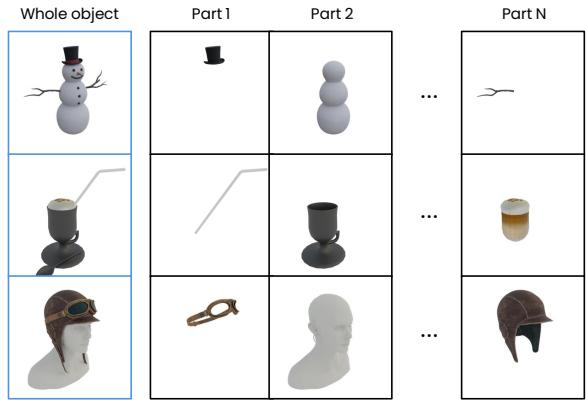
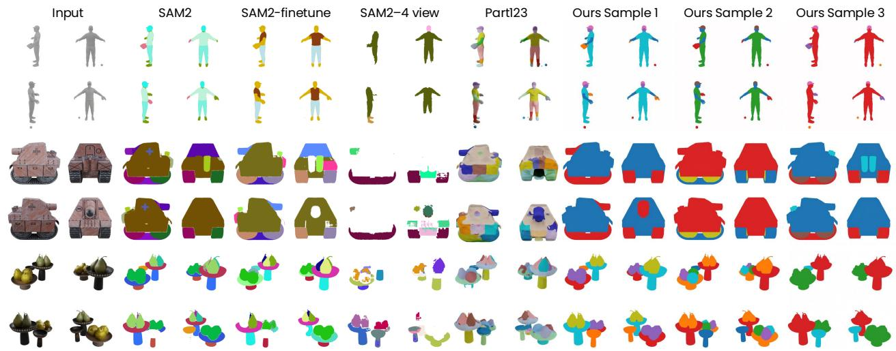
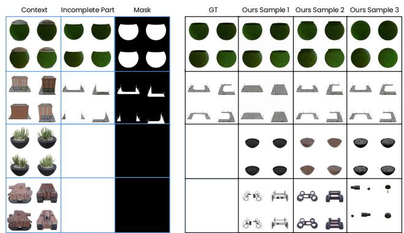
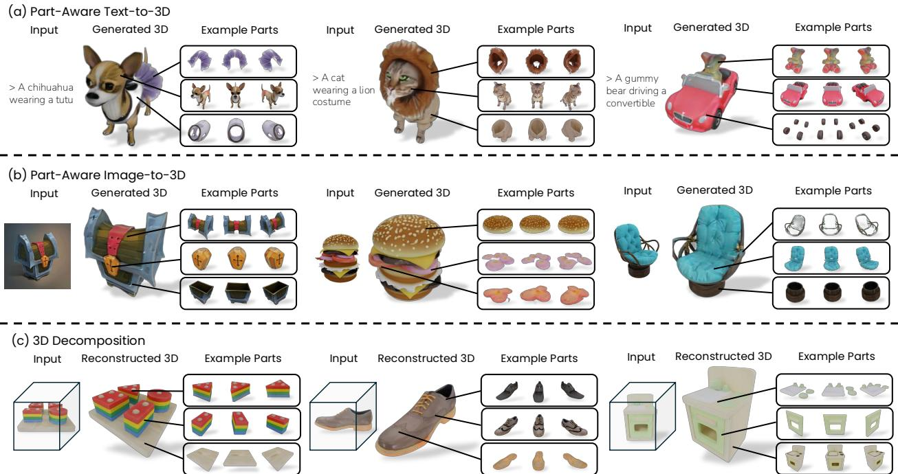
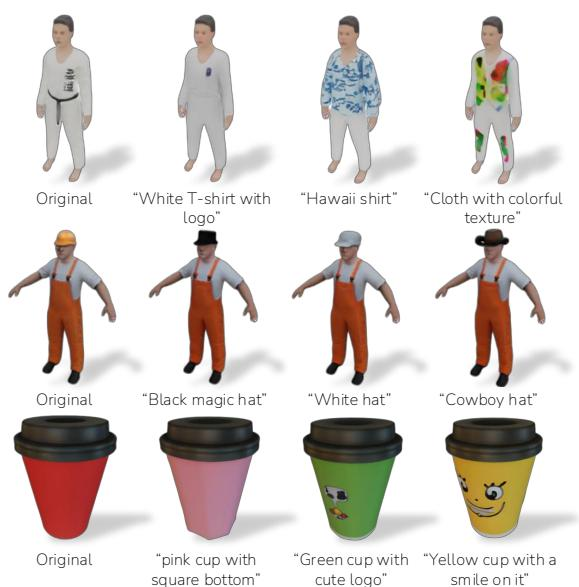

# PartGen: Part-level 3D Generation and Reconstruction with Multi-View Diffusion Models

Minghao Chen1,2 Roman Shapovalov2 Iro Laina1 Tom Monnier2 Jianyuan Wang1,2 David Novotny2 Andrea Vedaldi1,2 1Visual Geometry Group, University of Oxford 2Meta AI

silent-chen.github.io/PartGen

  
Figure 1. We introduce PartGen, a pipeline that generates compositional 3D objects similar to a human artist. It can start from text, an image, or an existing, unstructured 3D object. It consists of a multi-view diffusion model that identifies plausible parts automaticall and another that completes and reconstructs them in 3D, accounting for their context, i.e., the other parts, to ensure that they fit togethe correctly. Additionally, PartGen enables 3D part editing based on text instructions, enhancing flexibility and control in 3D object creation

## Abstract

Text- or image-to-3D generators and 3D scanners can now produce 3D assets with high-quality shapes and textures, but as single, fused entities lacking meaningful structure. In contrast, most applications and creative workflows require 3D assets to be composed of distinct, meaningful parts that can be independently manipulated. To bridge this gap, we introduce PartGen, a novel approach for generating, from text, images, or unstructured 3D objects, 3D objects composed of meaningful parts. Our method leverages a multi-view diffusion model to extract plausible and view-consistent part segmentationsfrom multiple views ofa

3D object, dividing it into meaningful components. A second multi-view diffusion model then processes each part individually, filling in occlusions and generating completed views, which are subsequently passed to a 3D reconstruction network. The completion process ensures that the reconstructed parts integrate cohesively by considering the context ofthe entire object, compensatingfor missing information caused by occlusions and, in extreme cases, hallucinating entirely invisible parts based on contextual cues. We evaluate PartGen on both generated and real 3D assets, demonstrating significant improvements over segmentation and part completion baselines. We also showcase downstream applications such as text-guided 3D part editing.

## 1. Introduction

It is now possible to obtain high-quality 3D objects from text or images via 3D generation [12, 14, 18, 47, 52, 54, 73, 79] and 3D scanning [15, 59, 85]. However, the objects obtained in this manner are usually monolithic and unstructured, represented by a single neural field, mixture of Gaussians, or mesh. This is insufficient in a professional setting, where the structure of an asset is of paramount importance. For example, 3D artists often use parts to facilitate reusing, editing, and animating 3D objects.

In this paper, we thus consider the problem of obtaining structured 3D objects that comprise several meaningful parts, akin to the models produced by 3D artists. For instance, an artist may wish to decompose the 3D model of a person into its clothes and accessories, as well as various anatomical features like hair, eyes, teeth, and limbs. When a 3D object is generated or scanned, however, its parts are usually ‘fused’ together. This is undesirable because the parts may carry different semantics, materials, or motion. Parts may also be physically detachable and interchangeable, and an artist may wish to remove, replace, or edit them independently. In video games, parts often need to be reconfigured dynamically, e.g., to represent a character picking up a weapon or changing clothes. Parts are also important for 3D understanding in robotics, embodied AI, and spatial intelligence [44, 49].

Inspired by these requirements, we introduce PartGen, a method to upgrade existing 3D generation pipelines from producing unstructured 3D objects to generating compositions of meaningful 3D parts (Fig. 1). To do so, we address two key questions: (1) how to automatically segment a 3D object into parts, and (2) how to extract high-quality, complete 3D parts even when these are only partially—or not at all—visible from the exterior of the 3D object.

Part segmentation and completion are highly ambiguous tasks. Since different artists may find it useful to decompose the same object in different ways, there is no ‘goldstandard’ segmentation for any given 3D object. Hence, the goal is to model the distribution of plausible part decompositions rather than a single one. Furthermore, current 3D reconstruction and generation methods only model an object’s visible outer surface, omitting internal details. Therefore, decomposing an object into parts often requires completing or even hallucinating them entirely.

To model this ambiguity, we base part segmentation and completion on generative models. We note that most stateof-the-art 3D generation pipelines [12, 14, 18, 36, 47, 52, 54, 73, 79] start by generating several consistent 2D views of the object, and then apply a 3D reconstruction network to those images to recover the 3D object. We build upon this two-stage scheme and address part segmentation and completion before 3D reconstruction is carried out.

First, we cast part segmentation as a stochastic multiview-consistent coloring problem, fine-tuning a multi-view image generator to produce several color-coded segmentation maps of the given 3D object. We do not assume any explicit or deterministic taxonomy of parts. Instead, we train the model on a large collection of artist-created data, capturing how 3D artists typically decompose objects into parts. This approach has two key benefits. First, it leverages an image generator that is already trained to be viewconsistent. Second, it reduces obtaining multiple plausible segmentations of the object to drawing multiple samples from the model. In practice, we show that this approach better captures the artists’ intent compared to fine-tuning a model like SAM [33] or SAM2 [67] for the same task.

Second, we fine-tune another multi-view image generator to complete the segmented parts while accounting for the context of the object as a whole. In this manner, parts which are only partially visible, or even invisible, in the original input views, are revealed in full to the 3D reconstruction network. This has the benefit of removing most of the ambiguity in the reconstruction task, which is important because the 3D reconstructor network is deterministic and cannot handle ambiguity well. Furthermore, because completion is contextual, the resulting parts fit together well, forming a coherent 3D object despite the fact that the parts are reconstructed independently.

We show that PartGen can be applied to different input modalities: starting from text, an image, or a real-world 3D scan, PartGen can generate 3D assets with meaningful parts. We assess our method empirically on a large collection of 3D assets produced by 3D artists or scanned, both quantitatively and qualitatively. We also demonstrate that PartGen can be easily extended to the task of 3D part editing.

## 2. Related Work

3D generation from text and images. The problem of generating 3D assets from text or images has been thoroughly studied in the literature. Some authors have built generators from scratch. For instance, CodeNeRF [28] learns a latent code for NeRF in a Variational Autoencoder fashion, while Shap-E [29] and 3DGen [21] do so using latent diffusion. PC2 [51] and Point-E [58] diffuse a point cloud, and MosaicSDF [91] uses a semi-explicit SDF-based representation. However, 3D training data is scarce, which makes it difficult to train text-based 3D generators directly.

DreamFusion [62] demonstrated for the first time that 3D assets can be extracted from text-to-image (T2I) diffusion models with the Score Distillation Sampling (SDS) loss. Variants of DreamFusion explore representations like hash grids [38, 63], meshes [38], and 3D Gaussians (3DGS) [9, 75, 93], tweaks to the SDS loss [26, 81, 83, 101], conditioning on an input image [50, 63, 74, 76, 95], regularizing normals or depth [65, 71, 74], and extensions of SDS to 3D editing tasks [7, 60, 69, 72, 102, 103].

Other works focus on improving the 3D awareness of the T2I model, simplifying the extraction of a 3D output and eschewing the need for slow SDS optimization. Inspired by 3DIM [84], Zero-1-to-3 [43] fine-tunes the 2D generator to output novel views of the object. Two-stage approaches [6, 10, 18, 22–24, 41, 45, 46, 52, 71, 77, 82, 86, 88–90] take the output of a text- or image-to-multi-view model that generates multiple views of the object and reconstruct the latter using multi-view reconstruction methods like NeRF [55] or 3DGS [30]. Other approaches reduce the number of input views generated and learn a fast feed-forward network for 3D reconstruction. Perhaps the most notable example is Instant3D [36], based on the Large Reconstruction Model (LRM) [25]. Recently, there has been a focus on 3D compositional generation [11, 37, 61, 104]. D3LL [17] learns 3D object composition through distillation from a 2D T2I generator. ComboVerse [8] starts from a single image, but mostly at the level of different objects instead of their parts, performing single-view inpainting and reconstruction, and using SDS for composition.

3D segmentation. Our work decomposes a given 3D object into parts. Several works have considered segmenting 3D objects or scenes represented in an unstructured manner, often as neural fields or 3D Gaussian mixtures. Semantic-NeRF [98] was the first to fuse 2D semantic segmentation maps in 3D with neural fields. DFF [34] and N3F [80] propose mapping 2D features to 3D fields, allowing for supervised and unsupervised segmentation. LERF [31] extends this concept to language-aware features like CLIP [66]. Contrastive Lift [2] considers instance segmentation, fusing information from several independently segmented views using a contrastive formulation. GARField [32] and OmniSeg3D [94] consider that concepts exist at different levels of scale, which they identify with the help of SAM [33]. LangSplat [64] leverages both CLIP and SAM, creating distinct 3D language fields to model each SAM scale explicitly, while N2F2 [3] automates binding the correct scale to each concept. Neural Part Priors [4] completes and decomposes 3D scans with learned part priors in a test-time optimization manner. Finally, Uni3D [99] learns a ‘foundation’ model for 3D point clouds, enabling zero-shot segmentation.

Primitive-based representations. Some authors propose representing 3D objects as a mixture of primitives [96], which can be seen as related to parts, although they are usually non-semantic. For example, SIF [19] represents an occupancy function as a mixture of 3D Gaussians. LDIF [20] uses the Gaussians to window local occupancy functions implemented as neural fields [53]. Neural Template [27] and SPAGHETTI [1] learn to decompose shapes in a similar manner using an auto-decoding setup. SALAD [35] uses SPAGHETTI as the latent representation for a diffusionbased generator. PartNeRF [78] is conceptually similar but builds a mixture of NeRFs. NeuForm [39] and Diff-Facto [57] learn representations that afford part-based control. DBW [56] decomposes real-world scenes with textured superquadric primitives.

Semantic Part-Based Representations. Others have considered 3D parts that are semantic. PartSLIP [42] and Part-SLIP++ [100] use vision-language models to segment objects into parts using point clouds as the representation. Part123 [40] is conceptually similar to Contrastive Lift [2], but applied to objects rather than scenes, and to the output of a monocular reconstruction network instead of NeRF.

In this paper, we address a problem different from the ones above. We generate compositional 3D objects from various modalities using multi-view diffusion models for segmentation and completion. Parts are meaningfully segmented, fully reconstructed, and correctly assembled. We handle the ambiguity of these tasks in a generative way.

## 3. Method

This section introduces PartGen, our framework for generating 3D objects composed of several 3D parts. Each part is a distinct, human-interpretable, self-contained and complete element. PartGen can take different modalities as input (text prompts, image prompts, or 3D assets) and performs part segmentation and completion by repurposing a powerful multi-view diffusion model for these two tasks. An overview of PartGen is given in Fig. 2.

The rest of the section is organized as follows. In Sec. 3.1, we introduce the necessary background on multiview diffusion and briefly describe how PartGen can be applied to text, image, or 3D model inputs. Then, in Secs. 3.2 to 3.4, we describe how PartGen automatically segments, completes, and reconstructs meaningful parts in 3D. In Sec. 3.5, we describe the dataset used to train PartGen.

## 3.1. Background on 3D generation

First, we provide essential background on multi-view diffusion models for 3D generation [36, 71, 73]. These methods typically adopt a two-stage approach to 3D generation.

In the first stage, given a prompt y, an image generator Φ outputs several 2D views of the object from different vantage points. Depending on the nature of y, the network Φ is either a text-to-image (T2I) model [36, 71] or an image-toimage (I2I) model [70, 82]. Here, we assume that the network outputs four views from the four cardinal directions around the object, each with a resolution of $H \times W ;$ ; these are arranged in a $2 \times 2$ grid, forming a single ‘multi-view image $\bar { I } \doteq \mathbb { R } ^ { 3 \times 2 H \times 2 W }$ . This model thus provides a probabilistic mapping $I \sim p ( I \mid \Phi , y )$ . In addition to text and images, the input y can also be an existing 3D model. In this case, I is obtained by rendering the 3D model from the four cardinal views.

  
Figure 2. Overview of PartGen. Our method begins with text, single images, or existing 3D objects to obtain an initial grid view of the object. This view is then processed by a diffusion-based segmentation network to achieve multi-view consistent part segmentation. Next, the segmented parts, along with contextual information, are input into a multi-view part completion network to generate a fully completed view of each part. Finally, a pre-trained reconstruction model generates the 3D parts.

The 2D views I are subsequently passed to a Reconstruction Model (RM) [36, 73, 87], denoted as Ψ, i.e., a neural network that reconstructs the 3D object L in both shape and appearance. The generator Φ is obtained by fine-tuning an image generation model pre-trained on Internet-scale 2D data, which is a significant advantage compared to learning a 3D generator directly, as 3D training data is scarce.

There are many possible choices for the base image generation and 3D reconstruction models. In the experiments, we follow AssetGen [73] and obtain Φ by fine-tuning a pretrained text-to-image diffusion model with an architecture similar to Emu [13], an image generator based on latent diffusion using 8 latent dimensions. Details of the fine-tuning strategy are given in Sec. 4.4 and the sup. mat. For the RM Ψ, we use LightplaneLRM [5], trained on our dataset.

## 3.2. Multi-view part segmentation

The first contribution of our paper is a method for decomposing a 3D object into its constituent parts. Inspired by multi-view diffusion approaches, we frame this decomposition problem as a multi-view segmentation task instead of direct 3D segmentation. Specifically, the goal is to map I to a collection of 2D masks $M ^ { 1 } , \ldots , \bar { M } ^ { S } \in \{ 0 , 1 \} ^ { 2 H \times 2 W }$ one for each visible part of the object. Notably, both the image I and the masks $M _ { i }$ are multi-view grids.

Addressing 3D object segmentation through the lens of multi-view diffusion offers several advantages. First, it allows us to repurpose existing multi-view models Φ, which, as described in Sec. 3.1, are already pre-trained to produce multi-view consistent generations in the RGB domain. Second, it integrates easily with established multi-view frameworks. Third, decomposing an object into parts is an inherently non-deterministic, ambiguous task as it depends on the desired granularity, application requirements, and artistic intent. By learning this task with probabilistic diffusion models, we can capture this ambiguity effectively.

We train the model using a dataset of artist-created 3D objects (Sec. 3.5), where each object L is annotated with a possible decomposition into 3D parts, $\mathbf { L } = ( \mathbf { S } ^ { 1 } , \ldots , \mathbf { S } ^ { S } )$ The input to the model is a multi-view image $I ,$ and the output is a set of multi-view part masks $M ^ { 1 } , { \stackrel { \textstyle - } { M ^ { 2 } } } , \dots , M ^ { S }$ corresponding to parts $\mathbf { S } ^ { 1 } , \ldots , \mathbf { S } ^ { S }$ . To fine-tune the multiview image generators Φ for this task, we quantize the RGB space into Q different (and fixed) colors $c _ { 1 } , \dotsc , c _ { Q } \in$ $[ 0 , 1 ] ^ { 3 }$ . For each training sample $\mathbf { L } = ( \mathbf { S } ^ { k } ) _ { k = 1 } ^ { S } ,$ we assign colors to the parts, mapping part $\mathbf { S } ^ { k }$ to color $c _ { \pi _ { k } } ,$ where π is a random permutation on $\{ 1 , \ldots , Q \}$ (we assume that $Q \ \geq \ S )$ . Given this mapping, we render the segmentation map as a multi-view RGB image $C \in [ 0 , 1 ] ^ { 3 \times 2 H }$ ×2W (Fig. 4). Then, we obtain $\Phi _ { \mathrm { s e g } }$ by fine-tuning Φ to: (1) take as conditioning the multi-view image I, and (2) generate the color-coded multi-view segmentation map C, hence sampling $C \sim p ( C \mid \Phi _ { \mathrm { s e g } } , I )$

This approach can produce alternative segmentations by simply re-running $\Phi _ { \mathrm { s e g } }$ , which is stochastic. It further exploits the fact that $\Phi _ { \mathrm { s e g } }$ is stochastic to discount the specific ‘naming’ or coloring of the parts, which is arbitrary. Naming is a technical issue in instance segmentation that usually requires ad-hoc solutions, but here it is implicitly addressed by the stochastic nature of the model.

To extract the segments at test time, we sample the colorcoded segmentation map C and simply quantize it based on the reference colors $c _ { 1 } , \ldots , c _ { Q }$ , discarding parts that contain only a few pixels.

Implementation details. The network $\Phi _ { \mathrm { s e g } }$ has the same architecture as the network Φ with some changes to allow conditioning on the multi-view image I: we encode it into latent space with the VAE and stack it with the noised latent as the input to the diffusion network.

  
Figure 3. Training data. We obtain a dataset of 3D objects decomposed into parts from artist-created assets. These come ‘naturally’ segmented into parts according to the artist’s design.

## 3.3. Contextual part completion

Our method so far has produced a multi-view image I of the 3D object along with 2D segments $M ^ { 1 } , M ^ { 2 } , \ldots , M ^ { S }$ What remains is to convert these into full 3D part reconstructions. Given a mask M, we could submit the masked image $I \odot M$ to the RM Ψ to obtain a 3D reconstruction of the part, $i . e . , \hat { \mathbf { S } } = \Psi ( I \odot M )$ . However,some parts can be heavily occluded by other parts and, in extreme cases, may be entirely invisible. While we could train the RM to handle such occlusions, in practice, this approach does not work well because part completion is inherently a stochastic problem, whereas the RM is deterministic.

To solve this problem, we repurpose yet again the multiview generator Φ, this time to perform part completion. The latter model is able to generate a full object from text or a single image, so, properly fine-tuned, it should be able to hallucinate any missing portion of a part.

Formally, we fine-tune Φ into a completion model $\Phi _ { \mathrm { c o m p } }$ which maps the masked multi-view part image $I \odot M$ to the completed multi-view part image $\hat { J } \sim p ( \hat { J } \mid \Phi _ { \mathrm { c o m p } } , I \odot M )$ However, we note that sometimes parts are barely visible, so the masked image $I \odot M$ provides very little information. Because we need the generated part to fit well with the other parts and the whole object, we provide the model with the unmasked image I for context. Thus, we condition $p ( \hat { J }$ $I \odot M , I , M )$ on the masked image $I \odot M ,$ , the unmasked image $I ,$ and the mask M. The importance of the context I increases with the extent of the occlusion.

Implementation details. The network architecture resembles that of Sec. 3.2, but extends the conditioning, motivated by the inpainting setup in [68]. We apply the pre-trained VAE separately to the masked image $I \odot M$ and the context image I, yielding $2 \times 8$ channels, and stack them with the 8D noise image and the unencoded part mask M to obtain the 25-channel input to the diffusion model.

## 3.4. Part reconstruction

Given a multi-view part image ${ \hat { J } } ,$ the final step is to reconstruct the part in 3D. Because the part views are now complete and consistent, we can simply use the RM to obtain a predicted reconstruction $\hat { \mathrm { ~ \bf ~ S ~ } } = \Psi ( \hat { J } )$ of the part. We found that the RM does not require fine-tuning to reconstruct object parts, so any good-quality reconstruction model is likely to work well here.

## 3.5. Training data

To train the various models, we require a dataset of 3D objects consisting of multiple parts. We constructed this dataset from a collection of 140k 3D artist-generated assets, licensed for AI training from a commercial source. Each asset L is stored as a GLTF scene that generally contains several watertight meshes $( \mathbf { S } ^ { 1 } , \ldots , \mathbf { S } ^ { S } )$ . These usually correspond to parts as created by the original artists, for instance for editing convenience. Example objects from the dataset are shown in Fig. 3.

Multi-view generator data. To train the multi-view generator models Φ, first of all, we have to render the target multi-view images I consisting of 4 views of the full object. Following Instant3D [36], we rendered shaded colors I from the 4 views from the orthogonal azimuths and $2 0 ^ { \circ }$ elevation and arranged them in $\mathrm { ~ \iota ~ 2 ~ } \times \mathrm { ~ 2 ~ } \mathrm { g r i d }$ . In the case of text conditioning, the training data consists of the pairs $\{ ( I _ { n } , y _ { n } ) \} _ { n = 1 } ^ { N }$ of multi-view images and their text captions. Following AssetGen [73], we chose the 10k highest-quality assets and generated their text captions using a CAP3D-like pipeline [48] that used the LLAMA3 model [16]. In the case of image conditioning, we use all 140k models, and the conditioning $y _ { n }$ comes in the form of single renders from a randomly sampled direction.

Part segmentation and completion data. To train the part segmentation and completion networks, we need to additionally render the multi-view part images and their depth maps. We filter the dataset to avoid having excessively granular parts that likely lack semantic meaning. To this end, we first cull the parts that take less than 5% of the object volume, and then remove the assets that have more than 10 parts or consist of a single monolithic part. This results in a dataset of 45k objects containing a total of 210k parts. Given an object $\mathbf { L } = ( \mathbf { S } _ { s } ) _ { s = 1 } ^ { S }$ , we render the corresponding multi-view images $( J ^ { s } ) _ { s = 1 } ^ { S }$ (shown in Fig. 3) and the corresponding depth maps $( \delta ^ { s } ) _ { s = 1 } ^ { S }$ from the same viewpoints.

The segmentation diffusion network is trained on the dataset of pairs $\{ ( I _ { n } , \mathbf M _ { n } ) \} _ { n = 1 } ^ { N }$ , where the segmentation map $\mathbf { M } = [ M ^ { k } ] _ { k = 1 } ^ { \dot { S } }$ is a stack of multi-view binary part masks $M ^ { k } \in \{ 0 , 1 \} ^ { 2 H \times 2 W }$ . Each mask shows the pixels where the corresponding part is visible in I: $M _ { i , j } ^ { k } = [ k =$ $\mathrm { a r g m i n } _ { l } \delta _ { i , j } ^ { l } ]$ , where $k , l \in \{ 1 , \ldots , S \}$ and brackets denote Iverson brackets. The part completion network is trained on the dataset of triplets $\{ ( I _ { n ^ { \prime } } , J _ { n ^ { \prime } } , M _ { n ^ { \prime } } ) \} _ { n ^ { \prime } = 1 } ^ { N ^ { \prime } }$ . All the components are produced in the way described above.

  
Figure 4. Examples of automatic multi-view part segmentations. By running our method several times, we obtain diverse segmentations, covering the space of artist intents better than alternatives.

<table><tr><td rowspan="2">Method</td><td colspan="2">Automatic</td><td colspan="2">Seeded</td></tr><tr><td> $\mathrm { m A P _ { 5 0 } \uparrow }$ </td><td> $\mathrm { m A P _ { 7 5 } \uparrow }$ </td><td> $\mathrm { m A P _ { 5 0 } \uparrow }$ </td><td> $\mathrm { m A P _ { 7 5 } \uparrow }$ </td></tr><tr><td>Part123 [40]</td><td>11.5</td><td>7.4</td><td>10.3</td><td>6.5</td></tr><tr><td>SAM2† [67]</td><td>20.3</td><td>11.8</td><td>24.6</td><td>13.1</td></tr><tr><td>SAM2* [67]</td><td>37.4</td><td>27.0</td><td>44.2</td><td>30.1</td></tr><tr><td>SAM2 [67]</td><td>35.3</td><td>23.4</td><td>41.4</td><td>27.4</td></tr><tr><td>PartGen (1 sample)</td><td>45.2</td><td>32.9</td><td>44.9</td><td>33.5</td></tr><tr><td>PartGen (5 samples)</td><td>54.2</td><td>33.9</td><td>51.3</td><td>32.9</td></tr><tr><td>PartGen (10 samples)</td><td>59.3</td><td>38.5</td><td>53.7</td><td>35.4</td></tr></table>

Table 1. Segmentation results. SAM2∗ is fine-tuned on our data and ${ \bf S } { \bf A } { \bf M } 2 ^ { \dagger }$ is fine-tuned for multi-view segmentation.

  
Figure 5. Qualitative results of part completion. The images with blue borders are the inputs. Our algorithm produces various plausible completions across different runs. Even when given an empty $( i . e .$ , invisible) part, PartGen attempts to generate internal structures inside the object, such as sand or inner wheels.

## 4. Experiments

We first individually evaluate the two main components of our pipeline, namely part segmentation (Sec. 4.1) and part completion and reconstruction (Sec. 4.2). We then evaluate how well the decomposed reconstruction matches the original object (Sec. 4.3). For all experiments, we use 100 held-out objects from the dataset described in Sec. 3.5.

## 4.1. Part Segmentation

Evaluation protocol. We set up two settings for the segmentation task. One is automatic part segmentation, where the input is the multi-view image I, and the method is required to output all parts of the object $M ^ { 1 } , \ldots , M ^ { S }$ . The other is seeded segmentation, where we assume that users provide a point as an additional input for a specific mask. In this case, the segmentation algorithm is regarded as a black box $\hat { \mathbf { M } } = \boldsymbol { \mathcal { A } } ( I )$ mapping the multi-view image I to a ranked list of N part segmentations (which can, in general, partially overlap). This ranked list is obtained by scoring candidate regions and removing redundant ones — more details are provided in the sup. mat. We then match these segments to the ground-truth segments $M _ { k }$ and report mean Average Precision (mAP). This precision can be low due to the inherent ambiguity of the problem: the parts predicted by the algorithm will not match any particular artist’s choice.

Baselines. We consider the original and fine-tuned SAM2 [67] as our baselines for multi-view segmentation. We fine-tune SAM2 in two different ways. First, we fine-tune SAM2’s mask decoder on our dataset, given the ground-truth masks and randomly selected seed points for different views. Second, we concatenate the four orthogonal views in a multi-view image I and fine-tune SAM2 to predict the multi-view mask M (in this case, the seed point randomly falls in one of the views). SAM2 produces three regions for each input image and seed point. For automatic segmentation, we seed SAM2 with a set of query points spread over the object, obtaining three different regions for each seed point. For seeded segmentation, we simply return the regions that SAM2 outputs for the given seed point. We also provide a comparison with recent work, Part123 [40].

<table><tr><td rowspan="2">Method</td><td colspan="5"></td><td colspan="3">View completion J 3D reconstruction S</td></tr><tr><td>Compl. Multi-view</td><td></td><td>Context</td><td>CLIP↑</td><td>LPIPS↓ PSNR↑</td><td></td><td>CLIP↑</td><td></td><td>LPIPS↓ PSNR↑</td></tr><tr><td>Oracle (Î = J)</td><td>GT</td><td></td><td></td><td>1.0</td><td>0.0</td><td>∞</td><td>0.957</td><td>0.027</td><td>18.91</td></tr><tr><td>PartGen  $( \hat { J } = \boldsymbol { B } ( \boldsymbol { I } \odot \boldsymbol { M } , \boldsymbol { I } ) )$ </td><td>√</td><td>√</td><td>√</td><td>0.974</td><td>0.015</td><td>21.38</td><td>0.936</td><td>0.039</td><td>17.16</td></tr><tr><td>w/o context  $( \hat { J } = B ( I \odot M ) )$ </td><td>√</td><td>√</td><td>x</td><td>0.951</td><td>0.028</td><td>16.80</td><td>0.923</td><td>0.046</td><td>14.83</td></tr><tr><td>single view  $( \hat { J } _ { v } = \mathcal { B } ( I _ { v } \odot M _ { v } , I _ { v } ) )$ </td><td>√</td><td>x</td><td>√</td><td>0.944</td><td>0.031</td><td>15.92</td><td>0.922</td><td>0.051</td><td>13.25</td></tr><tr><td>None (J = I ⊙ M)</td><td>x</td><td></td><td></td><td>0.932</td><td>0.039</td><td>13.24</td><td>0.913</td><td>0.059</td><td>12.32</td></tr></table>

Table 2. Part completion results. We first evaluate view part completion by computing scores w.r.t. the ground-truth multi-view part image J. Then, we evaluate 3D part reconstruction by reconstructing each part S and rendering it. See text for details.

  
Figure 6. Examples of applications. PartGen can effectively generate or reconstruct 3D objects with meaningful and realistic parts in different scenarios: a) Part-aware text-to-3D generation; b) Part-aware image-to-3D generation; c) 3D decomposition. Some assets, like the hamburger and the blocks, consist of more than three parts, but we display only three for a more visually balanced arrangement.

Results. We report the results in Tab. 1. As shown in the table, mAP results for our method are much higher than others, including SAM2 fine-tuned on our data. This is primarily because of the ambiguity of the segmentation task, which is better captured by our generator-based approach. We further provide qualitative comparisons in Fig. 4.

## 4.2. Part completion and reconstruction

We utilize the same test data as in Sec. 4.1, forming tuples $( \mathbf { S } ^ { k } , I , M ^ { k } , J ^ { k } )$ consisting of the 3D object part $\mathbf { S } ^ { k }$ , the full multi-view image I, the part mask $M ^ { k }$ , and the multi-view image $J ^ { k }$ of the part, as described in Sec. 3.5. We choose one random part index k per model and omit it from the notation below for conciseness.

Evaluation protocol. The completion algorithm and its baselines are treated as a black box $\hat { J } \ = \ B ( I \odot M , I )$ that predicts the completed multi-view image Jˆ. We then compare $\hat { J }$ to the ground-truth render J using Peak Signalto-Noise Ratio (PSNR) of the foreground pixels, Learned Perceptual Image Patch Similarity (LPIPS) [97], and CLIP similarity [66]. The latter is an important metric since the completion task is highly ambiguous, which motivates evaluating semantic similarity. We also evaluate the quality of the reconstruction of the predicted completions by comparing the reconstructed object part $\hat { \bf S } = \Psi ( \hat { J } )$ to the groundtruth part S using the same metrics, but averaged after rendering the part to four random novel viewpoints.

  
Figure 7. 3D part editing. We can edit the appearance and shape of the 3D objects with text prompt.

<table><tr><td>Method CLIP↑ LPIPS↓ PSNR↑</td></tr><tr><td>PartGen  $\begin{array} { r } { ( \hat { \bf L } = \bigcup _ { k } \Psi \big ( \hat { J } _ { k } \big ) ) } \end{array}$  0.952 0.065 20.33</td></tr><tr><td>Unstructured  $( \hat { \mathbf { L } } = \Psi ( I ) )$  0.955 0.064 20.47</td></tr></table>

Table 3. Model reassembling results. The quality of 3D reconstruction of the object as a whole is close to that of the part-based one, showing that the predicted parts fit together well.

Results. We compare our part completion algorithm $( \hat { J } =$ $B ( I \odot M , I ) )$ to several baselines: using no completion $( { \hat { J } } = I \odot M )$ , omitting the context $( \hat { J } \ = \ B ( I \odot M ) )$ and completing single views independently $( \hat { J } _ { v } = B ( I _ { v } \odot$ $M _ { v } , I _ { v } ) )$ . The latter two are fine-tuned based on Φ. We also compare to an oracle $( \hat { J } = J )$ , that uses complete groundtruth parts, providing the upper bound on part reconstruction performance, where the only bottleneck is the RM.

As shown in Tab. 2, our model largely surpasses the baselines. Both joint multi-view reasoning and contextual part completion are important for good performance. We further provide qualitative results in Fig. 5.

## 4.3. Reassembling parts

Evaluation protocol. Starting from the multi-view image I of a 3D object L, we run the segmentation algorithm to obtain segmentation $( \hat { M } ^ { 1 } , \dots , \hat { M } ^ { \check { S } } )$ , reconstruct each 3D part as $\hat { \mathbf { S } } ^ { k } = \Psi ( \hat { J } ^ { k } )$ , and reassemble the 3D object Lˆ by merging the 3D parts $\{ \hat { \mathbf { S } } ^ { 1 } , \hdots , \hat { \mathbf { S } } ^ { N } \}$ . Detailed implementation of part reassembling is included in the sup. mat. We then compare $\begin{array} { r } { \hat { \bf L } = \bigcup _ { k } \bar { \Psi } ( \hat { J } _ { k } ) } \end{array}$ to the whole-object reconstruction $\hat { \textbf { L } } = \Psi ( I )$ , i.e. without decomposing the object into parts, using the same protocol as for our method.

Results. Table 3 shows that our method achieves performance comparable to directly reconstructing the objects using the RM $( \hat { \mathbf { L } } = \Psi ( I ) )$ , with the additional benefit of producing the reconstruction structured into parts, which are useful for downstream applications such as editing.

## 4.4. Applications

Part-aware text-to-3D generation. First, we apply Part-Gen to part-aware text-to-3D generation. We train a textto-multi-view generator similar to [73], which takes a text prompt as input and outputs a grid of four views. For illustration, we use the prompts from DreamFusion [62]. As shown in Fig. 6, PartGen can effectively generate 3D objects with distinct and completed parts, even in challenging cases with heavy occlusions, such as the gummy bear. Additional examples are provided in the sup. mat.

Part-aware image-to-3D generation. Next, we consider part-aware image-to-3D generation using images from [23, 86]. Building upon the text-to-multi-view generator, we further fine-tune the generator to accept images as input with a strategy similar to [92]. Further training details are provided in the sup. mat. Results are shown in Fig. 6, demonstrating that PartGen is successful in this case too.

Real-world 3D object decomposition. PartGen can also decompose real-world 3D objects. We demonstrate this using objects from Google Scanned Objects (GSO) [15]. Given a 3D object from GSO, we render different views to obtain an image grid and then apply PartGen as described above. The last row of Fig. 6 shows that PartGen can effectively decompose real-world 3D objects.

3D part editing. Finally, we show that once the 3D parts are decomposed, they can be further modified individually. As illustrated in Fig. 7, a variant of our method enables effective editing of the shape and texture of parts based on textual prompts. This part-based editing prevents unintended modifications to other parts of the 3D object. The details of the 3D editing model are provided in the sup. mat.

## 5. Conclusion

We have introduced PartGen, an approach to generate 3D objects as compositions of 3D parts, given as input text, images, or unstructured 3D objects. PartGen can reconstruct 3D parts that are minimally or even not visible, utilizing the guidance of a multi-view diffusion prior. We have also shown several applications of PartGen, including textguided part editing. This is a promising step toward the generation of 3D assets that are more useful in professional workflows.

Acknowledgements. This research was partially supported by ERC-CoG UNION 101001212 and EPSRC VisualAI EP/T028572/1.

## References

[1] Hertz Amir, Perel Or, Giryes Raja, Sorkine-Hornung Olga, and Cohen-Or Daniel. SPAGHETTI: editing implicit shapes through part aware generation. In ACM Transactions on Graphics, 2022. 3

[2] Yash Sanjay Bhalgat, Iro Laina, Joao F. Henriques, Andrea Vedaldi, and Andrew Zisserman. Contrastive Lift: 3D object instance segmentation by slow-fast contrastive fusion. In Proc. NeurIPS, 2023. 3

[3] Yash Sanjay Bhalgat, Iro Laina, Joao F. Henriques, Andrew Zisserman, and Andrea Vedaldi. N2F2: Hierarchical scene understanding with nested neural feature fields. In Proc. ECCV, 2024. 3

[4] Aleksei Bokhovkin and Angela Dai. Neural part priors: Learning to optimize part-based object completion in rgb-d scans. In Proc. CVPR, 2023. 3

[5] Ang Cao, Justin Johnson, Andrea Vedaldi, and David Novotny. Lightplane: Highly-scalable components for neural 3d fields. In Proc. 3DV, 2025. 4

[6] Eric R. Chan, Koki Nagano, Matthew A. Chan, Alexander W. Bergman, Jeong Joon Park, Axel Levy, Miika Aittala, Shalini De Mello, Tero Karras, and Gordon Wetzstein. Generative novel view synthesis with 3D-aware diffusion models. In Proc. ICCV, 2023. 3

[7] Minghao Chen, Junyu Xie, Iro Laina, and Andrea Vedaldi. SHAP-EDITOR: Instruction-guided latent 3D editing in seconds. In Proc. CVPR, 2024. 2

[8] Yongwei Chen, Tengfei Wang, Tong Wu, Xingang Pan, Kui Jia, and Ziwei Liu. Comboverse: Compositional 3d assets creation using spatially-aware diffusion guidance. In Proc. ECCV, 2024. 3

[9] Zilong Chen, Feng Wang, and Huaping Liu. Text-to-3D using Gaussian splatting. arXiv, 2309.16585, 2023. 2

[10] Zilong Chen, Yikai Wang, Feng Wang, Zhengyi Wang, and Huaping Liu. V3D: Video diffusion models are effective 3D generators. arXiv, 2403.06738, 2024. 3

[11] Dana Cohen-Bar, Elad Richardson, Gal Metzer, Raja Giryes, and Daniel Cohen-Or. Set-the-scene: Global-local training for generating controllable nerf scenes. In Proc. ICCV Workshops, 2023. 3

[12] CSM. CSM text-to-3D cube 2.0, 2024. 2

[13] Xiaoliang Dai, Ji Hou, Chih-Yao Ma, Sam S. Tsai, Jialiang Wang, Rui Wang, Peizhao Zhang, Simon Vandenhende, Xiaofang Wang, Abhimanyu Dubey, Matthew Yu, Abhishek Kadian, Filip Radenovic, Dhruv Mahajan, Kunpeng Li, Yue Zhao, Vladan Petrovic, Mitesh Kumar Singh, Simran Motwani, Yi Wen, Yiwen Song, Roshan Sumbaly, Vignesh Ramanathan, Zijian He, Peter Vajda, and Devi Parikh. Emu: Enhancing image generation models using photogenic needles in a haystack. CoRR, abs/2309.15807, 2023. 4

[14] Deemos. Rodin text-to-3D gen-1 (0525) v0.5, 2024. 2

[15] Laura Downs, Anthony Francis, Nate Koenig, Brandon Kinman, Ryan Hickman, Krista Reymann, Thomas B McHugh, and Vincent Vanhoucke. Google scanned objects: A high-quality dataset of 3d scanned household items. In Proc. ICRA, 2022. 2, 8

[16] Abhimanyu Dubey, Abhinav Jauhri, Abhinav Pandey, Abhishek Kadian, Ahmad Al-Dahle, Aiesha Letman, Akhil Mathur, Alan Schelten, Amy Yang, Angela Fan, Anirudh Goyal, Anthony Hartshorn, Aobo Yang, Archi Mitra, Archie Sravankumar, Artem Korenev, Arthur Hinsvark, Arun Rao, Aston Zhang, Aurelien Rodriguez, Austen´ Gregerson, Ava Spataru, Baptiste Roziere, Bethany Biron,\` Binh Tang, Bobbie Chern, Charlotte Caucheteux, Chaya Nayak, Chloe Bi, Chris Marra, Chris McConnell, Christian Keller, Christophe Touret, Chunyang Wu, Corinne Wong, Cristian Canton Ferrer, Cyrus Nikolaidis, Damien Allonsius, Daniel Song, Danielle Pintz, Danny Livshits, David Esiobu, Dhruv Choudhary, Dhruv Mahajan, Diego Garcia-Olano, Diego Perino, Dieuwke Hupkes, Egor Lakomkin, Ehab AlBadawy, Elina Lobanova, Emily Dinan, Eric Michael Smith, Filip Radenovic, Frank Zhang, Gabriel Synnaeve, Gabrielle Lee, Georgia Lewis Anderson, Graeme Nail, Gregoire Mialon, Guan Pang, Guillem´ Cucurell, Hailey Nguyen, Hannah Korevaar, Hu Xu, Hugo Touvron, Iliyan Zarov, Imanol Arrieta Ibarra, Isabel M. Kloumann, Ishan Misra, Ivan Evtimov, Jade Copet, Jaewon Lee, Jan Geffert, Jana Vranes, Jason Park, Jay Mahadeokar, Jeet Shah, Jelmer van der Linde, Jennifer Billock, Jenny Hong, Jenya Lee, Jeremy Fu, Jianfeng Chi, Jianyu Huang, Jiawen Liu, Jie Wang, Jiecao Yu, Joanna Bitton, Joe Spisak, Jongsoo Park, Joseph Rocca, Joshua Johnstun, Joshua Saxe, Junteng Jia, Kalyan Vasuden Alwala, Kartikeya Upasani, Kate Plawiak, Ke Li, Kenneth Heafield, and Kevin Stone. The Llama 3 herd of models. arXiv, 2407.21783, 2024. 5

[17] Dave Epstein, Ben Poole, Ben Mildenhall, Alexei A. Efros, and Aleksander Holynski. Disentangled 3d scene generation with layout learning. arXiv, abs/2402.16936, 2024. 3

[18] Ruiqi Gao, Aleksander Holynski, Philipp Henzler, Arthur Brussee, Ricardo Martin-Brualla, Pratul Srinivasan, Jonathan T. Barron, and Ben Poole. CAT3D: create any thing in 3d with multi-view diffusion models. arXiv, 2405.10314, 2024. 2, 3

[19] Kyle Genova, Forrester Cole, Daniel Vlasic, Aaron Sarna, William T. Freeman, and Thomas Funkhouser. Learning shape templates with structured implicit functions. In Proc. CVPR, 2019. 3

[20] Kyle Genova, Forrester Cole, Avneesh Sud, Aaron Sarna, and Thomas A. Funkhouser. Local deep implicit functions for 3D shape. In Proc. CVPR, 2020. 3

[21] Anchit Gupta, Wenhan Xiong, Yixin Nie, Ian Jones, and Barlas Oguz. 3DGen: Triplane latent diffusion for textured mesh generation. corr, abs/2303.05371, 2023. 2

[22] Junlin Han, Jianyuan Wang, Andrea Vedaldi, Philip Torr, and Filippos Kokkinos. Flex3d: Feed-forward 3d generation with flexible reconstruction model and input view curation. arXiv, 2410.00890, 2024. 3

[23] Junlin Han, Filippos Kokkinos, and Philip Torr. Vfusion3d: Learning scalable 3d generative models from video diffusion models. In Proc. ECCV, 2025. 8

[24] Lukas Hollein, Aljaz Bozic, Norman M¨ uller, David¨ Novotny, Hung-Yu Tseng, Christian Richardt, Michael´ Zollhofer, and Matthias Nießner. ViewDiff: 3D-consistent¨

image generation with text-to-image models. In Proc. CVPR, 2024. 3

[25] Yicong Hong, Kai Zhang, Jiuxiang Gu, Sai Bi, Yang Zhou, Difan Liu, Feng Liu, Kalyan Sunkavalli, Trung Bui, and Hao Tan. LRM: Large reconstruction model for single image to 3D. In Proc. ICLR, 2024. 3

[26] Yukun Huang, Jianan Wang, Yukai Shi, Xianbiao Qi, Zheng-Jun Zha, and Lei Zhang. Dreamtime: An improved optimization strategy for text-to-3D content creation. CoRR, abs/2306.12422, 2023. 2

[27] Ka-Hei Hui, Ruihui Li, Jingyu Hu, and Chi-Wing Fu. Neural template: Topology-aware reconstruction and disentangled generation of 3d meshes. In Proc. CVPR, 2022. 3

[28] Wonbong Jang and Lourdes Agapito. CodeNeRF: Disentangled neural radiance fields for object categories. In Proc. ICCV, 2021. 2

[29] Heewoo Jun and Alex Nichol. Shap-E: Generating conditional 3D implicit functions. arXiv, 2305.02463, 2023. 2

[30] Bernhard Kerbl, Georgios Kopanas, Thomas Leimkuhler,¨ and George Drettakis. 3D Gaussian Splatting for real-time radiance field rendering. Proc. SIGGRAPH, 42(4), 2023. 3

[31] Justin Kerr, Chung Min Kim, Ken Goldberg, Angjoo Kanazawa, and Matthew Tancik. LERF: language embedded radiance fields. In Proc. ICCV, 2023. 3

[32] Chung Min Kim, Mingxuan Wu, Justin Kerr, Ken Goldberg, Matthew Tancik, and Angjoo Kanazawa. Garfield: Group anything with radiance fields. arXiv.cs, abs/2401.09419, 2024. 3

[33] Alexander Kirillov, Eric Mintun, Nikhila Ravi, Hanzi Mao, Chloe Rolland, Laura Gustafson, Tete Xiao, Spencer Whitehead, Alexander C. Berg, Wan-Yen Lo, Piotr Dollar,´ and Ross Girshick. Segment anything. In Proc. CVPR, 2023. 2, 3

[34] Sosuke Kobayashi, Eiichi Matsumoto, and Vincent Sitzmann. Decomposing NeRF for editing via feature field distillation. In Proc. NeurIPS, 2022. 3

[35] Juil Koo, Seungwoo Yoo, Minh Hieu Nguyen, and Minhyuk Sung. SALAD: part-level latent diffusion for 3D shape generation and manipulation. In Proc. ICCV, 2023. 3

[36] Jiahao Li, Hao Tan, Kai Zhang, Zexiang Xu, Fujun Luan, Yinghao Xu, Yicong Hong, Kalyan Sunkavalli, Greg Shakhnarovich, and Sai Bi. Instant3D: Fast text-to-3D with sparse-view generation and large reconstruction model. Proc. ICLR, 2024. 2, 3, 4, 5

[37] Yuhan Li, Yishun Dou, Yue Shi, Yu Lei, Xuanhong Chen, Yi Zhang, Peng Zhou, and Bingbing Ni. Focaldreamer: Text-driven 3d editing via focal-fusion assembly. arXiv, 2308.10608, 2023. 3

[38] Chen-Hsuan Lin, Jun Gao, Luming Tang, Towaki Takikawa, Xiaohui Zeng, Xun Huang, Karsten Kreis, Sanja Fidler, Ming-Yu Liu, and Tsung-Yi Lin. Magic3D: High-resolution text-to-3D content creation. arXiv.cs, abs/2211.10440, 2022. 2

[39] Connor Lin, Niloy Mitra, Gordon Wetzstein, Leonidas J. Guibas, and Paul Guerrero. NeuForm: adaptive overfitting for neural shape editing. In Proc. NeurIPS, 2022. 3

[40] Anran Liu, Cheng Lin, Yuan Liu, Xiaoxiao Long, Zhiyang Dou, Hao-Xiang Guo, Ping Luo, and Wenping Wang. Part123: Part-aware 3d reconstruction from a single-view image. arXiv, 2405.16888, 2024. 3, 6, 7

[41] Minghua Liu, Chao Xu, Haian Jin, Linghao Chen, Mukund Varma T, Zexiang Xu, and Hao Su. One-2-3-45: Any single image to 3D mesh in 45 seconds without pershape optimization. In Proc. NeurIPS, 2023. 3

[42] Minghua Liu, Yinhao Zhu, Hong Cai, Shizhong Han, Zhan Ling, Fatih Porikli, and Hao Su. PartSLIP: low-shot part segmentation for 3D point clouds via pretrained imagelanguage models. In Proc. CVPR, 2023. 3

[43] Ruoshi Liu, Rundi Wu, Basile Van Hoorick, Pavel Tokmakov, Sergey Zakharov, and Carl Vondrick. Zero-1-to-3: Zero-shot one image to 3D object. In Proc. ICCV, 2023. 3

[44] Weiyu Liu, Jiayuan Mao, Joy Hsu, Tucker Hermans, Animesh Garg, and Jiajun Wu. Composable part-based manipulation. 2023. 2

[45] Yuan Liu, Cheng Lin, Zijiao Zeng, Xiaoxiao Long, Lingjie Liu, Taku Komura, and Wenping Wang. SyncDreamer: Generating multiview-consistent images from a single-view image. arXiv, 2309.03453, 2023. 3

[46] Xiaoxiao Long, Yuanchen Guo, Cheng Lin, Yuan Liu, Zhiyang Dou, Lingjie Liu, Yuexin Ma, Song-Hai Zhang, Marc Habermann, Christian Theobalt, and Wenping Wang. Wonder3D: Single image to 3D using cross-domain diffu sion. arXiv.cs, abs/2310.15008, 2023. 3

[47] LumaAI. Genie text-to-3D v1.0, 2024. 2

[48] Tiange Luo, Chris Rockwell, Honglak Lee, and Justin John son. Scalable 3d captioning with pretrained models. arXiv, 2306.07279, 2023. 5

[49] Oier Mees, Jessica Borja-Diaz, and Wolfram Burgard. Grounding language with visual affordances over unstructured data. In Proc. ICRA, 2023. 2

[50] Luke Melas-Kyriazi, Christian Rupprecht, Iro Laina, and Andrea Vedaldi. RealFusion: 360 reconstruction of any object from a single image. In Proc. CVPR, 2023. 2

[51] Luke Melas-Kyriazi, Christian Rupprecht, and Andrea Vedaldi. PC2: Projection-conditioned point cloud diffusion for single-image 3d reconstruction. In Proc. CVPR, 2023. 2

[52] Luke Melas-Kyriazi, Iro Laina, Christian Rupprecht, Natalia Neverova, Andrea Vedaldi, Oran Gafni, and Filippos Kokkinos. IM-3D: Iterative multiview diffusion and reconstruction for high-quality 3D generation. In Proc. ICML, 2024. 2, 3

[53] L. Mescheder, M. Oechsle, M. Niemeyer, S. Nowozin, and A. Geiger. Occupancy Networks: Learning 3D reconstruction in function space. In Proc. CVPR, 2019. 3

[54] Meshy. Meshy text-to-3D v3.0, 2024. 2

[55] Ben Mildenhall, Pratul P. Srinivasan, Matthew Tancik, Jonathan T. Barron, Ravi Ramamoorthi, and Ren Ng. NeRF: Representing scenes as neural radiance fields for view synthesis. In Proc. ECCV, 2020. 3

[56] Tom Monnier, Jake Austin, Angjoo Kanazawa, Alexei Efros, and Mathieu Aubry. Differentiable blocks world: Qualitative 3d decomposition by rendering primitives. In Proc. NeurIPS, 2023. 3

[57] George Kiyohiro Nakayama, Mikaela Angelina Uy, Jiahui Huang, Shi-Min Hu, Ke Li, and Leonidas Guibas. Diff-Facto: controllable part-based 3D point cloud generation with cross diffusion. In Proc. ICCV, 2023. 3

[58] Alex Nichol, Heewoo Jun, Prafulla Dhariwal, Pamela Mishkin, and Mark Chen. Point-E: A system for generating 3D point clouds from complex prompts. arXiv.cs, abs/2212.08751, 2022. 2

[59] Xiaqing Pan, Nicholas Charron, Yongqian Yang, Scott Peters, Thomas Whelan, Chen Kong, Omkar Parkhi, Richard Newcombe, and Carl Yuheng Ren. Aria digital twin: A new benchmark dataset for egocentric 3d machine perception. arXiv, 2306.06362, 2023. 2

[60] Jangho Park, Gihyun Kwon, and Jong Chul Ye. ED-NeRF: Efficient text-guided editing of 3D scene using latent space nerf. arXiv.cs, abs/2310.02712, 2023. 2

[61] Ryan Po and Gordon Wetzstein. Compositional 3d scene generation using locally conditioned diffusion. arXiv, 2303.12218, 2023. 3

[62] Ben Poole, Ajay Jain, Jonathan T. Barron, and Ben Mildenhall. DreamFusion: Text-to-3D using 2D diffusion. In Proc. ICLR, 2023. 2, 8

[63] Guocheng Qian, Jinjie Mai, Abdullah Hamdi, Jian Ren, Aliaksandr Siarohin, Bing Li, Hsin-Ying Lee, Ivan Skorokhodov, Peter Wonka, Sergey Tulyakov, and Bernard Ghanem. Magic123: One image to high-quality 3D object generation using both 2D and 3D diffusion priors. arXiv.cs, abs/2306.17843, 2023. 2

[64] Minghan Qin, Wanhua Li, Jiawei Zhou, Haoqian Wang, and Hanspeter Pfister. LangSplat: 3D language Gaussian splatting. In Proc. CVPR, 2024. 3

[65] Lingteng Qiu, Guanying Chen, Xiaodong Gu, Qi Zuo, Mutian Xu, Yushuang Wu, Weihao Yuan, Zilong Dong, Liefeng Bo, and Xiaoguang Han. Richdreamer: A generalizable normal-depth diffusion model for detail richness in text-to-3D. arXiv.cs, abs/2311.16918, 2023. 2

[66] Alec Radford, Jong Wook Kim, Chris Hallacy, Aditya Ramesh, Gabriel Goh, Sandhini Agarwal, Girish Sastry, Amanda Askell, Pamela Mishkin, Jack Clark, Gretchen Krueger, and Ilya Sutskever. Learning transferable visual models from natural language supervision. In Proc. ICML, pages 8748–8763, 2021. 3, 7

[67] Nikhila Ravi, Valentin Gabeur, Yuan-Ting Hu, Ronghang Hu, Chaitanya Ryali, Tengyu Ma, Haitham Khedr, Roman Radle, Chloe Rolland, Laura Gustafson, Eric Mintun, Junt-¨ ing Pan, Kalyan Vasudev Alwala, Nicolas Carion, Chao-Yuan Wu, Ross Girshick, Piotr Dollar, and Christoph Fe-´ ichtenhofer. SAM 2: Segment anything in images and videos. arXiv, 2408.00714, 2024. 2, 6

[68] Robin Rombach, Andreas Blattmann, Dominik Lorenz, Patrick Esser, and Bjorn Ommer. High-resolution image¨ synthesis with latent diffusion models. In Proc. CVPR, 2022. 5

[69] Etai Sella, Gal Fiebelman, Peter Hedman, and Hadar Averbuch-Elor. Vox-e: Text-guided voxel editing of 3d objects. In Proc. ICCV, 2023. 2

[70] Ruoxi Shi, Hansheng Chen, Zhuoyang Zhang, Minghua Liu, Chao Xu, Xinyue Wei, Linghao Chen, Chong Zeng,

and Hao Su. Zero123++: a single image to consistent multiview diffusion base model. arXiv.cs, abs/2310.15110, 2023. 3

[71] Yichun Shi, Peng Wang, Jianglong Ye, Mai Long, Kejie Li, and Xiao Yang. MVDream: Multi-view diffusion for 3D generation. In Proc. ICLR, 2024. 2, 3

[72] Aleksandar Shtedritski, Christian Rupprecht, and Andrea Vedaldi. What does clip know about a red circle? visual prompt engineering for vlms. In Proc. ICCV, 2023. 2

[73] Yawar Siddiqui, Filippos Kokkinos, Tom Monnier, Mahendra Kariya, Yanir Kleiman, Emilien Garreau, Oran Gafni, Natalia Neverova, Andrea Vedaldi, Roman Shapovalov, and David Novotny. Meta 3D Asset Gen: Text-to-mesh generation with high-quality geometry, texture, and PBR materials. In Proc. NeurIPS, 2024. 2, 3, 4, 5, 8

[74] Jingxiang Sun, Bo Zhang, Ruizhi Shao, Lizhen Wang, Wen Liu, Zhenda Xie, and Yebin Liu. DreamCraft3D: Hierarchical 3D generation with bootstrapped diffusion prior. arXiv.cs, abs/2310.16818, 2023. 2

[75] Jiaxiang Tang, Jiawei Ren, Hang Zhou, Ziwei Liu, and Gang Zeng. DreamGaussian: Generative gaussian splat ting for efficient 3D content creation. arXiv, 2309.16653, 2023. 2

[76] Junshu Tang, Tengfei Wang, Bo Zhang, Ting Zhang, Ran Yi, Lizhuang Ma, and Dong Chen. Make-It-3D: Highfidelity 3d creation from A single image with diffusion prior. arXiv.cs, abs/2303.14184, 2023. 2

[77] Shitao Tang, Jiacheng Chen, Dilin Wang, Chengzhou Tang, Fuyang Zhang, Yuchen Fan, Vikas Chandra, Yasutaka Furukawa, and Rakesh Ranjan. MVDiffusion++: A dense high-resolution multi-view diffusion model for single or sparse-view 3d object reconstruction. arXiv, 2402.12712, 2024. 3

[78] Konstantinos Tertikas, Despoina Paschalidou, Boxiao Pan, Jeong Joon Park, Mikaela Angelina Uy, Ioannis Z. Emiris, Yannis Avrithis, and Leonidas J. Guibas. PartNeRF: Generating part-aware editable 3D shapes without 3D supervision. arXiv.cs, abs/2303.09554, 2023. 3

[79] TripoAI. Tripo3D text-to-3D, 2024. 2

[80] Vadim Tschernezki, Iro Laina, Diane Larlus, and Andrea Vedaldi. Neural Feature Fusion Fields: 3D distillation of self-supervised 2D image representation. In Proc. 3DV, 2022. 3

[81] Haochen Wang, Xiaodan Du, Jiahao Li, Raymond A. Yeh, and Greg Shakhnarovich. Score Jacobian chaining: Lifting pretrained 2D diffusion models for 3D generation. In Proc. CVPR, 2023. 2

[82] Peng Wang and Yichun Shi. ImageDream: Image-prompt multi-view diffusion for 3D generation. In Proc. ICLR, 2024. 3

[83] Zhengyi Wang, Cheng Lu, Yikai Wang, Fan Bao, Chongxuan Li, Hang Su, and Jun Zhu. ProlificDreamer: Highfidelity and diverse text-to-3D generation with variational score distillation. arXiv.cs, abs/2305.16213, 2023. 2

[84] Daniel Watson, William Chan, Ricardo Martin-Brualla, Jonathan Ho, Andrea Tagliasacchi, and Mohammad Norouzi. Novel view synthesis with diffusion models. In Proc. ICLR, 2023. 3

[85] Tong Wu, Jiarui Zhang, Xiao Fu, Yuxin Wang, Liang Pan Jiawei Ren, Wayne Wu, Lei Yang, Jiaqi Wang, Chen Qian, Dahua Lin, and Ziwei Liu. Omniobject3d: Largevocabulary 3d object dataset for realistic perception, reconstruction and generation. In Proc. CVPR, 2023. 2

[86] Jiale Xu, Weihao Cheng, Yiming Gao, Xintao Wang, Shenghua Gao, and Ying Shan. InstantMesh: efficient 3D mesh generation from a single image with sparse-view large reconstruction models. arXiv, 2404.07191, 2024. 3, 8

[87] Yinghao Xu, Zifan Shi, Wang Yifan, Hansheng Chen, Ceyuan Yang, Sida Peng, Yujun Shen, and Gordon Wetzstein. GRM: Large gaussian reconstruction model for efficient 3D reconstruction and generation. arXiv, 2403.14621, 2024. 4

[88] Yinghao Xu, Hao Tan, Fujun Luan, Sai Bi, Peng Wang, Jiahao Li, Zifan Shi, Kalyan Sunkavalli, Gordon Wetzstein, Zexiang Xu, and Kai Zhang. DMV3D: Denoising multiview diffusion using 3D large reconstruction model. In Proc. ICLR, 2024. 3

[89] Jiayu Yang, Ziang Cheng, Yunfei Duan, Pan Ji, and Hongdong Li. ConsistNet: Enforcing 3D consistency for multiview images diffusion. arXiv.cs, abs/2310.10343, 2023.

[90] Yunhan Yang, Yukun Huang, Xiaoyang Wu, Yuan-Chen Guo, Song-Hai Zhang, Hengshuang Zhao, Tong He, and Xihui Liu. DreamComposer: Controllable 3D object generation via multi-view conditions. arXiv.cs, abs/2312.03611, 2023. 3

[91] Lior Yariv, Omri Puny, Natalia Neverova, Oran Gafni, and Yaron Lipman. Mosaic-SDF for 3D generative models. arXiv.cs, abs/2312.09222, 2023. 2

[92] Hu Ye, Jun Zhang, Sibo Liu, Xiao Han, and Wei Yang. Ipadapter: Text compatible image prompt adapter for text-toimage diffusion models. arXiv, 2308.06721, 2023. 8

[93] Taoran Yi, Jiemin Fang, Guanjun Wu, Lingxi Xie, Xiaopeng Zhang, Wenyu Liu, Qi Tian, and Xinggang Wang. GaussianDreamer: Fast generation from text to 3D gaussian splatting with point cloud priors. arXiv.cs, abs/2310.08529, 2023. 2

[94] Haiyang Ying, Yixuan Yin, Jinzhi Zhang, Fan Wang, Tao Yu, Ruqi Huang, and Lu Fang. Omniseg3d: Omniversal 3d segmentation via hierarchical contrastive learning. In Proc. CVPR, 2024. 3

[95] Wangbo Yu, Li Yuan, Yan-Pei Cao, Xiangjun Gao, Xiaoyu Li, Long Quan, Ying Shan, and Yonghong Tian. HiFi-123: Towards high-fidelity one image to 3D content generation. arXiv.cs, abs/2310.06744, 2023. 2

[96] Guanqi Zhan, Qingnan Fan, Kaichun Mo, Lin Shao, Baoquan Chen, Leonidas J Guibas, Hao Dong, et al. Generative 3d part assembly via dynamic graph learning. In Proc. NeurIPS, 2020. 3

[97] Richard Zhang, Phillip Isola, Alexei A. Efros, Eli Shechtman, and Oliver Wang. The unreasonable effectiveness of deep features as a perceptual metric. In Proc. CVPR, pages 586–595, 2018. 7

[98] Shuaifeng Zhi, Tristan Laidlow, Stefan Leutenegger, and Andrew J. Davison. In-place scene labelling and understanding with implicit scene representation. In Proc. ICCV, 2021. 3

[99] Junsheng Zhou, Jinsheng Wang, Baorui Ma, Yu-Shen Liu, Tiejun Huang, and Xinlong Wang. Uni3D: Exploring unified 3D representation at scale. In Proc. ICLR, 2024. 3

[100] Yuchen Zhou, Jiayuan Gu, Xuanlin Li, Minghua Liu, Yunhao Fang, and Hao Su. PartSLIP++: enhancing low-shot 3d part segmentation via multi-view instance segmentation and maximum likelihood estimation. arXiv, 2312.03015, 2023. 3

[101] Junzhe Zhu and Peiye Zhuang. HiFA: High-fidelity text-to-3D with advanced diffusion guidance. arXiv, abs/2305.18766, 2023. 2

[102] Jingyu Zhuang, Chen Wang, Liang Lin, Lingjie Liu, and Guanbin Li. DreamEditor: Text-driven 3D scene editing with neural fields. In Proc. SIGGRAPH, 2023. 2

[103] Jingyu Zhuang, Di Kang, Yan-Pei Cao, Guanbin Li, Liang Lin, and Ying Shan. Tip-editor: An accurate 3d editor following both text-prompts and image-prompts. In ACM Trans. on Graphics (TOG), 2024. 2

[104] Yan Zizheng, Zhou Jiapeng, Meng Fanpeng, Wu Yushuang, Qiu Lingteng, Ye Zisheng, Cui Shuguang, Chen Guanying, and Han Xiaoguang. Dreamdissector: Learning disentan gled text-to-3d generation from 2d diffusion priors. In Proc. ECCV, 2024. 3