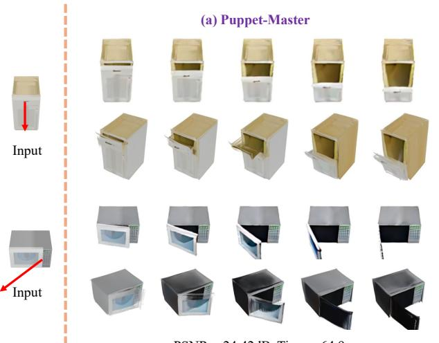
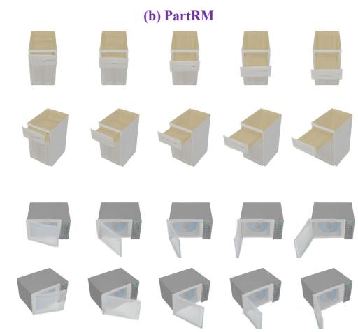
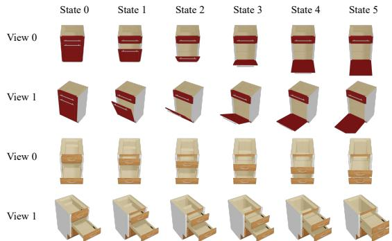
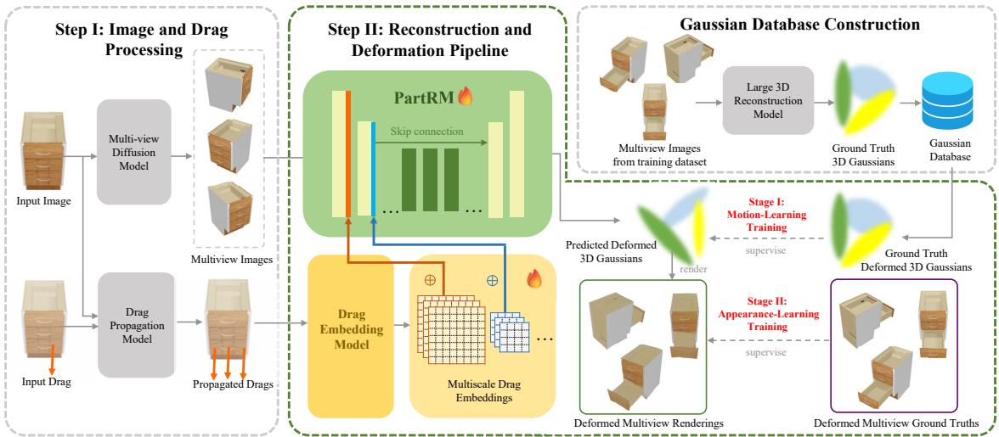
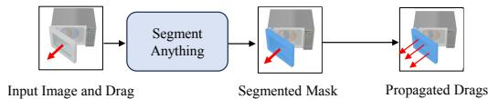
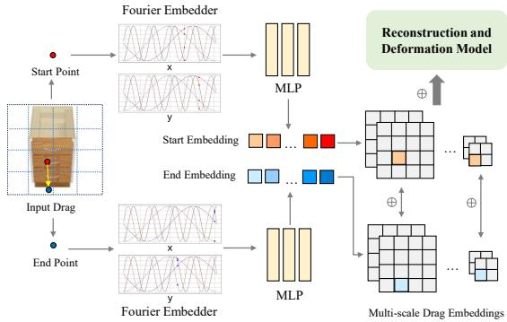
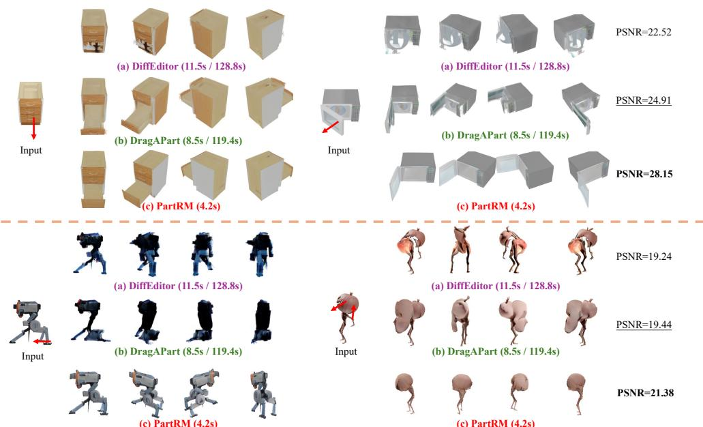
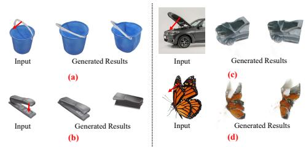
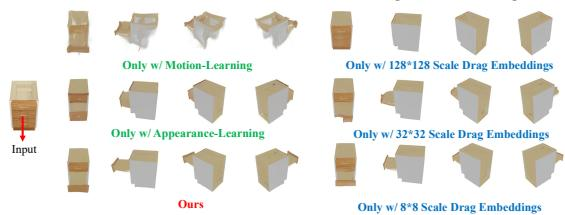
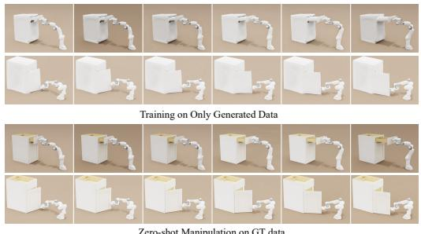

# PartRM: Modeling Part-Level Dynamics with Large Cross-State Reconstruction Model

Mingju Gao\*1, Yike Pan\*1,2, Huan-ang Gao\*1,4, Zongzheng Zhang1, Wenyi Li1, Hao Dong3, Hao Tang3, Li Yi1, Hao Zhao†1,4 1Tsinghua University 2University of Michigan 3Peking University 4BAAI Project Page: https://PartRM.c7w.tech/

  
PSNR = 24.42dB Time = 64.9s

  
PSNR = 28.15dB Time = 4.2s

Figure 1. We present PartRM, given a single-view image and user-specific drags, PartRM can efficiently models appearance, geometry, and part-level motion in a feed-forward manner. Unlike the previous state-of-the-art, Puppet-Master [23], PartRM achieves higher PSNR and significantly faster inference times. As shown in (b) compared to (a), PartRM produces 3D-aware, part-level motions with enhanced multi-view consistency, delivering more realistic and coherent results across different viewpoints.

## Abstract

As interest grows in world models that predictfuture states from current observations and actions, accurately modeling part-level dynamics has become increasingly relevant for various applications. Existing approaches, such as Puppet-Master, rely on fine-tuning large-scale pre-trained video diffusion models, which are impracticalfor real-world use due to the limitations of2D video representation and slow processing times. To overcome these challenges, we present PartRM, a novel 4D reconstructionframework that simultaneously models appearance, geometry, and part-level motion from multi-view images of a static object. PartRM builds upon large 3D Gaussian reconstruction models, leveraging their extensive knowledge of appearance and geometry in static objects. To address data scarcity in 4D, we introduce the PartDrag-4D dataset, providing multi-view observations of part-level dynamics across over 20,000 states. We en-

hance the model’s understanding ofinteraction conditions with a multi-scale drag embedding module that captures dynamics at varying granularities. To prevent catastrophic forgetting during fine-tuning, we implement a two-stage training process that focuses sequentially on motion and ap pearance learning. Experimental results show that PartRM establishes a new state-of-the-art in part-level motion learning and can be applied in manipulation tasks in robotics. Our code, data, and models are publicly available tofacilitatefuture research.

## 1. Introduction

World models are essential for predicting future states based on current observations and actions, enabling machines to understand and interact with the physical world. They play a crucial role in a variety of applications, including robotics [11, 30, 48, 62], AR/VR, and beyond. Recently, there has been a growing interest in modeling part-level dynamics—the ability to generate realistic, fine-grained motion at the part level that accurately reflects current observations and user-specified drag interactions (see Figure 1). This capability is key for tasks that demand high precision and adaptability, like manipulation and navigation in dynamic environments.

However, our investigation into this promising field revealed that current part-level modeling approaches remain far from practical application. The state-of-the-art method, Puppet-Master [23], fine-tunes a large pre-trained video diffusion model by adding a new conditioning branch to incorporate drag controls (see Figure 1 (a)). While this approach effectively leverages the rich motion patterns learned during pre-training, it falls short for real-world use. One major limitation is that it produces only single-view video as the output representation, whereas simulators require 3D representations to render scenes from multiple viewpoints. To meet the input requirements of the simulators, it is necessary for users to employ large reconstruction models based on monocular images. However, this approach may introduce additional sources of error. Additionally, the diffusion denoising process can take several minutes to simulate a single drag interaction, which is counterproductive to the goal of providing rapid, trial-and-error feedback for generating manipulation policies.

Departure to 3D Representations. To enable rapid 3D reconstruction from input observations (i.e., images), we leverage large-scale reconstruction models based on 3D Gaussian Splatting (3DGS) [19]. These models predict the content field from input images in a feed-forward manner, allowing them to reduce reconstruction time from several minutes (as in traditional optimization-based methods [19, 32]) to just a few seconds. While these models provide a robust 3D prior for generic reconstruction, our approach extends this capability by modeling the 3D motion priors of object parts. Specifically, we address the problem of simultaneous 4D reconstruction of appearance, geometry, and motion of parts from images. We posit that jointly modeling motion and geometry is essential, as part-level motions are inherently linked to the geometry of each part (e.g., a drawer typically slides along its normal direction when opened). This integration allows us to achieve a more realistic and interpretable representation of part-level dynamics.

Challenges. Despite the clear motivation, developing a robust 4D reconstruction model presents significant challenges. A primary obstacle is the scarcity of accessible data capturing 3D objects along with their dynamic properties, which hinders the data-intensive training requirements of foundational models. From a modeling standpoint, effectively representing drag interactions and incorporating these conditions into a 4D framework also remains an open challenge. Additionally, while we can leverage the pretrained capabilities of large reconstruction models [44]—specifically their appearance and geometry modeling for static 3D objects—preserving these abilities during fine-tuning without catastrophic forgetting is another unresolved issue.

In this paper, we present PartRM, a novel 4D reconstruction framework that simultaneously models the appearance, geometry, and part-level dynamics of objects. To tackle the issue of data scarcity, we introduce the PartDrag-4D dataset (see Figure 2), built on the PartNet-Mobility dataset [49]. We define a part’s state by the extent of its movement within defined limits, rendering 738 objects with their parts in various positions. This setup provides multi-view observations across more than 20,000 distinct states. To incorporate drag interactions, we propose a multi-scale drag embedding module that enhances the network’s capacity to recognize and process drag motions at multiple granularities. To prevent catastrophic forgetting of pretrained appearance and geometry modeling capabilities, we introduce a two-stage training strategy. The first stage focuses on motion learning, supervised by matched 3DGS parameters, while the second stage focuses on appearance learning, using photometric loss to align rendered images with actual observations. As illustrated in Figure 1, our PartRM framework outperforms Puppet-Master, achieving higher PSNR and faster inference times. Additionally, it maintains both temporal and multiview consistency under varying drag forces, demonstrating the effectiveness of our approach.

In our experiments, we established a new benchmark for part-level motion learning through novel view synthesis. We re-evaluated all existing methods [23, 24, 35] on this benchmark and achieved state-of-the-art results, setting a new standard in the field. Furthermore, we demonstrated that by reconstructing the same object in multiple states, our approach can be applied to robotic manipulation tasks. Our contribution can be summarized as follows:

• We introduce PartRM, a novel 4D reconstruction framework that simultaneously models appearance, geometry, and part-level motion.

• To address data scarcity, we develop the PartDrag-4D dataset, offering an extensive collection of multi-view observations of part-level dynamics.

• We propose key innovations, including a multi-scale drag embedding module and a two-stage training approach, which enhance model performance and mitigate catastrophic forgetting.

• Our approach achieves state-of-the-art results on newly established benchmarks for part-level motion learning and demonstrates its practical utility in realworld embodied scenarios.

## 2. Related Work

Drag-conditioned Image & Video Synthesis. Controlling image and video generation via dragging, which can be seen as a model of the dynamic world, enables simulation for robotics and autonomous systems. Methods for this task can be divided into training-free and training-based approaches. Training-free methods iteratively update the source image to match user-specified drags, leveraging the power of diffusion modeling. For example, DragGAN [37] optimizes a latent representation of the image in StyleGAN [18] to match user-specified drags. DragDiffusion adapts this idea to Stable Diffusion (SD) [39]. DragonDiffusion [34] and Motion Guidance [13] combine SD with a guidance term that captures feature correspondences and a flow loss, and DiffEditor [35] combines stochastic differential equation (SDE) into ordinary differential equation (ODE) sampling to increase flexibility while maintaining content consistency over Dragon-Diffusion. Training-based methods, on the other hand, learn drag-based control using specifically designed training data, mostly leveraging powerful generative modeling capabilities of diffusion models [2, 4, 12, 21, 26, 36, 39, 52, 55, 57]. For example, iPoke [1] trains a variational autoencoder (VAE) to synthesize videos with objects in motion. MCDiff [5] and YODA [33] train diffusion models using DDPM and flow matching, respectively. Li et al. [27] employ a Fourier-based representation of motion suitable for natural, oscillatory dynamics characteristic of objects like trees and candles, generating motion with a diffusion model. DragNUWA [53] and MotionCtrl [47] extend text-to-video generators with drag-based control. DragAPart [24] and Puppet-Master [23] propose learning a generalist motion model but focus solely on single-view images and videos, respectively. In contrast, our work utilizes 3D Gaussians as the state representation, advancing towards the simulation of robotics policies.

Large Reconstruction Models. Large Reconstruction Models (LRMs) replace the costly optimization-based 3D representation learning with feedforward approaches by training neural networks to directly regress the 3D representation, especially implicit representation [7, 8, 28, 54, 59, 61]. LRM [16] was among the first to utilize large-scale multiview datasets, including Objaverse [10], to train a transformerbased model for NeRF reconstruction. The resulting model demonstrates better generalization and higher-quality reconstruction of object-centric 3D shapes from sparse posed images in a single model forward pass. Similar works have explored changing the representation to Gaussian splatting [17, 42, 44, 56, 63], introducing architectural changes to support higher resolution [40, 51], and extending the approach to 3D scenes [3, 9, 45, 58]. These methods can be generalized to input images supplied from sampling multiview diffusion models, allowing fast 3D generation [25]. L4GM [38] produces dynamic 3D representations from single-view video input by training on rendered animated objects in Objaverse. However, it is not action-conditioned, which means it does not function as a world model. Additionally, it is only trained on simple animations and does not support part-level dynamics. Instead, in this paper, we introduce PartRM which achieves simultaneous appearance, geometry, and part-level

  
Figure 2. Introduction of PartDrag-4D dataset. PartDrag-4D utilizes 738 meshes spanning 8 categories to generate 20,548 articulation states. For each state, PartDrag-4D renders 12 views. The drags are sampled on the moving surface.  
motion modeling.

## 3. The Proposed PartDrag-4D Dataset

Formulation. We begin by defining our notations. Let $o _ { t }$ and $s _ { t }$ represent the observation and state of the object at time t, respectively. In the context of part-level dynamic learning, $o _ { t }$ denotes the 2D rendering of the current state $s _ { t } ,$ , and $s _ { t }$ represents the pose of each part, containing the 3D information necessary to render $o _ { t }$ . Let $a _ { t }$ denote the action applied to the object. Our objective is to develop a simultaneous model for appearance, geometry, and part-level dynamics using a large 4D reconstruction model $f ,$ which can be expressed as,

$$
f : ( o _ { t } , a _ { t } )  s _ { t + 1 } .\tag{1}
$$

This model aims to predict the state $s _ { t + 1 }$ of the object in the next time step given the current observation $o _ { t }$ and the action $a _ { t }$

Motivation. To train such a model, it is imperative to collect data pairs that fully meet the requirements of our task, as detailed above. Our investigation into this field reveals two primary streams of datasets. One stream consists of $\left( o _ { t } , a _ { t } , o _ { t + 1 } \right)$ , which includes only paired images with their corresponding drag information [24], but lacks essential 3D data that can be utilized for further simulation and application. The other stream utilizes a general dataset, such as Objaverse, filtering out static and drastically changing objects, and annotates drag by sampling points from the entire surface of the object and describing the movement of these points. However, we argue that this method of generation does not conform to kinematic dynamics. Data constructed in this manner not only involves movement but also includes deformation and other operations, which simultaneously alter both shape and appearance.

PartDrag-4D Dataset. Our dataset is constructed using PartNet-Mobility [49], which provides detailed part-level annotations for articulated objects. We utilize 738 meshes spanning 8 categories (using 7 categories for training and all 8 for evaluation). For each mesh, as illustrated in Figure 2, we animate one articulated part through 6 stages between two extreme positions $( \mathrm { e . g . }$ , a drawer fully opened and fully closed), while setting the other parts to random positions, yielding a total of 20,548 states (a mesh may have multiple movable parts), with 20,057 states for training and 491 states for evaluation. Throughout the animation sequence, all the other parts remain in fixed positions. We store all the animated meshes, point clouds, and corresponding moving points in our dataset for subsequent stages.

  
Figure 3. Overview of PartRM. We first leverage a fine-tuned Zero123++ to generate multi-view images, followed by our designed drag propagation module to distribute drags on the moving parts. The drags and multi-view images are then fed into our designed network, where the drags are embedded using our multi-scale embedding module and subsequently concatenate to the UNet down blocks. We adopt a two-stage training approach: in the first stage, the network learns part motion using ground truth deformed 3D Gaussians as supervision, which are stored in the Gaussian database constructed by LGM. In the second stage, the network learns appearance, with ground truth deformed multi-view renderings serving as supervision.

To render multi-view images of each state of the 3D mesh, we use Blender to generate a total of 12 views with a fixed camera distance. For drag sampling on the surface of the moving parts, we project the sampled 3D points into the 2D image space using the given camera parameters. To ensure that the projected points correspond accurately to the visible surface of the mesh from the specified camera perspective, rather than residing within the interior of a part, we remove points from the projected 2D drags that exhibit depths significantly greater than those of their neighboring points, which may be occluded by other points.

## 4. The Proposed Method

## 4.1. Overview

We provide an overview of our pipeline in Figure 3. Given a single-view observation $o _ { t } \in \bar { \mathbb { R } } ^ { h \times w \times 3 }$ and input drags $a _ { t }$ , where $a _ { t }$ is parameterized by its start and end points projected on $o _ { t } , \mathrm { i . e . , } a _ { t } = ( a _ { t , \mathrm { s r c } } ( x , y ) , a _ { t , \mathrm { d s t } } ( x , y ) )$ , our objective is to generate a 3D Gaussian representation $s _ { t + 1 }$ that depicts the state $s _ { t + 1 }$ after the dragging. The challenge lies in simultaneously conducting appearance and geometry modeling $( o _ { t } \to s _ { t } )$ for 3D and motion learning $( s _ { t } , a _ { t } \to s _ { t + 1 } )$

in part level. To ensure the reconstruction model accurately identifies which parts to move and how to move them, we have developed a drag-propagation module to distribute the input drags across the moving parts, as detailed in Sec. 4.2. After propagating the drag condition, we delve into the embedding of these conditions in Sec. 4.3. For efficient training while avoiding catastrophic forgetting of pretrained knowledge of appearance and geometry modeling for static 3D objects, we implement a two-stage training pipeline, detailed in Sec. 4.4. The first stage focuses on learning the motion dynamics, while the second stage is dedicated to learning the appearance characteristics.

## 4.2. Image and Drag Preprocessing

Multi-view Images Generation. We build PartRM upon LGM [44], which requires multi-view images as input. To generate these images, we utilize Zero123++ [41] due to its strong multi-view consistency. To further enhance the quality of the generated multi-view images, we fine-tune Zero123++ using our training dataset [50]. The novel-view images, in conjunction with the original image, are fed into the PartRM network. This fine-tuning process optimizes the model’s performance, ensuring the production of high-quality multiview representations for subsequent processing.

Drag Propagation. Providing a large reconstruction model with a single dragging condition can lead to hallucinations due to the inherent ambiguity in a single drag. At this stage, we leverage kinematic priors of articulation motion to augment the input drag condition. As illustrated in Figure 4, for each input pair $\left( o _ { t } , a _ { t } \right)$ , our drag propagation module first processes the input image and utilizes the drag start point to query the Segment Anything model [20]. This model generates a part segmentation mask, which delineates the area for drag propagation. This approach generates the distribution of drag proposals that are appropriately confined to the relevant regions of the articulated part, enhancing the accuracy and efficiency of the motion representation.

  
Figure 4. Illustration of drag propagation module.

After this, we sample points on the part segmentation mask as the starting points of the propagated drags and use the same drag intensity $( \mathrm { i . e . }$ , the magnitude of relative position change) as the input drag. We denote $\Delta { { a } _ { t } } \mathrm { { = } } { { a } _ { t , \mathrm { { d s t } } } } \mathrm { { - } } { { a } _ { t } }$ t,src The i-th propagated drag $a _ { t , i }$ of the input drag $a _ { t }$ can be formulated as:

$$
a _ { t , i } = ( a _ { t , i , \mathrm { s r c } } , a _ { t , i , \mathrm { s r c } } + \Delta a _ { t } ) ,\tag{2}
$$

where $^ { a _ { t , i , \mathrm { s r c } } }$ is the i-th point sampled from the part segmentation mask. Despite the potential inaccuracy in the estimation of the magnitude of drag intensity, our subsequent model remains robust enough to learn to generate the expected output in a data-driven manner.

## 4.3. Drag Embedding

The U-Net of PartRM, which follows LGM [44], is constructed with residual layers [14] and self-attention layers [46], similar to previous works [15, 31, 43]. It is designed to be asymmetric, with a smaller output resolution compared to the input, allowing for higher-resolution input images while limiting the number of output Gaussians. In this section, we embed the propagated drags of the input views $\{ a _ { t , i } \} _ { i = \cdot } ^ { N }$ 1 into multi-scale drag maps and interact them with each downsample block of the U-Net. This enhances the network’s capacity to recognize and account for various granularities of drag motion.

As illustrated in Figures 3 and 5, we pre-compute multiscale drag maps with respect to the spatial dimensions of the U-Net’s down-sample block outputs. For the output $O _ { l } \in \mathbb { R } ^ { C _ { l } \times H _ { l } \times W _ { l } }$ of the l-th block $D _ { l } ,$ and for each drag $\{ a _ { t , i } \} _ { i = 0 } ^ { N }$ , where $i \ = \ 0$ denotes the input drag and $1 \ \leq$ $i \leq N$ denotes the propagated drags, we first encode the coordinates of each starting point $a _ { t , i , \mathrm { s r c } }$ and ending point $a _ { t , i , \mathrm { d s t } }$ with a Fourier embedder and a 3-layer MLP to obtain embeddings for the start point $F ( a _ { t , i , \mathrm { s r c } } )$ and the end point $F ( a _ { t , i , \mathrm { d s t } } )$ . Then the drag map $M _ { t , l , i } \ \in \ \mathbb { R } ^ { C _ { M } \times H _ { l } \times \mathbf { \hat { W } } _ { l } }$ is defined as:

$$
M _ { t , l , i } \left[ a _ { t , i , \mathrm { s r c } } \right] = F ( a _ { t , i , \mathrm { s r c } } ) \oplus F ( a _ { t , i , \mathrm { d s t } } ) ,\tag{3}
$$

where $\oplus$ means concentration along the channel dimension. The other elements of $M _ { t , l }$ are set to zero. To obtain $M _ { t , l }$ for all drags, we sum all the $M _ { t , l , i } ,$ which means $\begin{array} { r } { M _ { t , l } = \sum _ { i = 0 } ^ { N } M _ { t , l , i } } \end{array}$ . After we get the drag map $M _ { t , l } ,$ we concatenate $M _ { t , l }$ and $O _ { l }$ along the channel dimension and feed them into a convolutional layer to match the channel dimensions for the input of the next down-sample block. The input of the (l + 1)-th down-sample block $I _ { l + 1 }$ is defined as:

  
Drag Embedding Model  
Figure 5. Illustration of drag embedding module.

$$
I _ { l + 1 } = O _ { l } + { \bf C o n v } ( M _ { t , l } \oplus O _ { l } ) ,\tag{4}
$$

where $\begin{array} { r } { M _ { t , l } \oplus O _ { l } \in \mathbb { R } ^ { ( C _ { M } + C _ { l } ) \times H _ { l } \times W _ { l } } , I _ { l + 1 } \in \mathbb { R } ^ { C _ { l } \times H _ { l } \times W _ { l } } } \end{array}$ and parameters of the convolution layer are initialized to zero.

## 4.4. Two-stage Training Pipeline

To retain the ability to model the appearance and geometry of static 3D objects, we build our PartRM upon pretrained LGM [44], which uses an asymmetric U-Net as a high-throughput backbone operating on multi-view images to generate highresolution 3D Gaussians from multi-view images. However, directly fine-tuning on the proposed dataset can result in catastrophic forgetting of previously learned knowledge, which impairs generalization when dealing with in-the-wild data. To address this issue, we propose a two-stage learning method. First, we focus on learning motions, which have not been previously learned. Then, we conduct simultaneous training of appearance, geometry, and motion. This approach allows us to train in a coarse-to-fine manner, ensuring better retention and generalization capabilities.

Motion Learning Stage. In the initial training stage, our goal is to learn the motion induced by drag effects. We tackle this problem using a knowledge distillation (KD) approach. Specifically, we use Gaussians inferred from the target observations by the pre-trained network to supervise the training of the student network, which is provided with source state observations (see Gaussian Database Construction in Figure 3). Leveraging the output from the pre-trained network itself facilitates continual learning, which keeps the ability of generalization while speeds up the training process.

For matching between these two sets of Gaussians, intuitively we should perform matching according to the coordinates of these Gaussians. However, leveraging the advantages of using splatter images [43] as representations, we can enforce the network to learn to transform the representation to the target state before the output regression layer. In other words, we can directly apply L2 loss on the 14-dimensional parameters of the corresponding pixels in the 2D images. Formally, this can be written as:

<table><tr><td rowspan="2">Method</td><td rowspan="2">Setting</td><td colspan="3">PartDrag-4D</td><td colspan="3">Objaverse-Animation-HQ</td><td rowspan="2">Time (↓)</td></tr><tr><td>PSNR (↑)</td><td>SSIM (↑)</td><td>LPIPS (↓)</td><td>PSNR (↑)</td><td>SSIM (↑)</td><td>LPIPS (↓)</td></tr><tr><td>DiffEditor [35]</td><td>NVS-First</td><td>22.52</td><td>0.8974</td><td>0.1138</td><td>19.24</td><td>0.8988</td><td>0.0902</td><td>33.6s / 151.2s</td></tr><tr><td>DiffEditor [35]</td><td>Drag-First</td><td>22.34</td><td>0.9174</td><td>0.0918</td><td>19.46</td><td>0.9079</td><td>0.0842</td><td>11.5s / 128.8s</td></tr><tr><td>DragAPart [24]</td><td>NVS-First</td><td>24.27</td><td>0.9343</td><td>0.0690</td><td>19.38</td><td>0.8915</td><td>0.0873</td><td>21.4s / 139.7s</td></tr><tr><td>DragAPart [24]</td><td>Drag-First</td><td>24.91</td><td>0.9454</td><td>0.0567</td><td>19.44</td><td>0.9004</td><td>0.0885</td><td>8.5s / 119.4s</td></tr><tr><td>Puppet-Master [23]</td><td>NVS-First</td><td>24.20</td><td>0.9447</td><td>0.0579</td><td></td><td></td><td></td><td>64.9s / 187.5s</td></tr><tr><td>Puppet-Master [23]</td><td>Drag-First</td><td>24.42</td><td>0.9475</td><td>0.0528</td><td></td><td></td><td></td><td>245.8s / 361.5s</td></tr><tr><td>PartRM (Ours)</td><td></td><td>28.15</td><td>0.9531</td><td>0.0356</td><td>21.38</td><td>0.9209</td><td>0.0758</td><td>4.2s / -</td></tr></table>

Table 1. Comparison of our method and baseline methods on PartDrag-4D and Objaverse-Animation-HQ. NVS-First refers to the approach where multi-view images are first generated, followed by drag deformation applied to each view. Drag-First means drag deformation is applied to the image first, and then multi-view images are generated based on the deformed image. The time column contains two values separated by a slash: the first value indicates the time spent on 3D reconstruction using LGM, and the second value represents the time spent on 3D reconstruction using optimization-based 3D Gaussian splatting. PartRM has only one value in the time column because it simultaneously models appearance, geometry, and part-level motion. PartRM achieve State-of-the-Art on all metrics.

$$
\mathcal { L } _ { 1 } = \sum _ { i \in h \times w \times v , j = i } \mathopen { } \mathclose \bgroup \left\| \mathcal { G } S _ { i } - \mathcal { G } S _ { j } \aftergroup \egroup \right\| _ { 2 } ^ { 2 } ,\tag{5}
$$

where i denotes corresponding pixels in the splatter images, and $\mathcal { G } S _ { i }$ and ${ \mathcal { G } } S _ { j }$ represent the 14-dimensional parameters of the Gaussians at those pixels.

Appearance Learning Stage. After the motion learning stage, we introduce an additional stage to jointly optimize appearance, geometry, and part-level motion. Specifically, we replace the supervision signal from Gaussians with target observations. In each training step, we render the RGB image and the alpha image of eight novel views. For every view, we formulate our loss as:

$$
\begin{array} { r } { \mathcal { L } _ { 2 } = L _ { \mathrm { m s e } } ( I _ { \mathrm { p r e d \_ c o l o r } } , I _ { \mathrm { g t \_ c o l o r } } ) } \\ { + \lambda _ { 1 } L _ { \mathrm { l p i p s } } ( I _ { \mathrm { p r e d \_ c o l o r } } , I _ { \mathrm { g t \_ c o l o r } } ) } \\ { + \lambda _ { 2 } L _ { \mathrm { m s e } } ( I _ { \mathrm { p r e d \_ a l p h a } } , I _ { \mathrm { g t \_ a l p h a } } ) , } \end{array}\tag{6}
$$

where $\lambda _ { 1 }$ and $\lambda _ { 2 }$ are set to 1.0 during our training.

We provide ablation studies on this coarse-to-fine training approach in Table 3. The results demonstrate that if we only use multi-view images as supervision, the reconstruction model fails to learn the part-level motion effectively. The 3D representation will merely attempt to exploit the loss function in stage 2 without learning the appropriate motion.

## 5. Experimental Results

## 5.1. Experiment Settings

In addition to the PartDrag-4D dataset introduced in Sec. 3, we also evaluate our method on the Objaverse-Animation-HQ dataset [23], which is derived from the animated data in the Objaverse [10] dataset. Due to the large volume of data in the Objaverse-Animation-HQ dataset, we sample approximately 15,000 states and manually split them into training and evaluation sets. For evaluation, we render eight views of each predicted gaussian splatting and compute PSNR, SSIM, and LPIPS metrics between the ground truth images and the rendered images at a resolution of $2 5 6 \times 2 5 6$

## 5.2. Main Results

Baselines. We conduct a comprehensive comparison of our method with state-of-the-art drag-based generative models, specifically DragApart [24], DiffEditor [35], and Puppet-Master [23]. For the training-free model DiffEditor, we utilize its official implementation and pre-trained checkpoint. To ensure a fair comparison with DragApart, we fine-tune it on paired images from the PartDrag-4D and Objaverse-Animation-HQ datasets using its official checkpoint. For Puppet-Master, we use its official checkpoint and test it only on the PartDrag-4D dataset. In our setup, we set the input drag to the one with the maximum strength and sample frames at the 2nd, 5th, 8th, 11th, and 13th positions to represent different strengths of drags.

Settings. We present a novel evaluation approach for part-level motion learning in 3D through the synthesis of novel views. While current methods typically generate single view’s results, obtaining accurate 3D Gaussian outputs requires multi-view inputs. To address this gap, we propose two distinct approaches: NVS-First and Drag-First. The NVS-First approach involves first generating multiview images using Zero123++, followed by the application of drag-deformation to each individual view. In contrast, the Drag-First approach applies drag-deformation directly to the input image before synthesizing multi-view images through Zero123++. Although we have performed NVS via Zero123++, what we ultimately need is a 3D representation that can render from arbitrary viewpoints. Previous methods used optimization-based method to obtain this representation, where the time was reported in Figure 6 and 1. To align the reconstruction process with PartRM and reduce inference time, we leverage LGM to regress the Gaussian representation. The quality of the generated 3D model is evaluated using metrics, including PSNR, LPIPS, and SSIM, calculated based on rendered images of the Gaussians produced by this method.

  
Figure 6. Qualitative comparisons between PartRM and baselines. The time values separated by the slash represent the time spent first applying 2D drag deformation to the input image and then performing 3D reconstruction using LGM and the optimization-based method, respectively. PartRM has only one value in the time column because it simultaneously models appearance, geometry, and part-level motion, eliminating the need for separate steps. PartRM learn the part motion effectively

Quantitative Comparisons. We conduct a quantitative evaluation to assess the performance of all compared methods. As shown in Table 1, our method outperforms state-of-theart approaches across all metrics. This improvement is attributed to our pipeline’s ability to capture both motion and geometry simultaneously, providing a synergistic advantage while also reducing computation time. In contrast, methods such as DragAPart, DiffEditor, and Puppet-Master rely solely on 2D image information, often leading to deformations that are inconsistent with the 3D structure of the objects.

Qualitative Comparisons. We provide a comparison in Figure 1 and 6. For DragAPart and DiffEditor, the multiview images are rendered from Gaussian Splattings obtained through the optimization-based method. As illustrated in Figure 6, DiffEditor fails to perform correct part-level deformations. Although DragApart can handle part-level deformations for articulated objects, it often produces unnatural artifacts (e.g., the microwave’s door in the top-right subplot). Additionally, for objects with more complex or diverse deformation patterns, DragAPart struggles to capture the motions effectively. For Puppet-Master, we present both the originally generated images and those produced by Zero123++ in Figure 1. While Puppet-Master maintains temporal consistency as drag strengths increase, it struggles to ensure precise motion accuracy (evident in the top left of Figure 1) and multi-view consistency (as shown in the bottom left of Figure 1). These limitations hinder its overall performance. Qualitative Results on In-the-Wild Data. To evaluate the generalization capability of our method, we collected various articulated objects from the Internet and manually defined the drag configurations. The results are shown in Figure 7, which indicate that PartRM generalizes well to motions close to the training distribution ((a) and (b)) but struggles with inputs data that deviate significantly ((c) and (d)).

Figure 7. Generalization to the data in the wild. We collect data from the internet for evaluation.
<table><tr><td>Num Drags</td><td>PSNR (↑)</td><td>SSIM (↑)</td><td>LPIPS (↓)</td></tr><tr><td>1</td><td>27.06</td><td>0.9466</td><td>0.0452</td></tr><tr><td>5</td><td>27.56</td><td>0.9483</td><td>0.0448</td></tr><tr><td>10</td><td>28.15</td><td>0.9531</td><td>0.0356</td></tr></table>

Table 2. Ablation on number of drags.

## 5.3. Ablation Studies

Ablation on Number of Drags. To illustrate the effectiveness of our drag-propagation module, we performed ablation studies on the number of drags using the PartDrag-4D dataset. As shown in Table 2, the performance improves with an increasing number of drags. This improvement can be attributed to the fact that more input drags provide clearer guidance on moving parts, thereby enhancing the modeling of part motion dynamics.

Zero-shot Manipulation on GT data
<table><tr><td>Training Stage Setting</td><td>PSNR (↑)</td><td>SSIM (↑)</td><td>LPIPS (↓)</td></tr><tr><td>Only w/ Stage 1</td><td>22.05</td><td>0.8624</td><td>0.1274</td></tr><tr><td>Only w/ Stage 2</td><td>25.87</td><td>0.9387</td><td>0.0537</td></tr><tr><td>Stage 1+2</td><td>28.15</td><td>0.9531</td><td>0.0356</td></tr></table>

Table 3. Ablation on training stages.
<table><tr><td>Drag Embeddings Setting</td><td>PSNR (↑)</td><td>SSIM (↑)</td><td>LPIPS (↓)</td></tr><tr><td>Only w/ 128*128 scale</td><td>25.48</td><td>0.957</td><td>0.048</td></tr><tr><td>Only w/ 32*32 scale</td><td>27.99</td><td>0.952</td><td>0.039</td></tr><tr><td>Only w/ 8*8 scale</td><td>26.87</td><td>0.953</td><td>0.045</td></tr><tr><td>Multi-scale</td><td>28.15</td><td>0.953</td><td>0.036</td></tr></table>

Table 4. Ablation on multi-scale drag embeddings.  
  
Figure 8. Ablation on the training stage and multi-scale drag embeddings.

Ablation on Training Stages. To demonstrate the effectiveness of our two-stage training process, we conducted ablation studies on the PartDrag-4D dataset using 10 propagated drags. As shown in Table 3, employing only one training stage leads to a significant performance drop. The visualization results in Figure 8 further illustrate this point. When only the motion learning stage is used, the appearance quality is poor. Conversely, if only the appearance learning stage is employed, the drawer in the image fails to move to the correct position. This limitation arises from the weak supervision provided by multi-view images, which hinders the effective continual learning of motion dynamics over the learned appearance and geometry modeling.

Ablation on Muti-scale Drag Embeddings. To validate the effectiveness of our multi-scale drag embeddings, we conduct ablation studies on embedding scales using the PartDrag-4D dataset with 10 propagated drags. In this experiment, we concatenate drag embeddings to the UNet downsample blocks with spatial dimensions of 8!8, 32!32, and 128!128. As shown in Table 4, our multi-scale embedding design achieves higher PSNR and lower LPIPS. As illustrated in the right panel of Figure 8, concatenating only large spatial dimension (128!128) drag embeddings to the UNet impairs motion learning, as this scale lacks the capacity to capture the global features of moving parts. On the other hand, concatenating only small spatial dimension (8!8) drag embeddings will mislead the model about which part to move. Specifically, as noted in Sec. 4.3, the drag intended to open a drawer in the second layer may overlap spatially on the drag map with the drag intended to open the last layer’s drawer, leading to ambiguity. Although using an intermediate spatial scale partially mitigates these issues, it does not achieve optimal performance.

  
Figure 9. Applications in robot manipulation. We get the articulated object manipulation policy on our generated data and generalize it to the ground-truth data.

## 5.4. Sim2Real Applications in Manipulation

To assess the applicability of our method in robotic manipulation, we conduct a sim-to-real experiment using the Isaac Gym [29] simulator. In this experiment, a manipulation policy is trained using data generated by our approach, and its ability to generalize to real-world ground-truth data is subsequently evaluated. We are curating that successful generalization to real-world data demonstrates that our generated data can be effectively utilized to train a manipulation policy with only a single-view image of an object instead of predicting affordance [6, 22]. Specifically, given a singleview input and corresponding 2D drags on the selected part by the users, we employ PartRM to generate both the initial and deformed states. These states are then used to extract the part meshes of the moving objects and their corresponding axes of motion [60], facilitating the training of the policy.

We design an experimental task involving the manipulation of two distinct objects: a prismatic drawer and a rotational door. The objective is to move each object from a partially opened state to a fully opened state. Using the part meshes and axes extracted from our generated data, we can get the manipulation policy in Issac Gym [29] to accomplish this task. The policy is then evaluated to assess its ability to successfully operate in a ground-truth URDF environment. As shown in Figure 9, the Franka robot arm can conduct zero-shot manipulation on the ground-truth data, effectively completing the specified task. More details of this experiment are in the Appendix.

## 6. Conclusions

This paper introduces PartRM, a novel approach that simultaneously models appearance, geometry, and part-level motion. To address data scarcity in 4D part-level motion learning, we present the PartDrag-4D dataset, which provides multi-view observations of part-level dynamics. Experimental results show that our method outperforms previous approaches in part motion learning and is applicable to embodied AI tasks. However, it may struggle with articulated data deviating significantly from the training distribution. We believe our insights and the high-quality images generated by our model will inspire future research.

## Acknowledgments

This work is supported by the National Natural Science Foundation of China (NSFC) under Grants No. 623B1010.

## References

[1] Andreas Blattmann, Timo Milbich, Michael Dorkenwald, and Björn Ommer. ipoke: Poking a still image for controlled stochastic video synthesis. In Proceedings of the IEEE/CVF International Conference on Computer Vision, pages 14707– 14717, 2021. 3

[2] Andreas Blattmann, Tim Dockhorn, Sumith Kulal, Daniel Mendelevitch, Maciej Kilian, Dominik Lorenz, Yam Levi, Zion English, Vikram Voleti, Adam Letts, et al. Stable video diffusion: Scaling latent video diffusion models to large datasets. arXiv preprint arXiv:2311.15127, 2023. 3

[3] David Charatan, Sizhe Lester Li, Andrea Tagliasacchi, and Vincent Sitzmann. pixelsplat: 3d gaussian splats from image pairs for scalable generalizable 3d reconstruction. In Proceedings of the IEEE/CVF Conference on Computer Vision and Pattern Recognition, pages 19457–19467, 2024. 3

[4] Mingjin Chen, Junhao Chen, Xiaojun Ye, Huan-ang Gao, Xiaoxue Chen, Zhaoxin Fan, and Hao Zhao. Ultraman: single image 3d human reconstruction with ultra speed and detail. arXiv preprint arXiv:2403.12028, 2024. 3

[5] Tsai-Shien Chen, Chieh Hubert Lin, Hung-Yu Tseng, Tsung-Yi Lin, and Ming-Hsuan Yang. Motion-conditioned diffusion model for controllable video synthesis. arXiv preprint arXiv:2304.14404, 2023. 3

[6] Xiaoxue Chen, Tianyu Liu, Hao Zhao, Guyue Zhou, and Ya-Qin Zhang. Cerberus transformer: Joint semantic, affordance and attribute parsing. In Proceedings of the IEEE/CVF Conference on Computer Vision and Pattern Recognition, pages 19649–19658, 2022. 8

[7] Xiaoxue Chen, Junchen Liu, Hao Zhao, Guyue Zhou, and Ya-Qin Zhang. Nerrf: 3d reconstruction and view synthesis for transparent and specular objects with neural refractivereflective fields. arXiv preprint arXiv:2309.13039, 2023. 3

[8] Xiaoxue Chen, Jv Zheng, Hao Huang, Haoran Xu, Weihao Gu, Kangliang Chen, Huan-ang Gao, Hao Zhao, Guyue Zhou, Yaqin Zhang, et al. Rgm: Reconstructing high-fidelity 3d car assets with relightable 3d-gs generative model from a single image. arXiv preprint arXiv:2410.08181, 2024. 3

[9] Yuedong Chen, Haofei Xu, Chuanxia Zheng, Bohan Zhuang, Marc Pollefeys, Andreas Geiger, Tat-Jen Cham, and Jianfei Cai. Mvsplat: Efficient 3d gaussian splatting from sparse multi-view images. In European Conference on Computer Vision, pages 370–386. Springer, 2025. 3

[10] Matt Deitke, Dustin Schwenk, Jordi Salvador, Luca Weihs, Oscar Michel, Eli VanderBilt, Ludwig Schmidt, Kiana Ehsani, Aniruddha Kembhavi, and Ali Farhadi. Objaverse: A universe of annotated 3d objects. In Proceedings of the IEEE/CVF Conference on Computer Vision and Pattern Recognition, pages 13142–13153, 2023. 3, 6

[11] Kairui Ding, Boyuan Chen, Ruihai Wu, Yuyang Li, Zongzheng Zhang, Huan-ang Gao, Siqi Li, Guyue Zhou,

Yixin Zhu, Hao Dong, et al. Preafford: Universal affordancebased pre-grasping for diverse objects and environments. In 2024 IEEE/RSJ International Conference on Intelligent Robots and Systems (IROS), pages 7278–7285. IEEE, 2024. 1

[12] Huan-ang Gao, Mingju Gao, Jiaju Li, Wenyi Li, Rong Zhi, Hao Tang, and Hao Zhao. Scp-diff: Spatial-categorical joint prior for diffusion based semantic image synthesis. In European Conference on Computer Vision, pages 37–54. Springer, 2024. 3

[13] Daniel Geng and Andrew Owens. Motion guidance: Diffusion-based image editing with differentiable motion estimators. In The Twelfth International Conference on Learning Representations, 2024. 3

[14] Kaiming He, Xiangyu Zhang, Shaoqing Ren, and Jian Sun. Deep residual learning for image recognition. In Proceedings of the IEEE conference on computer vision and pattern recognition, pages 770–778, 2016. 5

[15] Jonathan Ho, Ajay Jain, and Pieter Abbeel. Denoising diffusion probabilistic models. Advances in neural information processing systems, 33:6840–6851, 2020. 5

[16] Yicong Hong, Kai Zhang, Jiuxiang Gu, Sai Bi, Yang Zhou, Difan Liu, Feng Liu, Kalyan Sunkavalli, Trung Bui, and Hao Tan. Lrm: Large reconstruction model for single image to 3d. In The Twelfth International Conference on Learning Representations, 2024. 3

[17] Lutao Jiang and Lin Wang. Brightdreamer: Generic 3d gaussian generative framework for fast text-to-3d synthesis. arXiv preprint arXiv:2403.11273, 2024. 3

[18] Tero Karras, Samuli Laine, and Timo Aila. A style-based generator architecture for generative adversarial networks. In Proceedings of the IEEE/CVF conference on computer vision and pattern recognition, pages 4401–4410, 2019. 3

[19] Bernhard Kerbl, Georgios Kopanas, Thomas Leimkühler, and George Drettakis. 3d gaussian splatting for real-time radiance field rendering. ACM Transactions on Graphics, 42(4), 2023. 2

[20] Alexander Kirillov, Eric Mintun, Nikhila Ravi, Hanzi Mao, Chloe Rolland, Laura Gustafson, Tete Xiao, Spencer Whitehead, Alexander C Berg, Wan-Yen Lo, et al. Segment anything. In Proceedings of the IEEE/CVF International Conference on Computer Vision, pages 4015–4026, 2023. 4

[21] Cheng Li, Keyuan Zhou, Tong Liu, Yu Wang, Mingqiao Zhuang, Huan-ang Gao, Bu Jin, and Hao Zhao. Avd2: Accident video diffusion for accident video description. arXiv preprint arXiv:2502.14801, 2025. 3

[22] Pengfei Li, Beiwen Tian, Yongliang Shi, Xiaoxue Chen, Hao Zhao, Guyue Zhou, and Ya-Qin Zhang. Toist: Task oriented instance segmentation transformer with noun-pronoun distillation. Advances in Neural Information Processing Systems, 35:17597–17611, 2022. 8

[23] Ruining Li, Chuanxia Zheng, Christian Rupprecht, and Andrea Vedaldi. Puppet-master: Scaling interactive video generation as a motion prior for part-level dynamics. arXiv preprint arXiv:2408.04631, 2024. 1, 2, 3, 6

[24] Ruining Li, Chuanxia Zheng, Christian Rupprecht, and Andrea Vedaldi. Dragapart: Learning a part-level motion prior for articulated objects. In European Conference on Computer Vision, pages 165–183. Springer, 2025. 2, 3, 6

[25] Sixu Li, Chaojian Li, Wenbo Zhu, Boyang Yu, Yang Zhao, Cheng Wan, Haoran You, Huihong Shi, and Yingyan Lin. Instant-3d: Instant neural radiance field training towards ondevice ar/vr 3d reconstruction. In Proceedings of the 50th Annual International Symposium on Computer Architecture, pages 1–13, 2023. 3

[26] Wenyi Li, Haoran Xu, Guiyu Zhang, Huan-ang Gao, Mingju Gao, Mengyu Wang, and Hao Zhao. Fairdiff: Fair segmentation with point-image diffusion. In International Conference on Medical Image Computing and Computer-Assisted Intervention, pages 617–628. Springer, 2024. 3

[27] Zhengqi Li, Richard Tucker, Noah Snavely, and Aleksander Holynski. Generative image dynamics. In Proceedings of the IEEE/CVF Conference on Computer Vision and Pattern Recognition, pages 24142–24153, 2024. 3

[28] Junchen Liu, Wenbo Hu, Zhuo Yang, Jianteng Chen, Guoliang Wang, Xiaoxue Chen, Yantong Cai, Huan-ang Gao, and Hao Zhao. Rip-nerf: Anti-aliasing radiance fields with ripmap-encoded platonic solids. In ACM SIGGRAPH 2024 Conference Papers, pages 1–11, 2024. 3

[29] Viktor Makoviychuk, Lukasz Wawrzyniak, Yunrong Guo, Michelle Lu, Kier Storey, Miles Macklin, David Hoeller, Nikita Rudin, Arthur Allshire, Ankur Handa, et al. Isaac gym: High performance gpu based physics simulation for robot learning. In Thirty-fifth Conference on Neural Information Processing Systems Datasets and Benchmarks Track (Round 2), 2021. 8

[30] Russell Mendonca, Shikhar Bahl, and Deepak Pathak. Structured world models from human videos. arXiv preprint arXiv:2308.10901, 2023. 1

[31] Gal Metzer, Elad Richardson, Or Patashnik, Raja Giryes, and Daniel Cohen-Or. Latent-nerf for shape-guided generation of 3d shapes and textures. In Proceedings ofthe IEEE/CVF Conference on Computer Vision and Pattern Recognition, pages 12663–12673, 2023. 5

[32] Ben Mildenhall, Pratul P Srinivasan, Matthew Tancik, Jonathan T Barron, Ravi Ramamoorthi, and Ren Ng. Nerf: Representing scenes as neural radiance fields for view synthesis. Communications of the ACM, 65(1):99–106, 2021. 2

[33] Brian B Moser, Stanislav Frolov, Federico Raue, Sebastian Palacio, and Andreas Dengel. Yoda: You only diffuse areas. an area-masked diffusion approach for image super-resolution. arXiv preprint arXiv:2308.07977, 2023. 3

[34] Chong Mou, Xintao Wang, Jiechong Song, Ying Shan, and Jian Zhang. Dragondiffusion: Enabling drag-style manipulation on diffusion models. arXiv preprint arXiv:2307.02421, 2023. 3

[35] Chong Mou, Xintao Wang, Jiechong Song, Ying Shan, and Jian Zhang. Diffeditor: Boosting accuracy and flexibility on diffusion-based image editing. In CVPR, pages 8488–8497, 2024. 2, 3, 6

[36] Yuyan Ni, Shikun Feng, Haohan Chi, Bowen Zheng, Huanang Gao, Wei-Ying Ma, Zhi-Ming Ma, and Yanyan Lan. Straight-line diffusion model for efficient 3d molecular generation. arXiv preprint arXiv:2503.02918, 2025. 3

[37] Xingang Pan, Ayush Tewari, Thomas Leimkühler, Lingjie Liu, Abhimitra Meka, and Christian Theobalt. Drag your gan:

Interactive point-based manipulation on the generative image manifold. In ACM SIGGRAPH 2023 Conference Proceedings, pages 1–11, 2023. 3

[38] Jiawei Ren, Kevin Xie, Ashkan Mirzaei, Hanxue Liang, Xiaohui Zeng, Karsten Kreis, Ziwei Liu, Antonio Torralba, Sanja Fidler, Seung Wook Kim, et al. L4gm: Large 4d gaussian reconstruction model. arXiv preprint arXiv:2406.10324, 2024. 3

[39] Robin Rombach, Andreas Blattmann, Dominik Lorenz, Patrick Esser, and Björn Ommer. High-resolution image synthesis with latent diffusion models. In Proceedings of the IEEE/CVF conference on computer vision and pattern recognition, pages 10684–10695, 2022. 3

[40] Qiuhong Shen, Zike Wu, Xuanyu Yi, Pan Zhou, Hanwang Zhang, Shuicheng Yan, and Xinchao Wang. Gamba: Marry gaussian splatting with mamba for single view 3d reconstruction. arXiv preprint arXiv:2403.18795, 2024. 3

[41] Ruoxi Shi, Hansheng Chen, Zhuoyang Zhang, Minghua Liu, Chao Xu, Xinyue Wei, Linghao Chen, Chong Zeng, and Hao Su. Zero123++: a single image to consistent multi-view diffusion base model. arXiv preprint arXiv:2310.15110, 2023. 4

[42] Xiaowei Song, Jv Zheng, Shiran Yuan, Huan-ang Gao, Jingwei Zhao, Xiang He, Weihao Gu, and Hao Zhao. Sa-gs: Scaleadaptive gaussian splatting for training-free anti-aliasing. arXiv preprint arXiv:2403.19615, 2024. 3

[43] Stanislaw Szymanowicz, Chrisitian Rupprecht, and Andrea Vedaldi. Splatter image: Ultra-fast single-view 3d reconstruction. In Proceedings of the IEEE/CVF Conference on Computer Vision and Pattern Recognition, pages 10208–10217, 2024. 5

[44] Jiaxiang Tang, Zhaoxi Chen, Xiaokang Chen, Tengfei Wang, Gang Zeng, and Ziwei Liu. Lgm: Large multi-view gaussian model for high-resolution 3d content creation. In ECCV, pages 1–18. Springer, 2025. 2, 3, 4, 5

[45] Qijian Tian, Xin Tan, Yuan Xie, and Lizhuang Ma. Drivingforward: Feed-forward 3d gaussian splatting for driving scene reconstruction from flexible surround-view input. arXiv preprint arXiv:2409.12753, 2024. 3

[46] A Vaswani. Attention is all you need. Advances in Neural Information Processing Systems, 2017. 5

[47] Zhouxia Wang, Ziyang Yuan, Xintao Wang, Yaowei Li, Tianshui Chen, Menghan Xia, Ping Luo, and Ying Shan. Motionctrl: A unified and flexible motion controller for video generation. In ACM SIGGRAPH 2024 Conference Papers, pages 1–11, 2024. 3

[48] Philipp Wu, Alejandro Escontrela, Danijar Hafner, Pieter Abbeel, and Ken Goldberg. Daydreamer: World models for physical robot learning. In Conference on robot learning, pages 2226–2240. PMLR, 2023. 1

[49] Fanbo Xiang, Yuzhe Qin, Kaichun Mo, Yikuan Xia, Hao Zhu, Fangchen Liu, Minghua Liu, Hanxiao Jiang, Yifu Yuan, He Wang, et al. Sapien: A simulated part-based interactive environment. In CVPR, pages 11097–11107, 2020. 2, 3

[50] Jiale Xu, Weihao Cheng, Yiming Gao, Xintao Wang, Shenghua Gao, and Ying Shan. Instantmesh: Efficient 3d mesh generation from a single image with sparse-view large

reconstruction models. arXiv preprint arXiv:2404.07191, 2024. 4

[51] Yinghao Xu, Zifan Shi, Wang Yifan, Hansheng Chen, Ceyuan Yang, Sida Peng, Yujun Shen, and Gordon Wetzstein. Grm: Large gaussian reconstruction model for efficient 3d reconstruction and generation. arXiv preprint arXiv:2403.14621, 2024. 3

[52] Zhiyuan Xu, Yinhe Chen, Huan-ang Gao, Weiyan Zhao, Guiyu Zhang, and Hao Zhao. Diffusion-based visual anagram as multi-task learning. arXiv preprint arXiv:2412.02693, 2024. 3

meets gaussian splatting: Fast and generalizable single-view 3d reconstruction with transformers. In Proceedings of the IEEE/CVF Conference on Computer Vision and Pattern Recognition (CVPR), pages 10324–10335, 2024. 3

[53] Shengming Yin, Chenfei Wu, Jian Liang, Jie Shi, Houqiang Li, Gong Ming, and Nan Duan. Dragnuwa: Fine-grained control in video generation by integrating text, image, and trajectory. arXiv preprint arXiv:2308.08089, 2023. 3

[54] Shiran Yuan and Hao Zhao. Slimmerf: Slimmable radiance fields. In 2024 International Conference on 3D Vision (3DV), pages 64–74. IEEE, 2024. 3

[55] Guiyu Zhang, Huan-ang Gao, Zijian Jiang, Hao Zhao, and Zhedong Zheng. Ctrl-u: Robust conditional image generation via uncertainty-aware reward modeling. arXiv preprint arXiv:2410.11236, 2024. 3

[56] Kai Zhang, Sai Bi, Hao Tan, Yuanbo Xiangli, Nanxuan Zhao, Kalyan Sunkavalli, and Zexiang Xu. Gs-lrm: Large reconstruction model for 3d gaussian splatting. In European Conference on Computer Vision, pages 1–19. Springer, 2025. 3

[57] Lvmin Zhang, Anyi Rao, and Maneesh Agrawala. Adding conditional control to text-to-image diffusion models. In Proceedings of the IEEE/CVF international conference on computer vision, pages 3836–3847, 2023. 3

[58] Shunyuan Zheng, Boyao Zhou, Ruizhi Shao, Boning Liu, Shengping Zhang, Liqiang Nie, and Yebin Liu. Gps-gaussian: Generalizable pixel-wise 3d gaussian splatting for real-time human novel view synthesis. In Proceedings ofthe IEEE/CVF Conference on Computer Vision and Pattern Recognition, pages 19680–19690, 2024. 3

[59] Chengliang Zhong, Peixing You, Xiaoxue Chen, Hao Zhao, Fuchun Sun, Guyue Zhou, Xiaodong Mu, Chuang Gan, and Wenbing Huang. Snake: Shape-aware neural 3d keypoint field. Advances in Neural Information Processing Systems, 35:7052–7064, 2022. 3

[60] Chengliang Zhong, Yuhang Zheng, Yupeng Zheng, Hao Zhao, Li Yi, Xiaodong Mu, Ling Wang, Pengfei Li, Guyue Zhou, Chao Yang, et al. 3d implicit transporter for temporally consistent keypoint discovery. In ICCV, pages 3869–3880, 2023. 8

[61] Qiang Zhou, Weize Li, Lihan Jiang, Guoliang Wang, Guyue Zhou, Shanghang Zhang, and Hao Zhao. Pad: A dataset and benchmark for pose-agnostic anomaly detection. Advances in Neural Information Processing Systems, 36:44558–44571, 2023. 3

[62] Siyuan Zhou, Yilun Du, Jiaben Chen, Yandong Li, Dit-Yan Yeung, and Chuang Gan. Robodreamer: Learning compositional world models for robot imagination. arXiv preprint arXiv:2404.12377, 2024. 1

[63] Zi-Xin Zou, Zhipeng Yu, Yuan-Chen Guo, Yangguang Li, Ding Liang, Yan-Pei Cao, and Song-Hai Zhang. Triplane