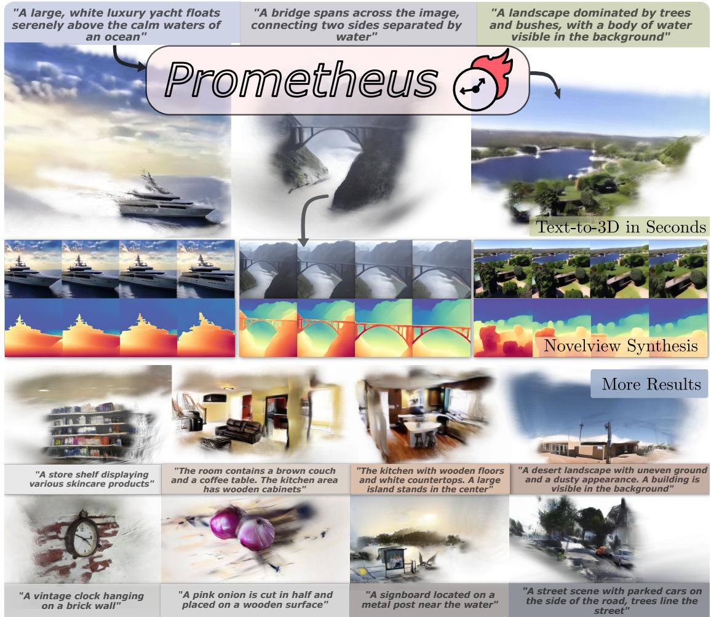
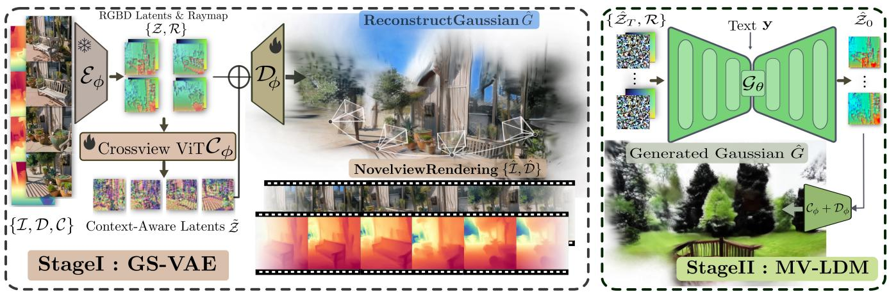
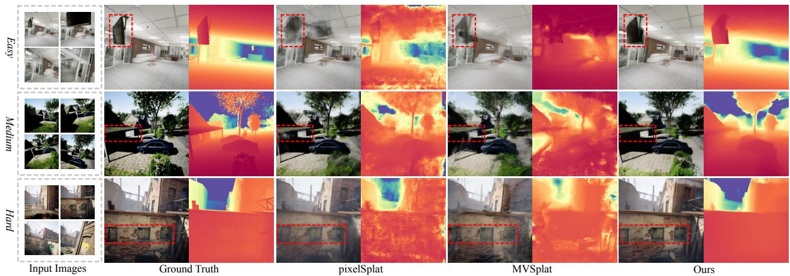
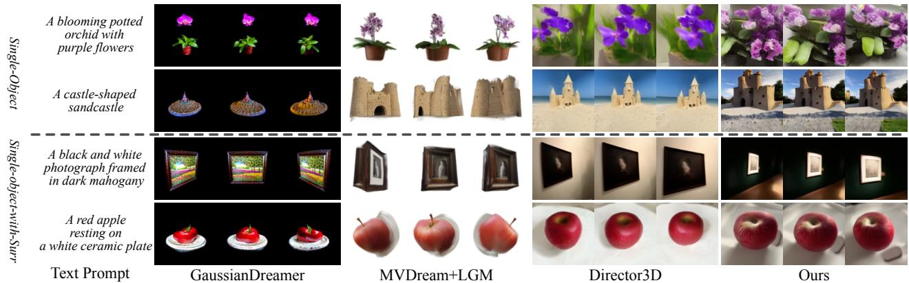
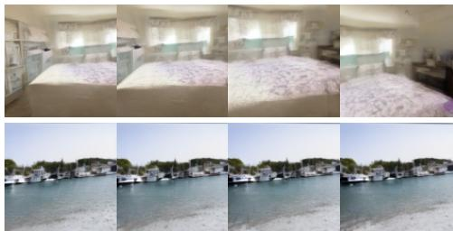
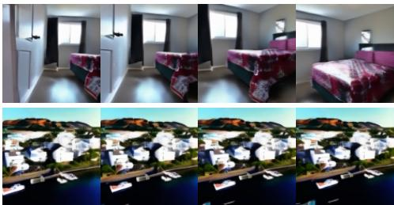
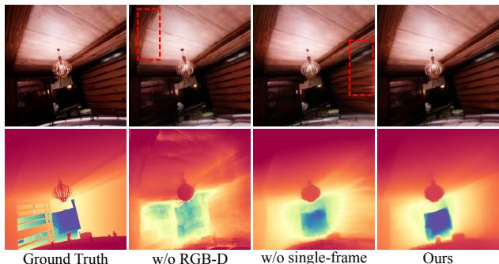

# Prometheus: 3D-Aware Latent Diffusion Models for Feed-Forward Text-to-3D Scene Generation

Yuanbo Yang1\* Jiahao Shao1\* Xinyang Li2 Yujun Shen3 Andreas Geiger4 Yiyi Liao1† 1Zhejiang University 2Xiamen University 3Ant Group 4University of Tubingen¨

  
Figure 1. We present Prometheus, a novel method for feed-forward scene-level 3D generation. At its core, our approach harnesses the power of 2D priors to fuel generalizable and efficient 3D synthesis – hence our name, Prometheus.

## Abstract

In this work, we introduce Prometheus, a 3D-aware latent diffusion modelfor text-to-3D generation at both object and scene levels in seconds. We formulate 3D scene generation as multi-view, feed-forward, pixel-aligned 3D Gaussian generation within the latent diffusion paradigm. To ensure generalizability, we build our model upon pretrained text-to-image generation model with only minimal adjustments, and further train it using a large number of imagesfrom both single-view and multi-view datasets. Furthermore, we introduce an RGB-D latent space into 3D Gaussian generation to disentangle appearance and geometry information, enabling efficientfeed-forward generation of 3D Gaussians with better fidelity and geometry. Extensive experimental results demonstrate the effectiveness of our method in both feed-forward 3D Gaussian reconstruction and text-to-3D generation. Project page: Prometheus.

## 1. Introduction

3D assets play a crucial role in a wide range of applications, including AR/VR, gaming, and simulation. Developing 3D generative models capable of efficiently producing versatile 3D content has become a key objective, drawing substantial interest in the field. Despite rapid progress in 2D image and video generation, 3D generative models continue to fall short of the progress seen in 2D generation.

One line of existing 3D generative models learn from 3D/multi-view data [8, 89], or single-view images of a single category [5, 59]. This allows them for directly learning 3D representations in a feed-forward manner. Despite achieving excellent multi-view consistency with good ge ometry, their generalizability is limited due to the scarcity of the training data. Another line of approaches seeks to use models trained on large amounts of 2D data for 3D generation –– while the largest multi-view datasets contain around 100K samples, single-view datasets and pretrained models based on them can reach scales of 100M to 2B samples. Most methods in this area obtain 3D representations through optimization. Some approaches use score distillation [40, 54, 70, 80, 93] or incremental inpainting [14, 64, 75, 97]. However, since 2D models lack a complete understanding of 3D, their outputs sometimes face the Janus problem and tend to produce results with low fidelity. Another set of methods fine-tunes 2D models to generate multi-view images, requiring multi-view reconstruction to form the 3D representation [18, 47, 58, 63, 84]. In both cases, the optimization process can be time-consuming, thereby lacking efficiency.

To address the aforementioned issues, we introduce Prometheus, a 3D-aware latent diffusion model tailored for text-to-3D generation at both object and scene levels. Our key idea is to exploiting vast amount of 2D data as well as 2D generative models to facilitate feed-forward 3D generation while maintaining generalization ability – taming the fire of 2D priors to streamline 3D generation. Specif ically, we formulate 3D scene generation as multi-view, feed-forward, pixel-aligned 3D Gaussian generation within latent diffusion paradigm. To ensure generalizability, we not only build our model upon pre-trained text-to-image generation model (Stable Diffusion) with only minimal adjustments but also train it using both single-view images and multi-view images. Furthermore, we introduce an RGB-D latent space into 3D Gaussian generation to disentangle appearance and geometry information, enabling efficient feedforward generation of 3D Gaussians with better fidelity and geometry.

Following the standard latent diffusion paradigm [57], we separate training into two distinct stages. In the first stage, we train a 3D Gaussian Variational Autoencoder (GS-VAE) that takes multi-view or single-view RGB-D images as input and predicts per-pixel aligned 3D Gaussians. Here, the input depth map during training is estimated using an off-the-shelf monocular depth estimator. Additionally, the encoder of our GS-VAE directly re-uses the Stable Diffusion encoder, predicting latent codes for both RGB images and depth maps. We subsequently train a multi-view GS decoder to generate multi-view 3D Gaussians from the RGB-D latent codes conditioned on camera poses. In the second stage, we train a multi-view LDM that jointly predicts multi-view RGB-D latent codes, conditioned on both camera pose and text prompt. Furthermore, our full model is trained on a combination of 9 multi-view and single-view datasets, aiming for generalizability comparable to Stable Diffusion. We demonstrate the effectiveness of our method in both feed-forward 3D Gaussian reconstruction and textto-3D generation, showcasing that our model can generate 3D scenes in seconds while generalizing well to a variety of 3D objects and scenes.

## 2. Related work

3D Generative Models: 3D generative models have attracted great attention in recent years. Many approaches learn from single-category images or 3D supervisions [5, 10, 51, 59, 73, 100], utilizing either GANs or diffusion models. However, these studies primarily concentrate on domain-specific, object-centric scenes, such as those involving Carla Cars [16] and human faces [29]. Despite recent progress that has further extended these methods to model scene-level generation [1, 53, 88, 91], these methods are yet confined to a specific domain with limited generalization capability. This is mainly due to the scarcity of 3D supervision. We aim to tackle this problem by combining multi-view supervision with a vast amount of 2D images.

3D Generation with 2D priors: Thanks to the rapid progress in 2D generation models like Stable Diffusion [57] and SoRA [3], there is a large many works have explored the potential of large 2D diffusion models for 3D-aware generation. One line of works fine-tune 2D diffusion models to enable pose controllability for objects [46, 47] or scenes [18, 20, 58, 81], where the output still lies in the 2D image space. Additionally, some works [13, 34, 34, 44, 52, 68, 95, 98, 105] aim to incorporate underlying 3D prior knowledge to assist in synthesis. Since the aforementioned methods generate only 2D images, a separate 3D reconstruction step is still needed, which can add time and introduce errors. In contrast, we explore directly generating 3D representations in a feed-forward manner.

Another line of methods utilize the 2D priors for 3D generation through optimization, e.g., using Score Distillation Sampling (SDS) [54, 54, 70, 74, 80, 93]. In parallel, several works [14, 17, 36, 64, 75, 96, 103] formulate scene synthesis as “perpetual view generation” [43], synthesizing the effects of navigating a 3D world by stitching and rendering images based on camera motions. These methods do not require retraining 2D generative models, but they are inefficient due to per-scene optimization. The generated content’s quality is limited by the 2D backbone, causing issues like multi-view inconsistency and artifacts in geometry and texture during image inpainting and score distillation.

Feed-Forward 3D Gaussian Generation: Unlike view synthesis-based methods that focus on synthesizing multiview images followed by 3D reconstruction, a more intuitive approach is to directly generate 3D representations. Following this idea, many works [6, 26, 76, 89] concentrate on the direct synthesis of 3D representations, such as NeRF [48], which generates meshes from single or fewview image inputs. Recently, numerous works [7, 8, 11, 12, 69, 71, 82, 86, 87, 87, 94, 102] have adopted 3D Gaussian Splatting [32] as the underlying representation. Pixel-Splat [7] is the first feed-forward model that learns to reconstruct 3D Gaussian splats from pairs of images. GS-LRM [102] builds on this idea and utilizing a larger reconstruction model (LRM [26]), achieving improved results.

To address this challenge, several works [21, 23, 35, 37, 38, 56, 60, 106] propose Large Diffusion Models as powerful generators for 3D representations. WildFusion [60] introduces a novel approach for achieving 3D-aware image synthesis from in-the-wild datasets using latent diffusion models. Director3D [38], which is closely related to our work, presents a robust open-world text-to-3D generation framework designed to create both real-world 3D scenes and adaptive camera trajectories. Unlike Director3D, which requires supervision in the image space, we follow common practices in 2D image generation and adopt a latent diffusion framework. This approach significantly reduces computational overhead, making larger-scale training feasible, and better leverages the 2D latent space, enhancing the generalizability of our method.

## 3. Method

In this section, we provide the technical details of our method. As illustrated in Fig. 2, Prometheus follows the common latent diffusion framework [57], which involves two training stages. In the first stage (Sec. 3.1), our 3D autoencoder, GS-VAE, learns a compressed and abstracted latent space from multi-view images. Subsequently, it decodes this latent space into pixel-aligned 3DGS representations, serving as scene-level representations. In the second stage (Sec. 3.2), a latent multi-view diffusion model (MV-LDM) is trained on the latent representations derived from the first stage’s autoencoder. This process results in a fully generative model. Finally, we elaborate on our sampling strategy (Sec. 3.3) for sampling 3D scenes in seconds while maintaining consistency and visual fidelity.

## 3.1. Stage 1: GS-VAE

In Stage 1, our objective is to train a 3D autoencoder capable of compressing data into a latent space and subsequently reconstructing it into a 3D representation. Given multi-view input images with camera poses, our GS-VAE outputs multi-view pixel-aligned 3DGS. These outputs are then merged into a scene-level 3D representation.

Encoding Multi-View RGB-D Images. We propose to encode both, RGB images and their predicted monocular depth maps, into the latent space, considering that monocular depth maps provide clues for the later 3D Gaussian decoding process and can be easily obtained. Given a set of multi-view images $\mathcal { T } = \{ I _ { i } \in \bar { \mathbb { R } } ^ { H \times W \times 3 } | i = 1 , 2 , \dots , N \}$ with each image $I _ { i }$ being an observation of an underlying 3D scene, we first employ an off-the-shelf depth estimator [90] to obtain their corresponding monocular depth maps $\mathcal { D } = \{ D _ { i } \in \mathbb { R } ^ { H \times W \times 1 } | i = 1 , 2 , \dotsc , N \}$ . Next, we utilize a pre-trained image encoder $\mathcal { E } _ { \phi }$ to encode both the multi-view images I and their depth maps D into a latent representation:

$$
\mathcal { E } _ { \phi } : ( \mathcal { T } , \mathcal { D } ) \mapsto \mathcal { Z } \in \mathbb { R } ^ { N \times h \times w \times c } ,\tag{1}
$$

where $h \times w$ is the downsampled resolution. In practice, we use a pre-trained Stable Diffusion (SD) image encoder and freeze it during training. Recent methods, such as Marigold [31], indicate that the SD encoder exhibits robust generalization capabilities with depth maps. Consequently, we opt to employ the same SD encoder to independently encode both images and depths without the need for finetuning. Subsequently, we concatenate these encoded representations to obtain the full multi-view latent Z which can be used for 3D reconstruction. Our diffusion model is additionally trained within this joint RGB-D latent space.

Fusing Multi-View Latent Images. Recent advancements [26, 35, 77, 101, 102] underscore the significant potential of transformer-based models in integrating multiview information. Since our latent codes for each view in $\mathcal { Z }$ are derived individually, we employ a multi-view transformer to facilitate cross-view information exchange.

We further inject N camera poses into our multiview transformer. Inspired by recent works [18, 35, 38, 89], we choose Plucker coordinates as camera rep-¨ resentation [65], specifically $\textbf { r } = \mathbf { \Omega } ( \mathbf { d } , \mathbf { p } \times \mathbf { d } ) \ \in \mathbf { \Omega } \mathbb { R } ^ { 6 }$ where d denotes the normalized ray direction and p denotes the camera origin. Thus, initial N camera poses can be re-parameterized as multi-view ray maps $\mathcal { R } =$ $\left\{ R _ { i } \in \mathbb { R } ^ { H \times W \times 6 } | i = 1 , 2 , \dots , N \right\}$ . We combine the multiview latent codes Z and the camera ray maps R via concatenation along the feature channel and feed them into the cross-view transformer to obtain the fused latent codes $\tilde { \mathcal { Z } } \in \mathbb { R } ^ { h \times w \times c }$ that merges multi-view context:

  
Figure 2. Method Overview. Our training process is divided into two stages. In stage 1, our objective is to train a GS-VAE. Utilizing multi view images along with their corresponding pseudo depth maps and camera poses, our GS-VAE is designed to encode these multi-view RGB-D images, integrate cross-view information, and ultimately decode them into pixel-aligned 3DGS. In stage 2, we focus on training a MV-LDM. We can generate multi-view RGB-D latents by sampling from randomly-sampled noise with trained MV-LDM.

$$
\mathcal { C } _ { \phi } : ( \mathcal { Z } , \mathcal { R } ) \mapsto \tilde { \mathcal { Z } } \in \mathbb { R } ^ { h \times w \times c } .\tag{2}
$$

Decoding into Gaussian Scenes. Finally, we concatenate the raw image latent codes ${ \mathcal { Z } } ,$ , ray maps R, and the fused latent codes $\tilde { \mathcal { Z } } ,$ and feed them into the decoder, thereby obtaining the pixel-aligned multi-view 3D Gaussians ${ \mathcal { F } } =$ $\{ F _ { i } \in \bar { \mathbb { R } ^ { H \times W \times C _ { G } } } | i = 1 , 2 , \dots , N \}$

$$
\mathcal { D } _ { \phi } : ( \mathcal { Z } , \tilde { \mathcal { Z } } , \mathcal { R } ) \mapsto \mathcal { F } \in \mathbb { R } ^ { N \times H \times W \times C _ { G } } ,\tag{3}
$$

where $F _ { i }$ is the pixel-aligned 3D Gaussians corresponding to each image. A 3D Gaussian is parameterized by 1-channel depth, 4-channel rotation quaternion, 3-channel scale, 1-channel opacity, and 3-channel spherical harmonics coefficients respectively. Thus $C _ { G } = 1 2$ in our formulation. After aggregating multi-view 3D Gaussians, we can get the final scene-level 3D Gaussians G as in Eq. (4)

$$
\begin{array} { r } { \mathbb { M } ( \mathcal { F } ) \mapsto G \in \mathbb { R } ^ { N _ { G } \times C _ { G } } . } \end{array}\tag{4}
$$

Here, $\mathrm { M } ( \cdot )$ denotes the aggregation operation, which is achieved by transforming all 3D Gaussians into a global coordinate system. $N _ { G }$ represents the number of full Gaussian primitives, which is equivalent to $N \times H \times W$

In practice, this architecture is also applicable to singleview images, where N equals to 1. During training, we sample from both single-view and multi-view images. Besides, to maximize the usage of 2D generative priors, we follow Director3D [38] and repurpose a pre-trained Stable Diffusion image decoder with minor modifications as our Gaussian decoder ${ \mathcal { D } } _ { \phi } .$ . Specifically, we only adjust the number of channels in the first and last convolutional layers.

Loss Function. Given the reconstructed scene-level 3D Gaussians Gˆ, we can render them from arbitrary viewpoints. Let c denote a given viewpoint, we can render the corresponding RGB image and depth map from $\hat { G } \colon$

$$
\operatorname { R } ( { \hat { G } } , \mathbf { c } ) \mapsto \{ { \hat { I } } , { \hat { D } } \} ,\tag{5}
$$

where $\operatorname { R } ( \cdot )$ denotes the differentiable rendering of 3D Gaussian Splatting. We can subsequently apply render loss, which integrates MSE (Mean Squared Error) loss and perceptual [28] loss:

$$
\mathcal { L } _ { r e n d e r } = \mathcal { L } _ { m s e } ( \hat { I } , I ) + \mathcal { L } _ { v g g } ( \hat { I } , I ) .\tag{6}
$$

In addition to the rendering loss on the RGB domain, we also impose a loss between our rendered expected depth Dˆ and the monocular depth D¯ which serve as pseudo geometry ground truth as below:

$$
\mathcal { L } _ { d e p t h } = \| ( w \hat { D } + q ) - \bar { D } \| _ { 2 } ,\tag{7}
$$

where $\mathcal { L } _ { d e p t h }$ is the scale invariant depth loss following [55]. Here, w and $q$ are the scale and shift used to align Dˆ with D¯ since $\bar { D }$ is defined only up to a scale and a shift. We determine w and q using a least-squares criterion [55].

Our full loss function of the GS-VAE is as follows:

$$
\begin{array} { r } { \mathcal { L } ( \phi ) = \lambda _ { 1 } \mathcal { L } _ { m s e } + \lambda _ { 2 } \mathcal { L } _ { v g g } + \lambda _ { 3 } \mathcal { L } _ { d e p t h } , } \end{array}\tag{8}
$$

where $\phi$ denotes the optimizable parameters in GS-VAE, and $\lambda _ { 1 } , \lambda _ { 2 } , \lambda _ { 3 }$ are employed to balance the weight of each loss term.

## 3.2. Stage 2: Geometry-Aware Multi-View Denoiser

After the training of stage 1, we obtain a GS-VAE capable of i) efficiently compressing images into a compact latent space and ii) bridging the gap between 2D and 3D via a 3D Gaussian decoder. This capability enables us to train the multi-view diffusion model (MV-LDM) in the latent space.

We aim to jointly generate multix-view RGB-D latent codes $\mathcal { Z } \in \mathbb { R } ^ { \mathbf { \bar { \boldsymbol { N } } } \times \boldsymbol { h } \times \mathbf { \bar { \boldsymbol { w } } } \times \boldsymbol { c } }$ to provide richer geometric cues for decoding 3DGS. Therefore, we formulate a continuoustime denoising diffusion [30, 66] conditioned on the text prompt y and camera poses R. The diffusion model consists of a stochastic forward pass to inject one noise level noise Gaussian noise into input latent codes and a reverse process to remove noise with a learnable denoiser $\mathcal { G } _ { \theta }$

Training. For each training step, we sample one noise level $\sigma _ { t } .$ where log $\sigma _ { t } \sim \mathcal N ( P _ { m e a n } , P _ { s t d } ^ { 2 } )$ [30]. Next, we add noise of this level to the clean multi-view latents $\mathcal { Z } _ { 0 }$ to obtain the noisy latents $\mathcal { Z } _ { t }$ as

$$
\mathcal { Z } _ { t } = \mathcal { Z } _ { 0 } + \sigma _ { t } ^ { 2 } \epsilon , \epsilon \sim \mathcal { N } ( \mathbf { 0 } , \mathbf { I } ) .\tag{9}
$$

In the reverse process, diffusion model denoises $\mathcal { Z } _ { t }$ towards predicted clean $\hat { \mathcal { Z } } _ { 0 }$ with a learnable multi-view denoiser $\mathcal { G } _ { \theta }$ as

$$
\hat { \mathcal { Z } } _ { 0 } = \mathcal G _ { \boldsymbol \theta } ( \mathcal { Z } _ { t } ; \sigma _ { t } , \mathbf { y } , \mathcal { R } ) ,\tag{10}
$$

where $\mathbf { y }$ and R are the text and camera poses condition respectfully. Our MV-LDM is trained in latent space via denoising score matching (DSM) [72]

$$
\mathcal { L } ( \theta ) = \mathbb { E } _ { \mathcal { Z } , \mathcal { R } , \mathbf { y } , \sigma _ { t } } \left[ \lambda ( \sigma _ { t } ) \lVert \hat { \mathcal { Z } } _ { 0 } - \mathcal { Z } _ { 0 } \rVert _ { 2 } ^ { 2 } \right] ,\tag{11}
$$

with weighting function $\lambda ( \sigma ) = ( 1 + \sigma ^ { 2 } ) \sigma ^ { - 2 }$ . In this work, we follow EDM [30] and parameterize the denoiser $\mathcal { G } _ { \theta }$ as

$$
\begin{array} { c } { { \mathcal { G } _ { \theta } ( \mathcal { Z } _ { t } ; \boldsymbol { \sigma } _ { t } , \mathbf { y } , \mathcal { R } ) = c _ { \mathrm { s k i p } } ( \boldsymbol { \sigma } _ { t } ) \mathcal { Z } _ { t } + } } \\ { { c _ { \mathrm { o u t } } ( \boldsymbol { \sigma } _ { t } ) F _ { \theta } ( c _ { \mathrm { i n } } ( \boldsymbol { \sigma } _ { t } ) \mathcal { Z } _ { t } ; c _ { \mathrm { n o i s e } } ( \boldsymbol { \sigma } _ { t } ) , \mathbf { y } , \mathcal { R } ) , } } \end{array}\tag{12}
$$

where $F _ { \theta }$ is a UNet to be trained in our case, and $c _ { \mathrm { s k i p } } , c _ { \mathrm { o u t } } ,$ ${ \mathrm { { } } c } _ { \mathrm { { i n } } } ,$ and $c _ { \mathrm { n o i s e } }$ are preconditioning functions. Furthermore, consistent with Stage 1 Eq. (3), we employ ray maps as the pose representation and incorporate them into the network by concatenating them with the noisy latents $\mathcal { Z } _ { t }$ along feature channel. Additionally, the text prompt conditioning is introduced via cross-attention mechanisms.

Inspired by recent multi-view diffusions [18, 38, 63], we replace the self-attention blocks in the original UNet with 3D cross-view self-attention blocks to capture multi-view correlations. In practice, to leverage the pre-trained text-toimage prior, we initialize the model $\mathcal { G } _ { \theta }$ from a pre-trained text-to-image diffusion model’s, specifically the UNet from Stable Diffusion [57].

Sampling. At sampling time, multi-view latents ${ \mathcal { Z } } _ { 0 }$ is restored from a randomly-sampled Gaussian noise ${ \mathcal { Z } } _ { T }$ conditioning on text prompt and camera poses by iteratively applying the denoising process with trained MV-LDM Gθ

<table><tr><td>Dataset</td><td>Scene type</td><td># of frames</td><td># of Scenes</td></tr><tr><td>SAM-1B [33]</td><td>Single view</td><td>11M</td><td></td></tr><tr><td>MVImgNet [99]</td><td>Object</td><td>6.8M</td><td>230K</td></tr><tr><td>DL3DV-10K [42]</td><td>Indoor / Outdoor</td><td>2.2M</td><td>6K</td></tr><tr><td>Objaverse [15]</td><td>Object</td><td>11.5M</td><td>784K</td></tr><tr><td>ACID [43]</td><td>Indoor</td><td>510K</td><td>11K</td></tr><tr><td>RealEstate10K [107]</td><td>Indoor</td><td>2.8M</td><td>57K</td></tr><tr><td>KITTI [19]</td><td>Driving</td><td>42K</td><td>0.8K</td></tr><tr><td>KITTI-360 [39]</td><td>Driving</td><td>69K</td><td>1.2K</td></tr><tr><td>nuScenes [4]</td><td>Driving</td><td>340K</td><td>0.85K</td></tr><tr><td>Waymo [67]</td><td>Driving</td><td>200K</td><td>1K</td></tr></table>

Table 1. Training datasets We collect a large, multi-domain dataset for training, including single-view and multi-view data, all paired with detailed captions.

$$
\mathscr { Z } _ { T } \sim \mathcal { N } ( \mathbf { 0 } , \sigma _ { T } ^ { 2 } \mathbf { I } )\tag{13}
$$

$$
\mathcal { Z } _ { t - 1 } = \frac { \mathcal { Z } _ { t } - \mathcal { G } _ { \theta } ( \mathcal { Z } _ { T } ; \sigma _ { t } , \mathbf { y } , \mathcal { R } ) } { \sigma _ { t } } ( \sigma _ { t - 1 } - \sigma _ { t } )\tag{14}
$$

where $\sigma _ { 0 } , . . . , \sigma _ { T }$ are sampled from a fixed variance schedule of a denoising process with T steps.

The Importance of Noise Level. Inspired by insights from recent works [2, 13, 62], we recognize that a lower Signalto-Noise Ratio (SNR) during the denoising step is crucial for determining the global low-frequency structure of the content. Furthermore, this lower SNR during sampling is essential for achieving multi-view consistency in the multiview diffusion model $\mathcal { G } _ { \theta }$ . Therefore, we adopt a relatively large noise distribution with $P _ { m e a n } = 1 . 5$ and $P _ { s t d } = 2 . 0$ during multi-view training of MV-LDM $\mathcal { G } _ { \theta }$ and $P _ { m e a n } =$ -0.5 and $P _ { s t d } = 1 . 2$ during single-view training.

## 3.3. Text to 3D Scene Generation in Sceonds

Based on the model above, we can achieve feed-forward text to 3D scene generation by sampling multi-view RGB-D latents Z from randomly-sampled Gaussian noise ${ \mathcal { Z } } _ { T }$ in latent space using MV-LDM ${ \mathcal { G } } _ { \theta } .$ and subsequently decode into a 3D Gaussian Scene G using GS-VAE decoder:

$$
\left\{ \begin{array} { l l } { \mathcal { G } _ { \boldsymbol { \theta } } : ( \mathcal { Z } _ { T } ; \mathbf { y } , \mathcal { R } ) } & { \mapsto \mathcal { Z } , } \\ { \mathcal { C } _ { \boldsymbol { \phi } } : ( \mathcal { Z } , \mathcal { R } ) } & { \mapsto \tilde { \mathcal { Z } } , } \\ { \mathcal { D } _ { \boldsymbol { \phi } } : ( \mathcal { Z } , \tilde { \mathcal { Z } } , \mathcal { R } ) } & { \mapsto G . } \end{array} \right.\tag{15}
$$

To sample that with high quality and align with the condition, we use classfier-free-guidance (CFG) [25] to guide multi-view generation toward condition signal y.

$$
\begin{array} { r l } & { \mathcal { G } _ { \theta } ^ { w } ( \mathcal { Z } _ { t } ; \mathbf { y } , \mathcal { R } ) = w \cdot \mathcal { G } _ { \theta } ( \mathcal { Z } _ { t } ; \mathbf { y } , \mathcal { R } ) } \\ & { ~ + ~ ( w - 1 ) \cdot \mathcal { G } _ { \theta } ( \mathcal { Z } _ { t } ; \mathcal { R } ) , } \end{array}\tag{16}
$$

where $w ~ \ge ~ 0$ represents the guidance strength. However, if we simply apply the naive CFG Eq. (16), as commonly practiced in most text-to-image methods, increasing w would lead to multi-view inconsistency in the generated results. This naive design described above causes the model to overfit to the text condition while compromising multiview consistency, in line with with the findings in [83, 85]. To balance multi-view consistency and fidelity during sampling, we follow HarmonyView [83] and adapt hybrid sampling guidance, which rewrites Eq. (16) as below:

<table><tr><td rowspan="2">Method</td><td colspan="5">Tartanair (Easy)</td><td rowspan="2"></td><td colspan="3">Tartanair (Medium)</td><td rowspan="2">δ1↑</td><td colspan="5">Tartanair (Hard)</td><td rowspan="2">δ1↑</td></tr><tr><td>PSNR↑</td><td>SSIM↑</td><td>LPIPS↓</td><td>AbsRel↓</td><td>δ1↑</td><td>PSNR↑</td><td>SSIM↑</td><td>LPIPS↓</td><td>AbsRel↓</td><td>PSNR↑</td><td>SSIM↑ LPIPS↓</td><td></td><td>AbsRel↓</td></tr><tr><td>pixelSplat[7]</td><td>21.65</td><td>0.681</td><td>0.293</td><td>0.650</td><td>0.373</td><td>20.30</td><td>0.628</td><td>0.337</td><td>0.806</td><td>0.323</td><td>19.35</td><td>0.589</td><td>0.371</td><td>0.871</td><td></td><td>0.307</td></tr><tr><td>MVSplat [11]</td><td>19.38</td><td>0.569</td><td>0.370</td><td>0.809</td><td>0.283</td><td>18.50</td><td>0.531</td><td>0.409</td><td></td><td>0.872</td><td>0.265</td><td>17.87</td><td>0.500</td><td>0.445</td><td>0.907</td><td>0.272</td></tr><tr><td>Ours</td><td>20.95</td><td>0.589</td><td>0.289</td><td>0.435</td><td>0.536</td><td>20.15</td><td>0.560</td><td>0.314</td><td>0.493</td><td>0.514</td><td>19.49</td><td></td><td>0.532 0.341</td><td></td><td>0.526</td><td>0.505</td></tr></table>

Table 2. Quantitative comparison for Stage 1. We compare our GS-VAE with baselines for generalizable reconstruction on Tartanair.

  
Figure 3. Qualitative comparison for Stage 1. We compare Prometheus against baselines under varying difficulty settings. As overlap gradually decreases, the advantages of our method continue to grow. Moreover, as shown in the depth map, our method exhibits superior geometry quality across all settings

$$
\begin{array} { r l } & { \mathcal { G } _ { \boldsymbol { \theta } } ^ { w } \big ( \mathcal { Z } _ { t } ; \mathbf { y } , \mathcal { R } \big ) = \mathcal { G } _ { \boldsymbol { \theta } } \big ( \mathcal { Z } _ { t } ; \mathbf { y } , \mathcal { R } \big ) } \\ & { \quad \quad \quad \quad + w _ { 1 } \cdot \big ( \mathcal { G } _ { \boldsymbol { \theta } } \big ( \mathcal { Z } _ { t } ; \mathbf { y } , \mathcal { R } \big ) - \mathcal { G } _ { \boldsymbol { \theta } } \big ( \mathcal { Z } _ { t } ; \mathcal { R } \big ) \big ) } \\ & { \quad \quad \quad \quad + w _ { 2 } \cdot \big ( \mathcal { G } _ { \boldsymbol { \theta } } \big ( \mathcal { Z } _ { t } ; \mathbf { y } , \mathcal { R } \big ) - \mathcal { G } _ { \boldsymbol { \theta } } \big ( \mathcal { Z } _ { t } ; \mathbf { y } \big ) \big ) , } \end{array}\tag{17}
$$

where $w _ { 1 }$ and $w _ { 2 }$ denote the weight of text and pose guidance respectively with $w = w _ { 1 } + w _ { 2 }$ , thereby better maintaining fidelity and consistency across generated views. In addition, we also use CFG-rescale as proposed in [41] to avoid over-saturation issues during conditional sampling.

## 4. Experiment

## 4.1. Training Datasets

We train our method on large-scale single-view and multiview datasets, see Tab. 1. Regarding the single view dataset, we use a high-quality SAM-1B [33] dataset with detailed captions [45] which was present in PixArt-α [9]. Our model is trained on a combination of 9 multi-view datasets, including object-centric, indoor, outdoor, and driving scenarios, text prompts for each scene are generated using the multimodal large language model [45].

## 4.2. Implement Details

During GS-VAE training (Stage 1), we set both the number of input and novel views to N=4 for each multi-view scene. To improve model generalizability, we also sample 2 single-view images alongside the multi-view ones, applying the loss to the input views only for single-view images. The GS-VAE was trained on 8 A800 GPUs with a batch size of 32. The final model is trained for 200,000 iterations with approximately 4 days. We use gsplat [92] as our 3D Gaussian renderer. We initialize the weights of our cross-view transformer from a pretrained RayDiff [101].

For the MV-LDM (Stage 2), we employ Stable Diffusion 2.1 [57] as our base model. During training, we set $N = 8$ for each multi-view scene. Similarly to Stage 1, we sample M=4 single-view images alongside multi-view ones. For each iteration, we sample a batch size of 8 on each GPU. The final MV-LDM model was trained on 32 A800 GPUs, resulting in a total batch size of 3072 images. The mode underwent 350,000 iterations, which took about 7 days. We utilize a DepthAnything-V2-S [90] model to estimate depth map on the fly. To achieve classifier-free guidance during sampling, we randomly drop text condition y and pose condition R with the probability 10% during training.

## 4.3. Evaluation Protocols

3D Reconstruction (Stage-1). To demonstrate the 3D reconstruction generalization of our GS-VAE, we employed Tartanair [78] for our evaluation, which is a diverse synthetic dataset with 18 scenes not included in our training set, covering both indoor and outdoor scenarios. Based on the degree of overlap and distance among input views, we categorize them into three distinct modes: Easy, Medium, and Hard, each comprising 4 context views and 3 target views.

<table><tr><td rowspan="2">Method</td><td colspan="3">Single-Object</td><td colspan="3">Single-Object-with-Surroundings</td><td colspan="3">Scene-Level</td><td rowspan="2">Time</td></tr><tr><td>BRISQUE↓</td><td>NIQE↓</td><td>CLIP-Score↑</td><td>BRISQUE↓°NIQE↓</td><td></td><td>CLIP-Score↑</td><td>BRISQUE↓</td><td>NIQE↓ CLIP-Score↑</td><td></td></tr><tr><td>GaussianDreamer [93]</td><td>107.8</td><td>18.79</td><td>0.386</td><td>110.8</td><td>18.16</td><td>0.389</td><td></td><td></td><td></td><td>≈ 15min</td></tr><tr><td>MVDream [63]+LGM [71]</td><td>74.64</td><td>14.96</td><td>0.379</td><td>77.50</td><td>14.03</td><td>0.343</td><td></td><td></td><td></td><td>≈ 10s</td></tr><tr><td>Director3D [38]</td><td>49.91</td><td>13.56</td><td>0.397</td><td>49.77</td><td>13.64</td><td>0.405</td><td>50.88</td><td>14.97</td><td>0.357</td><td>≈ 22s</td></tr><tr><td>Ours</td><td>59.43</td><td>14.23</td><td>0.329</td><td>58.88</td><td>14.00</td><td>0.369</td><td>49.63</td><td>14.01</td><td>0.370</td><td>≈ 8s</td></tr></table>

Table 3. Quantitative comparison for 3D generation. We compare Prometheus with baselines for text-to-3D generation utilizing text prompts from T3Bench.

  
Figure 4. Qualitative comparison for Stage2: Object-level 3D generation. Prometheus generates objects that align with the given description, incorporating rich background information and intricate details.

We use the metrics PSNR, SSIM [79] and LPIPS [104] for evaluating the reconstructed images. To better compare the reconstructed geometry, we evaluate the rendered depth maps. Follow [27, 61], we align rendered depth maps with the ground truth with per-scene scale and shift and calculate two widely recognized metrics [55] for evaluation, Absolute Mean Relative Error (AbsRel) and δ1 accuracy with a specified threshold value of 1.25.

3D Generation (Stage-2). To assess the text-to-3D generation capabilities of our model, we employ two text prompt sets from T3Bench [22] –– Single-Object and Single-Object-with-Surroundings. These sets collectively evaluate the model’s proficiency in object-level, and scene-level generation tasks. Additionally, we collected 80 diverse scenelevel text prompts covering indoor and outdoor scenarios.

The quantitative results are evaluated using the CLIP-Score [24], NIQE [50], and BRISQUE [49] metrics. CLIP-Score assesses the alignment between the generated images and the textual prompts, whereas NIQE and BRISQUE indicate the image quality.

## 4.4. Comparison with Baselines

3D Reconstruction. We compare the GS-VAE of Prometheus against two sparse-view reconstruction models –– namely, pixelSplat [7] and MVSplat [11]. Our quantitative findings are shown in Tab. 2, where we accentuate the best , second-best , and third-best scores across all metrics. Beginning with geometry, Prometheus surpasses the other two baselines, and this advantage becomes more pronounced as the degree of overlap among input views diminishes –– see the δ1, which exhibits a relative enhancement of 44% on Easy mode and a substantial 64% on Hard mode against pixelSplat. Regarding the reconstructed images, Prometheus delivers comparable outcomes on Easy mode and notably outperforms its counterparts as the mode intensifies, particularly in Hard mode. We also provide qualitative results in Fig. 3. These findings on geometry and image reconstruction suggest that Prometheus is more robust to variations in input view overlap than its baselines, a key factor for the success of our downstream 3D generation task.

3D Generation. We compare Prometheus with three text-to-3D baseline methods, covering both optimizationbased method and feed-forward method. Gaussian-Dreamer [93] is a state-of-the-art SDS-based method for 3DGS. We additionally implement a baseline that applies a multi-view to 3D method, LGM [71] to images generated by MVDream [63]. We also compare to a feed-forward method, Director3D [38] (without refiner). Fig. 4 and Fig. 5 show that our method is capable of generating both, object and scene-level contents, containing background and rich details, outperforms both optimization-based and feedforward baselines. Tab. 3 shows our overall metrics are suboptimal compared with Director3D for object level while leading in other cases. This is attributed to failure cases in the object-centric setting, see supplementary material for

A bedroom scene displays a bed covered by a quilt and a window located near the end of the bed

A coastal town with white buildings and green vegetation is seen in the image

Text Prompt  
  
Director3D

  
Ours

Figure 5. Qualitative comparison for Stage 2: Scene-level 3D generation with diverse scene-level prompt. Our result better aligns with the text prompt and captures more details.
<table><tr><td rowspan="2">Variants</td><td colspan="5">Tartanair (4 views)</td></tr><tr><td>PSNR↑</td><td>SSIM↑</td><td>LPIPS↓</td><td>AbsRel↓</td><td>δ1↑</td></tr><tr><td>Ours(w/o RGB-D)</td><td>18.38</td><td>0.475</td><td>0.383</td><td>0.761</td><td>0.324</td></tr><tr><td>Ours(w/o single-view)</td><td>18.63</td><td>0.480</td><td>0.424</td><td>0.542</td><td>0.475</td></tr><tr><td>Ours</td><td>19.49</td><td>0.532</td><td>0.341</td><td>0.526</td><td>0.505</td></tr></table>

Table 4. Quantitative ablation results of GS-VAE for generalizable reconstruction.

  
Figure 6. Qualitative ablation results of GS-VAE for generalizable reconstruction.

more details. Note that our method takes only 8 seconds for generation, outperforming all baselines.

## 4.5. Ablations of GS-VAE (Stage 1)

In Tab. 4, we run ablation studies on the Hard mode of Tartanair, analyzing the following factors of GS-VAE.

The effectiveness of Depth Prior for GS-VAE. We investigate the impact of RGB-D latent space during our stage 1 training. Our result in Tab. 4 highlights that training without RGB-D latent space –– only RGB latent space –– yields worse results over our full model on geometry. Additionally, this bad geometry will lead to sub-optimal quality on reconstructed images, see qualitative results in Fig. 6.

If large scale matters in Generalizable Reconstruction. Next, we ablate the effectiveness of large-scale dataset, denoted as w/o single-view in Tab. 4. The exclusion of the single-view dataset results in diminished performance across both reconstructed images and geometry. This underscores the significant role of large-scale datasets in achieving robust Generalizable Reconstruction. We also visualize the qualitative results in Fig. 6.

<table><tr><td></td><td>Variants</td><td>BRISQUE↓</td><td>NIQE↓</td><td>CLIP-Score↑</td></tr><tr><td>Training</td><td>w/o single-view data</td><td>59.45</td><td>14.57</td><td>0.342</td></tr><tr><td>strategy</td><td>w/o high noise level</td><td>63.06</td><td>13.88</td><td>0.343</td></tr><tr><td>Inference</td><td>w/o hybrid sampling</td><td>66.19</td><td>13.92</td><td>0.329</td></tr><tr><td>strategy</td><td>w/o CFG-rescale</td><td>89.70</td><td>15.15</td><td>0.303</td></tr><tr><td></td><td>Ours (full)</td><td>58.88</td><td>14.00</td><td>0.369</td></tr></table>

Table 5. Quantitative ablation results of MV-LDM on text-to-3D generation.

## 4.6. Ablations of MV-LDM (Stage 2)

In Tab. 5, we conduct ablation studies on the Single-Object-with-Surroundings subset of T3Bench, examining both training and inference strategies of MV-LDM.

Single-View Dataset. We assess the impact of singleview data. Excluding this training strategy by solely training with multi-view data (w/o single-view data) results in performance degradation, We attribute this to the lack of single-view data, which reduces the model’s generalizability, aligning with the observations in MVDream [63].

High Noise Level. As mentioned in Zero123++ [46] and Sec. 3.2, it is crucial for the model to learn high-level structures in the low-frequency space. Therefore, we also evaluate the effectiveness of a high noise level by setting $P _ { m e a n } = - 0 . 5$ and $P _ { s t d } = 1 . 2$ during multi-view training (w/o high-noise level). The results in Tab. 3 show that both visual quality and CLIP score decline in this setting.

Hybrid Sampling and CFG-Rescale. Finally, we evaluate the design of our inference strategy Sec. 3.2 on hybrid CFG sampling and CFG-rescale by applying CFG solely on the text prompt(w/o hybrid sampling) and set the CFG-rescale factor to 0 (w/o CFG-rescale). Tab. 5 shows that the absence of hybrid sampling and CFG-rescale results in varying degrees of metric decline.

## 5. Conclusion

We present Prometheus, a 3D-aware latent diffusion model tailored for text-to-3D generation at both object and scene levels in seconds. We demonstrate the effectiveness of our method in feed-forward reconstruction and 3D generation with extensive experiments. We believe our work offers valuable contributions to text-to-3D scene generation, improving generalizability, fidelity, and efficiency.

Acknowledgements: This work is supported by NSFC under grant 62441223 and 62202418. This work was supported by Ant Group Research Fund.

## References

[1] Sherwin Bahmani, Jeong Joon Park, Despoina Paschalidou, Xingguang Yan, Gordon Wetzstein, Leonidas J. Guibas, and Andrea Tagliasacchi. CC3D: layout-conditioned generation of compositional 3d scenes. arXiv.org, 2023. 2

[2] Andreas Blattmann, Tim Dockhorn, Sumith Kulal, Daniel Mendelevitch, Maciej Kilian, Dominik Lorenz, Yam Levi, Zion English, Vikram Voleti, Adam Letts, Varun Jampani, and Robin Rombach. Stable video diffusion: Scaling latent video diffusion models to large datasets. arXiv.2311.15127, 2023. 5

[3] Tim Brooks, Bill Peebles, Connor Holmes, Will DePue, Yufei Guo, Li Jing, David Schnurr, Joe Taylor, Troy Luhman, Eric Luhman, Clarence Ng, Ricky Wang, and Aditya Ramesh. Video generation models as world simulators, 2024. 2

[4] Holger Caesar, Varun Bankiti, Alex H Lang, Sourabh Vora, Venice Erin Liong, Qiang Xu, Anush Krishnan, Yu Pan, Giancarlo Baldan, and Oscar Beijbom. nuscenes: A multimodal dataset for autonomous driving. In Proc. IEEE Conf. on Computer Vision and Pattern Recognition (CVPR), 2020. 5

[5] Eric R. Chan, Connor Z. Lin, Matthew A. Chan, Koki Nagano, Boxiao Pan, Shalini De Mello, Orazio Gallo, Leonidas Guibas, Jonathan Tremblay, Sameh Khamis, Tero Karras, and Gordon Wetzstein. Efficient geometry-aware 3D generative adversarial networks. In Proc. IEEE Conf. on Computer Vision and Pattern Recognition (CVPR), 2022. 2

[6] Eric R. Chan, Koki Nagano, Matthew A. Chan, Alexander W. Bergman, Jeong Joon Park, Axel Levy, Miika Aittala, Shalini De Mello, Tero Karras, and Gordon Wetzstein. GeNVS: Generative novel view synthesis with 3D-aware diffusion models. In arXiv, 2023. 3

[7] David Charatan, Sizhe Li, Andrea Tagliasacchi, and Vincent Sitzmann. pixelsplat: 3d gaussian splats from image pairs for scalable generalizable 3d reconstruction. In Proc. IEEE Conf. on Computer Vision and Pattern Recognition (CVPR), 2024. 3, 6, 7

[8] Anpei Chen, Haofei Xu, Stefano Esposito, Siyu Tang, and Andreas Geiger. Lara: Efficient large-baseline radiance fields. In European Conference on Computer Vision (ECCV), 2024. 2, 3

[9] Junsong Chen, Jincheng Yu, Chongjian Ge, Lewei Yao, Enze Xie, Yue Wu, Zhongdao Wang, James Kwok, Ping Luo, Huchuan Lu, and Zhenguo Li. Pixart-α: Fast training of diffusion transformer for photorealistic text-to-image synthesis. 2310.00426, 2023. 6

[10] Luxi Chen, Zhengyi Wang, Zihan Zhou, Tingting Gao, Hang Su, Jun Zhu, and Chongxuan Li. Microdreamer: Zero-shot 3d generation in ∼20 seconds by score-based iterative reconstruction. arXiv preprint arXiv:2404.19525, 2024. 2

[11] Yuedong Chen, Haofei Xu, Chuanxia Zheng, Bohan Zhuang, Marc Pollefeys, Andreas Geiger, Tat-Jen Cham, and Jianfei Cai. Mvsplat: Efficient 3d gaussian splat ting from sparse multi-view images. arXiv preprint arXiv:2403.14627, 2024. 3, 6, 7

[12] Yuedong Chen, Chuanxia Zheng, Haofei Xu, Bohan Zhuang, Andrea Vedaldi, Tat-Jen Cham, and Jianfei Cai. Mvsplat360: Feed-forward 360 scene synthesis from sparse views. In Advances in Neural Information Processing Systems (NeurIPS), 2024. 3

[13] Zilong Chen, Yikai Wang, Feng Wang, Zhengyi Wang, and Huaping Liu. V3d: Video diffusion models are effective 3d generators. arXiv preprint arXiv:2403.06738, 2024. 2, 5

[14] Jaeyoung Chung, Suyoung Lee, Hyeongjin Nam, Jaerin Lee, and Kyoung Mu Lee. Luciddreamer: Domain-free generation of 3d gaussian splatting scenes. arXiv preprint arXiv:2311.13384, 2023. 2, 3

[15] Matt Deitke, Ruoshi Liu, Matthew Wallingford, Huong Ngo, Oscar Michel, Aditya Kusupati, Alan Fan, Christian Laforte, Vikram Voleti, Samir Yitzhak Gadre, Eli VanderBilt, Aniruddha Kembhavi, Carl Vondrick, Georgia Gkioxari, Kiana Ehsani, Ludwig Schmidt, and Ali Farhadi. Objaverse-xl: A universe of 10m+ 3d objects. arXiv preprint arXiv:2307.05663, 2023. 5

[16] Alexey Dosovitskiy, German Ros, Felipe Codevilla, Antonio Lopez, and Vladlen Koltun. CARLA: An open urban driving simulator. In Proc. Conf. on Robot Learning (CoRL), 2017. 2

[17] Rafail Fridman, Amit Abecasis, Yoni Kasten, and Tali Dekel. Scenescape: Text-driven consistent scene generation. arXiv.org, 2302.01133, 2023. 3

[18] Ruiqi Gao\*, Aleksander Holynski\*, Philipp Henzler, Arthur Brussee, Ricardo Martin-Brualla, Pratul P. Srinivasan, Jonathan T. Barron, and Ben Poole\*. Cat3d: Create anything in 3d with multi-view diffusion models. arXiv.org, 2024. 2, 3, 5

[19] Andreas Geiger, Philip Lenz, and Raquel Urtasun. Are we ready for autonomous driving? the kitti vision benchmark suite. In Proc. IEEE Conf. on Computer Vision and Pattern Recognition (CVPR), 2012. 5

[20] Hao He, Yinghao Xu, Yuwei Guo, Gordon Wetzstein, Bo Dai, Hongsheng Li, and Ceyuan Yang. Camerac trl: Enabling camera control for text-to-video generation. arXiv.org, 2404.02101, 2024. 2

[21] Xianglong He, Junyi Chen, Sida Peng, Di Huang, Yangguang Li, Xiaoshui Huang, Chun Yuan, Wanli Ouyang, and Tong He. Gvgen: Text-to-3d generation with volumetric representation. In Proc. of the European Conf. on Computer Vision (ECCV), 2024. 3

[22] Yuze He, Yushi Bai, Matthieu Lin, Wang Zhao, Yubin Hu, Jenny Sheng, Ran Yi, Juanzi Li, and Yong-Jin Liu. T 3 bench: Benchmarking current progress in text-to-3d generation. arXiv preprint arXiv:2310.02977, 2023. 7

[23] Paul Henderson, Melonie de Almeida, Daniela Ivanova, and Titas Anciukevicius. Sampling 3d gaussian scenes in seconds with latent diffusion models. arXiv preprint arXiv:2406.13099, 2024. 3

[24] Jack Hessel, Ari Holtzman, Maxwell Forbes, Ronan Le Bras, and Yejin Choi. Clipscore: A reference-free evaluation metric for image captioning. arXiv preprint arXiv:2104.08718, 2021. 7

[25] Jonathan Ho and Tim Salimans. Classifier-free diffusion guidance. arXiv preprint arXiv:2207.12598, 2022. 5

[26] Yicong Hong, Kai Zhang, Jiuxiang Gu, Sai Bi, Yang Zhou, Difan Liu, Feng Liu, Kalyan Sunkavalli, Trung Bui, and Hao Tan. LRM: large reconstruction model for single image to 3d. arXiv.2311.04400, 2023. 3

[27] Wenbo Hu, Xiangjun Gao, Xiaoyu Li, Sijie Zhao, Xiaodong Cun, Yong Zhang, Long Quan, and Ying Shan. Depthcrafter: Generating consistent long depth sequences for open-world videos. arXiv preprint arXiv:2409.02095, 2024. 7

[28] Justin Johnson, Alexandre Alahi, and Li Fei-Fei. Perceptual losses for real-time style transfer and super-resolution. In Proc. of the European Conf. on Computer Vision (ECCV), 2016. 4

[29] Tero Karras, Samuli Laine, and Timo Aila. A stylebased generator architecture for generative adversarial networks. In Proc. IEEE Conf. on Computer Vision and Pattern Recognition (CVPR), 2019. 2

[30] Tero Karras, Miika Aittala, Timo Aila, and Samuli Laine. Elucidating the design space of diffusion-based generative models. Advances in neural information processing systems, 35:26565–26577, 2022. 5

[31] Bingxin Ke, Anton Obukhov, Shengyu Huang, Nando Metzger, Rodrigo Caye Daudt, and Konrad Schindler. Repurposing diffusion-based image generators for monocular depth estimation. In Proceedings ofthe IEEE/CVF Conference on Computer Vision and Pattern Recognition (CVPR), 2024. 3

[32] Bernhard Kerbl, Georgios Kopanas, Thomas Leimkuhler,¨ and George Drettakis. 3d gaussian splatting for real-time radiance field rendering. ACM Trans. on Graphics, 42(4), 2023. 3

[33] Alexander Kirillov, Eric Mintun, Nikhila Ravi, Hanzi Mao, Chloe Rolland, Laura Gustafson, Tete Xiao, Spencer Whitehead, Alexander C. Berg, Wan-Yen Lo, Piotr Dollar,´ and Ross Girshick. Segment anything. arXiv:2304.02643, 2023. 5, 6

[34] Jeong-gi Kwak, Erqun Dong, Yuhe Jin, Hanseok Ko, Shweta Mahajan, and Kwang Moo Yi. Vivid-1-to-3: Novel view synthesis with video diffusion models. In Proc. IEEE Conf. on Computer Vision and Pattern Recognition (CVPR), 2024. 2

[35] Yushi Lan, Fangzhou Hong, Shuai Yang, Shangchen Zhou, Xuyi Meng, Bo Dai, Xingang Pan, and Chen Change Loy. Ln3diff: Scalable latent neural fields diffusion for speedy 3d generation. In Proc. ofthe European Conf. on Computer Vision (ECCV), 2024. 3

[36] Jiabao Lei, Jiapeng Tang, and Kui Jia. Rgbd2: Generative scene synthesis via incremental view inpainting using rgbd diffusion models. In Proc. IEEE Conf. on Computer Vision and Pattern Recognition (CVPR), 2023. 3

[37] Xinyang Li, Zhangyu Lai andLinning Xu, Jianfei Guo, and Liujuan Cao andShengchuan Zhang. Dual3d: Efficient and

consistent text-to-3d generation with dual-mode multi-view latent diffusion. arXiv.org, 2405.09874, 2024. 3

[38] Xinyang Li, Zhangyu Lai, Linning Xu, Yansong Qu, Liu juan Cao, Shengchuan Zhang, Bo Dai, and Rongrong Ji. Director3d: Real-world camera trajectory and 3d scene generation from text. arXiv.org, 2406.17601, 2024. 3, 4, 5, 7

[39] Yiyi Liao, Jun Xie, and Andreas Geiger. Kitti-360: A novel dataset and benchmarks for urban scene understanding in 2d and 3d. In IEEE Trans. on Pattern Analysis and Machine Intelligence (PAMI), 2022. 5

[40] Chen-Hsuan Lin, Jun Gao, Luming Tang, Towaki Takikawa, Xiaohui Zeng, Xun Huang, Karsten Kreis, Sanja Fidler, Ming-Yu Liu, and Tsung-Yi Lin. Magic3d: Highresolution text-to-3d content creation. In Proceedings of the IEEE/CVF Conference on Computer Vision and Pattern Recognition, pages 300–309, 2023. 2

[41] Shanchuan Lin, Bingchen Liu, Jiashi Li, and Xiao Yang. Common diffusion noise schedules and sample steps are flawed. In Proc. of the IEEE Winter Conference on Ap plications ofComputer Vision (WACV), 2024. 6

[42] Lu Ling, Yichen Sheng, Zhi Tu, Wentian Zhao, Cheng Xin, Kun Wan, Lantao Yu, Qianyu Guo, Zixun Yu, Yawen Lu, et al. Dl3dv-10k: A large-scale scene dataset for deep learning-based 3d vision. In Proc. IEEE Conf. on Computer Vision and Pattern Recognition (CVPR), pages 22160–22169, 2024. 5

[43] Andrew Liu, Richard Tucker, Varun Jampani, Ameesh Makadia, Noah Snavely, and Angjoo Kanazawa. Infinite nature: Perpetual view generation of natural scenes from a single image. In Proceedings of the IEEE/CVF International Conference on Computer Vision (ICCV), 2021. 3, 5

[44] Fangfu Liu, Wenqiang Sun, Hanyang Wang, Yikai Wang, Haowen Sun, Junliang Ye, Jun Zhang, and Yueqi Duan. Reconx: Reconstruct any scene from sparse views with video diffusion model. arXiv preprint arXiv:2408.16767, 2024. 2

[45] Haotian Liu, Chunyuan Li, Qingyang Wu, and Yong Jae Lee. Visual instruction tuning. Advances in neural information processing systems, 36, 2024. 6

[46] Ruoshi Liu, Rundi Wu, Basile Van Hoorick, Pavel Tokmakov, Sergey Zakharov, and Carl Vondrick. Zero-1-to-3: Zero-shot one image to 3d object. arXiv.org, 2303.11328, 2023. 2, 8

[47] Yuan Liu, Cheng Lin, Zijiao Zeng, Xiaoxiao Long, Lingjie Liu, Taku Komura, and Wenping Wang. Syncdreamer: Generating multiview-consistent images from a single-view image. arXiv preprint arXiv:2309.03453, 2023. 2

[48] Ben Mildenhall, Pratul P. Srinivasan, Matthew Tancik, Jonathan T. Barron, Ravi Ramamoorthi, and Ren Ng. Nerf: Representing scenes as neural radiance fields for view syn thesis. In ECCV, 2020. 3

[49] Anish Mittal, Anush Krishna Moorthy, and Alan Conrad Bovik. No-reference image quality assessment in the spatial domain. IEEE Transactions on image processing, 21(12): 4695–4708, 2012. 7

[50] Anish Mittal, Rajiv Soundararajan, and Alan C Bovik. Making a “completely blind” image quality analyzer. IEEE Signal processing letters, 20(3):209–212, 2012. 7

[51] Norman Muller, Yawar Siddiqui, Lorenzo Porzi,¨ Samuel Rota Bulo, Peter Kontschieder, and Matthias Nießner. Diffrf: Rendering-guided 3d radiance field diffusion. In Proc. IEEE Conf. on Computer Vision and Pattern Recognition (CVPR), 2023. 2

[52] Norman Muller, Katja Schwarz, Barbara R¨ ossle, Lorenzo¨ Porzi, Samuel Rota Bulo, Matthias Nießner, and Peter\` Kontschieder. Multidiff: Consistent novel view synthesis from a single image. In Proceedings of the IEEE/CVF Conference on Computer Vision and Pattern Recognition (CVPR), pages 10258–10268, 2024. 2

[53] Michael Niemeyer and Andreas Geiger. GIRAFFE: representing scenes as compositional generative neural feature fields. In Proc. IEEE Conf. on Computer Vision and Pattern Recognition (CVPR), 2021. 2

[54] Ben Poole, Ajay Jain, Jonathan T. Barron, and Ben Mildenhall. Dreamfusion: Text-to-3d using 2d diffusion. arXiv, 2022. 2, 3

[55] Rene Ranftl, Katrin Lasinger, David Hafner, Konrad´ Schindler, and Vladlen Koltun. Towards robust monocular depth estimation: Mixing datasets for zero-shot crossdataset transfer. IEEE Trans. on Pattern Analysis and Machine Intelligence (PAMI), 44(3), 2022. 4, 7

[56] Barbara Roessle, Norman Muller, Lorenzo Porzi,¨ Samuel Rota Bulo, Peter Kontschieder, Angela Dai,\` and Matthias Nießner. L3dg: Latent 3d gaussian diffusion. In SIGGRAPH Asia 2024 Conference Papers, 2024. 3

[57] Robin Rombach, Andreas Blattmann, Dominik Lorenz, Patrick Esser, and Bjorn Ommer. High-resolution image¨ synthesis with latent diffusion models. In Proceedings of the IEEE/CVF conference on computer vision and pattern recognition, pages 10684–10695, 2022. 2, 3, 5, 6

[58] Kyle Sargent, Zizhang Li, Tanmay Shah, Charles Herrmann, Hong-Xing Yu, Yunzhi Zhang, Eric Ryan Chan, Dmitry Lagun, Li Fei-Fei, Deqing Sun, and Jiajun Wu. ZeroNVS: Zero-shot 360-degree view synthesis from a single real image. arXiv.org, 2310.17994, 2023. 2

[59] Katja Schwarz, Yiyi Liao, Michael Niemeyer, and Andreas Geiger. Graf: Generative radiance fields for 3d-aware image synthesis. In Advances in Neural Information Processing Systems (NeurIPS), 2020. 2

[60] Katja Schwarz, Seung Wook Kim, Jun Gao, Sanja Fidler, Andreas Geiger, and Karsten Kreis. Wildfusion: Learning 3d-aware latent diffusion models in view space. In Proc. of the International Conf. on Learning Representations (ICLR), 2024. 3

[61] Jiahao Shao, Yuanbo Yang, Hongyu Zhou, Youmin Zhang, Yujun Shen, Matteo Poggi, and Yiyi Liao. Learning temporally consistent video depth from video diffusion priors. arXiv preprint arXiv:2406.01493, 2024. 7

[62] Ruoxi Shi, Hansheng Chen, Zhuoyang Zhang, Minghua Liu, Chao Xu, Xinyue Wei, Linghao Chen, Chong Zeng, and Hao Su. Zero123++: a single image to consistent multi-view diffusion base model. arXiv preprint arXiv:2310.15110, 2023. 5

[63] Yichun Shi, Peng Wang, Jianglong Ye, Long Mai, Kejie Li, and Xiao Yang. Mvdream: Multi-view diffusion for 3d generation. arXiv:2308.16512, 2023. 2, 5, 7, 8

[64] Jaidev Shriram, Alex Trevithick, Lingjie Liu, and Ravi Ramamoorthi. Realmdreamer: Text-driven 3d scene generation with inpainting and depth diffusion. arXiv, 2024. 2, 3

[65] Vincent Sitzmann, Semon Rezchikov, Bill Freeman, Josh Tenenbaum, and Fredo Durand. Light field networks: Neural scene representations with single-evaluation rendering. Advances in Neural Information Processing Systems, 34: 19313–19325, 2021. 3

[66] Yang Song, Jascha Sohl-Dickstein, Diederik P Kingma, Abhishek Kumar, Stefano Ermon, and Ben Poole. Scorebased generative modeling through stochastic differential equations. arXiv preprint arXiv:2011.13456, 2020. 5

[67] Pei Sun, Henrik Kretzschmar, Xerxes Dotiwalla, Aurelien Chouard, Vijaysai Patnaik, Paul Tsui, James Guo, Yin Zhou, Yuning Chai, Benjamin Caine, Vijay Vasudevan, Wei Han, Jiquan Ngiam, Hang Zhao, Aleksei Timofeev, Scott Ettinger, Maxim Krivokon, Amy Gao, Aditya Joshi, Yu Zhang, Jonathon Shlens, Zhifeng Chen, and Dragomir Anguelov. Scalability in perception for autonomous driving: Waymo open dataset. In Proc. IEEE Conf. on Computer Vision and Pattern Recognition (CVPR), 2020. 5

[68] Wenqiang Sun, Shuo Chen, Fangfu Liu, Zilong Chen, Yueqi Duan, Jun Zhang, and Yikai Wang. Dimensionx: Create any 3d and 4d scenes from a single image with con trollable video diffusion. arXiv preprint arXiv:2411.04928, 2024. 2

[69] Stanislaw Szymanowicz, Eldar Insafutdinov, Chuanxia Zheng, Dylan Campbell, Joao Henriques, Christian Rupprecht, and Andrea Vedaldi. Flash3d: Feed-forward generalisable 3d scene reconstruction from a single image. arxiv, 2024. 3

[70] Jiaxiang Tang, Jiawei Ren, Hang Zhou, Ziwei Liu, and Gang Zeng. Dreamgaussian: Generative gaussian splat ting for efficient 3d content creation. arXiv preprint arXiv:2309.16653, 2023. 2, 3

[71] Jiaxiang Tang, Zhaoxi Chen, Xiaokang Chen, Tengfei Wang, Gang Zeng, and Ziwei Liu. Lgm: Large multiview gaussian model for high-resolution 3d content creation. arXiv.org, 2402.05054, 2024. 3, 7

[72] Pascal Vincent. A connection between score matching and denoising autoencoders. Neural computation, 23(7):1661– 1674, 2011. 5

[73] Chen Wang, Jiatao Gu, Xiaoxiao Long, Yuan Liu, and Lingjie Liu. Geco: Generative image-to-3d within a second. arXiv, 2024. 2

[74] Haochen Wang, Xiaodan Du, Jiahao Li, Raymond A. Yeh, and Greg Shakhnarovich. Score jacobian chaining: Lifting pretrained 2d diffusion models for 3d generation. arXiv preprint arXiv:2212.00774, 2022. 3

[75] Haiping Wang, Yuan Liu, Ziwei Liu, Zhen Dong, Wenping Wang, and Bisheng Yang. Vistadream: Sampling multiview consistent images for single-view scene reconstruction. arXiv preprint arXiv:2410.16892, 2024. 2, 3

[76] Qianqian Wang, Zhicheng Wang, Kyle Genova, Pratul Srinivasan, Howard Zhou, Jonathan T. Barron, Ricardo Martin-Brualla, Noah Snavely, and Thomas Funkhouser.

Ibrnet: Learning multi-view image-based rendering. In CVPR, 2021. 3

[77] Shuzhe Wang, Vincent Leroy, Yohann Cabon, Boris Chidlovskii, and Jerome Revaud. Dust3r: Geometric 3d vision made easy. In CVPR, 2024. 3

[78] Wenshan Wang, Delong Zhu, Xiangwei Wang, Yaoyu Hu, Yuheng Qiu, Chen Wang, Yafei Hu, Ashish Kapoor, and Sebastian Scherer. Tartanair: A dataset to push the limits of visual slam. In 2020 IEEE/RSJ International Conference on Intelligent Robots and Systems (IROS), pages 4909–4916. IEEE, 2020. 6

[79] Zhou Wang, Alan C Bovik, Hamid R Sheikh, and Eero P Simoncelli. Image quality assessment: from error visibility to structural similarity. IEEE transactions on image processing, 13(4):600–612, 2004. 7

[80] Zhengyi Wang, Cheng Lu, Yikai Wang, Fan Bao, Chongxuan Li, Hang Su, and Jun Zhu. Prolificdreamer: Highfidelity and diverse text-to-3d generation with variational score distillation. In Advances in Neural Information Processing Systems (NeurIPS), 2023. 2, 3

[81] Zhouxia Wang, Ziyang Yuan, Xintao Wang, Yaowei Li, Tianshui Chen, Menghan Xia, Ping Luo, and Ying Shan. Motionctrl: A unified and flexible motion controller for video generation. In ACM SIGGRAPH 2024 Conference Papers, pages 1–11, 2024. 2

[82] Christopher Wewer, Kevin Raj, Eddy Ilg, Bernt Schiele, and Jan Eric Lenssen. latentsplat: Autoencoding variational gaussians for fast generalizable 3d reconstruction. In arXiv, 2024. 3

[83] Sangmin Woo, Byeongjun Park, Hyojun Go, Jin-Young Kim, and Changick Kim. Harmonyview: Harmonizing consistency and diversity in one-image-to-3d. arXiv preprint arXiv:2312.15980, 2023. 6

[84] Rundi Wu, Ben Mildenhall, Philipp Henzler, Keunhong Park, Ruiqi Gao, Daniel Watson, Pratul P. Srinivasan, Dor Verbin, Jonathan T. Barron, Ben Poole, and Aleksander Holynski. Reconfusion: 3d reconstruction with diffusion priors. arXiv.org, 2023. 2

[85] Shuang Wu, Youtian Lin, Feihu Zhang, Yifei Zeng, Jingxi Xu, Philip Torr, Xun Cao, and Yao Yao. Direct3d: Scalable image-to-3d generation via 3d latent diffusion transformer. arXiv:2405.14832, 2024. 6

[86] Desai Xie, Sai Bi, Zhixin Shu, Kai Zhang, Zexiang Xu, Yi Zhou, Soren Pirk, Arie Kaufman, Xin Sun, and Hao Tan.¨ Lrm-zero: Training large reconstruction models with synthesized data. arXiv.org, 2024. 3

[87] Haofei Xu, Songyou Peng, Fangjinhua Wang, Hermann Blum, Daniel Barath, Andreas Geiger, and Marc Pollefeys. Depthsplat: Connecting gaussian splatting and depth. arXiv preprint arXiv:2410.13862, 2024. 3

[88] Yinghao Xu, Menglei Chai, Zifan Shi, Sida Peng, Ivan Skorokhodov, Aliaksandr Siarohin, Ceyuan Yang, Yujun Shen, Hsin-Ying Lee, Bolei Zhou, and Sergey Tulyakov. Discoscene: Spatially disentangled generative radiance fields for controllable 3d-aware scene synthesis. Proc. IEEE Conf. on Computer Vision and Pattern Recognition (CVPR), 2023. 2

[89] Yinghao Xu, Hao Tan, Fujun Luan, Sai Bi, Peng Wang, Jiahao Li, Zifan Shi, Kalyan Sunkavalli, Gordon Wetzstein, Zexiang Xu, and Kai Zhang. Dmv3d: Denoising multi-view diffusion using 3d large reconstruction model. arXiv:2311.09217, 2023. 2, 3

[90] Lihe Yang, Bingyi Kang, Zilong Huang, Zhen Zhao, Xiaogang Xu, Jiashi Feng, and Hengshuang Zhao. Depth anything v2. arXiv:2406.09414, 2024. 3, 6

[91] Yuanbo Yang, Yifei Yang, Hanlei Guo, Rong Xiong, Yue Wang, and Yiyi Liao. Urbangiraffe: Representing urban scenes as compositional generative neural feature fields. Proc. of the IEEE International Conf. on Computer Vision (ICCV), 2023. 2

[92] Vickie Ye and Angjoo Kanazawa. Mathematical supple ment for the gsplat library, 2023. 6

[93] Taoran Yi, Jiemin Fang, Junjie Wang, Guanjun Wu, Lingxi Xie, Xiaopeng Zhang, Wenyu Liu, Qi Tian, and Xing gang Wang. Gaussiandreamer: Fast generation from text to 3d gaussians by bridging 2d and 3d diffusion models. In CVPR, 2024. 2, 3, 7

[94] Xu Yinghao, Shi Zifan, Yifan Wang, Chen Hansheng, Yang Ceyuan, Peng Sida, Shen Yujun, and Wetzstein Gordon. Grm: Large gaussian reconstruction model for efficient 3d reconstruction and generation. arXiv.org, 2403.14621, 2024. 3

[95] Meng You, Zhiyu Zhu, Hui Liu, and Junhui Hou. Nvssolver: Video diffusion model as zero-shot novel view syn thesizer. arXiv preprint arXiv:2405.15364, 2024. 2

[96] Hong-Xing Yu, Haoyi Duan, Charles Herrmann, William T. Freeman, and Jiajun Wu. Wonderworld: Interactive 3d scene generation from a single image. arXiv.org, 2406.09394, 2024. 3

[97] Hong-Xing Yu, Haoyi Duan, Junhwa Hur, Kyle Sargent, Michael Rubinstein, William T. Freeman, Forrester Cole, Deqing Sun, Noah Snavely, Jiajun Wu, and Charles Herrmann. Wonderjourney: Going from anywhere to everywhere. In Proc. IEEE Conf. on Computer Vision and Pat tern Recognition (CVPR), 2024. 2

[98] Wangbo Yu, Jinbo Xing, Li Yuan, Wenbo Hu, Xiaoyu Li, Zhipeng Huang, Xiangjun Gao, Tien-Tsin Wong, Ying Shan, and Yonghong Tian. Viewcrafter: Taming video diffusion models for high-fidelity novel view synthesis. arXiv.org, 2409.02048, 2024. 2

[99] Xianggang Yu, Mutian Xu, Yidan Zhang, Haolin Liu, Chongjie Ye, Yushuang Wu, Zizheng Yan, Tianyou Liang, Guanying Chen, Shuguang Cui, and Xiaoguang Han. Mvimgnet: A large-scale dataset of multi-view images. In Proc. IEEE Conf. on Computer Vision and Pattern Recognition (CVPR), 2023. 5

[100] Bowen Zhang, Yiji Cheng, Jiaolong Yang, Chunyu Wang, Feng Zhao, Yansong Tang, Dong Chen, and Baining Guo. Gaussiancube: Structuring gaussian splatting using optimal transport for 3d generative modeling. arXiv.org, 2403.19655, 2024. 2

[101] Jason Y Zhang, Amy Lin, Moneish Kumar, Tzu-Hsuan Yang, Deva Ramanan, and Shubham Tulsiani. Cameras as rays: Pose estimation via ray diffusion. In International

Conference on Learning Representations (ICLR), 2024. 3, 6

[102] Kai Zhang, Sai Bi, Hao Tan, Yuanbo Xiangli, Nanxuan Zhao, Kalyan Sunkavalli, and Zexiang Xu. Gs-lrm: Large reconstruction model for 3d gaussian splatting. arXiv.org, 2024. 3

[103] Qihang Zhang, Yinghao Xu, Chaoyang Wang, Hsin-Ying Lee, Gordon Wetzstein, Bolei Zhou, and Ceyuan Yang. 3DitScene: Editing any scene via language-guided disentangled gaussian splatting. arXiv.org, 2024. 3

[104] Richard Zhang, Phillip Isola, Alexei A Efros, Eli Shechtman, and Oliver Wang. The unreasonable effectiveness of deep features as a perceptual metric. In Proceedings of the IEEE conference on computer vision and pattern recognition, pages 586–595, 2018. 7

[105] Yuyang Zhao, Chung-Ching Lin, Kevin Lin, Zhiwen Yan, Linjie Li, Zhengyuan Yang, Jianfeng Wang, Gim Hee Lee, and Lijuan Wang. Genxd: Generating any 3d and 4d scenes. arXiv preprint arXiv:2411.02319, 2024. 2

[106] Junsheng Zhou, Weiqi Zhang, and Yu-Shen Liu. Diffgs: Functional gaussian splatting diffusion. In Advances in Neural Information Processing Systems (NeurIPS), 2024. 3

[107] Tinghui Zhou, Richard Tucker, John Flynn, Graham Fyffe, and Noah Snavely. Stereo magnification: Learning view synthesis using multiplane images. ACM Trans. on Graphics, 37, 2018. 5